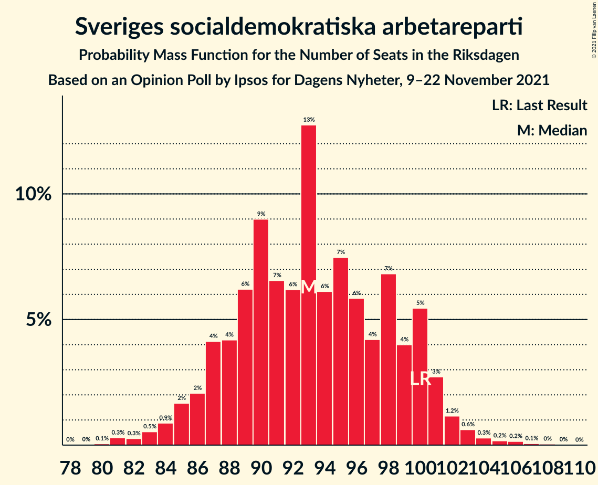
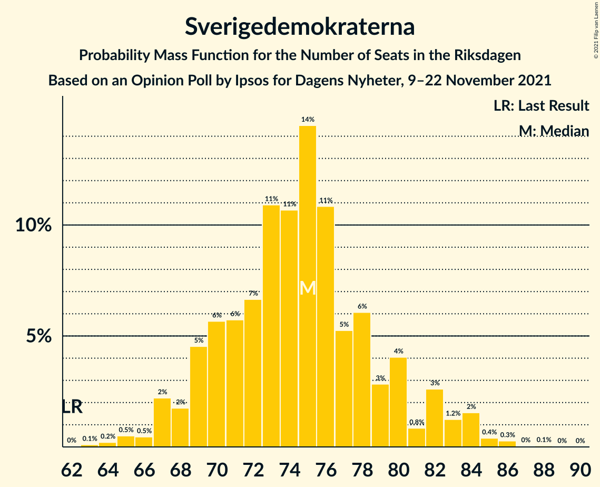
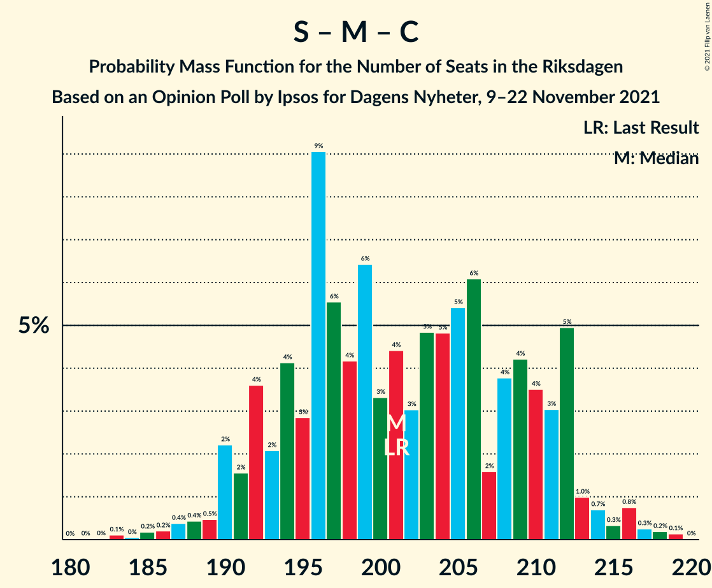
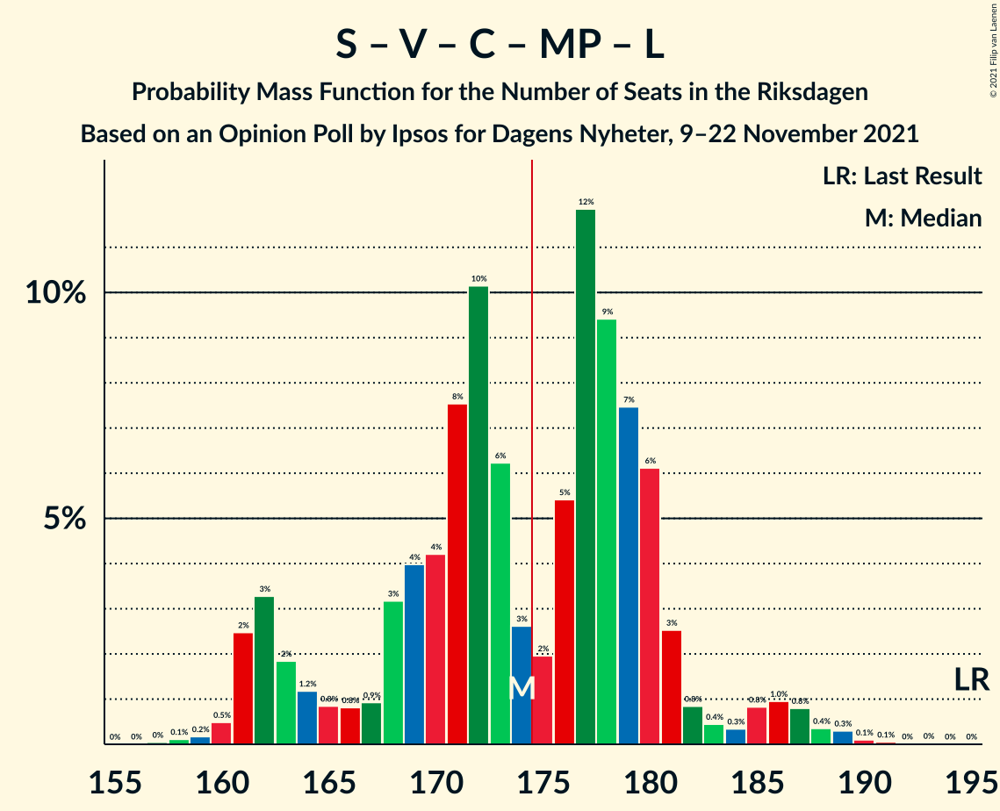
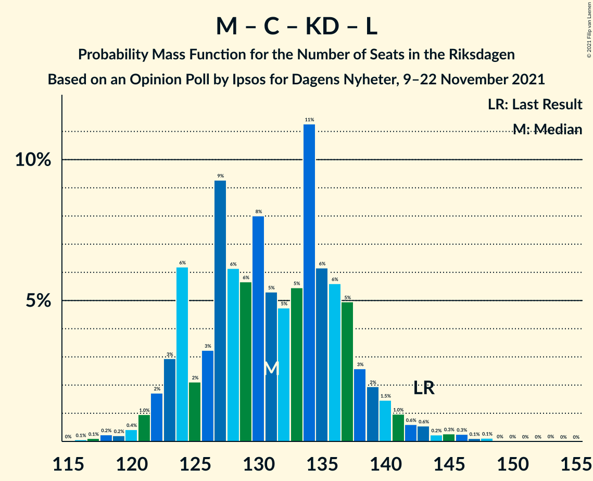

# Opinion Poll by Ipsos for Dagens Nyheter, 9–22 November 2021

<a href="#voting-intentions">Voting Intentions</a> | <a href="#seats">Seats</a> | <a href="#coalitions">Coalitions</a> | <a href="#technical-information">Technical Information</a>

## Voting Intentions

### Confidence Intervals

| Party | Last Result | Poll Result | 80% Confidence Interval | 90% Confidence Interval | 95% Confidence Interval | 99% Confidence Interval |
|:-----:|:-----------:|:-----------:|:-----------------------:|:-----------------------:|:-----------------------:|:-----------------------:|
| Sveriges socialdemokratiska arbetareparti | 28.3% | 25.2% | 23.9–26.7% |23.5–27.1% |23.2–27.4% |22.5–28.1% |
| Moderata samlingspartiet | 19.8% | 21.2% | 19.9–22.5% |19.6–22.9% |19.3–23.3% |18.7–23.9% |
| Sverigedemokraterna | 17.5% | 20.2% | 18.9–21.5% |18.6–21.9% |18.3–22.2% |17.7–22.9% |
| Vänsterpartiet | 8.0% | 11.1% | 10.1–12.2% |9.9–12.5% |9.6–12.7% |9.2–13.3% |
| Centerpartiet | 8.6% | 8.1% | 7.3–9.0% |7.1–9.3% |6.9–9.5% |6.5–10.0% |
| Kristdemokraterna | 6.3% | 6.0% | 5.3–6.9% |5.1–7.1% |5.0–7.3% |4.7–7.7% |
| Miljöpartiet de gröna | 4.4% | 4.0% | 3.5–4.8% |3.3–5.0% |3.2–5.1% |2.9–5.5% |
| Liberalerna | 5.5% | 3.1% | 2.6–3.7% |2.4–3.9% |2.3–4.0% |2.1–4.3% |

*Note:* The poll result column reflects the actual value used in the calculations. Published results may vary slightly, and in addition be rounded to fewer digits.

## Seats

### Confidence Intervals

| Party | Last Result | Median | 80% Confidence Interval | 90% Confidence Interval | 95% Confidence Interval | 99% Confidence Interval |
|:-----:|:-----------:|:------:|:-----------------------:|:-----------------------:|:-----------------------:|:-----------------------:|
| <a href="#sveriges-socialdemokratiska-arbetareparti">Sveriges socialdemokratiska arbetareparti</a> | 100 | 93 | 88–100 |86–101 |85–102 |82–104 |
| <a href="#moderata-samlingspartiet">Moderata samlingspartiet</a> | 70 | 78 | 73–83 |72–85 |71–86 |69–88 |
| <a href="#sverigedemokraterna">Sverigedemokraterna</a> | 62 | 75 | 70–80 |68–82 |67–83 |65–85 |
| <a href="#vänsterpartiet">Vänsterpartiet</a> | 28 | 41 | 38–44 |37–45 |36–46 |35–49 |
| <a href="#centerpartiet">Centerpartiet</a> | 31 | 30 | 27–33 |26–34 |25–35 |24–37 |
| <a href="#kristdemokraterna">Kristdemokraterna</a> | 22 | 22 | 20–25 |19–26 |19–27 |17–28 |
| <a href="#miljöpartiet-de-gröna">Miljöpartiet de gröna</a> | 16 | 15 | 0–17 |0–18 |0–19 |0–20 |
| <a href="#liberalerna">Liberalerna</a> | 20 | 0 | 0 |0 |0–14 |0–16 |

### Sveriges socialdemokratiska arbetareparti

*For a full overview of the results for this party, see the [Sveriges socialdemokratiska arbetareparti](party-sverigessocialdemokratiskaarbetareparti.html) page.*

| Number of Seats | Probability | Accumulated | Special Marks |
|:---------------:|:-----------:|:-----------:|:-------------:|
| 80 | 0.1% | 100% |  |
| 81 | 0.3% | 99.9% |  |
| 82 | 0.3% | 99.6% |  |
| 83 | 0.5% | 99.3% |  |
| 84 | 0.9% | 98.8% |  |
| 85 | 2% | 98% |  |
| 86 | 2% | 96% |  |
| 87 | 4% | 94% |  |
| 88 | 4% | 90% |  |
| 89 | 6% | 86% |  |
| 90 | 9% | 80% |  |
| 91 | 7% | 71% |  |
| 92 | 6% | 64% |  |
| 93 | 13% | 58% | Median |
| 94 | 6% | 45% |  |
| 95 | 7% | 39% |  |
| 96 | 6% | 32% |  |
| 97 | 4% | 26% |  |
| 98 | 7% | 22% |  |
| 99 | 4% | 15% |  |
| 100 | 5% | 11% | Last Result |
| 101 | 3% | 5% |  |
| 102 | 1.2% | 3% |  |
| 103 | 0.6% | 1.4% |  |
| 104 | 0.3% | 0.8% |  |
| 105 | 0.2% | 0.5% |  |
| 106 | 0.2% | 0.3% |  |
| 107 | 0.1% | 0.1% |  |
| 108 | 0% | 0.1% |  |
| 109 | 0% | 0% |  |

### Moderata samlingspartiet

*For a full overview of the results for this party, see the [Moderata samlingspartiet](party-moderatasamlingspartiet.html) page.*

| Number of Seats | Probability | Accumulated | Special Marks |
|:---------------:|:-----------:|:-----------:|:-------------:|
| 66 | 0.1% | 100% |  |
| 67 | 0.2% | 99.9% |  |
| 68 | 0.2% | 99.8% |  |
| 69 | 0.6% | 99.6% |  |
| 70 | 1.2% | 99.0% | Last Result |
| 71 | 1.3% | 98% |  |
| 72 | 3% | 96% |  |
| 73 | 5% | 94% |  |
| 74 | 6% | 89% |  |
| 75 | 8% | 83% |  |
| 76 | 9% | 75% |  |
| 77 | 11% | 66% |  |
| 78 | 12% | 55% | Median |
| 79 | 8% | 43% |  |
| 80 | 7% | 35% |  |
| 81 | 9% | 28% |  |
| 82 | 8% | 19% |  |
| 83 | 3% | 11% |  |
| 84 | 3% | 8% |  |
| 85 | 2% | 5% |  |
| 86 | 1.5% | 3% |  |
| 87 | 0.5% | 1.3% |  |
| 88 | 0.3% | 0.8% |  |
| 89 | 0.2% | 0.5% |  |
| 90 | 0.1% | 0.3% |  |
| 91 | 0.1% | 0.2% |  |
| 92 | 0% | 0.1% |  |
| 93 | 0% | 0% |  |

### Sverigedemokraterna

*For a full overview of the results for this party, see the [Sverigedemokraterna](party-sverigedemokraterna.html) page.*

| Number of Seats | Probability | Accumulated | Special Marks |
|:---------------:|:-----------:|:-----------:|:-------------:|
| 62 | 0% | 100% | Last Result |
| 63 | 0.1% | 100% |  |
| 64 | 0.2% | 99.8% |  |
| 65 | 0.5% | 99.6% |  |
| 66 | 0.5% | 99.1% |  |
| 67 | 2% | 98.7% |  |
| 68 | 2% | 96% |  |
| 69 | 5% | 95% |  |
| 70 | 6% | 90% |  |
| 71 | 6% | 85% |  |
| 72 | 7% | 79% |  |
| 73 | 11% | 72% |  |
| 74 | 11% | 61% |  |
| 75 | 14% | 51% | Median |
| 76 | 11% | 36% |  |
| 77 | 5% | 25% |  |
| 78 | 6% | 20% |  |
| 79 | 3% | 14% |  |
| 80 | 4% | 11% |  |
| 81 | 0.8% | 7% |  |
| 82 | 3% | 6% |  |
| 83 | 1.2% | 4% |  |
| 84 | 2% | 2% |  |
| 85 | 0.4% | 0.8% |  |
| 86 | 0.3% | 0.4% |  |
| 87 | 0% | 0.1% |  |
| 88 | 0.1% | 0.1% |  |
| 89 | 0% | 0% |  |

### Vänsterpartiet

*For a full overview of the results for this party, see the [Vänsterpartiet](party-vänsterpartiet.html) page.*

| Number of Seats | Probability | Accumulated | Special Marks |
|:---------------:|:-----------:|:-----------:|:-------------:|
| 28 | 0% | 100% | Last Result |
| 29 | 0% | 100% |  |
| 30 | 0% | 100% |  |
| 31 | 0% | 100% |  |
| 32 | 0% | 100% |  |
| 33 | 0.2% | 99.9% |  |
| 34 | 0.2% | 99.7% |  |
| 35 | 0.9% | 99.5% |  |
| 36 | 1.2% | 98.6% |  |
| 37 | 5% | 97% |  |
| 38 | 5% | 93% |  |
| 39 | 13% | 87% |  |
| 40 | 14% | 74% |  |
| 41 | 16% | 60% | Median |
| 42 | 18% | 44% |  |
| 43 | 14% | 25% |  |
| 44 | 5% | 11% |  |
| 45 | 3% | 6% |  |
| 46 | 2% | 3% |  |
| 47 | 0.4% | 1.3% |  |
| 48 | 0.4% | 1.0% |  |
| 49 | 0.1% | 0.5% |  |
| 50 | 0.2% | 0.4% |  |
| 51 | 0.1% | 0.2% |  |
| 52 | 0.1% | 0.1% |  |
| 53 | 0% | 0% |  |

### Centerpartiet

*For a full overview of the results for this party, see the [Centerpartiet](party-centerpartiet.html) page.*

| Number of Seats | Probability | Accumulated | Special Marks |
|:---------------:|:-----------:|:-----------:|:-------------:|
| 22 | 0% | 100% |  |
| 23 | 0.3% | 99.9% |  |
| 24 | 0.4% | 99.6% |  |
| 25 | 2% | 99.2% |  |
| 26 | 4% | 97% |  |
| 27 | 9% | 94% |  |
| 28 | 12% | 85% |  |
| 29 | 16% | 72% |  |
| 30 | 14% | 57% | Median |
| 31 | 14% | 43% | Last Result |
| 32 | 9% | 29% |  |
| 33 | 12% | 20% |  |
| 34 | 5% | 8% |  |
| 35 | 2% | 4% |  |
| 36 | 1.0% | 2% |  |
| 37 | 0.3% | 0.7% |  |
| 38 | 0.2% | 0.3% |  |
| 39 | 0.1% | 0.1% |  |
| 40 | 0% | 0% |  |

### Kristdemokraterna

*For a full overview of the results for this party, see the [Kristdemokraterna](party-kristdemokraterna.html) page.*

| Number of Seats | Probability | Accumulated | Special Marks |
|:---------------:|:-----------:|:-----------:|:-------------:|
| 16 | 0.1% | 100% |  |
| 17 | 0.5% | 99.9% |  |
| 18 | 2% | 99.4% |  |
| 19 | 6% | 98% |  |
| 20 | 10% | 91% |  |
| 21 | 16% | 82% |  |
| 22 | 17% | 66% | Last Result, Median |
| 23 | 20% | 50% |  |
| 24 | 14% | 30% |  |
| 25 | 9% | 16% |  |
| 26 | 4% | 7% |  |
| 27 | 2% | 3% |  |
| 28 | 0.7% | 1.2% |  |
| 29 | 0.3% | 0.5% |  |
| 30 | 0.1% | 0.2% |  |
| 31 | 0% | 0% |  |

### Miljöpartiet de gröna

*For a full overview of the results for this party, see the [Miljöpartiet de gröna](party-miljöpartietdegröna.html) page.*

| Number of Seats | Probability | Accumulated | Special Marks |
|:---------------:|:-----------:|:-----------:|:-------------:|
| 0 | 44% | 100% |  |
| 1 | 0% | 56% |  |
| 2 | 0% | 56% |  |
| 3 | 0% | 56% |  |
| 4 | 0% | 56% |  |
| 5 | 0% | 56% |  |
| 6 | 0% | 56% |  |
| 7 | 0% | 56% |  |
| 8 | 0% | 56% |  |
| 9 | 0% | 56% |  |
| 10 | 0% | 56% |  |
| 11 | 0% | 56% |  |
| 12 | 0% | 56% |  |
| 13 | 0% | 56% |  |
| 14 | 0.4% | 56% |  |
| 15 | 20% | 55% | Median |
| 16 | 19% | 36% | Last Result |
| 17 | 9% | 17% |  |
| 18 | 5% | 8% |  |
| 19 | 2% | 3% |  |
| 20 | 0.6% | 0.7% |  |
| 21 | 0.1% | 0.1% |  |
| 22 | 0% | 0% |  |

### Liberalerna

*For a full overview of the results for this party, see the [Liberalerna](party-liberalerna.html) page.*

| Number of Seats | Probability | Accumulated | Special Marks |
|:---------------:|:-----------:|:-----------:|:-------------:|
| 0 | 97% | 100% | Median |
| 1 | 0% | 3% |  |
| 2 | 0% | 3% |  |
| 3 | 0% | 3% |  |
| 4 | 0% | 3% |  |
| 5 | 0% | 3% |  |
| 6 | 0% | 3% |  |
| 7 | 0% | 3% |  |
| 8 | 0% | 3% |  |
| 9 | 0% | 3% |  |
| 10 | 0% | 3% |  |
| 11 | 0% | 3% |  |
| 12 | 0% | 3% |  |
| 13 | 0% | 3% |  |
| 14 | 0.9% | 3% |  |
| 15 | 2% | 2% |  |
| 16 | 0.4% | 0.5% |  |
| 17 | 0.1% | 0.1% |  |
| 18 | 0% | 0% |  |
| 19 | 0% | 0% |  |
| 20 | 0% | 0% | Last Result |

## Coalitions

### Confidence Intervals

| Coalition | Last Result | Median | Majority? | 80% Confidence Interval | 90% Confidence Interval | 95% Confidence Interval | 99% Confidence Interval |
|:---------:|:-----------:|:------:|:---------:|:-----------------------:|:-----------------------:|:-----------------------:|:-----------------------:|
| Sveriges socialdemokratiska arbetareparti – Moderata samlingspartiet – Centerpartiet | 201 | 201 | 100% | 193–211 | 191–212 | 190–213 | 186–217 |
| Moderata samlingspartiet – Sverigedemokraterna – Kristdemokraterna | 154 | 175 | 50% | 169–184 | 167–187 | 163–188 | 160–189 |
| Sveriges socialdemokratiska arbetareparti – Vänsterpartiet – Centerpartiet – Miljöpartiet de gröna – Liberalerna | 195 | 174 | 50% | 165–180 | 162–182 | 161–186 | 160–189 |
| Sveriges socialdemokratiska arbetareparti – Moderata samlingspartiet | 170 | 171 | 31% | 163–179 | 162–181 | 160–183 | 157–187 |
| Moderata samlingspartiet – Sverigedemokraterna | 132 | 152 | 0% | 146–161 | 145–164 | 143–165 | 139–167 |
| Sveriges socialdemokratiska arbetareparti – Vänsterpartiet – Miljöpartiet de gröna | 144 | 143 | 0% | 134–150 | 132–152 | 130–154 | 128–159 |
| Sveriges socialdemokratiska arbetareparti – Centerpartiet – Miljöpartiet de gröna – Liberalerna | 167 | 133 | 0% | 124–139 | 122–141 | 121–145 | 119–148 |
| Sveriges socialdemokratiska arbetareparti – Vänsterpartiet | 128 | 134 | 0% | 127–142 | 125–143 | 124–143 | 121–148 |
| Moderata samlingspartiet – Centerpartiet – Kristdemokraterna – Liberalerna | 143 | 131 | 0% | 124–137 | 123–139 | 122–141 | 119–146 |
| Moderata samlingspartiet – Centerpartiet – Kristdemokraterna | 123 | 131 | 0% | 124–137 | 123–139 | 121–140 | 118–144 |
| Moderata samlingspartiet – Centerpartiet – Liberalerna | 121 | 108 | 0% | 103–115 | 101–117 | 100–118 | 97–123 |
| Moderata samlingspartiet – Centerpartiet | 101 | 108 | 0% | 102–114 | 101–116 | 99–118 | 96–121 |
| Sveriges socialdemokratiska arbetareparti – Miljöpartiet de gröna | 116 | 103 | 0% | 93–110 | 92–111 | 90–113 | 87–116 |

### Sveriges socialdemokratiska arbetareparti – Moderata samlingspartiet – Centerpartiet

| Number of Seats | Probability | Accumulated | Special Marks |
|:---------------:|:-----------:|:-----------:|:-------------:|
| 182 | 0% | 100% |  |
| 183 | 0.1% | 99.9% |  |
| 184 | 0% | 99.8% |  |
| 185 | 0.2% | 99.8% |  |
| 186 | 0.2% | 99.6% |  |
| 187 | 0.4% | 99.4% |  |
| 188 | 0.4% | 99.0% |  |
| 189 | 0.5% | 98.6% |  |
| 190 | 2% | 98% |  |
| 191 | 2% | 96% |  |
| 192 | 4% | 94% |  |
| 193 | 2% | 91% |  |
| 194 | 4% | 89% |  |
| 195 | 3% | 85% |  |
| 196 | 9% | 82% |  |
| 197 | 6% | 73% |  |
| 198 | 4% | 67% |  |
| 199 | 6% | 63% |  |
| 200 | 3% | 56% |  |
| 201 | 4% | 53% | Last Result, Median |
| 202 | 3% | 49% |  |
| 203 | 5% | 46% |  |
| 204 | 5% | 41% |  |
| 205 | 5% | 36% |  |
| 206 | 6% | 31% |  |
| 207 | 2% | 24% |  |
| 208 | 4% | 23% |  |
| 209 | 4% | 19% |  |
| 210 | 4% | 15% |  |
| 211 | 3% | 11% |  |
| 212 | 5% | 8% |  |
| 213 | 1.0% | 3% |  |
| 214 | 0.7% | 2% |  |
| 215 | 0.3% | 2% |  |
| 216 | 0.8% | 1.4% |  |
| 217 | 0.3% | 0.6% |  |
| 218 | 0.2% | 0.4% |  |
| 219 | 0.1% | 0.2% |  |
| 220 | 0% | 0% |  |

### Moderata samlingspartiet – Sverigedemokraterna – Kristdemokraterna

| Number of Seats | Probability | Accumulated | Special Marks |
|:---------------:|:-----------:|:-----------:|:-------------:|
| 154 | 0% | 100% | Last Result |
| 155 | 0% | 100% |  |
| 156 | 0% | 100% |  |
| 157 | 0% | 99.9% |  |
| 158 | 0.1% | 99.9% |  |
| 159 | 0.1% | 99.9% |  |
| 160 | 0.3% | 99.8% |  |
| 161 | 0.4% | 99.5% |  |
| 162 | 0.8% | 99.1% |  |
| 163 | 1.0% | 98% |  |
| 164 | 0.8% | 97% |  |
| 165 | 0.3% | 97% |  |
| 166 | 0.4% | 96% |  |
| 167 | 0.8% | 96% |  |
| 168 | 3% | 95% |  |
| 169 | 6% | 92% |  |
| 170 | 7% | 86% |  |
| 171 | 9% | 79% |  |
| 172 | 12% | 69% |  |
| 173 | 5% | 58% |  |
| 174 | 2% | 52% |  |
| 175 | 3% | 50% | Median, Majority |
| 176 | 6% | 48% |  |
| 177 | 10% | 41% |  |
| 178 | 8% | 31% |  |
| 179 | 4% | 24% |  |
| 180 | 4% | 19% |  |
| 181 | 3% | 15% |  |
| 182 | 0.9% | 12% |  |
| 183 | 0.8% | 11% |  |
| 184 | 0.8% | 10% |  |
| 185 | 1.2% | 10% |  |
| 186 | 2% | 8% |  |
| 187 | 3% | 7% |  |
| 188 | 2% | 3% |  |
| 189 | 0.5% | 0.9% |  |
| 190 | 0.2% | 0.4% |  |
| 191 | 0.1% | 0.2% |  |
| 192 | 0% | 0.1% |  |
| 193 | 0% | 0% |  |

### Sveriges socialdemokratiska arbetareparti – Vänsterpartiet – Centerpartiet – Miljöpartiet de gröna – Liberalerna

| Number of Seats | Probability | Accumulated | Special Marks |
|:---------------:|:-----------:|:-----------:|:-------------:|
| 157 | 0% | 100% |  |
| 158 | 0.1% | 99.9% |  |
| 159 | 0.2% | 99.8% |  |
| 160 | 0.5% | 99.6% |  |
| 161 | 2% | 99.1% |  |
| 162 | 3% | 97% |  |
| 163 | 2% | 93% |  |
| 164 | 1.2% | 92% |  |
| 165 | 0.8% | 90% |  |
| 166 | 0.8% | 90% |  |
| 167 | 0.9% | 89% |  |
| 168 | 3% | 88% |  |
| 169 | 4% | 85% |  |
| 170 | 4% | 81% |  |
| 171 | 8% | 76% |  |
| 172 | 10% | 69% |  |
| 173 | 6% | 59% |  |
| 174 | 3% | 52% |  |
| 175 | 2% | 50% | Majority |
| 176 | 5% | 48% |  |
| 177 | 12% | 42% |  |
| 178 | 9% | 31% |  |
| 179 | 7% | 21% | Median |
| 180 | 6% | 14% |  |
| 181 | 3% | 8% |  |
| 182 | 0.8% | 5% |  |
| 183 | 0.4% | 4% |  |
| 184 | 0.3% | 4% |  |
| 185 | 0.8% | 3% |  |
| 186 | 1.0% | 3% |  |
| 187 | 0.8% | 2% |  |
| 188 | 0.4% | 0.9% |  |
| 189 | 0.3% | 0.5% |  |
| 190 | 0.1% | 0.2% |  |
| 191 | 0.1% | 0.1% |  |
| 192 | 0% | 0.1% |  |
| 193 | 0% | 0.1% |  |
| 194 | 0% | 0% |  |
| 195 | 0% | 0% | Last Result |

### Sveriges socialdemokratiska arbetareparti – Moderata samlingspartiet

| Number of Seats | Probability | Accumulated | Special Marks |
|:---------------:|:-----------:|:-----------:|:-------------:|
| 153 | 0% | 100% |  |
| 154 | 0.1% | 99.9% |  |
| 155 | 0.1% | 99.8% |  |
| 156 | 0.1% | 99.8% |  |
| 157 | 0.3% | 99.7% |  |
| 158 | 0.6% | 99.4% |  |
| 159 | 0.8% | 98.8% |  |
| 160 | 1.5% | 98% |  |
| 161 | 0.8% | 97% |  |
| 162 | 3% | 96% |  |
| 163 | 4% | 93% |  |
| 164 | 3% | 89% |  |
| 165 | 3% | 85% |  |
| 166 | 2% | 83% |  |
| 167 | 7% | 81% |  |
| 168 | 7% | 74% |  |
| 169 | 9% | 66% |  |
| 170 | 3% | 57% | Last Result |
| 171 | 5% | 54% | Median |
| 172 | 6% | 49% |  |
| 173 | 7% | 43% |  |
| 174 | 5% | 36% |  |
| 175 | 5% | 31% | Majority |
| 176 | 2% | 26% |  |
| 177 | 3% | 24% |  |
| 178 | 6% | 21% |  |
| 179 | 6% | 15% |  |
| 180 | 2% | 9% |  |
| 181 | 2% | 7% |  |
| 182 | 1.2% | 5% |  |
| 183 | 1.3% | 3% |  |
| 184 | 1.0% | 2% |  |
| 185 | 0.3% | 1.1% |  |
| 186 | 0.1% | 0.7% |  |
| 187 | 0.4% | 0.7% |  |
| 188 | 0.2% | 0.3% |  |
| 189 | 0% | 0.1% |  |
| 190 | 0% | 0.1% |  |
| 191 | 0% | 0% |  |

### Moderata samlingspartiet – Sverigedemokraterna

| Number of Seats | Probability | Accumulated | Special Marks |
|:---------------:|:-----------:|:-----------:|:-------------:|
| 132 | 0% | 100% | Last Result |
| 133 | 0% | 100% |  |
| 134 | 0% | 100% |  |
| 135 | 0% | 100% |  |
| 136 | 0.1% | 99.9% |  |
| 137 | 0.1% | 99.9% |  |
| 138 | 0.2% | 99.7% |  |
| 139 | 0.5% | 99.6% |  |
| 140 | 0.3% | 99.0% |  |
| 141 | 0.4% | 98.7% |  |
| 142 | 0.6% | 98% |  |
| 143 | 1.3% | 98% |  |
| 144 | 1.3% | 96% |  |
| 145 | 2% | 95% |  |
| 146 | 5% | 93% |  |
| 147 | 3% | 88% |  |
| 148 | 5% | 85% |  |
| 149 | 10% | 80% |  |
| 150 | 11% | 70% |  |
| 151 | 7% | 60% |  |
| 152 | 6% | 53% |  |
| 153 | 6% | 46% | Median |
| 154 | 8% | 40% |  |
| 155 | 5% | 32% |  |
| 156 | 6% | 27% |  |
| 157 | 4% | 21% |  |
| 158 | 2% | 17% |  |
| 159 | 3% | 14% |  |
| 160 | 1.4% | 12% |  |
| 161 | 1.0% | 10% |  |
| 162 | 2% | 9% |  |
| 163 | 1.2% | 7% |  |
| 164 | 3% | 6% |  |
| 165 | 1.4% | 3% |  |
| 166 | 0.8% | 2% |  |
| 167 | 0.5% | 0.8% |  |
| 168 | 0.2% | 0.3% |  |
| 169 | 0% | 0.1% |  |
| 170 | 0% | 0.1% |  |
| 171 | 0% | 0% |  |

### Sveriges socialdemokratiska arbetareparti – Vänsterpartiet – Miljöpartiet de gröna

| Number of Seats | Probability | Accumulated | Special Marks |
|:---------------:|:-----------:|:-----------:|:-------------:|
| 123 | 0% | 100% |  |
| 124 | 0% | 99.9% |  |
| 125 | 0% | 99.9% |  |
| 126 | 0.1% | 99.9% |  |
| 127 | 0.2% | 99.8% |  |
| 128 | 0.4% | 99.6% |  |
| 129 | 0.3% | 99.1% |  |
| 130 | 2% | 98.8% |  |
| 131 | 2% | 97% |  |
| 132 | 2% | 95% |  |
| 133 | 3% | 93% |  |
| 134 | 1.2% | 90% |  |
| 135 | 1.0% | 89% |  |
| 136 | 1.0% | 88% |  |
| 137 | 2% | 87% |  |
| 138 | 4% | 85% |  |
| 139 | 13% | 82% |  |
| 140 | 4% | 69% |  |
| 141 | 6% | 65% |  |
| 142 | 6% | 59% |  |
| 143 | 4% | 53% |  |
| 144 | 3% | 49% | Last Result |
| 145 | 3% | 46% |  |
| 146 | 4% | 43% |  |
| 147 | 5% | 39% |  |
| 148 | 8% | 35% |  |
| 149 | 5% | 26% | Median |
| 150 | 12% | 21% |  |
| 151 | 3% | 9% |  |
| 152 | 3% | 6% |  |
| 153 | 0.8% | 3% |  |
| 154 | 0.3% | 3% |  |
| 155 | 0.3% | 2% |  |
| 156 | 0.5% | 2% |  |
| 157 | 0.4% | 1.4% |  |
| 158 | 0.4% | 1.0% |  |
| 159 | 0.4% | 0.6% |  |
| 160 | 0.1% | 0.2% |  |
| 161 | 0.1% | 0.1% |  |
| 162 | 0% | 0% |  |

### Sveriges socialdemokratiska arbetareparti – Centerpartiet – Miljöpartiet de gröna – Liberalerna

| Number of Seats | Probability | Accumulated | Special Marks |
|:---------------:|:-----------:|:-----------:|:-------------:|
| 113 | 0.1% | 100% |  |
| 114 | 0% | 99.9% |  |
| 115 | 0% | 99.9% |  |
| 116 | 0.1% | 99.8% |  |
| 117 | 0.1% | 99.8% |  |
| 118 | 0.1% | 99.7% |  |
| 119 | 0.3% | 99.6% |  |
| 120 | 0.9% | 99.3% |  |
| 121 | 1.4% | 98% |  |
| 122 | 4% | 97% |  |
| 123 | 1.1% | 93% |  |
| 124 | 2% | 92% |  |
| 125 | 1.0% | 89% |  |
| 126 | 1.0% | 88% |  |
| 127 | 4% | 87% |  |
| 128 | 2% | 83% |  |
| 129 | 8% | 81% |  |
| 130 | 10% | 73% |  |
| 131 | 7% | 63% |  |
| 132 | 5% | 56% |  |
| 133 | 2% | 51% |  |
| 134 | 2% | 49% |  |
| 135 | 7% | 48% |  |
| 136 | 8% | 41% |  |
| 137 | 10% | 32% |  |
| 138 | 8% | 22% | Median |
| 139 | 4% | 14% |  |
| 140 | 3% | 10% |  |
| 141 | 2% | 6% |  |
| 142 | 0.6% | 5% |  |
| 143 | 0.7% | 4% |  |
| 144 | 0.6% | 3% |  |
| 145 | 1.0% | 3% |  |
| 146 | 0.9% | 2% |  |
| 147 | 0.3% | 0.8% |  |
| 148 | 0.3% | 0.5% |  |
| 149 | 0.1% | 0.2% |  |
| 150 | 0% | 0.1% |  |
| 151 | 0% | 0.1% |  |
| 152 | 0% | 0.1% |  |
| 153 | 0% | 0% |  |
| 154 | 0% | 0% |  |
| 155 | 0% | 0% |  |
| 156 | 0% | 0% |  |
| 157 | 0% | 0% |  |
| 158 | 0% | 0% |  |
| 159 | 0% | 0% |  |
| 160 | 0% | 0% |  |
| 161 | 0% | 0% |  |
| 162 | 0% | 0% |  |
| 163 | 0% | 0% |  |
| 164 | 0% | 0% |  |
| 165 | 0% | 0% |  |
| 166 | 0% | 0% |  |
| 167 | 0% | 0% | Last Result |

### Sveriges socialdemokratiska arbetareparti – Vänsterpartiet

| Number of Seats | Probability | Accumulated | Special Marks |
|:---------------:|:-----------:|:-----------:|:-------------:|
| 118 | 0.1% | 100% |  |
| 119 | 0.1% | 99.9% |  |
| 120 | 0.1% | 99.8% |  |
| 121 | 0.4% | 99.7% |  |
| 122 | 0.9% | 99.3% |  |
| 123 | 0.7% | 98% |  |
| 124 | 3% | 98% |  |
| 125 | 2% | 95% |  |
| 126 | 1.3% | 93% |  |
| 127 | 2% | 92% |  |
| 128 | 2% | 90% | Last Result |
| 129 | 3% | 88% |  |
| 130 | 8% | 85% |  |
| 131 | 6% | 78% |  |
| 132 | 12% | 72% |  |
| 133 | 8% | 60% |  |
| 134 | 5% | 51% | Median |
| 135 | 9% | 46% |  |
| 136 | 3% | 37% |  |
| 137 | 3% | 35% |  |
| 138 | 3% | 32% |  |
| 139 | 11% | 29% |  |
| 140 | 2% | 18% |  |
| 141 | 5% | 16% |  |
| 142 | 5% | 11% |  |
| 143 | 4% | 6% |  |
| 144 | 0.8% | 2% |  |
| 145 | 0.5% | 1.4% |  |
| 146 | 0.1% | 0.9% |  |
| 147 | 0.1% | 0.8% |  |
| 148 | 0.2% | 0.6% |  |
| 149 | 0.2% | 0.5% |  |
| 150 | 0.2% | 0.3% |  |
| 151 | 0% | 0.1% |  |
| 152 | 0% | 0.1% |  |
| 153 | 0% | 0% |  |

### Moderata samlingspartiet – Centerpartiet – Kristdemokraterna – Liberalerna

| Number of Seats | Probability | Accumulated | Special Marks |
|:---------------:|:-----------:|:-----------:|:-------------:|
| 116 | 0.1% | 100% |  |
| 117 | 0.1% | 99.9% |  |
| 118 | 0.2% | 99.8% |  |
| 119 | 0.2% | 99.6% |  |
| 120 | 0.4% | 99.3% |  |
| 121 | 1.0% | 98.9% |  |
| 122 | 2% | 98% |  |
| 123 | 3% | 96% |  |
| 124 | 6% | 93% |  |
| 125 | 2% | 87% |  |
| 126 | 3% | 85% |  |
| 127 | 9% | 82% |  |
| 128 | 6% | 72% |  |
| 129 | 6% | 66% |  |
| 130 | 8% | 61% | Median |
| 131 | 5% | 53% |  |
| 132 | 5% | 47% |  |
| 133 | 5% | 43% |  |
| 134 | 11% | 37% |  |
| 135 | 6% | 26% |  |
| 136 | 6% | 20% |  |
| 137 | 5% | 14% |  |
| 138 | 3% | 9% |  |
| 139 | 2% | 7% |  |
| 140 | 1.5% | 5% |  |
| 141 | 1.0% | 3% |  |
| 142 | 0.6% | 2% |  |
| 143 | 0.6% | 2% | Last Result |
| 144 | 0.2% | 1.1% |  |
| 145 | 0.3% | 0.8% |  |
| 146 | 0.3% | 0.6% |  |
| 147 | 0.1% | 0.3% |  |
| 148 | 0.1% | 0.2% |  |
| 149 | 0% | 0.1% |  |
| 150 | 0% | 0.1% |  |
| 151 | 0% | 0.1% |  |
| 152 | 0% | 0% |  |

### Moderata samlingspartiet – Centerpartiet – Kristdemokraterna

| Number of Seats | Probability | Accumulated | Special Marks |
|:---------------:|:-----------:|:-----------:|:-------------:|
| 115 | 0% | 100% |  |
| 116 | 0.1% | 99.9% |  |
| 117 | 0.1% | 99.8% |  |
| 118 | 0.3% | 99.7% |  |
| 119 | 0.3% | 99.4% |  |
| 120 | 0.5% | 99.1% |  |
| 121 | 1.4% | 98.6% |  |
| 122 | 2% | 97% |  |
| 123 | 4% | 95% | Last Result |
| 124 | 6% | 92% |  |
| 125 | 2% | 85% |  |
| 126 | 3% | 83% |  |
| 127 | 9% | 80% |  |
| 128 | 6% | 70% |  |
| 129 | 6% | 64% |  |
| 130 | 8% | 58% | Median |
| 131 | 5% | 50% |  |
| 132 | 5% | 45% |  |
| 133 | 6% | 40% |  |
| 134 | 11% | 34% |  |
| 135 | 6% | 23% |  |
| 136 | 5% | 17% |  |
| 137 | 4% | 12% |  |
| 138 | 2% | 8% |  |
| 139 | 2% | 5% |  |
| 140 | 1.2% | 3% |  |
| 141 | 0.9% | 2% |  |
| 142 | 0.5% | 1.3% |  |
| 143 | 0.3% | 0.8% |  |
| 144 | 0.2% | 0.5% |  |
| 145 | 0.1% | 0.4% |  |
| 146 | 0.1% | 0.2% |  |
| 147 | 0.1% | 0.1% |  |
| 148 | 0% | 0% |  |

### Moderata samlingspartiet – Centerpartiet – Liberalerna

| Number of Seats | Probability | Accumulated | Special Marks |
|:---------------:|:-----------:|:-----------:|:-------------:|
| 94 | 0.1% | 100% |  |
| 95 | 0.2% | 99.9% |  |
| 96 | 0.2% | 99.8% |  |
| 97 | 0.3% | 99.6% |  |
| 98 | 0.6% | 99.2% |  |
| 99 | 1.1% | 98.7% |  |
| 100 | 1.4% | 98% |  |
| 101 | 3% | 96% |  |
| 102 | 3% | 93% |  |
| 103 | 5% | 90% |  |
| 104 | 6% | 85% |  |
| 105 | 7% | 79% |  |
| 106 | 9% | 72% |  |
| 107 | 5% | 63% |  |
| 108 | 9% | 58% | Median |
| 109 | 6% | 49% |  |
| 110 | 8% | 44% |  |
| 111 | 7% | 36% |  |
| 112 | 6% | 28% |  |
| 113 | 5% | 22% |  |
| 114 | 6% | 17% |  |
| 115 | 2% | 11% |  |
| 116 | 3% | 8% |  |
| 117 | 2% | 6% |  |
| 118 | 2% | 4% |  |
| 119 | 0.6% | 2% |  |
| 120 | 0.6% | 2% |  |
| 121 | 0.3% | 1.2% | Last Result |
| 122 | 0.2% | 0.9% |  |
| 123 | 0.2% | 0.7% |  |
| 124 | 0.1% | 0.4% |  |
| 125 | 0.1% | 0.3% |  |
| 126 | 0.1% | 0.2% |  |
| 127 | 0% | 0.1% |  |
| 128 | 0% | 0.1% |  |
| 129 | 0% | 0.1% |  |
| 130 | 0% | 0% |  |

### Moderata samlingspartiet – Centerpartiet

| Number of Seats | Probability | Accumulated | Special Marks |
|:---------------:|:-----------:|:-----------:|:-------------:|
| 94 | 0.1% | 100% |  |
| 95 | 0.2% | 99.9% |  |
| 96 | 0.2% | 99.7% |  |
| 97 | 0.4% | 99.5% |  |
| 98 | 0.8% | 99.1% |  |
| 99 | 1.2% | 98% |  |
| 100 | 2% | 97% |  |
| 101 | 3% | 96% | Last Result |
| 102 | 3% | 92% |  |
| 103 | 6% | 89% |  |
| 104 | 6% | 83% |  |
| 105 | 7% | 77% |  |
| 106 | 9% | 70% |  |
| 107 | 5% | 61% |  |
| 108 | 9% | 56% | Median |
| 109 | 6% | 47% |  |
| 110 | 8% | 41% |  |
| 111 | 7% | 33% |  |
| 112 | 6% | 26% |  |
| 113 | 5% | 20% |  |
| 114 | 6% | 15% |  |
| 115 | 2% | 8% |  |
| 116 | 3% | 6% |  |
| 117 | 0.8% | 3% |  |
| 118 | 1.2% | 3% |  |
| 119 | 0.5% | 1.3% |  |
| 120 | 0.3% | 0.8% |  |
| 121 | 0.3% | 0.5% |  |
| 122 | 0.1% | 0.3% |  |
| 123 | 0.1% | 0.1% |  |
| 124 | 0.1% | 0.1% |  |
| 125 | 0% | 0% |  |

### Sveriges socialdemokratiska arbetareparti – Miljöpartiet de gröna

| Number of Seats | Probability | Accumulated | Special Marks |
|:---------------:|:-----------:|:-----------:|:-------------:|
| 84 | 0% | 100% |  |
| 85 | 0.1% | 99.9% |  |
| 86 | 0.1% | 99.8% |  |
| 87 | 0.4% | 99.7% |  |
| 88 | 0.5% | 99.3% |  |
| 89 | 1.1% | 98.8% |  |
| 90 | 0.8% | 98% |  |
| 91 | 2% | 97% |  |
| 92 | 3% | 95% |  |
| 93 | 3% | 93% |  |
| 94 | 2% | 90% |  |
| 95 | 4% | 87% |  |
| 96 | 4% | 83% |  |
| 97 | 4% | 79% |  |
| 98 | 7% | 75% |  |
| 99 | 4% | 69% |  |
| 100 | 6% | 65% |  |
| 101 | 4% | 58% |  |
| 102 | 4% | 55% |  |
| 103 | 3% | 51% |  |
| 104 | 3% | 47% |  |
| 105 | 6% | 44% |  |
| 106 | 6% | 39% |  |
| 107 | 5% | 33% |  |
| 108 | 7% | 27% | Median |
| 109 | 8% | 20% |  |
| 110 | 4% | 13% |  |
| 111 | 5% | 9% |  |
| 112 | 2% | 4% |  |
| 113 | 0.8% | 3% |  |
| 114 | 0.5% | 2% |  |
| 115 | 0.6% | 1.4% |  |
| 116 | 0.3% | 0.7% | Last Result |
| 117 | 0.3% | 0.4% |  |
| 118 | 0.1% | 0.2% |  |
| 119 | 0% | 0.1% |  |
| 120 | 0% | 0% |  |

## Technical Information

### Opinion Poll

+ **Polling firm:** Ipsos
+ **Commissioner(s):** Dagens Nyheter
+ **Fieldwork period:** 9–22 November 2021

### Calculations

+ **Sample size:** 1605
+ **Simulations done:** 1,048,576
+ **Error estimate:** 1.11%

