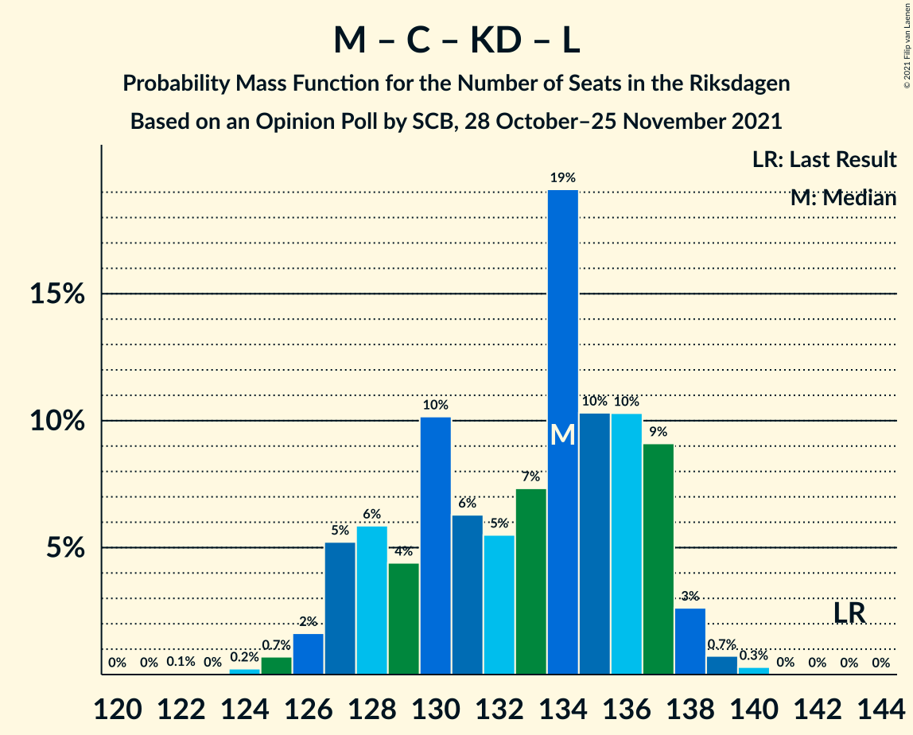

# Opinion Poll by SCB, 28 October–25 November 2021

<a href="#voting-intentions">Voting Intentions</a> | <a href="#seats">Seats</a> | <a href="#coalitions">Coalitions</a> | <a href="#technical-information">Technical Information</a>

## Voting Intentions

### Confidence Intervals

| Party | Last Result | Poll Result | 80% Confidence Interval | 90% Confidence Interval | 95% Confidence Interval | 99% Confidence Interval |
|:-----:|:-----------:|:-----------:|:-----------------------:|:-----------------------:|:-----------------------:|:-----------------------:|
| Sveriges socialdemokratiska arbetareparti | 28.3% | 29.1% | 28.5–29.7% |28.3–29.9% |28.2–30.0% |27.9–30.3% |
| Moderata samlingspartiet | 19.8% | 22.7% | 22.1–23.3% |22.0–23.4% |21.8–23.6% |21.6–23.9% |
| Sverigedemokraterna | 17.5% | 18.6% | 18.1–19.1% |17.9–19.3% |17.8–19.4% |17.6–19.7% |
| Vänsterpartiet | 8.0% | 9.2% | 8.8–9.6% |8.7–9.7% |8.6–9.8% |8.4–10.0% |
| Centerpartiet | 8.6% | 8.4% | 8.0–8.8% |7.9–8.9% |7.8–9.0% |7.7–9.2% |
| Kristdemokraterna | 6.3% | 4.6% | 4.3–4.9% |4.3–5.0% |4.2–5.1% |4.1–5.2% |
| Miljöpartiet de gröna | 4.4% | 3.9% | 3.6–4.2% |3.6–4.3% |3.5–4.3% |3.4–4.5% |
| Liberalerna | 5.5% | 2.5% | 2.3–2.7% |2.2–2.8% |2.2–2.9% |2.1–3.0% |

*Note:* The poll result column reflects the actual value used in the calculations. Published results may vary slightly, and in addition be rounded to fewer digits.

## Seats

### Confidence Intervals

| Party | Last Result | Median | 80% Confidence Interval | 90% Confidence Interval | 95% Confidence Interval | 99% Confidence Interval |
|:-----:|:-----------:|:------:|:-----------------------:|:-----------------------:|:-----------------------:|:-----------------------:|
| <a href="#sveriges-socialdemokratiska-arbetareparti">Sveriges socialdemokratiska arbetareparti</a> | 100 | 108 | 104–111 |104–112 |103–112 |102–114 |
| <a href="#moderata-samlingspartiet">Moderata samlingspartiet</a> | 70 | 85 | 81–87 |81–87 |80–88 |79–90 |
| <a href="#sverigedemokraterna">Sverigedemokraterna</a> | 62 | 70 | 66–72 |65–72 |65–73 |64–74 |
| <a href="#vänsterpartiet">Vänsterpartiet</a> | 28 | 34 | 32–36 |32–36 |31–37 |31–38 |
| <a href="#centerpartiet">Centerpartiet</a> | 31 | 31 | 30–33 |29–33 |29–34 |28–35 |
| <a href="#kristdemokraterna">Kristdemokraterna</a> | 22 | 17 | 16–18 |16–19 |15–19 |15–19 |
| <a href="#miljöpartiet-de-gröna">Miljöpartiet de gröna</a> | 16 | 0 | 0–15 |0–15 |0–16 |0–16 |
| <a href="#liberalerna">Liberalerna</a> | 20 | 0 | 0 |0 |0 |0 |

### Sveriges socialdemokratiska arbetareparti

*For a full overview of the results for this party, see the [Sveriges socialdemokratiska arbetareparti](party-sverigessocialdemokratiskaarbetareparti.html) page.*

| Number of Seats | Probability | Accumulated | Special Marks |
|:---------------:|:-----------:|:-----------:|:-------------:|
| 100 | 0.1% | 100% | Last Result |
| 101 | 0.4% | 99.9% |  |
| 102 | 1.5% | 99.5% |  |
| 103 | 2% | 98% |  |
| 104 | 8% | 96% |  |
| 105 | 10% | 88% |  |
| 106 | 6% | 78% |  |
| 107 | 14% | 73% |  |
| 108 | 16% | 59% | Median |
| 109 | 8% | 43% |  |
| 110 | 17% | 34% |  |
| 111 | 8% | 17% |  |
| 112 | 7% | 9% |  |
| 113 | 0.8% | 2% |  |
| 114 | 1.1% | 1.3% |  |
| 115 | 0.1% | 0.3% |  |
| 116 | 0.1% | 0.1% |  |
| 117 | 0% | 0% |  |

### Moderata samlingspartiet

*For a full overview of the results for this party, see the [Moderata samlingspartiet](party-moderatasamlingspartiet.html) page.*

| Number of Seats | Probability | Accumulated | Special Marks |
|:---------------:|:-----------:|:-----------:|:-------------:|
| 70 | 0% | 100% | Last Result |
| 71 | 0% | 100% |  |
| 72 | 0% | 100% |  |
| 73 | 0% | 100% |  |
| 74 | 0% | 100% |  |
| 75 | 0% | 100% |  |
| 76 | 0% | 100% |  |
| 77 | 0.1% | 100% |  |
| 78 | 0.3% | 99.9% |  |
| 79 | 2% | 99.6% |  |
| 80 | 3% | 98% |  |
| 81 | 8% | 95% |  |
| 82 | 8% | 87% |  |
| 83 | 13% | 79% |  |
| 84 | 12% | 66% |  |
| 85 | 19% | 54% | Median |
| 86 | 17% | 36% |  |
| 87 | 14% | 19% |  |
| 88 | 2% | 4% |  |
| 89 | 1.4% | 2% |  |
| 90 | 0.4% | 0.6% |  |
| 91 | 0.1% | 0.2% |  |
| 92 | 0% | 0% |  |

### Sverigedemokraterna

*For a full overview of the results for this party, see the [Sverigedemokraterna](party-sverigedemokraterna.html) page.*

| Number of Seats | Probability | Accumulated | Special Marks |
|:---------------:|:-----------:|:-----------:|:-------------:|
| 62 | 0% | 100% | Last Result |
| 63 | 0.3% | 100% |  |
| 64 | 1.0% | 99.7% |  |
| 65 | 4% | 98.6% |  |
| 66 | 10% | 95% |  |
| 67 | 10% | 85% |  |
| 68 | 13% | 75% |  |
| 69 | 9% | 62% |  |
| 70 | 31% | 53% | Median |
| 71 | 9% | 22% |  |
| 72 | 9% | 13% |  |
| 73 | 4% | 5% |  |
| 74 | 0.5% | 0.7% |  |
| 75 | 0.2% | 0.2% |  |
| 76 | 0% | 0% |  |

### Vänsterpartiet

*For a full overview of the results for this party, see the [Vänsterpartiet](party-vänsterpartiet.html) page.*

| Number of Seats | Probability | Accumulated | Special Marks |
|:---------------:|:-----------:|:-----------:|:-------------:|
| 28 | 0% | 100% | Last Result |
| 29 | 0% | 100% |  |
| 30 | 0.2% | 100% |  |
| 31 | 4% | 99.8% |  |
| 32 | 7% | 96% |  |
| 33 | 20% | 89% |  |
| 34 | 24% | 69% | Median |
| 35 | 30% | 45% |  |
| 36 | 11% | 16% |  |
| 37 | 4% | 5% |  |
| 38 | 0.5% | 0.5% |  |
| 39 | 0% | 0% |  |

### Centerpartiet

*For a full overview of the results for this party, see the [Centerpartiet](party-centerpartiet.html) page.*

| Number of Seats | Probability | Accumulated | Special Marks |
|:---------------:|:-----------:|:-----------:|:-------------:|
| 27 | 0.1% | 100% |  |
| 28 | 1.3% | 99.9% |  |
| 29 | 4% | 98.5% |  |
| 30 | 26% | 94% |  |
| 31 | 24% | 69% | Last Result, Median |
| 32 | 29% | 44% |  |
| 33 | 12% | 15% |  |
| 34 | 2% | 3% |  |
| 35 | 0.5% | 0.5% |  |
| 36 | 0% | 0% |  |

### Kristdemokraterna

*For a full overview of the results for this party, see the [Kristdemokraterna](party-kristdemokraterna.html) page.*

| Number of Seats | Probability | Accumulated | Special Marks |
|:---------------:|:-----------:|:-----------:|:-------------:|
| 0 | 0.2% | 100% |  |
| 1 | 0% | 99.8% |  |
| 2 | 0% | 99.8% |  |
| 3 | 0% | 99.8% |  |
| 4 | 0% | 99.8% |  |
| 5 | 0% | 99.8% |  |
| 6 | 0% | 99.8% |  |
| 7 | 0% | 99.8% |  |
| 8 | 0% | 99.8% |  |
| 9 | 0% | 99.8% |  |
| 10 | 0% | 99.8% |  |
| 11 | 0% | 99.8% |  |
| 12 | 0% | 99.8% |  |
| 13 | 0% | 99.8% |  |
| 14 | 0% | 99.8% |  |
| 15 | 3% | 99.8% |  |
| 16 | 22% | 97% |  |
| 17 | 38% | 75% | Median |
| 18 | 29% | 37% |  |
| 19 | 8% | 8% |  |
| 20 | 0.4% | 0.4% |  |
| 21 | 0% | 0% |  |
| 22 | 0% | 0% | Last Result |

### Miljöpartiet de gröna

*For a full overview of the results for this party, see the [Miljöpartiet de gröna](party-miljöpartietdegröna.html) page.*

| Number of Seats | Probability | Accumulated | Special Marks |
|:---------------:|:-----------:|:-----------:|:-------------:|
| 0 | 67% | 100% | Median |
| 1 | 0% | 33% |  |
| 2 | 0% | 33% |  |
| 3 | 0% | 33% |  |
| 4 | 0% | 33% |  |
| 5 | 0% | 33% |  |
| 6 | 0% | 33% |  |
| 7 | 0% | 33% |  |
| 8 | 0% | 33% |  |
| 9 | 0% | 33% |  |
| 10 | 0% | 33% |  |
| 11 | 0% | 33% |  |
| 12 | 0% | 33% |  |
| 13 | 0% | 33% |  |
| 14 | 2% | 33% |  |
| 15 | 26% | 31% |  |
| 16 | 5% | 5% | Last Result |
| 17 | 0.1% | 0.1% |  |
| 18 | 0% | 0% |  |

### Liberalerna

*For a full overview of the results for this party, see the [Liberalerna](party-liberalerna.html) page.*

| Number of Seats | Probability | Accumulated | Special Marks |
|:---------------:|:-----------:|:-----------:|:-------------:|
| 0 | 100% | 100% | Median |
| 1 | 0% | 0% |  |
| 2 | 0% | 0% |  |
| 3 | 0% | 0% |  |
| 4 | 0% | 0% |  |
| 5 | 0% | 0% |  |
| 6 | 0% | 0% |  |
| 7 | 0% | 0% |  |
| 8 | 0% | 0% |  |
| 9 | 0% | 0% |  |
| 10 | 0% | 0% |  |
| 11 | 0% | 0% |  |
| 12 | 0% | 0% |  |
| 13 | 0% | 0% |  |
| 14 | 0% | 0% |  |
| 15 | 0% | 0% |  |
| 16 | 0% | 0% |  |
| 17 | 0% | 0% |  |
| 18 | 0% | 0% |  |
| 19 | 0% | 0% |  |
| 20 | 0% | 0% | Last Result |

## Coalitions

### Confidence Intervals

| Coalition | Last Result | Median | Majority? | 80% Confidence Interval | 90% Confidence Interval | 95% Confidence Interval | 99% Confidence Interval |
|:---------:|:-----------:|:------:|:---------:|:-----------------------:|:-----------------------:|:-----------------------:|:-----------------------:|
| Sveriges socialdemokratiska arbetareparti – Moderata samlingspartiet – Centerpartiet | 201 | 226 | 100% | 217–229 | 216–230 | 215–230 | 214–231 |
| Sveriges socialdemokratiska arbetareparti – Moderata samlingspartiet | 170 | 194 | 100% | 187–197 | 186–198 | 185–199 | 183–200 |
| Sveriges socialdemokratiska arbetareparti – Vänsterpartiet – Centerpartiet – Miljöpartiet de gröna – Liberalerna | 195 | 177 | 85% | 174–185 | 174–186 | 173–186 | 171–187 |
| Moderata samlingspartiet – Sverigedemokraterna – Kristdemokraterna | 154 | 172 | 15% | 164–175 | 163–175 | 163–176 | 162–178 |
| Moderata samlingspartiet – Sverigedemokraterna | 132 | 155 | 0% | 148–157 | 147–158 | 146–159 | 145–160 |
| Sveriges socialdemokratiska arbetareparti – Vänsterpartiet – Miljöpartiet de gröna | 144 | 145 | 0% | 142–154 | 142–156 | 141–156 | 140–157 |
| Sveriges socialdemokratiska arbetareparti – Centerpartiet – Miljöpartiet de gröna – Liberalerna | 167 | 142 | 0% | 139–152 | 139–152 | 138–153 | 137–154 |
| Sveriges socialdemokratiska arbetareparti – Vänsterpartiet | 128 | 143 | 0% | 137–146 | 136–147 | 136–147 | 135–149 |
| Moderata samlingspartiet – Centerpartiet – Kristdemokraterna – Liberalerna | 143 | 134 | 0% | 128–137 | 127–137 | 126–138 | 125–139 |
| Moderata samlingspartiet – Centerpartiet – Kristdemokraterna | 123 | 134 | 0% | 128–137 | 127–137 | 126–138 | 125–139 |
| Sveriges socialdemokratiska arbetareparti – Miljöpartiet de gröna | 116 | 110 | 0% | 107–121 | 107–122 | 107–123 | 105–124 |
| Moderata samlingspartiet – Centerpartiet – Liberalerna | 121 | 116 | 0% | 111–119 | 111–119 | 110–120 | 109–122 |
| Moderata samlingspartiet – Centerpartiet | 101 | 116 | 0% | 111–119 | 111–119 | 110–120 | 109–122 |

### Sveriges socialdemokratiska arbetareparti – Moderata samlingspartiet – Centerpartiet

| Number of Seats | Probability | Accumulated | Special Marks |
|:---------------:|:-----------:|:-----------:|:-------------:|
| 201 | 0% | 100% | Last Result |
| 202 | 0% | 100% |  |
| 203 | 0% | 100% |  |
| 204 | 0% | 100% |  |
| 205 | 0% | 100% |  |
| 206 | 0% | 100% |  |
| 207 | 0% | 100% |  |
| 208 | 0% | 100% |  |
| 209 | 0% | 100% |  |
| 210 | 0% | 100% |  |
| 211 | 0% | 100% |  |
| 212 | 0.1% | 100% |  |
| 213 | 0.3% | 99.9% |  |
| 214 | 1.3% | 99.6% |  |
| 215 | 2% | 98% |  |
| 216 | 5% | 96% |  |
| 217 | 5% | 91% |  |
| 218 | 10% | 86% |  |
| 219 | 6% | 76% |  |
| 220 | 2% | 70% |  |
| 221 | 0.9% | 68% |  |
| 222 | 0.7% | 67% |  |
| 223 | 2% | 67% |  |
| 224 | 4% | 64% | Median |
| 225 | 10% | 61% |  |
| 226 | 22% | 51% |  |
| 227 | 9% | 29% |  |
| 228 | 10% | 20% |  |
| 229 | 5% | 10% |  |
| 230 | 4% | 5% |  |
| 231 | 1.1% | 2% |  |
| 232 | 0.3% | 0.5% |  |
| 233 | 0% | 0.2% |  |
| 234 | 0% | 0.1% |  |
| 235 | 0% | 0.1% |  |
| 236 | 0% | 0.1% |  |
| 237 | 0% | 0.1% |  |
| 238 | 0.1% | 0.1% |  |
| 239 | 0% | 0.1% |  |
| 240 | 0% | 0% |  |

### Sveriges socialdemokratiska arbetareparti – Moderata samlingspartiet

| Number of Seats | Probability | Accumulated | Special Marks |
|:---------------:|:-----------:|:-----------:|:-------------:|
| 170 | 0% | 100% | Last Result |
| 171 | 0% | 100% |  |
| 172 | 0% | 100% |  |
| 173 | 0% | 100% |  |
| 174 | 0% | 100% |  |
| 175 | 0% | 100% | Majority |
| 176 | 0% | 100% |  |
| 177 | 0% | 100% |  |
| 178 | 0% | 100% |  |
| 179 | 0% | 100% |  |
| 180 | 0% | 100% |  |
| 181 | 0.1% | 100% |  |
| 182 | 0.2% | 99.9% |  |
| 183 | 0.5% | 99.7% |  |
| 184 | 1.3% | 99.2% |  |
| 185 | 3% | 98% |  |
| 186 | 5% | 95% |  |
| 187 | 7% | 90% |  |
| 188 | 11% | 83% |  |
| 189 | 3% | 73% |  |
| 190 | 3% | 70% |  |
| 191 | 2% | 67% |  |
| 192 | 4% | 65% |  |
| 193 | 7% | 61% | Median |
| 194 | 22% | 54% |  |
| 195 | 9% | 32% |  |
| 196 | 9% | 23% |  |
| 197 | 5% | 14% |  |
| 198 | 6% | 9% |  |
| 199 | 3% | 3% |  |
| 200 | 0.3% | 0.6% |  |
| 201 | 0.2% | 0.3% |  |
| 202 | 0% | 0.1% |  |
| 203 | 0% | 0.1% |  |
| 204 | 0% | 0.1% |  |
| 205 | 0.1% | 0.1% |  |
| 206 | 0% | 0.1% |  |
| 207 | 0% | 0% |  |

### Sveriges socialdemokratiska arbetareparti – Vänsterpartiet – Centerpartiet – Miljöpartiet de gröna – Liberalerna

| Number of Seats | Probability | Accumulated | Special Marks |
|:---------------:|:-----------:|:-----------:|:-------------:|
| 170 | 0.2% | 100% |  |
| 171 | 0.9% | 99.8% |  |
| 172 | 1.2% | 99.0% |  |
| 173 | 2% | 98% | Median |
| 174 | 10% | 95% |  |
| 175 | 18% | 85% | Majority |
| 176 | 14% | 67% |  |
| 177 | 8% | 53% |  |
| 178 | 5% | 45% |  |
| 179 | 5% | 40% |  |
| 180 | 2% | 35% |  |
| 181 | 7% | 32% |  |
| 182 | 5% | 26% |  |
| 183 | 3% | 21% |  |
| 184 | 7% | 18% |  |
| 185 | 5% | 12% |  |
| 186 | 5% | 6% |  |
| 187 | 0.8% | 1.3% |  |
| 188 | 0.2% | 0.5% |  |
| 189 | 0.2% | 0.2% |  |
| 190 | 0% | 0.1% |  |
| 191 | 0% | 0.1% |  |
| 192 | 0% | 0% |  |
| 193 | 0% | 0% |  |
| 194 | 0% | 0% |  |
| 195 | 0% | 0% | Last Result |

### Moderata samlingspartiet – Sverigedemokraterna – Kristdemokraterna

| Number of Seats | Probability | Accumulated | Special Marks |
|:---------------:|:-----------:|:-----------:|:-------------:|
| 154 | 0% | 100% | Last Result |
| 155 | 0% | 100% |  |
| 156 | 0% | 100% |  |
| 157 | 0% | 100% |  |
| 158 | 0% | 100% |  |
| 159 | 0% | 99.9% |  |
| 160 | 0.2% | 99.9% |  |
| 161 | 0.2% | 99.8% |  |
| 162 | 0.8% | 99.5% |  |
| 163 | 5% | 98.7% |  |
| 164 | 5% | 94% |  |
| 165 | 7% | 88% |  |
| 166 | 3% | 82% |  |
| 167 | 5% | 79% |  |
| 168 | 7% | 74% |  |
| 169 | 2% | 68% |  |
| 170 | 5% | 65% |  |
| 171 | 5% | 60% |  |
| 172 | 8% | 55% | Median |
| 173 | 14% | 47% |  |
| 174 | 18% | 33% |  |
| 175 | 10% | 15% | Majority |
| 176 | 2% | 5% |  |
| 177 | 1.2% | 2% |  |
| 178 | 0.9% | 1.0% |  |
| 179 | 0.2% | 0.2% |  |
| 180 | 0% | 0% |  |

### Moderata samlingspartiet – Sverigedemokraterna

| Number of Seats | Probability | Accumulated | Special Marks |
|:---------------:|:-----------:|:-----------:|:-------------:|
| 132 | 0% | 100% | Last Result |
| 133 | 0% | 100% |  |
| 134 | 0% | 100% |  |
| 135 | 0% | 100% |  |
| 136 | 0% | 100% |  |
| 137 | 0% | 100% |  |
| 138 | 0% | 100% |  |
| 139 | 0% | 100% |  |
| 140 | 0% | 100% |  |
| 141 | 0% | 100% |  |
| 142 | 0% | 100% |  |
| 143 | 0.1% | 100% |  |
| 144 | 0.2% | 99.9% |  |
| 145 | 0.3% | 99.7% |  |
| 146 | 2% | 99.4% |  |
| 147 | 5% | 97% |  |
| 148 | 9% | 92% |  |
| 149 | 2% | 83% |  |
| 150 | 3% | 81% |  |
| 151 | 10% | 78% |  |
| 152 | 4% | 68% |  |
| 153 | 6% | 64% |  |
| 154 | 5% | 58% |  |
| 155 | 12% | 53% | Median |
| 156 | 20% | 42% |  |
| 157 | 15% | 21% |  |
| 158 | 3% | 7% |  |
| 159 | 1.5% | 4% |  |
| 160 | 2% | 2% |  |
| 161 | 0.3% | 0.5% |  |
| 162 | 0.1% | 0.2% |  |
| 163 | 0% | 0.1% |  |
| 164 | 0.1% | 0.1% |  |
| 165 | 0% | 0% |  |

### Sveriges socialdemokratiska arbetareparti – Vänsterpartiet – Miljöpartiet de gröna

| Number of Seats | Probability | Accumulated | Special Marks |
|:---------------:|:-----------:|:-----------:|:-------------:|
| 138 | 0.1% | 100% |  |
| 139 | 0.2% | 99.9% |  |
| 140 | 1.1% | 99.7% |  |
| 141 | 3% | 98.6% |  |
| 142 | 10% | 96% | Median |
| 143 | 13% | 85% |  |
| 144 | 6% | 73% | Last Result |
| 145 | 18% | 66% |  |
| 146 | 10% | 48% |  |
| 147 | 3% | 38% |  |
| 148 | 1.3% | 35% |  |
| 149 | 0.9% | 34% |  |
| 150 | 2% | 33% |  |
| 151 | 5% | 31% |  |
| 152 | 5% | 26% |  |
| 153 | 7% | 21% |  |
| 154 | 6% | 14% |  |
| 155 | 3% | 8% |  |
| 156 | 5% | 6% |  |
| 157 | 0.4% | 0.9% |  |
| 158 | 0.4% | 0.5% |  |
| 159 | 0% | 0.1% |  |
| 160 | 0% | 0% |  |

### Sveriges socialdemokratiska arbetareparti – Centerpartiet – Miljöpartiet de gröna – Liberalerna

| Number of Seats | Probability | Accumulated | Special Marks |
|:---------------:|:-----------:|:-----------:|:-------------:|
| 136 | 0.4% | 100% |  |
| 137 | 1.5% | 99.6% |  |
| 138 | 2% | 98% |  |
| 139 | 8% | 97% | Median |
| 140 | 16% | 89% |  |
| 141 | 18% | 73% |  |
| 142 | 9% | 55% |  |
| 143 | 4% | 46% |  |
| 144 | 6% | 42% |  |
| 145 | 3% | 36% |  |
| 146 | 0.8% | 33% |  |
| 147 | 2% | 33% |  |
| 148 | 2% | 31% |  |
| 149 | 6% | 29% |  |
| 150 | 6% | 23% |  |
| 151 | 6% | 17% |  |
| 152 | 7% | 11% |  |
| 153 | 3% | 4% |  |
| 154 | 0.5% | 0.9% |  |
| 155 | 0.3% | 0.4% |  |
| 156 | 0.1% | 0.1% |  |
| 157 | 0% | 0% |  |
| 158 | 0% | 0% |  |
| 159 | 0% | 0% |  |
| 160 | 0% | 0% |  |
| 161 | 0% | 0% |  |
| 162 | 0% | 0% |  |
| 163 | 0% | 0% |  |
| 164 | 0% | 0% |  |
| 165 | 0% | 0% |  |
| 166 | 0% | 0% |  |
| 167 | 0% | 0% | Last Result |

### Sveriges socialdemokratiska arbetareparti – Vänsterpartiet

| Number of Seats | Probability | Accumulated | Special Marks |
|:---------------:|:-----------:|:-----------:|:-------------:|
| 128 | 0% | 100% | Last Result |
| 129 | 0% | 100% |  |
| 130 | 0% | 100% |  |
| 131 | 0% | 100% |  |
| 132 | 0% | 100% |  |
| 133 | 0.1% | 100% |  |
| 134 | 0.3% | 99.9% |  |
| 135 | 1.4% | 99.6% |  |
| 136 | 6% | 98% |  |
| 137 | 5% | 93% |  |
| 138 | 9% | 87% |  |
| 139 | 4% | 79% |  |
| 140 | 4% | 75% |  |
| 141 | 7% | 71% |  |
| 142 | 11% | 64% | Median |
| 143 | 13% | 53% |  |
| 144 | 7% | 40% |  |
| 145 | 18% | 33% |  |
| 146 | 10% | 15% |  |
| 147 | 3% | 5% |  |
| 148 | 1.1% | 2% |  |
| 149 | 0.7% | 1.1% |  |
| 150 | 0.2% | 0.4% |  |
| 151 | 0% | 0.1% |  |
| 152 | 0.1% | 0.1% |  |
| 153 | 0% | 0% |  |

### Moderata samlingspartiet – Centerpartiet – Kristdemokraterna – Liberalerna

| Number of Seats | Probability | Accumulated | Special Marks |
|:---------------:|:-----------:|:-----------:|:-------------:|
| 120 | 0% | 100% |  |
| 121 | 0% | 99.9% |  |
| 122 | 0.1% | 99.9% |  |
| 123 | 0% | 99.9% |  |
| 124 | 0.2% | 99.8% |  |
| 125 | 0.7% | 99.6% |  |
| 126 | 2% | 98.9% |  |
| 127 | 5% | 97% |  |
| 128 | 6% | 92% |  |
| 129 | 4% | 86% |  |
| 130 | 10% | 82% |  |
| 131 | 6% | 72% |  |
| 132 | 5% | 65% |  |
| 133 | 7% | 60% | Median |
| 134 | 19% | 53% |  |
| 135 | 10% | 33% |  |
| 136 | 10% | 23% |  |
| 137 | 9% | 13% |  |
| 138 | 3% | 4% |  |
| 139 | 0.7% | 1.1% |  |
| 140 | 0.3% | 0.3% |  |
| 141 | 0% | 0% |  |
| 142 | 0% | 0% |  |
| 143 | 0% | 0% | Last Result |

### Moderata samlingspartiet – Centerpartiet – Kristdemokraterna

| Number of Seats | Probability | Accumulated | Special Marks |
|:---------------:|:-----------:|:-----------:|:-------------:|
| 120 | 0% | 100% |  |
| 121 | 0% | 99.9% |  |
| 122 | 0.1% | 99.9% |  |
| 123 | 0% | 99.9% | Last Result |
| 124 | 0.2% | 99.8% |  |
| 125 | 0.7% | 99.6% |  |
| 126 | 2% | 98.9% |  |
| 127 | 5% | 97% |  |
| 128 | 6% | 92% |  |
| 129 | 4% | 86% |  |
| 130 | 10% | 82% |  |
| 131 | 6% | 72% |  |
| 132 | 5% | 65% |  |
| 133 | 7% | 60% | Median |
| 134 | 19% | 53% |  |
| 135 | 10% | 33% |  |
| 136 | 10% | 23% |  |
| 137 | 9% | 13% |  |
| 138 | 3% | 4% |  |
| 139 | 0.7% | 1.1% |  |
| 140 | 0.3% | 0.3% |  |
| 141 | 0% | 0% |  |

### Sveriges socialdemokratiska arbetareparti – Miljöpartiet de gröna

| Number of Seats | Probability | Accumulated | Special Marks |
|:---------------:|:-----------:|:-----------:|:-------------:|
| 104 | 0.1% | 100% |  |
| 105 | 0.4% | 99.9% |  |
| 106 | 1.4% | 99.5% |  |
| 107 | 9% | 98% |  |
| 108 | 14% | 89% | Median |
| 109 | 8% | 75% |  |
| 110 | 17% | 67% |  |
| 111 | 8% | 50% |  |
| 112 | 7% | 42% |  |
| 113 | 0.8% | 35% |  |
| 114 | 1.1% | 34% |  |
| 115 | 0.2% | 33% |  |
| 116 | 0.5% | 33% | Last Result |
| 117 | 2% | 32% |  |
| 118 | 2% | 31% |  |
| 119 | 7% | 29% |  |
| 120 | 8% | 22% |  |
| 121 | 5% | 14% |  |
| 122 | 6% | 8% |  |
| 123 | 2% | 3% |  |
| 124 | 0.5% | 0.6% |  |
| 125 | 0.1% | 0.1% |  |
| 126 | 0% | 0% |  |

### Moderata samlingspartiet – Centerpartiet – Liberalerna

| Number of Seats | Probability | Accumulated | Special Marks |
|:---------------:|:-----------:|:-----------:|:-------------:|
| 107 | 0.1% | 100% |  |
| 108 | 0.2% | 99.9% |  |
| 109 | 2% | 99.7% |  |
| 110 | 3% | 98% |  |
| 111 | 6% | 96% |  |
| 112 | 5% | 89% |  |
| 113 | 8% | 84% |  |
| 114 | 9% | 75% |  |
| 115 | 8% | 66% |  |
| 116 | 12% | 58% | Median |
| 117 | 15% | 46% |  |
| 118 | 17% | 31% |  |
| 119 | 9% | 14% |  |
| 120 | 2% | 5% |  |
| 121 | 2% | 2% | Last Result |
| 122 | 0.4% | 0.6% |  |
| 123 | 0.1% | 0.2% |  |
| 124 | 0% | 0.1% |  |
| 125 | 0% | 0% |  |

### Moderata samlingspartiet – Centerpartiet

| Number of Seats | Probability | Accumulated | Special Marks |
|:---------------:|:-----------:|:-----------:|:-------------:|
| 101 | 0% | 100% | Last Result |
| 102 | 0% | 100% |  |
| 103 | 0% | 100% |  |
| 104 | 0% | 100% |  |
| 105 | 0% | 100% |  |
| 106 | 0% | 100% |  |
| 107 | 0.1% | 100% |  |
| 108 | 0.2% | 99.9% |  |
| 109 | 2% | 99.7% |  |
| 110 | 3% | 98% |  |
| 111 | 6% | 96% |  |
| 112 | 5% | 89% |  |
| 113 | 8% | 84% |  |
| 114 | 9% | 75% |  |
| 115 | 8% | 66% |  |
| 116 | 12% | 58% | Median |
| 117 | 15% | 46% |  |
| 118 | 17% | 31% |  |
| 119 | 9% | 14% |  |
| 120 | 2% | 5% |  |
| 121 | 2% | 2% |  |
| 122 | 0.4% | 0.6% |  |
| 123 | 0.1% | 0.2% |  |
| 124 | 0% | 0.1% |  |
| 125 | 0% | 0% |  |

## Technical Information

### Opinion Poll

+ **Polling firm:** SCB
+ **Commissioner(s):** —
+ **Fieldwork period:** 28 October–25 November 2021

### Calculations

+ **Sample size:** 9190
+ **Simulations done:** 1,048,576
+ **Error estimate:** 0.21%

