# Opinion Poll by Novus for SVT, 8 November–5 December 2021

<a href="#voting-intentions">Voting Intentions</a> | <a href="#seats">Seats</a> | <a href="#coalitions">Coalitions</a> | <a href="#technical-information">Technical Information</a>

## Voting Intentions

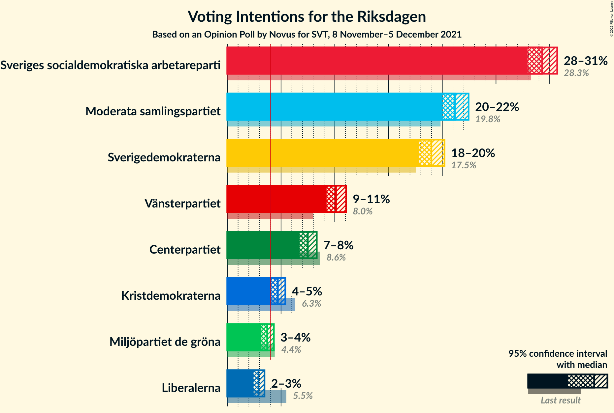

### Confidence Intervals

| Party | Last Result | Poll Result | 80% Confidence Interval | 90% Confidence Interval | 95% Confidence Interval | 99% Confidence Interval |
|:-----:|:-----------:|:-----------:|:-----------------------:|:-----------------------:|:-----------------------:|:-----------------------:|
| Sveriges socialdemokratiska arbetareparti | 28.3% | 29.3% | 28.4–30.2% |28.2–30.5% |27.9–30.7% |27.5–31.1% |
| Moderata samlingspartiet | 19.8% | 21.2% | 20.4–22.0% |20.2–22.3% |20.0–22.5% |19.6–22.8% |
| Sverigedemokraterna | 17.5% | 19.0% | 18.2–19.8% |18.0–20.0% |17.8–20.2% |17.5–20.6% |
| Vänsterpartiet | 8.0% | 10.1% | 9.5–10.7% |9.4–10.9% |9.2–11.1% |9.0–11.4% |
| Centerpartiet | 8.6% | 7.5% | 7.0–8.0% |6.8–8.2% |6.7–8.3% |6.5–8.6% |
| Kristdemokraterna | 6.3% | 4.7% | 4.3–5.2% |4.2–5.3% |4.1–5.4% |3.9–5.6% |
| Miljöpartiet de gröna | 4.4% | 3.7% | 3.4–4.1% |3.3–4.2% |3.2–4.3% |3.0–4.5% |
| Liberalerna | 5.5% | 2.9% | 2.6–3.3% |2.5–3.4% |2.4–3.5% |2.3–3.6% |

*Note:* The poll result column reflects the actual value used in the calculations. Published results may vary slightly, and in addition be rounded to fewer digits.

## Seats

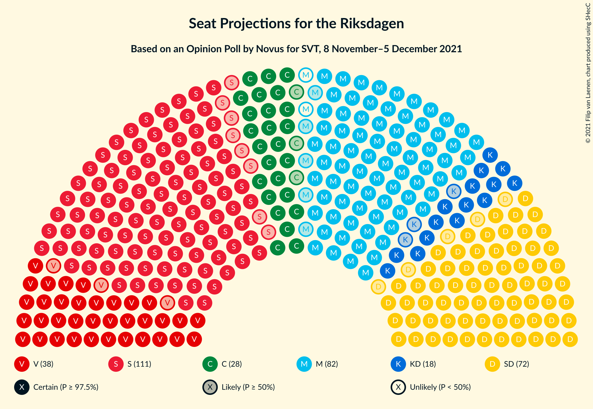

### Confidence Intervals

| Party | Last Result | Median | 80% Confidence Interval | 90% Confidence Interval | 95% Confidence Interval | 99% Confidence Interval |
|:-----:|:-----------:|:------:|:-----------------------:|:-----------------------:|:-----------------------:|:-----------------------:|
| <a href="#sveriges-socialdemokratiska-arbetareparti">Sveriges socialdemokratiska arbetareparti</a> | 100 | 111 | 107–114 |105–116 |103–116 |102–118 |
| <a href="#moderata-samlingspartiet">Moderata samlingspartiet</a> | 70 | 80 | 77–83 |76–84 |75–85 |73–87 |
| <a href="#sverigedemokraterna">Sverigedemokraterna</a> | 62 | 72 | 68–75 |67–76 |67–77 |64–78 |
| <a href="#vänsterpartiet">Vänsterpartiet</a> | 28 | 38 | 36–41 |35–41 |35–42 |33–43 |
| <a href="#centerpartiet">Centerpartiet</a> | 31 | 28 | 26–31 |26–31 |25–32 |24–33 |
| <a href="#kristdemokraterna">Kristdemokraterna</a> | 22 | 18 | 16–19 |16–20 |15–20 |0–21 |
| <a href="#miljöpartiet-de-gröna">Miljöpartiet de gröna</a> | 16 | 0 | 0–15 |0–15 |0–16 |0–17 |
| <a href="#liberalerna">Liberalerna</a> | 20 | 0 | 0 |0 |0 |0 |

### Sveriges socialdemokratiska arbetareparti

*For a full overview of the results for this party, see the [Sveriges socialdemokratiska arbetareparti](party-sverigessocialdemokratiskaarbetareparti.html) page.*

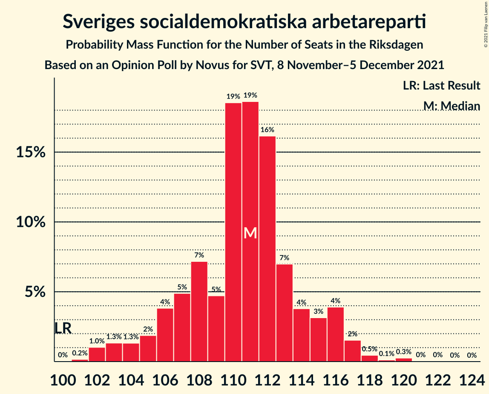

| Number of Seats | Probability | Accumulated | Special Marks |
|:---------------:|:-----------:|:-----------:|:-------------:|
| 100 | 0% | 100% | Last Result |
| 101 | 0.2% | 99.9% |  |
| 102 | 1.0% | 99.8% |  |
| 103 | 1.3% | 98.7% |  |
| 104 | 1.3% | 97% |  |
| 105 | 2% | 96% |  |
| 106 | 4% | 94% |  |
| 107 | 5% | 90% |  |
| 108 | 7% | 85% |  |
| 109 | 5% | 78% |  |
| 110 | 19% | 74% |  |
| 111 | 19% | 55% | Median |
| 112 | 16% | 36% |  |
| 113 | 7% | 20% |  |
| 114 | 4% | 13% |  |
| 115 | 3% | 10% |  |
| 116 | 4% | 6% |  |
| 117 | 2% | 2% |  |
| 118 | 0.5% | 0.9% |  |
| 119 | 0.1% | 0.5% |  |
| 120 | 0.3% | 0.4% |  |
| 121 | 0% | 0.1% |  |
| 122 | 0% | 0.1% |  |
| 123 | 0% | 0% |  |

### Moderata samlingspartiet

*For a full overview of the results for this party, see the [Moderata samlingspartiet](party-moderatasamlingspartiet.html) page.*

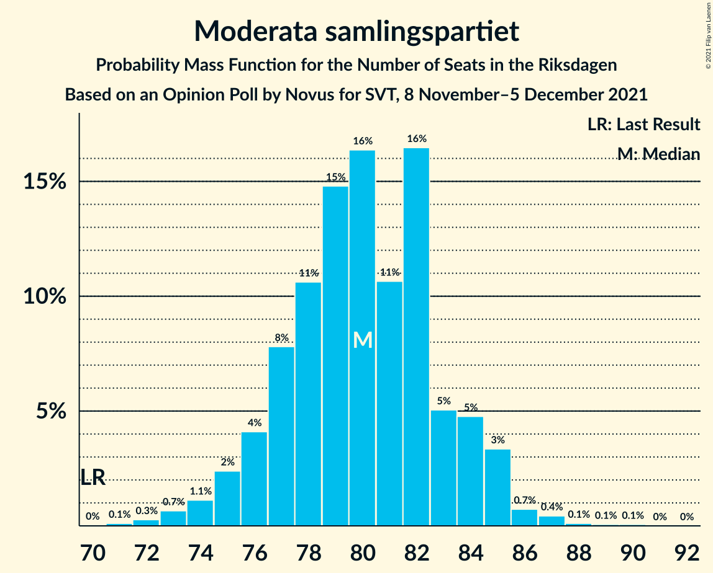

| Number of Seats | Probability | Accumulated | Special Marks |
|:---------------:|:-----------:|:-----------:|:-------------:|
| 70 | 0% | 100% | Last Result |
| 71 | 0.1% | 100% |  |
| 72 | 0.3% | 99.9% |  |
| 73 | 0.7% | 99.6% |  |
| 74 | 1.1% | 98.9% |  |
| 75 | 2% | 98% |  |
| 76 | 4% | 95% |  |
| 77 | 8% | 91% |  |
| 78 | 11% | 84% |  |
| 79 | 15% | 73% |  |
| 80 | 16% | 58% | Median |
| 81 | 11% | 42% |  |
| 82 | 16% | 31% |  |
| 83 | 5% | 15% |  |
| 84 | 5% | 10% |  |
| 85 | 3% | 5% |  |
| 86 | 0.7% | 1.4% |  |
| 87 | 0.4% | 0.7% |  |
| 88 | 0.1% | 0.3% |  |
| 89 | 0.1% | 0.1% |  |
| 90 | 0.1% | 0.1% |  |
| 91 | 0% | 0% |  |

### Sverigedemokraterna

*For a full overview of the results for this party, see the [Sverigedemokraterna](party-sverigedemokraterna.html) page.*

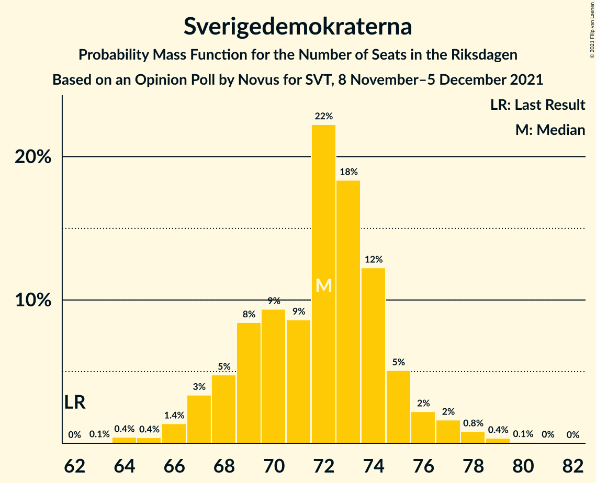

| Number of Seats | Probability | Accumulated | Special Marks |
|:---------------:|:-----------:|:-----------:|:-------------:|
| 62 | 0% | 100% | Last Result |
| 63 | 0.1% | 100% |  |
| 64 | 0.4% | 99.9% |  |
| 65 | 0.4% | 99.5% |  |
| 66 | 1.4% | 99.1% |  |
| 67 | 3% | 98% |  |
| 68 | 5% | 94% |  |
| 69 | 8% | 90% |  |
| 70 | 9% | 81% |  |
| 71 | 9% | 72% |  |
| 72 | 22% | 63% | Median |
| 73 | 18% | 41% |  |
| 74 | 12% | 23% |  |
| 75 | 5% | 10% |  |
| 76 | 2% | 5% |  |
| 77 | 2% | 3% |  |
| 78 | 0.8% | 1.3% |  |
| 79 | 0.4% | 0.5% |  |
| 80 | 0.1% | 0.1% |  |
| 81 | 0% | 0.1% |  |
| 82 | 0% | 0% |  |

### Vänsterpartiet

*For a full overview of the results for this party, see the [Vänsterpartiet](party-vänsterpartiet.html) page.*

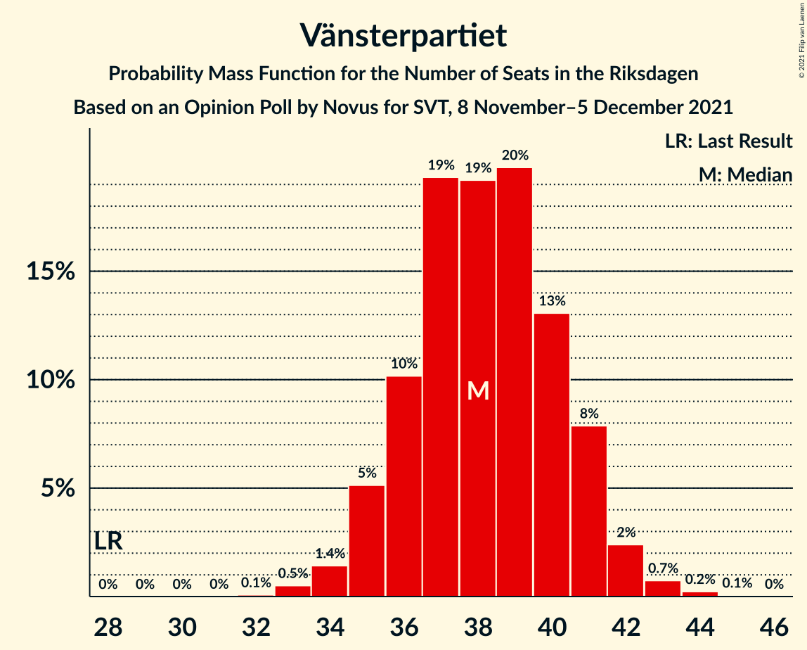

| Number of Seats | Probability | Accumulated | Special Marks |
|:---------------:|:-----------:|:-----------:|:-------------:|
| 28 | 0% | 100% | Last Result |
| 29 | 0% | 100% |  |
| 30 | 0% | 100% |  |
| 31 | 0% | 100% |  |
| 32 | 0.1% | 100% |  |
| 33 | 0.5% | 99.9% |  |
| 34 | 1.4% | 99.4% |  |
| 35 | 5% | 98% |  |
| 36 | 10% | 93% |  |
| 37 | 19% | 83% |  |
| 38 | 19% | 63% | Median |
| 39 | 20% | 44% |  |
| 40 | 13% | 24% |  |
| 41 | 8% | 11% |  |
| 42 | 2% | 3% |  |
| 43 | 0.7% | 1.0% |  |
| 44 | 0.2% | 0.3% |  |
| 45 | 0.1% | 0.1% |  |
| 46 | 0% | 0% |  |

### Centerpartiet

*For a full overview of the results for this party, see the [Centerpartiet](party-centerpartiet.html) page.*

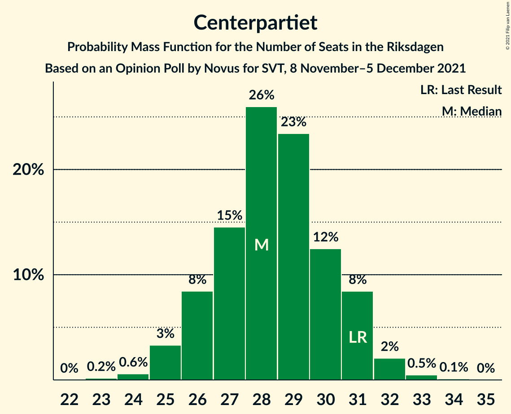

| Number of Seats | Probability | Accumulated | Special Marks |
|:---------------:|:-----------:|:-----------:|:-------------:|
| 23 | 0.2% | 100% |  |
| 24 | 0.6% | 99.8% |  |
| 25 | 3% | 99.2% |  |
| 26 | 8% | 96% |  |
| 27 | 15% | 87% |  |
| 28 | 26% | 73% | Median |
| 29 | 23% | 47% |  |
| 30 | 12% | 24% |  |
| 31 | 8% | 11% | Last Result |
| 32 | 2% | 3% |  |
| 33 | 0.5% | 0.6% |  |
| 34 | 0.1% | 0.1% |  |
| 35 | 0% | 0% |  |

### Kristdemokraterna

*For a full overview of the results for this party, see the [Kristdemokraterna](party-kristdemokraterna.html) page.*

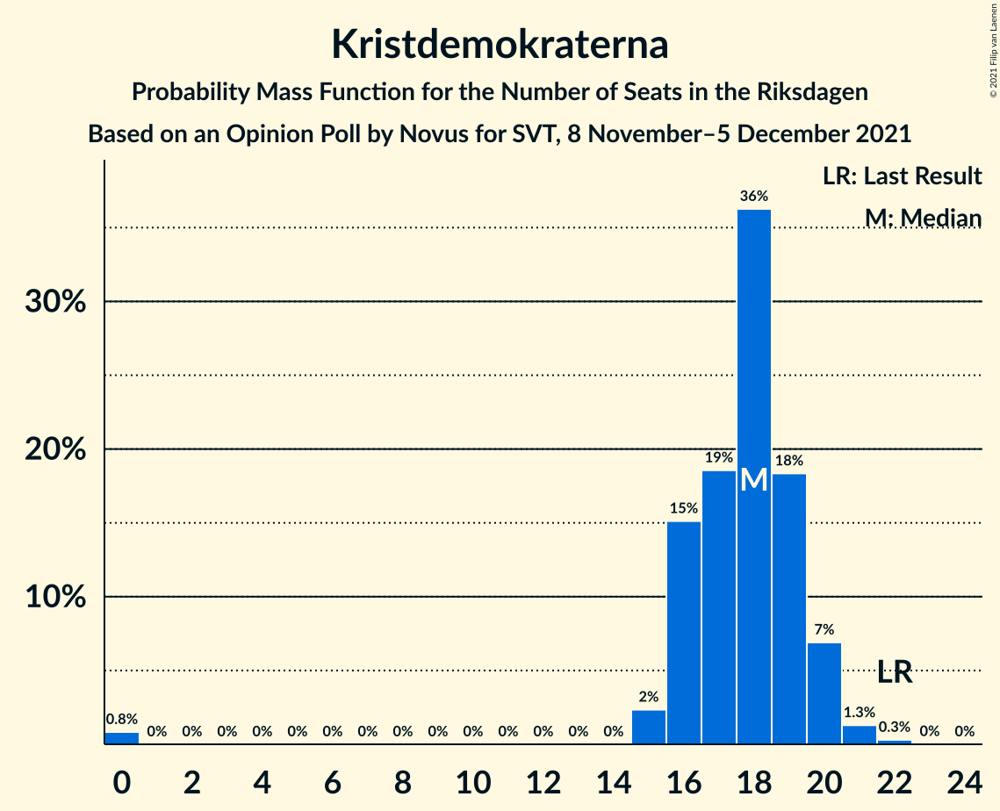

| Number of Seats | Probability | Accumulated | Special Marks |
|:---------------:|:-----------:|:-----------:|:-------------:|
| 0 | 0.8% | 100% |  |
| 1 | 0% | 99.2% |  |
| 2 | 0% | 99.2% |  |
| 3 | 0% | 99.2% |  |
| 4 | 0% | 99.2% |  |
| 5 | 0% | 99.2% |  |
| 6 | 0% | 99.2% |  |
| 7 | 0% | 99.2% |  |
| 8 | 0% | 99.2% |  |
| 9 | 0% | 99.2% |  |
| 10 | 0% | 99.2% |  |
| 11 | 0% | 99.2% |  |
| 12 | 0% | 99.2% |  |
| 13 | 0% | 99.2% |  |
| 14 | 0% | 99.2% |  |
| 15 | 2% | 99.2% |  |
| 16 | 15% | 97% |  |
| 17 | 19% | 82% |  |
| 18 | 36% | 63% | Median |
| 19 | 18% | 27% |  |
| 20 | 7% | 9% |  |
| 21 | 1.3% | 2% |  |
| 22 | 0.3% | 0.3% | Last Result |
| 23 | 0% | 0% |  |

### Miljöpartiet de gröna

*For a full overview of the results for this party, see the [Miljöpartiet de gröna](party-miljöpartietdegröna.html) page.*

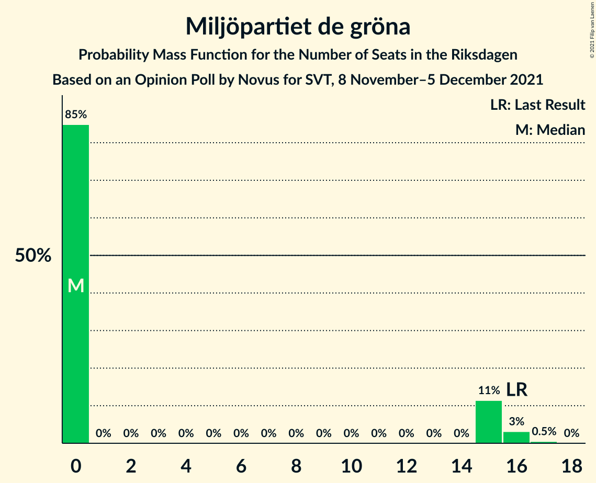

| Number of Seats | Probability | Accumulated | Special Marks |
|:---------------:|:-----------:|:-----------:|:-------------:|
| 0 | 85% | 100% | Median |
| 1 | 0% | 15% |  |
| 2 | 0% | 15% |  |
| 3 | 0% | 15% |  |
| 4 | 0% | 15% |  |
| 5 | 0% | 15% |  |
| 6 | 0% | 15% |  |
| 7 | 0% | 15% |  |
| 8 | 0% | 15% |  |
| 9 | 0% | 15% |  |
| 10 | 0% | 15% |  |
| 11 | 0% | 15% |  |
| 12 | 0% | 15% |  |
| 13 | 0% | 15% |  |
| 14 | 0% | 15% |  |
| 15 | 11% | 15% |  |
| 16 | 3% | 4% | Last Result |
| 17 | 0.5% | 0.6% |  |
| 18 | 0% | 0% |  |

### Liberalerna

*For a full overview of the results for this party, see the [Liberalerna](party-liberalerna.html) page.*

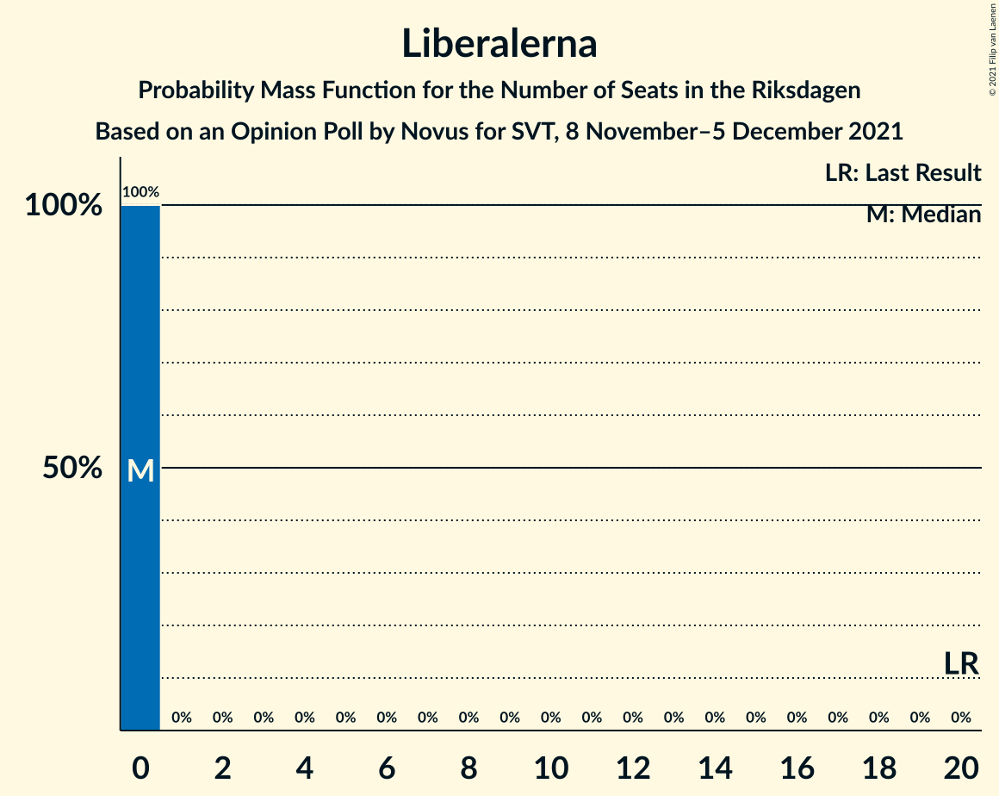

| Number of Seats | Probability | Accumulated | Special Marks |
|:---------------:|:-----------:|:-----------:|:-------------:|
| 0 | 100% | 100% | Median |
| 1 | 0% | 0% |  |
| 2 | 0% | 0% |  |
| 3 | 0% | 0% |  |
| 4 | 0% | 0% |  |
| 5 | 0% | 0% |  |
| 6 | 0% | 0% |  |
| 7 | 0% | 0% |  |
| 8 | 0% | 0% |  |
| 9 | 0% | 0% |  |
| 10 | 0% | 0% |  |
| 11 | 0% | 0% |  |
| 12 | 0% | 0% |  |
| 13 | 0% | 0% |  |
| 14 | 0% | 0% |  |
| 15 | 0% | 0% |  |
| 16 | 0% | 0% |  |
| 17 | 0% | 0% |  |
| 18 | 0% | 0% |  |
| 19 | 0% | 0% |  |
| 20 | 0% | 0% | Last Result |

## Coalitions

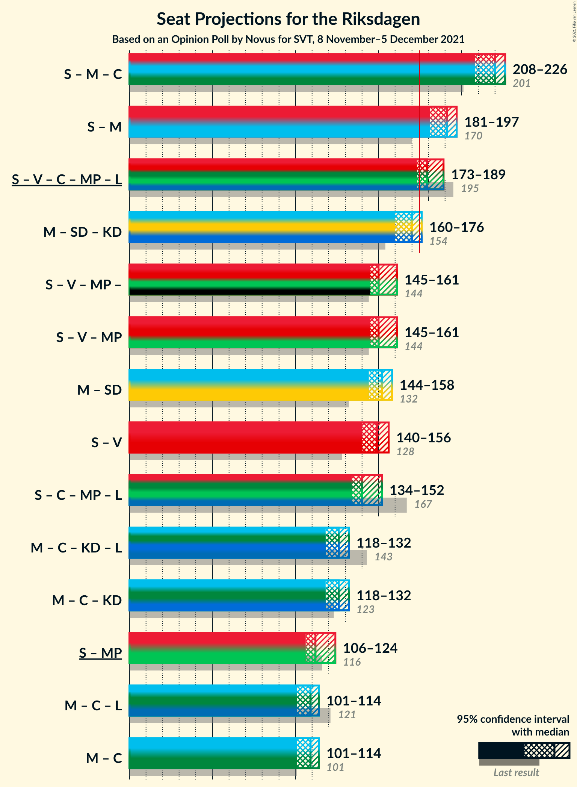

### Confidence Intervals

| Coalition | Last Result | Median | Majority? | 80% Confidence Interval | 90% Confidence Interval | 95% Confidence Interval | 99% Confidence Interval |
|:---------:|:-----------:|:------:|:---------:|:-----------------------:|:-----------------------:|:-----------------------:|:-----------------------:|
| Sveriges socialdemokratiska arbetareparti – Moderata samlingspartiet – Centerpartiet | 201 | 220 | 100% | 212–224 | 210–225 | 208–226 | 206–231 |
| Sveriges socialdemokratiska arbetareparti – Moderata samlingspartiet | 170 | 191 | 100% | 185–195 | 183–196 | 181–197 | 178–201 |
| Sveriges socialdemokratiska arbetareparti – Vänsterpartiet – Centerpartiet – Miljöpartiet de gröna – Liberalerna | 195 | 179 | 93% | 175–185 | 174–187 | 173–189 | 171–192 |
| Moderata samlingspartiet – Sverigedemokraterna – Kristdemokraterna | 154 | 170 | 7% | 164–174 | 162–175 | 160–176 | 157–178 |
| Sveriges socialdemokratiska arbetareparti – Vänsterpartiet – Miljöpartiet de gröna | 144 | 150 | 0% | 147–158 | 146–160 | 145–161 | 143–164 |
| Moderata samlingspartiet – Sverigedemokraterna | 132 | 152 | 0% | 147–156 | 145–157 | 144–158 | 141–160 |
| Sveriges socialdemokratiska arbetareparti – Vänsterpartiet | 128 | 149 | 0% | 144–153 | 142–154 | 140–156 | 138–158 |
| Sveriges socialdemokratiska arbetareparti – Centerpartiet – Miljöpartiet de gröna – Liberalerna | 167 | 140 | 0% | 137–148 | 135–150 | 134–152 | 133–154 |
| Moderata samlingspartiet – Centerpartiet – Kristdemokraterna – Liberalerna | 143 | 126 | 0% | 121–130 | 120–131 | 118–132 | 114–134 |
| Moderata samlingspartiet – Centerpartiet – Kristdemokraterna | 123 | 126 | 0% | 121–130 | 120–131 | 118–132 | 114–134 |
| Sveriges socialdemokratiska arbetareparti – Miljöpartiet de gröna | 116 | 112 | 0% | 109–121 | 107–123 | 106–124 | 105–127 |
| Moderata samlingspartiet – Centerpartiet – Liberalerna | 121 | 109 | 0% | 104–112 | 103–113 | 101–114 | 100–116 |
| Moderata samlingspartiet – Centerpartiet | 101 | 109 | 0% | 104–112 | 103–113 | 101–114 | 100–116 |

### Sveriges socialdemokratiska arbetareparti – Moderata samlingspartiet – Centerpartiet

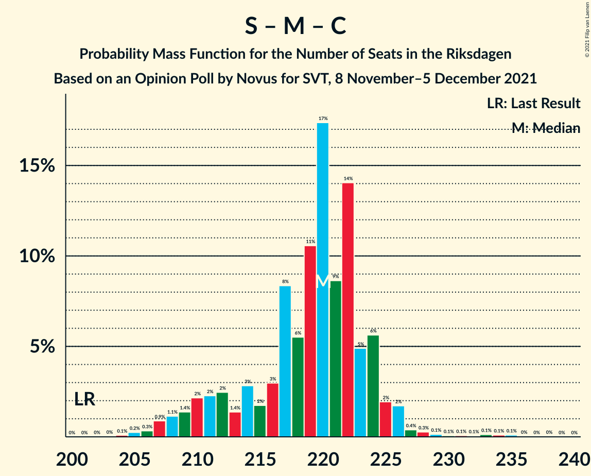

| Number of Seats | Probability | Accumulated | Special Marks |
|:---------------:|:-----------:|:-----------:|:-------------:|
| 201 | 0% | 100% | Last Result |
| 202 | 0% | 100% |  |
| 203 | 0% | 100% |  |
| 204 | 0.1% | 100% |  |
| 205 | 0.2% | 99.9% |  |
| 206 | 0.3% | 99.6% |  |
| 207 | 0.9% | 99.3% |  |
| 208 | 1.1% | 98% |  |
| 209 | 1.4% | 97% |  |
| 210 | 2% | 96% |  |
| 211 | 2% | 94% |  |
| 212 | 2% | 91% |  |
| 213 | 1.4% | 89% |  |
| 214 | 3% | 88% |  |
| 215 | 2% | 85% |  |
| 216 | 3% | 83% |  |
| 217 | 8% | 80% |  |
| 218 | 6% | 72% |  |
| 219 | 11% | 66% | Median |
| 220 | 17% | 56% |  |
| 221 | 9% | 38% |  |
| 222 | 14% | 30% |  |
| 223 | 5% | 16% |  |
| 224 | 6% | 11% |  |
| 225 | 2% | 5% |  |
| 226 | 2% | 3% |  |
| 227 | 0.4% | 1.4% |  |
| 228 | 0.3% | 1.0% |  |
| 229 | 0.1% | 0.7% |  |
| 230 | 0.1% | 0.6% |  |
| 231 | 0.1% | 0.5% |  |
| 232 | 0.1% | 0.5% |  |
| 233 | 0.1% | 0.4% |  |
| 234 | 0.1% | 0.3% |  |
| 235 | 0.1% | 0.2% |  |
| 236 | 0% | 0.1% |  |
| 237 | 0% | 0% |  |

### Sveriges socialdemokratiska arbetareparti – Moderata samlingspartiet

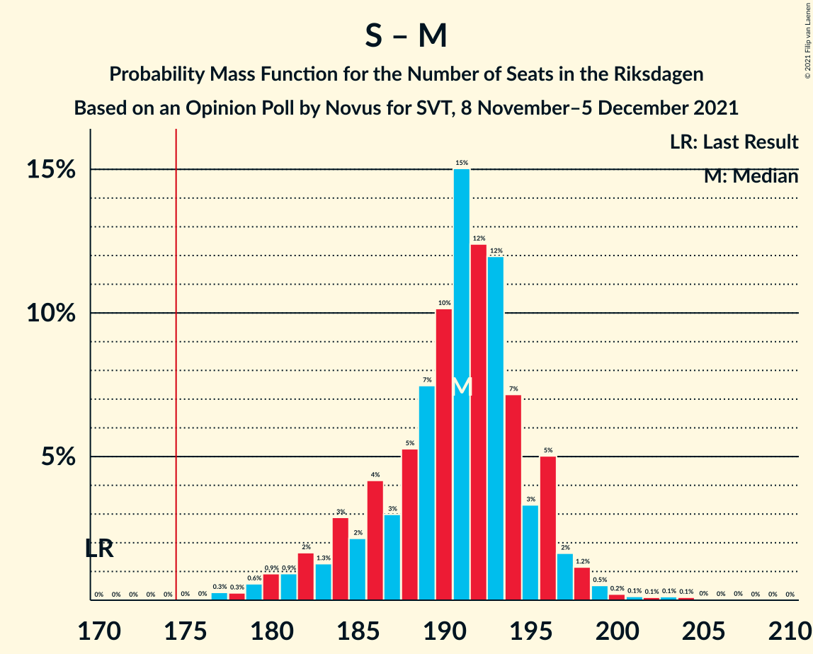

| Number of Seats | Probability | Accumulated | Special Marks |
|:---------------:|:-----------:|:-----------:|:-------------:|
| 170 | 0% | 100% | Last Result |
| 171 | 0% | 100% |  |
| 172 | 0% | 100% |  |
| 173 | 0% | 100% |  |
| 174 | 0% | 100% |  |
| 175 | 0% | 100% | Majority |
| 176 | 0% | 100% |  |
| 177 | 0.3% | 99.9% |  |
| 178 | 0.3% | 99.7% |  |
| 179 | 0.6% | 99.4% |  |
| 180 | 0.9% | 98.8% |  |
| 181 | 0.9% | 98% |  |
| 182 | 2% | 97% |  |
| 183 | 1.3% | 95% |  |
| 184 | 3% | 94% |  |
| 185 | 2% | 91% |  |
| 186 | 4% | 89% |  |
| 187 | 3% | 85% |  |
| 188 | 5% | 82% |  |
| 189 | 7% | 77% |  |
| 190 | 10% | 69% |  |
| 191 | 15% | 59% | Median |
| 192 | 12% | 44% |  |
| 193 | 12% | 32% |  |
| 194 | 7% | 20% |  |
| 195 | 3% | 12% |  |
| 196 | 5% | 9% |  |
| 197 | 2% | 4% |  |
| 198 | 1.2% | 2% |  |
| 199 | 0.5% | 1.3% |  |
| 200 | 0.2% | 0.8% |  |
| 201 | 0.1% | 0.6% |  |
| 202 | 0.1% | 0.4% |  |
| 203 | 0.1% | 0.3% |  |
| 204 | 0.1% | 0.2% |  |
| 205 | 0% | 0.1% |  |
| 206 | 0% | 0.1% |  |
| 207 | 0% | 0% |  |

### Sveriges socialdemokratiska arbetareparti – Vänsterpartiet – Centerpartiet – Miljöpartiet de gröna – Liberalerna

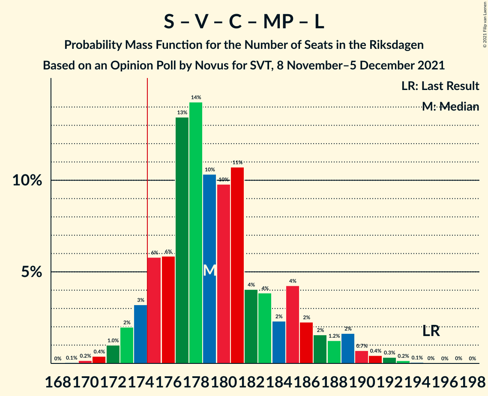

| Number of Seats | Probability | Accumulated | Special Marks |
|:---------------:|:-----------:|:-----------:|:-------------:|
| 169 | 0.1% | 100% |  |
| 170 | 0.2% | 99.9% |  |
| 171 | 0.4% | 99.8% |  |
| 172 | 1.0% | 99.4% |  |
| 173 | 2% | 98% |  |
| 174 | 3% | 96% |  |
| 175 | 6% | 93% | Majority |
| 176 | 6% | 87% |  |
| 177 | 13% | 82% | Median |
| 178 | 14% | 68% |  |
| 179 | 10% | 54% |  |
| 180 | 10% | 43% |  |
| 181 | 11% | 34% |  |
| 182 | 4% | 23% |  |
| 183 | 4% | 19% |  |
| 184 | 2% | 15% |  |
| 185 | 4% | 13% |  |
| 186 | 2% | 9% |  |
| 187 | 2% | 6% |  |
| 188 | 1.2% | 5% |  |
| 189 | 2% | 3% |  |
| 190 | 0.7% | 2% |  |
| 191 | 0.4% | 1.1% |  |
| 192 | 0.3% | 0.7% |  |
| 193 | 0.2% | 0.3% |  |
| 194 | 0.1% | 0.2% |  |
| 195 | 0% | 0.1% | Last Result |
| 196 | 0% | 0.1% |  |
| 197 | 0% | 0.1% |  |
| 198 | 0% | 0% |  |

### Moderata samlingspartiet – Sverigedemokraterna – Kristdemokraterna

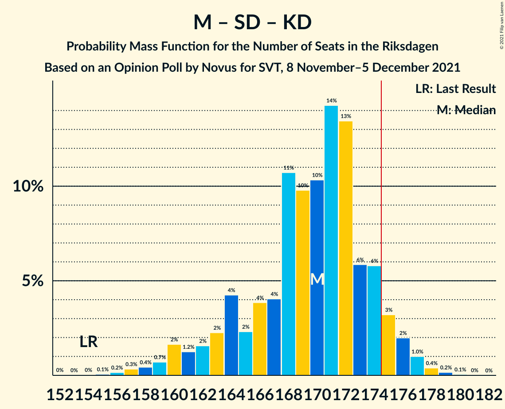

| Number of Seats | Probability | Accumulated | Special Marks |
|:---------------:|:-----------:|:-----------:|:-------------:|
| 152 | 0% | 100% |  |
| 153 | 0% | 99.9% |  |
| 154 | 0% | 99.9% | Last Result |
| 155 | 0.1% | 99.9% |  |
| 156 | 0.2% | 99.8% |  |
| 157 | 0.3% | 99.7% |  |
| 158 | 0.4% | 99.3% |  |
| 159 | 0.7% | 98.9% |  |
| 160 | 2% | 98% |  |
| 161 | 1.2% | 97% |  |
| 162 | 2% | 95% |  |
| 163 | 2% | 94% |  |
| 164 | 4% | 91% |  |
| 165 | 2% | 87% |  |
| 166 | 4% | 85% |  |
| 167 | 4% | 81% |  |
| 168 | 11% | 77% |  |
| 169 | 10% | 66% |  |
| 170 | 10% | 57% | Median |
| 171 | 14% | 46% |  |
| 172 | 13% | 32% |  |
| 173 | 6% | 18% |  |
| 174 | 6% | 13% |  |
| 175 | 3% | 7% | Majority |
| 176 | 2% | 4% |  |
| 177 | 1.0% | 2% |  |
| 178 | 0.4% | 0.6% |  |
| 179 | 0.2% | 0.2% |  |
| 180 | 0.1% | 0.1% |  |
| 181 | 0% | 0% |  |

### Sveriges socialdemokratiska arbetareparti – Vänsterpartiet – Miljöpartiet de gröna

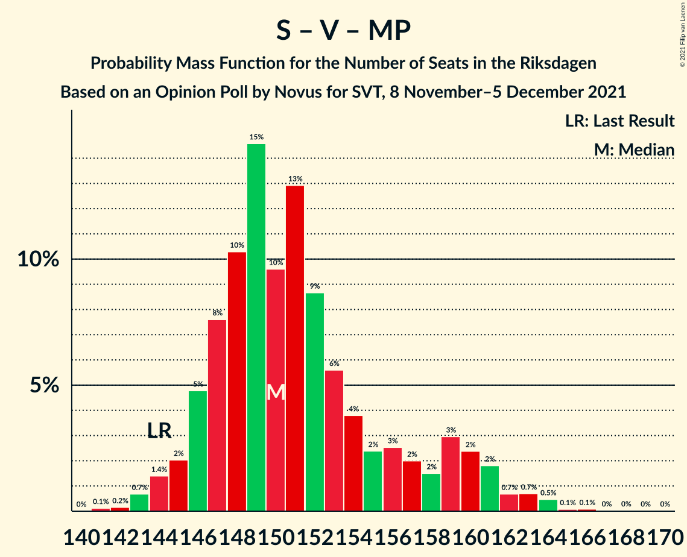

| Number of Seats | Probability | Accumulated | Special Marks |
|:---------------:|:-----------:|:-----------:|:-------------:|
| 141 | 0.1% | 100% |  |
| 142 | 0.2% | 99.9% |  |
| 143 | 0.7% | 99.7% |  |
| 144 | 1.4% | 99.0% | Last Result |
| 145 | 2% | 98% |  |
| 146 | 5% | 96% |  |
| 147 | 8% | 91% |  |
| 148 | 10% | 83% |  |
| 149 | 15% | 73% | Median |
| 150 | 10% | 58% |  |
| 151 | 13% | 49% |  |
| 152 | 9% | 36% |  |
| 153 | 6% | 27% |  |
| 154 | 4% | 22% |  |
| 155 | 2% | 18% |  |
| 156 | 3% | 15% |  |
| 157 | 2% | 13% |  |
| 158 | 2% | 11% |  |
| 159 | 3% | 9% |  |
| 160 | 2% | 6% |  |
| 161 | 2% | 4% |  |
| 162 | 0.7% | 2% |  |
| 163 | 0.7% | 1.5% |  |
| 164 | 0.5% | 0.8% |  |
| 165 | 0.1% | 0.3% |  |
| 166 | 0.1% | 0.2% |  |
| 167 | 0% | 0.1% |  |
| 168 | 0% | 0.1% |  |
| 169 | 0% | 0.1% |  |
| 170 | 0% | 0% |  |

### Moderata samlingspartiet – Sverigedemokraterna

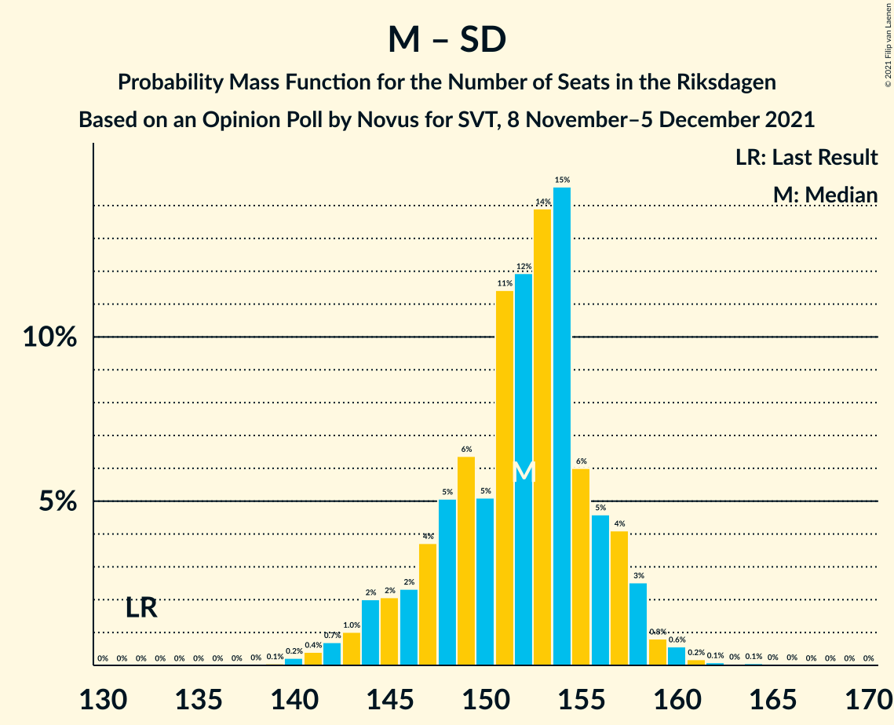

| Number of Seats | Probability | Accumulated | Special Marks |
|:---------------:|:-----------:|:-----------:|:-------------:|
| 132 | 0% | 100% | Last Result |
| 133 | 0% | 100% |  |
| 134 | 0% | 100% |  |
| 135 | 0% | 100% |  |
| 136 | 0% | 100% |  |
| 137 | 0% | 100% |  |
| 138 | 0% | 100% |  |
| 139 | 0.1% | 100% |  |
| 140 | 0.2% | 99.9% |  |
| 141 | 0.4% | 99.7% |  |
| 142 | 0.7% | 99.3% |  |
| 143 | 1.0% | 98.6% |  |
| 144 | 2% | 98% |  |
| 145 | 2% | 96% |  |
| 146 | 2% | 93% |  |
| 147 | 4% | 91% |  |
| 148 | 5% | 87% |  |
| 149 | 6% | 82% |  |
| 150 | 5% | 76% |  |
| 151 | 11% | 71% |  |
| 152 | 12% | 59% | Median |
| 153 | 14% | 48% |  |
| 154 | 15% | 34% |  |
| 155 | 6% | 19% |  |
| 156 | 5% | 13% |  |
| 157 | 4% | 8% |  |
| 158 | 3% | 4% |  |
| 159 | 0.8% | 2% |  |
| 160 | 0.6% | 1.0% |  |
| 161 | 0.2% | 0.5% |  |
| 162 | 0.1% | 0.3% |  |
| 163 | 0% | 0.2% |  |
| 164 | 0.1% | 0.1% |  |
| 165 | 0% | 0.1% |  |
| 166 | 0% | 0% |  |

### Sveriges socialdemokratiska arbetareparti – Vänsterpartiet

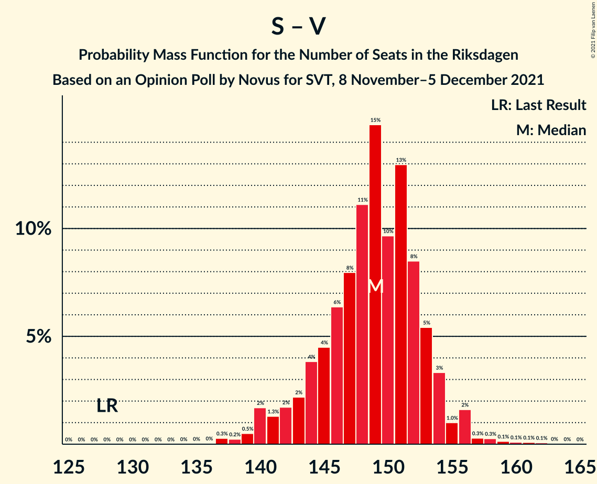

| Number of Seats | Probability | Accumulated | Special Marks |
|:---------------:|:-----------:|:-----------:|:-------------:|
| 128 | 0% | 100% | Last Result |
| 129 | 0% | 100% |  |
| 130 | 0% | 100% |  |
| 131 | 0% | 100% |  |
| 132 | 0% | 100% |  |
| 133 | 0% | 100% |  |
| 134 | 0% | 100% |  |
| 135 | 0% | 100% |  |
| 136 | 0% | 100% |  |
| 137 | 0.3% | 99.9% |  |
| 138 | 0.2% | 99.6% |  |
| 139 | 0.5% | 99.4% |  |
| 140 | 2% | 98.9% |  |
| 141 | 1.3% | 97% |  |
| 142 | 2% | 96% |  |
| 143 | 2% | 94% |  |
| 144 | 4% | 92% |  |
| 145 | 4% | 88% |  |
| 146 | 6% | 84% |  |
| 147 | 8% | 77% |  |
| 148 | 11% | 69% |  |
| 149 | 15% | 58% | Median |
| 150 | 10% | 43% |  |
| 151 | 13% | 34% |  |
| 152 | 8% | 21% |  |
| 153 | 5% | 12% |  |
| 154 | 3% | 7% |  |
| 155 | 1.0% | 4% |  |
| 156 | 2% | 3% |  |
| 157 | 0.3% | 1.0% |  |
| 158 | 0.3% | 0.7% |  |
| 159 | 0.1% | 0.4% |  |
| 160 | 0.1% | 0.3% |  |
| 161 | 0.1% | 0.2% |  |
| 162 | 0.1% | 0.1% |  |
| 163 | 0% | 0% |  |

### Sveriges socialdemokratiska arbetareparti – Centerpartiet – Miljöpartiet de gröna – Liberalerna

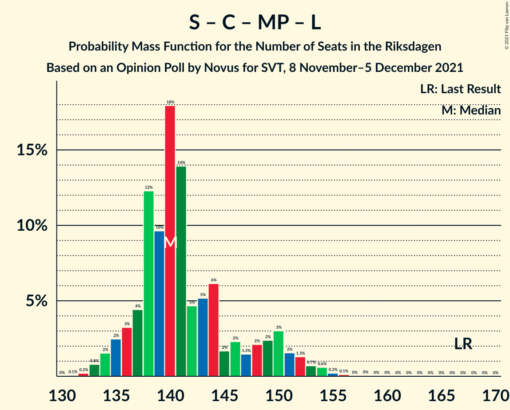

| Number of Seats | Probability | Accumulated | Special Marks |
|:---------------:|:-----------:|:-----------:|:-------------:|
| 131 | 0.1% | 100% |  |
| 132 | 0.2% | 99.9% |  |
| 133 | 0.8% | 99.7% |  |
| 134 | 2% | 98.9% |  |
| 135 | 2% | 97% |  |
| 136 | 3% | 95% |  |
| 137 | 4% | 92% |  |
| 138 | 12% | 87% |  |
| 139 | 10% | 75% | Median |
| 140 | 18% | 65% |  |
| 141 | 14% | 47% |  |
| 142 | 5% | 33% |  |
| 143 | 5% | 29% |  |
| 144 | 6% | 24% |  |
| 145 | 2% | 18% |  |
| 146 | 2% | 16% |  |
| 147 | 1.5% | 14% |  |
| 148 | 2% | 12% |  |
| 149 | 2% | 10% |  |
| 150 | 3% | 8% |  |
| 151 | 2% | 5% |  |
| 152 | 1.3% | 3% |  |
| 153 | 0.7% | 2% |  |
| 154 | 0.6% | 1.0% |  |
| 155 | 0.2% | 0.4% |  |
| 156 | 0.1% | 0.2% |  |
| 157 | 0% | 0.1% |  |
| 158 | 0% | 0.1% |  |
| 159 | 0% | 0% |  |
| 160 | 0% | 0% |  |
| 161 | 0% | 0% |  |
| 162 | 0% | 0% |  |
| 163 | 0% | 0% |  |
| 164 | 0% | 0% |  |
| 165 | 0% | 0% |  |
| 166 | 0% | 0% |  |
| 167 | 0% | 0% | Last Result |

### Moderata samlingspartiet – Centerpartiet – Kristdemokraterna – Liberalerna

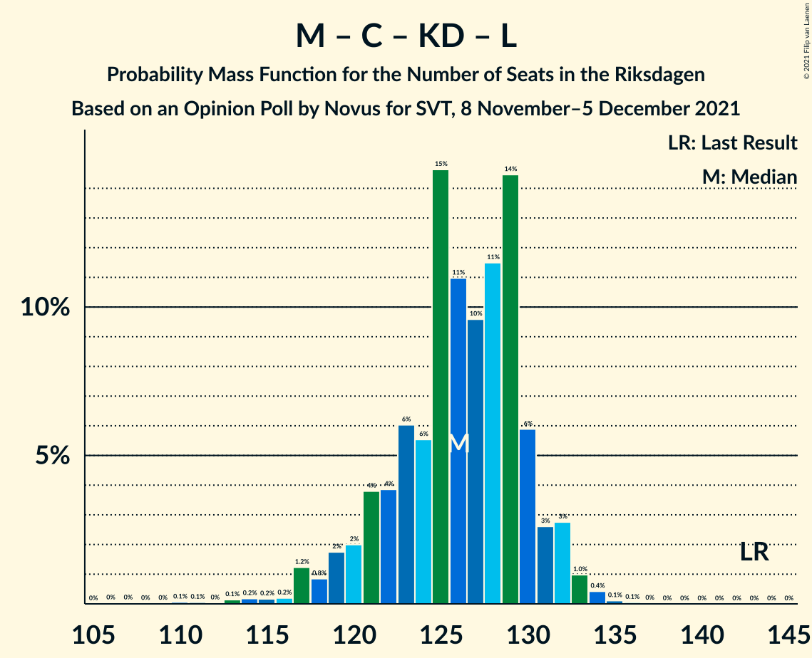

| Number of Seats | Probability | Accumulated | Special Marks |
|:---------------:|:-----------:|:-----------:|:-------------:|
| 107 | 0% | 100% |  |
| 108 | 0% | 99.9% |  |
| 109 | 0% | 99.9% |  |
| 110 | 0.1% | 99.9% |  |
| 111 | 0.1% | 99.8% |  |
| 112 | 0% | 99.8% |  |
| 113 | 0.1% | 99.7% |  |
| 114 | 0.2% | 99.6% |  |
| 115 | 0.2% | 99.4% |  |
| 116 | 0.2% | 99.3% |  |
| 117 | 1.2% | 99.1% |  |
| 118 | 0.8% | 98% |  |
| 119 | 2% | 97% |  |
| 120 | 2% | 95% |  |
| 121 | 4% | 93% |  |
| 122 | 4% | 89% |  |
| 123 | 6% | 86% |  |
| 124 | 6% | 80% |  |
| 125 | 15% | 74% |  |
| 126 | 11% | 59% | Median |
| 127 | 10% | 48% |  |
| 128 | 11% | 39% |  |
| 129 | 14% | 27% |  |
| 130 | 6% | 13% |  |
| 131 | 3% | 7% |  |
| 132 | 3% | 4% |  |
| 133 | 1.0% | 2% |  |
| 134 | 0.4% | 0.6% |  |
| 135 | 0.1% | 0.2% |  |
| 136 | 0.1% | 0.1% |  |
| 137 | 0% | 0% |  |
| 138 | 0% | 0% |  |
| 139 | 0% | 0% |  |
| 140 | 0% | 0% |  |
| 141 | 0% | 0% |  |
| 142 | 0% | 0% |  |
| 143 | 0% | 0% | Last Result |

### Moderata samlingspartiet – Centerpartiet – Kristdemokraterna

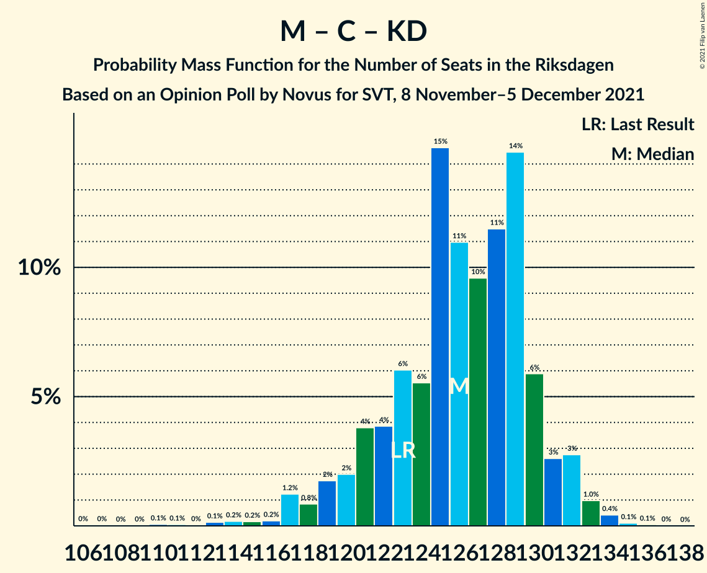

| Number of Seats | Probability | Accumulated | Special Marks |
|:---------------:|:-----------:|:-----------:|:-------------:|
| 107 | 0% | 100% |  |
| 108 | 0% | 99.9% |  |
| 109 | 0% | 99.9% |  |
| 110 | 0.1% | 99.9% |  |
| 111 | 0.1% | 99.8% |  |
| 112 | 0% | 99.8% |  |
| 113 | 0.1% | 99.7% |  |
| 114 | 0.2% | 99.6% |  |
| 115 | 0.2% | 99.4% |  |
| 116 | 0.2% | 99.3% |  |
| 117 | 1.2% | 99.1% |  |
| 118 | 0.8% | 98% |  |
| 119 | 2% | 97% |  |
| 120 | 2% | 95% |  |
| 121 | 4% | 93% |  |
| 122 | 4% | 89% |  |
| 123 | 6% | 86% | Last Result |
| 124 | 6% | 80% |  |
| 125 | 15% | 74% |  |
| 126 | 11% | 59% | Median |
| 127 | 10% | 48% |  |
| 128 | 11% | 39% |  |
| 129 | 14% | 27% |  |
| 130 | 6% | 13% |  |
| 131 | 3% | 7% |  |
| 132 | 3% | 4% |  |
| 133 | 1.0% | 2% |  |
| 134 | 0.4% | 0.6% |  |
| 135 | 0.1% | 0.2% |  |
| 136 | 0.1% | 0.1% |  |
| 137 | 0% | 0% |  |

### Sveriges socialdemokratiska arbetareparti – Miljöpartiet de gröna

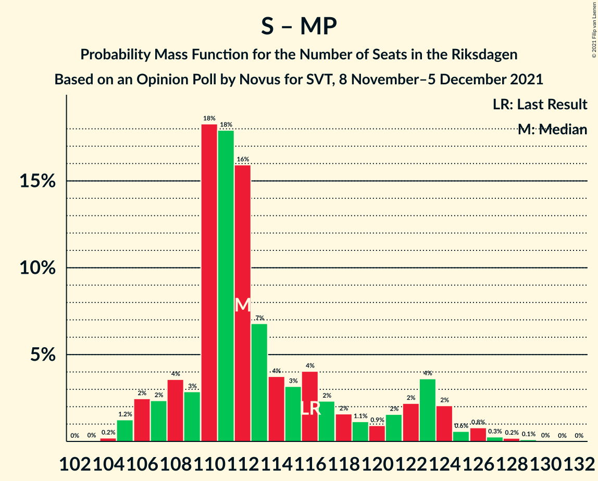

| Number of Seats | Probability | Accumulated | Special Marks |
|:---------------:|:-----------:|:-----------:|:-------------:|
| 103 | 0% | 100% |  |
| 104 | 0.2% | 99.9% |  |
| 105 | 1.2% | 99.7% |  |
| 106 | 2% | 98% |  |
| 107 | 2% | 96% |  |
| 108 | 4% | 94% |  |
| 109 | 3% | 90% |  |
| 110 | 18% | 87% |  |
| 111 | 18% | 69% | Median |
| 112 | 16% | 51% |  |
| 113 | 7% | 35% |  |
| 114 | 4% | 28% |  |
| 115 | 3% | 25% |  |
| 116 | 4% | 21% | Last Result |
| 117 | 2% | 17% |  |
| 118 | 2% | 15% |  |
| 119 | 1.1% | 13% |  |
| 120 | 0.9% | 12% |  |
| 121 | 2% | 11% |  |
| 122 | 2% | 10% |  |
| 123 | 4% | 8% |  |
| 124 | 2% | 4% |  |
| 125 | 0.6% | 2% |  |
| 126 | 0.8% | 1.4% |  |
| 127 | 0.3% | 0.6% |  |
| 128 | 0.2% | 0.4% |  |
| 129 | 0.1% | 0.2% |  |
| 130 | 0% | 0.1% |  |
| 131 | 0% | 0% |  |

### Moderata samlingspartiet – Centerpartiet – Liberalerna

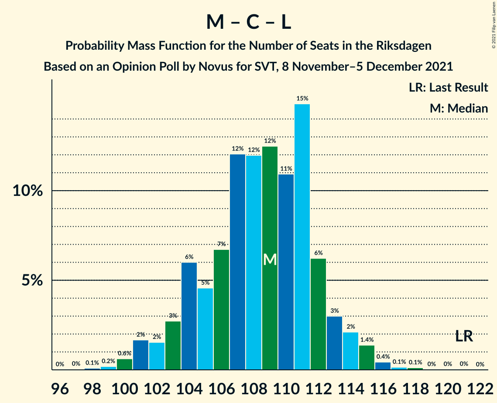

| Number of Seats | Probability | Accumulated | Special Marks |
|:---------------:|:-----------:|:-----------:|:-------------:|
| 97 | 0% | 100% |  |
| 98 | 0.1% | 99.9% |  |
| 99 | 0.2% | 99.8% |  |
| 100 | 0.6% | 99.7% |  |
| 101 | 2% | 99.0% |  |
| 102 | 2% | 97% |  |
| 103 | 3% | 96% |  |
| 104 | 6% | 93% |  |
| 105 | 5% | 87% |  |
| 106 | 7% | 83% |  |
| 107 | 12% | 76% |  |
| 108 | 12% | 64% | Median |
| 109 | 12% | 52% |  |
| 110 | 11% | 39% |  |
| 111 | 15% | 28% |  |
| 112 | 6% | 14% |  |
| 113 | 3% | 7% |  |
| 114 | 2% | 4% |  |
| 115 | 1.4% | 2% |  |
| 116 | 0.4% | 0.8% |  |
| 117 | 0.1% | 0.4% |  |
| 118 | 0.1% | 0.2% |  |
| 119 | 0% | 0.1% |  |
| 120 | 0% | 0.1% |  |
| 121 | 0% | 0% | Last Result |

### Moderata samlingspartiet – Centerpartiet

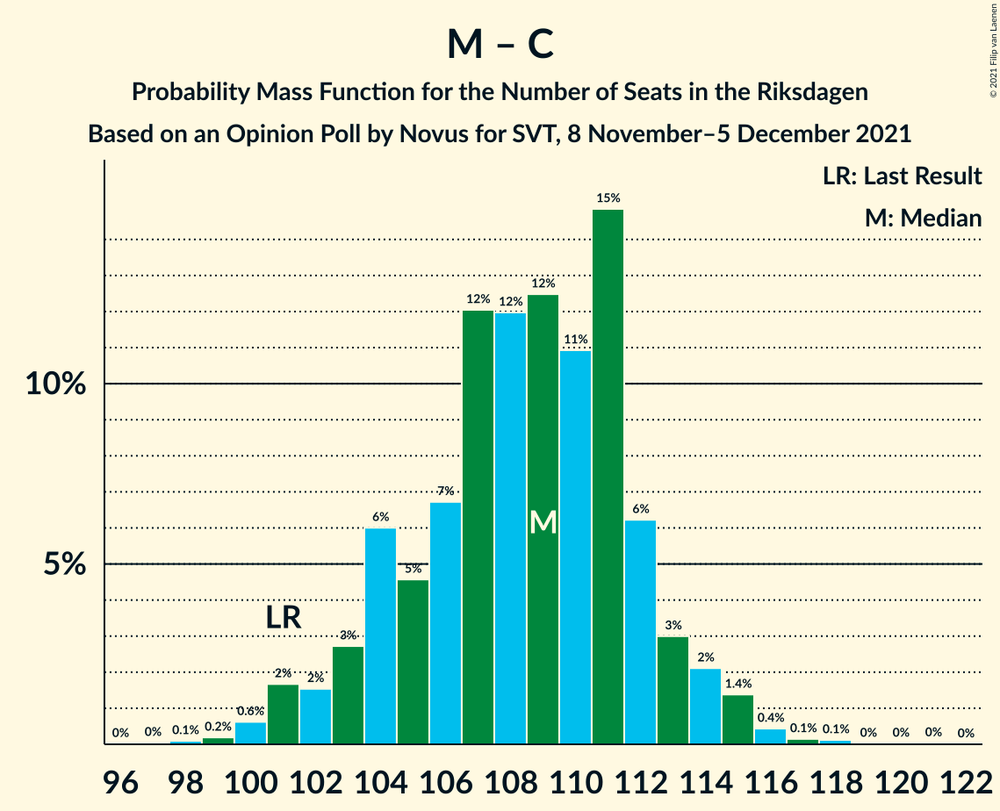

| Number of Seats | Probability | Accumulated | Special Marks |
|:---------------:|:-----------:|:-----------:|:-------------:|
| 97 | 0% | 100% |  |
| 98 | 0.1% | 99.9% |  |
| 99 | 0.2% | 99.8% |  |
| 100 | 0.6% | 99.7% |  |
| 101 | 2% | 99.0% | Last Result |
| 102 | 2% | 97% |  |
| 103 | 3% | 96% |  |
| 104 | 6% | 93% |  |
| 105 | 5% | 87% |  |
| 106 | 7% | 83% |  |
| 107 | 12% | 76% |  |
| 108 | 12% | 64% | Median |
| 109 | 12% | 52% |  |
| 110 | 11% | 39% |  |
| 111 | 15% | 28% |  |
| 112 | 6% | 14% |  |
| 113 | 3% | 7% |  |
| 114 | 2% | 4% |  |
| 115 | 1.4% | 2% |  |
| 116 | 0.4% | 0.8% |  |
| 117 | 0.1% | 0.4% |  |
| 118 | 0.1% | 0.2% |  |
| 119 | 0% | 0.1% |  |
| 120 | 0% | 0.1% |  |
| 121 | 0% | 0% |  |

## Technical Information

### Opinion Poll

+ **Polling firm:** Novus
+ **Commissioner(s):** SVT
+ **Fieldwork period:** 8 November–5 December 2021

### Calculations

+ **Sample size:** 4233
+ **Simulations done:** 1,048,576
+ **Error estimate:** 0.81%

