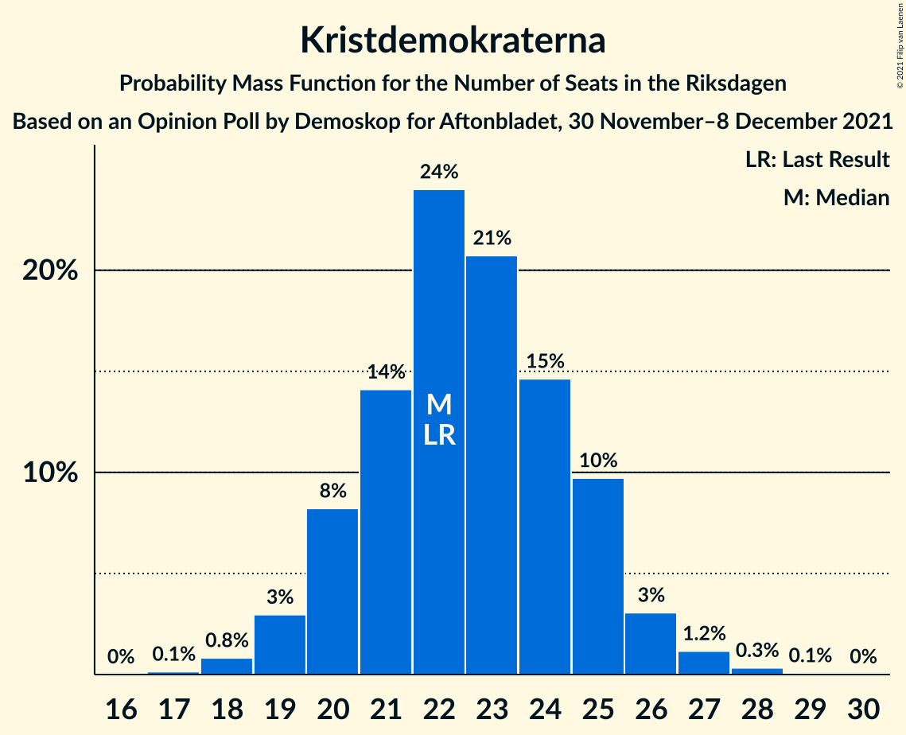
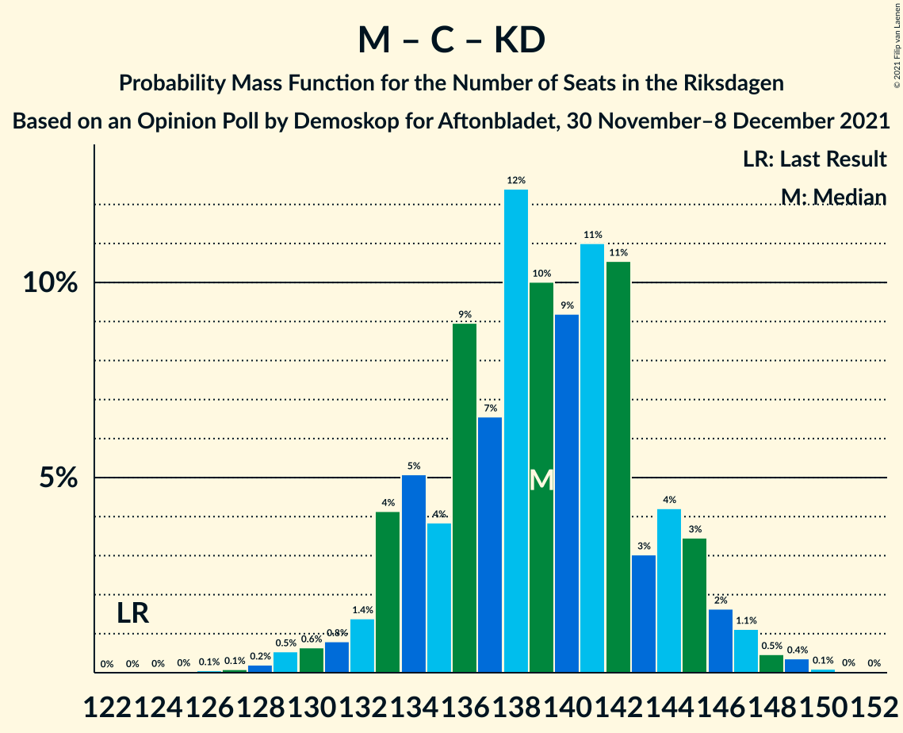

# Opinion Poll by Demoskop for Aftonbladet, 30 November–8 December 2021

<a href="#voting-intentions">Voting Intentions</a> | <a href="#seats">Seats</a> | <a href="#coalitions">Coalitions</a> | <a href="#technical-information">Technical Information</a>

## Voting Intentions

### Confidence Intervals

| Party | Last Result | Poll Result | 80% Confidence Interval | 90% Confidence Interval | 95% Confidence Interval | 99% Confidence Interval |
|:-----:|:-----------:|:-----------:|:-----------------------:|:-----------------------:|:-----------------------:|:-----------------------:|
| Sveriges socialdemokratiska arbetareparti | 28.3% | 29.1% | 27.9–30.3% |27.6–30.6% |27.3–30.9% |26.7–31.5% |
| Moderata samlingspartiet | 19.8% | 22.6% | 21.5–23.7% |21.2–24.0% |20.9–24.3% |20.5–24.8% |
| Sverigedemokraterna | 17.5% | 18.7% | 17.7–19.7% |17.4–20.0% |17.2–20.3% |16.7–20.8% |
| Centerpartiet | 8.6% | 8.5% | 7.8–9.3% |7.6–9.5% |7.5–9.7% |7.1–10.1% |
| Vänsterpartiet | 8.0% | 8.2% | 7.5–8.9% |7.3–9.1% |7.1–9.3% |6.8–9.7% |
| Kristdemokraterna | 6.3% | 6.0% | 5.4–6.7% |5.3–6.9% |5.1–7.0% |4.9–7.4% |
| Miljöpartiet de gröna | 4.4% | 3.3% | 2.9–3.8% |2.8–4.0% |2.7–4.1% |2.5–4.4% |
| Liberalerna | 5.5% | 2.0% | 1.7–2.4% |1.6–2.5% |1.5–2.7% |1.4–2.9% |

*Note:* The poll result column reflects the actual value used in the calculations. Published results may vary slightly, and in addition be rounded to fewer digits.

## Seats

### Confidence Intervals

| Party | Last Result | Median | 80% Confidence Interval | 90% Confidence Interval | 95% Confidence Interval | 99% Confidence Interval |
|:-----:|:-----------:|:------:|:-----------------------:|:-----------------------:|:-----------------------:|:-----------------------:|
| <a href="#sveriges-socialdemokratiska-arbetareparti">Sveriges socialdemokratiska arbetareparti</a> | 100 | 108 | 104–113 |103–114 |101–115 |100–117 |
| <a href="#moderata-samlingspartiet">Moderata samlingspartiet</a> | 70 | 84 | 80–88 |79–89 |78–91 |76–93 |
| <a href="#sverigedemokraterna">Sverigedemokraterna</a> | 62 | 71 | 66–74 |65–75 |64–76 |62–78 |
| <a href="#centerpartiet">Centerpartiet</a> | 31 | 32 | 29–35 |29–36 |28–36 |26–37 |
| <a href="#vänsterpartiet">Vänsterpartiet</a> | 28 | 31 | 28–33 |28–34 |27–35 |26–36 |
| <a href="#kristdemokraterna">Kristdemokraterna</a> | 22 | 22 | 20–25 |20–25 |19–26 |18–27 |
| <a href="#miljöpartiet-de-gröna">Miljöpartiet de gröna</a> | 16 | 0 | 0 |0 |0–15 |0–16 |
| <a href="#liberalerna">Liberalerna</a> | 20 | 0 | 0 |0 |0 |0 |

### Sveriges socialdemokratiska arbetareparti

*For a full overview of the results for this party, see the [Sveriges socialdemokratiska arbetareparti](party-sverigessocialdemokratiskaarbetareparti.html) page.*

| Number of Seats | Probability | Accumulated | Special Marks |
|:---------------:|:-----------:|:-----------:|:-------------:|
| 97 | 0% | 100% |  |
| 98 | 0.2% | 99.9% |  |
| 99 | 0.2% | 99.8% |  |
| 100 | 0.8% | 99.6% | Last Result |
| 101 | 1.4% | 98.8% |  |
| 102 | 2% | 97% |  |
| 103 | 3% | 96% |  |
| 104 | 5% | 92% |  |
| 105 | 5% | 87% |  |
| 106 | 21% | 82% |  |
| 107 | 5% | 62% |  |
| 108 | 14% | 57% | Median |
| 109 | 10% | 43% |  |
| 110 | 5% | 33% |  |
| 111 | 11% | 27% |  |
| 112 | 6% | 16% |  |
| 113 | 3% | 10% |  |
| 114 | 4% | 7% |  |
| 115 | 1.1% | 3% |  |
| 116 | 0.8% | 2% |  |
| 117 | 0.9% | 1.4% |  |
| 118 | 0.1% | 0.5% |  |
| 119 | 0.3% | 0.4% |  |
| 120 | 0.1% | 0.1% |  |
| 121 | 0% | 0% |  |

### Moderata samlingspartiet

*For a full overview of the results for this party, see the [Moderata samlingspartiet](party-moderatasamlingspartiet.html) page.*

| Number of Seats | Probability | Accumulated | Special Marks |
|:---------------:|:-----------:|:-----------:|:-------------:|
| 70 | 0% | 100% | Last Result |
| 71 | 0% | 100% |  |
| 72 | 0% | 100% |  |
| 73 | 0% | 100% |  |
| 74 | 0.1% | 100% |  |
| 75 | 0.2% | 99.9% |  |
| 76 | 0.4% | 99.7% |  |
| 77 | 0.8% | 99.3% |  |
| 78 | 2% | 98% |  |
| 79 | 3% | 96% |  |
| 80 | 5% | 94% |  |
| 81 | 7% | 89% |  |
| 82 | 12% | 81% |  |
| 83 | 11% | 70% |  |
| 84 | 15% | 59% | Median |
| 85 | 11% | 44% |  |
| 86 | 13% | 33% |  |
| 87 | 7% | 20% |  |
| 88 | 5% | 13% |  |
| 89 | 4% | 8% |  |
| 90 | 2% | 5% |  |
| 91 | 1.5% | 3% |  |
| 92 | 0.6% | 1.2% |  |
| 93 | 0.4% | 0.6% |  |
| 94 | 0.1% | 0.2% |  |
| 95 | 0.1% | 0.1% |  |
| 96 | 0% | 0% |  |

### Sverigedemokraterna

*For a full overview of the results for this party, see the [Sverigedemokraterna](party-sverigedemokraterna.html) page.*

| Number of Seats | Probability | Accumulated | Special Marks |
|:---------------:|:-----------:|:-----------:|:-------------:|
| 60 | 0% | 100% |  |
| 61 | 0.2% | 99.9% |  |
| 62 | 0.3% | 99.7% | Last Result |
| 63 | 0.9% | 99.4% |  |
| 64 | 2% | 98.5% |  |
| 65 | 2% | 97% |  |
| 66 | 6% | 95% |  |
| 67 | 5% | 89% |  |
| 68 | 10% | 85% |  |
| 69 | 10% | 75% |  |
| 70 | 11% | 65% |  |
| 71 | 18% | 54% | Median |
| 72 | 10% | 36% |  |
| 73 | 13% | 26% |  |
| 74 | 5% | 13% |  |
| 75 | 4% | 8% |  |
| 76 | 2% | 4% |  |
| 77 | 1.2% | 2% |  |
| 78 | 0.3% | 0.5% |  |
| 79 | 0.1% | 0.2% |  |
| 80 | 0.1% | 0.1% |  |
| 81 | 0% | 0% |  |

### Centerpartiet

*For a full overview of the results for this party, see the [Centerpartiet](party-centerpartiet.html) page.*

| Number of Seats | Probability | Accumulated | Special Marks |
|:---------------:|:-----------:|:-----------:|:-------------:|
| 25 | 0.1% | 100% |  |
| 26 | 0.4% | 99.9% |  |
| 27 | 1.2% | 99.5% |  |
| 28 | 3% | 98% |  |
| 29 | 5% | 95% |  |
| 30 | 8% | 90% |  |
| 31 | 18% | 82% | Last Result |
| 32 | 14% | 64% | Median |
| 33 | 23% | 50% |  |
| 34 | 14% | 27% |  |
| 35 | 9% | 14% |  |
| 36 | 4% | 5% |  |
| 37 | 1.0% | 1.4% |  |
| 38 | 0.3% | 0.5% |  |
| 39 | 0.1% | 0.1% |  |
| 40 | 0% | 0% |  |

### Vänsterpartiet

*For a full overview of the results for this party, see the [Vänsterpartiet](party-vänsterpartiet.html) page.*

| Number of Seats | Probability | Accumulated | Special Marks |
|:---------------:|:-----------:|:-----------:|:-------------:|
| 24 | 0.1% | 100% |  |
| 25 | 0.3% | 99.9% |  |
| 26 | 1.2% | 99.6% |  |
| 27 | 3% | 98% |  |
| 28 | 7% | 95% | Last Result |
| 29 | 13% | 88% |  |
| 30 | 15% | 75% |  |
| 31 | 22% | 60% | Median |
| 32 | 16% | 37% |  |
| 33 | 12% | 21% |  |
| 34 | 6% | 9% |  |
| 35 | 2% | 4% |  |
| 36 | 1.1% | 1.5% |  |
| 37 | 0.3% | 0.4% |  |
| 38 | 0.1% | 0.1% |  |
| 39 | 0% | 0% |  |

### Kristdemokraterna

*For a full overview of the results for this party, see the [Kristdemokraterna](party-kristdemokraterna.html) page.*

| Number of Seats | Probability | Accumulated | Special Marks |
|:---------------:|:-----------:|:-----------:|:-------------:|
| 17 | 0.1% | 100% |  |
| 18 | 0.8% | 99.8% |  |
| 19 | 3% | 99.0% |  |
| 20 | 8% | 96% |  |
| 21 | 14% | 88% |  |
| 22 | 24% | 74% | Last Result, Median |
| 23 | 21% | 50% |  |
| 24 | 15% | 29% |  |
| 25 | 10% | 14% |  |
| 26 | 3% | 5% |  |
| 27 | 1.2% | 2% |  |
| 28 | 0.3% | 0.4% |  |
| 29 | 0.1% | 0.1% |  |
| 30 | 0% | 0% |  |

### Miljöpartiet de gröna

*For a full overview of the results for this party, see the [Miljöpartiet de gröna](party-miljöpartietdegröna.html) page.*

| Number of Seats | Probability | Accumulated | Special Marks |
|:---------------:|:-----------:|:-----------:|:-------------:|
| 0 | 97% | 100% | Median |
| 1 | 0% | 3% |  |
| 2 | 0% | 3% |  |
| 3 | 0% | 3% |  |
| 4 | 0% | 3% |  |
| 5 | 0% | 3% |  |
| 6 | 0% | 3% |  |
| 7 | 0% | 3% |  |
| 8 | 0% | 3% |  |
| 9 | 0% | 3% |  |
| 10 | 0% | 3% |  |
| 11 | 0% | 3% |  |
| 12 | 0% | 3% |  |
| 13 | 0% | 3% |  |
| 14 | 0.1% | 3% |  |
| 15 | 3% | 3% |  |
| 16 | 0.7% | 0.8% | Last Result |
| 17 | 0.1% | 0.1% |  |
| 18 | 0% | 0% |  |

### Liberalerna

*For a full overview of the results for this party, see the [Liberalerna](party-liberalerna.html) page.*

| Number of Seats | Probability | Accumulated | Special Marks |
|:---------------:|:-----------:|:-----------:|:-------------:|
| 0 | 100% | 100% | Median |
| 1 | 0% | 0% |  |
| 2 | 0% | 0% |  |
| 3 | 0% | 0% |  |
| 4 | 0% | 0% |  |
| 5 | 0% | 0% |  |
| 6 | 0% | 0% |  |
| 7 | 0% | 0% |  |
| 8 | 0% | 0% |  |
| 9 | 0% | 0% |  |
| 10 | 0% | 0% |  |
| 11 | 0% | 0% |  |
| 12 | 0% | 0% |  |
| 13 | 0% | 0% |  |
| 14 | 0% | 0% |  |
| 15 | 0% | 0% |  |
| 16 | 0% | 0% |  |
| 17 | 0% | 0% |  |
| 18 | 0% | 0% |  |
| 19 | 0% | 0% |  |
| 20 | 0% | 0% | Last Result |

## Coalitions

### Confidence Intervals

| Coalition | Last Result | Median | Majority? | 80% Confidence Interval | 90% Confidence Interval | 95% Confidence Interval | 99% Confidence Interval |
|:---------:|:-----------:|:------:|:---------:|:-----------------------:|:-----------------------:|:-----------------------:|:-----------------------:|
| Sveriges socialdemokratiska arbetareparti – Moderata samlingspartiet – Centerpartiet | 201 | 225 | 100% | 220–229 | 218–231 | 216–232 | 212–234 |
| Sveriges socialdemokratiska arbetareparti – Moderata samlingspartiet | 170 | 192 | 100% | 188–198 | 187–200 | 186–201 | 180–203 |
| Moderata samlingspartiet – Sverigedemokraterna – Kristdemokraterna | 154 | 177 | 78% | 172–182 | 171–183 | 169–184 | 165–187 |
| Sveriges socialdemokratiska arbetareparti – Centerpartiet – Vänsterpartiet – Miljöpartiet de gröna – Liberalerna | 195 | 172 | 22% | 167–177 | 166–178 | 165–180 | 162–184 |
| Moderata samlingspartiet – Sverigedemokraterna | 132 | 155 | 0% | 150–159 | 148–161 | 147–162 | 144–164 |
| Sveriges socialdemokratiska arbetareparti – Centerpartiet – Miljöpartiet de gröna – Liberalerna | 167 | 141 | 0% | 136–146 | 135–148 | 134–150 | 132–153 |
| Sveriges socialdemokratiska arbetareparti – Vänsterpartiet – Miljöpartiet de gröna | 144 | 139 | 0% | 135–145 | 134–146 | 133–148 | 130–152 |
| Moderata samlingspartiet – Centerpartiet – Kristdemokraterna – Liberalerna | 143 | 139 | 0% | 134–144 | 133–145 | 132–146 | 129–149 |
| Moderata samlingspartiet – Centerpartiet – Kristdemokraterna | 123 | 139 | 0% | 134–144 | 133–145 | 132–146 | 129–149 |
| Sveriges socialdemokratiska arbetareparti – Vänsterpartiet | 128 | 139 | 0% | 134–144 | 133–145 | 131–146 | 129–149 |
| Moderata samlingspartiet – Centerpartiet – Liberalerna | 121 | 116 | 0% | 112–121 | 110–122 | 110–123 | 107–126 |
| Moderata samlingspartiet – Centerpartiet | 101 | 116 | 0% | 112–121 | 110–122 | 110–123 | 107–126 |
| Sveriges socialdemokratiska arbetareparti – Miljöpartiet de gröna | 116 | 108 | 0% | 104–114 | 103–116 | 102–118 | 100–123 |

### Sveriges socialdemokratiska arbetareparti – Moderata samlingspartiet – Centerpartiet

| Number of Seats | Probability | Accumulated | Special Marks |
|:---------------:|:-----------:|:-----------:|:-------------:|
| 201 | 0% | 100% | Last Result |
| 202 | 0% | 100% |  |
| 203 | 0% | 100% |  |
| 204 | 0% | 100% |  |
| 205 | 0% | 100% |  |
| 206 | 0% | 100% |  |
| 207 | 0% | 100% |  |
| 208 | 0% | 100% |  |
| 209 | 0.1% | 99.9% |  |
| 210 | 0.1% | 99.9% |  |
| 211 | 0.1% | 99.8% |  |
| 212 | 0.3% | 99.7% |  |
| 213 | 0.4% | 99.4% |  |
| 214 | 0.4% | 99.0% |  |
| 215 | 0.6% | 98.6% |  |
| 216 | 0.7% | 98% |  |
| 217 | 1.1% | 97% |  |
| 218 | 2% | 96% |  |
| 219 | 3% | 95% |  |
| 220 | 3% | 92% |  |
| 221 | 11% | 89% |  |
| 222 | 7% | 78% |  |
| 223 | 8% | 71% |  |
| 224 | 10% | 64% | Median |
| 225 | 15% | 54% |  |
| 226 | 11% | 39% |  |
| 227 | 6% | 28% |  |
| 228 | 6% | 22% |  |
| 229 | 6% | 16% |  |
| 230 | 4% | 10% |  |
| 231 | 3% | 6% |  |
| 232 | 1.5% | 4% |  |
| 233 | 0.9% | 2% |  |
| 234 | 0.8% | 1.1% |  |
| 235 | 0.2% | 0.4% |  |
| 236 | 0.1% | 0.2% |  |
| 237 | 0% | 0.1% |  |
| 238 | 0% | 0% |  |

### Sveriges socialdemokratiska arbetareparti – Moderata samlingspartiet

| Number of Seats | Probability | Accumulated | Special Marks |
|:---------------:|:-----------:|:-----------:|:-------------:|
| 170 | 0% | 100% | Last Result |
| 171 | 0% | 100% |  |
| 172 | 0% | 100% |  |
| 173 | 0% | 100% |  |
| 174 | 0% | 100% |  |
| 175 | 0% | 100% | Majority |
| 176 | 0% | 100% |  |
| 177 | 0% | 100% |  |
| 178 | 0.1% | 99.9% |  |
| 179 | 0.2% | 99.9% |  |
| 180 | 0.4% | 99.7% |  |
| 181 | 0.3% | 99.3% |  |
| 182 | 0.2% | 99.0% |  |
| 183 | 0.3% | 98.7% |  |
| 184 | 0.3% | 98% |  |
| 185 | 0.5% | 98% |  |
| 186 | 1.1% | 98% |  |
| 187 | 2% | 96% |  |
| 188 | 6% | 94% |  |
| 189 | 7% | 89% |  |
| 190 | 14% | 82% |  |
| 191 | 10% | 67% |  |
| 192 | 17% | 57% | Median |
| 193 | 10% | 40% |  |
| 194 | 6% | 30% |  |
| 195 | 8% | 24% |  |
| 196 | 3% | 16% |  |
| 197 | 3% | 13% |  |
| 198 | 2% | 10% |  |
| 199 | 3% | 8% |  |
| 200 | 2% | 5% |  |
| 201 | 1.2% | 4% |  |
| 202 | 1.2% | 2% |  |
| 203 | 0.7% | 1.1% |  |
| 204 | 0.2% | 0.4% |  |
| 205 | 0.2% | 0.2% |  |
| 206 | 0% | 0.1% |  |
| 207 | 0% | 0% |  |

### Moderata samlingspartiet – Sverigedemokraterna – Kristdemokraterna

| Number of Seats | Probability | Accumulated | Special Marks |
|:---------------:|:-----------:|:-----------:|:-------------:|
| 154 | 0% | 100% | Last Result |
| 155 | 0% | 100% |  |
| 156 | 0% | 100% |  |
| 157 | 0% | 100% |  |
| 158 | 0% | 100% |  |
| 159 | 0% | 100% |  |
| 160 | 0% | 100% |  |
| 161 | 0% | 100% |  |
| 162 | 0% | 100% |  |
| 163 | 0.1% | 99.9% |  |
| 164 | 0.1% | 99.8% |  |
| 165 | 0.2% | 99.7% |  |
| 166 | 0.2% | 99.5% |  |
| 167 | 0.5% | 99.2% |  |
| 168 | 0.6% | 98.8% |  |
| 169 | 1.1% | 98% |  |
| 170 | 2% | 97% |  |
| 171 | 2% | 95% |  |
| 172 | 4% | 93% |  |
| 173 | 4% | 89% |  |
| 174 | 7% | 84% |  |
| 175 | 10% | 78% | Majority |
| 176 | 11% | 68% |  |
| 177 | 9% | 57% | Median |
| 178 | 9% | 48% |  |
| 179 | 11% | 40% |  |
| 180 | 11% | 29% |  |
| 181 | 7% | 17% |  |
| 182 | 3% | 11% |  |
| 183 | 3% | 7% |  |
| 184 | 2% | 5% |  |
| 185 | 1.0% | 2% |  |
| 186 | 0.7% | 1.3% |  |
| 187 | 0.4% | 0.6% |  |
| 188 | 0.1% | 0.2% |  |
| 189 | 0.1% | 0.1% |  |
| 190 | 0% | 0% |  |

### Sveriges socialdemokratiska arbetareparti – Centerpartiet – Vänsterpartiet – Miljöpartiet de gröna – Liberalerna

| Number of Seats | Probability | Accumulated | Special Marks |
|:---------------:|:-----------:|:-----------:|:-------------:|
| 160 | 0.1% | 100% |  |
| 161 | 0.1% | 99.9% |  |
| 162 | 0.4% | 99.8% |  |
| 163 | 0.7% | 99.4% |  |
| 164 | 1.0% | 98.7% |  |
| 165 | 2% | 98% |  |
| 166 | 3% | 95% |  |
| 167 | 3% | 93% |  |
| 168 | 7% | 89% |  |
| 169 | 11% | 83% |  |
| 170 | 11% | 71% |  |
| 171 | 9% | 60% | Median |
| 172 | 9% | 52% |  |
| 173 | 11% | 43% |  |
| 174 | 10% | 32% |  |
| 175 | 7% | 22% | Majority |
| 176 | 4% | 16% |  |
| 177 | 4% | 11% |  |
| 178 | 2% | 7% |  |
| 179 | 2% | 5% |  |
| 180 | 1.1% | 3% |  |
| 181 | 0.6% | 2% |  |
| 182 | 0.5% | 1.2% |  |
| 183 | 0.2% | 0.8% |  |
| 184 | 0.2% | 0.5% |  |
| 185 | 0.1% | 0.3% |  |
| 186 | 0.1% | 0.2% |  |
| 187 | 0% | 0.1% |  |
| 188 | 0% | 0% |  |
| 189 | 0% | 0% |  |
| 190 | 0% | 0% |  |
| 191 | 0% | 0% |  |
| 192 | 0% | 0% |  |
| 193 | 0% | 0% |  |
| 194 | 0% | 0% |  |
| 195 | 0% | 0% | Last Result |

### Moderata samlingspartiet – Sverigedemokraterna

| Number of Seats | Probability | Accumulated | Special Marks |
|:---------------:|:-----------:|:-----------:|:-------------:|
| 132 | 0% | 100% | Last Result |
| 133 | 0% | 100% |  |
| 134 | 0% | 100% |  |
| 135 | 0% | 100% |  |
| 136 | 0% | 100% |  |
| 137 | 0% | 100% |  |
| 138 | 0% | 100% |  |
| 139 | 0% | 100% |  |
| 140 | 0% | 100% |  |
| 141 | 0.1% | 99.9% |  |
| 142 | 0.1% | 99.9% |  |
| 143 | 0.2% | 99.8% |  |
| 144 | 0.4% | 99.6% |  |
| 145 | 0.4% | 99.2% |  |
| 146 | 0.9% | 98.8% |  |
| 147 | 2% | 98% |  |
| 148 | 2% | 96% |  |
| 149 | 2% | 94% |  |
| 150 | 4% | 91% |  |
| 151 | 7% | 87% |  |
| 152 | 6% | 80% |  |
| 153 | 13% | 74% |  |
| 154 | 10% | 61% |  |
| 155 | 10% | 52% | Median |
| 156 | 7% | 42% |  |
| 157 | 16% | 35% |  |
| 158 | 4% | 19% |  |
| 159 | 6% | 15% |  |
| 160 | 3% | 9% |  |
| 161 | 3% | 5% |  |
| 162 | 1.0% | 3% |  |
| 163 | 0.6% | 1.5% |  |
| 164 | 0.5% | 0.9% |  |
| 165 | 0.2% | 0.4% |  |
| 166 | 0.1% | 0.1% |  |
| 167 | 0% | 0.1% |  |
| 168 | 0% | 0% |  |

### Sveriges socialdemokratiska arbetareparti – Centerpartiet – Miljöpartiet de gröna – Liberalerna

| Number of Seats | Probability | Accumulated | Special Marks |
|:---------------:|:-----------:|:-----------:|:-------------:|
| 129 | 0.1% | 100% |  |
| 130 | 0.1% | 99.9% |  |
| 131 | 0.3% | 99.8% |  |
| 132 | 0.6% | 99.5% |  |
| 133 | 0.7% | 98.9% |  |
| 134 | 2% | 98% |  |
| 135 | 3% | 96% |  |
| 136 | 4% | 93% |  |
| 137 | 9% | 89% |  |
| 138 | 4% | 80% |  |
| 139 | 12% | 76% |  |
| 140 | 12% | 64% | Median |
| 141 | 10% | 52% |  |
| 142 | 10% | 42% |  |
| 143 | 9% | 32% |  |
| 144 | 6% | 23% |  |
| 145 | 5% | 16% |  |
| 146 | 4% | 11% |  |
| 147 | 2% | 8% |  |
| 148 | 2% | 6% |  |
| 149 | 1.0% | 4% |  |
| 150 | 1.1% | 3% |  |
| 151 | 0.4% | 2% |  |
| 152 | 0.4% | 1.1% |  |
| 153 | 0.2% | 0.7% |  |
| 154 | 0.2% | 0.5% |  |
| 155 | 0.1% | 0.3% |  |
| 156 | 0.1% | 0.2% |  |
| 157 | 0.1% | 0.1% |  |
| 158 | 0% | 0.1% |  |
| 159 | 0% | 0% |  |
| 160 | 0% | 0% |  |
| 161 | 0% | 0% |  |
| 162 | 0% | 0% |  |
| 163 | 0% | 0% |  |
| 164 | 0% | 0% |  |
| 165 | 0% | 0% |  |
| 166 | 0% | 0% |  |
| 167 | 0% | 0% | Last Result |

### Sveriges socialdemokratiska arbetareparti – Vänsterpartiet – Miljöpartiet de gröna

| Number of Seats | Probability | Accumulated | Special Marks |
|:---------------:|:-----------:|:-----------:|:-------------:|
| 128 | 0.1% | 100% |  |
| 129 | 0.2% | 99.9% |  |
| 130 | 0.4% | 99.7% |  |
| 131 | 0.6% | 99.3% |  |
| 132 | 1.1% | 98.7% |  |
| 133 | 2% | 98% |  |
| 134 | 5% | 95% |  |
| 135 | 5% | 91% |  |
| 136 | 5% | 85% |  |
| 137 | 12% | 81% |  |
| 138 | 12% | 69% |  |
| 139 | 11% | 57% | Median |
| 140 | 5% | 46% |  |
| 141 | 13% | 41% |  |
| 142 | 7% | 29% |  |
| 143 | 6% | 21% |  |
| 144 | 4% | 15% | Last Result |
| 145 | 4% | 11% |  |
| 146 | 2% | 7% |  |
| 147 | 1.2% | 4% |  |
| 148 | 0.9% | 3% |  |
| 149 | 0.9% | 2% |  |
| 150 | 0.3% | 1.5% |  |
| 151 | 0.4% | 1.2% |  |
| 152 | 0.3% | 0.8% |  |
| 153 | 0.2% | 0.4% |  |
| 154 | 0.1% | 0.3% |  |
| 155 | 0.1% | 0.2% |  |
| 156 | 0% | 0.1% |  |
| 157 | 0% | 0.1% |  |
| 158 | 0% | 0% |  |

### Moderata samlingspartiet – Centerpartiet – Kristdemokraterna – Liberalerna

| Number of Seats | Probability | Accumulated | Special Marks |
|:---------------:|:-----------:|:-----------:|:-------------:|
| 125 | 0% | 100% |  |
| 126 | 0.1% | 99.9% |  |
| 127 | 0.1% | 99.9% |  |
| 128 | 0.2% | 99.8% |  |
| 129 | 0.5% | 99.6% |  |
| 130 | 0.6% | 99.0% |  |
| 131 | 0.8% | 98% |  |
| 132 | 1.4% | 98% |  |
| 133 | 4% | 96% |  |
| 134 | 5% | 92% |  |
| 135 | 4% | 87% |  |
| 136 | 9% | 83% |  |
| 137 | 7% | 74% |  |
| 138 | 12% | 68% | Median |
| 139 | 10% | 55% |  |
| 140 | 9% | 45% |  |
| 141 | 11% | 36% |  |
| 142 | 11% | 25% |  |
| 143 | 3% | 14% | Last Result |
| 144 | 4% | 11% |  |
| 145 | 3% | 7% |  |
| 146 | 2% | 4% |  |
| 147 | 1.1% | 2% |  |
| 148 | 0.5% | 1.0% |  |
| 149 | 0.4% | 0.5% |  |
| 150 | 0.1% | 0.2% |  |
| 151 | 0% | 0.1% |  |
| 152 | 0% | 0% |  |

### Moderata samlingspartiet – Centerpartiet – Kristdemokraterna

| Number of Seats | Probability | Accumulated | Special Marks |
|:---------------:|:-----------:|:-----------:|:-------------:|
| 123 | 0% | 100% | Last Result |
| 124 | 0% | 100% |  |
| 125 | 0% | 100% |  |
| 126 | 0.1% | 99.9% |  |
| 127 | 0.1% | 99.9% |  |
| 128 | 0.2% | 99.8% |  |
| 129 | 0.5% | 99.6% |  |
| 130 | 0.6% | 99.0% |  |
| 131 | 0.8% | 98% |  |
| 132 | 1.4% | 98% |  |
| 133 | 4% | 96% |  |
| 134 | 5% | 92% |  |
| 135 | 4% | 87% |  |
| 136 | 9% | 83% |  |
| 137 | 7% | 74% |  |
| 138 | 12% | 68% | Median |
| 139 | 10% | 55% |  |
| 140 | 9% | 45% |  |
| 141 | 11% | 36% |  |
| 142 | 11% | 25% |  |
| 143 | 3% | 14% |  |
| 144 | 4% | 11% |  |
| 145 | 3% | 7% |  |
| 146 | 2% | 4% |  |
| 147 | 1.1% | 2% |  |
| 148 | 0.5% | 1.0% |  |
| 149 | 0.4% | 0.5% |  |
| 150 | 0.1% | 0.2% |  |
| 151 | 0% | 0.1% |  |
| 152 | 0% | 0% |  |

### Sveriges socialdemokratiska arbetareparti – Vänsterpartiet

| Number of Seats | Probability | Accumulated | Special Marks |
|:---------------:|:-----------:|:-----------:|:-------------:|
| 125 | 0.1% | 100% |  |
| 126 | 0% | 99.9% |  |
| 127 | 0.1% | 99.9% |  |
| 128 | 0.1% | 99.9% | Last Result |
| 129 | 0.3% | 99.7% |  |
| 130 | 0.8% | 99.4% |  |
| 131 | 1.3% | 98.7% |  |
| 132 | 1.2% | 97% |  |
| 133 | 3% | 96% |  |
| 134 | 5% | 93% |  |
| 135 | 6% | 88% |  |
| 136 | 5% | 83% |  |
| 137 | 12% | 78% |  |
| 138 | 12% | 66% |  |
| 139 | 11% | 54% | Median |
| 140 | 5% | 43% |  |
| 141 | 13% | 38% |  |
| 142 | 7% | 25% |  |
| 143 | 6% | 18% |  |
| 144 | 4% | 12% |  |
| 145 | 4% | 8% |  |
| 146 | 2% | 4% |  |
| 147 | 1.0% | 2% |  |
| 148 | 0.5% | 1.1% |  |
| 149 | 0.3% | 0.6% |  |
| 150 | 0.1% | 0.2% |  |
| 151 | 0.1% | 0.1% |  |
| 152 | 0% | 0% |  |

### Moderata samlingspartiet – Centerpartiet – Liberalerna

| Number of Seats | Probability | Accumulated | Special Marks |
|:---------------:|:-----------:|:-----------:|:-------------:|
| 104 | 0.1% | 100% |  |
| 105 | 0.1% | 99.9% |  |
| 106 | 0.1% | 99.8% |  |
| 107 | 0.7% | 99.7% |  |
| 108 | 0.5% | 99.0% |  |
| 109 | 0.9% | 98% |  |
| 110 | 3% | 98% |  |
| 111 | 2% | 95% |  |
| 112 | 7% | 92% |  |
| 113 | 7% | 86% |  |
| 114 | 7% | 78% |  |
| 115 | 13% | 71% |  |
| 116 | 8% | 58% | Median |
| 117 | 10% | 50% |  |
| 118 | 10% | 40% |  |
| 119 | 12% | 30% |  |
| 120 | 7% | 18% |  |
| 121 | 5% | 12% | Last Result |
| 122 | 2% | 7% |  |
| 123 | 2% | 5% |  |
| 124 | 1.2% | 2% |  |
| 125 | 0.5% | 1.2% |  |
| 126 | 0.4% | 0.6% |  |
| 127 | 0.1% | 0.2% |  |
| 128 | 0.1% | 0.1% |  |
| 129 | 0% | 0% |  |

### Moderata samlingspartiet – Centerpartiet

| Number of Seats | Probability | Accumulated | Special Marks |
|:---------------:|:-----------:|:-----------:|:-------------:|
| 101 | 0% | 100% | Last Result |
| 102 | 0% | 100% |  |
| 103 | 0% | 100% |  |
| 104 | 0.1% | 100% |  |
| 105 | 0.1% | 99.9% |  |
| 106 | 0.1% | 99.8% |  |
| 107 | 0.7% | 99.7% |  |
| 108 | 0.5% | 99.0% |  |
| 109 | 0.9% | 98% |  |
| 110 | 3% | 98% |  |
| 111 | 2% | 95% |  |
| 112 | 7% | 92% |  |
| 113 | 7% | 86% |  |
| 114 | 7% | 78% |  |
| 115 | 13% | 71% |  |
| 116 | 8% | 58% | Median |
| 117 | 10% | 50% |  |
| 118 | 10% | 40% |  |
| 119 | 12% | 30% |  |
| 120 | 7% | 18% |  |
| 121 | 5% | 12% |  |
| 122 | 2% | 7% |  |
| 123 | 2% | 5% |  |
| 124 | 1.2% | 2% |  |
| 125 | 0.5% | 1.2% |  |
| 126 | 0.4% | 0.6% |  |
| 127 | 0.1% | 0.2% |  |
| 128 | 0.1% | 0.1% |  |
| 129 | 0% | 0% |  |

### Sveriges socialdemokratiska arbetareparti – Miljöpartiet de gröna

| Number of Seats | Probability | Accumulated | Special Marks |
|:---------------:|:-----------:|:-----------:|:-------------:|
| 98 | 0.1% | 100% |  |
| 99 | 0.1% | 99.9% |  |
| 100 | 0.4% | 99.8% |  |
| 101 | 1.1% | 99.5% |  |
| 102 | 1.4% | 98% |  |
| 103 | 3% | 97% |  |
| 104 | 5% | 94% |  |
| 105 | 4% | 89% |  |
| 106 | 20% | 85% |  |
| 107 | 5% | 65% |  |
| 108 | 14% | 60% | Median |
| 109 | 10% | 46% |  |
| 110 | 5% | 36% |  |
| 111 | 11% | 30% |  |
| 112 | 6% | 20% |  |
| 113 | 3% | 14% |  |
| 114 | 4% | 11% |  |
| 115 | 2% | 7% |  |
| 116 | 1.0% | 5% | Last Result |
| 117 | 1.0% | 4% |  |
| 118 | 0.7% | 3% |  |
| 119 | 0.6% | 2% |  |
| 120 | 0.3% | 2% |  |
| 121 | 0.6% | 1.3% |  |
| 122 | 0.2% | 0.7% |  |
| 123 | 0.2% | 0.5% |  |
| 124 | 0.1% | 0.3% |  |
| 125 | 0% | 0.3% |  |
| 126 | 0.1% | 0.2% |  |
| 127 | 0% | 0.1% |  |
| 128 | 0% | 0% |  |

## Technical Information

### Opinion Poll

+ **Polling firm:** Demoskop
+ **Commissioner(s):** Aftonbladet
+ **Fieldwork period:** 30 November–8 December 2021

### Calculations

+ **Sample size:** 2446
+ **Simulations done:** 1,048,576
+ **Error estimate:** 0.69%

