# Opinion Poll by Novus for SVT, 6 December 2021–2 January 2022

<a href="#voting-intentions">Voting Intentions</a> | <a href="#seats">Seats</a> | <a href="#coalitions">Coalitions</a> | <a href="#technical-information">Technical Information</a>

## Voting Intentions

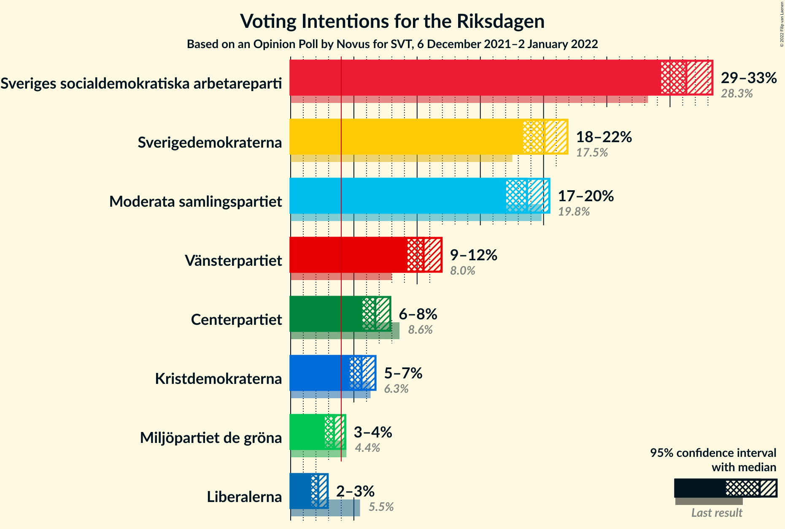

### Confidence Intervals

| Party | Last Result | Poll Result | 80% Confidence Interval | 90% Confidence Interval | 95% Confidence Interval | 99% Confidence Interval |
|:-----:|:-----------:|:-----------:|:-----------------------:|:-----------------------:|:-----------------------:|:-----------------------:|
| Sveriges socialdemokratiska arbetareparti | 28.3% | 31.3% | 30.0–32.6% |29.6–33.0% |29.3–33.3% |28.7–34.0% |
| Sverigedemokraterna | 17.5% | 20.1% | 19.0–21.3% |18.7–21.6% |18.4–21.9% |17.9–22.5% |
| Moderata samlingspartiet | 19.8% | 18.7% | 17.6–19.8% |17.3–20.2% |17.0–20.5% |16.5–21.0% |
| Vänsterpartiet | 8.0% | 10.5% | 9.7–11.4% |9.4–11.7% |9.2–11.9% |8.9–12.4% |
| Centerpartiet | 8.6% | 6.7% | 6.0–7.5% |5.8–7.7% |5.7–7.9% |5.4–8.3% |
| Kristdemokraterna | 6.3% | 5.6% | 5.0–6.3% |4.8–6.5% |4.7–6.7% |4.4–7.1% |
| Miljöpartiet de gröna | 4.4% | 3.4% | 2.9–4.0% |2.8–4.2% |2.7–4.3% |2.5–4.6% |
| Liberalerna | 5.5% | 2.2% | 1.8–2.7% |1.7–2.8% |1.6–2.9% |1.5–3.2% |

*Note:* The poll result column reflects the actual value used in the calculations. Published results may vary slightly, and in addition be rounded to fewer digits.

## Seats

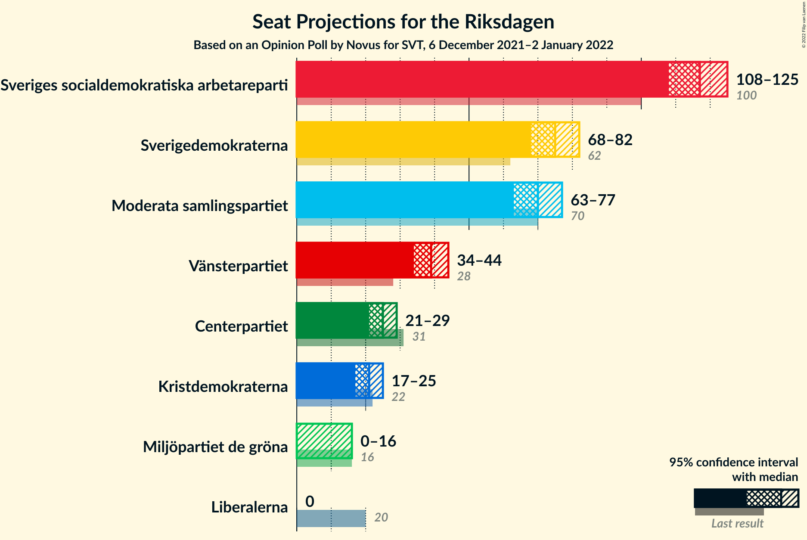

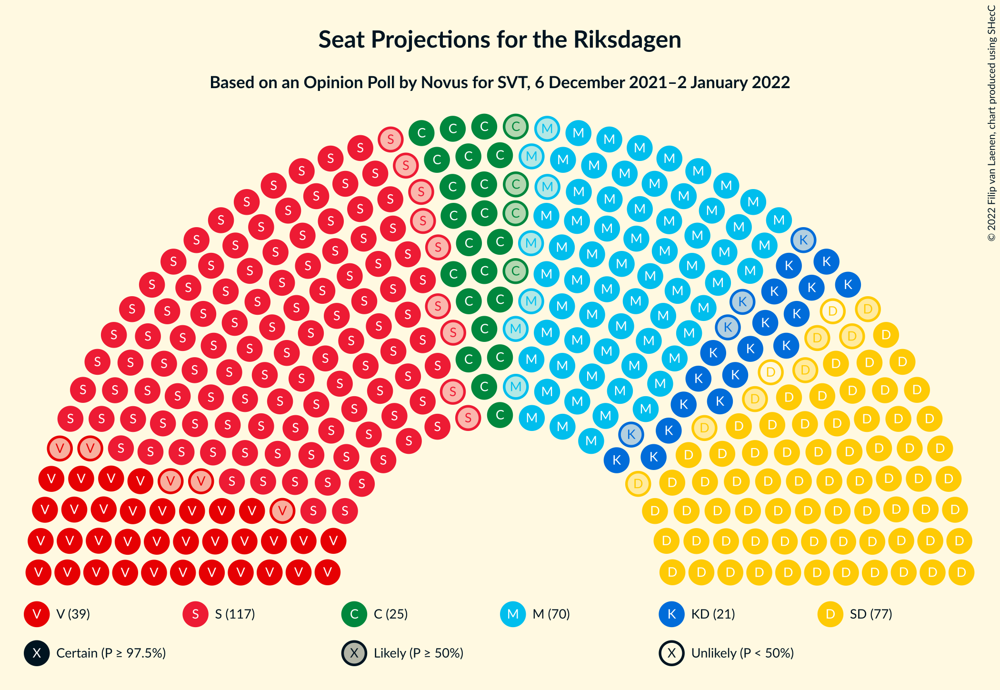

### Confidence Intervals

| Party | Last Result | Median | 80% Confidence Interval | 90% Confidence Interval | 95% Confidence Interval | 99% Confidence Interval |
|:-----:|:-----------:|:------:|:-----------------------:|:-----------------------:|:-----------------------:|:-----------------------:|
| <a href="#sveriges-socialdemokratiska-arbetareparti">Sveriges socialdemokratiska arbetareparti</a> | 100 | 117 | 112–122 |110–124 |108–125 |105–127 |
| <a href="#sverigedemokraterna">Sverigedemokraterna</a> | 62 | 75 | 71–80 |70–81 |68–82 |66–84 |
| <a href="#moderata-samlingspartiet">Moderata samlingspartiet</a> | 70 | 70 | 66–74 |64–76 |63–77 |61–79 |
| <a href="#vänsterpartiet">Vänsterpartiet</a> | 28 | 39 | 36–43 |35–44 |34–44 |33–46 |
| <a href="#centerpartiet">Centerpartiet</a> | 31 | 25 | 22–28 |22–29 |21–29 |20–31 |
| <a href="#kristdemokraterna">Kristdemokraterna</a> | 22 | 21 | 19–24 |18–24 |17–25 |16–26 |
| <a href="#miljöpartiet-de-gröna">Miljöpartiet de gröna</a> | 16 | 0 | 0 |0–15 |0–16 |0–17 |
| <a href="#liberalerna">Liberalerna</a> | 20 | 0 | 0 |0 |0 |0 |

### Sveriges socialdemokratiska arbetareparti

*For a full overview of the results for this party, see the [Sveriges socialdemokratiska arbetareparti](party-sverigessocialdemokratiskaarbetareparti.html) page.*

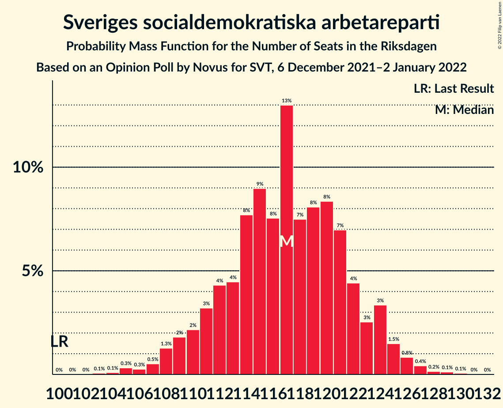

| Number of Seats | Probability | Accumulated | Special Marks |
|:---------------:|:-----------:|:-----------:|:-------------:|
| 100 | 0% | 100% | Last Result |
| 101 | 0% | 100% |  |
| 102 | 0% | 100% |  |
| 103 | 0.1% | 100% |  |
| 104 | 0.1% | 99.9% |  |
| 105 | 0.3% | 99.8% |  |
| 106 | 0.3% | 99.5% |  |
| 107 | 0.5% | 99.2% |  |
| 108 | 1.3% | 98.7% |  |
| 109 | 2% | 97% |  |
| 110 | 2% | 96% |  |
| 111 | 3% | 93% |  |
| 112 | 4% | 90% |  |
| 113 | 4% | 86% |  |
| 114 | 8% | 82% |  |
| 115 | 9% | 74% |  |
| 116 | 8% | 65% |  |
| 117 | 13% | 57% | Median |
| 118 | 7% | 44% |  |
| 119 | 8% | 37% |  |
| 120 | 8% | 29% |  |
| 121 | 7% | 20% |  |
| 122 | 4% | 13% |  |
| 123 | 3% | 9% |  |
| 124 | 3% | 6% |  |
| 125 | 1.5% | 3% |  |
| 126 | 0.8% | 2% |  |
| 127 | 0.4% | 0.8% |  |
| 128 | 0.2% | 0.4% |  |
| 129 | 0.1% | 0.2% |  |
| 130 | 0.1% | 0.1% |  |
| 131 | 0% | 0% |  |

### Sverigedemokraterna

*For a full overview of the results for this party, see the [Sverigedemokraterna](party-sverigedemokraterna.html) page.*

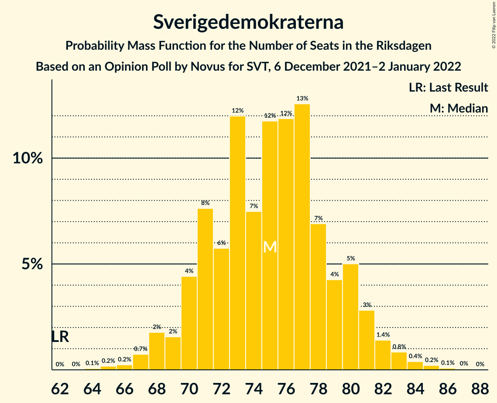

| Number of Seats | Probability | Accumulated | Special Marks |
|:---------------:|:-----------:|:-----------:|:-------------:|
| 62 | 0% | 100% | Last Result |
| 63 | 0% | 100% |  |
| 64 | 0.1% | 100% |  |
| 65 | 0.2% | 99.9% |  |
| 66 | 0.2% | 99.7% |  |
| 67 | 0.7% | 99.5% |  |
| 68 | 2% | 98.8% |  |
| 69 | 2% | 97% |  |
| 70 | 4% | 95% |  |
| 71 | 8% | 91% |  |
| 72 | 6% | 83% |  |
| 73 | 12% | 78% |  |
| 74 | 7% | 66% |  |
| 75 | 12% | 58% | Median |
| 76 | 12% | 46% |  |
| 77 | 13% | 35% |  |
| 78 | 7% | 22% |  |
| 79 | 4% | 15% |  |
| 80 | 5% | 11% |  |
| 81 | 3% | 6% |  |
| 82 | 1.4% | 3% |  |
| 83 | 0.8% | 2% |  |
| 84 | 0.4% | 0.7% |  |
| 85 | 0.2% | 0.4% |  |
| 86 | 0.1% | 0.1% |  |
| 87 | 0% | 0.1% |  |
| 88 | 0% | 0% |  |

### Moderata samlingspartiet

*For a full overview of the results for this party, see the [Moderata samlingspartiet](party-moderatasamlingspartiet.html) page.*

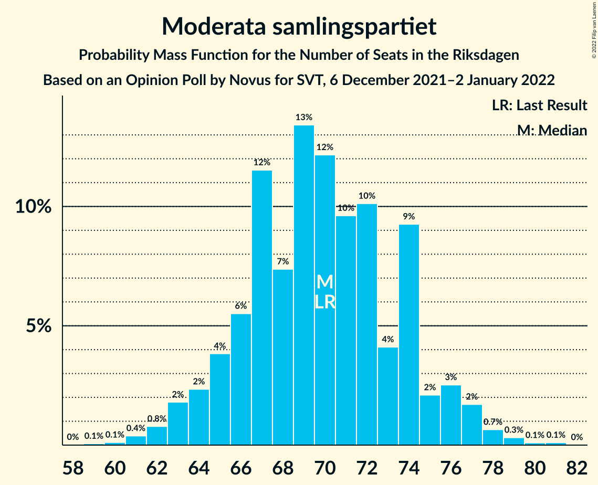

| Number of Seats | Probability | Accumulated | Special Marks |
|:---------------:|:-----------:|:-----------:|:-------------:|
| 59 | 0.1% | 100% |  |
| 60 | 0.1% | 99.9% |  |
| 61 | 0.4% | 99.8% |  |
| 62 | 0.8% | 99.4% |  |
| 63 | 2% | 98.6% |  |
| 64 | 2% | 97% |  |
| 65 | 4% | 94% |  |
| 66 | 6% | 91% |  |
| 67 | 12% | 85% |  |
| 68 | 7% | 74% |  |
| 69 | 13% | 66% |  |
| 70 | 12% | 53% | Last Result, Median |
| 71 | 10% | 41% |  |
| 72 | 10% | 31% |  |
| 73 | 4% | 21% |  |
| 74 | 9% | 17% |  |
| 75 | 2% | 8% |  |
| 76 | 3% | 5% |  |
| 77 | 2% | 3% |  |
| 78 | 0.7% | 1.2% |  |
| 79 | 0.3% | 0.5% |  |
| 80 | 0.1% | 0.2% |  |
| 81 | 0.1% | 0.1% |  |
| 82 | 0% | 0% |  |

### Vänsterpartiet

*For a full overview of the results for this party, see the [Vänsterpartiet](party-vänsterpartiet.html) page.*

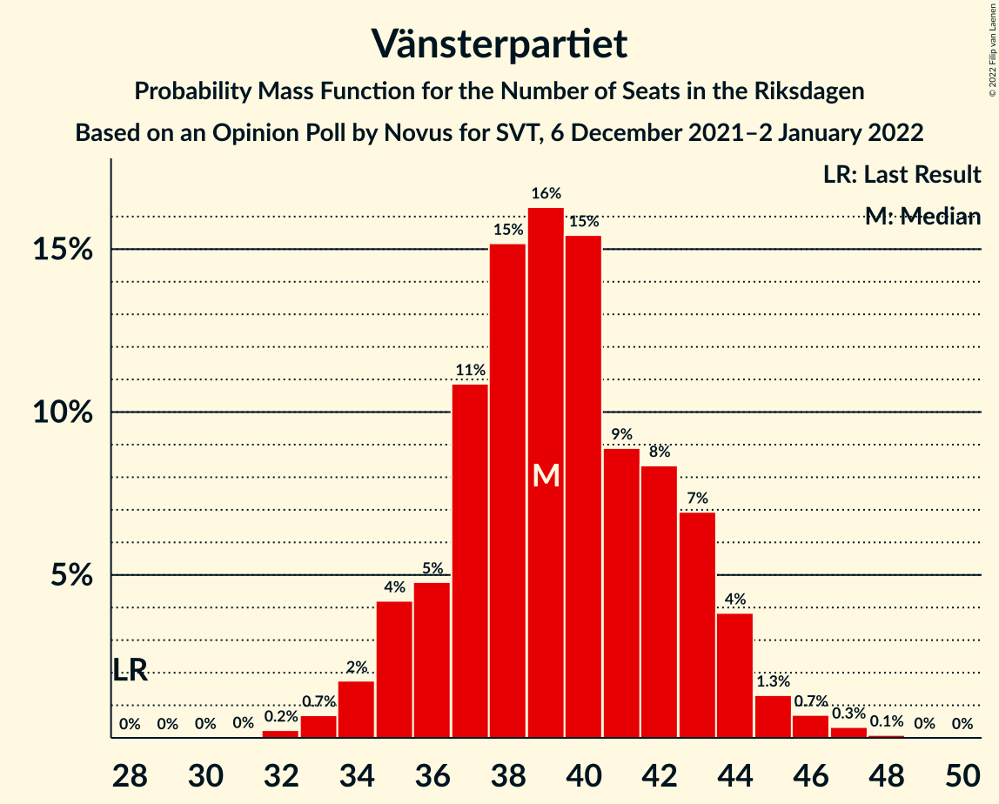

| Number of Seats | Probability | Accumulated | Special Marks |
|:---------------:|:-----------:|:-----------:|:-------------:|
| 28 | 0% | 100% | Last Result |
| 29 | 0% | 100% |  |
| 30 | 0% | 100% |  |
| 31 | 0% | 100% |  |
| 32 | 0.2% | 99.9% |  |
| 33 | 0.7% | 99.7% |  |
| 34 | 2% | 99.0% |  |
| 35 | 4% | 97% |  |
| 36 | 5% | 93% |  |
| 37 | 11% | 88% |  |
| 38 | 15% | 77% |  |
| 39 | 16% | 62% | Median |
| 40 | 15% | 46% |  |
| 41 | 9% | 30% |  |
| 42 | 8% | 22% |  |
| 43 | 7% | 13% |  |
| 44 | 4% | 6% |  |
| 45 | 1.3% | 2% |  |
| 46 | 0.7% | 1.2% |  |
| 47 | 0.3% | 0.5% |  |
| 48 | 0.1% | 0.1% |  |
| 49 | 0% | 0% |  |

### Centerpartiet

*For a full overview of the results for this party, see the [Centerpartiet](party-centerpartiet.html) page.*

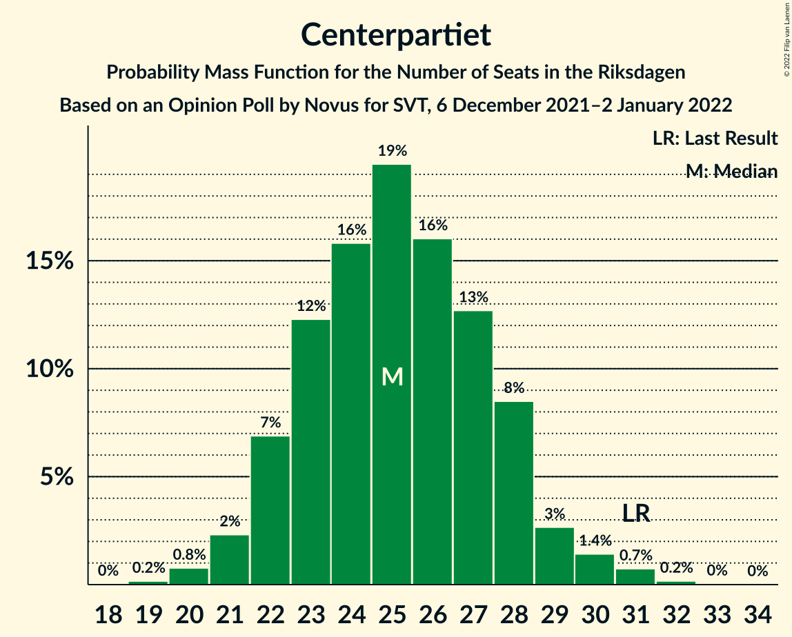

| Number of Seats | Probability | Accumulated | Special Marks |
|:---------------:|:-----------:|:-----------:|:-------------:|
| 19 | 0.2% | 100% |  |
| 20 | 0.8% | 99.8% |  |
| 21 | 2% | 99.0% |  |
| 22 | 7% | 97% |  |
| 23 | 12% | 90% |  |
| 24 | 16% | 78% |  |
| 25 | 19% | 62% | Median |
| 26 | 16% | 42% |  |
| 27 | 13% | 26% |  |
| 28 | 8% | 14% |  |
| 29 | 3% | 5% |  |
| 30 | 1.4% | 2% |  |
| 31 | 0.7% | 1.0% | Last Result |
| 32 | 0.2% | 0.2% |  |
| 33 | 0% | 0.1% |  |
| 34 | 0% | 0% |  |

### Kristdemokraterna

*For a full overview of the results for this party, see the [Kristdemokraterna](party-kristdemokraterna.html) page.*

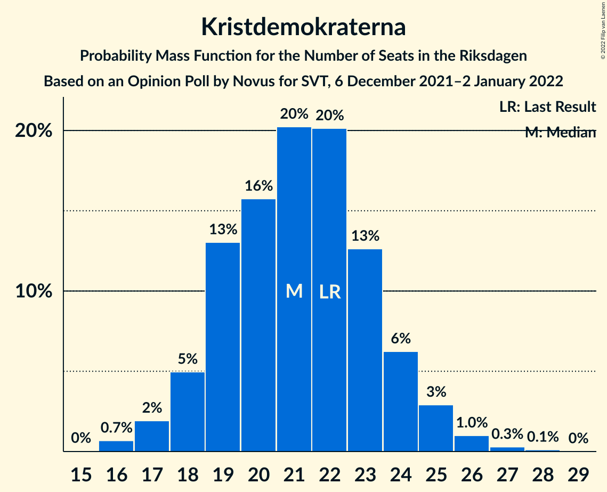

| Number of Seats | Probability | Accumulated | Special Marks |
|:---------------:|:-----------:|:-----------:|:-------------:|
| 15 | 0% | 100% |  |
| 16 | 0.7% | 99.9% |  |
| 17 | 2% | 99.3% |  |
| 18 | 5% | 97% |  |
| 19 | 13% | 92% |  |
| 20 | 16% | 79% |  |
| 21 | 20% | 64% | Median |
| 22 | 20% | 43% | Last Result |
| 23 | 13% | 23% |  |
| 24 | 6% | 11% |  |
| 25 | 3% | 4% |  |
| 26 | 1.0% | 1.4% |  |
| 27 | 0.3% | 0.4% |  |
| 28 | 0.1% | 0.1% |  |
| 29 | 0% | 0% |  |

### Miljöpartiet de gröna

*For a full overview of the results for this party, see the [Miljöpartiet de gröna](party-miljöpartietdegröna.html) page.*

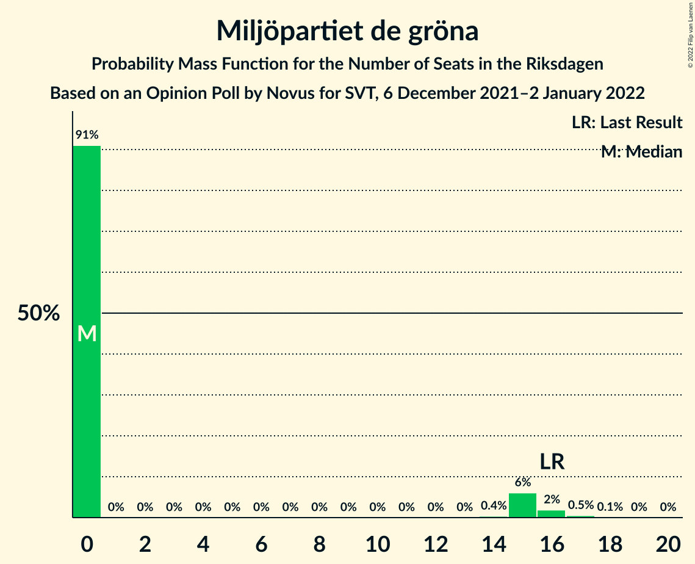

| Number of Seats | Probability | Accumulated | Special Marks |
|:---------------:|:-----------:|:-----------:|:-------------:|
| 0 | 91% | 100% | Median |
| 1 | 0% | 9% |  |
| 2 | 0% | 9% |  |
| 3 | 0% | 9% |  |
| 4 | 0% | 9% |  |
| 5 | 0% | 9% |  |
| 6 | 0% | 9% |  |
| 7 | 0% | 9% |  |
| 8 | 0% | 9% |  |
| 9 | 0% | 9% |  |
| 10 | 0% | 9% |  |
| 11 | 0% | 9% |  |
| 12 | 0% | 9% |  |
| 13 | 0% | 9% |  |
| 14 | 0.4% | 9% |  |
| 15 | 6% | 9% |  |
| 16 | 2% | 3% | Last Result |
| 17 | 0.5% | 0.6% |  |
| 18 | 0.1% | 0.1% |  |
| 19 | 0% | 0% |  |

### Liberalerna

*For a full overview of the results for this party, see the [Liberalerna](party-liberalerna.html) page.*

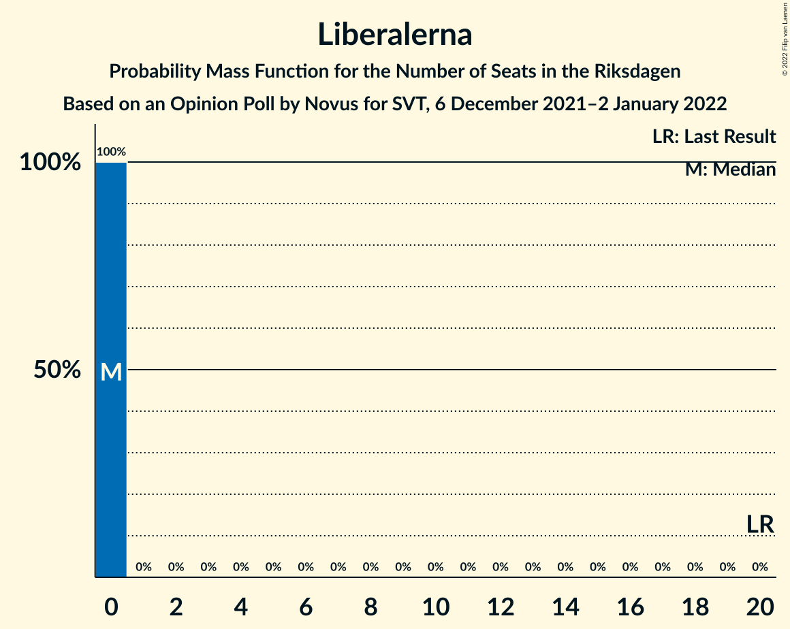

| Number of Seats | Probability | Accumulated | Special Marks |
|:---------------:|:-----------:|:-----------:|:-------------:|
| 0 | 100% | 100% | Median |
| 1 | 0% | 0% |  |
| 2 | 0% | 0% |  |
| 3 | 0% | 0% |  |
| 4 | 0% | 0% |  |
| 5 | 0% | 0% |  |
| 6 | 0% | 0% |  |
| 7 | 0% | 0% |  |
| 8 | 0% | 0% |  |
| 9 | 0% | 0% |  |
| 10 | 0% | 0% |  |
| 11 | 0% | 0% |  |
| 12 | 0% | 0% |  |
| 13 | 0% | 0% |  |
| 14 | 0% | 0% |  |
| 15 | 0% | 0% |  |
| 16 | 0% | 0% |  |
| 17 | 0% | 0% |  |
| 18 | 0% | 0% |  |
| 19 | 0% | 0% |  |
| 20 | 0% | 0% | Last Result |

## Coalitions

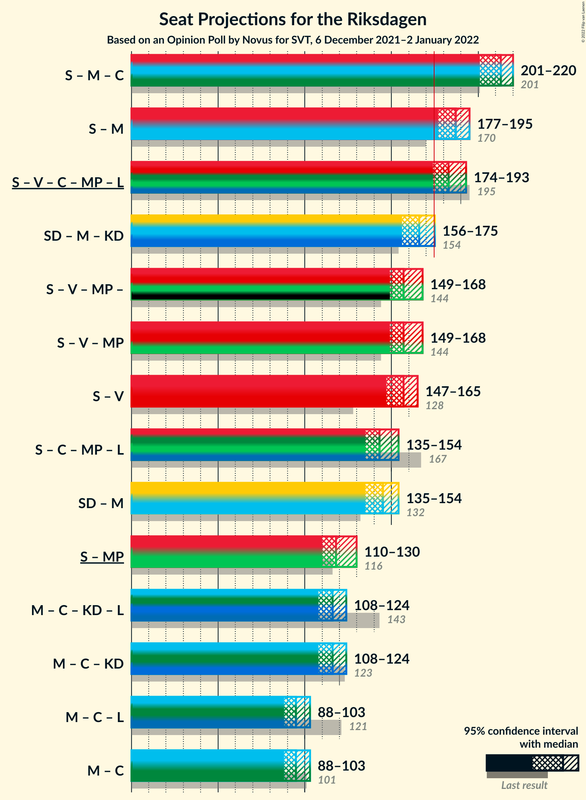

### Confidence Intervals

| Coalition | Last Result | Median | Majority? | 80% Confidence Interval | 90% Confidence Interval | 95% Confidence Interval | 99% Confidence Interval |
|:---------:|:-----------:|:------:|:---------:|:-----------------------:|:-----------------------:|:-----------------------:|:-----------------------:|
| Sveriges socialdemokratiska arbetareparti – Moderata samlingspartiet – Centerpartiet | 201 | 213 | 100% | 206–218 | 204–219 | 201–220 | 197–223 |
| Sveriges socialdemokratiska arbetareparti – Moderata samlingspartiet | 170 | 187 | 98.8% | 181–192 | 178–194 | 177–195 | 173–198 |
| Sveriges socialdemokratiska arbetareparti – Vänsterpartiet – Centerpartiet – Miljöpartiet de gröna – Liberalerna | 195 | 183 | 97% | 178–189 | 176–191 | 174–193 | 172–197 |
| Sverigedemokraterna – Moderata samlingspartiet – Kristdemokraterna | 154 | 166 | 3% | 160–171 | 158–173 | 156–175 | 152–177 |
| Sveriges socialdemokratiska arbetareparti – Vänsterpartiet – Miljöpartiet de gröna | 144 | 157 | 0.1% | 152–164 | 151–166 | 149–168 | 147–172 |
| Sveriges socialdemokratiska arbetareparti – Vänsterpartiet | 128 | 157 | 0% | 151–162 | 148–164 | 147–165 | 143–167 |
| Sveriges socialdemokratiska arbetareparti – Centerpartiet – Miljöpartiet de gröna – Liberalerna | 167 | 143 | 0% | 138–150 | 136–152 | 135–154 | 133–158 |
| Sverigedemokraterna – Moderata samlingspartiet | 132 | 145 | 0% | 139–150 | 137–152 | 135–154 | 133–156 |
| Sveriges socialdemokratiska arbetareparti – Miljöpartiet de gröna | 116 | 118 | 0% | 113–124 | 111–128 | 110–130 | 108–133 |
| Moderata samlingspartiet – Centerpartiet – Kristdemokraterna – Liberalerna | 143 | 116 | 0% | 111–121 | 109–123 | 108–124 | 105–126 |
| Moderata samlingspartiet – Centerpartiet – Kristdemokraterna | 123 | 116 | 0% | 111–121 | 109–123 | 108–124 | 105–126 |
| Moderata samlingspartiet – Centerpartiet – Liberalerna | 121 | 95 | 0% | 90–100 | 89–101 | 88–103 | 85–105 |
| Moderata samlingspartiet – Centerpartiet | 101 | 95 | 0% | 90–100 | 89–101 | 88–103 | 85–105 |

### Sveriges socialdemokratiska arbetareparti – Moderata samlingspartiet – Centerpartiet

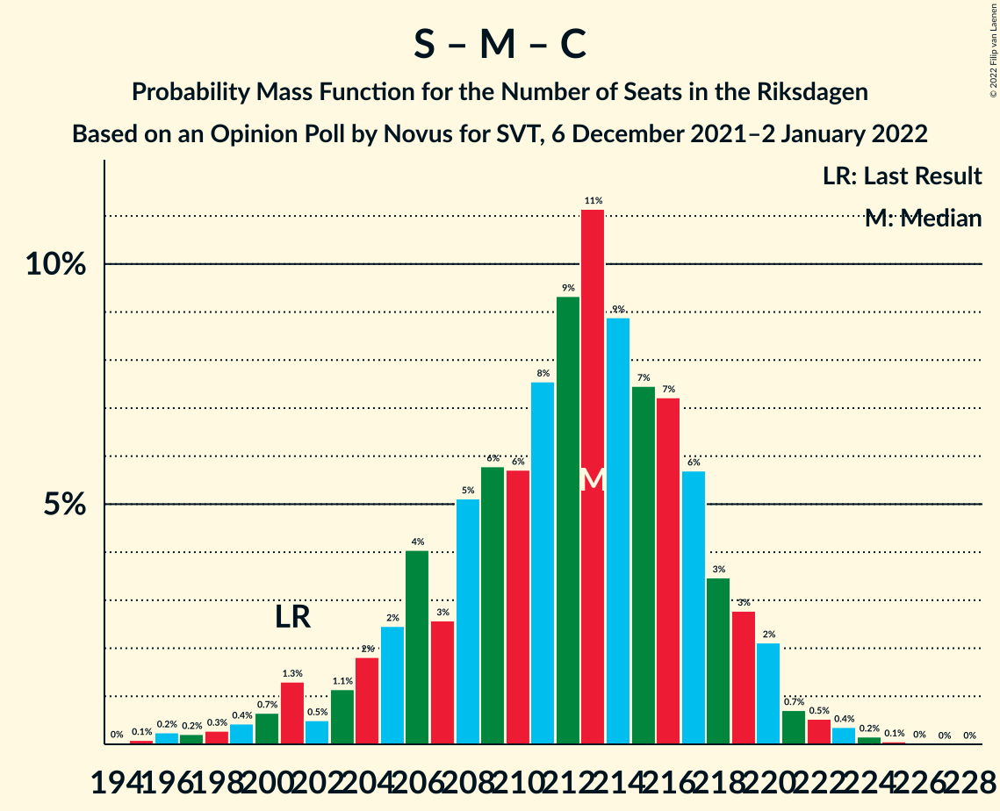

| Number of Seats | Probability | Accumulated | Special Marks |
|:---------------:|:-----------:|:-----------:|:-------------:|
| 194 | 0% | 100% |  |
| 195 | 0.1% | 99.9% |  |
| 196 | 0.2% | 99.8% |  |
| 197 | 0.2% | 99.6% |  |
| 198 | 0.3% | 99.4% |  |
| 199 | 0.4% | 99.1% |  |
| 200 | 0.7% | 98.7% |  |
| 201 | 1.3% | 98% | Last Result |
| 202 | 0.5% | 97% |  |
| 203 | 1.1% | 96% |  |
| 204 | 2% | 95% |  |
| 205 | 2% | 93% |  |
| 206 | 4% | 91% |  |
| 207 | 3% | 87% |  |
| 208 | 5% | 84% |  |
| 209 | 6% | 79% |  |
| 210 | 6% | 73% |  |
| 211 | 8% | 68% |  |
| 212 | 9% | 60% | Median |
| 213 | 11% | 51% |  |
| 214 | 9% | 40% |  |
| 215 | 7% | 31% |  |
| 216 | 7% | 23% |  |
| 217 | 6% | 16% |  |
| 218 | 3% | 10% |  |
| 219 | 3% | 7% |  |
| 220 | 2% | 4% |  |
| 221 | 0.7% | 2% |  |
| 222 | 0.5% | 1.2% |  |
| 223 | 0.4% | 0.6% |  |
| 224 | 0.2% | 0.3% |  |
| 225 | 0.1% | 0.1% |  |
| 226 | 0% | 0.1% |  |
| 227 | 0% | 0% |  |

### Sveriges socialdemokratiska arbetareparti – Moderata samlingspartiet

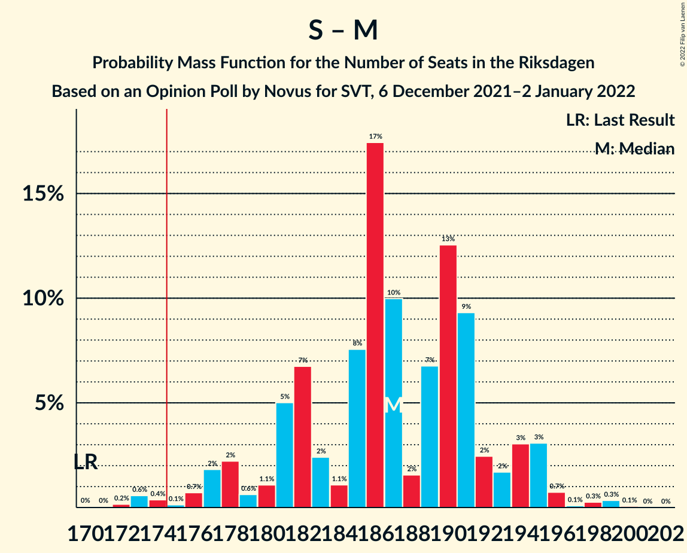

| Number of Seats | Probability | Accumulated | Special Marks |
|:---------------:|:-----------:|:-----------:|:-------------:|
| 170 | 0% | 100% | Last Result |
| 171 | 0% | 99.9% |  |
| 172 | 0.2% | 99.9% |  |
| 173 | 0.6% | 99.7% |  |
| 174 | 0.4% | 99.1% |  |
| 175 | 0.1% | 98.8% | Majority |
| 176 | 0.7% | 98.6% |  |
| 177 | 2% | 98% |  |
| 178 | 2% | 96% |  |
| 179 | 0.6% | 94% |  |
| 180 | 1.1% | 93% |  |
| 181 | 5% | 92% |  |
| 182 | 7% | 87% |  |
| 183 | 2% | 80% |  |
| 184 | 1.1% | 78% |  |
| 185 | 8% | 77% |  |
| 186 | 17% | 69% |  |
| 187 | 10% | 52% | Median |
| 188 | 2% | 42% |  |
| 189 | 7% | 40% |  |
| 190 | 13% | 34% |  |
| 191 | 9% | 21% |  |
| 192 | 2% | 12% |  |
| 193 | 2% | 9% |  |
| 194 | 3% | 8% |  |
| 195 | 3% | 5% |  |
| 196 | 0.7% | 2% |  |
| 197 | 0.1% | 0.8% |  |
| 198 | 0.3% | 0.7% |  |
| 199 | 0.3% | 0.4% |  |
| 200 | 0.1% | 0.1% |  |
| 201 | 0% | 0% |  |

### Sveriges socialdemokratiska arbetareparti – Vänsterpartiet – Centerpartiet – Miljöpartiet de gröna – Liberalerna

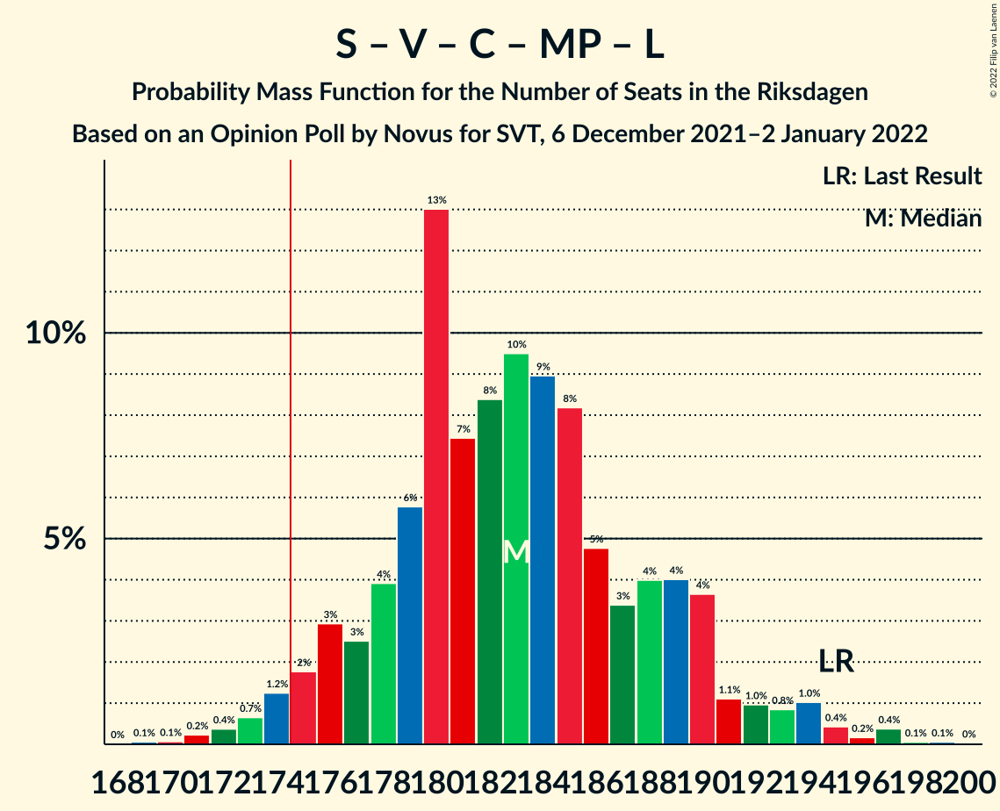

| Number of Seats | Probability | Accumulated | Special Marks |
|:---------------:|:-----------:|:-----------:|:-------------:|
| 169 | 0.1% | 100% |  |
| 170 | 0.1% | 99.9% |  |
| 171 | 0.2% | 99.8% |  |
| 172 | 0.4% | 99.6% |  |
| 173 | 0.7% | 99.2% |  |
| 174 | 1.2% | 98.6% |  |
| 175 | 2% | 97% | Majority |
| 176 | 3% | 96% |  |
| 177 | 3% | 93% |  |
| 178 | 4% | 90% |  |
| 179 | 6% | 86% |  |
| 180 | 13% | 80% |  |
| 181 | 7% | 67% | Median |
| 182 | 8% | 60% |  |
| 183 | 10% | 52% |  |
| 184 | 9% | 42% |  |
| 185 | 8% | 33% |  |
| 186 | 5% | 25% |  |
| 187 | 3% | 20% |  |
| 188 | 4% | 17% |  |
| 189 | 4% | 13% |  |
| 190 | 4% | 9% |  |
| 191 | 1.1% | 5% |  |
| 192 | 1.0% | 4% |  |
| 193 | 0.8% | 3% |  |
| 194 | 1.0% | 2% |  |
| 195 | 0.4% | 1.1% | Last Result |
| 196 | 0.2% | 0.7% |  |
| 197 | 0.4% | 0.5% |  |
| 198 | 0.1% | 0.2% |  |
| 199 | 0.1% | 0.1% |  |
| 200 | 0% | 0% |  |

### Sverigedemokraterna – Moderata samlingspartiet – Kristdemokraterna

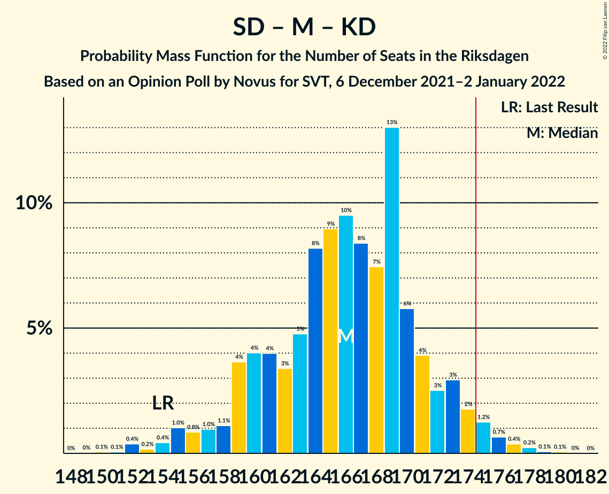

| Number of Seats | Probability | Accumulated | Special Marks |
|:---------------:|:-----------:|:-----------:|:-------------:|
| 150 | 0.1% | 100% |  |
| 151 | 0.1% | 99.9% |  |
| 152 | 0.4% | 99.8% |  |
| 153 | 0.2% | 99.5% |  |
| 154 | 0.4% | 99.3% | Last Result |
| 155 | 1.0% | 98.9% |  |
| 156 | 0.8% | 98% |  |
| 157 | 1.0% | 97% |  |
| 158 | 1.1% | 96% |  |
| 159 | 4% | 95% |  |
| 160 | 4% | 91% |  |
| 161 | 4% | 87% |  |
| 162 | 3% | 83% |  |
| 163 | 5% | 80% |  |
| 164 | 8% | 75% |  |
| 165 | 9% | 67% |  |
| 166 | 10% | 58% | Median |
| 167 | 8% | 48% |  |
| 168 | 7% | 40% |  |
| 169 | 13% | 33% |  |
| 170 | 6% | 20% |  |
| 171 | 4% | 14% |  |
| 172 | 3% | 10% |  |
| 173 | 3% | 7% |  |
| 174 | 2% | 4% |  |
| 175 | 1.2% | 3% | Majority |
| 176 | 0.7% | 1.4% |  |
| 177 | 0.4% | 0.8% |  |
| 178 | 0.2% | 0.4% |  |
| 179 | 0.1% | 0.2% |  |
| 180 | 0.1% | 0.1% |  |
| 181 | 0% | 0% |  |

### Sveriges socialdemokratiska arbetareparti – Vänsterpartiet – Miljöpartiet de gröna

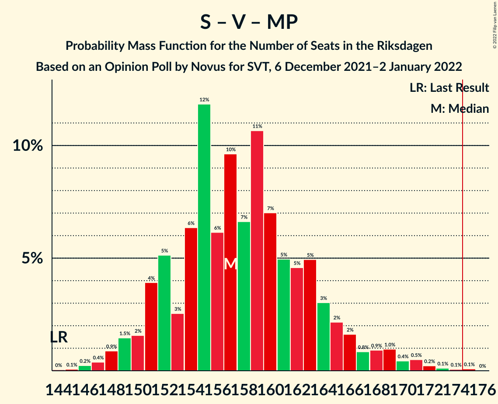

| Number of Seats | Probability | Accumulated | Special Marks |
|:---------------:|:-----------:|:-----------:|:-------------:|
| 144 | 0% | 100% | Last Result |
| 145 | 0.1% | 99.9% |  |
| 146 | 0.2% | 99.9% |  |
| 147 | 0.4% | 99.6% |  |
| 148 | 0.9% | 99.2% |  |
| 149 | 1.5% | 98% |  |
| 150 | 2% | 97% |  |
| 151 | 4% | 95% |  |
| 152 | 5% | 91% |  |
| 153 | 3% | 86% |  |
| 154 | 6% | 84% |  |
| 155 | 12% | 77% |  |
| 156 | 6% | 66% | Median |
| 157 | 10% | 59% |  |
| 158 | 7% | 50% |  |
| 159 | 11% | 43% |  |
| 160 | 7% | 32% |  |
| 161 | 5% | 25% |  |
| 162 | 5% | 21% |  |
| 163 | 5% | 16% |  |
| 164 | 3% | 11% |  |
| 165 | 2% | 8% |  |
| 166 | 2% | 6% |  |
| 167 | 0.8% | 4% |  |
| 168 | 0.9% | 3% |  |
| 169 | 1.0% | 2% |  |
| 170 | 0.4% | 1.5% |  |
| 171 | 0.5% | 1.0% |  |
| 172 | 0.2% | 0.5% |  |
| 173 | 0.1% | 0.3% |  |
| 174 | 0.1% | 0.2% |  |
| 175 | 0.1% | 0.1% | Majority |
| 176 | 0% | 0% |  |

### Sveriges socialdemokratiska arbetareparti – Vänsterpartiet

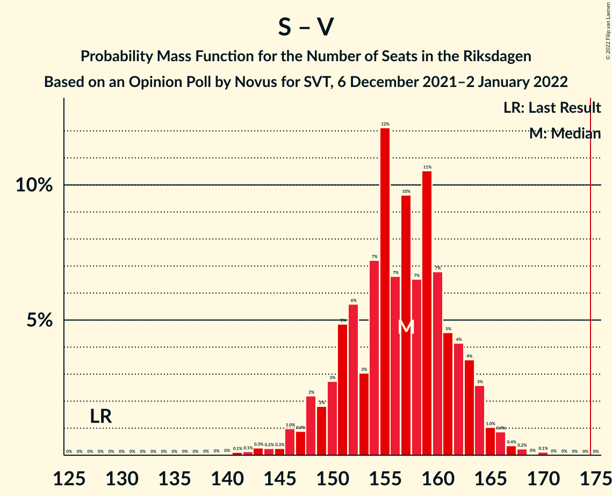

| Number of Seats | Probability | Accumulated | Special Marks |
|:---------------:|:-----------:|:-----------:|:-------------:|
| 128 | 0% | 100% | Last Result |
| 129 | 0% | 100% |  |
| 130 | 0% | 100% |  |
| 131 | 0% | 100% |  |
| 132 | 0% | 100% |  |
| 133 | 0% | 100% |  |
| 134 | 0% | 100% |  |
| 135 | 0% | 100% |  |
| 136 | 0% | 100% |  |
| 137 | 0% | 100% |  |
| 138 | 0% | 100% |  |
| 139 | 0% | 100% |  |
| 140 | 0% | 100% |  |
| 141 | 0.1% | 99.9% |  |
| 142 | 0.1% | 99.8% |  |
| 143 | 0.3% | 99.7% |  |
| 144 | 0.2% | 99.4% |  |
| 145 | 0.3% | 99.2% |  |
| 146 | 1.0% | 98.9% |  |
| 147 | 0.9% | 98% |  |
| 148 | 2% | 97% |  |
| 149 | 2% | 95% |  |
| 150 | 3% | 93% |  |
| 151 | 5% | 90% |  |
| 152 | 6% | 85% |  |
| 153 | 3% | 80% |  |
| 154 | 7% | 77% |  |
| 155 | 12% | 70% |  |
| 156 | 7% | 58% | Median |
| 157 | 10% | 51% |  |
| 158 | 7% | 41% |  |
| 159 | 11% | 35% |  |
| 160 | 7% | 24% |  |
| 161 | 5% | 17% |  |
| 162 | 4% | 13% |  |
| 163 | 4% | 9% |  |
| 164 | 3% | 5% |  |
| 165 | 1.0% | 3% |  |
| 166 | 0.9% | 2% |  |
| 167 | 0.4% | 0.8% |  |
| 168 | 0.2% | 0.4% |  |
| 169 | 0% | 0.2% |  |
| 170 | 0.1% | 0.1% |  |
| 171 | 0% | 0% |  |

### Sveriges socialdemokratiska arbetareparti – Centerpartiet – Miljöpartiet de gröna – Liberalerna

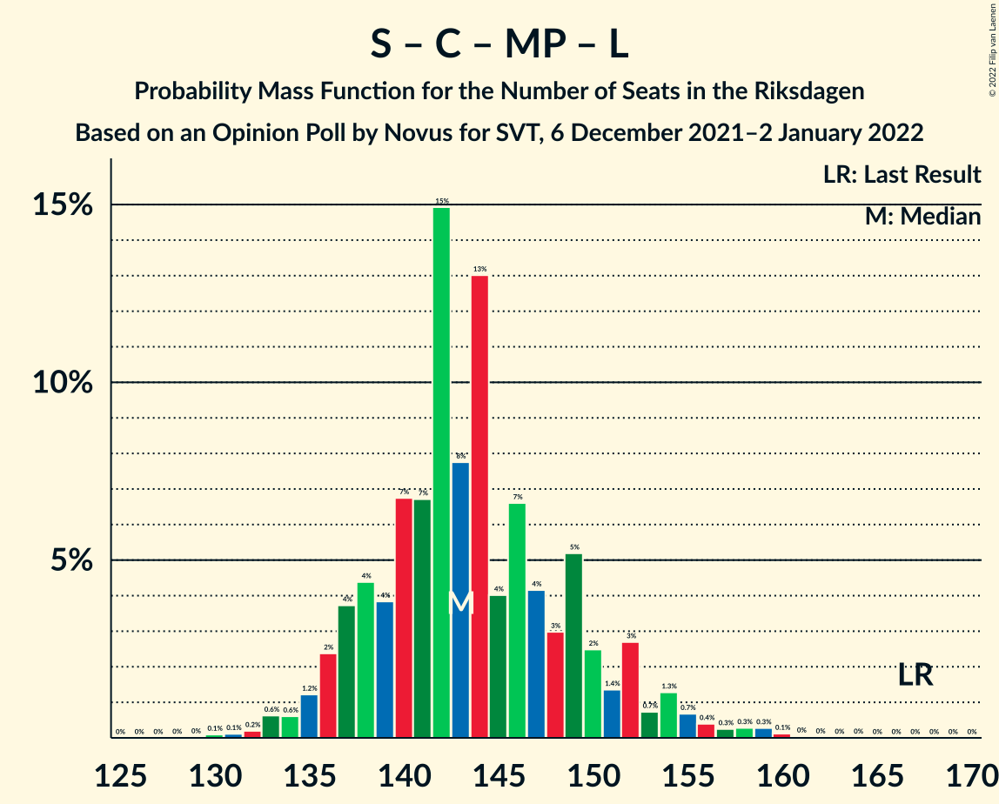

| Number of Seats | Probability | Accumulated | Special Marks |
|:---------------:|:-----------:|:-----------:|:-------------:|
| 130 | 0.1% | 100% |  |
| 131 | 0.1% | 99.9% |  |
| 132 | 0.2% | 99.8% |  |
| 133 | 0.6% | 99.6% |  |
| 134 | 0.6% | 98.9% |  |
| 135 | 1.2% | 98% |  |
| 136 | 2% | 97% |  |
| 137 | 4% | 95% |  |
| 138 | 4% | 91% |  |
| 139 | 4% | 87% |  |
| 140 | 7% | 83% |  |
| 141 | 7% | 76% |  |
| 142 | 15% | 69% | Median |
| 143 | 8% | 54% |  |
| 144 | 13% | 47% |  |
| 145 | 4% | 34% |  |
| 146 | 7% | 30% |  |
| 147 | 4% | 23% |  |
| 148 | 3% | 19% |  |
| 149 | 5% | 16% |  |
| 150 | 2% | 11% |  |
| 151 | 1.4% | 8% |  |
| 152 | 3% | 7% |  |
| 153 | 0.7% | 4% |  |
| 154 | 1.3% | 3% |  |
| 155 | 0.7% | 2% |  |
| 156 | 0.4% | 1.4% |  |
| 157 | 0.3% | 1.0% |  |
| 158 | 0.3% | 0.8% |  |
| 159 | 0.3% | 0.5% |  |
| 160 | 0.1% | 0.2% |  |
| 161 | 0% | 0.1% |  |
| 162 | 0% | 0% |  |
| 163 | 0% | 0% |  |
| 164 | 0% | 0% |  |
| 165 | 0% | 0% |  |
| 166 | 0% | 0% |  |
| 167 | 0% | 0% | Last Result |

### Sverigedemokraterna – Moderata samlingspartiet

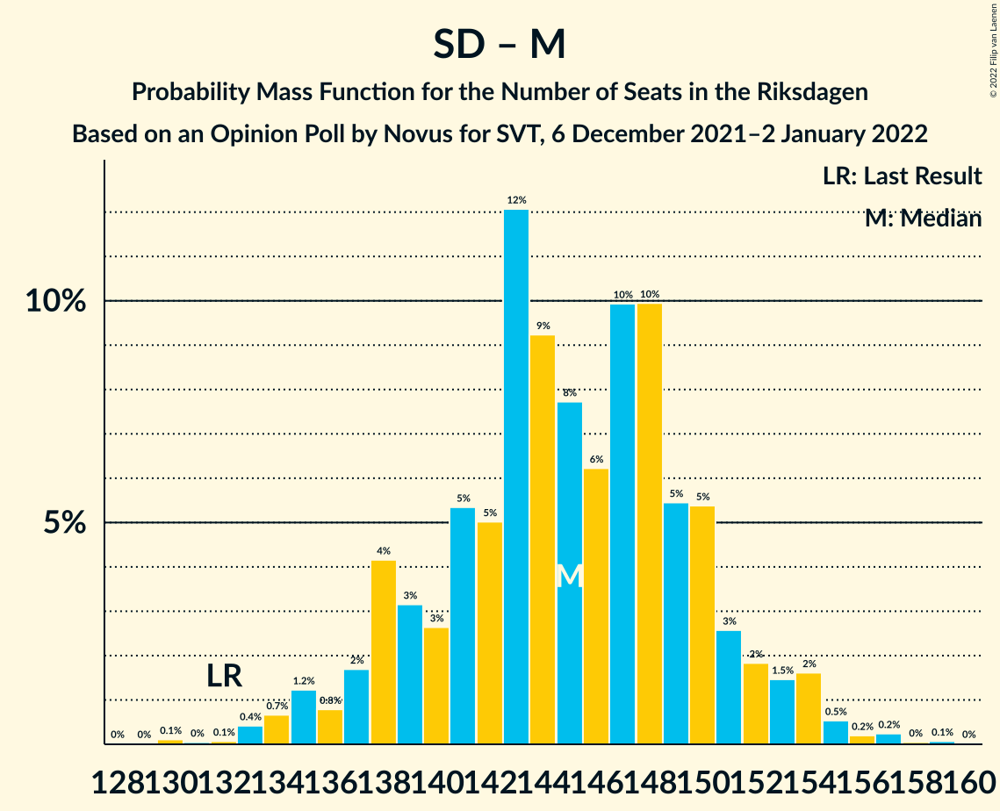

| Number of Seats | Probability | Accumulated | Special Marks |
|:---------------:|:-----------:|:-----------:|:-------------:|
| 130 | 0.1% | 100% |  |
| 131 | 0% | 99.8% |  |
| 132 | 0.1% | 99.8% | Last Result |
| 133 | 0.4% | 99.7% |  |
| 134 | 0.7% | 99.3% |  |
| 135 | 1.2% | 98.6% |  |
| 136 | 0.8% | 97% |  |
| 137 | 2% | 97% |  |
| 138 | 4% | 95% |  |
| 139 | 3% | 91% |  |
| 140 | 3% | 88% |  |
| 141 | 5% | 85% |  |
| 142 | 5% | 80% |  |
| 143 | 12% | 75% |  |
| 144 | 9% | 63% |  |
| 145 | 8% | 53% | Median |
| 146 | 6% | 46% |  |
| 147 | 10% | 39% |  |
| 148 | 10% | 29% |  |
| 149 | 5% | 19% |  |
| 150 | 5% | 14% |  |
| 151 | 3% | 9% |  |
| 152 | 2% | 6% |  |
| 153 | 1.5% | 4% |  |
| 154 | 2% | 3% |  |
| 155 | 0.5% | 1.1% |  |
| 156 | 0.2% | 0.6% |  |
| 157 | 0.2% | 0.4% |  |
| 158 | 0% | 0.2% |  |
| 159 | 0.1% | 0.1% |  |
| 160 | 0% | 0% |  |

### Sveriges socialdemokratiska arbetareparti – Miljöpartiet de gröna

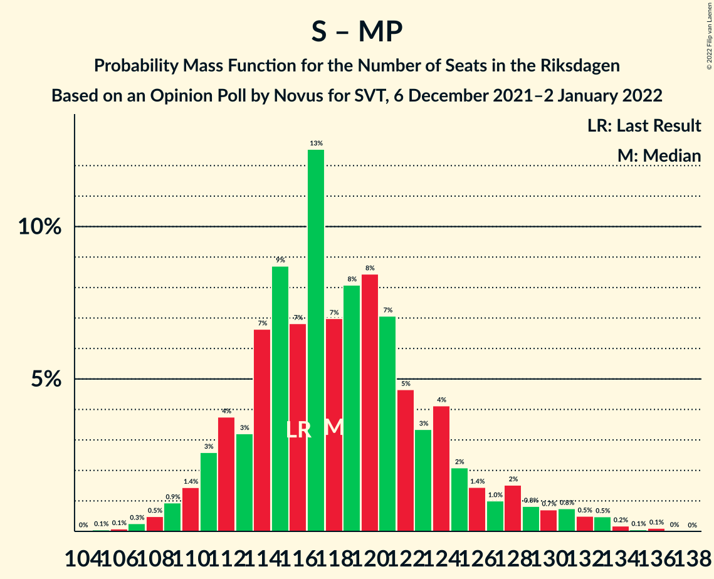

| Number of Seats | Probability | Accumulated | Special Marks |
|:---------------:|:-----------:|:-----------:|:-------------:|
| 105 | 0.1% | 100% |  |
| 106 | 0.1% | 99.9% |  |
| 107 | 0.3% | 99.8% |  |
| 108 | 0.5% | 99.6% |  |
| 109 | 0.9% | 99.1% |  |
| 110 | 1.4% | 98% |  |
| 111 | 3% | 97% |  |
| 112 | 4% | 94% |  |
| 113 | 3% | 90% |  |
| 114 | 7% | 87% |  |
| 115 | 9% | 81% |  |
| 116 | 7% | 72% | Last Result |
| 117 | 13% | 65% | Median |
| 118 | 7% | 52% |  |
| 119 | 8% | 45% |  |
| 120 | 8% | 37% |  |
| 121 | 7% | 29% |  |
| 122 | 5% | 22% |  |
| 123 | 3% | 17% |  |
| 124 | 4% | 14% |  |
| 125 | 2% | 10% |  |
| 126 | 1.4% | 8% |  |
| 127 | 1.0% | 6% |  |
| 128 | 2% | 5% |  |
| 129 | 0.8% | 4% |  |
| 130 | 0.7% | 3% |  |
| 131 | 0.8% | 2% |  |
| 132 | 0.5% | 1.4% |  |
| 133 | 0.5% | 0.9% |  |
| 134 | 0.2% | 0.4% |  |
| 135 | 0.1% | 0.2% |  |
| 136 | 0.1% | 0.2% |  |
| 137 | 0% | 0% |  |

### Moderata samlingspartiet – Centerpartiet – Kristdemokraterna – Liberalerna

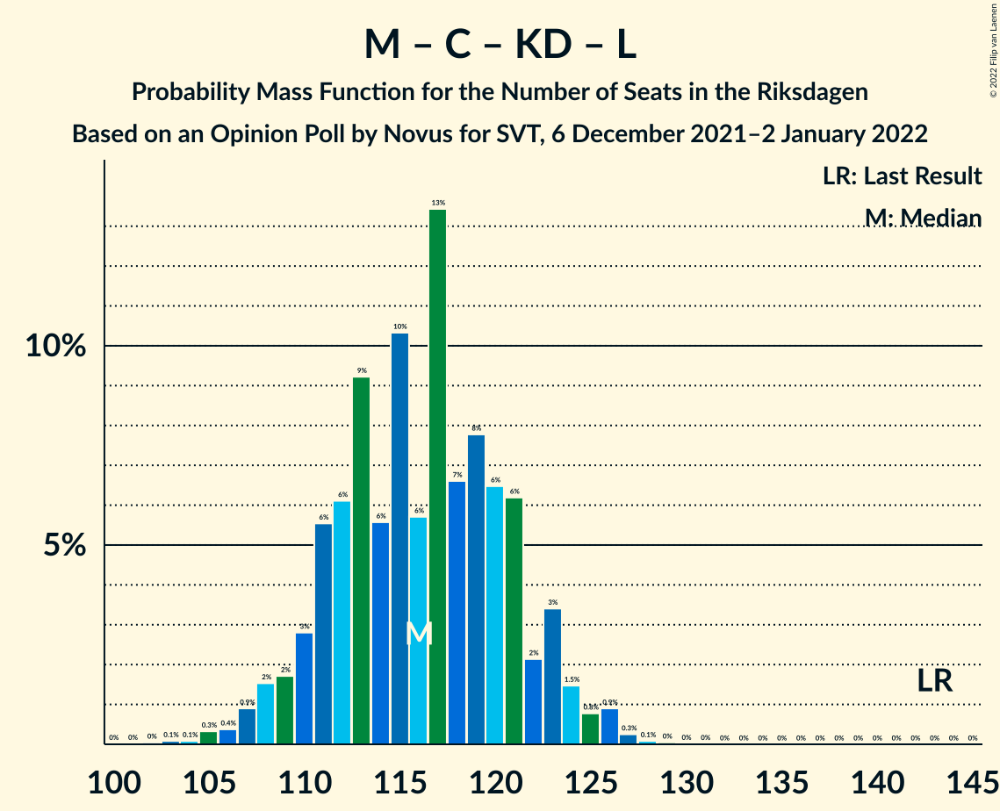

| Number of Seats | Probability | Accumulated | Special Marks |
|:---------------:|:-----------:|:-----------:|:-------------:|
| 102 | 0% | 100% |  |
| 103 | 0.1% | 99.9% |  |
| 104 | 0.1% | 99.8% |  |
| 105 | 0.3% | 99.7% |  |
| 106 | 0.4% | 99.4% |  |
| 107 | 0.9% | 99.0% |  |
| 108 | 2% | 98% |  |
| 109 | 2% | 97% |  |
| 110 | 3% | 95% |  |
| 111 | 6% | 92% |  |
| 112 | 6% | 87% |  |
| 113 | 9% | 80% |  |
| 114 | 6% | 71% |  |
| 115 | 10% | 66% |  |
| 116 | 6% | 55% | Median |
| 117 | 13% | 50% |  |
| 118 | 7% | 36% |  |
| 119 | 8% | 30% |  |
| 120 | 6% | 22% |  |
| 121 | 6% | 15% |  |
| 122 | 2% | 9% |  |
| 123 | 3% | 7% |  |
| 124 | 1.5% | 4% |  |
| 125 | 0.8% | 2% |  |
| 126 | 0.9% | 1.3% |  |
| 127 | 0.3% | 0.4% |  |
| 128 | 0.1% | 0.2% |  |
| 129 | 0% | 0.1% |  |
| 130 | 0% | 0% |  |
| 131 | 0% | 0% |  |
| 132 | 0% | 0% |  |
| 133 | 0% | 0% |  |
| 134 | 0% | 0% |  |
| 135 | 0% | 0% |  |
| 136 | 0% | 0% |  |
| 137 | 0% | 0% |  |
| 138 | 0% | 0% |  |
| 139 | 0% | 0% |  |
| 140 | 0% | 0% |  |
| 141 | 0% | 0% |  |
| 142 | 0% | 0% |  |
| 143 | 0% | 0% | Last Result |

### Moderata samlingspartiet – Centerpartiet – Kristdemokraterna

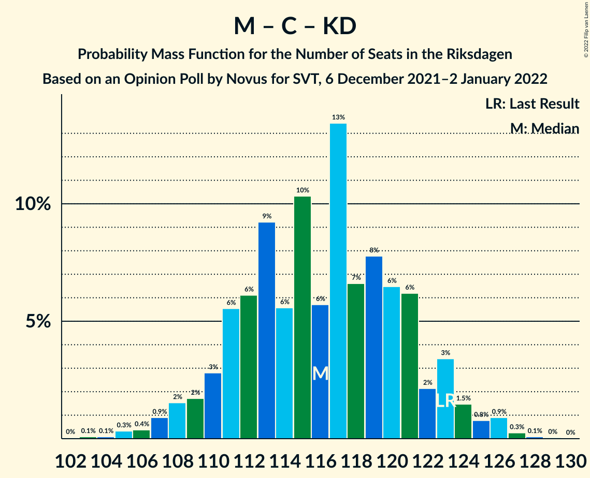

| Number of Seats | Probability | Accumulated | Special Marks |
|:---------------:|:-----------:|:-----------:|:-------------:|
| 102 | 0% | 100% |  |
| 103 | 0.1% | 99.9% |  |
| 104 | 0.1% | 99.8% |  |
| 105 | 0.3% | 99.7% |  |
| 106 | 0.4% | 99.4% |  |
| 107 | 0.9% | 99.0% |  |
| 108 | 2% | 98% |  |
| 109 | 2% | 97% |  |
| 110 | 3% | 95% |  |
| 111 | 6% | 92% |  |
| 112 | 6% | 87% |  |
| 113 | 9% | 80% |  |
| 114 | 6% | 71% |  |
| 115 | 10% | 66% |  |
| 116 | 6% | 55% | Median |
| 117 | 13% | 50% |  |
| 118 | 7% | 36% |  |
| 119 | 8% | 30% |  |
| 120 | 6% | 22% |  |
| 121 | 6% | 15% |  |
| 122 | 2% | 9% |  |
| 123 | 3% | 7% | Last Result |
| 124 | 1.5% | 4% |  |
| 125 | 0.8% | 2% |  |
| 126 | 0.9% | 1.3% |  |
| 127 | 0.3% | 0.4% |  |
| 128 | 0.1% | 0.2% |  |
| 129 | 0% | 0.1% |  |
| 130 | 0% | 0% |  |

### Moderata samlingspartiet – Centerpartiet – Liberalerna

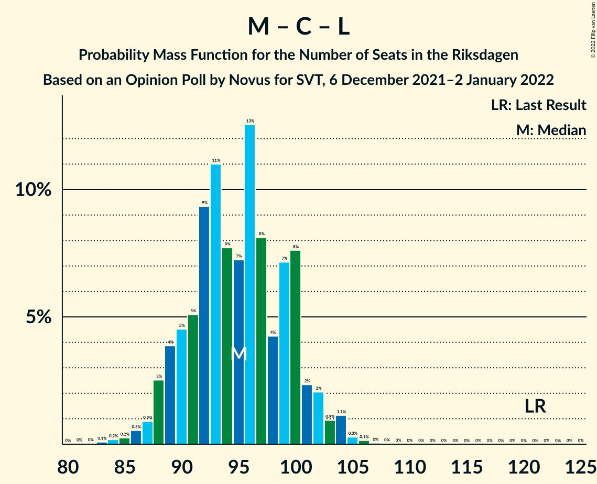

| Number of Seats | Probability | Accumulated | Special Marks |
|:---------------:|:-----------:|:-----------:|:-------------:|
| 82 | 0% | 100% |  |
| 83 | 0.1% | 99.9% |  |
| 84 | 0.2% | 99.9% |  |
| 85 | 0.2% | 99.7% |  |
| 86 | 0.5% | 99.4% |  |
| 87 | 0.9% | 98.9% |  |
| 88 | 3% | 98% |  |
| 89 | 4% | 95% |  |
| 90 | 5% | 92% |  |
| 91 | 5% | 87% |  |
| 92 | 9% | 82% |  |
| 93 | 11% | 73% |  |
| 94 | 8% | 62% |  |
| 95 | 7% | 54% | Median |
| 96 | 13% | 47% |  |
| 97 | 8% | 34% |  |
| 98 | 4% | 26% |  |
| 99 | 7% | 22% |  |
| 100 | 8% | 15% |  |
| 101 | 2% | 7% |  |
| 102 | 2% | 5% |  |
| 103 | 0.9% | 3% |  |
| 104 | 1.1% | 2% |  |
| 105 | 0.3% | 0.5% |  |
| 106 | 0.1% | 0.2% |  |
| 107 | 0% | 0.1% |  |
| 108 | 0% | 0% |  |
| 109 | 0% | 0% |  |
| 110 | 0% | 0% |  |
| 111 | 0% | 0% |  |
| 112 | 0% | 0% |  |
| 113 | 0% | 0% |  |
| 114 | 0% | 0% |  |
| 115 | 0% | 0% |  |
| 116 | 0% | 0% |  |
| 117 | 0% | 0% |  |
| 118 | 0% | 0% |  |
| 119 | 0% | 0% |  |
| 120 | 0% | 0% |  |
| 121 | 0% | 0% | Last Result |

### Moderata samlingspartiet – Centerpartiet

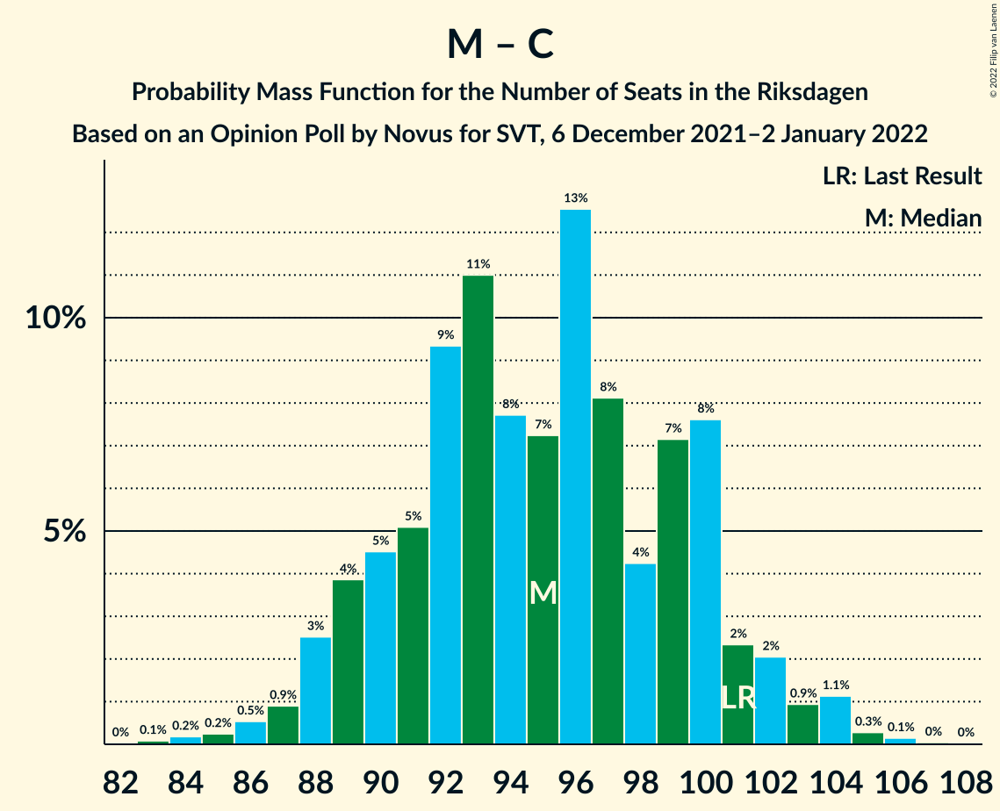

| Number of Seats | Probability | Accumulated | Special Marks |
|:---------------:|:-----------:|:-----------:|:-------------:|
| 82 | 0% | 100% |  |
| 83 | 0.1% | 99.9% |  |
| 84 | 0.2% | 99.9% |  |
| 85 | 0.2% | 99.7% |  |
| 86 | 0.5% | 99.4% |  |
| 87 | 0.9% | 98.9% |  |
| 88 | 3% | 98% |  |
| 89 | 4% | 95% |  |
| 90 | 5% | 92% |  |
| 91 | 5% | 87% |  |
| 92 | 9% | 82% |  |
| 93 | 11% | 73% |  |
| 94 | 8% | 62% |  |
| 95 | 7% | 54% | Median |
| 96 | 13% | 47% |  |
| 97 | 8% | 34% |  |
| 98 | 4% | 26% |  |
| 99 | 7% | 22% |  |
| 100 | 8% | 15% |  |
| 101 | 2% | 7% | Last Result |
| 102 | 2% | 5% |  |
| 103 | 0.9% | 3% |  |
| 104 | 1.1% | 2% |  |
| 105 | 0.3% | 0.5% |  |
| 106 | 0.1% | 0.2% |  |
| 107 | 0% | 0.1% |  |
| 108 | 0% | 0% |  |

## Technical Information

### Opinion Poll

+ **Polling firm:** Novus
+ **Commissioner(s):** SVT
+ **Fieldwork period:** 6 December 2021–2 January 2022

### Calculations

+ **Sample size:** 2017
+ **Simulations done:** 1,048,576
+ **Error estimate:** 1.02%

