# Opinion Poll by Demoskop for Aftonbladet, 28 December 2021–5 January 2022

<a href="#voting-intentions">Voting Intentions</a> | <a href="#seats">Seats</a> | <a href="#coalitions">Coalitions</a> | <a href="#technical-information">Technical Information</a>

## Voting Intentions

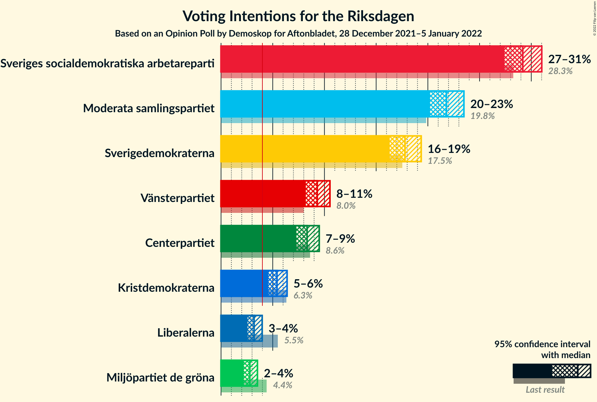

### Confidence Intervals

| Party | Last Result | Poll Result | 80% Confidence Interval | 90% Confidence Interval | 95% Confidence Interval | 99% Confidence Interval |
|:-----:|:-----------:|:-----------:|:-----------------------:|:-----------------------:|:-----------------------:|:-----------------------:|
| Sveriges socialdemokratiska arbetareparti | 28.3% | 29.2% | 28.0–30.4% |27.7–30.7% |27.4–31.0% |26.9–31.6% |
| Moderata samlingspartiet | 19.8% | 21.8% | 20.8–22.9% |20.5–23.2% |20.2–23.5% |19.7–24.0% |
| Sverigedemokraterna | 17.5% | 17.8% | 16.8–18.8% |16.6–19.1% |16.3–19.4% |15.9–19.9% |
| Vänsterpartiet | 8.0% | 9.3% | 8.6–10.1% |8.4–10.3% |8.2–10.5% |7.9–10.9% |
| Centerpartiet | 8.6% | 8.3% | 7.6–9.1% |7.4–9.3% |7.3–9.5% |7.0–9.9% |
| Kristdemokraterna | 6.3% | 5.4% | 4.9–6.1% |4.7–6.2% |4.6–6.4% |4.3–6.7% |
| Liberalerna | 5.5% | 3.2% | 2.8–3.7% |2.7–3.9% |2.6–4.0% |2.4–4.2% |
| Miljöpartiet de gröna | 4.4% | 2.8% | 2.4–3.3% |2.3–3.4% |2.2–3.5% |2.0–3.8% |

*Note:* The poll result column reflects the actual value used in the calculations. Published results may vary slightly, and in addition be rounded to fewer digits.

## Seats

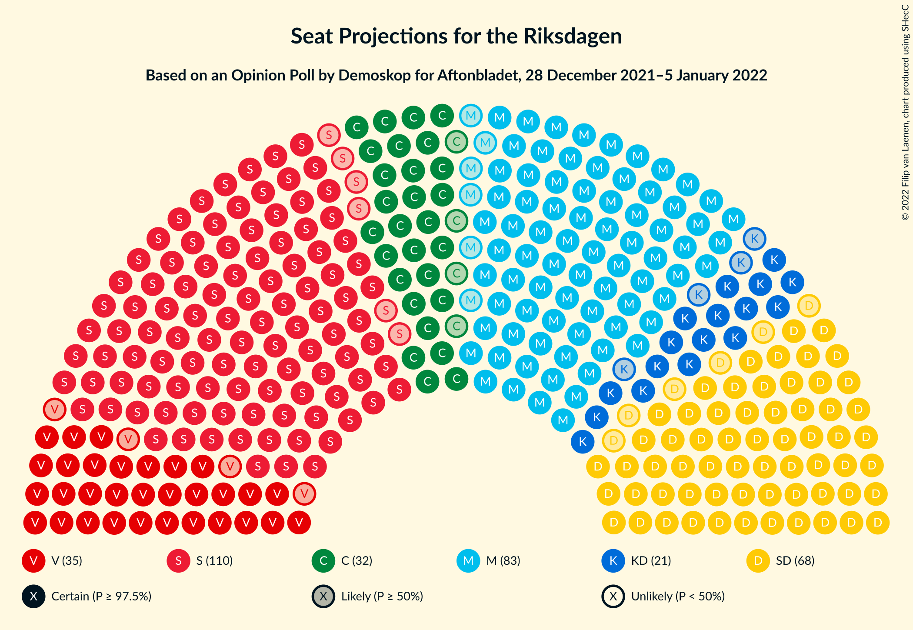

### Confidence Intervals

| Party | Last Result | Median | 80% Confidence Interval | 90% Confidence Interval | 95% Confidence Interval | 99% Confidence Interval |
|:-----:|:-----------:|:------:|:-----------------------:|:-----------------------:|:-----------------------:|:-----------------------:|
| <a href="#sveriges-socialdemokratiska-arbetareparti">Sveriges socialdemokratiska arbetareparti</a> | 100 | 110 | 106–115 |105–116 |104–117 |102–120 |
| <a href="#moderata-samlingspartiet">Moderata samlingspartiet</a> | 70 | 83 | 79–87 |78–88 |77–89 |74–91 |
| <a href="#sverigedemokraterna">Sverigedemokraterna</a> | 62 | 68 | 64–72 |62–72 |62–73 |60–75 |
| <a href="#vänsterpartiet">Vänsterpartiet</a> | 28 | 35 | 33–38 |32–39 |31–40 |30–41 |
| <a href="#centerpartiet">Centerpartiet</a> | 31 | 32 | 29–35 |28–35 |28–36 |26–37 |
| <a href="#kristdemokraterna">Kristdemokraterna</a> | 22 | 21 | 18–23 |18–24 |17–24 |16–25 |
| <a href="#liberalerna">Liberalerna</a> | 20 | 0 | 0 |0 |0 |0–16 |
| <a href="#miljöpartiet-de-gröna">Miljöpartiet de gröna</a> | 16 | 0 | 0 |0 |0 |0 |

### Sveriges socialdemokratiska arbetareparti

*For a full overview of the results for this party, see the [Sveriges socialdemokratiska arbetareparti](party-sverigessocialdemokratiskaarbetareparti.html) page.*

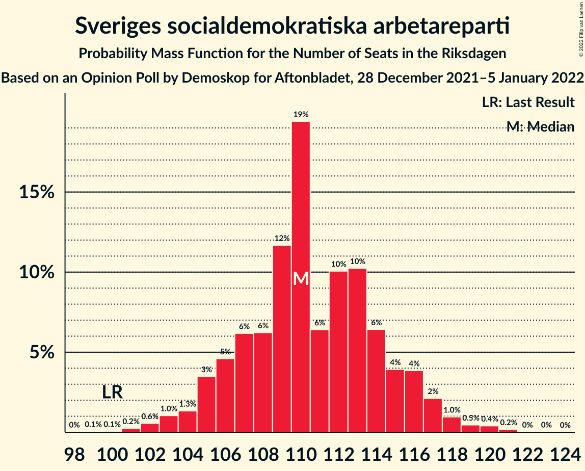

| Number of Seats | Probability | Accumulated | Special Marks |
|:---------------:|:-----------:|:-----------:|:-------------:|
| 99 | 0.1% | 100% |  |
| 100 | 0.1% | 99.9% | Last Result |
| 101 | 0.2% | 99.8% |  |
| 102 | 0.6% | 99.6% |  |
| 103 | 1.0% | 99.0% |  |
| 104 | 1.3% | 98% |  |
| 105 | 3% | 97% |  |
| 106 | 5% | 93% |  |
| 107 | 6% | 89% |  |
| 108 | 6% | 82% |  |
| 109 | 12% | 76% |  |
| 110 | 19% | 65% | Median |
| 111 | 6% | 45% |  |
| 112 | 10% | 39% |  |
| 113 | 10% | 29% |  |
| 114 | 6% | 18% |  |
| 115 | 4% | 12% |  |
| 116 | 4% | 8% |  |
| 117 | 2% | 4% |  |
| 118 | 1.0% | 2% |  |
| 119 | 0.5% | 1.1% |  |
| 120 | 0.4% | 0.6% |  |
| 121 | 0.2% | 0.2% |  |
| 122 | 0% | 0.1% |  |
| 123 | 0% | 0% |  |

### Moderata samlingspartiet

*For a full overview of the results for this party, see the [Moderata samlingspartiet](party-moderatasamlingspartiet.html) page.*

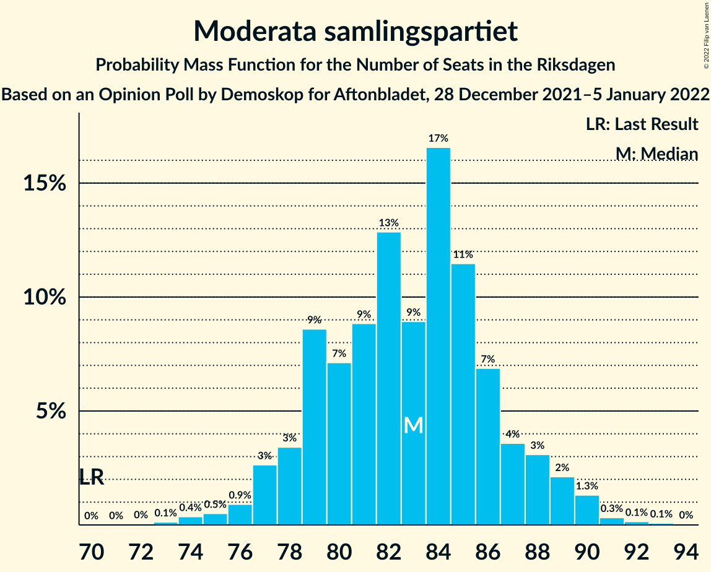

| Number of Seats | Probability | Accumulated | Special Marks |
|:---------------:|:-----------:|:-----------:|:-------------:|
| 70 | 0% | 100% | Last Result |
| 71 | 0% | 100% |  |
| 72 | 0% | 100% |  |
| 73 | 0.1% | 99.9% |  |
| 74 | 0.4% | 99.8% |  |
| 75 | 0.5% | 99.4% |  |
| 76 | 0.9% | 98.9% |  |
| 77 | 3% | 98% |  |
| 78 | 3% | 95% |  |
| 79 | 9% | 92% |  |
| 80 | 7% | 83% |  |
| 81 | 9% | 76% |  |
| 82 | 13% | 67% |  |
| 83 | 9% | 55% | Median |
| 84 | 17% | 46% |  |
| 85 | 11% | 29% |  |
| 86 | 7% | 18% |  |
| 87 | 4% | 11% |  |
| 88 | 3% | 7% |  |
| 89 | 2% | 4% |  |
| 90 | 1.3% | 2% |  |
| 91 | 0.3% | 0.6% |  |
| 92 | 0.1% | 0.3% |  |
| 93 | 0.1% | 0.1% |  |
| 94 | 0% | 0% |  |

### Sverigedemokraterna

*For a full overview of the results for this party, see the [Sverigedemokraterna](party-sverigedemokraterna.html) page.*

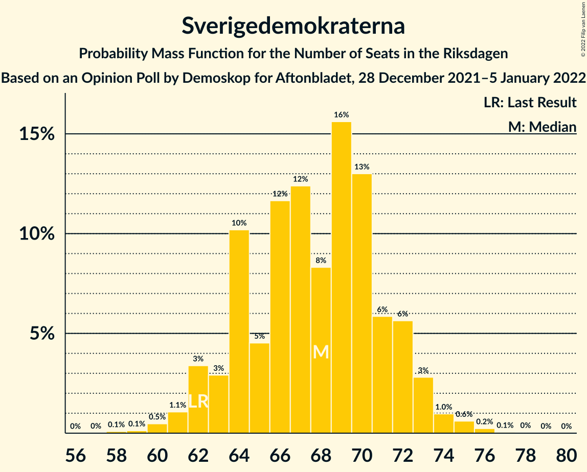

| Number of Seats | Probability | Accumulated | Special Marks |
|:---------------:|:-----------:|:-----------:|:-------------:|
| 58 | 0.1% | 100% |  |
| 59 | 0.1% | 99.9% |  |
| 60 | 0.5% | 99.8% |  |
| 61 | 1.1% | 99.3% |  |
| 62 | 3% | 98% | Last Result |
| 63 | 3% | 95% |  |
| 64 | 10% | 92% |  |
| 65 | 5% | 82% |  |
| 66 | 12% | 77% |  |
| 67 | 12% | 66% |  |
| 68 | 8% | 53% | Median |
| 69 | 16% | 45% |  |
| 70 | 13% | 29% |  |
| 71 | 6% | 16% |  |
| 72 | 6% | 10% |  |
| 73 | 3% | 5% |  |
| 74 | 1.0% | 2% |  |
| 75 | 0.6% | 1.0% |  |
| 76 | 0.2% | 0.4% |  |
| 77 | 0.1% | 0.1% |  |
| 78 | 0% | 0.1% |  |
| 79 | 0% | 0% |  |

### Vänsterpartiet

*For a full overview of the results for this party, see the [Vänsterpartiet](party-vänsterpartiet.html) page.*

| Number of Seats | Probability | Accumulated | Special Marks |
|:---------------:|:-----------:|:-----------:|:-------------:|
| 28 | 0.1% | 100% | Last Result |
| 29 | 0.2% | 99.9% |  |
| 30 | 0.9% | 99.7% |  |
| 31 | 2% | 98.7% |  |
| 32 | 6% | 96% |  |
| 33 | 10% | 90% |  |
| 34 | 20% | 80% |  |
| 35 | 14% | 60% | Median |
| 36 | 19% | 46% |  |
| 37 | 12% | 27% |  |
| 38 | 8% | 16% |  |
| 39 | 5% | 8% |  |
| 40 | 2% | 3% |  |
| 41 | 0.7% | 1.2% |  |
| 42 | 0.3% | 0.4% |  |
| 43 | 0.1% | 0.1% |  |
| 44 | 0% | 0% |  |

### Centerpartiet

*For a full overview of the results for this party, see the [Centerpartiet](party-centerpartiet.html) page.*

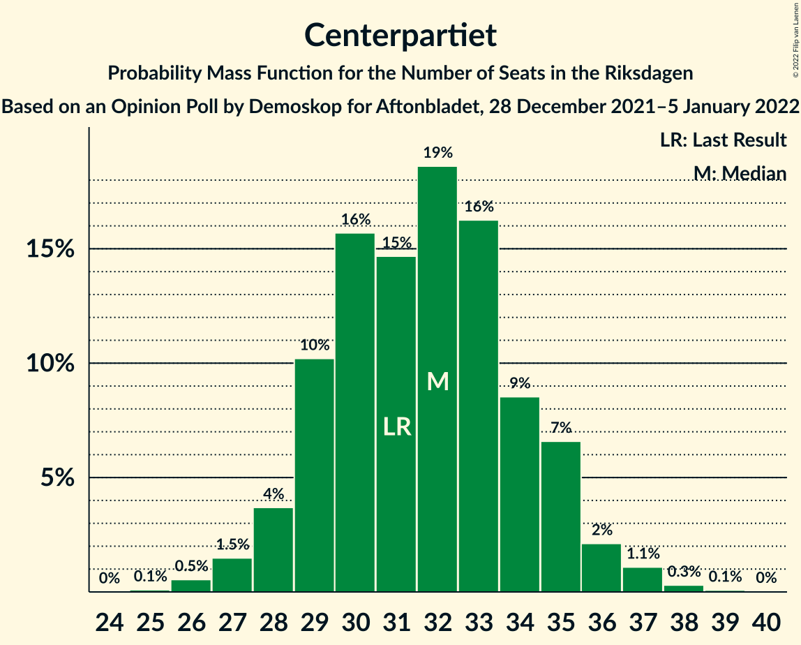

| Number of Seats | Probability | Accumulated | Special Marks |
|:---------------:|:-----------:|:-----------:|:-------------:|
| 25 | 0.1% | 100% |  |
| 26 | 0.5% | 99.9% |  |
| 27 | 1.5% | 99.4% |  |
| 28 | 4% | 98% |  |
| 29 | 10% | 94% |  |
| 30 | 16% | 84% |  |
| 31 | 15% | 68% | Last Result |
| 32 | 19% | 54% | Median |
| 33 | 16% | 35% |  |
| 34 | 9% | 19% |  |
| 35 | 7% | 10% |  |
| 36 | 2% | 4% |  |
| 37 | 1.1% | 1.5% |  |
| 38 | 0.3% | 0.4% |  |
| 39 | 0.1% | 0.1% |  |
| 40 | 0% | 0% |  |

### Kristdemokraterna

*For a full overview of the results for this party, see the [Kristdemokraterna](party-kristdemokraterna.html) page.*

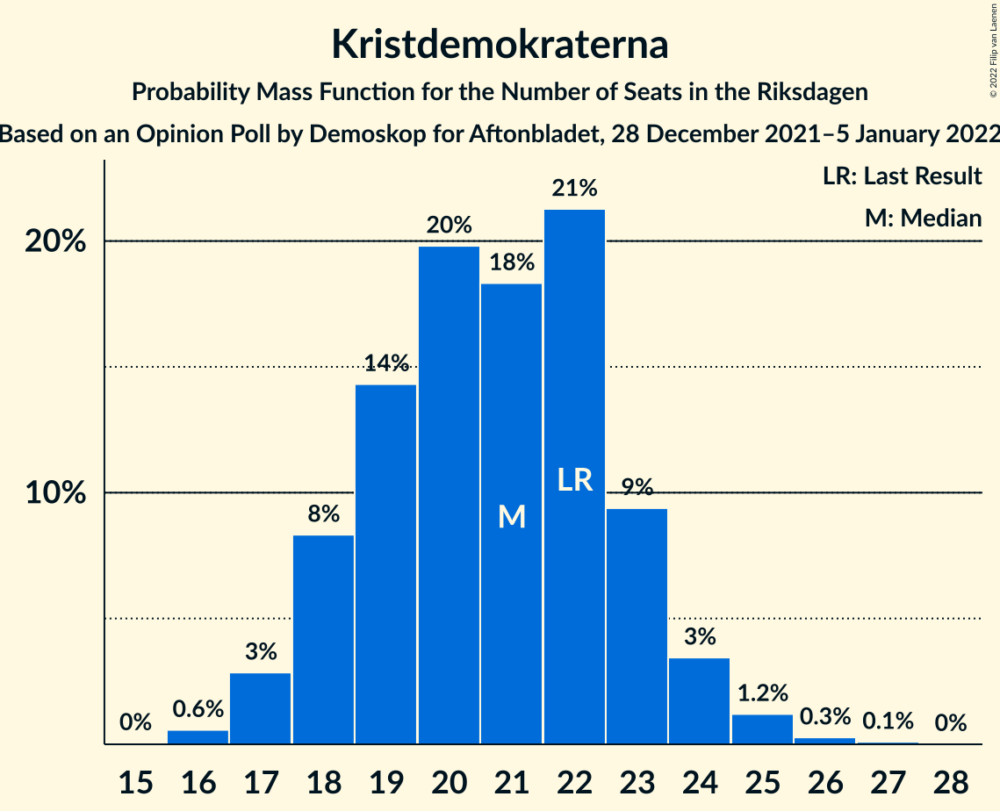

| Number of Seats | Probability | Accumulated | Special Marks |
|:---------------:|:-----------:|:-----------:|:-------------:|
| 15 | 0% | 100% |  |
| 16 | 0.6% | 99.9% |  |
| 17 | 3% | 99.3% |  |
| 18 | 8% | 96% |  |
| 19 | 14% | 88% |  |
| 20 | 20% | 74% |  |
| 21 | 18% | 54% | Median |
| 22 | 21% | 36% | Last Result |
| 23 | 9% | 14% |  |
| 24 | 3% | 5% |  |
| 25 | 1.2% | 2% |  |
| 26 | 0.3% | 0.4% |  |
| 27 | 0.1% | 0.1% |  |
| 28 | 0% | 0% |  |

### Liberalerna

*For a full overview of the results for this party, see the [Liberalerna](party-liberalerna.html) page.*

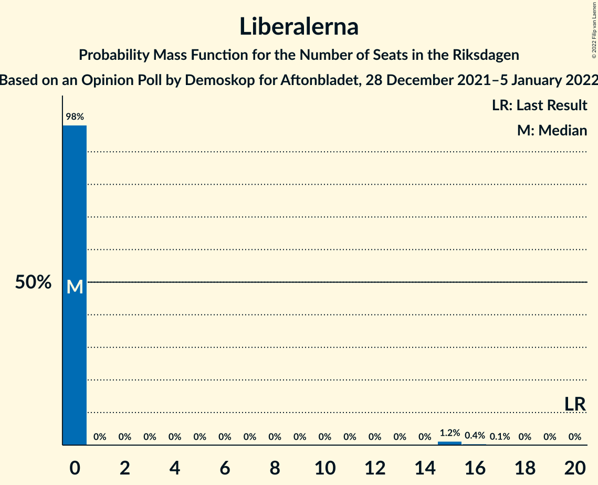

| Number of Seats | Probability | Accumulated | Special Marks |
|:---------------:|:-----------:|:-----------:|:-------------:|
| 0 | 98% | 100% | Median |
| 1 | 0% | 2% |  |
| 2 | 0% | 2% |  |
| 3 | 0% | 2% |  |
| 4 | 0% | 2% |  |
| 5 | 0% | 2% |  |
| 6 | 0% | 2% |  |
| 7 | 0% | 2% |  |
| 8 | 0% | 2% |  |
| 9 | 0% | 2% |  |
| 10 | 0% | 2% |  |
| 11 | 0% | 2% |  |
| 12 | 0% | 2% |  |
| 13 | 0% | 2% |  |
| 14 | 0% | 2% |  |
| 15 | 1.2% | 2% |  |
| 16 | 0.4% | 0.5% |  |
| 17 | 0.1% | 0.1% |  |
| 18 | 0% | 0% |  |
| 19 | 0% | 0% |  |
| 20 | 0% | 0% | Last Result |

### Miljöpartiet de gröna

*For a full overview of the results for this party, see the [Miljöpartiet de gröna](party-miljöpartietdegröna.html) page.*

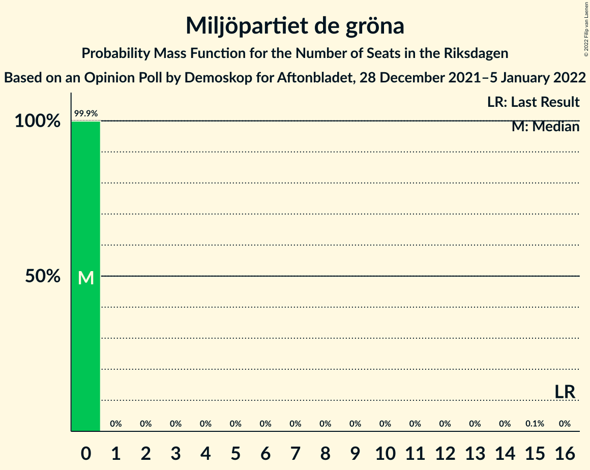

| Number of Seats | Probability | Accumulated | Special Marks |
|:---------------:|:-----------:|:-----------:|:-------------:|
| 0 | 99.9% | 100% | Median |
| 1 | 0% | 0.1% |  |
| 2 | 0% | 0.1% |  |
| 3 | 0% | 0.1% |  |
| 4 | 0% | 0.1% |  |
| 5 | 0% | 0.1% |  |
| 6 | 0% | 0.1% |  |
| 7 | 0% | 0.1% |  |
| 8 | 0% | 0.1% |  |
| 9 | 0% | 0.1% |  |
| 10 | 0% | 0.1% |  |
| 11 | 0% | 0.1% |  |
| 12 | 0% | 0.1% |  |
| 13 | 0% | 0.1% |  |
| 14 | 0% | 0.1% |  |
| 15 | 0.1% | 0.1% |  |
| 16 | 0% | 0% | Last Result |

## Coalitions

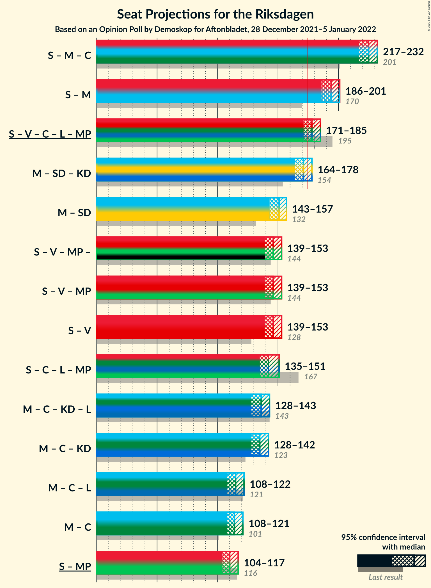

### Confidence Intervals

| Coalition | Last Result | Median | Majority? | 80% Confidence Interval | 90% Confidence Interval | 95% Confidence Interval | 99% Confidence Interval |
|:---------:|:-----------:|:------:|:---------:|:-----------------------:|:-----------------------:|:-----------------------:|:-----------------------:|
| Sveriges socialdemokratiska arbetareparti – Moderata samlingspartiet – Centerpartiet | 201 | 225 | 100% | 220–230 | 219–231 | 217–232 | 214–234 |
| Sveriges socialdemokratiska arbetareparti – Moderata samlingspartiet | 170 | 194 | 100% | 188–198 | 187–200 | 186–201 | 182–203 |
| Sveriges socialdemokratiska arbetareparti – Vänsterpartiet – Centerpartiet – Liberalerna – Miljöpartiet de gröna | 195 | 178 | 78% | 173–183 | 172–184 | 171–185 | 169–189 |
| Moderata samlingspartiet – Sverigedemokraterna – Kristdemokraterna | 154 | 171 | 22% | 166–176 | 165–177 | 164–178 | 160–180 |
| Moderata samlingspartiet – Sverigedemokraterna | 132 | 151 | 0% | 145–155 | 144–157 | 143–157 | 140–160 |
| Sveriges socialdemokratiska arbetareparti – Vänsterpartiet – Miljöpartiet de gröna | 144 | 146 | 0% | 141–151 | 140–152 | 139–153 | 136–156 |
| Sveriges socialdemokratiska arbetareparti – Vänsterpartiet | 128 | 146 | 0% | 141–151 | 140–152 | 139–153 | 136–156 |
| Sveriges socialdemokratiska arbetareparti – Centerpartiet – Liberalerna – Miljöpartiet de gröna | 167 | 142 | 0% | 138–147 | 137–149 | 135–151 | 133–154 |
| Moderata samlingspartiet – Centerpartiet – Kristdemokraterna – Liberalerna | 143 | 136 | 0% | 130–140 | 129–142 | 128–143 | 126–147 |
| Moderata samlingspartiet – Centerpartiet – Kristdemokraterna | 123 | 135 | 0% | 130–140 | 129–141 | 128–142 | 125–145 |
| Moderata samlingspartiet – Centerpartiet – Liberalerna | 121 | 115 | 0% | 110–119 | 109–121 | 108–122 | 106–127 |
| Moderata samlingspartiet – Centerpartiet | 101 | 114 | 0% | 110–119 | 109–120 | 108–121 | 105–124 |
| Sveriges socialdemokratiska arbetareparti – Miljöpartiet de gröna | 116 | 110 | 0% | 106–115 | 105–116 | 104–117 | 102–120 |

### Sveriges socialdemokratiska arbetareparti – Moderata samlingspartiet – Centerpartiet

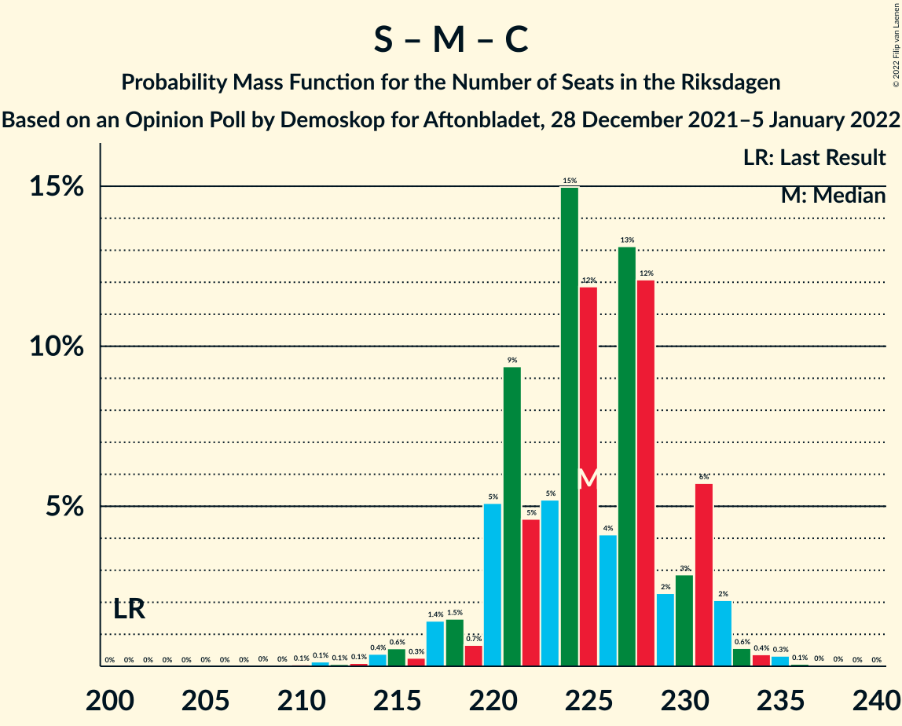

| Number of Seats | Probability | Accumulated | Special Marks |
|:---------------:|:-----------:|:-----------:|:-------------:|
| 201 | 0% | 100% | Last Result |
| 202 | 0% | 100% |  |
| 203 | 0% | 100% |  |
| 204 | 0% | 100% |  |
| 205 | 0% | 100% |  |
| 206 | 0% | 100% |  |
| 207 | 0% | 100% |  |
| 208 | 0% | 100% |  |
| 209 | 0% | 100% |  |
| 210 | 0.1% | 99.9% |  |
| 211 | 0.1% | 99.9% |  |
| 212 | 0.1% | 99.7% |  |
| 213 | 0.1% | 99.7% |  |
| 214 | 0.4% | 99.6% |  |
| 215 | 0.6% | 99.2% |  |
| 216 | 0.3% | 98.6% |  |
| 217 | 1.4% | 98% |  |
| 218 | 1.5% | 97% |  |
| 219 | 0.7% | 95% |  |
| 220 | 5% | 95% |  |
| 221 | 9% | 90% |  |
| 222 | 5% | 80% |  |
| 223 | 5% | 76% |  |
| 224 | 15% | 71% |  |
| 225 | 12% | 56% | Median |
| 226 | 4% | 44% |  |
| 227 | 13% | 40% |  |
| 228 | 12% | 26% |  |
| 229 | 2% | 14% |  |
| 230 | 3% | 12% |  |
| 231 | 6% | 9% |  |
| 232 | 2% | 3% |  |
| 233 | 0.6% | 1.4% |  |
| 234 | 0.4% | 0.9% |  |
| 235 | 0.3% | 0.5% |  |
| 236 | 0.1% | 0.2% |  |
| 237 | 0% | 0.1% |  |
| 238 | 0% | 0% |  |

### Sveriges socialdemokratiska arbetareparti – Moderata samlingspartiet

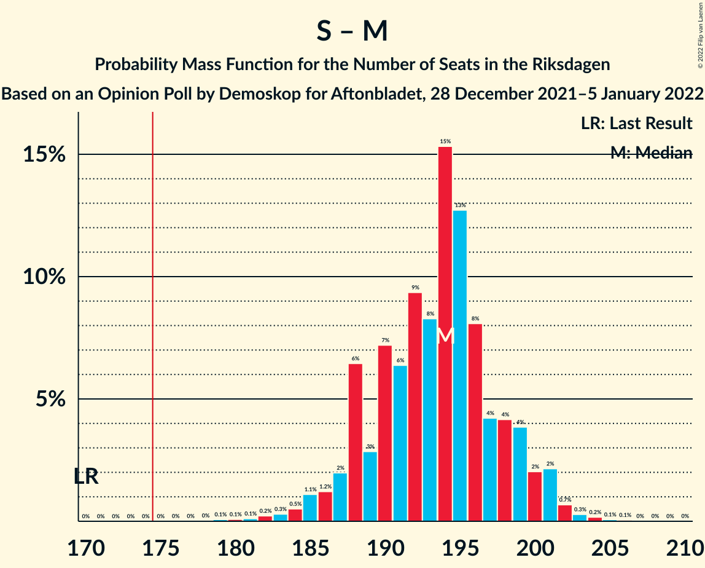

| Number of Seats | Probability | Accumulated | Special Marks |
|:---------------:|:-----------:|:-----------:|:-------------:|
| 170 | 0% | 100% | Last Result |
| 171 | 0% | 100% |  |
| 172 | 0% | 100% |  |
| 173 | 0% | 100% |  |
| 174 | 0% | 100% |  |
| 175 | 0% | 100% | Majority |
| 176 | 0% | 100% |  |
| 177 | 0% | 100% |  |
| 178 | 0% | 100% |  |
| 179 | 0.1% | 99.9% |  |
| 180 | 0.1% | 99.9% |  |
| 181 | 0.1% | 99.8% |  |
| 182 | 0.2% | 99.7% |  |
| 183 | 0.3% | 99.5% |  |
| 184 | 0.5% | 99.2% |  |
| 185 | 1.1% | 98.6% |  |
| 186 | 1.2% | 98% |  |
| 187 | 2% | 96% |  |
| 188 | 6% | 94% |  |
| 189 | 3% | 88% |  |
| 190 | 7% | 85% |  |
| 191 | 6% | 78% |  |
| 192 | 9% | 71% |  |
| 193 | 8% | 62% | Median |
| 194 | 15% | 54% |  |
| 195 | 13% | 39% |  |
| 196 | 8% | 26% |  |
| 197 | 4% | 18% |  |
| 198 | 4% | 13% |  |
| 199 | 4% | 9% |  |
| 200 | 2% | 5% |  |
| 201 | 2% | 3% |  |
| 202 | 0.7% | 1.3% |  |
| 203 | 0.3% | 0.6% |  |
| 204 | 0.2% | 0.3% |  |
| 205 | 0.1% | 0.2% |  |
| 206 | 0.1% | 0.1% |  |
| 207 | 0% | 0% |  |

### Sveriges socialdemokratiska arbetareparti – Vänsterpartiet – Centerpartiet – Liberalerna – Miljöpartiet de gröna

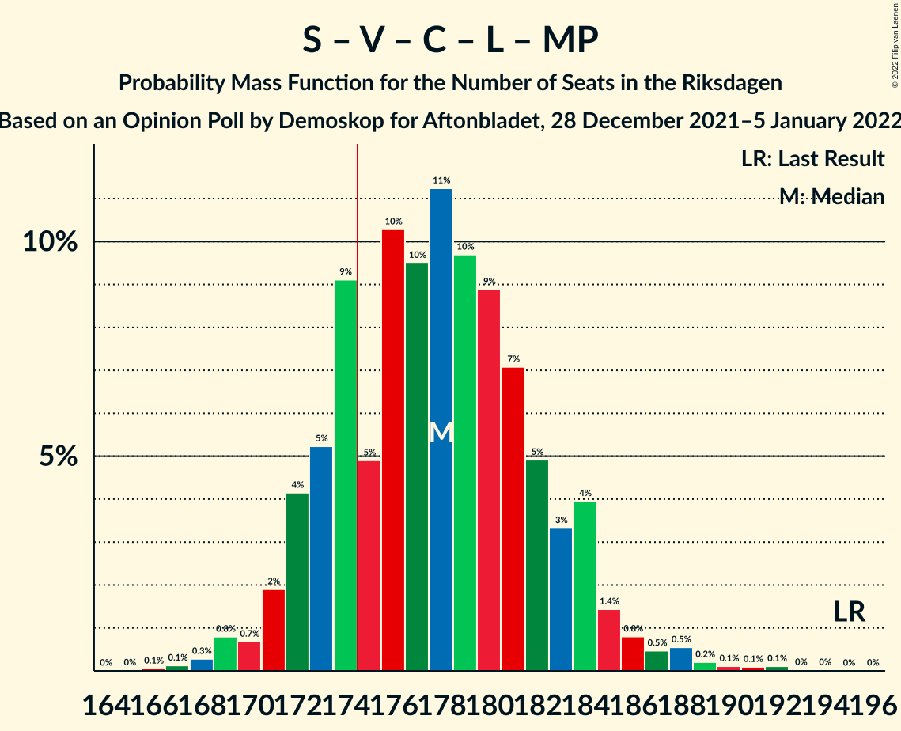

| Number of Seats | Probability | Accumulated | Special Marks |
|:---------------:|:-----------:|:-----------:|:-------------:|
| 166 | 0.1% | 100% |  |
| 167 | 0.1% | 99.9% |  |
| 168 | 0.3% | 99.8% |  |
| 169 | 0.8% | 99.5% |  |
| 170 | 0.7% | 98.7% |  |
| 171 | 2% | 98% |  |
| 172 | 4% | 96% |  |
| 173 | 5% | 92% |  |
| 174 | 9% | 87% |  |
| 175 | 5% | 78% | Majority |
| 176 | 10% | 73% |  |
| 177 | 10% | 62% | Median |
| 178 | 11% | 53% |  |
| 179 | 10% | 42% |  |
| 180 | 9% | 32% |  |
| 181 | 7% | 23% |  |
| 182 | 5% | 16% |  |
| 183 | 3% | 11% |  |
| 184 | 4% | 8% |  |
| 185 | 1.4% | 4% |  |
| 186 | 0.8% | 2% |  |
| 187 | 0.5% | 2% |  |
| 188 | 0.5% | 1.1% |  |
| 189 | 0.2% | 0.6% |  |
| 190 | 0.1% | 0.4% |  |
| 191 | 0.1% | 0.3% |  |
| 192 | 0.1% | 0.2% |  |
| 193 | 0% | 0.1% |  |
| 194 | 0% | 0% |  |
| 195 | 0% | 0% | Last Result |

### Moderata samlingspartiet – Sverigedemokraterna – Kristdemokraterna

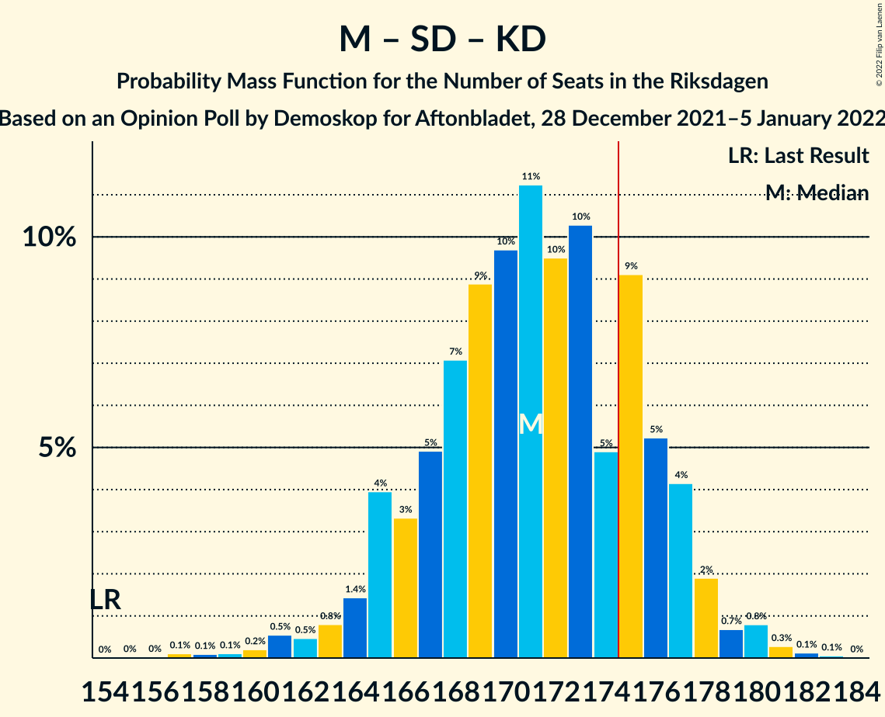

| Number of Seats | Probability | Accumulated | Special Marks |
|:---------------:|:-----------:|:-----------:|:-------------:|
| 154 | 0% | 100% | Last Result |
| 155 | 0% | 100% |  |
| 156 | 0% | 100% |  |
| 157 | 0.1% | 99.9% |  |
| 158 | 0.1% | 99.8% |  |
| 159 | 0.1% | 99.7% |  |
| 160 | 0.2% | 99.6% |  |
| 161 | 0.5% | 99.4% |  |
| 162 | 0.5% | 98.9% |  |
| 163 | 0.8% | 98% |  |
| 164 | 1.4% | 98% |  |
| 165 | 4% | 96% |  |
| 166 | 3% | 92% |  |
| 167 | 5% | 89% |  |
| 168 | 7% | 84% |  |
| 169 | 9% | 77% |  |
| 170 | 10% | 68% |  |
| 171 | 11% | 58% |  |
| 172 | 10% | 47% | Median |
| 173 | 10% | 38% |  |
| 174 | 5% | 27% |  |
| 175 | 9% | 22% | Majority |
| 176 | 5% | 13% |  |
| 177 | 4% | 8% |  |
| 178 | 2% | 4% |  |
| 179 | 0.7% | 2% |  |
| 180 | 0.8% | 1.3% |  |
| 181 | 0.3% | 0.5% |  |
| 182 | 0.1% | 0.2% |  |
| 183 | 0.1% | 0.1% |  |
| 184 | 0% | 0% |  |

### Moderata samlingspartiet – Sverigedemokraterna

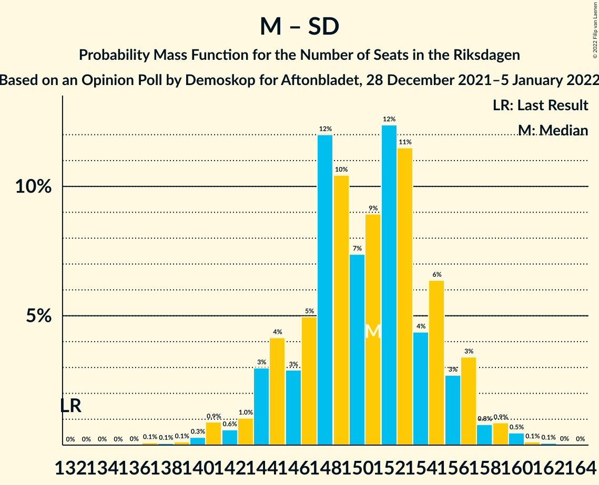

| Number of Seats | Probability | Accumulated | Special Marks |
|:---------------:|:-----------:|:-----------:|:-------------:|
| 132 | 0% | 100% | Last Result |
| 133 | 0% | 100% |  |
| 134 | 0% | 100% |  |
| 135 | 0% | 100% |  |
| 136 | 0% | 100% |  |
| 137 | 0.1% | 100% |  |
| 138 | 0.1% | 99.9% |  |
| 139 | 0.1% | 99.8% |  |
| 140 | 0.3% | 99.7% |  |
| 141 | 0.9% | 99.4% |  |
| 142 | 0.6% | 98% |  |
| 143 | 1.0% | 98% |  |
| 144 | 3% | 97% |  |
| 145 | 4% | 94% |  |
| 146 | 3% | 90% |  |
| 147 | 5% | 87% |  |
| 148 | 12% | 82% |  |
| 149 | 10% | 70% |  |
| 150 | 7% | 59% |  |
| 151 | 9% | 52% | Median |
| 152 | 12% | 43% |  |
| 153 | 11% | 31% |  |
| 154 | 4% | 19% |  |
| 155 | 6% | 15% |  |
| 156 | 3% | 8% |  |
| 157 | 3% | 6% |  |
| 158 | 0.8% | 2% |  |
| 159 | 0.9% | 2% |  |
| 160 | 0.5% | 0.7% |  |
| 161 | 0.1% | 0.2% |  |
| 162 | 0.1% | 0.1% |  |
| 163 | 0% | 0% |  |

### Sveriges socialdemokratiska arbetareparti – Vänsterpartiet – Miljöpartiet de gröna

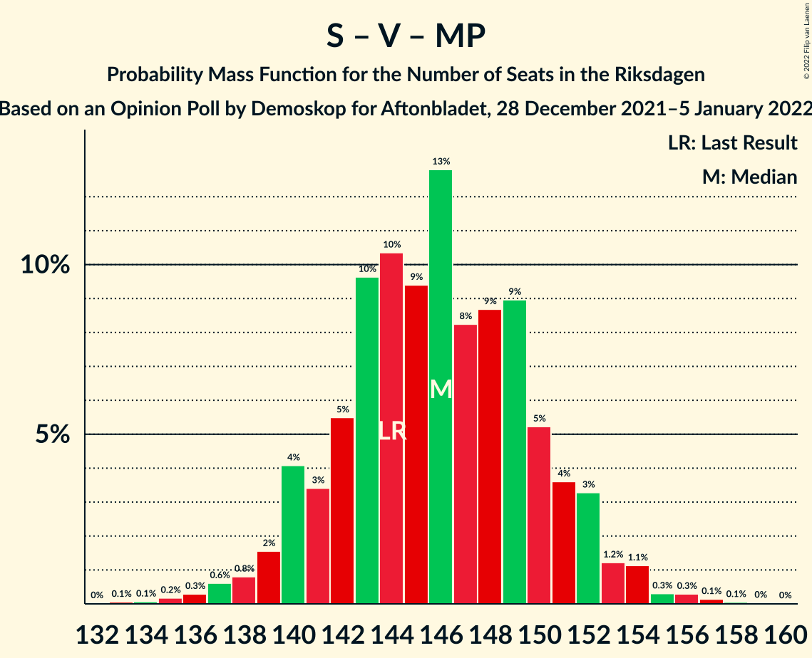

| Number of Seats | Probability | Accumulated | Special Marks |
|:---------------:|:-----------:|:-----------:|:-------------:|
| 133 | 0.1% | 100% |  |
| 134 | 0.1% | 99.9% |  |
| 135 | 0.2% | 99.8% |  |
| 136 | 0.3% | 99.7% |  |
| 137 | 0.6% | 99.4% |  |
| 138 | 0.8% | 98.8% |  |
| 139 | 2% | 98% |  |
| 140 | 4% | 96% |  |
| 141 | 3% | 92% |  |
| 142 | 5% | 89% |  |
| 143 | 10% | 83% |  |
| 144 | 10% | 74% | Last Result |
| 145 | 9% | 63% | Median |
| 146 | 13% | 54% |  |
| 147 | 8% | 41% |  |
| 148 | 9% | 33% |  |
| 149 | 9% | 24% |  |
| 150 | 5% | 15% |  |
| 151 | 4% | 10% |  |
| 152 | 3% | 6% |  |
| 153 | 1.2% | 3% |  |
| 154 | 1.1% | 2% |  |
| 155 | 0.3% | 0.9% |  |
| 156 | 0.3% | 0.5% |  |
| 157 | 0.1% | 0.3% |  |
| 158 | 0.1% | 0.1% |  |
| 159 | 0% | 0.1% |  |
| 160 | 0% | 0% |  |

### Sveriges socialdemokratiska arbetareparti – Vänsterpartiet

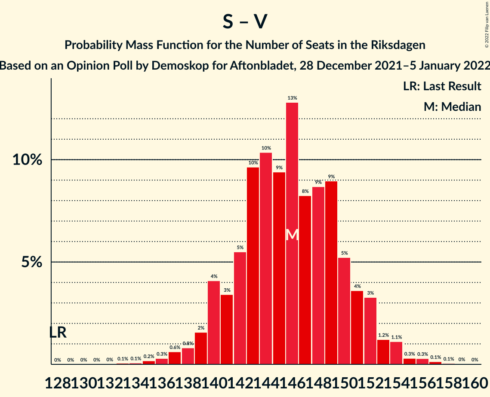

| Number of Seats | Probability | Accumulated | Special Marks |
|:---------------:|:-----------:|:-----------:|:-------------:|
| 128 | 0% | 100% | Last Result |
| 129 | 0% | 100% |  |
| 130 | 0% | 100% |  |
| 131 | 0% | 100% |  |
| 132 | 0% | 100% |  |
| 133 | 0.1% | 100% |  |
| 134 | 0.1% | 99.9% |  |
| 135 | 0.2% | 99.8% |  |
| 136 | 0.3% | 99.7% |  |
| 137 | 0.6% | 99.4% |  |
| 138 | 0.8% | 98.7% |  |
| 139 | 2% | 98% |  |
| 140 | 4% | 96% |  |
| 141 | 3% | 92% |  |
| 142 | 5% | 89% |  |
| 143 | 10% | 83% |  |
| 144 | 10% | 74% |  |
| 145 | 9% | 63% | Median |
| 146 | 13% | 54% |  |
| 147 | 8% | 41% |  |
| 148 | 9% | 33% |  |
| 149 | 9% | 24% |  |
| 150 | 5% | 15% |  |
| 151 | 4% | 10% |  |
| 152 | 3% | 6% |  |
| 153 | 1.2% | 3% |  |
| 154 | 1.1% | 2% |  |
| 155 | 0.3% | 0.8% |  |
| 156 | 0.3% | 0.5% |  |
| 157 | 0.1% | 0.2% |  |
| 158 | 0.1% | 0.1% |  |
| 159 | 0% | 0% |  |

### Sveriges socialdemokratiska arbetareparti – Centerpartiet – Liberalerna – Miljöpartiet de gröna

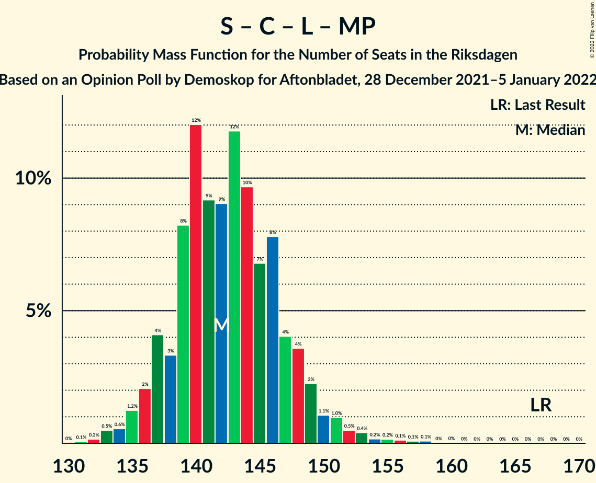

| Number of Seats | Probability | Accumulated | Special Marks |
|:---------------:|:-----------:|:-----------:|:-------------:|
| 131 | 0.1% | 100% |  |
| 132 | 0.2% | 99.9% |  |
| 133 | 0.5% | 99.7% |  |
| 134 | 0.6% | 99.3% |  |
| 135 | 1.2% | 98.7% |  |
| 136 | 2% | 97% |  |
| 137 | 4% | 95% |  |
| 138 | 3% | 91% |  |
| 139 | 8% | 88% |  |
| 140 | 12% | 80% |  |
| 141 | 9% | 68% |  |
| 142 | 9% | 59% | Median |
| 143 | 12% | 49% |  |
| 144 | 10% | 38% |  |
| 145 | 7% | 28% |  |
| 146 | 8% | 21% |  |
| 147 | 4% | 13% |  |
| 148 | 4% | 9% |  |
| 149 | 2% | 6% |  |
| 150 | 1.1% | 4% |  |
| 151 | 1.0% | 3% |  |
| 152 | 0.5% | 2% |  |
| 153 | 0.4% | 1.1% |  |
| 154 | 0.2% | 0.7% |  |
| 155 | 0.2% | 0.5% |  |
| 156 | 0.1% | 0.3% |  |
| 157 | 0.1% | 0.2% |  |
| 158 | 0.1% | 0.1% |  |
| 159 | 0% | 0.1% |  |
| 160 | 0% | 0% |  |
| 161 | 0% | 0% |  |
| 162 | 0% | 0% |  |
| 163 | 0% | 0% |  |
| 164 | 0% | 0% |  |
| 165 | 0% | 0% |  |
| 166 | 0% | 0% |  |
| 167 | 0% | 0% | Last Result |

### Moderata samlingspartiet – Centerpartiet – Kristdemokraterna – Liberalerna

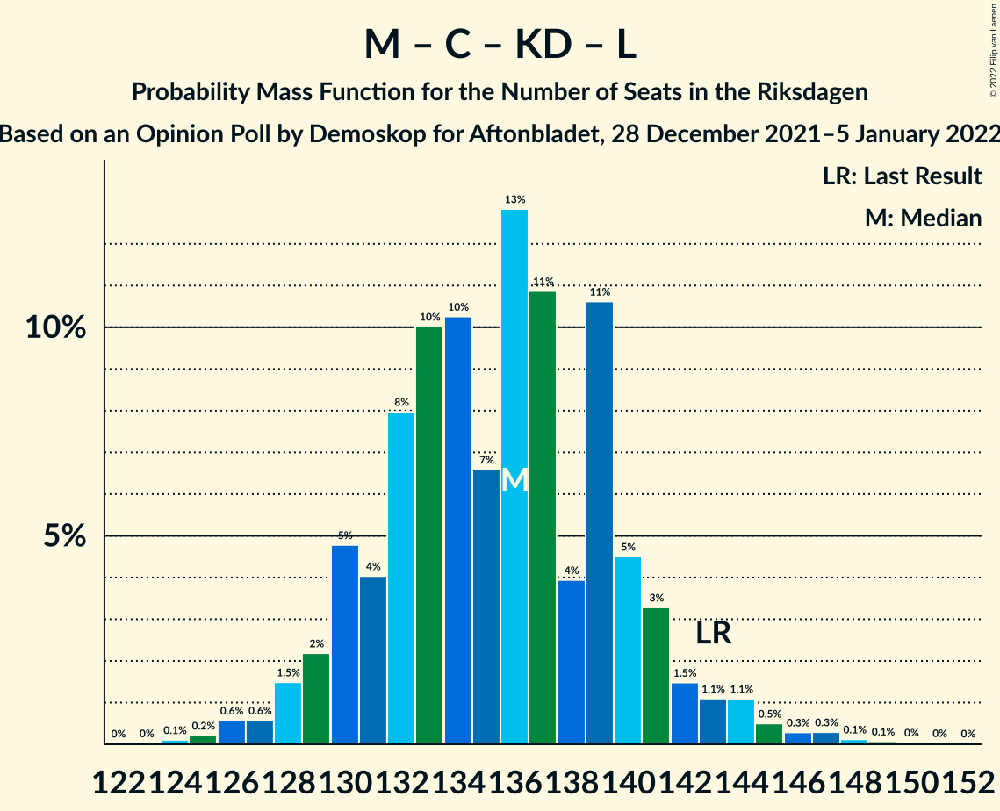

| Number of Seats | Probability | Accumulated | Special Marks |
|:---------------:|:-----------:|:-----------:|:-------------:|
| 123 | 0% | 100% |  |
| 124 | 0.1% | 99.9% |  |
| 125 | 0.2% | 99.8% |  |
| 126 | 0.6% | 99.6% |  |
| 127 | 0.6% | 99.0% |  |
| 128 | 1.5% | 98% |  |
| 129 | 2% | 97% |  |
| 130 | 5% | 95% |  |
| 131 | 4% | 90% |  |
| 132 | 8% | 86% |  |
| 133 | 10% | 78% |  |
| 134 | 10% | 68% |  |
| 135 | 7% | 58% |  |
| 136 | 13% | 51% | Median |
| 137 | 11% | 38% |  |
| 138 | 4% | 27% |  |
| 139 | 11% | 23% |  |
| 140 | 5% | 13% |  |
| 141 | 3% | 8% |  |
| 142 | 1.5% | 5% |  |
| 143 | 1.1% | 4% | Last Result |
| 144 | 1.1% | 2% |  |
| 145 | 0.5% | 1.4% |  |
| 146 | 0.3% | 0.9% |  |
| 147 | 0.3% | 0.6% |  |
| 148 | 0.1% | 0.3% |  |
| 149 | 0.1% | 0.2% |  |
| 150 | 0% | 0.1% |  |
| 151 | 0% | 0.1% |  |
| 152 | 0% | 0% |  |

### Moderata samlingspartiet – Centerpartiet – Kristdemokraterna

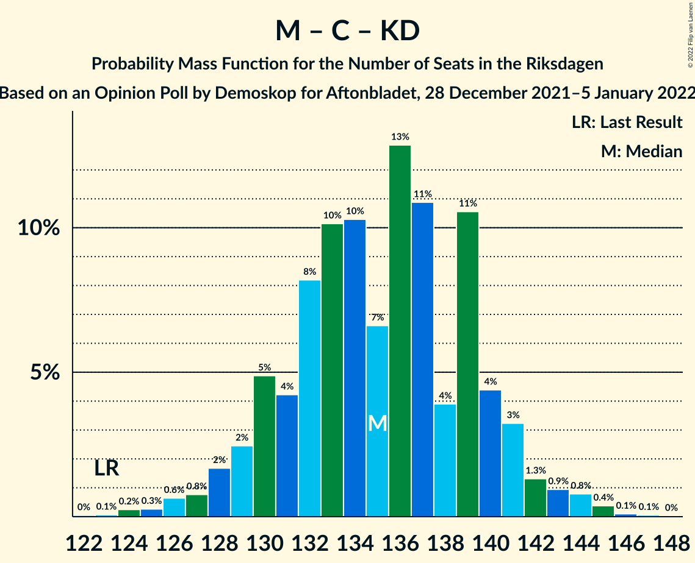

| Number of Seats | Probability | Accumulated | Special Marks |
|:---------------:|:-----------:|:-----------:|:-------------:|
| 122 | 0% | 100% |  |
| 123 | 0.1% | 99.9% | Last Result |
| 124 | 0.2% | 99.9% |  |
| 125 | 0.3% | 99.6% |  |
| 126 | 0.6% | 99.3% |  |
| 127 | 0.8% | 98.7% |  |
| 128 | 2% | 98% |  |
| 129 | 2% | 96% |  |
| 130 | 5% | 94% |  |
| 131 | 4% | 89% |  |
| 132 | 8% | 85% |  |
| 133 | 10% | 76% |  |
| 134 | 10% | 66% |  |
| 135 | 7% | 56% |  |
| 136 | 13% | 49% | Median |
| 137 | 11% | 37% |  |
| 138 | 4% | 26% |  |
| 139 | 11% | 22% |  |
| 140 | 4% | 11% |  |
| 141 | 3% | 7% |  |
| 142 | 1.3% | 4% |  |
| 143 | 0.9% | 2% |  |
| 144 | 0.8% | 1.4% |  |
| 145 | 0.4% | 0.6% |  |
| 146 | 0.1% | 0.2% |  |
| 147 | 0.1% | 0.1% |  |
| 148 | 0% | 0% |  |

### Moderata samlingspartiet – Centerpartiet – Liberalerna

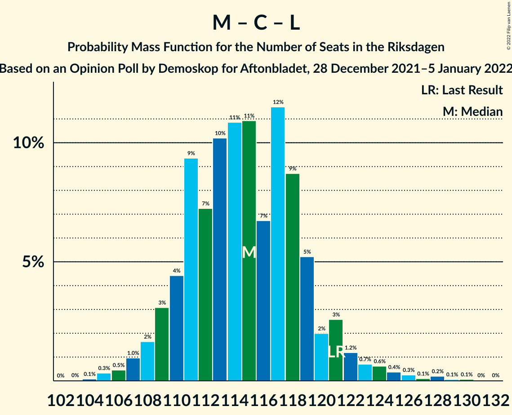

| Number of Seats | Probability | Accumulated | Special Marks |
|:---------------:|:-----------:|:-----------:|:-------------:|
| 103 | 0% | 100% |  |
| 104 | 0.1% | 99.9% |  |
| 105 | 0.3% | 99.9% |  |
| 106 | 0.5% | 99.5% |  |
| 107 | 1.0% | 99.1% |  |
| 108 | 2% | 98% |  |
| 109 | 3% | 96% |  |
| 110 | 4% | 93% |  |
| 111 | 9% | 89% |  |
| 112 | 7% | 80% |  |
| 113 | 10% | 72% |  |
| 114 | 11% | 62% |  |
| 115 | 11% | 51% | Median |
| 116 | 7% | 40% |  |
| 117 | 12% | 34% |  |
| 118 | 9% | 22% |  |
| 119 | 5% | 13% |  |
| 120 | 2% | 8% |  |
| 121 | 3% | 6% | Last Result |
| 122 | 1.2% | 4% |  |
| 123 | 0.7% | 2% |  |
| 124 | 0.6% | 2% |  |
| 125 | 0.4% | 1.1% |  |
| 126 | 0.3% | 0.8% |  |
| 127 | 0.1% | 0.5% |  |
| 128 | 0.2% | 0.4% |  |
| 129 | 0.1% | 0.2% |  |
| 130 | 0.1% | 0.1% |  |
| 131 | 0% | 0.1% |  |
| 132 | 0% | 0% |  |

### Moderata samlingspartiet – Centerpartiet

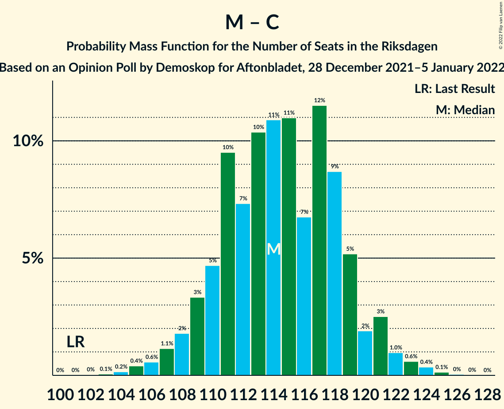

| Number of Seats | Probability | Accumulated | Special Marks |
|:---------------:|:-----------:|:-----------:|:-------------:|
| 101 | 0% | 100% | Last Result |
| 102 | 0% | 100% |  |
| 103 | 0.1% | 99.9% |  |
| 104 | 0.2% | 99.9% |  |
| 105 | 0.4% | 99.7% |  |
| 106 | 0.6% | 99.3% |  |
| 107 | 1.1% | 98.8% |  |
| 108 | 2% | 98% |  |
| 109 | 3% | 96% |  |
| 110 | 5% | 92% |  |
| 111 | 10% | 88% |  |
| 112 | 7% | 78% |  |
| 113 | 10% | 71% |  |
| 114 | 11% | 61% |  |
| 115 | 11% | 50% | Median |
| 116 | 7% | 39% |  |
| 117 | 12% | 32% |  |
| 118 | 9% | 20% |  |
| 119 | 5% | 12% |  |
| 120 | 2% | 7% |  |
| 121 | 3% | 5% |  |
| 122 | 1.0% | 2% |  |
| 123 | 0.6% | 1.2% |  |
| 124 | 0.4% | 0.6% |  |
| 125 | 0.1% | 0.2% |  |
| 126 | 0% | 0.1% |  |
| 127 | 0% | 0% |  |

### Sveriges socialdemokratiska arbetareparti – Miljöpartiet de gröna

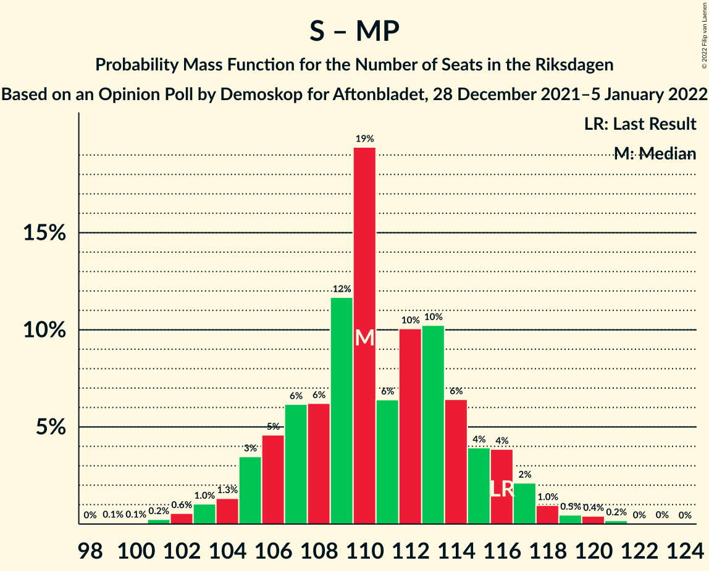

| Number of Seats | Probability | Accumulated | Special Marks |
|:---------------:|:-----------:|:-----------:|:-------------:|
| 99 | 0.1% | 100% |  |
| 100 | 0.1% | 99.9% |  |
| 101 | 0.2% | 99.8% |  |
| 102 | 0.6% | 99.6% |  |
| 103 | 1.0% | 99.0% |  |
| 104 | 1.3% | 98% |  |
| 105 | 3% | 97% |  |
| 106 | 5% | 93% |  |
| 107 | 6% | 89% |  |
| 108 | 6% | 82% |  |
| 109 | 12% | 76% |  |
| 110 | 19% | 65% | Median |
| 111 | 6% | 45% |  |
| 112 | 10% | 39% |  |
| 113 | 10% | 29% |  |
| 114 | 6% | 18% |  |
| 115 | 4% | 12% |  |
| 116 | 4% | 8% | Last Result |
| 117 | 2% | 4% |  |
| 118 | 1.0% | 2% |  |
| 119 | 0.5% | 1.2% |  |
| 120 | 0.4% | 0.7% |  |
| 121 | 0.2% | 0.3% |  |
| 122 | 0% | 0.1% |  |
| 123 | 0% | 0.1% |  |
| 124 | 0% | 0% |  |

## Technical Information

### Opinion Poll

+ **Polling firm:** Demoskop
+ **Commissioner(s):** Aftonbladet
+ **Fieldwork period:** 28 December 2021–5 January 2022

### Calculations

+ **Sample size:** 2440
+ **Simulations done:** 1,048,576
+ **Error estimate:** 0.87%

