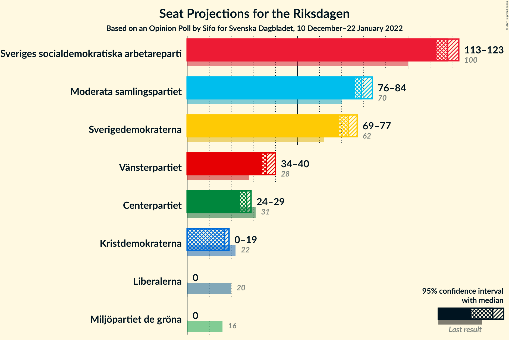
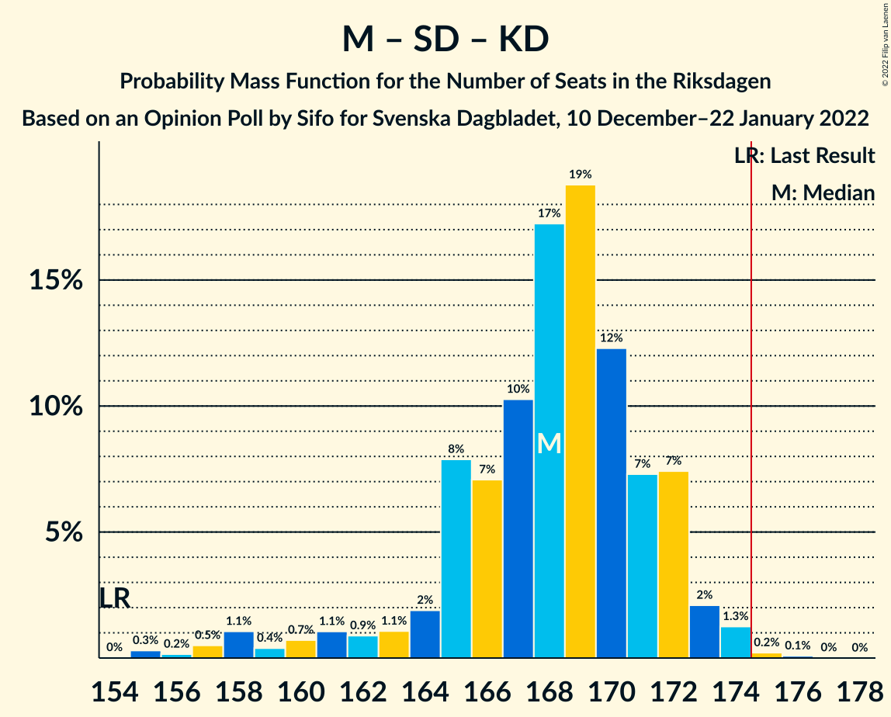
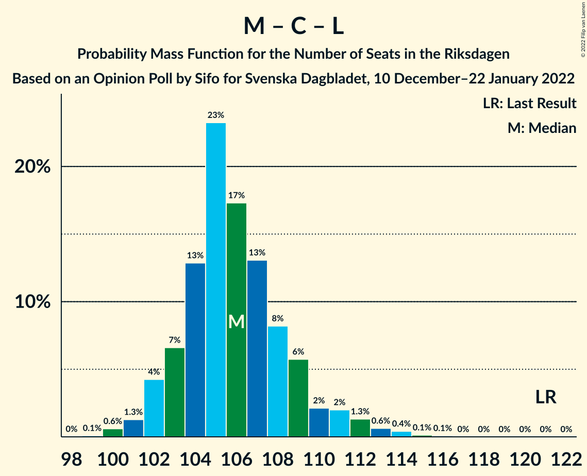

# Opinion Poll by Sifo for Svenska Dagbladet, 10 December–22 January 2022

<a href="#voting-intentions">Voting Intentions</a> | <a href="#seats">Seats</a> | <a href="#coalitions">Coalitions</a> | <a href="#technical-information">Technical Information</a>

## Voting Intentions

### Confidence Intervals

| Party | Last Result | Poll Result | 80% Confidence Interval | 90% Confidence Interval | 95% Confidence Interval | 99% Confidence Interval |
|:-----:|:-----------:|:-----------:|:-----------------------:|:-----------------------:|:-----------------------:|:-----------------------:|
| Sveriges socialdemokratiska arbetareparti | 28.3% | 31.1% | 30.4–31.8% |30.2–32.0% |30.0–32.2% |29.6–32.6% |
| Moderata samlingspartiet | 19.8% | 20.9% | 20.3–21.6% |20.1–21.7% |19.9–21.9% |19.6–22.2% |
| Sverigedemokraterna | 17.5% | 19.2% | 18.6–19.8% |18.4–20.0% |18.3–20.2% |18.0–20.5% |
| Vänsterpartiet | 8.0% | 9.6% | 9.1–10.1% |9.0–10.2% |8.9–10.3% |8.7–10.6% |
| Centerpartiet | 8.6% | 7.0% | 6.6–7.4% |6.5–7.5% |6.4–7.6% |6.2–7.8% |
| Kristdemokraterna | 6.3% | 4.4% | 4.1–4.7% |4.0–4.8% |3.9–4.9% |3.8–5.1% |
| Miljöpartiet de gröna | 4.4% | 3.0% | 2.7–3.3% |2.7–3.4% |2.6–3.4% |2.5–3.6% |
| Liberalerna | 5.5% | 2.9% | 2.7–3.2% |2.6–3.3% |2.5–3.3% |2.4–3.5% |

*Note:* The poll result column reflects the actual value used in the calculations. Published results may vary slightly, and in addition be rounded to fewer digits.

## Seats

### Confidence Intervals

| Party | Last Result | Median | 80% Confidence Interval | 90% Confidence Interval | 95% Confidence Interval | 99% Confidence Interval |
|:-----:|:-----------:|:------:|:-----------------------:|:-----------------------:|:-----------------------:|:-----------------------:|
| <a href="#sveriges-socialdemokratiska-arbetareparti">Sveriges socialdemokratiska arbetareparti</a> | 100 | 118 | 115–121 |115–122 |113–123 |112–126 |
| <a href="#moderata-samlingspartiet">Moderata samlingspartiet</a> | 70 | 79 | 77–82 |76–83 |76–84 |74–86 |
| <a href="#sverigedemokraterna">Sverigedemokraterna</a> | 62 | 73 | 70–75 |70–76 |69–77 |68–79 |
| <a href="#vänsterpartiet">Vänsterpartiet</a> | 28 | 36 | 35–38 |34–39 |34–40 |33–40 |
| <a href="#centerpartiet">Centerpartiet</a> | 31 | 27 | 25–28 |25–29 |24–29 |24–30 |
| <a href="#kristdemokraterna">Kristdemokraterna</a> | 22 | 17 | 15–18 |0–18 |0–19 |0–19 |
| <a href="#miljöpartiet-de-gröna">Miljöpartiet de gröna</a> | 16 | 0 | 0 |0 |0 |0 |
| <a href="#liberalerna">Liberalerna</a> | 20 | 0 | 0 |0 |0 |0 |

### Sveriges socialdemokratiska arbetareparti

*For a full overview of the results for this party, see the [Sveriges socialdemokratiska arbetareparti](party-sverigessocialdemokratiskaarbetareparti.html) page.*

| Number of Seats | Probability | Accumulated | Special Marks |
|:---------------:|:-----------:|:-----------:|:-------------:|
| 100 | 0% | 100% | Last Result |
| 101 | 0% | 100% |  |
| 102 | 0% | 100% |  |
| 103 | 0% | 100% |  |
| 104 | 0% | 100% |  |
| 105 | 0% | 100% |  |
| 106 | 0% | 100% |  |
| 107 | 0% | 100% |  |
| 108 | 0% | 100% |  |
| 109 | 0% | 100% |  |
| 110 | 0% | 100% |  |
| 111 | 0.1% | 100% |  |
| 112 | 0.8% | 99.9% |  |
| 113 | 2% | 99.1% |  |
| 114 | 2% | 97% |  |
| 115 | 14% | 95% |  |
| 116 | 9% | 82% |  |
| 117 | 17% | 72% |  |
| 118 | 22% | 56% | Median |
| 119 | 7% | 34% |  |
| 120 | 12% | 27% |  |
| 121 | 7% | 15% |  |
| 122 | 3% | 7% |  |
| 123 | 3% | 5% |  |
| 124 | 0.6% | 2% |  |
| 125 | 0.7% | 1.5% |  |
| 126 | 0.3% | 0.8% |  |
| 127 | 0.3% | 0.5% |  |
| 128 | 0.1% | 0.2% |  |
| 129 | 0.1% | 0.1% |  |
| 130 | 0% | 0% |  |

### Moderata samlingspartiet

*For a full overview of the results for this party, see the [Moderata samlingspartiet](party-moderatasamlingspartiet.html) page.*

| Number of Seats | Probability | Accumulated | Special Marks |
|:---------------:|:-----------:|:-----------:|:-------------:|
| 70 | 0% | 100% | Last Result |
| 71 | 0% | 100% |  |
| 72 | 0% | 100% |  |
| 73 | 0.1% | 100% |  |
| 74 | 0.4% | 99.9% |  |
| 75 | 2% | 99.5% |  |
| 76 | 5% | 98% |  |
| 77 | 9% | 93% |  |
| 78 | 21% | 84% |  |
| 79 | 18% | 63% | Median |
| 80 | 19% | 45% |  |
| 81 | 13% | 26% |  |
| 82 | 6% | 13% |  |
| 83 | 4% | 7% |  |
| 84 | 1.3% | 3% |  |
| 85 | 0.9% | 2% |  |
| 86 | 0.5% | 0.7% |  |
| 87 | 0.2% | 0.2% |  |
| 88 | 0% | 0% |  |

### Sverigedemokraterna

*For a full overview of the results for this party, see the [Sverigedemokraterna](party-sverigedemokraterna.html) page.*

| Number of Seats | Probability | Accumulated | Special Marks |
|:---------------:|:-----------:|:-----------:|:-------------:|
| 62 | 0% | 100% | Last Result |
| 63 | 0% | 100% |  |
| 64 | 0% | 100% |  |
| 65 | 0% | 100% |  |
| 66 | 0% | 100% |  |
| 67 | 0.2% | 100% |  |
| 68 | 0.7% | 99.8% |  |
| 69 | 2% | 99.1% |  |
| 70 | 8% | 97% |  |
| 71 | 14% | 89% |  |
| 72 | 15% | 76% |  |
| 73 | 24% | 61% | Median |
| 74 | 18% | 37% |  |
| 75 | 9% | 18% |  |
| 76 | 5% | 9% |  |
| 77 | 3% | 4% |  |
| 78 | 1.2% | 2% |  |
| 79 | 0.4% | 0.7% |  |
| 80 | 0.2% | 0.2% |  |
| 81 | 0% | 0.1% |  |
| 82 | 0% | 0% |  |

### Vänsterpartiet

*For a full overview of the results for this party, see the [Vänsterpartiet](party-vänsterpartiet.html) page.*

| Number of Seats | Probability | Accumulated | Special Marks |
|:---------------:|:-----------:|:-----------:|:-------------:|
| 28 | 0% | 100% | Last Result |
| 29 | 0% | 100% |  |
| 30 | 0% | 100% |  |
| 31 | 0% | 100% |  |
| 32 | 0.2% | 100% |  |
| 33 | 1.3% | 99.8% |  |
| 34 | 7% | 98.6% |  |
| 35 | 18% | 91% |  |
| 36 | 27% | 73% | Median |
| 37 | 21% | 45% |  |
| 38 | 16% | 24% |  |
| 39 | 6% | 8% |  |
| 40 | 2% | 3% |  |
| 41 | 0.3% | 0.4% |  |
| 42 | 0.1% | 0.1% |  |
| 43 | 0% | 0% |  |

### Centerpartiet

*For a full overview of the results for this party, see the [Centerpartiet](party-centerpartiet.html) page.*

| Number of Seats | Probability | Accumulated | Special Marks |
|:---------------:|:-----------:|:-----------:|:-------------:|
| 23 | 0.3% | 100% |  |
| 24 | 3% | 99.6% |  |
| 25 | 21% | 97% |  |
| 26 | 24% | 76% |  |
| 27 | 30% | 51% | Median |
| 28 | 15% | 22% |  |
| 29 | 6% | 7% |  |
| 30 | 0.9% | 1.0% |  |
| 31 | 0.1% | 0.1% | Last Result |
| 32 | 0% | 0% |  |

### Kristdemokraterna

*For a full overview of the results for this party, see the [Kristdemokraterna](party-kristdemokraterna.html) page.*

| Number of Seats | Probability | Accumulated | Special Marks |
|:---------------:|:-----------:|:-----------:|:-------------:|
| 0 | 5% | 100% |  |
| 1 | 0% | 95% |  |
| 2 | 0% | 95% |  |
| 3 | 0% | 95% |  |
| 4 | 0% | 95% |  |
| 5 | 0% | 95% |  |
| 6 | 0% | 95% |  |
| 7 | 0% | 95% |  |
| 8 | 0% | 95% |  |
| 9 | 0% | 95% |  |
| 10 | 0% | 95% |  |
| 11 | 0% | 95% |  |
| 12 | 0% | 95% |  |
| 13 | 0% | 95% |  |
| 14 | 0% | 95% |  |
| 15 | 9% | 95% |  |
| 16 | 33% | 85% |  |
| 17 | 32% | 53% | Median |
| 18 | 18% | 20% |  |
| 19 | 3% | 3% |  |
| 20 | 0.2% | 0.2% |  |
| 21 | 0% | 0% |  |
| 22 | 0% | 0% | Last Result |

### Miljöpartiet de gröna

*For a full overview of the results for this party, see the [Miljöpartiet de gröna](party-miljöpartietdegröna.html) page.*

| Number of Seats | Probability | Accumulated | Special Marks |
|:---------------:|:-----------:|:-----------:|:-------------:|
| 0 | 100% | 100% | Median |
| 1 | 0% | 0% |  |
| 2 | 0% | 0% |  |
| 3 | 0% | 0% |  |
| 4 | 0% | 0% |  |
| 5 | 0% | 0% |  |
| 6 | 0% | 0% |  |
| 7 | 0% | 0% |  |
| 8 | 0% | 0% |  |
| 9 | 0% | 0% |  |
| 10 | 0% | 0% |  |
| 11 | 0% | 0% |  |
| 12 | 0% | 0% |  |
| 13 | 0% | 0% |  |
| 14 | 0% | 0% |  |
| 15 | 0% | 0% |  |
| 16 | 0% | 0% | Last Result |

### Liberalerna

*For a full overview of the results for this party, see the [Liberalerna](party-liberalerna.html) page.*

| Number of Seats | Probability | Accumulated | Special Marks |
|:---------------:|:-----------:|:-----------:|:-------------:|
| 0 | 100% | 100% | Median |
| 1 | 0% | 0% |  |
| 2 | 0% | 0% |  |
| 3 | 0% | 0% |  |
| 4 | 0% | 0% |  |
| 5 | 0% | 0% |  |
| 6 | 0% | 0% |  |
| 7 | 0% | 0% |  |
| 8 | 0% | 0% |  |
| 9 | 0% | 0% |  |
| 10 | 0% | 0% |  |
| 11 | 0% | 0% |  |
| 12 | 0% | 0% |  |
| 13 | 0% | 0% |  |
| 14 | 0% | 0% |  |
| 15 | 0% | 0% |  |
| 16 | 0% | 0% |  |
| 17 | 0% | 0% |  |
| 18 | 0% | 0% |  |
| 19 | 0% | 0% |  |
| 20 | 0% | 0% | Last Result |

## Coalitions

### Confidence Intervals

| Coalition | Last Result | Median | Majority? | 80% Confidence Interval | 90% Confidence Interval | 95% Confidence Interval | 99% Confidence Interval |
|:---------:|:-----------:|:------:|:---------:|:-----------------------:|:-----------------------:|:-----------------------:|:-----------------------:|
| Sveriges socialdemokratiska arbetareparti – Moderata samlingspartiet – Centerpartiet | 201 | 223 | 100% | 220–227 | 220–231 | 219–234 | 218–237 |
| Sveriges socialdemokratiska arbetareparti – Moderata samlingspartiet | 170 | 197 | 100% | 194–200 | 193–203 | 192–206 | 191–209 |
| Sveriges socialdemokratiska arbetareparti – Vänsterpartiet – Centerpartiet – Miljöpartiet de gröna – Liberalerna | 195 | 181 | 99.7% | 177–184 | 177–187 | 176–189 | 175–193 |
| Moderata samlingspartiet – Sverigedemokraterna – Kristdemokraterna | 154 | 168 | 0.3% | 165–172 | 162–172 | 160–173 | 156–174 |
| Sveriges socialdemokratiska arbetareparti – Vänsterpartiet – Miljöpartiet de gröna | 144 | 154 | 0% | 151–158 | 150–159 | 150–162 | 148–164 |
| Sveriges socialdemokratiska arbetareparti – Vänsterpartiet | 128 | 154 | 0% | 151–158 | 150–159 | 150–162 | 148–164 |
| Moderata samlingspartiet – Sverigedemokraterna | 132 | 152 | 0% | 149–155 | 148–157 | 148–160 | 146–163 |
| Sveriges socialdemokratiska arbetareparti – Centerpartiet – Miljöpartiet de gröna – Liberalerna | 167 | 144 | 0% | 141–148 | 141–149 | 140–151 | 138–154 |
| Moderata samlingspartiet – Centerpartiet – Kristdemokraterna – Liberalerna | 143 | 122 | 0% | 119–125 | 114–126 | 111–126 | 108–128 |
| Moderata samlingspartiet – Centerpartiet – Kristdemokraterna | 123 | 122 | 0% | 119–125 | 114–126 | 111–126 | 108–128 |
| Sveriges socialdemokratiska arbetareparti – Miljöpartiet de gröna | 116 | 118 | 0% | 115–121 | 115–122 | 113–123 | 112–126 |
| Moderata samlingspartiet – Centerpartiet – Liberalerna | 121 | 106 | 0% | 103–109 | 102–110 | 102–112 | 100–114 |
| Moderata samlingspartiet – Centerpartiet | 101 | 106 | 0% | 103–109 | 102–110 | 102–112 | 100–114 |

### Sveriges socialdemokratiska arbetareparti – Moderata samlingspartiet – Centerpartiet

| Number of Seats | Probability | Accumulated | Special Marks |
|:---------------:|:-----------:|:-----------:|:-------------:|
| 201 | 0% | 100% | Last Result |
| 202 | 0% | 100% |  |
| 203 | 0% | 100% |  |
| 204 | 0% | 100% |  |
| 205 | 0% | 100% |  |
| 206 | 0% | 100% |  |
| 207 | 0% | 100% |  |
| 208 | 0% | 100% |  |
| 209 | 0% | 100% |  |
| 210 | 0% | 100% |  |
| 211 | 0% | 100% |  |
| 212 | 0% | 100% |  |
| 213 | 0% | 100% |  |
| 214 | 0% | 100% |  |
| 215 | 0% | 100% |  |
| 216 | 0.1% | 100% |  |
| 217 | 0.3% | 99.9% |  |
| 218 | 1.2% | 99.6% |  |
| 219 | 3% | 98% |  |
| 220 | 6% | 96% |  |
| 221 | 12% | 90% |  |
| 222 | 13% | 78% |  |
| 223 | 19% | 65% |  |
| 224 | 13% | 47% | Median |
| 225 | 12% | 34% |  |
| 226 | 10% | 21% |  |
| 227 | 4% | 11% |  |
| 228 | 2% | 8% |  |
| 229 | 0.5% | 6% |  |
| 230 | 0.1% | 5% |  |
| 231 | 0.7% | 5% |  |
| 232 | 0.5% | 5% |  |
| 233 | 0.3% | 4% |  |
| 234 | 1.5% | 4% |  |
| 235 | 1.0% | 2% |  |
| 236 | 0.5% | 1.2% |  |
| 237 | 0.3% | 0.7% |  |
| 238 | 0.2% | 0.4% |  |
| 239 | 0.1% | 0.2% |  |
| 240 | 0% | 0.1% |  |
| 241 | 0% | 0% |  |

### Sveriges socialdemokratiska arbetareparti – Moderata samlingspartiet

| Number of Seats | Probability | Accumulated | Special Marks |
|:---------------:|:-----------:|:-----------:|:-------------:|
| 170 | 0% | 100% | Last Result |
| 171 | 0% | 100% |  |
| 172 | 0% | 100% |  |
| 173 | 0% | 100% |  |
| 174 | 0% | 100% |  |
| 175 | 0% | 100% | Majority |
| 176 | 0% | 100% |  |
| 177 | 0% | 100% |  |
| 178 | 0% | 100% |  |
| 179 | 0% | 100% |  |
| 180 | 0% | 100% |  |
| 181 | 0% | 100% |  |
| 182 | 0% | 100% |  |
| 183 | 0% | 100% |  |
| 184 | 0% | 100% |  |
| 185 | 0% | 100% |  |
| 186 | 0% | 100% |  |
| 187 | 0% | 100% |  |
| 188 | 0% | 100% |  |
| 189 | 0.1% | 100% |  |
| 190 | 0.1% | 99.9% |  |
| 191 | 0.7% | 99.8% |  |
| 192 | 2% | 99.1% |  |
| 193 | 5% | 97% |  |
| 194 | 6% | 92% |  |
| 195 | 14% | 86% |  |
| 196 | 18% | 72% |  |
| 197 | 11% | 54% | Median |
| 198 | 15% | 43% |  |
| 199 | 13% | 29% |  |
| 200 | 6% | 16% |  |
| 201 | 3% | 10% |  |
| 202 | 1.3% | 7% |  |
| 203 | 0.9% | 6% |  |
| 204 | 0.4% | 5% |  |
| 205 | 1.0% | 4% |  |
| 206 | 1.4% | 3% |  |
| 207 | 0.5% | 2% |  |
| 208 | 0.4% | 1.4% |  |
| 209 | 0.6% | 1.0% |  |
| 210 | 0.2% | 0.4% |  |
| 211 | 0.1% | 0.3% |  |
| 212 | 0.1% | 0.1% |  |
| 213 | 0% | 0% |  |

### Sveriges socialdemokratiska arbetareparti – Vänsterpartiet – Centerpartiet – Miljöpartiet de gröna – Liberalerna

| Number of Seats | Probability | Accumulated | Special Marks |
|:---------------:|:-----------:|:-----------:|:-------------:|
| 173 | 0.1% | 100% |  |
| 174 | 0.2% | 99.9% |  |
| 175 | 1.3% | 99.7% | Majority |
| 176 | 2% | 98% |  |
| 177 | 7% | 96% |  |
| 178 | 7% | 89% |  |
| 179 | 12% | 82% |  |
| 180 | 19% | 69% |  |
| 181 | 17% | 51% | Median |
| 182 | 10% | 33% |  |
| 183 | 7% | 23% |  |
| 184 | 8% | 16% |  |
| 185 | 2% | 8% |  |
| 186 | 1.1% | 6% |  |
| 187 | 0.9% | 5% |  |
| 188 | 1.1% | 4% |  |
| 189 | 0.7% | 3% |  |
| 190 | 0.4% | 2% |  |
| 191 | 1.1% | 2% |  |
| 192 | 0.5% | 1.0% |  |
| 193 | 0.2% | 0.5% |  |
| 194 | 0.3% | 0.4% |  |
| 195 | 0% | 0.1% | Last Result |
| 196 | 0% | 0% |  |

### Moderata samlingspartiet – Sverigedemokraterna – Kristdemokraterna

| Number of Seats | Probability | Accumulated | Special Marks |
|:---------------:|:-----------:|:-----------:|:-------------:|
| 154 | 0% | 100% | Last Result |
| 155 | 0.3% | 99.9% |  |
| 156 | 0.2% | 99.6% |  |
| 157 | 0.5% | 99.5% |  |
| 158 | 1.1% | 99.0% |  |
| 159 | 0.4% | 98% |  |
| 160 | 0.7% | 98% |  |
| 161 | 1.1% | 97% |  |
| 162 | 0.9% | 96% |  |
| 163 | 1.1% | 95% |  |
| 164 | 2% | 94% |  |
| 165 | 8% | 92% |  |
| 166 | 7% | 84% |  |
| 167 | 10% | 77% |  |
| 168 | 17% | 67% |  |
| 169 | 19% | 49% | Median |
| 170 | 12% | 31% |  |
| 171 | 7% | 18% |  |
| 172 | 7% | 11% |  |
| 173 | 2% | 4% |  |
| 174 | 1.3% | 2% |  |
| 175 | 0.2% | 0.3% | Majority |
| 176 | 0.1% | 0.1% |  |
| 177 | 0% | 0% |  |

### Sveriges socialdemokratiska arbetareparti – Vänsterpartiet – Miljöpartiet de gröna

| Number of Seats | Probability | Accumulated | Special Marks |
|:---------------:|:-----------:|:-----------:|:-------------:|
| 144 | 0% | 100% | Last Result |
| 145 | 0% | 100% |  |
| 146 | 0% | 100% |  |
| 147 | 0.1% | 100% |  |
| 148 | 0.4% | 99.8% |  |
| 149 | 2% | 99.5% |  |
| 150 | 4% | 98% |  |
| 151 | 8% | 94% |  |
| 152 | 11% | 86% |  |
| 153 | 16% | 75% |  |
| 154 | 14% | 59% | Median |
| 155 | 17% | 45% |  |
| 156 | 9% | 28% |  |
| 157 | 8% | 19% |  |
| 158 | 4% | 11% |  |
| 159 | 2% | 7% |  |
| 160 | 1.5% | 5% |  |
| 161 | 0.8% | 3% |  |
| 162 | 0.3% | 3% |  |
| 163 | 1.0% | 2% |  |
| 164 | 0.7% | 1.2% |  |
| 165 | 0.1% | 0.5% |  |
| 166 | 0.3% | 0.4% |  |
| 167 | 0% | 0.1% |  |
| 168 | 0% | 0% |  |

### Sveriges socialdemokratiska arbetareparti – Vänsterpartiet

| Number of Seats | Probability | Accumulated | Special Marks |
|:---------------:|:-----------:|:-----------:|:-------------:|
| 128 | 0% | 100% | Last Result |
| 129 | 0% | 100% |  |
| 130 | 0% | 100% |  |
| 131 | 0% | 100% |  |
| 132 | 0% | 100% |  |
| 133 | 0% | 100% |  |
| 134 | 0% | 100% |  |
| 135 | 0% | 100% |  |
| 136 | 0% | 100% |  |
| 137 | 0% | 100% |  |
| 138 | 0% | 100% |  |
| 139 | 0% | 100% |  |
| 140 | 0% | 100% |  |
| 141 | 0% | 100% |  |
| 142 | 0% | 100% |  |
| 143 | 0% | 100% |  |
| 144 | 0% | 100% |  |
| 145 | 0% | 100% |  |
| 146 | 0% | 100% |  |
| 147 | 0.1% | 100% |  |
| 148 | 0.4% | 99.8% |  |
| 149 | 2% | 99.5% |  |
| 150 | 4% | 98% |  |
| 151 | 8% | 94% |  |
| 152 | 11% | 86% |  |
| 153 | 16% | 75% |  |
| 154 | 14% | 59% | Median |
| 155 | 17% | 45% |  |
| 156 | 9% | 28% |  |
| 157 | 8% | 19% |  |
| 158 | 4% | 11% |  |
| 159 | 2% | 7% |  |
| 160 | 1.5% | 5% |  |
| 161 | 0.8% | 3% |  |
| 162 | 0.3% | 3% |  |
| 163 | 1.0% | 2% |  |
| 164 | 0.7% | 1.2% |  |
| 165 | 0.1% | 0.5% |  |
| 166 | 0.3% | 0.4% |  |
| 167 | 0% | 0.1% |  |
| 168 | 0% | 0% |  |

### Moderata samlingspartiet – Sverigedemokraterna

| Number of Seats | Probability | Accumulated | Special Marks |
|:---------------:|:-----------:|:-----------:|:-------------:|
| 132 | 0% | 100% | Last Result |
| 133 | 0% | 100% |  |
| 134 | 0% | 100% |  |
| 135 | 0% | 100% |  |
| 136 | 0% | 100% |  |
| 137 | 0% | 100% |  |
| 138 | 0% | 100% |  |
| 139 | 0% | 100% |  |
| 140 | 0% | 100% |  |
| 141 | 0% | 100% |  |
| 142 | 0% | 100% |  |
| 143 | 0% | 100% |  |
| 144 | 0% | 100% |  |
| 145 | 0.2% | 100% |  |
| 146 | 0.5% | 99.8% |  |
| 147 | 2% | 99.3% |  |
| 148 | 4% | 98% |  |
| 149 | 8% | 93% |  |
| 150 | 12% | 86% |  |
| 151 | 14% | 74% |  |
| 152 | 16% | 60% | Median |
| 153 | 19% | 44% |  |
| 154 | 9% | 25% |  |
| 155 | 6% | 16% |  |
| 156 | 3% | 10% |  |
| 157 | 2% | 7% |  |
| 158 | 1.5% | 5% |  |
| 159 | 0.5% | 3% |  |
| 160 | 0.7% | 3% |  |
| 161 | 1.0% | 2% |  |
| 162 | 0.6% | 1.1% |  |
| 163 | 0.4% | 0.6% |  |
| 164 | 0.1% | 0.2% |  |
| 165 | 0% | 0.1% |  |
| 166 | 0% | 0% |  |

### Sveriges socialdemokratiska arbetareparti – Centerpartiet – Miljöpartiet de gröna – Liberalerna

| Number of Seats | Probability | Accumulated | Special Marks |
|:---------------:|:-----------:|:-----------:|:-------------:|
| 137 | 0.1% | 100% |  |
| 138 | 0.4% | 99.9% |  |
| 139 | 1.2% | 99.4% |  |
| 140 | 3% | 98% |  |
| 141 | 7% | 95% |  |
| 142 | 14% | 88% |  |
| 143 | 14% | 75% |  |
| 144 | 15% | 61% |  |
| 145 | 16% | 46% | Median |
| 146 | 10% | 30% |  |
| 147 | 6% | 20% |  |
| 148 | 8% | 14% |  |
| 149 | 2% | 7% |  |
| 150 | 0.9% | 5% |  |
| 151 | 2% | 4% |  |
| 152 | 0.4% | 2% |  |
| 153 | 0.7% | 1.4% |  |
| 154 | 0.3% | 0.7% |  |
| 155 | 0.3% | 0.4% |  |
| 156 | 0.1% | 0.1% |  |
| 157 | 0.1% | 0.1% |  |
| 158 | 0% | 0% |  |
| 159 | 0% | 0% |  |
| 160 | 0% | 0% |  |
| 161 | 0% | 0% |  |
| 162 | 0% | 0% |  |
| 163 | 0% | 0% |  |
| 164 | 0% | 0% |  |
| 165 | 0% | 0% |  |
| 166 | 0% | 0% |  |
| 167 | 0% | 0% | Last Result |

### Moderata samlingspartiet – Centerpartiet – Kristdemokraterna – Liberalerna

| Number of Seats | Probability | Accumulated | Special Marks |
|:---------------:|:-----------:|:-----------:|:-------------:|
| 106 | 0.1% | 100% |  |
| 107 | 0.2% | 99.9% |  |
| 108 | 0.4% | 99.6% |  |
| 109 | 0.4% | 99.3% |  |
| 110 | 0.4% | 98.9% |  |
| 111 | 1.4% | 98% |  |
| 112 | 1.1% | 97% |  |
| 113 | 0.6% | 96% |  |
| 114 | 0.4% | 95% |  |
| 115 | 0.2% | 95% |  |
| 116 | 0.3% | 95% |  |
| 117 | 0.8% | 95% |  |
| 118 | 2% | 94% |  |
| 119 | 5% | 91% |  |
| 120 | 12% | 87% |  |
| 121 | 17% | 74% |  |
| 122 | 15% | 57% |  |
| 123 | 13% | 42% | Median |
| 124 | 14% | 29% |  |
| 125 | 9% | 16% |  |
| 126 | 4% | 7% |  |
| 127 | 2% | 2% |  |
| 128 | 0.4% | 0.6% |  |
| 129 | 0.2% | 0.2% |  |
| 130 | 0% | 0% |  |
| 131 | 0% | 0% |  |
| 132 | 0% | 0% |  |
| 133 | 0% | 0% |  |
| 134 | 0% | 0% |  |
| 135 | 0% | 0% |  |
| 136 | 0% | 0% |  |
| 137 | 0% | 0% |  |
| 138 | 0% | 0% |  |
| 139 | 0% | 0% |  |
| 140 | 0% | 0% |  |
| 141 | 0% | 0% |  |
| 142 | 0% | 0% |  |
| 143 | 0% | 0% | Last Result |

### Moderata samlingspartiet – Centerpartiet – Kristdemokraterna

| Number of Seats | Probability | Accumulated | Special Marks |
|:---------------:|:-----------:|:-----------:|:-------------:|
| 106 | 0.1% | 100% |  |
| 107 | 0.2% | 99.9% |  |
| 108 | 0.4% | 99.6% |  |
| 109 | 0.4% | 99.3% |  |
| 110 | 0.4% | 98.9% |  |
| 111 | 1.4% | 98% |  |
| 112 | 1.1% | 97% |  |
| 113 | 0.6% | 96% |  |
| 114 | 0.4% | 95% |  |
| 115 | 0.2% | 95% |  |
| 116 | 0.3% | 95% |  |
| 117 | 0.8% | 95% |  |
| 118 | 2% | 94% |  |
| 119 | 5% | 91% |  |
| 120 | 12% | 87% |  |
| 121 | 17% | 74% |  |
| 122 | 15% | 57% |  |
| 123 | 13% | 42% | Last Result, Median |
| 124 | 14% | 29% |  |
| 125 | 9% | 16% |  |
| 126 | 4% | 7% |  |
| 127 | 2% | 2% |  |
| 128 | 0.4% | 0.6% |  |
| 129 | 0.2% | 0.2% |  |
| 130 | 0% | 0% |  |

### Sveriges socialdemokratiska arbetareparti – Miljöpartiet de gröna

| Number of Seats | Probability | Accumulated | Special Marks |
|:---------------:|:-----------:|:-----------:|:-------------:|
| 111 | 0.1% | 100% |  |
| 112 | 0.8% | 99.9% |  |
| 113 | 2% | 99.1% |  |
| 114 | 2% | 97% |  |
| 115 | 14% | 95% |  |
| 116 | 9% | 82% | Last Result |
| 117 | 17% | 72% |  |
| 118 | 22% | 56% | Median |
| 119 | 7% | 34% |  |
| 120 | 12% | 27% |  |
| 121 | 7% | 15% |  |
| 122 | 3% | 7% |  |
| 123 | 3% | 5% |  |
| 124 | 0.6% | 2% |  |
| 125 | 0.7% | 1.5% |  |
| 126 | 0.3% | 0.8% |  |
| 127 | 0.3% | 0.5% |  |
| 128 | 0.1% | 0.2% |  |
| 129 | 0.1% | 0.1% |  |
| 130 | 0% | 0% |  |

### Moderata samlingspartiet – Centerpartiet – Liberalerna

| Number of Seats | Probability | Accumulated | Special Marks |
|:---------------:|:-----------:|:-----------:|:-------------:|
| 99 | 0.1% | 100% |  |
| 100 | 0.6% | 99.9% |  |
| 101 | 1.3% | 99.3% |  |
| 102 | 4% | 98% |  |
| 103 | 7% | 94% |  |
| 104 | 13% | 87% |  |
| 105 | 23% | 74% |  |
| 106 | 17% | 51% | Median |
| 107 | 13% | 34% |  |
| 108 | 8% | 21% |  |
| 109 | 6% | 12% |  |
| 110 | 2% | 7% |  |
| 111 | 2% | 5% |  |
| 112 | 1.3% | 3% |  |
| 113 | 0.6% | 1.3% |  |
| 114 | 0.4% | 0.6% |  |
| 115 | 0.1% | 0.2% |  |
| 116 | 0.1% | 0.1% |  |
| 117 | 0% | 0% |  |
| 118 | 0% | 0% |  |
| 119 | 0% | 0% |  |
| 120 | 0% | 0% |  |
| 121 | 0% | 0% | Last Result |

### Moderata samlingspartiet – Centerpartiet

| Number of Seats | Probability | Accumulated | Special Marks |
|:---------------:|:-----------:|:-----------:|:-------------:|
| 99 | 0.1% | 100% |  |
| 100 | 0.6% | 99.9% |  |
| 101 | 1.3% | 99.3% | Last Result |
| 102 | 4% | 98% |  |
| 103 | 7% | 94% |  |
| 104 | 13% | 87% |  |
| 105 | 23% | 74% |  |
| 106 | 17% | 51% | Median |
| 107 | 13% | 34% |  |
| 108 | 8% | 21% |  |
| 109 | 6% | 12% |  |
| 110 | 2% | 7% |  |
| 111 | 2% | 5% |  |
| 112 | 1.3% | 3% |  |
| 113 | 0.6% | 1.3% |  |
| 114 | 0.4% | 0.6% |  |
| 115 | 0.1% | 0.2% |  |
| 116 | 0.1% | 0.1% |  |
| 117 | 0% | 0% |  |

## Technical Information

### Opinion Poll

+ **Polling firm:** Sifo
+ **Commissioner(s):** Svenska Dagbladet
+ **Fieldwork period:** 10 December–22 January 2022

### Calculations

+ **Sample size:** 6692
+ **Simulations done:** 1,048,576
+ **Error estimate:** 0.59%

