# Opinion Poll by Ipsos for Dagens Nyheter, 11–24 January 2022

<a href="#voting-intentions">Voting Intentions</a> | <a href="#seats">Seats</a> | <a href="#coalitions">Coalitions</a> | <a href="#technical-information">Technical Information</a>

## Voting Intentions

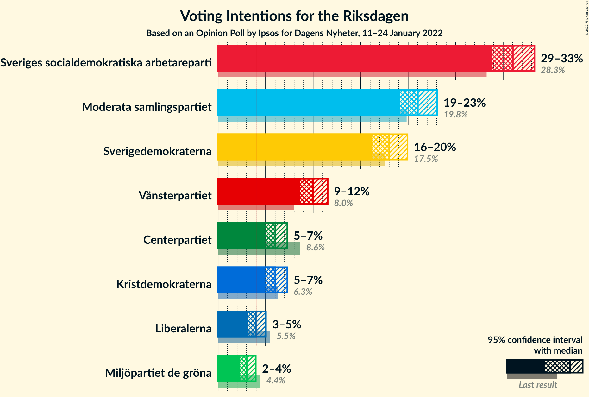

### Confidence Intervals

| Party | Last Result | Poll Result | 80% Confidence Interval | 90% Confidence Interval | 95% Confidence Interval | 99% Confidence Interval |
|:-----:|:-----------:|:-----------:|:-----------------------:|:-----------------------:|:-----------------------:|:-----------------------:|
| Sveriges socialdemokratiska arbetareparti | 28.3% | 31.0% | 29.6–32.5% |29.2–32.9% |28.8–33.3% |28.2–34.0% |
| Moderata samlingspartiet | 19.8% | 21.0% | 19.8–22.4% |19.4–22.7% |19.1–23.1% |18.5–23.7% |
| Sverigedemokraterna | 17.5% | 18.0% | 16.8–19.3% |16.5–19.6% |16.2–19.9% |15.7–20.6% |
| Vänsterpartiet | 8.0% | 10.0% | 9.1–11.0% |8.9–11.3% |8.6–11.5% |8.2–12.0% |
| Centerpartiet | 8.6% | 6.0% | 5.3–6.8% |5.1–7.1% |5.0–7.3% |4.7–7.7% |
| Kristdemokraterna | 6.3% | 6.0% | 5.3–6.8% |5.1–7.1% |5.0–7.3% |4.7–7.7% |
| Liberalerna | 5.5% | 4.0% | 3.4–4.7% |3.3–4.9% |3.1–5.0% |2.9–5.4% |
| Miljöpartiet de gröna | 4.4% | 3.0% | 2.5–3.6% |2.4–3.8% |2.3–4.0% |2.1–4.3% |

*Note:* The poll result column reflects the actual value used in the calculations. Published results may vary slightly, and in addition be rounded to fewer digits.

## Seats

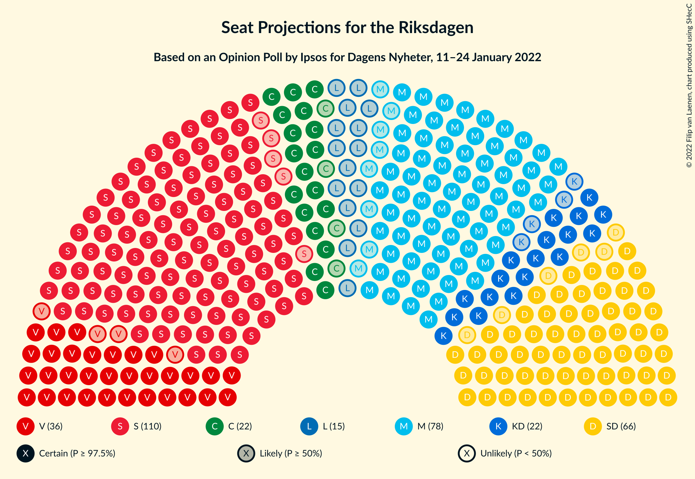

### Confidence Intervals

| Party | Last Result | Median | 80% Confidence Interval | 90% Confidence Interval | 95% Confidence Interval | 99% Confidence Interval |
|:-----:|:-----------:|:------:|:-----------------------:|:-----------------------:|:-----------------------:|:-----------------------:|
| <a href="#sveriges-socialdemokratiska-arbetareparti">Sveriges socialdemokratiska arbetareparti</a> | 100 | 114 | 107–120 |107–123 |105–124 |102–128 |
| <a href="#moderata-samlingspartiet">Moderata samlingspartiet</a> | 70 | 78 | 72–83 |71–85 |70–86 |67–89 |
| <a href="#sverigedemokraterna">Sverigedemokraterna</a> | 62 | 66 | 61–71 |61–73 |60–74 |58–77 |
| <a href="#vänsterpartiet">Vänsterpartiet</a> | 28 | 37 | 33–41 |32–42 |32–43 |30–45 |
| <a href="#centerpartiet">Centerpartiet</a> | 31 | 22 | 20–25 |19–26 |18–27 |17–29 |
| <a href="#kristdemokraterna">Kristdemokraterna</a> | 22 | 23 | 20–25 |19–26 |18–27 |17–29 |
| <a href="#liberalerna">Liberalerna</a> | 20 | 15 | 0–17 |0–18 |0–18 |0–20 |
| <a href="#miljöpartiet-de-gröna">Miljöpartiet de gröna</a> | 16 | 0 | 0 |0 |0 |0–15 |

### Sveriges socialdemokratiska arbetareparti

*For a full overview of the results for this party, see the [Sveriges socialdemokratiska arbetareparti](party-sverigessocialdemokratiskaarbetareparti.html) page.*

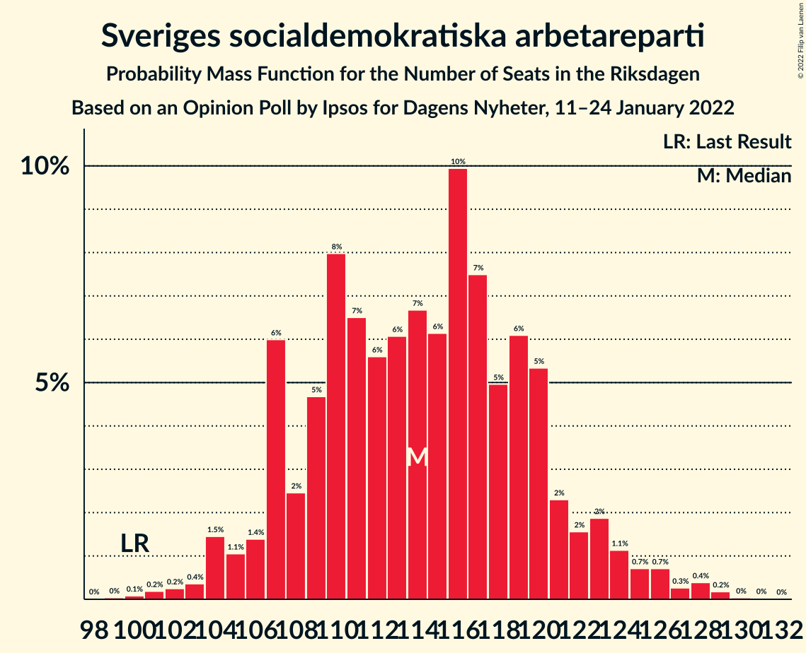

| Number of Seats | Probability | Accumulated | Special Marks |
|:---------------:|:-----------:|:-----------:|:-------------:|
| 99 | 0% | 100% |  |
| 100 | 0.1% | 99.9% | Last Result |
| 101 | 0.2% | 99.9% |  |
| 102 | 0.2% | 99.7% |  |
| 103 | 0.4% | 99.4% |  |
| 104 | 1.5% | 99.1% |  |
| 105 | 1.1% | 98% |  |
| 106 | 1.4% | 97% |  |
| 107 | 6% | 95% |  |
| 108 | 2% | 89% |  |
| 109 | 5% | 87% |  |
| 110 | 8% | 82% |  |
| 111 | 7% | 74% |  |
| 112 | 6% | 68% |  |
| 113 | 6% | 62% |  |
| 114 | 7% | 56% | Median |
| 115 | 6% | 49% |  |
| 116 | 10% | 43% |  |
| 117 | 7% | 33% |  |
| 118 | 5% | 26% |  |
| 119 | 6% | 21% |  |
| 120 | 5% | 15% |  |
| 121 | 2% | 9% |  |
| 122 | 2% | 7% |  |
| 123 | 2% | 5% |  |
| 124 | 1.1% | 3% |  |
| 125 | 0.7% | 2% |  |
| 126 | 0.7% | 2% |  |
| 127 | 0.3% | 0.9% |  |
| 128 | 0.4% | 0.7% |  |
| 129 | 0.2% | 0.3% |  |
| 130 | 0% | 0.1% |  |
| 131 | 0% | 0% |  |

### Moderata samlingspartiet

*For a full overview of the results for this party, see the [Moderata samlingspartiet](party-moderatasamlingspartiet.html) page.*

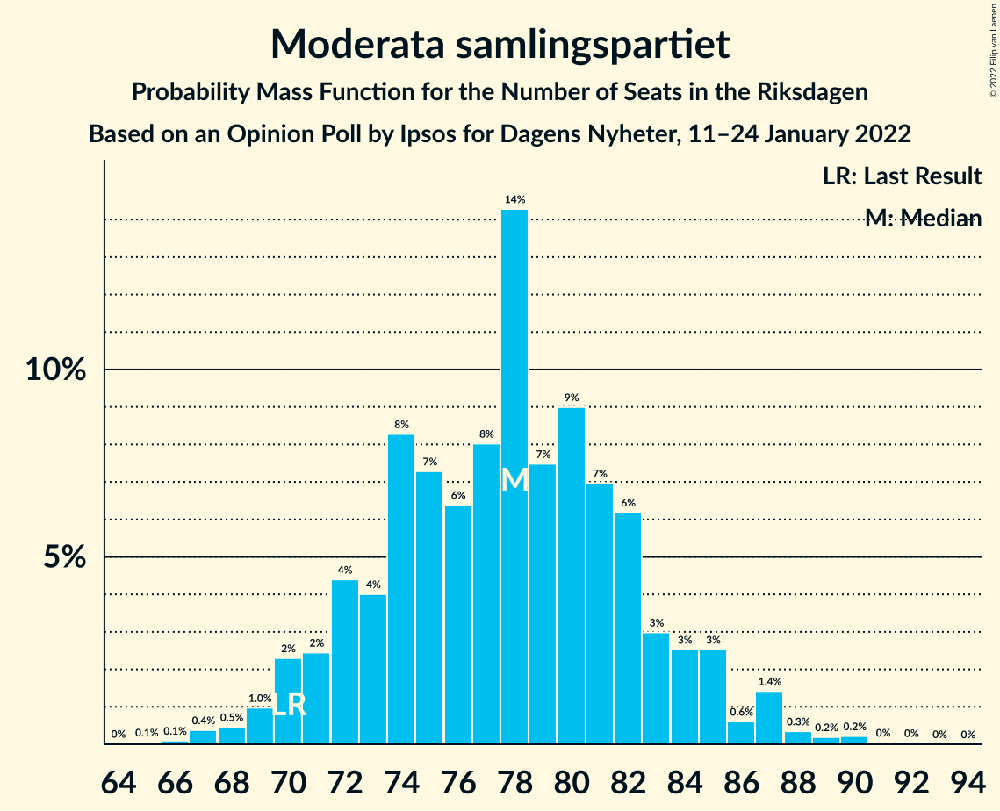

| Number of Seats | Probability | Accumulated | Special Marks |
|:---------------:|:-----------:|:-----------:|:-------------:|
| 65 | 0.1% | 100% |  |
| 66 | 0.1% | 99.9% |  |
| 67 | 0.4% | 99.8% |  |
| 68 | 0.5% | 99.4% |  |
| 69 | 1.0% | 99.0% |  |
| 70 | 2% | 98% | Last Result |
| 71 | 2% | 96% |  |
| 72 | 4% | 93% |  |
| 73 | 4% | 89% |  |
| 74 | 8% | 85% |  |
| 75 | 7% | 77% |  |
| 76 | 6% | 69% |  |
| 77 | 8% | 63% |  |
| 78 | 14% | 55% | Median |
| 79 | 7% | 41% |  |
| 80 | 9% | 33% |  |
| 81 | 7% | 24% |  |
| 82 | 6% | 17% |  |
| 83 | 3% | 11% |  |
| 84 | 3% | 8% |  |
| 85 | 3% | 5% |  |
| 86 | 0.6% | 3% |  |
| 87 | 1.4% | 2% |  |
| 88 | 0.3% | 0.9% |  |
| 89 | 0.2% | 0.5% |  |
| 90 | 0.2% | 0.3% |  |
| 91 | 0% | 0.1% |  |
| 92 | 0% | 0.1% |  |
| 93 | 0% | 0% |  |

### Sverigedemokraterna

*For a full overview of the results for this party, see the [Sverigedemokraterna](party-sverigedemokraterna.html) page.*

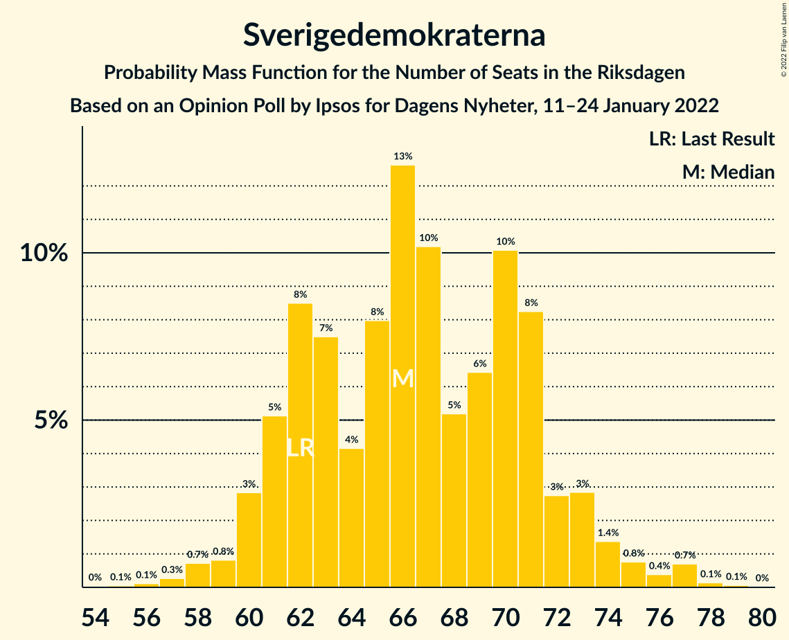

| Number of Seats | Probability | Accumulated | Special Marks |
|:---------------:|:-----------:|:-----------:|:-------------:|
| 54 | 0% | 100% |  |
| 55 | 0.1% | 99.9% |  |
| 56 | 0.1% | 99.9% |  |
| 57 | 0.3% | 99.8% |  |
| 58 | 0.7% | 99.5% |  |
| 59 | 0.8% | 98.8% |  |
| 60 | 3% | 98% |  |
| 61 | 5% | 95% |  |
| 62 | 8% | 90% | Last Result |
| 63 | 7% | 81% |  |
| 64 | 4% | 74% |  |
| 65 | 8% | 70% |  |
| 66 | 13% | 62% | Median |
| 67 | 10% | 49% |  |
| 68 | 5% | 39% |  |
| 69 | 6% | 34% |  |
| 70 | 10% | 27% |  |
| 71 | 8% | 17% |  |
| 72 | 3% | 9% |  |
| 73 | 3% | 6% |  |
| 74 | 1.4% | 3% |  |
| 75 | 0.8% | 2% |  |
| 76 | 0.4% | 1.3% |  |
| 77 | 0.7% | 1.0% |  |
| 78 | 0.1% | 0.2% |  |
| 79 | 0.1% | 0.1% |  |
| 80 | 0% | 0% |  |

### Vänsterpartiet

*For a full overview of the results for this party, see the [Vänsterpartiet](party-vänsterpartiet.html) page.*

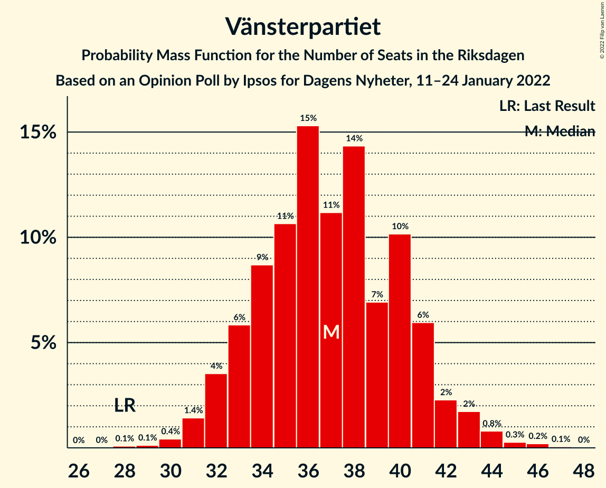

| Number of Seats | Probability | Accumulated | Special Marks |
|:---------------:|:-----------:|:-----------:|:-------------:|
| 28 | 0.1% | 100% | Last Result |
| 29 | 0.1% | 99.9% |  |
| 30 | 0.4% | 99.8% |  |
| 31 | 1.4% | 99.4% |  |
| 32 | 4% | 98% |  |
| 33 | 6% | 94% |  |
| 34 | 9% | 89% |  |
| 35 | 11% | 80% |  |
| 36 | 15% | 69% |  |
| 37 | 11% | 54% | Median |
| 38 | 14% | 43% |  |
| 39 | 7% | 28% |  |
| 40 | 10% | 21% |  |
| 41 | 6% | 11% |  |
| 42 | 2% | 5% |  |
| 43 | 2% | 3% |  |
| 44 | 0.8% | 1.4% |  |
| 45 | 0.3% | 0.6% |  |
| 46 | 0.2% | 0.3% |  |
| 47 | 0.1% | 0.1% |  |
| 48 | 0% | 0% |  |

### Centerpartiet

*For a full overview of the results for this party, see the [Centerpartiet](party-centerpartiet.html) page.*

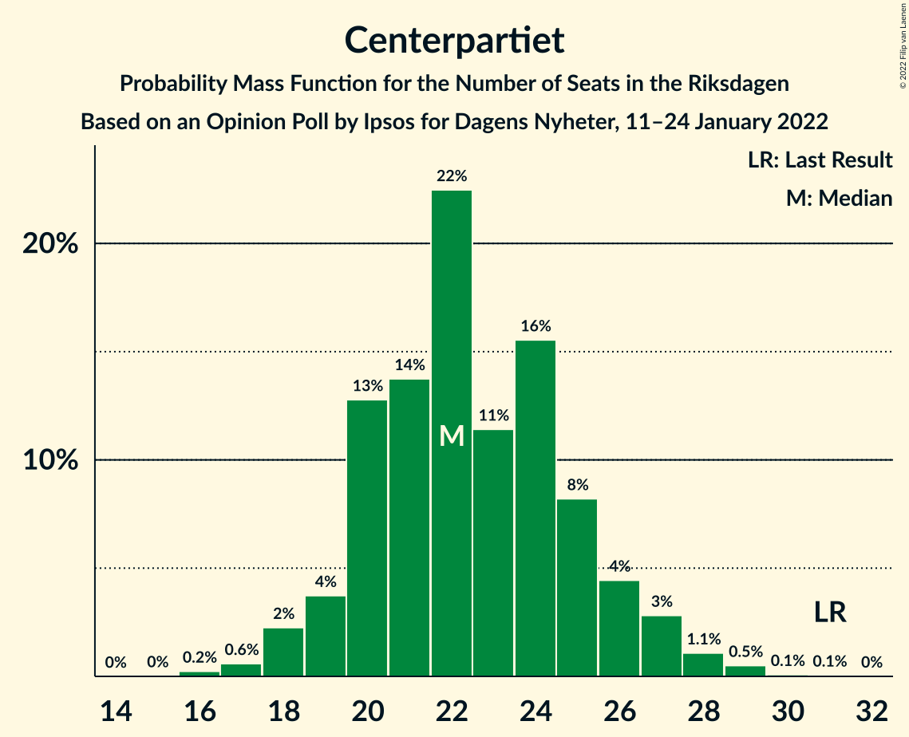

| Number of Seats | Probability | Accumulated | Special Marks |
|:---------------:|:-----------:|:-----------:|:-------------:|
| 16 | 0.2% | 100% |  |
| 17 | 0.6% | 99.7% |  |
| 18 | 2% | 99.1% |  |
| 19 | 4% | 97% |  |
| 20 | 13% | 93% |  |
| 21 | 14% | 80% |  |
| 22 | 22% | 67% | Median |
| 23 | 11% | 44% |  |
| 24 | 16% | 33% |  |
| 25 | 8% | 17% |  |
| 26 | 4% | 9% |  |
| 27 | 3% | 5% |  |
| 28 | 1.1% | 2% |  |
| 29 | 0.5% | 0.7% |  |
| 30 | 0.1% | 0.1% |  |
| 31 | 0.1% | 0.1% | Last Result |
| 32 | 0% | 0% |  |

### Kristdemokraterna

*For a full overview of the results for this party, see the [Kristdemokraterna](party-kristdemokraterna.html) page.*

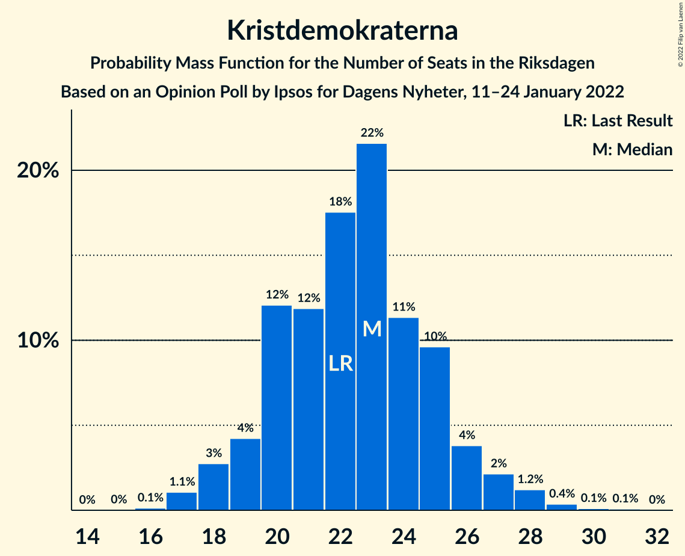

| Number of Seats | Probability | Accumulated | Special Marks |
|:---------------:|:-----------:|:-----------:|:-------------:|
| 16 | 0.1% | 100% |  |
| 17 | 1.1% | 99.8% |  |
| 18 | 3% | 98.8% |  |
| 19 | 4% | 96% |  |
| 20 | 12% | 92% |  |
| 21 | 12% | 80% |  |
| 22 | 18% | 68% | Last Result |
| 23 | 22% | 50% | Median |
| 24 | 11% | 29% |  |
| 25 | 10% | 17% |  |
| 26 | 4% | 8% |  |
| 27 | 2% | 4% |  |
| 28 | 1.2% | 2% |  |
| 29 | 0.4% | 0.6% |  |
| 30 | 0.1% | 0.2% |  |
| 31 | 0.1% | 0.1% |  |
| 32 | 0% | 0% |  |

### Liberalerna

*For a full overview of the results for this party, see the [Liberalerna](party-liberalerna.html) page.*

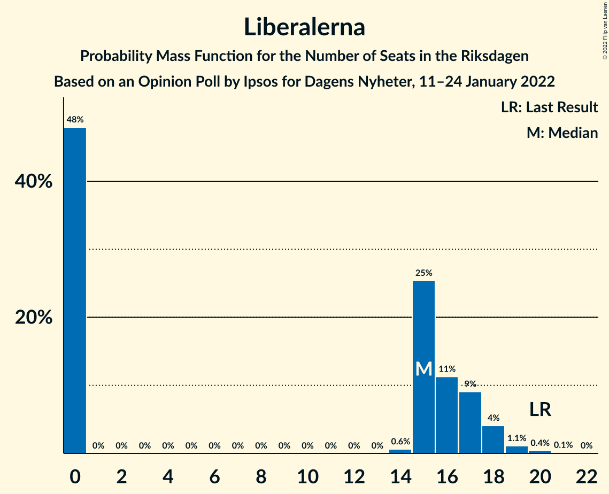

| Number of Seats | Probability | Accumulated | Special Marks |
|:---------------:|:-----------:|:-----------:|:-------------:|
| 0 | 48% | 100% |  |
| 1 | 0% | 52% |  |
| 2 | 0% | 52% |  |
| 3 | 0% | 52% |  |
| 4 | 0% | 52% |  |
| 5 | 0% | 52% |  |
| 6 | 0% | 52% |  |
| 7 | 0% | 52% |  |
| 8 | 0% | 52% |  |
| 9 | 0% | 52% |  |
| 10 | 0% | 52% |  |
| 11 | 0% | 52% |  |
| 12 | 0% | 52% |  |
| 13 | 0% | 52% |  |
| 14 | 0.6% | 52% |  |
| 15 | 25% | 51% | Median |
| 16 | 11% | 26% |  |
| 17 | 9% | 15% |  |
| 18 | 4% | 6% |  |
| 19 | 1.1% | 2% |  |
| 20 | 0.4% | 0.5% | Last Result |
| 21 | 0.1% | 0.1% |  |
| 22 | 0% | 0% |  |

### Miljöpartiet de gröna

*For a full overview of the results for this party, see the [Miljöpartiet de gröna](party-miljöpartietdegröna.html) page.*

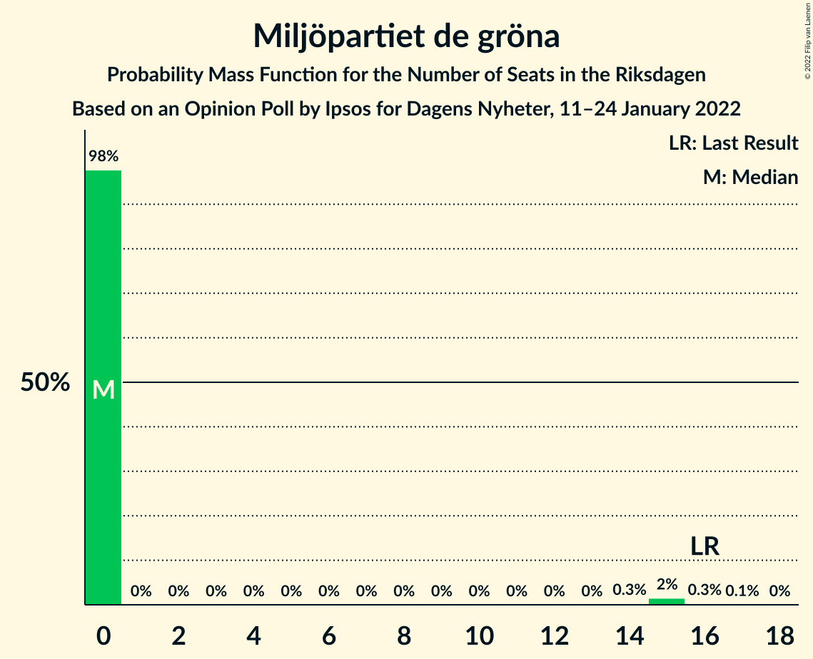

| Number of Seats | Probability | Accumulated | Special Marks |
|:---------------:|:-----------:|:-----------:|:-------------:|
| 0 | 98% | 100% | Median |
| 1 | 0% | 2% |  |
| 2 | 0% | 2% |  |
| 3 | 0% | 2% |  |
| 4 | 0% | 2% |  |
| 5 | 0% | 2% |  |
| 6 | 0% | 2% |  |
| 7 | 0% | 2% |  |
| 8 | 0% | 2% |  |
| 9 | 0% | 2% |  |
| 10 | 0% | 2% |  |
| 11 | 0% | 2% |  |
| 12 | 0% | 2% |  |
| 13 | 0% | 2% |  |
| 14 | 0.3% | 2% |  |
| 15 | 2% | 2% |  |
| 16 | 0.3% | 0.4% | Last Result |
| 17 | 0.1% | 0.1% |  |
| 18 | 0% | 0% |  |

## Coalitions

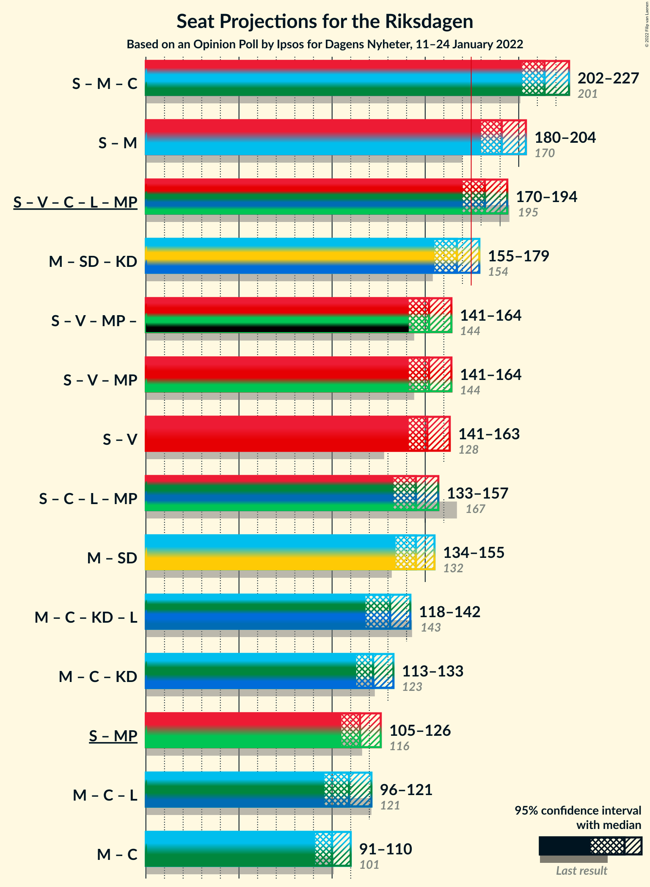

### Confidence Intervals

| Coalition | Last Result | Median | Majority? | 80% Confidence Interval | 90% Confidence Interval | 95% Confidence Interval | 99% Confidence Interval |
|:---------:|:-----------:|:------:|:---------:|:-----------------------:|:-----------------------:|:-----------------------:|:-----------------------:|
| Sveriges socialdemokratiska arbetareparti – Moderata samlingspartiet – Centerpartiet | 201 | 214 | 100% | 206–223 | 204–226 | 202–227 | 199–230 |
| Sveriges socialdemokratiska arbetareparti – Moderata samlingspartiet | 170 | 191 | 99.9% | 183–200 | 182–202 | 180–204 | 177–207 |
| Sveriges socialdemokratiska arbetareparti – Vänsterpartiet – Centerpartiet – Liberalerna – Miljöpartiet de gröna | 195 | 182 | 90% | 174–191 | 172–192 | 170–194 | 169–197 |
| Moderata samlingspartiet – Sverigedemokraterna – Kristdemokraterna | 154 | 167 | 10% | 158–175 | 157–177 | 155–179 | 152–180 |
| Sveriges socialdemokratiska arbetareparti – Vänsterpartiet – Miljöpartiet de gröna | 144 | 152 | 0% | 144–159 | 142–162 | 141–164 | 138–167 |
| Sveriges socialdemokratiska arbetareparti – Vänsterpartiet | 128 | 151 | 0% | 144–158 | 142–161 | 141–163 | 138–166 |
| Sveriges socialdemokratiska arbetareparti – Centerpartiet – Liberalerna – Miljöpartiet de gröna | 167 | 145 | 0% | 137–154 | 135–156 | 133–157 | 130–162 |
| Moderata samlingspartiet – Sverigedemokraterna | 132 | 145 | 0% | 137–152 | 135–154 | 134–155 | 131–158 |
| Moderata samlingspartiet – Centerpartiet – Kristdemokraterna – Liberalerna | 143 | 131 | 0% | 122–139 | 120–141 | 118–142 | 115–145 |
| Moderata samlingspartiet – Centerpartiet – Kristdemokraterna | 123 | 122 | 0% | 116–129 | 114–131 | 113–133 | 109–135 |
| Sveriges socialdemokratiska arbetareparti – Miljöpartiet de gröna | 116 | 115 | 0% | 107–121 | 107–123 | 105–126 | 103–129 |
| Moderata samlingspartiet – Centerpartiet – Liberalerna | 121 | 109 | 0% | 100–117 | 97–119 | 96–121 | 93–123 |
| Moderata samlingspartiet – Centerpartiet | 101 | 100 | 0% | 94–106 | 93–108 | 91–110 | 88–112 |

### Sveriges socialdemokratiska arbetareparti – Moderata samlingspartiet – Centerpartiet

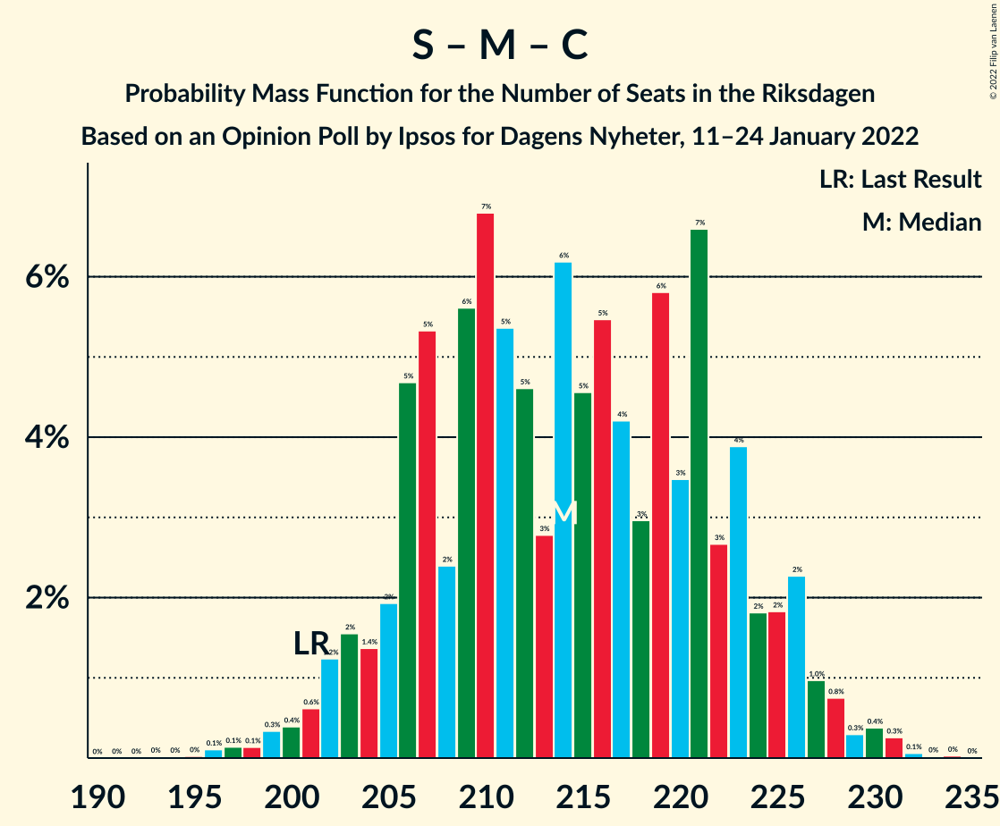

| Number of Seats | Probability | Accumulated | Special Marks |
|:---------------:|:-----------:|:-----------:|:-------------:|
| 194 | 0% | 100% |  |
| 195 | 0% | 99.9% |  |
| 196 | 0.1% | 99.9% |  |
| 197 | 0.1% | 99.8% |  |
| 198 | 0.1% | 99.7% |  |
| 199 | 0.3% | 99.5% |  |
| 200 | 0.4% | 99.2% |  |
| 201 | 0.6% | 98.8% | Last Result |
| 202 | 1.2% | 98% |  |
| 203 | 2% | 97% |  |
| 204 | 1.4% | 95% |  |
| 205 | 2% | 94% |  |
| 206 | 5% | 92% |  |
| 207 | 5% | 87% |  |
| 208 | 2% | 82% |  |
| 209 | 6% | 80% |  |
| 210 | 7% | 74% |  |
| 211 | 5% | 67% |  |
| 212 | 5% | 62% |  |
| 213 | 3% | 57% |  |
| 214 | 6% | 55% | Median |
| 215 | 5% | 48% |  |
| 216 | 5% | 44% |  |
| 217 | 4% | 38% |  |
| 218 | 3% | 34% |  |
| 219 | 6% | 31% |  |
| 220 | 3% | 25% |  |
| 221 | 7% | 22% |  |
| 222 | 3% | 15% |  |
| 223 | 4% | 13% |  |
| 224 | 2% | 9% |  |
| 225 | 2% | 7% |  |
| 226 | 2% | 5% |  |
| 227 | 1.0% | 3% |  |
| 228 | 0.8% | 2% |  |
| 229 | 0.3% | 1.1% |  |
| 230 | 0.4% | 0.8% |  |
| 231 | 0.3% | 0.4% |  |
| 232 | 0.1% | 0.1% |  |
| 233 | 0% | 0.1% |  |
| 234 | 0% | 0% |  |

### Sveriges socialdemokratiska arbetareparti – Moderata samlingspartiet

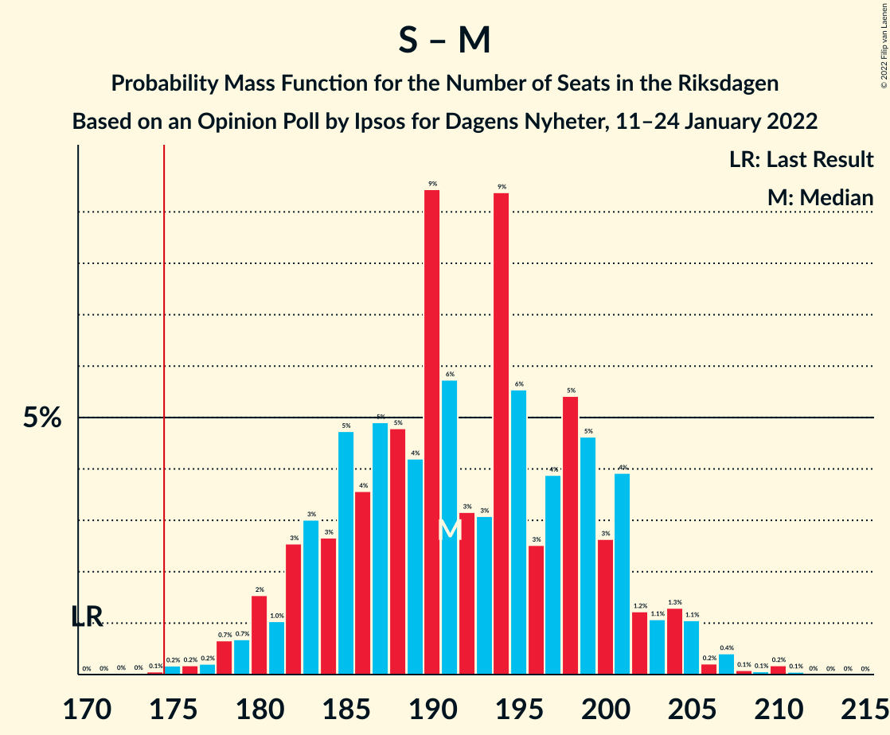

| Number of Seats | Probability | Accumulated | Special Marks |
|:---------------:|:-----------:|:-----------:|:-------------:|
| 170 | 0% | 100% | Last Result |
| 171 | 0% | 100% |  |
| 172 | 0% | 100% |  |
| 173 | 0% | 100% |  |
| 174 | 0.1% | 99.9% |  |
| 175 | 0.2% | 99.9% | Majority |
| 176 | 0.2% | 99.7% |  |
| 177 | 0.2% | 99.5% |  |
| 178 | 0.7% | 99.3% |  |
| 179 | 0.7% | 98.7% |  |
| 180 | 2% | 98% |  |
| 181 | 1.0% | 96% |  |
| 182 | 3% | 95% |  |
| 183 | 3% | 93% |  |
| 184 | 3% | 90% |  |
| 185 | 5% | 87% |  |
| 186 | 4% | 82% |  |
| 187 | 5% | 79% |  |
| 188 | 5% | 74% |  |
| 189 | 4% | 69% |  |
| 190 | 9% | 65% |  |
| 191 | 6% | 56% |  |
| 192 | 3% | 50% | Median |
| 193 | 3% | 47% |  |
| 194 | 9% | 44% |  |
| 195 | 6% | 34% |  |
| 196 | 3% | 29% |  |
| 197 | 4% | 26% |  |
| 198 | 5% | 22% |  |
| 199 | 5% | 17% |  |
| 200 | 3% | 12% |  |
| 201 | 4% | 10% |  |
| 202 | 1.2% | 6% |  |
| 203 | 1.1% | 4% |  |
| 204 | 1.3% | 3% |  |
| 205 | 1.1% | 2% |  |
| 206 | 0.2% | 1.0% |  |
| 207 | 0.4% | 0.8% |  |
| 208 | 0.1% | 0.4% |  |
| 209 | 0.1% | 0.3% |  |
| 210 | 0.2% | 0.2% |  |
| 211 | 0.1% | 0.1% |  |
| 212 | 0% | 0% |  |

### Sveriges socialdemokratiska arbetareparti – Vänsterpartiet – Centerpartiet – Liberalerna – Miljöpartiet de gröna

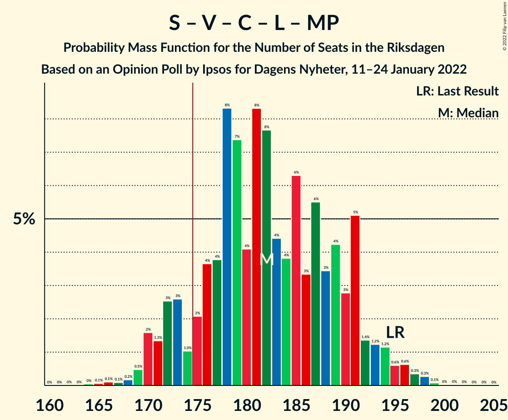

| Number of Seats | Probability | Accumulated | Special Marks |
|:---------------:|:-----------:|:-----------:|:-------------:|
| 164 | 0% | 100% |  |
| 165 | 0.1% | 99.9% |  |
| 166 | 0.1% | 99.9% |  |
| 167 | 0.1% | 99.8% |  |
| 168 | 0.2% | 99.7% |  |
| 169 | 0.5% | 99.5% |  |
| 170 | 2% | 99.0% |  |
| 171 | 1.3% | 97% |  |
| 172 | 3% | 96% |  |
| 173 | 3% | 94% |  |
| 174 | 1.0% | 91% |  |
| 175 | 2% | 90% | Majority |
| 176 | 4% | 88% |  |
| 177 | 4% | 84% |  |
| 178 | 8% | 80% |  |
| 179 | 7% | 72% |  |
| 180 | 4% | 65% |  |
| 181 | 8% | 61% |  |
| 182 | 8% | 52% |  |
| 183 | 4% | 45% |  |
| 184 | 4% | 40% |  |
| 185 | 6% | 36% |  |
| 186 | 3% | 30% |  |
| 187 | 6% | 27% |  |
| 188 | 3% | 21% | Median |
| 189 | 4% | 18% |  |
| 190 | 3% | 14% |  |
| 191 | 5% | 11% |  |
| 192 | 1.4% | 6% |  |
| 193 | 1.2% | 4% |  |
| 194 | 1.2% | 3% |  |
| 195 | 0.6% | 2% | Last Result |
| 196 | 0.6% | 1.4% |  |
| 197 | 0.3% | 0.8% |  |
| 198 | 0.3% | 0.4% |  |
| 199 | 0.1% | 0.1% |  |
| 200 | 0% | 0.1% |  |
| 201 | 0% | 0% |  |

### Moderata samlingspartiet – Sverigedemokraterna – Kristdemokraterna

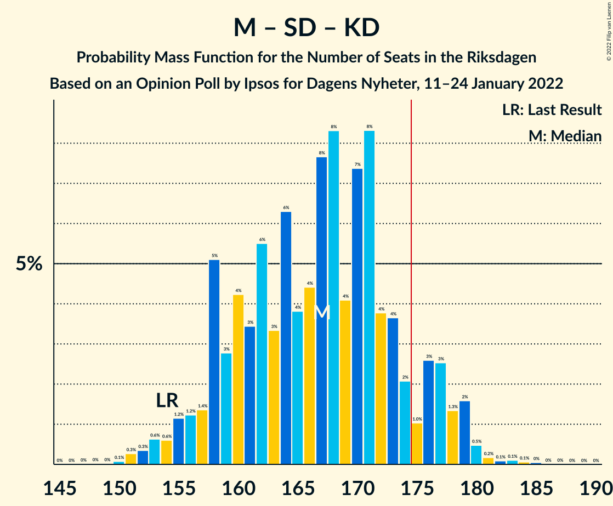

| Number of Seats | Probability | Accumulated | Special Marks |
|:---------------:|:-----------:|:-----------:|:-------------:|
| 149 | 0% | 100% |  |
| 150 | 0.1% | 99.9% |  |
| 151 | 0.3% | 99.9% |  |
| 152 | 0.3% | 99.6% |  |
| 153 | 0.6% | 99.2% |  |
| 154 | 0.6% | 98.6% | Last Result |
| 155 | 1.2% | 98% |  |
| 156 | 1.2% | 97% |  |
| 157 | 1.4% | 96% |  |
| 158 | 5% | 94% |  |
| 159 | 3% | 89% |  |
| 160 | 4% | 86% |  |
| 161 | 3% | 82% |  |
| 162 | 6% | 79% |  |
| 163 | 3% | 73% |  |
| 164 | 6% | 70% |  |
| 165 | 4% | 64% |  |
| 166 | 4% | 60% |  |
| 167 | 8% | 55% | Median |
| 168 | 8% | 48% |  |
| 169 | 4% | 39% |  |
| 170 | 7% | 35% |  |
| 171 | 8% | 28% |  |
| 172 | 4% | 20% |  |
| 173 | 4% | 16% |  |
| 174 | 2% | 12% |  |
| 175 | 1.0% | 10% | Majority |
| 176 | 3% | 9% |  |
| 177 | 3% | 6% |  |
| 178 | 1.3% | 4% |  |
| 179 | 2% | 3% |  |
| 180 | 0.5% | 1.0% |  |
| 181 | 0.2% | 0.5% |  |
| 182 | 0.1% | 0.3% |  |
| 183 | 0.1% | 0.2% |  |
| 184 | 0.1% | 0.1% |  |
| 185 | 0% | 0.1% |  |
| 186 | 0% | 0% |  |

### Sveriges socialdemokratiska arbetareparti – Vänsterpartiet – Miljöpartiet de gröna

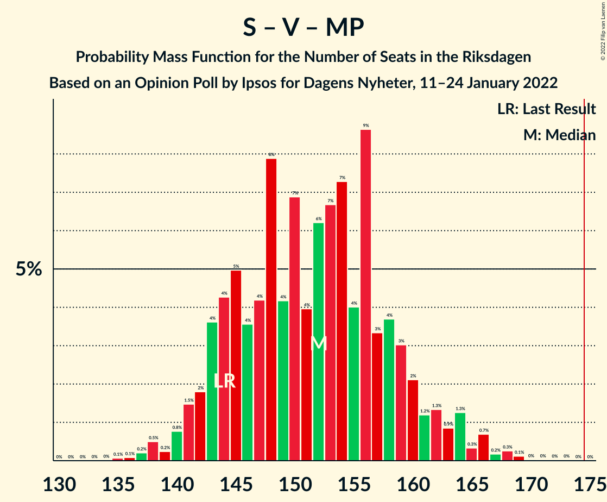

| Number of Seats | Probability | Accumulated | Special Marks |
|:---------------:|:-----------:|:-----------:|:-------------:|
| 135 | 0.1% | 100% |  |
| 136 | 0.1% | 99.9% |  |
| 137 | 0.2% | 99.8% |  |
| 138 | 0.5% | 99.6% |  |
| 139 | 0.2% | 99.1% |  |
| 140 | 0.8% | 98.9% |  |
| 141 | 1.5% | 98% |  |
| 142 | 2% | 97% |  |
| 143 | 4% | 95% |  |
| 144 | 4% | 91% | Last Result |
| 145 | 5% | 87% |  |
| 146 | 4% | 82% |  |
| 147 | 4% | 78% |  |
| 148 | 8% | 74% |  |
| 149 | 4% | 66% |  |
| 150 | 7% | 62% |  |
| 151 | 4% | 55% | Median |
| 152 | 6% | 51% |  |
| 153 | 7% | 45% |  |
| 154 | 7% | 38% |  |
| 155 | 4% | 31% |  |
| 156 | 9% | 27% |  |
| 157 | 3% | 18% |  |
| 158 | 4% | 15% |  |
| 159 | 3% | 11% |  |
| 160 | 2% | 8% |  |
| 161 | 1.2% | 6% |  |
| 162 | 1.3% | 5% |  |
| 163 | 0.9% | 4% |  |
| 164 | 1.3% | 3% |  |
| 165 | 0.3% | 2% |  |
| 166 | 0.7% | 1.3% |  |
| 167 | 0.2% | 0.7% |  |
| 168 | 0.3% | 0.5% |  |
| 169 | 0.1% | 0.2% |  |
| 170 | 0% | 0.1% |  |
| 171 | 0% | 0.1% |  |
| 172 | 0% | 0% |  |

### Sveriges socialdemokratiska arbetareparti – Vänsterpartiet

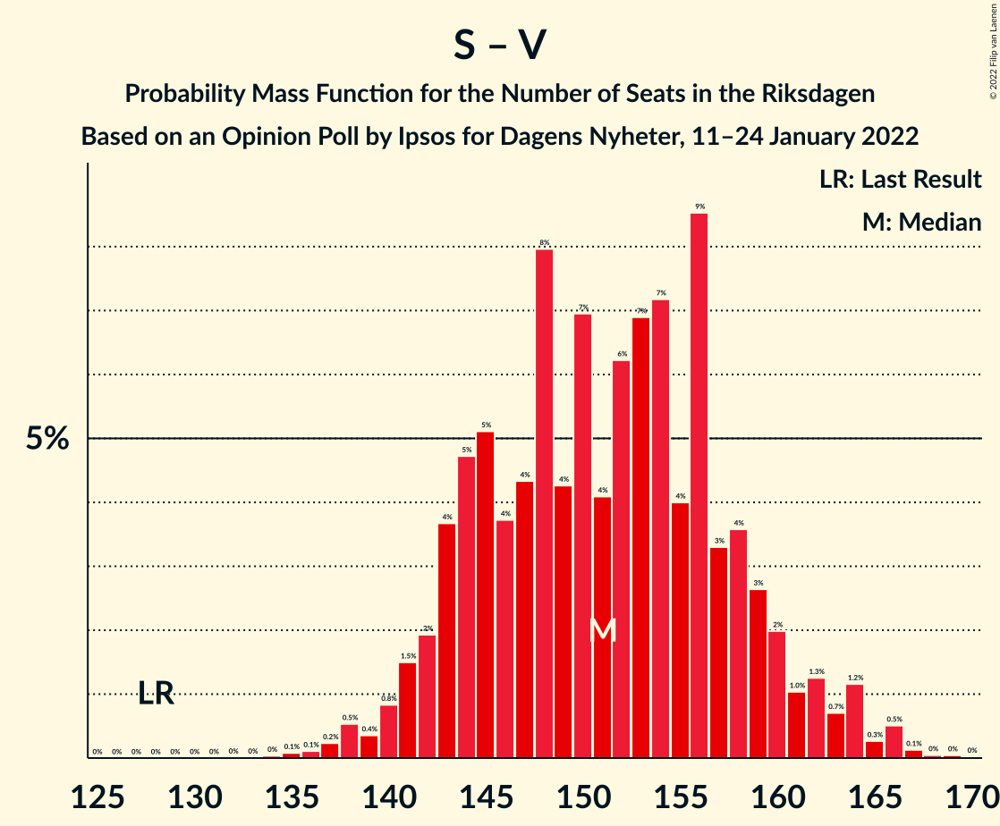

| Number of Seats | Probability | Accumulated | Special Marks |
|:---------------:|:-----------:|:-----------:|:-------------:|
| 128 | 0% | 100% | Last Result |
| 129 | 0% | 100% |  |
| 130 | 0% | 100% |  |
| 131 | 0% | 100% |  |
| 132 | 0% | 100% |  |
| 133 | 0% | 100% |  |
| 134 | 0% | 100% |  |
| 135 | 0.1% | 99.9% |  |
| 136 | 0.1% | 99.9% |  |
| 137 | 0.2% | 99.8% |  |
| 138 | 0.5% | 99.5% |  |
| 139 | 0.4% | 99.0% |  |
| 140 | 0.8% | 98.6% |  |
| 141 | 1.5% | 98% |  |
| 142 | 2% | 96% |  |
| 143 | 4% | 94% |  |
| 144 | 5% | 91% |  |
| 145 | 5% | 86% |  |
| 146 | 4% | 81% |  |
| 147 | 4% | 77% |  |
| 148 | 8% | 73% |  |
| 149 | 4% | 65% |  |
| 150 | 7% | 61% |  |
| 151 | 4% | 54% | Median |
| 152 | 6% | 50% |  |
| 153 | 7% | 43% |  |
| 154 | 7% | 36% |  |
| 155 | 4% | 29% |  |
| 156 | 9% | 25% |  |
| 157 | 3% | 17% |  |
| 158 | 4% | 13% |  |
| 159 | 3% | 10% |  |
| 160 | 2% | 7% |  |
| 161 | 1.0% | 5% |  |
| 162 | 1.3% | 4% |  |
| 163 | 0.7% | 3% |  |
| 164 | 1.2% | 2% |  |
| 165 | 0.3% | 1.0% |  |
| 166 | 0.5% | 0.8% |  |
| 167 | 0.1% | 0.3% |  |
| 168 | 0% | 0.1% |  |
| 169 | 0% | 0.1% |  |
| 170 | 0% | 0% |  |

### Sveriges socialdemokratiska arbetareparti – Centerpartiet – Liberalerna – Miljöpartiet de gröna

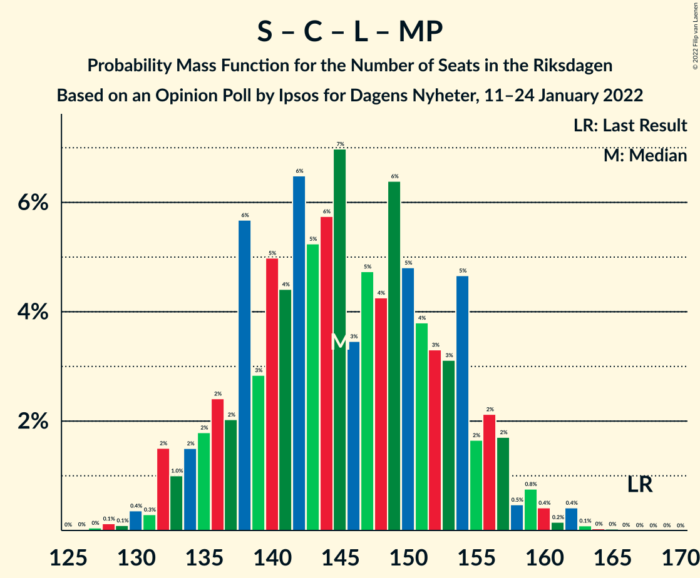

| Number of Seats | Probability | Accumulated | Special Marks |
|:---------------:|:-----------:|:-----------:|:-------------:|
| 127 | 0% | 100% |  |
| 128 | 0.1% | 99.9% |  |
| 129 | 0.1% | 99.8% |  |
| 130 | 0.4% | 99.7% |  |
| 131 | 0.3% | 99.3% |  |
| 132 | 2% | 99.0% |  |
| 133 | 1.0% | 98% |  |
| 134 | 2% | 97% |  |
| 135 | 2% | 95% |  |
| 136 | 2% | 93% |  |
| 137 | 2% | 91% |  |
| 138 | 6% | 89% |  |
| 139 | 3% | 83% |  |
| 140 | 5% | 80% |  |
| 141 | 4% | 75% |  |
| 142 | 6% | 71% |  |
| 143 | 5% | 64% |  |
| 144 | 6% | 59% |  |
| 145 | 7% | 53% |  |
| 146 | 3% | 46% |  |
| 147 | 5% | 43% |  |
| 148 | 4% | 38% |  |
| 149 | 6% | 34% |  |
| 150 | 5% | 28% |  |
| 151 | 4% | 23% | Median |
| 152 | 3% | 19% |  |
| 153 | 3% | 16% |  |
| 154 | 5% | 13% |  |
| 155 | 2% | 8% |  |
| 156 | 2% | 6% |  |
| 157 | 2% | 4% |  |
| 158 | 0.5% | 2% |  |
| 159 | 0.8% | 2% |  |
| 160 | 0.4% | 1.2% |  |
| 161 | 0.2% | 0.7% |  |
| 162 | 0.4% | 0.6% |  |
| 163 | 0.1% | 0.2% |  |
| 164 | 0% | 0.1% |  |
| 165 | 0% | 0.1% |  |
| 166 | 0% | 0% |  |
| 167 | 0% | 0% | Last Result |

### Moderata samlingspartiet – Sverigedemokraterna

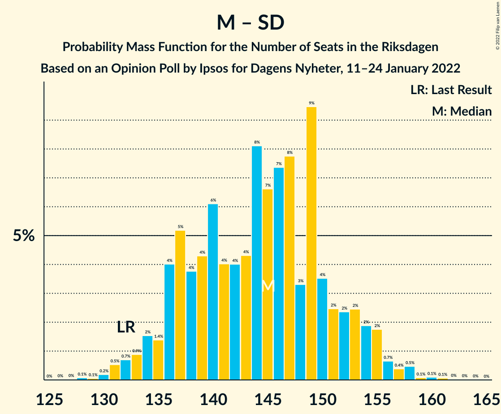

| Number of Seats | Probability | Accumulated | Special Marks |
|:---------------:|:-----------:|:-----------:|:-------------:|
| 127 | 0% | 100% |  |
| 128 | 0.1% | 99.9% |  |
| 129 | 0.1% | 99.9% |  |
| 130 | 0.2% | 99.8% |  |
| 131 | 0.5% | 99.6% |  |
| 132 | 0.7% | 99.1% | Last Result |
| 133 | 0.9% | 98% |  |
| 134 | 2% | 98% |  |
| 135 | 1.4% | 96% |  |
| 136 | 4% | 95% |  |
| 137 | 5% | 91% |  |
| 138 | 4% | 85% |  |
| 139 | 4% | 82% |  |
| 140 | 6% | 77% |  |
| 141 | 4% | 71% |  |
| 142 | 4% | 67% |  |
| 143 | 4% | 63% |  |
| 144 | 8% | 59% | Median |
| 145 | 7% | 51% |  |
| 146 | 7% | 44% |  |
| 147 | 8% | 37% |  |
| 148 | 3% | 29% |  |
| 149 | 9% | 26% |  |
| 150 | 4% | 16% |  |
| 151 | 2% | 13% |  |
| 152 | 2% | 10% |  |
| 153 | 2% | 8% |  |
| 154 | 2% | 5% |  |
| 155 | 2% | 4% |  |
| 156 | 0.7% | 2% |  |
| 157 | 0.4% | 1.2% |  |
| 158 | 0.5% | 0.8% |  |
| 159 | 0.1% | 0.3% |  |
| 160 | 0.1% | 0.2% |  |
| 161 | 0.1% | 0.1% |  |
| 162 | 0% | 0.1% |  |
| 163 | 0% | 0% |  |

### Moderata samlingspartiet – Centerpartiet – Kristdemokraterna – Liberalerna

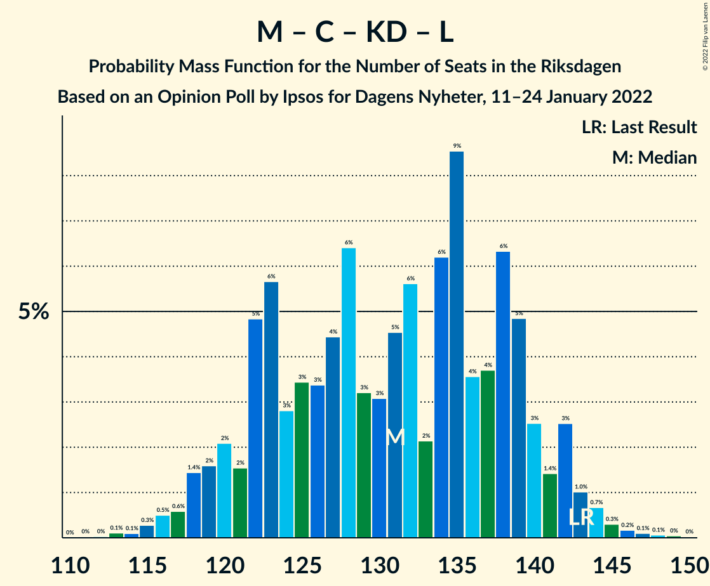

| Number of Seats | Probability | Accumulated | Special Marks |
|:---------------:|:-----------:|:-----------:|:-------------:|
| 112 | 0% | 100% |  |
| 113 | 0.1% | 99.9% |  |
| 114 | 0.1% | 99.8% |  |
| 115 | 0.3% | 99.7% |  |
| 116 | 0.5% | 99.4% |  |
| 117 | 0.6% | 98.9% |  |
| 118 | 1.4% | 98% |  |
| 119 | 2% | 97% |  |
| 120 | 2% | 95% |  |
| 121 | 2% | 93% |  |
| 122 | 5% | 92% |  |
| 123 | 6% | 87% |  |
| 124 | 3% | 81% |  |
| 125 | 3% | 78% |  |
| 126 | 3% | 75% |  |
| 127 | 4% | 72% |  |
| 128 | 6% | 67% |  |
| 129 | 3% | 61% |  |
| 130 | 3% | 57% |  |
| 131 | 5% | 54% |  |
| 132 | 6% | 50% |  |
| 133 | 2% | 44% |  |
| 134 | 6% | 42% |  |
| 135 | 9% | 36% |  |
| 136 | 4% | 27% |  |
| 137 | 4% | 24% |  |
| 138 | 6% | 20% | Median |
| 139 | 5% | 14% |  |
| 140 | 3% | 9% |  |
| 141 | 1.4% | 6% |  |
| 142 | 3% | 5% |  |
| 143 | 1.0% | 2% | Last Result |
| 144 | 0.7% | 1.4% |  |
| 145 | 0.3% | 0.7% |  |
| 146 | 0.2% | 0.4% |  |
| 147 | 0.1% | 0.3% |  |
| 148 | 0.1% | 0.1% |  |
| 149 | 0% | 0.1% |  |
| 150 | 0% | 0% |  |

### Moderata samlingspartiet – Centerpartiet – Kristdemokraterna

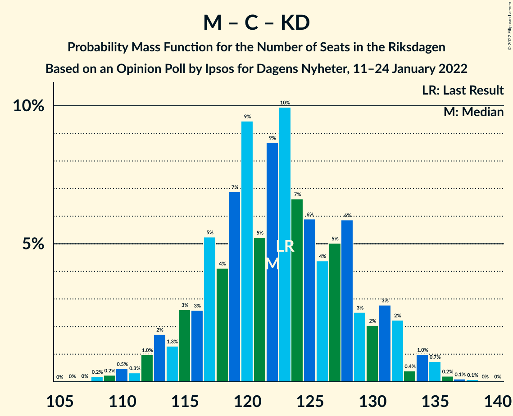

| Number of Seats | Probability | Accumulated | Special Marks |
|:---------------:|:-----------:|:-----------:|:-------------:|
| 106 | 0% | 100% |  |
| 107 | 0% | 99.9% |  |
| 108 | 0.2% | 99.9% |  |
| 109 | 0.2% | 99.7% |  |
| 110 | 0.5% | 99.5% |  |
| 111 | 0.3% | 99.0% |  |
| 112 | 1.0% | 98.7% |  |
| 113 | 2% | 98% |  |
| 114 | 1.3% | 96% |  |
| 115 | 3% | 95% |  |
| 116 | 3% | 92% |  |
| 117 | 5% | 89% |  |
| 118 | 4% | 84% |  |
| 119 | 7% | 80% |  |
| 120 | 9% | 73% |  |
| 121 | 5% | 64% |  |
| 122 | 9% | 59% |  |
| 123 | 10% | 50% | Last Result, Median |
| 124 | 7% | 40% |  |
| 125 | 6% | 33% |  |
| 126 | 4% | 27% |  |
| 127 | 5% | 23% |  |
| 128 | 6% | 18% |  |
| 129 | 3% | 12% |  |
| 130 | 2% | 10% |  |
| 131 | 3% | 8% |  |
| 132 | 2% | 5% |  |
| 133 | 0.4% | 3% |  |
| 134 | 1.0% | 2% |  |
| 135 | 0.7% | 1.2% |  |
| 136 | 0.2% | 0.4% |  |
| 137 | 0.1% | 0.2% |  |
| 138 | 0.1% | 0.1% |  |
| 139 | 0% | 0.1% |  |
| 140 | 0% | 0% |  |

### Sveriges socialdemokratiska arbetareparti – Miljöpartiet de gröna

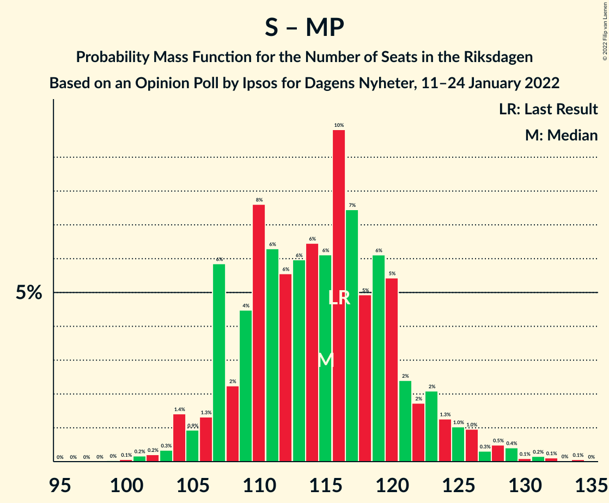

| Number of Seats | Probability | Accumulated | Special Marks |
|:---------------:|:-----------:|:-----------:|:-------------:|
| 100 | 0.1% | 100% |  |
| 101 | 0.2% | 99.9% |  |
| 102 | 0.2% | 99.7% |  |
| 103 | 0.3% | 99.5% |  |
| 104 | 1.4% | 99.2% |  |
| 105 | 0.9% | 98% |  |
| 106 | 1.3% | 97% |  |
| 107 | 6% | 95% |  |
| 108 | 2% | 90% |  |
| 109 | 4% | 87% |  |
| 110 | 8% | 83% |  |
| 111 | 6% | 75% |  |
| 112 | 6% | 69% |  |
| 113 | 6% | 63% |  |
| 114 | 6% | 57% | Median |
| 115 | 6% | 51% |  |
| 116 | 10% | 45% | Last Result |
| 117 | 7% | 35% |  |
| 118 | 5% | 28% |  |
| 119 | 6% | 23% |  |
| 120 | 5% | 17% |  |
| 121 | 2% | 11% |  |
| 122 | 2% | 9% |  |
| 123 | 2% | 7% |  |
| 124 | 1.3% | 5% |  |
| 125 | 1.0% | 4% |  |
| 126 | 1.0% | 3% |  |
| 127 | 0.3% | 2% |  |
| 128 | 0.5% | 1.4% |  |
| 129 | 0.4% | 0.9% |  |
| 130 | 0.1% | 0.5% |  |
| 131 | 0.2% | 0.4% |  |
| 132 | 0.1% | 0.2% |  |
| 133 | 0% | 0.1% |  |
| 134 | 0.1% | 0.1% |  |
| 135 | 0% | 0% |  |

### Moderata samlingspartiet – Centerpartiet – Liberalerna

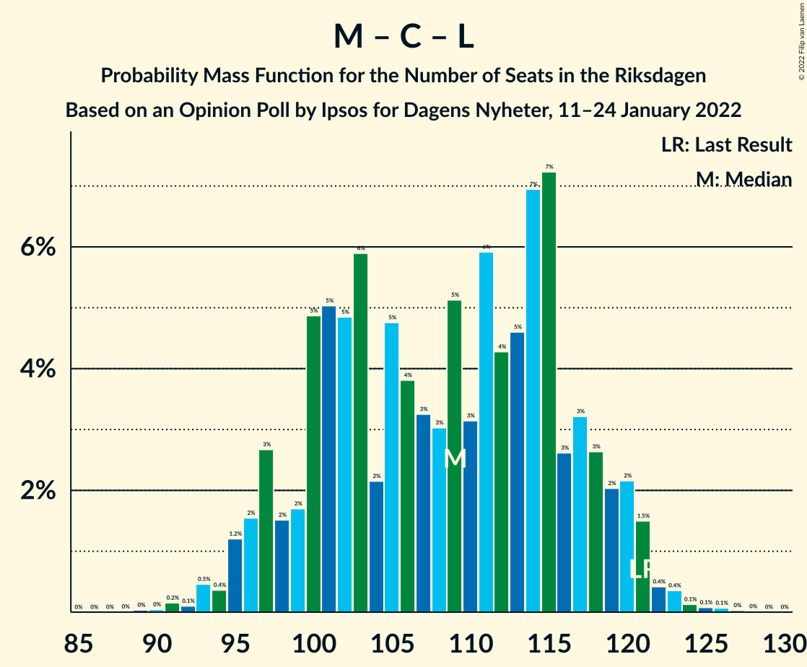

| Number of Seats | Probability | Accumulated | Special Marks |
|:---------------:|:-----------:|:-----------:|:-------------:|
| 89 | 0% | 100% |  |
| 90 | 0% | 99.9% |  |
| 91 | 0.2% | 99.9% |  |
| 92 | 0.1% | 99.8% |  |
| 93 | 0.5% | 99.7% |  |
| 94 | 0.4% | 99.2% |  |
| 95 | 1.2% | 98.8% |  |
| 96 | 2% | 98% |  |
| 97 | 3% | 96% |  |
| 98 | 2% | 93% |  |
| 99 | 2% | 92% |  |
| 100 | 5% | 90% |  |
| 101 | 5% | 85% |  |
| 102 | 5% | 80% |  |
| 103 | 6% | 75% |  |
| 104 | 2% | 70% |  |
| 105 | 5% | 67% |  |
| 106 | 4% | 63% |  |
| 107 | 3% | 59% |  |
| 108 | 3% | 56% |  |
| 109 | 5% | 53% |  |
| 110 | 3% | 47% |  |
| 111 | 6% | 44% |  |
| 112 | 4% | 38% |  |
| 113 | 5% | 34% |  |
| 114 | 7% | 29% |  |
| 115 | 7% | 23% | Median |
| 116 | 3% | 15% |  |
| 117 | 3% | 13% |  |
| 118 | 3% | 9% |  |
| 119 | 2% | 7% |  |
| 120 | 2% | 5% |  |
| 121 | 1.5% | 3% | Last Result |
| 122 | 0.4% | 1.1% |  |
| 123 | 0.4% | 0.7% |  |
| 124 | 0.1% | 0.3% |  |
| 125 | 0.1% | 0.2% |  |
| 126 | 0.1% | 0.1% |  |
| 127 | 0% | 0.1% |  |
| 128 | 0% | 0% |  |

### Moderata samlingspartiet – Centerpartiet

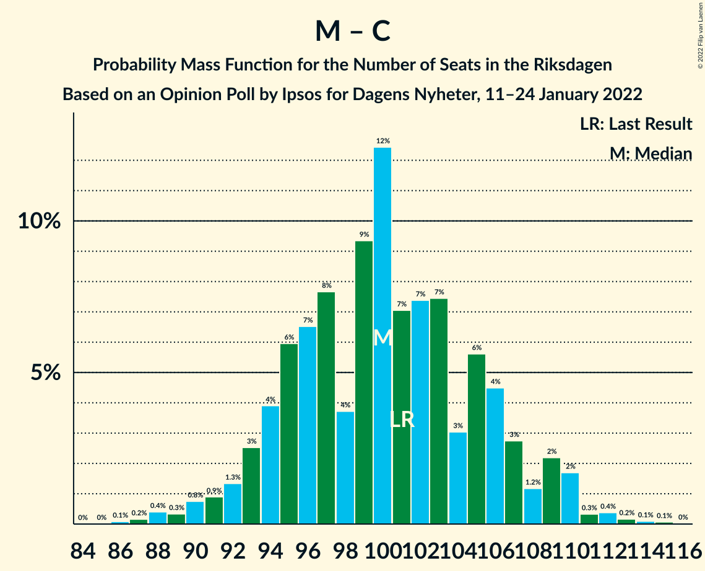

| Number of Seats | Probability | Accumulated | Special Marks |
|:---------------:|:-----------:|:-----------:|:-------------:|
| 86 | 0.1% | 100% |  |
| 87 | 0.2% | 99.9% |  |
| 88 | 0.4% | 99.7% |  |
| 89 | 0.3% | 99.3% |  |
| 90 | 0.8% | 99.0% |  |
| 91 | 0.9% | 98% |  |
| 92 | 1.3% | 97% |  |
| 93 | 3% | 96% |  |
| 94 | 4% | 93% |  |
| 95 | 6% | 90% |  |
| 96 | 7% | 84% |  |
| 97 | 8% | 77% |  |
| 98 | 4% | 69% |  |
| 99 | 9% | 66% |  |
| 100 | 12% | 56% | Median |
| 101 | 7% | 44% | Last Result |
| 102 | 7% | 37% |  |
| 103 | 7% | 29% |  |
| 104 | 3% | 22% |  |
| 105 | 6% | 19% |  |
| 106 | 4% | 13% |  |
| 107 | 3% | 9% |  |
| 108 | 1.2% | 6% |  |
| 109 | 2% | 5% |  |
| 110 | 2% | 3% |  |
| 111 | 0.3% | 1.1% |  |
| 112 | 0.4% | 0.7% |  |
| 113 | 0.2% | 0.4% |  |
| 114 | 0.1% | 0.2% |  |
| 115 | 0.1% | 0.1% |  |
| 116 | 0% | 0% |  |

## Technical Information

### Opinion Poll

+ **Polling firm:** Ipsos
+ **Commissioner(s):** Dagens Nyheter
+ **Fieldwork period:** 11–24 January 2022

### Calculations

+ **Sample size:** 1660
+ **Simulations done:** 1,048,576
+ **Error estimate:** 2.16%

