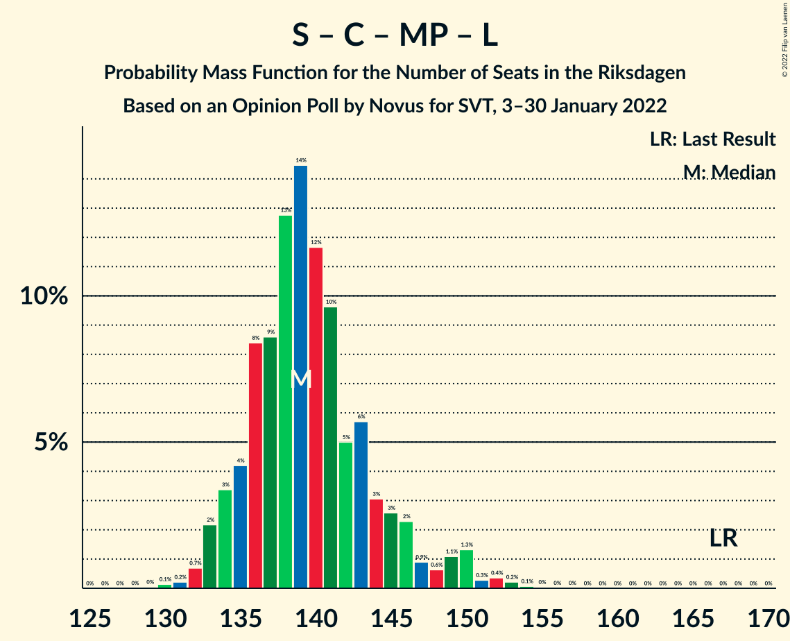

# Opinion Poll by Novus for SVT, 3–30 January 2022

<a href="#voting-intentions">Voting Intentions</a> | <a href="#seats">Seats</a> | <a href="#coalitions">Coalitions</a> | <a href="#technical-information">Technical Information</a>

## Voting Intentions

### Confidence Intervals

| Party | Last Result | Poll Result | 80% Confidence Interval | 90% Confidence Interval | 95% Confidence Interval | 99% Confidence Interval |
|:-----:|:-----------:|:-----------:|:-----------------------:|:-----------------------:|:-----------------------:|:-----------------------:|
| Sveriges socialdemokratiska arbetareparti | 28.3% | 29.3% | 28.3–30.3% |28.1–30.6% |27.9–30.8% |27.4–31.3% |
| Moderata samlingspartiet | 19.8% | 20.5% | 19.7–21.4% |19.4–21.6% |19.2–21.8% |18.8–22.3% |
| Sverigedemokraterna | 17.5% | 19.8% | 19.0–20.7% |18.7–20.9% |18.5–21.1% |18.2–21.5% |
| Vänsterpartiet | 8.0% | 9.8% | 9.2–10.5% |9.0–10.7% |8.9–10.8% |8.6–11.1% |
| Centerpartiet | 8.6% | 7.4% | 6.9–8.0% |6.7–8.2% |6.6–8.3% |6.4–8.6% |
| Kristdemokraterna | 6.3% | 5.4% | 5.0–5.9% |4.8–6.1% |4.7–6.2% |4.5–6.4% |
| Miljöpartiet de gröna | 4.4% | 3.5% | 3.1–3.9% |3.0–4.1% |3.0–4.2% |2.8–4.4% |
| Liberalerna | 5.5% | 2.7% | 2.4–3.1% |2.3–3.2% |2.2–3.3% |2.1–3.5% |

*Note:* The poll result column reflects the actual value used in the calculations. Published results may vary slightly, and in addition be rounded to fewer digits.

## Seats

### Confidence Intervals

| Party | Last Result | Median | 80% Confidence Interval | 90% Confidence Interval | 95% Confidence Interval | 99% Confidence Interval |
|:-----:|:-----------:|:------:|:-----------------------:|:-----------------------:|:-----------------------:|:-----------------------:|
| <a href="#sveriges-socialdemokratiska-arbetareparti">Sveriges socialdemokratiska arbetareparti</a> | 100 | 110 | 107–114 |105–116 |104–116 |102–118 |
| <a href="#moderata-samlingspartiet">Moderata samlingspartiet</a> | 70 | 78 | 74–81 |73–82 |72–82 |71–84 |
| <a href="#sverigedemokraterna">Sverigedemokraterna</a> | 62 | 75 | 71–78 |70–79 |69–80 |68–81 |
| <a href="#vänsterpartiet">Vänsterpartiet</a> | 28 | 37 | 35–40 |34–40 |33–41 |32–42 |
| <a href="#centerpartiet">Centerpartiet</a> | 31 | 28 | 26–30 |25–31 |25–31 |24–32 |
| <a href="#kristdemokraterna">Kristdemokraterna</a> | 22 | 20 | 18–22 |18–23 |18–23 |17–24 |
| <a href="#miljöpartiet-de-gröna">Miljöpartiet de gröna</a> | 16 | 0 | 0 |0–15 |0–15 |0–16 |
| <a href="#liberalerna">Liberalerna</a> | 20 | 0 | 0 |0 |0 |0 |

### Sveriges socialdemokratiska arbetareparti

*For a full overview of the results for this party, see the [Sveriges socialdemokratiska arbetareparti](party-sverigessocialdemokratiskaarbetareparti.html) page.*

| Number of Seats | Probability | Accumulated | Special Marks |
|:---------------:|:-----------:|:-----------:|:-------------:|
| 100 | 0% | 100% | Last Result |
| 101 | 0.1% | 99.9% |  |
| 102 | 0.5% | 99.8% |  |
| 103 | 1.0% | 99.3% |  |
| 104 | 0.8% | 98% |  |
| 105 | 4% | 97% |  |
| 106 | 3% | 94% |  |
| 107 | 9% | 91% |  |
| 108 | 8% | 81% |  |
| 109 | 6% | 74% |  |
| 110 | 18% | 67% | Median |
| 111 | 14% | 49% |  |
| 112 | 9% | 35% |  |
| 113 | 10% | 25% |  |
| 114 | 6% | 15% |  |
| 115 | 4% | 9% |  |
| 116 | 3% | 5% |  |
| 117 | 2% | 2% |  |
| 118 | 0.5% | 0.7% |  |
| 119 | 0.1% | 0.3% |  |
| 120 | 0.1% | 0.1% |  |
| 121 | 0% | 0% |  |

### Moderata samlingspartiet

*For a full overview of the results for this party, see the [Moderata samlingspartiet](party-moderatasamlingspartiet.html) page.*

| Number of Seats | Probability | Accumulated | Special Marks |
|:---------------:|:-----------:|:-----------:|:-------------:|
| 68 | 0.1% | 100% |  |
| 69 | 0.1% | 99.9% |  |
| 70 | 0.2% | 99.8% | Last Result |
| 71 | 1.2% | 99.6% |  |
| 72 | 1.4% | 98% |  |
| 73 | 4% | 97% |  |
| 74 | 6% | 93% |  |
| 75 | 11% | 86% |  |
| 76 | 10% | 75% |  |
| 77 | 15% | 66% |  |
| 78 | 16% | 50% | Median |
| 79 | 12% | 34% |  |
| 80 | 12% | 22% |  |
| 81 | 4% | 10% |  |
| 82 | 4% | 6% |  |
| 83 | 1.2% | 2% |  |
| 84 | 0.7% | 0.9% |  |
| 85 | 0.2% | 0.3% |  |
| 86 | 0.1% | 0.1% |  |
| 87 | 0% | 0% |  |

### Sverigedemokraterna

*For a full overview of the results for this party, see the [Sverigedemokraterna](party-sverigedemokraterna.html) page.*

| Number of Seats | Probability | Accumulated | Special Marks |
|:---------------:|:-----------:|:-----------:|:-------------:|
| 62 | 0% | 100% | Last Result |
| 63 | 0% | 100% |  |
| 64 | 0% | 100% |  |
| 65 | 0% | 100% |  |
| 66 | 0.1% | 100% |  |
| 67 | 0.3% | 99.9% |  |
| 68 | 0.8% | 99.6% |  |
| 69 | 2% | 98.9% |  |
| 70 | 2% | 97% |  |
| 71 | 5% | 95% |  |
| 72 | 8% | 90% |  |
| 73 | 12% | 81% |  |
| 74 | 18% | 69% |  |
| 75 | 14% | 51% | Median |
| 76 | 9% | 37% |  |
| 77 | 13% | 28% |  |
| 78 | 7% | 15% |  |
| 79 | 5% | 8% |  |
| 80 | 2% | 3% |  |
| 81 | 0.6% | 1.1% |  |
| 82 | 0.4% | 0.5% |  |
| 83 | 0.1% | 0.1% |  |
| 84 | 0% | 0% |  |

### Vänsterpartiet

*For a full overview of the results for this party, see the [Vänsterpartiet](party-vänsterpartiet.html) page.*

| Number of Seats | Probability | Accumulated | Special Marks |
|:---------------:|:-----------:|:-----------:|:-------------:|
| 28 | 0% | 100% | Last Result |
| 29 | 0% | 100% |  |
| 30 | 0% | 100% |  |
| 31 | 0.2% | 100% |  |
| 32 | 0.5% | 99.8% |  |
| 33 | 3% | 99.4% |  |
| 34 | 6% | 97% |  |
| 35 | 15% | 91% |  |
| 36 | 19% | 76% |  |
| 37 | 21% | 57% | Median |
| 38 | 13% | 36% |  |
| 39 | 12% | 23% |  |
| 40 | 6% | 11% |  |
| 41 | 4% | 5% |  |
| 42 | 0.9% | 1.2% |  |
| 43 | 0.2% | 0.3% |  |
| 44 | 0% | 0% |  |

### Centerpartiet

*For a full overview of the results for this party, see the [Centerpartiet](party-centerpartiet.html) page.*

| Number of Seats | Probability | Accumulated | Special Marks |
|:---------------:|:-----------:|:-----------:|:-------------:|
| 23 | 0.1% | 100% |  |
| 24 | 1.3% | 99.8% |  |
| 25 | 6% | 98.5% |  |
| 26 | 9% | 92% |  |
| 27 | 21% | 83% |  |
| 28 | 24% | 62% | Median |
| 29 | 20% | 39% |  |
| 30 | 13% | 19% |  |
| 31 | 4% | 6% | Last Result |
| 32 | 2% | 2% |  |
| 33 | 0.3% | 0.4% |  |
| 34 | 0% | 0% |  |

### Kristdemokraterna

*For a full overview of the results for this party, see the [Kristdemokraterna](party-kristdemokraterna.html) page.*

| Number of Seats | Probability | Accumulated | Special Marks |
|:---------------:|:-----------:|:-----------:|:-------------:|
| 16 | 0.2% | 100% |  |
| 17 | 2% | 99.8% |  |
| 18 | 9% | 98% |  |
| 19 | 16% | 89% |  |
| 20 | 28% | 72% | Median |
| 21 | 24% | 44% |  |
| 22 | 12% | 20% | Last Result |
| 23 | 6% | 8% |  |
| 24 | 2% | 2% |  |
| 25 | 0.4% | 0.4% |  |
| 26 | 0% | 0% |  |

### Miljöpartiet de gröna

*For a full overview of the results for this party, see the [Miljöpartiet de gröna](party-miljöpartietdegröna.html) page.*

| Number of Seats | Probability | Accumulated | Special Marks |
|:---------------:|:-----------:|:-----------:|:-------------:|
| 0 | 93% | 100% | Median |
| 1 | 0% | 7% |  |
| 2 | 0% | 7% |  |
| 3 | 0% | 7% |  |
| 4 | 0% | 7% |  |
| 5 | 0% | 7% |  |
| 6 | 0% | 7% |  |
| 7 | 0% | 7% |  |
| 8 | 0% | 7% |  |
| 9 | 0% | 7% |  |
| 10 | 0% | 7% |  |
| 11 | 0% | 7% |  |
| 12 | 0% | 7% |  |
| 13 | 0% | 7% |  |
| 14 | 0% | 7% |  |
| 15 | 6% | 7% |  |
| 16 | 1.1% | 1.2% | Last Result |
| 17 | 0.1% | 0.1% |  |
| 18 | 0% | 0% |  |

### Liberalerna

*For a full overview of the results for this party, see the [Liberalerna](party-liberalerna.html) page.*

| Number of Seats | Probability | Accumulated | Special Marks |
|:---------------:|:-----------:|:-----------:|:-------------:|
| 0 | 100% | 100% | Median |
| 1 | 0% | 0% |  |
| 2 | 0% | 0% |  |
| 3 | 0% | 0% |  |
| 4 | 0% | 0% |  |
| 5 | 0% | 0% |  |
| 6 | 0% | 0% |  |
| 7 | 0% | 0% |  |
| 8 | 0% | 0% |  |
| 9 | 0% | 0% |  |
| 10 | 0% | 0% |  |
| 11 | 0% | 0% |  |
| 12 | 0% | 0% |  |
| 13 | 0% | 0% |  |
| 14 | 0% | 0% |  |
| 15 | 0% | 0% |  |
| 16 | 0% | 0% |  |
| 17 | 0% | 0% |  |
| 18 | 0% | 0% |  |
| 19 | 0% | 0% |  |
| 20 | 0% | 0% | Last Result |

## Coalitions

### Confidence Intervals

| Coalition | Last Result | Median | Majority? | 80% Confidence Interval | 90% Confidence Interval | 95% Confidence Interval | 99% Confidence Interval |
|:---------:|:-----------:|:------:|:---------:|:-----------------------:|:-----------------------:|:-----------------------:|:-----------------------:|
| Sveriges socialdemokratiska arbetareparti – Moderata samlingspartiet – Centerpartiet | 201 | 216 | 100% | 211–220 | 208–221 | 206–222 | 203–224 |
| Sveriges socialdemokratiska arbetareparti – Moderata samlingspartiet | 170 | 188 | 99.7% | 183–192 | 181–193 | 179–194 | 176–196 |
| Sveriges socialdemokratiska arbetareparti – Vänsterpartiet – Centerpartiet – Miljöpartiet de gröna – Liberalerna | 195 | 176 | 72% | 172–181 | 171–183 | 170–185 | 168–188 |
| Moderata samlingspartiet – Sverigedemokraterna – Kristdemokraterna | 154 | 173 | 28% | 168–177 | 166–178 | 164–179 | 161–181 |
| Moderata samlingspartiet – Sverigedemokraterna | 132 | 153 | 0% | 148–156 | 146–157 | 145–158 | 142–160 |
| Sveriges socialdemokratiska arbetareparti – Vänsterpartiet – Miljöpartiet de gröna | 144 | 148 | 0% | 144–153 | 143–155 | 142–157 | 140–161 |
| Sveriges socialdemokratiska arbetareparti – Vänsterpartiet | 128 | 147 | 0% | 143–152 | 141–153 | 140–154 | 137–155 |
| Sveriges socialdemokratiska arbetareparti – Centerpartiet – Miljöpartiet de gröna – Liberalerna | 167 | 139 | 0% | 135–144 | 134–146 | 133–149 | 132–152 |
| Moderata samlingspartiet – Centerpartiet – Kristdemokraterna – Liberalerna | 143 | 126 | 0% | 121–130 | 120–131 | 119–132 | 117–134 |
| Moderata samlingspartiet – Centerpartiet – Kristdemokraterna | 123 | 126 | 0% | 121–130 | 120–131 | 119–132 | 117–134 |
| Sveriges socialdemokratiska arbetareparti – Miljöpartiet de gröna | 116 | 111 | 0% | 107–116 | 106–120 | 106–122 | 104–125 |
| Moderata samlingspartiet – Centerpartiet – Liberalerna | 121 | 106 | 0% | 101–109 | 100–110 | 99–111 | 97–113 |
| Moderata samlingspartiet – Centerpartiet | 101 | 106 | 0% | 101–109 | 100–110 | 99–111 | 97–113 |

### Sveriges socialdemokratiska arbetareparti – Moderata samlingspartiet – Centerpartiet

| Number of Seats | Probability | Accumulated | Special Marks |
|:---------------:|:-----------:|:-----------:|:-------------:|
| 200 | 0.1% | 100% |  |
| 201 | 0.1% | 99.9% | Last Result |
| 202 | 0.3% | 99.8% |  |
| 203 | 0.4% | 99.6% |  |
| 204 | 0.6% | 99.1% |  |
| 205 | 0.5% | 98.5% |  |
| 206 | 1.4% | 98% |  |
| 207 | 1.2% | 97% |  |
| 208 | 0.7% | 95% |  |
| 209 | 2% | 95% |  |
| 210 | 2% | 93% |  |
| 211 | 3% | 91% |  |
| 212 | 5% | 89% |  |
| 213 | 5% | 84% |  |
| 214 | 8% | 79% |  |
| 215 | 9% | 71% |  |
| 216 | 16% | 61% | Median |
| 217 | 9% | 45% |  |
| 218 | 13% | 37% |  |
| 219 | 10% | 24% |  |
| 220 | 6% | 14% |  |
| 221 | 3% | 8% |  |
| 222 | 3% | 5% |  |
| 223 | 1.2% | 2% |  |
| 224 | 0.7% | 0.9% |  |
| 225 | 0.1% | 0.2% |  |
| 226 | 0.1% | 0.1% |  |
| 227 | 0% | 0% |  |

### Sveriges socialdemokratiska arbetareparti – Moderata samlingspartiet

| Number of Seats | Probability | Accumulated | Special Marks |
|:---------------:|:-----------:|:-----------:|:-------------:|
| 170 | 0% | 100% | Last Result |
| 171 | 0% | 100% |  |
| 172 | 0% | 100% |  |
| 173 | 0% | 100% |  |
| 174 | 0.2% | 100% |  |
| 175 | 0.1% | 99.7% | Majority |
| 176 | 0.7% | 99.6% |  |
| 177 | 0.2% | 99.0% |  |
| 178 | 0.9% | 98.7% |  |
| 179 | 0.4% | 98% |  |
| 180 | 2% | 97% |  |
| 181 | 2% | 96% |  |
| 182 | 2% | 94% |  |
| 183 | 3% | 92% |  |
| 184 | 4% | 88% |  |
| 185 | 6% | 85% |  |
| 186 | 11% | 78% |  |
| 187 | 7% | 68% |  |
| 188 | 15% | 60% | Median |
| 189 | 13% | 45% |  |
| 190 | 11% | 32% |  |
| 191 | 6% | 22% |  |
| 192 | 7% | 15% |  |
| 193 | 4% | 8% |  |
| 194 | 3% | 5% |  |
| 195 | 1.5% | 2% |  |
| 196 | 0.4% | 0.7% |  |
| 197 | 0.2% | 0.3% |  |
| 198 | 0.1% | 0.1% |  |
| 199 | 0% | 0% |  |

### Sveriges socialdemokratiska arbetareparti – Vänsterpartiet – Centerpartiet – Miljöpartiet de gröna – Liberalerna

| Number of Seats | Probability | Accumulated | Special Marks |
|:---------------:|:-----------:|:-----------:|:-------------:|
| 166 | 0% | 100% |  |
| 167 | 0.1% | 99.9% |  |
| 168 | 0.3% | 99.8% |  |
| 169 | 0.8% | 99.5% |  |
| 170 | 2% | 98.6% |  |
| 171 | 3% | 97% |  |
| 172 | 5% | 94% |  |
| 173 | 7% | 89% |  |
| 174 | 11% | 82% |  |
| 175 | 16% | 72% | Median, Majority |
| 176 | 9% | 56% |  |
| 177 | 10% | 47% |  |
| 178 | 11% | 37% |  |
| 179 | 6% | 26% |  |
| 180 | 7% | 20% |  |
| 181 | 5% | 13% |  |
| 182 | 3% | 8% |  |
| 183 | 2% | 6% |  |
| 184 | 0.8% | 4% |  |
| 185 | 2% | 3% |  |
| 186 | 0.5% | 1.4% |  |
| 187 | 0.4% | 1.0% |  |
| 188 | 0.2% | 0.5% |  |
| 189 | 0.2% | 0.3% |  |
| 190 | 0% | 0.1% |  |
| 191 | 0.1% | 0.1% |  |
| 192 | 0% | 0% |  |
| 193 | 0% | 0% |  |
| 194 | 0% | 0% |  |
| 195 | 0% | 0% | Last Result |

### Moderata samlingspartiet – Sverigedemokraterna – Kristdemokraterna

| Number of Seats | Probability | Accumulated | Special Marks |
|:---------------:|:-----------:|:-----------:|:-------------:|
| 154 | 0% | 100% | Last Result |
| 155 | 0% | 100% |  |
| 156 | 0% | 100% |  |
| 157 | 0% | 100% |  |
| 158 | 0.1% | 100% |  |
| 159 | 0% | 99.9% |  |
| 160 | 0.2% | 99.9% |  |
| 161 | 0.2% | 99.7% |  |
| 162 | 0.4% | 99.5% |  |
| 163 | 0.5% | 99.0% |  |
| 164 | 2% | 98.6% |  |
| 165 | 0.8% | 97% |  |
| 166 | 2% | 96% |  |
| 167 | 3% | 94% |  |
| 168 | 5% | 92% |  |
| 169 | 7% | 87% |  |
| 170 | 6% | 80% |  |
| 171 | 11% | 74% |  |
| 172 | 10% | 63% |  |
| 173 | 9% | 53% | Median |
| 174 | 16% | 44% |  |
| 175 | 11% | 28% | Majority |
| 176 | 7% | 18% |  |
| 177 | 5% | 11% |  |
| 178 | 3% | 6% |  |
| 179 | 2% | 3% |  |
| 180 | 0.8% | 1.4% |  |
| 181 | 0.3% | 0.5% |  |
| 182 | 0.1% | 0.2% |  |
| 183 | 0% | 0.1% |  |
| 184 | 0% | 0% |  |

### Moderata samlingspartiet – Sverigedemokraterna

| Number of Seats | Probability | Accumulated | Special Marks |
|:---------------:|:-----------:|:-----------:|:-------------:|
| 132 | 0% | 100% | Last Result |
| 133 | 0% | 100% |  |
| 134 | 0% | 100% |  |
| 135 | 0% | 100% |  |
| 136 | 0% | 100% |  |
| 137 | 0% | 100% |  |
| 138 | 0% | 100% |  |
| 139 | 0% | 100% |  |
| 140 | 0.1% | 99.9% |  |
| 141 | 0.3% | 99.9% |  |
| 142 | 0.3% | 99.5% |  |
| 143 | 0.4% | 99.3% |  |
| 144 | 0.9% | 98.8% |  |
| 145 | 1.3% | 98% |  |
| 146 | 4% | 97% |  |
| 147 | 2% | 93% |  |
| 148 | 7% | 91% |  |
| 149 | 5% | 84% |  |
| 150 | 9% | 79% |  |
| 151 | 12% | 70% |  |
| 152 | 8% | 58% |  |
| 153 | 11% | 50% | Median |
| 154 | 14% | 40% |  |
| 155 | 11% | 26% |  |
| 156 | 6% | 15% |  |
| 157 | 4% | 9% |  |
| 158 | 3% | 5% |  |
| 159 | 1.0% | 2% |  |
| 160 | 0.3% | 0.6% |  |
| 161 | 0.2% | 0.3% |  |
| 162 | 0.1% | 0.1% |  |
| 163 | 0% | 0% |  |

### Sveriges socialdemokratiska arbetareparti – Vänsterpartiet – Miljöpartiet de gröna

| Number of Seats | Probability | Accumulated | Special Marks |
|:---------------:|:-----------:|:-----------:|:-------------:|
| 138 | 0% | 100% |  |
| 139 | 0.2% | 99.9% |  |
| 140 | 0.3% | 99.7% |  |
| 141 | 0.8% | 99.5% |  |
| 142 | 2% | 98.7% |  |
| 143 | 4% | 97% |  |
| 144 | 5% | 93% | Last Result |
| 145 | 7% | 88% |  |
| 146 | 11% | 81% |  |
| 147 | 13% | 70% | Median |
| 148 | 12% | 56% |  |
| 149 | 9% | 44% |  |
| 150 | 10% | 35% |  |
| 151 | 6% | 25% |  |
| 152 | 6% | 19% |  |
| 153 | 4% | 13% |  |
| 154 | 2% | 9% |  |
| 155 | 3% | 7% |  |
| 156 | 0.7% | 5% |  |
| 157 | 1.5% | 4% |  |
| 158 | 0.4% | 2% |  |
| 159 | 0.8% | 2% |  |
| 160 | 0.6% | 1.1% |  |
| 161 | 0.2% | 0.5% |  |
| 162 | 0.2% | 0.3% |  |
| 163 | 0.1% | 0.1% |  |
| 164 | 0% | 0.1% |  |
| 165 | 0% | 0% |  |

### Sveriges socialdemokratiska arbetareparti – Vänsterpartiet

| Number of Seats | Probability | Accumulated | Special Marks |
|:---------------:|:-----------:|:-----------:|:-------------:|
| 128 | 0% | 100% | Last Result |
| 129 | 0% | 100% |  |
| 130 | 0% | 100% |  |
| 131 | 0% | 100% |  |
| 132 | 0% | 100% |  |
| 133 | 0% | 100% |  |
| 134 | 0.1% | 100% |  |
| 135 | 0% | 99.9% |  |
| 136 | 0.2% | 99.9% |  |
| 137 | 0.2% | 99.7% |  |
| 138 | 0.6% | 99.5% |  |
| 139 | 0.8% | 98.9% |  |
| 140 | 2% | 98% |  |
| 141 | 1.2% | 96% |  |
| 142 | 3% | 95% |  |
| 143 | 4% | 92% |  |
| 144 | 6% | 88% |  |
| 145 | 8% | 82% |  |
| 146 | 11% | 74% |  |
| 147 | 14% | 63% | Median |
| 148 | 12% | 49% |  |
| 149 | 9% | 37% |  |
| 150 | 10% | 28% |  |
| 151 | 6% | 18% |  |
| 152 | 6% | 12% |  |
| 153 | 4% | 6% |  |
| 154 | 1.4% | 3% |  |
| 155 | 0.8% | 1.2% |  |
| 156 | 0.3% | 0.5% |  |
| 157 | 0.1% | 0.2% |  |
| 158 | 0.1% | 0.1% |  |
| 159 | 0% | 0% |  |

### Sveriges socialdemokratiska arbetareparti – Centerpartiet – Miljöpartiet de gröna – Liberalerna

| Number of Seats | Probability | Accumulated | Special Marks |
|:---------------:|:-----------:|:-----------:|:-------------:|
| 129 | 0% | 100% |  |
| 130 | 0.1% | 99.9% |  |
| 131 | 0.2% | 99.8% |  |
| 132 | 0.7% | 99.6% |  |
| 133 | 2% | 98.9% |  |
| 134 | 3% | 97% |  |
| 135 | 4% | 93% |  |
| 136 | 8% | 89% |  |
| 137 | 9% | 81% |  |
| 138 | 13% | 72% | Median |
| 139 | 14% | 59% |  |
| 140 | 12% | 45% |  |
| 141 | 10% | 33% |  |
| 142 | 5% | 24% |  |
| 143 | 6% | 19% |  |
| 144 | 3% | 13% |  |
| 145 | 3% | 10% |  |
| 146 | 2% | 7% |  |
| 147 | 0.9% | 5% |  |
| 148 | 0.6% | 4% |  |
| 149 | 1.1% | 3% |  |
| 150 | 1.3% | 2% |  |
| 151 | 0.3% | 1.0% |  |
| 152 | 0.4% | 0.7% |  |
| 153 | 0.2% | 0.4% |  |
| 154 | 0.1% | 0.1% |  |
| 155 | 0% | 0.1% |  |
| 156 | 0% | 0% |  |
| 157 | 0% | 0% |  |
| 158 | 0% | 0% |  |
| 159 | 0% | 0% |  |
| 160 | 0% | 0% |  |
| 161 | 0% | 0% |  |
| 162 | 0% | 0% |  |
| 163 | 0% | 0% |  |
| 164 | 0% | 0% |  |
| 165 | 0% | 0% |  |
| 166 | 0% | 0% |  |
| 167 | 0% | 0% | Last Result |

### Moderata samlingspartiet – Centerpartiet – Kristdemokraterna – Liberalerna

| Number of Seats | Probability | Accumulated | Special Marks |
|:---------------:|:-----------:|:-----------:|:-------------:|
| 114 | 0.1% | 100% |  |
| 115 | 0.2% | 99.9% |  |
| 116 | 0.2% | 99.7% |  |
| 117 | 0.7% | 99.5% |  |
| 118 | 0.7% | 98.8% |  |
| 119 | 1.4% | 98% |  |
| 120 | 2% | 97% |  |
| 121 | 5% | 94% |  |
| 122 | 5% | 89% |  |
| 123 | 9% | 85% |  |
| 124 | 8% | 76% |  |
| 125 | 16% | 68% |  |
| 126 | 10% | 53% | Median |
| 127 | 11% | 42% |  |
| 128 | 9% | 31% |  |
| 129 | 11% | 22% |  |
| 130 | 3% | 11% |  |
| 131 | 5% | 7% |  |
| 132 | 1.4% | 3% |  |
| 133 | 0.7% | 1.3% |  |
| 134 | 0.5% | 0.6% |  |
| 135 | 0.1% | 0.2% |  |
| 136 | 0.1% | 0.1% |  |
| 137 | 0% | 0% |  |
| 138 | 0% | 0% |  |
| 139 | 0% | 0% |  |
| 140 | 0% | 0% |  |
| 141 | 0% | 0% |  |
| 142 | 0% | 0% |  |
| 143 | 0% | 0% | Last Result |

### Moderata samlingspartiet – Centerpartiet – Kristdemokraterna

| Number of Seats | Probability | Accumulated | Special Marks |
|:---------------:|:-----------:|:-----------:|:-------------:|
| 114 | 0.1% | 100% |  |
| 115 | 0.2% | 99.9% |  |
| 116 | 0.2% | 99.7% |  |
| 117 | 0.7% | 99.5% |  |
| 118 | 0.7% | 98.8% |  |
| 119 | 1.4% | 98% |  |
| 120 | 2% | 97% |  |
| 121 | 5% | 94% |  |
| 122 | 5% | 89% |  |
| 123 | 9% | 85% | Last Result |
| 124 | 8% | 76% |  |
| 125 | 16% | 68% |  |
| 126 | 10% | 53% | Median |
| 127 | 11% | 42% |  |
| 128 | 9% | 31% |  |
| 129 | 11% | 22% |  |
| 130 | 3% | 11% |  |
| 131 | 5% | 7% |  |
| 132 | 1.4% | 3% |  |
| 133 | 0.7% | 1.3% |  |
| 134 | 0.5% | 0.6% |  |
| 135 | 0.1% | 0.2% |  |
| 136 | 0.1% | 0.1% |  |
| 137 | 0% | 0% |  |

### Sveriges socialdemokratiska arbetareparti – Miljöpartiet de gröna

| Number of Seats | Probability | Accumulated | Special Marks |
|:---------------:|:-----------:|:-----------:|:-------------:|
| 102 | 0.1% | 100% |  |
| 103 | 0.3% | 99.9% |  |
| 104 | 0.4% | 99.6% |  |
| 105 | 2% | 99.2% |  |
| 106 | 3% | 98% |  |
| 107 | 8% | 95% |  |
| 108 | 7% | 87% |  |
| 109 | 6% | 80% |  |
| 110 | 18% | 74% | Median |
| 111 | 14% | 56% |  |
| 112 | 9% | 42% |  |
| 113 | 10% | 32% |  |
| 114 | 6% | 23% |  |
| 115 | 4% | 16% |  |
| 116 | 3% | 12% | Last Result |
| 117 | 2% | 10% |  |
| 118 | 1.3% | 8% |  |
| 119 | 0.3% | 6% |  |
| 120 | 2% | 6% |  |
| 121 | 0.4% | 4% |  |
| 122 | 2% | 3% |  |
| 123 | 0.7% | 2% |  |
| 124 | 0.4% | 1.2% |  |
| 125 | 0.5% | 0.7% |  |
| 126 | 0.2% | 0.3% |  |
| 127 | 0.1% | 0.1% |  |
| 128 | 0% | 0.1% |  |
| 129 | 0% | 0% |  |

### Moderata samlingspartiet – Centerpartiet – Liberalerna

| Number of Seats | Probability | Accumulated | Special Marks |
|:---------------:|:-----------:|:-----------:|:-------------:|
| 95 | 0.1% | 100% |  |
| 96 | 0.2% | 99.8% |  |
| 97 | 0.3% | 99.6% |  |
| 98 | 0.9% | 99.4% |  |
| 99 | 2% | 98% |  |
| 100 | 2% | 97% |  |
| 101 | 5% | 95% |  |
| 102 | 8% | 90% |  |
| 103 | 6% | 82% |  |
| 104 | 13% | 75% |  |
| 105 | 11% | 62% |  |
| 106 | 14% | 51% | Median |
| 107 | 11% | 38% |  |
| 108 | 11% | 27% |  |
| 109 | 8% | 16% |  |
| 110 | 3% | 8% |  |
| 111 | 3% | 4% |  |
| 112 | 0.9% | 2% |  |
| 113 | 0.6% | 0.8% |  |
| 114 | 0.1% | 0.2% |  |
| 115 | 0.1% | 0.1% |  |
| 116 | 0% | 0% |  |
| 117 | 0% | 0% |  |
| 118 | 0% | 0% |  |
| 119 | 0% | 0% |  |
| 120 | 0% | 0% |  |
| 121 | 0% | 0% | Last Result |

### Moderata samlingspartiet – Centerpartiet

| Number of Seats | Probability | Accumulated | Special Marks |
|:---------------:|:-----------:|:-----------:|:-------------:|
| 95 | 0.1% | 100% |  |
| 96 | 0.2% | 99.8% |  |
| 97 | 0.3% | 99.6% |  |
| 98 | 0.9% | 99.4% |  |
| 99 | 2% | 98% |  |
| 100 | 2% | 97% |  |
| 101 | 5% | 95% | Last Result |
| 102 | 8% | 90% |  |
| 103 | 6% | 82% |  |
| 104 | 13% | 75% |  |
| 105 | 11% | 62% |  |
| 106 | 14% | 51% | Median |
| 107 | 11% | 38% |  |
| 108 | 11% | 27% |  |
| 109 | 8% | 16% |  |
| 110 | 3% | 8% |  |
| 111 | 3% | 4% |  |
| 112 | 0.9% | 2% |  |
| 113 | 0.6% | 0.8% |  |
| 114 | 0.1% | 0.2% |  |
| 115 | 0.1% | 0.1% |  |
| 116 | 0% | 0% |  |

## Technical Information

### Opinion Poll

+ **Polling firm:** Novus
+ **Commissioner(s):** SVT
+ **Fieldwork period:** 3–30 January 2022

### Calculations

+ **Sample size:** 3702
+ **Simulations done:** 1,048,576
+ **Error estimate:** 0.85%

