# Opinion Poll by Demoskop for Aftonbladet, 1–8 February 2022

<a href="#voting-intentions">Voting Intentions</a> | <a href="#seats">Seats</a> | <a href="#coalitions">Coalitions</a> | <a href="#technical-information">Technical Information</a>

## Voting Intentions

### Confidence Intervals

| Party | Last Result | Poll Result | 80% Confidence Interval | 90% Confidence Interval | 95% Confidence Interval | 99% Confidence Interval |
|:-----:|:-----------:|:-----------:|:-----------------------:|:-----------------------:|:-----------------------:|:-----------------------:|
| Sveriges socialdemokratiska arbetareparti | 28.3% | 28.2% | 27.0–29.4% |26.7–29.7% |26.4–30.0% |25.9–30.6% |
| Moderata samlingspartiet | 19.8% | 22.0% | 21.0–23.1% |20.7–23.4% |20.4–23.7% |19.9–24.2% |
| Sverigedemokraterna | 17.5% | 19.2% | 18.2–20.2% |17.9–20.5% |17.7–20.8% |17.2–21.3% |
| Vänsterpartiet | 8.0% | 10.0% | 9.2–10.8% |9.0–11.0% |8.9–11.2% |8.5–11.6% |
| Centerpartiet | 8.6% | 7.9% | 7.2–8.6% |7.1–8.9% |6.9–9.0% |6.6–9.4% |
| Kristdemokraterna | 6.3% | 5.6% | 5.0–6.2% |4.9–6.4% |4.8–6.6% |4.5–6.9% |
| Liberalerna | 5.5% | 3.2% | 2.8–3.7% |2.7–3.8% |2.6–4.0% |2.4–4.2% |
| Miljöpartiet de gröna | 4.4% | 2.8% | 2.4–3.3% |2.3–3.4% |2.2–3.5% |2.0–3.8% |

*Note:* The poll result column reflects the actual value used in the calculations. Published results may vary slightly, and in addition be rounded to fewer digits.

## Seats

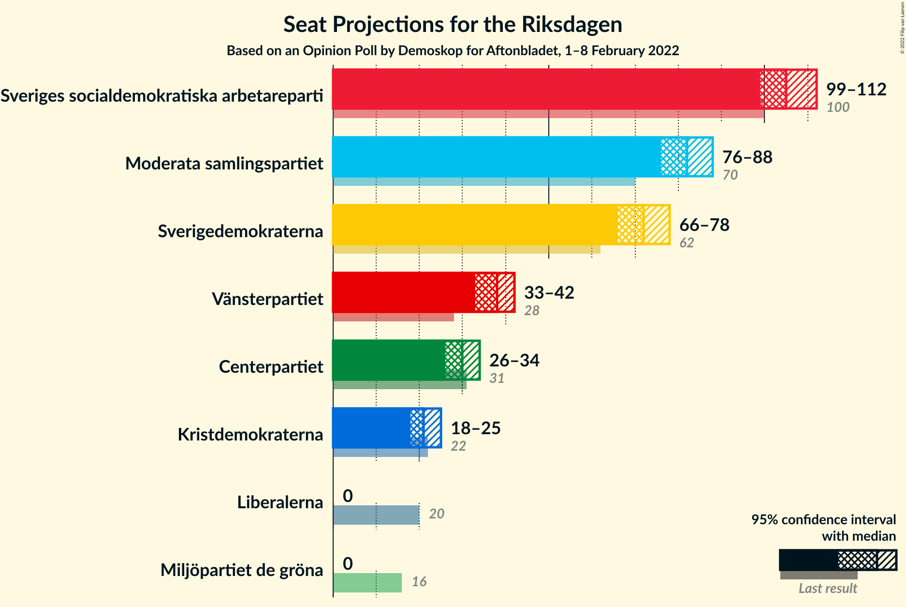

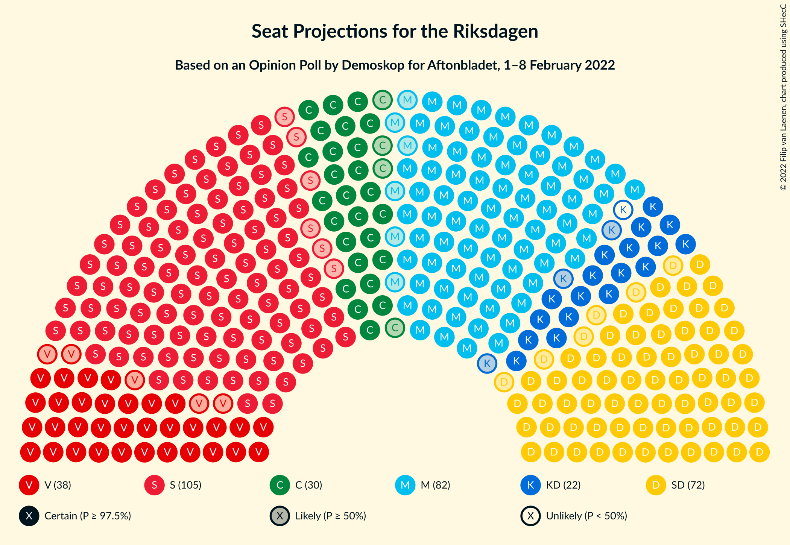

### Confidence Intervals

| Party | Last Result | Median | 80% Confidence Interval | 90% Confidence Interval | 95% Confidence Interval | 99% Confidence Interval |
|:-----:|:-----------:|:------:|:-----------------------:|:-----------------------:|:-----------------------:|:-----------------------:|
| <a href="#sveriges-socialdemokratiska-arbetareparti">Sveriges socialdemokratiska arbetareparti</a> | 100 | 105 | 102–110 |101–111 |99–112 |97–115 |
| <a href="#moderata-samlingspartiet">Moderata samlingspartiet</a> | 70 | 82 | 79–86 |78–87 |76–88 |75–90 |
| <a href="#sverigedemokraterna">Sverigedemokraterna</a> | 62 | 72 | 68–76 |67–77 |66–78 |65–80 |
| <a href="#vänsterpartiet">Vänsterpartiet</a> | 28 | 38 | 35–40 |34–41 |33–42 |32–43 |
| <a href="#centerpartiet">Centerpartiet</a> | 31 | 30 | 27–32 |27–33 |26–34 |25–35 |
| <a href="#kristdemokraterna">Kristdemokraterna</a> | 22 | 21 | 19–23 |18–24 |18–25 |17–25 |
| <a href="#liberalerna">Liberalerna</a> | 20 | 0 | 0 |0 |0 |0–15 |
| <a href="#miljöpartiet-de-gröna">Miljöpartiet de gröna</a> | 16 | 0 | 0 |0 |0 |0 |

### Sveriges socialdemokratiska arbetareparti

*For a full overview of the results for this party, see the [Sveriges socialdemokratiska arbetareparti](party-sverigessocialdemokratiskaarbetareparti.html) page.*

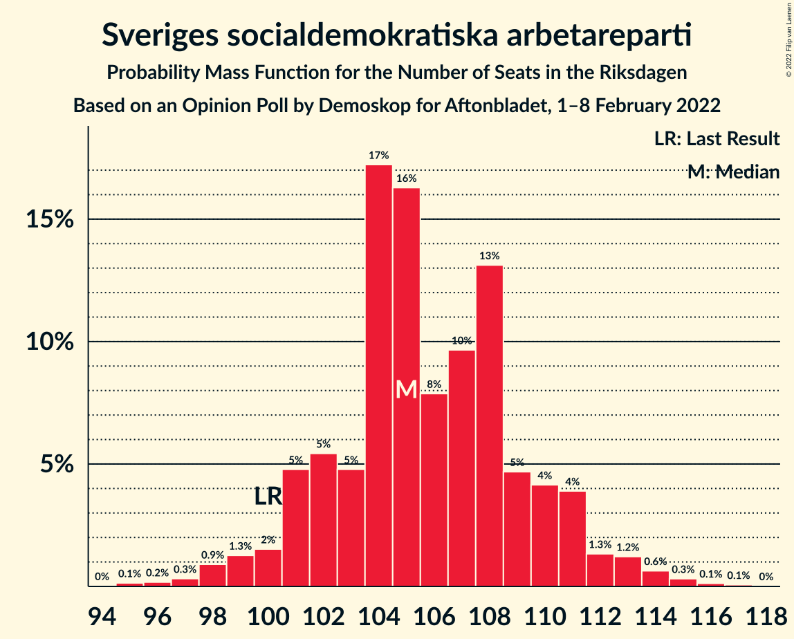

| Number of Seats | Probability | Accumulated | Special Marks |
|:---------------:|:-----------:|:-----------:|:-------------:|
| 95 | 0.1% | 100% |  |
| 96 | 0.2% | 99.8% |  |
| 97 | 0.3% | 99.6% |  |
| 98 | 0.9% | 99.3% |  |
| 99 | 1.3% | 98% |  |
| 100 | 2% | 97% | Last Result |
| 101 | 5% | 96% |  |
| 102 | 5% | 91% |  |
| 103 | 5% | 85% |  |
| 104 | 17% | 81% |  |
| 105 | 16% | 63% | Median |
| 106 | 8% | 47% |  |
| 107 | 10% | 39% |  |
| 108 | 13% | 30% |  |
| 109 | 5% | 16% |  |
| 110 | 4% | 12% |  |
| 111 | 4% | 8% |  |
| 112 | 1.3% | 4% |  |
| 113 | 1.2% | 2% |  |
| 114 | 0.6% | 1.2% |  |
| 115 | 0.3% | 0.5% |  |
| 116 | 0.1% | 0.2% |  |
| 117 | 0.1% | 0.1% |  |
| 118 | 0% | 0% |  |

### Moderata samlingspartiet

*For a full overview of the results for this party, see the [Moderata samlingspartiet](party-moderatasamlingspartiet.html) page.*

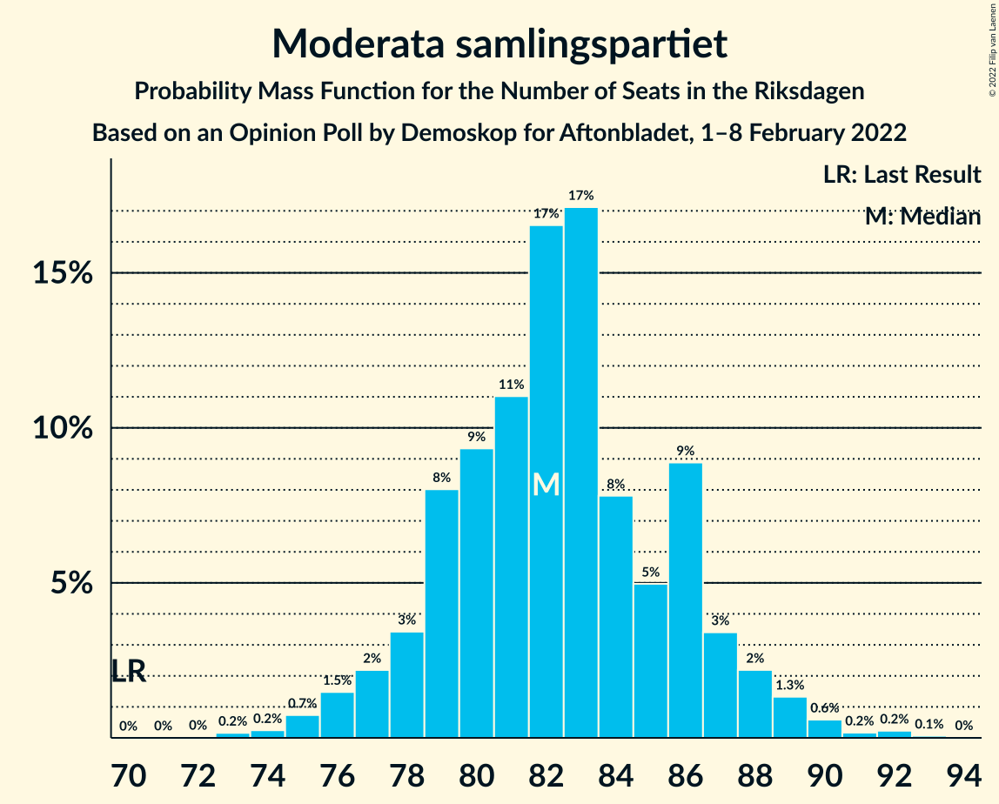

| Number of Seats | Probability | Accumulated | Special Marks |
|:---------------:|:-----------:|:-----------:|:-------------:|
| 70 | 0% | 100% | Last Result |
| 71 | 0% | 100% |  |
| 72 | 0% | 100% |  |
| 73 | 0.2% | 100% |  |
| 74 | 0.2% | 99.8% |  |
| 75 | 0.7% | 99.5% |  |
| 76 | 1.5% | 98.8% |  |
| 77 | 2% | 97% |  |
| 78 | 3% | 95% |  |
| 79 | 8% | 92% |  |
| 80 | 9% | 84% |  |
| 81 | 11% | 74% |  |
| 82 | 17% | 63% | Median |
| 83 | 17% | 47% |  |
| 84 | 8% | 30% |  |
| 85 | 5% | 22% |  |
| 86 | 9% | 17% |  |
| 87 | 3% | 8% |  |
| 88 | 2% | 5% |  |
| 89 | 1.3% | 2% |  |
| 90 | 0.6% | 1.1% |  |
| 91 | 0.2% | 0.5% |  |
| 92 | 0.2% | 0.3% |  |
| 93 | 0.1% | 0.1% |  |
| 94 | 0% | 0% |  |

### Sverigedemokraterna

*For a full overview of the results for this party, see the [Sverigedemokraterna](party-sverigedemokraterna.html) page.*

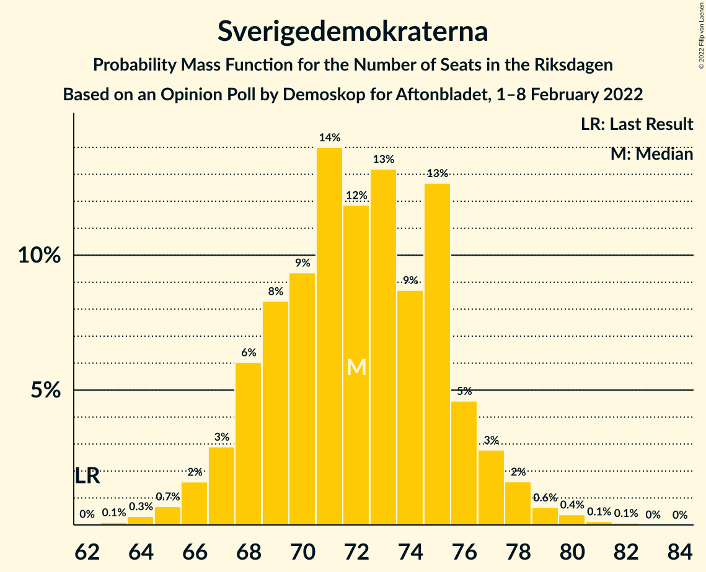

| Number of Seats | Probability | Accumulated | Special Marks |
|:---------------:|:-----------:|:-----------:|:-------------:|
| 62 | 0% | 100% | Last Result |
| 63 | 0.1% | 99.9% |  |
| 64 | 0.3% | 99.9% |  |
| 65 | 0.7% | 99.5% |  |
| 66 | 2% | 98.8% |  |
| 67 | 3% | 97% |  |
| 68 | 6% | 94% |  |
| 69 | 8% | 88% |  |
| 70 | 9% | 80% |  |
| 71 | 14% | 71% |  |
| 72 | 12% | 57% | Median |
| 73 | 13% | 45% |  |
| 74 | 9% | 32% |  |
| 75 | 13% | 23% |  |
| 76 | 5% | 10% |  |
| 77 | 3% | 6% |  |
| 78 | 2% | 3% |  |
| 79 | 0.6% | 1.3% |  |
| 80 | 0.4% | 0.6% |  |
| 81 | 0.1% | 0.2% |  |
| 82 | 0.1% | 0.1% |  |
| 83 | 0% | 0% |  |

### Vänsterpartiet

*For a full overview of the results for this party, see the [Vänsterpartiet](party-vänsterpartiet.html) page.*

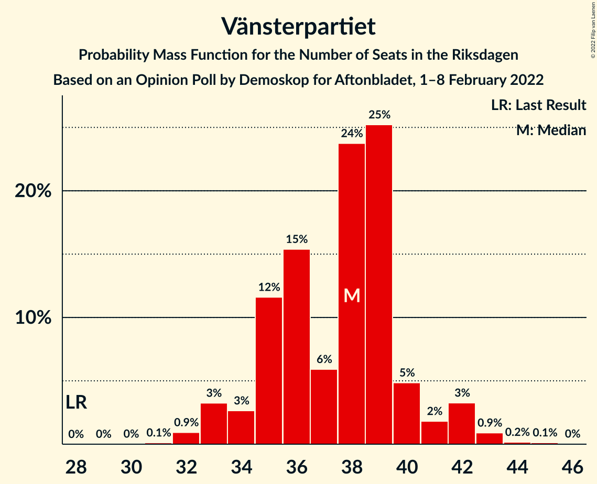

| Number of Seats | Probability | Accumulated | Special Marks |
|:---------------:|:-----------:|:-----------:|:-------------:|
| 28 | 0% | 100% | Last Result |
| 29 | 0% | 100% |  |
| 30 | 0% | 100% |  |
| 31 | 0.1% | 100% |  |
| 32 | 0.9% | 99.8% |  |
| 33 | 3% | 98.9% |  |
| 34 | 3% | 96% |  |
| 35 | 12% | 93% |  |
| 36 | 15% | 81% |  |
| 37 | 6% | 66% |  |
| 38 | 24% | 60% | Median |
| 39 | 25% | 36% |  |
| 40 | 5% | 11% |  |
| 41 | 2% | 6% |  |
| 42 | 3% | 4% |  |
| 43 | 0.9% | 1.2% |  |
| 44 | 0.2% | 0.3% |  |
| 45 | 0.1% | 0.2% |  |
| 46 | 0% | 0% |  |

### Centerpartiet

*For a full overview of the results for this party, see the [Centerpartiet](party-centerpartiet.html) page.*

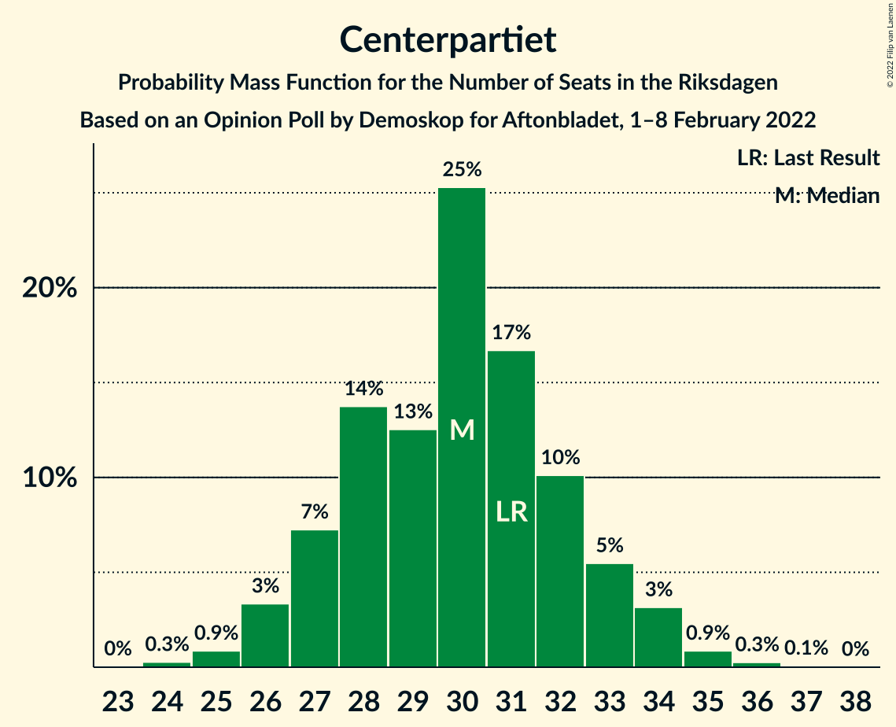

| Number of Seats | Probability | Accumulated | Special Marks |
|:---------------:|:-----------:|:-----------:|:-------------:|
| 24 | 0.3% | 100% |  |
| 25 | 0.9% | 99.7% |  |
| 26 | 3% | 98.8% |  |
| 27 | 7% | 95% |  |
| 28 | 14% | 88% |  |
| 29 | 13% | 74% |  |
| 30 | 25% | 62% | Median |
| 31 | 17% | 37% | Last Result |
| 32 | 10% | 20% |  |
| 33 | 5% | 10% |  |
| 34 | 3% | 4% |  |
| 35 | 0.9% | 1.2% |  |
| 36 | 0.3% | 0.3% |  |
| 37 | 0.1% | 0.1% |  |
| 38 | 0% | 0% |  |

### Kristdemokraterna

*For a full overview of the results for this party, see the [Kristdemokraterna](party-kristdemokraterna.html) page.*

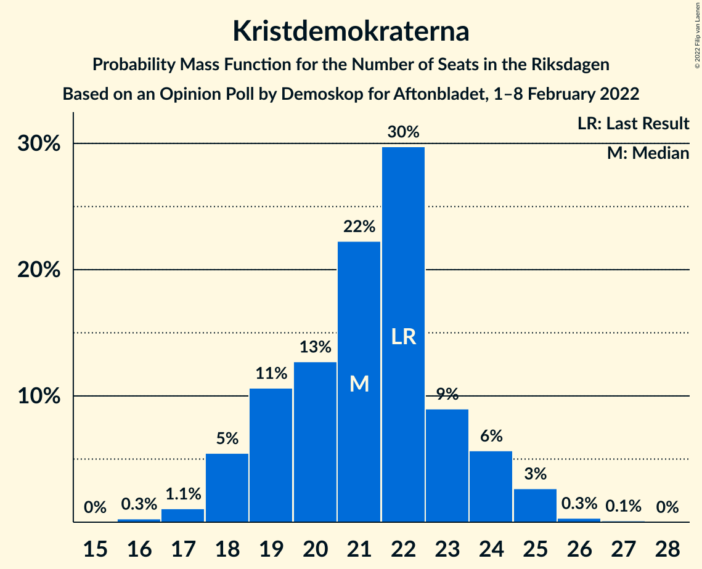

| Number of Seats | Probability | Accumulated | Special Marks |
|:---------------:|:-----------:|:-----------:|:-------------:|
| 16 | 0.3% | 100% |  |
| 17 | 1.1% | 99.7% |  |
| 18 | 5% | 98.6% |  |
| 19 | 11% | 93% |  |
| 20 | 13% | 83% |  |
| 21 | 22% | 70% | Median |
| 22 | 30% | 48% | Last Result |
| 23 | 9% | 18% |  |
| 24 | 6% | 9% |  |
| 25 | 3% | 3% |  |
| 26 | 0.3% | 0.5% |  |
| 27 | 0.1% | 0.1% |  |
| 28 | 0% | 0% |  |

### Liberalerna

*For a full overview of the results for this party, see the [Liberalerna](party-liberalerna.html) page.*

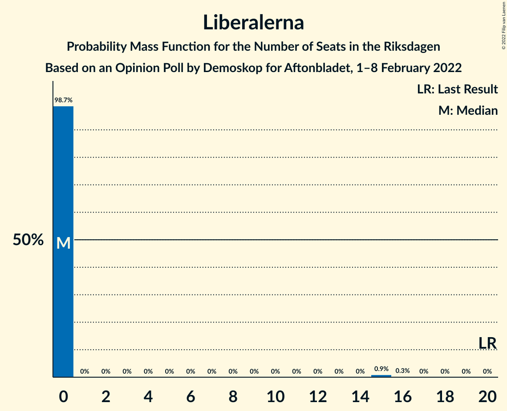

| Number of Seats | Probability | Accumulated | Special Marks |
|:---------------:|:-----------:|:-----------:|:-------------:|
| 0 | 98.7% | 100% | Median |
| 1 | 0% | 1.3% |  |
| 2 | 0% | 1.3% |  |
| 3 | 0% | 1.3% |  |
| 4 | 0% | 1.3% |  |
| 5 | 0% | 1.3% |  |
| 6 | 0% | 1.3% |  |
| 7 | 0% | 1.3% |  |
| 8 | 0% | 1.3% |  |
| 9 | 0% | 1.3% |  |
| 10 | 0% | 1.3% |  |
| 11 | 0% | 1.3% |  |
| 12 | 0% | 1.3% |  |
| 13 | 0% | 1.3% |  |
| 14 | 0% | 1.3% |  |
| 15 | 0.9% | 1.2% |  |
| 16 | 0.3% | 0.3% |  |
| 17 | 0% | 0% |  |
| 18 | 0% | 0% |  |
| 19 | 0% | 0% |  |
| 20 | 0% | 0% | Last Result |

### Miljöpartiet de gröna

*For a full overview of the results for this party, see the [Miljöpartiet de gröna](party-miljöpartietdegröna.html) page.*

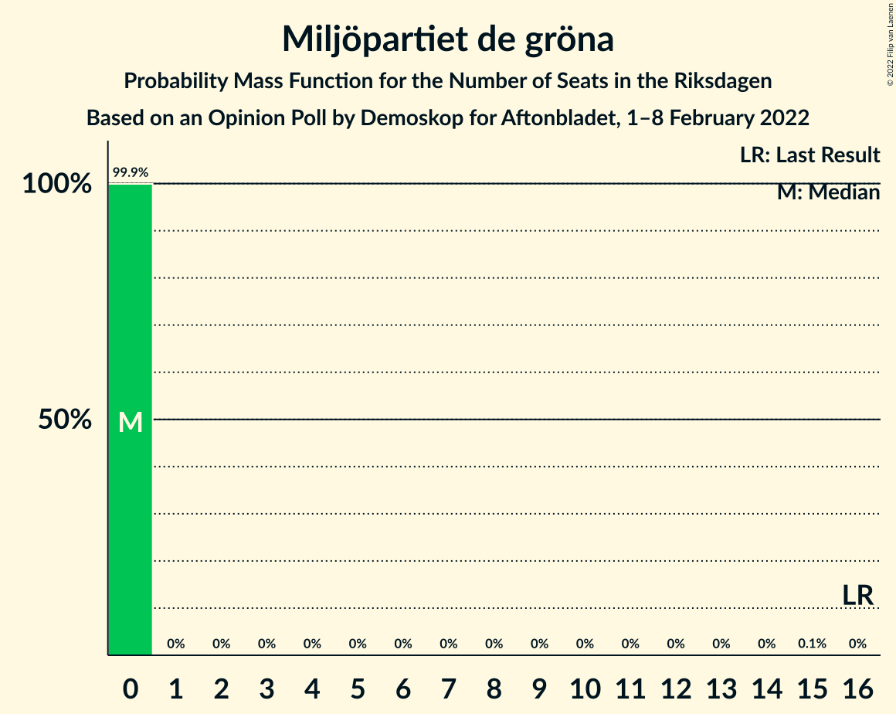

| Number of Seats | Probability | Accumulated | Special Marks |
|:---------------:|:-----------:|:-----------:|:-------------:|
| 0 | 99.9% | 100% | Median |
| 1 | 0% | 0.1% |  |
| 2 | 0% | 0.1% |  |
| 3 | 0% | 0.1% |  |
| 4 | 0% | 0.1% |  |
| 5 | 0% | 0.1% |  |
| 6 | 0% | 0.1% |  |
| 7 | 0% | 0.1% |  |
| 8 | 0% | 0.1% |  |
| 9 | 0% | 0.1% |  |
| 10 | 0% | 0.1% |  |
| 11 | 0% | 0.1% |  |
| 12 | 0% | 0.1% |  |
| 13 | 0% | 0.1% |  |
| 14 | 0% | 0.1% |  |
| 15 | 0.1% | 0.1% |  |
| 16 | 0% | 0% | Last Result |

## Coalitions

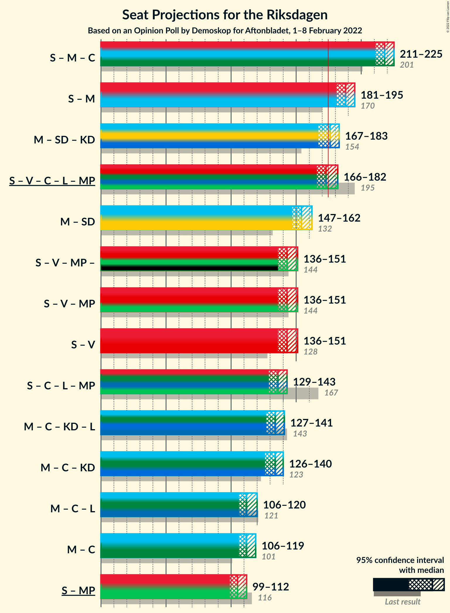

### Confidence Intervals

| Coalition | Last Result | Median | Majority? | 80% Confidence Interval | 90% Confidence Interval | 95% Confidence Interval | 99% Confidence Interval |
|:---------:|:-----------:|:------:|:---------:|:-----------------------:|:-----------------------:|:-----------------------:|:-----------------------:|
| Sveriges socialdemokratiska arbetareparti – Moderata samlingspartiet – Centerpartiet | 201 | 218 | 100% | 214–223 | 213–224 | 211–225 | 207–227 |
| Sveriges socialdemokratiska arbetareparti – Moderata samlingspartiet | 170 | 188 | 99.9% | 184–193 | 182–194 | 181–195 | 178–198 |
| Moderata samlingspartiet – Sverigedemokraterna – Kristdemokraterna | 154 | 176 | 69% | 171–179 | 169–182 | 167–183 | 166–185 |
| Sveriges socialdemokratiska arbetareparti – Vänsterpartiet – Centerpartiet – Liberalerna – Miljöpartiet de gröna | 195 | 173 | 31% | 170–178 | 167–180 | 166–182 | 164–183 |
| Moderata samlingspartiet – Sverigedemokraterna | 132 | 154 | 0% | 150–159 | 148–160 | 147–162 | 145–164 |
| Sveriges socialdemokratiska arbetareparti – Vänsterpartiet – Miljöpartiet de gröna | 144 | 143 | 0% | 139–147 | 137–150 | 136–151 | 133–153 |
| Sveriges socialdemokratiska arbetareparti – Vänsterpartiet | 128 | 143 | 0% | 139–147 | 137–150 | 136–151 | 133–153 |
| Sveriges socialdemokratiska arbetareparti – Centerpartiet – Liberalerna – Miljöpartiet de gröna | 167 | 136 | 0% | 132–140 | 130–142 | 129–143 | 127–147 |
| Moderata samlingspartiet – Centerpartiet – Kristdemokraterna – Liberalerna | 143 | 134 | 0% | 129–138 | 128–139 | 127–141 | 124–145 |
| Moderata samlingspartiet – Centerpartiet – Kristdemokraterna | 123 | 134 | 0% | 129–138 | 128–139 | 126–140 | 124–142 |
| Moderata samlingspartiet – Centerpartiet – Liberalerna | 121 | 112 | 0% | 108–117 | 107–118 | 106–120 | 104–124 |
| Moderata samlingspartiet – Centerpartiet | 101 | 112 | 0% | 108–117 | 107–118 | 106–119 | 103–121 |
| Sveriges socialdemokratiska arbetareparti – Miljöpartiet de gröna | 116 | 105 | 0% | 102–110 | 101–111 | 99–112 | 97–115 |

### Sveriges socialdemokratiska arbetareparti – Moderata samlingspartiet – Centerpartiet

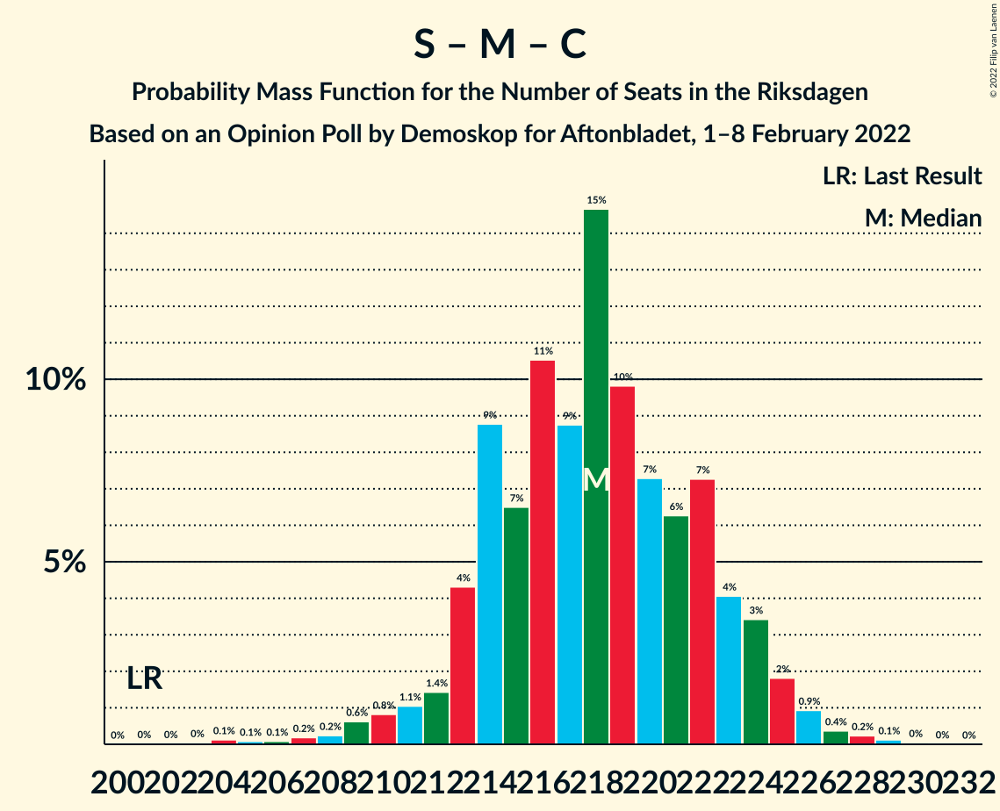

| Number of Seats | Probability | Accumulated | Special Marks |
|:---------------:|:-----------:|:-----------:|:-------------:|
| 201 | 0% | 100% | Last Result |
| 202 | 0% | 100% |  |
| 203 | 0% | 99.9% |  |
| 204 | 0.1% | 99.9% |  |
| 205 | 0.1% | 99.8% |  |
| 206 | 0.1% | 99.7% |  |
| 207 | 0.2% | 99.6% |  |
| 208 | 0.2% | 99.4% |  |
| 209 | 0.6% | 99.2% |  |
| 210 | 0.8% | 98.6% |  |
| 211 | 1.1% | 98% |  |
| 212 | 1.4% | 97% |  |
| 213 | 4% | 95% |  |
| 214 | 9% | 91% |  |
| 215 | 7% | 82% |  |
| 216 | 11% | 76% |  |
| 217 | 9% | 65% | Median |
| 218 | 15% | 56% |  |
| 219 | 10% | 42% |  |
| 220 | 7% | 32% |  |
| 221 | 6% | 25% |  |
| 222 | 7% | 18% |  |
| 223 | 4% | 11% |  |
| 224 | 3% | 7% |  |
| 225 | 2% | 4% |  |
| 226 | 0.9% | 2% |  |
| 227 | 0.4% | 0.8% |  |
| 228 | 0.2% | 0.4% |  |
| 229 | 0.1% | 0.2% |  |
| 230 | 0% | 0.1% |  |
| 231 | 0% | 0% |  |

### Sveriges socialdemokratiska arbetareparti – Moderata samlingspartiet

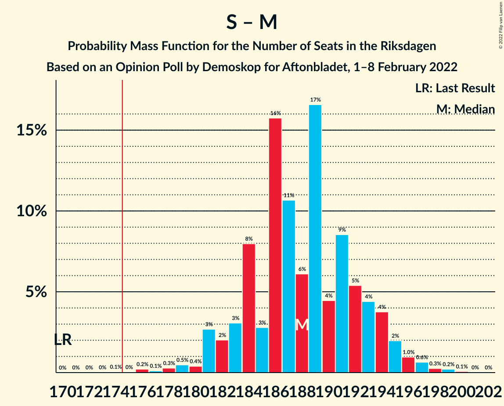

| Number of Seats | Probability | Accumulated | Special Marks |
|:---------------:|:-----------:|:-----------:|:-------------:|
| 170 | 0% | 100% | Last Result |
| 171 | 0% | 100% |  |
| 172 | 0% | 100% |  |
| 173 | 0% | 100% |  |
| 174 | 0.1% | 100% |  |
| 175 | 0% | 99.9% | Majority |
| 176 | 0.2% | 99.9% |  |
| 177 | 0.1% | 99.6% |  |
| 178 | 0.3% | 99.5% |  |
| 179 | 0.5% | 99.3% |  |
| 180 | 0.4% | 98.8% |  |
| 181 | 3% | 98% |  |
| 182 | 2% | 96% |  |
| 183 | 3% | 94% |  |
| 184 | 8% | 91% |  |
| 185 | 3% | 83% |  |
| 186 | 16% | 80% |  |
| 187 | 11% | 64% | Median |
| 188 | 6% | 53% |  |
| 189 | 17% | 47% |  |
| 190 | 4% | 31% |  |
| 191 | 9% | 26% |  |
| 192 | 5% | 18% |  |
| 193 | 4% | 12% |  |
| 194 | 4% | 8% |  |
| 195 | 2% | 4% |  |
| 196 | 1.0% | 2% |  |
| 197 | 0.6% | 1.2% |  |
| 198 | 0.3% | 0.6% |  |
| 199 | 0.2% | 0.3% |  |
| 200 | 0.1% | 0.1% |  |
| 201 | 0% | 0% |  |

### Moderata samlingspartiet – Sverigedemokraterna – Kristdemokraterna

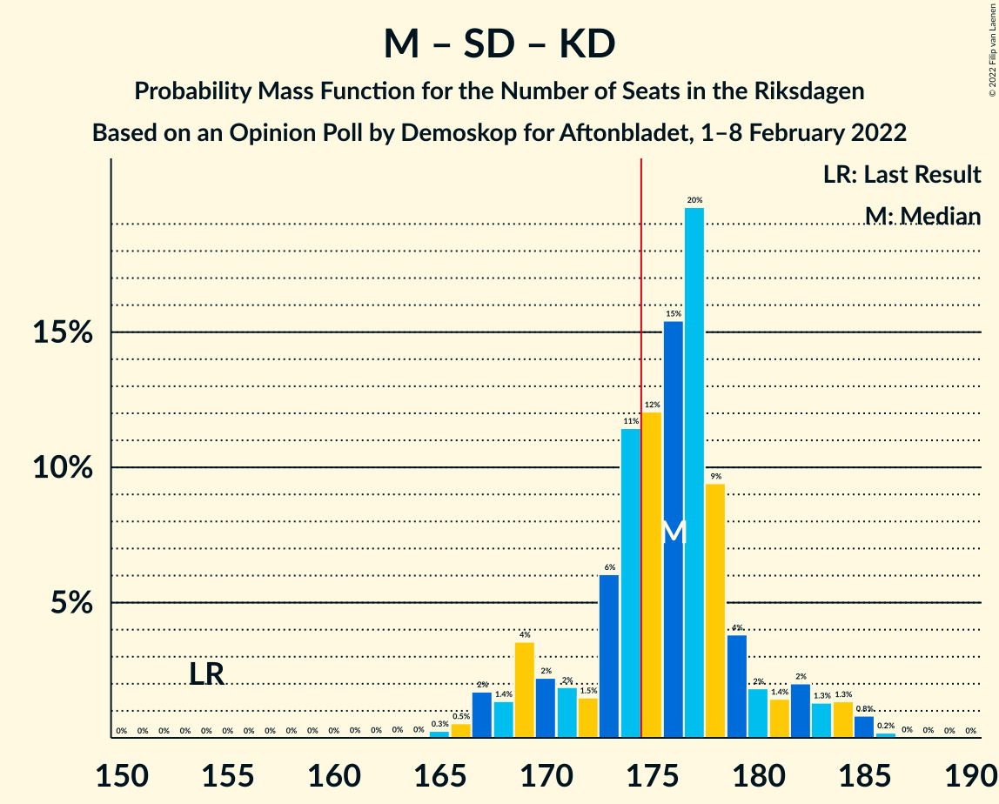

| Number of Seats | Probability | Accumulated | Special Marks |
|:---------------:|:-----------:|:-----------:|:-------------:|
| 154 | 0% | 100% | Last Result |
| 155 | 0% | 100% |  |
| 156 | 0% | 100% |  |
| 157 | 0% | 100% |  |
| 158 | 0% | 100% |  |
| 159 | 0% | 100% |  |
| 160 | 0% | 100% |  |
| 161 | 0% | 100% |  |
| 162 | 0% | 100% |  |
| 163 | 0% | 99.9% |  |
| 164 | 0% | 99.9% |  |
| 165 | 0.3% | 99.8% |  |
| 166 | 0.5% | 99.6% |  |
| 167 | 2% | 99.0% |  |
| 168 | 1.4% | 97% |  |
| 169 | 4% | 96% |  |
| 170 | 2% | 92% |  |
| 171 | 2% | 90% |  |
| 172 | 1.5% | 88% |  |
| 173 | 6% | 87% |  |
| 174 | 11% | 81% |  |
| 175 | 12% | 69% | Median, Majority |
| 176 | 15% | 57% |  |
| 177 | 20% | 42% |  |
| 178 | 9% | 22% |  |
| 179 | 4% | 13% |  |
| 180 | 2% | 9% |  |
| 181 | 1.4% | 7% |  |
| 182 | 2% | 6% |  |
| 183 | 1.3% | 4% |  |
| 184 | 1.3% | 2% |  |
| 185 | 0.8% | 1.1% |  |
| 186 | 0.2% | 0.3% |  |
| 187 | 0% | 0.1% |  |
| 188 | 0% | 0% |  |

### Sveriges socialdemokratiska arbetareparti – Vänsterpartiet – Centerpartiet – Liberalerna – Miljöpartiet de gröna

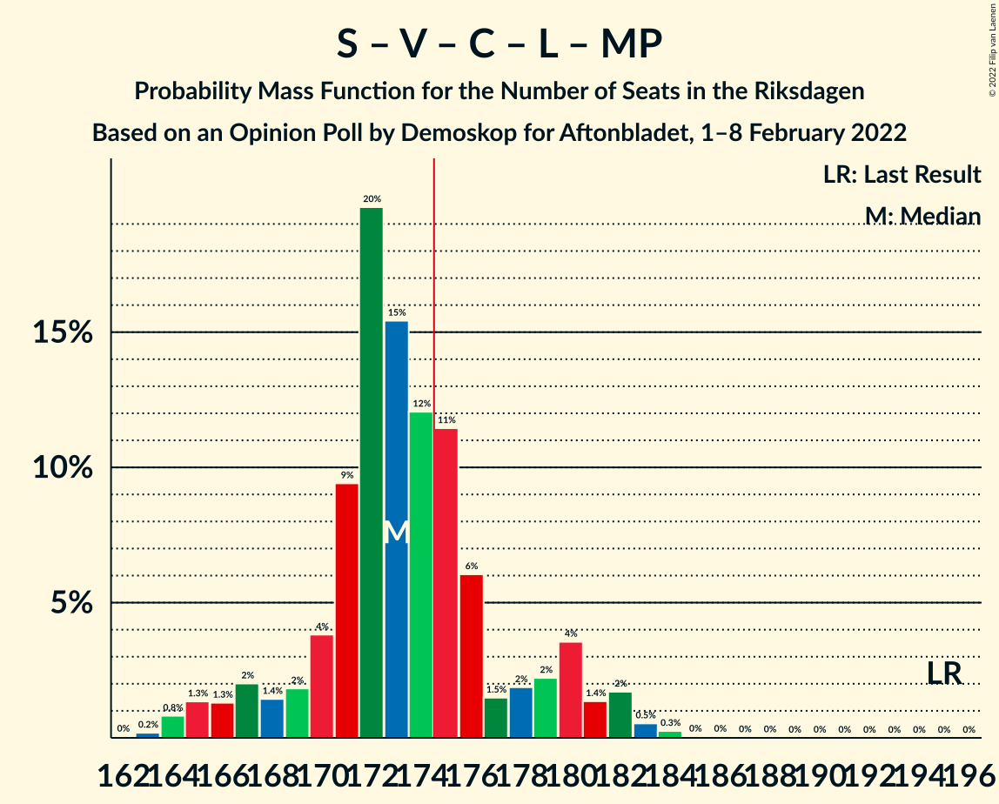

| Number of Seats | Probability | Accumulated | Special Marks |
|:---------------:|:-----------:|:-----------:|:-------------:|
| 162 | 0% | 100% |  |
| 163 | 0.2% | 99.9% |  |
| 164 | 0.8% | 99.7% |  |
| 165 | 1.3% | 98.9% |  |
| 166 | 1.3% | 98% |  |
| 167 | 2% | 96% |  |
| 168 | 1.4% | 94% |  |
| 169 | 2% | 93% |  |
| 170 | 4% | 91% |  |
| 171 | 9% | 87% |  |
| 172 | 20% | 78% |  |
| 173 | 15% | 58% | Median |
| 174 | 12% | 43% |  |
| 175 | 11% | 31% | Majority |
| 176 | 6% | 19% |  |
| 177 | 1.5% | 13% |  |
| 178 | 2% | 12% |  |
| 179 | 2% | 10% |  |
| 180 | 4% | 8% |  |
| 181 | 1.4% | 4% |  |
| 182 | 2% | 3% |  |
| 183 | 0.5% | 1.0% |  |
| 184 | 0.3% | 0.4% |  |
| 185 | 0% | 0.2% |  |
| 186 | 0% | 0.1% |  |
| 187 | 0% | 0.1% |  |
| 188 | 0% | 0% |  |
| 189 | 0% | 0% |  |
| 190 | 0% | 0% |  |
| 191 | 0% | 0% |  |
| 192 | 0% | 0% |  |
| 193 | 0% | 0% |  |
| 194 | 0% | 0% |  |
| 195 | 0% | 0% | Last Result |

### Moderata samlingspartiet – Sverigedemokraterna

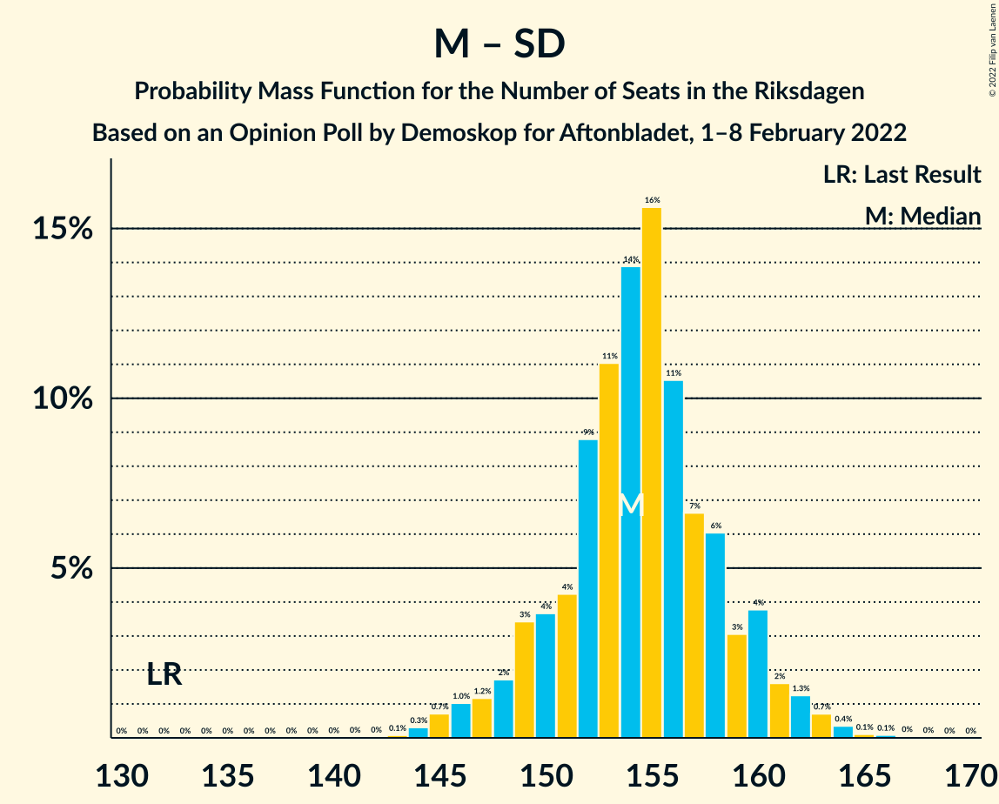

| Number of Seats | Probability | Accumulated | Special Marks |
|:---------------:|:-----------:|:-----------:|:-------------:|
| 132 | 0% | 100% | Last Result |
| 133 | 0% | 100% |  |
| 134 | 0% | 100% |  |
| 135 | 0% | 100% |  |
| 136 | 0% | 100% |  |
| 137 | 0% | 100% |  |
| 138 | 0% | 100% |  |
| 139 | 0% | 100% |  |
| 140 | 0% | 100% |  |
| 141 | 0% | 100% |  |
| 142 | 0% | 99.9% |  |
| 143 | 0.1% | 99.9% |  |
| 144 | 0.3% | 99.8% |  |
| 145 | 0.7% | 99.5% |  |
| 146 | 1.0% | 98.8% |  |
| 147 | 1.2% | 98% |  |
| 148 | 2% | 97% |  |
| 149 | 3% | 95% |  |
| 150 | 4% | 91% |  |
| 151 | 4% | 88% |  |
| 152 | 9% | 84% |  |
| 153 | 11% | 75% |  |
| 154 | 14% | 64% | Median |
| 155 | 16% | 50% |  |
| 156 | 11% | 34% |  |
| 157 | 7% | 24% |  |
| 158 | 6% | 17% |  |
| 159 | 3% | 11% |  |
| 160 | 4% | 8% |  |
| 161 | 2% | 4% |  |
| 162 | 1.3% | 3% |  |
| 163 | 0.7% | 1.3% |  |
| 164 | 0.4% | 0.6% |  |
| 165 | 0.1% | 0.3% |  |
| 166 | 0.1% | 0.2% |  |
| 167 | 0% | 0.1% |  |
| 168 | 0% | 0% |  |

### Sveriges socialdemokratiska arbetareparti – Vänsterpartiet – Miljöpartiet de gröna

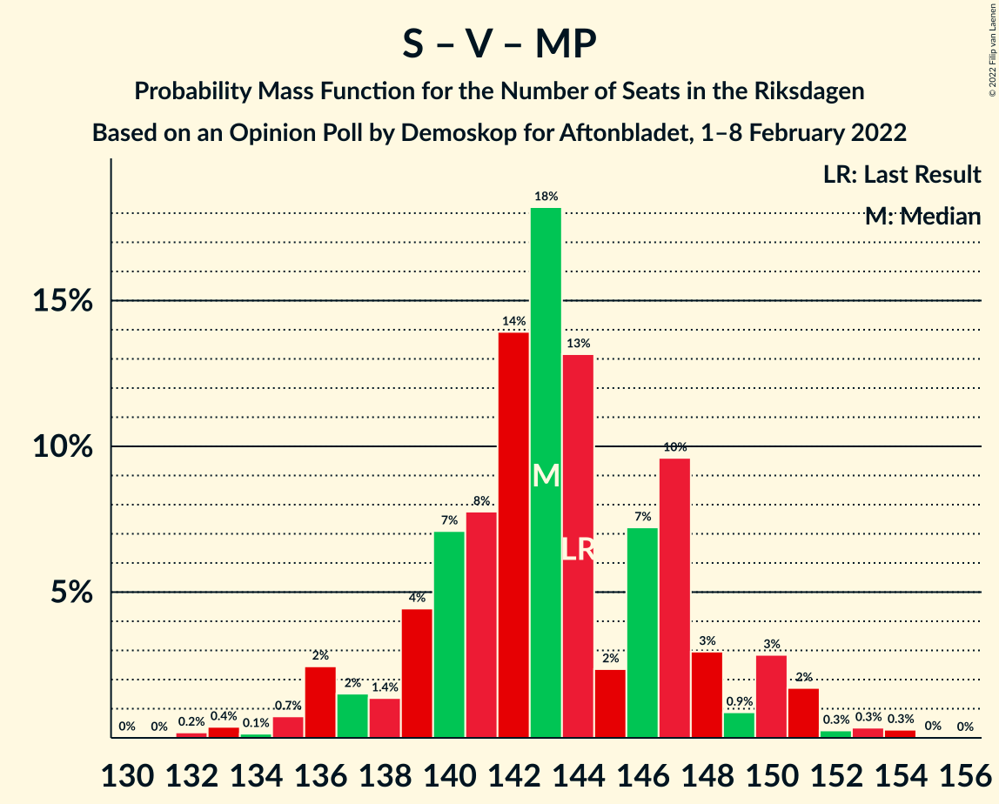

| Number of Seats | Probability | Accumulated | Special Marks |
|:---------------:|:-----------:|:-----------:|:-------------:|
| 131 | 0% | 100% |  |
| 132 | 0.2% | 99.9% |  |
| 133 | 0.4% | 99.8% |  |
| 134 | 0.1% | 99.4% |  |
| 135 | 0.7% | 99.2% |  |
| 136 | 2% | 98% |  |
| 137 | 2% | 96% |  |
| 138 | 1.4% | 95% |  |
| 139 | 4% | 93% |  |
| 140 | 7% | 89% |  |
| 141 | 8% | 82% |  |
| 142 | 14% | 74% |  |
| 143 | 18% | 60% | Median |
| 144 | 13% | 42% | Last Result |
| 145 | 2% | 29% |  |
| 146 | 7% | 26% |  |
| 147 | 10% | 19% |  |
| 148 | 3% | 9% |  |
| 149 | 0.9% | 6% |  |
| 150 | 3% | 6% |  |
| 151 | 2% | 3% |  |
| 152 | 0.3% | 1.0% |  |
| 153 | 0.3% | 0.7% |  |
| 154 | 0.3% | 0.4% |  |
| 155 | 0% | 0.1% |  |
| 156 | 0% | 0% |  |

### Sveriges socialdemokratiska arbetareparti – Vänsterpartiet

| Number of Seats | Probability | Accumulated | Special Marks |
|:---------------:|:-----------:|:-----------:|:-------------:|
| 128 | 0% | 100% | Last Result |
| 129 | 0% | 100% |  |
| 130 | 0% | 100% |  |
| 131 | 0% | 100% |  |
| 132 | 0.2% | 99.9% |  |
| 133 | 0.4% | 99.7% |  |
| 134 | 0.2% | 99.4% |  |
| 135 | 0.7% | 99.2% |  |
| 136 | 2% | 98% |  |
| 137 | 2% | 96% |  |
| 138 | 1.4% | 94% |  |
| 139 | 4% | 93% |  |
| 140 | 7% | 89% |  |
| 141 | 8% | 82% |  |
| 142 | 14% | 74% |  |
| 143 | 18% | 60% | Median |
| 144 | 13% | 42% |  |
| 145 | 2% | 28% |  |
| 146 | 7% | 26% |  |
| 147 | 10% | 19% |  |
| 148 | 3% | 9% |  |
| 149 | 0.9% | 6% |  |
| 150 | 3% | 5% |  |
| 151 | 2% | 3% |  |
| 152 | 0.2% | 0.9% |  |
| 153 | 0.3% | 0.7% |  |
| 154 | 0.3% | 0.3% |  |
| 155 | 0% | 0.1% |  |
| 156 | 0% | 0% |  |

### Sveriges socialdemokratiska arbetareparti – Centerpartiet – Liberalerna – Miljöpartiet de gröna

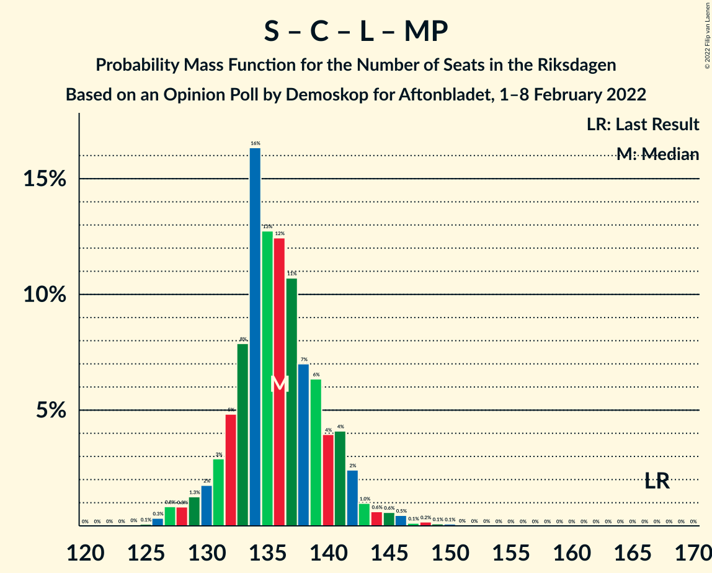

| Number of Seats | Probability | Accumulated | Special Marks |
|:---------------:|:-----------:|:-----------:|:-------------:|
| 124 | 0% | 100% |  |
| 125 | 0.1% | 99.9% |  |
| 126 | 0.3% | 99.9% |  |
| 127 | 0.8% | 99.5% |  |
| 128 | 0.8% | 98.7% |  |
| 129 | 1.3% | 98% |  |
| 130 | 2% | 97% |  |
| 131 | 3% | 95% |  |
| 132 | 5% | 92% |  |
| 133 | 8% | 87% |  |
| 134 | 16% | 79% |  |
| 135 | 13% | 63% | Median |
| 136 | 12% | 50% |  |
| 137 | 11% | 38% |  |
| 138 | 7% | 27% |  |
| 139 | 6% | 20% |  |
| 140 | 4% | 14% |  |
| 141 | 4% | 10% |  |
| 142 | 2% | 6% |  |
| 143 | 1.0% | 3% |  |
| 144 | 0.6% | 2% |  |
| 145 | 0.6% | 2% |  |
| 146 | 0.5% | 1.0% |  |
| 147 | 0.1% | 0.5% |  |
| 148 | 0.2% | 0.4% |  |
| 149 | 0.1% | 0.2% |  |
| 150 | 0.1% | 0.2% |  |
| 151 | 0% | 0.1% |  |
| 152 | 0% | 0% |  |
| 153 | 0% | 0% |  |
| 154 | 0% | 0% |  |
| 155 | 0% | 0% |  |
| 156 | 0% | 0% |  |
| 157 | 0% | 0% |  |
| 158 | 0% | 0% |  |
| 159 | 0% | 0% |  |
| 160 | 0% | 0% |  |
| 161 | 0% | 0% |  |
| 162 | 0% | 0% |  |
| 163 | 0% | 0% |  |
| 164 | 0% | 0% |  |
| 165 | 0% | 0% |  |
| 166 | 0% | 0% |  |
| 167 | 0% | 0% | Last Result |

### Moderata samlingspartiet – Centerpartiet – Kristdemokraterna – Liberalerna

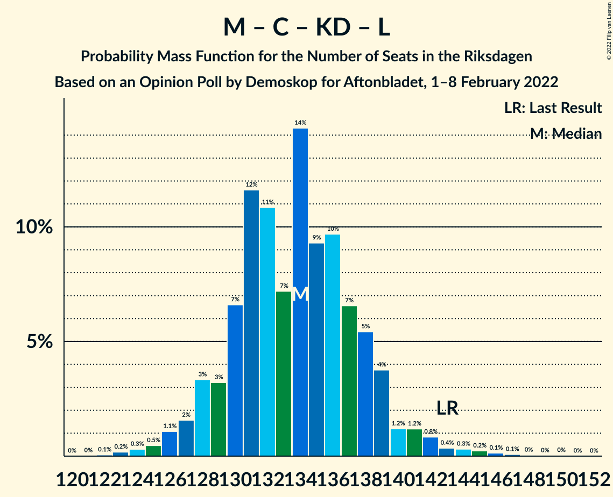

| Number of Seats | Probability | Accumulated | Special Marks |
|:---------------:|:-----------:|:-----------:|:-------------:|
| 122 | 0.1% | 100% |  |
| 123 | 0.2% | 99.9% |  |
| 124 | 0.3% | 99.7% |  |
| 125 | 0.5% | 99.4% |  |
| 126 | 1.1% | 99.0% |  |
| 127 | 2% | 98% |  |
| 128 | 3% | 96% |  |
| 129 | 3% | 93% |  |
| 130 | 7% | 90% |  |
| 131 | 12% | 83% |  |
| 132 | 11% | 72% |  |
| 133 | 7% | 61% | Median |
| 134 | 14% | 53% |  |
| 135 | 9% | 39% |  |
| 136 | 10% | 30% |  |
| 137 | 7% | 20% |  |
| 138 | 5% | 14% |  |
| 139 | 4% | 8% |  |
| 140 | 1.2% | 4% |  |
| 141 | 1.2% | 3% |  |
| 142 | 0.8% | 2% |  |
| 143 | 0.4% | 1.2% | Last Result |
| 144 | 0.3% | 0.9% |  |
| 145 | 0.2% | 0.6% |  |
| 146 | 0.1% | 0.3% |  |
| 147 | 0.1% | 0.2% |  |
| 148 | 0% | 0.1% |  |
| 149 | 0% | 0.1% |  |
| 150 | 0% | 0.1% |  |
| 151 | 0% | 0% |  |

### Moderata samlingspartiet – Centerpartiet – Kristdemokraterna

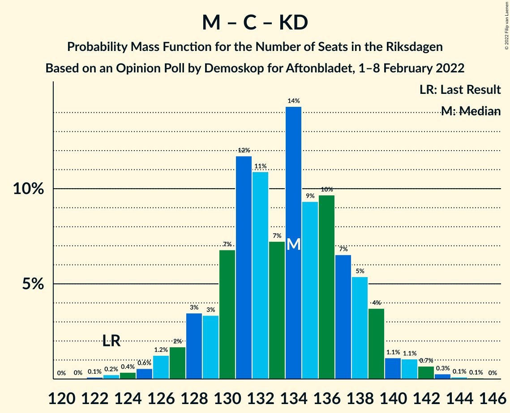

| Number of Seats | Probability | Accumulated | Special Marks |
|:---------------:|:-----------:|:-----------:|:-------------:|
| 121 | 0% | 100% |  |
| 122 | 0.1% | 99.9% |  |
| 123 | 0.2% | 99.8% | Last Result |
| 124 | 0.4% | 99.6% |  |
| 125 | 0.6% | 99.2% |  |
| 126 | 1.2% | 98.7% |  |
| 127 | 2% | 97% |  |
| 128 | 3% | 96% |  |
| 129 | 3% | 92% |  |
| 130 | 7% | 89% |  |
| 131 | 12% | 82% |  |
| 132 | 11% | 70% |  |
| 133 | 7% | 60% | Median |
| 134 | 14% | 52% |  |
| 135 | 9% | 38% |  |
| 136 | 10% | 29% |  |
| 137 | 7% | 19% |  |
| 138 | 5% | 12% |  |
| 139 | 4% | 7% |  |
| 140 | 1.1% | 3% |  |
| 141 | 1.1% | 2% |  |
| 142 | 0.7% | 1.2% |  |
| 143 | 0.3% | 0.5% |  |
| 144 | 0.1% | 0.2% |  |
| 145 | 0.1% | 0.1% |  |
| 146 | 0% | 0% |  |

### Moderata samlingspartiet – Centerpartiet – Liberalerna

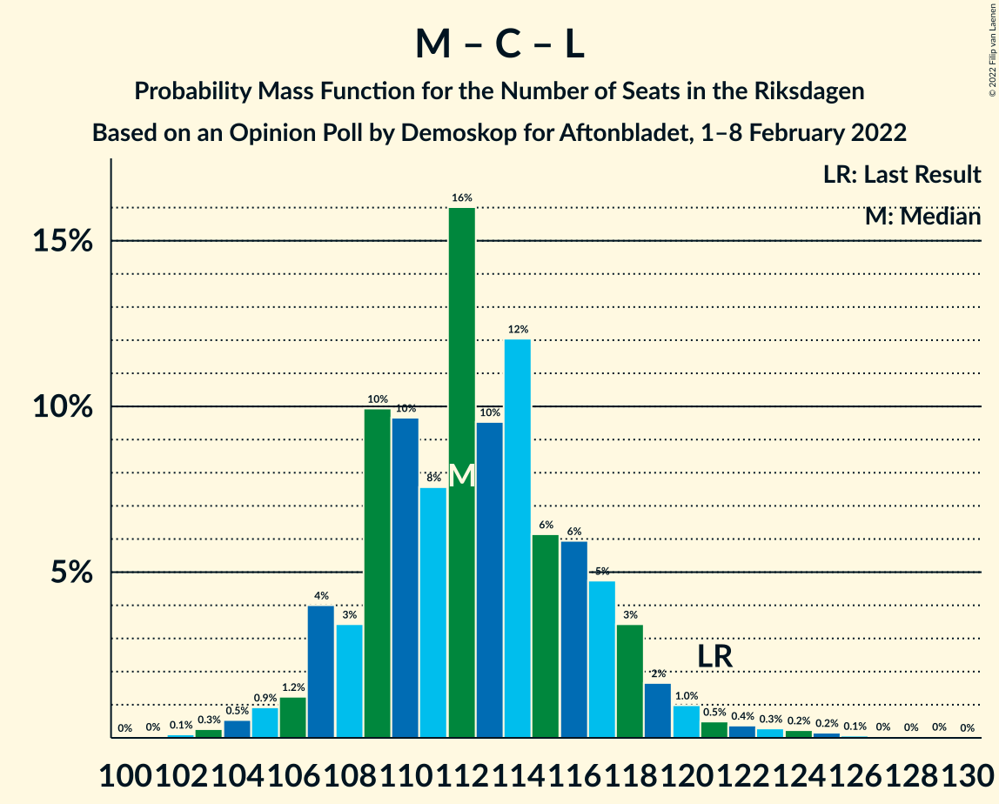

| Number of Seats | Probability | Accumulated | Special Marks |
|:---------------:|:-----------:|:-----------:|:-------------:|
| 101 | 0% | 100% |  |
| 102 | 0.1% | 99.9% |  |
| 103 | 0.3% | 99.8% |  |
| 104 | 0.5% | 99.6% |  |
| 105 | 0.9% | 99.0% |  |
| 106 | 1.2% | 98% |  |
| 107 | 4% | 97% |  |
| 108 | 3% | 93% |  |
| 109 | 10% | 89% |  |
| 110 | 10% | 79% |  |
| 111 | 8% | 70% |  |
| 112 | 16% | 62% | Median |
| 113 | 10% | 46% |  |
| 114 | 12% | 37% |  |
| 115 | 6% | 25% |  |
| 116 | 6% | 19% |  |
| 117 | 5% | 13% |  |
| 118 | 3% | 8% |  |
| 119 | 2% | 4% |  |
| 120 | 1.0% | 3% |  |
| 121 | 0.5% | 2% | Last Result |
| 122 | 0.4% | 1.3% |  |
| 123 | 0.3% | 0.9% |  |
| 124 | 0.2% | 0.6% |  |
| 125 | 0.2% | 0.4% |  |
| 126 | 0.1% | 0.2% |  |
| 127 | 0% | 0.1% |  |
| 128 | 0% | 0.1% |  |
| 129 | 0% | 0.1% |  |
| 130 | 0% | 0% |  |

### Moderata samlingspartiet – Centerpartiet

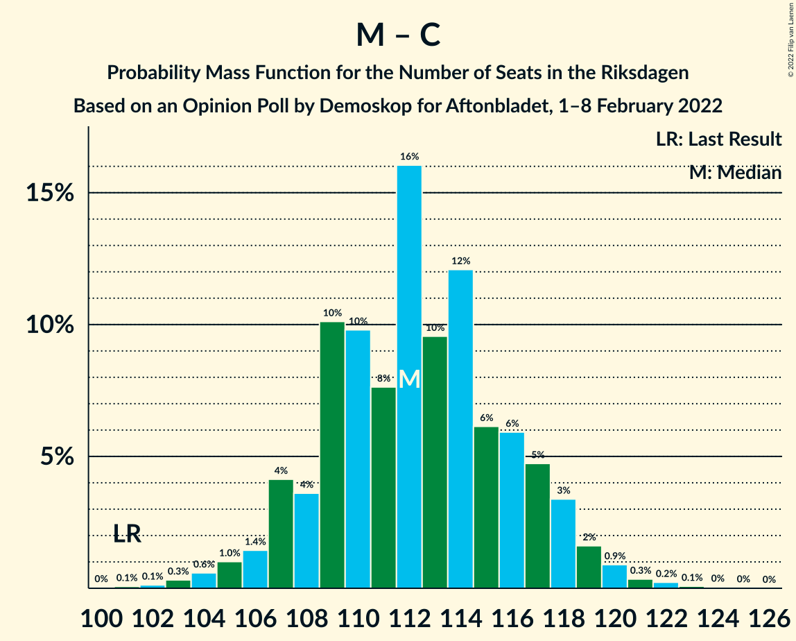

| Number of Seats | Probability | Accumulated | Special Marks |
|:---------------:|:-----------:|:-----------:|:-------------:|
| 101 | 0.1% | 100% | Last Result |
| 102 | 0.1% | 99.9% |  |
| 103 | 0.3% | 99.8% |  |
| 104 | 0.6% | 99.4% |  |
| 105 | 1.0% | 98.9% |  |
| 106 | 1.4% | 98% |  |
| 107 | 4% | 96% |  |
| 108 | 4% | 92% |  |
| 109 | 10% | 89% |  |
| 110 | 10% | 79% |  |
| 111 | 8% | 69% |  |
| 112 | 16% | 61% | Median |
| 113 | 10% | 45% |  |
| 114 | 12% | 36% |  |
| 115 | 6% | 23% |  |
| 116 | 6% | 17% |  |
| 117 | 5% | 11% |  |
| 118 | 3% | 7% |  |
| 119 | 2% | 3% |  |
| 120 | 0.9% | 2% |  |
| 121 | 0.3% | 0.7% |  |
| 122 | 0.2% | 0.4% |  |
| 123 | 0.1% | 0.2% |  |
| 124 | 0% | 0.1% |  |
| 125 | 0% | 0% |  |

### Sveriges socialdemokratiska arbetareparti – Miljöpartiet de gröna

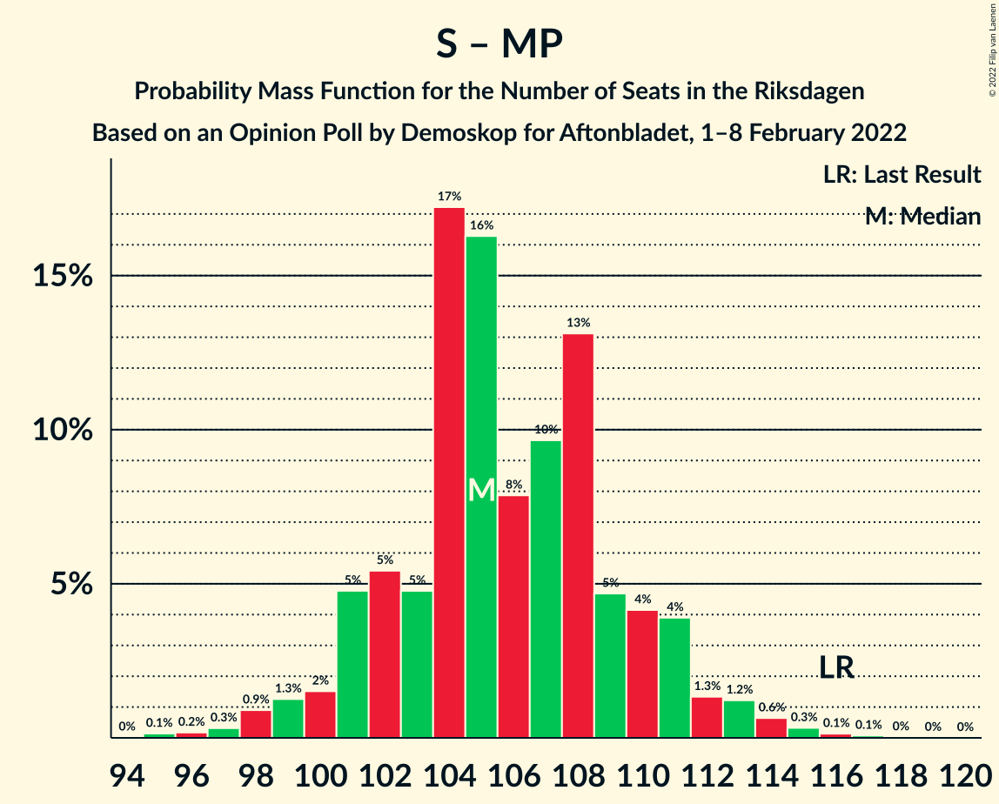

| Number of Seats | Probability | Accumulated | Special Marks |
|:---------------:|:-----------:|:-----------:|:-------------:|
| 95 | 0.1% | 100% |  |
| 96 | 0.2% | 99.8% |  |
| 97 | 0.3% | 99.6% |  |
| 98 | 0.9% | 99.3% |  |
| 99 | 1.3% | 98% |  |
| 100 | 2% | 97% |  |
| 101 | 5% | 96% |  |
| 102 | 5% | 91% |  |
| 103 | 5% | 85% |  |
| 104 | 17% | 81% |  |
| 105 | 16% | 63% | Median |
| 106 | 8% | 47% |  |
| 107 | 10% | 39% |  |
| 108 | 13% | 30% |  |
| 109 | 5% | 17% |  |
| 110 | 4% | 12% |  |
| 111 | 4% | 8% |  |
| 112 | 1.3% | 4% |  |
| 113 | 1.2% | 2% |  |
| 114 | 0.6% | 1.2% |  |
| 115 | 0.3% | 0.6% |  |
| 116 | 0.1% | 0.3% | Last Result |
| 117 | 0.1% | 0.1% |  |
| 118 | 0% | 0.1% |  |
| 119 | 0% | 0% |  |

## Technical Information

### Opinion Poll

+ **Polling firm:** Demoskop
+ **Commissioner(s):** Aftonbladet
+ **Fieldwork period:** 1–8 February 2022

### Calculations

+ **Sample size:** 2505
+ **Simulations done:** 1,048,576
+ **Error estimate:** 0.40%

