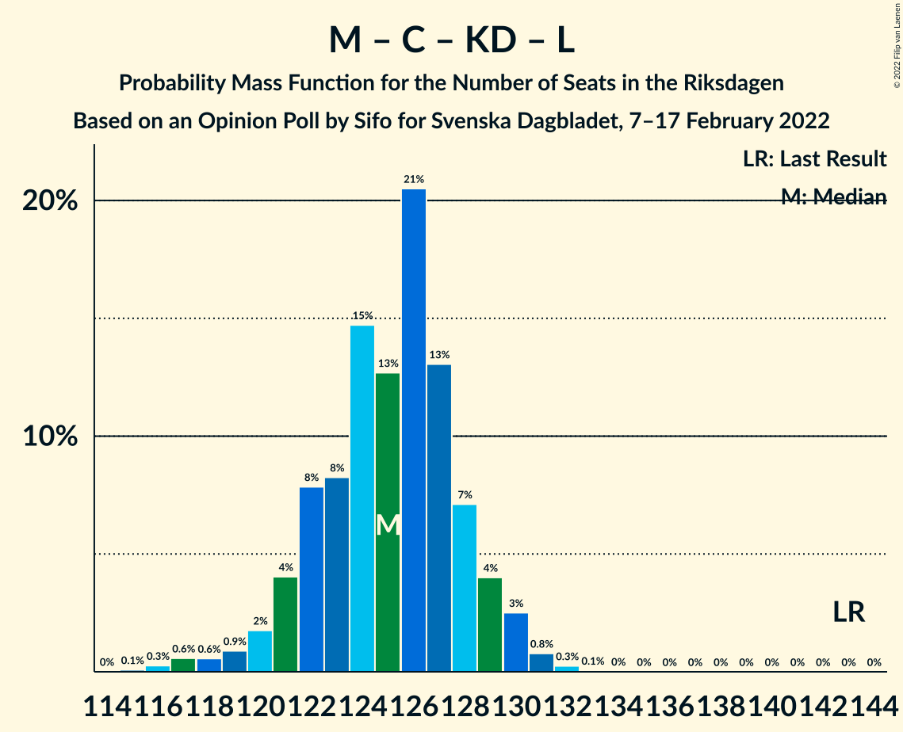

# Opinion Poll by Sifo for Svenska Dagbladet, 7–17 February 2022

<a href="#voting-intentions">Voting Intentions</a> | <a href="#seats">Seats</a> | <a href="#coalitions">Coalitions</a> | <a href="#technical-information">Technical Information</a>

## Voting Intentions

### Confidence Intervals

| Party | Last Result | Poll Result | 80% Confidence Interval | 90% Confidence Interval | 95% Confidence Interval | 99% Confidence Interval |
|:-----:|:-----------:|:-----------:|:-----------------------:|:-----------------------:|:-----------------------:|:-----------------------:|
| Sveriges socialdemokratiska arbetareparti | 28.3% | 29.5% | 28.8–30.3% |28.6–30.5% |28.4–30.7% |28.0–31.1% |
| Moderata samlingspartiet | 19.8% | 20.9% | 20.2–21.5% |20.0–21.7% |19.8–21.9% |19.5–22.2% |
| Sverigedemokraterna | 17.5% | 19.3% | 18.6–19.9% |18.4–20.1% |18.3–20.3% |18.0–20.6% |
| Vänsterpartiet | 8.0% | 10.1% | 9.6–10.6% |9.4–10.7% |9.3–10.9% |9.1–11.1% |
| Centerpartiet | 8.6% | 6.9% | 6.5–7.3% |6.4–7.4% |6.3–7.5% |6.1–7.8% |
| Kristdemokraterna | 6.3% | 5.3% | 4.9–5.7% |4.8–5.8% |4.8–5.9% |4.6–6.1% |
| Miljöpartiet de gröna | 4.4% | 3.6% | 3.3–3.9% |3.2–4.0% |3.1–4.1% |3.0–4.3% |
| Liberalerna | 5.5% | 2.7% | 2.4–3.0% |2.4–3.1% |2.3–3.1% |2.2–3.3% |

*Note:* The poll result column reflects the actual value used in the calculations. Published results may vary slightly, and in addition be rounded to fewer digits.

## Seats

### Confidence Intervals

| Party | Last Result | Median | 80% Confidence Interval | 90% Confidence Interval | 95% Confidence Interval | 99% Confidence Interval |
|:-----:|:-----------:|:------:|:-----------------------:|:-----------------------:|:-----------------------:|:-----------------------:|
| <a href="#sveriges-socialdemokratiska-arbetareparti">Sveriges socialdemokratiska arbetareparti</a> | 100 | 112 | 109–115 |108–115 |107–116 |105–118 |
| <a href="#moderata-samlingspartiet">Moderata samlingspartiet</a> | 70 | 79 | 76–81 |75–82 |75–83 |73–84 |
| <a href="#sverigedemokraterna">Sverigedemokraterna</a> | 62 | 73 | 70–76 |69–76 |69–77 |67–78 |
| <a href="#vänsterpartiet">Vänsterpartiet</a> | 28 | 38 | 36–40 |36–41 |35–41 |34–42 |
| <a href="#centerpartiet">Centerpartiet</a> | 31 | 26 | 25–28 |24–28 |24–29 |23–29 |
| <a href="#kristdemokraterna">Kristdemokraterna</a> | 22 | 20 | 19–21 |18–22 |18–22 |17–23 |
| <a href="#miljöpartiet-de-gröna">Miljöpartiet de gröna</a> | 16 | 0 | 0 |0–15 |0–15 |0–16 |
| <a href="#liberalerna">Liberalerna</a> | 20 | 0 | 0 |0 |0 |0 |

### Sveriges socialdemokratiska arbetareparti

*For a full overview of the results for this party, see the [Sveriges socialdemokratiska arbetareparti](party-sverigessocialdemokratiskaarbetareparti.html) page.*

| Number of Seats | Probability | Accumulated | Special Marks |
|:---------------:|:-----------:|:-----------:|:-------------:|
| 100 | 0% | 100% | Last Result |
| 101 | 0% | 100% |  |
| 102 | 0% | 100% |  |
| 103 | 0.1% | 99.9% |  |
| 104 | 0.2% | 99.9% |  |
| 105 | 0.5% | 99.6% |  |
| 106 | 1.2% | 99.2% |  |
| 107 | 2% | 98% |  |
| 108 | 3% | 96% |  |
| 109 | 7% | 93% |  |
| 110 | 14% | 86% |  |
| 111 | 17% | 72% |  |
| 112 | 12% | 55% | Median |
| 113 | 18% | 43% |  |
| 114 | 13% | 24% |  |
| 115 | 6% | 11% |  |
| 116 | 3% | 5% |  |
| 117 | 1.3% | 2% |  |
| 118 | 0.5% | 0.6% |  |
| 119 | 0.1% | 0.2% |  |
| 120 | 0% | 0% |  |

### Moderata samlingspartiet

*For a full overview of the results for this party, see the [Moderata samlingspartiet](party-moderatasamlingspartiet.html) page.*

| Number of Seats | Probability | Accumulated | Special Marks |
|:---------------:|:-----------:|:-----------:|:-------------:|
| 70 | 0% | 100% | Last Result |
| 71 | 0.1% | 100% |  |
| 72 | 0.3% | 99.9% |  |
| 73 | 0.5% | 99.6% |  |
| 74 | 1.2% | 99.1% |  |
| 75 | 3% | 98% |  |
| 76 | 5% | 95% |  |
| 77 | 14% | 89% |  |
| 78 | 13% | 76% |  |
| 79 | 20% | 63% | Median |
| 80 | 14% | 42% |  |
| 81 | 18% | 28% |  |
| 82 | 5% | 9% |  |
| 83 | 3% | 5% |  |
| 84 | 0.8% | 1.3% |  |
| 85 | 0.4% | 0.5% |  |
| 86 | 0% | 0.1% |  |
| 87 | 0% | 0% |  |

### Sverigedemokraterna

*For a full overview of the results for this party, see the [Sverigedemokraterna](party-sverigedemokraterna.html) page.*

| Number of Seats | Probability | Accumulated | Special Marks |
|:---------------:|:-----------:|:-----------:|:-------------:|
| 62 | 0% | 100% | Last Result |
| 63 | 0% | 100% |  |
| 64 | 0% | 100% |  |
| 65 | 0% | 100% |  |
| 66 | 0.1% | 100% |  |
| 67 | 0.8% | 99.9% |  |
| 68 | 1.4% | 99.1% |  |
| 69 | 4% | 98% |  |
| 70 | 6% | 93% |  |
| 71 | 11% | 88% |  |
| 72 | 10% | 76% |  |
| 73 | 19% | 66% | Median |
| 74 | 19% | 46% |  |
| 75 | 16% | 27% |  |
| 76 | 8% | 11% |  |
| 77 | 3% | 4% |  |
| 78 | 0.6% | 0.8% |  |
| 79 | 0.2% | 0.2% |  |
| 80 | 0.1% | 0.1% |  |
| 81 | 0% | 0% |  |

### Vänsterpartiet

*For a full overview of the results for this party, see the [Vänsterpartiet](party-vänsterpartiet.html) page.*

| Number of Seats | Probability | Accumulated | Special Marks |
|:---------------:|:-----------:|:-----------:|:-------------:|
| 28 | 0% | 100% | Last Result |
| 29 | 0% | 100% |  |
| 30 | 0% | 100% |  |
| 31 | 0% | 100% |  |
| 32 | 0% | 100% |  |
| 33 | 0.1% | 100% |  |
| 34 | 0.7% | 99.9% |  |
| 35 | 3% | 99.2% |  |
| 36 | 7% | 96% |  |
| 37 | 22% | 89% |  |
| 38 | 27% | 67% | Median |
| 39 | 23% | 40% |  |
| 40 | 10% | 17% |  |
| 41 | 6% | 7% |  |
| 42 | 1.4% | 2% |  |
| 43 | 0.2% | 0.2% |  |
| 44 | 0% | 0% |  |

### Centerpartiet

*For a full overview of the results for this party, see the [Centerpartiet](party-centerpartiet.html) page.*

| Number of Seats | Probability | Accumulated | Special Marks |
|:---------------:|:-----------:|:-----------:|:-------------:|
| 22 | 0.2% | 100% |  |
| 23 | 2% | 99.8% |  |
| 24 | 8% | 98% |  |
| 25 | 28% | 91% |  |
| 26 | 32% | 63% | Median |
| 27 | 17% | 31% |  |
| 28 | 10% | 14% |  |
| 29 | 3% | 3% |  |
| 30 | 0.4% | 0.4% |  |
| 31 | 0% | 0% | Last Result |

### Kristdemokraterna

*For a full overview of the results for this party, see the [Kristdemokraterna](party-kristdemokraterna.html) page.*

| Number of Seats | Probability | Accumulated | Special Marks |
|:---------------:|:-----------:|:-----------:|:-------------:|
| 17 | 0.5% | 100% |  |
| 18 | 8% | 99.5% |  |
| 19 | 28% | 92% |  |
| 20 | 26% | 64% | Median |
| 21 | 28% | 37% |  |
| 22 | 7% | 9% | Last Result |
| 23 | 2% | 2% |  |
| 24 | 0.1% | 0.1% |  |
| 25 | 0% | 0% |  |

### Miljöpartiet de gröna

*For a full overview of the results for this party, see the [Miljöpartiet de gröna](party-miljöpartietdegröna.html) page.*

| Number of Seats | Probability | Accumulated | Special Marks |
|:---------------:|:-----------:|:-----------:|:-------------:|
| 0 | 95% | 100% | Median |
| 1 | 0% | 5% |  |
| 2 | 0% | 5% |  |
| 3 | 0% | 5% |  |
| 4 | 0% | 5% |  |
| 5 | 0% | 5% |  |
| 6 | 0% | 5% |  |
| 7 | 0% | 5% |  |
| 8 | 0% | 5% |  |
| 9 | 0% | 5% |  |
| 10 | 0% | 5% |  |
| 11 | 0% | 5% |  |
| 12 | 0% | 5% |  |
| 13 | 0% | 5% |  |
| 14 | 0% | 5% |  |
| 15 | 5% | 5% |  |
| 16 | 0.7% | 0.7% | Last Result |
| 17 | 0% | 0% |  |

### Liberalerna

*For a full overview of the results for this party, see the [Liberalerna](party-liberalerna.html) page.*

| Number of Seats | Probability | Accumulated | Special Marks |
|:---------------:|:-----------:|:-----------:|:-------------:|
| 0 | 100% | 100% | Median |
| 1 | 0% | 0% |  |
| 2 | 0% | 0% |  |
| 3 | 0% | 0% |  |
| 4 | 0% | 0% |  |
| 5 | 0% | 0% |  |
| 6 | 0% | 0% |  |
| 7 | 0% | 0% |  |
| 8 | 0% | 0% |  |
| 9 | 0% | 0% |  |
| 10 | 0% | 0% |  |
| 11 | 0% | 0% |  |
| 12 | 0% | 0% |  |
| 13 | 0% | 0% |  |
| 14 | 0% | 0% |  |
| 15 | 0% | 0% |  |
| 16 | 0% | 0% |  |
| 17 | 0% | 0% |  |
| 18 | 0% | 0% |  |
| 19 | 0% | 0% |  |
| 20 | 0% | 0% | Last Result |

## Coalitions

### Confidence Intervals

| Coalition | Last Result | Median | Majority? | 80% Confidence Interval | 90% Confidence Interval | 95% Confidence Interval | 99% Confidence Interval |
|:---------:|:-----------:|:------:|:---------:|:-----------------------:|:-----------------------:|:-----------------------:|:-----------------------:|
| Sveriges socialdemokratiska arbetareparti – Moderata samlingspartiet – Centerpartiet | 201 | 217 | 100% | 213–220 | 211–221 | 209–222 | 205–223 |
| Sveriges socialdemokratiska arbetareparti – Moderata samlingspartiet | 170 | 191 | 100% | 187–194 | 186–195 | 183–196 | 180–197 |
| Sveriges socialdemokratiska arbetareparti – Vänsterpartiet – Centerpartiet – Miljöpartiet de gröna – Liberalerna | 195 | 176 | 83% | 174–180 | 173–183 | 172–185 | 171–188 |
| Moderata samlingspartiet – Sverigedemokraterna – Kristdemokraterna | 154 | 173 | 17% | 169–175 | 166–176 | 164–177 | 161–178 |
| Sveriges socialdemokratiska arbetareparti – Vänsterpartiet – Miljöpartiet de gröna | 144 | 151 | 0% | 147–154 | 147–157 | 146–160 | 144–163 |
| Moderata samlingspartiet – Sverigedemokraterna | 132 | 152 | 0% | 149–155 | 147–156 | 145–157 | 142–158 |
| Sveriges socialdemokratiska arbetareparti – Vänsterpartiet | 128 | 150 | 0% | 147–153 | 145–154 | 144–155 | 141–156 |
| Sveriges socialdemokratiska arbetareparti – Centerpartiet – Miljöpartiet de gröna – Liberalerna | 167 | 138 | 0% | 135–142 | 135–145 | 134–148 | 132–151 |
| Moderata samlingspartiet – Centerpartiet – Kristdemokraterna – Liberalerna | 143 | 125 | 0% | 122–128 | 121–129 | 120–130 | 117–131 |
| Moderata samlingspartiet – Centerpartiet – Kristdemokraterna | 123 | 125 | 0% | 122–128 | 121–129 | 120–130 | 117–131 |
| Sveriges socialdemokratiska arbetareparti – Miljöpartiet de gröna | 116 | 112 | 0% | 109–116 | 109–120 | 108–123 | 106–126 |
| Moderata samlingspartiet – Centerpartiet – Liberalerna | 121 | 105 | 0% | 102–108 | 101–109 | 100–110 | 98–111 |
| Moderata samlingspartiet – Centerpartiet | 101 | 105 | 0% | 102–108 | 101–109 | 100–110 | 98–111 |

### Sveriges socialdemokratiska arbetareparti – Moderata samlingspartiet – Centerpartiet

| Number of Seats | Probability | Accumulated | Special Marks |
|:---------------:|:-----------:|:-----------:|:-------------:|
| 201 | 0% | 100% | Last Result |
| 202 | 0% | 100% |  |
| 203 | 0.1% | 100% |  |
| 204 | 0.1% | 99.9% |  |
| 205 | 0.6% | 99.8% |  |
| 206 | 0.2% | 99.2% |  |
| 207 | 0.7% | 99.0% |  |
| 208 | 0.5% | 98% |  |
| 209 | 1.2% | 98% |  |
| 210 | 0.9% | 97% |  |
| 211 | 1.2% | 96% |  |
| 212 | 1.2% | 95% |  |
| 213 | 3% | 93% |  |
| 214 | 6% | 90% |  |
| 215 | 9% | 84% |  |
| 216 | 13% | 74% |  |
| 217 | 17% | 61% | Median |
| 218 | 14% | 44% |  |
| 219 | 15% | 30% |  |
| 220 | 6% | 15% |  |
| 221 | 5% | 9% |  |
| 222 | 3% | 4% |  |
| 223 | 0.4% | 0.8% |  |
| 224 | 0.3% | 0.4% |  |
| 225 | 0.1% | 0.1% |  |
| 226 | 0% | 0% |  |

### Sveriges socialdemokratiska arbetareparti – Moderata samlingspartiet

| Number of Seats | Probability | Accumulated | Special Marks |
|:---------------:|:-----------:|:-----------:|:-------------:|
| 170 | 0% | 100% | Last Result |
| 171 | 0% | 100% |  |
| 172 | 0% | 100% |  |
| 173 | 0% | 100% |  |
| 174 | 0% | 100% |  |
| 175 | 0% | 100% | Majority |
| 176 | 0% | 100% |  |
| 177 | 0% | 100% |  |
| 178 | 0% | 100% |  |
| 179 | 0.3% | 99.9% |  |
| 180 | 0.4% | 99.6% |  |
| 181 | 0.3% | 99.2% |  |
| 182 | 0.9% | 98.9% |  |
| 183 | 0.5% | 98% |  |
| 184 | 1.3% | 97% |  |
| 185 | 1.1% | 96% |  |
| 186 | 2% | 95% |  |
| 187 | 4% | 93% |  |
| 188 | 7% | 89% |  |
| 189 | 9% | 82% |  |
| 190 | 12% | 74% |  |
| 191 | 16% | 61% | Median |
| 192 | 16% | 45% |  |
| 193 | 12% | 29% |  |
| 194 | 10% | 18% |  |
| 195 | 5% | 7% |  |
| 196 | 2% | 3% |  |
| 197 | 0.7% | 1.0% |  |
| 198 | 0.2% | 0.3% |  |
| 199 | 0.1% | 0.1% |  |
| 200 | 0% | 0% |  |

### Sveriges socialdemokratiska arbetareparti – Vänsterpartiet – Centerpartiet – Miljöpartiet de gröna – Liberalerna

| Number of Seats | Probability | Accumulated | Special Marks |
|:---------------:|:-----------:|:-----------:|:-------------:|
| 169 | 0.1% | 100% |  |
| 170 | 0.3% | 99.9% |  |
| 171 | 1.2% | 99.6% |  |
| 172 | 3% | 98% |  |
| 173 | 5% | 96% |  |
| 174 | 8% | 90% |  |
| 175 | 17% | 83% | Majority |
| 176 | 17% | 65% | Median |
| 177 | 13% | 49% |  |
| 178 | 15% | 36% |  |
| 179 | 6% | 20% |  |
| 180 | 4% | 14% |  |
| 181 | 3% | 10% |  |
| 182 | 2% | 7% |  |
| 183 | 1.4% | 5% |  |
| 184 | 0.8% | 4% |  |
| 185 | 0.7% | 3% |  |
| 186 | 0.5% | 2% |  |
| 187 | 1.0% | 2% |  |
| 188 | 0.4% | 0.6% |  |
| 189 | 0.3% | 0.3% |  |
| 190 | 0% | 0% |  |
| 191 | 0% | 0% |  |
| 192 | 0% | 0% |  |
| 193 | 0% | 0% |  |
| 194 | 0% | 0% |  |
| 195 | 0% | 0% | Last Result |

### Moderata samlingspartiet – Sverigedemokraterna – Kristdemokraterna

| Number of Seats | Probability | Accumulated | Special Marks |
|:---------------:|:-----------:|:-----------:|:-------------:|
| 154 | 0% | 100% | Last Result |
| 155 | 0% | 100% |  |
| 156 | 0% | 100% |  |
| 157 | 0% | 100% |  |
| 158 | 0% | 100% |  |
| 159 | 0% | 100% |  |
| 160 | 0.3% | 100% |  |
| 161 | 0.4% | 99.7% |  |
| 162 | 1.0% | 99.4% |  |
| 163 | 0.5% | 98% |  |
| 164 | 0.7% | 98% |  |
| 165 | 0.8% | 97% |  |
| 166 | 1.4% | 96% |  |
| 167 | 2% | 95% |  |
| 168 | 3% | 93% |  |
| 169 | 4% | 90% |  |
| 170 | 6% | 86% |  |
| 171 | 15% | 80% |  |
| 172 | 13% | 64% | Median |
| 173 | 17% | 51% |  |
| 174 | 17% | 35% |  |
| 175 | 8% | 17% | Majority |
| 176 | 5% | 10% |  |
| 177 | 3% | 4% |  |
| 178 | 1.2% | 2% |  |
| 179 | 0.3% | 0.4% |  |
| 180 | 0.1% | 0.1% |  |
| 181 | 0% | 0% |  |

### Sveriges socialdemokratiska arbetareparti – Vänsterpartiet – Miljöpartiet de gröna

| Number of Seats | Probability | Accumulated | Special Marks |
|:---------------:|:-----------:|:-----------:|:-------------:|
| 143 | 0.1% | 100% |  |
| 144 | 0.4% | 99.9% | Last Result |
| 145 | 1.4% | 99.5% |  |
| 146 | 2% | 98% |  |
| 147 | 6% | 96% |  |
| 148 | 7% | 90% |  |
| 149 | 15% | 82% |  |
| 150 | 15% | 67% | Median |
| 151 | 19% | 52% |  |
| 152 | 15% | 33% |  |
| 153 | 6% | 18% |  |
| 154 | 3% | 13% |  |
| 155 | 3% | 9% |  |
| 156 | 1.3% | 6% |  |
| 157 | 0.7% | 5% |  |
| 158 | 0.8% | 4% |  |
| 159 | 0.6% | 4% |  |
| 160 | 1.1% | 3% |  |
| 161 | 0.9% | 2% |  |
| 162 | 0.3% | 1.0% |  |
| 163 | 0.5% | 0.6% |  |
| 164 | 0.1% | 0.1% |  |
| 165 | 0% | 0% |  |

### Moderata samlingspartiet – Sverigedemokraterna

| Number of Seats | Probability | Accumulated | Special Marks |
|:---------------:|:-----------:|:-----------:|:-------------:|
| 132 | 0% | 100% | Last Result |
| 133 | 0% | 100% |  |
| 134 | 0% | 100% |  |
| 135 | 0% | 100% |  |
| 136 | 0% | 100% |  |
| 137 | 0% | 100% |  |
| 138 | 0% | 100% |  |
| 139 | 0% | 100% |  |
| 140 | 0.1% | 100% |  |
| 141 | 0.1% | 99.9% |  |
| 142 | 0.5% | 99.8% |  |
| 143 | 0.5% | 99.3% |  |
| 144 | 1.2% | 98.8% |  |
| 145 | 0.8% | 98% |  |
| 146 | 1.3% | 97% |  |
| 147 | 3% | 96% |  |
| 148 | 2% | 93% |  |
| 149 | 5% | 91% |  |
| 150 | 9% | 86% |  |
| 151 | 10% | 77% |  |
| 152 | 20% | 67% | Median |
| 153 | 13% | 47% |  |
| 154 | 16% | 34% |  |
| 155 | 9% | 18% |  |
| 156 | 5% | 9% |  |
| 157 | 2% | 4% |  |
| 158 | 1.3% | 2% |  |
| 159 | 0.2% | 0.3% |  |
| 160 | 0.1% | 0.1% |  |
| 161 | 0% | 0% |  |

### Sveriges socialdemokratiska arbetareparti – Vänsterpartiet

| Number of Seats | Probability | Accumulated | Special Marks |
|:---------------:|:-----------:|:-----------:|:-------------:|
| 128 | 0% | 100% | Last Result |
| 129 | 0% | 100% |  |
| 130 | 0% | 100% |  |
| 131 | 0% | 100% |  |
| 132 | 0% | 100% |  |
| 133 | 0% | 100% |  |
| 134 | 0% | 100% |  |
| 135 | 0% | 100% |  |
| 136 | 0% | 100% |  |
| 137 | 0% | 100% |  |
| 138 | 0% | 100% |  |
| 139 | 0.1% | 100% |  |
| 140 | 0.2% | 99.9% |  |
| 141 | 0.5% | 99.7% |  |
| 142 | 0.5% | 99.2% |  |
| 143 | 1.0% | 98.7% |  |
| 144 | 0.9% | 98% |  |
| 145 | 2% | 97% |  |
| 146 | 3% | 94% |  |
| 147 | 6% | 91% |  |
| 148 | 8% | 85% |  |
| 149 | 15% | 77% |  |
| 150 | 15% | 62% | Median |
| 151 | 19% | 47% |  |
| 152 | 15% | 28% |  |
| 153 | 6% | 13% |  |
| 154 | 3% | 7% |  |
| 155 | 3% | 4% |  |
| 156 | 0.8% | 1.2% |  |
| 157 | 0.3% | 0.4% |  |
| 158 | 0.1% | 0.1% |  |
| 159 | 0% | 0% |  |

### Sveriges socialdemokratiska arbetareparti – Centerpartiet – Miljöpartiet de gröna – Liberalerna

| Number of Seats | Probability | Accumulated | Special Marks |
|:---------------:|:-----------:|:-----------:|:-------------:|
| 131 | 0.1% | 100% |  |
| 132 | 0.5% | 99.9% |  |
| 133 | 1.3% | 99.4% |  |
| 134 | 3% | 98% |  |
| 135 | 5% | 95% |  |
| 136 | 19% | 90% |  |
| 137 | 8% | 71% |  |
| 138 | 18% | 63% | Median |
| 139 | 15% | 45% |  |
| 140 | 9% | 31% |  |
| 141 | 8% | 21% |  |
| 142 | 4% | 13% |  |
| 143 | 2% | 9% |  |
| 144 | 0.9% | 6% |  |
| 145 | 0.6% | 5% |  |
| 146 | 0.3% | 5% |  |
| 147 | 0.8% | 4% |  |
| 148 | 1.3% | 4% |  |
| 149 | 1.2% | 2% |  |
| 150 | 0.3% | 1.2% |  |
| 151 | 0.7% | 0.9% |  |
| 152 | 0.1% | 0.2% |  |
| 153 | 0.1% | 0.1% |  |
| 154 | 0% | 0% |  |
| 155 | 0% | 0% |  |
| 156 | 0% | 0% |  |
| 157 | 0% | 0% |  |
| 158 | 0% | 0% |  |
| 159 | 0% | 0% |  |
| 160 | 0% | 0% |  |
| 161 | 0% | 0% |  |
| 162 | 0% | 0% |  |
| 163 | 0% | 0% |  |
| 164 | 0% | 0% |  |
| 165 | 0% | 0% |  |
| 166 | 0% | 0% |  |
| 167 | 0% | 0% | Last Result |

### Moderata samlingspartiet – Centerpartiet – Kristdemokraterna – Liberalerna

| Number of Seats | Probability | Accumulated | Special Marks |
|:---------------:|:-----------:|:-----------:|:-------------:|
| 115 | 0.1% | 100% |  |
| 116 | 0.3% | 99.9% |  |
| 117 | 0.6% | 99.6% |  |
| 118 | 0.6% | 99.1% |  |
| 119 | 0.9% | 98% |  |
| 120 | 2% | 98% |  |
| 121 | 4% | 96% |  |
| 122 | 8% | 92% |  |
| 123 | 8% | 84% |  |
| 124 | 15% | 76% |  |
| 125 | 13% | 61% | Median |
| 126 | 21% | 48% |  |
| 127 | 13% | 28% |  |
| 128 | 7% | 15% |  |
| 129 | 4% | 8% |  |
| 130 | 3% | 4% |  |
| 131 | 0.8% | 1.1% |  |
| 132 | 0.3% | 0.3% |  |
| 133 | 0.1% | 0.1% |  |
| 134 | 0% | 0% |  |
| 135 | 0% | 0% |  |
| 136 | 0% | 0% |  |
| 137 | 0% | 0% |  |
| 138 | 0% | 0% |  |
| 139 | 0% | 0% |  |
| 140 | 0% | 0% |  |
| 141 | 0% | 0% |  |
| 142 | 0% | 0% |  |
| 143 | 0% | 0% | Last Result |

### Moderata samlingspartiet – Centerpartiet – Kristdemokraterna

| Number of Seats | Probability | Accumulated | Special Marks |
|:---------------:|:-----------:|:-----------:|:-------------:|
| 115 | 0.1% | 100% |  |
| 116 | 0.3% | 99.9% |  |
| 117 | 0.6% | 99.6% |  |
| 118 | 0.6% | 99.1% |  |
| 119 | 0.9% | 98% |  |
| 120 | 2% | 98% |  |
| 121 | 4% | 96% |  |
| 122 | 8% | 92% |  |
| 123 | 8% | 84% | Last Result |
| 124 | 15% | 76% |  |
| 125 | 13% | 61% | Median |
| 126 | 21% | 48% |  |
| 127 | 13% | 28% |  |
| 128 | 7% | 15% |  |
| 129 | 4% | 8% |  |
| 130 | 3% | 4% |  |
| 131 | 0.8% | 1.1% |  |
| 132 | 0.3% | 0.3% |  |
| 133 | 0.1% | 0.1% |  |
| 134 | 0% | 0% |  |

### Sveriges socialdemokratiska arbetareparti – Miljöpartiet de gröna

| Number of Seats | Probability | Accumulated | Special Marks |
|:---------------:|:-----------:|:-----------:|:-------------:|
| 105 | 0.1% | 100% |  |
| 106 | 0.5% | 99.9% |  |
| 107 | 1.4% | 99.4% |  |
| 108 | 2% | 98% |  |
| 109 | 6% | 96% |  |
| 110 | 13% | 90% |  |
| 111 | 16% | 77% |  |
| 112 | 12% | 61% | Median |
| 113 | 18% | 48% |  |
| 114 | 13% | 30% |  |
| 115 | 6% | 17% |  |
| 116 | 3% | 10% | Last Result |
| 117 | 1.3% | 7% |  |
| 118 | 0.5% | 6% |  |
| 119 | 0.3% | 5% |  |
| 120 | 0.3% | 5% |  |
| 121 | 0.6% | 5% |  |
| 122 | 1.2% | 4% |  |
| 123 | 0.9% | 3% |  |
| 124 | 0.9% | 2% |  |
| 125 | 0.6% | 1.2% |  |
| 126 | 0.5% | 0.6% |  |
| 127 | 0.1% | 0.1% |  |
| 128 | 0% | 0% |  |

### Moderata samlingspartiet – Centerpartiet – Liberalerna

| Number of Seats | Probability | Accumulated | Special Marks |
|:---------------:|:-----------:|:-----------:|:-------------:|
| 96 | 0.1% | 100% |  |
| 97 | 0.4% | 99.9% |  |
| 98 | 0.4% | 99.5% |  |
| 99 | 0.9% | 99.1% |  |
| 100 | 1.4% | 98% |  |
| 101 | 3% | 97% |  |
| 102 | 7% | 93% |  |
| 103 | 12% | 87% |  |
| 104 | 12% | 75% |  |
| 105 | 18% | 63% | Median |
| 106 | 18% | 44% |  |
| 107 | 14% | 26% |  |
| 108 | 5% | 12% |  |
| 109 | 4% | 7% |  |
| 110 | 2% | 3% |  |
| 111 | 0.6% | 0.8% |  |
| 112 | 0.1% | 0.2% |  |
| 113 | 0% | 0.1% |  |
| 114 | 0% | 0% |  |
| 115 | 0% | 0% |  |
| 116 | 0% | 0% |  |
| 117 | 0% | 0% |  |
| 118 | 0% | 0% |  |
| 119 | 0% | 0% |  |
| 120 | 0% | 0% |  |
| 121 | 0% | 0% | Last Result |

### Moderata samlingspartiet – Centerpartiet

| Number of Seats | Probability | Accumulated | Special Marks |
|:---------------:|:-----------:|:-----------:|:-------------:|
| 96 | 0.1% | 100% |  |
| 97 | 0.4% | 99.9% |  |
| 98 | 0.4% | 99.5% |  |
| 99 | 0.9% | 99.1% |  |
| 100 | 1.4% | 98% |  |
| 101 | 3% | 97% | Last Result |
| 102 | 7% | 93% |  |
| 103 | 12% | 87% |  |
| 104 | 12% | 75% |  |
| 105 | 18% | 63% | Median |
| 106 | 18% | 44% |  |
| 107 | 14% | 26% |  |
| 108 | 5% | 12% |  |
| 109 | 4% | 7% |  |
| 110 | 2% | 3% |  |
| 111 | 0.6% | 0.8% |  |
| 112 | 0.1% | 0.2% |  |
| 113 | 0% | 0.1% |  |
| 114 | 0% | 0% |  |

## Technical Information

### Opinion Poll

+ **Polling firm:** Sifo
+ **Commissioner(s):** Svenska Dagbladet
+ **Fieldwork period:** 7–17 February 2022

### Calculations

+ **Sample size:** 6103
+ **Simulations done:** 1,048,576
+ **Error estimate:** 0.59%

