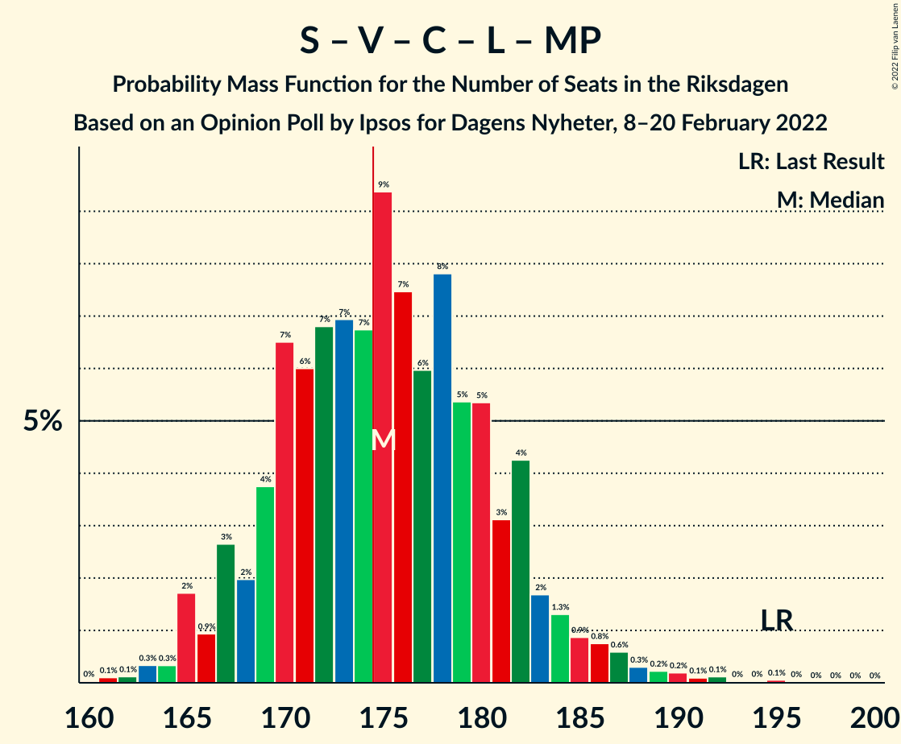

# Opinion Poll by Ipsos for Dagens Nyheter, 8–20 February 2022

<a href="#voting-intentions">Voting Intentions</a> | <a href="#seats">Seats</a> | <a href="#coalitions">Coalitions</a> | <a href="#technical-information">Technical Information</a>

## Voting Intentions

### Confidence Intervals

| Party | Last Result | Poll Result | 80% Confidence Interval | 90% Confidence Interval | 95% Confidence Interval | 99% Confidence Interval |
|:-----:|:-----------:|:-----------:|:-----------------------:|:-----------------------:|:-----------------------:|:-----------------------:|
| Sveriges socialdemokratiska arbetareparti | 28.3% | 29.0% | 27.6–30.4% |27.2–30.8% |26.8–31.2% |26.2–31.9% |
| Moderata samlingspartiet | 19.8% | 21.0% | 19.8–22.4% |19.4–22.7% |19.1–23.1% |18.5–23.7% |
| Sverigedemokraterna | 17.5% | 20.0% | 18.8–21.3% |18.4–21.7% |18.1–22.0% |17.6–22.6% |
| Vänsterpartiet | 8.0% | 10.0% | 9.1–11.0% |8.9–11.3% |8.6–11.5% |8.2–12.0% |
| Centerpartiet | 8.6% | 7.0% | 6.2–7.9% |6.0–8.1% |5.9–8.3% |5.5–8.8% |
| Kristdemokraterna | 6.3% | 5.0% | 4.4–5.8% |4.2–6.0% |4.0–6.2% |3.8–6.5% |
| Liberalerna | 5.5% | 3.0% | 2.5–3.6% |2.4–3.8% |2.3–4.0% |2.1–4.3% |
| Miljöpartiet de gröna | 4.4% | 3.0% | 2.5–3.6% |2.4–3.8% |2.3–4.0% |2.1–4.3% |

*Note:* The poll result column reflects the actual value used in the calculations. Published results may vary slightly, and in addition be rounded to fewer digits.

## Seats

### Confidence Intervals

| Party | Last Result | Median | 80% Confidence Interval | 90% Confidence Interval | 95% Confidence Interval | 99% Confidence Interval |
|:-----:|:-----------:|:------:|:-----------------------:|:-----------------------:|:-----------------------:|:-----------------------:|
| <a href="#sveriges-socialdemokratiska-arbetareparti">Sveriges socialdemokratiska arbetareparti</a> | 100 | 110 | 104–115 |102–117 |101–118 |99–121 |
| <a href="#moderata-samlingspartiet">Moderata samlingspartiet</a> | 70 | 79 | 75–85 |74–86 |72–87 |70–89 |
| <a href="#sverigedemokraterna">Sverigedemokraterna</a> | 62 | 75 | 71–80 |70–82 |69–83 |66–86 |
| <a href="#vänsterpartiet">Vänsterpartiet</a> | 28 | 38 | 34–42 |34–43 |33–44 |31–45 |
| <a href="#centerpartiet">Centerpartiet</a> | 31 | 26 | 24–30 |23–31 |22–31 |21–33 |
| <a href="#kristdemokraterna">Kristdemokraterna</a> | 22 | 19 | 17–22 |16–22 |15–23 |0–24 |
| <a href="#liberalerna">Liberalerna</a> | 20 | 0 | 0 |0 |0–15 |0–16 |
| <a href="#miljöpartiet-de-gröna">Miljöpartiet de gröna</a> | 16 | 0 | 0 |0 |0 |0–16 |

### Sveriges socialdemokratiska arbetareparti

*For a full overview of the results for this party, see the [Sveriges socialdemokratiska arbetareparti](party-sverigessocialdemokratiskaarbetareparti.html) page.*

| Number of Seats | Probability | Accumulated | Special Marks |
|:---------------:|:-----------:|:-----------:|:-------------:|
| 96 | 0% | 100% |  |
| 97 | 0.1% | 99.9% |  |
| 98 | 0.2% | 99.8% |  |
| 99 | 0.4% | 99.6% |  |
| 100 | 0.8% | 99.3% | Last Result |
| 101 | 2% | 98.5% |  |
| 102 | 2% | 97% |  |
| 103 | 3% | 95% |  |
| 104 | 5% | 92% |  |
| 105 | 3% | 87% |  |
| 106 | 3% | 83% |  |
| 107 | 13% | 80% |  |
| 108 | 4% | 68% |  |
| 109 | 7% | 63% |  |
| 110 | 12% | 56% | Median |
| 111 | 11% | 45% |  |
| 112 | 5% | 34% |  |
| 113 | 5% | 29% |  |
| 114 | 11% | 23% |  |
| 115 | 4% | 12% |  |
| 116 | 3% | 8% |  |
| 117 | 2% | 5% |  |
| 118 | 0.9% | 3% |  |
| 119 | 0.7% | 2% |  |
| 120 | 0.7% | 1.4% |  |
| 121 | 0.3% | 0.7% |  |
| 122 | 0.1% | 0.4% |  |
| 123 | 0.1% | 0.2% |  |
| 124 | 0.1% | 0.1% |  |
| 125 | 0% | 0% |  |

### Moderata samlingspartiet

*For a full overview of the results for this party, see the [Moderata samlingspartiet](party-moderatasamlingspartiet.html) page.*

| Number of Seats | Probability | Accumulated | Special Marks |
|:---------------:|:-----------:|:-----------:|:-------------:|
| 67 | 0% | 100% |  |
| 68 | 0.1% | 99.9% |  |
| 69 | 0.2% | 99.9% |  |
| 70 | 0.3% | 99.7% | Last Result |
| 71 | 0.8% | 99.3% |  |
| 72 | 2% | 98.5% |  |
| 73 | 2% | 97% |  |
| 74 | 4% | 95% |  |
| 75 | 5% | 91% |  |
| 76 | 6% | 86% |  |
| 77 | 9% | 80% |  |
| 78 | 12% | 70% |  |
| 79 | 10% | 58% | Median |
| 80 | 14% | 48% |  |
| 81 | 7% | 34% |  |
| 82 | 9% | 27% |  |
| 83 | 5% | 19% |  |
| 84 | 3% | 14% |  |
| 85 | 5% | 10% |  |
| 86 | 2% | 6% |  |
| 87 | 2% | 3% |  |
| 88 | 0.7% | 2% |  |
| 89 | 0.6% | 1.0% |  |
| 90 | 0.2% | 0.5% |  |
| 91 | 0.1% | 0.3% |  |
| 92 | 0.1% | 0.1% |  |
| 93 | 0% | 0.1% |  |
| 94 | 0% | 0% |  |

### Sverigedemokraterna

*For a full overview of the results for this party, see the [Sverigedemokraterna](party-sverigedemokraterna.html) page.*

| Number of Seats | Probability | Accumulated | Special Marks |
|:---------------:|:-----------:|:-----------:|:-------------:|
| 62 | 0% | 100% | Last Result |
| 63 | 0% | 100% |  |
| 64 | 0.1% | 100% |  |
| 65 | 0.2% | 99.9% |  |
| 66 | 0.3% | 99.7% |  |
| 67 | 0.5% | 99.4% |  |
| 68 | 1.1% | 98.8% |  |
| 69 | 2% | 98% |  |
| 70 | 3% | 95% |  |
| 71 | 5% | 92% |  |
| 72 | 7% | 87% |  |
| 73 | 7% | 81% |  |
| 74 | 12% | 74% |  |
| 75 | 12% | 62% | Median |
| 76 | 11% | 50% |  |
| 77 | 9% | 39% |  |
| 78 | 8% | 30% |  |
| 79 | 5% | 22% |  |
| 80 | 7% | 17% |  |
| 81 | 4% | 10% |  |
| 82 | 2% | 6% |  |
| 83 | 2% | 4% |  |
| 84 | 0.8% | 2% |  |
| 85 | 0.5% | 1.1% |  |
| 86 | 0.3% | 0.5% |  |
| 87 | 0.1% | 0.3% |  |
| 88 | 0.1% | 0.1% |  |
| 89 | 0% | 0% |  |

### Vänsterpartiet

*For a full overview of the results for this party, see the [Vänsterpartiet](party-vänsterpartiet.html) page.*

| Number of Seats | Probability | Accumulated | Special Marks |
|:---------------:|:-----------:|:-----------:|:-------------:|
| 28 | 0% | 100% | Last Result |
| 29 | 0% | 100% |  |
| 30 | 0.2% | 99.9% |  |
| 31 | 0.4% | 99.8% |  |
| 32 | 2% | 99.3% |  |
| 33 | 3% | 98% |  |
| 34 | 6% | 95% |  |
| 35 | 9% | 90% |  |
| 36 | 9% | 81% |  |
| 37 | 16% | 71% |  |
| 38 | 14% | 56% | Median |
| 39 | 13% | 41% |  |
| 40 | 10% | 29% |  |
| 41 | 9% | 19% |  |
| 42 | 5% | 10% |  |
| 43 | 3% | 5% |  |
| 44 | 1.4% | 3% |  |
| 45 | 0.7% | 1.1% |  |
| 46 | 0.3% | 0.5% |  |
| 47 | 0.1% | 0.2% |  |
| 48 | 0% | 0.1% |  |
| 49 | 0% | 0% |  |

### Centerpartiet

*For a full overview of the results for this party, see the [Centerpartiet](party-centerpartiet.html) page.*

| Number of Seats | Probability | Accumulated | Special Marks |
|:---------------:|:-----------:|:-----------:|:-------------:|
| 20 | 0.2% | 100% |  |
| 21 | 0.9% | 99.8% |  |
| 22 | 3% | 98.9% |  |
| 23 | 4% | 96% |  |
| 24 | 11% | 92% |  |
| 25 | 11% | 81% |  |
| 26 | 23% | 70% | Median |
| 27 | 15% | 47% |  |
| 28 | 11% | 32% |  |
| 29 | 10% | 21% |  |
| 30 | 5% | 11% |  |
| 31 | 3% | 5% | Last Result |
| 32 | 1.3% | 2% |  |
| 33 | 0.5% | 0.8% |  |
| 34 | 0.2% | 0.3% |  |
| 35 | 0% | 0.1% |  |
| 36 | 0% | 0% |  |

### Kristdemokraterna

*For a full overview of the results for this party, see the [Kristdemokraterna](party-kristdemokraterna.html) page.*

| Number of Seats | Probability | Accumulated | Special Marks |
|:---------------:|:-----------:|:-----------:|:-------------:|
| 0 | 2% | 100% |  |
| 1 | 0% | 98% |  |
| 2 | 0% | 98% |  |
| 3 | 0% | 98% |  |
| 4 | 0% | 98% |  |
| 5 | 0% | 98% |  |
| 6 | 0% | 98% |  |
| 7 | 0% | 98% |  |
| 8 | 0% | 98% |  |
| 9 | 0% | 98% |  |
| 10 | 0% | 98% |  |
| 11 | 0% | 98% |  |
| 12 | 0% | 98% |  |
| 13 | 0% | 98% |  |
| 14 | 0% | 98% |  |
| 15 | 1.3% | 98% |  |
| 16 | 6% | 97% |  |
| 17 | 11% | 91% |  |
| 18 | 17% | 79% |  |
| 19 | 24% | 62% | Median |
| 20 | 18% | 39% |  |
| 21 | 10% | 20% |  |
| 22 | 6% | 10% | Last Result |
| 23 | 3% | 5% |  |
| 24 | 1.2% | 2% |  |
| 25 | 0.3% | 0.4% |  |
| 26 | 0.1% | 0.1% |  |
| 27 | 0% | 0% |  |

### Liberalerna

*For a full overview of the results for this party, see the [Liberalerna](party-liberalerna.html) page.*

| Number of Seats | Probability | Accumulated | Special Marks |
|:---------------:|:-----------:|:-----------:|:-------------:|
| 0 | 97% | 100% | Median |
| 1 | 0% | 3% |  |
| 2 | 0% | 3% |  |
| 3 | 0% | 3% |  |
| 4 | 0% | 3% |  |
| 5 | 0% | 3% |  |
| 6 | 0% | 3% |  |
| 7 | 0% | 3% |  |
| 8 | 0% | 3% |  |
| 9 | 0% | 3% |  |
| 10 | 0% | 3% |  |
| 11 | 0% | 3% |  |
| 12 | 0% | 3% |  |
| 13 | 0% | 3% |  |
| 14 | 0% | 3% |  |
| 15 | 2% | 3% |  |
| 16 | 1.0% | 1.0% |  |
| 17 | 0% | 0% |  |
| 18 | 0% | 0% |  |
| 19 | 0% | 0% |  |
| 20 | 0% | 0% | Last Result |

### Miljöpartiet de gröna

*For a full overview of the results for this party, see the [Miljöpartiet de gröna](party-miljöpartietdegröna.html) page.*

| Number of Seats | Probability | Accumulated | Special Marks |
|:---------------:|:-----------:|:-----------:|:-------------:|
| 0 | 98% | 100% | Median |
| 1 | 0% | 2% |  |
| 2 | 0% | 2% |  |
| 3 | 0% | 2% |  |
| 4 | 0% | 2% |  |
| 5 | 0% | 2% |  |
| 6 | 0% | 2% |  |
| 7 | 0% | 2% |  |
| 8 | 0% | 2% |  |
| 9 | 0% | 2% |  |
| 10 | 0% | 2% |  |
| 11 | 0% | 2% |  |
| 12 | 0% | 2% |  |
| 13 | 0% | 2% |  |
| 14 | 0% | 2% |  |
| 15 | 2% | 2% |  |
| 16 | 0.7% | 0.8% | Last Result |
| 17 | 0.1% | 0.1% |  |
| 18 | 0% | 0% |  |

## Coalitions

### Confidence Intervals

| Coalition | Last Result | Median | Majority? | 80% Confidence Interval | 90% Confidence Interval | 95% Confidence Interval | 99% Confidence Interval |
|:---------:|:-----------:|:------:|:---------:|:-----------------------:|:-----------------------:|:-----------------------:|:-----------------------:|
| Sveriges socialdemokratiska arbetareparti – Moderata samlingspartiet – Centerpartiet | 201 | 216 | 100% | 210–222 | 208–224 | 205–225 | 201–230 |
| Sveriges socialdemokratiska arbetareparti – Moderata samlingspartiet | 170 | 190 | 99.8% | 183–195 | 181–197 | 179–199 | 176–204 |
| Sveriges socialdemokratiska arbetareparti – Vänsterpartiet – Centerpartiet – Liberalerna – Miljöpartiet de gröna | 195 | 175 | 55% | 169–182 | 167–183 | 165–185 | 163–190 |
| Moderata samlingspartiet – Sverigedemokraterna – Kristdemokraterna | 154 | 174 | 45% | 167–180 | 166–182 | 164–184 | 159–186 |
| Moderata samlingspartiet – Sverigedemokraterna | 132 | 155 | 0% | 149–161 | 147–163 | 145–165 | 142–169 |
| Sveriges socialdemokratiska arbetareparti – Vänsterpartiet – Miljöpartiet de gröna | 144 | 148 | 0% | 142–154 | 140–156 | 139–158 | 136–162 |
| Sveriges socialdemokratiska arbetareparti – Vänsterpartiet | 128 | 148 | 0% | 142–154 | 140–155 | 138–156 | 135–160 |
| Sveriges socialdemokratiska arbetareparti – Centerpartiet – Liberalerna – Miljöpartiet de gröna | 167 | 137 | 0% | 131–144 | 130–146 | 128–148 | 125–152 |
| Moderata samlingspartiet – Centerpartiet – Kristdemokraterna – Liberalerna | 143 | 125 | 0% | 120–130 | 118–133 | 116–135 | 110–139 |
| Moderata samlingspartiet – Centerpartiet – Kristdemokraterna | 123 | 125 | 0% | 120–130 | 118–132 | 115–133 | 110–137 |
| Sveriges socialdemokratiska arbetareparti – Miljöpartiet de gröna | 116 | 110 | 0% | 104–116 | 103–117 | 101–120 | 99–124 |
| Moderata samlingspartiet – Centerpartiet – Liberalerna | 121 | 106 | 0% | 101–112 | 100–114 | 99–116 | 96–121 |
| Moderata samlingspartiet – Centerpartiet | 101 | 106 | 0% | 101–111 | 99–113 | 98–114 | 95–117 |

### Sveriges socialdemokratiska arbetareparti – Moderata samlingspartiet – Centerpartiet

| Number of Seats | Probability | Accumulated | Special Marks |
|:---------------:|:-----------:|:-----------:|:-------------:|
| 197 | 0% | 100% |  |
| 198 | 0.1% | 99.9% |  |
| 199 | 0.1% | 99.9% |  |
| 200 | 0.1% | 99.8% |  |
| 201 | 0.2% | 99.6% | Last Result |
| 202 | 0.3% | 99.5% |  |
| 203 | 0.4% | 99.1% |  |
| 204 | 0.6% | 98.7% |  |
| 205 | 0.8% | 98% |  |
| 206 | 1.1% | 97% |  |
| 207 | 1.1% | 96% |  |
| 208 | 2% | 95% |  |
| 209 | 3% | 93% |  |
| 210 | 5% | 91% |  |
| 211 | 5% | 86% |  |
| 212 | 3% | 81% |  |
| 213 | 8% | 77% |  |
| 214 | 7% | 69% |  |
| 215 | 10% | 62% | Median |
| 216 | 7% | 52% |  |
| 217 | 8% | 45% |  |
| 218 | 11% | 37% |  |
| 219 | 7% | 26% |  |
| 220 | 4% | 19% |  |
| 221 | 3% | 16% |  |
| 222 | 5% | 12% |  |
| 223 | 2% | 7% |  |
| 224 | 2% | 5% |  |
| 225 | 1.3% | 4% |  |
| 226 | 0.7% | 2% |  |
| 227 | 0.4% | 2% |  |
| 228 | 0.4% | 1.3% |  |
| 229 | 0.2% | 0.9% |  |
| 230 | 0.3% | 0.7% |  |
| 231 | 0% | 0.4% |  |
| 232 | 0.1% | 0.4% |  |
| 233 | 0.1% | 0.3% |  |
| 234 | 0.1% | 0.2% |  |
| 235 | 0% | 0.1% |  |
| 236 | 0% | 0.1% |  |
| 237 | 0% | 0.1% |  |
| 238 | 0% | 0.1% |  |
| 239 | 0% | 0% |  |

### Sveriges socialdemokratiska arbetareparti – Moderata samlingspartiet

| Number of Seats | Probability | Accumulated | Special Marks |
|:---------------:|:-----------:|:-----------:|:-------------:|
| 170 | 0% | 100% | Last Result |
| 171 | 0% | 100% |  |
| 172 | 0.1% | 100% |  |
| 173 | 0% | 99.9% |  |
| 174 | 0.1% | 99.9% |  |
| 175 | 0.2% | 99.8% | Majority |
| 176 | 0.3% | 99.5% |  |
| 177 | 0.4% | 99.2% |  |
| 178 | 0.8% | 98.8% |  |
| 179 | 1.1% | 98% |  |
| 180 | 1.1% | 97% |  |
| 181 | 1.3% | 96% |  |
| 182 | 3% | 95% |  |
| 183 | 4% | 91% |  |
| 184 | 5% | 87% |  |
| 185 | 4% | 82% |  |
| 186 | 6% | 78% |  |
| 187 | 6% | 72% |  |
| 188 | 5% | 66% |  |
| 189 | 10% | 61% | Median |
| 190 | 10% | 51% |  |
| 191 | 9% | 41% |  |
| 192 | 10% | 31% |  |
| 193 | 4% | 22% |  |
| 194 | 6% | 17% |  |
| 195 | 2% | 11% |  |
| 196 | 3% | 9% |  |
| 197 | 2% | 6% |  |
| 198 | 2% | 4% |  |
| 199 | 0.7% | 3% |  |
| 200 | 0.6% | 2% |  |
| 201 | 0.5% | 1.2% |  |
| 202 | 0.1% | 0.7% |  |
| 203 | 0.1% | 0.6% |  |
| 204 | 0.2% | 0.5% |  |
| 205 | 0.1% | 0.3% |  |
| 206 | 0% | 0.2% |  |
| 207 | 0% | 0.1% |  |
| 208 | 0% | 0.1% |  |
| 209 | 0% | 0.1% |  |
| 210 | 0% | 0% |  |

### Sveriges socialdemokratiska arbetareparti – Vänsterpartiet – Centerpartiet – Liberalerna – Miljöpartiet de gröna

| Number of Seats | Probability | Accumulated | Special Marks |
|:---------------:|:-----------:|:-----------:|:-------------:|
| 160 | 0% | 100% |  |
| 161 | 0.1% | 99.9% |  |
| 162 | 0.1% | 99.8% |  |
| 163 | 0.3% | 99.7% |  |
| 164 | 0.3% | 99.4% |  |
| 165 | 2% | 99.0% |  |
| 166 | 0.9% | 97% |  |
| 167 | 3% | 96% |  |
| 168 | 2% | 94% |  |
| 169 | 4% | 92% |  |
| 170 | 7% | 88% |  |
| 171 | 6% | 82% |  |
| 172 | 7% | 76% |  |
| 173 | 7% | 69% |  |
| 174 | 7% | 62% | Median |
| 175 | 9% | 55% | Majority |
| 176 | 7% | 46% |  |
| 177 | 6% | 38% |  |
| 178 | 8% | 32% |  |
| 179 | 5% | 24% |  |
| 180 | 5% | 19% |  |
| 181 | 3% | 14% |  |
| 182 | 4% | 11% |  |
| 183 | 2% | 6% |  |
| 184 | 1.3% | 5% |  |
| 185 | 0.9% | 3% |  |
| 186 | 0.8% | 2% |  |
| 187 | 0.6% | 2% |  |
| 188 | 0.3% | 1.1% |  |
| 189 | 0.2% | 0.8% |  |
| 190 | 0.2% | 0.6% |  |
| 191 | 0.1% | 0.4% |  |
| 192 | 0.1% | 0.3% |  |
| 193 | 0% | 0.2% |  |
| 194 | 0% | 0.1% |  |
| 195 | 0.1% | 0.1% | Last Result |
| 196 | 0% | 0% |  |

### Moderata samlingspartiet – Sverigedemokraterna – Kristdemokraterna

| Number of Seats | Probability | Accumulated | Special Marks |
|:---------------:|:-----------:|:-----------:|:-------------:|
| 154 | 0.1% | 100% | Last Result |
| 155 | 0% | 99.9% |  |
| 156 | 0% | 99.9% |  |
| 157 | 0.1% | 99.8% |  |
| 158 | 0.1% | 99.7% |  |
| 159 | 0.2% | 99.6% |  |
| 160 | 0.2% | 99.4% |  |
| 161 | 0.3% | 99.2% |  |
| 162 | 0.6% | 98.9% |  |
| 163 | 0.8% | 98% |  |
| 164 | 0.9% | 98% |  |
| 165 | 1.3% | 97% |  |
| 166 | 2% | 95% |  |
| 167 | 4% | 94% |  |
| 168 | 3% | 89% |  |
| 169 | 5% | 86% |  |
| 170 | 5% | 81% |  |
| 171 | 8% | 76% |  |
| 172 | 6% | 68% |  |
| 173 | 7% | 62% | Median |
| 174 | 9% | 54% |  |
| 175 | 7% | 45% | Majority |
| 176 | 7% | 38% |  |
| 177 | 7% | 31% |  |
| 178 | 6% | 24% |  |
| 179 | 7% | 18% |  |
| 180 | 4% | 12% |  |
| 181 | 2% | 8% |  |
| 182 | 3% | 6% |  |
| 183 | 0.9% | 4% |  |
| 184 | 2% | 3% |  |
| 185 | 0.3% | 1.0% |  |
| 186 | 0.3% | 0.6% |  |
| 187 | 0.1% | 0.3% |  |
| 188 | 0.1% | 0.2% |  |
| 189 | 0% | 0.1% |  |
| 190 | 0% | 0% |  |

### Moderata samlingspartiet – Sverigedemokraterna

| Number of Seats | Probability | Accumulated | Special Marks |
|:---------------:|:-----------:|:-----------:|:-------------:|
| 132 | 0% | 100% | Last Result |
| 133 | 0% | 100% |  |
| 134 | 0% | 100% |  |
| 135 | 0% | 100% |  |
| 136 | 0% | 100% |  |
| 137 | 0% | 100% |  |
| 138 | 0% | 100% |  |
| 139 | 0% | 100% |  |
| 140 | 0.1% | 99.9% |  |
| 141 | 0.1% | 99.8% |  |
| 142 | 0.2% | 99.7% |  |
| 143 | 0.4% | 99.5% |  |
| 144 | 0.6% | 99.1% |  |
| 145 | 1.1% | 98.6% |  |
| 146 | 1.2% | 97% |  |
| 147 | 2% | 96% |  |
| 148 | 2% | 94% |  |
| 149 | 5% | 92% |  |
| 150 | 5% | 87% |  |
| 151 | 4% | 82% |  |
| 152 | 11% | 78% |  |
| 153 | 6% | 67% |  |
| 154 | 8% | 62% | Median |
| 155 | 8% | 54% |  |
| 156 | 9% | 47% |  |
| 157 | 7% | 37% |  |
| 158 | 4% | 30% |  |
| 159 | 7% | 26% |  |
| 160 | 6% | 19% |  |
| 161 | 3% | 13% |  |
| 162 | 3% | 10% |  |
| 163 | 2% | 6% |  |
| 164 | 2% | 4% |  |
| 165 | 0.9% | 3% |  |
| 166 | 0.7% | 2% |  |
| 167 | 0.3% | 1.2% |  |
| 168 | 0.3% | 0.9% |  |
| 169 | 0.4% | 0.6% |  |
| 170 | 0.1% | 0.3% |  |
| 171 | 0.1% | 0.2% |  |
| 172 | 0% | 0.1% |  |
| 173 | 0% | 0.1% |  |
| 174 | 0.1% | 0.1% |  |
| 175 | 0% | 0% | Majority |

### Sveriges socialdemokratiska arbetareparti – Vänsterpartiet – Miljöpartiet de gröna

| Number of Seats | Probability | Accumulated | Special Marks |
|:---------------:|:-----------:|:-----------:|:-------------:|
| 132 | 0% | 100% |  |
| 133 | 0.1% | 99.9% |  |
| 134 | 0.1% | 99.9% |  |
| 135 | 0.2% | 99.8% |  |
| 136 | 0.4% | 99.6% |  |
| 137 | 0.4% | 99.2% |  |
| 138 | 0.8% | 98.8% |  |
| 139 | 1.3% | 98% |  |
| 140 | 3% | 97% |  |
| 141 | 2% | 94% |  |
| 142 | 4% | 92% |  |
| 143 | 3% | 88% |  |
| 144 | 8% | 85% | Last Result |
| 145 | 6% | 77% |  |
| 146 | 6% | 70% |  |
| 147 | 7% | 65% |  |
| 148 | 11% | 58% | Median |
| 149 | 8% | 47% |  |
| 150 | 7% | 39% |  |
| 151 | 7% | 32% |  |
| 152 | 9% | 25% |  |
| 153 | 4% | 16% |  |
| 154 | 4% | 12% |  |
| 155 | 2% | 8% |  |
| 156 | 3% | 6% |  |
| 157 | 0.9% | 3% |  |
| 158 | 0.7% | 3% |  |
| 159 | 0.6% | 2% |  |
| 160 | 0.5% | 1.2% |  |
| 161 | 0.2% | 0.7% |  |
| 162 | 0.2% | 0.5% |  |
| 163 | 0.1% | 0.4% |  |
| 164 | 0.1% | 0.2% |  |
| 165 | 0.1% | 0.1% |  |
| 166 | 0% | 0.1% |  |
| 167 | 0% | 0% |  |

### Sveriges socialdemokratiska arbetareparti – Vänsterpartiet

| Number of Seats | Probability | Accumulated | Special Marks |
|:---------------:|:-----------:|:-----------:|:-------------:|
| 128 | 0% | 100% | Last Result |
| 129 | 0% | 100% |  |
| 130 | 0% | 100% |  |
| 131 | 0% | 100% |  |
| 132 | 0% | 99.9% |  |
| 133 | 0.1% | 99.9% |  |
| 134 | 0.1% | 99.8% |  |
| 135 | 0.3% | 99.7% |  |
| 136 | 0.4% | 99.4% |  |
| 137 | 0.5% | 99.0% |  |
| 138 | 1.1% | 98.5% |  |
| 139 | 2% | 97% |  |
| 140 | 3% | 96% |  |
| 141 | 2% | 93% |  |
| 142 | 4% | 91% |  |
| 143 | 3% | 87% |  |
| 144 | 8% | 83% |  |
| 145 | 7% | 75% |  |
| 146 | 6% | 68% |  |
| 147 | 7% | 62% |  |
| 148 | 11% | 55% | Median |
| 149 | 8% | 45% |  |
| 150 | 7% | 37% |  |
| 151 | 7% | 30% |  |
| 152 | 9% | 23% |  |
| 153 | 3% | 14% |  |
| 154 | 3% | 10% |  |
| 155 | 2% | 7% |  |
| 156 | 3% | 5% |  |
| 157 | 0.7% | 2% |  |
| 158 | 0.5% | 2% |  |
| 159 | 0.4% | 1.0% |  |
| 160 | 0.2% | 0.6% |  |
| 161 | 0.1% | 0.4% |  |
| 162 | 0.1% | 0.3% |  |
| 163 | 0.1% | 0.2% |  |
| 164 | 0% | 0.1% |  |
| 165 | 0% | 0.1% |  |
| 166 | 0% | 0% |  |

### Sveriges socialdemokratiska arbetareparti – Centerpartiet – Liberalerna – Miljöpartiet de gröna

| Number of Seats | Probability | Accumulated | Special Marks |
|:---------------:|:-----------:|:-----------:|:-------------:|
| 122 | 0% | 100% |  |
| 123 | 0.1% | 99.9% |  |
| 124 | 0.1% | 99.9% |  |
| 125 | 0.3% | 99.7% |  |
| 126 | 0.4% | 99.5% |  |
| 127 | 1.2% | 99.1% |  |
| 128 | 1.2% | 98% |  |
| 129 | 2% | 97% |  |
| 130 | 3% | 95% |  |
| 131 | 4% | 92% |  |
| 132 | 5% | 88% |  |
| 133 | 8% | 83% |  |
| 134 | 7% | 75% |  |
| 135 | 6% | 68% |  |
| 136 | 10% | 62% | Median |
| 137 | 7% | 52% |  |
| 138 | 6% | 45% |  |
| 139 | 8% | 39% |  |
| 140 | 8% | 31% |  |
| 141 | 5% | 24% |  |
| 142 | 6% | 19% |  |
| 143 | 3% | 13% |  |
| 144 | 3% | 10% |  |
| 145 | 2% | 7% |  |
| 146 | 2% | 5% |  |
| 147 | 1.1% | 4% |  |
| 148 | 0.6% | 3% |  |
| 149 | 0.6% | 2% |  |
| 150 | 0.4% | 1.4% |  |
| 151 | 0.2% | 1.0% |  |
| 152 | 0.4% | 0.8% |  |
| 153 | 0.1% | 0.4% |  |
| 154 | 0.1% | 0.3% |  |
| 155 | 0.1% | 0.2% |  |
| 156 | 0% | 0.1% |  |
| 157 | 0% | 0.1% |  |
| 158 | 0% | 0% |  |
| 159 | 0% | 0% |  |
| 160 | 0% | 0% |  |
| 161 | 0% | 0% |  |
| 162 | 0% | 0% |  |
| 163 | 0% | 0% |  |
| 164 | 0% | 0% |  |
| 165 | 0% | 0% |  |
| 166 | 0% | 0% |  |
| 167 | 0% | 0% | Last Result |

### Moderata samlingspartiet – Centerpartiet – Kristdemokraterna – Liberalerna

| Number of Seats | Probability | Accumulated | Special Marks |
|:---------------:|:-----------:|:-----------:|:-------------:|
| 103 | 0% | 100% |  |
| 104 | 0% | 99.9% |  |
| 105 | 0% | 99.9% |  |
| 106 | 0% | 99.9% |  |
| 107 | 0% | 99.8% |  |
| 108 | 0.1% | 99.8% |  |
| 109 | 0.1% | 99.7% |  |
| 110 | 0.2% | 99.6% |  |
| 111 | 0.1% | 99.5% |  |
| 112 | 0.3% | 99.4% |  |
| 113 | 0.2% | 99.1% |  |
| 114 | 0.5% | 98.9% |  |
| 115 | 0.6% | 98% |  |
| 116 | 0.6% | 98% |  |
| 117 | 1.0% | 97% |  |
| 118 | 2% | 96% |  |
| 119 | 3% | 94% |  |
| 120 | 3% | 92% |  |
| 121 | 5% | 89% |  |
| 122 | 7% | 84% |  |
| 123 | 10% | 76% |  |
| 124 | 12% | 66% | Median |
| 125 | 7% | 54% |  |
| 126 | 12% | 47% |  |
| 127 | 10% | 35% |  |
| 128 | 7% | 25% |  |
| 129 | 5% | 19% |  |
| 130 | 3% | 13% |  |
| 131 | 3% | 10% |  |
| 132 | 2% | 7% |  |
| 133 | 1.3% | 5% |  |
| 134 | 1.2% | 4% |  |
| 135 | 0.9% | 3% |  |
| 136 | 0.5% | 2% |  |
| 137 | 0.5% | 1.3% |  |
| 138 | 0.3% | 0.9% |  |
| 139 | 0.2% | 0.5% |  |
| 140 | 0.1% | 0.4% |  |
| 141 | 0.1% | 0.3% |  |
| 142 | 0.1% | 0.2% |  |
| 143 | 0.1% | 0.1% | Last Result |
| 144 | 0% | 0.1% |  |
| 145 | 0% | 0% |  |

### Moderata samlingspartiet – Centerpartiet – Kristdemokraterna

| Number of Seats | Probability | Accumulated | Special Marks |
|:---------------:|:-----------:|:-----------:|:-------------:|
| 103 | 0% | 100% |  |
| 104 | 0% | 99.9% |  |
| 105 | 0% | 99.9% |  |
| 106 | 0% | 99.8% |  |
| 107 | 0.1% | 99.8% |  |
| 108 | 0.1% | 99.7% |  |
| 109 | 0.1% | 99.7% |  |
| 110 | 0.2% | 99.6% |  |
| 111 | 0.1% | 99.4% |  |
| 112 | 0.3% | 99.2% |  |
| 113 | 0.3% | 99.0% |  |
| 114 | 0.5% | 98.7% |  |
| 115 | 0.7% | 98% |  |
| 116 | 1.0% | 97% |  |
| 117 | 1.2% | 96% |  |
| 118 | 2% | 95% |  |
| 119 | 3% | 93% |  |
| 120 | 3% | 90% |  |
| 121 | 5% | 87% |  |
| 122 | 8% | 82% |  |
| 123 | 10% | 74% | Last Result |
| 124 | 12% | 64% | Median |
| 125 | 7% | 52% |  |
| 126 | 12% | 44% |  |
| 127 | 10% | 33% |  |
| 128 | 7% | 23% |  |
| 129 | 5% | 16% |  |
| 130 | 3% | 11% |  |
| 131 | 2% | 8% |  |
| 132 | 2% | 5% |  |
| 133 | 1.0% | 3% |  |
| 134 | 0.8% | 2% |  |
| 135 | 0.7% | 2% |  |
| 136 | 0.3% | 0.8% |  |
| 137 | 0.2% | 0.5% |  |
| 138 | 0.2% | 0.3% |  |
| 139 | 0.1% | 0.1% |  |
| 140 | 0% | 0.1% |  |
| 141 | 0% | 0% |  |

### Sveriges socialdemokratiska arbetareparti – Miljöpartiet de gröna

| Number of Seats | Probability | Accumulated | Special Marks |
|:---------------:|:-----------:|:-----------:|:-------------:|
| 96 | 0% | 100% |  |
| 97 | 0.1% | 99.9% |  |
| 98 | 0.1% | 99.9% |  |
| 99 | 0.3% | 99.7% |  |
| 100 | 0.6% | 99.4% |  |
| 101 | 2% | 98.8% |  |
| 102 | 2% | 97% |  |
| 103 | 3% | 95% |  |
| 104 | 5% | 93% |  |
| 105 | 3% | 88% |  |
| 106 | 3% | 85% |  |
| 107 | 13% | 82% |  |
| 108 | 4% | 70% |  |
| 109 | 7% | 65% |  |
| 110 | 12% | 59% | Median |
| 111 | 11% | 47% |  |
| 112 | 5% | 36% |  |
| 113 | 5% | 31% |  |
| 114 | 12% | 26% |  |
| 115 | 4% | 14% |  |
| 116 | 3% | 10% | Last Result |
| 117 | 2% | 7% |  |
| 118 | 1.2% | 5% |  |
| 119 | 1.2% | 4% |  |
| 120 | 0.9% | 3% |  |
| 121 | 0.4% | 2% |  |
| 122 | 0.4% | 1.2% |  |
| 123 | 0.2% | 0.7% |  |
| 124 | 0.1% | 0.5% |  |
| 125 | 0.1% | 0.4% |  |
| 126 | 0.2% | 0.4% |  |
| 127 | 0.1% | 0.2% |  |
| 128 | 0% | 0.1% |  |
| 129 | 0% | 0.1% |  |
| 130 | 0% | 0% |  |

### Moderata samlingspartiet – Centerpartiet – Liberalerna

| Number of Seats | Probability | Accumulated | Special Marks |
|:---------------:|:-----------:|:-----------:|:-------------:|
| 93 | 0% | 100% |  |
| 94 | 0.1% | 99.9% |  |
| 95 | 0.3% | 99.8% |  |
| 96 | 0.3% | 99.6% |  |
| 97 | 0.8% | 99.3% |  |
| 98 | 0.9% | 98% |  |
| 99 | 2% | 98% |  |
| 100 | 3% | 96% |  |
| 101 | 4% | 93% |  |
| 102 | 6% | 89% |  |
| 103 | 7% | 83% |  |
| 104 | 12% | 76% |  |
| 105 | 5% | 64% | Median |
| 106 | 16% | 58% |  |
| 107 | 7% | 43% |  |
| 108 | 8% | 36% |  |
| 109 | 8% | 28% |  |
| 110 | 4% | 20% |  |
| 111 | 4% | 16% |  |
| 112 | 4% | 12% |  |
| 113 | 2% | 8% |  |
| 114 | 1.4% | 6% |  |
| 115 | 1.3% | 4% |  |
| 116 | 0.8% | 3% |  |
| 117 | 0.7% | 2% |  |
| 118 | 0.4% | 2% |  |
| 119 | 0.3% | 1.1% |  |
| 120 | 0.2% | 0.8% |  |
| 121 | 0.2% | 0.5% | Last Result |
| 122 | 0.1% | 0.3% |  |
| 123 | 0.1% | 0.3% |  |
| 124 | 0% | 0.2% |  |
| 125 | 0.1% | 0.1% |  |
| 126 | 0% | 0.1% |  |
| 127 | 0% | 0% |  |

### Moderata samlingspartiet – Centerpartiet

| Number of Seats | Probability | Accumulated | Special Marks |
|:---------------:|:-----------:|:-----------:|:-------------:|
| 92 | 0% | 100% |  |
| 93 | 0.1% | 99.9% |  |
| 94 | 0.1% | 99.9% |  |
| 95 | 0.3% | 99.7% |  |
| 96 | 0.4% | 99.4% |  |
| 97 | 1.0% | 99.0% |  |
| 98 | 1.1% | 98% |  |
| 99 | 2% | 97% |  |
| 100 | 3% | 95% |  |
| 101 | 4% | 92% | Last Result |
| 102 | 6% | 88% |  |
| 103 | 7% | 82% |  |
| 104 | 13% | 74% |  |
| 105 | 5% | 62% | Median |
| 106 | 16% | 56% |  |
| 107 | 7% | 41% |  |
| 108 | 8% | 33% |  |
| 109 | 8% | 25% |  |
| 110 | 4% | 18% |  |
| 111 | 4% | 13% |  |
| 112 | 3% | 9% |  |
| 113 | 2% | 6% |  |
| 114 | 1.1% | 4% |  |
| 115 | 1.1% | 2% |  |
| 116 | 0.5% | 1.4% |  |
| 117 | 0.5% | 1.0% |  |
| 118 | 0.2% | 0.5% |  |
| 119 | 0.1% | 0.3% |  |
| 120 | 0.1% | 0.2% |  |
| 121 | 0.1% | 0.1% |  |
| 122 | 0% | 0% |  |

## Technical Information

### Opinion Poll

+ **Polling firm:** Ipsos
+ **Commissioner(s):** Dagens Nyheter
+ **Fieldwork period:** 8–20 February 2022

### Calculations

+ **Sample size:** 1660
+ **Simulations done:** 1,048,576
+ **Error estimate:** 0.69%

