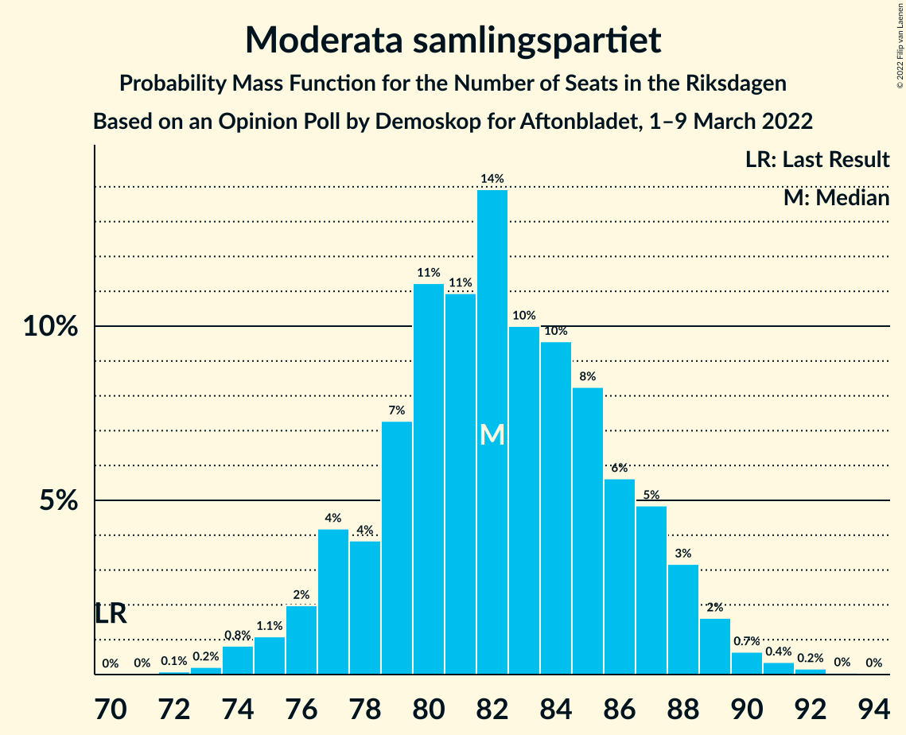
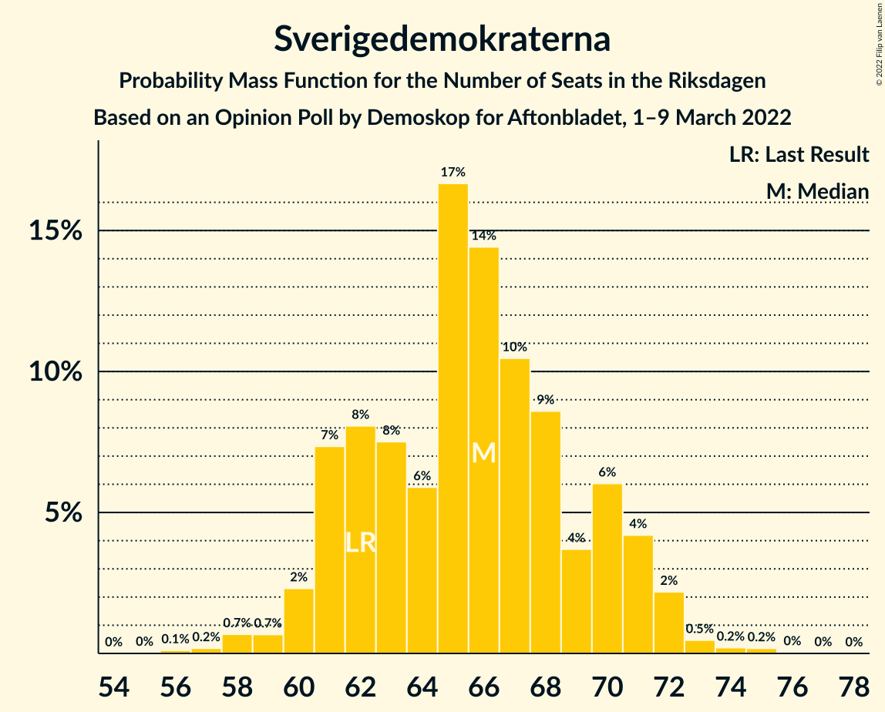
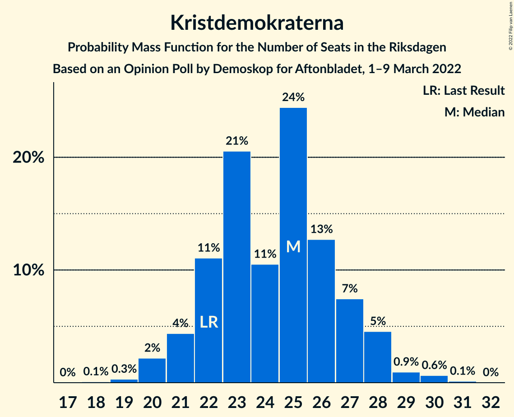
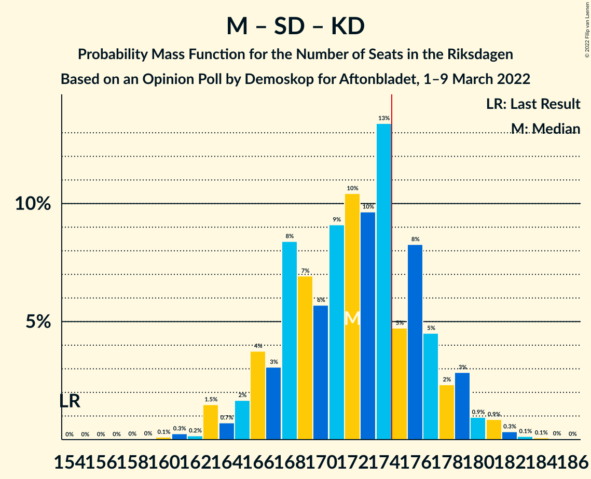
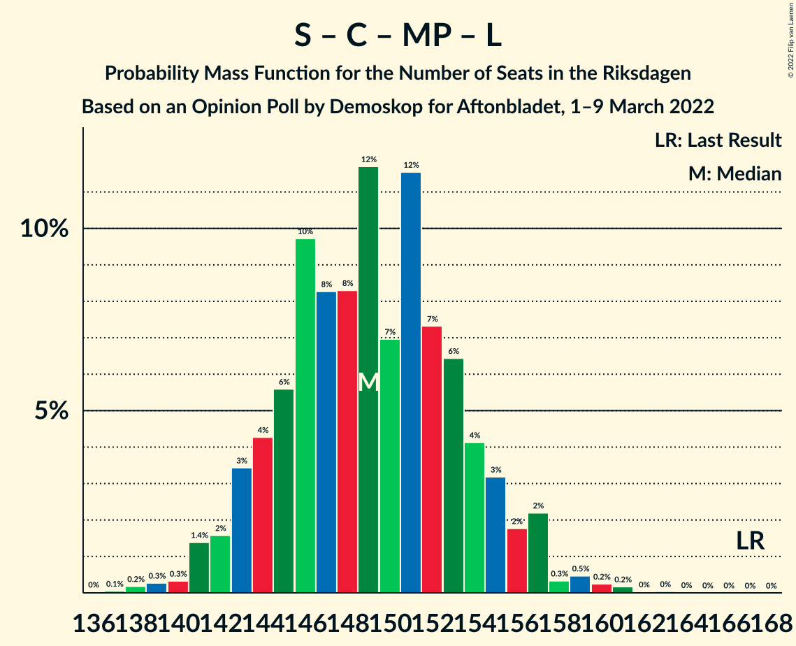
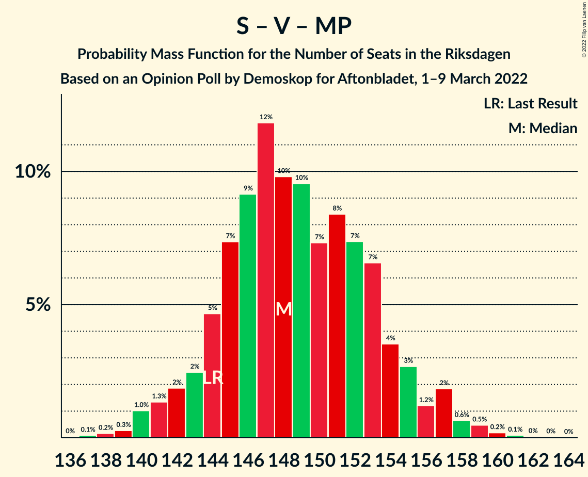

# Opinion Poll by Demoskop for Aftonbladet, 1–9 March 2022

<a href="#voting-intentions">Voting Intentions</a> | <a href="#seats">Seats</a> | <a href="#coalitions">Coalitions</a> | <a href="#technical-information">Technical Information</a>

## Voting Intentions

### Confidence Intervals

| Party | Last Result | Poll Result | 80% Confidence Interval | 90% Confidence Interval | 95% Confidence Interval | 99% Confidence Interval |
|:-----:|:-----------:|:-----------:|:-----------------------:|:-----------------------:|:-----------------------:|:-----------------------:|
| Sveriges socialdemokratiska arbetareparti | 28.3% | 32.4% | 31.1–33.7% |30.8–34.1% |30.5–34.4% |29.9–35.1% |
| Moderata samlingspartiet | 19.8% | 22.0% | 20.9–23.2% |20.5–23.5% |20.3–23.8% |19.8–24.3% |
| Sverigedemokraterna | 17.5% | 17.5% | 16.5–18.6% |16.2–18.9% |16.0–19.2% |15.5–19.7% |
| Centerpartiet | 8.6% | 7.5% | 6.8–8.3% |6.6–8.5% |6.5–8.7% |6.1–9.1% |
| Vänsterpartiet | 8.0% | 7.4% | 6.7–8.2% |6.5–8.4% |6.4–8.6% |6.1–9.0% |
| Kristdemokraterna | 6.3% | 6.5% | 5.9–7.2% |5.7–7.4% |5.5–7.6% |5.2–8.0% |
| Miljöpartiet de gröna | 4.4% | 2.9% | 2.5–3.4% |2.4–3.6% |2.3–3.7% |2.1–4.0% |
| Liberalerna | 5.5% | 2.2% | 1.8–2.7% |1.8–2.8% |1.7–2.9% |1.5–3.2% |

*Note:* The poll result column reflects the actual value used in the calculations. Published results may vary slightly, and in addition be rounded to fewer digits.

## Seats

### Confidence Intervals

| Party | Last Result | Median | 80% Confidence Interval | 90% Confidence Interval | 95% Confidence Interval | 99% Confidence Interval |
|:-----:|:-----------:|:------:|:-----------------------:|:-----------------------:|:-----------------------:|:-----------------------:|
| <a href="#sveriges-socialdemokratiska-arbetareparti">Sveriges socialdemokratiska arbetareparti</a> | 100 | 121 | 116–126 |115–127 |114–128 |112–131 |
| <a href="#moderata-samlingspartiet">Moderata samlingspartiet</a> | 70 | 82 | 78–87 |77–88 |76–89 |74–91 |
| <a href="#sverigedemokraterna">Sverigedemokraterna</a> | 62 | 66 | 61–70 |61–71 |60–72 |58–73 |
| <a href="#centerpartiet">Centerpartiet</a> | 31 | 28 | 25–31 |25–32 |24–32 |23–34 |
| <a href="#vänsterpartiet">Vänsterpartiet</a> | 28 | 27 | 25–30 |24–31 |24–32 |23–33 |
| <a href="#kristdemokraterna">Kristdemokraterna</a> | 22 | 25 | 22–27 |21–28 |20–28 |20–30 |
| <a href="#miljöpartiet-de-gröna">Miljöpartiet de gröna</a> | 16 | 0 | 0 |0 |0 |0 |
| <a href="#liberalerna">Liberalerna</a> | 20 | 0 | 0 |0 |0 |0 |

### Sveriges socialdemokratiska arbetareparti

*For a full overview of the results for this party, see the [Sveriges socialdemokratiska arbetareparti](party-sverigessocialdemokratiskaarbetareparti.html) page.*

| Number of Seats | Probability | Accumulated | Special Marks |
|:---------------:|:-----------:|:-----------:|:-------------:|
| 100 | 0% | 100% | Last Result |
| 101 | 0% | 100% |  |
| 102 | 0% | 100% |  |
| 103 | 0% | 100% |  |
| 104 | 0% | 100% |  |
| 105 | 0% | 100% |  |
| 106 | 0% | 100% |  |
| 107 | 0% | 100% |  |
| 108 | 0% | 100% |  |
| 109 | 0.1% | 100% |  |
| 110 | 0.1% | 99.9% |  |
| 111 | 0.3% | 99.8% |  |
| 112 | 0.6% | 99.5% |  |
| 113 | 0.9% | 98.9% |  |
| 114 | 1.5% | 98% |  |
| 115 | 3% | 97% |  |
| 116 | 4% | 93% |  |
| 117 | 8% | 89% |  |
| 118 | 8% | 82% |  |
| 119 | 9% | 74% |  |
| 120 | 10% | 65% |  |
| 121 | 11% | 54% | Median |
| 122 | 11% | 43% |  |
| 123 | 9% | 33% |  |
| 124 | 7% | 24% |  |
| 125 | 6% | 17% |  |
| 126 | 3% | 11% |  |
| 127 | 4% | 9% |  |
| 128 | 2% | 4% |  |
| 129 | 1.0% | 2% |  |
| 130 | 0.6% | 1.2% |  |
| 131 | 0.3% | 0.6% |  |
| 132 | 0.2% | 0.3% |  |
| 133 | 0.1% | 0.1% |  |
| 134 | 0% | 0% |  |

### Moderata samlingspartiet

*For a full overview of the results for this party, see the [Moderata samlingspartiet](party-moderatasamlingspartiet.html) page.*

| Number of Seats | Probability | Accumulated | Special Marks |
|:---------------:|:-----------:|:-----------:|:-------------:|
| 70 | 0% | 100% | Last Result |
| 71 | 0% | 100% |  |
| 72 | 0.1% | 100% |  |
| 73 | 0.2% | 99.9% |  |
| 74 | 0.8% | 99.7% |  |
| 75 | 1.1% | 98.8% |  |
| 76 | 2% | 98% |  |
| 77 | 4% | 96% |  |
| 78 | 4% | 92% |  |
| 79 | 7% | 88% |  |
| 80 | 11% | 80% |  |
| 81 | 11% | 69% |  |
| 82 | 14% | 58% | Median |
| 83 | 10% | 44% |  |
| 84 | 10% | 34% |  |
| 85 | 8% | 25% |  |
| 86 | 6% | 17% |  |
| 87 | 5% | 11% |  |
| 88 | 3% | 6% |  |
| 89 | 2% | 3% |  |
| 90 | 0.7% | 1.3% |  |
| 91 | 0.4% | 0.6% |  |
| 92 | 0.2% | 0.3% |  |
| 93 | 0% | 0.1% |  |
| 94 | 0% | 0% |  |

### Sverigedemokraterna

*For a full overview of the results for this party, see the [Sverigedemokraterna](party-sverigedemokraterna.html) page.*

| Number of Seats | Probability | Accumulated | Special Marks |
|:---------------:|:-----------:|:-----------:|:-------------:|
| 56 | 0.1% | 100% |  |
| 57 | 0.2% | 99.9% |  |
| 58 | 0.7% | 99.7% |  |
| 59 | 0.7% | 99.0% |  |
| 60 | 2% | 98% |  |
| 61 | 7% | 96% |  |
| 62 | 8% | 89% | Last Result |
| 63 | 8% | 81% |  |
| 64 | 6% | 73% |  |
| 65 | 17% | 67% |  |
| 66 | 14% | 51% | Median |
| 67 | 10% | 36% |  |
| 68 | 9% | 26% |  |
| 69 | 4% | 17% |  |
| 70 | 6% | 13% |  |
| 71 | 4% | 7% |  |
| 72 | 2% | 3% |  |
| 73 | 0.5% | 0.9% |  |
| 74 | 0.2% | 0.4% |  |
| 75 | 0.2% | 0.2% |  |
| 76 | 0% | 0.1% |  |
| 77 | 0% | 0% |  |

### Centerpartiet

*For a full overview of the results for this party, see the [Centerpartiet](party-centerpartiet.html) page.*

| Number of Seats | Probability | Accumulated | Special Marks |
|:---------------:|:-----------:|:-----------:|:-------------:|
| 22 | 0.2% | 100% |  |
| 23 | 0.8% | 99.8% |  |
| 24 | 4% | 98.9% |  |
| 25 | 7% | 95% |  |
| 26 | 10% | 88% |  |
| 27 | 17% | 78% |  |
| 28 | 18% | 61% | Median |
| 29 | 17% | 43% |  |
| 30 | 14% | 26% |  |
| 31 | 6% | 12% | Last Result |
| 32 | 4% | 6% |  |
| 33 | 1.3% | 2% |  |
| 34 | 0.6% | 0.8% |  |
| 35 | 0.2% | 0.3% |  |
| 36 | 0% | 0% |  |

### Vänsterpartiet

*For a full overview of the results for this party, see the [Vänsterpartiet](party-vänsterpartiet.html) page.*

| Number of Seats | Probability | Accumulated | Special Marks |
|:---------------:|:-----------:|:-----------:|:-------------:|
| 21 | 0.1% | 100% |  |
| 22 | 0.2% | 99.9% |  |
| 23 | 1.4% | 99.7% |  |
| 24 | 5% | 98% |  |
| 25 | 5% | 93% |  |
| 26 | 16% | 88% |  |
| 27 | 23% | 72% | Median |
| 28 | 10% | 48% | Last Result |
| 29 | 14% | 38% |  |
| 30 | 16% | 24% |  |
| 31 | 4% | 9% |  |
| 32 | 2% | 4% |  |
| 33 | 2% | 2% |  |
| 34 | 0.2% | 0.3% |  |
| 35 | 0.1% | 0.1% |  |
| 36 | 0% | 0% |  |

### Kristdemokraterna

*For a full overview of the results for this party, see the [Kristdemokraterna](party-kristdemokraterna.html) page.*

| Number of Seats | Probability | Accumulated | Special Marks |
|:---------------:|:-----------:|:-----------:|:-------------:|
| 18 | 0.1% | 100% |  |
| 19 | 0.3% | 99.9% |  |
| 20 | 2% | 99.6% |  |
| 21 | 4% | 97% |  |
| 22 | 11% | 93% | Last Result |
| 23 | 21% | 82% |  |
| 24 | 11% | 61% |  |
| 25 | 24% | 51% | Median |
| 26 | 13% | 26% |  |
| 27 | 7% | 14% |  |
| 28 | 5% | 6% |  |
| 29 | 0.9% | 2% |  |
| 30 | 0.6% | 0.8% |  |
| 31 | 0.1% | 0.2% |  |
| 32 | 0% | 0% |  |

### Miljöpartiet de gröna

*For a full overview of the results for this party, see the [Miljöpartiet de gröna](party-miljöpartietdegröna.html) page.*

| Number of Seats | Probability | Accumulated | Special Marks |
|:---------------:|:-----------:|:-----------:|:-------------:|
| 0 | 99.6% | 100% | Median |
| 1 | 0% | 0.4% |  |
| 2 | 0% | 0.4% |  |
| 3 | 0% | 0.4% |  |
| 4 | 0% | 0.4% |  |
| 5 | 0% | 0.4% |  |
| 6 | 0% | 0.4% |  |
| 7 | 0% | 0.4% |  |
| 8 | 0% | 0.4% |  |
| 9 | 0% | 0.4% |  |
| 10 | 0% | 0.4% |  |
| 11 | 0% | 0.4% |  |
| 12 | 0% | 0.4% |  |
| 13 | 0% | 0.4% |  |
| 14 | 0.1% | 0.4% |  |
| 15 | 0.3% | 0.3% |  |
| 16 | 0% | 0% | Last Result |

### Liberalerna

*For a full overview of the results for this party, see the [Liberalerna](party-liberalerna.html) page.*

| Number of Seats | Probability | Accumulated | Special Marks |
|:---------------:|:-----------:|:-----------:|:-------------:|
| 0 | 100% | 100% | Median |
| 1 | 0% | 0% |  |
| 2 | 0% | 0% |  |
| 3 | 0% | 0% |  |
| 4 | 0% | 0% |  |
| 5 | 0% | 0% |  |
| 6 | 0% | 0% |  |
| 7 | 0% | 0% |  |
| 8 | 0% | 0% |  |
| 9 | 0% | 0% |  |
| 10 | 0% | 0% |  |
| 11 | 0% | 0% |  |
| 12 | 0% | 0% |  |
| 13 | 0% | 0% |  |
| 14 | 0% | 0% |  |
| 15 | 0% | 0% |  |
| 16 | 0% | 0% |  |
| 17 | 0% | 0% |  |
| 18 | 0% | 0% |  |
| 19 | 0% | 0% |  |
| 20 | 0% | 0% | Last Result |

## Coalitions

### Confidence Intervals

| Coalition | Last Result | Median | Majority? | 80% Confidence Interval | 90% Confidence Interval | 95% Confidence Interval | 99% Confidence Interval |
|:---------:|:-----------:|:------:|:---------:|:-----------------------:|:-----------------------:|:-----------------------:|:-----------------------:|
| Sveriges socialdemokratiska arbetareparti – Moderata samlingspartiet – Centerpartiet | 201 | 231 | 100% | 227–236 | 225–237 | 224–238 | 221–240 |
| Sveriges socialdemokratiska arbetareparti – Moderata samlingspartiet | 170 | 203 | 100% | 198–208 | 197–210 | 196–211 | 193–213 |
| Sveriges socialdemokratiska arbetareparti – Centerpartiet – Vänsterpartiet – Miljöpartiet de gröna – Liberalerna | 195 | 177 | 75% | 172–182 | 170–183 | 170–185 | 167–187 |
| Moderata samlingspartiet – Sverigedemokraterna – Kristdemokraterna | 154 | 172 | 25% | 167–177 | 166–179 | 164–179 | 162–182 |
| Sveriges socialdemokratiska arbetareparti – Centerpartiet – Miljöpartiet de gröna – Liberalerna | 167 | 149 | 0% | 144–154 | 143–156 | 142–157 | 139–160 |
| Sveriges socialdemokratiska arbetareparti – Vänsterpartiet – Miljöpartiet de gröna | 144 | 148 | 0% | 144–154 | 143–155 | 141–157 | 139–159 |
| Sveriges socialdemokratiska arbetareparti – Vänsterpartiet | 128 | 148 | 0% | 144–154 | 142–155 | 141–157 | 139–159 |
| Moderata samlingspartiet – Sverigedemokraterna | 132 | 148 | 0% | 142–153 | 141–154 | 140–155 | 137–158 |
| Moderata samlingspartiet – Centerpartiet – Kristdemokraterna – Liberalerna | 143 | 134 | 0% | 130–140 | 128–141 | 127–142 | 125–145 |
| Moderata samlingspartiet – Centerpartiet – Kristdemokraterna | 123 | 134 | 0% | 130–140 | 128–141 | 127–142 | 125–145 |
| Sveriges socialdemokratiska arbetareparti – Miljöpartiet de gröna | 116 | 121 | 0% | 116–126 | 115–127 | 114–128 | 112–131 |
| Moderata samlingspartiet – Centerpartiet – Liberalerna | 121 | 110 | 0% | 106–115 | 104–116 | 103–117 | 101–120 |
| Moderata samlingspartiet – Centerpartiet | 101 | 110 | 0% | 106–115 | 104–116 | 103–117 | 101–120 |

### Sveriges socialdemokratiska arbetareparti – Moderata samlingspartiet – Centerpartiet

| Number of Seats | Probability | Accumulated | Special Marks |
|:---------------:|:-----------:|:-----------:|:-------------:|
| 201 | 0% | 100% | Last Result |
| 202 | 0% | 100% |  |
| 203 | 0% | 100% |  |
| 204 | 0% | 100% |  |
| 205 | 0% | 100% |  |
| 206 | 0% | 100% |  |
| 207 | 0% | 100% |  |
| 208 | 0% | 100% |  |
| 209 | 0% | 100% |  |
| 210 | 0% | 100% |  |
| 211 | 0% | 100% |  |
| 212 | 0% | 100% |  |
| 213 | 0% | 100% |  |
| 214 | 0% | 100% |  |
| 215 | 0% | 100% |  |
| 216 | 0% | 100% |  |
| 217 | 0% | 100% |  |
| 218 | 0% | 99.9% |  |
| 219 | 0.1% | 99.9% |  |
| 220 | 0.2% | 99.8% |  |
| 221 | 0.3% | 99.6% |  |
| 222 | 0.4% | 99.4% |  |
| 223 | 1.0% | 98.9% |  |
| 224 | 1.3% | 98% |  |
| 225 | 3% | 97% |  |
| 226 | 4% | 94% |  |
| 227 | 5% | 90% |  |
| 228 | 10% | 85% |  |
| 229 | 9% | 75% |  |
| 230 | 7% | 66% |  |
| 231 | 12% | 59% | Median |
| 232 | 9% | 48% |  |
| 233 | 11% | 38% |  |
| 234 | 6% | 27% |  |
| 235 | 6% | 21% |  |
| 236 | 8% | 15% |  |
| 237 | 2% | 7% |  |
| 238 | 2% | 5% |  |
| 239 | 1.3% | 2% |  |
| 240 | 0.6% | 1.1% |  |
| 241 | 0.3% | 0.5% |  |
| 242 | 0.1% | 0.2% |  |
| 243 | 0.1% | 0.1% |  |
| 244 | 0% | 0% |  |

### Sveriges socialdemokratiska arbetareparti – Moderata samlingspartiet

| Number of Seats | Probability | Accumulated | Special Marks |
|:---------------:|:-----------:|:-----------:|:-------------:|
| 170 | 0% | 100% | Last Result |
| 171 | 0% | 100% |  |
| 172 | 0% | 100% |  |
| 173 | 0% | 100% |  |
| 174 | 0% | 100% |  |
| 175 | 0% | 100% | Majority |
| 176 | 0% | 100% |  |
| 177 | 0% | 100% |  |
| 178 | 0% | 100% |  |
| 179 | 0% | 100% |  |
| 180 | 0% | 100% |  |
| 181 | 0% | 100% |  |
| 182 | 0% | 100% |  |
| 183 | 0% | 100% |  |
| 184 | 0% | 100% |  |
| 185 | 0% | 100% |  |
| 186 | 0% | 100% |  |
| 187 | 0% | 100% |  |
| 188 | 0% | 100% |  |
| 189 | 0% | 100% |  |
| 190 | 0.1% | 99.9% |  |
| 191 | 0.1% | 99.9% |  |
| 192 | 0.2% | 99.8% |  |
| 193 | 0.4% | 99.6% |  |
| 194 | 0.6% | 99.2% |  |
| 195 | 1.0% | 98.6% |  |
| 196 | 1.5% | 98% |  |
| 197 | 4% | 96% |  |
| 198 | 3% | 92% |  |
| 199 | 6% | 89% |  |
| 200 | 8% | 83% |  |
| 201 | 9% | 75% |  |
| 202 | 9% | 66% |  |
| 203 | 8% | 57% | Median |
| 204 | 14% | 49% |  |
| 205 | 8% | 35% |  |
| 206 | 6% | 27% |  |
| 207 | 8% | 21% |  |
| 208 | 4% | 13% |  |
| 209 | 4% | 9% |  |
| 210 | 2% | 5% |  |
| 211 | 1.3% | 3% |  |
| 212 | 0.3% | 1.2% |  |
| 213 | 0.6% | 0.9% |  |
| 214 | 0.1% | 0.3% |  |
| 215 | 0.1% | 0.2% |  |
| 216 | 0% | 0.1% |  |
| 217 | 0% | 0% |  |

### Sveriges socialdemokratiska arbetareparti – Centerpartiet – Vänsterpartiet – Miljöpartiet de gröna – Liberalerna

| Number of Seats | Probability | Accumulated | Special Marks |
|:---------------:|:-----------:|:-----------:|:-------------:|
| 164 | 0% | 100% |  |
| 165 | 0.1% | 99.9% |  |
| 166 | 0.1% | 99.9% |  |
| 167 | 0.3% | 99.7% |  |
| 168 | 0.9% | 99.4% |  |
| 169 | 0.9% | 98.5% |  |
| 170 | 3% | 98% |  |
| 171 | 2% | 95% |  |
| 172 | 5% | 92% |  |
| 173 | 8% | 88% |  |
| 174 | 5% | 80% |  |
| 175 | 13% | 75% | Majority |
| 176 | 10% | 61% | Median |
| 177 | 10% | 52% |  |
| 178 | 9% | 41% |  |
| 179 | 6% | 32% |  |
| 180 | 7% | 27% |  |
| 181 | 8% | 20% |  |
| 182 | 3% | 11% |  |
| 183 | 4% | 8% |  |
| 184 | 2% | 4% |  |
| 185 | 0.7% | 3% |  |
| 186 | 1.5% | 2% |  |
| 187 | 0.2% | 0.6% |  |
| 188 | 0.3% | 0.4% |  |
| 189 | 0.1% | 0.2% |  |
| 190 | 0% | 0.1% |  |
| 191 | 0% | 0% |  |
| 192 | 0% | 0% |  |
| 193 | 0% | 0% |  |
| 194 | 0% | 0% |  |
| 195 | 0% | 0% | Last Result |

### Moderata samlingspartiet – Sverigedemokraterna – Kristdemokraterna

| Number of Seats | Probability | Accumulated | Special Marks |
|:---------------:|:-----------:|:-----------:|:-------------:|
| 154 | 0% | 100% | Last Result |
| 155 | 0% | 100% |  |
| 156 | 0% | 100% |  |
| 157 | 0% | 100% |  |
| 158 | 0% | 100% |  |
| 159 | 0% | 100% |  |
| 160 | 0.1% | 99.9% |  |
| 161 | 0.3% | 99.8% |  |
| 162 | 0.2% | 99.6% |  |
| 163 | 1.5% | 99.4% |  |
| 164 | 0.7% | 98% |  |
| 165 | 2% | 97% |  |
| 166 | 4% | 96% |  |
| 167 | 3% | 92% |  |
| 168 | 8% | 89% |  |
| 169 | 7% | 80% |  |
| 170 | 6% | 73% |  |
| 171 | 9% | 68% |  |
| 172 | 10% | 59% |  |
| 173 | 10% | 48% | Median |
| 174 | 13% | 39% |  |
| 175 | 5% | 25% | Majority |
| 176 | 8% | 20% |  |
| 177 | 5% | 12% |  |
| 178 | 2% | 8% |  |
| 179 | 3% | 5% |  |
| 180 | 0.9% | 2% |  |
| 181 | 0.9% | 1.5% |  |
| 182 | 0.3% | 0.6% |  |
| 183 | 0.1% | 0.3% |  |
| 184 | 0.1% | 0.1% |  |
| 185 | 0% | 0.1% |  |
| 186 | 0% | 0% |  |

### Sveriges socialdemokratiska arbetareparti – Centerpartiet – Miljöpartiet de gröna – Liberalerna

| Number of Seats | Probability | Accumulated | Special Marks |
|:---------------:|:-----------:|:-----------:|:-------------:|
| 137 | 0.1% | 100% |  |
| 138 | 0.2% | 99.9% |  |
| 139 | 0.3% | 99.7% |  |
| 140 | 0.3% | 99.5% |  |
| 141 | 1.4% | 99.1% |  |
| 142 | 2% | 98% |  |
| 143 | 3% | 96% |  |
| 144 | 4% | 93% |  |
| 145 | 6% | 88% |  |
| 146 | 10% | 83% |  |
| 147 | 8% | 73% |  |
| 148 | 8% | 65% |  |
| 149 | 12% | 57% | Median |
| 150 | 7% | 45% |  |
| 151 | 12% | 38% |  |
| 152 | 7% | 26% |  |
| 153 | 6% | 19% |  |
| 154 | 4% | 13% |  |
| 155 | 3% | 8% |  |
| 156 | 2% | 5% |  |
| 157 | 2% | 4% |  |
| 158 | 0.3% | 1.3% |  |
| 159 | 0.5% | 1.0% |  |
| 160 | 0.2% | 0.5% |  |
| 161 | 0.2% | 0.3% |  |
| 162 | 0% | 0.1% |  |
| 163 | 0% | 0.1% |  |
| 164 | 0% | 0% |  |
| 165 | 0% | 0% |  |
| 166 | 0% | 0% |  |
| 167 | 0% | 0% | Last Result |

### Sveriges socialdemokratiska arbetareparti – Vänsterpartiet – Miljöpartiet de gröna

| Number of Seats | Probability | Accumulated | Special Marks |
|:---------------:|:-----------:|:-----------:|:-------------:|
| 136 | 0% | 100% |  |
| 137 | 0.1% | 99.9% |  |
| 138 | 0.2% | 99.9% |  |
| 139 | 0.3% | 99.7% |  |
| 140 | 1.0% | 99.4% |  |
| 141 | 1.3% | 98% |  |
| 142 | 2% | 97% |  |
| 143 | 2% | 95% |  |
| 144 | 5% | 93% | Last Result |
| 145 | 7% | 88% |  |
| 146 | 9% | 81% |  |
| 147 | 12% | 72% |  |
| 148 | 10% | 60% | Median |
| 149 | 10% | 50% |  |
| 150 | 7% | 40% |  |
| 151 | 8% | 33% |  |
| 152 | 7% | 25% |  |
| 153 | 7% | 17% |  |
| 154 | 4% | 11% |  |
| 155 | 3% | 7% |  |
| 156 | 1.2% | 5% |  |
| 157 | 2% | 3% |  |
| 158 | 0.6% | 1.5% |  |
| 159 | 0.5% | 0.9% |  |
| 160 | 0.2% | 0.4% |  |
| 161 | 0.1% | 0.2% |  |
| 162 | 0% | 0.1% |  |
| 163 | 0% | 0.1% |  |
| 164 | 0% | 0% |  |

### Sveriges socialdemokratiska arbetareparti – Vänsterpartiet

| Number of Seats | Probability | Accumulated | Special Marks |
|:---------------:|:-----------:|:-----------:|:-------------:|
| 128 | 0% | 100% | Last Result |
| 129 | 0% | 100% |  |
| 130 | 0% | 100% |  |
| 131 | 0% | 100% |  |
| 132 | 0% | 100% |  |
| 133 | 0% | 100% |  |
| 134 | 0% | 100% |  |
| 135 | 0% | 100% |  |
| 136 | 0% | 100% |  |
| 137 | 0.1% | 99.9% |  |
| 138 | 0.2% | 99.8% |  |
| 139 | 0.3% | 99.6% |  |
| 140 | 1.0% | 99.3% |  |
| 141 | 1.4% | 98% |  |
| 142 | 2% | 97% |  |
| 143 | 2% | 95% |  |
| 144 | 5% | 92% |  |
| 145 | 7% | 88% |  |
| 146 | 9% | 80% |  |
| 147 | 12% | 71% |  |
| 148 | 10% | 59% | Median |
| 149 | 10% | 50% |  |
| 150 | 7% | 40% |  |
| 151 | 8% | 33% |  |
| 152 | 7% | 24% |  |
| 153 | 7% | 17% |  |
| 154 | 4% | 10% |  |
| 155 | 3% | 7% |  |
| 156 | 1.2% | 4% |  |
| 157 | 2% | 3% |  |
| 158 | 0.6% | 1.4% |  |
| 159 | 0.4% | 0.7% |  |
| 160 | 0.2% | 0.3% |  |
| 161 | 0.1% | 0.1% |  |
| 162 | 0% | 0% |  |

### Moderata samlingspartiet – Sverigedemokraterna

| Number of Seats | Probability | Accumulated | Special Marks |
|:---------------:|:-----------:|:-----------:|:-------------:|
| 132 | 0% | 100% | Last Result |
| 133 | 0% | 100% |  |
| 134 | 0% | 100% |  |
| 135 | 0.1% | 100% |  |
| 136 | 0.1% | 99.9% |  |
| 137 | 0.3% | 99.8% |  |
| 138 | 0.5% | 99.5% |  |
| 139 | 0.6% | 99.0% |  |
| 140 | 2% | 98% |  |
| 141 | 3% | 97% |  |
| 142 | 5% | 94% |  |
| 143 | 4% | 89% |  |
| 144 | 5% | 85% |  |
| 145 | 7% | 80% |  |
| 146 | 6% | 73% |  |
| 147 | 13% | 67% |  |
| 148 | 11% | 54% | Median |
| 149 | 11% | 43% |  |
| 150 | 8% | 32% |  |
| 151 | 8% | 24% |  |
| 152 | 3% | 16% |  |
| 153 | 7% | 13% |  |
| 154 | 3% | 7% |  |
| 155 | 1.2% | 3% |  |
| 156 | 1.0% | 2% |  |
| 157 | 0.6% | 1.2% |  |
| 158 | 0.4% | 0.7% |  |
| 159 | 0.2% | 0.3% |  |
| 160 | 0.1% | 0.1% |  |
| 161 | 0% | 0% |  |

### Moderata samlingspartiet – Centerpartiet – Kristdemokraterna – Liberalerna

| Number of Seats | Probability | Accumulated | Special Marks |
|:---------------:|:-----------:|:-----------:|:-------------:|
| 122 | 0.1% | 100% |  |
| 123 | 0.1% | 99.9% |  |
| 124 | 0.1% | 99.8% |  |
| 125 | 0.7% | 99.7% |  |
| 126 | 0.5% | 99.0% |  |
| 127 | 2% | 98.6% |  |
| 128 | 2% | 96% |  |
| 129 | 2% | 94% |  |
| 130 | 4% | 92% |  |
| 131 | 11% | 89% |  |
| 132 | 6% | 77% |  |
| 133 | 10% | 71% |  |
| 134 | 12% | 61% |  |
| 135 | 8% | 50% | Median |
| 136 | 12% | 42% |  |
| 137 | 9% | 30% |  |
| 138 | 4% | 21% |  |
| 139 | 4% | 17% |  |
| 140 | 6% | 13% |  |
| 141 | 3% | 7% |  |
| 142 | 3% | 5% |  |
| 143 | 0.8% | 2% | Last Result |
| 144 | 0.4% | 0.9% |  |
| 145 | 0.3% | 0.5% |  |
| 146 | 0.1% | 0.2% |  |
| 147 | 0% | 0.1% |  |
| 148 | 0% | 0% |  |

### Moderata samlingspartiet – Centerpartiet – Kristdemokraterna

| Number of Seats | Probability | Accumulated | Special Marks |
|:---------------:|:-----------:|:-----------:|:-------------:|
| 122 | 0.1% | 100% |  |
| 123 | 0.1% | 99.9% | Last Result |
| 124 | 0.1% | 99.8% |  |
| 125 | 0.7% | 99.7% |  |
| 126 | 0.5% | 99.0% |  |
| 127 | 2% | 98.6% |  |
| 128 | 2% | 96% |  |
| 129 | 2% | 94% |  |
| 130 | 4% | 92% |  |
| 131 | 11% | 89% |  |
| 132 | 6% | 77% |  |
| 133 | 10% | 71% |  |
| 134 | 12% | 61% |  |
| 135 | 8% | 50% | Median |
| 136 | 12% | 42% |  |
| 137 | 9% | 30% |  |
| 138 | 4% | 21% |  |
| 139 | 4% | 17% |  |
| 140 | 6% | 13% |  |
| 141 | 3% | 7% |  |
| 142 | 3% | 5% |  |
| 143 | 0.8% | 2% |  |
| 144 | 0.4% | 0.9% |  |
| 145 | 0.3% | 0.5% |  |
| 146 | 0.1% | 0.2% |  |
| 147 | 0% | 0.1% |  |
| 148 | 0% | 0% |  |

### Sveriges socialdemokratiska arbetareparti – Miljöpartiet de gröna

| Number of Seats | Probability | Accumulated | Special Marks |
|:---------------:|:-----------:|:-----------:|:-------------:|
| 109 | 0.1% | 100% |  |
| 110 | 0.1% | 99.9% |  |
| 111 | 0.3% | 99.8% |  |
| 112 | 0.6% | 99.6% |  |
| 113 | 0.9% | 99.0% |  |
| 114 | 1.4% | 98% |  |
| 115 | 3% | 97% |  |
| 116 | 4% | 93% | Last Result |
| 117 | 8% | 90% |  |
| 118 | 8% | 82% |  |
| 119 | 9% | 74% |  |
| 120 | 10% | 65% |  |
| 121 | 11% | 55% | Median |
| 122 | 11% | 44% |  |
| 123 | 9% | 33% |  |
| 124 | 7% | 24% |  |
| 125 | 6% | 17% |  |
| 126 | 3% | 12% |  |
| 127 | 4% | 9% |  |
| 128 | 2% | 4% |  |
| 129 | 1.0% | 2% |  |
| 130 | 0.6% | 1.4% |  |
| 131 | 0.4% | 0.8% |  |
| 132 | 0.2% | 0.4% |  |
| 133 | 0.1% | 0.2% |  |
| 134 | 0% | 0.1% |  |
| 135 | 0% | 0.1% |  |
| 136 | 0% | 0% |  |

### Moderata samlingspartiet – Centerpartiet – Liberalerna

| Number of Seats | Probability | Accumulated | Special Marks |
|:---------------:|:-----------:|:-----------:|:-------------:|
| 98 | 0% | 100% |  |
| 99 | 0.1% | 99.9% |  |
| 100 | 0.1% | 99.9% |  |
| 101 | 0.4% | 99.7% |  |
| 102 | 0.9% | 99.3% |  |
| 103 | 1.2% | 98% |  |
| 104 | 4% | 97% |  |
| 105 | 3% | 94% |  |
| 106 | 5% | 91% |  |
| 107 | 7% | 86% |  |
| 108 | 10% | 79% |  |
| 109 | 11% | 68% |  |
| 110 | 12% | 57% | Median |
| 111 | 10% | 45% |  |
| 112 | 8% | 36% |  |
| 113 | 6% | 28% |  |
| 114 | 7% | 22% |  |
| 115 | 6% | 15% |  |
| 116 | 4% | 9% |  |
| 117 | 3% | 5% |  |
| 118 | 1.2% | 2% |  |
| 119 | 0.4% | 1.0% |  |
| 120 | 0.3% | 0.6% |  |
| 121 | 0.2% | 0.3% | Last Result |
| 122 | 0.1% | 0.1% |  |
| 123 | 0% | 0% |  |

### Moderata samlingspartiet – Centerpartiet

| Number of Seats | Probability | Accumulated | Special Marks |
|:---------------:|:-----------:|:-----------:|:-------------:|
| 98 | 0% | 100% |  |
| 99 | 0.1% | 99.9% |  |
| 100 | 0.1% | 99.9% |  |
| 101 | 0.4% | 99.7% | Last Result |
| 102 | 0.9% | 99.3% |  |
| 103 | 1.2% | 98% |  |
| 104 | 4% | 97% |  |
| 105 | 3% | 94% |  |
| 106 | 5% | 91% |  |
| 107 | 7% | 86% |  |
| 108 | 10% | 79% |  |
| 109 | 11% | 68% |  |
| 110 | 12% | 57% | Median |
| 111 | 10% | 45% |  |
| 112 | 8% | 36% |  |
| 113 | 6% | 28% |  |
| 114 | 7% | 22% |  |
| 115 | 6% | 15% |  |
| 116 | 4% | 9% |  |
| 117 | 3% | 5% |  |
| 118 | 1.2% | 2% |  |
| 119 | 0.4% | 1.0% |  |
| 120 | 0.3% | 0.6% |  |
| 121 | 0.2% | 0.3% |  |
| 122 | 0.1% | 0.1% |  |
| 123 | 0% | 0% |  |

## Technical Information

### Opinion Poll

+ **Polling firm:** Demoskop
+ **Commissioner(s):** Aftonbladet
+ **Fieldwork period:** 1–9 March 2022

### Calculations

+ **Sample size:** 2175
+ **Simulations done:** 1,048,576
+ **Error estimate:** 1.49%

