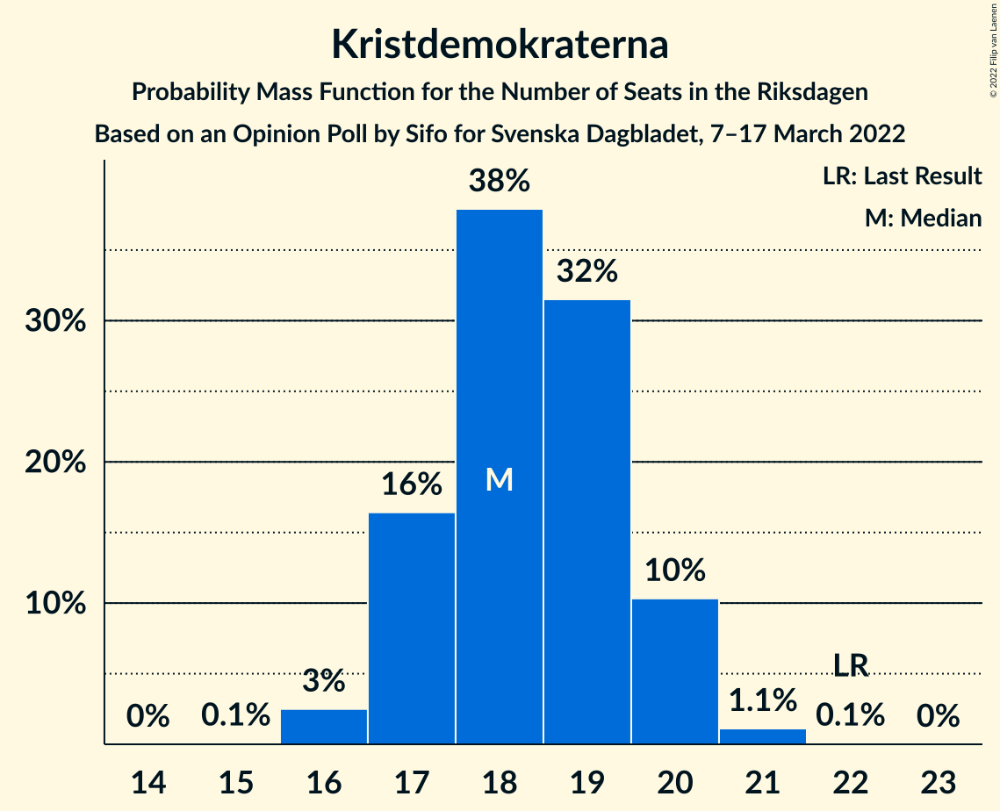

# Opinion Poll by Sifo for Svenska Dagbladet, 7–17 March 2022

<a href="#voting-intentions">Voting Intentions</a> | <a href="#seats">Seats</a> | <a href="#coalitions">Coalitions</a> | <a href="#technical-information">Technical Information</a>

## Voting Intentions

### Confidence Intervals

| Party | Last Result | Poll Result | 80% Confidence Interval | 90% Confidence Interval | 95% Confidence Interval | 99% Confidence Interval |
|:-----:|:-----------:|:-----------:|:-----------------------:|:-----------------------:|:-----------------------:|:-----------------------:|
| Sveriges socialdemokratiska arbetareparti | 28.3% | 32.8% | 32.1–33.6% |31.9–33.8% |31.7–33.9% |31.4–34.3% |
| Moderata samlingspartiet | 19.8% | 21.4% | 20.8–22.1% |20.6–22.3% |20.5–22.4% |20.2–22.7% |
| Sverigedemokraterna | 17.5% | 18.6% | 18.0–19.2% |17.9–19.4% |17.7–19.6% |17.4–19.9% |
| Vänsterpartiet | 8.0% | 8.6% | 8.2–9.1% |8.1–9.2% |8.0–9.3% |7.8–9.5% |
| Centerpartiet | 8.6% | 7.0% | 6.6–7.4% |6.5–7.5% |6.4–7.6% |6.2–7.8% |
| Kristdemokraterna | 6.3% | 4.9% | 4.6–5.3% |4.5–5.3% |4.4–5.4% |4.3–5.6% |
| Miljöpartiet de gröna | 4.4% | 2.7% | 2.5–3.0% |2.4–3.0% |2.3–3.1% |2.2–3.2% |
| Liberalerna | 5.5% | 2.4% | 2.2–2.7% |2.1–2.7% |2.1–2.8% |2.0–2.9% |

*Note:* The poll result column reflects the actual value used in the calculations. Published results may vary slightly, and in addition be rounded to fewer digits.

## Seats

### Confidence Intervals

| Party | Last Result | Median | 80% Confidence Interval | 90% Confidence Interval | 95% Confidence Interval | 99% Confidence Interval |
|:-----:|:-----------:|:------:|:-----------------------:|:-----------------------:|:-----------------------:|:-----------------------:|
| <a href="#sveriges-socialdemokratiska-arbetareparti">Sveriges socialdemokratiska arbetareparti</a> | 100 | 123 | 120–125 |119–126 |118–127 |117–128 |
| <a href="#moderata-samlingspartiet">Moderata samlingspartiet</a> | 70 | 80 | 78–82 |77–83 |77–84 |75–85 |
| <a href="#sverigedemokraterna">Sverigedemokraterna</a> | 62 | 69 | 67–72 |67–73 |66–73 |65–74 |
| <a href="#vänsterpartiet">Vänsterpartiet</a> | 28 | 32 | 31–34 |30–34 |30–35 |29–35 |
| <a href="#centerpartiet">Centerpartiet</a> | 31 | 26 | 25–28 |24–28 |24–29 |23–29 |
| <a href="#kristdemokraterna">Kristdemokraterna</a> | 22 | 18 | 17–20 |17–20 |16–20 |16–21 |
| <a href="#miljöpartiet-de-gröna">Miljöpartiet de gröna</a> | 16 | 0 | 0 |0 |0 |0 |
| <a href="#liberalerna">Liberalerna</a> | 20 | 0 | 0 |0 |0 |0 |

### Sveriges socialdemokratiska arbetareparti

*For a full overview of the results for this party, see the [Sveriges socialdemokratiska arbetareparti](party-sverigessocialdemokratiskaarbetareparti.html) page.*

| Number of Seats | Probability | Accumulated | Special Marks |
|:---------------:|:-----------:|:-----------:|:-------------:|
| 100 | 0% | 100% | Last Result |
| 101 | 0% | 100% |  |
| 102 | 0% | 100% |  |
| 103 | 0% | 100% |  |
| 104 | 0% | 100% |  |
| 105 | 0% | 100% |  |
| 106 | 0% | 100% |  |
| 107 | 0% | 100% |  |
| 108 | 0% | 100% |  |
| 109 | 0% | 100% |  |
| 110 | 0% | 100% |  |
| 111 | 0% | 100% |  |
| 112 | 0% | 100% |  |
| 113 | 0% | 100% |  |
| 114 | 0% | 100% |  |
| 115 | 0% | 100% |  |
| 116 | 0.1% | 100% |  |
| 117 | 0.4% | 99.9% |  |
| 118 | 2% | 99.4% |  |
| 119 | 4% | 97% |  |
| 120 | 9% | 93% |  |
| 121 | 13% | 85% |  |
| 122 | 21% | 72% |  |
| 123 | 18% | 52% | Median |
| 124 | 15% | 33% |  |
| 125 | 9% | 18% |  |
| 126 | 5% | 9% |  |
| 127 | 2% | 3% |  |
| 128 | 0.8% | 1.1% |  |
| 129 | 0.3% | 0.3% |  |
| 130 | 0% | 0.1% |  |
| 131 | 0% | 0% |  |

### Moderata samlingspartiet

*For a full overview of the results for this party, see the [Moderata samlingspartiet](party-moderatasamlingspartiet.html) page.*

| Number of Seats | Probability | Accumulated | Special Marks |
|:---------------:|:-----------:|:-----------:|:-------------:|
| 70 | 0% | 100% | Last Result |
| 71 | 0% | 100% |  |
| 72 | 0% | 100% |  |
| 73 | 0% | 100% |  |
| 74 | 0.1% | 100% |  |
| 75 | 0.6% | 99.9% |  |
| 76 | 2% | 99.3% |  |
| 77 | 7% | 98% |  |
| 78 | 11% | 91% |  |
| 79 | 19% | 80% |  |
| 80 | 21% | 61% | Median |
| 81 | 19% | 40% |  |
| 82 | 12% | 21% |  |
| 83 | 6% | 9% |  |
| 84 | 2% | 3% |  |
| 85 | 0.6% | 0.8% |  |
| 86 | 0.1% | 0.2% |  |
| 87 | 0% | 0% |  |

### Sverigedemokraterna

*For a full overview of the results for this party, see the [Sverigedemokraterna](party-sverigedemokraterna.html) page.*

| Number of Seats | Probability | Accumulated | Special Marks |
|:---------------:|:-----------:|:-----------:|:-------------:|
| 62 | 0% | 100% | Last Result |
| 63 | 0% | 100% |  |
| 64 | 0.1% | 100% |  |
| 65 | 0.9% | 99.9% |  |
| 66 | 2% | 99.0% |  |
| 67 | 9% | 97% |  |
| 68 | 13% | 88% |  |
| 69 | 25% | 75% | Median |
| 70 | 20% | 50% |  |
| 71 | 19% | 30% |  |
| 72 | 6% | 11% |  |
| 73 | 4% | 5% |  |
| 74 | 1.1% | 1.4% |  |
| 75 | 0.2% | 0.3% |  |
| 76 | 0% | 0% |  |

### Vänsterpartiet

*For a full overview of the results for this party, see the [Vänsterpartiet](party-vänsterpartiet.html) page.*

| Number of Seats | Probability | Accumulated | Special Marks |
|:---------------:|:-----------:|:-----------:|:-------------:|
| 28 | 0.1% | 100% | Last Result |
| 29 | 1.5% | 99.9% |  |
| 30 | 8% | 98% |  |
| 31 | 16% | 90% |  |
| 32 | 31% | 74% | Median |
| 33 | 29% | 42% |  |
| 34 | 10% | 13% |  |
| 35 | 3% | 3% |  |
| 36 | 0.3% | 0.4% |  |
| 37 | 0% | 0% |  |

### Centerpartiet

*For a full overview of the results for this party, see the [Centerpartiet](party-centerpartiet.html) page.*

| Number of Seats | Probability | Accumulated | Special Marks |
|:---------------:|:-----------:|:-----------:|:-------------:|
| 23 | 0.7% | 100% |  |
| 24 | 5% | 99.2% |  |
| 25 | 20% | 94% |  |
| 26 | 33% | 73% | Median |
| 27 | 27% | 40% |  |
| 28 | 10% | 13% |  |
| 29 | 2% | 3% |  |
| 30 | 0.4% | 0.4% |  |
| 31 | 0% | 0% | Last Result |

### Kristdemokraterna

*For a full overview of the results for this party, see the [Kristdemokraterna](party-kristdemokraterna.html) page.*

| Number of Seats | Probability | Accumulated | Special Marks |
|:---------------:|:-----------:|:-----------:|:-------------:|
| 15 | 0.1% | 100% |  |
| 16 | 3% | 99.9% |  |
| 17 | 16% | 97% |  |
| 18 | 38% | 81% | Median |
| 19 | 32% | 43% |  |
| 20 | 10% | 12% |  |
| 21 | 1.1% | 1.2% |  |
| 22 | 0.1% | 0.1% | Last Result |
| 23 | 0% | 0% |  |

### Miljöpartiet de gröna

*For a full overview of the results for this party, see the [Miljöpartiet de gröna](party-miljöpartietdegröna.html) page.*

| Number of Seats | Probability | Accumulated | Special Marks |
|:---------------:|:-----------:|:-----------:|:-------------:|
| 0 | 100% | 100% | Median |
| 1 | 0% | 0% |  |
| 2 | 0% | 0% |  |
| 3 | 0% | 0% |  |
| 4 | 0% | 0% |  |
| 5 | 0% | 0% |  |
| 6 | 0% | 0% |  |
| 7 | 0% | 0% |  |
| 8 | 0% | 0% |  |
| 9 | 0% | 0% |  |
| 10 | 0% | 0% |  |
| 11 | 0% | 0% |  |
| 12 | 0% | 0% |  |
| 13 | 0% | 0% |  |
| 14 | 0% | 0% |  |
| 15 | 0% | 0% |  |
| 16 | 0% | 0% | Last Result |

### Liberalerna

*For a full overview of the results for this party, see the [Liberalerna](party-liberalerna.html) page.*

| Number of Seats | Probability | Accumulated | Special Marks |
|:---------------:|:-----------:|:-----------:|:-------------:|
| 0 | 100% | 100% | Median |
| 1 | 0% | 0% |  |
| 2 | 0% | 0% |  |
| 3 | 0% | 0% |  |
| 4 | 0% | 0% |  |
| 5 | 0% | 0% |  |
| 6 | 0% | 0% |  |
| 7 | 0% | 0% |  |
| 8 | 0% | 0% |  |
| 9 | 0% | 0% |  |
| 10 | 0% | 0% |  |
| 11 | 0% | 0% |  |
| 12 | 0% | 0% |  |
| 13 | 0% | 0% |  |
| 14 | 0% | 0% |  |
| 15 | 0% | 0% |  |
| 16 | 0% | 0% |  |
| 17 | 0% | 0% |  |
| 18 | 0% | 0% |  |
| 19 | 0% | 0% |  |
| 20 | 0% | 0% | Last Result |

## Coalitions

### Confidence Intervals

| Coalition | Last Result | Median | Majority? | 80% Confidence Interval | 90% Confidence Interval | 95% Confidence Interval | 99% Confidence Interval |
|:---------:|:-----------:|:------:|:---------:|:-----------------------:|:-----------------------:|:-----------------------:|:-----------------------:|
| Sveriges socialdemokratiska arbetareparti – Moderata samlingspartiet – Centerpartiet | 201 | 229 | 100% | 227–232 | 226–232 | 225–233 | 223–234 |
| Sveriges socialdemokratiska arbetareparti – Moderata samlingspartiet | 170 | 202 | 100% | 200–205 | 199–206 | 199–207 | 197–208 |
| Sveriges socialdemokratiska arbetareparti – Vänsterpartiet – Centerpartiet – Miljöpartiet de gröna – Liberalerna | 195 | 181 | 99.9% | 178–184 | 177–184 | 177–185 | 175–187 |
| Moderata samlingspartiet – Sverigedemokraterna – Kristdemokraterna | 154 | 168 | 0.1% | 165–171 | 165–172 | 164–172 | 162–174 |
| Sveriges socialdemokratiska arbetareparti – Vänsterpartiet – Miljöpartiet de gröna | 144 | 155 | 0% | 152–158 | 151–158 | 151–159 | 149–160 |
| Sveriges socialdemokratiska arbetareparti – Vänsterpartiet | 128 | 155 | 0% | 152–158 | 151–158 | 151–159 | 149–160 |
| Moderata samlingspartiet – Sverigedemokraterna | 132 | 149 | 0% | 147–153 | 146–153 | 145–154 | 144–155 |
| Sveriges socialdemokratiska arbetareparti – Centerpartiet – Miljöpartiet de gröna – Liberalerna | 167 | 149 | 0% | 146–152 | 145–153 | 144–153 | 143–154 |
| Moderata samlingspartiet – Centerpartiet – Kristdemokraterna – Liberalerna | 143 | 125 | 0% | 122–127 | 121–128 | 120–129 | 119–130 |
| Moderata samlingspartiet – Centerpartiet – Kristdemokraterna | 123 | 125 | 0% | 122–127 | 121–128 | 120–129 | 119–130 |
| Sveriges socialdemokratiska arbetareparti – Miljöpartiet de gröna | 116 | 123 | 0% | 120–125 | 119–126 | 118–127 | 117–128 |
| Moderata samlingspartiet – Centerpartiet – Liberalerna | 121 | 106 | 0% | 104–109 | 103–110 | 102–110 | 101–112 |
| Moderata samlingspartiet – Centerpartiet | 101 | 106 | 0% | 104–109 | 103–110 | 102–110 | 101–112 |

### Sveriges socialdemokratiska arbetareparti – Moderata samlingspartiet – Centerpartiet

| Number of Seats | Probability | Accumulated | Special Marks |
|:---------------:|:-----------:|:-----------:|:-------------:|
| 201 | 0% | 100% | Last Result |
| 202 | 0% | 100% |  |
| 203 | 0% | 100% |  |
| 204 | 0% | 100% |  |
| 205 | 0% | 100% |  |
| 206 | 0% | 100% |  |
| 207 | 0% | 100% |  |
| 208 | 0% | 100% |  |
| 209 | 0% | 100% |  |
| 210 | 0% | 100% |  |
| 211 | 0% | 100% |  |
| 212 | 0% | 100% |  |
| 213 | 0% | 100% |  |
| 214 | 0% | 100% |  |
| 215 | 0% | 100% |  |
| 216 | 0% | 100% |  |
| 217 | 0% | 100% |  |
| 218 | 0% | 100% |  |
| 219 | 0% | 100% |  |
| 220 | 0% | 100% |  |
| 221 | 0% | 100% |  |
| 222 | 0.1% | 100% |  |
| 223 | 0.4% | 99.9% |  |
| 224 | 1.2% | 99.4% |  |
| 225 | 3% | 98% |  |
| 226 | 5% | 95% |  |
| 227 | 14% | 90% |  |
| 228 | 21% | 77% |  |
| 229 | 22% | 56% | Median |
| 230 | 13% | 34% |  |
| 231 | 10% | 21% |  |
| 232 | 7% | 11% |  |
| 233 | 3% | 4% |  |
| 234 | 0.7% | 1.1% |  |
| 235 | 0.3% | 0.4% |  |
| 236 | 0.1% | 0.1% |  |
| 237 | 0% | 0% |  |

### Sveriges socialdemokratiska arbetareparti – Moderata samlingspartiet

| Number of Seats | Probability | Accumulated | Special Marks |
|:---------------:|:-----------:|:-----------:|:-------------:|
| 170 | 0% | 100% | Last Result |
| 171 | 0% | 100% |  |
| 172 | 0% | 100% |  |
| 173 | 0% | 100% |  |
| 174 | 0% | 100% |  |
| 175 | 0% | 100% | Majority |
| 176 | 0% | 100% |  |
| 177 | 0% | 100% |  |
| 178 | 0% | 100% |  |
| 179 | 0% | 100% |  |
| 180 | 0% | 100% |  |
| 181 | 0% | 100% |  |
| 182 | 0% | 100% |  |
| 183 | 0% | 100% |  |
| 184 | 0% | 100% |  |
| 185 | 0% | 100% |  |
| 186 | 0% | 100% |  |
| 187 | 0% | 100% |  |
| 188 | 0% | 100% |  |
| 189 | 0% | 100% |  |
| 190 | 0% | 100% |  |
| 191 | 0% | 100% |  |
| 192 | 0% | 100% |  |
| 193 | 0% | 100% |  |
| 194 | 0% | 100% |  |
| 195 | 0% | 100% |  |
| 196 | 0.1% | 100% |  |
| 197 | 0.7% | 99.8% |  |
| 198 | 1.4% | 99.2% |  |
| 199 | 4% | 98% |  |
| 200 | 8% | 94% |  |
| 201 | 11% | 86% |  |
| 202 | 25% | 75% |  |
| 203 | 17% | 50% | Median |
| 204 | 14% | 32% |  |
| 205 | 9% | 18% |  |
| 206 | 5% | 9% |  |
| 207 | 2% | 4% |  |
| 208 | 0.8% | 1.2% |  |
| 209 | 0.3% | 0.4% |  |
| 210 | 0.1% | 0.1% |  |
| 211 | 0% | 0% |  |

### Sveriges socialdemokratiska arbetareparti – Vänsterpartiet – Centerpartiet – Miljöpartiet de gröna – Liberalerna

| Number of Seats | Probability | Accumulated | Special Marks |
|:---------------:|:-----------:|:-----------:|:-------------:|
| 174 | 0.1% | 100% |  |
| 175 | 0.5% | 99.9% | Majority |
| 176 | 2% | 99.4% |  |
| 177 | 5% | 98% |  |
| 178 | 5% | 93% |  |
| 179 | 13% | 89% |  |
| 180 | 14% | 76% |  |
| 181 | 21% | 62% | Median |
| 182 | 15% | 41% |  |
| 183 | 12% | 26% |  |
| 184 | 10% | 15% |  |
| 185 | 3% | 5% |  |
| 186 | 1.4% | 2% |  |
| 187 | 0.6% | 0.8% |  |
| 188 | 0.1% | 0.2% |  |
| 189 | 0% | 0% |  |
| 190 | 0% | 0% |  |
| 191 | 0% | 0% |  |
| 192 | 0% | 0% |  |
| 193 | 0% | 0% |  |
| 194 | 0% | 0% |  |
| 195 | 0% | 0% | Last Result |

### Moderata samlingspartiet – Sverigedemokraterna – Kristdemokraterna

| Number of Seats | Probability | Accumulated | Special Marks |
|:---------------:|:-----------:|:-----------:|:-------------:|
| 154 | 0% | 100% | Last Result |
| 155 | 0% | 100% |  |
| 156 | 0% | 100% |  |
| 157 | 0% | 100% |  |
| 158 | 0% | 100% |  |
| 159 | 0% | 100% |  |
| 160 | 0% | 100% |  |
| 161 | 0.1% | 100% |  |
| 162 | 0.6% | 99.8% |  |
| 163 | 1.4% | 99.2% |  |
| 164 | 3% | 98% |  |
| 165 | 10% | 95% |  |
| 166 | 12% | 85% |  |
| 167 | 15% | 74% | Median |
| 168 | 21% | 59% |  |
| 169 | 14% | 38% |  |
| 170 | 13% | 24% |  |
| 171 | 5% | 11% |  |
| 172 | 5% | 7% |  |
| 173 | 2% | 2% |  |
| 174 | 0.5% | 0.6% |  |
| 175 | 0.1% | 0.1% | Majority |
| 176 | 0% | 0% |  |

### Sveriges socialdemokratiska arbetareparti – Vänsterpartiet – Miljöpartiet de gröna

| Number of Seats | Probability | Accumulated | Special Marks |
|:---------------:|:-----------:|:-----------:|:-------------:|
| 144 | 0% | 100% | Last Result |
| 145 | 0% | 100% |  |
| 146 | 0% | 100% |  |
| 147 | 0% | 100% |  |
| 148 | 0.1% | 100% |  |
| 149 | 0.6% | 99.8% |  |
| 150 | 1.1% | 99.2% |  |
| 151 | 6% | 98% |  |
| 152 | 8% | 92% |  |
| 153 | 12% | 85% |  |
| 154 | 15% | 72% |  |
| 155 | 16% | 57% | Median |
| 156 | 19% | 41% |  |
| 157 | 12% | 22% |  |
| 158 | 5% | 10% |  |
| 159 | 3% | 5% |  |
| 160 | 1.4% | 2% |  |
| 161 | 0.3% | 0.4% |  |
| 162 | 0.1% | 0.1% |  |
| 163 | 0% | 0% |  |

### Sveriges socialdemokratiska arbetareparti – Vänsterpartiet

| Number of Seats | Probability | Accumulated | Special Marks |
|:---------------:|:-----------:|:-----------:|:-------------:|
| 128 | 0% | 100% | Last Result |
| 129 | 0% | 100% |  |
| 130 | 0% | 100% |  |
| 131 | 0% | 100% |  |
| 132 | 0% | 100% |  |
| 133 | 0% | 100% |  |
| 134 | 0% | 100% |  |
| 135 | 0% | 100% |  |
| 136 | 0% | 100% |  |
| 137 | 0% | 100% |  |
| 138 | 0% | 100% |  |
| 139 | 0% | 100% |  |
| 140 | 0% | 100% |  |
| 141 | 0% | 100% |  |
| 142 | 0% | 100% |  |
| 143 | 0% | 100% |  |
| 144 | 0% | 100% |  |
| 145 | 0% | 100% |  |
| 146 | 0% | 100% |  |
| 147 | 0% | 100% |  |
| 148 | 0.1% | 100% |  |
| 149 | 0.6% | 99.8% |  |
| 150 | 1.1% | 99.2% |  |
| 151 | 6% | 98% |  |
| 152 | 8% | 92% |  |
| 153 | 12% | 85% |  |
| 154 | 15% | 72% |  |
| 155 | 16% | 57% | Median |
| 156 | 19% | 41% |  |
| 157 | 12% | 22% |  |
| 158 | 5% | 10% |  |
| 159 | 3% | 5% |  |
| 160 | 1.4% | 2% |  |
| 161 | 0.3% | 0.4% |  |
| 162 | 0.1% | 0.1% |  |
| 163 | 0% | 0% |  |

### Moderata samlingspartiet – Sverigedemokraterna

| Number of Seats | Probability | Accumulated | Special Marks |
|:---------------:|:-----------:|:-----------:|:-------------:|
| 132 | 0% | 100% | Last Result |
| 133 | 0% | 100% |  |
| 134 | 0% | 100% |  |
| 135 | 0% | 100% |  |
| 136 | 0% | 100% |  |
| 137 | 0% | 100% |  |
| 138 | 0% | 100% |  |
| 139 | 0% | 100% |  |
| 140 | 0% | 100% |  |
| 141 | 0% | 100% |  |
| 142 | 0% | 100% |  |
| 143 | 0.3% | 100% |  |
| 144 | 0.5% | 99.7% |  |
| 145 | 2% | 99.1% |  |
| 146 | 5% | 97% |  |
| 147 | 9% | 92% |  |
| 148 | 18% | 84% |  |
| 149 | 16% | 66% | Median |
| 150 | 16% | 50% |  |
| 151 | 13% | 34% |  |
| 152 | 11% | 21% |  |
| 153 | 5% | 10% |  |
| 154 | 4% | 5% |  |
| 155 | 1.0% | 1.3% |  |
| 156 | 0.3% | 0.3% |  |
| 157 | 0.1% | 0.1% |  |
| 158 | 0% | 0% |  |

### Sveriges socialdemokratiska arbetareparti – Centerpartiet – Miljöpartiet de gröna – Liberalerna

| Number of Seats | Probability | Accumulated | Special Marks |
|:---------------:|:-----------:|:-----------:|:-------------:|
| 142 | 0.1% | 100% |  |
| 143 | 0.5% | 99.9% |  |
| 144 | 2% | 99.4% |  |
| 145 | 3% | 97% |  |
| 146 | 6% | 94% |  |
| 147 | 16% | 88% |  |
| 148 | 14% | 72% |  |
| 149 | 23% | 58% | Median |
| 150 | 11% | 35% |  |
| 151 | 12% | 24% |  |
| 152 | 6% | 11% |  |
| 153 | 4% | 5% |  |
| 154 | 0.9% | 1.3% |  |
| 155 | 0.3% | 0.4% |  |
| 156 | 0.1% | 0.1% |  |
| 157 | 0% | 0% |  |
| 158 | 0% | 0% |  |
| 159 | 0% | 0% |  |
| 160 | 0% | 0% |  |
| 161 | 0% | 0% |  |
| 162 | 0% | 0% |  |
| 163 | 0% | 0% |  |
| 164 | 0% | 0% |  |
| 165 | 0% | 0% |  |
| 166 | 0% | 0% |  |
| 167 | 0% | 0% | Last Result |

### Moderata samlingspartiet – Centerpartiet – Kristdemokraterna – Liberalerna

| Number of Seats | Probability | Accumulated | Special Marks |
|:---------------:|:-----------:|:-----------:|:-------------:|
| 118 | 0.2% | 100% |  |
| 119 | 0.6% | 99.8% |  |
| 120 | 2% | 99.2% |  |
| 121 | 4% | 97% |  |
| 122 | 8% | 93% |  |
| 123 | 18% | 85% |  |
| 124 | 14% | 67% | Median |
| 125 | 18% | 52% |  |
| 126 | 15% | 34% |  |
| 127 | 11% | 19% |  |
| 128 | 3% | 7% |  |
| 129 | 3% | 4% |  |
| 130 | 0.5% | 0.9% |  |
| 131 | 0.3% | 0.4% |  |
| 132 | 0% | 0% |  |
| 133 | 0% | 0% |  |
| 134 | 0% | 0% |  |
| 135 | 0% | 0% |  |
| 136 | 0% | 0% |  |
| 137 | 0% | 0% |  |
| 138 | 0% | 0% |  |
| 139 | 0% | 0% |  |
| 140 | 0% | 0% |  |
| 141 | 0% | 0% |  |
| 142 | 0% | 0% |  |
| 143 | 0% | 0% | Last Result |

### Moderata samlingspartiet – Centerpartiet – Kristdemokraterna

| Number of Seats | Probability | Accumulated | Special Marks |
|:---------------:|:-----------:|:-----------:|:-------------:|
| 118 | 0.2% | 100% |  |
| 119 | 0.6% | 99.8% |  |
| 120 | 2% | 99.2% |  |
| 121 | 4% | 97% |  |
| 122 | 8% | 93% |  |
| 123 | 18% | 85% | Last Result |
| 124 | 14% | 67% | Median |
| 125 | 18% | 52% |  |
| 126 | 15% | 34% |  |
| 127 | 11% | 19% |  |
| 128 | 3% | 7% |  |
| 129 | 3% | 4% |  |
| 130 | 0.5% | 0.9% |  |
| 131 | 0.3% | 0.4% |  |
| 132 | 0% | 0% |  |

### Sveriges socialdemokratiska arbetareparti – Miljöpartiet de gröna

| Number of Seats | Probability | Accumulated | Special Marks |
|:---------------:|:-----------:|:-----------:|:-------------:|
| 116 | 0.1% | 100% | Last Result |
| 117 | 0.4% | 99.9% |  |
| 118 | 2% | 99.4% |  |
| 119 | 4% | 97% |  |
| 120 | 9% | 93% |  |
| 121 | 13% | 85% |  |
| 122 | 21% | 72% |  |
| 123 | 18% | 52% | Median |
| 124 | 15% | 33% |  |
| 125 | 9% | 18% |  |
| 126 | 5% | 9% |  |
| 127 | 2% | 3% |  |
| 128 | 0.8% | 1.1% |  |
| 129 | 0.3% | 0.3% |  |
| 130 | 0% | 0.1% |  |
| 131 | 0% | 0% |  |

### Moderata samlingspartiet – Centerpartiet – Liberalerna

| Number of Seats | Probability | Accumulated | Special Marks |
|:---------------:|:-----------:|:-----------:|:-------------:|
| 100 | 0.2% | 100% |  |
| 101 | 0.7% | 99.8% |  |
| 102 | 2% | 99.1% |  |
| 103 | 5% | 97% |  |
| 104 | 11% | 92% |  |
| 105 | 21% | 81% |  |
| 106 | 13% | 59% | Median |
| 107 | 19% | 47% |  |
| 108 | 12% | 28% |  |
| 109 | 10% | 15% |  |
| 110 | 4% | 5% |  |
| 111 | 0.8% | 1.5% |  |
| 112 | 0.5% | 0.6% |  |
| 113 | 0.1% | 0.1% |  |
| 114 | 0% | 0% |  |
| 115 | 0% | 0% |  |
| 116 | 0% | 0% |  |
| 117 | 0% | 0% |  |
| 118 | 0% | 0% |  |
| 119 | 0% | 0% |  |
| 120 | 0% | 0% |  |
| 121 | 0% | 0% | Last Result |

### Moderata samlingspartiet – Centerpartiet

| Number of Seats | Probability | Accumulated | Special Marks |
|:---------------:|:-----------:|:-----------:|:-------------:|
| 100 | 0.2% | 100% |  |
| 101 | 0.7% | 99.8% | Last Result |
| 102 | 2% | 99.1% |  |
| 103 | 5% | 97% |  |
| 104 | 11% | 92% |  |
| 105 | 21% | 81% |  |
| 106 | 13% | 59% | Median |
| 107 | 19% | 47% |  |
| 108 | 12% | 28% |  |
| 109 | 10% | 15% |  |
| 110 | 4% | 5% |  |
| 111 | 0.8% | 1.5% |  |
| 112 | 0.5% | 0.6% |  |
| 113 | 0.1% | 0.1% |  |
| 114 | 0% | 0% |  |

## Technical Information

### Opinion Poll

+ **Polling firm:** Sifo
+ **Commissioner(s):** Svenska Dagbladet
+ **Fieldwork period:** 7–17 March 2022

### Calculations

+ **Sample size:** 6960
+ **Simulations done:** 1,048,576
+ **Error estimate:** 0.38%

