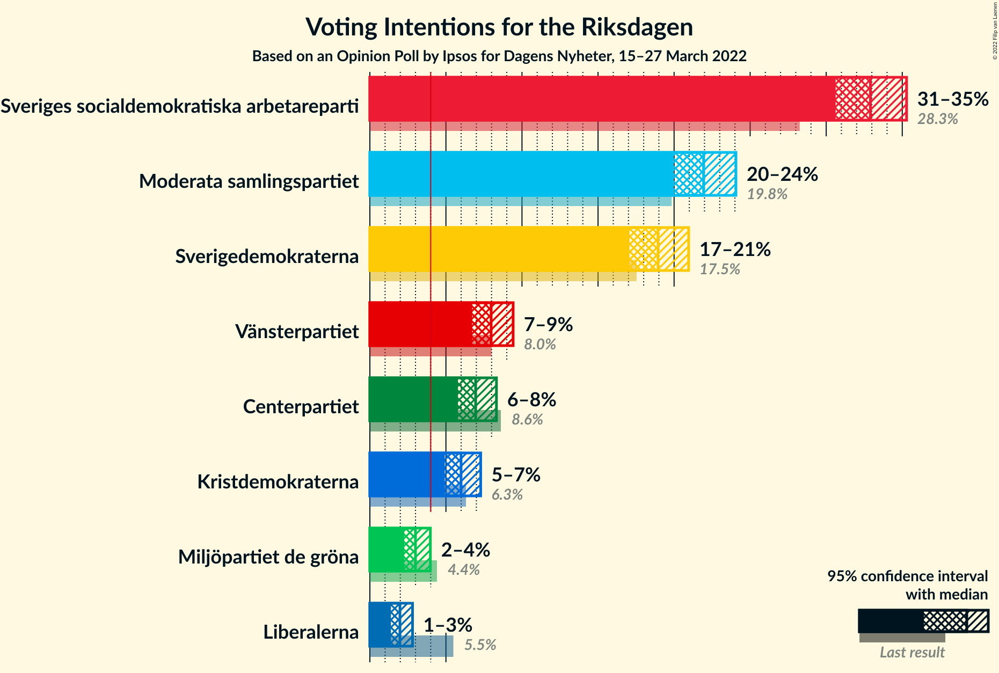
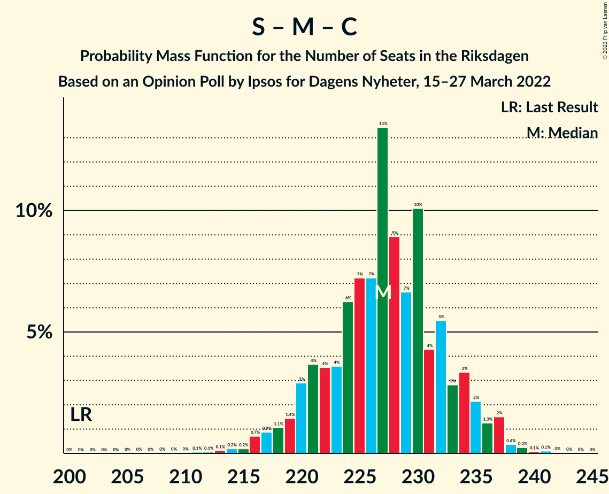

# Opinion Poll by Ipsos for Dagens Nyheter, 15–27 March 2022

<a href="#voting-intentions">Voting Intentions</a> | <a href="#seats">Seats</a> | <a href="#coalitions">Coalitions</a> | <a href="#technical-information">Technical Information</a>

## Voting Intentions

### Confidence Intervals

| Party | Last Result | Poll Result | 80% Confidence Interval | 90% Confidence Interval | 95% Confidence Interval | 99% Confidence Interval |
|:-----:|:-----------:|:-----------:|:-----------------------:|:-----------------------:|:-----------------------:|:-----------------------:|
| Sveriges socialdemokratiska arbetareparti | 28.3% | 32.9% | 31.4–34.5% |31.0–34.9% |30.6–35.3% |29.9–36.0% |
| Moderata samlingspartiet | 19.8% | 21.9% | 20.6–23.3% |20.3–23.7% |20.0–24.1% |19.3–24.7% |
| Sverigedemokraterna | 17.5% | 18.9% | 17.7–20.3% |17.4–20.6% |17.1–21.0% |16.5–21.6% |
| Vänsterpartiet | 8.0% | 8.0% | 7.1–8.9% |6.9–9.2% |6.7–9.4% |6.4–9.9% |
| Centerpartiet | 8.6% | 7.0% | 6.2–7.8% |6.0–8.1% |5.8–8.3% |5.4–8.8% |
| Kristdemokraterna | 6.3% | 6.0% | 5.3–6.8% |5.1–7.1% |4.9–7.3% |4.6–7.7% |
| Miljöpartiet de gröna | 4.4% | 3.0% | 2.5–3.6% |2.4–3.8% |2.3–4.0% |2.0–4.3% |
| Liberalerna | 5.5% | 2.0% | 1.6–2.5% |1.5–2.7% |1.4–2.8% |1.2–3.1% |

*Note:* The poll result column reflects the actual value used in the calculations. Published results may vary slightly, and in addition be rounded to fewer digits.

## Seats

### Confidence Intervals

| Party | Last Result | Median | 80% Confidence Interval | 90% Confidence Interval | 95% Confidence Interval | 99% Confidence Interval |
|:-----:|:-----------:|:------:|:-----------------------:|:-----------------------:|:-----------------------:|:-----------------------:|
| <a href="#sveriges-socialdemokratiska-arbetareparti">Sveriges socialdemokratiska arbetareparti</a> | 100 | 121 | 115–127 |113–128 |112–130 |109–132 |
| <a href="#moderata-samlingspartiet">Moderata samlingspartiet</a> | 70 | 80 | 76–86 |75–88 |73–89 |71–91 |
| <a href="#sverigedemokraterna">Sverigedemokraterna</a> | 62 | 70 | 65–75 |64–76 |63–77 |61–80 |
| <a href="#vänsterpartiet">Vänsterpartiet</a> | 28 | 29 | 26–33 |25–34 |25–35 |23–36 |
| <a href="#centerpartiet">Centerpartiet</a> | 31 | 26 | 23–28 |22–30 |21–30 |20–32 |
| <a href="#kristdemokraterna">Kristdemokraterna</a> | 22 | 22 | 19–25 |19–26 |18–27 |17–29 |
| <a href="#miljöpartiet-de-gröna">Miljöpartiet de gröna</a> | 16 | 0 | 0 |0 |0 |0–15 |
| <a href="#liberalerna">Liberalerna</a> | 20 | 0 | 0 |0 |0 |0 |

### Sveriges socialdemokratiska arbetareparti

*For a full overview of the results for this party, see the [Sveriges socialdemokratiska arbetareparti](party-sverigessocialdemokratiskaarbetareparti.html) page.*

| Number of Seats | Probability | Accumulated | Special Marks |
|:---------------:|:-----------:|:-----------:|:-------------:|
| 100 | 0% | 100% | Last Result |
| 101 | 0% | 100% |  |
| 102 | 0% | 100% |  |
| 103 | 0% | 100% |  |
| 104 | 0% | 100% |  |
| 105 | 0% | 100% |  |
| 106 | 0% | 100% |  |
| 107 | 0.1% | 99.9% |  |
| 108 | 0.1% | 99.9% |  |
| 109 | 0.4% | 99.7% |  |
| 110 | 0.5% | 99.4% |  |
| 111 | 0.7% | 98.9% |  |
| 112 | 0.9% | 98% |  |
| 113 | 3% | 97% |  |
| 114 | 3% | 95% |  |
| 115 | 3% | 91% |  |
| 116 | 5% | 88% |  |
| 117 | 9% | 84% |  |
| 118 | 6% | 74% |  |
| 119 | 6% | 69% |  |
| 120 | 7% | 63% |  |
| 121 | 14% | 56% | Median |
| 122 | 7% | 42% |  |
| 123 | 7% | 35% |  |
| 124 | 10% | 28% |  |
| 125 | 3% | 18% |  |
| 126 | 3% | 14% |  |
| 127 | 4% | 11% |  |
| 128 | 3% | 7% |  |
| 129 | 1.5% | 4% |  |
| 130 | 0.5% | 3% |  |
| 131 | 2% | 2% |  |
| 132 | 0.4% | 0.8% |  |
| 133 | 0.2% | 0.4% |  |
| 134 | 0.1% | 0.2% |  |
| 135 | 0.1% | 0.1% |  |
| 136 | 0% | 0% |  |

### Moderata samlingspartiet

*For a full overview of the results for this party, see the [Moderata samlingspartiet](party-moderatasamlingspartiet.html) page.*

| Number of Seats | Probability | Accumulated | Special Marks |
|:---------------:|:-----------:|:-----------:|:-------------:|
| 68 | 0% | 100% |  |
| 69 | 0.1% | 99.9% |  |
| 70 | 0.2% | 99.8% | Last Result |
| 71 | 0.6% | 99.6% |  |
| 72 | 0.5% | 99.0% |  |
| 73 | 2% | 98% |  |
| 74 | 0.7% | 96% |  |
| 75 | 4% | 95% |  |
| 76 | 5% | 91% |  |
| 77 | 7% | 86% |  |
| 78 | 11% | 79% |  |
| 79 | 8% | 68% |  |
| 80 | 12% | 60% | Median |
| 81 | 4% | 49% |  |
| 82 | 12% | 44% |  |
| 83 | 3% | 32% |  |
| 84 | 12% | 29% |  |
| 85 | 2% | 16% |  |
| 86 | 6% | 14% |  |
| 87 | 1.3% | 8% |  |
| 88 | 3% | 7% |  |
| 89 | 3% | 4% |  |
| 90 | 0.9% | 2% |  |
| 91 | 0.4% | 0.7% |  |
| 92 | 0.1% | 0.2% |  |
| 93 | 0.1% | 0.1% |  |
| 94 | 0% | 0.1% |  |
| 95 | 0% | 0% |  |

### Sverigedemokraterna

*For a full overview of the results for this party, see the [Sverigedemokraterna](party-sverigedemokraterna.html) page.*

| Number of Seats | Probability | Accumulated | Special Marks |
|:---------------:|:-----------:|:-----------:|:-------------:|
| 58 | 0.1% | 100% |  |
| 59 | 0.1% | 99.9% |  |
| 60 | 0.3% | 99.8% |  |
| 61 | 0.7% | 99.5% |  |
| 62 | 0.9% | 98.8% | Last Result |
| 63 | 2% | 98% |  |
| 64 | 3% | 96% |  |
| 65 | 4% | 93% |  |
| 66 | 8% | 88% |  |
| 67 | 7% | 80% |  |
| 68 | 10% | 73% |  |
| 69 | 12% | 63% |  |
| 70 | 6% | 51% | Median |
| 71 | 10% | 45% |  |
| 72 | 11% | 35% |  |
| 73 | 8% | 24% |  |
| 74 | 6% | 16% |  |
| 75 | 4% | 10% |  |
| 76 | 3% | 6% |  |
| 77 | 1.1% | 3% |  |
| 78 | 0.9% | 2% |  |
| 79 | 0.4% | 0.9% |  |
| 80 | 0.3% | 0.5% |  |
| 81 | 0.1% | 0.2% |  |
| 82 | 0.1% | 0.1% |  |
| 83 | 0% | 0% |  |

### Vänsterpartiet

*For a full overview of the results for this party, see the [Vänsterpartiet](party-vänsterpartiet.html) page.*

| Number of Seats | Probability | Accumulated | Special Marks |
|:---------------:|:-----------:|:-----------:|:-------------:|
| 22 | 0.2% | 100% |  |
| 23 | 0.4% | 99.8% |  |
| 24 | 1.3% | 99.4% |  |
| 25 | 4% | 98% |  |
| 26 | 6% | 94% |  |
| 27 | 14% | 87% |  |
| 28 | 12% | 74% | Last Result |
| 29 | 17% | 62% | Median |
| 30 | 12% | 45% |  |
| 31 | 11% | 33% |  |
| 32 | 8% | 22% |  |
| 33 | 8% | 14% |  |
| 34 | 4% | 6% |  |
| 35 | 1.2% | 3% |  |
| 36 | 0.9% | 1.3% |  |
| 37 | 0.3% | 0.4% |  |
| 38 | 0.1% | 0.2% |  |
| 39 | 0% | 0% |  |

### Centerpartiet

*For a full overview of the results for this party, see the [Centerpartiet](party-centerpartiet.html) page.*

| Number of Seats | Probability | Accumulated | Special Marks |
|:---------------:|:-----------:|:-----------:|:-------------:|
| 19 | 0.4% | 100% |  |
| 20 | 0.5% | 99.6% |  |
| 21 | 3% | 99.1% |  |
| 22 | 6% | 96% |  |
| 23 | 8% | 90% |  |
| 24 | 17% | 82% |  |
| 25 | 11% | 65% |  |
| 26 | 19% | 54% | Median |
| 27 | 7% | 35% |  |
| 28 | 19% | 28% |  |
| 29 | 3% | 10% |  |
| 30 | 5% | 7% |  |
| 31 | 0.8% | 2% | Last Result |
| 32 | 1.0% | 1.4% |  |
| 33 | 0.3% | 0.4% |  |
| 34 | 0.1% | 0.1% |  |
| 35 | 0% | 0% |  |

### Kristdemokraterna

*For a full overview of the results for this party, see the [Kristdemokraterna](party-kristdemokraterna.html) page.*

| Number of Seats | Probability | Accumulated | Special Marks |
|:---------------:|:-----------:|:-----------:|:-------------:|
| 16 | 0.2% | 100% |  |
| 17 | 1.1% | 99.7% |  |
| 18 | 2% | 98.7% |  |
| 19 | 7% | 96% |  |
| 20 | 10% | 89% |  |
| 21 | 22% | 79% |  |
| 22 | 14% | 57% | Last Result, Median |
| 23 | 16% | 43% |  |
| 24 | 11% | 27% |  |
| 25 | 8% | 16% |  |
| 26 | 3% | 8% |  |
| 27 | 3% | 5% |  |
| 28 | 0.9% | 1.5% |  |
| 29 | 0.4% | 0.5% |  |
| 30 | 0.1% | 0.1% |  |
| 31 | 0% | 0% |  |

### Miljöpartiet de gröna

*For a full overview of the results for this party, see the [Miljöpartiet de gröna](party-miljöpartietdegröna.html) page.*

| Number of Seats | Probability | Accumulated | Special Marks |
|:---------------:|:-----------:|:-----------:|:-------------:|
| 0 | 98% | 100% | Median |
| 1 | 0% | 2% |  |
| 2 | 0% | 2% |  |
| 3 | 0% | 2% |  |
| 4 | 0% | 2% |  |
| 5 | 0% | 2% |  |
| 6 | 0% | 2% |  |
| 7 | 0% | 2% |  |
| 8 | 0% | 2% |  |
| 9 | 0% | 2% |  |
| 10 | 0% | 2% |  |
| 11 | 0% | 2% |  |
| 12 | 0% | 2% |  |
| 13 | 0% | 2% |  |
| 14 | 0.2% | 2% |  |
| 15 | 1.4% | 2% |  |
| 16 | 0.3% | 0.4% | Last Result |
| 17 | 0.1% | 0.1% |  |
| 18 | 0% | 0% |  |

### Liberalerna

*For a full overview of the results for this party, see the [Liberalerna](party-liberalerna.html) page.*

| Number of Seats | Probability | Accumulated | Special Marks |
|:---------------:|:-----------:|:-----------:|:-------------:|
| 0 | 100% | 100% | Median |
| 1 | 0% | 0% |  |
| 2 | 0% | 0% |  |
| 3 | 0% | 0% |  |
| 4 | 0% | 0% |  |
| 5 | 0% | 0% |  |
| 6 | 0% | 0% |  |
| 7 | 0% | 0% |  |
| 8 | 0% | 0% |  |
| 9 | 0% | 0% |  |
| 10 | 0% | 0% |  |
| 11 | 0% | 0% |  |
| 12 | 0% | 0% |  |
| 13 | 0% | 0% |  |
| 14 | 0% | 0% |  |
| 15 | 0% | 0% |  |
| 16 | 0% | 0% |  |
| 17 | 0% | 0% |  |
| 18 | 0% | 0% |  |
| 19 | 0% | 0% |  |
| 20 | 0% | 0% | Last Result |

## Coalitions

### Confidence Intervals

| Coalition | Last Result | Median | Majority? | 80% Confidence Interval | 90% Confidence Interval | 95% Confidence Interval | 99% Confidence Interval |
|:---------:|:-----------:|:------:|:---------:|:-----------------------:|:-----------------------:|:-----------------------:|:-----------------------:|
| Sveriges socialdemokratiska arbetareparti – Moderata samlingspartiet – Centerpartiet | 201 | 227 | 100% | 221–233 | 220–235 | 218–236 | 214–238 |
| Sveriges socialdemokratiska arbetareparti – Moderata samlingspartiet | 170 | 202 | 100% | 195–208 | 194–209 | 192–211 | 189–213 |
| Sveriges socialdemokratiska arbetareparti – Vänsterpartiet – Centerpartiet – Miljöpartiet de gröna – Liberalerna | 195 | 177 | 64% | 169–182 | 168–184 | 167–186 | 165–190 |
| Moderata samlingspartiet – Sverigedemokraterna – Kristdemokraterna | 154 | 172 | 36% | 167–180 | 165–181 | 163–182 | 159–184 |
| Sveriges socialdemokratiska arbetareparti – Vänsterpartiet – Miljöpartiet de gröna | 144 | 150 | 0% | 144–157 | 143–159 | 142–160 | 139–164 |
| Moderata samlingspartiet – Sverigedemokraterna | 132 | 150 | 0% | 145–157 | 143–159 | 141–160 | 138–161 |
| Sveriges socialdemokratiska arbetareparti – Vänsterpartiet | 128 | 150 | 0% | 144–156 | 142–159 | 141–160 | 138–163 |
| Sveriges socialdemokratiska arbetareparti – Centerpartiet – Miljöpartiet de gröna – Liberalerna | 167 | 147 | 0% | 141–153 | 139–155 | 138–156 | 135–160 |
| Moderata samlingspartiet – Centerpartiet – Kristdemokraterna – Liberalerna | 143 | 129 | 0% | 123–134 | 120–136 | 119–137 | 117–140 |
| Moderata samlingspartiet – Centerpartiet – Kristdemokraterna | 123 | 129 | 0% | 123–134 | 120–136 | 119–137 | 117–140 |
| Sveriges socialdemokratiska arbetareparti – Miljöpartiet de gröna | 116 | 121 | 0% | 115–127 | 114–129 | 113–131 | 110–135 |
| Moderata samlingspartiet – Centerpartiet – Liberalerna | 121 | 106 | 0% | 101–112 | 99–114 | 98–116 | 96–118 |
| Moderata samlingspartiet – Centerpartiet | 101 | 106 | 0% | 101–112 | 99–114 | 98–116 | 96–118 |

### Sveriges socialdemokratiska arbetareparti – Moderata samlingspartiet – Centerpartiet

| Number of Seats | Probability | Accumulated | Special Marks |
|:---------------:|:-----------:|:-----------:|:-------------:|
| 201 | 0% | 100% | Last Result |
| 202 | 0% | 100% |  |
| 203 | 0% | 100% |  |
| 204 | 0% | 100% |  |
| 205 | 0% | 100% |  |
| 206 | 0% | 100% |  |
| 207 | 0% | 100% |  |
| 208 | 0% | 100% |  |
| 209 | 0% | 100% |  |
| 210 | 0% | 99.9% |  |
| 211 | 0.1% | 99.9% |  |
| 212 | 0.1% | 99.9% |  |
| 213 | 0.1% | 99.8% |  |
| 214 | 0.2% | 99.7% |  |
| 215 | 0.2% | 99.5% |  |
| 216 | 0.7% | 99.3% |  |
| 217 | 0.9% | 98.6% |  |
| 218 | 1.1% | 98% |  |
| 219 | 1.4% | 97% |  |
| 220 | 3% | 95% |  |
| 221 | 4% | 92% |  |
| 222 | 4% | 89% |  |
| 223 | 4% | 85% |  |
| 224 | 6% | 81% |  |
| 225 | 7% | 75% |  |
| 226 | 7% | 68% |  |
| 227 | 13% | 61% | Median |
| 228 | 9% | 47% |  |
| 229 | 7% | 38% |  |
| 230 | 10% | 32% |  |
| 231 | 4% | 22% |  |
| 232 | 5% | 17% |  |
| 233 | 3% | 12% |  |
| 234 | 3% | 9% |  |
| 235 | 2% | 6% |  |
| 236 | 1.3% | 4% |  |
| 237 | 2% | 2% |  |
| 238 | 0.4% | 0.8% |  |
| 239 | 0.2% | 0.5% |  |
| 240 | 0.1% | 0.2% |  |
| 241 | 0.1% | 0.2% |  |
| 242 | 0% | 0.1% |  |
| 243 | 0% | 0% |  |

### Sveriges socialdemokratiska arbetareparti – Moderata samlingspartiet

| Number of Seats | Probability | Accumulated | Special Marks |
|:---------------:|:-----------:|:-----------:|:-------------:|
| 170 | 0% | 100% | Last Result |
| 171 | 0% | 100% |  |
| 172 | 0% | 100% |  |
| 173 | 0% | 100% |  |
| 174 | 0% | 100% |  |
| 175 | 0% | 100% | Majority |
| 176 | 0% | 100% |  |
| 177 | 0% | 100% |  |
| 178 | 0% | 100% |  |
| 179 | 0% | 100% |  |
| 180 | 0% | 100% |  |
| 181 | 0% | 100% |  |
| 182 | 0% | 100% |  |
| 183 | 0% | 100% |  |
| 184 | 0% | 99.9% |  |
| 185 | 0% | 99.9% |  |
| 186 | 0% | 99.9% |  |
| 187 | 0.1% | 99.8% |  |
| 188 | 0.1% | 99.7% |  |
| 189 | 0.3% | 99.7% |  |
| 190 | 0.4% | 99.4% |  |
| 191 | 0.8% | 99.0% |  |
| 192 | 1.2% | 98% |  |
| 193 | 2% | 97% |  |
| 194 | 3% | 95% |  |
| 195 | 3% | 92% |  |
| 196 | 3% | 90% |  |
| 197 | 5% | 87% |  |
| 198 | 5% | 82% |  |
| 199 | 11% | 77% |  |
| 200 | 7% | 66% |  |
| 201 | 8% | 59% | Median |
| 202 | 6% | 51% |  |
| 203 | 10% | 45% |  |
| 204 | 10% | 35% |  |
| 205 | 7% | 25% |  |
| 206 | 4% | 18% |  |
| 207 | 3% | 14% |  |
| 208 | 6% | 12% |  |
| 209 | 2% | 6% |  |
| 210 | 1.4% | 5% |  |
| 211 | 1.4% | 3% |  |
| 212 | 1.1% | 2% |  |
| 213 | 0.5% | 0.8% |  |
| 214 | 0.1% | 0.3% |  |
| 215 | 0.1% | 0.2% |  |
| 216 | 0% | 0.1% |  |
| 217 | 0.1% | 0.1% |  |
| 218 | 0% | 0% |  |

### Sveriges socialdemokratiska arbetareparti – Vänsterpartiet – Centerpartiet – Miljöpartiet de gröna – Liberalerna

| Number of Seats | Probability | Accumulated | Special Marks |
|:---------------:|:-----------:|:-----------:|:-------------:|
| 162 | 0.1% | 100% |  |
| 163 | 0.1% | 99.9% |  |
| 164 | 0.2% | 99.8% |  |
| 165 | 0.4% | 99.6% |  |
| 166 | 1.2% | 99.2% |  |
| 167 | 2% | 98% |  |
| 168 | 3% | 96% |  |
| 169 | 6% | 93% |  |
| 170 | 2% | 87% |  |
| 171 | 4% | 85% |  |
| 172 | 4% | 81% |  |
| 173 | 4% | 77% |  |
| 174 | 8% | 73% |  |
| 175 | 6% | 64% | Majority |
| 176 | 5% | 58% | Median |
| 177 | 10% | 53% |  |
| 178 | 12% | 44% |  |
| 179 | 8% | 32% |  |
| 180 | 6% | 23% |  |
| 181 | 4% | 17% |  |
| 182 | 4% | 13% |  |
| 183 | 3% | 9% |  |
| 184 | 3% | 6% |  |
| 185 | 1.0% | 4% |  |
| 186 | 0.6% | 3% |  |
| 187 | 0.6% | 2% |  |
| 188 | 0.5% | 1.4% |  |
| 189 | 0.3% | 0.9% |  |
| 190 | 0.2% | 0.6% |  |
| 191 | 0.1% | 0.4% |  |
| 192 | 0.2% | 0.3% |  |
| 193 | 0% | 0.1% |  |
| 194 | 0% | 0% |  |
| 195 | 0% | 0% | Last Result |

### Moderata samlingspartiet – Sverigedemokraterna – Kristdemokraterna

| Number of Seats | Probability | Accumulated | Special Marks |
|:---------------:|:-----------:|:-----------:|:-------------:|
| 154 | 0% | 100% | Last Result |
| 155 | 0% | 100% |  |
| 156 | 0% | 100% |  |
| 157 | 0.2% | 99.9% |  |
| 158 | 0.1% | 99.7% |  |
| 159 | 0.2% | 99.6% |  |
| 160 | 0.3% | 99.4% |  |
| 161 | 0.5% | 99.1% |  |
| 162 | 0.6% | 98.6% |  |
| 163 | 0.6% | 98% |  |
| 164 | 1.0% | 97% |  |
| 165 | 3% | 96% |  |
| 166 | 3% | 94% |  |
| 167 | 4% | 91% |  |
| 168 | 4% | 87% |  |
| 169 | 6% | 83% |  |
| 170 | 8% | 77% |  |
| 171 | 12% | 68% |  |
| 172 | 10% | 56% | Median |
| 173 | 5% | 47% |  |
| 174 | 6% | 42% |  |
| 175 | 8% | 36% | Majority |
| 176 | 4% | 27% |  |
| 177 | 4% | 23% |  |
| 178 | 4% | 19% |  |
| 179 | 2% | 15% |  |
| 180 | 6% | 13% |  |
| 181 | 3% | 7% |  |
| 182 | 2% | 4% |  |
| 183 | 1.2% | 2% |  |
| 184 | 0.4% | 0.8% |  |
| 185 | 0.2% | 0.4% |  |
| 186 | 0.1% | 0.2% |  |
| 187 | 0.1% | 0.1% |  |
| 188 | 0% | 0% |  |

### Sveriges socialdemokratiska arbetareparti – Vänsterpartiet – Miljöpartiet de gröna

| Number of Seats | Probability | Accumulated | Special Marks |
|:---------------:|:-----------:|:-----------:|:-------------:|
| 136 | 0% | 100% |  |
| 137 | 0% | 99.9% |  |
| 138 | 0.4% | 99.9% |  |
| 139 | 0.1% | 99.5% |  |
| 140 | 1.0% | 99.4% |  |
| 141 | 0.8% | 98% |  |
| 142 | 2% | 98% |  |
| 143 | 3% | 95% |  |
| 144 | 3% | 92% | Last Result |
| 145 | 4% | 89% |  |
| 146 | 6% | 85% |  |
| 147 | 5% | 79% |  |
| 148 | 4% | 73% |  |
| 149 | 10% | 69% |  |
| 150 | 12% | 59% | Median |
| 151 | 10% | 47% |  |
| 152 | 4% | 37% |  |
| 153 | 4% | 33% |  |
| 154 | 10% | 29% |  |
| 155 | 5% | 19% |  |
| 156 | 4% | 14% |  |
| 157 | 2% | 10% |  |
| 158 | 2% | 8% |  |
| 159 | 2% | 6% |  |
| 160 | 2% | 4% |  |
| 161 | 0.5% | 2% |  |
| 162 | 0.5% | 1.4% |  |
| 163 | 0.4% | 0.9% |  |
| 164 | 0.3% | 0.6% |  |
| 165 | 0.1% | 0.3% |  |
| 166 | 0% | 0.2% |  |
| 167 | 0.1% | 0.1% |  |
| 168 | 0% | 0.1% |  |
| 169 | 0% | 0% |  |

### Moderata samlingspartiet – Sverigedemokraterna

| Number of Seats | Probability | Accumulated | Special Marks |
|:---------------:|:-----------:|:-----------:|:-------------:|
| 132 | 0% | 100% | Last Result |
| 133 | 0% | 100% |  |
| 134 | 0% | 100% |  |
| 135 | 0.1% | 100% |  |
| 136 | 0.1% | 99.9% |  |
| 137 | 0.2% | 99.8% |  |
| 138 | 0.5% | 99.6% |  |
| 139 | 0.6% | 99.2% |  |
| 140 | 0.7% | 98.6% |  |
| 141 | 0.6% | 98% |  |
| 142 | 2% | 97% |  |
| 143 | 2% | 96% |  |
| 144 | 3% | 94% |  |
| 145 | 4% | 91% |  |
| 146 | 5% | 87% |  |
| 147 | 8% | 82% |  |
| 148 | 8% | 74% |  |
| 149 | 9% | 66% |  |
| 150 | 10% | 56% | Median |
| 151 | 7% | 46% |  |
| 152 | 5% | 39% |  |
| 153 | 6% | 35% |  |
| 154 | 6% | 29% |  |
| 155 | 5% | 23% |  |
| 156 | 4% | 18% |  |
| 157 | 4% | 14% |  |
| 158 | 4% | 10% |  |
| 159 | 2% | 5% |  |
| 160 | 2% | 3% |  |
| 161 | 0.9% | 1.3% |  |
| 162 | 0.2% | 0.5% |  |
| 163 | 0.2% | 0.3% |  |
| 164 | 0.1% | 0.1% |  |
| 165 | 0% | 0.1% |  |
| 166 | 0% | 0% |  |

### Sveriges socialdemokratiska arbetareparti – Vänsterpartiet

| Number of Seats | Probability | Accumulated | Special Marks |
|:---------------:|:-----------:|:-----------:|:-------------:|
| 128 | 0% | 100% | Last Result |
| 129 | 0% | 100% |  |
| 130 | 0% | 100% |  |
| 131 | 0% | 100% |  |
| 132 | 0% | 100% |  |
| 133 | 0% | 100% |  |
| 134 | 0% | 100% |  |
| 135 | 0% | 100% |  |
| 136 | 0.1% | 99.9% |  |
| 137 | 0.1% | 99.9% |  |
| 138 | 0.5% | 99.8% |  |
| 139 | 0.2% | 99.3% |  |
| 140 | 1.3% | 99.0% |  |
| 141 | 0.9% | 98% |  |
| 142 | 2% | 97% |  |
| 143 | 3% | 95% |  |
| 144 | 3% | 91% |  |
| 145 | 5% | 88% |  |
| 146 | 6% | 83% |  |
| 147 | 6% | 77% |  |
| 148 | 4% | 72% |  |
| 149 | 10% | 67% |  |
| 150 | 12% | 57% | Median |
| 151 | 10% | 45% |  |
| 152 | 4% | 35% |  |
| 153 | 4% | 31% |  |
| 154 | 10% | 27% |  |
| 155 | 5% | 17% |  |
| 156 | 4% | 13% |  |
| 157 | 2% | 9% |  |
| 158 | 2% | 7% |  |
| 159 | 2% | 5% |  |
| 160 | 2% | 3% |  |
| 161 | 0.3% | 1.3% |  |
| 162 | 0.4% | 0.9% |  |
| 163 | 0.3% | 0.5% |  |
| 164 | 0.1% | 0.2% |  |
| 165 | 0.1% | 0.1% |  |
| 166 | 0% | 0.1% |  |
| 167 | 0% | 0% |  |

### Sveriges socialdemokratiska arbetareparti – Centerpartiet – Miljöpartiet de gröna – Liberalerna

| Number of Seats | Probability | Accumulated | Special Marks |
|:---------------:|:-----------:|:-----------:|:-------------:|
| 132 | 0% | 100% |  |
| 133 | 0.1% | 99.9% |  |
| 134 | 0.2% | 99.8% |  |
| 135 | 0.5% | 99.6% |  |
| 136 | 0.6% | 99.1% |  |
| 137 | 0.9% | 98.5% |  |
| 138 | 2% | 98% |  |
| 139 | 2% | 96% |  |
| 140 | 4% | 94% |  |
| 141 | 6% | 90% |  |
| 142 | 4% | 84% |  |
| 143 | 7% | 80% |  |
| 144 | 5% | 73% |  |
| 145 | 7% | 68% |  |
| 146 | 8% | 61% |  |
| 147 | 6% | 53% | Median |
| 148 | 9% | 47% |  |
| 149 | 8% | 38% |  |
| 150 | 10% | 30% |  |
| 151 | 4% | 19% |  |
| 152 | 4% | 15% |  |
| 153 | 3% | 11% |  |
| 154 | 2% | 8% |  |
| 155 | 3% | 7% |  |
| 156 | 1.1% | 3% |  |
| 157 | 0.8% | 2% |  |
| 158 | 0.4% | 1.4% |  |
| 159 | 0.3% | 0.9% |  |
| 160 | 0.1% | 0.6% |  |
| 161 | 0.2% | 0.5% |  |
| 162 | 0.1% | 0.3% |  |
| 163 | 0.2% | 0.3% |  |
| 164 | 0.1% | 0.1% |  |
| 165 | 0% | 0% |  |
| 166 | 0% | 0% |  |
| 167 | 0% | 0% | Last Result |

### Moderata samlingspartiet – Centerpartiet – Kristdemokraterna – Liberalerna

| Number of Seats | Probability | Accumulated | Special Marks |
|:---------------:|:-----------:|:-----------:|:-------------:|
| 113 | 0% | 100% |  |
| 114 | 0% | 99.9% |  |
| 115 | 0.1% | 99.9% |  |
| 116 | 0.1% | 99.8% |  |
| 117 | 0.5% | 99.7% |  |
| 118 | 1.0% | 99.3% |  |
| 119 | 0.9% | 98% |  |
| 120 | 2% | 97% |  |
| 121 | 3% | 95% |  |
| 122 | 1.3% | 92% |  |
| 123 | 4% | 91% |  |
| 124 | 3% | 87% |  |
| 125 | 6% | 84% |  |
| 126 | 6% | 78% |  |
| 127 | 13% | 72% |  |
| 128 | 4% | 59% | Median |
| 129 | 16% | 55% |  |
| 130 | 3% | 39% |  |
| 131 | 9% | 36% |  |
| 132 | 7% | 27% |  |
| 133 | 4% | 19% |  |
| 134 | 5% | 15% |  |
| 135 | 4% | 10% |  |
| 136 | 2% | 6% |  |
| 137 | 2% | 4% |  |
| 138 | 1.0% | 2% |  |
| 139 | 0.5% | 1.5% |  |
| 140 | 0.5% | 1.0% |  |
| 141 | 0.2% | 0.5% |  |
| 142 | 0.2% | 0.3% |  |
| 143 | 0.1% | 0.1% | Last Result |
| 144 | 0% | 0% |  |

### Moderata samlingspartiet – Centerpartiet – Kristdemokraterna

| Number of Seats | Probability | Accumulated | Special Marks |
|:---------------:|:-----------:|:-----------:|:-------------:|
| 113 | 0% | 100% |  |
| 114 | 0% | 99.9% |  |
| 115 | 0.1% | 99.9% |  |
| 116 | 0.1% | 99.8% |  |
| 117 | 0.5% | 99.7% |  |
| 118 | 1.0% | 99.3% |  |
| 119 | 0.9% | 98% |  |
| 120 | 2% | 97% |  |
| 121 | 3% | 95% |  |
| 122 | 1.3% | 92% |  |
| 123 | 4% | 91% | Last Result |
| 124 | 3% | 87% |  |
| 125 | 6% | 84% |  |
| 126 | 6% | 78% |  |
| 127 | 13% | 72% |  |
| 128 | 4% | 59% | Median |
| 129 | 16% | 55% |  |
| 130 | 3% | 39% |  |
| 131 | 9% | 36% |  |
| 132 | 7% | 27% |  |
| 133 | 4% | 19% |  |
| 134 | 5% | 15% |  |
| 135 | 4% | 10% |  |
| 136 | 2% | 6% |  |
| 137 | 2% | 4% |  |
| 138 | 1.0% | 2% |  |
| 139 | 0.5% | 1.5% |  |
| 140 | 0.5% | 1.0% |  |
| 141 | 0.2% | 0.5% |  |
| 142 | 0.2% | 0.3% |  |
| 143 | 0.1% | 0.1% |  |
| 144 | 0% | 0% |  |

### Sveriges socialdemokratiska arbetareparti – Miljöpartiet de gröna

| Number of Seats | Probability | Accumulated | Special Marks |
|:---------------:|:-----------:|:-----------:|:-------------:|
| 107 | 0% | 100% |  |
| 108 | 0.1% | 99.9% |  |
| 109 | 0.2% | 99.8% |  |
| 110 | 0.4% | 99.6% |  |
| 111 | 0.6% | 99.2% |  |
| 112 | 0.8% | 98.6% |  |
| 113 | 2% | 98% |  |
| 114 | 3% | 95% |  |
| 115 | 3% | 92% |  |
| 116 | 4% | 89% | Last Result |
| 117 | 9% | 85% |  |
| 118 | 6% | 76% |  |
| 119 | 6% | 70% |  |
| 120 | 7% | 64% |  |
| 121 | 14% | 57% | Median |
| 122 | 7% | 44% |  |
| 123 | 7% | 37% |  |
| 124 | 10% | 30% |  |
| 125 | 3% | 19% |  |
| 126 | 3% | 16% |  |
| 127 | 4% | 13% |  |
| 128 | 3% | 9% |  |
| 129 | 2% | 6% |  |
| 130 | 0.7% | 4% |  |
| 131 | 2% | 3% |  |
| 132 | 0.5% | 2% |  |
| 133 | 0.3% | 1.0% |  |
| 134 | 0.2% | 0.7% |  |
| 135 | 0.2% | 0.5% |  |
| 136 | 0.1% | 0.3% |  |
| 137 | 0% | 0.2% |  |
| 138 | 0.1% | 0.1% |  |
| 139 | 0% | 0.1% |  |
| 140 | 0% | 0.1% |  |
| 141 | 0% | 0% |  |

### Moderata samlingspartiet – Centerpartiet – Liberalerna

| Number of Seats | Probability | Accumulated | Special Marks |
|:---------------:|:-----------:|:-----------:|:-------------:|
| 92 | 0% | 100% |  |
| 93 | 0.1% | 99.9% |  |
| 94 | 0.1% | 99.9% |  |
| 95 | 0.1% | 99.8% |  |
| 96 | 0.7% | 99.7% |  |
| 97 | 1.1% | 98.9% |  |
| 98 | 2% | 98% |  |
| 99 | 1.3% | 96% |  |
| 100 | 3% | 95% |  |
| 101 | 5% | 91% |  |
| 102 | 4% | 86% |  |
| 103 | 7% | 82% |  |
| 104 | 5% | 75% |  |
| 105 | 6% | 70% |  |
| 106 | 16% | 64% | Median |
| 107 | 9% | 48% |  |
| 108 | 9% | 39% |  |
| 109 | 6% | 30% |  |
| 110 | 7% | 25% |  |
| 111 | 5% | 17% |  |
| 112 | 4% | 12% |  |
| 113 | 3% | 9% |  |
| 114 | 2% | 6% |  |
| 115 | 2% | 4% |  |
| 116 | 2% | 3% |  |
| 117 | 0.5% | 1.0% |  |
| 118 | 0.2% | 0.5% |  |
| 119 | 0.1% | 0.3% |  |
| 120 | 0.1% | 0.1% |  |
| 121 | 0.1% | 0.1% | Last Result |
| 122 | 0% | 0% |  |

### Moderata samlingspartiet – Centerpartiet

| Number of Seats | Probability | Accumulated | Special Marks |
|:---------------:|:-----------:|:-----------:|:-------------:|
| 92 | 0% | 100% |  |
| 93 | 0.1% | 99.9% |  |
| 94 | 0.1% | 99.9% |  |
| 95 | 0.1% | 99.8% |  |
| 96 | 0.7% | 99.7% |  |
| 97 | 1.1% | 98.9% |  |
| 98 | 2% | 98% |  |
| 99 | 1.3% | 96% |  |
| 100 | 3% | 95% |  |
| 101 | 5% | 91% | Last Result |
| 102 | 4% | 86% |  |
| 103 | 7% | 82% |  |
| 104 | 5% | 75% |  |
| 105 | 6% | 70% |  |
| 106 | 16% | 64% | Median |
| 107 | 9% | 48% |  |
| 108 | 9% | 39% |  |
| 109 | 6% | 30% |  |
| 110 | 7% | 25% |  |
| 111 | 5% | 17% |  |
| 112 | 4% | 12% |  |
| 113 | 3% | 9% |  |
| 114 | 2% | 6% |  |
| 115 | 2% | 4% |  |
| 116 | 2% | 3% |  |
| 117 | 0.5% | 1.0% |  |
| 118 | 0.2% | 0.5% |  |
| 119 | 0.1% | 0.3% |  |
| 120 | 0.1% | 0.1% |  |
| 121 | 0.1% | 0.1% |  |
| 122 | 0% | 0% |  |

## Technical Information

### Opinion Poll

+ **Polling firm:** Ipsos
+ **Commissioner(s):** Dagens Nyheter
+ **Fieldwork period:** 15–27 March 2022

### Calculations

+ **Sample size:** 1568
+ **Simulations done:** 1,048,576
+ **Error estimate:** 1.65%

