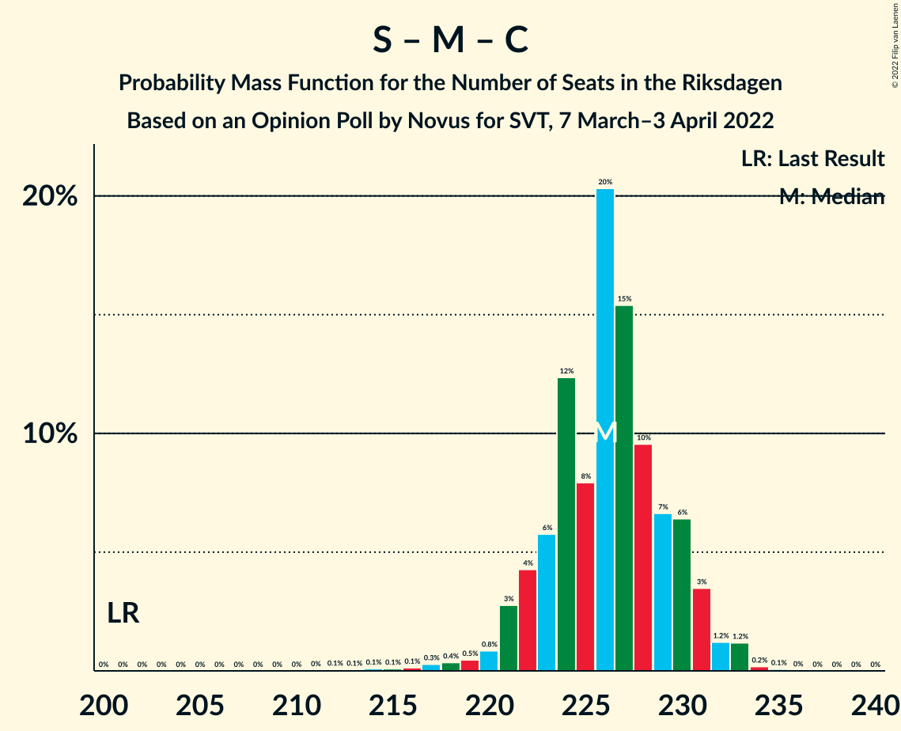
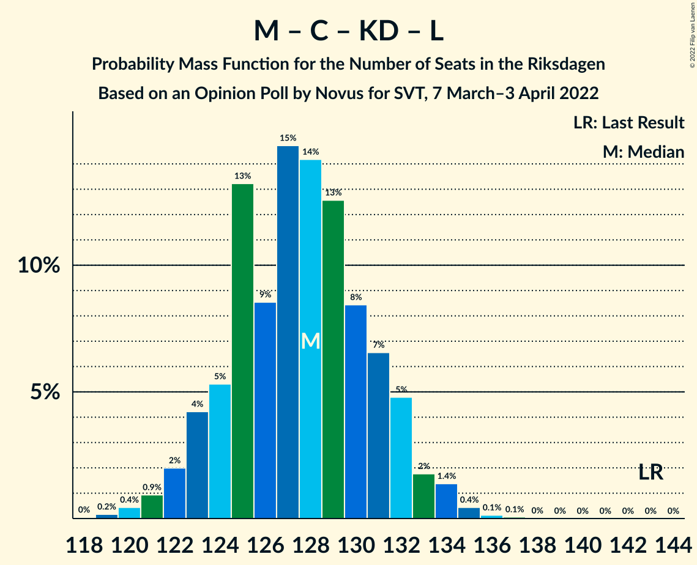
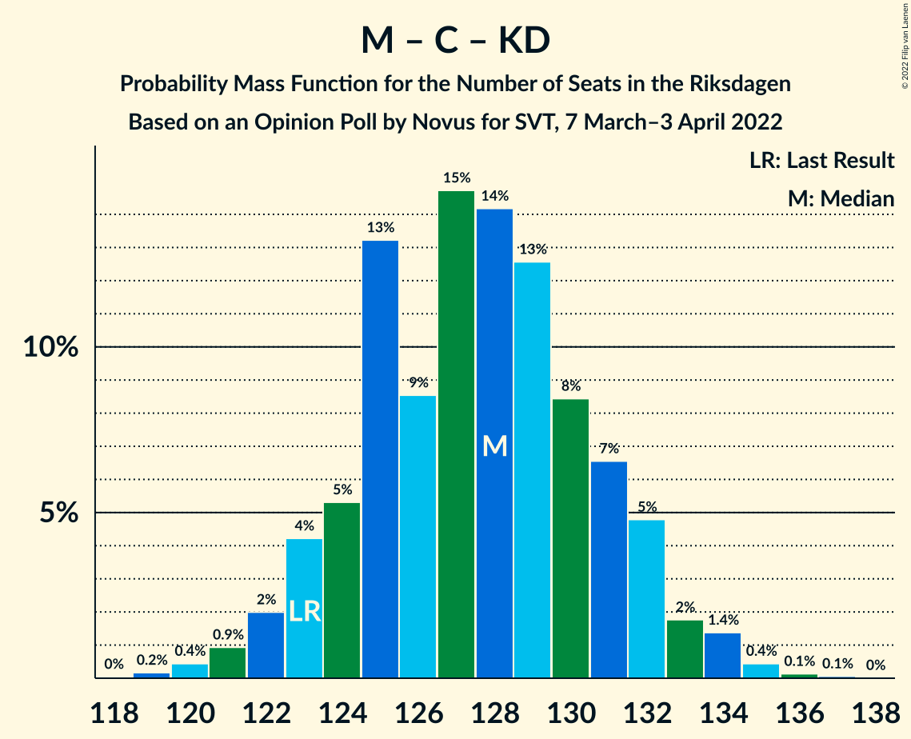

# Opinion Poll by Novus for SVT, 7 March–3 April 2022

<a href="#voting-intentions">Voting Intentions</a> | <a href="#seats">Seats</a> | <a href="#coalitions">Coalitions</a> | <a href="#technical-information">Technical Information</a>

## Voting Intentions

### Confidence Intervals

| Party | Last Result | Poll Result | 80% Confidence Interval | 90% Confidence Interval | 95% Confidence Interval | 99% Confidence Interval |
|:-----:|:-----------:|:-----------:|:-----------------------:|:-----------------------:|:-----------------------:|:-----------------------:|
| Sveriges socialdemokratiska arbetareparti | 28.3% | 32.0% | 31.1–33.0% |30.8–33.2% |30.6–33.5% |30.1–33.9% |
| Moderata samlingspartiet | 19.8% | 21.5% | 20.7–22.3% |20.4–22.6% |20.2–22.8% |19.8–23.2% |
| Sverigedemokraterna | 17.5% | 18.7% | 17.9–19.5% |17.7–19.8% |17.5–20.0% |17.1–20.3% |
| Vänsterpartiet | 8.0% | 8.3% | 7.8–8.9% |7.6–9.1% |7.5–9.2% |7.2–9.5% |
| Centerpartiet | 8.6% | 6.8% | 6.3–7.3% |6.2–7.5% |6.1–7.6% |5.8–7.9% |
| Kristdemokraterna | 6.3% | 5.7% | 5.2–6.2% |5.1–6.3% |5.0–6.5% |4.8–6.7% |
| Miljöpartiet de gröna | 4.4% | 3.3% | 2.9–3.7% |2.9–3.8% |2.8–3.9% |2.6–4.1% |
| Liberalerna | 5.5% | 2.1% | 1.8–2.4% |1.8–2.5% |1.7–2.6% |1.6–2.8% |

*Note:* The poll result column reflects the actual value used in the calculations. Published results may vary slightly, and in addition be rounded to fewer digits.

## Seats

### Confidence Intervals

| Party | Last Result | Median | 80% Confidence Interval | 90% Confidence Interval | 95% Confidence Interval | 99% Confidence Interval |
|:-----:|:-----------:|:------:|:-----------------------:|:-----------------------:|:-----------------------:|:-----------------------:|
| <a href="#sveriges-socialdemokratiska-arbetareparti">Sveriges socialdemokratiska arbetareparti</a> | 100 | 120 | 117–123 |116–125 |114–125 |112–127 |
| <a href="#moderata-samlingspartiet">Moderata samlingspartiet</a> | 70 | 80 | 78–84 |77–85 |76–85 |74–87 |
| <a href="#sverigedemokraterna">Sverigedemokraterna</a> | 62 | 70 | 67–73 |66–74 |66–75 |64–76 |
| <a href="#vänsterpartiet">Vänsterpartiet</a> | 28 | 31 | 29–33 |29–34 |28–35 |27–36 |
| <a href="#centerpartiet">Centerpartiet</a> | 31 | 25 | 24–27 |23–28 |23–29 |22–30 |
| <a href="#kristdemokraterna">Kristdemokraterna</a> | 22 | 21 | 20–23 |19–24 |19–24 |18–25 |
| <a href="#miljöpartiet-de-gröna">Miljöpartiet de gröna</a> | 16 | 0 | 0 |0 |0 |0–15 |
| <a href="#liberalerna">Liberalerna</a> | 20 | 0 | 0 |0 |0 |0 |

### Sveriges socialdemokratiska arbetareparti

*For a full overview of the results for this party, see the [Sveriges socialdemokratiska arbetareparti](party-sverigessocialdemokratiskaarbetareparti.html) page.*

| Number of Seats | Probability | Accumulated | Special Marks |
|:---------------:|:-----------:|:-----------:|:-------------:|
| 100 | 0% | 100% | Last Result |
| 101 | 0% | 100% |  |
| 102 | 0% | 100% |  |
| 103 | 0% | 100% |  |
| 104 | 0% | 100% |  |
| 105 | 0% | 100% |  |
| 106 | 0% | 100% |  |
| 107 | 0% | 100% |  |
| 108 | 0% | 100% |  |
| 109 | 0% | 100% |  |
| 110 | 0% | 100% |  |
| 111 | 0.1% | 99.9% |  |
| 112 | 0.4% | 99.8% |  |
| 113 | 0.6% | 99.5% |  |
| 114 | 1.4% | 98.9% |  |
| 115 | 2% | 97% |  |
| 116 | 5% | 95% |  |
| 117 | 8% | 91% |  |
| 118 | 12% | 83% |  |
| 119 | 10% | 71% |  |
| 120 | 15% | 61% | Median |
| 121 | 17% | 46% |  |
| 122 | 11% | 29% |  |
| 123 | 8% | 18% |  |
| 124 | 5% | 10% |  |
| 125 | 3% | 5% |  |
| 126 | 1.3% | 2% |  |
| 127 | 0.6% | 0.8% |  |
| 128 | 0.2% | 0.3% |  |
| 129 | 0.1% | 0.1% |  |
| 130 | 0% | 0% |  |

### Moderata samlingspartiet

*For a full overview of the results for this party, see the [Moderata samlingspartiet](party-moderatasamlingspartiet.html) page.*

| Number of Seats | Probability | Accumulated | Special Marks |
|:---------------:|:-----------:|:-----------:|:-------------:|
| 70 | 0% | 100% | Last Result |
| 71 | 0% | 100% |  |
| 72 | 0% | 100% |  |
| 73 | 0.1% | 100% |  |
| 74 | 0.6% | 99.8% |  |
| 75 | 1.2% | 99.2% |  |
| 76 | 2% | 98% |  |
| 77 | 5% | 96% |  |
| 78 | 9% | 91% |  |
| 79 | 17% | 82% |  |
| 80 | 19% | 65% | Median |
| 81 | 13% | 46% |  |
| 82 | 11% | 33% |  |
| 83 | 10% | 22% |  |
| 84 | 7% | 13% |  |
| 85 | 4% | 5% |  |
| 86 | 1.0% | 2% |  |
| 87 | 0.4% | 0.6% |  |
| 88 | 0.1% | 0.2% |  |
| 89 | 0.1% | 0.1% |  |
| 90 | 0% | 0% |  |

### Sverigedemokraterna

*For a full overview of the results for this party, see the [Sverigedemokraterna](party-sverigedemokraterna.html) page.*

| Number of Seats | Probability | Accumulated | Special Marks |
|:---------------:|:-----------:|:-----------:|:-------------:|
| 62 | 0% | 100% | Last Result |
| 63 | 0.2% | 100% |  |
| 64 | 0.7% | 99.8% |  |
| 65 | 1.2% | 99.1% |  |
| 66 | 4% | 98% |  |
| 67 | 7% | 94% |  |
| 68 | 10% | 87% |  |
| 69 | 16% | 77% |  |
| 70 | 20% | 62% | Median |
| 71 | 17% | 42% |  |
| 72 | 8% | 25% |  |
| 73 | 8% | 16% |  |
| 74 | 5% | 8% |  |
| 75 | 2% | 3% |  |
| 76 | 0.7% | 1.0% |  |
| 77 | 0.3% | 0.4% |  |
| 78 | 0% | 0.1% |  |
| 79 | 0% | 0% |  |

### Vänsterpartiet

*For a full overview of the results for this party, see the [Vänsterpartiet](party-vänsterpartiet.html) page.*

| Number of Seats | Probability | Accumulated | Special Marks |
|:---------------:|:-----------:|:-----------:|:-------------:|
| 26 | 0.1% | 100% |  |
| 27 | 0.7% | 99.9% |  |
| 28 | 4% | 99.2% | Last Result |
| 29 | 9% | 95% |  |
| 30 | 23% | 86% |  |
| 31 | 24% | 63% | Median |
| 32 | 22% | 39% |  |
| 33 | 10% | 17% |  |
| 34 | 4% | 8% |  |
| 35 | 3% | 3% |  |
| 36 | 0.6% | 0.7% |  |
| 37 | 0.1% | 0.1% |  |
| 38 | 0% | 0% |  |

### Centerpartiet

*For a full overview of the results for this party, see the [Centerpartiet](party-centerpartiet.html) page.*

| Number of Seats | Probability | Accumulated | Special Marks |
|:---------------:|:-----------:|:-----------:|:-------------:|
| 21 | 0.2% | 100% |  |
| 22 | 2% | 99.8% |  |
| 23 | 6% | 98% |  |
| 24 | 15% | 92% |  |
| 25 | 26% | 76% | Median |
| 26 | 23% | 50% |  |
| 27 | 18% | 27% |  |
| 28 | 7% | 10% |  |
| 29 | 2% | 3% |  |
| 30 | 0.6% | 0.7% |  |
| 31 | 0.1% | 0.1% | Last Result |
| 32 | 0% | 0% |  |

### Kristdemokraterna

*For a full overview of the results for this party, see the [Kristdemokraterna](party-kristdemokraterna.html) page.*

| Number of Seats | Probability | Accumulated | Special Marks |
|:---------------:|:-----------:|:-----------:|:-------------:|
| 17 | 0.1% | 100% |  |
| 18 | 1.5% | 99.9% |  |
| 19 | 6% | 98% |  |
| 20 | 20% | 93% |  |
| 21 | 27% | 73% | Median |
| 22 | 21% | 47% | Last Result |
| 23 | 20% | 26% |  |
| 24 | 5% | 6% |  |
| 25 | 1.1% | 1.3% |  |
| 26 | 0.2% | 0.2% |  |
| 27 | 0% | 0% |  |

### Miljöpartiet de gröna

*For a full overview of the results for this party, see the [Miljöpartiet de gröna](party-miljöpartietdegröna.html) page.*

| Number of Seats | Probability | Accumulated | Special Marks |
|:---------------:|:-----------:|:-----------:|:-------------:|
| 0 | 99.0% | 100% | Median |
| 1 | 0% | 1.0% |  |
| 2 | 0% | 1.0% |  |
| 3 | 0% | 1.0% |  |
| 4 | 0% | 1.0% |  |
| 5 | 0% | 1.0% |  |
| 6 | 0% | 1.0% |  |
| 7 | 0% | 1.0% |  |
| 8 | 0% | 1.0% |  |
| 9 | 0% | 1.0% |  |
| 10 | 0% | 1.0% |  |
| 11 | 0% | 1.0% |  |
| 12 | 0% | 1.0% |  |
| 13 | 0% | 1.0% |  |
| 14 | 0% | 1.0% |  |
| 15 | 0.9% | 1.0% |  |
| 16 | 0.1% | 0.1% | Last Result |
| 17 | 0% | 0% |  |

### Liberalerna

*For a full overview of the results for this party, see the [Liberalerna](party-liberalerna.html) page.*

| Number of Seats | Probability | Accumulated | Special Marks |
|:---------------:|:-----------:|:-----------:|:-------------:|
| 0 | 100% | 100% | Median |
| 1 | 0% | 0% |  |
| 2 | 0% | 0% |  |
| 3 | 0% | 0% |  |
| 4 | 0% | 0% |  |
| 5 | 0% | 0% |  |
| 6 | 0% | 0% |  |
| 7 | 0% | 0% |  |
| 8 | 0% | 0% |  |
| 9 | 0% | 0% |  |
| 10 | 0% | 0% |  |
| 11 | 0% | 0% |  |
| 12 | 0% | 0% |  |
| 13 | 0% | 0% |  |
| 14 | 0% | 0% |  |
| 15 | 0% | 0% |  |
| 16 | 0% | 0% |  |
| 17 | 0% | 0% |  |
| 18 | 0% | 0% |  |
| 19 | 0% | 0% |  |
| 20 | 0% | 0% | Last Result |

## Coalitions

### Confidence Intervals

| Coalition | Last Result | Median | Majority? | 80% Confidence Interval | 90% Confidence Interval | 95% Confidence Interval | 99% Confidence Interval |
|:---------:|:-----------:|:------:|:---------:|:-----------------------:|:-----------------------:|:-----------------------:|:-----------------------:|
| Sveriges socialdemokratiska arbetareparti – Moderata samlingspartiet – Centerpartiet | 201 | 226 | 100% | 223–230 | 221–231 | 221–232 | 217–233 |
| Sveriges socialdemokratiska arbetareparti – Moderata samlingspartiet | 170 | 201 | 100% | 197–204 | 196–205 | 195–206 | 192–208 |
| Sveriges socialdemokratiska arbetareparti – Vänsterpartiet – Centerpartiet – Miljöpartiet de gröna – Liberalerna | 195 | 177 | 81% | 173–181 | 172–182 | 171–183 | 169–185 |
| Moderata samlingspartiet – Sverigedemokraterna – Kristdemokraterna | 154 | 172 | 19% | 168–176 | 167–177 | 166–178 | 164–180 |
| Sveriges socialdemokratiska arbetareparti – Vänsterpartiet – Miljöpartiet de gröna | 144 | 151 | 0% | 148–155 | 147–156 | 145–157 | 144–160 |
| Sveriges socialdemokratiska arbetareparti – Vänsterpartiet | 128 | 151 | 0% | 148–155 | 146–156 | 145–157 | 143–158 |
| Moderata samlingspartiet – Sverigedemokraterna | 132 | 150 | 0% | 147–154 | 146–155 | 145–156 | 142–158 |
| Sveriges socialdemokratiska arbetareparti – Centerpartiet – Miljöpartiet de gröna – Liberalerna | 167 | 146 | 0% | 142–149 | 141–151 | 140–152 | 138–155 |
| Moderata samlingspartiet – Centerpartiet – Kristdemokraterna – Liberalerna | 143 | 128 | 0% | 124–131 | 123–132 | 122–133 | 120–135 |
| Moderata samlingspartiet – Centerpartiet – Kristdemokraterna | 123 | 128 | 0% | 124–131 | 123–132 | 122–133 | 120–135 |
| Sveriges socialdemokratiska arbetareparti – Miljöpartiet de gröna | 116 | 120 | 0% | 117–124 | 116–125 | 115–126 | 113–130 |
| Moderata samlingspartiet – Centerpartiet – Liberalerna | 121 | 106 | 0% | 103–110 | 102–111 | 101–111 | 99–113 |
| Moderata samlingspartiet – Centerpartiet | 101 | 106 | 0% | 103–110 | 102–111 | 101–111 | 99–113 |

### Sveriges socialdemokratiska arbetareparti – Moderata samlingspartiet – Centerpartiet

| Number of Seats | Probability | Accumulated | Special Marks |
|:---------------:|:-----------:|:-----------:|:-------------:|
| 201 | 0% | 100% | Last Result |
| 202 | 0% | 100% |  |
| 203 | 0% | 100% |  |
| 204 | 0% | 100% |  |
| 205 | 0% | 100% |  |
| 206 | 0% | 100% |  |
| 207 | 0% | 100% |  |
| 208 | 0% | 100% |  |
| 209 | 0% | 100% |  |
| 210 | 0% | 100% |  |
| 211 | 0% | 100% |  |
| 212 | 0.1% | 100% |  |
| 213 | 0.1% | 99.9% |  |
| 214 | 0.1% | 99.9% |  |
| 215 | 0.1% | 99.8% |  |
| 216 | 0.1% | 99.7% |  |
| 217 | 0.3% | 99.5% |  |
| 218 | 0.4% | 99.2% |  |
| 219 | 0.5% | 98.9% |  |
| 220 | 0.8% | 98% |  |
| 221 | 3% | 98% |  |
| 222 | 4% | 95% |  |
| 223 | 6% | 91% |  |
| 224 | 12% | 85% |  |
| 225 | 8% | 72% | Median |
| 226 | 20% | 64% |  |
| 227 | 15% | 44% |  |
| 228 | 10% | 29% |  |
| 229 | 7% | 19% |  |
| 230 | 6% | 13% |  |
| 231 | 3% | 6% |  |
| 232 | 1.2% | 3% |  |
| 233 | 1.2% | 1.5% |  |
| 234 | 0.2% | 0.3% |  |
| 235 | 0.1% | 0.1% |  |
| 236 | 0% | 0% |  |

### Sveriges socialdemokratiska arbetareparti – Moderata samlingspartiet

| Number of Seats | Probability | Accumulated | Special Marks |
|:---------------:|:-----------:|:-----------:|:-------------:|
| 170 | 0% | 100% | Last Result |
| 171 | 0% | 100% |  |
| 172 | 0% | 100% |  |
| 173 | 0% | 100% |  |
| 174 | 0% | 100% |  |
| 175 | 0% | 100% | Majority |
| 176 | 0% | 100% |  |
| 177 | 0% | 100% |  |
| 178 | 0% | 100% |  |
| 179 | 0% | 100% |  |
| 180 | 0% | 100% |  |
| 181 | 0% | 100% |  |
| 182 | 0% | 100% |  |
| 183 | 0% | 100% |  |
| 184 | 0% | 100% |  |
| 185 | 0% | 100% |  |
| 186 | 0% | 100% |  |
| 187 | 0% | 100% |  |
| 188 | 0.1% | 99.9% |  |
| 189 | 0.1% | 99.9% |  |
| 190 | 0.1% | 99.8% |  |
| 191 | 0.1% | 99.7% |  |
| 192 | 0.4% | 99.5% |  |
| 193 | 0.4% | 99.1% |  |
| 194 | 1.2% | 98.7% |  |
| 195 | 1.4% | 98% |  |
| 196 | 4% | 96% |  |
| 197 | 6% | 92% |  |
| 198 | 7% | 86% |  |
| 199 | 10% | 79% |  |
| 200 | 15% | 69% | Median |
| 201 | 16% | 53% |  |
| 202 | 12% | 37% |  |
| 203 | 11% | 25% |  |
| 204 | 6% | 14% |  |
| 205 | 4% | 8% |  |
| 206 | 3% | 4% |  |
| 207 | 0.8% | 2% |  |
| 208 | 0.6% | 0.8% |  |
| 209 | 0.1% | 0.3% |  |
| 210 | 0.1% | 0.1% |  |
| 211 | 0% | 0% |  |

### Sveriges socialdemokratiska arbetareparti – Vänsterpartiet – Centerpartiet – Miljöpartiet de gröna – Liberalerna

| Number of Seats | Probability | Accumulated | Special Marks |
|:---------------:|:-----------:|:-----------:|:-------------:|
| 167 | 0% | 100% |  |
| 168 | 0.3% | 99.9% |  |
| 169 | 0.3% | 99.7% |  |
| 170 | 0.6% | 99.3% |  |
| 171 | 2% | 98.7% |  |
| 172 | 3% | 97% |  |
| 173 | 4% | 93% |  |
| 174 | 8% | 89% |  |
| 175 | 12% | 81% | Majority |
| 176 | 16% | 69% | Median |
| 177 | 13% | 53% |  |
| 178 | 11% | 41% |  |
| 179 | 12% | 29% |  |
| 180 | 5% | 17% |  |
| 181 | 5% | 12% |  |
| 182 | 4% | 7% |  |
| 183 | 2% | 3% |  |
| 184 | 0.6% | 1.4% |  |
| 185 | 0.3% | 0.8% |  |
| 186 | 0.2% | 0.5% |  |
| 187 | 0.2% | 0.3% |  |
| 188 | 0.1% | 0.1% |  |
| 189 | 0% | 0.1% |  |
| 190 | 0% | 0% |  |
| 191 | 0% | 0% |  |
| 192 | 0% | 0% |  |
| 193 | 0% | 0% |  |
| 194 | 0% | 0% |  |
| 195 | 0% | 0% | Last Result |

### Moderata samlingspartiet – Sverigedemokraterna – Kristdemokraterna

| Number of Seats | Probability | Accumulated | Special Marks |
|:---------------:|:-----------:|:-----------:|:-------------:|
| 154 | 0% | 100% | Last Result |
| 155 | 0% | 100% |  |
| 156 | 0% | 100% |  |
| 157 | 0% | 100% |  |
| 158 | 0% | 100% |  |
| 159 | 0% | 100% |  |
| 160 | 0% | 100% |  |
| 161 | 0.1% | 99.9% |  |
| 162 | 0.2% | 99.9% |  |
| 163 | 0.2% | 99.7% |  |
| 164 | 0.3% | 99.5% |  |
| 165 | 0.6% | 99.2% |  |
| 166 | 2% | 98.6% |  |
| 167 | 4% | 97% |  |
| 168 | 5% | 93% |  |
| 169 | 5% | 88% |  |
| 170 | 12% | 83% |  |
| 171 | 11% | 71% | Median |
| 172 | 13% | 59% |  |
| 173 | 16% | 47% |  |
| 174 | 12% | 31% |  |
| 175 | 8% | 19% | Majority |
| 176 | 4% | 11% |  |
| 177 | 3% | 7% |  |
| 178 | 2% | 3% |  |
| 179 | 0.6% | 1.3% |  |
| 180 | 0.3% | 0.7% |  |
| 181 | 0.3% | 0.3% |  |
| 182 | 0% | 0.1% |  |
| 183 | 0% | 0% |  |

### Sveriges socialdemokratiska arbetareparti – Vänsterpartiet – Miljöpartiet de gröna

| Number of Seats | Probability | Accumulated | Special Marks |
|:---------------:|:-----------:|:-----------:|:-------------:|
| 142 | 0.1% | 100% |  |
| 143 | 0.4% | 99.9% |  |
| 144 | 0.3% | 99.5% | Last Result |
| 145 | 2% | 99.2% |  |
| 146 | 2% | 97% |  |
| 147 | 3% | 95% |  |
| 148 | 9% | 92% |  |
| 149 | 6% | 83% |  |
| 150 | 15% | 77% |  |
| 151 | 16% | 61% | Median |
| 152 | 8% | 45% |  |
| 153 | 17% | 37% |  |
| 154 | 6% | 20% |  |
| 155 | 7% | 14% |  |
| 156 | 3% | 7% |  |
| 157 | 2% | 4% |  |
| 158 | 1.1% | 2% |  |
| 159 | 0.4% | 1.2% |  |
| 160 | 0.2% | 0.7% |  |
| 161 | 0.2% | 0.5% |  |
| 162 | 0.2% | 0.3% |  |
| 163 | 0% | 0.1% |  |
| 164 | 0% | 0.1% |  |
| 165 | 0% | 0% |  |

### Sveriges socialdemokratiska arbetareparti – Vänsterpartiet

| Number of Seats | Probability | Accumulated | Special Marks |
|:---------------:|:-----------:|:-----------:|:-------------:|
| 128 | 0% | 100% | Last Result |
| 129 | 0% | 100% |  |
| 130 | 0% | 100% |  |
| 131 | 0% | 100% |  |
| 132 | 0% | 100% |  |
| 133 | 0% | 100% |  |
| 134 | 0% | 100% |  |
| 135 | 0% | 100% |  |
| 136 | 0% | 100% |  |
| 137 | 0% | 100% |  |
| 138 | 0% | 100% |  |
| 139 | 0% | 100% |  |
| 140 | 0% | 100% |  |
| 141 | 0.1% | 99.9% |  |
| 142 | 0.2% | 99.8% |  |
| 143 | 0.4% | 99.7% |  |
| 144 | 0.5% | 99.3% |  |
| 145 | 2% | 98.7% |  |
| 146 | 2% | 96% |  |
| 147 | 4% | 95% |  |
| 148 | 9% | 91% |  |
| 149 | 6% | 82% |  |
| 150 | 15% | 76% |  |
| 151 | 16% | 60% | Median |
| 152 | 8% | 44% |  |
| 153 | 17% | 36% |  |
| 154 | 6% | 19% |  |
| 155 | 7% | 13% |  |
| 156 | 3% | 6% |  |
| 157 | 1.4% | 3% |  |
| 158 | 1.1% | 1.5% |  |
| 159 | 0.2% | 0.4% |  |
| 160 | 0.1% | 0.2% |  |
| 161 | 0.1% | 0.1% |  |
| 162 | 0% | 0% |  |

### Moderata samlingspartiet – Sverigedemokraterna

| Number of Seats | Probability | Accumulated | Special Marks |
|:---------------:|:-----------:|:-----------:|:-------------:|
| 132 | 0% | 100% | Last Result |
| 133 | 0% | 100% |  |
| 134 | 0% | 100% |  |
| 135 | 0% | 100% |  |
| 136 | 0% | 100% |  |
| 137 | 0% | 100% |  |
| 138 | 0% | 100% |  |
| 139 | 0% | 100% |  |
| 140 | 0% | 100% |  |
| 141 | 0.3% | 99.9% |  |
| 142 | 0.2% | 99.7% |  |
| 143 | 0.4% | 99.5% |  |
| 144 | 0.9% | 99.1% |  |
| 145 | 1.5% | 98% |  |
| 146 | 5% | 97% |  |
| 147 | 6% | 92% |  |
| 148 | 7% | 86% |  |
| 149 | 9% | 79% |  |
| 150 | 21% | 70% | Median |
| 151 | 13% | 50% |  |
| 152 | 11% | 36% |  |
| 153 | 10% | 25% |  |
| 154 | 7% | 16% |  |
| 155 | 5% | 9% |  |
| 156 | 2% | 4% |  |
| 157 | 1.0% | 2% |  |
| 158 | 0.8% | 1.1% |  |
| 159 | 0.2% | 0.3% |  |
| 160 | 0.1% | 0.1% |  |
| 161 | 0% | 0% |  |

### Sveriges socialdemokratiska arbetareparti – Centerpartiet – Miljöpartiet de gröna – Liberalerna

| Number of Seats | Probability | Accumulated | Special Marks |
|:---------------:|:-----------:|:-----------:|:-------------:|
| 136 | 0% | 100% |  |
| 137 | 0.2% | 99.9% |  |
| 138 | 0.3% | 99.8% |  |
| 139 | 0.9% | 99.4% |  |
| 140 | 2% | 98% |  |
| 141 | 4% | 97% |  |
| 142 | 3% | 93% |  |
| 143 | 10% | 89% |  |
| 144 | 14% | 79% |  |
| 145 | 11% | 66% | Median |
| 146 | 17% | 55% |  |
| 147 | 13% | 38% |  |
| 148 | 7% | 25% |  |
| 149 | 10% | 18% |  |
| 150 | 3% | 8% |  |
| 151 | 2% | 6% |  |
| 152 | 2% | 3% |  |
| 153 | 0.4% | 1.3% |  |
| 154 | 0.3% | 0.9% |  |
| 155 | 0.2% | 0.6% |  |
| 156 | 0.2% | 0.5% |  |
| 157 | 0.1% | 0.2% |  |
| 158 | 0% | 0.1% |  |
| 159 | 0% | 0.1% |  |
| 160 | 0% | 0.1% |  |
| 161 | 0% | 0% |  |
| 162 | 0% | 0% |  |
| 163 | 0% | 0% |  |
| 164 | 0% | 0% |  |
| 165 | 0% | 0% |  |
| 166 | 0% | 0% |  |
| 167 | 0% | 0% | Last Result |

### Moderata samlingspartiet – Centerpartiet – Kristdemokraterna – Liberalerna

| Number of Seats | Probability | Accumulated | Special Marks |
|:---------------:|:-----------:|:-----------:|:-------------:|
| 118 | 0% | 100% |  |
| 119 | 0.2% | 99.9% |  |
| 120 | 0.4% | 99.7% |  |
| 121 | 0.9% | 99.3% |  |
| 122 | 2% | 98% |  |
| 123 | 4% | 96% |  |
| 124 | 5% | 92% |  |
| 125 | 13% | 87% |  |
| 126 | 9% | 74% | Median |
| 127 | 15% | 65% |  |
| 128 | 14% | 50% |  |
| 129 | 13% | 36% |  |
| 130 | 8% | 24% |  |
| 131 | 7% | 15% |  |
| 132 | 5% | 9% |  |
| 133 | 2% | 4% |  |
| 134 | 1.4% | 2% |  |
| 135 | 0.4% | 0.7% |  |
| 136 | 0.1% | 0.2% |  |
| 137 | 0.1% | 0.1% |  |
| 138 | 0% | 0% |  |
| 139 | 0% | 0% |  |
| 140 | 0% | 0% |  |
| 141 | 0% | 0% |  |
| 142 | 0% | 0% |  |
| 143 | 0% | 0% | Last Result |

### Moderata samlingspartiet – Centerpartiet – Kristdemokraterna

| Number of Seats | Probability | Accumulated | Special Marks |
|:---------------:|:-----------:|:-----------:|:-------------:|
| 118 | 0% | 100% |  |
| 119 | 0.2% | 99.9% |  |
| 120 | 0.4% | 99.7% |  |
| 121 | 0.9% | 99.3% |  |
| 122 | 2% | 98% |  |
| 123 | 4% | 96% | Last Result |
| 124 | 5% | 92% |  |
| 125 | 13% | 87% |  |
| 126 | 9% | 74% | Median |
| 127 | 15% | 65% |  |
| 128 | 14% | 50% |  |
| 129 | 13% | 36% |  |
| 130 | 8% | 24% |  |
| 131 | 7% | 15% |  |
| 132 | 5% | 9% |  |
| 133 | 2% | 4% |  |
| 134 | 1.4% | 2% |  |
| 135 | 0.4% | 0.7% |  |
| 136 | 0.1% | 0.2% |  |
| 137 | 0.1% | 0.1% |  |
| 138 | 0% | 0% |  |

### Sveriges socialdemokratiska arbetareparti – Miljöpartiet de gröna

| Number of Seats | Probability | Accumulated | Special Marks |
|:---------------:|:-----------:|:-----------:|:-------------:|
| 111 | 0.1% | 100% |  |
| 112 | 0.3% | 99.9% |  |
| 113 | 0.4% | 99.7% |  |
| 114 | 1.3% | 99.2% |  |
| 115 | 2% | 98% |  |
| 116 | 5% | 96% | Last Result |
| 117 | 7% | 91% |  |
| 118 | 12% | 84% |  |
| 119 | 10% | 72% |  |
| 120 | 15% | 62% | Median |
| 121 | 17% | 47% |  |
| 122 | 11% | 30% |  |
| 123 | 8% | 19% |  |
| 124 | 5% | 11% |  |
| 125 | 3% | 6% |  |
| 126 | 1.3% | 3% |  |
| 127 | 0.7% | 2% |  |
| 128 | 0.3% | 1.1% |  |
| 129 | 0.2% | 0.8% |  |
| 130 | 0.1% | 0.6% |  |
| 131 | 0.3% | 0.5% |  |
| 132 | 0.1% | 0.2% |  |
| 133 | 0.1% | 0.1% |  |
| 134 | 0% | 0.1% |  |
| 135 | 0% | 0.1% |  |
| 136 | 0% | 0% |  |

### Moderata samlingspartiet – Centerpartiet – Liberalerna

| Number of Seats | Probability | Accumulated | Special Marks |
|:---------------:|:-----------:|:-----------:|:-------------:|
| 97 | 0% | 100% |  |
| 98 | 0.2% | 99.9% |  |
| 99 | 0.4% | 99.7% |  |
| 100 | 1.0% | 99.3% |  |
| 101 | 2% | 98% |  |
| 102 | 5% | 96% |  |
| 103 | 5% | 91% |  |
| 104 | 11% | 86% |  |
| 105 | 22% | 75% | Median |
| 106 | 13% | 53% |  |
| 107 | 9% | 40% |  |
| 108 | 10% | 30% |  |
| 109 | 9% | 21% |  |
| 110 | 6% | 12% |  |
| 111 | 4% | 5% |  |
| 112 | 0.9% | 2% |  |
| 113 | 0.5% | 0.8% |  |
| 114 | 0.1% | 0.2% |  |
| 115 | 0.1% | 0.1% |  |
| 116 | 0% | 0% |  |
| 117 | 0% | 0% |  |
| 118 | 0% | 0% |  |
| 119 | 0% | 0% |  |
| 120 | 0% | 0% |  |
| 121 | 0% | 0% | Last Result |

### Moderata samlingspartiet – Centerpartiet

| Number of Seats | Probability | Accumulated | Special Marks |
|:---------------:|:-----------:|:-----------:|:-------------:|
| 97 | 0% | 100% |  |
| 98 | 0.2% | 99.9% |  |
| 99 | 0.4% | 99.7% |  |
| 100 | 1.0% | 99.3% |  |
| 101 | 2% | 98% | Last Result |
| 102 | 5% | 96% |  |
| 103 | 5% | 91% |  |
| 104 | 11% | 86% |  |
| 105 | 22% | 75% | Median |
| 106 | 13% | 53% |  |
| 107 | 9% | 40% |  |
| 108 | 10% | 30% |  |
| 109 | 9% | 21% |  |
| 110 | 6% | 12% |  |
| 111 | 4% | 5% |  |
| 112 | 0.9% | 2% |  |
| 113 | 0.5% | 0.8% |  |
| 114 | 0.1% | 0.2% |  |
| 115 | 0.1% | 0.1% |  |
| 116 | 0% | 0% |  |

## Technical Information

### Opinion Poll

+ **Polling firm:** Novus
+ **Commissioner(s):** SVT
+ **Fieldwork period:** 7 March–3 April 2022

### Calculations

+ **Sample size:** 3983
+ **Simulations done:** 1,048,576
+ **Error estimate:** 0.87%

