# Opinion Poll by Demoskop for Aftonbladet, 29 March–5 April 2022

<a href="#voting-intentions">Voting Intentions</a> | <a href="#seats">Seats</a> | <a href="#coalitions">Coalitions</a> | <a href="#technical-information">Technical Information</a>

## Voting Intentions

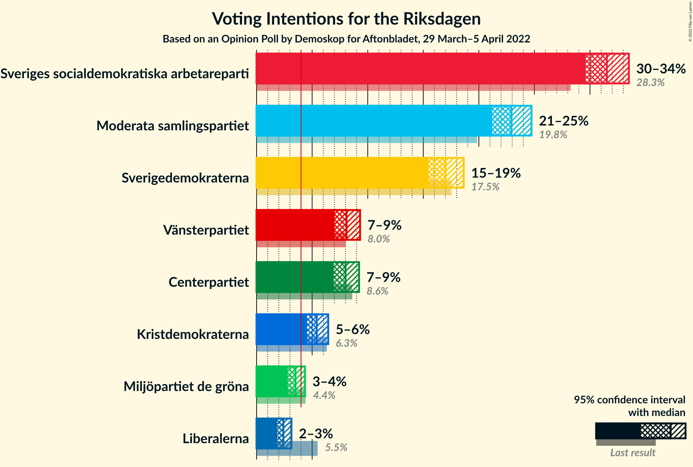

### Confidence Intervals

| Party | Last Result | Poll Result | 80% Confidence Interval | 90% Confidence Interval | 95% Confidence Interval | 99% Confidence Interval |
|:-----:|:-----------:|:-----------:|:-----------------------:|:-----------------------:|:-----------------------:|:-----------------------:|
| Sveriges socialdemokratiska arbetareparti | 28.3% | 31.5% | 30.3–32.8% |29.9–33.2% |29.6–33.5% |29.0–34.1% |
| Moderata samlingspartiet | 19.8% | 22.9% | 21.8–24.1% |21.5–24.4% |21.2–24.7% |20.7–25.3% |
| Sverigedemokraterna | 17.5% | 17.0% | 16.0–18.1% |15.7–18.4% |15.5–18.6% |15.0–19.2% |
| Vänsterpartiet | 8.0% | 8.1% | 7.4–8.9% |7.2–9.1% |7.0–9.3% |6.7–9.7% |
| Centerpartiet | 8.6% | 8.0% | 7.3–8.8% |7.1–9.0% |6.9–9.2% |6.6–9.6% |
| Kristdemokraterna | 6.3% | 5.4% | 4.8–6.1% |4.7–6.3% |4.5–6.4% |4.3–6.8% |
| Miljöpartiet de gröna | 4.4% | 3.5% | 3.0–4.1% |2.9–4.2% |2.8–4.4% |2.6–4.6% |
| Liberalerna | 5.5% | 2.4% | 2.0–2.9% |1.9–3.0% |1.8–3.1% |1.7–3.4% |

*Note:* The poll result column reflects the actual value used in the calculations. Published results may vary slightly, and in addition be rounded to fewer digits.

## Seats

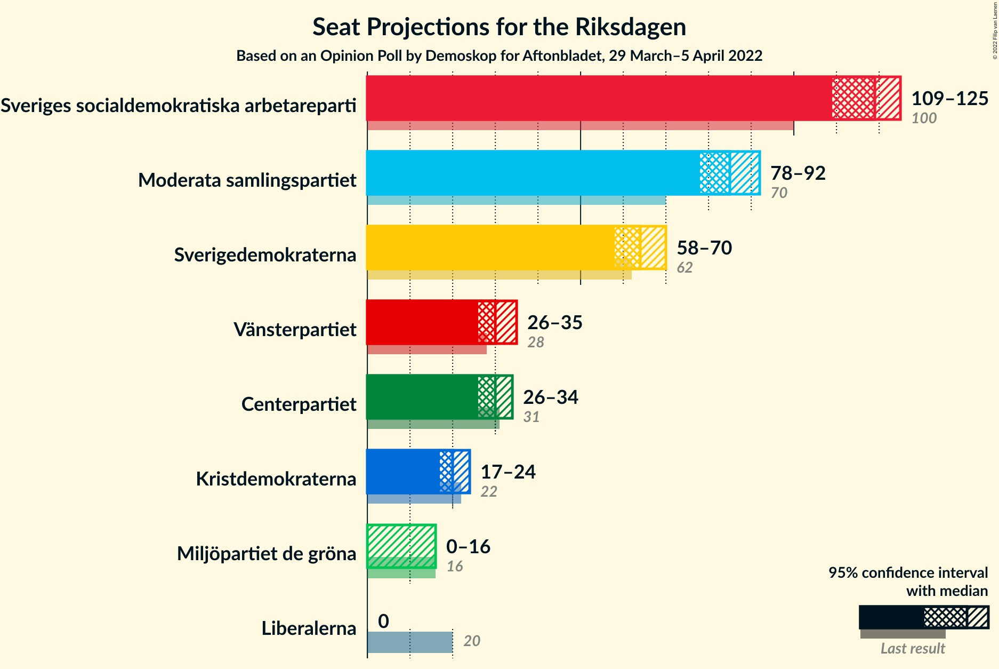

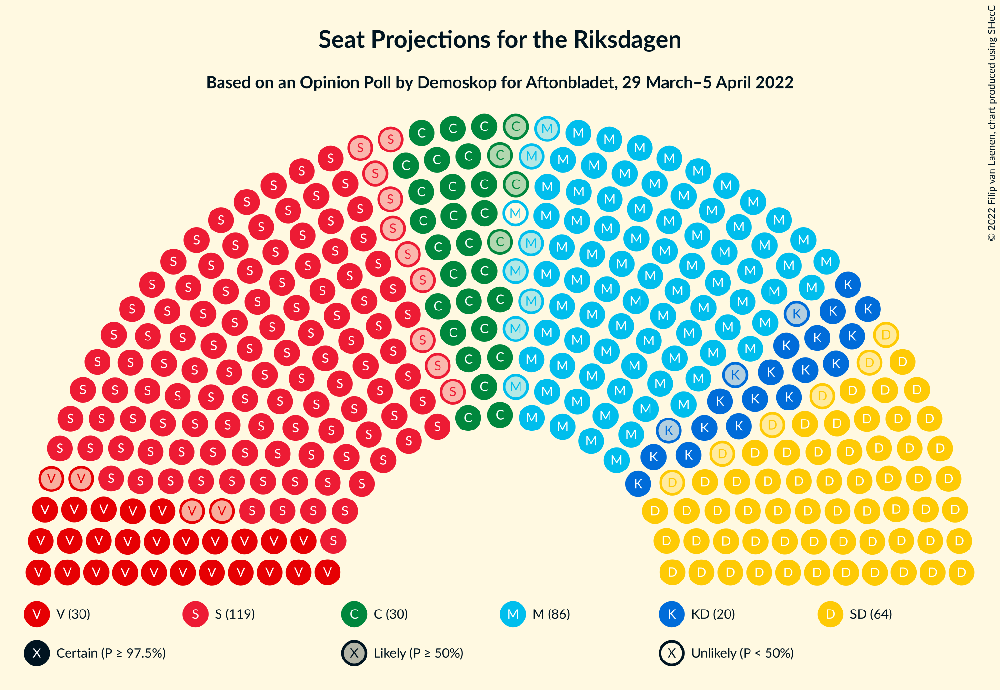

### Confidence Intervals

| Party | Last Result | Median | 80% Confidence Interval | 90% Confidence Interval | 95% Confidence Interval | 99% Confidence Interval |
|:-----:|:-----------:|:------:|:-----------------------:|:-----------------------:|:-----------------------:|:-----------------------:|
| <a href="#sveriges-socialdemokratiska-arbetareparti">Sveriges socialdemokratiska arbetareparti</a> | 100 | 119 | 113–122 |111–125 |109–125 |106–127 |
| <a href="#moderata-samlingspartiet">Moderata samlingspartiet</a> | 70 | 85 | 81–89 |80–91 |78–92 |76–95 |
| <a href="#sverigedemokraterna">Sverigedemokraterna</a> | 62 | 64 | 59–68 |59–69 |58–70 |56–71 |
| <a href="#vänsterpartiet">Vänsterpartiet</a> | 28 | 30 | 28–33 |27–34 |26–35 |25–36 |
| <a href="#centerpartiet">Centerpartiet</a> | 31 | 30 | 27–32 |27–34 |26–34 |25–36 |
| <a href="#kristdemokraterna">Kristdemokraterna</a> | 22 | 20 | 18–23 |18–23 |17–24 |16–25 |
| <a href="#miljöpartiet-de-gröna">Miljöpartiet de gröna</a> | 16 | 0 | 0–14 |0–15 |0–16 |0–17 |
| <a href="#liberalerna">Liberalerna</a> | 20 | 0 | 0 |0 |0 |0 |

### Sveriges socialdemokratiska arbetareparti

*For a full overview of the results for this party, see the [Sveriges socialdemokratiska arbetareparti](party-sverigessocialdemokratiskaarbetareparti.html) page.*

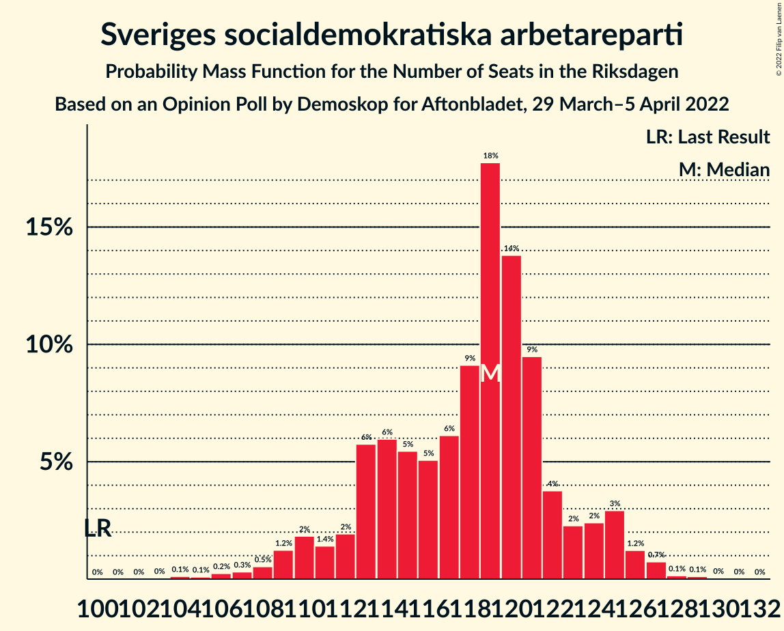

| Number of Seats | Probability | Accumulated | Special Marks |
|:---------------:|:-----------:|:-----------:|:-------------:|
| 100 | 0% | 100% | Last Result |
| 101 | 0% | 100% |  |
| 102 | 0% | 100% |  |
| 103 | 0% | 100% |  |
| 104 | 0.1% | 99.9% |  |
| 105 | 0.1% | 99.8% |  |
| 106 | 0.2% | 99.7% |  |
| 107 | 0.3% | 99.5% |  |
| 108 | 0.5% | 99.2% |  |
| 109 | 1.2% | 98.6% |  |
| 110 | 2% | 97% |  |
| 111 | 1.4% | 96% |  |
| 112 | 2% | 94% |  |
| 113 | 6% | 92% |  |
| 114 | 6% | 86% |  |
| 115 | 5% | 80% |  |
| 116 | 5% | 75% |  |
| 117 | 6% | 70% |  |
| 118 | 9% | 64% |  |
| 119 | 18% | 55% | Median |
| 120 | 14% | 37% |  |
| 121 | 9% | 23% |  |
| 122 | 4% | 14% |  |
| 123 | 2% | 10% |  |
| 124 | 2% | 8% |  |
| 125 | 3% | 5% |  |
| 126 | 1.2% | 2% |  |
| 127 | 0.7% | 1.1% |  |
| 128 | 0.1% | 0.3% |  |
| 129 | 0.1% | 0.2% |  |
| 130 | 0% | 0.1% |  |
| 131 | 0% | 0% |  |

### Moderata samlingspartiet

*For a full overview of the results for this party, see the [Moderata samlingspartiet](party-moderatasamlingspartiet.html) page.*

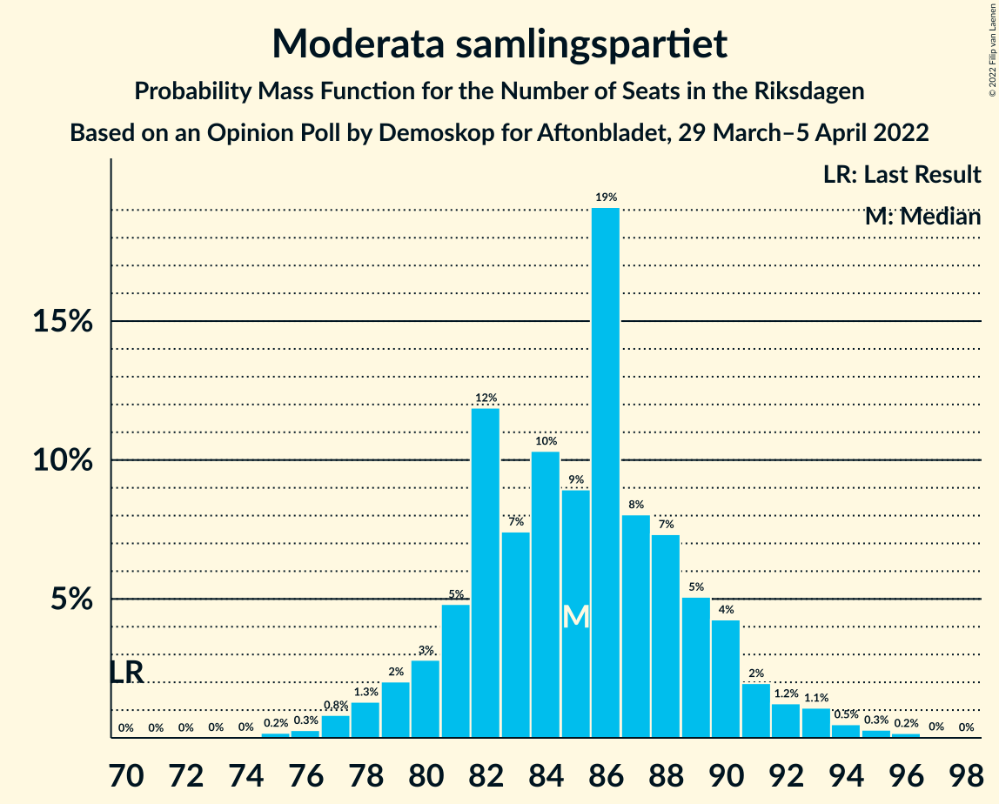

| Number of Seats | Probability | Accumulated | Special Marks |
|:---------------:|:-----------:|:-----------:|:-------------:|
| 70 | 0% | 100% | Last Result |
| 71 | 0% | 100% |  |
| 72 | 0% | 100% |  |
| 73 | 0% | 100% |  |
| 74 | 0% | 100% |  |
| 75 | 0.2% | 99.9% |  |
| 76 | 0.3% | 99.7% |  |
| 77 | 0.8% | 99.5% |  |
| 78 | 1.3% | 98.6% |  |
| 79 | 2% | 97% |  |
| 80 | 3% | 95% |  |
| 81 | 5% | 93% |  |
| 82 | 12% | 88% |  |
| 83 | 7% | 76% |  |
| 84 | 10% | 68% |  |
| 85 | 9% | 58% | Median |
| 86 | 19% | 49% |  |
| 87 | 8% | 30% |  |
| 88 | 7% | 22% |  |
| 89 | 5% | 15% |  |
| 90 | 4% | 10% |  |
| 91 | 2% | 5% |  |
| 92 | 1.2% | 3% |  |
| 93 | 1.1% | 2% |  |
| 94 | 0.5% | 1.0% |  |
| 95 | 0.3% | 0.5% |  |
| 96 | 0.2% | 0.3% |  |
| 97 | 0% | 0.1% |  |
| 98 | 0% | 0% |  |

### Sverigedemokraterna

*For a full overview of the results for this party, see the [Sverigedemokraterna](party-sverigedemokraterna.html) page.*

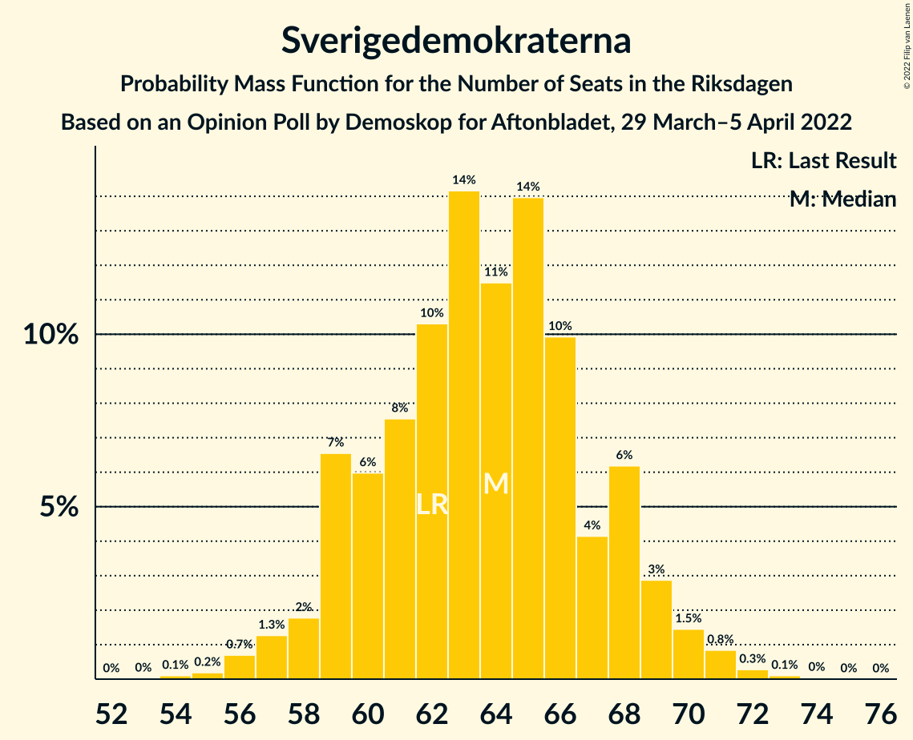

| Number of Seats | Probability | Accumulated | Special Marks |
|:---------------:|:-----------:|:-----------:|:-------------:|
| 54 | 0.1% | 100% |  |
| 55 | 0.2% | 99.9% |  |
| 56 | 0.7% | 99.7% |  |
| 57 | 1.3% | 99.0% |  |
| 58 | 2% | 98% |  |
| 59 | 7% | 96% |  |
| 60 | 6% | 89% |  |
| 61 | 8% | 83% |  |
| 62 | 10% | 76% | Last Result |
| 63 | 14% | 66% |  |
| 64 | 11% | 51% | Median |
| 65 | 14% | 40% |  |
| 66 | 10% | 26% |  |
| 67 | 4% | 16% |  |
| 68 | 6% | 12% |  |
| 69 | 3% | 6% |  |
| 70 | 1.5% | 3% |  |
| 71 | 0.8% | 1.3% |  |
| 72 | 0.3% | 0.4% |  |
| 73 | 0.1% | 0.2% |  |
| 74 | 0% | 0.1% |  |
| 75 | 0% | 0% |  |

### Vänsterpartiet

*For a full overview of the results for this party, see the [Vänsterpartiet](party-vänsterpartiet.html) page.*

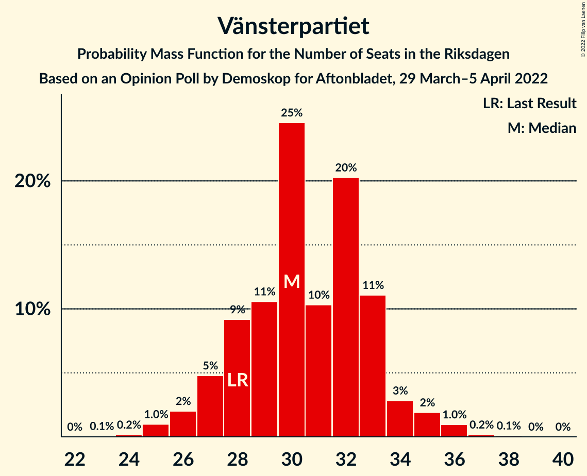

| Number of Seats | Probability | Accumulated | Special Marks |
|:---------------:|:-----------:|:-----------:|:-------------:|
| 23 | 0.1% | 100% |  |
| 24 | 0.2% | 99.9% |  |
| 25 | 1.0% | 99.8% |  |
| 26 | 2% | 98.8% |  |
| 27 | 5% | 97% |  |
| 28 | 9% | 92% | Last Result |
| 29 | 11% | 83% |  |
| 30 | 25% | 72% | Median |
| 31 | 10% | 48% |  |
| 32 | 20% | 37% |  |
| 33 | 11% | 17% |  |
| 34 | 3% | 6% |  |
| 35 | 2% | 3% |  |
| 36 | 1.0% | 1.3% |  |
| 37 | 0.2% | 0.3% |  |
| 38 | 0.1% | 0.1% |  |
| 39 | 0% | 0% |  |

### Centerpartiet

*For a full overview of the results for this party, see the [Centerpartiet](party-centerpartiet.html) page.*

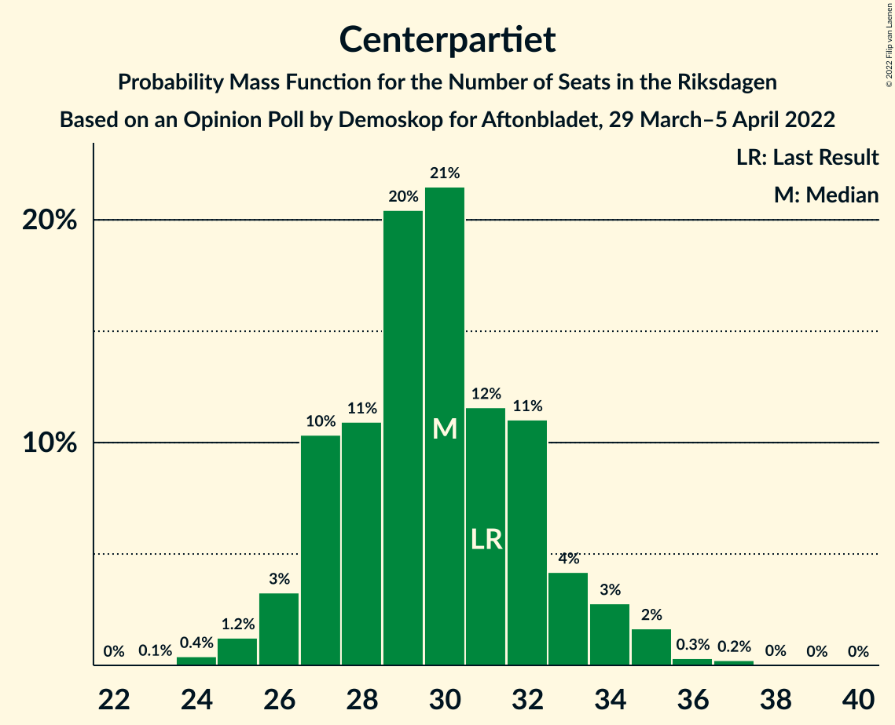

| Number of Seats | Probability | Accumulated | Special Marks |
|:---------------:|:-----------:|:-----------:|:-------------:|
| 23 | 0.1% | 100% |  |
| 24 | 0.4% | 99.9% |  |
| 25 | 1.2% | 99.5% |  |
| 26 | 3% | 98% |  |
| 27 | 10% | 95% |  |
| 28 | 11% | 85% |  |
| 29 | 20% | 74% |  |
| 30 | 21% | 53% | Median |
| 31 | 12% | 32% | Last Result |
| 32 | 11% | 20% |  |
| 33 | 4% | 9% |  |
| 34 | 3% | 5% |  |
| 35 | 2% | 2% |  |
| 36 | 0.3% | 0.6% |  |
| 37 | 0.2% | 0.3% |  |
| 38 | 0% | 0.1% |  |
| 39 | 0% | 0% |  |

### Kristdemokraterna

*For a full overview of the results for this party, see the [Kristdemokraterna](party-kristdemokraterna.html) page.*

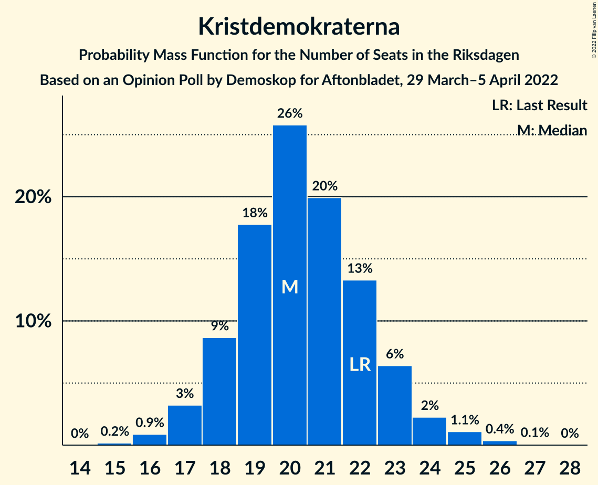

| Number of Seats | Probability | Accumulated | Special Marks |
|:---------------:|:-----------:|:-----------:|:-------------:|
| 15 | 0.2% | 100% |  |
| 16 | 0.9% | 99.8% |  |
| 17 | 3% | 98.9% |  |
| 18 | 9% | 96% |  |
| 19 | 18% | 87% |  |
| 20 | 26% | 69% | Median |
| 21 | 20% | 43% |  |
| 22 | 13% | 24% | Last Result |
| 23 | 6% | 10% |  |
| 24 | 2% | 4% |  |
| 25 | 1.1% | 2% |  |
| 26 | 0.4% | 0.5% |  |
| 27 | 0.1% | 0.1% |  |
| 28 | 0% | 0% |  |

### Miljöpartiet de gröna

*For a full overview of the results for this party, see the [Miljöpartiet de gröna](party-miljöpartietdegröna.html) page.*

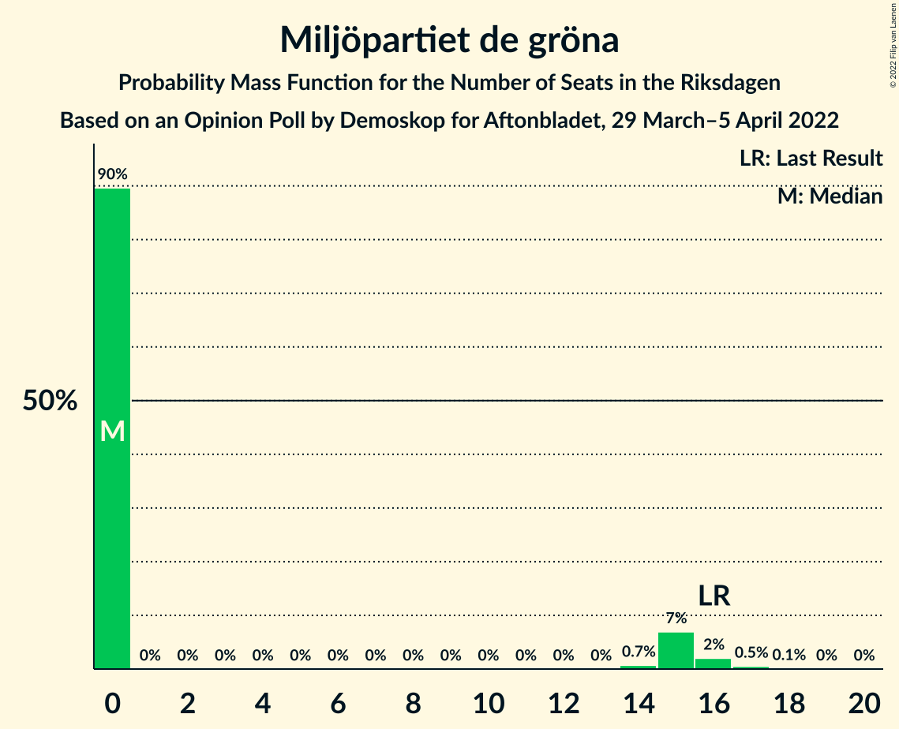

| Number of Seats | Probability | Accumulated | Special Marks |
|:---------------:|:-----------:|:-----------:|:-------------:|
| 0 | 90% | 100% | Median |
| 1 | 0% | 10% |  |
| 2 | 0% | 10% |  |
| 3 | 0% | 10% |  |
| 4 | 0% | 10% |  |
| 5 | 0% | 10% |  |
| 6 | 0% | 10% |  |
| 7 | 0% | 10% |  |
| 8 | 0% | 10% |  |
| 9 | 0% | 10% |  |
| 10 | 0% | 10% |  |
| 11 | 0% | 10% |  |
| 12 | 0% | 10% |  |
| 13 | 0% | 10% |  |
| 14 | 0.7% | 10% |  |
| 15 | 7% | 10% |  |
| 16 | 2% | 3% | Last Result |
| 17 | 0.5% | 0.7% |  |
| 18 | 0.1% | 0.1% |  |
| 19 | 0% | 0% |  |

### Liberalerna

*For a full overview of the results for this party, see the [Liberalerna](party-liberalerna.html) page.*

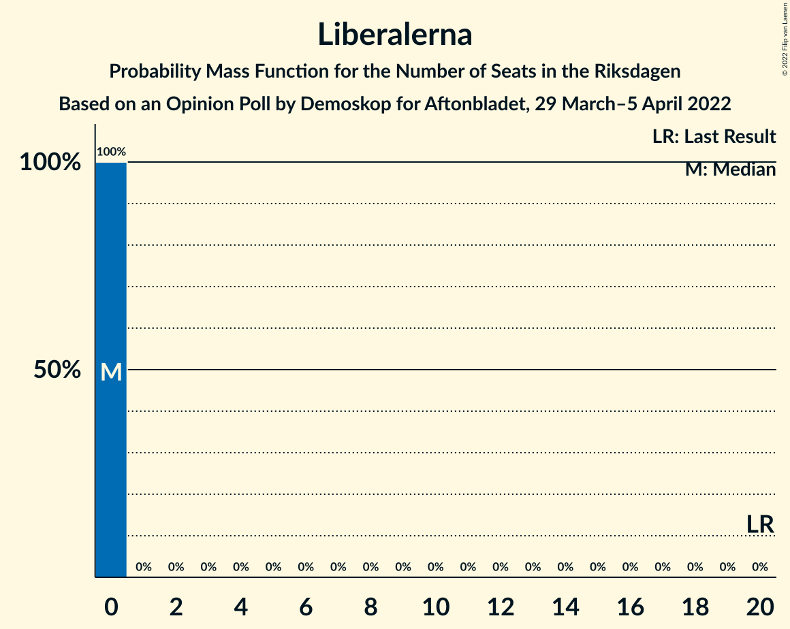

| Number of Seats | Probability | Accumulated | Special Marks |
|:---------------:|:-----------:|:-----------:|:-------------:|
| 0 | 100% | 100% | Median |
| 1 | 0% | 0% |  |
| 2 | 0% | 0% |  |
| 3 | 0% | 0% |  |
| 4 | 0% | 0% |  |
| 5 | 0% | 0% |  |
| 6 | 0% | 0% |  |
| 7 | 0% | 0% |  |
| 8 | 0% | 0% |  |
| 9 | 0% | 0% |  |
| 10 | 0% | 0% |  |
| 11 | 0% | 0% |  |
| 12 | 0% | 0% |  |
| 13 | 0% | 0% |  |
| 14 | 0% | 0% |  |
| 15 | 0% | 0% |  |
| 16 | 0% | 0% |  |
| 17 | 0% | 0% |  |
| 18 | 0% | 0% |  |
| 19 | 0% | 0% |  |
| 20 | 0% | 0% | Last Result |

## Coalitions

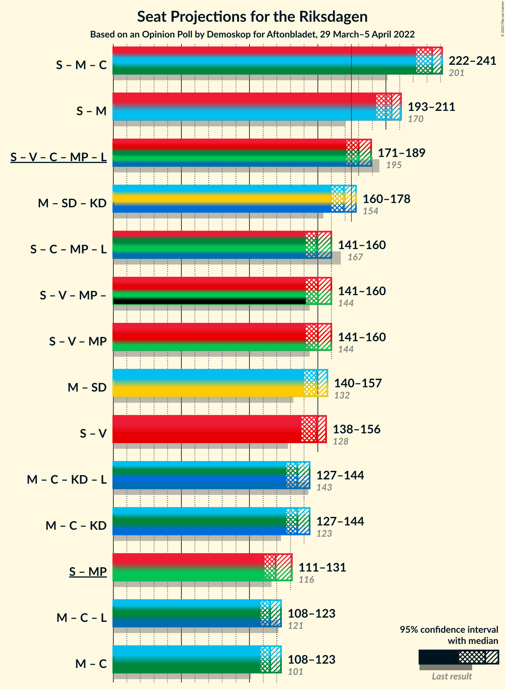

### Confidence Intervals

| Coalition | Last Result | Median | Majority? | 80% Confidence Interval | 90% Confidence Interval | 95% Confidence Interval | 99% Confidence Interval |
|:---------:|:-----------:|:------:|:---------:|:-----------------------:|:-----------------------:|:-----------------------:|:-----------------------:|
| Sveriges socialdemokratiska arbetareparti – Moderata samlingspartiet – Centerpartiet | 201 | 234 | 100% | 227–238 | 224–240 | 222–241 | 218–243 |
| Sveriges socialdemokratiska arbetareparti – Moderata samlingspartiet | 170 | 204 | 100% | 197–209 | 195–210 | 193–211 | 189–214 |
| Sveriges socialdemokratiska arbetareparti – Vänsterpartiet – Centerpartiet – Miljöpartiet de gröna – Liberalerna | 195 | 180 | 89% | 174–186 | 173–187 | 171–189 | 169–193 |
| Moderata samlingspartiet – Sverigedemokraterna – Kristdemokraterna | 154 | 169 | 11% | 163–175 | 162–176 | 160–178 | 156–180 |
| Sveriges socialdemokratiska arbetareparti – Centerpartiet – Miljöpartiet de gröna – Liberalerna | 167 | 149 | 0% | 144–156 | 142–158 | 141–160 | 139–163 |
| Sveriges socialdemokratiska arbetareparti – Vänsterpartiet – Miljöpartiet de gröna | 144 | 150 | 0% | 145–156 | 143–158 | 141–160 | 139–164 |
| Moderata samlingspartiet – Sverigedemokraterna | 132 | 149 | 0% | 143–154 | 141–156 | 140–157 | 137–160 |
| Sveriges socialdemokratiska arbetareparti – Vänsterpartiet | 128 | 149 | 0% | 143–153 | 141–155 | 138–156 | 135–158 |
| Moderata samlingspartiet – Centerpartiet – Kristdemokraterna – Liberalerna | 143 | 135 | 0% | 130–140 | 129–142 | 127–144 | 124–146 |
| Moderata samlingspartiet – Centerpartiet – Kristdemokraterna | 123 | 135 | 0% | 130–140 | 129–142 | 127–144 | 124–146 |
| Sveriges socialdemokratiska arbetareparti – Miljöpartiet de gröna | 116 | 119 | 0% | 114–126 | 113–129 | 111–131 | 109–134 |
| Moderata samlingspartiet – Centerpartiet – Liberalerna | 121 | 115 | 0% | 111–120 | 109–121 | 108–123 | 104–126 |
| Moderata samlingspartiet – Centerpartiet | 101 | 115 | 0% | 111–120 | 109–121 | 108–123 | 104–126 |

### Sveriges socialdemokratiska arbetareparti – Moderata samlingspartiet – Centerpartiet

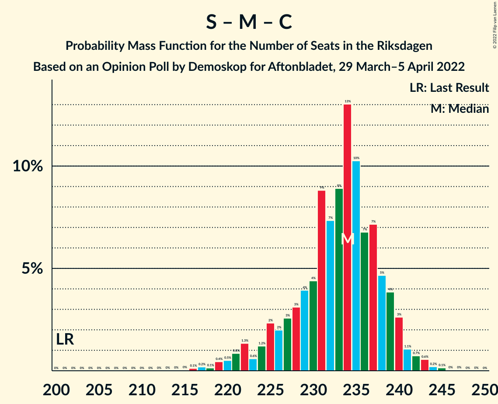

| Number of Seats | Probability | Accumulated | Special Marks |
|:---------------:|:-----------:|:-----------:|:-------------:|
| 201 | 0% | 100% | Last Result |
| 202 | 0% | 100% |  |
| 203 | 0% | 100% |  |
| 204 | 0% | 100% |  |
| 205 | 0% | 100% |  |
| 206 | 0% | 100% |  |
| 207 | 0% | 100% |  |
| 208 | 0% | 100% |  |
| 209 | 0% | 100% |  |
| 210 | 0% | 100% |  |
| 211 | 0% | 100% |  |
| 212 | 0% | 100% |  |
| 213 | 0% | 100% |  |
| 214 | 0% | 100% |  |
| 215 | 0% | 100% |  |
| 216 | 0.1% | 99.9% |  |
| 217 | 0.2% | 99.8% |  |
| 218 | 0.1% | 99.6% |  |
| 219 | 0.4% | 99.5% |  |
| 220 | 0.5% | 99.0% |  |
| 221 | 0.8% | 98.5% |  |
| 222 | 1.3% | 98% |  |
| 223 | 0.6% | 96% |  |
| 224 | 1.2% | 96% |  |
| 225 | 2% | 95% |  |
| 226 | 2% | 92% |  |
| 227 | 3% | 90% |  |
| 228 | 3% | 88% |  |
| 229 | 4% | 85% |  |
| 230 | 4% | 81% |  |
| 231 | 9% | 76% |  |
| 232 | 7% | 67% |  |
| 233 | 9% | 60% |  |
| 234 | 13% | 51% | Median |
| 235 | 10% | 38% |  |
| 236 | 7% | 28% |  |
| 237 | 7% | 21% |  |
| 238 | 5% | 14% |  |
| 239 | 4% | 9% |  |
| 240 | 3% | 5% |  |
| 241 | 1.1% | 3% |  |
| 242 | 0.7% | 2% |  |
| 243 | 0.6% | 1.0% |  |
| 244 | 0.2% | 0.4% |  |
| 245 | 0.1% | 0.2% |  |
| 246 | 0% | 0.1% |  |
| 247 | 0% | 0.1% |  |
| 248 | 0% | 0% |  |

### Sveriges socialdemokratiska arbetareparti – Moderata samlingspartiet

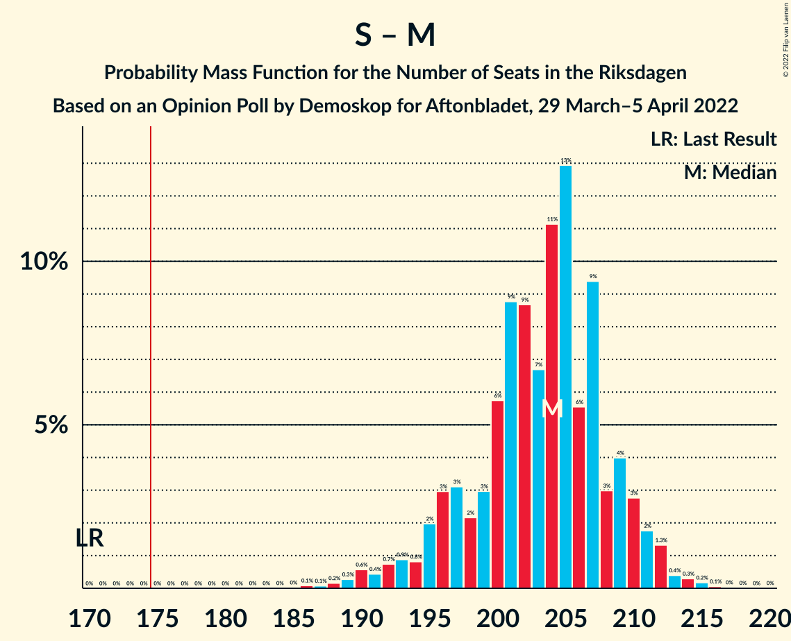

| Number of Seats | Probability | Accumulated | Special Marks |
|:---------------:|:-----------:|:-----------:|:-------------:|
| 170 | 0% | 100% | Last Result |
| 171 | 0% | 100% |  |
| 172 | 0% | 100% |  |
| 173 | 0% | 100% |  |
| 174 | 0% | 100% |  |
| 175 | 0% | 100% | Majority |
| 176 | 0% | 100% |  |
| 177 | 0% | 100% |  |
| 178 | 0% | 100% |  |
| 179 | 0% | 100% |  |
| 180 | 0% | 100% |  |
| 181 | 0% | 100% |  |
| 182 | 0% | 100% |  |
| 183 | 0% | 100% |  |
| 184 | 0% | 100% |  |
| 185 | 0% | 100% |  |
| 186 | 0.1% | 100% |  |
| 187 | 0.1% | 99.9% |  |
| 188 | 0.2% | 99.8% |  |
| 189 | 0.3% | 99.6% |  |
| 190 | 0.6% | 99.4% |  |
| 191 | 0.4% | 98.8% |  |
| 192 | 0.7% | 98% |  |
| 193 | 0.9% | 98% |  |
| 194 | 0.8% | 97% |  |
| 195 | 2% | 96% |  |
| 196 | 3% | 94% |  |
| 197 | 3% | 91% |  |
| 198 | 2% | 88% |  |
| 199 | 3% | 86% |  |
| 200 | 6% | 83% |  |
| 201 | 9% | 77% |  |
| 202 | 9% | 68% |  |
| 203 | 7% | 60% |  |
| 204 | 11% | 53% | Median |
| 205 | 13% | 42% |  |
| 206 | 6% | 29% |  |
| 207 | 9% | 23% |  |
| 208 | 3% | 14% |  |
| 209 | 4% | 11% |  |
| 210 | 3% | 7% |  |
| 211 | 2% | 4% |  |
| 212 | 1.3% | 2% |  |
| 213 | 0.4% | 1.0% |  |
| 214 | 0.3% | 0.6% |  |
| 215 | 0.2% | 0.3% |  |
| 216 | 0.1% | 0.1% |  |
| 217 | 0% | 0.1% |  |
| 218 | 0% | 0% |  |

### Sveriges socialdemokratiska arbetareparti – Vänsterpartiet – Centerpartiet – Miljöpartiet de gröna – Liberalerna

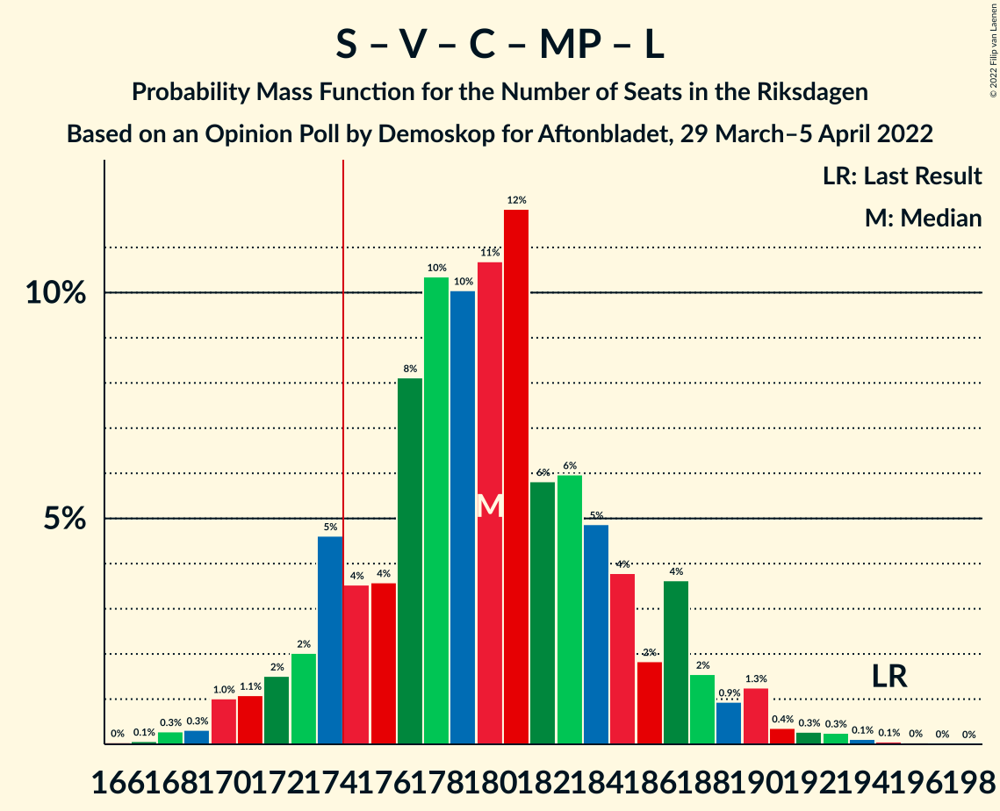

| Number of Seats | Probability | Accumulated | Special Marks |
|:---------------:|:-----------:|:-----------:|:-------------:|
| 166 | 0% | 100% |  |
| 167 | 0.1% | 99.9% |  |
| 168 | 0.3% | 99.9% |  |
| 169 | 0.3% | 99.6% |  |
| 170 | 1.0% | 99.3% |  |
| 171 | 1.1% | 98% |  |
| 172 | 2% | 97% |  |
| 173 | 2% | 96% |  |
| 174 | 5% | 94% |  |
| 175 | 4% | 89% | Majority |
| 176 | 4% | 85% |  |
| 177 | 8% | 82% |  |
| 178 | 10% | 74% |  |
| 179 | 10% | 63% | Median |
| 180 | 11% | 53% |  |
| 181 | 12% | 43% |  |
| 182 | 6% | 31% |  |
| 183 | 6% | 25% |  |
| 184 | 5% | 19% |  |
| 185 | 4% | 14% |  |
| 186 | 2% | 10% |  |
| 187 | 4% | 9% |  |
| 188 | 2% | 5% |  |
| 189 | 0.9% | 3% |  |
| 190 | 1.3% | 2% |  |
| 191 | 0.4% | 1.2% |  |
| 192 | 0.3% | 0.8% |  |
| 193 | 0.3% | 0.5% |  |
| 194 | 0.1% | 0.3% |  |
| 195 | 0.1% | 0.2% | Last Result |
| 196 | 0% | 0.1% |  |
| 197 | 0% | 0.1% |  |
| 198 | 0% | 0% |  |

### Moderata samlingspartiet – Sverigedemokraterna – Kristdemokraterna

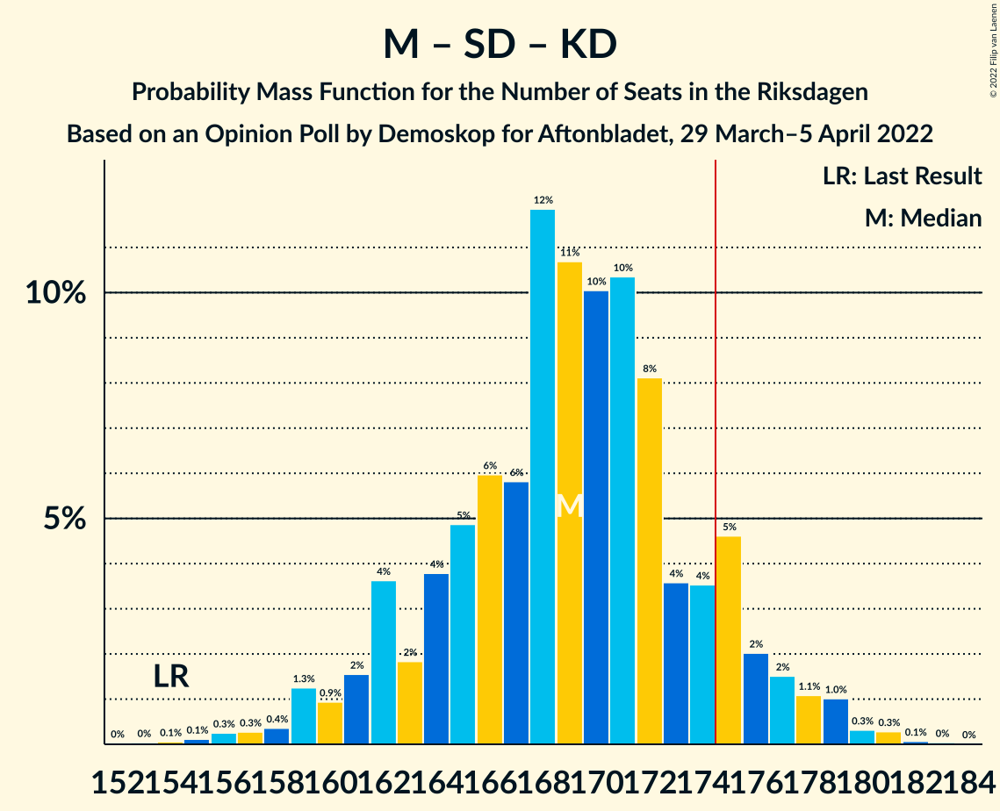

| Number of Seats | Probability | Accumulated | Special Marks |
|:---------------:|:-----------:|:-----------:|:-------------:|
| 152 | 0% | 100% |  |
| 153 | 0% | 99.9% |  |
| 154 | 0.1% | 99.9% | Last Result |
| 155 | 0.1% | 99.8% |  |
| 156 | 0.3% | 99.7% |  |
| 157 | 0.3% | 99.5% |  |
| 158 | 0.4% | 99.2% |  |
| 159 | 1.3% | 98.8% |  |
| 160 | 0.9% | 98% |  |
| 161 | 2% | 97% |  |
| 162 | 4% | 95% |  |
| 163 | 2% | 91% |  |
| 164 | 4% | 90% |  |
| 165 | 5% | 86% |  |
| 166 | 6% | 81% |  |
| 167 | 6% | 75% |  |
| 168 | 12% | 69% |  |
| 169 | 11% | 57% | Median |
| 170 | 10% | 47% |  |
| 171 | 10% | 37% |  |
| 172 | 8% | 26% |  |
| 173 | 4% | 18% |  |
| 174 | 4% | 15% |  |
| 175 | 5% | 11% | Majority |
| 176 | 2% | 6% |  |
| 177 | 2% | 4% |  |
| 178 | 1.1% | 3% |  |
| 179 | 1.0% | 2% |  |
| 180 | 0.3% | 0.7% |  |
| 181 | 0.3% | 0.4% |  |
| 182 | 0.1% | 0.1% |  |
| 183 | 0% | 0.1% |  |
| 184 | 0% | 0% |  |

### Sveriges socialdemokratiska arbetareparti – Centerpartiet – Miljöpartiet de gröna – Liberalerna

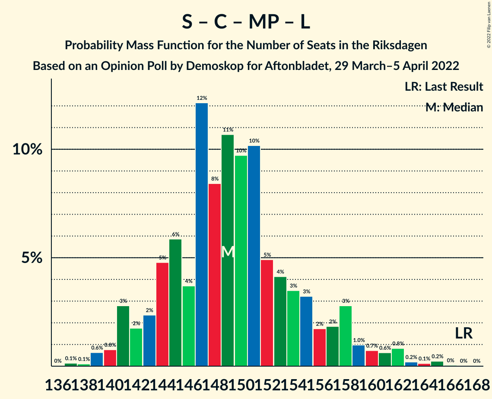

| Number of Seats | Probability | Accumulated | Special Marks |
|:---------------:|:-----------:|:-----------:|:-------------:|
| 136 | 0% | 100% |  |
| 137 | 0.1% | 99.9% |  |
| 138 | 0.1% | 99.8% |  |
| 139 | 0.6% | 99.7% |  |
| 140 | 0.8% | 99.1% |  |
| 141 | 3% | 98% |  |
| 142 | 2% | 96% |  |
| 143 | 2% | 94% |  |
| 144 | 5% | 91% |  |
| 145 | 6% | 87% |  |
| 146 | 4% | 81% |  |
| 147 | 12% | 77% |  |
| 148 | 8% | 65% |  |
| 149 | 11% | 56% | Median |
| 150 | 10% | 46% |  |
| 151 | 10% | 36% |  |
| 152 | 5% | 26% |  |
| 153 | 4% | 21% |  |
| 154 | 3% | 17% |  |
| 155 | 3% | 13% |  |
| 156 | 2% | 10% |  |
| 157 | 2% | 8% |  |
| 158 | 3% | 7% |  |
| 159 | 1.0% | 4% |  |
| 160 | 0.7% | 3% |  |
| 161 | 0.6% | 2% |  |
| 162 | 0.8% | 1.5% |  |
| 163 | 0.2% | 0.7% |  |
| 164 | 0.1% | 0.5% |  |
| 165 | 0.2% | 0.3% |  |
| 166 | 0% | 0.1% |  |
| 167 | 0% | 0.1% | Last Result |
| 168 | 0% | 0% |  |

### Sveriges socialdemokratiska arbetareparti – Vänsterpartiet – Miljöpartiet de gröna

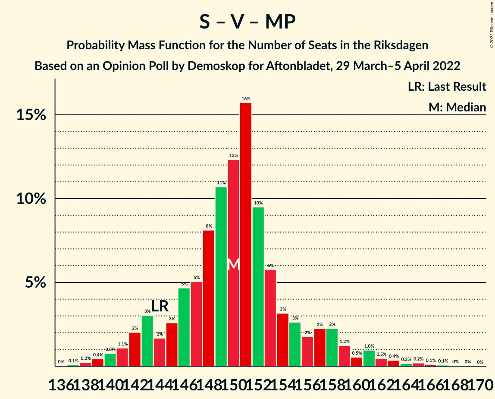

| Number of Seats | Probability | Accumulated | Special Marks |
|:---------------:|:-----------:|:-----------:|:-------------:|
| 137 | 0.1% | 100% |  |
| 138 | 0.2% | 99.9% |  |
| 139 | 0.4% | 99.6% |  |
| 140 | 0.8% | 99.2% |  |
| 141 | 1.1% | 98% |  |
| 142 | 2% | 97% |  |
| 143 | 3% | 95% |  |
| 144 | 2% | 92% | Last Result |
| 145 | 3% | 91% |  |
| 146 | 5% | 88% |  |
| 147 | 5% | 83% |  |
| 148 | 8% | 78% |  |
| 149 | 11% | 70% | Median |
| 150 | 12% | 59% |  |
| 151 | 16% | 47% |  |
| 152 | 10% | 31% |  |
| 153 | 6% | 22% |  |
| 154 | 3% | 16% |  |
| 155 | 3% | 13% |  |
| 156 | 2% | 10% |  |
| 157 | 2% | 9% |  |
| 158 | 2% | 6% |  |
| 159 | 1.2% | 4% |  |
| 160 | 0.5% | 3% |  |
| 161 | 1.0% | 2% |  |
| 162 | 0.5% | 1.4% |  |
| 163 | 0.4% | 0.9% |  |
| 164 | 0.2% | 0.6% |  |
| 165 | 0.2% | 0.4% |  |
| 166 | 0.1% | 0.2% |  |
| 167 | 0.1% | 0.1% |  |
| 168 | 0% | 0.1% |  |
| 169 | 0% | 0% |  |

### Moderata samlingspartiet – Sverigedemokraterna

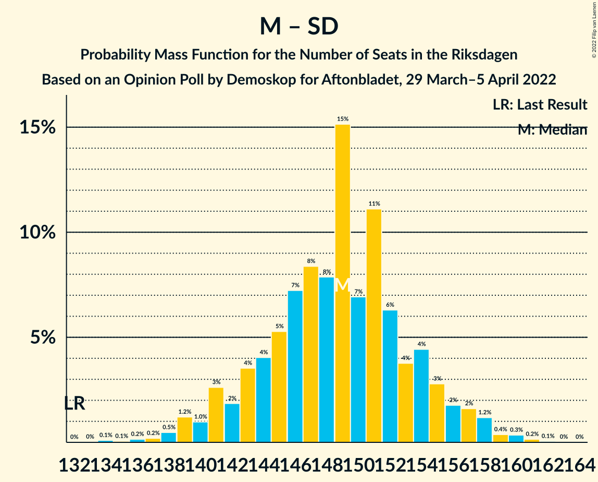

| Number of Seats | Probability | Accumulated | Special Marks |
|:---------------:|:-----------:|:-----------:|:-------------:|
| 132 | 0% | 100% | Last Result |
| 133 | 0% | 100% |  |
| 134 | 0.1% | 100% |  |
| 135 | 0.1% | 99.9% |  |
| 136 | 0.2% | 99.8% |  |
| 137 | 0.2% | 99.7% |  |
| 138 | 0.5% | 99.5% |  |
| 139 | 1.2% | 99.0% |  |
| 140 | 1.0% | 98% |  |
| 141 | 3% | 97% |  |
| 142 | 2% | 94% |  |
| 143 | 4% | 92% |  |
| 144 | 4% | 89% |  |
| 145 | 5% | 85% |  |
| 146 | 7% | 79% |  |
| 147 | 8% | 72% |  |
| 148 | 8% | 64% |  |
| 149 | 15% | 56% | Median |
| 150 | 7% | 41% |  |
| 151 | 11% | 34% |  |
| 152 | 6% | 23% |  |
| 153 | 4% | 17% |  |
| 154 | 4% | 13% |  |
| 155 | 3% | 8% |  |
| 156 | 2% | 6% |  |
| 157 | 2% | 4% |  |
| 158 | 1.2% | 2% |  |
| 159 | 0.4% | 1.0% |  |
| 160 | 0.3% | 0.6% |  |
| 161 | 0.2% | 0.2% |  |
| 162 | 0.1% | 0.1% |  |
| 163 | 0% | 0% |  |

### Sveriges socialdemokratiska arbetareparti – Vänsterpartiet

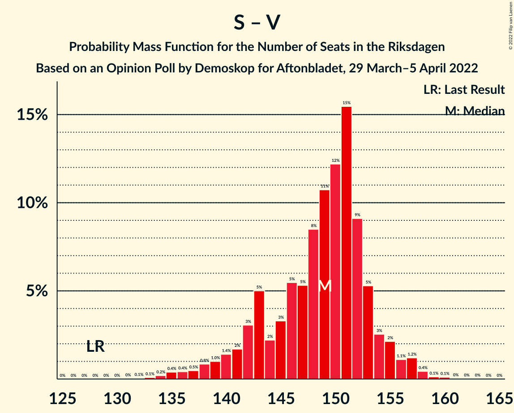

| Number of Seats | Probability | Accumulated | Special Marks |
|:---------------:|:-----------:|:-----------:|:-------------:|
| 128 | 0% | 100% | Last Result |
| 129 | 0% | 100% |  |
| 130 | 0% | 100% |  |
| 131 | 0% | 100% |  |
| 132 | 0.1% | 100% |  |
| 133 | 0.1% | 99.9% |  |
| 134 | 0.2% | 99.8% |  |
| 135 | 0.4% | 99.6% |  |
| 136 | 0.4% | 99.2% |  |
| 137 | 0.5% | 98.8% |  |
| 138 | 0.8% | 98% |  |
| 139 | 1.0% | 97% |  |
| 140 | 1.4% | 96% |  |
| 141 | 2% | 95% |  |
| 142 | 3% | 93% |  |
| 143 | 5% | 90% |  |
| 144 | 2% | 85% |  |
| 145 | 3% | 83% |  |
| 146 | 5% | 80% |  |
| 147 | 5% | 74% |  |
| 148 | 8% | 69% |  |
| 149 | 11% | 61% | Median |
| 150 | 12% | 50% |  |
| 151 | 15% | 38% |  |
| 152 | 9% | 22% |  |
| 153 | 5% | 13% |  |
| 154 | 3% | 8% |  |
| 155 | 2% | 5% |  |
| 156 | 1.1% | 3% |  |
| 157 | 1.2% | 2% |  |
| 158 | 0.4% | 0.7% |  |
| 159 | 0.1% | 0.3% |  |
| 160 | 0.1% | 0.2% |  |
| 161 | 0% | 0.1% |  |
| 162 | 0% | 0% |  |

### Moderata samlingspartiet – Centerpartiet – Kristdemokraterna – Liberalerna

| Number of Seats | Probability | Accumulated | Special Marks |
|:---------------:|:-----------:|:-----------:|:-------------:|
| 121 | 0.1% | 100% |  |
| 122 | 0.1% | 99.9% |  |
| 123 | 0.1% | 99.8% |  |
| 124 | 0.5% | 99.6% |  |
| 125 | 0.6% | 99.1% |  |
| 126 | 0.7% | 98.5% |  |
| 127 | 0.7% | 98% |  |
| 128 | 1.1% | 97% |  |
| 129 | 2% | 96% |  |
| 130 | 4% | 94% |  |
| 131 | 4% | 90% |  |
| 132 | 8% | 86% |  |
| 133 | 8% | 77% |  |
| 134 | 10% | 69% |  |
| 135 | 19% | 60% | Median |
| 136 | 6% | 40% |  |
| 137 | 8% | 34% |  |
| 138 | 9% | 26% |  |
| 139 | 5% | 17% |  |
| 140 | 4% | 13% |  |
| 141 | 3% | 9% |  |
| 142 | 2% | 6% |  |
| 143 | 1.1% | 4% | Last Result |
| 144 | 1.2% | 3% |  |
| 145 | 0.8% | 2% |  |
| 146 | 0.5% | 0.9% |  |
| 147 | 0.2% | 0.4% |  |
| 148 | 0.1% | 0.2% |  |
| 149 | 0.1% | 0.1% |  |
| 150 | 0% | 0% |  |

### Moderata samlingspartiet – Centerpartiet – Kristdemokraterna

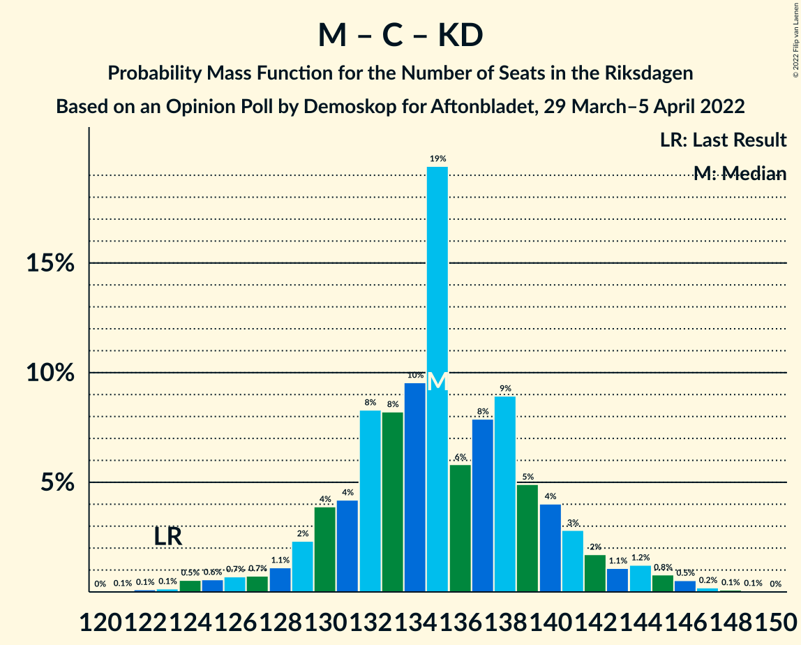

| Number of Seats | Probability | Accumulated | Special Marks |
|:---------------:|:-----------:|:-----------:|:-------------:|
| 121 | 0.1% | 100% |  |
| 122 | 0.1% | 99.9% |  |
| 123 | 0.1% | 99.8% | Last Result |
| 124 | 0.5% | 99.6% |  |
| 125 | 0.6% | 99.1% |  |
| 126 | 0.7% | 98.5% |  |
| 127 | 0.7% | 98% |  |
| 128 | 1.1% | 97% |  |
| 129 | 2% | 96% |  |
| 130 | 4% | 94% |  |
| 131 | 4% | 90% |  |
| 132 | 8% | 86% |  |
| 133 | 8% | 77% |  |
| 134 | 10% | 69% |  |
| 135 | 19% | 60% | Median |
| 136 | 6% | 40% |  |
| 137 | 8% | 34% |  |
| 138 | 9% | 26% |  |
| 139 | 5% | 17% |  |
| 140 | 4% | 13% |  |
| 141 | 3% | 9% |  |
| 142 | 2% | 6% |  |
| 143 | 1.1% | 4% |  |
| 144 | 1.2% | 3% |  |
| 145 | 0.8% | 2% |  |
| 146 | 0.5% | 0.9% |  |
| 147 | 0.2% | 0.4% |  |
| 148 | 0.1% | 0.2% |  |
| 149 | 0.1% | 0.1% |  |
| 150 | 0% | 0% |  |

### Sveriges socialdemokratiska arbetareparti – Miljöpartiet de gröna

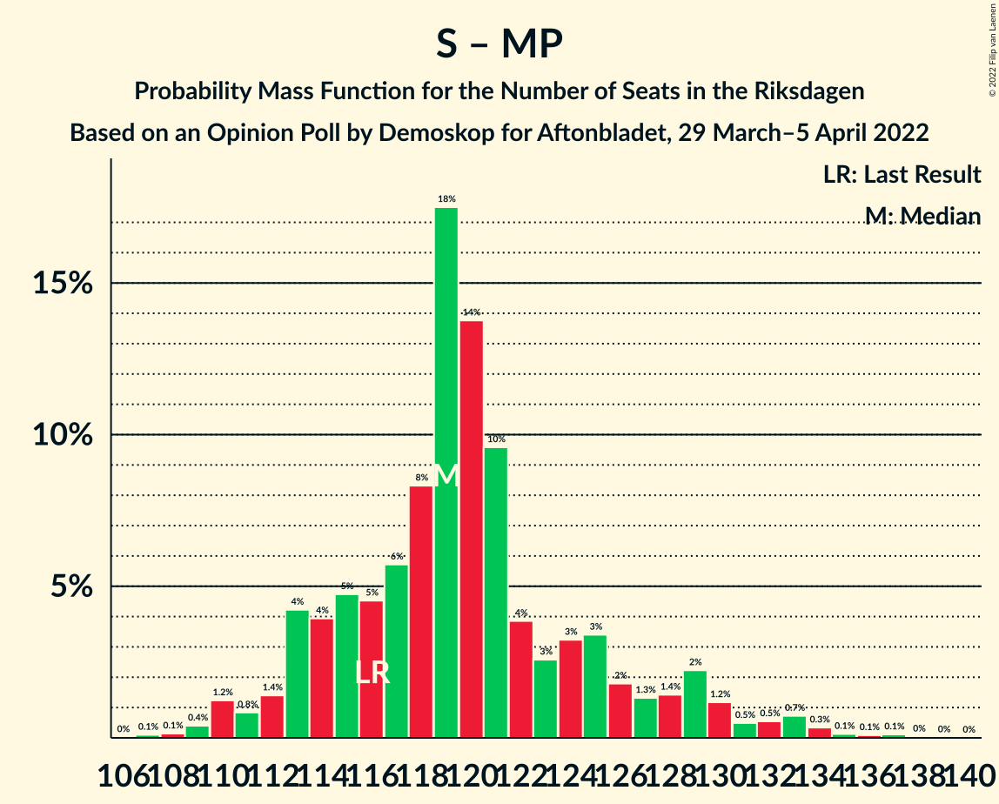

| Number of Seats | Probability | Accumulated | Special Marks |
|:---------------:|:-----------:|:-----------:|:-------------:|
| 107 | 0.1% | 100% |  |
| 108 | 0.1% | 99.9% |  |
| 109 | 0.4% | 99.7% |  |
| 110 | 1.2% | 99.3% |  |
| 111 | 0.8% | 98% |  |
| 112 | 1.4% | 97% |  |
| 113 | 4% | 96% |  |
| 114 | 4% | 92% |  |
| 115 | 5% | 88% |  |
| 116 | 5% | 83% | Last Result |
| 117 | 6% | 78% |  |
| 118 | 8% | 73% |  |
| 119 | 18% | 64% | Median |
| 120 | 14% | 47% |  |
| 121 | 10% | 33% |  |
| 122 | 4% | 24% |  |
| 123 | 3% | 20% |  |
| 124 | 3% | 17% |  |
| 125 | 3% | 14% |  |
| 126 | 2% | 10% |  |
| 127 | 1.3% | 9% |  |
| 128 | 1.4% | 7% |  |
| 129 | 2% | 6% |  |
| 130 | 1.2% | 4% |  |
| 131 | 0.5% | 3% |  |
| 132 | 0.5% | 2% |  |
| 133 | 0.7% | 1.5% |  |
| 134 | 0.3% | 0.7% |  |
| 135 | 0.1% | 0.4% |  |
| 136 | 0.1% | 0.3% |  |
| 137 | 0.1% | 0.2% |  |
| 138 | 0% | 0.1% |  |
| 139 | 0% | 0% |  |

### Moderata samlingspartiet – Centerpartiet – Liberalerna

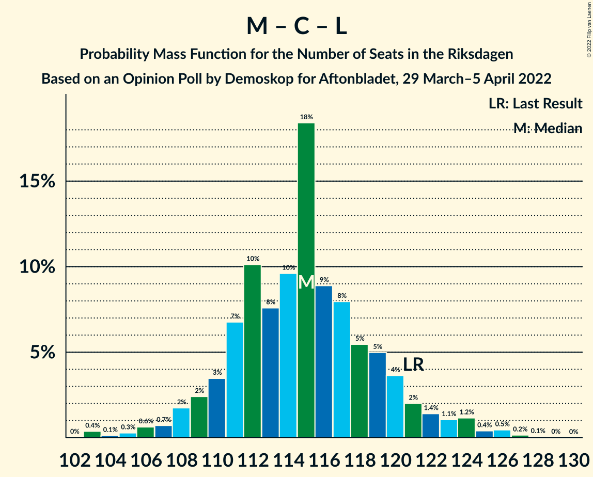

| Number of Seats | Probability | Accumulated | Special Marks |
|:---------------:|:-----------:|:-----------:|:-------------:|
| 102 | 0% | 100% |  |
| 103 | 0.4% | 99.9% |  |
| 104 | 0.1% | 99.6% |  |
| 105 | 0.3% | 99.4% |  |
| 106 | 0.6% | 99.1% |  |
| 107 | 0.7% | 98.5% |  |
| 108 | 2% | 98% |  |
| 109 | 2% | 96% |  |
| 110 | 3% | 94% |  |
| 111 | 7% | 90% |  |
| 112 | 10% | 83% |  |
| 113 | 8% | 73% |  |
| 114 | 10% | 66% |  |
| 115 | 18% | 56% | Median |
| 116 | 9% | 38% |  |
| 117 | 8% | 29% |  |
| 118 | 5% | 21% |  |
| 119 | 5% | 15% |  |
| 120 | 4% | 10% |  |
| 121 | 2% | 7% | Last Result |
| 122 | 1.4% | 5% |  |
| 123 | 1.1% | 3% |  |
| 124 | 1.2% | 2% |  |
| 125 | 0.4% | 1.1% |  |
| 126 | 0.5% | 0.7% |  |
| 127 | 0.2% | 0.3% |  |
| 128 | 0.1% | 0.1% |  |
| 129 | 0% | 0% |  |

### Moderata samlingspartiet – Centerpartiet

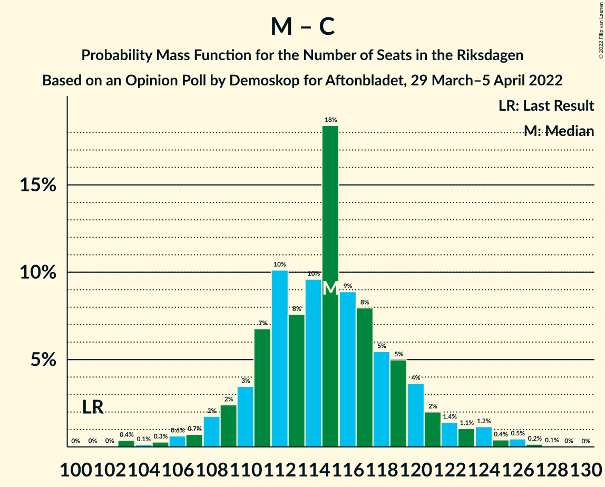

| Number of Seats | Probability | Accumulated | Special Marks |
|:---------------:|:-----------:|:-----------:|:-------------:|
| 101 | 0% | 100% | Last Result |
| 102 | 0% | 100% |  |
| 103 | 0.4% | 99.9% |  |
| 104 | 0.1% | 99.6% |  |
| 105 | 0.3% | 99.4% |  |
| 106 | 0.6% | 99.1% |  |
| 107 | 0.7% | 98.5% |  |
| 108 | 2% | 98% |  |
| 109 | 2% | 96% |  |
| 110 | 3% | 94% |  |
| 111 | 7% | 90% |  |
| 112 | 10% | 83% |  |
| 113 | 8% | 73% |  |
| 114 | 10% | 66% |  |
| 115 | 18% | 56% | Median |
| 116 | 9% | 38% |  |
| 117 | 8% | 29% |  |
| 118 | 5% | 21% |  |
| 119 | 5% | 15% |  |
| 120 | 4% | 10% |  |
| 121 | 2% | 7% |  |
| 122 | 1.4% | 5% |  |
| 123 | 1.1% | 3% |  |
| 124 | 1.2% | 2% |  |
| 125 | 0.4% | 1.1% |  |
| 126 | 0.5% | 0.7% |  |
| 127 | 0.2% | 0.3% |  |
| 128 | 0.1% | 0.1% |  |
| 129 | 0% | 0% |  |

## Technical Information

### Opinion Poll

+ **Polling firm:** Demoskop
+ **Commissioner(s):** Aftonbladet
+ **Fieldwork period:** 29 March–5 April 2022

### Calculations

+ **Sample size:** 2199
+ **Simulations done:** 1,048,576
+ **Error estimate:** 1.28%

