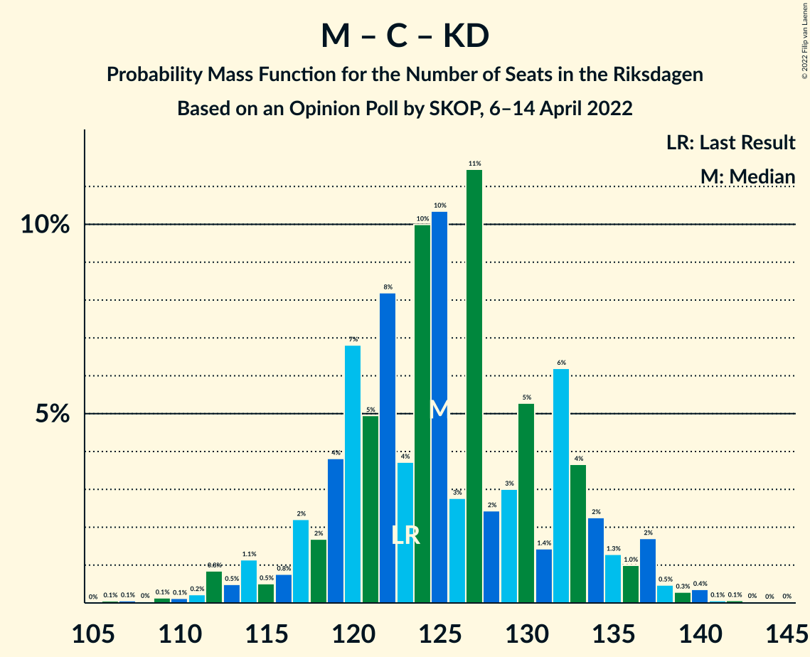

# Opinion Poll by SKOP, 6–14 April 2022

<a href="#voting-intentions">Voting Intentions</a> | <a href="#seats">Seats</a> | <a href="#coalitions">Coalitions</a> | <a href="#technical-information">Technical Information</a>

## Voting Intentions

### Confidence Intervals

| Party | Last Result | Poll Result | 80% Confidence Interval | 90% Confidence Interval | 95% Confidence Interval | 99% Confidence Interval |
|:-----:|:-----------:|:-----------:|:-----------------------:|:-----------------------:|:-----------------------:|:-----------------------:|
| Sveriges socialdemokratiska arbetareparti | 28.3% | 34.7% | 32.8–36.7% |32.3–37.3% |31.8–37.7% |30.9–38.7% |
| Moderata samlingspartiet | 19.8% | 20.2% | 18.6–21.9% |18.2–22.4% |17.8–22.8% |17.1–23.6% |
| Sverigedemokraterna | 17.5% | 15.6% | 14.2–17.2% |13.8–17.6% |13.5–18.0% |12.9–18.8% |
| Vänsterpartiet | 8.0% | 9.2% | 8.1–10.4% |7.8–10.8% |7.5–11.1% |7.0–11.7% |
| Centerpartiet | 8.6% | 7.4% | 6.4–8.5% |6.1–8.9% |5.9–9.2% |5.5–9.7% |
| Kristdemokraterna | 6.3% | 5.8% | 4.9–6.8% |4.7–7.1% |4.5–7.4% |4.1–7.9% |
| Liberalerna | 5.5% | 2.9% | 2.3–3.7% |2.1–3.9% |2.0–4.1% |1.8–4.5% |
| Miljöpartiet de gröna | 4.4% | 2.9% | 2.3–3.7% |2.1–3.9% |2.0–4.1% |1.8–4.5% |

*Note:* The poll result column reflects the actual value used in the calculations. Published results may vary slightly, and in addition be rounded to fewer digits.

## Seats

### Confidence Intervals

| Party | Last Result | Median | 80% Confidence Interval | 90% Confidence Interval | 95% Confidence Interval | 99% Confidence Interval |
|:-----:|:-----------:|:------:|:-----------------------:|:-----------------------:|:-----------------------:|:-----------------------:|
| <a href="#sveriges-socialdemokratiska-arbetareparti">Sveriges socialdemokratiska arbetareparti</a> | 100 | 130 | 122–137 |121–139 |119–141 |115–144 |
| <a href="#moderata-samlingspartiet">Moderata samlingspartiet</a> | 70 | 75 | 70–82 |68–83 |67–85 |64–88 |
| <a href="#sverigedemokraterna">Sverigedemokraterna</a> | 62 | 58 | 53–64 |52–65 |51–67 |48–70 |
| <a href="#vänsterpartiet">Vänsterpartiet</a> | 28 | 35 | 30–39 |29–40 |28–41 |26–44 |
| <a href="#centerpartiet">Centerpartiet</a> | 31 | 28 | 24–32 |23–33 |22–34 |20–36 |
| <a href="#kristdemokraterna">Kristdemokraterna</a> | 22 | 22 | 19–26 |18–27 |17–28 |16–30 |
| <a href="#liberalerna">Liberalerna</a> | 20 | 0 | 0 |0 |0 |0–17 |
| <a href="#miljöpartiet-de-gröna">Miljöpartiet de gröna</a> | 16 | 0 | 0 |0 |0–15 |0–16 |

### Sveriges socialdemokratiska arbetareparti

*For a full overview of the results for this party, see the [Sveriges socialdemokratiska arbetareparti](party-sverigessocialdemokratiskaarbetareparti.html) page.*

| Number of Seats | Probability | Accumulated | Special Marks |
|:---------------:|:-----------:|:-----------:|:-------------:|
| 100 | 0% | 100% | Last Result |
| 101 | 0% | 100% |  |
| 102 | 0% | 100% |  |
| 103 | 0% | 100% |  |
| 104 | 0% | 100% |  |
| 105 | 0% | 100% |  |
| 106 | 0% | 100% |  |
| 107 | 0% | 100% |  |
| 108 | 0% | 100% |  |
| 109 | 0% | 100% |  |
| 110 | 0% | 100% |  |
| 111 | 0% | 100% |  |
| 112 | 0.1% | 99.9% |  |
| 113 | 0.1% | 99.9% |  |
| 114 | 0.1% | 99.8% |  |
| 115 | 0.2% | 99.7% |  |
| 116 | 0.3% | 99.4% |  |
| 117 | 0.7% | 99.1% |  |
| 118 | 0.7% | 98% |  |
| 119 | 0.7% | 98% |  |
| 120 | 1.5% | 97% |  |
| 121 | 2% | 96% |  |
| 122 | 3% | 93% |  |
| 123 | 4% | 90% |  |
| 124 | 3% | 86% |  |
| 125 | 4% | 82% |  |
| 126 | 4% | 79% |  |
| 127 | 11% | 74% |  |
| 128 | 8% | 64% |  |
| 129 | 4% | 56% |  |
| 130 | 5% | 52% | Median |
| 131 | 10% | 48% |  |
| 132 | 6% | 38% |  |
| 133 | 10% | 32% |  |
| 134 | 4% | 22% |  |
| 135 | 3% | 18% |  |
| 136 | 3% | 15% |  |
| 137 | 4% | 12% |  |
| 138 | 2% | 8% |  |
| 139 | 1.4% | 6% |  |
| 140 | 1.4% | 4% |  |
| 141 | 1.2% | 3% |  |
| 142 | 0.9% | 2% |  |
| 143 | 0.2% | 0.8% |  |
| 144 | 0.1% | 0.6% |  |
| 145 | 0.1% | 0.4% |  |
| 146 | 0.1% | 0.3% |  |
| 147 | 0.1% | 0.2% |  |
| 148 | 0.1% | 0.1% |  |
| 149 | 0% | 0% |  |

### Moderata samlingspartiet

*For a full overview of the results for this party, see the [Moderata samlingspartiet](party-moderatasamlingspartiet.html) page.*

| Number of Seats | Probability | Accumulated | Special Marks |
|:---------------:|:-----------:|:-----------:|:-------------:|
| 61 | 0.1% | 100% |  |
| 62 | 0.1% | 99.9% |  |
| 63 | 0.2% | 99.8% |  |
| 64 | 0.3% | 99.6% |  |
| 65 | 0.5% | 99.2% |  |
| 66 | 1.0% | 98.7% |  |
| 67 | 1.3% | 98% |  |
| 68 | 2% | 96% |  |
| 69 | 3% | 94% |  |
| 70 | 4% | 91% | Last Result |
| 71 | 7% | 86% |  |
| 72 | 7% | 80% |  |
| 73 | 9% | 73% |  |
| 74 | 7% | 65% |  |
| 75 | 10% | 58% | Median |
| 76 | 7% | 47% |  |
| 77 | 6% | 41% |  |
| 78 | 10% | 35% |  |
| 79 | 3% | 25% |  |
| 80 | 7% | 21% |  |
| 81 | 4% | 14% |  |
| 82 | 4% | 11% |  |
| 83 | 2% | 7% |  |
| 84 | 1.3% | 5% |  |
| 85 | 2% | 3% |  |
| 86 | 0.5% | 2% |  |
| 87 | 0.5% | 1.2% |  |
| 88 | 0.3% | 0.7% |  |
| 89 | 0.2% | 0.4% |  |
| 90 | 0.1% | 0.2% |  |
| 91 | 0.1% | 0.1% |  |
| 92 | 0% | 0.1% |  |
| 93 | 0% | 0% |  |

### Sverigedemokraterna

*For a full overview of the results for this party, see the [Sverigedemokraterna](party-sverigedemokraterna.html) page.*

| Number of Seats | Probability | Accumulated | Special Marks |
|:---------------:|:-----------:|:-----------:|:-------------:|
| 45 | 0% | 100% |  |
| 46 | 0.1% | 99.9% |  |
| 47 | 0.2% | 99.9% |  |
| 48 | 0.4% | 99.7% |  |
| 49 | 0.7% | 99.3% |  |
| 50 | 1.1% | 98.6% |  |
| 51 | 2% | 98% |  |
| 52 | 3% | 95% |  |
| 53 | 3% | 92% |  |
| 54 | 6% | 89% |  |
| 55 | 6% | 83% |  |
| 56 | 10% | 77% |  |
| 57 | 8% | 67% |  |
| 58 | 13% | 59% | Median |
| 59 | 6% | 46% |  |
| 60 | 10% | 40% |  |
| 61 | 9% | 30% |  |
| 62 | 5% | 21% | Last Result |
| 63 | 5% | 16% |  |
| 64 | 3% | 11% |  |
| 65 | 3% | 8% |  |
| 66 | 2% | 5% |  |
| 67 | 2% | 3% |  |
| 68 | 0.4% | 2% |  |
| 69 | 0.5% | 1.1% |  |
| 70 | 0.2% | 0.6% |  |
| 71 | 0.2% | 0.4% |  |
| 72 | 0.1% | 0.2% |  |
| 73 | 0.1% | 0.1% |  |
| 74 | 0% | 0% |  |

### Vänsterpartiet

*For a full overview of the results for this party, see the [Vänsterpartiet](party-vänsterpartiet.html) page.*

| Number of Seats | Probability | Accumulated | Special Marks |
|:---------------:|:-----------:|:-----------:|:-------------:|
| 24 | 0.1% | 100% |  |
| 25 | 0.2% | 99.9% |  |
| 26 | 0.3% | 99.7% |  |
| 27 | 0.7% | 99.4% |  |
| 28 | 2% | 98.7% | Last Result |
| 29 | 3% | 97% |  |
| 30 | 4% | 94% |  |
| 31 | 4% | 90% |  |
| 32 | 9% | 85% |  |
| 33 | 12% | 76% |  |
| 34 | 11% | 64% |  |
| 35 | 12% | 53% | Median |
| 36 | 9% | 41% |  |
| 37 | 15% | 32% |  |
| 38 | 6% | 16% |  |
| 39 | 5% | 11% |  |
| 40 | 2% | 6% |  |
| 41 | 2% | 4% |  |
| 42 | 1.4% | 2% |  |
| 43 | 0.3% | 0.8% |  |
| 44 | 0.2% | 0.5% |  |
| 45 | 0.1% | 0.3% |  |
| 46 | 0.1% | 0.1% |  |
| 47 | 0% | 0.1% |  |
| 48 | 0% | 0% |  |

### Centerpartiet

*For a full overview of the results for this party, see the [Centerpartiet](party-centerpartiet.html) page.*

| Number of Seats | Probability | Accumulated | Special Marks |
|:---------------:|:-----------:|:-----------:|:-------------:|
| 19 | 0.1% | 100% |  |
| 20 | 0.5% | 99.9% |  |
| 21 | 0.9% | 99.4% |  |
| 22 | 2% | 98.5% |  |
| 23 | 4% | 97% |  |
| 24 | 4% | 93% |  |
| 25 | 10% | 89% |  |
| 26 | 8% | 78% |  |
| 27 | 14% | 70% |  |
| 28 | 17% | 56% | Median |
| 29 | 8% | 40% |  |
| 30 | 14% | 31% |  |
| 31 | 7% | 18% | Last Result |
| 32 | 4% | 11% |  |
| 33 | 3% | 6% |  |
| 34 | 2% | 3% |  |
| 35 | 0.7% | 2% |  |
| 36 | 0.5% | 0.9% |  |
| 37 | 0.2% | 0.4% |  |
| 38 | 0.1% | 0.2% |  |
| 39 | 0% | 0.1% |  |
| 40 | 0% | 0% |  |

### Kristdemokraterna

*For a full overview of the results for this party, see the [Kristdemokraterna](party-kristdemokraterna.html) page.*

| Number of Seats | Probability | Accumulated | Special Marks |
|:---------------:|:-----------:|:-----------:|:-------------:|
| 0 | 0.2% | 100% |  |
| 1 | 0% | 99.8% |  |
| 2 | 0% | 99.8% |  |
| 3 | 0% | 99.8% |  |
| 4 | 0% | 99.8% |  |
| 5 | 0% | 99.8% |  |
| 6 | 0% | 99.8% |  |
| 7 | 0% | 99.8% |  |
| 8 | 0% | 99.8% |  |
| 9 | 0% | 99.8% |  |
| 10 | 0% | 99.8% |  |
| 11 | 0% | 99.8% |  |
| 12 | 0% | 99.8% |  |
| 13 | 0% | 99.8% |  |
| 14 | 0% | 99.8% |  |
| 15 | 0.2% | 99.8% |  |
| 16 | 1.3% | 99.5% |  |
| 17 | 3% | 98% |  |
| 18 | 5% | 95% |  |
| 19 | 9% | 90% |  |
| 20 | 12% | 81% |  |
| 21 | 14% | 69% |  |
| 22 | 16% | 55% | Last Result, Median |
| 23 | 12% | 40% |  |
| 24 | 10% | 28% |  |
| 25 | 8% | 19% |  |
| 26 | 5% | 10% |  |
| 27 | 2% | 5% |  |
| 28 | 1.5% | 3% |  |
| 29 | 0.7% | 1.3% |  |
| 30 | 0.3% | 0.5% |  |
| 31 | 0.2% | 0.2% |  |
| 32 | 0.1% | 0.1% |  |
| 33 | 0% | 0% |  |

### Liberalerna

*For a full overview of the results for this party, see the [Liberalerna](party-liberalerna.html) page.*

| Number of Seats | Probability | Accumulated | Special Marks |
|:---------------:|:-----------:|:-----------:|:-------------:|
| 0 | 98% | 100% | Median |
| 1 | 0% | 2% |  |
| 2 | 0% | 2% |  |
| 3 | 0% | 2% |  |
| 4 | 0% | 2% |  |
| 5 | 0% | 2% |  |
| 6 | 0% | 2% |  |
| 7 | 0% | 2% |  |
| 8 | 0% | 2% |  |
| 9 | 0% | 2% |  |
| 10 | 0% | 2% |  |
| 11 | 0% | 2% |  |
| 12 | 0% | 2% |  |
| 13 | 0% | 2% |  |
| 14 | 0% | 2% |  |
| 15 | 0% | 2% |  |
| 16 | 0.7% | 2% |  |
| 17 | 0.9% | 1.0% |  |
| 18 | 0% | 0% |  |
| 19 | 0% | 0% |  |
| 20 | 0% | 0% | Last Result |

### Miljöpartiet de gröna

*For a full overview of the results for this party, see the [Miljöpartiet de gröna](party-miljöpartietdegröna.html) page.*

| Number of Seats | Probability | Accumulated | Special Marks |
|:---------------:|:-----------:|:-----------:|:-------------:|
| 0 | 96% | 100% | Median |
| 1 | 0% | 4% |  |
| 2 | 0% | 4% |  |
| 3 | 0% | 4% |  |
| 4 | 0% | 4% |  |
| 5 | 0% | 4% |  |
| 6 | 0% | 4% |  |
| 7 | 0% | 4% |  |
| 8 | 0% | 4% |  |
| 9 | 0% | 4% |  |
| 10 | 0% | 4% |  |
| 11 | 0% | 4% |  |
| 12 | 0% | 4% |  |
| 13 | 0% | 4% |  |
| 14 | 0% | 4% |  |
| 15 | 2% | 4% |  |
| 16 | 1.0% | 1.4% | Last Result |
| 17 | 0.2% | 0.4% |  |
| 18 | 0.1% | 0.2% |  |
| 19 | 0% | 0% |  |

## Coalitions

### Confidence Intervals

| Coalition | Last Result | Median | Majority? | 80% Confidence Interval | 90% Confidence Interval | 95% Confidence Interval | 99% Confidence Interval |
|:---------:|:-----------:|:------:|:---------:|:-----------------------:|:-----------------------:|:-----------------------:|:-----------------------:|
| Sveriges socialdemokratiska arbetareparti – Moderata samlingspartiet – Centerpartiet | 201 | 233 | 100% | 226–240 | 223–242 | 221–244 | 217–247 |
| Sveriges socialdemokratiska arbetareparti – Moderata samlingspartiet | 170 | 205 | 100% | 198–212 | 196–215 | 194–216 | 189–221 |
| Sveriges socialdemokratiska arbetareparti – Vänsterpartiet – Centerpartiet – Liberalerna – Miljöpartiet de gröna | 195 | 193 | 99.9% | 186–200 | 184–202 | 182–205 | 178–208 |
| Sveriges socialdemokratiska arbetareparti – Vänsterpartiet – Miljöpartiet de gröna | 144 | 165 | 5% | 157–172 | 155–175 | 153–177 | 150–181 |
| Sveriges socialdemokratiska arbetareparti – Vänsterpartiet | 128 | 165 | 4% | 157–171 | 155–174 | 153–176 | 149–180 |
| Sveriges socialdemokratiska arbetareparti – Centerpartiet – Liberalerna – Miljöpartiet de gröna | 167 | 158 | 0.5% | 151–167 | 149–169 | 147–171 | 144–175 |
| Moderata samlingspartiet – Sverigedemokraterna – Kristdemokraterna | 154 | 156 | 0.1% | 149–163 | 147–165 | 144–167 | 141–171 |
| Moderata samlingspartiet – Sverigedemokraterna | 132 | 134 | 0% | 127–141 | 125–143 | 123–145 | 120–149 |
| Sveriges socialdemokratiska arbetareparti – Miljöpartiet de gröna | 116 | 131 | 0% | 123–138 | 121–141 | 120–142 | 116–147 |
| Moderata samlingspartiet – Centerpartiet – Kristdemokraterna – Liberalerna | 143 | 125 | 0% | 119–133 | 117–136 | 114–137 | 111–141 |
| Moderata samlingspartiet – Centerpartiet – Kristdemokraterna | 123 | 125 | 0% | 119–133 | 117–135 | 114–137 | 111–140 |
| Moderata samlingspartiet – Centerpartiet – Liberalerna | 121 | 103 | 0% | 97–111 | 95–113 | 94–115 | 90–119 |
| Moderata samlingspartiet – Centerpartiet | 101 | 103 | 0% | 97–111 | 95–113 | 93–114 | 90–117 |

### Sveriges socialdemokratiska arbetareparti – Moderata samlingspartiet – Centerpartiet

| Number of Seats | Probability | Accumulated | Special Marks |
|:---------------:|:-----------:|:-----------:|:-------------:|
| 201 | 0% | 100% | Last Result |
| 202 | 0% | 100% |  |
| 203 | 0% | 100% |  |
| 204 | 0% | 100% |  |
| 205 | 0% | 100% |  |
| 206 | 0% | 100% |  |
| 207 | 0% | 100% |  |
| 208 | 0% | 100% |  |
| 209 | 0% | 100% |  |
| 210 | 0% | 100% |  |
| 211 | 0% | 100% |  |
| 212 | 0% | 99.9% |  |
| 213 | 0.1% | 99.9% |  |
| 214 | 0.1% | 99.8% |  |
| 215 | 0.1% | 99.7% |  |
| 216 | 0.1% | 99.7% |  |
| 217 | 0.3% | 99.5% |  |
| 218 | 0.3% | 99.2% |  |
| 219 | 0.4% | 98.9% |  |
| 220 | 0.4% | 98.6% |  |
| 221 | 0.7% | 98% |  |
| 222 | 1.1% | 97% |  |
| 223 | 2% | 96% |  |
| 224 | 0.9% | 94% |  |
| 225 | 2% | 94% |  |
| 226 | 3% | 91% |  |
| 227 | 3% | 88% |  |
| 228 | 5% | 85% |  |
| 229 | 4% | 80% |  |
| 230 | 7% | 75% |  |
| 231 | 7% | 68% |  |
| 232 | 3% | 62% |  |
| 233 | 10% | 59% | Median |
| 234 | 8% | 49% |  |
| 235 | 6% | 41% |  |
| 236 | 6% | 34% |  |
| 237 | 4% | 29% |  |
| 238 | 9% | 25% |  |
| 239 | 5% | 16% |  |
| 240 | 2% | 11% |  |
| 241 | 2% | 9% |  |
| 242 | 2% | 7% |  |
| 243 | 2% | 4% |  |
| 244 | 0.9% | 3% |  |
| 245 | 0.5% | 2% |  |
| 246 | 0.6% | 1.3% |  |
| 247 | 0.2% | 0.7% |  |
| 248 | 0.1% | 0.4% |  |
| 249 | 0.1% | 0.3% |  |
| 250 | 0.1% | 0.2% |  |
| 251 | 0% | 0.1% |  |
| 252 | 0% | 0.1% |  |
| 253 | 0% | 0.1% |  |
| 254 | 0% | 0.1% |  |
| 255 | 0% | 0% |  |

### Sveriges socialdemokratiska arbetareparti – Moderata samlingspartiet

| Number of Seats | Probability | Accumulated | Special Marks |
|:---------------:|:-----------:|:-----------:|:-------------:|
| 170 | 0% | 100% | Last Result |
| 171 | 0% | 100% |  |
| 172 | 0% | 100% |  |
| 173 | 0% | 100% |  |
| 174 | 0% | 100% |  |
| 175 | 0% | 100% | Majority |
| 176 | 0% | 100% |  |
| 177 | 0% | 100% |  |
| 178 | 0% | 100% |  |
| 179 | 0% | 100% |  |
| 180 | 0% | 100% |  |
| 181 | 0% | 100% |  |
| 182 | 0% | 100% |  |
| 183 | 0% | 100% |  |
| 184 | 0% | 100% |  |
| 185 | 0% | 99.9% |  |
| 186 | 0.1% | 99.9% |  |
| 187 | 0.2% | 99.8% |  |
| 188 | 0.1% | 99.6% |  |
| 189 | 0.2% | 99.5% |  |
| 190 | 0.3% | 99.4% |  |
| 191 | 0.3% | 99.1% |  |
| 192 | 0.4% | 98.8% |  |
| 193 | 0.7% | 98% |  |
| 194 | 1.4% | 98% |  |
| 195 | 0.7% | 96% |  |
| 196 | 1.3% | 96% |  |
| 197 | 2% | 94% |  |
| 198 | 3% | 92% |  |
| 199 | 3% | 89% |  |
| 200 | 5% | 86% |  |
| 201 | 7% | 81% |  |
| 202 | 4% | 74% |  |
| 203 | 6% | 70% |  |
| 204 | 7% | 64% |  |
| 205 | 9% | 57% | Median |
| 206 | 5% | 47% |  |
| 207 | 7% | 42% |  |
| 208 | 11% | 35% |  |
| 209 | 3% | 25% |  |
| 210 | 4% | 21% |  |
| 211 | 5% | 17% |  |
| 212 | 4% | 12% |  |
| 213 | 2% | 8% |  |
| 214 | 1.4% | 7% |  |
| 215 | 2% | 5% |  |
| 216 | 0.7% | 3% |  |
| 217 | 0.7% | 2% |  |
| 218 | 0.8% | 2% |  |
| 219 | 0.3% | 1.0% |  |
| 220 | 0.2% | 0.7% |  |
| 221 | 0.2% | 0.5% |  |
| 222 | 0.2% | 0.4% |  |
| 223 | 0.1% | 0.2% |  |
| 224 | 0.1% | 0.2% |  |
| 225 | 0% | 0.1% |  |
| 226 | 0% | 0.1% |  |
| 227 | 0% | 0% |  |

### Sveriges socialdemokratiska arbetareparti – Vänsterpartiet – Centerpartiet – Liberalerna – Miljöpartiet de gröna

| Number of Seats | Probability | Accumulated | Special Marks |
|:---------------:|:-----------:|:-----------:|:-------------:|
| 174 | 0% | 100% |  |
| 175 | 0.1% | 99.9% | Majority |
| 176 | 0.1% | 99.9% |  |
| 177 | 0.1% | 99.8% |  |
| 178 | 0.3% | 99.7% |  |
| 179 | 0.2% | 99.4% |  |
| 180 | 0.7% | 99.1% |  |
| 181 | 0.5% | 98% |  |
| 182 | 1.4% | 98% |  |
| 183 | 1.1% | 97% |  |
| 184 | 2% | 95% |  |
| 185 | 2% | 93% |  |
| 186 | 4% | 91% |  |
| 187 | 3% | 87% |  |
| 188 | 5% | 83% |  |
| 189 | 4% | 78% |  |
| 190 | 8% | 74% |  |
| 191 | 6% | 66% |  |
| 192 | 7% | 61% |  |
| 193 | 4% | 53% | Median |
| 194 | 5% | 49% |  |
| 195 | 7% | 44% | Last Result |
| 196 | 9% | 37% |  |
| 197 | 4% | 28% |  |
| 198 | 7% | 24% |  |
| 199 | 3% | 16% |  |
| 200 | 4% | 13% |  |
| 201 | 2% | 9% |  |
| 202 | 2% | 7% |  |
| 203 | 1.2% | 5% |  |
| 204 | 0.9% | 4% |  |
| 205 | 0.9% | 3% |  |
| 206 | 0.7% | 2% |  |
| 207 | 0.5% | 1.2% |  |
| 208 | 0.2% | 0.7% |  |
| 209 | 0.2% | 0.5% |  |
| 210 | 0.1% | 0.3% |  |
| 211 | 0.1% | 0.2% |  |
| 212 | 0% | 0.1% |  |
| 213 | 0% | 0.1% |  |
| 214 | 0% | 0.1% |  |
| 215 | 0% | 0% |  |

### Sveriges socialdemokratiska arbetareparti – Vänsterpartiet – Miljöpartiet de gröna

| Number of Seats | Probability | Accumulated | Special Marks |
|:---------------:|:-----------:|:-----------:|:-------------:|
| 144 | 0% | 100% | Last Result |
| 145 | 0% | 100% |  |
| 146 | 0.1% | 99.9% |  |
| 147 | 0% | 99.9% |  |
| 148 | 0.1% | 99.8% |  |
| 149 | 0.1% | 99.7% |  |
| 150 | 0.2% | 99.6% |  |
| 151 | 0.6% | 99.4% |  |
| 152 | 0.5% | 98.7% |  |
| 153 | 1.0% | 98% |  |
| 154 | 1.0% | 97% |  |
| 155 | 3% | 96% |  |
| 156 | 1.5% | 93% |  |
| 157 | 4% | 91% |  |
| 158 | 2% | 88% |  |
| 159 | 5% | 86% |  |
| 160 | 4% | 81% |  |
| 161 | 3% | 76% |  |
| 162 | 6% | 73% |  |
| 163 | 7% | 68% |  |
| 164 | 5% | 60% |  |
| 165 | 6% | 55% | Median |
| 166 | 9% | 50% |  |
| 167 | 4% | 40% |  |
| 168 | 9% | 36% |  |
| 169 | 5% | 27% |  |
| 170 | 6% | 22% |  |
| 171 | 4% | 16% |  |
| 172 | 3% | 12% |  |
| 173 | 2% | 9% |  |
| 174 | 2% | 7% |  |
| 175 | 1.2% | 5% | Majority |
| 176 | 1.3% | 4% |  |
| 177 | 0.8% | 3% |  |
| 178 | 0.5% | 2% |  |
| 179 | 0.5% | 1.4% |  |
| 180 | 0.4% | 1.0% |  |
| 181 | 0.3% | 0.6% |  |
| 182 | 0.1% | 0.3% |  |
| 183 | 0.1% | 0.2% |  |
| 184 | 0.1% | 0.2% |  |
| 185 | 0% | 0.1% |  |
| 186 | 0% | 0.1% |  |
| 187 | 0% | 0% |  |

### Sveriges socialdemokratiska arbetareparti – Vänsterpartiet

| Number of Seats | Probability | Accumulated | Special Marks |
|:---------------:|:-----------:|:-----------:|:-------------:|
| 128 | 0% | 100% | Last Result |
| 129 | 0% | 100% |  |
| 130 | 0% | 100% |  |
| 131 | 0% | 100% |  |
| 132 | 0% | 100% |  |
| 133 | 0% | 100% |  |
| 134 | 0% | 100% |  |
| 135 | 0% | 100% |  |
| 136 | 0% | 100% |  |
| 137 | 0% | 100% |  |
| 138 | 0% | 100% |  |
| 139 | 0% | 100% |  |
| 140 | 0% | 100% |  |
| 141 | 0% | 100% |  |
| 142 | 0% | 100% |  |
| 143 | 0% | 100% |  |
| 144 | 0% | 100% |  |
| 145 | 0% | 99.9% |  |
| 146 | 0.1% | 99.9% |  |
| 147 | 0.1% | 99.8% |  |
| 148 | 0.1% | 99.7% |  |
| 149 | 0.2% | 99.6% |  |
| 150 | 0.4% | 99.3% |  |
| 151 | 0.7% | 99.0% |  |
| 152 | 0.7% | 98% |  |
| 153 | 1.1% | 98% |  |
| 154 | 1.1% | 96% |  |
| 155 | 4% | 95% |  |
| 156 | 2% | 92% |  |
| 157 | 4% | 90% |  |
| 158 | 2% | 86% |  |
| 159 | 6% | 84% |  |
| 160 | 4% | 78% |  |
| 161 | 3% | 74% |  |
| 162 | 6% | 70% |  |
| 163 | 7% | 65% |  |
| 164 | 5% | 57% |  |
| 165 | 5% | 52% | Median |
| 166 | 9% | 47% |  |
| 167 | 4% | 37% |  |
| 168 | 9% | 33% |  |
| 169 | 5% | 24% |  |
| 170 | 6% | 19% |  |
| 171 | 4% | 13% |  |
| 172 | 2% | 9% |  |
| 173 | 2% | 7% |  |
| 174 | 1.3% | 5% |  |
| 175 | 0.8% | 4% | Majority |
| 176 | 1.1% | 3% |  |
| 177 | 0.6% | 2% |  |
| 178 | 0.3% | 1.3% |  |
| 179 | 0.4% | 1.1% |  |
| 180 | 0.3% | 0.7% |  |
| 181 | 0.2% | 0.4% |  |
| 182 | 0.1% | 0.2% |  |
| 183 | 0% | 0.1% |  |
| 184 | 0% | 0.1% |  |
| 185 | 0% | 0% |  |

### Sveriges socialdemokratiska arbetareparti – Centerpartiet – Liberalerna – Miljöpartiet de gröna

| Number of Seats | Probability | Accumulated | Special Marks |
|:---------------:|:-----------:|:-----------:|:-------------:|
| 140 | 0% | 100% |  |
| 141 | 0.1% | 99.9% |  |
| 142 | 0.1% | 99.8% |  |
| 143 | 0.2% | 99.7% |  |
| 144 | 0.3% | 99.5% |  |
| 145 | 0.5% | 99.2% |  |
| 146 | 0.6% | 98.7% |  |
| 147 | 1.3% | 98% |  |
| 148 | 1.3% | 97% |  |
| 149 | 2% | 95% |  |
| 150 | 3% | 94% |  |
| 151 | 3% | 91% |  |
| 152 | 4% | 88% |  |
| 153 | 4% | 84% |  |
| 154 | 4% | 80% |  |
| 155 | 7% | 76% |  |
| 156 | 5% | 68% |  |
| 157 | 4% | 63% |  |
| 158 | 12% | 58% | Median |
| 159 | 6% | 47% |  |
| 160 | 6% | 41% |  |
| 161 | 6% | 35% |  |
| 162 | 4% | 29% |  |
| 163 | 5% | 24% |  |
| 164 | 3% | 19% |  |
| 165 | 4% | 17% |  |
| 166 | 2% | 13% |  |
| 167 | 3% | 10% | Last Result |
| 168 | 2% | 8% |  |
| 169 | 2% | 5% |  |
| 170 | 0.7% | 3% |  |
| 171 | 0.8% | 3% |  |
| 172 | 0.6% | 2% |  |
| 173 | 0.3% | 1.1% |  |
| 174 | 0.3% | 0.8% |  |
| 175 | 0.1% | 0.5% | Majority |
| 176 | 0.1% | 0.4% |  |
| 177 | 0.1% | 0.2% |  |
| 178 | 0.1% | 0.2% |  |
| 179 | 0% | 0.1% |  |
| 180 | 0% | 0.1% |  |
| 181 | 0% | 0% |  |

### Moderata samlingspartiet – Sverigedemokraterna – Kristdemokraterna

| Number of Seats | Probability | Accumulated | Special Marks |
|:---------------:|:-----------:|:-----------:|:-------------:|
| 135 | 0% | 100% |  |
| 136 | 0% | 99.9% |  |
| 137 | 0% | 99.9% |  |
| 138 | 0.1% | 99.9% |  |
| 139 | 0.1% | 99.8% |  |
| 140 | 0.2% | 99.7% |  |
| 141 | 0.2% | 99.5% |  |
| 142 | 0.5% | 99.3% |  |
| 143 | 0.7% | 98.8% |  |
| 144 | 0.9% | 98% |  |
| 145 | 0.9% | 97% |  |
| 146 | 1.2% | 96% |  |
| 147 | 2% | 95% |  |
| 148 | 2% | 93% |  |
| 149 | 4% | 91% |  |
| 150 | 3% | 87% |  |
| 151 | 7% | 84% |  |
| 152 | 4% | 76% |  |
| 153 | 9% | 72% |  |
| 154 | 7% | 63% | Last Result |
| 155 | 5% | 56% | Median |
| 156 | 4% | 51% |  |
| 157 | 7% | 47% |  |
| 158 | 6% | 39% |  |
| 159 | 8% | 34% |  |
| 160 | 4% | 26% |  |
| 161 | 5% | 22% |  |
| 162 | 3% | 17% |  |
| 163 | 4% | 13% |  |
| 164 | 2% | 9% |  |
| 165 | 2% | 7% |  |
| 166 | 1.1% | 5% |  |
| 167 | 1.4% | 3% |  |
| 168 | 0.5% | 2% |  |
| 169 | 0.7% | 2% |  |
| 170 | 0.2% | 0.9% |  |
| 171 | 0.3% | 0.6% |  |
| 172 | 0.1% | 0.3% |  |
| 173 | 0.1% | 0.2% |  |
| 174 | 0.1% | 0.1% |  |
| 175 | 0% | 0.1% | Majority |
| 176 | 0% | 0% |  |

### Moderata samlingspartiet – Sverigedemokraterna

| Number of Seats | Probability | Accumulated | Special Marks |
|:---------------:|:-----------:|:-----------:|:-------------:|
| 115 | 0% | 100% |  |
| 116 | 0% | 99.9% |  |
| 117 | 0.1% | 99.9% |  |
| 118 | 0.1% | 99.8% |  |
| 119 | 0.1% | 99.7% |  |
| 120 | 0.4% | 99.6% |  |
| 121 | 0.6% | 99.2% |  |
| 122 | 0.5% | 98.7% |  |
| 123 | 1.0% | 98% |  |
| 124 | 2% | 97% |  |
| 125 | 2% | 96% |  |
| 126 | 2% | 94% |  |
| 127 | 2% | 92% |  |
| 128 | 5% | 90% |  |
| 129 | 6% | 84% |  |
| 130 | 4% | 78% |  |
| 131 | 8% | 75% |  |
| 132 | 8% | 66% | Last Result |
| 133 | 5% | 58% | Median |
| 134 | 9% | 53% |  |
| 135 | 4% | 43% |  |
| 136 | 9% | 39% |  |
| 137 | 4% | 30% |  |
| 138 | 5% | 26% |  |
| 139 | 7% | 21% |  |
| 140 | 3% | 14% |  |
| 141 | 2% | 11% |  |
| 142 | 2% | 9% |  |
| 143 | 2% | 7% |  |
| 144 | 2% | 5% |  |
| 145 | 0.7% | 3% |  |
| 146 | 0.9% | 2% |  |
| 147 | 0.5% | 1.3% |  |
| 148 | 0.2% | 0.8% |  |
| 149 | 0.3% | 0.6% |  |
| 150 | 0.1% | 0.4% |  |
| 151 | 0.1% | 0.3% |  |
| 152 | 0% | 0.1% |  |
| 153 | 0% | 0.1% |  |
| 154 | 0% | 0.1% |  |
| 155 | 0% | 0% |  |

### Sveriges socialdemokratiska arbetareparti – Miljöpartiet de gröna

| Number of Seats | Probability | Accumulated | Special Marks |
|:---------------:|:-----------:|:-----------:|:-------------:|
| 112 | 0% | 100% |  |
| 113 | 0.1% | 99.9% |  |
| 114 | 0.1% | 99.9% |  |
| 115 | 0.2% | 99.8% |  |
| 116 | 0.3% | 99.6% | Last Result |
| 117 | 0.6% | 99.3% |  |
| 118 | 0.6% | 98.7% |  |
| 119 | 0.5% | 98% |  |
| 120 | 1.2% | 98% |  |
| 121 | 2% | 96% |  |
| 122 | 3% | 94% |  |
| 123 | 4% | 91% |  |
| 124 | 3% | 87% |  |
| 125 | 3% | 84% |  |
| 126 | 4% | 80% |  |
| 127 | 10% | 76% |  |
| 128 | 8% | 66% |  |
| 129 | 4% | 59% |  |
| 130 | 5% | 55% | Median |
| 131 | 10% | 51% |  |
| 132 | 6% | 41% |  |
| 133 | 10% | 35% |  |
| 134 | 4% | 25% |  |
| 135 | 3% | 21% |  |
| 136 | 3% | 18% |  |
| 137 | 4% | 14% |  |
| 138 | 3% | 11% |  |
| 139 | 2% | 8% |  |
| 140 | 1.5% | 6% |  |
| 141 | 2% | 5% |  |
| 142 | 2% | 3% |  |
| 143 | 0.5% | 2% |  |
| 144 | 0.3% | 1.4% |  |
| 145 | 0.2% | 1.1% |  |
| 146 | 0.3% | 0.9% |  |
| 147 | 0.2% | 0.6% |  |
| 148 | 0.2% | 0.4% |  |
| 149 | 0.1% | 0.2% |  |
| 150 | 0.1% | 0.2% |  |
| 151 | 0% | 0.1% |  |
| 152 | 0% | 0.1% |  |
| 153 | 0% | 0% |  |

### Moderata samlingspartiet – Centerpartiet – Kristdemokraterna – Liberalerna

| Number of Seats | Probability | Accumulated | Special Marks |
|:---------------:|:-----------:|:-----------:|:-------------:|
| 105 | 0% | 100% |  |
| 106 | 0.1% | 99.9% |  |
| 107 | 0.1% | 99.9% |  |
| 108 | 0% | 99.8% |  |
| 109 | 0.1% | 99.8% |  |
| 110 | 0.1% | 99.7% |  |
| 111 | 0.2% | 99.6% |  |
| 112 | 0.7% | 99.4% |  |
| 113 | 0.5% | 98.7% |  |
| 114 | 1.0% | 98% |  |
| 115 | 0.5% | 97% |  |
| 116 | 0.7% | 97% |  |
| 117 | 2% | 96% |  |
| 118 | 2% | 94% |  |
| 119 | 4% | 92% |  |
| 120 | 7% | 89% |  |
| 121 | 5% | 82% |  |
| 122 | 8% | 77% |  |
| 123 | 4% | 69% |  |
| 124 | 10% | 65% |  |
| 125 | 10% | 56% | Median |
| 126 | 3% | 45% |  |
| 127 | 11% | 43% |  |
| 128 | 2% | 31% |  |
| 129 | 3% | 29% |  |
| 130 | 5% | 26% |  |
| 131 | 1.5% | 20% |  |
| 132 | 6% | 19% |  |
| 133 | 4% | 12% |  |
| 134 | 2% | 9% |  |
| 135 | 1.4% | 6% |  |
| 136 | 1.1% | 5% |  |
| 137 | 2% | 4% |  |
| 138 | 0.7% | 2% |  |
| 139 | 0.3% | 1.4% |  |
| 140 | 0.5% | 1.0% |  |
| 141 | 0.2% | 0.6% |  |
| 142 | 0.1% | 0.4% |  |
| 143 | 0.1% | 0.3% | Last Result |
| 144 | 0% | 0.1% |  |
| 145 | 0% | 0.1% |  |
| 146 | 0% | 0.1% |  |
| 147 | 0% | 0.1% |  |
| 148 | 0% | 0% |  |

### Moderata samlingspartiet – Centerpartiet – Kristdemokraterna

| Number of Seats | Probability | Accumulated | Special Marks |
|:---------------:|:-----------:|:-----------:|:-------------:|
| 105 | 0% | 100% |  |
| 106 | 0.1% | 99.9% |  |
| 107 | 0.1% | 99.9% |  |
| 108 | 0% | 99.8% |  |
| 109 | 0.1% | 99.8% |  |
| 110 | 0.1% | 99.7% |  |
| 111 | 0.2% | 99.5% |  |
| 112 | 0.8% | 99.3% |  |
| 113 | 0.5% | 98% |  |
| 114 | 1.1% | 98% |  |
| 115 | 0.5% | 97% |  |
| 116 | 0.8% | 96% |  |
| 117 | 2% | 96% |  |
| 118 | 2% | 93% |  |
| 119 | 4% | 92% |  |
| 120 | 7% | 88% |  |
| 121 | 5% | 81% |  |
| 122 | 8% | 76% |  |
| 123 | 4% | 68% | Last Result |
| 124 | 10% | 64% |  |
| 125 | 10% | 54% | Median |
| 126 | 3% | 44% |  |
| 127 | 11% | 41% |  |
| 128 | 2% | 30% |  |
| 129 | 3% | 27% |  |
| 130 | 5% | 24% |  |
| 131 | 1.4% | 19% |  |
| 132 | 6% | 17% |  |
| 133 | 4% | 11% |  |
| 134 | 2% | 8% |  |
| 135 | 1.3% | 5% |  |
| 136 | 1.0% | 4% |  |
| 137 | 2% | 3% |  |
| 138 | 0.5% | 1.3% |  |
| 139 | 0.3% | 0.9% |  |
| 140 | 0.4% | 0.6% |  |
| 141 | 0.1% | 0.2% |  |
| 142 | 0.1% | 0.2% |  |
| 143 | 0% | 0.1% |  |
| 144 | 0% | 0.1% |  |
| 145 | 0% | 0% |  |

### Moderata samlingspartiet – Centerpartiet – Liberalerna

| Number of Seats | Probability | Accumulated | Special Marks |
|:---------------:|:-----------:|:-----------:|:-------------:|
| 86 | 0% | 100% |  |
| 87 | 0% | 99.9% |  |
| 88 | 0.1% | 99.9% |  |
| 89 | 0.1% | 99.8% |  |
| 90 | 0.2% | 99.7% |  |
| 91 | 0.4% | 99.5% |  |
| 92 | 0.7% | 99.1% |  |
| 93 | 0.7% | 98% |  |
| 94 | 1.3% | 98% |  |
| 95 | 1.3% | 96% |  |
| 96 | 2% | 95% |  |
| 97 | 4% | 93% |  |
| 98 | 3% | 89% |  |
| 99 | 6% | 86% |  |
| 100 | 10% | 80% |  |
| 101 | 5% | 70% |  |
| 102 | 9% | 65% |  |
| 103 | 10% | 56% | Median |
| 104 | 4% | 45% |  |
| 105 | 6% | 41% |  |
| 106 | 6% | 35% |  |
| 107 | 5% | 29% |  |
| 108 | 5% | 23% |  |
| 109 | 3% | 18% |  |
| 110 | 3% | 15% |  |
| 111 | 3% | 12% |  |
| 112 | 2% | 9% |  |
| 113 | 2% | 7% |  |
| 114 | 2% | 5% |  |
| 115 | 0.8% | 3% |  |
| 116 | 0.6% | 2% |  |
| 117 | 0.5% | 1.4% |  |
| 118 | 0.3% | 0.9% |  |
| 119 | 0.2% | 0.6% |  |
| 120 | 0.1% | 0.4% |  |
| 121 | 0.1% | 0.3% | Last Result |
| 122 | 0.1% | 0.2% |  |
| 123 | 0% | 0.1% |  |
| 124 | 0% | 0.1% |  |
| 125 | 0% | 0.1% |  |
| 126 | 0% | 0% |  |

### Moderata samlingspartiet – Centerpartiet

| Number of Seats | Probability | Accumulated | Special Marks |
|:---------------:|:-----------:|:-----------:|:-------------:|
| 86 | 0% | 100% |  |
| 87 | 0.1% | 99.9% |  |
| 88 | 0.1% | 99.9% |  |
| 89 | 0.1% | 99.7% |  |
| 90 | 0.2% | 99.6% |  |
| 91 | 0.5% | 99.4% |  |
| 92 | 0.8% | 98.9% |  |
| 93 | 0.8% | 98% |  |
| 94 | 1.4% | 97% |  |
| 95 | 1.4% | 96% |  |
| 96 | 2% | 95% |  |
| 97 | 4% | 92% |  |
| 98 | 3% | 89% |  |
| 99 | 7% | 85% |  |
| 100 | 10% | 79% |  |
| 101 | 5% | 69% | Last Result |
| 102 | 9% | 63% |  |
| 103 | 11% | 54% | Median |
| 104 | 4% | 44% |  |
| 105 | 6% | 40% |  |
| 106 | 6% | 33% |  |
| 107 | 5% | 27% |  |
| 108 | 5% | 22% |  |
| 109 | 3% | 17% |  |
| 110 | 3% | 14% |  |
| 111 | 3% | 11% |  |
| 112 | 2% | 8% |  |
| 113 | 2% | 5% |  |
| 114 | 2% | 4% |  |
| 115 | 0.6% | 2% |  |
| 116 | 0.5% | 1.1% |  |
| 117 | 0.3% | 0.7% |  |
| 118 | 0.1% | 0.3% |  |
| 119 | 0.1% | 0.2% |  |
| 120 | 0.1% | 0.2% |  |
| 121 | 0% | 0.1% |  |
| 122 | 0% | 0.1% |  |
| 123 | 0% | 0% |  |

## Technical Information

### Opinion Poll

+ **Polling firm:** SKOP
+ **Commissioner(s):** —
+ **Fieldwork period:** 6–14 April 2022

### Calculations

+ **Sample size:** 1005
+ **Simulations done:** 1,048,576
+ **Error estimate:** 2.27%

