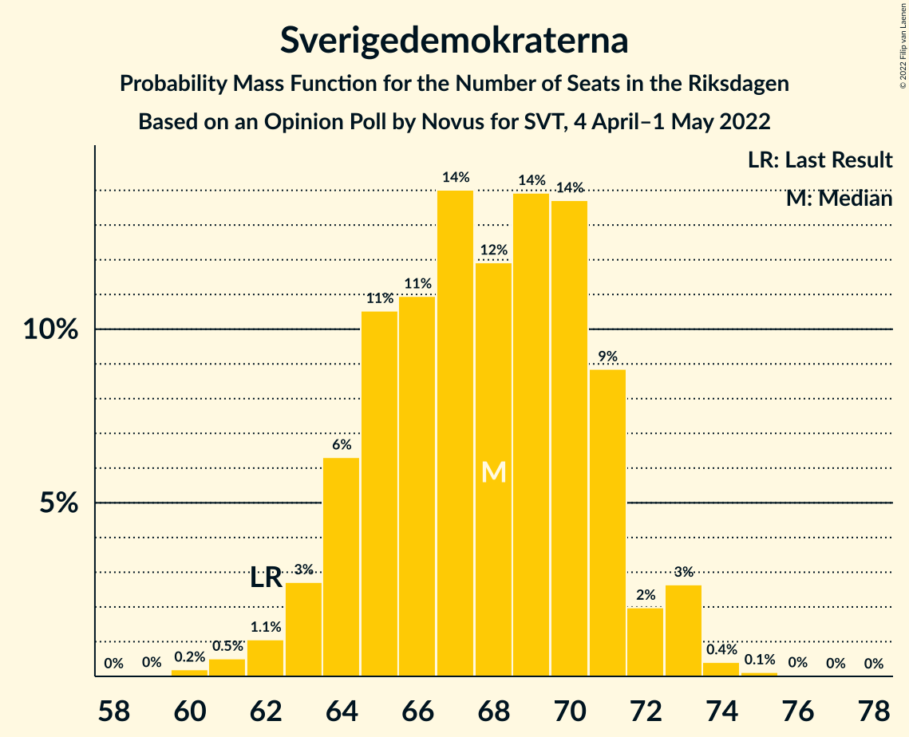

# Opinion Poll by Novus for SVT, 4 April–1 May 2022

<a href="#voting-intentions">Voting Intentions</a> | <a href="#seats">Seats</a> | <a href="#coalitions">Coalitions</a> | <a href="#technical-information">Technical Information</a>

## Voting Intentions

### Confidence Intervals

| Party | Last Result | Poll Result | 80% Confidence Interval | 90% Confidence Interval | 95% Confidence Interval | 99% Confidence Interval |
|:-----:|:-----------:|:-----------:|:-----------------------:|:-----------------------:|:-----------------------:|:-----------------------:|
| Sveriges socialdemokratiska arbetareparti | 28.3% | 31.8% | 30.8–32.8% |30.5–33.1% |30.3–33.4% |29.8–33.9% |
| Moderata samlingspartiet | 19.8% | 21.0% | 20.1–21.9% |19.9–22.2% |19.7–22.4% |19.3–22.8% |
| Sverigedemokraterna | 17.5% | 17.9% | 17.1–18.8% |16.9–19.0% |16.7–19.2% |16.3–19.6% |
| Vänsterpartiet | 8.0% | 9.0% | 8.4–9.7% |8.2–9.8% |8.1–10.0% |7.8–10.3% |
| Centerpartiet | 8.6% | 6.9% | 6.4–7.5% |6.2–7.6% |6.1–7.8% |5.9–8.1% |
| Kristdemokraterna | 6.3% | 5.9% | 5.4–6.4% |5.3–6.6% |5.2–6.7% |4.9–7.0% |
| Miljöpartiet de gröna | 4.4% | 3.3% | 2.9–3.7% |2.9–3.8% |2.8–3.9% |2.6–4.2% |
| Liberalerna | 5.5% | 2.5% | 2.2–2.9% |2.1–3.0% |2.0–3.1% |1.9–3.3% |

*Note:* The poll result column reflects the actual value used in the calculations. Published results may vary slightly, and in addition be rounded to fewer digits.

## Seats

### Confidence Intervals

| Party | Last Result | Median | 80% Confidence Interval | 90% Confidence Interval | 95% Confidence Interval | 99% Confidence Interval |
|:-----:|:-----------:|:------:|:-----------------------:|:-----------------------:|:-----------------------:|:-----------------------:|
| <a href="#sveriges-socialdemokratiska-arbetareparti">Sveriges socialdemokratiska arbetareparti</a> | 100 | 120 | 116–124 |115–125 |114–126 |112–127 |
| <a href="#moderata-samlingspartiet">Moderata samlingspartiet</a> | 70 | 79 | 76–82 |75–83 |74–84 |72–86 |
| <a href="#sverigedemokraterna">Sverigedemokraterna</a> | 62 | 68 | 64–71 |64–72 |63–73 |61–74 |
| <a href="#vänsterpartiet">Vänsterpartiet</a> | 28 | 34 | 32–37 |31–37 |30–38 |29–39 |
| <a href="#centerpartiet">Centerpartiet</a> | 31 | 26 | 24–28 |23–29 |23–29 |22–30 |
| <a href="#kristdemokraterna">Kristdemokraterna</a> | 22 | 22 | 20–24 |20–25 |19–25 |18–26 |
| <a href="#miljöpartiet-de-gröna">Miljöpartiet de gröna</a> | 16 | 0 | 0 |0 |0 |0–15 |
| <a href="#liberalerna">Liberalerna</a> | 20 | 0 | 0 |0 |0 |0 |

### Sveriges socialdemokratiska arbetareparti

*For a full overview of the results for this party, see the [Sveriges socialdemokratiska arbetareparti](party-sverigessocialdemokratiskaarbetareparti.html) page.*

| Number of Seats | Probability | Accumulated | Special Marks |
|:---------------:|:-----------:|:-----------:|:-------------:|
| 100 | 0% | 100% | Last Result |
| 101 | 0% | 100% |  |
| 102 | 0% | 100% |  |
| 103 | 0% | 100% |  |
| 104 | 0% | 100% |  |
| 105 | 0% | 100% |  |
| 106 | 0% | 100% |  |
| 107 | 0% | 100% |  |
| 108 | 0% | 100% |  |
| 109 | 0% | 100% |  |
| 110 | 0.1% | 99.9% |  |
| 111 | 0.2% | 99.8% |  |
| 112 | 0.5% | 99.6% |  |
| 113 | 1.1% | 99.1% |  |
| 114 | 2% | 98% |  |
| 115 | 3% | 96% |  |
| 116 | 6% | 93% |  |
| 117 | 9% | 87% |  |
| 118 | 11% | 77% |  |
| 119 | 11% | 66% |  |
| 120 | 14% | 54% | Median |
| 121 | 11% | 40% |  |
| 122 | 8% | 29% |  |
| 123 | 10% | 21% |  |
| 124 | 5% | 10% |  |
| 125 | 3% | 6% |  |
| 126 | 1.5% | 3% |  |
| 127 | 0.9% | 1.3% |  |
| 128 | 0.3% | 0.5% |  |
| 129 | 0.1% | 0.1% |  |
| 130 | 0% | 0% |  |

### Moderata samlingspartiet

*For a full overview of the results for this party, see the [Moderata samlingspartiet](party-moderatasamlingspartiet.html) page.*

| Number of Seats | Probability | Accumulated | Special Marks |
|:---------------:|:-----------:|:-----------:|:-------------:|
| 70 | 0% | 100% | Last Result |
| 71 | 0.1% | 100% |  |
| 72 | 0.4% | 99.9% |  |
| 73 | 0.9% | 99.5% |  |
| 74 | 2% | 98.6% |  |
| 75 | 6% | 97% |  |
| 76 | 11% | 91% |  |
| 77 | 9% | 80% |  |
| 78 | 15% | 71% |  |
| 79 | 14% | 56% | Median |
| 80 | 14% | 42% |  |
| 81 | 11% | 28% |  |
| 82 | 8% | 17% |  |
| 83 | 5% | 9% |  |
| 84 | 3% | 4% |  |
| 85 | 1.1% | 2% |  |
| 86 | 0.4% | 0.5% |  |
| 87 | 0.1% | 0.2% |  |
| 88 | 0% | 0.1% |  |
| 89 | 0% | 0% |  |

### Sverigedemokraterna

*For a full overview of the results for this party, see the [Sverigedemokraterna](party-sverigedemokraterna.html) page.*

| Number of Seats | Probability | Accumulated | Special Marks |
|:---------------:|:-----------:|:-----------:|:-------------:|
| 59 | 0% | 100% |  |
| 60 | 0.2% | 99.9% |  |
| 61 | 0.5% | 99.7% |  |
| 62 | 1.1% | 99.2% | Last Result |
| 63 | 3% | 98% |  |
| 64 | 6% | 95% |  |
| 65 | 11% | 89% |  |
| 66 | 11% | 79% |  |
| 67 | 14% | 68% |  |
| 68 | 12% | 54% | Median |
| 69 | 14% | 42% |  |
| 70 | 14% | 28% |  |
| 71 | 9% | 14% |  |
| 72 | 2% | 5% |  |
| 73 | 3% | 3% |  |
| 74 | 0.4% | 0.6% |  |
| 75 | 0.1% | 0.2% |  |
| 76 | 0% | 0.1% |  |
| 77 | 0% | 0% |  |

### Vänsterpartiet

*For a full overview of the results for this party, see the [Vänsterpartiet](party-vänsterpartiet.html) page.*

| Number of Seats | Probability | Accumulated | Special Marks |
|:---------------:|:-----------:|:-----------:|:-------------:|
| 28 | 0.1% | 100% | Last Result |
| 29 | 0.5% | 99.9% |  |
| 30 | 2% | 99.5% |  |
| 31 | 6% | 97% |  |
| 32 | 12% | 92% |  |
| 33 | 19% | 80% |  |
| 34 | 18% | 61% | Median |
| 35 | 20% | 42% |  |
| 36 | 12% | 22% |  |
| 37 | 7% | 10% |  |
| 38 | 3% | 4% |  |
| 39 | 0.9% | 1.0% |  |
| 40 | 0.1% | 0.1% |  |
| 41 | 0% | 0% |  |

### Centerpartiet

*For a full overview of the results for this party, see the [Centerpartiet](party-centerpartiet.html) page.*

| Number of Seats | Probability | Accumulated | Special Marks |
|:---------------:|:-----------:|:-----------:|:-------------:|
| 21 | 0.1% | 100% |  |
| 22 | 0.7% | 99.8% |  |
| 23 | 6% | 99.1% |  |
| 24 | 11% | 93% |  |
| 25 | 22% | 81% |  |
| 26 | 27% | 59% | Median |
| 27 | 11% | 32% |  |
| 28 | 15% | 21% |  |
| 29 | 4% | 6% |  |
| 30 | 2% | 2% |  |
| 31 | 0.3% | 0.4% | Last Result |
| 32 | 0% | 0.1% |  |
| 33 | 0% | 0% |  |

### Kristdemokraterna

*For a full overview of the results for this party, see the [Kristdemokraterna](party-kristdemokraterna.html) page.*

| Number of Seats | Probability | Accumulated | Special Marks |
|:---------------:|:-----------:|:-----------:|:-------------:|
| 18 | 0.5% | 100% |  |
| 19 | 3% | 99.5% |  |
| 20 | 8% | 97% |  |
| 21 | 20% | 88% |  |
| 22 | 26% | 68% | Last Result, Median |
| 23 | 23% | 42% |  |
| 24 | 12% | 19% |  |
| 25 | 6% | 7% |  |
| 26 | 1.4% | 2% |  |
| 27 | 0.3% | 0.3% |  |
| 28 | 0% | 0% |  |

### Miljöpartiet de gröna

*For a full overview of the results for this party, see the [Miljöpartiet de gröna](party-miljöpartietdegröna.html) page.*

| Number of Seats | Probability | Accumulated | Special Marks |
|:---------------:|:-----------:|:-----------:|:-------------:|
| 0 | 98% | 100% | Median |
| 1 | 0% | 2% |  |
| 2 | 0% | 2% |  |
| 3 | 0% | 2% |  |
| 4 | 0% | 2% |  |
| 5 | 0% | 2% |  |
| 6 | 0% | 2% |  |
| 7 | 0% | 2% |  |
| 8 | 0% | 2% |  |
| 9 | 0% | 2% |  |
| 10 | 0% | 2% |  |
| 11 | 0% | 2% |  |
| 12 | 0% | 2% |  |
| 13 | 0% | 2% |  |
| 14 | 0% | 2% |  |
| 15 | 1.3% | 2% |  |
| 16 | 0.2% | 0.2% | Last Result |
| 17 | 0% | 0% |  |

### Liberalerna

*For a full overview of the results for this party, see the [Liberalerna](party-liberalerna.html) page.*

| Number of Seats | Probability | Accumulated | Special Marks |
|:---------------:|:-----------:|:-----------:|:-------------:|
| 0 | 100% | 100% | Median |
| 1 | 0% | 0% |  |
| 2 | 0% | 0% |  |
| 3 | 0% | 0% |  |
| 4 | 0% | 0% |  |
| 5 | 0% | 0% |  |
| 6 | 0% | 0% |  |
| 7 | 0% | 0% |  |
| 8 | 0% | 0% |  |
| 9 | 0% | 0% |  |
| 10 | 0% | 0% |  |
| 11 | 0% | 0% |  |
| 12 | 0% | 0% |  |
| 13 | 0% | 0% |  |
| 14 | 0% | 0% |  |
| 15 | 0% | 0% |  |
| 16 | 0% | 0% |  |
| 17 | 0% | 0% |  |
| 18 | 0% | 0% |  |
| 19 | 0% | 0% |  |
| 20 | 0% | 0% | Last Result |

## Coalitions

### Confidence Intervals

| Coalition | Last Result | Median | Majority? | 80% Confidence Interval | 90% Confidence Interval | 95% Confidence Interval | 99% Confidence Interval |
|:---------:|:-----------:|:------:|:---------:|:-----------------------:|:-----------------------:|:-----------------------:|:-----------------------:|
| Sveriges socialdemokratiska arbetareparti – Moderata samlingspartiet – Centerpartiet | 201 | 225 | 100% | 221–229 | 220–230 | 218–230 | 215–233 |
| Sveriges socialdemokratiska arbetareparti – Moderata samlingspartiet | 170 | 198 | 100% | 195–203 | 194–204 | 192–205 | 189–206 |
| Sveriges socialdemokratiska arbetareparti – Vänsterpartiet – Centerpartiet – Miljöpartiet de gröna – Liberalerna | 195 | 180 | 96% | 176–184 | 175–186 | 174–186 | 172–189 |
| Moderata samlingspartiet – Sverigedemokraterna – Kristdemokraterna | 154 | 169 | 4% | 165–173 | 163–174 | 163–175 | 160–177 |
| Sveriges socialdemokratiska arbetareparti – Vänsterpartiet – Miljöpartiet de gröna | 144 | 154 | 0% | 150–158 | 149–159 | 148–161 | 146–164 |
| Sveriges socialdemokratiska arbetareparti – Vänsterpartiet | 128 | 154 | 0% | 150–158 | 149–159 | 147–160 | 145–162 |
| Moderata samlingspartiet – Sverigedemokraterna | 132 | 147 | 0% | 143–151 | 141–152 | 141–153 | 138–155 |
| Sveriges socialdemokratiska arbetareparti – Centerpartiet – Miljöpartiet de gröna – Liberalerna | 167 | 146 | 0% | 142–150 | 141–151 | 140–153 | 138–156 |
| Moderata samlingspartiet – Centerpartiet – Kristdemokraterna – Liberalerna | 143 | 127 | 0% | 123–131 | 122–133 | 122–134 | 120–136 |
| Moderata samlingspartiet – Centerpartiet – Kristdemokraterna | 123 | 127 | 0% | 123–131 | 122–133 | 122–134 | 120–136 |
| Sveriges socialdemokratiska arbetareparti – Miljöpartiet de gröna | 116 | 120 | 0% | 116–124 | 115–125 | 114–127 | 112–131 |
| Moderata samlingspartiet – Centerpartiet – Liberalerna | 121 | 104 | 0% | 102–109 | 101–110 | 100–111 | 98–112 |
| Moderata samlingspartiet – Centerpartiet | 101 | 104 | 0% | 102–109 | 101–110 | 100–111 | 98–112 |

### Sveriges socialdemokratiska arbetareparti – Moderata samlingspartiet – Centerpartiet

| Number of Seats | Probability | Accumulated | Special Marks |
|:---------------:|:-----------:|:-----------:|:-------------:|
| 201 | 0% | 100% | Last Result |
| 202 | 0% | 100% |  |
| 203 | 0% | 100% |  |
| 204 | 0% | 100% |  |
| 205 | 0% | 100% |  |
| 206 | 0% | 100% |  |
| 207 | 0% | 100% |  |
| 208 | 0% | 100% |  |
| 209 | 0% | 100% |  |
| 210 | 0% | 100% |  |
| 211 | 0% | 100% |  |
| 212 | 0% | 99.9% |  |
| 213 | 0.2% | 99.9% |  |
| 214 | 0.2% | 99.7% |  |
| 215 | 0.3% | 99.5% |  |
| 216 | 0.2% | 99.2% |  |
| 217 | 0.6% | 99.0% |  |
| 218 | 1.0% | 98% |  |
| 219 | 1.1% | 97% |  |
| 220 | 4% | 96% |  |
| 221 | 7% | 92% |  |
| 222 | 11% | 85% |  |
| 223 | 13% | 74% |  |
| 224 | 7% | 61% |  |
| 225 | 14% | 54% | Median |
| 226 | 8% | 39% |  |
| 227 | 10% | 31% |  |
| 228 | 7% | 21% |  |
| 229 | 8% | 14% |  |
| 230 | 3% | 6% |  |
| 231 | 1.1% | 2% |  |
| 232 | 0.7% | 1.3% |  |
| 233 | 0.4% | 0.6% |  |
| 234 | 0.1% | 0.2% |  |
| 235 | 0.1% | 0.1% |  |
| 236 | 0% | 0% |  |

### Sveriges socialdemokratiska arbetareparti – Moderata samlingspartiet

| Number of Seats | Probability | Accumulated | Special Marks |
|:---------------:|:-----------:|:-----------:|:-------------:|
| 170 | 0% | 100% | Last Result |
| 171 | 0% | 100% |  |
| 172 | 0% | 100% |  |
| 173 | 0% | 100% |  |
| 174 | 0% | 100% |  |
| 175 | 0% | 100% | Majority |
| 176 | 0% | 100% |  |
| 177 | 0% | 100% |  |
| 178 | 0% | 100% |  |
| 179 | 0% | 100% |  |
| 180 | 0% | 100% |  |
| 181 | 0% | 100% |  |
| 182 | 0% | 100% |  |
| 183 | 0% | 100% |  |
| 184 | 0% | 100% |  |
| 185 | 0% | 100% |  |
| 186 | 0% | 99.9% |  |
| 187 | 0.1% | 99.9% |  |
| 188 | 0.2% | 99.8% |  |
| 189 | 0.2% | 99.6% |  |
| 190 | 0.2% | 99.4% |  |
| 191 | 0.8% | 99.2% |  |
| 192 | 1.1% | 98% |  |
| 193 | 2% | 97% |  |
| 194 | 2% | 95% |  |
| 195 | 7% | 93% |  |
| 196 | 9% | 86% |  |
| 197 | 13% | 76% |  |
| 198 | 14% | 64% |  |
| 199 | 9% | 50% | Median |
| 200 | 6% | 40% |  |
| 201 | 15% | 34% |  |
| 202 | 7% | 19% |  |
| 203 | 5% | 12% |  |
| 204 | 2% | 7% |  |
| 205 | 2% | 4% |  |
| 206 | 2% | 2% |  |
| 207 | 0.2% | 0.4% |  |
| 208 | 0.1% | 0.2% |  |
| 209 | 0.1% | 0.1% |  |
| 210 | 0% | 0% |  |

### Sveriges socialdemokratiska arbetareparti – Vänsterpartiet – Centerpartiet – Miljöpartiet de gröna – Liberalerna

| Number of Seats | Probability | Accumulated | Special Marks |
|:---------------:|:-----------:|:-----------:|:-------------:|
| 170 | 0.1% | 100% |  |
| 171 | 0.2% | 99.9% |  |
| 172 | 0.4% | 99.7% |  |
| 173 | 1.0% | 99.3% |  |
| 174 | 2% | 98% |  |
| 175 | 4% | 96% | Majority |
| 176 | 5% | 92% |  |
| 177 | 9% | 87% |  |
| 178 | 11% | 78% |  |
| 179 | 11% | 67% |  |
| 180 | 9% | 55% | Median |
| 181 | 12% | 46% |  |
| 182 | 12% | 33% |  |
| 183 | 6% | 21% |  |
| 184 | 6% | 15% |  |
| 185 | 3% | 8% |  |
| 186 | 3% | 5% |  |
| 187 | 0.9% | 2% |  |
| 188 | 0.7% | 1.4% |  |
| 189 | 0.3% | 0.7% |  |
| 190 | 0.2% | 0.4% |  |
| 191 | 0.1% | 0.2% |  |
| 192 | 0% | 0.1% |  |
| 193 | 0% | 0.1% |  |
| 194 | 0% | 0% |  |
| 195 | 0% | 0% | Last Result |

### Moderata samlingspartiet – Sverigedemokraterna – Kristdemokraterna

| Number of Seats | Probability | Accumulated | Special Marks |
|:---------------:|:-----------:|:-----------:|:-------------:|
| 154 | 0% | 100% | Last Result |
| 155 | 0% | 100% |  |
| 156 | 0% | 100% |  |
| 157 | 0% | 99.9% |  |
| 158 | 0.1% | 99.9% |  |
| 159 | 0.2% | 99.8% |  |
| 160 | 0.3% | 99.6% |  |
| 161 | 0.7% | 99.3% |  |
| 162 | 0.9% | 98.6% |  |
| 163 | 3% | 98% |  |
| 164 | 3% | 95% |  |
| 165 | 6% | 92% |  |
| 166 | 6% | 85% |  |
| 167 | 12% | 79% |  |
| 168 | 12% | 67% |  |
| 169 | 9% | 54% | Median |
| 170 | 11% | 45% |  |
| 171 | 11% | 33% |  |
| 172 | 9% | 22% |  |
| 173 | 5% | 13% |  |
| 174 | 4% | 8% |  |
| 175 | 2% | 4% | Majority |
| 176 | 1.0% | 2% |  |
| 177 | 0.4% | 0.7% |  |
| 178 | 0.2% | 0.3% |  |
| 179 | 0.1% | 0.1% |  |
| 180 | 0% | 0% |  |

### Sveriges socialdemokratiska arbetareparti – Vänsterpartiet – Miljöpartiet de gröna

| Number of Seats | Probability | Accumulated | Special Marks |
|:---------------:|:-----------:|:-----------:|:-------------:|
| 144 | 0% | 100% | Last Result |
| 145 | 0.2% | 99.9% |  |
| 146 | 0.5% | 99.7% |  |
| 147 | 1.0% | 99.2% |  |
| 148 | 2% | 98% |  |
| 149 | 3% | 96% |  |
| 150 | 7% | 93% |  |
| 151 | 7% | 87% |  |
| 152 | 9% | 79% |  |
| 153 | 17% | 71% |  |
| 154 | 9% | 54% | Median |
| 155 | 11% | 45% |  |
| 156 | 13% | 34% |  |
| 157 | 7% | 22% |  |
| 158 | 5% | 14% |  |
| 159 | 4% | 9% |  |
| 160 | 2% | 5% |  |
| 161 | 1.3% | 3% |  |
| 162 | 0.7% | 2% |  |
| 163 | 0.3% | 0.8% |  |
| 164 | 0.2% | 0.5% |  |
| 165 | 0.1% | 0.3% |  |
| 166 | 0.1% | 0.1% |  |
| 167 | 0% | 0.1% |  |
| 168 | 0% | 0% |  |

### Sveriges socialdemokratiska arbetareparti – Vänsterpartiet

| Number of Seats | Probability | Accumulated | Special Marks |
|:---------------:|:-----------:|:-----------:|:-------------:|
| 128 | 0% | 100% | Last Result |
| 129 | 0% | 100% |  |
| 130 | 0% | 100% |  |
| 131 | 0% | 100% |  |
| 132 | 0% | 100% |  |
| 133 | 0% | 100% |  |
| 134 | 0% | 100% |  |
| 135 | 0% | 100% |  |
| 136 | 0% | 100% |  |
| 137 | 0% | 100% |  |
| 138 | 0% | 100% |  |
| 139 | 0% | 100% |  |
| 140 | 0% | 100% |  |
| 141 | 0% | 100% |  |
| 142 | 0% | 100% |  |
| 143 | 0.1% | 99.9% |  |
| 144 | 0.1% | 99.8% |  |
| 145 | 0.4% | 99.6% |  |
| 146 | 0.6% | 99.2% |  |
| 147 | 1.3% | 98.6% |  |
| 148 | 2% | 97% |  |
| 149 | 3% | 95% |  |
| 150 | 7% | 92% |  |
| 151 | 7% | 85% |  |
| 152 | 9% | 78% |  |
| 153 | 17% | 69% |  |
| 154 | 9% | 53% | Median |
| 155 | 11% | 44% |  |
| 156 | 13% | 33% |  |
| 157 | 7% | 20% |  |
| 158 | 5% | 13% |  |
| 159 | 4% | 8% |  |
| 160 | 2% | 4% |  |
| 161 | 1.1% | 2% |  |
| 162 | 0.4% | 0.7% |  |
| 163 | 0.1% | 0.2% |  |
| 164 | 0.1% | 0.1% |  |
| 165 | 0% | 0% |  |

### Moderata samlingspartiet – Sverigedemokraterna

| Number of Seats | Probability | Accumulated | Special Marks |
|:---------------:|:-----------:|:-----------:|:-------------:|
| 132 | 0% | 100% | Last Result |
| 133 | 0% | 100% |  |
| 134 | 0% | 100% |  |
| 135 | 0% | 100% |  |
| 136 | 0.1% | 99.9% |  |
| 137 | 0.2% | 99.9% |  |
| 138 | 0.3% | 99.7% |  |
| 139 | 0.8% | 99.4% |  |
| 140 | 0.9% | 98.6% |  |
| 141 | 3% | 98% |  |
| 142 | 3% | 94% |  |
| 143 | 7% | 92% |  |
| 144 | 9% | 85% |  |
| 145 | 10% | 76% |  |
| 146 | 14% | 66% |  |
| 147 | 12% | 52% | Median |
| 148 | 11% | 40% |  |
| 149 | 11% | 29% |  |
| 150 | 6% | 18% |  |
| 151 | 4% | 11% |  |
| 152 | 4% | 7% |  |
| 153 | 2% | 3% |  |
| 154 | 0.5% | 1.1% |  |
| 155 | 0.4% | 0.6% |  |
| 156 | 0.1% | 0.2% |  |
| 157 | 0.1% | 0.1% |  |
| 158 | 0% | 0% |  |

### Sveriges socialdemokratiska arbetareparti – Centerpartiet – Miljöpartiet de gröna – Liberalerna

| Number of Seats | Probability | Accumulated | Special Marks |
|:---------------:|:-----------:|:-----------:|:-------------:|
| 136 | 0.1% | 100% |  |
| 137 | 0.1% | 99.9% |  |
| 138 | 0.4% | 99.8% |  |
| 139 | 1.3% | 99.4% |  |
| 140 | 1.5% | 98% |  |
| 141 | 4% | 97% |  |
| 142 | 7% | 92% |  |
| 143 | 9% | 86% |  |
| 144 | 10% | 76% |  |
| 145 | 14% | 66% |  |
| 146 | 8% | 52% | Median |
| 147 | 11% | 44% |  |
| 148 | 11% | 33% |  |
| 149 | 9% | 23% |  |
| 150 | 6% | 13% |  |
| 151 | 3% | 7% |  |
| 152 | 1.4% | 4% |  |
| 153 | 1.0% | 3% |  |
| 154 | 0.4% | 2% |  |
| 155 | 0.4% | 1.1% |  |
| 156 | 0.2% | 0.6% |  |
| 157 | 0.2% | 0.4% |  |
| 158 | 0.1% | 0.2% |  |
| 159 | 0.1% | 0.2% |  |
| 160 | 0% | 0.1% |  |
| 161 | 0% | 0% |  |
| 162 | 0% | 0% |  |
| 163 | 0% | 0% |  |
| 164 | 0% | 0% |  |
| 165 | 0% | 0% |  |
| 166 | 0% | 0% |  |
| 167 | 0% | 0% | Last Result |

### Moderata samlingspartiet – Centerpartiet – Kristdemokraterna – Liberalerna

| Number of Seats | Probability | Accumulated | Special Marks |
|:---------------:|:-----------:|:-----------:|:-------------:|
| 117 | 0% | 100% |  |
| 118 | 0.2% | 99.9% |  |
| 119 | 0.2% | 99.7% |  |
| 120 | 0.5% | 99.6% |  |
| 121 | 0.9% | 99.1% |  |
| 122 | 4% | 98% |  |
| 123 | 4% | 94% |  |
| 124 | 11% | 90% |  |
| 125 | 12% | 79% |  |
| 126 | 13% | 67% |  |
| 127 | 13% | 54% | Median |
| 128 | 9% | 40% |  |
| 129 | 8% | 32% |  |
| 130 | 6% | 24% |  |
| 131 | 7% | 17% |  |
| 132 | 4% | 10% |  |
| 133 | 3% | 5% |  |
| 134 | 1.4% | 3% |  |
| 135 | 0.7% | 1.3% |  |
| 136 | 0.4% | 0.6% |  |
| 137 | 0.1% | 0.1% |  |
| 138 | 0% | 0% |  |
| 139 | 0% | 0% |  |
| 140 | 0% | 0% |  |
| 141 | 0% | 0% |  |
| 142 | 0% | 0% |  |
| 143 | 0% | 0% | Last Result |

### Moderata samlingspartiet – Centerpartiet – Kristdemokraterna

| Number of Seats | Probability | Accumulated | Special Marks |
|:---------------:|:-----------:|:-----------:|:-------------:|
| 117 | 0% | 100% |  |
| 118 | 0.2% | 99.9% |  |
| 119 | 0.2% | 99.7% |  |
| 120 | 0.5% | 99.6% |  |
| 121 | 0.9% | 99.1% |  |
| 122 | 4% | 98% |  |
| 123 | 4% | 94% | Last Result |
| 124 | 11% | 90% |  |
| 125 | 12% | 79% |  |
| 126 | 13% | 67% |  |
| 127 | 13% | 54% | Median |
| 128 | 9% | 40% |  |
| 129 | 8% | 32% |  |
| 130 | 6% | 24% |  |
| 131 | 7% | 17% |  |
| 132 | 4% | 10% |  |
| 133 | 3% | 5% |  |
| 134 | 1.4% | 3% |  |
| 135 | 0.7% | 1.3% |  |
| 136 | 0.4% | 0.6% |  |
| 137 | 0.1% | 0.1% |  |
| 138 | 0% | 0% |  |

### Sveriges socialdemokratiska arbetareparti – Miljöpartiet de gröna

| Number of Seats | Probability | Accumulated | Special Marks |
|:---------------:|:-----------:|:-----------:|:-------------:|
| 110 | 0% | 100% |  |
| 111 | 0.1% | 99.9% |  |
| 112 | 0.4% | 99.8% |  |
| 113 | 0.9% | 99.5% |  |
| 114 | 2% | 98.6% |  |
| 115 | 3% | 97% |  |
| 116 | 6% | 94% | Last Result |
| 117 | 9% | 88% |  |
| 118 | 11% | 79% |  |
| 119 | 11% | 67% |  |
| 120 | 14% | 56% | Median |
| 121 | 11% | 42% |  |
| 122 | 8% | 30% |  |
| 123 | 10% | 22% |  |
| 124 | 5% | 12% |  |
| 125 | 3% | 7% |  |
| 126 | 2% | 4% |  |
| 127 | 1.0% | 3% |  |
| 128 | 0.5% | 2% |  |
| 129 | 0.3% | 1.1% |  |
| 130 | 0.2% | 0.8% |  |
| 131 | 0.2% | 0.6% |  |
| 132 | 0.1% | 0.4% |  |
| 133 | 0.1% | 0.2% |  |
| 134 | 0% | 0.1% |  |
| 135 | 0% | 0% |  |

### Moderata samlingspartiet – Centerpartiet – Liberalerna

| Number of Seats | Probability | Accumulated | Special Marks |
|:---------------:|:-----------:|:-----------:|:-------------:|
| 96 | 0.1% | 100% |  |
| 97 | 0.2% | 99.8% |  |
| 98 | 0.5% | 99.7% |  |
| 99 | 1.5% | 99.2% |  |
| 100 | 2% | 98% |  |
| 101 | 5% | 96% |  |
| 102 | 13% | 91% |  |
| 103 | 13% | 77% |  |
| 104 | 14% | 64% |  |
| 105 | 14% | 50% | Median |
| 106 | 8% | 36% |  |
| 107 | 5% | 28% |  |
| 108 | 9% | 23% |  |
| 109 | 8% | 14% |  |
| 110 | 2% | 7% |  |
| 111 | 3% | 5% |  |
| 112 | 0.9% | 1.3% |  |
| 113 | 0.1% | 0.4% |  |
| 114 | 0.2% | 0.3% |  |
| 115 | 0.1% | 0.1% |  |
| 116 | 0% | 0% |  |
| 117 | 0% | 0% |  |
| 118 | 0% | 0% |  |
| 119 | 0% | 0% |  |
| 120 | 0% | 0% |  |
| 121 | 0% | 0% | Last Result |

### Moderata samlingspartiet – Centerpartiet

| Number of Seats | Probability | Accumulated | Special Marks |
|:---------------:|:-----------:|:-----------:|:-------------:|
| 96 | 0.1% | 100% |  |
| 97 | 0.2% | 99.8% |  |
| 98 | 0.5% | 99.7% |  |
| 99 | 1.5% | 99.2% |  |
| 100 | 2% | 98% |  |
| 101 | 5% | 96% | Last Result |
| 102 | 13% | 91% |  |
| 103 | 13% | 77% |  |
| 104 | 14% | 64% |  |
| 105 | 14% | 50% | Median |
| 106 | 8% | 36% |  |
| 107 | 5% | 28% |  |
| 108 | 9% | 23% |  |
| 109 | 8% | 14% |  |
| 110 | 2% | 7% |  |
| 111 | 3% | 5% |  |
| 112 | 0.9% | 1.3% |  |
| 113 | 0.1% | 0.4% |  |
| 114 | 0.2% | 0.3% |  |
| 115 | 0.1% | 0.1% |  |
| 116 | 0% | 0% |  |

## Technical Information

### Opinion Poll

+ **Polling firm:** Novus
+ **Commissioner(s):** SVT
+ **Fieldwork period:** 4 April–1 May 2022

### Calculations

+ **Sample size:** 3541
+ **Simulations done:** 1,048,576
+ **Error estimate:** 1.04%

