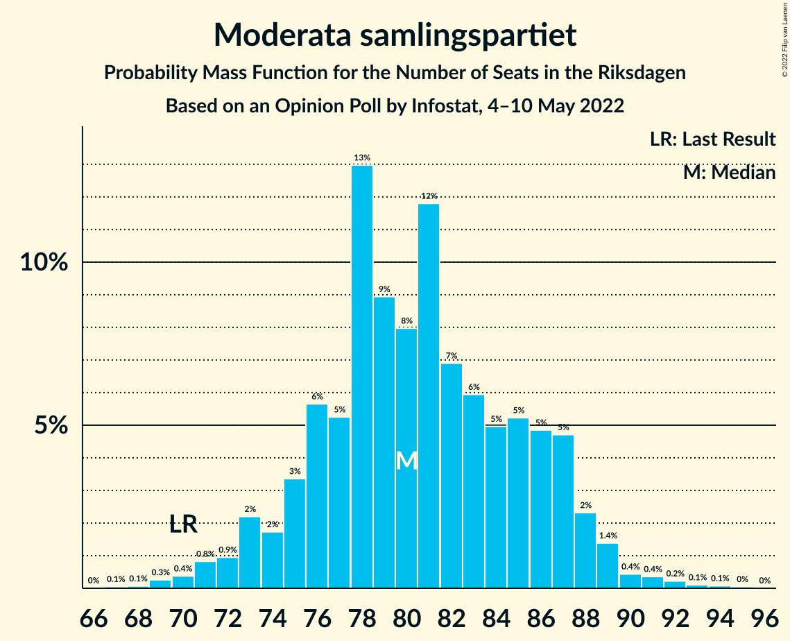
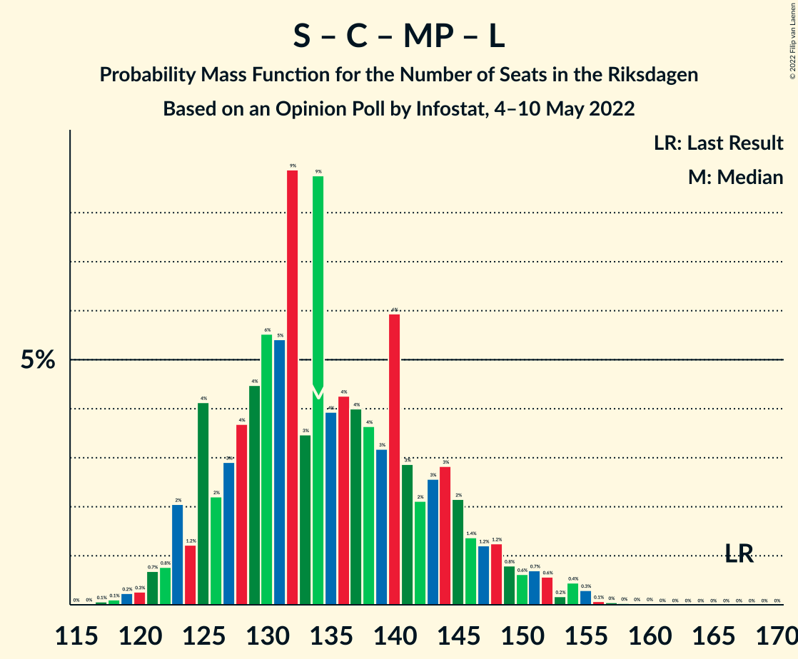

# Opinion Poll by Infostat, 4–10 May 2022

<a href="#voting-intentions">Voting Intentions</a> | <a href="#seats">Seats</a> | <a href="#coalitions">Coalitions</a> | <a href="#technical-information">Technical Information</a>

## Voting Intentions

### Confidence Intervals

| Party | Last Result | Poll Result | 80% Confidence Interval | 90% Confidence Interval | 95% Confidence Interval | 99% Confidence Interval |
|:-----:|:-----------:|:-----------:|:-----------------------:|:-----------------------:|:-----------------------:|:-----------------------:|
| Sveriges socialdemokratiska arbetareparti | 28.3% | 27.7% | 26.3–29.1% |25.9–29.5% |25.6–29.9% |25.0–30.6% |
| Moderata samlingspartiet | 19.8% | 21.3% | 20.1–22.6% |19.7–23.0% |19.4–23.3% |18.8–24.0% |
| Sverigedemokraterna | 17.5% | 21.0% | 19.8–22.3% |19.4–22.7% |19.1–23.0% |18.5–23.7% |
| Vänsterpartiet | 8.0% | 8.2% | 7.4–9.1% |7.2–9.4% |7.0–9.6% |6.6–10.1% |
| Kristdemokraterna | 6.3% | 6.0% | 5.3–6.8% |5.1–7.0% |4.9–7.2% |4.6–7.6% |
| Centerpartiet | 8.6% | 5.9% | 5.2–6.7% |5.0–7.0% |4.9–7.1% |4.6–7.6% |
| Miljöpartiet de gröna | 4.4% | 3.7% | 3.2–4.4% |3.0–4.6% |2.9–4.8% |2.7–5.1% |
| Liberalerna | 5.5% | 3.5% | 3.0–4.1% |2.8–4.3% |2.7–4.5% |2.5–4.8% |

*Note:* The poll result column reflects the actual value used in the calculations. Published results may vary slightly, and in addition be rounded to fewer digits.

## Seats

### Confidence Intervals

| Party | Last Result | Median | 80% Confidence Interval | 90% Confidence Interval | 95% Confidence Interval | 99% Confidence Interval |
|:-----:|:-----------:|:------:|:-----------------------:|:-----------------------:|:-----------------------:|:-----------------------:|
| <a href="#sveriges-socialdemokratiska-arbetareparti">Sveriges socialdemokratiska arbetareparti</a> | 100 | 105 | 98–111 |97–112 |95–114 |92–117 |
| <a href="#moderata-samlingspartiet">Moderata samlingspartiet</a> | 70 | 80 | 76–86 |74–87 |72–89 |70–91 |
| <a href="#sverigedemokraterna">Sverigedemokraterna</a> | 62 | 80 | 74–85 |72–86 |71–88 |69–90 |
| <a href="#vänsterpartiet">Vänsterpartiet</a> | 28 | 32 | 28–35 |27–36 |26–37 |25–39 |
| <a href="#kristdemokraterna">Kristdemokraterna</a> | 22 | 23 | 20–26 |19–27 |19–27 |17–29 |
| <a href="#centerpartiet">Centerpartiet</a> | 31 | 22 | 20–26 |19–26 |18–27 |17–29 |
| <a href="#miljöpartiet-de-gröna">Miljöpartiet de gröna</a> | 16 | 0 | 0–16 |0–17 |0–17 |0–19 |
| <a href="#liberalerna">Liberalerna</a> | 20 | 0 | 0–15 |0–16 |0–16 |0–18 |

### Sveriges socialdemokratiska arbetareparti

*For a full overview of the results for this party, see the [Sveriges socialdemokratiska arbetareparti](party-sverigessocialdemokratiskaarbetareparti.html) page.*

| Number of Seats | Probability | Accumulated | Special Marks |
|:---------------:|:-----------:|:-----------:|:-------------:|
| 89 | 0% | 100% |  |
| 90 | 0.2% | 99.9% |  |
| 91 | 0.1% | 99.7% |  |
| 92 | 0.3% | 99.6% |  |
| 93 | 0.3% | 99.3% |  |
| 94 | 0.9% | 99.0% |  |
| 95 | 0.7% | 98% |  |
| 96 | 2% | 97% |  |
| 97 | 2% | 95% |  |
| 98 | 3% | 93% |  |
| 99 | 3% | 90% |  |
| 100 | 5% | 86% | Last Result |
| 101 | 5% | 82% |  |
| 102 | 8% | 77% |  |
| 103 | 11% | 69% |  |
| 104 | 6% | 58% |  |
| 105 | 4% | 52% | Median |
| 106 | 9% | 47% |  |
| 107 | 6% | 39% |  |
| 108 | 4% | 33% |  |
| 109 | 6% | 28% |  |
| 110 | 9% | 23% |  |
| 111 | 4% | 14% |  |
| 112 | 4% | 9% |  |
| 113 | 1.3% | 5% |  |
| 114 | 2% | 3% |  |
| 115 | 0.7% | 2% |  |
| 116 | 0.4% | 1.0% |  |
| 117 | 0.2% | 0.6% |  |
| 118 | 0.3% | 0.4% |  |
| 119 | 0.1% | 0.2% |  |
| 120 | 0% | 0.1% |  |
| 121 | 0% | 0% |  |

### Moderata samlingspartiet

*For a full overview of the results for this party, see the [Moderata samlingspartiet](party-moderatasamlingspartiet.html) page.*

| Number of Seats | Probability | Accumulated | Special Marks |
|:---------------:|:-----------:|:-----------:|:-------------:|
| 67 | 0.1% | 100% |  |
| 68 | 0.1% | 99.9% |  |
| 69 | 0.3% | 99.9% |  |
| 70 | 0.4% | 99.6% | Last Result |
| 71 | 0.8% | 99.2% |  |
| 72 | 0.9% | 98% |  |
| 73 | 2% | 97% |  |
| 74 | 2% | 95% |  |
| 75 | 3% | 94% |  |
| 76 | 6% | 90% |  |
| 77 | 5% | 85% |  |
| 78 | 13% | 79% |  |
| 79 | 9% | 66% |  |
| 80 | 8% | 57% | Median |
| 81 | 12% | 49% |  |
| 82 | 7% | 38% |  |
| 83 | 6% | 31% |  |
| 84 | 5% | 25% |  |
| 85 | 5% | 20% |  |
| 86 | 5% | 15% |  |
| 87 | 5% | 10% |  |
| 88 | 2% | 5% |  |
| 89 | 1.4% | 3% |  |
| 90 | 0.4% | 1.3% |  |
| 91 | 0.4% | 0.8% |  |
| 92 | 0.2% | 0.5% |  |
| 93 | 0.1% | 0.2% |  |
| 94 | 0.1% | 0.1% |  |
| 95 | 0% | 0.1% |  |
| 96 | 0% | 0% |  |

### Sverigedemokraterna

*For a full overview of the results for this party, see the [Sverigedemokraterna](party-sverigedemokraterna.html) page.*

| Number of Seats | Probability | Accumulated | Special Marks |
|:---------------:|:-----------:|:-----------:|:-------------:|
| 62 | 0% | 100% | Last Result |
| 63 | 0% | 100% |  |
| 64 | 0% | 100% |  |
| 65 | 0% | 100% |  |
| 66 | 0.1% | 100% |  |
| 67 | 0.1% | 99.9% |  |
| 68 | 0.2% | 99.8% |  |
| 69 | 0.4% | 99.6% |  |
| 70 | 0.7% | 99.2% |  |
| 71 | 1.2% | 98.6% |  |
| 72 | 2% | 97% |  |
| 73 | 3% | 95% |  |
| 74 | 5% | 92% |  |
| 75 | 4% | 87% |  |
| 76 | 10% | 83% |  |
| 77 | 6% | 73% |  |
| 78 | 10% | 67% |  |
| 79 | 5% | 57% |  |
| 80 | 10% | 51% | Median |
| 81 | 7% | 41% |  |
| 82 | 10% | 34% |  |
| 83 | 7% | 24% |  |
| 84 | 5% | 17% |  |
| 85 | 4% | 12% |  |
| 86 | 3% | 8% |  |
| 87 | 2% | 5% |  |
| 88 | 1.2% | 3% |  |
| 89 | 0.7% | 2% |  |
| 90 | 0.5% | 1.0% |  |
| 91 | 0.2% | 0.5% |  |
| 92 | 0.2% | 0.3% |  |
| 93 | 0% | 0.1% |  |
| 94 | 0% | 0% |  |

### Vänsterpartiet

*For a full overview of the results for this party, see the [Vänsterpartiet](party-vänsterpartiet.html) page.*

| Number of Seats | Probability | Accumulated | Special Marks |
|:---------------:|:-----------:|:-----------:|:-------------:|
| 23 | 0.1% | 100% |  |
| 24 | 0.3% | 99.9% |  |
| 25 | 0.7% | 99.6% |  |
| 26 | 2% | 98.9% |  |
| 27 | 4% | 97% |  |
| 28 | 9% | 93% | Last Result |
| 29 | 12% | 84% |  |
| 30 | 11% | 72% |  |
| 31 | 11% | 61% |  |
| 32 | 18% | 50% | Median |
| 33 | 14% | 32% |  |
| 34 | 5% | 18% |  |
| 35 | 7% | 13% |  |
| 36 | 3% | 6% |  |
| 37 | 2% | 3% |  |
| 38 | 0.4% | 1.1% |  |
| 39 | 0.6% | 0.7% |  |
| 40 | 0.1% | 0.1% |  |
| 41 | 0% | 0% |  |

### Kristdemokraterna

*For a full overview of the results for this party, see the [Kristdemokraterna](party-kristdemokraterna.html) page.*

| Number of Seats | Probability | Accumulated | Special Marks |
|:---------------:|:-----------:|:-----------:|:-------------:|
| 16 | 0.1% | 100% |  |
| 17 | 0.4% | 99.9% |  |
| 18 | 2% | 99.4% |  |
| 19 | 4% | 98% |  |
| 20 | 9% | 94% |  |
| 21 | 13% | 85% |  |
| 22 | 17% | 72% | Last Result |
| 23 | 18% | 55% | Median |
| 24 | 16% | 37% |  |
| 25 | 8% | 21% |  |
| 26 | 7% | 13% |  |
| 27 | 4% | 6% |  |
| 28 | 2% | 2% |  |
| 29 | 0.4% | 0.7% |  |
| 30 | 0.2% | 0.3% |  |
| 31 | 0.1% | 0.1% |  |
| 32 | 0% | 0% |  |

### Centerpartiet

*For a full overview of the results for this party, see the [Centerpartiet](party-centerpartiet.html) page.*

| Number of Seats | Probability | Accumulated | Special Marks |
|:---------------:|:-----------:|:-----------:|:-------------:|
| 16 | 0.1% | 100% |  |
| 17 | 0.6% | 99.9% |  |
| 18 | 2% | 99.3% |  |
| 19 | 5% | 97% |  |
| 20 | 11% | 93% |  |
| 21 | 15% | 82% |  |
| 22 | 21% | 67% | Median |
| 23 | 15% | 46% |  |
| 24 | 12% | 32% |  |
| 25 | 9% | 20% |  |
| 26 | 6% | 10% |  |
| 27 | 3% | 4% |  |
| 28 | 0.8% | 2% |  |
| 29 | 0.6% | 0.7% |  |
| 30 | 0.1% | 0.2% |  |
| 31 | 0% | 0.1% | Last Result |
| 32 | 0% | 0% |  |

### Miljöpartiet de gröna

*For a full overview of the results for this party, see the [Miljöpartiet de gröna](party-miljöpartietdegröna.html) page.*

| Number of Seats | Probability | Accumulated | Special Marks |
|:---------------:|:-----------:|:-----------:|:-------------:|
| 0 | 70% | 100% | Median |
| 1 | 0% | 30% |  |
| 2 | 0% | 30% |  |
| 3 | 0% | 30% |  |
| 4 | 0% | 30% |  |
| 5 | 0% | 30% |  |
| 6 | 0% | 30% |  |
| 7 | 0% | 30% |  |
| 8 | 0% | 30% |  |
| 9 | 0% | 30% |  |
| 10 | 0% | 30% |  |
| 11 | 0% | 30% |  |
| 12 | 0% | 30% |  |
| 13 | 0% | 30% |  |
| 14 | 0.5% | 30% |  |
| 15 | 11% | 30% |  |
| 16 | 12% | 19% | Last Result |
| 17 | 5% | 8% |  |
| 18 | 2% | 2% |  |
| 19 | 0.4% | 0.6% |  |
| 20 | 0.1% | 0.1% |  |
| 21 | 0% | 0% |  |

### Liberalerna

*For a full overview of the results for this party, see the [Liberalerna](party-liberalerna.html) page.*

| Number of Seats | Probability | Accumulated | Special Marks |
|:---------------:|:-----------:|:-----------:|:-------------:|
| 0 | 84% | 100% | Median |
| 1 | 0% | 16% |  |
| 2 | 0% | 16% |  |
| 3 | 0% | 16% |  |
| 4 | 0% | 16% |  |
| 5 | 0% | 16% |  |
| 6 | 0% | 16% |  |
| 7 | 0% | 16% |  |
| 8 | 0% | 16% |  |
| 9 | 0% | 16% |  |
| 10 | 0% | 16% |  |
| 11 | 0% | 16% |  |
| 12 | 0% | 16% |  |
| 13 | 0% | 16% |  |
| 14 | 0.7% | 16% |  |
| 15 | 7% | 15% |  |
| 16 | 6% | 8% |  |
| 17 | 2% | 2% |  |
| 18 | 0.5% | 0.7% |  |
| 19 | 0.1% | 0.1% |  |
| 20 | 0% | 0% | Last Result |

## Coalitions

### Confidence Intervals

| Coalition | Last Result | Median | Majority? | 80% Confidence Interval | 90% Confidence Interval | 95% Confidence Interval | 99% Confidence Interval |
|:---------:|:-----------:|:------:|:---------:|:-----------------------:|:-----------------------:|:-----------------------:|:-----------------------:|
| Sveriges socialdemokratiska arbetareparti – Moderata samlingspartiet – Centerpartiet | 201 | 209 | 100% | 199–216 | 197–218 | 193–219 | 190–223 |
| Sveriges socialdemokratiska arbetareparti – Moderata samlingspartiet | 170 | 186 | 95% | 177–194 | 174–195 | 172–197 | 168–200 |
| Moderata samlingspartiet – Sverigedemokraterna – Kristdemokraterna | 154 | 183 | 90% | 175–191 | 172–193 | 169–195 | 165–198 |
| Sveriges socialdemokratiska arbetareparti – Vänsterpartiet – Centerpartiet – Miljöpartiet de gröna – Liberalerna | 195 | 166 | 10% | 158–174 | 156–177 | 154–180 | 151–184 |
| Moderata samlingspartiet – Sverigedemokraterna | 132 | 160 | 0.6% | 152–168 | 150–170 | 147–171 | 145–175 |
| Sveriges socialdemokratiska arbetareparti – Vänsterpartiet – Miljöpartiet de gröna | 144 | 142 | 0% | 132–150 | 130–152 | 128–153 | 125–157 |
| Sveriges socialdemokratiska arbetareparti – Centerpartiet – Miljöpartiet de gröna – Liberalerna | 167 | 134 | 0% | 126–144 | 124–148 | 123–150 | 120–155 |
| Sveriges socialdemokratiska arbetareparti – Vänsterpartiet | 128 | 136 | 0% | 129–144 | 126–145 | 124–146 | 121–149 |
| Moderata samlingspartiet – Kristdemokraterna – Centerpartiet – Liberalerna | 143 | 128 | 0% | 121–137 | 119–140 | 118–143 | 114–145 |
| Moderata samlingspartiet – Kristdemokraterna – Centerpartiet | 123 | 126 | 0% | 119–133 | 117–135 | 115–136 | 112–139 |
| Sveriges socialdemokratiska arbetareparti – Miljöpartiet de gröna | 116 | 110 | 0% | 102–119 | 99–122 | 98–123 | 95–126 |
| Moderata samlingspartiet – Centerpartiet – Liberalerna | 121 | 104 | 0% | 99–113 | 97–118 | 96–120 | 92–122 |
| Moderata samlingspartiet – Centerpartiet | 101 | 103 | 0% | 97–110 | 95–111 | 93–112 | 91–115 |

### Sveriges socialdemokratiska arbetareparti – Moderata samlingspartiet – Centerpartiet

| Number of Seats | Probability | Accumulated | Special Marks |
|:---------------:|:-----------:|:-----------:|:-------------:|
| 184 | 0% | 100% |  |
| 185 | 0% | 99.9% |  |
| 186 | 0% | 99.9% |  |
| 187 | 0.1% | 99.9% |  |
| 188 | 0.1% | 99.8% |  |
| 189 | 0.1% | 99.7% |  |
| 190 | 1.0% | 99.5% |  |
| 191 | 0.2% | 98.5% |  |
| 192 | 0.4% | 98% |  |
| 193 | 0.5% | 98% |  |
| 194 | 0.4% | 97% |  |
| 195 | 0.7% | 97% |  |
| 196 | 1.1% | 96% |  |
| 197 | 3% | 95% |  |
| 198 | 2% | 92% |  |
| 199 | 3% | 90% |  |
| 200 | 4% | 87% |  |
| 201 | 1.0% | 84% | Last Result |
| 202 | 7% | 83% |  |
| 203 | 3% | 75% |  |
| 204 | 3% | 72% |  |
| 205 | 5% | 68% |  |
| 206 | 2% | 64% |  |
| 207 | 3% | 61% | Median |
| 208 | 4% | 58% |  |
| 209 | 6% | 54% |  |
| 210 | 4% | 48% |  |
| 211 | 6% | 44% |  |
| 212 | 10% | 39% |  |
| 213 | 7% | 28% |  |
| 214 | 3% | 21% |  |
| 215 | 3% | 18% |  |
| 216 | 6% | 16% |  |
| 217 | 4% | 10% |  |
| 218 | 2% | 6% |  |
| 219 | 2% | 4% |  |
| 220 | 0.4% | 2% |  |
| 221 | 0.8% | 2% |  |
| 222 | 0.4% | 1.0% |  |
| 223 | 0.2% | 0.6% |  |
| 224 | 0.2% | 0.4% |  |
| 225 | 0.2% | 0.2% |  |
| 226 | 0% | 0% |  |

### Sveriges socialdemokratiska arbetareparti – Moderata samlingspartiet

| Number of Seats | Probability | Accumulated | Special Marks |
|:---------------:|:-----------:|:-----------:|:-------------:|
| 163 | 0% | 100% |  |
| 164 | 0% | 99.9% |  |
| 165 | 0.1% | 99.9% |  |
| 166 | 0.1% | 99.8% |  |
| 167 | 0.1% | 99.7% |  |
| 168 | 0.3% | 99.6% |  |
| 169 | 0.3% | 99.3% |  |
| 170 | 0.8% | 99.0% | Last Result |
| 171 | 0.5% | 98% |  |
| 172 | 0.7% | 98% |  |
| 173 | 1.3% | 97% |  |
| 174 | 1.1% | 96% |  |
| 175 | 2% | 95% | Majority |
| 176 | 3% | 93% |  |
| 177 | 2% | 90% |  |
| 178 | 3% | 88% |  |
| 179 | 4% | 85% |  |
| 180 | 4% | 81% |  |
| 181 | 6% | 77% |  |
| 182 | 5% | 71% |  |
| 183 | 5% | 66% |  |
| 184 | 4% | 62% |  |
| 185 | 4% | 58% | Median |
| 186 | 5% | 54% |  |
| 187 | 6% | 49% |  |
| 188 | 5% | 43% |  |
| 189 | 6% | 38% |  |
| 190 | 6% | 32% |  |
| 191 | 6% | 26% |  |
| 192 | 5% | 20% |  |
| 193 | 5% | 15% |  |
| 194 | 3% | 10% |  |
| 195 | 3% | 7% |  |
| 196 | 2% | 4% |  |
| 197 | 1.1% | 3% |  |
| 198 | 0.5% | 2% |  |
| 199 | 0.3% | 1.1% |  |
| 200 | 0.5% | 0.8% |  |
| 201 | 0.1% | 0.3% |  |
| 202 | 0.1% | 0.2% |  |
| 203 | 0% | 0.1% |  |
| 204 | 0% | 0% |  |

### Moderata samlingspartiet – Sverigedemokraterna – Kristdemokraterna

| Number of Seats | Probability | Accumulated | Special Marks |
|:---------------:|:-----------:|:-----------:|:-------------:|
| 154 | 0% | 100% | Last Result |
| 155 | 0% | 100% |  |
| 156 | 0% | 100% |  |
| 157 | 0% | 100% |  |
| 158 | 0% | 100% |  |
| 159 | 0% | 100% |  |
| 160 | 0% | 100% |  |
| 161 | 0% | 100% |  |
| 162 | 0% | 99.9% |  |
| 163 | 0.1% | 99.9% |  |
| 164 | 0.1% | 99.8% |  |
| 165 | 0.5% | 99.8% |  |
| 166 | 0.1% | 99.3% |  |
| 167 | 0.7% | 99.1% |  |
| 168 | 0.4% | 98% |  |
| 169 | 0.7% | 98% |  |
| 170 | 1.3% | 97% |  |
| 171 | 0.6% | 96% |  |
| 172 | 2% | 95% |  |
| 173 | 1.0% | 94% |  |
| 174 | 2% | 93% |  |
| 175 | 4% | 90% | Majority |
| 176 | 4% | 86% |  |
| 177 | 3% | 82% |  |
| 178 | 2% | 79% |  |
| 179 | 6% | 77% |  |
| 180 | 5% | 71% |  |
| 181 | 4% | 66% |  |
| 182 | 8% | 62% |  |
| 183 | 6% | 54% | Median |
| 184 | 3% | 48% |  |
| 185 | 10% | 45% |  |
| 186 | 6% | 35% |  |
| 187 | 6% | 29% |  |
| 188 | 5% | 23% |  |
| 189 | 4% | 18% |  |
| 190 | 2% | 14% |  |
| 191 | 4% | 12% |  |
| 192 | 1.2% | 8% |  |
| 193 | 2% | 7% |  |
| 194 | 1.4% | 4% |  |
| 195 | 1.1% | 3% |  |
| 196 | 0.8% | 2% |  |
| 197 | 0.5% | 1.0% |  |
| 198 | 0.2% | 0.5% |  |
| 199 | 0.2% | 0.3% |  |
| 200 | 0% | 0.1% |  |
| 201 | 0.1% | 0.1% |  |
| 202 | 0% | 0% |  |

### Sveriges socialdemokratiska arbetareparti – Vänsterpartiet – Centerpartiet – Miljöpartiet de gröna – Liberalerna

| Number of Seats | Probability | Accumulated | Special Marks |
|:---------------:|:-----------:|:-----------:|:-------------:|
| 148 | 0.1% | 100% |  |
| 149 | 0% | 99.9% |  |
| 150 | 0.2% | 99.9% |  |
| 151 | 0.2% | 99.7% |  |
| 152 | 0.5% | 99.5% |  |
| 153 | 0.8% | 98.9% |  |
| 154 | 1.1% | 98% |  |
| 155 | 1.4% | 97% |  |
| 156 | 2% | 96% |  |
| 157 | 1.2% | 93% |  |
| 158 | 4% | 92% |  |
| 159 | 2% | 88% | Median |
| 160 | 4% | 86% |  |
| 161 | 5% | 82% |  |
| 162 | 6% | 77% |  |
| 163 | 6% | 71% |  |
| 164 | 10% | 65% |  |
| 165 | 3% | 55% |  |
| 166 | 6% | 52% |  |
| 167 | 8% | 45% |  |
| 168 | 4% | 38% |  |
| 169 | 5% | 34% |  |
| 170 | 6% | 29% |  |
| 171 | 2% | 23% |  |
| 172 | 3% | 21% |  |
| 173 | 4% | 18% |  |
| 174 | 4% | 14% |  |
| 175 | 2% | 10% | Majority |
| 176 | 1.0% | 7% |  |
| 177 | 2% | 6% |  |
| 178 | 0.6% | 4% |  |
| 179 | 1.2% | 4% |  |
| 180 | 0.7% | 3% |  |
| 181 | 0.4% | 2% |  |
| 182 | 0.7% | 2% |  |
| 183 | 0.1% | 0.9% |  |
| 184 | 0.5% | 0.7% |  |
| 185 | 0.1% | 0.2% |  |
| 186 | 0.1% | 0.2% |  |
| 187 | 0% | 0.1% |  |
| 188 | 0% | 0.1% |  |
| 189 | 0% | 0% |  |
| 190 | 0% | 0% |  |
| 191 | 0% | 0% |  |
| 192 | 0% | 0% |  |
| 193 | 0% | 0% |  |
| 194 | 0% | 0% |  |
| 195 | 0% | 0% | Last Result |

### Moderata samlingspartiet – Sverigedemokraterna

| Number of Seats | Probability | Accumulated | Special Marks |
|:---------------:|:-----------:|:-----------:|:-------------:|
| 132 | 0% | 100% | Last Result |
| 133 | 0% | 100% |  |
| 134 | 0% | 100% |  |
| 135 | 0% | 100% |  |
| 136 | 0% | 100% |  |
| 137 | 0% | 100% |  |
| 138 | 0% | 100% |  |
| 139 | 0% | 100% |  |
| 140 | 0% | 100% |  |
| 141 | 0% | 99.9% |  |
| 142 | 0.1% | 99.9% |  |
| 143 | 0.1% | 99.8% |  |
| 144 | 0.2% | 99.7% |  |
| 145 | 0.9% | 99.5% |  |
| 146 | 0.4% | 98.6% |  |
| 147 | 0.8% | 98% |  |
| 148 | 0.8% | 97% |  |
| 149 | 1.0% | 97% |  |
| 150 | 2% | 96% |  |
| 151 | 2% | 94% |  |
| 152 | 4% | 92% |  |
| 153 | 3% | 88% |  |
| 154 | 3% | 86% |  |
| 155 | 4% | 83% |  |
| 156 | 8% | 79% |  |
| 157 | 3% | 71% |  |
| 158 | 6% | 68% |  |
| 159 | 8% | 62% |  |
| 160 | 4% | 54% | Median |
| 161 | 7% | 50% |  |
| 162 | 6% | 42% |  |
| 163 | 9% | 36% |  |
| 164 | 6% | 28% |  |
| 165 | 4% | 21% |  |
| 166 | 4% | 18% |  |
| 167 | 3% | 13% |  |
| 168 | 2% | 10% |  |
| 169 | 1.1% | 8% |  |
| 170 | 4% | 7% |  |
| 171 | 2% | 4% |  |
| 172 | 0.6% | 2% |  |
| 173 | 0.4% | 1.3% |  |
| 174 | 0.3% | 0.9% |  |
| 175 | 0.4% | 0.6% | Majority |
| 176 | 0.2% | 0.3% |  |
| 177 | 0% | 0.1% |  |
| 178 | 0% | 0.1% |  |
| 179 | 0% | 0% |  |

### Sveriges socialdemokratiska arbetareparti – Vänsterpartiet – Miljöpartiet de gröna

| Number of Seats | Probability | Accumulated | Special Marks |
|:---------------:|:-----------:|:-----------:|:-------------:|
| 122 | 0% | 100% |  |
| 123 | 0.1% | 99.9% |  |
| 124 | 0.1% | 99.9% |  |
| 125 | 0.3% | 99.7% |  |
| 126 | 0.2% | 99.4% |  |
| 127 | 0.8% | 99.2% |  |
| 128 | 1.2% | 98% |  |
| 129 | 0.9% | 97% |  |
| 130 | 2% | 96% |  |
| 131 | 2% | 95% |  |
| 132 | 3% | 92% |  |
| 133 | 2% | 89% |  |
| 134 | 3% | 88% |  |
| 135 | 8% | 84% |  |
| 136 | 3% | 77% |  |
| 137 | 4% | 73% | Median |
| 138 | 5% | 70% |  |
| 139 | 6% | 64% |  |
| 140 | 3% | 58% |  |
| 141 | 4% | 55% |  |
| 142 | 13% | 51% |  |
| 143 | 4% | 38% |  |
| 144 | 3% | 34% | Last Result |
| 145 | 7% | 32% |  |
| 146 | 4% | 25% |  |
| 147 | 1.4% | 20% |  |
| 148 | 2% | 19% |  |
| 149 | 5% | 17% |  |
| 150 | 3% | 12% |  |
| 151 | 0.4% | 8% |  |
| 152 | 3% | 8% |  |
| 153 | 3% | 5% |  |
| 154 | 0.3% | 2% |  |
| 155 | 0.2% | 2% |  |
| 156 | 0.5% | 1.5% |  |
| 157 | 0.5% | 1.0% |  |
| 158 | 0.1% | 0.5% |  |
| 159 | 0.1% | 0.4% |  |
| 160 | 0.2% | 0.3% |  |
| 161 | 0% | 0.1% |  |
| 162 | 0% | 0% |  |

### Sveriges socialdemokratiska arbetareparti – Centerpartiet – Miljöpartiet de gröna – Liberalerna

| Number of Seats | Probability | Accumulated | Special Marks |
|:---------------:|:-----------:|:-----------:|:-------------:|
| 117 | 0.1% | 100% |  |
| 118 | 0.1% | 99.9% |  |
| 119 | 0.2% | 99.8% |  |
| 120 | 0.3% | 99.6% |  |
| 121 | 0.7% | 99.3% |  |
| 122 | 0.8% | 98.6% |  |
| 123 | 2% | 98% |  |
| 124 | 1.2% | 96% |  |
| 125 | 4% | 95% |  |
| 126 | 2% | 90% |  |
| 127 | 3% | 88% | Median |
| 128 | 4% | 85% |  |
| 129 | 4% | 82% |  |
| 130 | 6% | 77% |  |
| 131 | 5% | 72% |  |
| 132 | 9% | 66% |  |
| 133 | 3% | 57% |  |
| 134 | 9% | 54% |  |
| 135 | 4% | 45% |  |
| 136 | 4% | 41% |  |
| 137 | 4% | 37% |  |
| 138 | 4% | 33% |  |
| 139 | 3% | 29% |  |
| 140 | 6% | 26% |  |
| 141 | 3% | 20% |  |
| 142 | 2% | 17% |  |
| 143 | 3% | 15% |  |
| 144 | 3% | 13% |  |
| 145 | 2% | 10% |  |
| 146 | 1.4% | 8% |  |
| 147 | 1.2% | 6% |  |
| 148 | 1.2% | 5% |  |
| 149 | 0.8% | 4% |  |
| 150 | 0.6% | 3% |  |
| 151 | 0.7% | 2% |  |
| 152 | 0.6% | 2% |  |
| 153 | 0.2% | 1.1% |  |
| 154 | 0.4% | 1.0% |  |
| 155 | 0.3% | 0.5% |  |
| 156 | 0.1% | 0.2% |  |
| 157 | 0% | 0.1% |  |
| 158 | 0% | 0.1% |  |
| 159 | 0% | 0.1% |  |
| 160 | 0% | 0% |  |
| 161 | 0% | 0% |  |
| 162 | 0% | 0% |  |
| 163 | 0% | 0% |  |
| 164 | 0% | 0% |  |
| 165 | 0% | 0% |  |
| 166 | 0% | 0% |  |
| 167 | 0% | 0% | Last Result |

### Sveriges socialdemokratiska arbetareparti – Vänsterpartiet

| Number of Seats | Probability | Accumulated | Special Marks |
|:---------------:|:-----------:|:-----------:|:-------------:|
| 117 | 0% | 100% |  |
| 118 | 0% | 99.9% |  |
| 119 | 0.1% | 99.9% |  |
| 120 | 0.1% | 99.8% |  |
| 121 | 0.4% | 99.7% |  |
| 122 | 0.3% | 99.3% |  |
| 123 | 0.6% | 99.0% |  |
| 124 | 0.9% | 98% |  |
| 125 | 1.1% | 97% |  |
| 126 | 2% | 96% |  |
| 127 | 2% | 95% |  |
| 128 | 3% | 93% | Last Result |
| 129 | 2% | 90% |  |
| 130 | 4% | 88% |  |
| 131 | 5% | 84% |  |
| 132 | 5% | 79% |  |
| 133 | 6% | 74% |  |
| 134 | 6% | 68% |  |
| 135 | 9% | 62% |  |
| 136 | 5% | 54% |  |
| 137 | 5% | 49% | Median |
| 138 | 7% | 44% |  |
| 139 | 6% | 37% |  |
| 140 | 3% | 31% |  |
| 141 | 4% | 28% |  |
| 142 | 10% | 24% |  |
| 143 | 3% | 13% |  |
| 144 | 2% | 10% |  |
| 145 | 4% | 8% |  |
| 146 | 1.4% | 4% |  |
| 147 | 0.6% | 2% |  |
| 148 | 0.6% | 2% |  |
| 149 | 0.5% | 1.0% |  |
| 150 | 0.2% | 0.5% |  |
| 151 | 0.1% | 0.2% |  |
| 152 | 0.1% | 0.2% |  |
| 153 | 0.1% | 0.1% |  |
| 154 | 0% | 0% |  |

### Moderata samlingspartiet – Kristdemokraterna – Centerpartiet – Liberalerna

| Number of Seats | Probability | Accumulated | Special Marks |
|:---------------:|:-----------:|:-----------:|:-------------:|
| 111 | 0% | 100% |  |
| 112 | 0.1% | 99.9% |  |
| 113 | 0.2% | 99.8% |  |
| 114 | 0.2% | 99.6% |  |
| 115 | 0.4% | 99.4% |  |
| 116 | 0.4% | 99.0% |  |
| 117 | 0.8% | 98.5% |  |
| 118 | 0.9% | 98% |  |
| 119 | 3% | 97% |  |
| 120 | 2% | 94% |  |
| 121 | 4% | 93% |  |
| 122 | 6% | 88% |  |
| 123 | 4% | 83% |  |
| 124 | 6% | 79% |  |
| 125 | 10% | 73% | Median |
| 126 | 5% | 63% |  |
| 127 | 7% | 58% |  |
| 128 | 7% | 51% |  |
| 129 | 6% | 44% |  |
| 130 | 4% | 38% |  |
| 131 | 6% | 34% |  |
| 132 | 3% | 28% |  |
| 133 | 4% | 25% |  |
| 134 | 4% | 20% |  |
| 135 | 2% | 16% |  |
| 136 | 4% | 14% |  |
| 137 | 2% | 10% |  |
| 138 | 2% | 9% |  |
| 139 | 1.3% | 7% |  |
| 140 | 1.5% | 6% |  |
| 141 | 1.0% | 4% |  |
| 142 | 0.4% | 3% |  |
| 143 | 0.6% | 3% | Last Result |
| 144 | 0.8% | 2% |  |
| 145 | 0.9% | 1.3% |  |
| 146 | 0.1% | 0.4% |  |
| 147 | 0.1% | 0.3% |  |
| 148 | 0.1% | 0.2% |  |
| 149 | 0% | 0.1% |  |
| 150 | 0% | 0% |  |

### Moderata samlingspartiet – Kristdemokraterna – Centerpartiet

| Number of Seats | Probability | Accumulated | Special Marks |
|:---------------:|:-----------:|:-----------:|:-------------:|
| 109 | 0.1% | 100% |  |
| 110 | 0.1% | 99.9% |  |
| 111 | 0.2% | 99.8% |  |
| 112 | 0.2% | 99.6% |  |
| 113 | 0.4% | 99.4% |  |
| 114 | 0.5% | 99.0% |  |
| 115 | 1.2% | 98% |  |
| 116 | 1.3% | 97% |  |
| 117 | 2% | 96% |  |
| 118 | 2% | 94% |  |
| 119 | 4% | 92% |  |
| 120 | 2% | 88% |  |
| 121 | 5% | 86% |  |
| 122 | 7% | 81% |  |
| 123 | 5% | 74% | Last Result |
| 124 | 7% | 69% |  |
| 125 | 10% | 62% | Median |
| 126 | 6% | 51% |  |
| 127 | 7% | 45% |  |
| 128 | 7% | 38% |  |
| 129 | 7% | 31% |  |
| 130 | 4% | 24% |  |
| 131 | 5% | 20% |  |
| 132 | 3% | 15% |  |
| 133 | 3% | 12% |  |
| 134 | 3% | 9% |  |
| 135 | 2% | 6% |  |
| 136 | 3% | 4% |  |
| 137 | 0.7% | 2% |  |
| 138 | 0.5% | 1.0% |  |
| 139 | 0.2% | 0.5% |  |
| 140 | 0.2% | 0.4% |  |
| 141 | 0.1% | 0.2% |  |
| 142 | 0.1% | 0.1% |  |
| 143 | 0% | 0% |  |

### Sveriges socialdemokratiska arbetareparti – Miljöpartiet de gröna

| Number of Seats | Probability | Accumulated | Special Marks |
|:---------------:|:-----------:|:-----------:|:-------------:|
| 92 | 0% | 100% |  |
| 93 | 0.1% | 99.9% |  |
| 94 | 0.1% | 99.9% |  |
| 95 | 0.3% | 99.7% |  |
| 96 | 0.6% | 99.4% |  |
| 97 | 1.0% | 98.8% |  |
| 98 | 1.2% | 98% |  |
| 99 | 2% | 97% |  |
| 100 | 1.2% | 95% |  |
| 101 | 3% | 93% |  |
| 102 | 6% | 90% |  |
| 103 | 6% | 85% |  |
| 104 | 4% | 79% |  |
| 105 | 3% | 75% | Median |
| 106 | 6% | 72% |  |
| 107 | 6% | 65% |  |
| 108 | 4% | 60% |  |
| 109 | 5% | 56% |  |
| 110 | 9% | 51% |  |
| 111 | 5% | 42% |  |
| 112 | 5% | 37% |  |
| 113 | 2% | 31% |  |
| 114 | 3% | 29% |  |
| 115 | 4% | 25% |  |
| 116 | 3% | 22% | Last Result |
| 117 | 2% | 19% |  |
| 118 | 4% | 18% |  |
| 119 | 5% | 14% |  |
| 120 | 0.8% | 9% |  |
| 121 | 2% | 8% |  |
| 122 | 3% | 6% |  |
| 123 | 1.0% | 3% |  |
| 124 | 0.3% | 2% |  |
| 125 | 1.2% | 2% |  |
| 126 | 0.3% | 0.8% |  |
| 127 | 0.1% | 0.5% |  |
| 128 | 0.1% | 0.4% |  |
| 129 | 0.2% | 0.2% |  |
| 130 | 0.1% | 0.1% |  |
| 131 | 0% | 0% |  |

### Moderata samlingspartiet – Centerpartiet – Liberalerna

| Number of Seats | Probability | Accumulated | Special Marks |
|:---------------:|:-----------:|:-----------:|:-------------:|
| 90 | 0.1% | 100% |  |
| 91 | 0.2% | 99.9% |  |
| 92 | 0.4% | 99.7% |  |
| 93 | 0.4% | 99.3% |  |
| 94 | 0.4% | 98.8% |  |
| 95 | 0.6% | 98% |  |
| 96 | 1.0% | 98% |  |
| 97 | 2% | 97% |  |
| 98 | 2% | 95% |  |
| 99 | 7% | 93% |  |
| 100 | 6% | 86% |  |
| 101 | 4% | 80% |  |
| 102 | 9% | 75% | Median |
| 103 | 13% | 66% |  |
| 104 | 7% | 54% |  |
| 105 | 5% | 46% |  |
| 106 | 2% | 41% |  |
| 107 | 4% | 39% |  |
| 108 | 4% | 35% |  |
| 109 | 5% | 32% |  |
| 110 | 8% | 27% |  |
| 111 | 4% | 19% |  |
| 112 | 3% | 15% |  |
| 113 | 2% | 12% |  |
| 114 | 2% | 10% |  |
| 115 | 1.5% | 8% |  |
| 116 | 0.7% | 7% |  |
| 117 | 0.8% | 6% |  |
| 118 | 1.0% | 5% |  |
| 119 | 0.6% | 4% |  |
| 120 | 1.3% | 4% |  |
| 121 | 1.3% | 2% | Last Result |
| 122 | 0.6% | 1.0% |  |
| 123 | 0.2% | 0.4% |  |
| 124 | 0.1% | 0.2% |  |
| 125 | 0% | 0.1% |  |
| 126 | 0% | 0.1% |  |
| 127 | 0% | 0.1% |  |
| 128 | 0% | 0% |  |

### Moderata samlingspartiet – Centerpartiet

| Number of Seats | Probability | Accumulated | Special Marks |
|:---------------:|:-----------:|:-----------:|:-------------:|
| 87 | 0.1% | 100% |  |
| 88 | 0.1% | 99.9% |  |
| 89 | 0.1% | 99.9% |  |
| 90 | 0.2% | 99.8% |  |
| 91 | 0.4% | 99.6% |  |
| 92 | 0.5% | 99.2% |  |
| 93 | 1.4% | 98.7% |  |
| 94 | 0.8% | 97% |  |
| 95 | 2% | 97% |  |
| 96 | 2% | 95% |  |
| 97 | 3% | 93% |  |
| 98 | 5% | 89% |  |
| 99 | 8% | 84% |  |
| 100 | 7% | 77% |  |
| 101 | 5% | 70% | Last Result |
| 102 | 9% | 65% | Median |
| 103 | 14% | 55% |  |
| 104 | 8% | 42% |  |
| 105 | 7% | 33% |  |
| 106 | 3% | 27% |  |
| 107 | 4% | 24% |  |
| 108 | 3% | 20% |  |
| 109 | 5% | 18% |  |
| 110 | 7% | 13% |  |
| 111 | 3% | 7% |  |
| 112 | 2% | 3% |  |
| 113 | 0.5% | 1.2% |  |
| 114 | 0.1% | 0.7% |  |
| 115 | 0.1% | 0.5% |  |
| 116 | 0.1% | 0.4% |  |
| 117 | 0.1% | 0.3% |  |
| 118 | 0.1% | 0.2% |  |
| 119 | 0% | 0.1% |  |
| 120 | 0% | 0% |  |

## Technical Information

### Opinion Poll

+ **Polling firm:** Infostat
+ **Commissioner(s):** —
+ **Fieldwork period:** 4–10 May 2022

### Calculations

+ **Sample size:** 1690
+ **Simulations done:** 1,048,576
+ **Error estimate:** 0.70%

