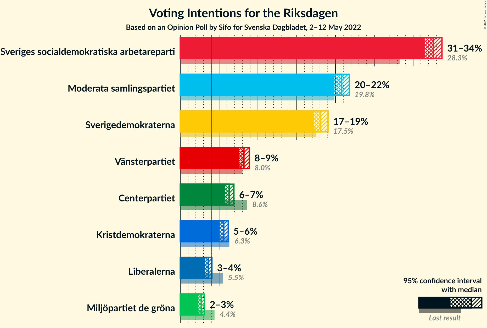
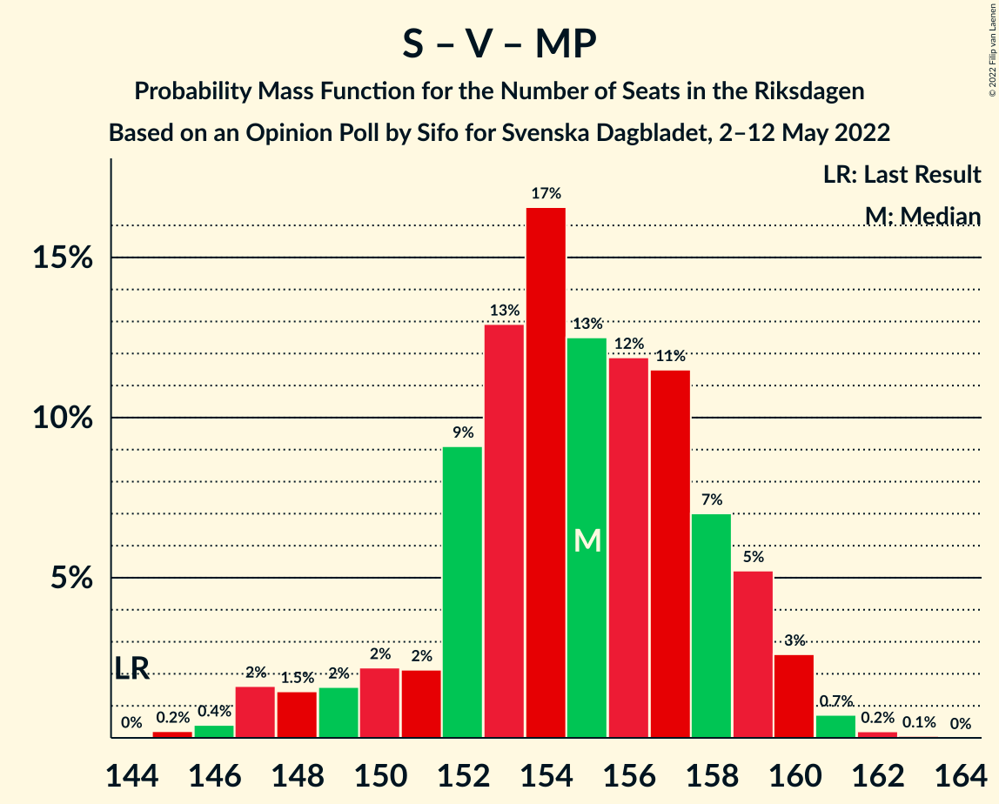
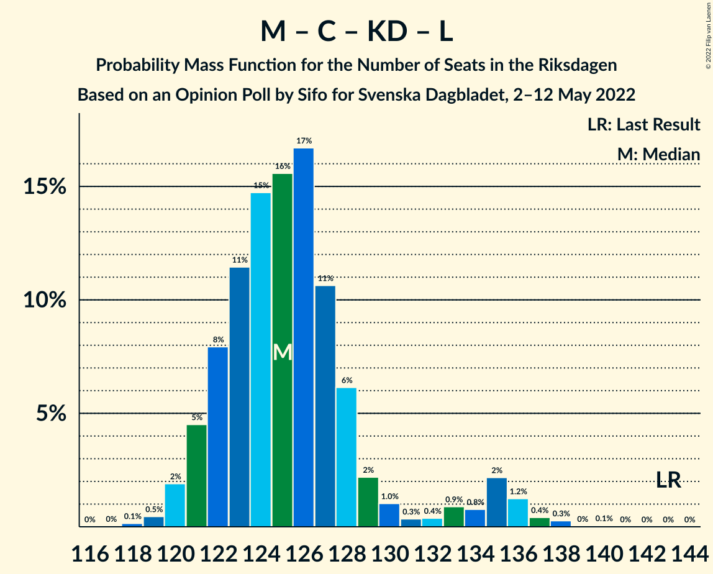

# Opinion Poll by Sifo for Svenska Dagbladet, 2–12 May 2022

<a href="#voting-intentions">Voting Intentions</a> | <a href="#seats">Seats</a> | <a href="#coalitions">Coalitions</a> | <a href="#technical-information">Technical Information</a>

## Voting Intentions

### Confidence Intervals

| Party | Last Result | Poll Result | 80% Confidence Interval | 90% Confidence Interval | 95% Confidence Interval | 99% Confidence Interval |
|:-----:|:-----------:|:-----------:|:-----------------------:|:-----------------------:|:-----------------------:|:-----------------------:|
| Sveriges socialdemokratiska arbetareparti | 28.3% | 32.6% | 31.9–33.3% |31.7–33.5% |31.5–33.7% |31.2–34.1% |
| Moderata samlingspartiet | 19.8% | 20.8% | 20.2–21.4% |20.0–21.6% |19.8–21.8% |19.6–22.1% |
| Sverigedemokraterna | 17.5% | 18.1% | 17.5–18.7% |17.3–18.9% |17.2–19.0% |16.9–19.3% |
| Vänsterpartiet | 8.0% | 8.2% | 7.8–8.6% |7.7–8.8% |7.6–8.9% |7.4–9.1% |
| Centerpartiet | 8.6% | 6.3% | 5.9–6.7% |5.8–6.8% |5.7–6.9% |5.6–7.1% |
| Kristdemokraterna | 6.3% | 5.6% | 5.3–6.0% |5.2–6.1% |5.1–6.2% |4.9–6.4% |
| Liberalerna | 5.5% | 3.6% | 3.3–3.9% |3.2–4.0% |3.2–4.1% |3.0–4.2% |
| Miljöpartiet de gröna | 4.4% | 2.7% | 2.5–3.0% |2.4–3.0% |2.3–3.1% |2.2–3.2% |

*Note:* The poll result column reflects the actual value used in the calculations. Published results may vary slightly, and in addition be rounded to fewer digits.

## Seats

### Confidence Intervals

| Party | Last Result | Median | 80% Confidence Interval | 90% Confidence Interval | 95% Confidence Interval | 99% Confidence Interval |
|:-----:|:-----------:|:------:|:-----------------------:|:-----------------------:|:-----------------------:|:-----------------------:|
| <a href="#sveriges-socialdemokratiska-arbetareparti">Sveriges socialdemokratiska arbetareparti</a> | 100 | 124 | 121–127 |119–128 |118–128 |116–130 |
| <a href="#moderata-samlingspartiet">Moderata samlingspartiet</a> | 70 | 79 | 76–82 |76–82 |75–83 |74–84 |
| <a href="#sverigedemokraterna">Sverigedemokraterna</a> | 62 | 69 | 66–72 |65–72 |65–72 |63–73 |
| <a href="#vänsterpartiet">Vänsterpartiet</a> | 28 | 31 | 29–33 |29–34 |28–34 |28–35 |
| <a href="#centerpartiet">Centerpartiet</a> | 31 | 24 | 22–25 |22–26 |22–26 |21–27 |
| <a href="#kristdemokraterna">Kristdemokraterna</a> | 22 | 21 | 20–23 |20–23 |19–24 |19–24 |
| <a href="#liberalerna">Liberalerna</a> | 20 | 0 | 0 |0–15 |0–15 |0–15 |
| <a href="#miljöpartiet-de-gröna">Miljöpartiet de gröna</a> | 16 | 0 | 0 |0 |0 |0 |

### Sveriges socialdemokratiska arbetareparti

*For a full overview of the results for this party, see the [Sveriges socialdemokratiska arbetareparti](party-sverigessocialdemokratiskaarbetareparti.html) page.*

| Number of Seats | Probability | Accumulated | Special Marks |
|:---------------:|:-----------:|:-----------:|:-------------:|
| 100 | 0% | 100% | Last Result |
| 101 | 0% | 100% |  |
| 102 | 0% | 100% |  |
| 103 | 0% | 100% |  |
| 104 | 0% | 100% |  |
| 105 | 0% | 100% |  |
| 106 | 0% | 100% |  |
| 107 | 0% | 100% |  |
| 108 | 0% | 100% |  |
| 109 | 0% | 100% |  |
| 110 | 0% | 100% |  |
| 111 | 0% | 100% |  |
| 112 | 0% | 100% |  |
| 113 | 0% | 100% |  |
| 114 | 0.1% | 100% |  |
| 115 | 0.2% | 99.9% |  |
| 116 | 1.3% | 99.7% |  |
| 117 | 0.7% | 98% |  |
| 118 | 0.9% | 98% |  |
| 119 | 3% | 97% |  |
| 120 | 3% | 94% |  |
| 121 | 9% | 90% |  |
| 122 | 19% | 81% |  |
| 123 | 11% | 62% |  |
| 124 | 14% | 51% | Median |
| 125 | 13% | 37% |  |
| 126 | 10% | 24% |  |
| 127 | 8% | 14% |  |
| 128 | 4% | 7% |  |
| 129 | 2% | 2% |  |
| 130 | 0.6% | 0.7% |  |
| 131 | 0.1% | 0.1% |  |
| 132 | 0% | 0% |  |

### Moderata samlingspartiet

*For a full overview of the results for this party, see the [Moderata samlingspartiet](party-moderatasamlingspartiet.html) page.*

| Number of Seats | Probability | Accumulated | Special Marks |
|:---------------:|:-----------:|:-----------:|:-------------:|
| 70 | 0% | 100% | Last Result |
| 71 | 0% | 100% |  |
| 72 | 0.1% | 100% |  |
| 73 | 0.3% | 99.9% |  |
| 74 | 0.8% | 99.6% |  |
| 75 | 3% | 98.8% |  |
| 76 | 6% | 95% |  |
| 77 | 12% | 90% |  |
| 78 | 16% | 78% |  |
| 79 | 17% | 62% | Median |
| 80 | 19% | 45% |  |
| 81 | 12% | 26% |  |
| 82 | 10% | 14% |  |
| 83 | 3% | 4% |  |
| 84 | 1.3% | 2% |  |
| 85 | 0.3% | 0.3% |  |
| 86 | 0% | 0% |  |

### Sverigedemokraterna

*For a full overview of the results for this party, see the [Sverigedemokraterna](party-sverigedemokraterna.html) page.*

| Number of Seats | Probability | Accumulated | Special Marks |
|:---------------:|:-----------:|:-----------:|:-------------:|
| 62 | 0.1% | 100% | Last Result |
| 63 | 0.5% | 99.9% |  |
| 64 | 1.1% | 99.5% |  |
| 65 | 4% | 98% |  |
| 66 | 9% | 94% |  |
| 67 | 10% | 86% |  |
| 68 | 19% | 76% |  |
| 69 | 13% | 57% | Median |
| 70 | 22% | 44% |  |
| 71 | 9% | 22% |  |
| 72 | 10% | 13% |  |
| 73 | 2% | 2% |  |
| 74 | 0.4% | 0.5% |  |
| 75 | 0.1% | 0.1% |  |
| 76 | 0% | 0% |  |

### Vänsterpartiet

*For a full overview of the results for this party, see the [Vänsterpartiet](party-vänsterpartiet.html) page.*

| Number of Seats | Probability | Accumulated | Special Marks |
|:---------------:|:-----------:|:-----------:|:-------------:|
| 27 | 0.2% | 100% |  |
| 28 | 2% | 99.8% | Last Result |
| 29 | 9% | 97% |  |
| 30 | 23% | 89% |  |
| 31 | 29% | 66% | Median |
| 32 | 20% | 37% |  |
| 33 | 12% | 17% |  |
| 34 | 4% | 5% |  |
| 35 | 0.6% | 0.6% |  |
| 36 | 0% | 0% |  |

### Centerpartiet

*For a full overview of the results for this party, see the [Centerpartiet](party-centerpartiet.html) page.*

| Number of Seats | Probability | Accumulated | Special Marks |
|:---------------:|:-----------:|:-----------:|:-------------:|
| 20 | 0.1% | 100% |  |
| 21 | 2% | 99.9% |  |
| 22 | 10% | 98% |  |
| 23 | 24% | 88% |  |
| 24 | 32% | 65% | Median |
| 25 | 23% | 32% |  |
| 26 | 7% | 10% |  |
| 27 | 2% | 2% |  |
| 28 | 0.1% | 0.1% |  |
| 29 | 0% | 0% |  |
| 30 | 0% | 0% |  |
| 31 | 0% | 0% | Last Result |

### Kristdemokraterna

*For a full overview of the results for this party, see the [Kristdemokraterna](party-kristdemokraterna.html) page.*

| Number of Seats | Probability | Accumulated | Special Marks |
|:---------------:|:-----------:|:-----------:|:-------------:|
| 18 | 0.4% | 100% |  |
| 19 | 4% | 99.6% |  |
| 20 | 17% | 96% |  |
| 21 | 38% | 79% | Median |
| 22 | 26% | 42% | Last Result |
| 23 | 13% | 15% |  |
| 24 | 2% | 3% |  |
| 25 | 0.3% | 0.3% |  |
| 26 | 0% | 0% |  |

### Liberalerna

*For a full overview of the results for this party, see the [Liberalerna](party-liberalerna.html) page.*

| Number of Seats | Probability | Accumulated | Special Marks |
|:---------------:|:-----------:|:-----------:|:-------------:|
| 0 | 94% | 100% | Median |
| 1 | 0% | 6% |  |
| 2 | 0% | 6% |  |
| 3 | 0% | 6% |  |
| 4 | 0% | 6% |  |
| 5 | 0% | 6% |  |
| 6 | 0% | 6% |  |
| 7 | 0% | 6% |  |
| 8 | 0% | 6% |  |
| 9 | 0% | 6% |  |
| 10 | 0% | 6% |  |
| 11 | 0% | 6% |  |
| 12 | 0% | 6% |  |
| 13 | 0% | 6% |  |
| 14 | 0% | 6% |  |
| 15 | 6% | 6% |  |
| 16 | 0.5% | 0.5% |  |
| 17 | 0% | 0% |  |
| 18 | 0% | 0% |  |
| 19 | 0% | 0% |  |
| 20 | 0% | 0% | Last Result |

### Miljöpartiet de gröna

*For a full overview of the results for this party, see the [Miljöpartiet de gröna](party-miljöpartietdegröna.html) page.*

| Number of Seats | Probability | Accumulated | Special Marks |
|:---------------:|:-----------:|:-----------:|:-------------:|
| 0 | 100% | 100% | Median |
| 1 | 0% | 0% |  |
| 2 | 0% | 0% |  |
| 3 | 0% | 0% |  |
| 4 | 0% | 0% |  |
| 5 | 0% | 0% |  |
| 6 | 0% | 0% |  |
| 7 | 0% | 0% |  |
| 8 | 0% | 0% |  |
| 9 | 0% | 0% |  |
| 10 | 0% | 0% |  |
| 11 | 0% | 0% |  |
| 12 | 0% | 0% |  |
| 13 | 0% | 0% |  |
| 14 | 0% | 0% |  |
| 15 | 0% | 0% |  |
| 16 | 0% | 0% | Last Result |

## Coalitions

### Confidence Intervals

| Coalition | Last Result | Median | Majority? | 80% Confidence Interval | 90% Confidence Interval | 95% Confidence Interval | 99% Confidence Interval |
|:---------:|:-----------:|:------:|:---------:|:-----------------------:|:-----------------------:|:-----------------------:|:-----------------------:|
| Sveriges socialdemokratiska arbetareparti – Moderata samlingspartiet – Centerpartiet | 201 | 227 | 100% | 224–231 | 220–231 | 218–232 | 215–232 |
| Sveriges socialdemokratiska arbetareparti – Moderata samlingspartiet | 170 | 203 | 100% | 199–206 | 197–208 | 194–208 | 192–209 |
| Sveriges socialdemokratiska arbetareparti – Vänsterpartiet – Centerpartiet – Liberalerna – Miljöpartiet de gröna | 195 | 179 | 98.8% | 176–184 | 176–185 | 175–187 | 174–189 |
| Moderata samlingspartiet – Sverigedemokraterna – Kristdemokraterna | 154 | 170 | 1.2% | 165–173 | 164–173 | 162–174 | 160–175 |
| Sveriges socialdemokratiska arbetareparti – Vänsterpartiet – Miljöpartiet de gröna | 144 | 155 | 0% | 152–158 | 149–159 | 148–160 | 146–161 |
| Sveriges socialdemokratiska arbetareparti – Vänsterpartiet | 128 | 155 | 0% | 152–158 | 149–159 | 148–160 | 146–161 |
| Sveriges socialdemokratiska arbetareparti – Centerpartiet – Liberalerna – Miljöpartiet de gröna | 167 | 148 | 0% | 145–152 | 145–154 | 144–158 | 143–159 |
| Moderata samlingspartiet – Sverigedemokraterna | 132 | 148 | 0% | 144–152 | 143–152 | 141–152 | 139–154 |
| Moderata samlingspartiet – Centerpartiet – Kristdemokraterna – Liberalerna | 143 | 125 | 0% | 122–128 | 121–133 | 120–135 | 119–137 |
| Moderata samlingspartiet – Centerpartiet – Kristdemokraterna | 123 | 125 | 0% | 121–127 | 120–128 | 119–129 | 117–130 |
| Sveriges socialdemokratiska arbetareparti – Miljöpartiet de gröna | 116 | 124 | 0% | 121–127 | 119–128 | 118–128 | 116–130 |
| Moderata samlingspartiet – Centerpartiet – Liberalerna | 121 | 104 | 0% | 101–107 | 100–113 | 99–114 | 98–117 |
| Moderata samlingspartiet – Centerpartiet | 101 | 103 | 0% | 100–106 | 99–107 | 98–107 | 96–108 |

### Sveriges socialdemokratiska arbetareparti – Moderata samlingspartiet – Centerpartiet

| Number of Seats | Probability | Accumulated | Special Marks |
|:---------------:|:-----------:|:-----------:|:-------------:|
| 201 | 0% | 100% | Last Result |
| 202 | 0% | 100% |  |
| 203 | 0% | 100% |  |
| 204 | 0% | 100% |  |
| 205 | 0% | 100% |  |
| 206 | 0% | 100% |  |
| 207 | 0% | 100% |  |
| 208 | 0% | 100% |  |
| 209 | 0% | 100% |  |
| 210 | 0% | 100% |  |
| 211 | 0% | 100% |  |
| 212 | 0% | 100% |  |
| 213 | 0.1% | 100% |  |
| 214 | 0.3% | 99.9% |  |
| 215 | 1.4% | 99.6% |  |
| 216 | 0.2% | 98% |  |
| 217 | 0.4% | 98% |  |
| 218 | 2% | 98% |  |
| 219 | 1.0% | 96% |  |
| 220 | 1.2% | 95% |  |
| 221 | 0.4% | 94% |  |
| 222 | 0.5% | 93% |  |
| 223 | 2% | 93% |  |
| 224 | 10% | 91% |  |
| 225 | 12% | 81% |  |
| 226 | 16% | 69% |  |
| 227 | 12% | 53% | Median |
| 228 | 8% | 41% |  |
| 229 | 13% | 33% |  |
| 230 | 8% | 20% |  |
| 231 | 9% | 11% |  |
| 232 | 2% | 3% |  |
| 233 | 0.3% | 0.4% |  |
| 234 | 0.1% | 0.1% |  |
| 235 | 0% | 0% |  |

### Sveriges socialdemokratiska arbetareparti – Moderata samlingspartiet

| Number of Seats | Probability | Accumulated | Special Marks |
|:---------------:|:-----------:|:-----------:|:-------------:|
| 170 | 0% | 100% | Last Result |
| 171 | 0% | 100% |  |
| 172 | 0% | 100% |  |
| 173 | 0% | 100% |  |
| 174 | 0% | 100% |  |
| 175 | 0% | 100% | Majority |
| 176 | 0% | 100% |  |
| 177 | 0% | 100% |  |
| 178 | 0% | 100% |  |
| 179 | 0% | 100% |  |
| 180 | 0% | 100% |  |
| 181 | 0% | 100% |  |
| 182 | 0% | 100% |  |
| 183 | 0% | 100% |  |
| 184 | 0% | 100% |  |
| 185 | 0% | 100% |  |
| 186 | 0% | 100% |  |
| 187 | 0% | 100% |  |
| 188 | 0% | 100% |  |
| 189 | 0% | 100% |  |
| 190 | 0.1% | 100% |  |
| 191 | 0.2% | 99.9% |  |
| 192 | 0.5% | 99.7% |  |
| 193 | 1.4% | 99.2% |  |
| 194 | 1.0% | 98% |  |
| 195 | 0.8% | 97% |  |
| 196 | 0.7% | 96% |  |
| 197 | 1.4% | 95% |  |
| 198 | 1.3% | 94% |  |
| 199 | 4% | 93% |  |
| 200 | 6% | 89% |  |
| 201 | 12% | 83% |  |
| 202 | 17% | 71% |  |
| 203 | 13% | 54% | Median |
| 204 | 12% | 41% |  |
| 205 | 12% | 30% |  |
| 206 | 10% | 17% |  |
| 207 | 2% | 7% |  |
| 208 | 4% | 5% |  |
| 209 | 1.1% | 1.3% |  |
| 210 | 0.2% | 0.2% |  |
| 211 | 0% | 0% |  |

### Sveriges socialdemokratiska arbetareparti – Vänsterpartiet – Centerpartiet – Liberalerna – Miljöpartiet de gröna

| Number of Seats | Probability | Accumulated | Special Marks |
|:---------------:|:-----------:|:-----------:|:-------------:|
| 172 | 0.1% | 100% |  |
| 173 | 0.2% | 99.9% |  |
| 174 | 0.9% | 99.7% |  |
| 175 | 2% | 98.8% | Majority |
| 176 | 14% | 96% |  |
| 177 | 9% | 82% |  |
| 178 | 15% | 73% |  |
| 179 | 12% | 59% | Median |
| 180 | 12% | 47% |  |
| 181 | 10% | 35% |  |
| 182 | 7% | 25% |  |
| 183 | 7% | 17% |  |
| 184 | 4% | 11% |  |
| 185 | 2% | 7% |  |
| 186 | 2% | 4% |  |
| 187 | 0.4% | 3% |  |
| 188 | 1.2% | 2% |  |
| 189 | 0.6% | 1.0% |  |
| 190 | 0.2% | 0.4% |  |
| 191 | 0.2% | 0.2% |  |
| 192 | 0% | 0% |  |
| 193 | 0% | 0% |  |
| 194 | 0% | 0% |  |
| 195 | 0% | 0% | Last Result |

### Moderata samlingspartiet – Sverigedemokraterna – Kristdemokraterna

| Number of Seats | Probability | Accumulated | Special Marks |
|:---------------:|:-----------:|:-----------:|:-------------:|
| 154 | 0% | 100% | Last Result |
| 155 | 0% | 100% |  |
| 156 | 0% | 100% |  |
| 157 | 0% | 100% |  |
| 158 | 0.2% | 100% |  |
| 159 | 0.2% | 99.8% |  |
| 160 | 0.6% | 99.6% |  |
| 161 | 1.2% | 99.0% |  |
| 162 | 0.4% | 98% |  |
| 163 | 2% | 97% |  |
| 164 | 2% | 96% |  |
| 165 | 4% | 93% |  |
| 166 | 7% | 89% |  |
| 167 | 7% | 83% |  |
| 168 | 10% | 75% |  |
| 169 | 12% | 65% | Median |
| 170 | 12% | 53% |  |
| 171 | 15% | 41% |  |
| 172 | 9% | 27% |  |
| 173 | 14% | 18% |  |
| 174 | 2% | 4% |  |
| 175 | 0.9% | 1.2% | Majority |
| 176 | 0.2% | 0.3% |  |
| 177 | 0.1% | 0.1% |  |
| 178 | 0% | 0% |  |

### Sveriges socialdemokratiska arbetareparti – Vänsterpartiet – Miljöpartiet de gröna

| Number of Seats | Probability | Accumulated | Special Marks |
|:---------------:|:-----------:|:-----------:|:-------------:|
| 144 | 0% | 100% | Last Result |
| 145 | 0.2% | 99.9% |  |
| 146 | 0.4% | 99.7% |  |
| 147 | 2% | 99.3% |  |
| 148 | 1.5% | 98% |  |
| 149 | 2% | 96% |  |
| 150 | 2% | 95% |  |
| 151 | 2% | 92% |  |
| 152 | 9% | 90% |  |
| 153 | 13% | 81% |  |
| 154 | 17% | 68% |  |
| 155 | 13% | 52% | Median |
| 156 | 12% | 39% |  |
| 157 | 11% | 27% |  |
| 158 | 7% | 16% |  |
| 159 | 5% | 9% |  |
| 160 | 3% | 4% |  |
| 161 | 0.7% | 1.0% |  |
| 162 | 0.2% | 0.3% |  |
| 163 | 0.1% | 0.1% |  |
| 164 | 0% | 0% |  |

### Sveriges socialdemokratiska arbetareparti – Vänsterpartiet

| Number of Seats | Probability | Accumulated | Special Marks |
|:---------------:|:-----------:|:-----------:|:-------------:|
| 128 | 0% | 100% | Last Result |
| 129 | 0% | 100% |  |
| 130 | 0% | 100% |  |
| 131 | 0% | 100% |  |
| 132 | 0% | 100% |  |
| 133 | 0% | 100% |  |
| 134 | 0% | 100% |  |
| 135 | 0% | 100% |  |
| 136 | 0% | 100% |  |
| 137 | 0% | 100% |  |
| 138 | 0% | 100% |  |
| 139 | 0% | 100% |  |
| 140 | 0% | 100% |  |
| 141 | 0% | 100% |  |
| 142 | 0% | 100% |  |
| 143 | 0% | 100% |  |
| 144 | 0% | 100% |  |
| 145 | 0.2% | 99.9% |  |
| 146 | 0.4% | 99.7% |  |
| 147 | 2% | 99.3% |  |
| 148 | 1.5% | 98% |  |
| 149 | 2% | 96% |  |
| 150 | 2% | 95% |  |
| 151 | 2% | 92% |  |
| 152 | 9% | 90% |  |
| 153 | 13% | 81% |  |
| 154 | 17% | 68% |  |
| 155 | 13% | 52% | Median |
| 156 | 12% | 39% |  |
| 157 | 11% | 27% |  |
| 158 | 7% | 16% |  |
| 159 | 5% | 9% |  |
| 160 | 3% | 4% |  |
| 161 | 0.7% | 1.0% |  |
| 162 | 0.2% | 0.3% |  |
| 163 | 0.1% | 0.1% |  |
| 164 | 0% | 0% |  |

### Sveriges socialdemokratiska arbetareparti – Centerpartiet – Liberalerna – Miljöpartiet de gröna

| Number of Seats | Probability | Accumulated | Special Marks |
|:---------------:|:-----------:|:-----------:|:-------------:|
| 141 | 0.1% | 100% |  |
| 142 | 0.3% | 99.9% |  |
| 143 | 0.5% | 99.7% |  |
| 144 | 4% | 99.2% |  |
| 145 | 14% | 95% |  |
| 146 | 17% | 81% |  |
| 147 | 9% | 64% |  |
| 148 | 9% | 55% | Median |
| 149 | 12% | 46% |  |
| 150 | 7% | 33% |  |
| 151 | 11% | 26% |  |
| 152 | 6% | 16% |  |
| 153 | 3% | 9% |  |
| 154 | 1.2% | 6% |  |
| 155 | 0.5% | 5% |  |
| 156 | 0.2% | 4% |  |
| 157 | 1.2% | 4% |  |
| 158 | 2% | 3% |  |
| 159 | 0.7% | 1.2% |  |
| 160 | 0.4% | 0.4% |  |
| 161 | 0.1% | 0.1% |  |
| 162 | 0% | 0% |  |
| 163 | 0% | 0% |  |
| 164 | 0% | 0% |  |
| 165 | 0% | 0% |  |
| 166 | 0% | 0% |  |
| 167 | 0% | 0% | Last Result |

### Moderata samlingspartiet – Sverigedemokraterna

| Number of Seats | Probability | Accumulated | Special Marks |
|:---------------:|:-----------:|:-----------:|:-------------:|
| 132 | 0% | 100% | Last Result |
| 133 | 0% | 100% |  |
| 134 | 0% | 100% |  |
| 135 | 0% | 100% |  |
| 136 | 0% | 100% |  |
| 137 | 0.1% | 100% |  |
| 138 | 0.3% | 99.9% |  |
| 139 | 0.3% | 99.7% |  |
| 140 | 1.4% | 99.3% |  |
| 141 | 0.7% | 98% |  |
| 142 | 1.4% | 97% |  |
| 143 | 3% | 96% |  |
| 144 | 5% | 93% |  |
| 145 | 6% | 88% |  |
| 146 | 8% | 82% |  |
| 147 | 13% | 74% |  |
| 148 | 11% | 60% | Median |
| 149 | 17% | 49% |  |
| 150 | 12% | 32% |  |
| 151 | 6% | 20% |  |
| 152 | 12% | 14% |  |
| 153 | 2% | 2% |  |
| 154 | 0.5% | 0.8% |  |
| 155 | 0.2% | 0.2% |  |
| 156 | 0% | 0% |  |

### Moderata samlingspartiet – Centerpartiet – Kristdemokraterna – Liberalerna

| Number of Seats | Probability | Accumulated | Special Marks |
|:---------------:|:-----------:|:-----------:|:-------------:|
| 118 | 0.1% | 100% |  |
| 119 | 0.5% | 99.8% |  |
| 120 | 2% | 99.4% |  |
| 121 | 5% | 97% |  |
| 122 | 8% | 93% |  |
| 123 | 11% | 85% |  |
| 124 | 15% | 74% | Median |
| 125 | 16% | 59% |  |
| 126 | 17% | 43% |  |
| 127 | 11% | 27% |  |
| 128 | 6% | 16% |  |
| 129 | 2% | 10% |  |
| 130 | 1.0% | 8% |  |
| 131 | 0.3% | 7% |  |
| 132 | 0.4% | 6% |  |
| 133 | 0.9% | 6% |  |
| 134 | 0.8% | 5% |  |
| 135 | 2% | 4% |  |
| 136 | 1.2% | 2% |  |
| 137 | 0.4% | 0.8% |  |
| 138 | 0.3% | 0.4% |  |
| 139 | 0% | 0.1% |  |
| 140 | 0.1% | 0.1% |  |
| 141 | 0% | 0% |  |
| 142 | 0% | 0% |  |
| 143 | 0% | 0% | Last Result |

### Moderata samlingspartiet – Centerpartiet – Kristdemokraterna

| Number of Seats | Probability | Accumulated | Special Marks |
|:---------------:|:-----------:|:-----------:|:-------------:|
| 115 | 0.1% | 100% |  |
| 116 | 0.2% | 99.9% |  |
| 117 | 0.4% | 99.7% |  |
| 118 | 1.1% | 99.3% |  |
| 119 | 1.3% | 98% |  |
| 120 | 4% | 97% |  |
| 121 | 6% | 93% |  |
| 122 | 8% | 87% |  |
| 123 | 12% | 79% | Last Result |
| 124 | 15% | 67% | Median |
| 125 | 16% | 52% |  |
| 126 | 17% | 37% |  |
| 127 | 11% | 20% |  |
| 128 | 6% | 9% |  |
| 129 | 2% | 3% |  |
| 130 | 0.9% | 1.2% |  |
| 131 | 0.2% | 0.2% |  |
| 132 | 0% | 0.1% |  |
| 133 | 0% | 0% |  |

### Sveriges socialdemokratiska arbetareparti – Miljöpartiet de gröna

| Number of Seats | Probability | Accumulated | Special Marks |
|:---------------:|:-----------:|:-----------:|:-------------:|
| 114 | 0.1% | 100% |  |
| 115 | 0.2% | 99.9% |  |
| 116 | 1.3% | 99.7% | Last Result |
| 117 | 0.7% | 98% |  |
| 118 | 0.9% | 98% |  |
| 119 | 3% | 97% |  |
| 120 | 3% | 94% |  |
| 121 | 9% | 90% |  |
| 122 | 19% | 81% |  |
| 123 | 11% | 62% |  |
| 124 | 14% | 51% | Median |
| 125 | 13% | 37% |  |
| 126 | 10% | 24% |  |
| 127 | 8% | 14% |  |
| 128 | 4% | 7% |  |
| 129 | 2% | 2% |  |
| 130 | 0.6% | 0.7% |  |
| 131 | 0.1% | 0.1% |  |
| 132 | 0% | 0% |  |

### Moderata samlingspartiet – Centerpartiet – Liberalerna

| Number of Seats | Probability | Accumulated | Special Marks |
|:---------------:|:-----------:|:-----------:|:-------------:|
| 97 | 0.1% | 100% |  |
| 98 | 0.7% | 99.8% |  |
| 99 | 2% | 99.1% |  |
| 100 | 5% | 97% |  |
| 101 | 12% | 92% |  |
| 102 | 13% | 80% |  |
| 103 | 13% | 67% | Median |
| 104 | 19% | 54% |  |
| 105 | 13% | 35% |  |
| 106 | 10% | 22% |  |
| 107 | 4% | 12% |  |
| 108 | 2% | 9% |  |
| 109 | 0.4% | 7% |  |
| 110 | 0.2% | 6% |  |
| 111 | 0.2% | 6% |  |
| 112 | 0.6% | 6% |  |
| 113 | 1.1% | 5% |  |
| 114 | 2% | 4% |  |
| 115 | 0.7% | 2% |  |
| 116 | 1.0% | 2% |  |
| 117 | 0.4% | 0.6% |  |
| 118 | 0.1% | 0.2% |  |
| 119 | 0% | 0.1% |  |
| 120 | 0% | 0% |  |
| 121 | 0% | 0% | Last Result |

### Moderata samlingspartiet – Centerpartiet

| Number of Seats | Probability | Accumulated | Special Marks |
|:---------------:|:-----------:|:-----------:|:-------------:|
| 94 | 0.1% | 100% |  |
| 95 | 0.2% | 99.9% |  |
| 96 | 0.3% | 99.7% |  |
| 97 | 0.7% | 99.5% |  |
| 98 | 2% | 98.8% |  |
| 99 | 4% | 97% |  |
| 100 | 6% | 93% |  |
| 101 | 13% | 87% | Last Result |
| 102 | 14% | 74% |  |
| 103 | 13% | 61% | Median |
| 104 | 19% | 48% |  |
| 105 | 13% | 28% |  |
| 106 | 10% | 15% |  |
| 107 | 4% | 6% |  |
| 108 | 2% | 2% |  |
| 109 | 0.4% | 0.5% |  |
| 110 | 0.1% | 0.1% |  |
| 111 | 0% | 0% |  |

## Technical Information

### Opinion Poll

+ **Polling firm:** Sifo
+ **Commissioner(s):** Svenska Dagbladet
+ **Fieldwork period:** 2–12 May 2022

### Calculations

+ **Sample size:** 6890
+ **Simulations done:** 1,048,576
+ **Error estimate:** 0.46%

