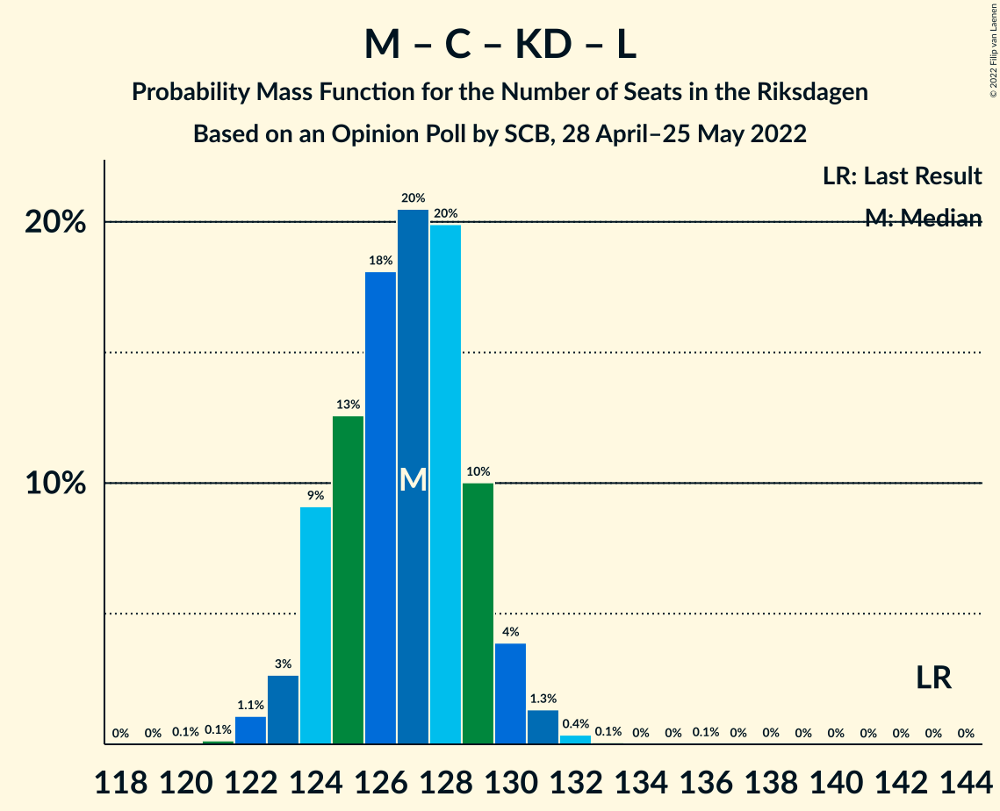

# Opinion Poll by SCB, 28 April–25 May 2022

<a href="#voting-intentions">Voting Intentions</a> | <a href="#seats">Seats</a> | <a href="#coalitions">Coalitions</a> | <a href="#technical-information">Technical Information</a>

## Voting Intentions

### Confidence Intervals

| Party | Last Result | Poll Result | 80% Confidence Interval | 90% Confidence Interval | 95% Confidence Interval | 99% Confidence Interval |
|:-----:|:-----------:|:-----------:|:-----------------------:|:-----------------------:|:-----------------------:|:-----------------------:|
| Sveriges socialdemokratiska arbetareparti | 28.3% | 33.3% | 32.7–34.0% |32.5–34.2% |32.4–34.3% |32.1–34.6% |
| Moderata samlingspartiet | 19.8% | 21.2% | 20.7–21.8% |20.5–21.9% |20.4–22.1% |20.1–22.3% |
| Sverigedemokraterna | 17.5% | 17.0% | 16.5–17.5% |16.4–17.7% |16.3–17.8% |16.0–18.0% |
| Vänsterpartiet | 8.0% | 7.8% | 7.5–8.2% |7.3–8.3% |7.3–8.4% |7.1–8.6% |
| Centerpartiet | 8.6% | 6.7% | 6.4–7.1% |6.3–7.2% |6.2–7.2% |6.1–7.4% |
| Kristdemokraterna | 6.3% | 5.2% | 4.9–5.5% |4.8–5.6% |4.8–5.7% |4.6–5.8% |
| Liberalerna | 5.5% | 3.4% | 3.2–3.7% |3.1–3.7% |3.0–3.8% |2.9–3.9% |
| Miljöpartiet de gröna | 4.4% | 3.3% | 3.1–3.6% |3.0–3.6% |3.0–3.7% |2.9–3.8% |

*Note:* The poll result column reflects the actual value used in the calculations. Published results may vary slightly, and in addition be rounded to fewer digits.

## Seats

### Confidence Intervals

| Party | Last Result | Median | 80% Confidence Interval | 90% Confidence Interval | 95% Confidence Interval | 99% Confidence Interval |
|:-----:|:-----------:|:------:|:-----------------------:|:-----------------------:|:-----------------------:|:-----------------------:|
| <a href="#sveriges-socialdemokratiska-arbetareparti">Sveriges socialdemokratiska arbetareparti</a> | 100 | 127 | 125–130 |124–131 |124–131 |122–132 |
| <a href="#moderata-samlingspartiet">Moderata samlingspartiet</a> | 70 | 81 | 79–83 |79–84 |78–84 |77–85 |
| <a href="#sverigedemokraterna">Sverigedemokraterna</a> | 62 | 65 | 63–67 |63–67 |62–68 |61–69 |
| <a href="#vänsterpartiet">Vänsterpartiet</a> | 28 | 30 | 29–31 |28–32 |28–32 |27–33 |
| <a href="#centerpartiet">Centerpartiet</a> | 31 | 26 | 25–27 |24–27 |24–28 |23–28 |
| <a href="#kristdemokraterna">Kristdemokraterna</a> | 22 | 20 | 19–21 |19–21 |18–22 |18–22 |
| <a href="#liberalerna">Liberalerna</a> | 20 | 0 | 0 |0 |0 |0 |
| <a href="#miljöpartiet-de-gröna">Miljöpartiet de gröna</a> | 16 | 0 | 0 |0 |0 |0 |

### Sveriges socialdemokratiska arbetareparti

*For a full overview of the results for this party, see the [Sveriges socialdemokratiska arbetareparti](party-sverigessocialdemokratiskaarbetareparti.html) page.*

| Number of Seats | Probability | Accumulated | Special Marks |
|:---------------:|:-----------:|:-----------:|:-------------:|
| 100 | 0% | 100% | Last Result |
| 101 | 0% | 100% |  |
| 102 | 0% | 100% |  |
| 103 | 0% | 100% |  |
| 104 | 0% | 100% |  |
| 105 | 0% | 100% |  |
| 106 | 0% | 100% |  |
| 107 | 0% | 100% |  |
| 108 | 0% | 100% |  |
| 109 | 0% | 100% |  |
| 110 | 0% | 100% |  |
| 111 | 0% | 100% |  |
| 112 | 0% | 100% |  |
| 113 | 0% | 100% |  |
| 114 | 0% | 100% |  |
| 115 | 0% | 100% |  |
| 116 | 0% | 100% |  |
| 117 | 0% | 100% |  |
| 118 | 0% | 100% |  |
| 119 | 0% | 100% |  |
| 120 | 0% | 100% |  |
| 121 | 0.1% | 100% |  |
| 122 | 0.4% | 99.8% |  |
| 123 | 2% | 99.5% |  |
| 124 | 3% | 98% |  |
| 125 | 7% | 95% |  |
| 126 | 16% | 87% |  |
| 127 | 23% | 71% | Median |
| 128 | 22% | 48% |  |
| 129 | 13% | 26% |  |
| 130 | 8% | 13% |  |
| 131 | 3% | 5% |  |
| 132 | 1.3% | 2% |  |
| 133 | 0.3% | 0.3% |  |
| 134 | 0% | 0.1% |  |
| 135 | 0% | 0% |  |

### Moderata samlingspartiet

*For a full overview of the results for this party, see the [Moderata samlingspartiet](party-moderatasamlingspartiet.html) page.*

| Number of Seats | Probability | Accumulated | Special Marks |
|:---------------:|:-----------:|:-----------:|:-------------:|
| 70 | 0% | 100% | Last Result |
| 71 | 0% | 100% |  |
| 72 | 0% | 100% |  |
| 73 | 0% | 100% |  |
| 74 | 0% | 100% |  |
| 75 | 0% | 100% |  |
| 76 | 0.2% | 100% |  |
| 77 | 0.8% | 99.8% |  |
| 78 | 4% | 99.0% |  |
| 79 | 15% | 95% |  |
| 80 | 17% | 80% |  |
| 81 | 24% | 63% | Median |
| 82 | 24% | 40% |  |
| 83 | 9% | 16% |  |
| 84 | 5% | 7% |  |
| 85 | 2% | 2% |  |
| 86 | 0.2% | 0.3% |  |
| 87 | 0.1% | 0.1% |  |
| 88 | 0% | 0% |  |

### Sverigedemokraterna

*For a full overview of the results for this party, see the [Sverigedemokraterna](party-sverigedemokraterna.html) page.*

| Number of Seats | Probability | Accumulated | Special Marks |
|:---------------:|:-----------:|:-----------:|:-------------:|
| 60 | 0.1% | 100% |  |
| 61 | 1.2% | 99.9% |  |
| 62 | 3% | 98.7% | Last Result |
| 63 | 14% | 95% |  |
| 64 | 17% | 82% |  |
| 65 | 31% | 65% | Median |
| 66 | 18% | 34% |  |
| 67 | 12% | 16% |  |
| 68 | 3% | 4% |  |
| 69 | 0.9% | 1.0% |  |
| 70 | 0.1% | 0.1% |  |
| 71 | 0% | 0% |  |

### Vänsterpartiet

*For a full overview of the results for this party, see the [Vänsterpartiet](party-vänsterpartiet.html) page.*

| Number of Seats | Probability | Accumulated | Special Marks |
|:---------------:|:-----------:|:-----------:|:-------------:|
| 26 | 0.1% | 100% |  |
| 27 | 1.2% | 99.9% |  |
| 28 | 7% | 98.7% | Last Result |
| 29 | 28% | 91% |  |
| 30 | 39% | 63% | Median |
| 31 | 17% | 24% |  |
| 32 | 6% | 7% |  |
| 33 | 0.8% | 0.8% |  |
| 34 | 0% | 0% |  |

### Centerpartiet

*For a full overview of the results for this party, see the [Centerpartiet](party-centerpartiet.html) page.*

| Number of Seats | Probability | Accumulated | Special Marks |
|:---------------:|:-----------:|:-----------:|:-------------:|
| 23 | 1.4% | 100% |  |
| 24 | 7% | 98.5% |  |
| 25 | 27% | 92% |  |
| 26 | 42% | 65% | Median |
| 27 | 19% | 22% |  |
| 28 | 3% | 3% |  |
| 29 | 0.3% | 0.3% |  |
| 30 | 0% | 0% |  |
| 31 | 0% | 0% | Last Result |

### Kristdemokraterna

*For a full overview of the results for this party, see the [Kristdemokraterna](party-kristdemokraterna.html) page.*

| Number of Seats | Probability | Accumulated | Special Marks |
|:---------------:|:-----------:|:-----------:|:-------------:|
| 17 | 0.4% | 100% |  |
| 18 | 4% | 99.6% |  |
| 19 | 24% | 96% |  |
| 20 | 57% | 72% | Median |
| 21 | 11% | 15% |  |
| 22 | 4% | 4% | Last Result |
| 23 | 0.2% | 0.2% |  |
| 24 | 0% | 0% |  |

### Liberalerna

*For a full overview of the results for this party, see the [Liberalerna](party-liberalerna.html) page.*

| Number of Seats | Probability | Accumulated | Special Marks |
|:---------------:|:-----------:|:-----------:|:-------------:|
| 0 | 99.9% | 100% | Median |
| 1 | 0% | 0.1% |  |
| 2 | 0% | 0.1% |  |
| 3 | 0% | 0.1% |  |
| 4 | 0% | 0.1% |  |
| 5 | 0% | 0.1% |  |
| 6 | 0% | 0.1% |  |
| 7 | 0% | 0.1% |  |
| 8 | 0% | 0.1% |  |
| 9 | 0% | 0.1% |  |
| 10 | 0% | 0.1% |  |
| 11 | 0% | 0.1% |  |
| 12 | 0% | 0.1% |  |
| 13 | 0% | 0.1% |  |
| 14 | 0% | 0.1% |  |
| 15 | 0.1% | 0.1% |  |
| 16 | 0% | 0% |  |
| 17 | 0% | 0% |  |
| 18 | 0% | 0% |  |
| 19 | 0% | 0% |  |
| 20 | 0% | 0% | Last Result |

### Miljöpartiet de gröna

*For a full overview of the results for this party, see the [Miljöpartiet de gröna](party-miljöpartietdegröna.html) page.*

| Number of Seats | Probability | Accumulated | Special Marks |
|:---------------:|:-----------:|:-----------:|:-------------:|
| 0 | 100% | 100% | Median |
| 1 | 0% | 0% |  |
| 2 | 0% | 0% |  |
| 3 | 0% | 0% |  |
| 4 | 0% | 0% |  |
| 5 | 0% | 0% |  |
| 6 | 0% | 0% |  |
| 7 | 0% | 0% |  |
| 8 | 0% | 0% |  |
| 9 | 0% | 0% |  |
| 10 | 0% | 0% |  |
| 11 | 0% | 0% |  |
| 12 | 0% | 0% |  |
| 13 | 0% | 0% |  |
| 14 | 0% | 0% |  |
| 15 | 0% | 0% |  |
| 16 | 0% | 0% | Last Result |

## Coalitions

### Confidence Intervals

| Coalition | Last Result | Median | Majority? | 80% Confidence Interval | 90% Confidence Interval | 95% Confidence Interval | 99% Confidence Interval |
|:---------:|:-----------:|:------:|:---------:|:-----------------------:|:-----------------------:|:-----------------------:|:-----------------------:|
| Sveriges socialdemokratiska arbetareparti – Moderata samlingspartiet – Centerpartiet | 201 | 234 | 100% | 232–236 | 231–237 | 231–238 | 229–239 |
| Sveriges socialdemokratiska arbetareparti – Moderata samlingspartiet | 170 | 208 | 100% | 206–211 | 206–212 | 205–212 | 203–213 |
| Sveriges socialdemokratiska arbetareparti – Vänsterpartiet – Centerpartiet – Liberalerna – Miljöpartiet de gröna | 195 | 183 | 100% | 181–185 | 180–186 | 179–187 | 178–188 |
| Moderata samlingspartiet – Sverigedemokraterna – Kristdemokraterna | 154 | 166 | 0% | 164–168 | 163–169 | 162–170 | 161–171 |
| Sveriges socialdemokratiska arbetareparti – Vänsterpartiet – Miljöpartiet de gröna | 144 | 157 | 0% | 155–160 | 154–160 | 153–161 | 152–162 |
| Sveriges socialdemokratiska arbetareparti – Vänsterpartiet | 128 | 157 | 0% | 155–160 | 154–160 | 153–161 | 152–162 |
| Sveriges socialdemokratiska arbetareparti – Centerpartiet – Liberalerna – Miljöpartiet de gröna | 167 | 153 | 0% | 151–156 | 150–156 | 149–157 | 148–158 |
| Moderata samlingspartiet – Sverigedemokraterna | 132 | 146 | 0% | 144–148 | 143–149 | 142–150 | 141–151 |
| Sveriges socialdemokratiska arbetareparti – Miljöpartiet de gröna | 116 | 127 | 0% | 125–130 | 124–131 | 124–131 | 122–132 |
| Moderata samlingspartiet – Centerpartiet – Kristdemokraterna – Liberalerna | 143 | 127 | 0% | 124–129 | 124–130 | 123–130 | 122–132 |
| Moderata samlingspartiet – Centerpartiet – Kristdemokraterna | 123 | 127 | 0% | 124–129 | 124–130 | 123–130 | 122–131 |
| Moderata samlingspartiet – Centerpartiet – Liberalerna | 121 | 107 | 0% | 105–109 | 104–110 | 103–110 | 102–111 |
| Moderata samlingspartiet – Centerpartiet | 101 | 107 | 0% | 105–109 | 104–110 | 103–110 | 102–111 |

### Sveriges socialdemokratiska arbetareparti – Moderata samlingspartiet – Centerpartiet

| Number of Seats | Probability | Accumulated | Special Marks |
|:---------------:|:-----------:|:-----------:|:-------------:|
| 201 | 0% | 100% | Last Result |
| 202 | 0% | 100% |  |
| 203 | 0% | 100% |  |
| 204 | 0% | 100% |  |
| 205 | 0% | 100% |  |
| 206 | 0% | 100% |  |
| 207 | 0% | 100% |  |
| 208 | 0% | 100% |  |
| 209 | 0% | 100% |  |
| 210 | 0% | 100% |  |
| 211 | 0% | 100% |  |
| 212 | 0% | 100% |  |
| 213 | 0% | 100% |  |
| 214 | 0% | 100% |  |
| 215 | 0% | 100% |  |
| 216 | 0% | 100% |  |
| 217 | 0% | 100% |  |
| 218 | 0% | 100% |  |
| 219 | 0% | 100% |  |
| 220 | 0% | 100% |  |
| 221 | 0% | 100% |  |
| 222 | 0% | 100% |  |
| 223 | 0.1% | 100% |  |
| 224 | 0% | 99.9% |  |
| 225 | 0% | 99.9% |  |
| 226 | 0% | 99.9% |  |
| 227 | 0% | 99.8% |  |
| 228 | 0.1% | 99.8% |  |
| 229 | 0.3% | 99.7% |  |
| 230 | 1.5% | 99.4% |  |
| 231 | 4% | 98% |  |
| 232 | 9% | 94% |  |
| 233 | 20% | 85% |  |
| 234 | 16% | 65% | Median |
| 235 | 27% | 50% |  |
| 236 | 13% | 23% |  |
| 237 | 5% | 9% |  |
| 238 | 4% | 5% |  |
| 239 | 0.7% | 0.8% |  |
| 240 | 0.1% | 0.1% |  |
| 241 | 0% | 0% |  |

### Sveriges socialdemokratiska arbetareparti – Moderata samlingspartiet

| Number of Seats | Probability | Accumulated | Special Marks |
|:---------------:|:-----------:|:-----------:|:-------------:|
| 170 | 0% | 100% | Last Result |
| 171 | 0% | 100% |  |
| 172 | 0% | 100% |  |
| 173 | 0% | 100% |  |
| 174 | 0% | 100% |  |
| 175 | 0% | 100% | Majority |
| 176 | 0% | 100% |  |
| 177 | 0% | 100% |  |
| 178 | 0% | 100% |  |
| 179 | 0% | 100% |  |
| 180 | 0% | 100% |  |
| 181 | 0% | 100% |  |
| 182 | 0% | 100% |  |
| 183 | 0% | 100% |  |
| 184 | 0% | 100% |  |
| 185 | 0% | 100% |  |
| 186 | 0% | 100% |  |
| 187 | 0% | 100% |  |
| 188 | 0% | 100% |  |
| 189 | 0% | 100% |  |
| 190 | 0% | 100% |  |
| 191 | 0% | 100% |  |
| 192 | 0% | 100% |  |
| 193 | 0% | 100% |  |
| 194 | 0% | 100% |  |
| 195 | 0% | 100% |  |
| 196 | 0% | 100% |  |
| 197 | 0% | 100% |  |
| 198 | 0% | 100% |  |
| 199 | 0.1% | 100% |  |
| 200 | 0% | 99.9% |  |
| 201 | 0% | 99.9% |  |
| 202 | 0.1% | 99.8% |  |
| 203 | 0.3% | 99.8% |  |
| 204 | 1.1% | 99.4% |  |
| 205 | 3% | 98% |  |
| 206 | 11% | 96% |  |
| 207 | 14% | 85% |  |
| 208 | 24% | 70% | Median |
| 209 | 14% | 47% |  |
| 210 | 20% | 32% |  |
| 211 | 6% | 13% |  |
| 212 | 5% | 6% |  |
| 213 | 1.2% | 1.5% |  |
| 214 | 0.2% | 0.3% |  |
| 215 | 0.1% | 0.1% |  |
| 216 | 0% | 0% |  |

### Sveriges socialdemokratiska arbetareparti – Vänsterpartiet – Centerpartiet – Liberalerna – Miljöpartiet de gröna

| Number of Seats | Probability | Accumulated | Special Marks |
|:---------------:|:-----------:|:-----------:|:-------------:|
| 177 | 0.2% | 100% |  |
| 178 | 1.0% | 99.8% |  |
| 179 | 2% | 98.8% |  |
| 180 | 5% | 97% |  |
| 181 | 7% | 91% |  |
| 182 | 22% | 84% |  |
| 183 | 18% | 62% | Median |
| 184 | 22% | 44% |  |
| 185 | 13% | 22% |  |
| 186 | 5% | 9% |  |
| 187 | 4% | 4% |  |
| 188 | 0.4% | 0.7% |  |
| 189 | 0.2% | 0.3% |  |
| 190 | 0.1% | 0.1% |  |
| 191 | 0% | 0.1% |  |
| 192 | 0% | 0% |  |
| 193 | 0% | 0% |  |
| 194 | 0% | 0% |  |
| 195 | 0% | 0% | Last Result |

### Moderata samlingspartiet – Sverigedemokraterna – Kristdemokraterna

| Number of Seats | Probability | Accumulated | Special Marks |
|:---------------:|:-----------:|:-----------:|:-------------:|
| 154 | 0% | 100% | Last Result |
| 155 | 0% | 100% |  |
| 156 | 0% | 100% |  |
| 157 | 0% | 100% |  |
| 158 | 0% | 100% |  |
| 159 | 0.1% | 99.9% |  |
| 160 | 0.2% | 99.9% |  |
| 161 | 0.4% | 99.7% |  |
| 162 | 4% | 99.3% |  |
| 163 | 5% | 96% |  |
| 164 | 13% | 91% |  |
| 165 | 22% | 78% |  |
| 166 | 18% | 56% | Median |
| 167 | 22% | 38% |  |
| 168 | 7% | 16% |  |
| 169 | 5% | 9% |  |
| 170 | 2% | 3% |  |
| 171 | 1.0% | 1.2% |  |
| 172 | 0.2% | 0.2% |  |
| 173 | 0% | 0% |  |

### Sveriges socialdemokratiska arbetareparti – Vänsterpartiet – Miljöpartiet de gröna

| Number of Seats | Probability | Accumulated | Special Marks |
|:---------------:|:-----------:|:-----------:|:-------------:|
| 144 | 0% | 100% | Last Result |
| 145 | 0% | 100% |  |
| 146 | 0% | 100% |  |
| 147 | 0% | 100% |  |
| 148 | 0% | 100% |  |
| 149 | 0% | 100% |  |
| 150 | 0% | 99.9% |  |
| 151 | 0.2% | 99.9% |  |
| 152 | 0.4% | 99.7% |  |
| 153 | 3% | 99.4% |  |
| 154 | 3% | 96% |  |
| 155 | 6% | 93% |  |
| 156 | 21% | 87% |  |
| 157 | 18% | 66% | Median |
| 158 | 26% | 48% |  |
| 159 | 9% | 22% |  |
| 160 | 9% | 13% |  |
| 161 | 2% | 4% |  |
| 162 | 2% | 2% |  |
| 163 | 0.2% | 0.2% |  |
| 164 | 0% | 0.1% |  |
| 165 | 0% | 0% |  |

### Sveriges socialdemokratiska arbetareparti – Vänsterpartiet

| Number of Seats | Probability | Accumulated | Special Marks |
|:---------------:|:-----------:|:-----------:|:-------------:|
| 128 | 0% | 100% | Last Result |
| 129 | 0% | 100% |  |
| 130 | 0% | 100% |  |
| 131 | 0% | 100% |  |
| 132 | 0% | 100% |  |
| 133 | 0% | 100% |  |
| 134 | 0% | 100% |  |
| 135 | 0% | 100% |  |
| 136 | 0% | 100% |  |
| 137 | 0% | 100% |  |
| 138 | 0% | 100% |  |
| 139 | 0% | 100% |  |
| 140 | 0% | 100% |  |
| 141 | 0% | 100% |  |
| 142 | 0% | 100% |  |
| 143 | 0% | 100% |  |
| 144 | 0% | 100% |  |
| 145 | 0% | 100% |  |
| 146 | 0% | 100% |  |
| 147 | 0% | 100% |  |
| 148 | 0% | 100% |  |
| 149 | 0% | 100% |  |
| 150 | 0% | 99.9% |  |
| 151 | 0.2% | 99.9% |  |
| 152 | 0.4% | 99.7% |  |
| 153 | 3% | 99.4% |  |
| 154 | 3% | 96% |  |
| 155 | 6% | 93% |  |
| 156 | 21% | 87% |  |
| 157 | 18% | 66% | Median |
| 158 | 26% | 48% |  |
| 159 | 9% | 22% |  |
| 160 | 9% | 13% |  |
| 161 | 2% | 4% |  |
| 162 | 2% | 2% |  |
| 163 | 0.2% | 0.2% |  |
| 164 | 0% | 0% |  |

### Sveriges socialdemokratiska arbetareparti – Centerpartiet – Liberalerna – Miljöpartiet de gröna

| Number of Seats | Probability | Accumulated | Special Marks |
|:---------------:|:-----------:|:-----------:|:-------------:|
| 147 | 0.2% | 100% |  |
| 148 | 0.5% | 99.8% |  |
| 149 | 3% | 99.2% |  |
| 150 | 4% | 97% |  |
| 151 | 7% | 93% |  |
| 152 | 16% | 85% |  |
| 153 | 24% | 69% | Median |
| 154 | 21% | 45% |  |
| 155 | 13% | 25% |  |
| 156 | 7% | 11% |  |
| 157 | 3% | 4% |  |
| 158 | 0.5% | 0.8% |  |
| 159 | 0.2% | 0.3% |  |
| 160 | 0.1% | 0.2% |  |
| 161 | 0% | 0.1% |  |
| 162 | 0% | 0.1% |  |
| 163 | 0% | 0% |  |
| 164 | 0% | 0% |  |
| 165 | 0% | 0% |  |
| 166 | 0% | 0% |  |
| 167 | 0% | 0% | Last Result |

### Moderata samlingspartiet – Sverigedemokraterna

| Number of Seats | Probability | Accumulated | Special Marks |
|:---------------:|:-----------:|:-----------:|:-------------:|
| 132 | 0% | 100% | Last Result |
| 133 | 0% | 100% |  |
| 134 | 0% | 100% |  |
| 135 | 0% | 100% |  |
| 136 | 0% | 100% |  |
| 137 | 0% | 100% |  |
| 138 | 0% | 100% |  |
| 139 | 0.1% | 100% |  |
| 140 | 0.1% | 99.9% |  |
| 141 | 0.5% | 99.8% |  |
| 142 | 2% | 99.3% |  |
| 143 | 5% | 97% |  |
| 144 | 12% | 93% |  |
| 145 | 22% | 81% |  |
| 146 | 20% | 59% | Median |
| 147 | 21% | 38% |  |
| 148 | 8% | 17% |  |
| 149 | 6% | 9% |  |
| 150 | 3% | 4% |  |
| 151 | 0.6% | 0.8% |  |
| 152 | 0.2% | 0.2% |  |
| 153 | 0% | 0% |  |

### Sveriges socialdemokratiska arbetareparti – Miljöpartiet de gröna

| Number of Seats | Probability | Accumulated | Special Marks |
|:---------------:|:-----------:|:-----------:|:-------------:|
| 116 | 0% | 100% | Last Result |
| 117 | 0% | 100% |  |
| 118 | 0% | 100% |  |
| 119 | 0% | 100% |  |
| 120 | 0% | 100% |  |
| 121 | 0.1% | 100% |  |
| 122 | 0.4% | 99.9% |  |
| 123 | 2% | 99.5% |  |
| 124 | 3% | 98% |  |
| 125 | 7% | 95% |  |
| 126 | 16% | 87% |  |
| 127 | 23% | 71% | Median |
| 128 | 22% | 48% |  |
| 129 | 13% | 26% |  |
| 130 | 8% | 13% |  |
| 131 | 3% | 5% |  |
| 132 | 1.3% | 2% |  |
| 133 | 0.3% | 0.3% |  |
| 134 | 0% | 0.1% |  |
| 135 | 0% | 0% |  |

### Moderata samlingspartiet – Centerpartiet – Kristdemokraterna – Liberalerna

| Number of Seats | Probability | Accumulated | Special Marks |
|:---------------:|:-----------:|:-----------:|:-------------:|
| 120 | 0.1% | 100% |  |
| 121 | 0.1% | 99.9% |  |
| 122 | 1.1% | 99.8% |  |
| 123 | 3% | 98.7% |  |
| 124 | 9% | 96% |  |
| 125 | 13% | 87% |  |
| 126 | 18% | 74% |  |
| 127 | 20% | 56% | Median |
| 128 | 20% | 36% |  |
| 129 | 10% | 16% |  |
| 130 | 4% | 6% |  |
| 131 | 1.3% | 2% |  |
| 132 | 0.4% | 0.6% |  |
| 133 | 0.1% | 0.2% |  |
| 134 | 0% | 0.2% |  |
| 135 | 0% | 0.1% |  |
| 136 | 0.1% | 0.1% |  |
| 137 | 0% | 0.1% |  |
| 138 | 0% | 0% |  |
| 139 | 0% | 0% |  |
| 140 | 0% | 0% |  |
| 141 | 0% | 0% |  |
| 142 | 0% | 0% |  |
| 143 | 0% | 0% | Last Result |

### Moderata samlingspartiet – Centerpartiet – Kristdemokraterna

| Number of Seats | Probability | Accumulated | Special Marks |
|:---------------:|:-----------:|:-----------:|:-------------:|
| 120 | 0.1% | 100% |  |
| 121 | 0.2% | 99.9% |  |
| 122 | 1.1% | 99.7% |  |
| 123 | 3% | 98.6% | Last Result |
| 124 | 9% | 96% |  |
| 125 | 13% | 87% |  |
| 126 | 18% | 74% |  |
| 127 | 20% | 56% | Median |
| 128 | 20% | 36% |  |
| 129 | 10% | 16% |  |
| 130 | 4% | 6% |  |
| 131 | 1.3% | 2% |  |
| 132 | 0.4% | 0.4% |  |
| 133 | 0.1% | 0.1% |  |
| 134 | 0% | 0% |  |

### Moderata samlingspartiet – Centerpartiet – Liberalerna

| Number of Seats | Probability | Accumulated | Special Marks |
|:---------------:|:-----------:|:-----------:|:-------------:|
| 101 | 0.1% | 100% |  |
| 102 | 0.9% | 99.9% |  |
| 103 | 2% | 99.0% |  |
| 104 | 5% | 97% |  |
| 105 | 17% | 92% |  |
| 106 | 19% | 76% |  |
| 107 | 18% | 56% | Median |
| 108 | 22% | 39% |  |
| 109 | 11% | 17% |  |
| 110 | 4% | 6% |  |
| 111 | 2% | 2% |  |
| 112 | 0.2% | 0.4% |  |
| 113 | 0.1% | 0.2% |  |
| 114 | 0% | 0.2% |  |
| 115 | 0% | 0.1% |  |
| 116 | 0% | 0.1% |  |
| 117 | 0% | 0.1% |  |
| 118 | 0% | 0.1% |  |
| 119 | 0% | 0% |  |
| 120 | 0% | 0% |  |
| 121 | 0% | 0% | Last Result |

### Moderata samlingspartiet – Centerpartiet

| Number of Seats | Probability | Accumulated | Special Marks |
|:---------------:|:-----------:|:-----------:|:-------------:|
| 101 | 0.2% | 100% | Last Result |
| 102 | 0.9% | 99.8% |  |
| 103 | 2% | 98.9% |  |
| 104 | 5% | 97% |  |
| 105 | 17% | 92% |  |
| 106 | 19% | 75% |  |
| 107 | 18% | 56% | Median |
| 108 | 22% | 38% |  |
| 109 | 11% | 17% |  |
| 110 | 4% | 6% |  |
| 111 | 2% | 2% |  |
| 112 | 0.2% | 0.3% |  |
| 113 | 0.1% | 0.1% |  |
| 114 | 0% | 0% |  |

## Technical Information

### Opinion Poll

+ **Polling firm:** SCB
+ **Commissioner(s):** —
+ **Fieldwork period:** 28 April–25 May 2022

### Calculations

+ **Sample size:** 9226
+ **Simulations done:** 1,048,576
+ **Error estimate:** 0.49%

