# Opinion Poll by Novus for SVT, 9 May–5 June 2022

<a href="#voting-intentions">Voting Intentions</a> | <a href="#seats">Seats</a> | <a href="#coalitions">Coalitions</a> | <a href="#technical-information">Technical Information</a>

## Voting Intentions

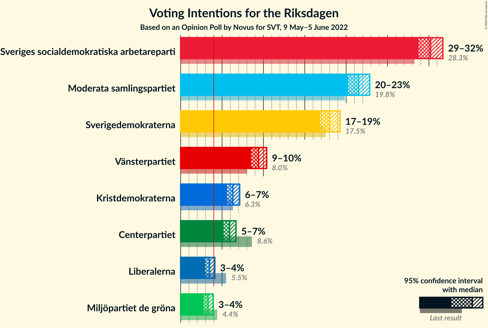

### Confidence Intervals

| Party | Last Result | Poll Result | 80% Confidence Interval | 90% Confidence Interval | 95% Confidence Interval | 99% Confidence Interval |
|:-----:|:-----------:|:-----------:|:-----------------------:|:-----------------------:|:-----------------------:|:-----------------------:|
| Sveriges socialdemokratiska arbetareparti | 28.3% | 30.2% | 29.3–31.2% |29.0–31.5% |28.8–31.7% |28.3–32.2% |
| Moderata samlingspartiet | 19.8% | 21.5% | 20.7–22.4% |20.4–22.6% |20.2–22.8% |19.8–23.3% |
| Sverigedemokraterna | 17.5% | 18.0% | 17.2–18.8% |17.0–19.1% |16.8–19.3% |16.4–19.7% |
| Vänsterpartiet | 8.0% | 9.4% | 8.8–10.0% |8.7–10.2% |8.5–10.4% |8.2–10.7% |
| Kristdemokraterna | 6.3% | 6.3% | 5.8–6.8% |5.7–7.0% |5.6–7.1% |5.3–7.4% |
| Centerpartiet | 8.6% | 5.9% | 5.4–6.4% |5.3–6.6% |5.2–6.7% |5.0–7.0% |
| Liberalerna | 5.5% | 3.5% | 3.1–3.9% |3.0–4.0% |3.0–4.1% |2.8–4.3% |
| Miljöpartiet de gröna | 4.4% | 3.3% | 3.0–3.7% |2.9–3.8% |2.8–3.9% |2.6–4.1% |

*Note:* The poll result column reflects the actual value used in the calculations. Published results may vary slightly, and in addition be rounded to fewer digits.

## Seats

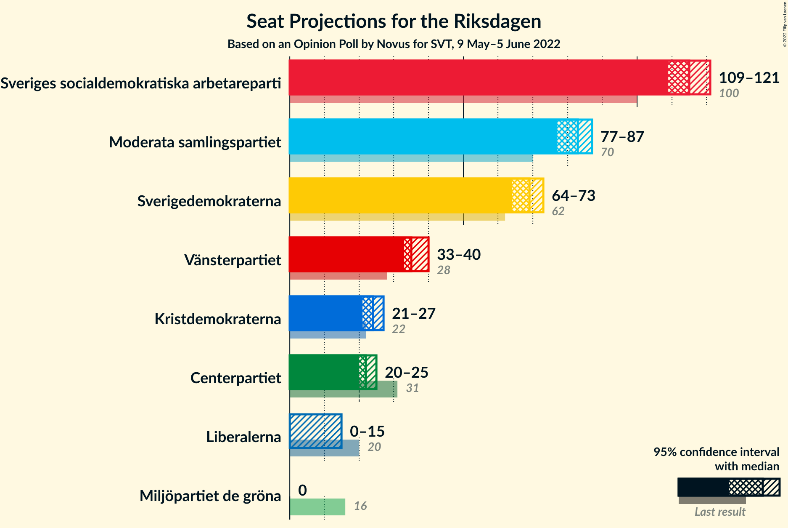

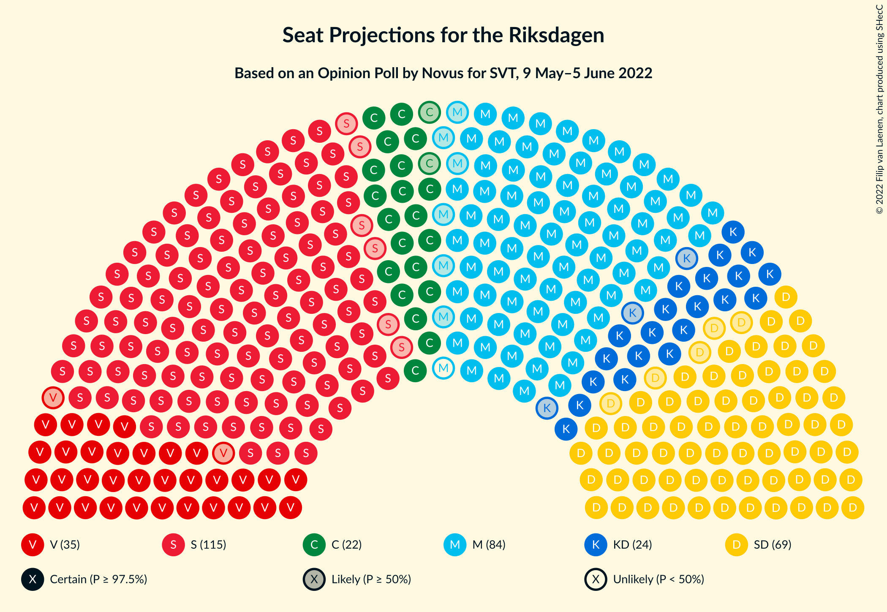

### Confidence Intervals

| Party | Last Result | Median | 80% Confidence Interval | 90% Confidence Interval | 95% Confidence Interval | 99% Confidence Interval |
|:-----:|:-----------:|:------:|:-----------------------:|:-----------------------:|:-----------------------:|:-----------------------:|
| <a href="#sveriges-socialdemokratiska-arbetareparti">Sveriges socialdemokratiska arbetareparti</a> | 100 | 115 | 111–118 |110–120 |109–121 |106–122 |
| <a href="#moderata-samlingspartiet">Moderata samlingspartiet</a> | 70 | 83 | 79–86 |78–86 |77–87 |75–89 |
| <a href="#sverigedemokraterna">Sverigedemokraterna</a> | 62 | 69 | 66–72 |65–73 |64–73 |62–75 |
| <a href="#vänsterpartiet">Vänsterpartiet</a> | 28 | 35 | 34–38 |33–39 |33–40 |31–41 |
| <a href="#kristdemokraterna">Kristdemokraterna</a> | 22 | 24 | 22–26 |22–26 |21–27 |20–28 |
| <a href="#centerpartiet">Centerpartiet</a> | 31 | 22 | 21–24 |20–25 |20–25 |19–26 |
| <a href="#liberalerna">Liberalerna</a> | 20 | 0 | 0 |0 |0–15 |0–16 |
| <a href="#miljöpartiet-de-gröna">Miljöpartiet de gröna</a> | 16 | 0 | 0 |0 |0 |0–15 |

### Sveriges socialdemokratiska arbetareparti

*For a full overview of the results for this party, see the [Sveriges socialdemokratiska arbetareparti](party-sverigessocialdemokratiskaarbetareparti.html) page.*

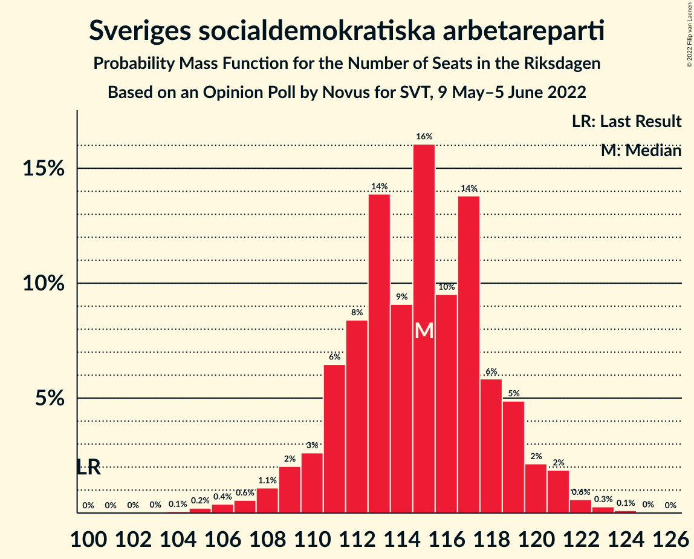

| Number of Seats | Probability | Accumulated | Special Marks |
|:---------------:|:-----------:|:-----------:|:-------------:|
| 100 | 0% | 100% | Last Result |
| 101 | 0% | 100% |  |
| 102 | 0% | 100% |  |
| 103 | 0% | 100% |  |
| 104 | 0.1% | 99.9% |  |
| 105 | 0.2% | 99.9% |  |
| 106 | 0.4% | 99.7% |  |
| 107 | 0.6% | 99.3% |  |
| 108 | 1.1% | 98.7% |  |
| 109 | 2% | 98% |  |
| 110 | 3% | 96% |  |
| 111 | 6% | 93% |  |
| 112 | 8% | 87% |  |
| 113 | 14% | 78% |  |
| 114 | 9% | 64% |  |
| 115 | 16% | 55% | Median |
| 116 | 10% | 39% |  |
| 117 | 14% | 30% |  |
| 118 | 6% | 16% |  |
| 119 | 5% | 10% |  |
| 120 | 2% | 5% |  |
| 121 | 2% | 3% |  |
| 122 | 0.6% | 1.0% |  |
| 123 | 0.3% | 0.4% |  |
| 124 | 0.1% | 0.2% |  |
| 125 | 0% | 0.1% |  |
| 126 | 0% | 0% |  |

### Moderata samlingspartiet

*For a full overview of the results for this party, see the [Moderata samlingspartiet](party-moderatasamlingspartiet.html) page.*

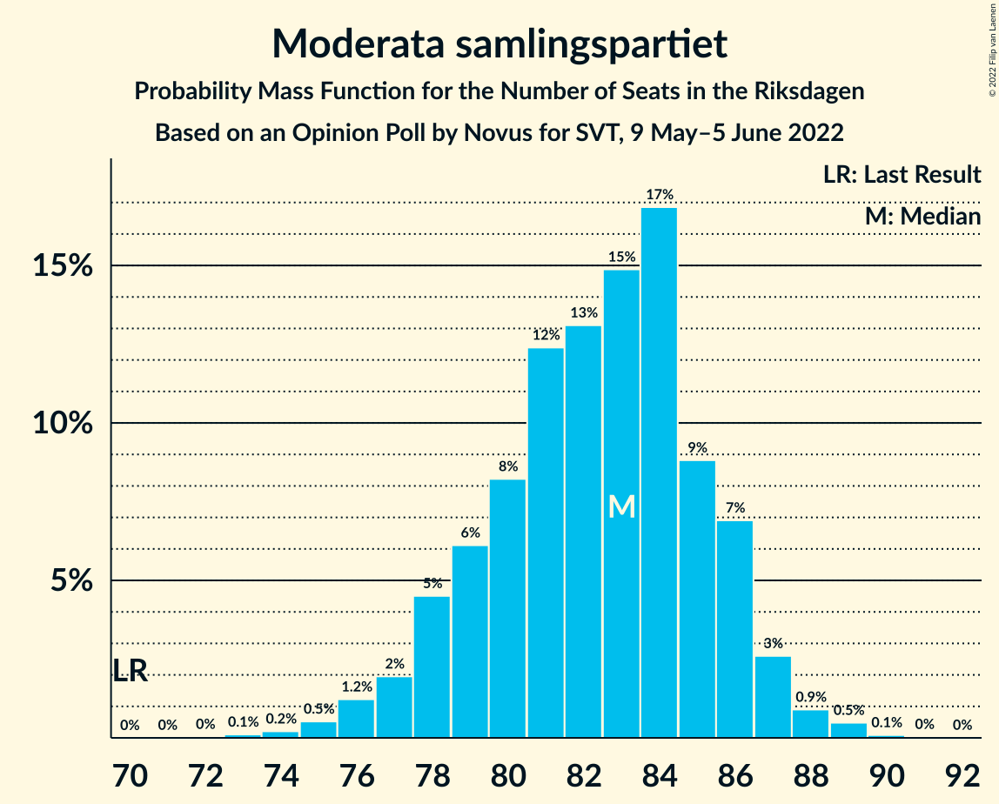

| Number of Seats | Probability | Accumulated | Special Marks |
|:---------------:|:-----------:|:-----------:|:-------------:|
| 70 | 0% | 100% | Last Result |
| 71 | 0% | 100% |  |
| 72 | 0% | 100% |  |
| 73 | 0.1% | 99.9% |  |
| 74 | 0.2% | 99.8% |  |
| 75 | 0.5% | 99.6% |  |
| 76 | 1.2% | 99.1% |  |
| 77 | 2% | 98% |  |
| 78 | 5% | 96% |  |
| 79 | 6% | 91% |  |
| 80 | 8% | 85% |  |
| 81 | 12% | 77% |  |
| 82 | 13% | 65% |  |
| 83 | 15% | 52% | Median |
| 84 | 17% | 37% |  |
| 85 | 9% | 20% |  |
| 86 | 7% | 11% |  |
| 87 | 3% | 4% |  |
| 88 | 0.9% | 2% |  |
| 89 | 0.5% | 0.6% |  |
| 90 | 0.1% | 0.1% |  |
| 91 | 0% | 0% |  |

### Sverigedemokraterna

*For a full overview of the results for this party, see the [Sverigedemokraterna](party-sverigedemokraterna.html) page.*

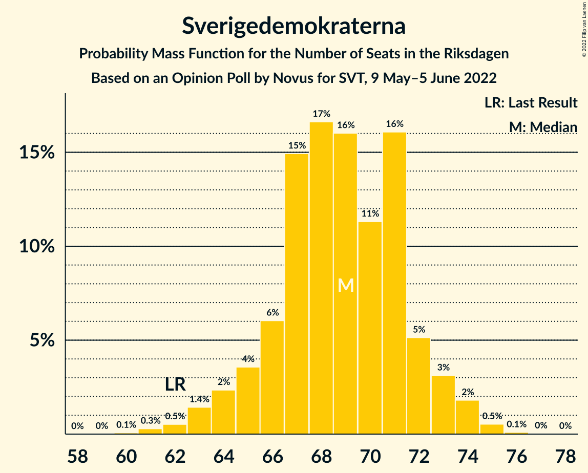

| Number of Seats | Probability | Accumulated | Special Marks |
|:---------------:|:-----------:|:-----------:|:-------------:|
| 60 | 0.1% | 100% |  |
| 61 | 0.3% | 99.9% |  |
| 62 | 0.5% | 99.6% | Last Result |
| 63 | 1.4% | 99.1% |  |
| 64 | 2% | 98% |  |
| 65 | 4% | 95% |  |
| 66 | 6% | 92% |  |
| 67 | 15% | 86% |  |
| 68 | 17% | 71% |  |
| 69 | 16% | 54% | Median |
| 70 | 11% | 38% |  |
| 71 | 16% | 27% |  |
| 72 | 5% | 11% |  |
| 73 | 3% | 6% |  |
| 74 | 2% | 2% |  |
| 75 | 0.5% | 0.7% |  |
| 76 | 0.1% | 0.1% |  |
| 77 | 0% | 0% |  |

### Vänsterpartiet

*For a full overview of the results for this party, see the [Vänsterpartiet](party-vänsterpartiet.html) page.*

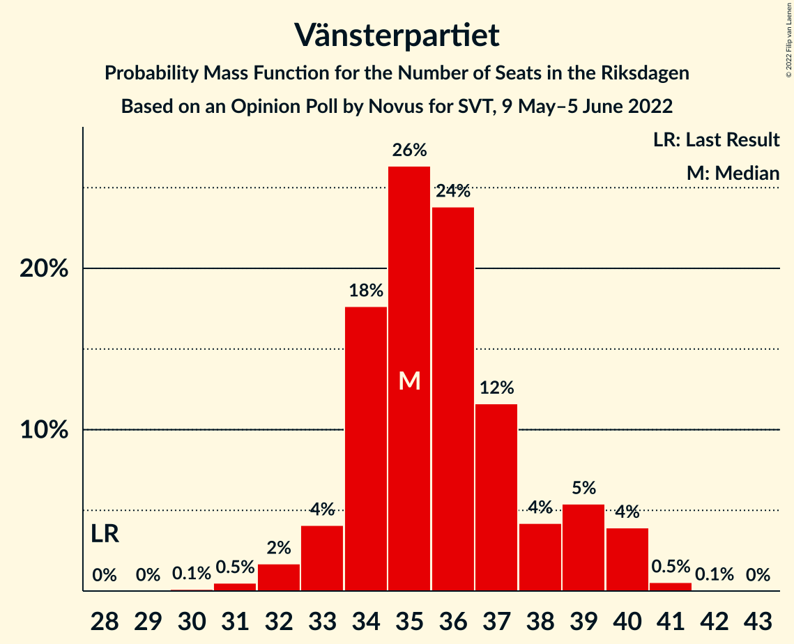

| Number of Seats | Probability | Accumulated | Special Marks |
|:---------------:|:-----------:|:-----------:|:-------------:|
| 28 | 0% | 100% | Last Result |
| 29 | 0% | 100% |  |
| 30 | 0.1% | 100% |  |
| 31 | 0.5% | 99.9% |  |
| 32 | 2% | 99.4% |  |
| 33 | 4% | 98% |  |
| 34 | 18% | 94% |  |
| 35 | 26% | 76% | Median |
| 36 | 24% | 50% |  |
| 37 | 12% | 26% |  |
| 38 | 4% | 14% |  |
| 39 | 5% | 10% |  |
| 40 | 4% | 5% |  |
| 41 | 0.5% | 0.6% |  |
| 42 | 0.1% | 0.1% |  |
| 43 | 0% | 0% |  |

### Kristdemokraterna

*For a full overview of the results for this party, see the [Kristdemokraterna](party-kristdemokraterna.html) page.*

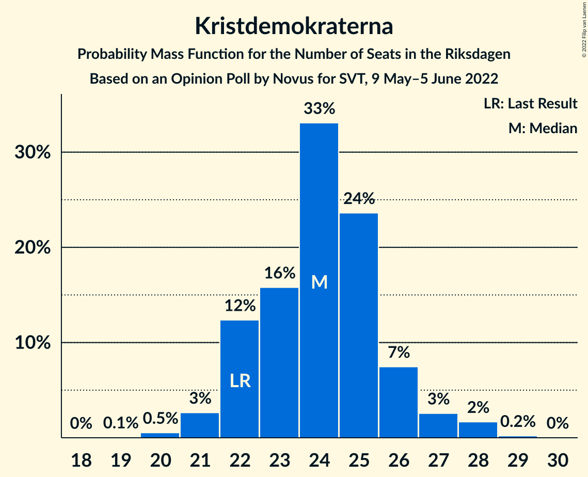

| Number of Seats | Probability | Accumulated | Special Marks |
|:---------------:|:-----------:|:-----------:|:-------------:|
| 19 | 0.1% | 100% |  |
| 20 | 0.5% | 99.9% |  |
| 21 | 3% | 99.4% |  |
| 22 | 12% | 97% | Last Result |
| 23 | 16% | 84% |  |
| 24 | 33% | 69% | Median |
| 25 | 24% | 36% |  |
| 26 | 7% | 12% |  |
| 27 | 3% | 4% |  |
| 28 | 2% | 2% |  |
| 29 | 0.2% | 0.2% |  |
| 30 | 0% | 0% |  |

### Centerpartiet

*For a full overview of the results for this party, see the [Centerpartiet](party-centerpartiet.html) page.*

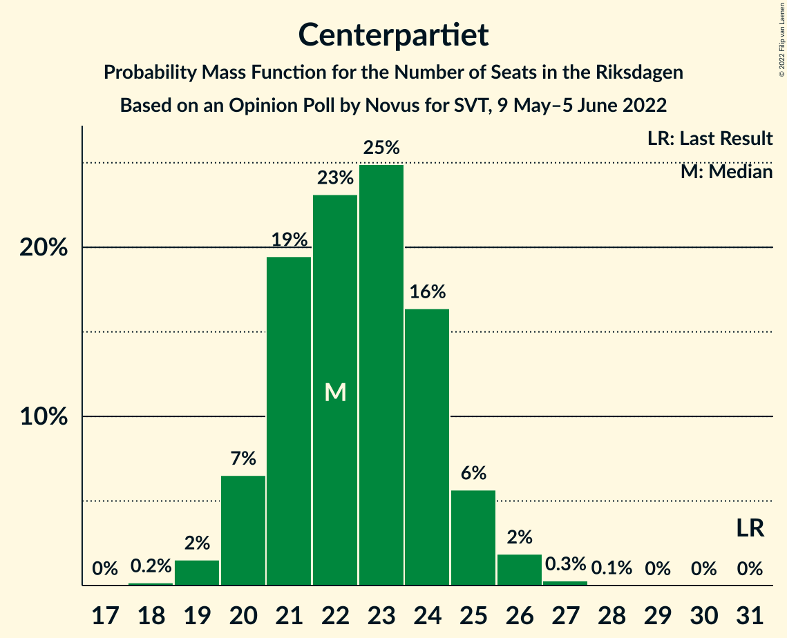

| Number of Seats | Probability | Accumulated | Special Marks |
|:---------------:|:-----------:|:-----------:|:-------------:|
| 18 | 0.2% | 100% |  |
| 19 | 2% | 99.8% |  |
| 20 | 7% | 98% |  |
| 21 | 19% | 92% |  |
| 22 | 23% | 72% | Median |
| 23 | 25% | 49% |  |
| 24 | 16% | 24% |  |
| 25 | 6% | 8% |  |
| 26 | 2% | 2% |  |
| 27 | 0.3% | 0.4% |  |
| 28 | 0.1% | 0.1% |  |
| 29 | 0% | 0% |  |
| 30 | 0% | 0% |  |
| 31 | 0% | 0% | Last Result |

### Liberalerna

*For a full overview of the results for this party, see the [Liberalerna](party-liberalerna.html) page.*

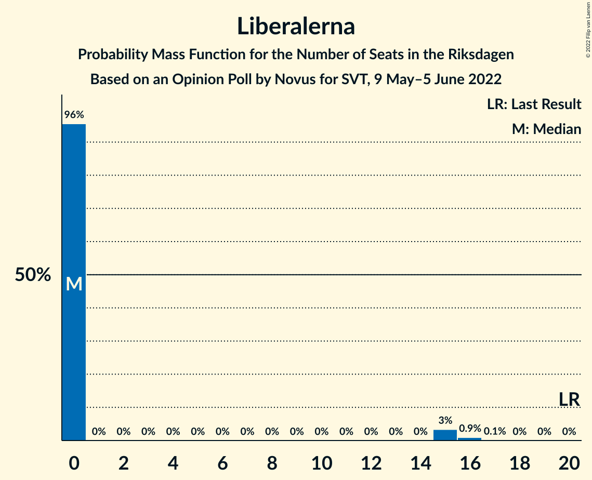

| Number of Seats | Probability | Accumulated | Special Marks |
|:---------------:|:-----------:|:-----------:|:-------------:|
| 0 | 96% | 100% | Median |
| 1 | 0% | 4% |  |
| 2 | 0% | 4% |  |
| 3 | 0% | 4% |  |
| 4 | 0% | 4% |  |
| 5 | 0% | 4% |  |
| 6 | 0% | 4% |  |
| 7 | 0% | 4% |  |
| 8 | 0% | 4% |  |
| 9 | 0% | 4% |  |
| 10 | 0% | 4% |  |
| 11 | 0% | 4% |  |
| 12 | 0% | 4% |  |
| 13 | 0% | 4% |  |
| 14 | 0% | 4% |  |
| 15 | 3% | 4% |  |
| 16 | 0.9% | 1.1% |  |
| 17 | 0.1% | 0.1% |  |
| 18 | 0% | 0% |  |
| 19 | 0% | 0% |  |
| 20 | 0% | 0% | Last Result |

### Miljöpartiet de gröna

*For a full overview of the results for this party, see the [Miljöpartiet de gröna](party-miljöpartietdegröna.html) page.*

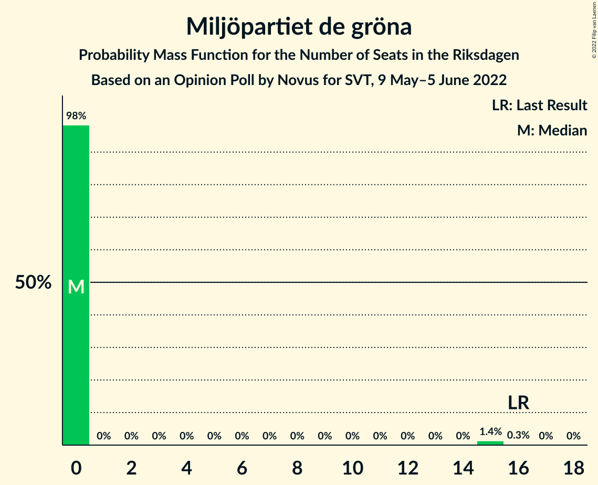

| Number of Seats | Probability | Accumulated | Special Marks |
|:---------------:|:-----------:|:-----------:|:-------------:|
| 0 | 98% | 100% | Median |
| 1 | 0% | 2% |  |
| 2 | 0% | 2% |  |
| 3 | 0% | 2% |  |
| 4 | 0% | 2% |  |
| 5 | 0% | 2% |  |
| 6 | 0% | 2% |  |
| 7 | 0% | 2% |  |
| 8 | 0% | 2% |  |
| 9 | 0% | 2% |  |
| 10 | 0% | 2% |  |
| 11 | 0% | 2% |  |
| 12 | 0% | 2% |  |
| 13 | 0% | 2% |  |
| 14 | 0% | 2% |  |
| 15 | 1.4% | 2% |  |
| 16 | 0.3% | 0.3% | Last Result |
| 17 | 0% | 0% |  |

## Coalitions

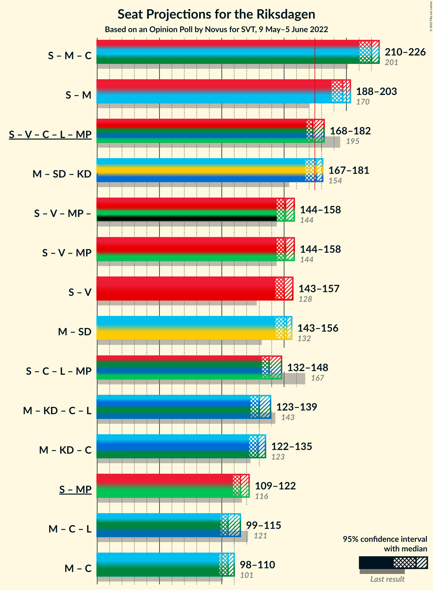

### Confidence Intervals

| Coalition | Last Result | Median | Majority? | 80% Confidence Interval | 90% Confidence Interval | 95% Confidence Interval | 99% Confidence Interval |
|:---------:|:-----------:|:------:|:---------:|:-----------------------:|:-----------------------:|:-----------------------:|:-----------------------:|
| Sveriges socialdemokratiska arbetareparti – Moderata samlingspartiet – Centerpartiet | 201 | 220 | 100% | 215–224 | 212–225 | 210–226 | 206–227 |
| Sveriges socialdemokratiska arbetareparti – Moderata samlingspartiet | 170 | 197 | 100% | 193–201 | 190–202 | 188–203 | 185–205 |
| Sveriges socialdemokratiska arbetareparti – Vänsterpartiet – Centerpartiet – Liberalerna – Miljöpartiet de gröna | 195 | 173 | 34% | 170–178 | 169–180 | 168–182 | 167–186 |
| Moderata samlingspartiet – Sverigedemokraterna – Kristdemokraterna | 154 | 176 | 66% | 171–179 | 169–180 | 167–181 | 163–182 |
| Sveriges socialdemokratiska arbetareparti – Vänsterpartiet – Miljöpartiet de gröna | 144 | 151 | 0% | 147–155 | 146–156 | 144–158 | 140–161 |
| Sveriges socialdemokratiska arbetareparti – Vänsterpartiet | 128 | 150 | 0% | 147–154 | 145–156 | 143–157 | 140–159 |
| Moderata samlingspartiet – Sverigedemokraterna | 132 | 152 | 0% | 147–155 | 145–155 | 143–156 | 140–158 |
| Sveriges socialdemokratiska arbetareparti – Centerpartiet – Liberalerna – Miljöpartiet de gröna | 167 | 138 | 0% | 134–143 | 133–145 | 132–148 | 131–151 |
| Moderata samlingspartiet – Kristdemokraterna – Centerpartiet – Liberalerna | 143 | 130 | 0% | 125–133 | 124–135 | 123–139 | 121–142 |
| Moderata samlingspartiet – Kristdemokraterna – Centerpartiet | 123 | 129 | 0% | 125–132 | 123–133 | 122–135 | 119–136 |
| Sveriges socialdemokratiska arbetareparti – Miljöpartiet de gröna | 116 | 115 | 0% | 111–119 | 110–120 | 109–122 | 106–127 |
| Moderata samlingspartiet – Centerpartiet – Liberalerna | 121 | 105 | 0% | 101–109 | 100–111 | 99–115 | 97–119 |
| Moderata samlingspartiet – Centerpartiet | 101 | 105 | 0% | 101–108 | 100–109 | 98–110 | 96–112 |

### Sveriges socialdemokratiska arbetareparti – Moderata samlingspartiet – Centerpartiet

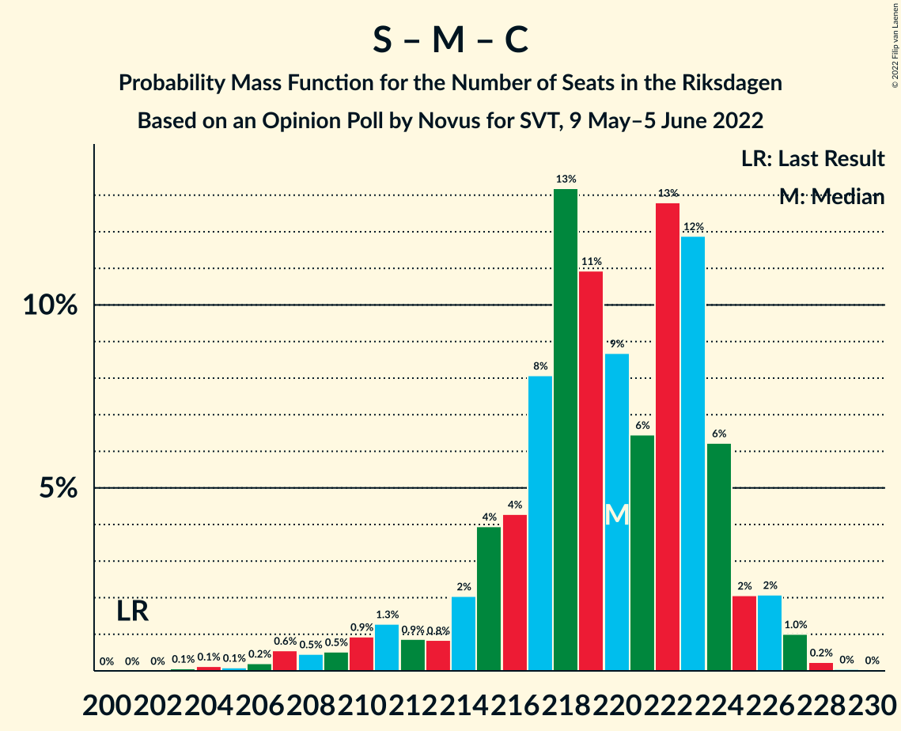

| Number of Seats | Probability | Accumulated | Special Marks |
|:---------------:|:-----------:|:-----------:|:-------------:|
| 201 | 0% | 100% | Last Result |
| 202 | 0% | 100% |  |
| 203 | 0.1% | 100% |  |
| 204 | 0.1% | 99.9% |  |
| 205 | 0.1% | 99.8% |  |
| 206 | 0.2% | 99.7% |  |
| 207 | 0.6% | 99.5% |  |
| 208 | 0.5% | 98.9% |  |
| 209 | 0.5% | 98% |  |
| 210 | 0.9% | 98% |  |
| 211 | 1.3% | 97% |  |
| 212 | 0.9% | 96% |  |
| 213 | 0.8% | 95% |  |
| 214 | 2% | 94% |  |
| 215 | 4% | 92% |  |
| 216 | 4% | 88% |  |
| 217 | 8% | 84% |  |
| 218 | 13% | 76% |  |
| 219 | 11% | 62% |  |
| 220 | 9% | 52% | Median |
| 221 | 6% | 43% |  |
| 222 | 13% | 36% |  |
| 223 | 12% | 24% |  |
| 224 | 6% | 12% |  |
| 225 | 2% | 5% |  |
| 226 | 2% | 3% |  |
| 227 | 1.0% | 1.3% |  |
| 228 | 0.2% | 0.3% |  |
| 229 | 0% | 0.1% |  |
| 230 | 0% | 0% |  |

### Sveriges socialdemokratiska arbetareparti – Moderata samlingspartiet

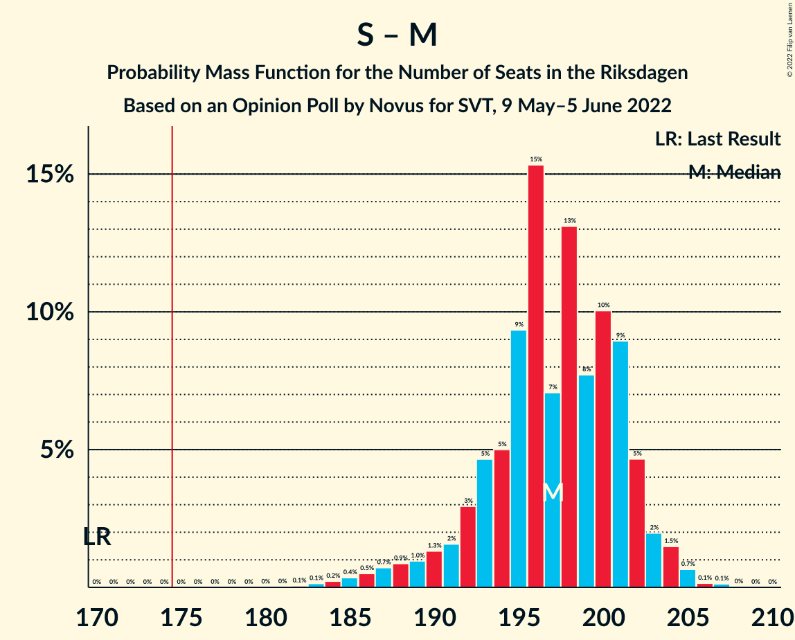

| Number of Seats | Probability | Accumulated | Special Marks |
|:---------------:|:-----------:|:-----------:|:-------------:|
| 170 | 0% | 100% | Last Result |
| 171 | 0% | 100% |  |
| 172 | 0% | 100% |  |
| 173 | 0% | 100% |  |
| 174 | 0% | 100% |  |
| 175 | 0% | 100% | Majority |
| 176 | 0% | 100% |  |
| 177 | 0% | 100% |  |
| 178 | 0% | 100% |  |
| 179 | 0% | 100% |  |
| 180 | 0% | 100% |  |
| 181 | 0% | 100% |  |
| 182 | 0.1% | 99.9% |  |
| 183 | 0.1% | 99.9% |  |
| 184 | 0.2% | 99.8% |  |
| 185 | 0.4% | 99.5% |  |
| 186 | 0.5% | 99.2% |  |
| 187 | 0.7% | 98.7% |  |
| 188 | 0.9% | 98% |  |
| 189 | 1.0% | 97% |  |
| 190 | 1.3% | 96% |  |
| 191 | 2% | 95% |  |
| 192 | 3% | 93% |  |
| 193 | 5% | 90% |  |
| 194 | 5% | 86% |  |
| 195 | 9% | 81% |  |
| 196 | 15% | 71% |  |
| 197 | 7% | 56% |  |
| 198 | 13% | 49% | Median |
| 199 | 8% | 36% |  |
| 200 | 10% | 28% |  |
| 201 | 9% | 18% |  |
| 202 | 5% | 9% |  |
| 203 | 2% | 4% |  |
| 204 | 1.5% | 2% |  |
| 205 | 0.7% | 1.0% |  |
| 206 | 0.1% | 0.3% |  |
| 207 | 0.1% | 0.2% |  |
| 208 | 0% | 0% |  |

### Sveriges socialdemokratiska arbetareparti – Vänsterpartiet – Centerpartiet – Liberalerna – Miljöpartiet de gröna

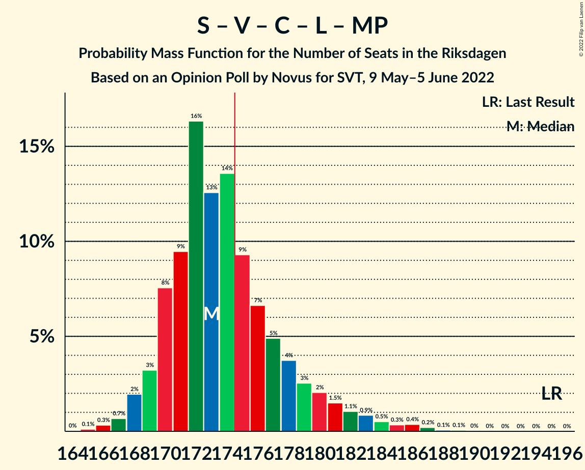

| Number of Seats | Probability | Accumulated | Special Marks |
|:---------------:|:-----------:|:-----------:|:-------------:|
| 164 | 0% | 100% |  |
| 165 | 0.1% | 99.9% |  |
| 166 | 0.3% | 99.8% |  |
| 167 | 0.7% | 99.5% |  |
| 168 | 2% | 98.8% |  |
| 169 | 3% | 97% |  |
| 170 | 8% | 94% |  |
| 171 | 9% | 86% |  |
| 172 | 16% | 77% | Median |
| 173 | 13% | 60% |  |
| 174 | 14% | 48% |  |
| 175 | 9% | 34% | Majority |
| 176 | 7% | 25% |  |
| 177 | 5% | 18% |  |
| 178 | 4% | 13% |  |
| 179 | 3% | 10% |  |
| 180 | 2% | 7% |  |
| 181 | 1.5% | 5% |  |
| 182 | 1.1% | 3% |  |
| 183 | 0.9% | 2% |  |
| 184 | 0.5% | 2% |  |
| 185 | 0.3% | 1.1% |  |
| 186 | 0.4% | 0.7% |  |
| 187 | 0.2% | 0.4% |  |
| 188 | 0.1% | 0.2% |  |
| 189 | 0.1% | 0.1% |  |
| 190 | 0% | 0% |  |
| 191 | 0% | 0% |  |
| 192 | 0% | 0% |  |
| 193 | 0% | 0% |  |
| 194 | 0% | 0% |  |
| 195 | 0% | 0% | Last Result |

### Moderata samlingspartiet – Sverigedemokraterna – Kristdemokraterna

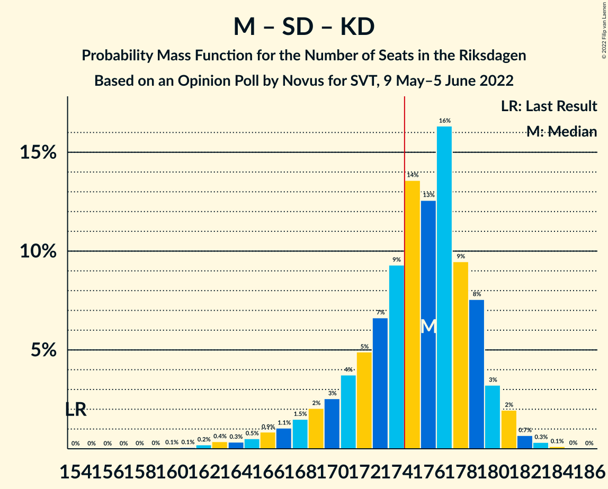

| Number of Seats | Probability | Accumulated | Special Marks |
|:---------------:|:-----------:|:-----------:|:-------------:|
| 154 | 0% | 100% | Last Result |
| 155 | 0% | 100% |  |
| 156 | 0% | 100% |  |
| 157 | 0% | 100% |  |
| 158 | 0% | 100% |  |
| 159 | 0% | 100% |  |
| 160 | 0.1% | 100% |  |
| 161 | 0.1% | 99.9% |  |
| 162 | 0.2% | 99.8% |  |
| 163 | 0.4% | 99.6% |  |
| 164 | 0.3% | 99.3% |  |
| 165 | 0.5% | 98.9% |  |
| 166 | 0.9% | 98% |  |
| 167 | 1.1% | 98% |  |
| 168 | 1.5% | 97% |  |
| 169 | 2% | 95% |  |
| 170 | 3% | 93% |  |
| 171 | 4% | 90% |  |
| 172 | 5% | 87% |  |
| 173 | 7% | 82% |  |
| 174 | 9% | 75% |  |
| 175 | 14% | 66% | Majority |
| 176 | 13% | 52% | Median |
| 177 | 16% | 40% |  |
| 178 | 9% | 23% |  |
| 179 | 8% | 14% |  |
| 180 | 3% | 6% |  |
| 181 | 2% | 3% |  |
| 182 | 0.7% | 1.2% |  |
| 183 | 0.3% | 0.5% |  |
| 184 | 0.1% | 0.2% |  |
| 185 | 0% | 0.1% |  |
| 186 | 0% | 0% |  |

### Sveriges socialdemokratiska arbetareparti – Vänsterpartiet – Miljöpartiet de gröna

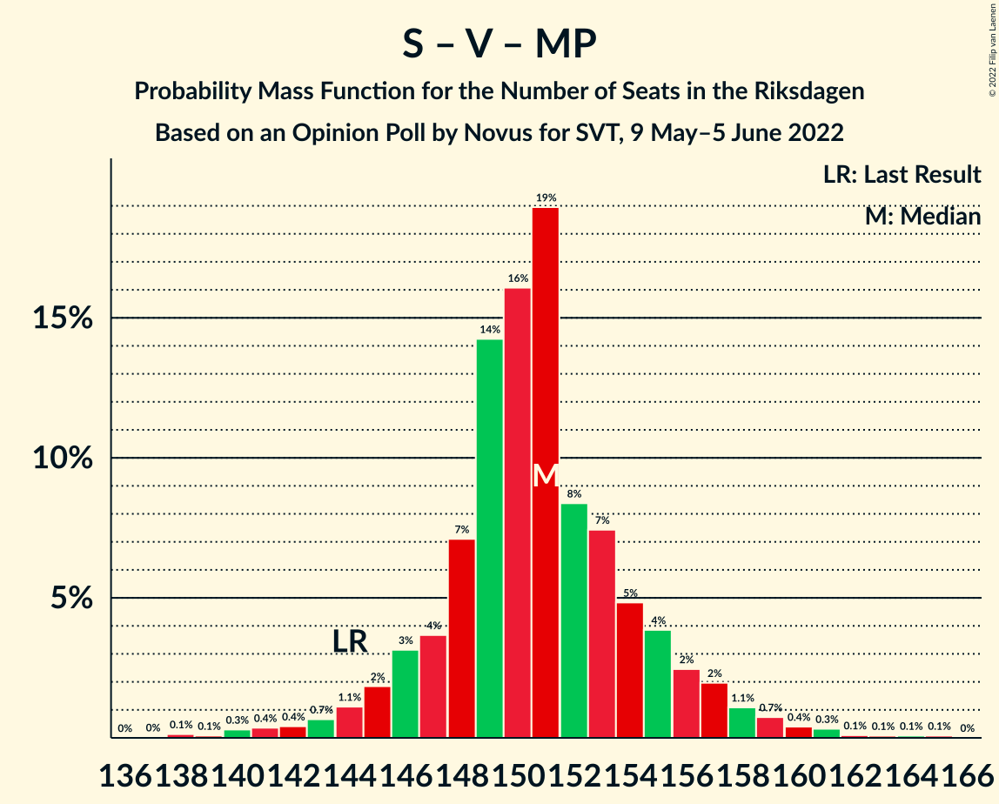

| Number of Seats | Probability | Accumulated | Special Marks |
|:---------------:|:-----------:|:-----------:|:-------------:|
| 138 | 0.1% | 100% |  |
| 139 | 0.1% | 99.8% |  |
| 140 | 0.3% | 99.8% |  |
| 141 | 0.4% | 99.5% |  |
| 142 | 0.4% | 99.1% |  |
| 143 | 0.7% | 98.7% |  |
| 144 | 1.1% | 98% | Last Result |
| 145 | 2% | 97% |  |
| 146 | 3% | 95% |  |
| 147 | 4% | 92% |  |
| 148 | 7% | 88% |  |
| 149 | 14% | 81% |  |
| 150 | 16% | 67% | Median |
| 151 | 19% | 51% |  |
| 152 | 8% | 32% |  |
| 153 | 7% | 23% |  |
| 154 | 5% | 16% |  |
| 155 | 4% | 11% |  |
| 156 | 2% | 7% |  |
| 157 | 2% | 5% |  |
| 158 | 1.1% | 3% |  |
| 159 | 0.7% | 2% |  |
| 160 | 0.4% | 1.1% |  |
| 161 | 0.3% | 0.7% |  |
| 162 | 0.1% | 0.4% |  |
| 163 | 0.1% | 0.3% |  |
| 164 | 0.1% | 0.2% |  |
| 165 | 0.1% | 0.1% |  |
| 166 | 0% | 0% |  |

### Sveriges socialdemokratiska arbetareparti – Vänsterpartiet

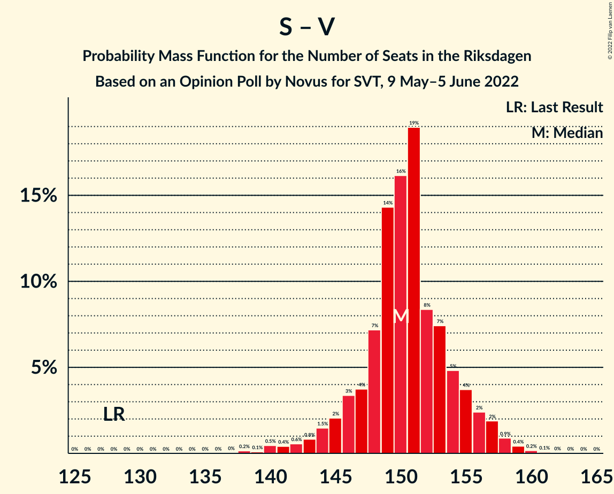

| Number of Seats | Probability | Accumulated | Special Marks |
|:---------------:|:-----------:|:-----------:|:-------------:|
| 128 | 0% | 100% | Last Result |
| 129 | 0% | 100% |  |
| 130 | 0% | 100% |  |
| 131 | 0% | 100% |  |
| 132 | 0% | 100% |  |
| 133 | 0% | 100% |  |
| 134 | 0% | 100% |  |
| 135 | 0% | 100% |  |
| 136 | 0% | 100% |  |
| 137 | 0% | 100% |  |
| 138 | 0.2% | 99.9% |  |
| 139 | 0.1% | 99.8% |  |
| 140 | 0.5% | 99.7% |  |
| 141 | 0.4% | 99.2% |  |
| 142 | 0.6% | 98.8% |  |
| 143 | 0.8% | 98% |  |
| 144 | 1.5% | 97% |  |
| 145 | 2% | 96% |  |
| 146 | 3% | 94% |  |
| 147 | 4% | 91% |  |
| 148 | 7% | 87% |  |
| 149 | 14% | 80% |  |
| 150 | 16% | 65% | Median |
| 151 | 19% | 49% |  |
| 152 | 8% | 30% |  |
| 153 | 7% | 22% |  |
| 154 | 5% | 14% |  |
| 155 | 4% | 10% |  |
| 156 | 2% | 6% |  |
| 157 | 2% | 3% |  |
| 158 | 0.9% | 2% |  |
| 159 | 0.4% | 0.7% |  |
| 160 | 0.2% | 0.3% |  |
| 161 | 0.1% | 0.1% |  |
| 162 | 0% | 0% |  |

### Moderata samlingspartiet – Sverigedemokraterna

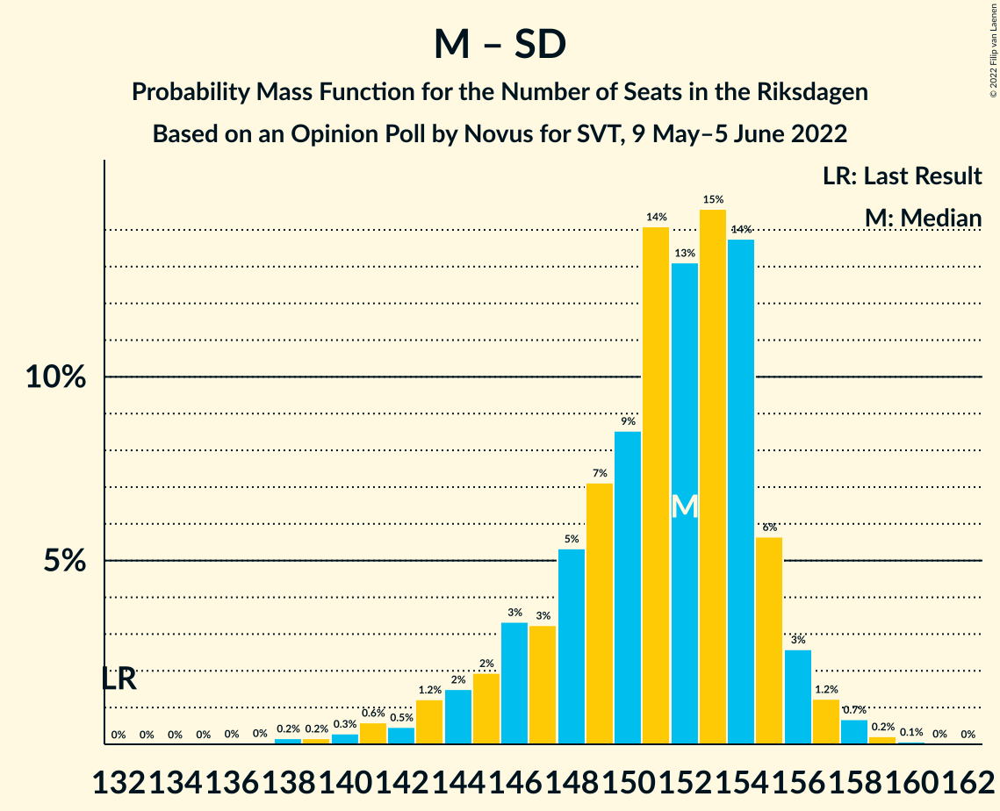

| Number of Seats | Probability | Accumulated | Special Marks |
|:---------------:|:-----------:|:-----------:|:-------------:|
| 132 | 0% | 100% | Last Result |
| 133 | 0% | 100% |  |
| 134 | 0% | 100% |  |
| 135 | 0% | 100% |  |
| 136 | 0% | 100% |  |
| 137 | 0% | 100% |  |
| 138 | 0.2% | 99.9% |  |
| 139 | 0.2% | 99.8% |  |
| 140 | 0.3% | 99.6% |  |
| 141 | 0.6% | 99.3% |  |
| 142 | 0.5% | 98.7% |  |
| 143 | 1.2% | 98% |  |
| 144 | 2% | 97% |  |
| 145 | 2% | 96% |  |
| 146 | 3% | 94% |  |
| 147 | 3% | 90% |  |
| 148 | 5% | 87% |  |
| 149 | 7% | 82% |  |
| 150 | 9% | 75% |  |
| 151 | 14% | 66% |  |
| 152 | 13% | 52% | Median |
| 153 | 15% | 39% |  |
| 154 | 14% | 24% |  |
| 155 | 6% | 10% |  |
| 156 | 3% | 5% |  |
| 157 | 1.2% | 2% |  |
| 158 | 0.7% | 1.0% |  |
| 159 | 0.2% | 0.3% |  |
| 160 | 0.1% | 0.1% |  |
| 161 | 0% | 0% |  |

### Sveriges socialdemokratiska arbetareparti – Centerpartiet – Liberalerna – Miljöpartiet de gröna

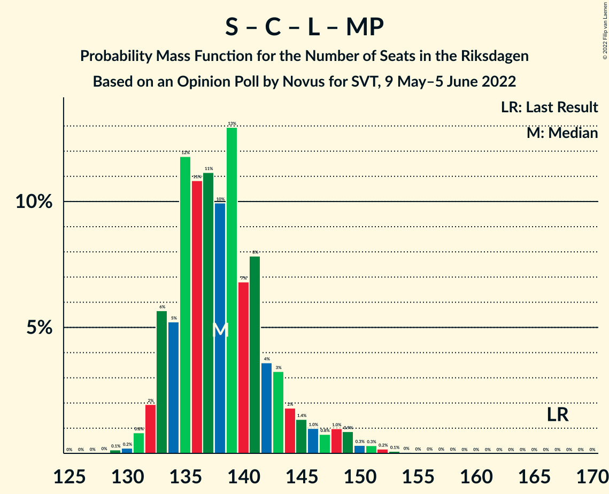

| Number of Seats | Probability | Accumulated | Special Marks |
|:---------------:|:-----------:|:-----------:|:-------------:|
| 129 | 0.1% | 100% |  |
| 130 | 0.2% | 99.8% |  |
| 131 | 0.8% | 99.6% |  |
| 132 | 2% | 98.8% |  |
| 133 | 6% | 97% |  |
| 134 | 5% | 91% |  |
| 135 | 12% | 86% |  |
| 136 | 11% | 74% |  |
| 137 | 11% | 63% | Median |
| 138 | 10% | 52% |  |
| 139 | 13% | 42% |  |
| 140 | 7% | 29% |  |
| 141 | 8% | 22% |  |
| 142 | 4% | 15% |  |
| 143 | 3% | 11% |  |
| 144 | 2% | 8% |  |
| 145 | 1.4% | 6% |  |
| 146 | 1.0% | 5% |  |
| 147 | 0.8% | 4% |  |
| 148 | 1.0% | 3% |  |
| 149 | 0.9% | 2% |  |
| 150 | 0.3% | 1.0% |  |
| 151 | 0.3% | 0.7% |  |
| 152 | 0.2% | 0.4% |  |
| 153 | 0.1% | 0.2% |  |
| 154 | 0% | 0.1% |  |
| 155 | 0% | 0.1% |  |
| 156 | 0% | 0% |  |
| 157 | 0% | 0% |  |
| 158 | 0% | 0% |  |
| 159 | 0% | 0% |  |
| 160 | 0% | 0% |  |
| 161 | 0% | 0% |  |
| 162 | 0% | 0% |  |
| 163 | 0% | 0% |  |
| 164 | 0% | 0% |  |
| 165 | 0% | 0% |  |
| 166 | 0% | 0% |  |
| 167 | 0% | 0% | Last Result |

### Moderata samlingspartiet – Kristdemokraterna – Centerpartiet – Liberalerna

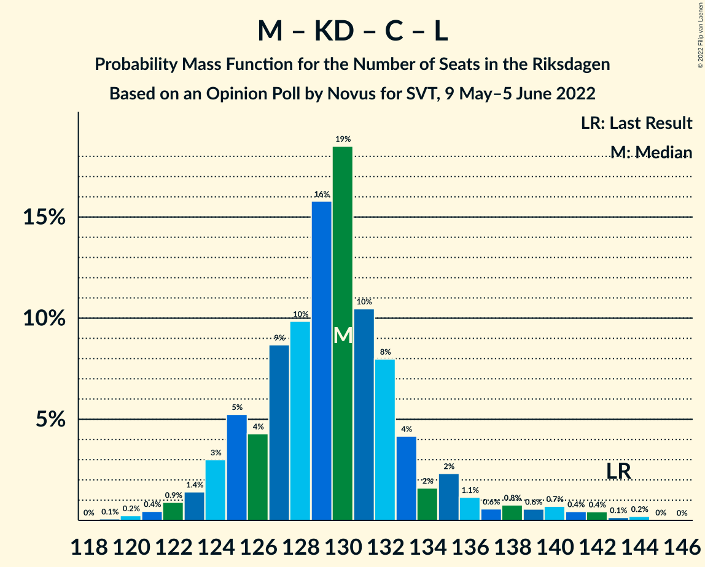

| Number of Seats | Probability | Accumulated | Special Marks |
|:---------------:|:-----------:|:-----------:|:-------------:|
| 118 | 0% | 100% |  |
| 119 | 0.1% | 99.9% |  |
| 120 | 0.2% | 99.9% |  |
| 121 | 0.4% | 99.6% |  |
| 122 | 0.9% | 99.2% |  |
| 123 | 1.4% | 98% |  |
| 124 | 3% | 97% |  |
| 125 | 5% | 94% |  |
| 126 | 4% | 89% |  |
| 127 | 9% | 84% |  |
| 128 | 10% | 76% |  |
| 129 | 16% | 66% | Median |
| 130 | 19% | 50% |  |
| 131 | 10% | 32% |  |
| 132 | 8% | 21% |  |
| 133 | 4% | 13% |  |
| 134 | 2% | 9% |  |
| 135 | 2% | 7% |  |
| 136 | 1.1% | 5% |  |
| 137 | 0.6% | 4% |  |
| 138 | 0.8% | 3% |  |
| 139 | 0.6% | 3% |  |
| 140 | 0.7% | 2% |  |
| 141 | 0.4% | 1.3% |  |
| 142 | 0.4% | 0.8% |  |
| 143 | 0.1% | 0.4% | Last Result |
| 144 | 0.2% | 0.3% |  |
| 145 | 0% | 0.1% |  |
| 146 | 0% | 0% |  |

### Moderata samlingspartiet – Kristdemokraterna – Centerpartiet

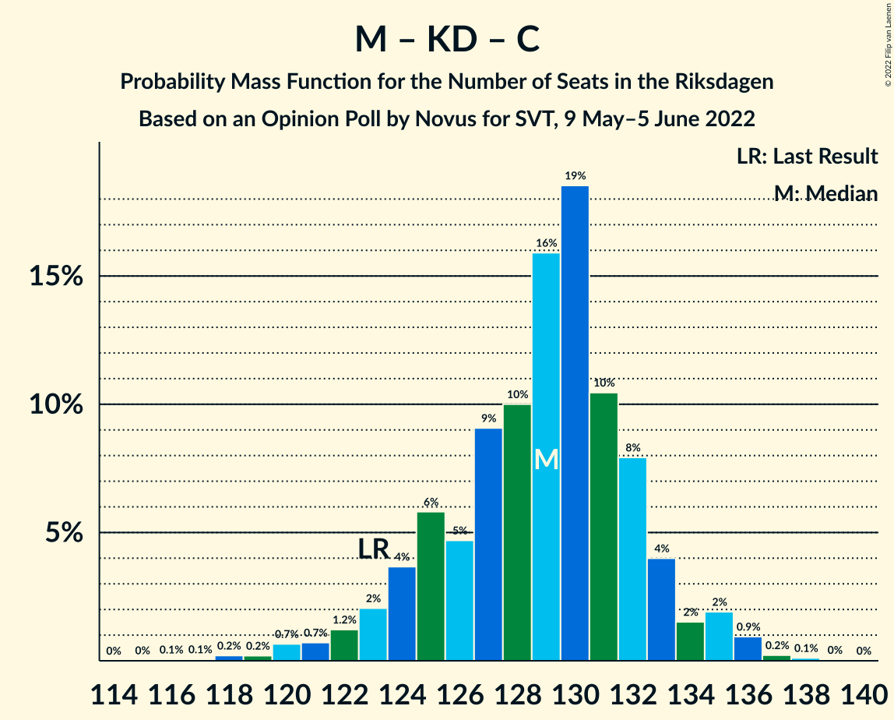

| Number of Seats | Probability | Accumulated | Special Marks |
|:---------------:|:-----------:|:-----------:|:-------------:|
| 116 | 0.1% | 100% |  |
| 117 | 0.1% | 99.9% |  |
| 118 | 0.2% | 99.9% |  |
| 119 | 0.2% | 99.7% |  |
| 120 | 0.7% | 99.5% |  |
| 121 | 0.7% | 98.8% |  |
| 122 | 1.2% | 98% |  |
| 123 | 2% | 97% | Last Result |
| 124 | 4% | 95% |  |
| 125 | 6% | 91% |  |
| 126 | 5% | 85% |  |
| 127 | 9% | 81% |  |
| 128 | 10% | 72% |  |
| 129 | 16% | 62% | Median |
| 130 | 19% | 46% |  |
| 131 | 10% | 27% |  |
| 132 | 8% | 17% |  |
| 133 | 4% | 9% |  |
| 134 | 2% | 5% |  |
| 135 | 2% | 3% |  |
| 136 | 0.9% | 1.3% |  |
| 137 | 0.2% | 0.4% |  |
| 138 | 0.1% | 0.2% |  |
| 139 | 0% | 0% |  |

### Sveriges socialdemokratiska arbetareparti – Miljöpartiet de gröna

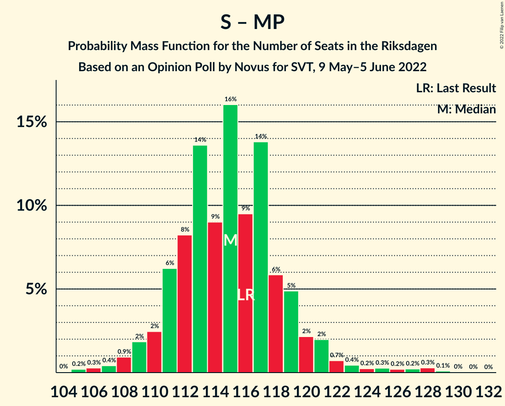

| Number of Seats | Probability | Accumulated | Special Marks |
|:---------------:|:-----------:|:-----------:|:-------------:|
| 104 | 0% | 100% |  |
| 105 | 0.2% | 99.9% |  |
| 106 | 0.3% | 99.7% |  |
| 107 | 0.4% | 99.4% |  |
| 108 | 0.9% | 99.0% |  |
| 109 | 2% | 98% |  |
| 110 | 2% | 96% |  |
| 111 | 6% | 94% |  |
| 112 | 8% | 88% |  |
| 113 | 14% | 79% |  |
| 114 | 9% | 66% |  |
| 115 | 16% | 57% | Median |
| 116 | 9% | 41% | Last Result |
| 117 | 14% | 31% |  |
| 118 | 6% | 17% |  |
| 119 | 5% | 12% |  |
| 120 | 2% | 7% |  |
| 121 | 2% | 5% |  |
| 122 | 0.7% | 3% |  |
| 123 | 0.4% | 2% |  |
| 124 | 0.2% | 1.4% |  |
| 125 | 0.3% | 1.1% |  |
| 126 | 0.2% | 0.9% |  |
| 127 | 0.2% | 0.7% |  |
| 128 | 0.3% | 0.4% |  |
| 129 | 0.1% | 0.2% |  |
| 130 | 0% | 0.1% |  |
| 131 | 0% | 0% |  |

### Moderata samlingspartiet – Centerpartiet – Liberalerna

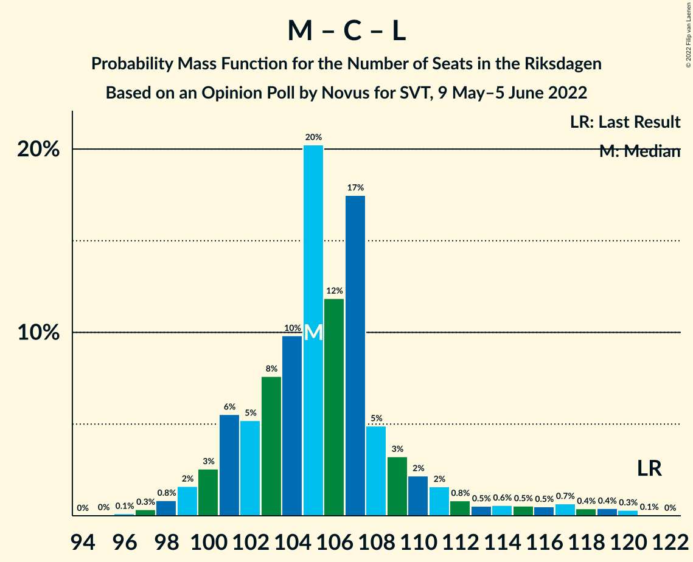

| Number of Seats | Probability | Accumulated | Special Marks |
|:---------------:|:-----------:|:-----------:|:-------------:|
| 95 | 0% | 100% |  |
| 96 | 0.1% | 99.9% |  |
| 97 | 0.3% | 99.8% |  |
| 98 | 0.8% | 99.5% |  |
| 99 | 2% | 98.6% |  |
| 100 | 3% | 97% |  |
| 101 | 6% | 94% |  |
| 102 | 5% | 89% |  |
| 103 | 8% | 84% |  |
| 104 | 10% | 76% |  |
| 105 | 20% | 66% | Median |
| 106 | 12% | 46% |  |
| 107 | 17% | 34% |  |
| 108 | 5% | 17% |  |
| 109 | 3% | 12% |  |
| 110 | 2% | 9% |  |
| 111 | 2% | 6% |  |
| 112 | 0.8% | 5% |  |
| 113 | 0.5% | 4% |  |
| 114 | 0.6% | 3% |  |
| 115 | 0.5% | 3% |  |
| 116 | 0.5% | 2% |  |
| 117 | 0.7% | 2% |  |
| 118 | 0.4% | 1.2% |  |
| 119 | 0.4% | 0.8% |  |
| 120 | 0.3% | 0.4% |  |
| 121 | 0.1% | 0.1% | Last Result |
| 122 | 0% | 0% |  |

### Moderata samlingspartiet – Centerpartiet

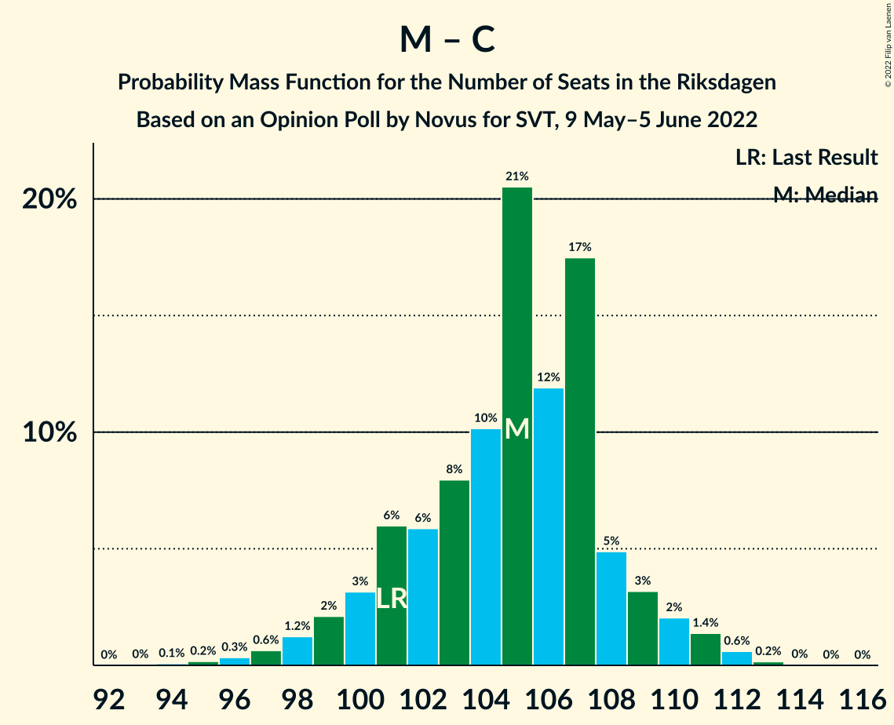

| Number of Seats | Probability | Accumulated | Special Marks |
|:---------------:|:-----------:|:-----------:|:-------------:|
| 94 | 0.1% | 100% |  |
| 95 | 0.2% | 99.9% |  |
| 96 | 0.3% | 99.7% |  |
| 97 | 0.6% | 99.4% |  |
| 98 | 1.2% | 98.7% |  |
| 99 | 2% | 97% |  |
| 100 | 3% | 95% |  |
| 101 | 6% | 92% | Last Result |
| 102 | 6% | 86% |  |
| 103 | 8% | 80% |  |
| 104 | 10% | 72% |  |
| 105 | 21% | 62% | Median |
| 106 | 12% | 42% |  |
| 107 | 17% | 30% |  |
| 108 | 5% | 12% |  |
| 109 | 3% | 7% |  |
| 110 | 2% | 4% |  |
| 111 | 1.4% | 2% |  |
| 112 | 0.6% | 0.8% |  |
| 113 | 0.2% | 0.2% |  |
| 114 | 0% | 0.1% |  |
| 115 | 0% | 0% |  |

## Technical Information

### Opinion Poll

+ **Polling firm:** Novus
+ **Commissioner(s):** SVT
+ **Fieldwork period:** 9 May–5 June 2022

### Calculations

+ **Sample size:** 3804
+ **Simulations done:** 1,048,576
+ **Error estimate:** 0.91%

