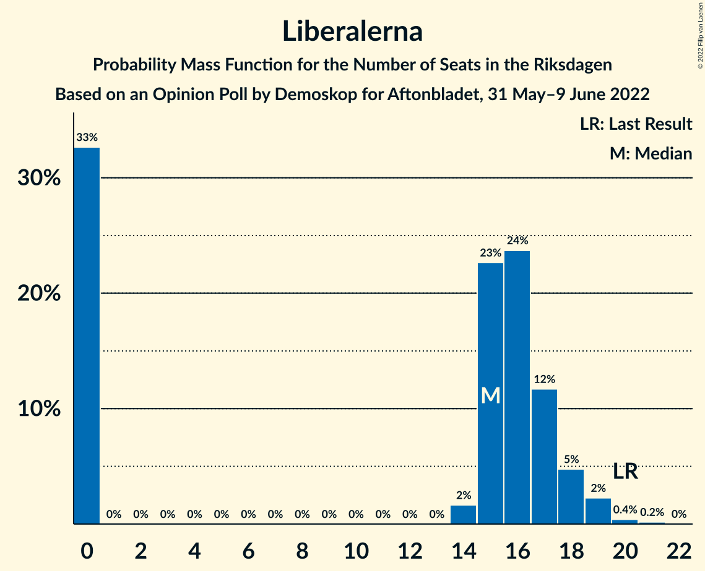
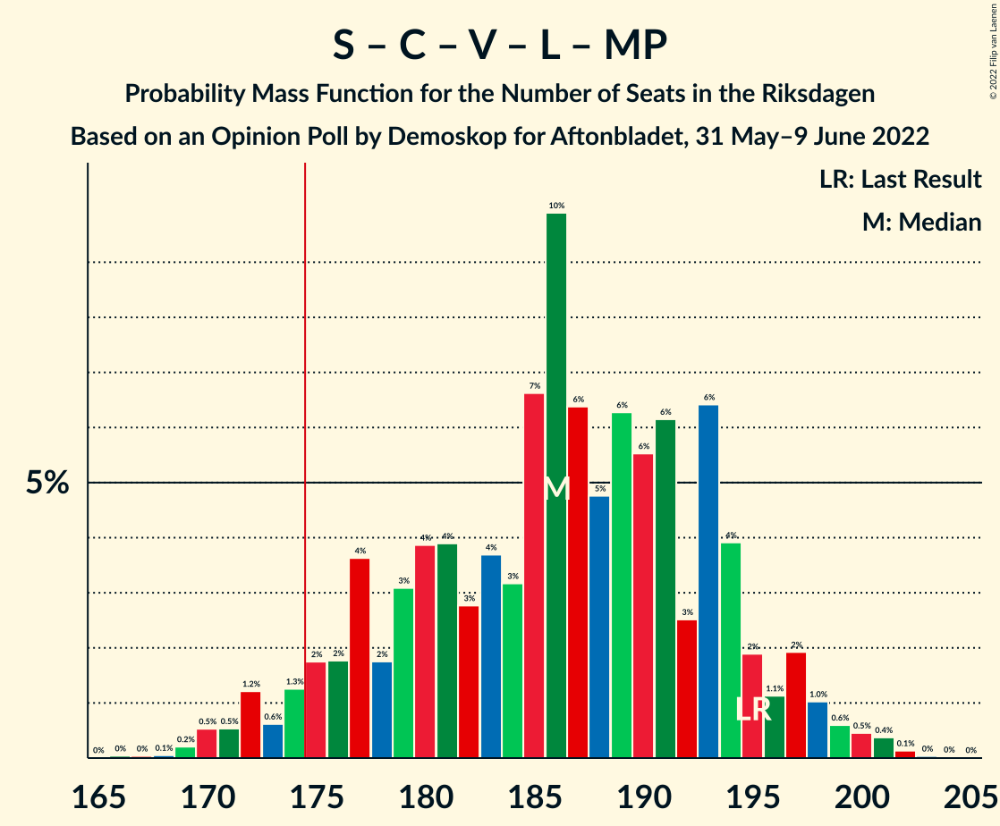

# Opinion Poll by Demoskop for Aftonbladet, 31 May–9 June 2022

<a href="#voting-intentions">Voting Intentions</a> | <a href="#seats">Seats</a> | <a href="#coalitions">Coalitions</a> | <a href="#technical-information">Technical Information</a>

## Voting Intentions

### Confidence Intervals

| Party | Last Result | Poll Result | 80% Confidence Interval | 90% Confidence Interval | 95% Confidence Interval | 99% Confidence Interval |
|:-----:|:-----------:|:-----------:|:-----------------------:|:-----------------------:|:-----------------------:|:-----------------------:|
| Sveriges socialdemokratiska arbetareparti | 28.3% | 30.9% | 29.6–32.2% |29.3–32.6% |29.0–32.9% |28.4–33.6% |
| Moderata samlingspartiet | 19.8% | 22.1% | 21.0–23.3% |20.7–23.6% |20.4–23.9% |19.9–24.5% |
| Sverigedemokraterna | 17.5% | 16.9% | 15.9–18.0% |15.6–18.3% |15.3–18.5% |14.9–19.1% |
| Centerpartiet | 8.6% | 7.7% | 7.0–8.5% |6.8–8.7% |6.6–8.9% |6.3–9.3% |
| Vänsterpartiet | 8.0% | 7.6% | 6.9–8.4% |6.7–8.6% |6.5–8.8% |6.2–9.2% |
| Kristdemokraterna | 6.3% | 5.7% | 5.1–6.4% |4.9–6.6% |4.8–6.8% |4.5–7.1% |
| Liberalerna | 5.5% | 4.2% | 3.7–4.8% |3.5–5.0% |3.4–5.1% |3.2–5.4% |
| Miljöpartiet de gröna | 4.4% | 3.9% | 3.4–4.5% |3.3–4.7% |3.2–4.8% |2.9–5.1% |

*Note:* The poll result column reflects the actual value used in the calculations. Published results may vary slightly, and in addition be rounded to fewer digits.

## Seats

### Confidence Intervals

| Party | Last Result | Median | 80% Confidence Interval | 90% Confidence Interval | 95% Confidence Interval | 99% Confidence Interval |
|:-----:|:-----------:|:------:|:-----------------------:|:-----------------------:|:-----------------------:|:-----------------------:|
| <a href="#sveriges-socialdemokratiska-arbetareparti">Sveriges socialdemokratiska arbetareparti</a> | 100 | 113 | 106–119 |104–121 |103–123 |101–127 |
| <a href="#moderata-samlingspartiet">Moderata samlingspartiet</a> | 70 | 80 | 75–86 |73–87 |73–90 |71–92 |
| <a href="#sverigedemokraterna">Sverigedemokraterna</a> | 62 | 61 | 57–66 |56–68 |55–69 |53–71 |
| <a href="#centerpartiet">Centerpartiet</a> | 31 | 28 | 25–31 |25–32 |24–33 |23–35 |
| <a href="#vänsterpartiet">Vänsterpartiet</a> | 28 | 28 | 25–31 |24–32 |23–32 |23–34 |
| <a href="#kristdemokraterna">Kristdemokraterna</a> | 22 | 21 | 18–24 |18–24 |17–25 |16–26 |
| <a href="#liberalerna">Liberalerna</a> | 20 | 15 | 0–17 |0–18 |0–19 |0–20 |
| <a href="#miljöpartiet-de-gröna">Miljöpartiet de gröna</a> | 16 | 0 | 0–16 |0–16 |0–17 |0–18 |

### Sveriges socialdemokratiska arbetareparti

*For a full overview of the results for this party, see the [Sveriges socialdemokratiska arbetareparti](party-sverigessocialdemokratiskaarbetareparti.html) page.*

| Number of Seats | Probability | Accumulated | Special Marks |
|:---------------:|:-----------:|:-----------:|:-------------:|
| 98 | 0.1% | 100% |  |
| 99 | 0.1% | 99.9% |  |
| 100 | 0.3% | 99.8% | Last Result |
| 101 | 0.9% | 99.6% |  |
| 102 | 0.6% | 98.6% |  |
| 103 | 2% | 98% |  |
| 104 | 2% | 96% |  |
| 105 | 1.3% | 94% |  |
| 106 | 5% | 93% |  |
| 107 | 4% | 88% |  |
| 108 | 8% | 84% |  |
| 109 | 8% | 76% |  |
| 110 | 5% | 68% |  |
| 111 | 7% | 63% |  |
| 112 | 7% | 57% |  |
| 113 | 4% | 50% | Median |
| 114 | 10% | 46% |  |
| 115 | 8% | 36% |  |
| 116 | 5% | 28% |  |
| 117 | 7% | 23% |  |
| 118 | 3% | 15% |  |
| 119 | 4% | 12% |  |
| 120 | 3% | 8% |  |
| 121 | 2% | 5% |  |
| 122 | 0.8% | 3% |  |
| 123 | 0.8% | 3% |  |
| 124 | 0.5% | 2% |  |
| 125 | 0.2% | 1.3% |  |
| 126 | 0.3% | 1.1% |  |
| 127 | 0.6% | 0.8% |  |
| 128 | 0.1% | 0.2% |  |
| 129 | 0.1% | 0.1% |  |
| 130 | 0% | 0% |  |

### Moderata samlingspartiet

*For a full overview of the results for this party, see the [Moderata samlingspartiet](party-moderatasamlingspartiet.html) page.*

| Number of Seats | Probability | Accumulated | Special Marks |
|:---------------:|:-----------:|:-----------:|:-------------:|
| 68 | 0.1% | 100% |  |
| 69 | 0.1% | 99.9% |  |
| 70 | 0.1% | 99.8% | Last Result |
| 71 | 0.5% | 99.6% |  |
| 72 | 0.6% | 99.1% |  |
| 73 | 4% | 98.5% |  |
| 74 | 2% | 95% |  |
| 75 | 3% | 93% |  |
| 76 | 4% | 90% |  |
| 77 | 7% | 85% |  |
| 78 | 8% | 78% |  |
| 79 | 12% | 70% |  |
| 80 | 12% | 59% | Median |
| 81 | 6% | 46% |  |
| 82 | 9% | 40% |  |
| 83 | 8% | 31% |  |
| 84 | 6% | 23% |  |
| 85 | 6% | 17% |  |
| 86 | 4% | 11% |  |
| 87 | 3% | 8% |  |
| 88 | 1.1% | 5% |  |
| 89 | 0.7% | 4% |  |
| 90 | 2% | 3% |  |
| 91 | 0.6% | 1.2% |  |
| 92 | 0.5% | 0.7% |  |
| 93 | 0.1% | 0.2% |  |
| 94 | 0.1% | 0.1% |  |
| 95 | 0% | 0.1% |  |
| 96 | 0% | 0% |  |

### Sverigedemokraterna

*For a full overview of the results for this party, see the [Sverigedemokraterna](party-sverigedemokraterna.html) page.*

| Number of Seats | Probability | Accumulated | Special Marks |
|:---------------:|:-----------:|:-----------:|:-------------:|
| 51 | 0.1% | 100% |  |
| 52 | 0.1% | 99.9% |  |
| 53 | 0.2% | 99.7% |  |
| 54 | 1.1% | 99.5% |  |
| 55 | 3% | 98% |  |
| 56 | 3% | 95% |  |
| 57 | 8% | 92% |  |
| 58 | 8% | 84% |  |
| 59 | 9% | 77% |  |
| 60 | 9% | 68% |  |
| 61 | 12% | 59% | Median |
| 62 | 14% | 47% | Last Result |
| 63 | 6% | 33% |  |
| 64 | 7% | 27% |  |
| 65 | 5% | 20% |  |
| 66 | 6% | 14% |  |
| 67 | 3% | 8% |  |
| 68 | 2% | 5% |  |
| 69 | 2% | 4% |  |
| 70 | 1.4% | 2% |  |
| 71 | 0.6% | 1.0% |  |
| 72 | 0.3% | 0.4% |  |
| 73 | 0.1% | 0.1% |  |
| 74 | 0% | 0.1% |  |
| 75 | 0% | 0% |  |

### Centerpartiet

*For a full overview of the results for this party, see the [Centerpartiet](party-centerpartiet.html) page.*

| Number of Seats | Probability | Accumulated | Special Marks |
|:---------------:|:-----------:|:-----------:|:-------------:|
| 21 | 0.1% | 100% |  |
| 22 | 0.3% | 99.9% |  |
| 23 | 0.9% | 99.6% |  |
| 24 | 3% | 98.7% |  |
| 25 | 7% | 96% |  |
| 26 | 8% | 88% |  |
| 27 | 23% | 80% |  |
| 28 | 17% | 56% | Median |
| 29 | 14% | 39% |  |
| 30 | 10% | 26% |  |
| 31 | 7% | 16% | Last Result |
| 32 | 5% | 9% |  |
| 33 | 3% | 4% |  |
| 34 | 0.6% | 1.3% |  |
| 35 | 0.6% | 0.7% |  |
| 36 | 0.1% | 0.1% |  |
| 37 | 0% | 0% |  |

### Vänsterpartiet

*For a full overview of the results for this party, see the [Vänsterpartiet](party-vänsterpartiet.html) page.*

| Number of Seats | Probability | Accumulated | Special Marks |
|:---------------:|:-----------:|:-----------:|:-------------:|
| 21 | 0.1% | 100% |  |
| 22 | 0.4% | 99.9% |  |
| 23 | 2% | 99.5% |  |
| 24 | 4% | 97% |  |
| 25 | 9% | 93% |  |
| 26 | 20% | 84% |  |
| 27 | 12% | 64% |  |
| 28 | 17% | 52% | Last Result, Median |
| 29 | 15% | 35% |  |
| 30 | 10% | 21% |  |
| 31 | 5% | 11% |  |
| 32 | 4% | 6% |  |
| 33 | 2% | 2% |  |
| 34 | 0.5% | 0.7% |  |
| 35 | 0.2% | 0.2% |  |
| 36 | 0.1% | 0.1% |  |
| 37 | 0% | 0% |  |

### Kristdemokraterna

*For a full overview of the results for this party, see the [Kristdemokraterna](party-kristdemokraterna.html) page.*

| Number of Seats | Probability | Accumulated | Special Marks |
|:---------------:|:-----------:|:-----------:|:-------------:|
| 15 | 0.1% | 100% |  |
| 16 | 0.8% | 99.8% |  |
| 17 | 2% | 99.0% |  |
| 18 | 9% | 97% |  |
| 19 | 11% | 87% |  |
| 20 | 22% | 77% |  |
| 21 | 14% | 55% | Median |
| 22 | 22% | 41% | Last Result |
| 23 | 8% | 19% |  |
| 24 | 7% | 11% |  |
| 25 | 3% | 4% |  |
| 26 | 0.8% | 1.2% |  |
| 27 | 0.3% | 0.3% |  |
| 28 | 0% | 0.1% |  |
| 29 | 0% | 0% |  |

### Liberalerna

*For a full overview of the results for this party, see the [Liberalerna](party-liberalerna.html) page.*

| Number of Seats | Probability | Accumulated | Special Marks |
|:---------------:|:-----------:|:-----------:|:-------------:|
| 0 | 33% | 100% |  |
| 1 | 0% | 67% |  |
| 2 | 0% | 67% |  |
| 3 | 0% | 67% |  |
| 4 | 0% | 67% |  |
| 5 | 0% | 67% |  |
| 6 | 0% | 67% |  |
| 7 | 0% | 67% |  |
| 8 | 0% | 67% |  |
| 9 | 0% | 67% |  |
| 10 | 0% | 67% |  |
| 11 | 0% | 67% |  |
| 12 | 0% | 67% |  |
| 13 | 0% | 67% |  |
| 14 | 2% | 67% |  |
| 15 | 23% | 66% | Median |
| 16 | 24% | 43% |  |
| 17 | 12% | 19% |  |
| 18 | 5% | 8% |  |
| 19 | 2% | 3% |  |
| 20 | 0.4% | 0.6% | Last Result |
| 21 | 0.2% | 0.2% |  |
| 22 | 0% | 0% |  |

### Miljöpartiet de gröna

*For a full overview of the results for this party, see the [Miljöpartiet de gröna](party-miljöpartietdegröna.html) page.*

| Number of Seats | Probability | Accumulated | Special Marks |
|:---------------:|:-----------:|:-----------:|:-------------:|
| 0 | 54% | 100% | Median |
| 1 | 0% | 46% |  |
| 2 | 0% | 46% |  |
| 3 | 0% | 46% |  |
| 4 | 0% | 46% |  |
| 5 | 0% | 46% |  |
| 6 | 0% | 46% |  |
| 7 | 0% | 46% |  |
| 8 | 0% | 46% |  |
| 9 | 0% | 46% |  |
| 10 | 0% | 46% |  |
| 11 | 0% | 46% |  |
| 12 | 0% | 46% |  |
| 13 | 0% | 46% |  |
| 14 | 10% | 46% |  |
| 15 | 22% | 36% |  |
| 16 | 10% | 14% | Last Result |
| 17 | 3% | 5% |  |
| 18 | 1.1% | 1.4% |  |
| 19 | 0.3% | 0.3% |  |
| 20 | 0% | 0.1% |  |
| 21 | 0% | 0% |  |

## Coalitions

### Confidence Intervals

| Coalition | Last Result | Median | Majority? | 80% Confidence Interval | 90% Confidence Interval | 95% Confidence Interval | 99% Confidence Interval |
|:---------:|:-----------:|:------:|:---------:|:-----------------------:|:-----------------------:|:-----------------------:|:-----------------------:|
| Sveriges socialdemokratiska arbetareparti – Moderata samlingspartiet – Centerpartiet | 201 | 221 | 100% | 210–232 | 209–235 | 207–237 | 205–241 |
| Sveriges socialdemokratiska arbetareparti – Moderata samlingspartiet | 170 | 193 | 99.9% | 184–203 | 181–205 | 180–208 | 177–212 |
| Sveriges socialdemokratiska arbetareparti – Centerpartiet – Vänsterpartiet – Liberalerna – Miljöpartiet de gröna | 195 | 186 | 95% | 177–194 | 175–196 | 172–198 | 170–201 |
| Moderata samlingspartiet – Sverigedemokraterna – Kristdemokraterna | 154 | 163 | 5% | 155–172 | 153–174 | 151–177 | 148–179 |
| Sveriges socialdemokratiska arbetareparti – Centerpartiet – Liberalerna – Miljöpartiet de gröna | 167 | 159 | 0.3% | 148–167 | 146–170 | 144–171 | 140–174 |
| Sveriges socialdemokratiska arbetareparti – Vänsterpartiet – Miljöpartiet de gröna | 144 | 147 | 0% | 138–157 | 137–159 | 135–161 | 131–164 |
| Moderata samlingspartiet – Sverigedemokraterna | 132 | 142 | 0% | 135–150 | 133–153 | 131–155 | 129–156 |
| Sveriges socialdemokratiska arbetareparti – Vänsterpartiet | 128 | 140 | 0% | 133–147 | 131–150 | 130–152 | 127–156 |
| Moderata samlingspartiet – Centerpartiet – Kristdemokraterna – Liberalerna | 143 | 142 | 0% | 130–150 | 128–151 | 127–152 | 123–155 |
| Moderata samlingspartiet – Centerpartiet – Kristdemokraterna | 123 | 129 | 0% | 122–137 | 121–139 | 120–141 | 118–145 |
| Sveriges socialdemokratiska arbetareparti – Miljöpartiet de gröna | 116 | 119 | 0% | 111–129 | 109–131 | 107–132 | 105–135 |
| Moderata samlingspartiet – Centerpartiet – Liberalerna | 121 | 121 | 0% | 108–128 | 108–129 | 106–131 | 102–134 |
| Moderata samlingspartiet – Centerpartiet | 101 | 108 | 0% | 102–116 | 101–117 | 100–119 | 97–122 |

### Sveriges socialdemokratiska arbetareparti – Moderata samlingspartiet – Centerpartiet

| Number of Seats | Probability | Accumulated | Special Marks |
|:---------------:|:-----------:|:-----------:|:-------------:|
| 201 | 0% | 100% | Last Result |
| 202 | 0% | 100% |  |
| 203 | 0.2% | 99.9% |  |
| 204 | 0.2% | 99.7% |  |
| 205 | 0.4% | 99.5% |  |
| 206 | 0.6% | 99.1% |  |
| 207 | 1.3% | 98% |  |
| 208 | 2% | 97% |  |
| 209 | 1.4% | 95% |  |
| 210 | 4% | 94% |  |
| 211 | 4% | 90% |  |
| 212 | 2% | 86% |  |
| 213 | 3% | 84% |  |
| 214 | 3% | 81% |  |
| 215 | 6% | 79% |  |
| 216 | 4% | 73% |  |
| 217 | 3% | 69% |  |
| 218 | 5% | 66% |  |
| 219 | 4% | 62% |  |
| 220 | 3% | 57% |  |
| 221 | 4% | 54% | Median |
| 222 | 5% | 50% |  |
| 223 | 5% | 45% |  |
| 224 | 5% | 40% |  |
| 225 | 3% | 35% |  |
| 226 | 9% | 32% |  |
| 227 | 3% | 24% |  |
| 228 | 3% | 20% |  |
| 229 | 2% | 17% |  |
| 230 | 3% | 15% |  |
| 231 | 1.1% | 13% |  |
| 232 | 3% | 12% |  |
| 233 | 1.1% | 8% |  |
| 234 | 2% | 7% |  |
| 235 | 0.8% | 5% |  |
| 236 | 1.2% | 4% |  |
| 237 | 0.7% | 3% |  |
| 238 | 0.8% | 2% |  |
| 239 | 0.6% | 2% |  |
| 240 | 0.4% | 0.9% |  |
| 241 | 0.3% | 0.5% |  |
| 242 | 0.1% | 0.2% |  |
| 243 | 0.1% | 0.1% |  |
| 244 | 0% | 0% |  |

### Sveriges socialdemokratiska arbetareparti – Moderata samlingspartiet

| Number of Seats | Probability | Accumulated | Special Marks |
|:---------------:|:-----------:|:-----------:|:-------------:|
| 170 | 0% | 100% | Last Result |
| 171 | 0% | 100% |  |
| 172 | 0% | 100% |  |
| 173 | 0% | 100% |  |
| 174 | 0% | 100% |  |
| 175 | 0.1% | 99.9% | Majority |
| 176 | 0.2% | 99.8% |  |
| 177 | 0.2% | 99.6% |  |
| 178 | 0.3% | 99.5% |  |
| 179 | 0.5% | 99.2% |  |
| 180 | 2% | 98.7% |  |
| 181 | 2% | 96% |  |
| 182 | 1.3% | 94% |  |
| 183 | 2% | 92% |  |
| 184 | 4% | 91% |  |
| 185 | 3% | 87% |  |
| 186 | 2% | 84% |  |
| 187 | 4% | 81% |  |
| 188 | 8% | 78% |  |
| 189 | 5% | 70% |  |
| 190 | 2% | 65% |  |
| 191 | 5% | 63% |  |
| 192 | 6% | 57% |  |
| 193 | 3% | 52% | Median |
| 194 | 8% | 49% |  |
| 195 | 3% | 41% |  |
| 196 | 5% | 38% |  |
| 197 | 3% | 33% |  |
| 198 | 5% | 30% |  |
| 199 | 7% | 24% |  |
| 200 | 3% | 17% |  |
| 201 | 3% | 15% |  |
| 202 | 2% | 12% |  |
| 203 | 2% | 10% |  |
| 204 | 2% | 8% |  |
| 205 | 0.8% | 6% |  |
| 206 | 1.1% | 5% |  |
| 207 | 0.6% | 4% |  |
| 208 | 2% | 3% |  |
| 209 | 0.4% | 1.3% |  |
| 210 | 0.3% | 0.9% |  |
| 211 | 0.1% | 0.6% |  |
| 212 | 0.2% | 0.5% |  |
| 213 | 0.1% | 0.3% |  |
| 214 | 0.2% | 0.3% |  |
| 215 | 0% | 0% |  |

### Sveriges socialdemokratiska arbetareparti – Centerpartiet – Vänsterpartiet – Liberalerna – Miljöpartiet de gröna

| Number of Seats | Probability | Accumulated | Special Marks |
|:---------------:|:-----------:|:-----------:|:-------------:|
| 166 | 0% | 100% |  |
| 167 | 0% | 99.9% |  |
| 168 | 0.1% | 99.9% |  |
| 169 | 0.2% | 99.8% |  |
| 170 | 0.5% | 99.6% |  |
| 171 | 0.5% | 99.1% |  |
| 172 | 1.2% | 98.6% |  |
| 173 | 0.6% | 97% |  |
| 174 | 1.3% | 97% |  |
| 175 | 2% | 95% | Majority |
| 176 | 2% | 94% |  |
| 177 | 4% | 92% |  |
| 178 | 2% | 88% |  |
| 179 | 3% | 87% |  |
| 180 | 4% | 83% |  |
| 181 | 4% | 80% |  |
| 182 | 3% | 76% |  |
| 183 | 4% | 73% |  |
| 184 | 3% | 69% | Median |
| 185 | 7% | 66% |  |
| 186 | 10% | 59% |  |
| 187 | 6% | 50% |  |
| 188 | 5% | 43% |  |
| 189 | 6% | 38% |  |
| 190 | 6% | 32% |  |
| 191 | 6% | 27% |  |
| 192 | 3% | 20% |  |
| 193 | 6% | 18% |  |
| 194 | 4% | 12% |  |
| 195 | 2% | 8% | Last Result |
| 196 | 1.1% | 6% |  |
| 197 | 2% | 5% |  |
| 198 | 1.0% | 3% |  |
| 199 | 0.6% | 2% |  |
| 200 | 0.5% | 1.0% |  |
| 201 | 0.4% | 0.6% |  |
| 202 | 0.1% | 0.2% |  |
| 203 | 0% | 0.1% |  |
| 204 | 0% | 0% |  |

### Moderata samlingspartiet – Sverigedemokraterna – Kristdemokraterna

| Number of Seats | Probability | Accumulated | Special Marks |
|:---------------:|:-----------:|:-----------:|:-------------:|
| 146 | 0% | 100% |  |
| 147 | 0.1% | 99.9% |  |
| 148 | 0.4% | 99.8% |  |
| 149 | 0.5% | 99.4% |  |
| 150 | 0.6% | 99.0% |  |
| 151 | 1.0% | 98% |  |
| 152 | 2% | 97% |  |
| 153 | 1.1% | 95% |  |
| 154 | 2% | 94% | Last Result |
| 155 | 4% | 92% |  |
| 156 | 6% | 88% |  |
| 157 | 3% | 82% |  |
| 158 | 6% | 80% |  |
| 159 | 6% | 73% |  |
| 160 | 6% | 68% |  |
| 161 | 5% | 62% |  |
| 162 | 6% | 57% | Median |
| 163 | 10% | 50% |  |
| 164 | 7% | 41% |  |
| 165 | 3% | 34% |  |
| 166 | 4% | 31% |  |
| 167 | 3% | 27% |  |
| 168 | 4% | 24% |  |
| 169 | 4% | 20% |  |
| 170 | 3% | 17% |  |
| 171 | 2% | 13% |  |
| 172 | 4% | 12% |  |
| 173 | 2% | 8% |  |
| 174 | 2% | 6% |  |
| 175 | 1.3% | 5% | Majority |
| 176 | 0.6% | 3% |  |
| 177 | 1.2% | 3% |  |
| 178 | 0.5% | 1.4% |  |
| 179 | 0.5% | 0.9% |  |
| 180 | 0.2% | 0.4% |  |
| 181 | 0.1% | 0.2% |  |
| 182 | 0% | 0.1% |  |
| 183 | 0% | 0.1% |  |
| 184 | 0% | 0% |  |

### Sveriges socialdemokratiska arbetareparti – Centerpartiet – Liberalerna – Miljöpartiet de gröna

| Number of Seats | Probability | Accumulated | Special Marks |
|:---------------:|:-----------:|:-----------:|:-------------:|
| 138 | 0.1% | 100% |  |
| 139 | 0.3% | 99.9% |  |
| 140 | 0.5% | 99.6% |  |
| 141 | 0.4% | 99.1% |  |
| 142 | 0.4% | 98.7% |  |
| 143 | 0.5% | 98% |  |
| 144 | 0.8% | 98% |  |
| 145 | 1.3% | 97% |  |
| 146 | 2% | 96% |  |
| 147 | 3% | 94% |  |
| 148 | 2% | 91% |  |
| 149 | 2% | 89% |  |
| 150 | 3% | 87% |  |
| 151 | 2% | 85% |  |
| 152 | 3% | 82% |  |
| 153 | 2% | 79% |  |
| 154 | 3% | 77% |  |
| 155 | 4% | 74% |  |
| 156 | 3% | 70% | Median |
| 157 | 7% | 67% |  |
| 158 | 7% | 60% |  |
| 159 | 8% | 54% |  |
| 160 | 7% | 46% |  |
| 161 | 5% | 39% |  |
| 162 | 3% | 34% |  |
| 163 | 5% | 31% |  |
| 164 | 4% | 25% |  |
| 165 | 3% | 21% |  |
| 166 | 3% | 17% |  |
| 167 | 6% | 14% | Last Result |
| 168 | 1.5% | 8% |  |
| 169 | 1.1% | 7% |  |
| 170 | 2% | 6% |  |
| 171 | 2% | 4% |  |
| 172 | 0.4% | 2% |  |
| 173 | 0.5% | 1.2% |  |
| 174 | 0.4% | 0.7% |  |
| 175 | 0.1% | 0.3% | Majority |
| 176 | 0.1% | 0.2% |  |
| 177 | 0% | 0.1% |  |
| 178 | 0% | 0% |  |

### Sveriges socialdemokratiska arbetareparti – Vänsterpartiet – Miljöpartiet de gröna

| Number of Seats | Probability | Accumulated | Special Marks |
|:---------------:|:-----------:|:-----------:|:-------------:|
| 130 | 0.1% | 100% |  |
| 131 | 0.5% | 99.9% |  |
| 132 | 0.2% | 99.4% |  |
| 133 | 0.5% | 99.2% |  |
| 134 | 1.2% | 98.8% |  |
| 135 | 1.2% | 98% |  |
| 136 | 1.3% | 96% |  |
| 137 | 2% | 95% |  |
| 138 | 4% | 93% |  |
| 139 | 4% | 90% |  |
| 140 | 3% | 86% |  |
| 141 | 4% | 83% | Median |
| 142 | 3% | 79% |  |
| 143 | 7% | 76% |  |
| 144 | 6% | 69% | Last Result |
| 145 | 4% | 63% |  |
| 146 | 5% | 59% |  |
| 147 | 7% | 55% |  |
| 148 | 7% | 48% |  |
| 149 | 4% | 41% |  |
| 150 | 9% | 37% |  |
| 151 | 4% | 29% |  |
| 152 | 3% | 25% |  |
| 153 | 4% | 22% |  |
| 154 | 3% | 17% |  |
| 155 | 2% | 15% |  |
| 156 | 2% | 12% |  |
| 157 | 1.0% | 11% |  |
| 158 | 4% | 10% |  |
| 159 | 0.9% | 5% |  |
| 160 | 0.9% | 5% |  |
| 161 | 2% | 4% |  |
| 162 | 0.9% | 2% |  |
| 163 | 0.2% | 0.7% |  |
| 164 | 0.2% | 0.5% |  |
| 165 | 0.2% | 0.3% |  |
| 166 | 0% | 0.1% |  |
| 167 | 0% | 0.1% |  |
| 168 | 0% | 0% |  |

### Moderata samlingspartiet – Sverigedemokraterna

| Number of Seats | Probability | Accumulated | Special Marks |
|:---------------:|:-----------:|:-----------:|:-------------:|
| 126 | 0% | 100% |  |
| 127 | 0.1% | 99.9% |  |
| 128 | 0.3% | 99.9% |  |
| 129 | 0.6% | 99.6% |  |
| 130 | 0.6% | 99.0% |  |
| 131 | 2% | 98% |  |
| 132 | 0.6% | 97% | Last Result |
| 133 | 1.3% | 96% |  |
| 134 | 2% | 95% |  |
| 135 | 5% | 92% |  |
| 136 | 9% | 88% |  |
| 137 | 4% | 79% |  |
| 138 | 7% | 75% |  |
| 139 | 5% | 68% |  |
| 140 | 3% | 63% |  |
| 141 | 9% | 59% | Median |
| 142 | 7% | 51% |  |
| 143 | 6% | 44% |  |
| 144 | 9% | 38% |  |
| 145 | 4% | 29% |  |
| 146 | 3% | 25% |  |
| 147 | 4% | 22% |  |
| 148 | 3% | 18% |  |
| 149 | 4% | 15% |  |
| 150 | 2% | 11% |  |
| 151 | 2% | 9% |  |
| 152 | 2% | 7% |  |
| 153 | 0.7% | 5% |  |
| 154 | 1.0% | 5% |  |
| 155 | 3% | 4% |  |
| 156 | 0.7% | 1.0% |  |
| 157 | 0.1% | 0.3% |  |
| 158 | 0.1% | 0.2% |  |
| 159 | 0% | 0.1% |  |
| 160 | 0% | 0.1% |  |
| 161 | 0% | 0.1% |  |
| 162 | 0% | 0% |  |

### Sveriges socialdemokratiska arbetareparti – Vänsterpartiet

| Number of Seats | Probability | Accumulated | Special Marks |
|:---------------:|:-----------:|:-----------:|:-------------:|
| 123 | 0% | 100% |  |
| 124 | 0% | 99.9% |  |
| 125 | 0.1% | 99.9% |  |
| 126 | 0.2% | 99.8% |  |
| 127 | 0.6% | 99.6% |  |
| 128 | 0.6% | 99.1% | Last Result |
| 129 | 0.5% | 98% |  |
| 130 | 2% | 98% |  |
| 131 | 2% | 96% |  |
| 132 | 2% | 94% |  |
| 133 | 4% | 92% |  |
| 134 | 5% | 87% |  |
| 135 | 7% | 82% |  |
| 136 | 7% | 75% |  |
| 137 | 3% | 68% |  |
| 138 | 7% | 66% |  |
| 139 | 7% | 59% |  |
| 140 | 5% | 52% |  |
| 141 | 5% | 48% | Median |
| 142 | 4% | 43% |  |
| 143 | 10% | 39% |  |
| 144 | 6% | 29% |  |
| 145 | 4% | 23% |  |
| 146 | 4% | 18% |  |
| 147 | 5% | 15% |  |
| 148 | 2% | 10% |  |
| 149 | 2% | 8% |  |
| 150 | 2% | 6% |  |
| 151 | 0.7% | 4% |  |
| 152 | 1.4% | 3% |  |
| 153 | 0.6% | 2% |  |
| 154 | 0.5% | 1.5% |  |
| 155 | 0.2% | 0.9% |  |
| 156 | 0.6% | 0.7% |  |
| 157 | 0.1% | 0.2% |  |
| 158 | 0% | 0.1% |  |
| 159 | 0% | 0.1% |  |
| 160 | 0% | 0% |  |

### Moderata samlingspartiet – Centerpartiet – Kristdemokraterna – Liberalerna

| Number of Seats | Probability | Accumulated | Special Marks |
|:---------------:|:-----------:|:-----------:|:-------------:|
| 120 | 0.1% | 100% |  |
| 121 | 0% | 99.9% |  |
| 122 | 0.3% | 99.8% |  |
| 123 | 0.1% | 99.6% |  |
| 124 | 0.2% | 99.5% |  |
| 125 | 0.7% | 99.3% |  |
| 126 | 0.7% | 98.6% |  |
| 127 | 0.8% | 98% |  |
| 128 | 3% | 97% |  |
| 129 | 1.3% | 94% |  |
| 130 | 3% | 93% |  |
| 131 | 2% | 89% |  |
| 132 | 1.3% | 87% |  |
| 133 | 3% | 86% |  |
| 134 | 3% | 82% |  |
| 135 | 3% | 80% |  |
| 136 | 6% | 76% |  |
| 137 | 5% | 71% |  |
| 138 | 3% | 66% |  |
| 139 | 5% | 63% |  |
| 140 | 5% | 58% |  |
| 141 | 3% | 53% |  |
| 142 | 8% | 50% |  |
| 143 | 5% | 42% | Last Result |
| 144 | 9% | 37% | Median |
| 145 | 3% | 28% |  |
| 146 | 7% | 25% |  |
| 147 | 4% | 18% |  |
| 148 | 1.4% | 14% |  |
| 149 | 3% | 13% |  |
| 150 | 4% | 10% |  |
| 151 | 3% | 6% |  |
| 152 | 0.9% | 3% |  |
| 153 | 0.9% | 2% |  |
| 154 | 0.8% | 2% |  |
| 155 | 0.4% | 0.8% |  |
| 156 | 0.2% | 0.3% |  |
| 157 | 0.1% | 0.1% |  |
| 158 | 0.1% | 0.1% |  |
| 159 | 0% | 0% |  |

### Moderata samlingspartiet – Centerpartiet – Kristdemokraterna

| Number of Seats | Probability | Accumulated | Special Marks |
|:---------------:|:-----------:|:-----------:|:-------------:|
| 115 | 0.1% | 100% |  |
| 116 | 0.1% | 99.9% |  |
| 117 | 0.2% | 99.7% |  |
| 118 | 0.9% | 99.5% |  |
| 119 | 0.6% | 98.6% |  |
| 120 | 3% | 98% |  |
| 121 | 3% | 95% |  |
| 122 | 2% | 92% |  |
| 123 | 3% | 90% | Last Result |
| 124 | 5% | 87% |  |
| 125 | 4% | 83% |  |
| 126 | 8% | 79% |  |
| 127 | 6% | 71% |  |
| 128 | 8% | 65% |  |
| 129 | 10% | 56% | Median |
| 130 | 5% | 47% |  |
| 131 | 8% | 41% |  |
| 132 | 2% | 33% |  |
| 133 | 6% | 30% |  |
| 134 | 6% | 25% |  |
| 135 | 3% | 18% |  |
| 136 | 4% | 15% |  |
| 137 | 3% | 11% |  |
| 138 | 2% | 8% |  |
| 139 | 2% | 6% |  |
| 140 | 0.6% | 4% |  |
| 141 | 0.7% | 3% |  |
| 142 | 1.1% | 2% |  |
| 143 | 0.1% | 1.2% |  |
| 144 | 0.5% | 1.1% |  |
| 145 | 0.4% | 0.6% |  |
| 146 | 0.1% | 0.1% |  |
| 147 | 0% | 0.1% |  |
| 148 | 0% | 0.1% |  |
| 149 | 0% | 0% |  |

### Sveriges socialdemokratiska arbetareparti – Miljöpartiet de gröna

| Number of Seats | Probability | Accumulated | Special Marks |
|:---------------:|:-----------:|:-----------:|:-------------:|
| 103 | 0.1% | 100% |  |
| 104 | 0.4% | 99.9% |  |
| 105 | 0.2% | 99.5% |  |
| 106 | 0.9% | 99.3% |  |
| 107 | 1.1% | 98% |  |
| 108 | 1.1% | 97% |  |
| 109 | 3% | 96% |  |
| 110 | 2% | 93% |  |
| 111 | 3% | 91% |  |
| 112 | 4% | 88% |  |
| 113 | 3% | 84% | Median |
| 114 | 6% | 81% |  |
| 115 | 5% | 75% |  |
| 116 | 4% | 70% | Last Result |
| 117 | 7% | 65% |  |
| 118 | 4% | 58% |  |
| 119 | 4% | 54% |  |
| 120 | 7% | 49% |  |
| 121 | 4% | 43% |  |
| 122 | 4% | 39% |  |
| 123 | 7% | 35% |  |
| 124 | 5% | 29% |  |
| 125 | 4% | 23% |  |
| 126 | 2% | 19% |  |
| 127 | 3% | 17% |  |
| 128 | 2% | 15% |  |
| 129 | 4% | 12% |  |
| 130 | 2% | 8% |  |
| 131 | 3% | 6% |  |
| 132 | 1.4% | 4% |  |
| 133 | 0.5% | 2% |  |
| 134 | 0.7% | 2% |  |
| 135 | 0.5% | 0.9% |  |
| 136 | 0.2% | 0.4% |  |
| 137 | 0.1% | 0.2% |  |
| 138 | 0.1% | 0.2% |  |
| 139 | 0% | 0.1% |  |
| 140 | 0.1% | 0.1% |  |
| 141 | 0% | 0% |  |

### Moderata samlingspartiet – Centerpartiet – Liberalerna

| Number of Seats | Probability | Accumulated | Special Marks |
|:---------------:|:-----------:|:-----------:|:-------------:|
| 100 | 0.1% | 100% |  |
| 101 | 0.1% | 99.9% |  |
| 102 | 0.3% | 99.8% |  |
| 103 | 0.3% | 99.5% |  |
| 104 | 0.4% | 99.1% |  |
| 105 | 1.1% | 98.8% |  |
| 106 | 0.7% | 98% |  |
| 107 | 1.1% | 97% |  |
| 108 | 6% | 96% |  |
| 109 | 0.5% | 90% |  |
| 110 | 3% | 89% |  |
| 111 | 4% | 87% |  |
| 112 | 0.9% | 83% |  |
| 113 | 4% | 82% |  |
| 114 | 2% | 78% |  |
| 115 | 3% | 76% |  |
| 116 | 6% | 73% |  |
| 117 | 3% | 67% |  |
| 118 | 7% | 64% |  |
| 119 | 3% | 58% |  |
| 120 | 4% | 55% |  |
| 121 | 8% | 51% | Last Result |
| 122 | 5% | 43% |  |
| 123 | 4% | 38% | Median |
| 124 | 10% | 34% |  |
| 125 | 2% | 24% |  |
| 126 | 7% | 22% |  |
| 127 | 2% | 15% |  |
| 128 | 4% | 13% |  |
| 129 | 4% | 9% |  |
| 130 | 1.2% | 5% |  |
| 131 | 2% | 4% |  |
| 132 | 1.0% | 2% |  |
| 133 | 0.4% | 1.1% |  |
| 134 | 0.4% | 0.8% |  |
| 135 | 0.2% | 0.4% |  |
| 136 | 0.1% | 0.1% |  |
| 137 | 0% | 0.1% |  |
| 138 | 0% | 0% |  |

### Moderata samlingspartiet – Centerpartiet

| Number of Seats | Probability | Accumulated | Special Marks |
|:---------------:|:-----------:|:-----------:|:-------------:|
| 95 | 0.1% | 100% |  |
| 96 | 0.2% | 99.9% |  |
| 97 | 0.4% | 99.7% |  |
| 98 | 0.6% | 99.4% |  |
| 99 | 1.0% | 98.8% |  |
| 100 | 3% | 98% |  |
| 101 | 1.4% | 95% | Last Result |
| 102 | 7% | 94% |  |
| 103 | 2% | 87% |  |
| 104 | 4% | 85% |  |
| 105 | 8% | 81% |  |
| 106 | 7% | 73% |  |
| 107 | 4% | 66% |  |
| 108 | 13% | 61% | Median |
| 109 | 7% | 48% |  |
| 110 | 6% | 42% |  |
| 111 | 8% | 36% |  |
| 112 | 5% | 27% |  |
| 113 | 5% | 22% |  |
| 114 | 4% | 17% |  |
| 115 | 2% | 13% |  |
| 116 | 5% | 10% |  |
| 117 | 1.2% | 6% |  |
| 118 | 2% | 5% |  |
| 119 | 1.0% | 3% |  |
| 120 | 0.2% | 2% |  |
| 121 | 0.8% | 1.5% |  |
| 122 | 0.3% | 0.6% |  |
| 123 | 0.1% | 0.4% |  |
| 124 | 0.2% | 0.3% |  |
| 125 | 0% | 0% |  |

## Technical Information

### Opinion Poll

+ **Polling firm:** Demoskop
+ **Commissioner(s):** Aftonbladet
+ **Fieldwork period:** 31 May–9 June 2022

### Calculations

+ **Sample size:** 2125
+ **Simulations done:** 1,048,576
+ **Error estimate:** 1.08%

