# Opinion Poll by Sifo for Svenska Dagbladet, 6–16 June 2022

<a href="#voting-intentions">Voting Intentions</a> | <a href="#seats">Seats</a> | <a href="#coalitions">Coalitions</a> | <a href="#technical-information">Technical Information</a>

## Voting Intentions

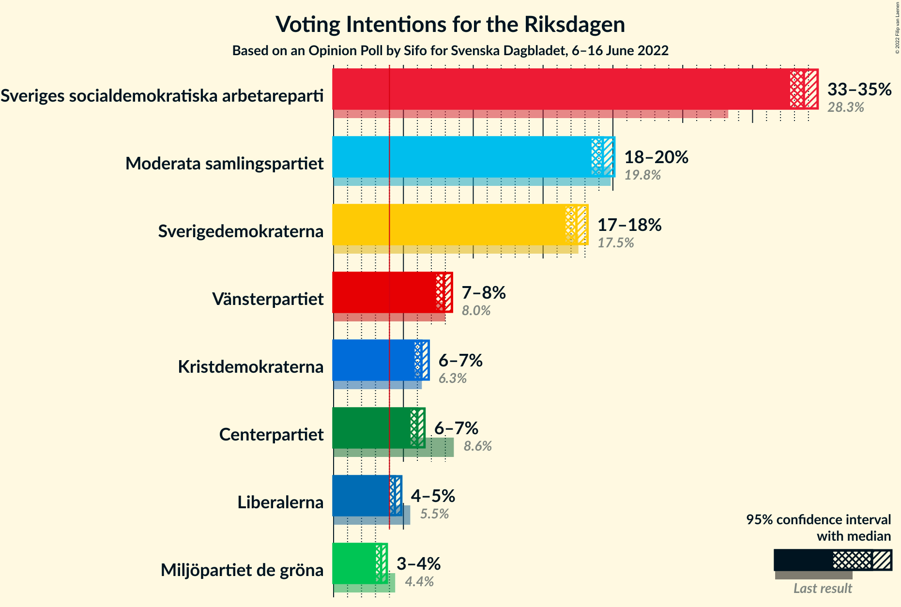

### Confidence Intervals

| Party | Last Result | Poll Result | 80% Confidence Interval | 90% Confidence Interval | 95% Confidence Interval | 99% Confidence Interval |
|:-----:|:-----------:|:-----------:|:-----------------------:|:-----------------------:|:-----------------------:|:-----------------------:|
| Sveriges socialdemokratiska arbetareparti | 28.3% | 33.7% | 33.0–34.3% |32.8–34.5% |32.7–34.7% |32.4–35.0% |
| Moderata samlingspartiet | 19.8% | 19.3% | 18.7–19.8% |18.6–20.0% |18.5–20.1% |18.2–20.4% |
| Sverigedemokraterna | 17.5% | 17.4% | 16.9–17.9% |16.7–18.1% |16.6–18.2% |16.4–18.4% |
| Vänsterpartiet | 8.0% | 7.9% | 7.5–8.3% |7.4–8.4% |7.3–8.5% |7.2–8.7% |
| Kristdemokraterna | 6.3% | 6.3% | 6.0–6.6% |5.9–6.7% |5.8–6.8% |5.7–7.0% |
| Centerpartiet | 8.6% | 6.0% | 5.7–6.3% |5.6–6.4% |5.5–6.5% |5.4–6.7% |
| Liberalerna | 5.5% | 4.4% | 4.1–4.7% |4.0–4.8% |4.0–4.8% |3.9–5.0% |
| Miljöpartiet de gröna | 4.4% | 3.4% | 3.2–3.7% |3.1–3.7% |3.0–3.8% |2.9–3.9% |

*Note:* The poll result column reflects the actual value used in the calculations. Published results may vary slightly, and in addition be rounded to fewer digits.

## Seats

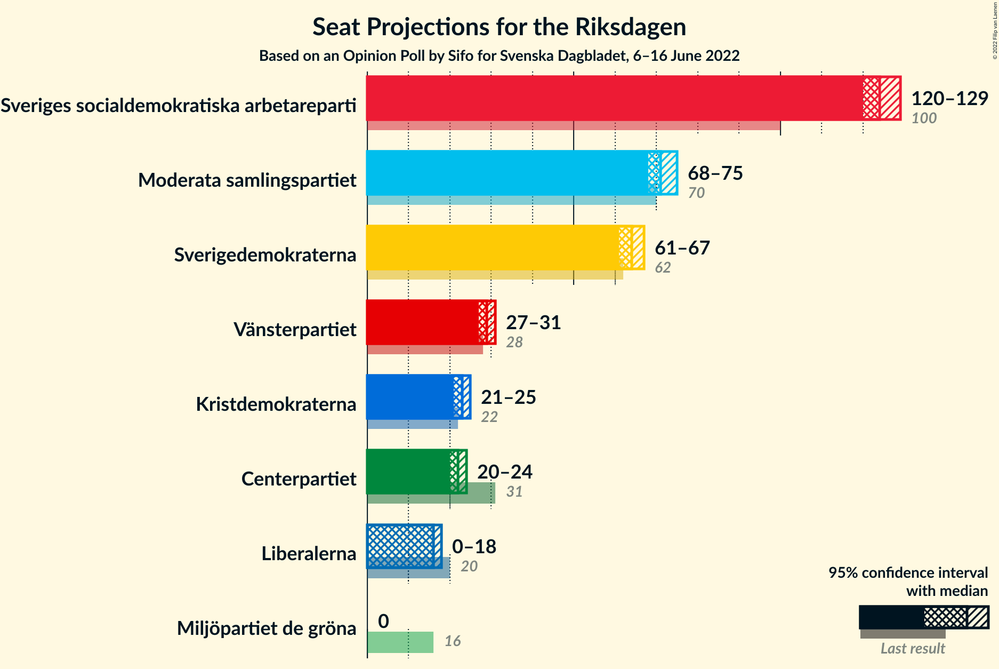

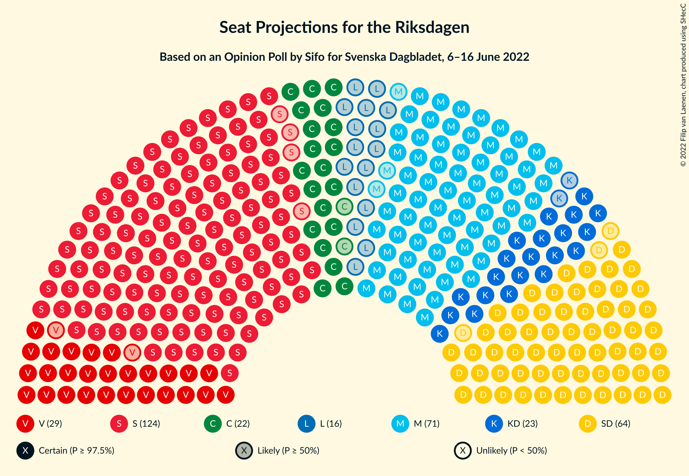

### Confidence Intervals

| Party | Last Result | Median | 80% Confidence Interval | 90% Confidence Interval | 95% Confidence Interval | 99% Confidence Interval |
|:-----:|:-----------:|:------:|:-----------------------:|:-----------------------:|:-----------------------:|:-----------------------:|
| <a href="#sveriges-socialdemokratiska-arbetareparti">Sveriges socialdemokratiska arbetareparti</a> | 100 | 124 | 121–127 |121–128 |120–129 |119–132 |
| <a href="#moderata-samlingspartiet">Moderata samlingspartiet</a> | 70 | 71 | 69–73 |68–74 |68–75 |67–76 |
| <a href="#sverigedemokraterna">Sverigedemokraterna</a> | 62 | 64 | 62–66 |62–67 |61–67 |60–69 |
| <a href="#vänsterpartiet">Vänsterpartiet</a> | 28 | 29 | 28–31 |27–31 |27–31 |26–32 |
| <a href="#kristdemokraterna">Kristdemokraterna</a> | 22 | 23 | 22–25 |22–25 |21–25 |21–26 |
| <a href="#centerpartiet">Centerpartiet</a> | 31 | 22 | 21–23 |21–24 |20–24 |20–25 |
| <a href="#liberalerna">Liberalerna</a> | 20 | 16 | 15–17 |15–18 |0–18 |0–18 |
| <a href="#miljöpartiet-de-gröna">Miljöpartiet de gröna</a> | 16 | 0 | 0 |0 |0 |0 |

### Sveriges socialdemokratiska arbetareparti

*For a full overview of the results for this party, see the [Sveriges socialdemokratiska arbetareparti](party-sverigessocialdemokratiskaarbetareparti.html) page.*

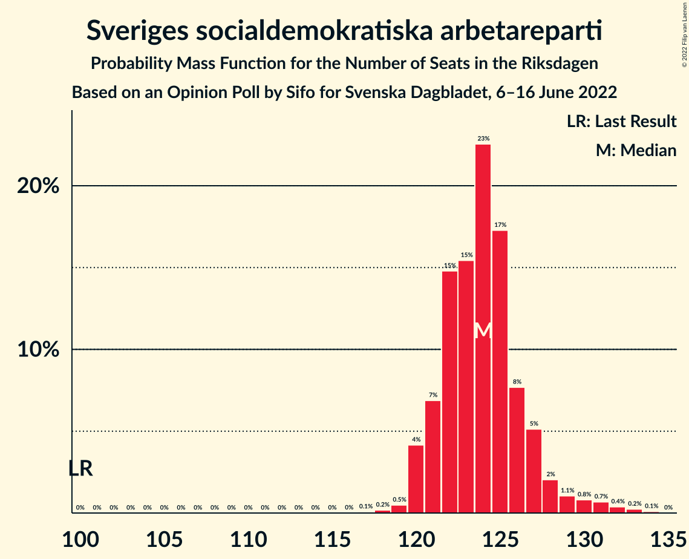

| Number of Seats | Probability | Accumulated | Special Marks |
|:---------------:|:-----------:|:-----------:|:-------------:|
| 100 | 0% | 100% | Last Result |
| 101 | 0% | 100% |  |
| 102 | 0% | 100% |  |
| 103 | 0% | 100% |  |
| 104 | 0% | 100% |  |
| 105 | 0% | 100% |  |
| 106 | 0% | 100% |  |
| 107 | 0% | 100% |  |
| 108 | 0% | 100% |  |
| 109 | 0% | 100% |  |
| 110 | 0% | 100% |  |
| 111 | 0% | 100% |  |
| 112 | 0% | 100% |  |
| 113 | 0% | 100% |  |
| 114 | 0% | 100% |  |
| 115 | 0% | 100% |  |
| 116 | 0% | 100% |  |
| 117 | 0.1% | 100% |  |
| 118 | 0.2% | 99.9% |  |
| 119 | 0.5% | 99.7% |  |
| 120 | 4% | 99.2% |  |
| 121 | 7% | 95% |  |
| 122 | 15% | 88% |  |
| 123 | 15% | 73% |  |
| 124 | 23% | 58% | Median |
| 125 | 17% | 35% |  |
| 126 | 8% | 18% |  |
| 127 | 5% | 10% |  |
| 128 | 2% | 5% |  |
| 129 | 1.1% | 3% |  |
| 130 | 0.8% | 2% |  |
| 131 | 0.7% | 1.4% |  |
| 132 | 0.4% | 0.7% |  |
| 133 | 0.2% | 0.3% |  |
| 134 | 0.1% | 0.1% |  |
| 135 | 0% | 0% |  |

### Moderata samlingspartiet

*For a full overview of the results for this party, see the [Moderata samlingspartiet](party-moderatasamlingspartiet.html) page.*

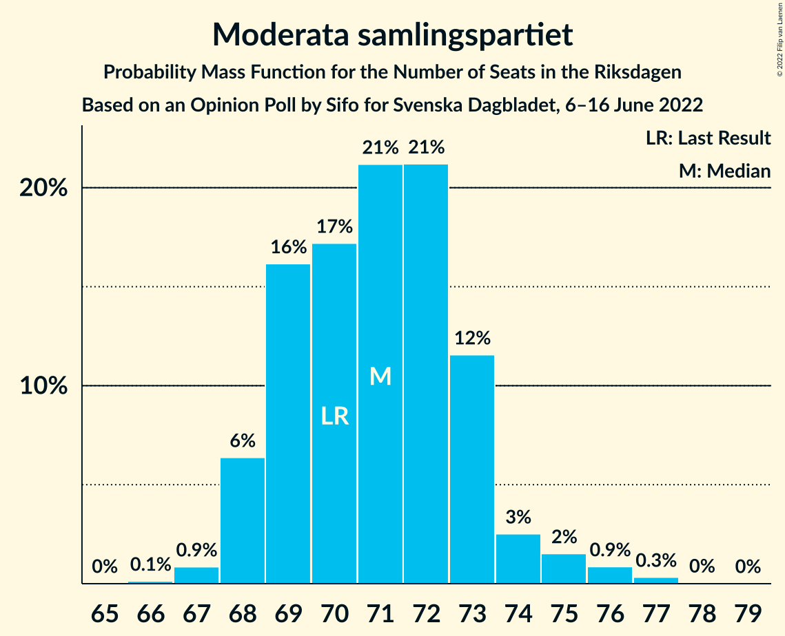

| Number of Seats | Probability | Accumulated | Special Marks |
|:---------------:|:-----------:|:-----------:|:-------------:|
| 66 | 0.1% | 100% |  |
| 67 | 0.9% | 99.8% |  |
| 68 | 6% | 99.0% |  |
| 69 | 16% | 93% |  |
| 70 | 17% | 76% | Last Result |
| 71 | 21% | 59% | Median |
| 72 | 21% | 38% |  |
| 73 | 12% | 17% |  |
| 74 | 3% | 5% |  |
| 75 | 2% | 3% |  |
| 76 | 0.9% | 1.3% |  |
| 77 | 0.3% | 0.4% |  |
| 78 | 0% | 0.1% |  |
| 79 | 0% | 0% |  |

### Sverigedemokraterna

*For a full overview of the results for this party, see the [Sverigedemokraterna](party-sverigedemokraterna.html) page.*

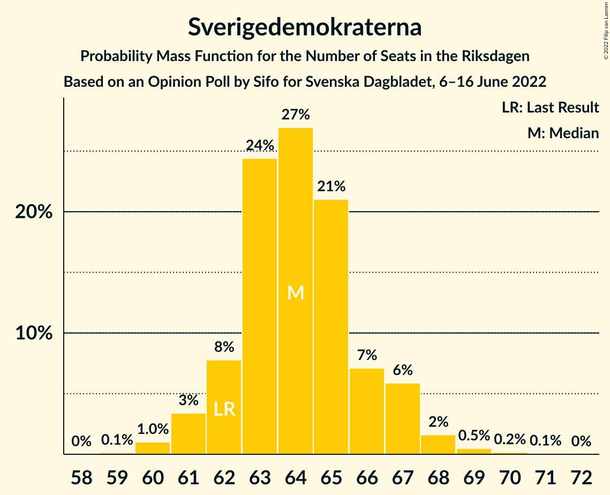

| Number of Seats | Probability | Accumulated | Special Marks |
|:---------------:|:-----------:|:-----------:|:-------------:|
| 59 | 0.1% | 100% |  |
| 60 | 1.0% | 99.9% |  |
| 61 | 3% | 98.9% |  |
| 62 | 8% | 95% | Last Result |
| 63 | 24% | 88% |  |
| 64 | 27% | 63% | Median |
| 65 | 21% | 36% |  |
| 66 | 7% | 15% |  |
| 67 | 6% | 8% |  |
| 68 | 2% | 2% |  |
| 69 | 0.5% | 0.7% |  |
| 70 | 0.2% | 0.2% |  |
| 71 | 0.1% | 0.1% |  |
| 72 | 0% | 0% |  |

### Vänsterpartiet

*For a full overview of the results for this party, see the [Vänsterpartiet](party-vänsterpartiet.html) page.*

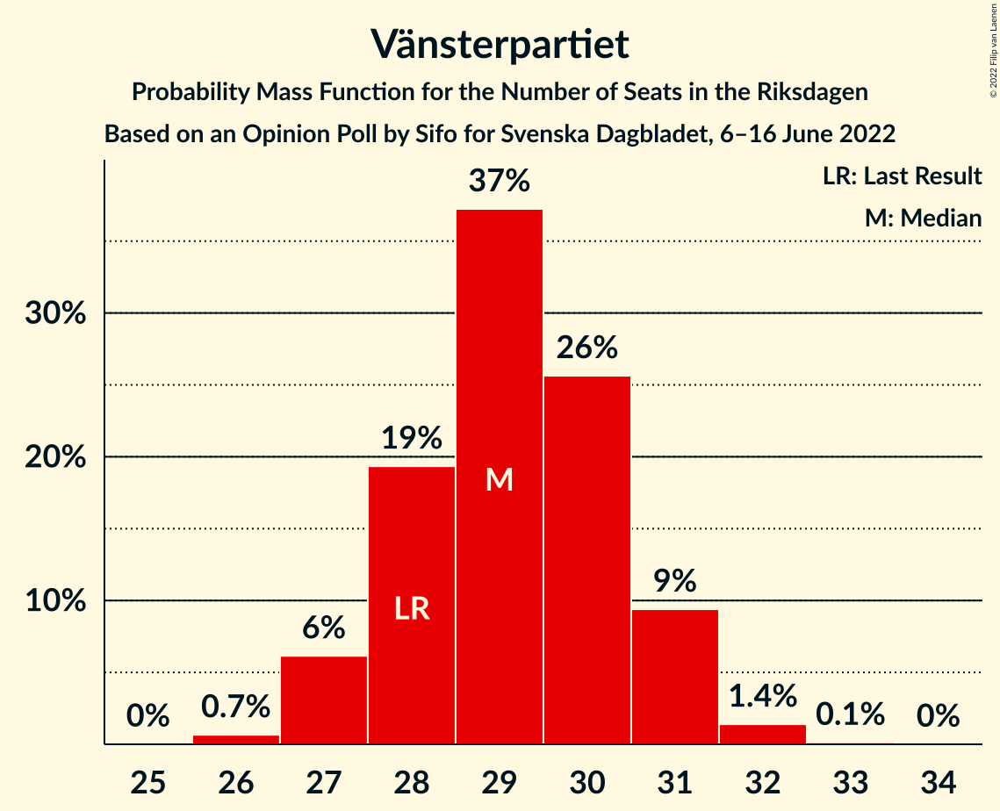

| Number of Seats | Probability | Accumulated | Special Marks |
|:---------------:|:-----------:|:-----------:|:-------------:|
| 26 | 0.7% | 100% |  |
| 27 | 6% | 99.3% |  |
| 28 | 19% | 93% | Last Result |
| 29 | 37% | 74% | Median |
| 30 | 26% | 37% |  |
| 31 | 9% | 11% |  |
| 32 | 1.4% | 2% |  |
| 33 | 0.1% | 0.1% |  |
| 34 | 0% | 0% |  |

### Kristdemokraterna

*For a full overview of the results for this party, see the [Kristdemokraterna](party-kristdemokraterna.html) page.*

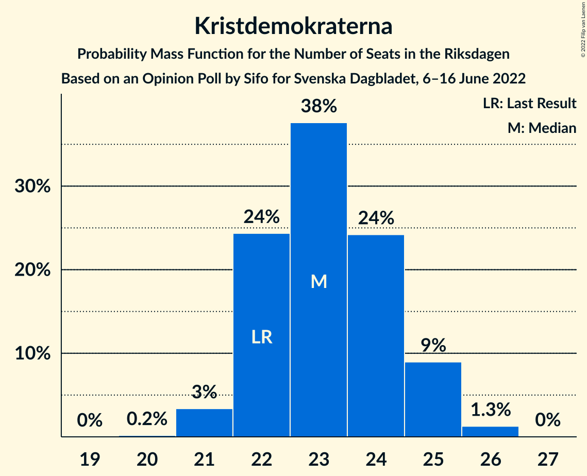

| Number of Seats | Probability | Accumulated | Special Marks |
|:---------------:|:-----------:|:-----------:|:-------------:|
| 20 | 0.2% | 100% |  |
| 21 | 3% | 99.8% |  |
| 22 | 24% | 96% | Last Result |
| 23 | 38% | 72% | Median |
| 24 | 24% | 34% |  |
| 25 | 9% | 10% |  |
| 26 | 1.3% | 1.3% |  |
| 27 | 0% | 0% |  |

### Centerpartiet

*For a full overview of the results for this party, see the [Centerpartiet](party-centerpartiet.html) page.*

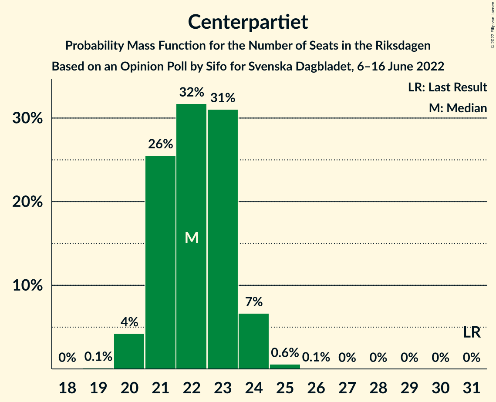

| Number of Seats | Probability | Accumulated | Special Marks |
|:---------------:|:-----------:|:-----------:|:-------------:|
| 19 | 0.1% | 100% |  |
| 20 | 4% | 99.9% |  |
| 21 | 26% | 96% |  |
| 22 | 32% | 70% | Median |
| 23 | 31% | 38% |  |
| 24 | 7% | 7% |  |
| 25 | 0.6% | 0.6% |  |
| 26 | 0.1% | 0.1% |  |
| 27 | 0% | 0% |  |
| 28 | 0% | 0% |  |
| 29 | 0% | 0% |  |
| 30 | 0% | 0% |  |
| 31 | 0% | 0% | Last Result |

### Liberalerna

*For a full overview of the results for this party, see the [Liberalerna](party-liberalerna.html) page.*

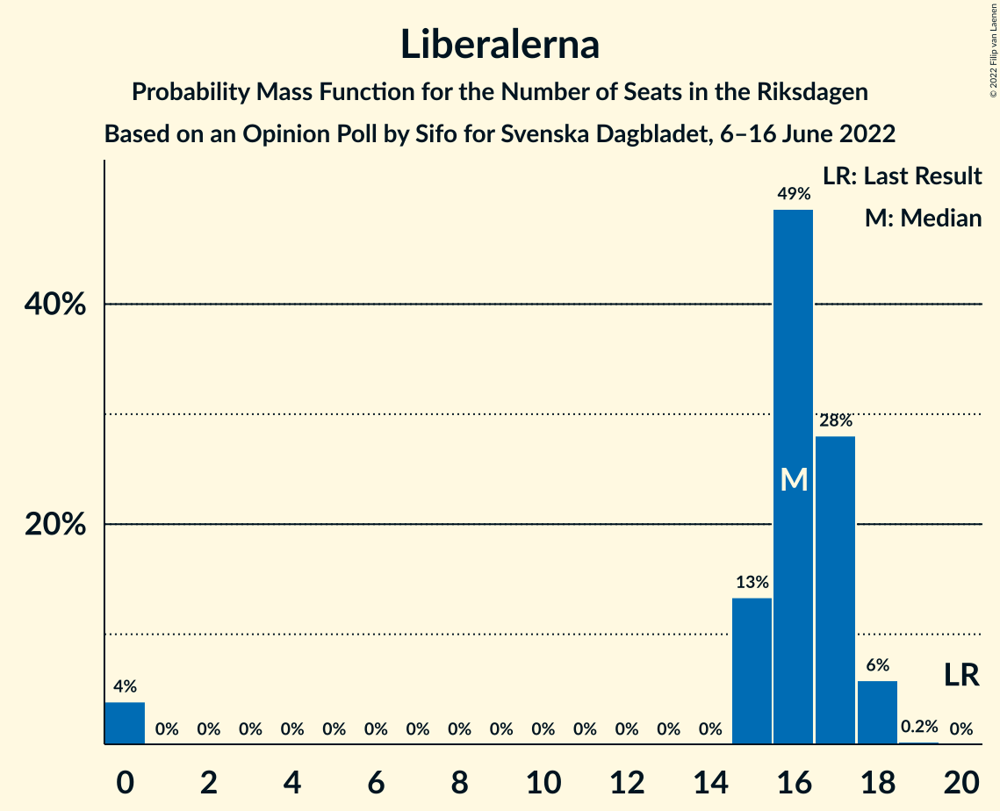

| Number of Seats | Probability | Accumulated | Special Marks |
|:---------------:|:-----------:|:-----------:|:-------------:|
| 0 | 4% | 100% |  |
| 1 | 0% | 96% |  |
| 2 | 0% | 96% |  |
| 3 | 0% | 96% |  |
| 4 | 0% | 96% |  |
| 5 | 0% | 96% |  |
| 6 | 0% | 96% |  |
| 7 | 0% | 96% |  |
| 8 | 0% | 96% |  |
| 9 | 0% | 96% |  |
| 10 | 0% | 96% |  |
| 11 | 0% | 96% |  |
| 12 | 0% | 96% |  |
| 13 | 0% | 96% |  |
| 14 | 0% | 96% |  |
| 15 | 13% | 96% |  |
| 16 | 49% | 83% | Median |
| 17 | 28% | 34% |  |
| 18 | 6% | 6% |  |
| 19 | 0.2% | 0.2% |  |
| 20 | 0% | 0% | Last Result |

### Miljöpartiet de gröna

*For a full overview of the results for this party, see the [Miljöpartiet de gröna](party-miljöpartietdegröna.html) page.*

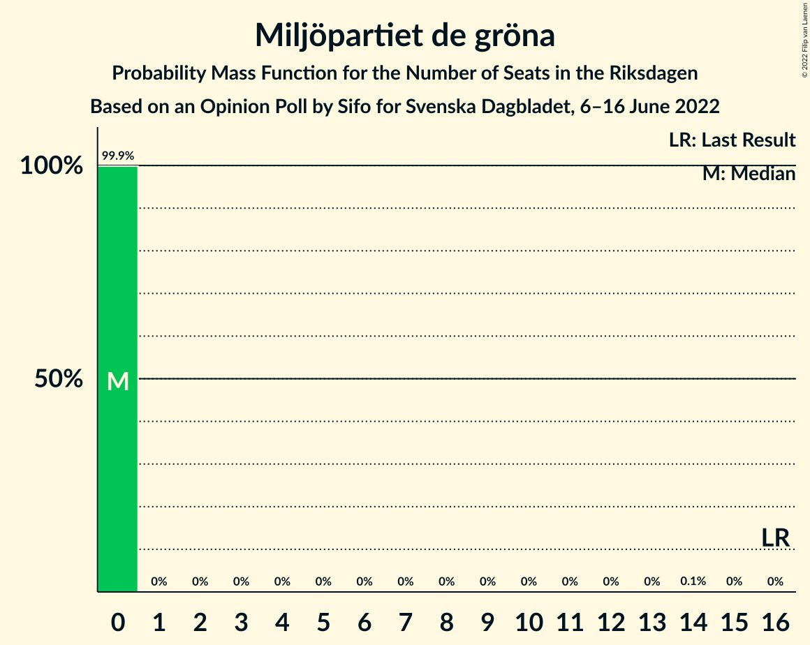

| Number of Seats | Probability | Accumulated | Special Marks |
|:---------------:|:-----------:|:-----------:|:-------------:|
| 0 | 99.9% | 100% | Median |
| 1 | 0% | 0.1% |  |
| 2 | 0% | 0.1% |  |
| 3 | 0% | 0.1% |  |
| 4 | 0% | 0.1% |  |
| 5 | 0% | 0.1% |  |
| 6 | 0% | 0.1% |  |
| 7 | 0% | 0.1% |  |
| 8 | 0% | 0.1% |  |
| 9 | 0% | 0.1% |  |
| 10 | 0% | 0.1% |  |
| 11 | 0% | 0.1% |  |
| 12 | 0% | 0.1% |  |
| 13 | 0% | 0.1% |  |
| 14 | 0.1% | 0.1% |  |
| 15 | 0% | 0% |  |
| 16 | 0% | 0% | Last Result |

## Coalitions

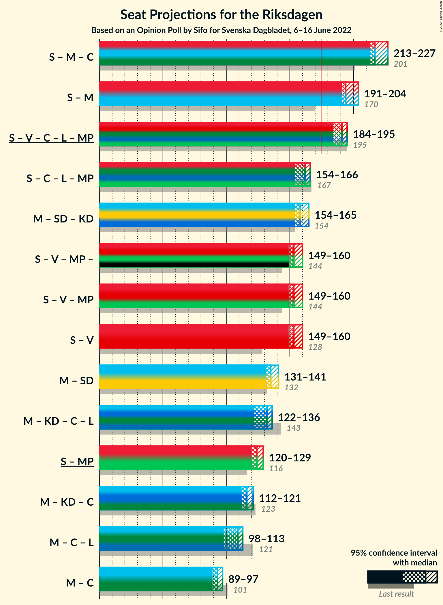

### Confidence Intervals

| Coalition | Last Result | Median | Majority? | 80% Confidence Interval | 90% Confidence Interval | 95% Confidence Interval | 99% Confidence Interval |
|:---------:|:-----------:|:------:|:---------:|:-----------------------:|:-----------------------:|:-----------------------:|:-----------------------:|
| Sveriges socialdemokratiska arbetareparti – Moderata samlingspartiet – Centerpartiet | 201 | 217 | 100% | 214–220 | 214–221 | 213–227 | 212–229 |
| Sveriges socialdemokratiska arbetareparti – Moderata samlingspartiet | 170 | 194 | 100% | 192–197 | 191–199 | 191–204 | 190–206 |
| Sveriges socialdemokratiska arbetareparti – Vänsterpartiet – Centerpartiet – Liberalerna – Miljöpartiet de gröna | 195 | 191 | 100% | 188–194 | 187–194 | 184–195 | 181–196 |
| Sveriges socialdemokratiska arbetareparti – Centerpartiet – Liberalerna – Miljöpartiet de gröna | 167 | 162 | 0% | 159–164 | 158–165 | 154–166 | 151–167 |
| Moderata samlingspartiet – Sverigedemokraterna – Kristdemokraterna | 154 | 158 | 0% | 155–161 | 155–162 | 154–165 | 153–168 |
| Sveriges socialdemokratiska arbetareparti – Vänsterpartiet – Miljöpartiet de gröna | 144 | 153 | 0% | 150–156 | 149–157 | 149–160 | 148–163 |
| Sveriges socialdemokratiska arbetareparti – Vänsterpartiet | 128 | 153 | 0% | 150–156 | 149–157 | 149–160 | 148–163 |
| Moderata samlingspartiet – Sverigedemokraterna | 132 | 135 | 0% | 132–137 | 132–139 | 131–141 | 130–144 |
| Moderata samlingspartiet – Kristdemokraterna – Centerpartiet – Liberalerna | 143 | 132 | 0% | 129–135 | 128–135 | 122–136 | 120–137 |
| Sveriges socialdemokratiska arbetareparti – Miljöpartiet de gröna | 116 | 124 | 0% | 121–127 | 121–128 | 120–129 | 119–132 |
| Moderata samlingspartiet – Kristdemokraterna – Centerpartiet | 123 | 116 | 0% | 114–119 | 113–120 | 112–121 | 111–124 |
| Moderata samlingspartiet – Centerpartiet – Liberalerna | 121 | 109 | 0% | 106–112 | 105–112 | 98–113 | 95–114 |
| Moderata samlingspartiet – Centerpartiet | 101 | 93 | 0% | 91–95 | 90–96 | 89–97 | 89–99 |

### Sveriges socialdemokratiska arbetareparti – Moderata samlingspartiet – Centerpartiet

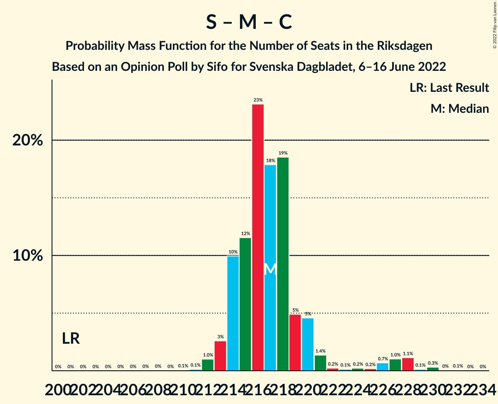

| Number of Seats | Probability | Accumulated | Special Marks |
|:---------------:|:-----------:|:-----------:|:-------------:|
| 201 | 0% | 100% | Last Result |
| 202 | 0% | 100% |  |
| 203 | 0% | 100% |  |
| 204 | 0% | 100% |  |
| 205 | 0% | 100% |  |
| 206 | 0% | 100% |  |
| 207 | 0% | 100% |  |
| 208 | 0% | 99.9% |  |
| 209 | 0% | 99.9% |  |
| 210 | 0.1% | 99.9% |  |
| 211 | 0.1% | 99.8% |  |
| 212 | 1.0% | 99.7% |  |
| 213 | 3% | 98.7% |  |
| 214 | 10% | 96% |  |
| 215 | 12% | 86% |  |
| 216 | 23% | 75% |  |
| 217 | 18% | 51% | Median |
| 218 | 19% | 34% |  |
| 219 | 5% | 15% |  |
| 220 | 5% | 10% |  |
| 221 | 1.4% | 6% |  |
| 222 | 0.2% | 4% |  |
| 223 | 0.1% | 4% |  |
| 224 | 0.2% | 4% |  |
| 225 | 0.2% | 4% |  |
| 226 | 0.7% | 3% |  |
| 227 | 1.0% | 3% |  |
| 228 | 1.1% | 2% |  |
| 229 | 0.1% | 0.6% |  |
| 230 | 0.3% | 0.4% |  |
| 231 | 0% | 0.1% |  |
| 232 | 0.1% | 0.1% |  |
| 233 | 0% | 0% |  |

### Sveriges socialdemokratiska arbetareparti – Moderata samlingspartiet

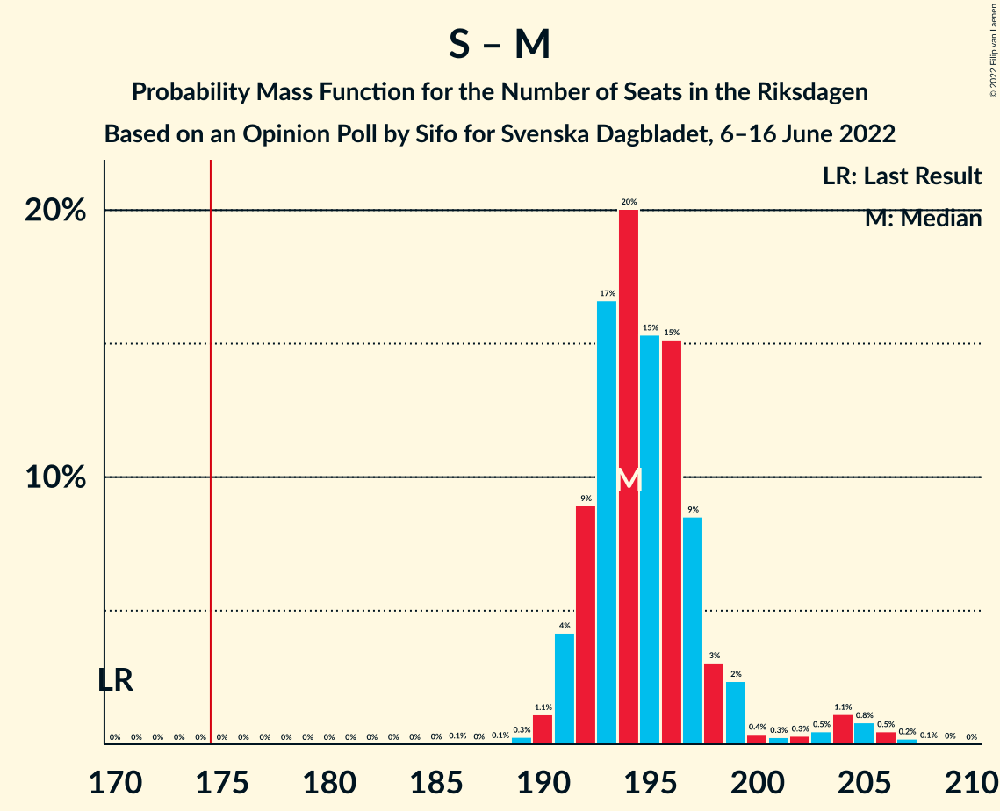

| Number of Seats | Probability | Accumulated | Special Marks |
|:---------------:|:-----------:|:-----------:|:-------------:|
| 170 | 0% | 100% | Last Result |
| 171 | 0% | 100% |  |
| 172 | 0% | 100% |  |
| 173 | 0% | 100% |  |
| 174 | 0% | 100% |  |
| 175 | 0% | 100% | Majority |
| 176 | 0% | 100% |  |
| 177 | 0% | 100% |  |
| 178 | 0% | 100% |  |
| 179 | 0% | 100% |  |
| 180 | 0% | 100% |  |
| 181 | 0% | 100% |  |
| 182 | 0% | 100% |  |
| 183 | 0% | 100% |  |
| 184 | 0% | 100% |  |
| 185 | 0% | 100% |  |
| 186 | 0.1% | 100% |  |
| 187 | 0% | 99.9% |  |
| 188 | 0.1% | 99.9% |  |
| 189 | 0.3% | 99.8% |  |
| 190 | 1.1% | 99.5% |  |
| 191 | 4% | 98% |  |
| 192 | 9% | 94% |  |
| 193 | 17% | 85% |  |
| 194 | 20% | 69% |  |
| 195 | 15% | 49% | Median |
| 196 | 15% | 33% |  |
| 197 | 9% | 18% |  |
| 198 | 3% | 10% |  |
| 199 | 2% | 7% |  |
| 200 | 0.4% | 4% |  |
| 201 | 0.3% | 4% |  |
| 202 | 0.3% | 4% |  |
| 203 | 0.5% | 3% |  |
| 204 | 1.1% | 3% |  |
| 205 | 0.8% | 2% |  |
| 206 | 0.5% | 0.8% |  |
| 207 | 0.2% | 0.3% |  |
| 208 | 0.1% | 0.1% |  |
| 209 | 0% | 0.1% |  |
| 210 | 0% | 0% |  |

### Sveriges socialdemokratiska arbetareparti – Vänsterpartiet – Centerpartiet – Liberalerna – Miljöpartiet de gröna

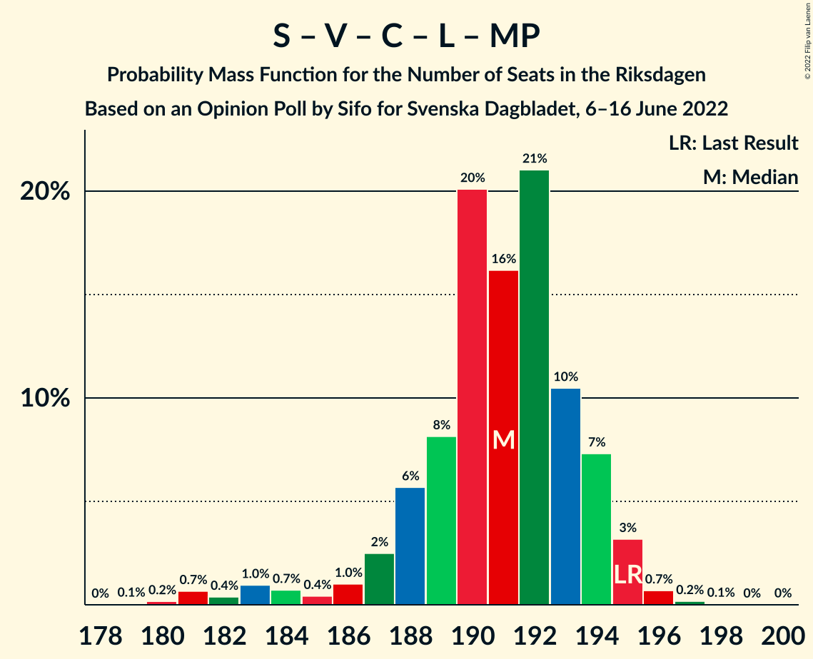

| Number of Seats | Probability | Accumulated | Special Marks |
|:---------------:|:-----------:|:-----------:|:-------------:|
| 179 | 0.1% | 100% |  |
| 180 | 0.2% | 99.9% |  |
| 181 | 0.7% | 99.8% |  |
| 182 | 0.4% | 99.1% |  |
| 183 | 1.0% | 98.7% |  |
| 184 | 0.7% | 98% |  |
| 185 | 0.4% | 97% |  |
| 186 | 1.0% | 97% |  |
| 187 | 2% | 96% |  |
| 188 | 6% | 93% |  |
| 189 | 8% | 87% |  |
| 190 | 20% | 79% |  |
| 191 | 16% | 59% | Median |
| 192 | 21% | 43% |  |
| 193 | 10% | 22% |  |
| 194 | 7% | 11% |  |
| 195 | 3% | 4% | Last Result |
| 196 | 0.7% | 1.0% |  |
| 197 | 0.2% | 0.3% |  |
| 198 | 0.1% | 0.1% |  |
| 199 | 0% | 0% |  |

### Sveriges socialdemokratiska arbetareparti – Centerpartiet – Liberalerna – Miljöpartiet de gröna

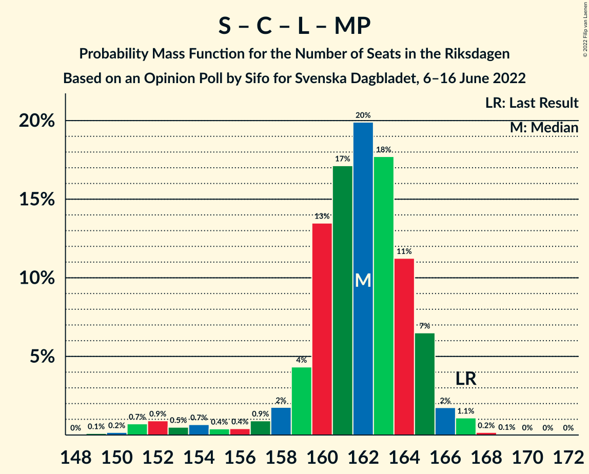

| Number of Seats | Probability | Accumulated | Special Marks |
|:---------------:|:-----------:|:-----------:|:-------------:|
| 149 | 0.1% | 100% |  |
| 150 | 0.2% | 99.9% |  |
| 151 | 0.7% | 99.7% |  |
| 152 | 0.9% | 99.0% |  |
| 153 | 0.5% | 98% |  |
| 154 | 0.7% | 98% |  |
| 155 | 0.4% | 97% |  |
| 156 | 0.4% | 97% |  |
| 157 | 0.9% | 96% |  |
| 158 | 2% | 95% |  |
| 159 | 4% | 93% |  |
| 160 | 13% | 89% |  |
| 161 | 17% | 76% |  |
| 162 | 20% | 58% | Median |
| 163 | 18% | 39% |  |
| 164 | 11% | 21% |  |
| 165 | 7% | 10% |  |
| 166 | 2% | 3% |  |
| 167 | 1.1% | 1.4% | Last Result |
| 168 | 0.2% | 0.3% |  |
| 169 | 0.1% | 0.1% |  |
| 170 | 0% | 0.1% |  |
| 171 | 0% | 0% |  |

### Moderata samlingspartiet – Sverigedemokraterna – Kristdemokraterna

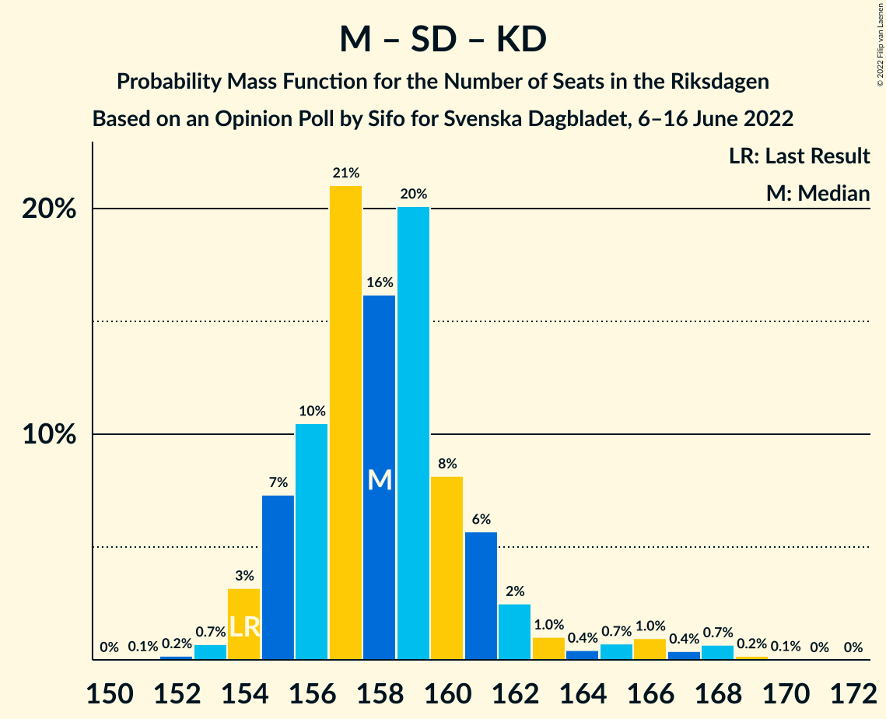

| Number of Seats | Probability | Accumulated | Special Marks |
|:---------------:|:-----------:|:-----------:|:-------------:|
| 151 | 0.1% | 100% |  |
| 152 | 0.2% | 99.9% |  |
| 153 | 0.7% | 99.7% |  |
| 154 | 3% | 99.0% | Last Result |
| 155 | 7% | 96% |  |
| 156 | 10% | 89% |  |
| 157 | 21% | 78% |  |
| 158 | 16% | 57% | Median |
| 159 | 20% | 41% |  |
| 160 | 8% | 21% |  |
| 161 | 6% | 13% |  |
| 162 | 2% | 7% |  |
| 163 | 1.0% | 4% |  |
| 164 | 0.4% | 3% |  |
| 165 | 0.7% | 3% |  |
| 166 | 1.0% | 2% |  |
| 167 | 0.4% | 1.3% |  |
| 168 | 0.7% | 0.9% |  |
| 169 | 0.2% | 0.2% |  |
| 170 | 0.1% | 0.1% |  |
| 171 | 0% | 0% |  |

### Sveriges socialdemokratiska arbetareparti – Vänsterpartiet – Miljöpartiet de gröna

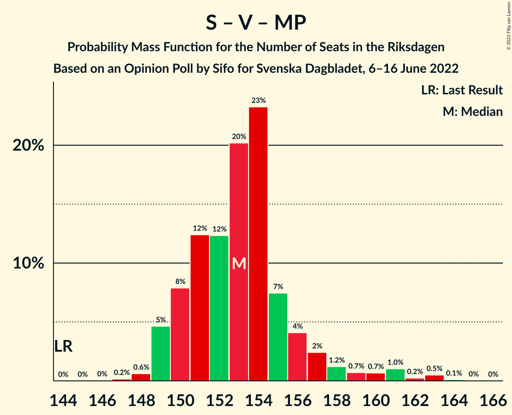

| Number of Seats | Probability | Accumulated | Special Marks |
|:---------------:|:-----------:|:-----------:|:-------------:|
| 144 | 0% | 100% | Last Result |
| 145 | 0% | 100% |  |
| 146 | 0% | 100% |  |
| 147 | 0.2% | 100% |  |
| 148 | 0.6% | 99.8% |  |
| 149 | 5% | 99.2% |  |
| 150 | 8% | 95% |  |
| 151 | 12% | 87% |  |
| 152 | 12% | 74% |  |
| 153 | 20% | 62% | Median |
| 154 | 23% | 42% |  |
| 155 | 7% | 18% |  |
| 156 | 4% | 11% |  |
| 157 | 2% | 7% |  |
| 158 | 1.2% | 5% |  |
| 159 | 0.7% | 3% |  |
| 160 | 0.7% | 3% |  |
| 161 | 1.0% | 2% |  |
| 162 | 0.2% | 0.9% |  |
| 163 | 0.5% | 0.7% |  |
| 164 | 0.1% | 0.2% |  |
| 165 | 0% | 0.1% |  |
| 166 | 0% | 0% |  |

### Sveriges socialdemokratiska arbetareparti – Vänsterpartiet

| Number of Seats | Probability | Accumulated | Special Marks |
|:---------------:|:-----------:|:-----------:|:-------------:|
| 128 | 0% | 100% | Last Result |
| 129 | 0% | 100% |  |
| 130 | 0% | 100% |  |
| 131 | 0% | 100% |  |
| 132 | 0% | 100% |  |
| 133 | 0% | 100% |  |
| 134 | 0% | 100% |  |
| 135 | 0% | 100% |  |
| 136 | 0% | 100% |  |
| 137 | 0% | 100% |  |
| 138 | 0% | 100% |  |
| 139 | 0% | 100% |  |
| 140 | 0% | 100% |  |
| 141 | 0% | 100% |  |
| 142 | 0% | 100% |  |
| 143 | 0% | 100% |  |
| 144 | 0% | 100% |  |
| 145 | 0.1% | 100% |  |
| 146 | 0.1% | 99.9% |  |
| 147 | 0.2% | 99.9% |  |
| 148 | 0.6% | 99.7% |  |
| 149 | 5% | 99.1% |  |
| 150 | 8% | 94% |  |
| 151 | 12% | 87% |  |
| 152 | 12% | 74% |  |
| 153 | 20% | 62% | Median |
| 154 | 23% | 42% |  |
| 155 | 7% | 18% |  |
| 156 | 4% | 11% |  |
| 157 | 2% | 7% |  |
| 158 | 1.2% | 4% |  |
| 159 | 0.7% | 3% |  |
| 160 | 0.7% | 3% |  |
| 161 | 1.0% | 2% |  |
| 162 | 0.2% | 0.8% |  |
| 163 | 0.5% | 0.6% |  |
| 164 | 0.1% | 0.1% |  |
| 165 | 0% | 0% |  |

### Moderata samlingspartiet – Sverigedemokraterna

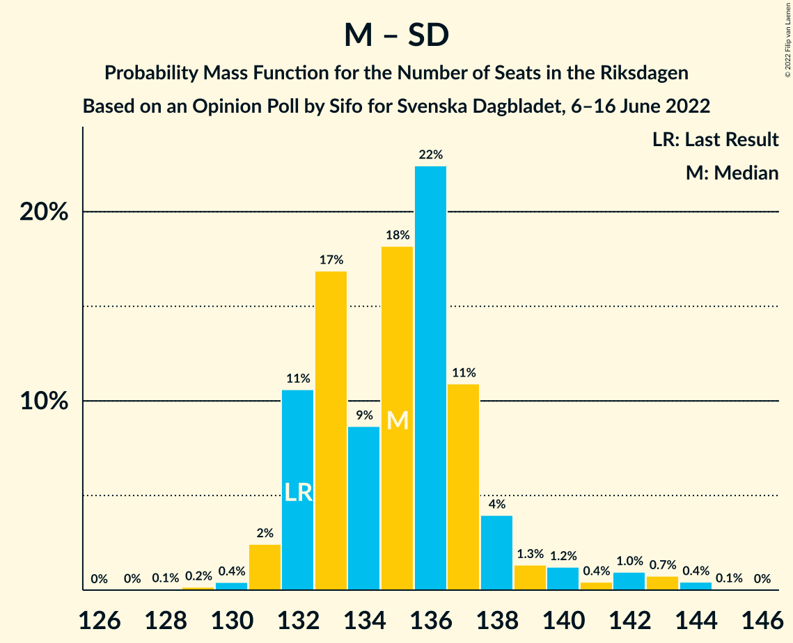

| Number of Seats | Probability | Accumulated | Special Marks |
|:---------------:|:-----------:|:-----------:|:-------------:|
| 128 | 0.1% | 100% |  |
| 129 | 0.2% | 99.9% |  |
| 130 | 0.4% | 99.7% |  |
| 131 | 2% | 99.3% |  |
| 132 | 11% | 97% | Last Result |
| 133 | 17% | 86% |  |
| 134 | 9% | 69% |  |
| 135 | 18% | 61% | Median |
| 136 | 22% | 43% |  |
| 137 | 11% | 20% |  |
| 138 | 4% | 9% |  |
| 139 | 1.3% | 5% |  |
| 140 | 1.2% | 4% |  |
| 141 | 0.4% | 3% |  |
| 142 | 1.0% | 2% |  |
| 143 | 0.7% | 1.3% |  |
| 144 | 0.4% | 0.5% |  |
| 145 | 0.1% | 0.1% |  |
| 146 | 0% | 0% |  |

### Moderata samlingspartiet – Kristdemokraterna – Centerpartiet – Liberalerna

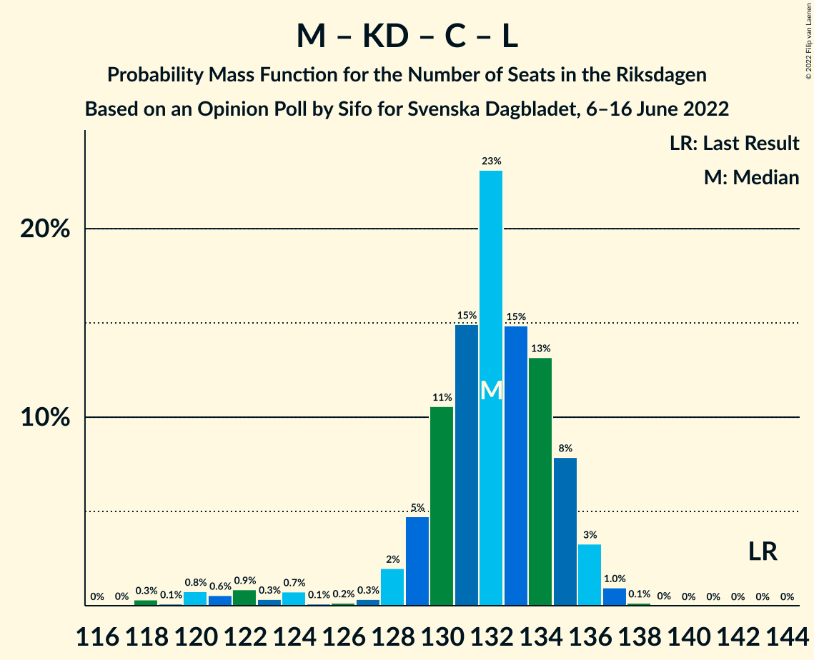

| Number of Seats | Probability | Accumulated | Special Marks |
|:---------------:|:-----------:|:-----------:|:-------------:|
| 118 | 0.3% | 100% |  |
| 119 | 0.1% | 99.6% |  |
| 120 | 0.8% | 99.5% |  |
| 121 | 0.6% | 98.8% |  |
| 122 | 0.9% | 98% |  |
| 123 | 0.3% | 97% |  |
| 124 | 0.7% | 97% |  |
| 125 | 0.1% | 96% |  |
| 126 | 0.2% | 96% |  |
| 127 | 0.3% | 96% |  |
| 128 | 2% | 96% |  |
| 129 | 5% | 94% |  |
| 130 | 11% | 89% |  |
| 131 | 15% | 78% |  |
| 132 | 23% | 63% | Median |
| 133 | 15% | 40% |  |
| 134 | 13% | 25% |  |
| 135 | 8% | 12% |  |
| 136 | 3% | 4% |  |
| 137 | 1.0% | 1.2% |  |
| 138 | 0.1% | 0.2% |  |
| 139 | 0% | 0% |  |
| 140 | 0% | 0% |  |
| 141 | 0% | 0% |  |
| 142 | 0% | 0% |  |
| 143 | 0% | 0% | Last Result |

### Sveriges socialdemokratiska arbetareparti – Miljöpartiet de gröna

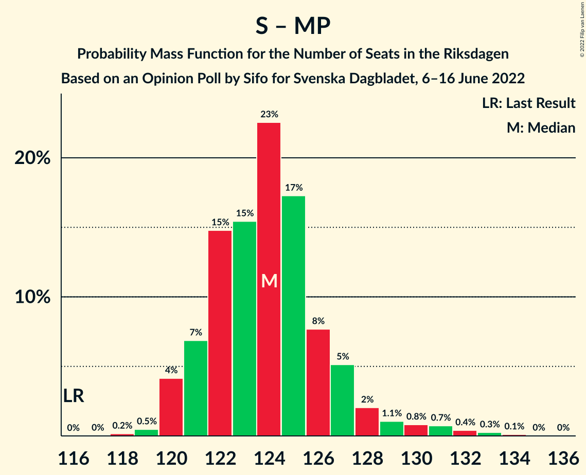

| Number of Seats | Probability | Accumulated | Special Marks |
|:---------------:|:-----------:|:-----------:|:-------------:|
| 116 | 0% | 100% | Last Result |
| 117 | 0% | 100% |  |
| 118 | 0.2% | 100% |  |
| 119 | 0.5% | 99.8% |  |
| 120 | 4% | 99.3% |  |
| 121 | 7% | 95% |  |
| 122 | 15% | 88% |  |
| 123 | 15% | 74% |  |
| 124 | 23% | 58% | Median |
| 125 | 17% | 36% |  |
| 126 | 8% | 18% |  |
| 127 | 5% | 11% |  |
| 128 | 2% | 5% |  |
| 129 | 1.1% | 3% |  |
| 130 | 0.8% | 2% |  |
| 131 | 0.7% | 2% |  |
| 132 | 0.4% | 0.8% |  |
| 133 | 0.3% | 0.4% |  |
| 134 | 0.1% | 0.2% |  |
| 135 | 0% | 0.1% |  |
| 136 | 0% | 0% |  |

### Moderata samlingspartiet – Kristdemokraterna – Centerpartiet

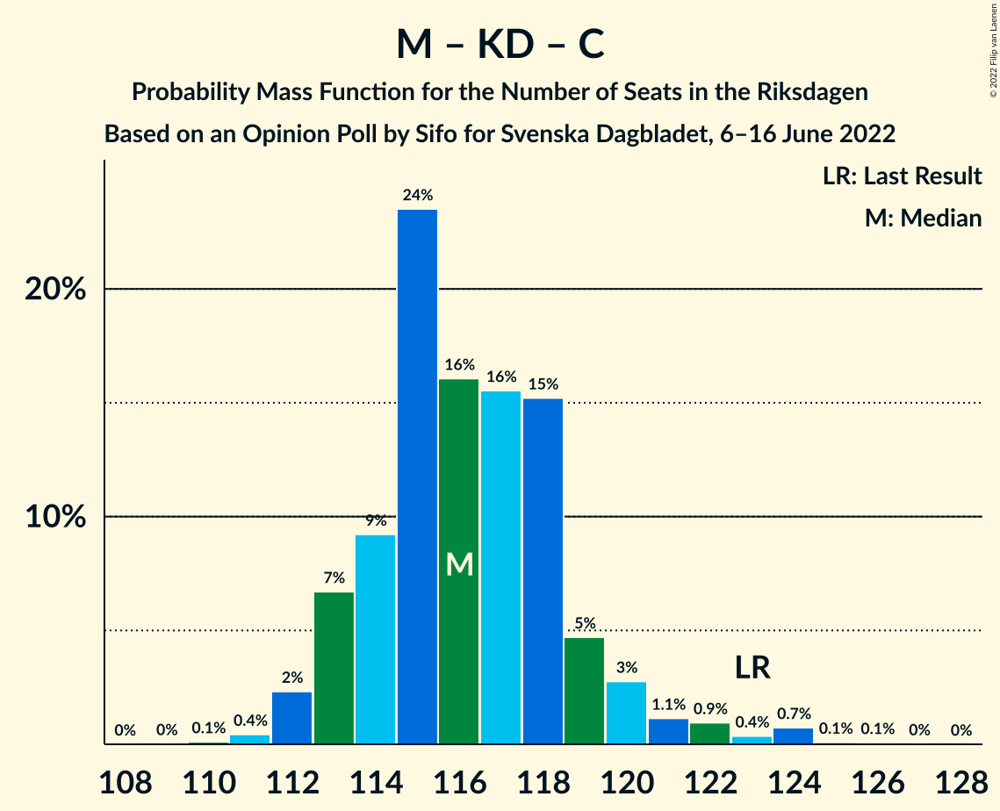

| Number of Seats | Probability | Accumulated | Special Marks |
|:---------------:|:-----------:|:-----------:|:-------------:|
| 110 | 0.1% | 100% |  |
| 111 | 0.4% | 99.9% |  |
| 112 | 2% | 99.4% |  |
| 113 | 7% | 97% |  |
| 114 | 9% | 90% |  |
| 115 | 24% | 81% |  |
| 116 | 16% | 58% | Median |
| 117 | 16% | 42% |  |
| 118 | 15% | 26% |  |
| 119 | 5% | 11% |  |
| 120 | 3% | 6% |  |
| 121 | 1.1% | 3% |  |
| 122 | 0.9% | 2% |  |
| 123 | 0.4% | 1.3% | Last Result |
| 124 | 0.7% | 0.9% |  |
| 125 | 0.1% | 0.2% |  |
| 126 | 0.1% | 0.1% |  |
| 127 | 0% | 0% |  |

### Moderata samlingspartiet – Centerpartiet – Liberalerna

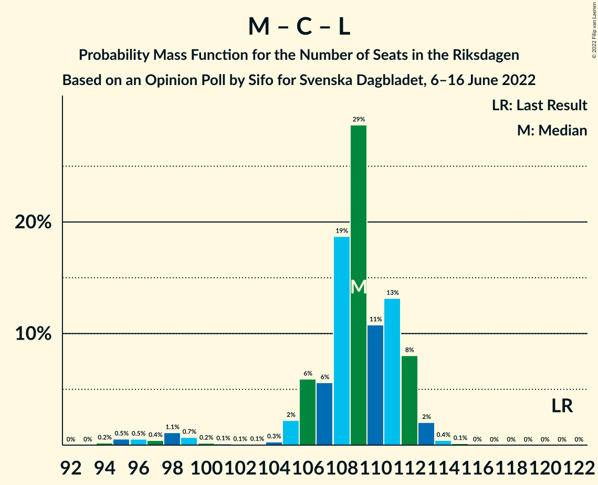

| Number of Seats | Probability | Accumulated | Special Marks |
|:---------------:|:-----------:|:-----------:|:-------------:|
| 94 | 0.2% | 100% |  |
| 95 | 0.5% | 99.8% |  |
| 96 | 0.5% | 99.2% |  |
| 97 | 0.4% | 98.7% |  |
| 98 | 1.1% | 98% |  |
| 99 | 0.7% | 97% |  |
| 100 | 0.2% | 96% |  |
| 101 | 0.1% | 96% |  |
| 102 | 0.1% | 96% |  |
| 103 | 0.1% | 96% |  |
| 104 | 0.3% | 96% |  |
| 105 | 2% | 96% |  |
| 106 | 6% | 94% |  |
| 107 | 6% | 88% |  |
| 108 | 19% | 82% |  |
| 109 | 29% | 63% | Median |
| 110 | 11% | 35% |  |
| 111 | 13% | 24% |  |
| 112 | 8% | 11% |  |
| 113 | 2% | 3% |  |
| 114 | 0.4% | 0.6% |  |
| 115 | 0.1% | 0.2% |  |
| 116 | 0% | 0% |  |
| 117 | 0% | 0% |  |
| 118 | 0% | 0% |  |
| 119 | 0% | 0% |  |
| 120 | 0% | 0% |  |
| 121 | 0% | 0% | Last Result |

### Moderata samlingspartiet – Centerpartiet

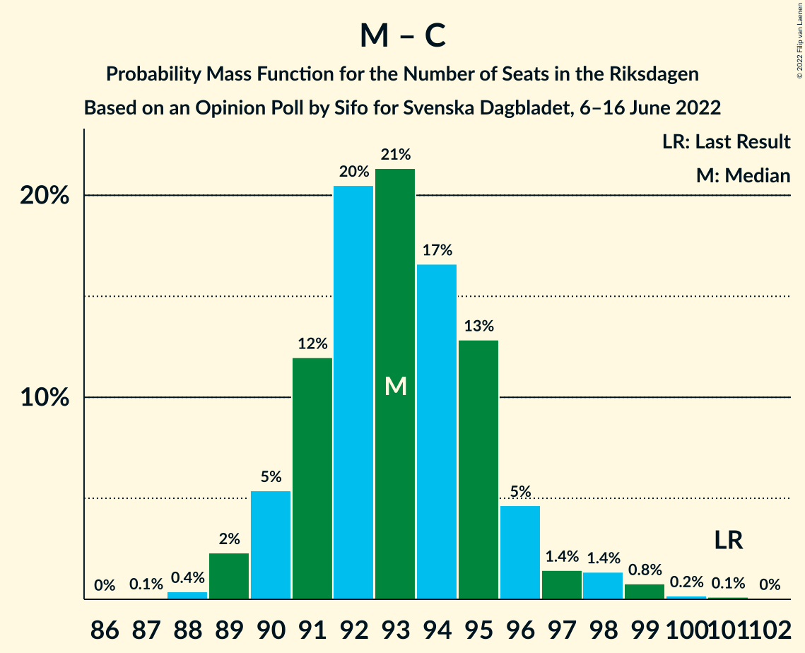

| Number of Seats | Probability | Accumulated | Special Marks |
|:---------------:|:-----------:|:-----------:|:-------------:|
| 87 | 0.1% | 100% |  |
| 88 | 0.4% | 99.9% |  |
| 89 | 2% | 99.5% |  |
| 90 | 5% | 97% |  |
| 91 | 12% | 92% |  |
| 92 | 20% | 80% |  |
| 93 | 21% | 59% | Median |
| 94 | 17% | 38% |  |
| 95 | 13% | 21% |  |
| 96 | 5% | 9% |  |
| 97 | 1.4% | 4% |  |
| 98 | 1.4% | 2% |  |
| 99 | 0.8% | 1.1% |  |
| 100 | 0.2% | 0.3% |  |
| 101 | 0.1% | 0.2% | Last Result |
| 102 | 0% | 0% |  |

## Technical Information

### Opinion Poll

+ **Polling firm:** Sifo
+ **Commissioner(s):** Svenska Dagbladet
+ **Fieldwork period:** 6–16 June 2022

### Calculations

+ **Sample size:** 8996
+ **Simulations done:** 1,048,576
+ **Error estimate:** 0.40%

