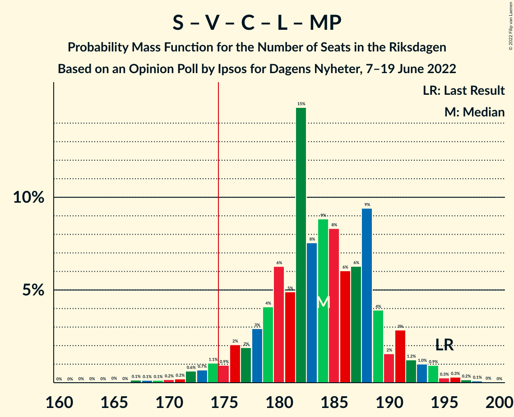

# Opinion Poll by Ipsos for Dagens Nyheter, 7–19 June 2022

<a href="#voting-intentions">Voting Intentions</a> | <a href="#seats">Seats</a> | <a href="#coalitions">Coalitions</a> | <a href="#technical-information">Technical Information</a>

## Voting Intentions

### Confidence Intervals

| Party | Last Result | Poll Result | 80% Confidence Interval | 90% Confidence Interval | 95% Confidence Interval | 99% Confidence Interval |
|:-----:|:-----------:|:-----------:|:-----------------------:|:-----------------------:|:-----------------------:|:-----------------------:|
| Sveriges socialdemokratiska arbetareparti | 28.3% | 31.0% | 29.6–32.5% |29.2–32.9% |28.8–33.3% |28.1–34.0% |
| Moderata samlingspartiet | 19.8% | 20.0% | 18.8–21.3% |18.4–21.7% |18.1–22.0% |17.6–22.7% |
| Sverigedemokraterna | 17.5% | 19.0% | 17.8–20.3% |17.5–20.7% |17.2–21.0% |16.6–21.6% |
| Vänsterpartiet | 8.0% | 9.0% | 8.1–10.0% |7.9–10.2% |7.7–10.5% |7.3–11.0% |
| Kristdemokraterna | 6.3% | 6.0% | 5.3–6.8% |5.1–7.1% |4.9–7.3% |4.6–7.7% |
| Centerpartiet | 8.6% | 5.0% | 4.4–5.8% |4.2–6.0% |4.1–6.2% |3.8–6.6% |
| Liberalerna | 5.5% | 5.0% | 4.4–5.8% |4.2–6.0% |4.1–6.2% |3.8–6.6% |
| Miljöpartiet de gröna | 4.4% | 3.0% | 2.5–3.6% |2.4–3.8% |2.3–3.9% |2.1–4.3% |

*Note:* The poll result column reflects the actual value used in the calculations. Published results may vary slightly, and in addition be rounded to fewer digits.

## Seats

### Confidence Intervals

| Party | Last Result | Median | 80% Confidence Interval | 90% Confidence Interval | 95% Confidence Interval | 99% Confidence Interval |
|:-----:|:-----------:|:------:|:-----------------------:|:-----------------------:|:-----------------------:|:-----------------------:|
| <a href="#sveriges-socialdemokratiska-arbetareparti">Sveriges socialdemokratiska arbetareparti</a> | 100 | 113 | 108–119 |107–121 |106–123 |103–126 |
| <a href="#moderata-samlingspartiet">Moderata samlingspartiet</a> | 70 | 74 | 69–78 |68–79 |66–81 |64–83 |
| <a href="#sverigedemokraterna">Sverigedemokraterna</a> | 62 | 70 | 65–74 |64–75 |63–77 |61–80 |
| <a href="#vänsterpartiet">Vänsterpartiet</a> | 28 | 33 | 30–36 |29–38 |28–39 |27–40 |
| <a href="#kristdemokraterna">Kristdemokraterna</a> | 22 | 22 | 19–25 |19–26 |18–26 |17–28 |
| <a href="#centerpartiet">Centerpartiet</a> | 31 | 19 | 16–21 |15–22 |15–23 |0–24 |
| <a href="#liberalerna">Liberalerna</a> | 20 | 18 | 16–21 |15–22 |15–23 |0–24 |
| <a href="#miljöpartiet-de-gröna">Miljöpartiet de gröna</a> | 16 | 0 | 0 |0 |0 |0–15 |

### Sveriges socialdemokratiska arbetareparti

*For a full overview of the results for this party, see the [Sveriges socialdemokratiska arbetareparti](party-sverigessocialdemokratiskaarbetareparti.html) page.*

| Number of Seats | Probability | Accumulated | Special Marks |
|:---------------:|:-----------:|:-----------:|:-------------:|
| 100 | 0.1% | 100% | Last Result |
| 101 | 0.1% | 99.9% |  |
| 102 | 0.2% | 99.8% |  |
| 103 | 0.3% | 99.6% |  |
| 104 | 0.5% | 99.3% |  |
| 105 | 1.1% | 98.7% |  |
| 106 | 2% | 98% |  |
| 107 | 3% | 96% |  |
| 108 | 4% | 93% |  |
| 109 | 4% | 89% |  |
| 110 | 6% | 85% |  |
| 111 | 14% | 79% |  |
| 112 | 8% | 66% |  |
| 113 | 12% | 58% | Median |
| 114 | 6% | 46% |  |
| 115 | 9% | 40% |  |
| 116 | 8% | 31% |  |
| 117 | 7% | 23% |  |
| 118 | 4% | 16% |  |
| 119 | 3% | 12% |  |
| 120 | 3% | 9% |  |
| 121 | 2% | 6% |  |
| 122 | 1.0% | 4% |  |
| 123 | 0.9% | 3% |  |
| 124 | 0.6% | 2% |  |
| 125 | 0.4% | 1.0% |  |
| 126 | 0.2% | 0.7% |  |
| 127 | 0.2% | 0.5% |  |
| 128 | 0.1% | 0.2% |  |
| 129 | 0% | 0.1% |  |
| 130 | 0% | 0.1% |  |
| 131 | 0% | 0% |  |

### Moderata samlingspartiet

*For a full overview of the results for this party, see the [Moderata samlingspartiet](party-moderatasamlingspartiet.html) page.*

| Number of Seats | Probability | Accumulated | Special Marks |
|:---------------:|:-----------:|:-----------:|:-------------:|
| 62 | 0.1% | 100% |  |
| 63 | 0.1% | 99.9% |  |
| 64 | 0.4% | 99.8% |  |
| 65 | 0.7% | 99.4% |  |
| 66 | 1.4% | 98.7% |  |
| 67 | 2% | 97% |  |
| 68 | 4% | 95% |  |
| 69 | 5% | 91% |  |
| 70 | 10% | 87% | Last Result |
| 71 | 6% | 77% |  |
| 72 | 10% | 71% |  |
| 73 | 9% | 61% |  |
| 74 | 11% | 52% | Median |
| 75 | 13% | 40% |  |
| 76 | 11% | 27% |  |
| 77 | 5% | 17% |  |
| 78 | 4% | 12% |  |
| 79 | 3% | 8% |  |
| 80 | 2% | 5% |  |
| 81 | 1.1% | 3% |  |
| 82 | 0.8% | 1.5% |  |
| 83 | 0.3% | 0.7% |  |
| 84 | 0.2% | 0.5% |  |
| 85 | 0.1% | 0.2% |  |
| 86 | 0.1% | 0.1% |  |
| 87 | 0% | 0.1% |  |
| 88 | 0% | 0% |  |

### Sverigedemokraterna

*For a full overview of the results for this party, see the [Sverigedemokraterna](party-sverigedemokraterna.html) page.*

| Number of Seats | Probability | Accumulated | Special Marks |
|:---------------:|:-----------:|:-----------:|:-------------:|
| 59 | 0.1% | 100% |  |
| 60 | 0.4% | 99.9% |  |
| 61 | 0.6% | 99.5% |  |
| 62 | 0.8% | 98.9% | Last Result |
| 63 | 1.3% | 98% |  |
| 64 | 3% | 97% |  |
| 65 | 6% | 94% |  |
| 66 | 7% | 88% |  |
| 67 | 8% | 82% |  |
| 68 | 10% | 74% |  |
| 69 | 9% | 64% |  |
| 70 | 15% | 55% | Median |
| 71 | 14% | 41% |  |
| 72 | 6% | 26% |  |
| 73 | 5% | 20% |  |
| 74 | 6% | 15% |  |
| 75 | 4% | 9% |  |
| 76 | 2% | 5% |  |
| 77 | 1.3% | 3% |  |
| 78 | 0.6% | 2% |  |
| 79 | 0.6% | 1.1% |  |
| 80 | 0.3% | 0.5% |  |
| 81 | 0.1% | 0.2% |  |
| 82 | 0% | 0.1% |  |
| 83 | 0% | 0.1% |  |
| 84 | 0% | 0% |  |

### Vänsterpartiet

*For a full overview of the results for this party, see the [Vänsterpartiet](party-vänsterpartiet.html) page.*

| Number of Seats | Probability | Accumulated | Special Marks |
|:---------------:|:-----------:|:-----------:|:-------------:|
| 25 | 0.1% | 100% |  |
| 26 | 0.3% | 99.9% |  |
| 27 | 0.6% | 99.6% |  |
| 28 | 2% | 99.0% | Last Result |
| 29 | 4% | 97% |  |
| 30 | 7% | 93% |  |
| 31 | 12% | 85% |  |
| 32 | 10% | 73% |  |
| 33 | 17% | 63% | Median |
| 34 | 18% | 47% |  |
| 35 | 11% | 29% |  |
| 36 | 8% | 18% |  |
| 37 | 5% | 10% |  |
| 38 | 3% | 5% |  |
| 39 | 2% | 3% |  |
| 40 | 0.6% | 1.0% |  |
| 41 | 0.2% | 0.4% |  |
| 42 | 0.1% | 0.1% |  |
| 43 | 0% | 0% |  |

### Kristdemokraterna

*For a full overview of the results for this party, see the [Kristdemokraterna](party-kristdemokraterna.html) page.*

| Number of Seats | Probability | Accumulated | Special Marks |
|:---------------:|:-----------:|:-----------:|:-------------:|
| 16 | 0.1% | 100% |  |
| 17 | 1.0% | 99.8% |  |
| 18 | 3% | 98.8% |  |
| 19 | 6% | 96% |  |
| 20 | 9% | 89% |  |
| 21 | 22% | 80% |  |
| 22 | 19% | 59% | Last Result, Median |
| 23 | 15% | 40% |  |
| 24 | 11% | 25% |  |
| 25 | 7% | 13% |  |
| 26 | 4% | 6% |  |
| 27 | 1.4% | 2% |  |
| 28 | 0.5% | 0.8% |  |
| 29 | 0.3% | 0.4% |  |
| 30 | 0.1% | 0.1% |  |
| 31 | 0% | 0% |  |

### Centerpartiet

*For a full overview of the results for this party, see the [Centerpartiet](party-centerpartiet.html) page.*

| Number of Seats | Probability | Accumulated | Special Marks |
|:---------------:|:-----------:|:-----------:|:-------------:|
| 0 | 1.3% | 100% |  |
| 1 | 0% | 98.7% |  |
| 2 | 0% | 98.7% |  |
| 3 | 0% | 98.7% |  |
| 4 | 0% | 98.7% |  |
| 5 | 0% | 98.7% |  |
| 6 | 0% | 98.7% |  |
| 7 | 0% | 98.7% |  |
| 8 | 0% | 98.7% |  |
| 9 | 0% | 98.7% |  |
| 10 | 0% | 98.7% |  |
| 11 | 0% | 98.7% |  |
| 12 | 0% | 98.7% |  |
| 13 | 0% | 98.7% |  |
| 14 | 0% | 98.7% |  |
| 15 | 5% | 98.6% |  |
| 16 | 6% | 94% |  |
| 17 | 17% | 87% |  |
| 18 | 20% | 70% |  |
| 19 | 17% | 51% | Median |
| 20 | 19% | 34% |  |
| 21 | 8% | 16% |  |
| 22 | 5% | 7% |  |
| 23 | 2% | 3% |  |
| 24 | 0.8% | 1.1% |  |
| 25 | 0.2% | 0.3% |  |
| 26 | 0% | 0.1% |  |
| 27 | 0% | 0% |  |
| 28 | 0% | 0% |  |
| 29 | 0% | 0% |  |
| 30 | 0% | 0% |  |
| 31 | 0% | 0% | Last Result |

### Liberalerna

*For a full overview of the results for this party, see the [Liberalerna](party-liberalerna.html) page.*

| Number of Seats | Probability | Accumulated | Special Marks |
|:---------------:|:-----------:|:-----------:|:-------------:|
| 0 | 2% | 100% |  |
| 1 | 0% | 98% |  |
| 2 | 0% | 98% |  |
| 3 | 0% | 98% |  |
| 4 | 0% | 98% |  |
| 5 | 0% | 98% |  |
| 6 | 0% | 98% |  |
| 7 | 0% | 98% |  |
| 8 | 0% | 98% |  |
| 9 | 0% | 98% |  |
| 10 | 0% | 98% |  |
| 11 | 0% | 98% |  |
| 12 | 0% | 98% |  |
| 13 | 0% | 98% |  |
| 14 | 0% | 98% |  |
| 15 | 4% | 98% |  |
| 16 | 7% | 94% |  |
| 17 | 14% | 87% |  |
| 18 | 23% | 73% | Median |
| 19 | 23% | 50% |  |
| 20 | 11% | 27% | Last Result |
| 21 | 8% | 16% |  |
| 22 | 5% | 8% |  |
| 23 | 2% | 3% |  |
| 24 | 0.6% | 0.8% |  |
| 25 | 0.2% | 0.3% |  |
| 26 | 0.1% | 0.1% |  |
| 27 | 0% | 0% |  |

### Miljöpartiet de gröna

*For a full overview of the results for this party, see the [Miljöpartiet de gröna](party-miljöpartietdegröna.html) page.*

| Number of Seats | Probability | Accumulated | Special Marks |
|:---------------:|:-----------:|:-----------:|:-------------:|
| 0 | 98% | 100% | Median |
| 1 | 0% | 2% |  |
| 2 | 0% | 2% |  |
| 3 | 0% | 2% |  |
| 4 | 0% | 2% |  |
| 5 | 0% | 2% |  |
| 6 | 0% | 2% |  |
| 7 | 0% | 2% |  |
| 8 | 0% | 2% |  |
| 9 | 0% | 2% |  |
| 10 | 0% | 2% |  |
| 11 | 0% | 2% |  |
| 12 | 0% | 2% |  |
| 13 | 0% | 2% |  |
| 14 | 0.4% | 2% |  |
| 15 | 0.9% | 1.1% |  |
| 16 | 0.2% | 0.2% | Last Result |
| 17 | 0% | 0% |  |

## Coalitions

### Confidence Intervals

| Coalition | Last Result | Median | Majority? | 80% Confidence Interval | 90% Confidence Interval | 95% Confidence Interval | 99% Confidence Interval |
|:---------:|:-----------:|:------:|:---------:|:-----------------------:|:-----------------------:|:-----------------------:|:-----------------------:|
| Sveriges socialdemokratiska arbetareparti – Moderata samlingspartiet – Centerpartiet | 201 | 205 | 100% | 200–211 | 198–213 | 196–215 | 192–220 |
| Sveriges socialdemokratiska arbetareparti – Moderata samlingspartiet | 170 | 187 | 99.5% | 181–193 | 180–195 | 178–197 | 175–202 |
| Sveriges socialdemokratiska arbetareparti – Vänsterpartiet – Centerpartiet – Liberalerna – Miljöpartiet de gröna | 195 | 184 | 97% | 178–189 | 176–191 | 174–193 | 169–196 |
| Moderata samlingspartiet – Sverigedemokraterna – Kristdemokraterna | 154 | 165 | 3% | 160–171 | 158–173 | 156–175 | 153–180 |
| Sveriges socialdemokratiska arbetareparti – Centerpartiet – Liberalerna – Miljöpartiet de gröna | 167 | 150 | 0% | 145–156 | 143–158 | 141–160 | 135–163 |
| Sveriges socialdemokratiska arbetareparti – Vänsterpartiet – Miljöpartiet de gröna | 144 | 147 | 0% | 141–153 | 140–155 | 138–157 | 136–161 |
| Sveriges socialdemokratiska arbetareparti – Vänsterpartiet | 128 | 147 | 0% | 141–152 | 139–154 | 138–156 | 135–160 |
| Moderata samlingspartiet – Sverigedemokraterna | 132 | 144 | 0% | 138–149 | 136–151 | 135–153 | 132–156 |
| Moderata samlingspartiet – Kristdemokraterna – Centerpartiet – Liberalerna | 143 | 133 | 0% | 127–138 | 124–140 | 121–142 | 115–144 |
| Sveriges socialdemokratiska arbetareparti – Miljöpartiet de gröna | 116 | 113 | 0% | 108–120 | 107–121 | 106–123 | 103–127 |
| Moderata samlingspartiet – Kristdemokraterna – Centerpartiet | 123 | 114 | 0% | 109–119 | 107–121 | 105–122 | 99–126 |
| Moderata samlingspartiet – Centerpartiet – Liberalerna | 121 | 110 | 0% | 105–116 | 102–117 | 99–119 | 93–121 |
| Moderata samlingspartiet – Centerpartiet | 101 | 92 | 0% | 87–97 | 85–98 | 83–100 | 76–102 |

### Sveriges socialdemokratiska arbetareparti – Moderata samlingspartiet – Centerpartiet

| Number of Seats | Probability | Accumulated | Special Marks |
|:---------------:|:-----------:|:-----------:|:-------------:|
| 187 | 0% | 100% |  |
| 188 | 0% | 99.9% |  |
| 189 | 0% | 99.9% |  |
| 190 | 0.2% | 99.9% |  |
| 191 | 0.1% | 99.7% |  |
| 192 | 0.2% | 99.6% |  |
| 193 | 0.2% | 99.4% |  |
| 194 | 0.5% | 99.1% |  |
| 195 | 0.7% | 98.6% |  |
| 196 | 1.1% | 98% |  |
| 197 | 1.3% | 97% |  |
| 198 | 1.1% | 95% |  |
| 199 | 2% | 94% |  |
| 200 | 3% | 92% |  |
| 201 | 6% | 89% | Last Result |
| 202 | 5% | 83% |  |
| 203 | 14% | 78% |  |
| 204 | 6% | 64% |  |
| 205 | 9% | 58% |  |
| 206 | 9% | 49% | Median |
| 207 | 13% | 40% |  |
| 208 | 5% | 26% |  |
| 209 | 4% | 21% |  |
| 210 | 4% | 17% |  |
| 211 | 4% | 13% |  |
| 212 | 4% | 9% |  |
| 213 | 2% | 6% |  |
| 214 | 1.2% | 4% |  |
| 215 | 0.9% | 3% |  |
| 216 | 0.6% | 2% |  |
| 217 | 0.3% | 1.5% |  |
| 218 | 0.4% | 1.2% |  |
| 219 | 0.2% | 0.7% |  |
| 220 | 0.1% | 0.5% |  |
| 221 | 0.1% | 0.4% |  |
| 222 | 0.1% | 0.4% |  |
| 223 | 0.1% | 0.3% |  |
| 224 | 0.1% | 0.2% |  |
| 225 | 0% | 0.1% |  |
| 226 | 0.1% | 0.1% |  |
| 227 | 0% | 0% |  |

### Sveriges socialdemokratiska arbetareparti – Moderata samlingspartiet

| Number of Seats | Probability | Accumulated | Special Marks |
|:---------------:|:-----------:|:-----------:|:-------------:|
| 170 | 0% | 100% | Last Result |
| 171 | 0% | 100% |  |
| 172 | 0.1% | 99.9% |  |
| 173 | 0.1% | 99.8% |  |
| 174 | 0.1% | 99.7% |  |
| 175 | 0.2% | 99.5% | Majority |
| 176 | 0.6% | 99.3% |  |
| 177 | 0.8% | 98.8% |  |
| 178 | 1.2% | 98% |  |
| 179 | 1.2% | 97% |  |
| 180 | 2% | 96% |  |
| 181 | 4% | 94% |  |
| 182 | 5% | 90% |  |
| 183 | 10% | 85% |  |
| 184 | 6% | 75% |  |
| 185 | 8% | 70% |  |
| 186 | 6% | 62% |  |
| 187 | 11% | 56% | Median |
| 188 | 14% | 46% |  |
| 189 | 7% | 32% |  |
| 190 | 5% | 25% |  |
| 191 | 4% | 19% |  |
| 192 | 5% | 16% |  |
| 193 | 3% | 11% |  |
| 194 | 2% | 8% |  |
| 195 | 1.4% | 6% |  |
| 196 | 1.0% | 4% |  |
| 197 | 0.9% | 3% |  |
| 198 | 0.7% | 2% |  |
| 199 | 0.5% | 2% |  |
| 200 | 0.3% | 1.2% |  |
| 201 | 0.3% | 0.9% |  |
| 202 | 0.2% | 0.6% |  |
| 203 | 0.1% | 0.4% |  |
| 204 | 0.1% | 0.3% |  |
| 205 | 0.1% | 0.2% |  |
| 206 | 0% | 0.1% |  |
| 207 | 0% | 0% |  |

### Sveriges socialdemokratiska arbetareparti – Vänsterpartiet – Centerpartiet – Liberalerna – Miljöpartiet de gröna

| Number of Seats | Probability | Accumulated | Special Marks |
|:---------------:|:-----------:|:-----------:|:-------------:|
| 164 | 0% | 100% |  |
| 165 | 0% | 99.9% |  |
| 166 | 0% | 99.9% |  |
| 167 | 0.1% | 99.9% |  |
| 168 | 0.1% | 99.7% |  |
| 169 | 0.1% | 99.6% |  |
| 170 | 0.2% | 99.5% |  |
| 171 | 0.2% | 99.3% |  |
| 172 | 0.6% | 99.1% |  |
| 173 | 0.7% | 98% |  |
| 174 | 1.1% | 98% |  |
| 175 | 0.9% | 97% | Majority |
| 176 | 2% | 96% |  |
| 177 | 2% | 94% |  |
| 178 | 3% | 92% |  |
| 179 | 4% | 89% |  |
| 180 | 6% | 85% |  |
| 181 | 5% | 79% |  |
| 182 | 15% | 74% |  |
| 183 | 8% | 59% | Median |
| 184 | 9% | 51% |  |
| 185 | 8% | 42% |  |
| 186 | 6% | 34% |  |
| 187 | 6% | 28% |  |
| 188 | 9% | 22% |  |
| 189 | 4% | 12% |  |
| 190 | 2% | 8% |  |
| 191 | 3% | 7% |  |
| 192 | 1.2% | 4% |  |
| 193 | 1.0% | 3% |  |
| 194 | 0.9% | 2% |  |
| 195 | 0.3% | 0.9% | Last Result |
| 196 | 0.3% | 0.6% |  |
| 197 | 0.2% | 0.3% |  |
| 198 | 0.1% | 0.2% |  |
| 199 | 0% | 0.1% |  |
| 200 | 0% | 0% |  |

### Moderata samlingspartiet – Sverigedemokraterna – Kristdemokraterna

| Number of Seats | Probability | Accumulated | Special Marks |
|:---------------:|:-----------:|:-----------:|:-------------:|
| 150 | 0% | 100% |  |
| 151 | 0.1% | 99.9% |  |
| 152 | 0.2% | 99.8% |  |
| 153 | 0.3% | 99.7% |  |
| 154 | 0.3% | 99.4% | Last Result |
| 155 | 0.9% | 99.1% |  |
| 156 | 1.0% | 98% |  |
| 157 | 1.2% | 97% |  |
| 158 | 3% | 96% |  |
| 159 | 2% | 93% |  |
| 160 | 4% | 92% |  |
| 161 | 9% | 88% |  |
| 162 | 6% | 78% |  |
| 163 | 6% | 72% |  |
| 164 | 8% | 66% |  |
| 165 | 9% | 58% |  |
| 166 | 8% | 49% | Median |
| 167 | 15% | 41% |  |
| 168 | 5% | 26% |  |
| 169 | 6% | 21% |  |
| 170 | 4% | 15% |  |
| 171 | 3% | 11% |  |
| 172 | 2% | 8% |  |
| 173 | 2% | 6% |  |
| 174 | 0.9% | 4% |  |
| 175 | 1.1% | 3% | Majority |
| 176 | 0.7% | 2% |  |
| 177 | 0.6% | 2% |  |
| 178 | 0.2% | 0.9% |  |
| 179 | 0.2% | 0.7% |  |
| 180 | 0.1% | 0.5% |  |
| 181 | 0.1% | 0.4% |  |
| 182 | 0.1% | 0.3% |  |
| 183 | 0% | 0.1% |  |
| 184 | 0% | 0.1% |  |
| 185 | 0% | 0.1% |  |
| 186 | 0% | 0% |  |

### Sveriges socialdemokratiska arbetareparti – Centerpartiet – Liberalerna – Miljöpartiet de gröna

| Number of Seats | Probability | Accumulated | Special Marks |
|:---------------:|:-----------:|:-----------:|:-------------:|
| 129 | 0% | 100% |  |
| 130 | 0% | 99.9% |  |
| 131 | 0.1% | 99.9% |  |
| 132 | 0.1% | 99.9% |  |
| 133 | 0% | 99.7% |  |
| 134 | 0.2% | 99.7% |  |
| 135 | 0.1% | 99.5% |  |
| 136 | 0.2% | 99.4% |  |
| 137 | 0.2% | 99.2% |  |
| 138 | 0.2% | 99.0% |  |
| 139 | 0.5% | 98.8% |  |
| 140 | 0.4% | 98% |  |
| 141 | 0.9% | 98% |  |
| 142 | 1.4% | 97% |  |
| 143 | 2% | 95% |  |
| 144 | 2% | 93% |  |
| 145 | 2% | 91% |  |
| 146 | 4% | 89% |  |
| 147 | 6% | 85% |  |
| 148 | 12% | 79% |  |
| 149 | 13% | 67% |  |
| 150 | 5% | 53% | Median |
| 151 | 5% | 48% |  |
| 152 | 10% | 43% |  |
| 153 | 6% | 33% |  |
| 154 | 7% | 27% |  |
| 155 | 8% | 20% |  |
| 156 | 3% | 12% |  |
| 157 | 3% | 9% |  |
| 158 | 2% | 6% |  |
| 159 | 1.4% | 4% |  |
| 160 | 1.3% | 3% |  |
| 161 | 0.7% | 2% |  |
| 162 | 0.2% | 1.0% |  |
| 163 | 0.4% | 0.8% |  |
| 164 | 0.1% | 0.4% |  |
| 165 | 0.1% | 0.2% |  |
| 166 | 0.1% | 0.1% |  |
| 167 | 0% | 0.1% | Last Result |
| 168 | 0% | 0% |  |

### Sveriges socialdemokratiska arbetareparti – Vänsterpartiet – Miljöpartiet de gröna

| Number of Seats | Probability | Accumulated | Special Marks |
|:---------------:|:-----------:|:-----------:|:-------------:|
| 133 | 0.1% | 100% |  |
| 134 | 0.1% | 99.9% |  |
| 135 | 0.2% | 99.7% |  |
| 136 | 0.5% | 99.6% |  |
| 137 | 0.7% | 99.1% |  |
| 138 | 1.4% | 98% |  |
| 139 | 2% | 97% |  |
| 140 | 2% | 95% |  |
| 141 | 3% | 93% |  |
| 142 | 6% | 90% |  |
| 143 | 5% | 84% |  |
| 144 | 9% | 79% | Last Result |
| 145 | 11% | 71% |  |
| 146 | 7% | 60% | Median |
| 147 | 11% | 53% |  |
| 148 | 6% | 42% |  |
| 149 | 10% | 36% |  |
| 150 | 4% | 26% |  |
| 151 | 7% | 22% |  |
| 152 | 4% | 15% |  |
| 153 | 3% | 11% |  |
| 154 | 2% | 8% |  |
| 155 | 1.4% | 6% |  |
| 156 | 1.4% | 4% |  |
| 157 | 0.8% | 3% |  |
| 158 | 0.6% | 2% |  |
| 159 | 0.5% | 1.4% |  |
| 160 | 0.2% | 0.9% |  |
| 161 | 0.1% | 0.6% |  |
| 162 | 0.1% | 0.5% |  |
| 163 | 0.1% | 0.3% |  |
| 164 | 0.1% | 0.2% |  |
| 165 | 0% | 0.1% |  |
| 166 | 0% | 0.1% |  |
| 167 | 0% | 0.1% |  |
| 168 | 0% | 0% |  |

### Sveriges socialdemokratiska arbetareparti – Vänsterpartiet

| Number of Seats | Probability | Accumulated | Special Marks |
|:---------------:|:-----------:|:-----------:|:-------------:|
| 128 | 0% | 100% | Last Result |
| 129 | 0% | 100% |  |
| 130 | 0% | 100% |  |
| 131 | 0% | 100% |  |
| 132 | 0% | 100% |  |
| 133 | 0.1% | 99.9% |  |
| 134 | 0.2% | 99.8% |  |
| 135 | 0.2% | 99.6% |  |
| 136 | 0.6% | 99.4% |  |
| 137 | 0.8% | 98.8% |  |
| 138 | 2% | 98% |  |
| 139 | 2% | 96% |  |
| 140 | 3% | 95% |  |
| 141 | 3% | 92% |  |
| 142 | 6% | 89% |  |
| 143 | 5% | 83% |  |
| 144 | 9% | 78% |  |
| 145 | 11% | 69% |  |
| 146 | 7% | 59% | Median |
| 147 | 11% | 52% |  |
| 148 | 6% | 41% |  |
| 149 | 10% | 35% |  |
| 150 | 4% | 25% |  |
| 151 | 7% | 21% |  |
| 152 | 4% | 14% |  |
| 153 | 3% | 10% |  |
| 154 | 2% | 7% |  |
| 155 | 1.3% | 5% |  |
| 156 | 1.2% | 3% |  |
| 157 | 0.6% | 2% |  |
| 158 | 0.6% | 2% |  |
| 159 | 0.4% | 1.0% |  |
| 160 | 0.2% | 0.6% |  |
| 161 | 0.1% | 0.4% |  |
| 162 | 0.1% | 0.3% |  |
| 163 | 0.1% | 0.2% |  |
| 164 | 0.1% | 0.1% |  |
| 165 | 0% | 0% |  |

### Moderata samlingspartiet – Sverigedemokraterna

| Number of Seats | Probability | Accumulated | Special Marks |
|:---------------:|:-----------:|:-----------:|:-------------:|
| 128 | 0% | 100% |  |
| 129 | 0.1% | 99.9% |  |
| 130 | 0.2% | 99.9% |  |
| 131 | 0.2% | 99.7% |  |
| 132 | 0.4% | 99.5% | Last Result |
| 133 | 0.9% | 99.1% |  |
| 134 | 0.6% | 98% |  |
| 135 | 1.4% | 98% |  |
| 136 | 3% | 96% |  |
| 137 | 3% | 94% |  |
| 138 | 6% | 90% |  |
| 139 | 6% | 84% |  |
| 140 | 8% | 79% |  |
| 141 | 6% | 70% |  |
| 142 | 7% | 64% |  |
| 143 | 7% | 57% |  |
| 144 | 12% | 50% | Median |
| 145 | 7% | 38% |  |
| 146 | 13% | 31% |  |
| 147 | 3% | 18% |  |
| 148 | 3% | 15% |  |
| 149 | 5% | 12% |  |
| 150 | 2% | 7% |  |
| 151 | 1.2% | 5% |  |
| 152 | 1.3% | 4% |  |
| 153 | 1.2% | 3% |  |
| 154 | 0.6% | 2% |  |
| 155 | 0.4% | 1.1% |  |
| 156 | 0.3% | 0.7% |  |
| 157 | 0.2% | 0.4% |  |
| 158 | 0.1% | 0.3% |  |
| 159 | 0.1% | 0.2% |  |
| 160 | 0% | 0.1% |  |
| 161 | 0% | 0.1% |  |
| 162 | 0% | 0% |  |

### Moderata samlingspartiet – Kristdemokraterna – Centerpartiet – Liberalerna

| Number of Seats | Probability | Accumulated | Special Marks |
|:---------------:|:-----------:|:-----------:|:-------------:|
| 111 | 0% | 100% |  |
| 112 | 0% | 99.9% |  |
| 113 | 0.1% | 99.9% |  |
| 114 | 0.1% | 99.8% |  |
| 115 | 0.3% | 99.8% |  |
| 116 | 0.3% | 99.5% |  |
| 117 | 0.2% | 99.2% |  |
| 118 | 0.5% | 99.1% |  |
| 119 | 0.2% | 98.5% |  |
| 120 | 0.4% | 98% |  |
| 121 | 0.5% | 98% |  |
| 122 | 0.7% | 97% |  |
| 123 | 1.1% | 97% |  |
| 124 | 2% | 96% |  |
| 125 | 1.1% | 94% |  |
| 126 | 3% | 93% |  |
| 127 | 3% | 90% |  |
| 128 | 4% | 87% |  |
| 129 | 6% | 83% |  |
| 130 | 7% | 77% |  |
| 131 | 11% | 70% |  |
| 132 | 8% | 59% |  |
| 133 | 10% | 50% | Median |
| 134 | 9% | 40% |  |
| 135 | 10% | 32% |  |
| 136 | 5% | 22% |  |
| 137 | 5% | 17% |  |
| 138 | 3% | 11% |  |
| 139 | 3% | 8% |  |
| 140 | 2% | 6% |  |
| 141 | 1.0% | 4% |  |
| 142 | 2% | 3% |  |
| 143 | 0.4% | 0.9% | Last Result |
| 144 | 0.4% | 0.6% |  |
| 145 | 0.1% | 0.2% |  |
| 146 | 0.1% | 0.1% |  |
| 147 | 0% | 0.1% |  |
| 148 | 0% | 0% |  |

### Sveriges socialdemokratiska arbetareparti – Miljöpartiet de gröna

| Number of Seats | Probability | Accumulated | Special Marks |
|:---------------:|:-----------:|:-----------:|:-------------:|
| 100 | 0% | 100% |  |
| 101 | 0.1% | 99.9% |  |
| 102 | 0.2% | 99.9% |  |
| 103 | 0.3% | 99.7% |  |
| 104 | 0.5% | 99.4% |  |
| 105 | 0.9% | 98.9% |  |
| 106 | 2% | 98% |  |
| 107 | 3% | 96% |  |
| 108 | 4% | 94% |  |
| 109 | 4% | 90% |  |
| 110 | 6% | 86% |  |
| 111 | 13% | 80% |  |
| 112 | 8% | 67% |  |
| 113 | 12% | 59% | Median |
| 114 | 6% | 47% |  |
| 115 | 9% | 42% |  |
| 116 | 8% | 32% | Last Result |
| 117 | 7% | 24% |  |
| 118 | 4% | 17% |  |
| 119 | 3% | 13% |  |
| 120 | 3% | 10% |  |
| 121 | 2% | 7% |  |
| 122 | 1.2% | 5% |  |
| 123 | 1.1% | 3% |  |
| 124 | 0.7% | 2% |  |
| 125 | 0.4% | 2% |  |
| 126 | 0.5% | 1.2% |  |
| 127 | 0.3% | 0.8% |  |
| 128 | 0.2% | 0.5% |  |
| 129 | 0.1% | 0.3% |  |
| 130 | 0.1% | 0.2% |  |
| 131 | 0% | 0.1% |  |
| 132 | 0% | 0.1% |  |
| 133 | 0% | 0.1% |  |
| 134 | 0% | 0% |  |

### Moderata samlingspartiet – Kristdemokraterna – Centerpartiet

| Number of Seats | Probability | Accumulated | Special Marks |
|:---------------:|:-----------:|:-----------:|:-------------:|
| 94 | 0.1% | 100% |  |
| 95 | 0% | 99.9% |  |
| 96 | 0.1% | 99.9% |  |
| 97 | 0.2% | 99.8% |  |
| 98 | 0.1% | 99.6% |  |
| 99 | 0.2% | 99.5% |  |
| 100 | 0.1% | 99.4% |  |
| 101 | 0.2% | 99.3% |  |
| 102 | 0.2% | 99.1% |  |
| 103 | 0.2% | 98.8% |  |
| 104 | 0.8% | 98.6% |  |
| 105 | 0.9% | 98% |  |
| 106 | 1.2% | 97% |  |
| 107 | 3% | 96% |  |
| 108 | 2% | 93% |  |
| 109 | 6% | 91% |  |
| 110 | 4% | 85% |  |
| 111 | 8% | 81% |  |
| 112 | 6% | 74% |  |
| 113 | 14% | 68% |  |
| 114 | 8% | 54% |  |
| 115 | 11% | 46% | Median |
| 116 | 7% | 36% |  |
| 117 | 9% | 28% |  |
| 118 | 7% | 19% |  |
| 119 | 3% | 12% |  |
| 120 | 3% | 9% |  |
| 121 | 2% | 6% |  |
| 122 | 2% | 4% |  |
| 123 | 1.0% | 2% | Last Result |
| 124 | 0.5% | 1.4% |  |
| 125 | 0.4% | 0.9% |  |
| 126 | 0.2% | 0.5% |  |
| 127 | 0.2% | 0.3% |  |
| 128 | 0.1% | 0.1% |  |
| 129 | 0% | 0.1% |  |
| 130 | 0% | 0% |  |

### Moderata samlingspartiet – Centerpartiet – Liberalerna

| Number of Seats | Probability | Accumulated | Special Marks |
|:---------------:|:-----------:|:-----------:|:-------------:|
| 88 | 0% | 100% |  |
| 89 | 0% | 99.9% |  |
| 90 | 0.1% | 99.9% |  |
| 91 | 0.1% | 99.8% |  |
| 92 | 0.2% | 99.7% |  |
| 93 | 0.3% | 99.6% |  |
| 94 | 0.2% | 99.3% |  |
| 95 | 0.3% | 99.1% |  |
| 96 | 0.3% | 98.8% |  |
| 97 | 0.4% | 98% |  |
| 98 | 0.2% | 98% |  |
| 99 | 0.4% | 98% |  |
| 100 | 0.6% | 97% |  |
| 101 | 1.1% | 97% |  |
| 102 | 0.8% | 96% |  |
| 103 | 2% | 95% |  |
| 104 | 3% | 93% |  |
| 105 | 4% | 91% |  |
| 106 | 4% | 87% |  |
| 107 | 9% | 82% |  |
| 108 | 5% | 73% |  |
| 109 | 8% | 68% |  |
| 110 | 12% | 60% |  |
| 111 | 9% | 49% | Median |
| 112 | 9% | 40% |  |
| 113 | 7% | 31% |  |
| 114 | 8% | 24% |  |
| 115 | 5% | 16% |  |
| 116 | 3% | 10% |  |
| 117 | 3% | 7% |  |
| 118 | 2% | 4% |  |
| 119 | 1.2% | 3% |  |
| 120 | 0.8% | 2% |  |
| 121 | 0.4% | 0.7% | Last Result |
| 122 | 0.1% | 0.3% |  |
| 123 | 0.1% | 0.2% |  |
| 124 | 0.1% | 0.1% |  |
| 125 | 0% | 0% |  |

### Moderata samlingspartiet – Centerpartiet

| Number of Seats | Probability | Accumulated | Special Marks |
|:---------------:|:-----------:|:-----------:|:-------------:|
| 71 | 0.1% | 100% |  |
| 72 | 0% | 99.9% |  |
| 73 | 0.1% | 99.8% |  |
| 74 | 0.1% | 99.8% |  |
| 75 | 0.1% | 99.6% |  |
| 76 | 0% | 99.5% |  |
| 77 | 0.2% | 99.5% |  |
| 78 | 0.1% | 99.3% |  |
| 79 | 0.2% | 99.2% |  |
| 80 | 0.2% | 99.0% |  |
| 81 | 0.2% | 98.8% |  |
| 82 | 0.5% | 98.6% |  |
| 83 | 0.9% | 98% |  |
| 84 | 0.9% | 97% |  |
| 85 | 2% | 96% |  |
| 86 | 3% | 94% |  |
| 87 | 6% | 92% |  |
| 88 | 5% | 86% |  |
| 89 | 7% | 81% |  |
| 90 | 9% | 73% |  |
| 91 | 8% | 65% |  |
| 92 | 13% | 57% |  |
| 93 | 10% | 44% | Median |
| 94 | 8% | 34% |  |
| 95 | 6% | 26% |  |
| 96 | 9% | 20% |  |
| 97 | 4% | 12% |  |
| 98 | 4% | 8% |  |
| 99 | 2% | 4% |  |
| 100 | 1.1% | 3% |  |
| 101 | 0.7% | 2% | Last Result |
| 102 | 0.4% | 0.8% |  |
| 103 | 0.2% | 0.4% |  |
| 104 | 0.1% | 0.2% |  |
| 105 | 0.1% | 0.1% |  |
| 106 | 0% | 0.1% |  |
| 107 | 0% | 0% |  |

## Technical Information

### Opinion Poll

+ **Polling firm:** Ipsos
+ **Commissioner(s):** Dagens Nyheter
+ **Fieldwork period:** 7–19 June 2022

### Calculations

+ **Sample size:** 1635
+ **Simulations done:** 1,048,576
+ **Error estimate:** 0.81%

