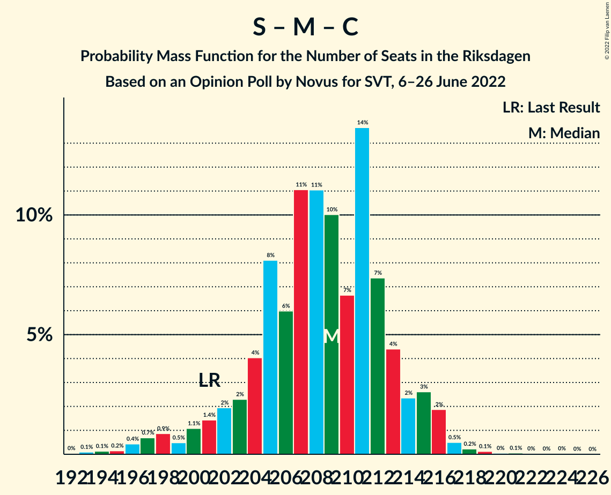

# Opinion Poll by Novus for SVT, 6–26 June 2022

<a href="#voting-intentions">Voting Intentions</a> | <a href="#seats">Seats</a> | <a href="#coalitions">Coalitions</a> | <a href="#technical-information">Technical Information</a>

## Voting Intentions

### Confidence Intervals

| Party | Last Result | Poll Result | 80% Confidence Interval | 90% Confidence Interval | 95% Confidence Interval | 99% Confidence Interval |
|:-----:|:-----------:|:-----------:|:-----------------------:|:-----------------------:|:-----------------------:|:-----------------------:|
| Sveriges socialdemokratiska arbetareparti | 28.3% | 31.7% | 30.6–32.9% |30.3–33.2% |30.0–33.5% |29.5–34.0% |
| Moderata samlingspartiet | 19.8% | 19.6% | 18.7–20.6% |18.4–20.9% |18.2–21.1% |17.7–21.6% |
| Sverigedemokraterna | 17.5% | 17.4% | 16.5–18.4% |16.3–18.6% |16.0–18.9% |15.6–19.3% |
| Vänsterpartiet | 8.0% | 8.8% | 8.2–9.5% |8.0–9.7% |7.8–9.9% |7.5–10.3% |
| Kristdemokraterna | 6.3% | 6.7% | 6.1–7.3% |6.0–7.5% |5.8–7.7% |5.6–8.0% |
| Centerpartiet | 8.6% | 5.4% | 4.9–6.0% |4.7–6.1% |4.6–6.3% |4.4–6.6% |
| Liberalerna | 5.5% | 5.0% | 4.5–5.6% |4.4–5.7% |4.3–5.9% |4.0–6.2% |
| Miljöpartiet de gröna | 4.4% | 3.5% | 3.1–4.0% |3.0–4.1% |2.9–4.2% |2.7–4.5% |

*Note:* The poll result column reflects the actual value used in the calculations. Published results may vary slightly, and in addition be rounded to fewer digits.

## Seats

### Confidence Intervals

| Party | Last Result | Median | 80% Confidence Interval | 90% Confidence Interval | 95% Confidence Interval | 99% Confidence Interval |
|:-----:|:-----------:|:------:|:-----------------------:|:-----------------------:|:-----------------------:|:-----------------------:|
| <a href="#sveriges-socialdemokratiska-arbetareparti">Sveriges socialdemokratiska arbetareparti</a> | 100 | 116 | 112–121 |111–122 |110–123 |107–125 |
| <a href="#moderata-samlingspartiet">Moderata samlingspartiet</a> | 70 | 72 | 68–76 |67–77 |67–78 |65–79 |
| <a href="#sverigedemokraterna">Sverigedemokraterna</a> | 62 | 64 | 60–68 |60–68 |59–69 |57–71 |
| <a href="#vänsterpartiet">Vänsterpartiet</a> | 28 | 32 | 30–35 |29–36 |29–36 |27–38 |
| <a href="#kristdemokraterna">Kristdemokraterna</a> | 22 | 25 | 22–27 |22–28 |21–28 |20–29 |
| <a href="#centerpartiet">Centerpartiet</a> | 31 | 20 | 18–22 |17–23 |17–23 |16–24 |
| <a href="#liberalerna">Liberalerna</a> | 20 | 19 | 17–20 |16–21 |16–22 |15–22 |
| <a href="#miljöpartiet-de-gröna">Miljöpartiet de gröna</a> | 16 | 0 | 0 |0–14 |0–15 |0–16 |

### Sveriges socialdemokratiska arbetareparti

*For a full overview of the results for this party, see the [Sveriges socialdemokratiska arbetareparti](party-sverigessocialdemokratiskaarbetareparti.html) page.*

| Number of Seats | Probability | Accumulated | Special Marks |
|:---------------:|:-----------:|:-----------:|:-------------:|
| 100 | 0% | 100% | Last Result |
| 101 | 0% | 100% |  |
| 102 | 0% | 100% |  |
| 103 | 0% | 100% |  |
| 104 | 0% | 100% |  |
| 105 | 0.2% | 99.9% |  |
| 106 | 0.2% | 99.7% |  |
| 107 | 0.4% | 99.6% |  |
| 108 | 0.6% | 99.2% |  |
| 109 | 1.0% | 98.7% |  |
| 110 | 2% | 98% |  |
| 111 | 3% | 96% |  |
| 112 | 5% | 93% |  |
| 113 | 7% | 87% |  |
| 114 | 10% | 81% |  |
| 115 | 10% | 70% |  |
| 116 | 11% | 60% | Median |
| 117 | 10% | 49% |  |
| 118 | 9% | 39% |  |
| 119 | 11% | 30% |  |
| 120 | 5% | 18% |  |
| 121 | 6% | 13% |  |
| 122 | 3% | 7% |  |
| 123 | 2% | 4% |  |
| 124 | 0.6% | 2% |  |
| 125 | 0.7% | 1.1% |  |
| 126 | 0.1% | 0.3% |  |
| 127 | 0.1% | 0.2% |  |
| 128 | 0% | 0.1% |  |
| 129 | 0% | 0% |  |

### Moderata samlingspartiet

*For a full overview of the results for this party, see the [Moderata samlingspartiet](party-moderatasamlingspartiet.html) page.*

| Number of Seats | Probability | Accumulated | Special Marks |
|:---------------:|:-----------:|:-----------:|:-------------:|
| 62 | 0% | 100% |  |
| 63 | 0.1% | 99.9% |  |
| 64 | 0.3% | 99.8% |  |
| 65 | 0.7% | 99.5% |  |
| 66 | 1.3% | 98.8% |  |
| 67 | 3% | 98% |  |
| 68 | 6% | 94% |  |
| 69 | 8% | 88% |  |
| 70 | 11% | 80% | Last Result |
| 71 | 12% | 69% |  |
| 72 | 14% | 57% | Median |
| 73 | 11% | 43% |  |
| 74 | 11% | 31% |  |
| 75 | 8% | 20% |  |
| 76 | 7% | 12% |  |
| 77 | 3% | 6% |  |
| 78 | 2% | 3% |  |
| 79 | 0.9% | 1.3% |  |
| 80 | 0.3% | 0.4% |  |
| 81 | 0.1% | 0.2% |  |
| 82 | 0% | 0.1% |  |
| 83 | 0% | 0% |  |

### Sverigedemokraterna

*For a full overview of the results for this party, see the [Sverigedemokraterna](party-sverigedemokraterna.html) page.*

| Number of Seats | Probability | Accumulated | Special Marks |
|:---------------:|:-----------:|:-----------:|:-------------:|
| 55 | 0% | 100% |  |
| 56 | 0.2% | 99.9% |  |
| 57 | 0.6% | 99.7% |  |
| 58 | 1.1% | 99.2% |  |
| 59 | 2% | 98% |  |
| 60 | 8% | 96% |  |
| 61 | 7% | 88% |  |
| 62 | 11% | 81% | Last Result |
| 63 | 10% | 70% |  |
| 64 | 17% | 60% | Median |
| 65 | 15% | 43% |  |
| 66 | 7% | 28% |  |
| 67 | 10% | 21% |  |
| 68 | 6% | 11% |  |
| 69 | 2% | 5% |  |
| 70 | 1.3% | 2% |  |
| 71 | 0.6% | 0.9% |  |
| 72 | 0.2% | 0.3% |  |
| 73 | 0.1% | 0.1% |  |
| 74 | 0% | 0% |  |

### Vänsterpartiet

*For a full overview of the results for this party, see the [Vänsterpartiet](party-vänsterpartiet.html) page.*

| Number of Seats | Probability | Accumulated | Special Marks |
|:---------------:|:-----------:|:-----------:|:-------------:|
| 26 | 0.1% | 100% |  |
| 27 | 0.6% | 99.9% |  |
| 28 | 2% | 99.3% | Last Result |
| 29 | 5% | 98% |  |
| 30 | 8% | 93% |  |
| 31 | 15% | 84% |  |
| 32 | 20% | 69% | Median |
| 33 | 17% | 49% |  |
| 34 | 17% | 33% |  |
| 35 | 11% | 16% |  |
| 36 | 4% | 6% |  |
| 37 | 1.5% | 2% |  |
| 38 | 0.5% | 0.6% |  |
| 39 | 0.1% | 0.2% |  |
| 40 | 0% | 0% |  |

### Kristdemokraterna

*For a full overview of the results for this party, see the [Kristdemokraterna](party-kristdemokraterna.html) page.*

| Number of Seats | Probability | Accumulated | Special Marks |
|:---------------:|:-----------:|:-----------:|:-------------:|
| 19 | 0.1% | 100% |  |
| 20 | 0.5% | 99.9% |  |
| 21 | 2% | 99.4% |  |
| 22 | 8% | 97% | Last Result |
| 23 | 17% | 90% |  |
| 24 | 17% | 73% |  |
| 25 | 23% | 56% | Median |
| 26 | 19% | 33% |  |
| 27 | 7% | 14% |  |
| 28 | 6% | 7% |  |
| 29 | 1.2% | 2% |  |
| 30 | 0.2% | 0.3% |  |
| 31 | 0.1% | 0.1% |  |
| 32 | 0% | 0% |  |

### Centerpartiet

*For a full overview of the results for this party, see the [Centerpartiet](party-centerpartiet.html) page.*

| Number of Seats | Probability | Accumulated | Special Marks |
|:---------------:|:-----------:|:-----------:|:-------------:|
| 15 | 0.2% | 100% |  |
| 16 | 1.1% | 99.8% |  |
| 17 | 6% | 98.8% |  |
| 18 | 12% | 93% |  |
| 19 | 23% | 81% |  |
| 20 | 21% | 58% | Median |
| 21 | 20% | 36% |  |
| 22 | 11% | 16% |  |
| 23 | 4% | 6% |  |
| 24 | 1.5% | 2% |  |
| 25 | 0.2% | 0.3% |  |
| 26 | 0% | 0% |  |
| 27 | 0% | 0% |  |
| 28 | 0% | 0% |  |
| 29 | 0% | 0% |  |
| 30 | 0% | 0% |  |
| 31 | 0% | 0% | Last Result |

### Liberalerna

*For a full overview of the results for this party, see the [Liberalerna](party-liberalerna.html) page.*

| Number of Seats | Probability | Accumulated | Special Marks |
|:---------------:|:-----------:|:-----------:|:-------------:|
| 0 | 0.3% | 100% |  |
| 1 | 0% | 99.7% |  |
| 2 | 0% | 99.7% |  |
| 3 | 0% | 99.7% |  |
| 4 | 0% | 99.7% |  |
| 5 | 0% | 99.7% |  |
| 6 | 0% | 99.7% |  |
| 7 | 0% | 99.7% |  |
| 8 | 0% | 99.7% |  |
| 9 | 0% | 99.7% |  |
| 10 | 0% | 99.7% |  |
| 11 | 0% | 99.7% |  |
| 12 | 0% | 99.7% |  |
| 13 | 0% | 99.7% |  |
| 14 | 0% | 99.7% |  |
| 15 | 2% | 99.7% |  |
| 16 | 6% | 98% |  |
| 17 | 22% | 92% |  |
| 18 | 20% | 70% |  |
| 19 | 26% | 50% | Median |
| 20 | 15% | 24% | Last Result |
| 21 | 7% | 9% |  |
| 22 | 2% | 3% |  |
| 23 | 0.3% | 0.4% |  |
| 24 | 0.1% | 0.1% |  |
| 25 | 0% | 0% |  |

### Miljöpartiet de gröna

*For a full overview of the results for this party, see the [Miljöpartiet de gröna](party-miljöpartietdegröna.html) page.*

| Number of Seats | Probability | Accumulated | Special Marks |
|:---------------:|:-----------:|:-----------:|:-------------:|
| 0 | 94% | 100% | Median |
| 1 | 0% | 6% |  |
| 2 | 0% | 6% |  |
| 3 | 0% | 6% |  |
| 4 | 0% | 6% |  |
| 5 | 0% | 6% |  |
| 6 | 0% | 6% |  |
| 7 | 0% | 6% |  |
| 8 | 0% | 6% |  |
| 9 | 0% | 6% |  |
| 10 | 0% | 6% |  |
| 11 | 0% | 6% |  |
| 12 | 0% | 6% |  |
| 13 | 0% | 6% |  |
| 14 | 2% | 6% |  |
| 15 | 3% | 4% |  |
| 16 | 1.4% | 2% | Last Result |
| 17 | 0.1% | 0.1% |  |
| 18 | 0% | 0% |  |

## Coalitions

### Confidence Intervals

| Coalition | Last Result | Median | Majority? | 80% Confidence Interval | 90% Confidence Interval | 95% Confidence Interval | 99% Confidence Interval |
|:---------:|:-----------:|:------:|:---------:|:-----------------------:|:-----------------------:|:-----------------------:|:-----------------------:|
| Sveriges socialdemokratiska arbetareparti – Moderata samlingspartiet – Centerpartiet | 201 | 209 | 100% | 204–213 | 201–215 | 199–216 | 196–218 |
| Sveriges socialdemokratiska arbetareparti – Vänsterpartiet – Centerpartiet – Liberalerna – Miljöpartiet de gröna | 195 | 188 | 99.9% | 183–193 | 183–195 | 181–197 | 179–200 |
| Sveriges socialdemokratiska arbetareparti – Moderata samlingspartiet | 170 | 189 | 99.8% | 183–193 | 182–195 | 179–196 | 176–198 |
| Moderata samlingspartiet – Sverigedemokraterna – Kristdemokraterna | 154 | 161 | 0.1% | 156–166 | 154–166 | 152–168 | 149–170 |
| Sveriges socialdemokratiska arbetareparti – Centerpartiet – Liberalerna – Miljöpartiet de gröna | 167 | 155 | 0% | 151–161 | 150–163 | 149–165 | 146–168 |
| Sveriges socialdemokratiska arbetareparti – Vänsterpartiet – Miljöpartiet de gröna | 144 | 149 | 0% | 145–155 | 144–157 | 143–159 | 141–162 |
| Sveriges socialdemokratiska arbetareparti – Vänsterpartiet | 128 | 149 | 0% | 144–154 | 143–155 | 142–156 | 138–158 |
| Moderata samlingspartiet – Kristdemokraterna – Centerpartiet – Liberalerna | 143 | 135 | 0% | 131–139 | 129–141 | 128–142 | 124–144 |
| Moderata samlingspartiet – Sverigedemokraterna | 132 | 136 | 0% | 131–141 | 130–142 | 128–142 | 126–145 |
| Sveriges socialdemokratiska arbetareparti – Miljöpartiet de gröna | 116 | 117 | 0% | 113–122 | 112–125 | 111–128 | 109–131 |
| Moderata samlingspartiet – Kristdemokraterna – Centerpartiet | 123 | 117 | 0% | 112–122 | 111–122 | 110–123 | 107–125 |
| Moderata samlingspartiet – Centerpartiet – Liberalerna | 121 | 110 | 0% | 106–115 | 105–116 | 104–117 | 100–119 |
| Moderata samlingspartiet – Centerpartiet | 101 | 92 | 0% | 88–96 | 87–97 | 86–98 | 83–100 |

### Sveriges socialdemokratiska arbetareparti – Moderata samlingspartiet – Centerpartiet

| Number of Seats | Probability | Accumulated | Special Marks |
|:---------------:|:-----------:|:-----------:|:-------------:|
| 192 | 0% | 100% |  |
| 193 | 0.1% | 99.9% |  |
| 194 | 0.1% | 99.8% |  |
| 195 | 0.2% | 99.7% |  |
| 196 | 0.4% | 99.5% |  |
| 197 | 0.7% | 99.1% |  |
| 198 | 0.9% | 98% |  |
| 199 | 0.5% | 98% |  |
| 200 | 1.1% | 97% |  |
| 201 | 1.4% | 96% | Last Result |
| 202 | 2% | 95% |  |
| 203 | 2% | 93% |  |
| 204 | 4% | 90% |  |
| 205 | 8% | 86% |  |
| 206 | 6% | 78% |  |
| 207 | 11% | 72% |  |
| 208 | 11% | 61% | Median |
| 209 | 10% | 50% |  |
| 210 | 7% | 40% |  |
| 211 | 14% | 33% |  |
| 212 | 7% | 20% |  |
| 213 | 4% | 12% |  |
| 214 | 2% | 8% |  |
| 215 | 3% | 6% |  |
| 216 | 2% | 3% |  |
| 217 | 0.5% | 1.1% |  |
| 218 | 0.2% | 0.6% |  |
| 219 | 0.1% | 0.4% |  |
| 220 | 0% | 0.2% |  |
| 221 | 0.1% | 0.2% |  |
| 222 | 0% | 0.1% |  |
| 223 | 0% | 0.1% |  |
| 224 | 0% | 0.1% |  |
| 225 | 0% | 0% |  |

### Sveriges socialdemokratiska arbetareparti – Vänsterpartiet – Centerpartiet – Liberalerna – Miljöpartiet de gröna

| Number of Seats | Probability | Accumulated | Special Marks |
|:---------------:|:-----------:|:-----------:|:-------------:|
| 174 | 0% | 100% |  |
| 175 | 0% | 99.9% | Majority |
| 176 | 0.1% | 99.9% |  |
| 177 | 0.1% | 99.8% |  |
| 178 | 0.2% | 99.7% |  |
| 179 | 0.3% | 99.5% |  |
| 180 | 0.5% | 99.2% |  |
| 181 | 2% | 98.7% |  |
| 182 | 2% | 97% |  |
| 183 | 5% | 95% |  |
| 184 | 7% | 90% |  |
| 185 | 10% | 83% |  |
| 186 | 11% | 73% |  |
| 187 | 8% | 62% | Median |
| 188 | 8% | 54% |  |
| 189 | 8% | 46% |  |
| 190 | 10% | 37% |  |
| 191 | 6% | 28% |  |
| 192 | 5% | 22% |  |
| 193 | 8% | 17% |  |
| 194 | 3% | 9% |  |
| 195 | 2% | 6% | Last Result |
| 196 | 1.1% | 4% |  |
| 197 | 1.2% | 3% |  |
| 198 | 0.6% | 2% |  |
| 199 | 0.4% | 0.9% |  |
| 200 | 0.3% | 0.5% |  |
| 201 | 0.1% | 0.2% |  |
| 202 | 0.1% | 0.1% |  |
| 203 | 0% | 0.1% |  |
| 204 | 0% | 0% |  |

### Sveriges socialdemokratiska arbetareparti – Moderata samlingspartiet

| Number of Seats | Probability | Accumulated | Special Marks |
|:---------------:|:-----------:|:-----------:|:-------------:|
| 170 | 0% | 100% | Last Result |
| 171 | 0% | 100% |  |
| 172 | 0% | 100% |  |
| 173 | 0.1% | 100% |  |
| 174 | 0.1% | 99.9% |  |
| 175 | 0.2% | 99.8% | Majority |
| 176 | 0.3% | 99.6% |  |
| 177 | 0.6% | 99.4% |  |
| 178 | 0.6% | 98.8% |  |
| 179 | 0.8% | 98% |  |
| 180 | 0.8% | 97% |  |
| 181 | 1.2% | 97% |  |
| 182 | 2% | 95% |  |
| 183 | 5% | 94% |  |
| 184 | 3% | 88% |  |
| 185 | 6% | 85% |  |
| 186 | 8% | 79% |  |
| 187 | 9% | 71% |  |
| 188 | 10% | 62% | Median |
| 189 | 10% | 52% |  |
| 190 | 13% | 42% |  |
| 191 | 8% | 29% |  |
| 192 | 7% | 21% |  |
| 193 | 6% | 14% |  |
| 194 | 3% | 9% |  |
| 195 | 2% | 6% |  |
| 196 | 2% | 3% |  |
| 197 | 0.9% | 2% |  |
| 198 | 0.3% | 0.7% |  |
| 199 | 0.1% | 0.3% |  |
| 200 | 0.1% | 0.2% |  |
| 201 | 0.1% | 0.2% |  |
| 202 | 0% | 0.1% |  |
| 203 | 0% | 0.1% |  |
| 204 | 0% | 0% |  |

### Moderata samlingspartiet – Sverigedemokraterna – Kristdemokraterna

| Number of Seats | Probability | Accumulated | Special Marks |
|:---------------:|:-----------:|:-----------:|:-------------:|
| 146 | 0% | 100% |  |
| 147 | 0.1% | 99.9% |  |
| 148 | 0.1% | 99.9% |  |
| 149 | 0.3% | 99.8% |  |
| 150 | 0.4% | 99.5% |  |
| 151 | 0.6% | 99.1% |  |
| 152 | 1.2% | 98% |  |
| 153 | 1.1% | 97% |  |
| 154 | 2% | 96% | Last Result |
| 155 | 3% | 94% |  |
| 156 | 8% | 91% |  |
| 157 | 5% | 83% |  |
| 158 | 6% | 78% |  |
| 159 | 10% | 72% |  |
| 160 | 8% | 63% |  |
| 161 | 8% | 54% | Median |
| 162 | 8% | 46% |  |
| 163 | 11% | 38% |  |
| 164 | 10% | 27% |  |
| 165 | 7% | 17% |  |
| 166 | 5% | 10% |  |
| 167 | 2% | 5% |  |
| 168 | 2% | 3% |  |
| 169 | 0.5% | 1.3% |  |
| 170 | 0.3% | 0.8% |  |
| 171 | 0.2% | 0.5% |  |
| 172 | 0.1% | 0.3% |  |
| 173 | 0.1% | 0.2% |  |
| 174 | 0% | 0.1% |  |
| 175 | 0% | 0.1% | Majority |
| 176 | 0% | 0% |  |

### Sveriges socialdemokratiska arbetareparti – Centerpartiet – Liberalerna – Miljöpartiet de gröna

| Number of Seats | Probability | Accumulated | Special Marks |
|:---------------:|:-----------:|:-----------:|:-------------:|
| 140 | 0% | 100% |  |
| 141 | 0% | 99.9% |  |
| 142 | 0% | 99.9% |  |
| 143 | 0% | 99.9% |  |
| 144 | 0.1% | 99.8% |  |
| 145 | 0.1% | 99.8% |  |
| 146 | 0.2% | 99.7% |  |
| 147 | 0.3% | 99.4% |  |
| 148 | 0.9% | 99.1% |  |
| 149 | 2% | 98% |  |
| 150 | 4% | 96% |  |
| 151 | 6% | 92% |  |
| 152 | 9% | 86% |  |
| 153 | 10% | 77% |  |
| 154 | 8% | 67% |  |
| 155 | 11% | 59% | Median |
| 156 | 8% | 49% |  |
| 157 | 10% | 41% |  |
| 158 | 6% | 31% |  |
| 159 | 8% | 25% |  |
| 160 | 5% | 16% |  |
| 161 | 4% | 12% |  |
| 162 | 2% | 8% |  |
| 163 | 1.5% | 6% |  |
| 164 | 0.9% | 4% |  |
| 165 | 1.3% | 4% |  |
| 166 | 0.3% | 2% |  |
| 167 | 1.1% | 2% | Last Result |
| 168 | 0.3% | 0.8% |  |
| 169 | 0.3% | 0.5% |  |
| 170 | 0.1% | 0.2% |  |
| 171 | 0% | 0.1% |  |
| 172 | 0% | 0% |  |

### Sveriges socialdemokratiska arbetareparti – Vänsterpartiet – Miljöpartiet de gröna

| Number of Seats | Probability | Accumulated | Special Marks |
|:---------------:|:-----------:|:-----------:|:-------------:|
| 138 | 0% | 100% |  |
| 139 | 0.1% | 99.9% |  |
| 140 | 0.2% | 99.8% |  |
| 141 | 0.4% | 99.6% |  |
| 142 | 0.5% | 99.3% |  |
| 143 | 3% | 98.7% |  |
| 144 | 2% | 95% | Last Result |
| 145 | 5% | 93% |  |
| 146 | 11% | 88% |  |
| 147 | 7% | 77% |  |
| 148 | 8% | 70% | Median |
| 149 | 12% | 62% |  |
| 150 | 9% | 50% |  |
| 151 | 8% | 41% |  |
| 152 | 8% | 33% |  |
| 153 | 8% | 26% |  |
| 154 | 6% | 18% |  |
| 155 | 3% | 12% |  |
| 156 | 4% | 9% |  |
| 157 | 1.1% | 6% |  |
| 158 | 1.1% | 5% |  |
| 159 | 2% | 3% |  |
| 160 | 0.3% | 2% |  |
| 161 | 0.5% | 1.4% |  |
| 162 | 0.5% | 0.9% |  |
| 163 | 0.1% | 0.4% |  |
| 164 | 0.1% | 0.3% |  |
| 165 | 0.1% | 0.2% |  |
| 166 | 0% | 0.1% |  |
| 167 | 0% | 0% |  |

### Sveriges socialdemokratiska arbetareparti – Vänsterpartiet

| Number of Seats | Probability | Accumulated | Special Marks |
|:---------------:|:-----------:|:-----------:|:-------------:|
| 128 | 0% | 100% | Last Result |
| 129 | 0% | 100% |  |
| 130 | 0% | 100% |  |
| 131 | 0% | 100% |  |
| 132 | 0% | 100% |  |
| 133 | 0% | 100% |  |
| 134 | 0% | 100% |  |
| 135 | 0.1% | 100% |  |
| 136 | 0.1% | 99.9% |  |
| 137 | 0.1% | 99.9% |  |
| 138 | 0.3% | 99.8% |  |
| 139 | 0.5% | 99.5% |  |
| 140 | 0.5% | 99.0% |  |
| 141 | 0.8% | 98% |  |
| 142 | 2% | 98% |  |
| 143 | 4% | 96% |  |
| 144 | 4% | 92% |  |
| 145 | 5% | 88% |  |
| 146 | 12% | 83% |  |
| 147 | 8% | 71% |  |
| 148 | 8% | 64% | Median |
| 149 | 12% | 56% |  |
| 150 | 9% | 44% |  |
| 151 | 8% | 35% |  |
| 152 | 8% | 27% |  |
| 153 | 7% | 19% |  |
| 154 | 5% | 12% |  |
| 155 | 3% | 7% |  |
| 156 | 2% | 4% |  |
| 157 | 0.6% | 1.4% |  |
| 158 | 0.5% | 0.8% |  |
| 159 | 0.2% | 0.3% |  |
| 160 | 0.1% | 0.2% |  |
| 161 | 0% | 0.1% |  |
| 162 | 0% | 0.1% |  |
| 163 | 0% | 0% |  |

### Moderata samlingspartiet – Kristdemokraterna – Centerpartiet – Liberalerna

| Number of Seats | Probability | Accumulated | Special Marks |
|:---------------:|:-----------:|:-----------:|:-------------:|
| 119 | 0% | 100% |  |
| 120 | 0% | 99.9% |  |
| 121 | 0% | 99.9% |  |
| 122 | 0.1% | 99.9% |  |
| 123 | 0.2% | 99.8% |  |
| 124 | 0.3% | 99.6% |  |
| 125 | 0.3% | 99.4% |  |
| 126 | 0.5% | 99.1% |  |
| 127 | 1.0% | 98.6% |  |
| 128 | 1.3% | 98% |  |
| 129 | 2% | 96% |  |
| 130 | 4% | 94% |  |
| 131 | 7% | 90% |  |
| 132 | 6% | 84% |  |
| 133 | 6% | 77% |  |
| 134 | 15% | 71% |  |
| 135 | 9% | 56% |  |
| 136 | 15% | 47% | Median |
| 137 | 6% | 32% |  |
| 138 | 7% | 25% |  |
| 139 | 8% | 18% |  |
| 140 | 3% | 10% |  |
| 141 | 4% | 7% |  |
| 142 | 1.3% | 3% |  |
| 143 | 1.1% | 2% | Last Result |
| 144 | 0.5% | 0.7% |  |
| 145 | 0.1% | 0.2% |  |
| 146 | 0.1% | 0.1% |  |
| 147 | 0% | 0% |  |

### Moderata samlingspartiet – Sverigedemokraterna

| Number of Seats | Probability | Accumulated | Special Marks |
|:---------------:|:-----------:|:-----------:|:-------------:|
| 123 | 0.1% | 100% |  |
| 124 | 0.1% | 99.9% |  |
| 125 | 0.2% | 99.7% |  |
| 126 | 0.3% | 99.6% |  |
| 127 | 1.0% | 99.2% |  |
| 128 | 1.2% | 98% |  |
| 129 | 1.4% | 97% |  |
| 130 | 2% | 96% |  |
| 131 | 6% | 94% |  |
| 132 | 7% | 88% | Last Result |
| 133 | 8% | 81% |  |
| 134 | 7% | 73% |  |
| 135 | 9% | 66% |  |
| 136 | 10% | 57% | Median |
| 137 | 12% | 48% |  |
| 138 | 8% | 36% |  |
| 139 | 7% | 28% |  |
| 140 | 11% | 22% |  |
| 141 | 5% | 11% |  |
| 142 | 4% | 6% |  |
| 143 | 0.7% | 2% |  |
| 144 | 0.7% | 2% |  |
| 145 | 0.5% | 0.9% |  |
| 146 | 0.2% | 0.4% |  |
| 147 | 0.1% | 0.2% |  |
| 148 | 0% | 0.1% |  |
| 149 | 0% | 0.1% |  |
| 150 | 0% | 0% |  |

### Sveriges socialdemokratiska arbetareparti – Miljöpartiet de gröna

| Number of Seats | Probability | Accumulated | Special Marks |
|:---------------:|:-----------:|:-----------:|:-------------:|
| 106 | 0% | 100% |  |
| 107 | 0.1% | 99.9% |  |
| 108 | 0.2% | 99.8% |  |
| 109 | 0.6% | 99.6% |  |
| 110 | 0.8% | 99.0% |  |
| 111 | 3% | 98% |  |
| 112 | 4% | 95% |  |
| 113 | 6% | 91% |  |
| 114 | 10% | 85% |  |
| 115 | 9% | 75% |  |
| 116 | 11% | 66% | Last Result, Median |
| 117 | 10% | 55% |  |
| 118 | 9% | 45% |  |
| 119 | 11% | 36% |  |
| 120 | 6% | 25% |  |
| 121 | 6% | 19% |  |
| 122 | 3% | 13% |  |
| 123 | 2% | 10% |  |
| 124 | 1.2% | 7% |  |
| 125 | 1.3% | 6% |  |
| 126 | 1.0% | 5% |  |
| 127 | 1.0% | 4% |  |
| 128 | 0.7% | 3% |  |
| 129 | 1.0% | 2% |  |
| 130 | 0.4% | 1.2% |  |
| 131 | 0.3% | 0.8% |  |
| 132 | 0.3% | 0.5% |  |
| 133 | 0.1% | 0.2% |  |
| 134 | 0.1% | 0.1% |  |
| 135 | 0% | 0.1% |  |
| 136 | 0% | 0% |  |

### Moderata samlingspartiet – Kristdemokraterna – Centerpartiet

| Number of Seats | Probability | Accumulated | Special Marks |
|:---------------:|:-----------:|:-----------:|:-------------:|
| 105 | 0.1% | 100% |  |
| 106 | 0.2% | 99.9% |  |
| 107 | 0.4% | 99.7% |  |
| 108 | 0.6% | 99.3% |  |
| 109 | 1.0% | 98.7% |  |
| 110 | 2% | 98% |  |
| 111 | 4% | 96% |  |
| 112 | 4% | 92% |  |
| 113 | 8% | 88% |  |
| 114 | 6% | 80% |  |
| 115 | 9% | 74% |  |
| 116 | 9% | 65% |  |
| 117 | 16% | 57% | Median |
| 118 | 14% | 41% |  |
| 119 | 8% | 26% |  |
| 120 | 5% | 19% |  |
| 121 | 3% | 14% |  |
| 122 | 6% | 10% |  |
| 123 | 2% | 4% | Last Result |
| 124 | 0.7% | 2% |  |
| 125 | 0.3% | 0.8% |  |
| 126 | 0.2% | 0.5% |  |
| 127 | 0.1% | 0.2% |  |
| 128 | 0.1% | 0.1% |  |
| 129 | 0% | 0% |  |

### Moderata samlingspartiet – Centerpartiet – Liberalerna

| Number of Seats | Probability | Accumulated | Special Marks |
|:---------------:|:-----------:|:-----------:|:-------------:|
| 94 | 0% | 100% |  |
| 95 | 0% | 99.9% |  |
| 96 | 0% | 99.9% |  |
| 97 | 0.1% | 99.9% |  |
| 98 | 0.1% | 99.8% |  |
| 99 | 0.1% | 99.8% |  |
| 100 | 0.2% | 99.6% |  |
| 101 | 0.5% | 99.4% |  |
| 102 | 0.5% | 98.9% |  |
| 103 | 1.0% | 98% |  |
| 104 | 1.4% | 98% |  |
| 105 | 3% | 96% |  |
| 106 | 4% | 93% |  |
| 107 | 8% | 89% |  |
| 108 | 11% | 81% |  |
| 109 | 8% | 69% |  |
| 110 | 13% | 62% |  |
| 111 | 11% | 49% | Median |
| 112 | 13% | 37% |  |
| 113 | 7% | 24% |  |
| 114 | 5% | 17% |  |
| 115 | 5% | 12% |  |
| 116 | 3% | 7% |  |
| 117 | 2% | 4% |  |
| 118 | 0.7% | 1.3% |  |
| 119 | 0.4% | 0.6% |  |
| 120 | 0.1% | 0.2% |  |
| 121 | 0.1% | 0.1% | Last Result |
| 122 | 0% | 0% |  |

### Moderata samlingspartiet – Centerpartiet

| Number of Seats | Probability | Accumulated | Special Marks |
|:---------------:|:-----------:|:-----------:|:-------------:|
| 81 | 0% | 100% |  |
| 82 | 0.1% | 99.9% |  |
| 83 | 0.6% | 99.8% |  |
| 84 | 0.5% | 99.2% |  |
| 85 | 1.1% | 98.7% |  |
| 86 | 1.4% | 98% |  |
| 87 | 3% | 96% |  |
| 88 | 10% | 93% |  |
| 89 | 7% | 83% |  |
| 90 | 8% | 77% |  |
| 91 | 12% | 69% |  |
| 92 | 12% | 56% | Median |
| 93 | 14% | 44% |  |
| 94 | 10% | 30% |  |
| 95 | 9% | 21% |  |
| 96 | 4% | 12% |  |
| 97 | 3% | 8% |  |
| 98 | 3% | 5% |  |
| 99 | 1.3% | 2% |  |
| 100 | 0.3% | 0.7% |  |
| 101 | 0.2% | 0.4% | Last Result |
| 102 | 0.1% | 0.1% |  |
| 103 | 0% | 0.1% |  |
| 104 | 0% | 0% |  |

## Technical Information

### Opinion Poll

+ **Polling firm:** Novus
+ **Commissioner(s):** SVT
+ **Fieldwork period:** 6–26 June 2022

### Calculations

+ **Sample size:** 2838
+ **Simulations done:** 1,048,576
+ **Error estimate:** 0.66%

