# Opinion Poll by Demoskop for Aftonbladet, 22–30 June 2022

<a href="#voting-intentions">Voting Intentions</a> | <a href="#seats">Seats</a> | <a href="#coalitions">Coalitions</a> | <a href="#technical-information">Technical Information</a>

## Voting Intentions

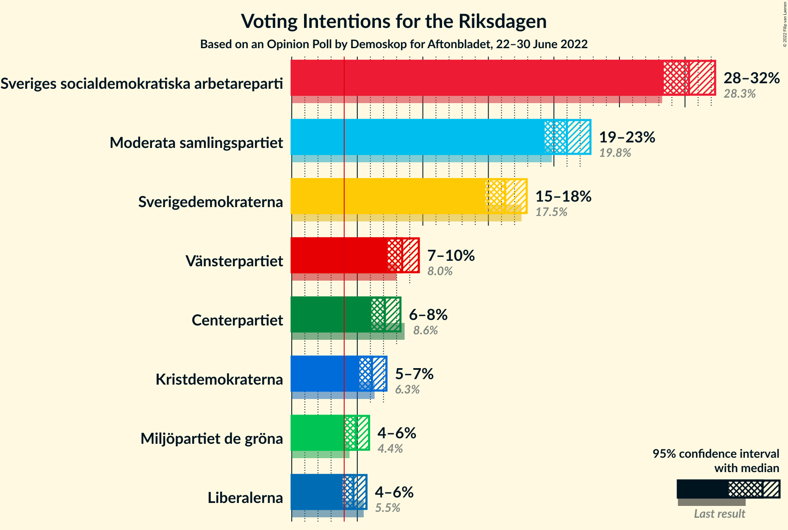

### Confidence Intervals

| Party | Last Result | Poll Result | 80% Confidence Interval | 90% Confidence Interval | 95% Confidence Interval | 99% Confidence Interval |
|:-----:|:-----------:|:-----------:|:-----------------------:|:-----------------------:|:-----------------------:|:-----------------------:|
| Sveriges socialdemokratiska arbetareparti | 28.3% | 30.3% | 29.1–31.6% |28.7–32.0% |28.4–32.3% |27.8–32.9% |
| Moderata samlingspartiet | 19.8% | 21.0% | 19.9–22.2% |19.6–22.5% |19.3–22.8% |18.8–23.4% |
| Sverigedemokraterna | 17.5% | 16.3% | 15.3–17.4% |15.0–17.6% |14.8–17.9% |14.3–18.4% |
| Vänsterpartiet | 8.0% | 8.4% | 7.7–9.3% |7.5–9.5% |7.3–9.7% |7.0–10.1% |
| Centerpartiet | 8.6% | 7.1% | 6.4–7.9% |6.2–8.1% |6.1–8.3% |5.8–8.7% |
| Kristdemokraterna | 6.3% | 6.1% | 5.5–6.8% |5.3–7.0% |5.2–7.2% |4.9–7.6% |
| Miljöpartiet de gröna | 4.4% | 4.9% | 4.3–5.5% |4.2–5.7% |4.1–5.9% |3.8–6.2% |
| Liberalerna | 5.5% | 4.7% | 4.2–5.3% |4.0–5.5% |3.9–5.7% |3.6–6.0% |

*Note:* The poll result column reflects the actual value used in the calculations. Published results may vary slightly, and in addition be rounded to fewer digits.

## Seats

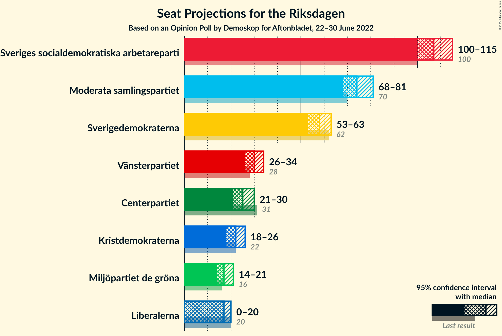

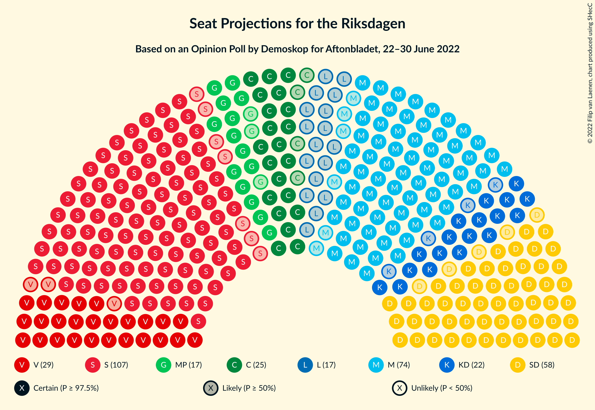

### Confidence Intervals

| Party | Last Result | Median | 80% Confidence Interval | 90% Confidence Interval | 95% Confidence Interval | 99% Confidence Interval |
|:-----:|:-----------:|:------:|:-----------------------:|:-----------------------:|:-----------------------:|:-----------------------:|
| <a href="#sveriges-socialdemokratiska-arbetareparti">Sveriges socialdemokratiska arbetareparti</a> | 100 | 107 | 103–112 |101–113 |100–115 |98–118 |
| <a href="#moderata-samlingspartiet">Moderata samlingspartiet</a> | 70 | 74 | 70–78 |69–80 |68–81 |67–84 |
| <a href="#sverigedemokraterna">Sverigedemokraterna</a> | 62 | 58 | 54–62 |53–63 |53–63 |51–65 |
| <a href="#vänsterpartiet">Vänsterpartiet</a> | 28 | 30 | 27–33 |26–33 |26–34 |25–36 |
| <a href="#centerpartiet">Centerpartiet</a> | 31 | 25 | 23–28 |22–29 |21–30 |21–31 |
| <a href="#kristdemokraterna">Kristdemokraterna</a> | 22 | 22 | 19–24 |19–25 |18–26 |17–27 |
| <a href="#miljöpartiet-de-gröna">Miljöpartiet de gröna</a> | 16 | 17 | 15–19 |15–20 |14–21 |0–22 |
| <a href="#liberalerna">Liberalerna</a> | 20 | 17 | 15–19 |14–20 |0–20 |0–21 |

### Sveriges socialdemokratiska arbetareparti

*For a full overview of the results for this party, see the [Sveriges socialdemokratiska arbetareparti](party-sverigessocialdemokratiskaarbetareparti.html) page.*

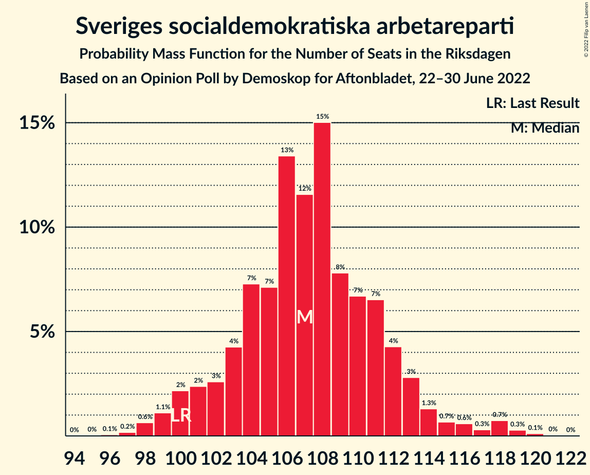

| Number of Seats | Probability | Accumulated | Special Marks |
|:---------------:|:-----------:|:-----------:|:-------------:|
| 96 | 0.1% | 100% |  |
| 97 | 0.2% | 99.9% |  |
| 98 | 0.6% | 99.7% |  |
| 99 | 1.1% | 99.1% |  |
| 100 | 2% | 98% | Last Result |
| 101 | 2% | 96% |  |
| 102 | 3% | 93% |  |
| 103 | 4% | 91% |  |
| 104 | 7% | 87% |  |
| 105 | 7% | 79% |  |
| 106 | 13% | 72% |  |
| 107 | 12% | 59% | Median |
| 108 | 15% | 47% |  |
| 109 | 8% | 32% |  |
| 110 | 7% | 24% |  |
| 111 | 7% | 18% |  |
| 112 | 4% | 11% |  |
| 113 | 3% | 7% |  |
| 114 | 1.3% | 4% |  |
| 115 | 0.7% | 3% |  |
| 116 | 0.6% | 2% |  |
| 117 | 0.3% | 2% |  |
| 118 | 0.7% | 1.2% |  |
| 119 | 0.3% | 0.5% |  |
| 120 | 0.1% | 0.2% |  |
| 121 | 0% | 0.1% |  |
| 122 | 0% | 0% |  |

### Moderata samlingspartiet

*For a full overview of the results for this party, see the [Moderata samlingspartiet](party-moderatasamlingspartiet.html) page.*

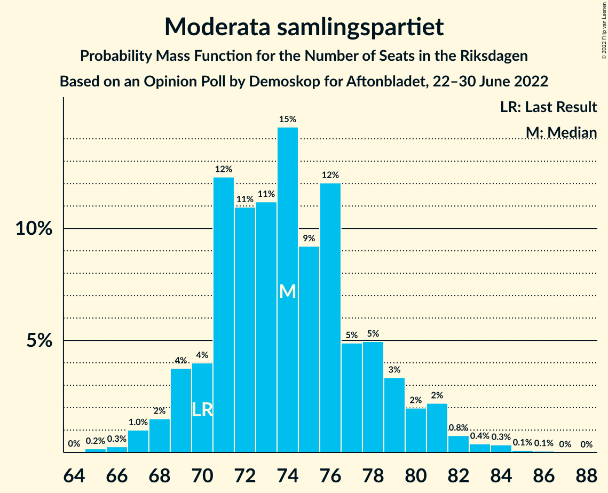

| Number of Seats | Probability | Accumulated | Special Marks |
|:---------------:|:-----------:|:-----------:|:-------------:|
| 64 | 0% | 100% |  |
| 65 | 0.2% | 99.9% |  |
| 66 | 0.3% | 99.8% |  |
| 67 | 1.0% | 99.5% |  |
| 68 | 2% | 98.5% |  |
| 69 | 4% | 97% |  |
| 70 | 4% | 93% | Last Result |
| 71 | 12% | 89% |  |
| 72 | 11% | 77% |  |
| 73 | 11% | 66% |  |
| 74 | 15% | 55% | Median |
| 75 | 9% | 40% |  |
| 76 | 12% | 31% |  |
| 77 | 5% | 19% |  |
| 78 | 5% | 14% |  |
| 79 | 3% | 9% |  |
| 80 | 2% | 6% |  |
| 81 | 2% | 4% |  |
| 82 | 0.8% | 2% |  |
| 83 | 0.4% | 0.9% |  |
| 84 | 0.3% | 0.5% |  |
| 85 | 0.1% | 0.2% |  |
| 86 | 0.1% | 0.1% |  |
| 87 | 0% | 0% |  |

### Sverigedemokraterna

*For a full overview of the results for this party, see the [Sverigedemokraterna](party-sverigedemokraterna.html) page.*

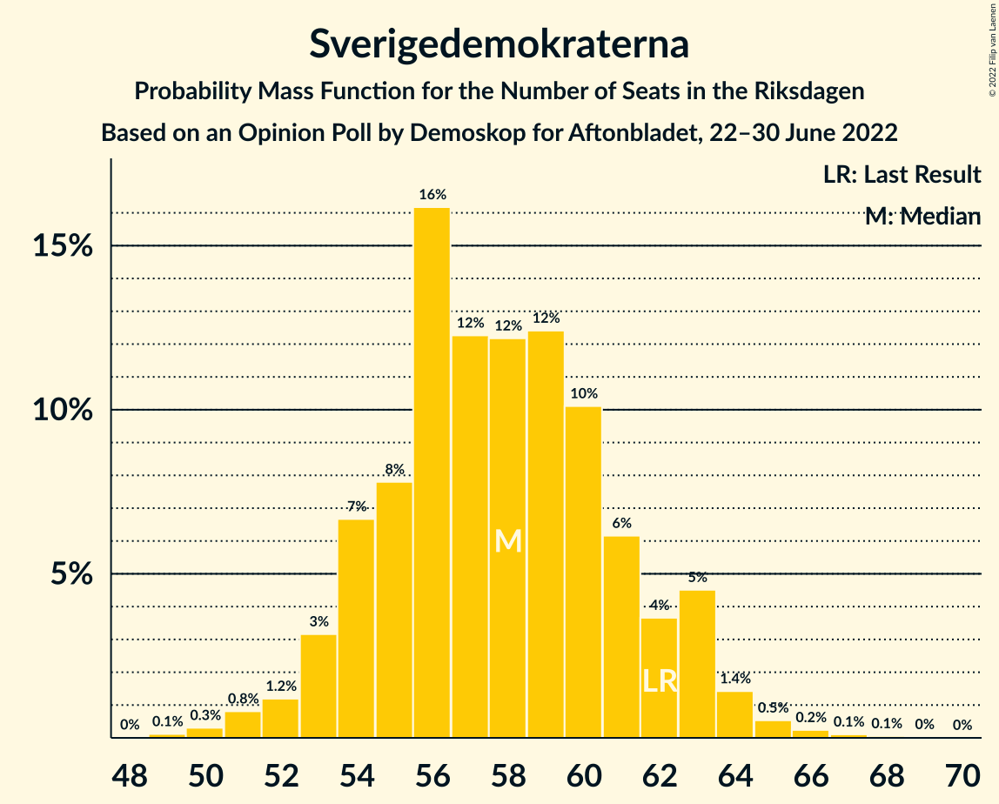

| Number of Seats | Probability | Accumulated | Special Marks |
|:---------------:|:-----------:|:-----------:|:-------------:|
| 49 | 0.1% | 100% |  |
| 50 | 0.3% | 99.8% |  |
| 51 | 0.8% | 99.5% |  |
| 52 | 1.2% | 98.7% |  |
| 53 | 3% | 98% |  |
| 54 | 7% | 94% |  |
| 55 | 8% | 88% |  |
| 56 | 16% | 80% |  |
| 57 | 12% | 64% |  |
| 58 | 12% | 51% | Median |
| 59 | 12% | 39% |  |
| 60 | 10% | 27% |  |
| 61 | 6% | 17% |  |
| 62 | 4% | 11% | Last Result |
| 63 | 5% | 7% |  |
| 64 | 1.4% | 2% |  |
| 65 | 0.5% | 1.0% |  |
| 66 | 0.2% | 0.5% |  |
| 67 | 0.1% | 0.2% |  |
| 68 | 0.1% | 0.1% |  |
| 69 | 0% | 0% |  |

### Vänsterpartiet

*For a full overview of the results for this party, see the [Vänsterpartiet](party-vänsterpartiet.html) page.*

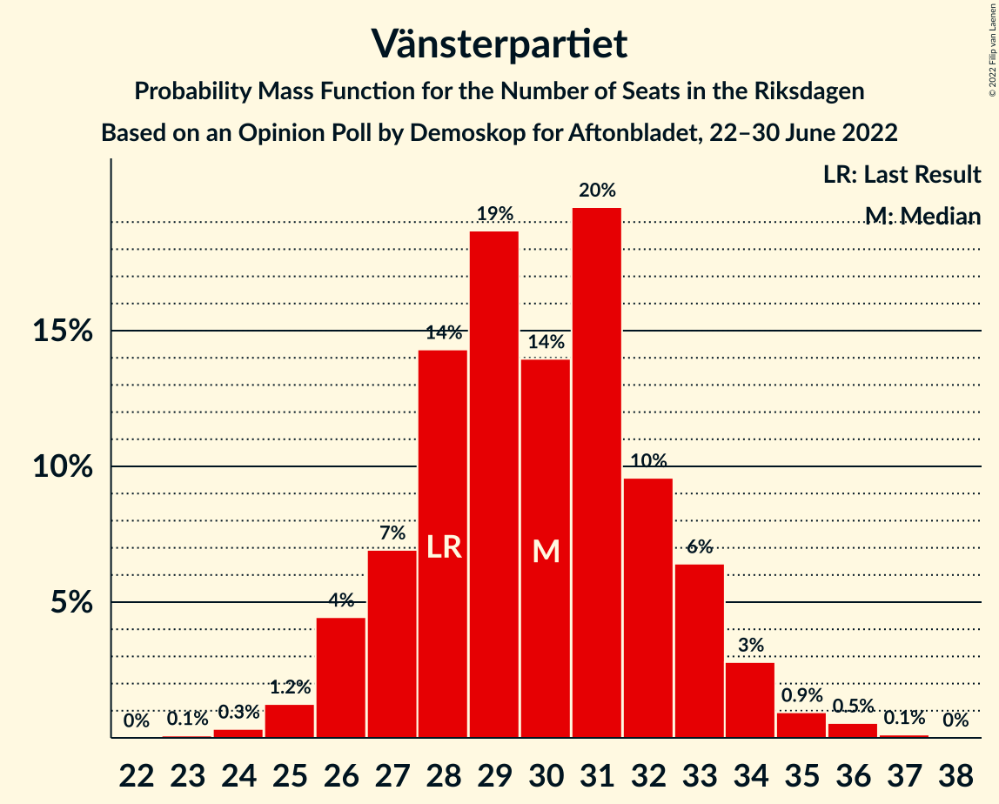

| Number of Seats | Probability | Accumulated | Special Marks |
|:---------------:|:-----------:|:-----------:|:-------------:|
| 23 | 0.1% | 100% |  |
| 24 | 0.3% | 99.9% |  |
| 25 | 1.2% | 99.6% |  |
| 26 | 4% | 98% |  |
| 27 | 7% | 94% |  |
| 28 | 14% | 87% | Last Result |
| 29 | 19% | 73% |  |
| 30 | 14% | 54% | Median |
| 31 | 20% | 40% |  |
| 32 | 10% | 20% |  |
| 33 | 6% | 11% |  |
| 34 | 3% | 4% |  |
| 35 | 0.9% | 2% |  |
| 36 | 0.5% | 0.7% |  |
| 37 | 0.1% | 0.2% |  |
| 38 | 0% | 0% |  |

### Centerpartiet

*For a full overview of the results for this party, see the [Centerpartiet](party-centerpartiet.html) page.*

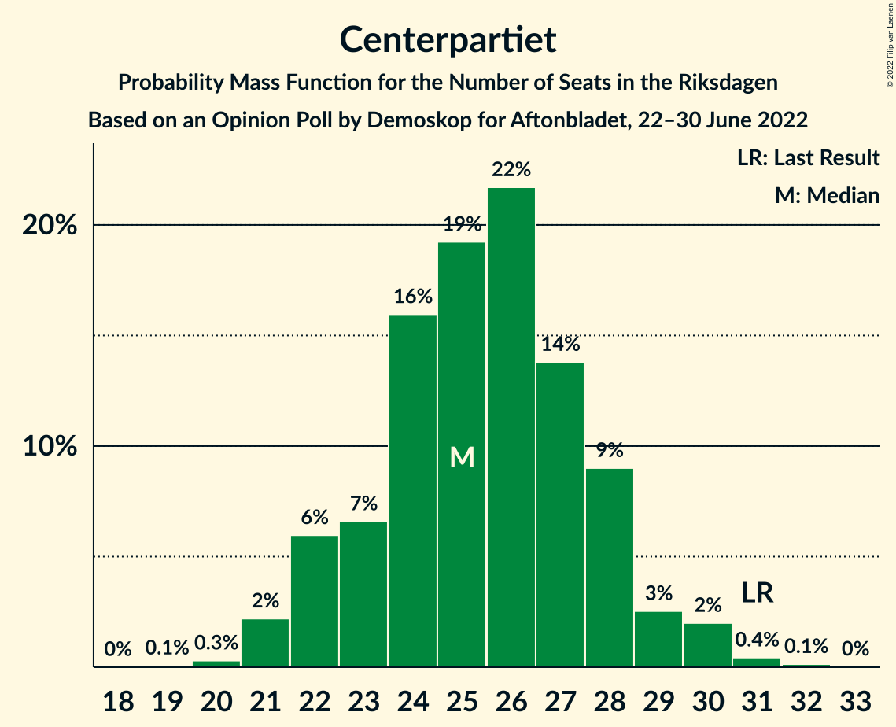

| Number of Seats | Probability | Accumulated | Special Marks |
|:---------------:|:-----------:|:-----------:|:-------------:|
| 19 | 0.1% | 100% |  |
| 20 | 0.3% | 99.9% |  |
| 21 | 2% | 99.6% |  |
| 22 | 6% | 97% |  |
| 23 | 7% | 91% |  |
| 24 | 16% | 85% |  |
| 25 | 19% | 69% | Median |
| 26 | 22% | 50% |  |
| 27 | 14% | 28% |  |
| 28 | 9% | 14% |  |
| 29 | 3% | 5% |  |
| 30 | 2% | 3% |  |
| 31 | 0.4% | 0.6% | Last Result |
| 32 | 0.1% | 0.2% |  |
| 33 | 0% | 0% |  |

### Kristdemokraterna

*For a full overview of the results for this party, see the [Kristdemokraterna](party-kristdemokraterna.html) page.*

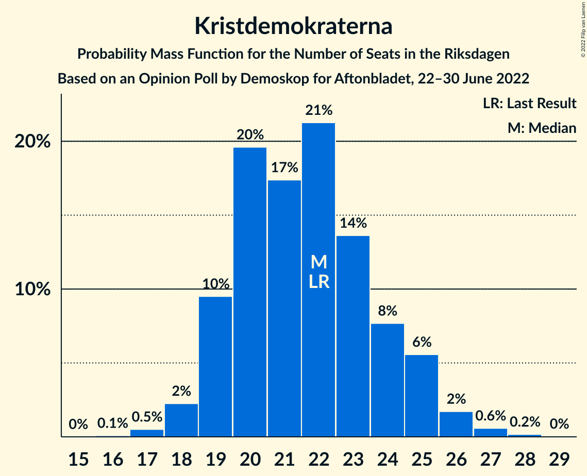

| Number of Seats | Probability | Accumulated | Special Marks |
|:---------------:|:-----------:|:-----------:|:-------------:|
| 16 | 0.1% | 100% |  |
| 17 | 0.5% | 99.9% |  |
| 18 | 2% | 99.4% |  |
| 19 | 10% | 97% |  |
| 20 | 20% | 88% |  |
| 21 | 17% | 68% |  |
| 22 | 21% | 51% | Last Result, Median |
| 23 | 14% | 29% |  |
| 24 | 8% | 16% |  |
| 25 | 6% | 8% |  |
| 26 | 2% | 3% |  |
| 27 | 0.6% | 0.8% |  |
| 28 | 0.2% | 0.2% |  |
| 29 | 0% | 0% |  |

### Miljöpartiet de gröna

*For a full overview of the results for this party, see the [Miljöpartiet de gröna](party-miljöpartietdegröna.html) page.*

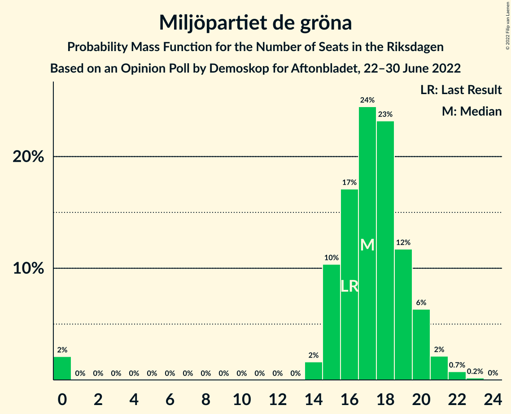

| Number of Seats | Probability | Accumulated | Special Marks |
|:---------------:|:-----------:|:-----------:|:-------------:|
| 0 | 2% | 100% |  |
| 1 | 0% | 98% |  |
| 2 | 0% | 98% |  |
| 3 | 0% | 98% |  |
| 4 | 0% | 98% |  |
| 5 | 0% | 98% |  |
| 6 | 0% | 98% |  |
| 7 | 0% | 98% |  |
| 8 | 0% | 98% |  |
| 9 | 0% | 98% |  |
| 10 | 0% | 98% |  |
| 11 | 0% | 98% |  |
| 12 | 0% | 98% |  |
| 13 | 0% | 98% |  |
| 14 | 2% | 98% |  |
| 15 | 10% | 96% |  |
| 16 | 17% | 86% | Last Result |
| 17 | 24% | 69% | Median |
| 18 | 23% | 44% |  |
| 19 | 12% | 21% |  |
| 20 | 6% | 9% |  |
| 21 | 2% | 3% |  |
| 22 | 0.7% | 1.0% |  |
| 23 | 0.2% | 0.2% |  |
| 24 | 0% | 0% |  |

### Liberalerna

*For a full overview of the results for this party, see the [Liberalerna](party-liberalerna.html) page.*

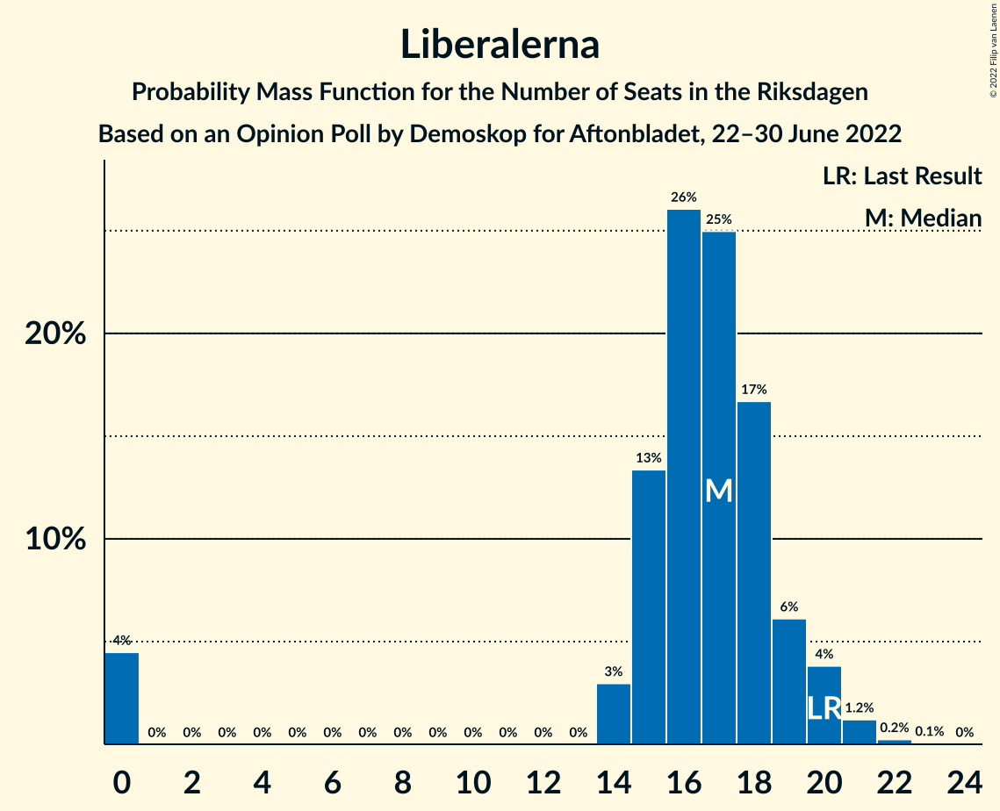

| Number of Seats | Probability | Accumulated | Special Marks |
|:---------------:|:-----------:|:-----------:|:-------------:|
| 0 | 4% | 100% |  |
| 1 | 0% | 96% |  |
| 2 | 0% | 96% |  |
| 3 | 0% | 96% |  |
| 4 | 0% | 96% |  |
| 5 | 0% | 96% |  |
| 6 | 0% | 96% |  |
| 7 | 0% | 96% |  |
| 8 | 0% | 96% |  |
| 9 | 0% | 96% |  |
| 10 | 0% | 96% |  |
| 11 | 0% | 96% |  |
| 12 | 0% | 96% |  |
| 13 | 0% | 96% |  |
| 14 | 3% | 96% |  |
| 15 | 13% | 93% |  |
| 16 | 26% | 79% |  |
| 17 | 25% | 53% | Median |
| 18 | 17% | 28% |  |
| 19 | 6% | 11% |  |
| 20 | 4% | 5% | Last Result |
| 21 | 1.2% | 2% |  |
| 22 | 0.2% | 0.3% |  |
| 23 | 0.1% | 0.1% |  |
| 24 | 0% | 0% |  |

## Coalitions

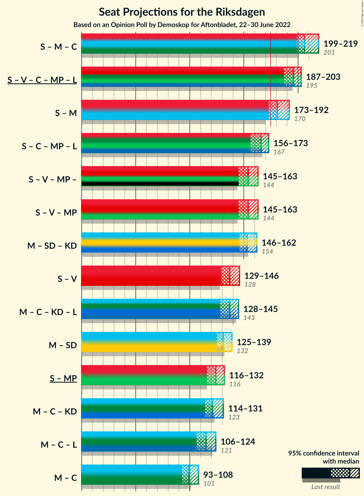

### Confidence Intervals

| Coalition | Last Result | Median | Majority? | 80% Confidence Interval | 90% Confidence Interval | 95% Confidence Interval | 99% Confidence Interval |
|:---------:|:-----------:|:------:|:---------:|:-----------------------:|:-----------------------:|:-----------------------:|:-----------------------:|
| Sveriges socialdemokratiska arbetareparti – Moderata samlingspartiet – Centerpartiet | 201 | 206 | 100% | 201–212 | 200–215 | 199–219 | 196–222 |
| Sveriges socialdemokratiska arbetareparti – Vänsterpartiet – Centerpartiet – Miljöpartiet de gröna – Liberalerna | 195 | 196 | 100% | 190–200 | 189–202 | 187–203 | 182–206 |
| Sveriges socialdemokratiska arbetareparti – Moderata samlingspartiet | 170 | 181 | 95% | 176–187 | 175–190 | 173–192 | 171–195 |
| Sveriges socialdemokratiska arbetareparti – Centerpartiet – Miljöpartiet de gröna – Liberalerna | 167 | 166 | 1.1% | 160–171 | 158–172 | 156–173 | 151–176 |
| Sveriges socialdemokratiska arbetareparti – Vänsterpartiet – Miljöpartiet de gröna | 144 | 154 | 0% | 149–159 | 147–161 | 145–163 | 142–168 |
| Moderata samlingspartiet – Sverigedemokraterna – Kristdemokraterna | 154 | 153 | 0% | 149–159 | 147–160 | 146–162 | 143–167 |
| Sveriges socialdemokratiska arbetareparti – Vänsterpartiet | 128 | 137 | 0% | 132–142 | 130–144 | 129–146 | 127–150 |
| Moderata samlingspartiet – Centerpartiet – Kristdemokraterna – Liberalerna | 143 | 137 | 0% | 133–143 | 131–145 | 128–145 | 121–148 |
| Moderata samlingspartiet – Sverigedemokraterna | 132 | 131 | 0% | 128–137 | 127–138 | 125–139 | 122–144 |
| Sveriges socialdemokratiska arbetareparti – Miljöpartiet de gröna | 116 | 124 | 0% | 119–129 | 117–130 | 116–132 | 110–137 |
| Moderata samlingspartiet – Centerpartiet – Kristdemokraterna | 123 | 121 | 0% | 116–126 | 115–128 | 114–131 | 112–133 |
| Moderata samlingspartiet – Centerpartiet – Liberalerna | 121 | 115 | 0% | 112–121 | 109–123 | 106–124 | 99–126 |
| Moderata samlingspartiet – Centerpartiet | 101 | 99 | 0% | 95–104 | 94–106 | 93–108 | 91–110 |

### Sveriges socialdemokratiska arbetareparti – Moderata samlingspartiet – Centerpartiet

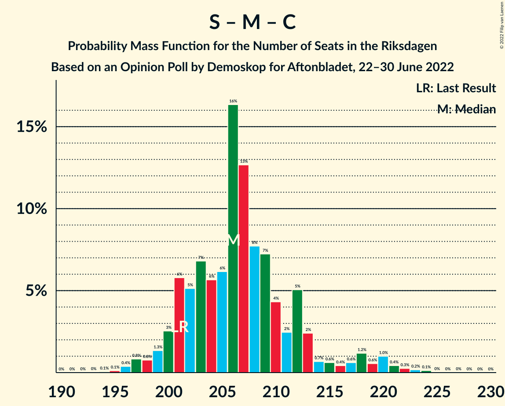

| Number of Seats | Probability | Accumulated | Special Marks |
|:---------------:|:-----------:|:-----------:|:-------------:|
| 194 | 0.1% | 100% |  |
| 195 | 0.1% | 99.9% |  |
| 196 | 0.4% | 99.8% |  |
| 197 | 0.8% | 99.4% |  |
| 198 | 0.8% | 98.6% |  |
| 199 | 1.3% | 98% |  |
| 200 | 3% | 96% |  |
| 201 | 6% | 94% | Last Result |
| 202 | 5% | 88% |  |
| 203 | 7% | 83% |  |
| 204 | 6% | 76% |  |
| 205 | 6% | 71% |  |
| 206 | 16% | 64% | Median |
| 207 | 13% | 48% |  |
| 208 | 8% | 35% |  |
| 209 | 7% | 28% |  |
| 210 | 4% | 20% |  |
| 211 | 2% | 16% |  |
| 212 | 5% | 14% |  |
| 213 | 2% | 9% |  |
| 214 | 0.7% | 6% |  |
| 215 | 0.6% | 5% |  |
| 216 | 0.4% | 5% |  |
| 217 | 0.6% | 4% |  |
| 218 | 1.2% | 4% |  |
| 219 | 0.6% | 3% |  |
| 220 | 1.0% | 2% |  |
| 221 | 0.4% | 1.1% |  |
| 222 | 0.3% | 0.6% |  |
| 223 | 0.2% | 0.4% |  |
| 224 | 0.1% | 0.2% |  |
| 225 | 0% | 0.1% |  |
| 226 | 0% | 0.1% |  |
| 227 | 0% | 0.1% |  |
| 228 | 0% | 0% |  |

### Sveriges socialdemokratiska arbetareparti – Vänsterpartiet – Centerpartiet – Miljöpartiet de gröna – Liberalerna

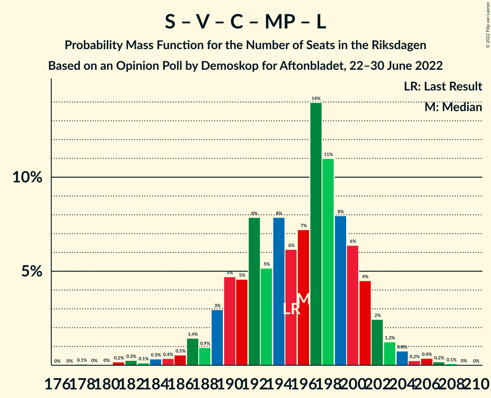

| Number of Seats | Probability | Accumulated | Special Marks |
|:---------------:|:-----------:|:-----------:|:-------------:|
| 178 | 0.1% | 100% |  |
| 179 | 0% | 99.9% |  |
| 180 | 0% | 99.9% |  |
| 181 | 0.2% | 99.8% |  |
| 182 | 0.3% | 99.7% |  |
| 183 | 0.1% | 99.4% |  |
| 184 | 0.3% | 99.3% |  |
| 185 | 0.4% | 98.9% |  |
| 186 | 0.5% | 98.6% |  |
| 187 | 1.4% | 98% |  |
| 188 | 0.9% | 97% |  |
| 189 | 3% | 96% |  |
| 190 | 5% | 93% |  |
| 191 | 5% | 88% |  |
| 192 | 8% | 83% |  |
| 193 | 5% | 76% |  |
| 194 | 8% | 70% |  |
| 195 | 6% | 63% | Last Result |
| 196 | 7% | 56% | Median |
| 197 | 14% | 49% |  |
| 198 | 11% | 35% |  |
| 199 | 8% | 24% |  |
| 200 | 6% | 16% |  |
| 201 | 4% | 10% |  |
| 202 | 2% | 5% |  |
| 203 | 1.2% | 3% |  |
| 204 | 0.8% | 2% |  |
| 205 | 0.2% | 0.9% |  |
| 206 | 0.4% | 0.7% |  |
| 207 | 0.2% | 0.3% |  |
| 208 | 0.1% | 0.1% |  |
| 209 | 0% | 0% |  |

### Sveriges socialdemokratiska arbetareparti – Moderata samlingspartiet

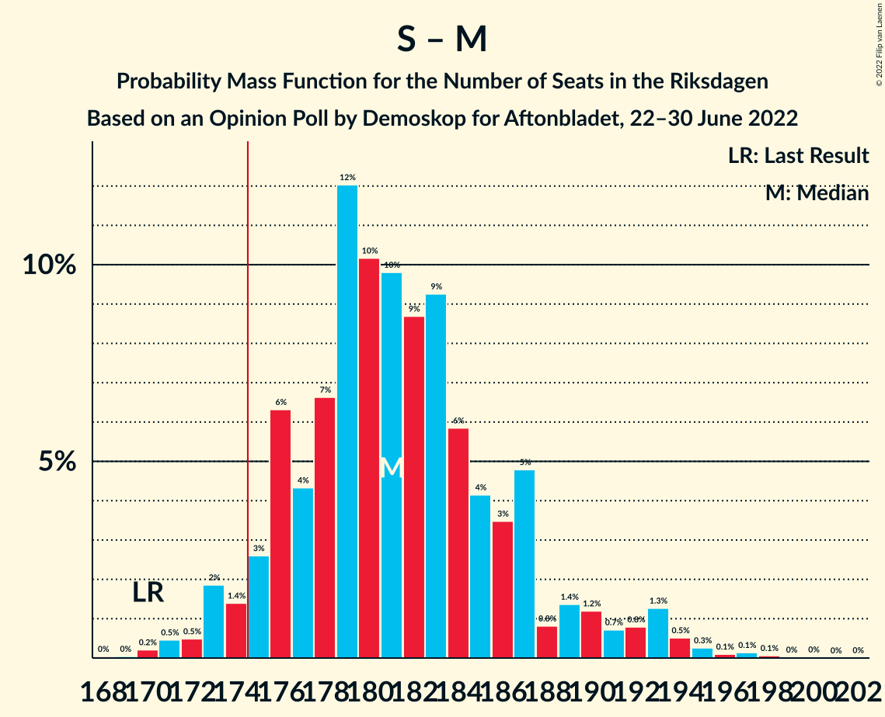

| Number of Seats | Probability | Accumulated | Special Marks |
|:---------------:|:-----------:|:-----------:|:-------------:|
| 168 | 0% | 100% |  |
| 169 | 0% | 99.9% |  |
| 170 | 0.2% | 99.9% | Last Result |
| 171 | 0.5% | 99.7% |  |
| 172 | 0.5% | 99.2% |  |
| 173 | 2% | 98.7% |  |
| 174 | 1.4% | 97% |  |
| 175 | 3% | 95% | Majority |
| 176 | 6% | 93% |  |
| 177 | 4% | 87% |  |
| 178 | 7% | 82% |  |
| 179 | 12% | 76% |  |
| 180 | 10% | 64% |  |
| 181 | 10% | 53% | Median |
| 182 | 9% | 44% |  |
| 183 | 9% | 35% |  |
| 184 | 6% | 26% |  |
| 185 | 4% | 20% |  |
| 186 | 3% | 16% |  |
| 187 | 5% | 12% |  |
| 188 | 0.8% | 7% |  |
| 189 | 1.4% | 7% |  |
| 190 | 1.2% | 5% |  |
| 191 | 0.7% | 4% |  |
| 192 | 0.8% | 3% |  |
| 193 | 1.3% | 2% |  |
| 194 | 0.5% | 1.2% |  |
| 195 | 0.3% | 0.7% |  |
| 196 | 0.1% | 0.4% |  |
| 197 | 0.1% | 0.3% |  |
| 198 | 0.1% | 0.2% |  |
| 199 | 0% | 0.1% |  |
| 200 | 0% | 0.1% |  |
| 201 | 0% | 0% |  |

### Sveriges socialdemokratiska arbetareparti – Centerpartiet – Miljöpartiet de gröna – Liberalerna

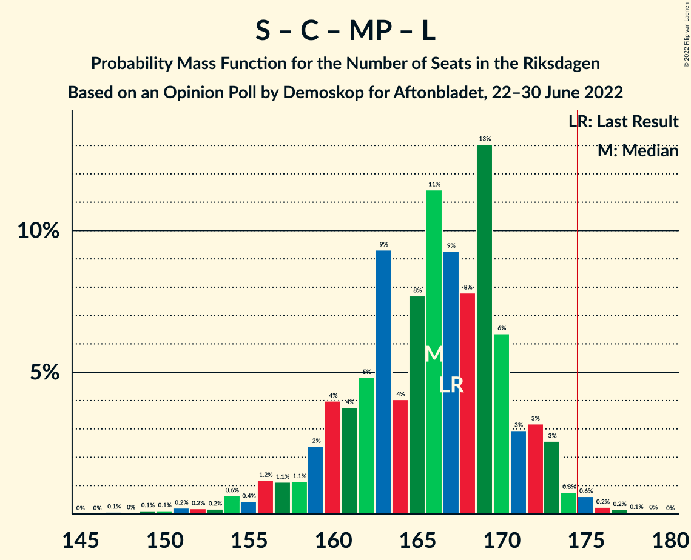

| Number of Seats | Probability | Accumulated | Special Marks |
|:---------------:|:-----------:|:-----------:|:-------------:|
| 147 | 0.1% | 100% |  |
| 148 | 0% | 99.9% |  |
| 149 | 0.1% | 99.9% |  |
| 150 | 0.1% | 99.7% |  |
| 151 | 0.2% | 99.6% |  |
| 152 | 0.2% | 99.4% |  |
| 153 | 0.2% | 99.2% |  |
| 154 | 0.6% | 99.1% |  |
| 155 | 0.4% | 98% |  |
| 156 | 1.2% | 98% |  |
| 157 | 1.1% | 97% |  |
| 158 | 1.1% | 96% |  |
| 159 | 2% | 95% |  |
| 160 | 4% | 92% |  |
| 161 | 4% | 88% |  |
| 162 | 5% | 84% |  |
| 163 | 9% | 80% |  |
| 164 | 4% | 70% |  |
| 165 | 8% | 66% |  |
| 166 | 11% | 58% | Median |
| 167 | 9% | 47% | Last Result |
| 168 | 8% | 38% |  |
| 169 | 13% | 30% |  |
| 170 | 6% | 17% |  |
| 171 | 3% | 11% |  |
| 172 | 3% | 8% |  |
| 173 | 3% | 4% |  |
| 174 | 0.8% | 2% |  |
| 175 | 0.6% | 1.1% | Majority |
| 176 | 0.2% | 0.5% |  |
| 177 | 0.2% | 0.3% |  |
| 178 | 0.1% | 0.1% |  |
| 179 | 0% | 0.1% |  |
| 180 | 0% | 0% |  |

### Sveriges socialdemokratiska arbetareparti – Vänsterpartiet – Miljöpartiet de gröna

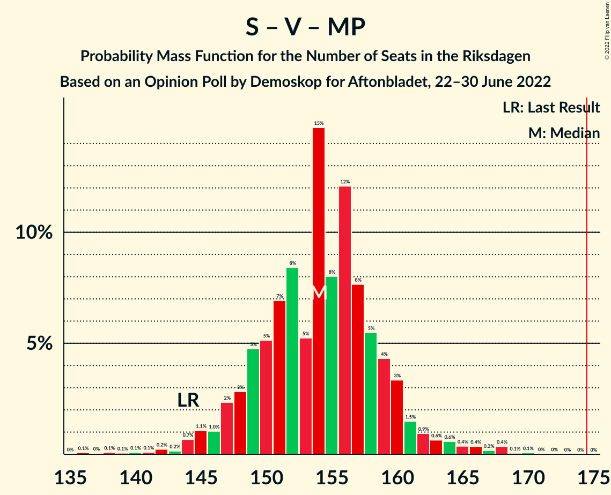

| Number of Seats | Probability | Accumulated | Special Marks |
|:---------------:|:-----------:|:-----------:|:-------------:|
| 136 | 0.1% | 100% |  |
| 137 | 0% | 99.9% |  |
| 138 | 0.1% | 99.9% |  |
| 139 | 0.1% | 99.8% |  |
| 140 | 0.1% | 99.7% |  |
| 141 | 0.1% | 99.6% |  |
| 142 | 0.2% | 99.5% |  |
| 143 | 0.2% | 99.3% |  |
| 144 | 0.7% | 99.2% | Last Result |
| 145 | 1.1% | 98% |  |
| 146 | 1.0% | 97% |  |
| 147 | 2% | 96% |  |
| 148 | 3% | 94% |  |
| 149 | 5% | 91% |  |
| 150 | 5% | 86% |  |
| 151 | 7% | 81% |  |
| 152 | 8% | 74% |  |
| 153 | 5% | 66% |  |
| 154 | 15% | 61% | Median |
| 155 | 8% | 46% |  |
| 156 | 12% | 38% |  |
| 157 | 8% | 26% |  |
| 158 | 5% | 18% |  |
| 159 | 4% | 13% |  |
| 160 | 3% | 8% |  |
| 161 | 1.5% | 5% |  |
| 162 | 0.9% | 4% |  |
| 163 | 0.6% | 3% |  |
| 164 | 0.6% | 2% |  |
| 165 | 0.4% | 1.4% |  |
| 166 | 0.4% | 1.1% |  |
| 167 | 0.2% | 0.7% |  |
| 168 | 0.4% | 0.5% |  |
| 169 | 0.1% | 0.2% |  |
| 170 | 0.1% | 0.1% |  |
| 171 | 0% | 0.1% |  |
| 172 | 0% | 0% |  |

### Moderata samlingspartiet – Sverigedemokraterna – Kristdemokraterna

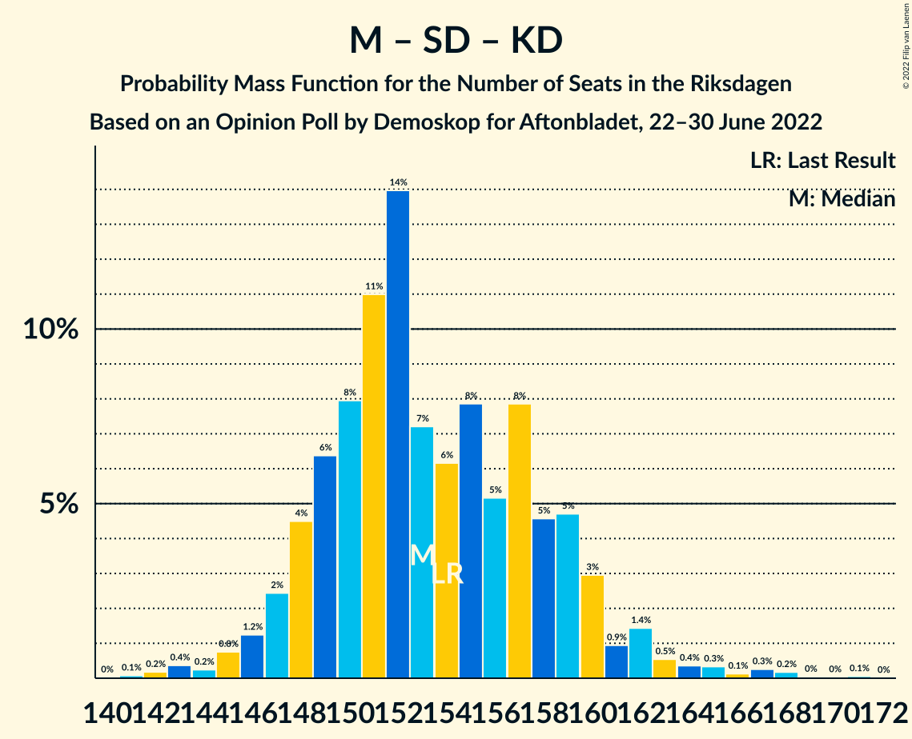

| Number of Seats | Probability | Accumulated | Special Marks |
|:---------------:|:-----------:|:-----------:|:-------------:|
| 141 | 0.1% | 100% |  |
| 142 | 0.2% | 99.9% |  |
| 143 | 0.4% | 99.7% |  |
| 144 | 0.2% | 99.3% |  |
| 145 | 0.8% | 99.1% |  |
| 146 | 1.2% | 98% |  |
| 147 | 2% | 97% |  |
| 148 | 4% | 95% |  |
| 149 | 6% | 90% |  |
| 150 | 8% | 84% |  |
| 151 | 11% | 76% |  |
| 152 | 14% | 65% |  |
| 153 | 7% | 51% |  |
| 154 | 6% | 44% | Last Result, Median |
| 155 | 8% | 37% |  |
| 156 | 5% | 30% |  |
| 157 | 8% | 24% |  |
| 158 | 5% | 17% |  |
| 159 | 5% | 12% |  |
| 160 | 3% | 7% |  |
| 161 | 0.9% | 4% |  |
| 162 | 1.4% | 3% |  |
| 163 | 0.5% | 2% |  |
| 164 | 0.4% | 1.4% |  |
| 165 | 0.3% | 1.1% |  |
| 166 | 0.1% | 0.7% |  |
| 167 | 0.3% | 0.6% |  |
| 168 | 0.2% | 0.3% |  |
| 169 | 0% | 0.2% |  |
| 170 | 0% | 0.1% |  |
| 171 | 0.1% | 0.1% |  |
| 172 | 0% | 0% |  |

### Sveriges socialdemokratiska arbetareparti – Vänsterpartiet

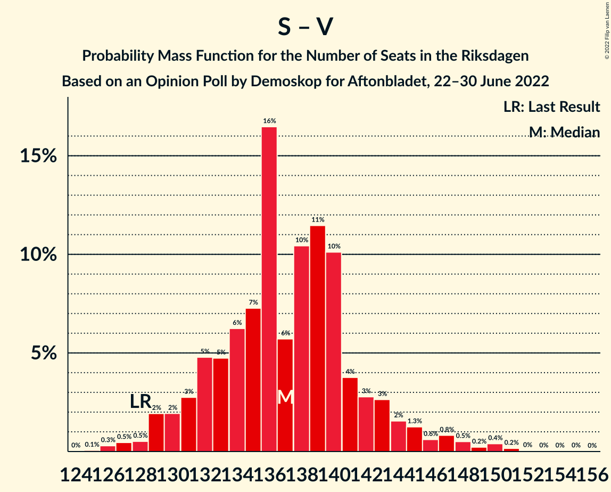

| Number of Seats | Probability | Accumulated | Special Marks |
|:---------------:|:-----------:|:-----------:|:-------------:|
| 125 | 0.1% | 100% |  |
| 126 | 0.3% | 99.9% |  |
| 127 | 0.5% | 99.6% |  |
| 128 | 0.5% | 99.1% | Last Result |
| 129 | 2% | 98.6% |  |
| 130 | 2% | 97% |  |
| 131 | 3% | 95% |  |
| 132 | 5% | 92% |  |
| 133 | 5% | 87% |  |
| 134 | 6% | 83% |  |
| 135 | 7% | 76% |  |
| 136 | 16% | 69% |  |
| 137 | 6% | 53% | Median |
| 138 | 10% | 47% |  |
| 139 | 11% | 36% |  |
| 140 | 10% | 25% |  |
| 141 | 4% | 15% |  |
| 142 | 3% | 11% |  |
| 143 | 3% | 8% |  |
| 144 | 2% | 6% |  |
| 145 | 1.3% | 4% |  |
| 146 | 0.6% | 3% |  |
| 147 | 0.8% | 2% |  |
| 148 | 0.5% | 1.4% |  |
| 149 | 0.2% | 0.9% |  |
| 150 | 0.4% | 0.7% |  |
| 151 | 0.2% | 0.3% |  |
| 152 | 0% | 0.1% |  |
| 153 | 0% | 0.1% |  |
| 154 | 0% | 0.1% |  |
| 155 | 0% | 0% |  |

### Moderata samlingspartiet – Centerpartiet – Kristdemokraterna – Liberalerna

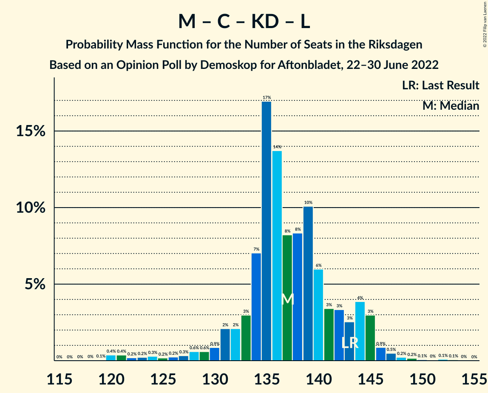

| Number of Seats | Probability | Accumulated | Special Marks |
|:---------------:|:-----------:|:-----------:|:-------------:|
| 119 | 0.1% | 100% |  |
| 120 | 0.4% | 99.9% |  |
| 121 | 0.4% | 99.5% |  |
| 122 | 0.2% | 99.2% |  |
| 123 | 0.2% | 99.0% |  |
| 124 | 0.3% | 98.8% |  |
| 125 | 0.2% | 98% |  |
| 126 | 0.2% | 98% |  |
| 127 | 0.3% | 98% |  |
| 128 | 0.6% | 98% |  |
| 129 | 0.6% | 97% |  |
| 130 | 0.9% | 97% |  |
| 131 | 2% | 96% |  |
| 132 | 2% | 94% |  |
| 133 | 3% | 91% |  |
| 134 | 7% | 88% |  |
| 135 | 17% | 81% |  |
| 136 | 14% | 65% |  |
| 137 | 8% | 51% |  |
| 138 | 8% | 43% | Median |
| 139 | 10% | 34% |  |
| 140 | 6% | 24% |  |
| 141 | 3% | 18% |  |
| 142 | 3% | 15% |  |
| 143 | 3% | 11% | Last Result |
| 144 | 4% | 9% |  |
| 145 | 3% | 5% |  |
| 146 | 0.9% | 2% |  |
| 147 | 0.5% | 1.2% |  |
| 148 | 0.2% | 0.7% |  |
| 149 | 0.2% | 0.5% |  |
| 150 | 0.1% | 0.3% |  |
| 151 | 0% | 0.2% |  |
| 152 | 0.1% | 0.2% |  |
| 153 | 0.1% | 0.1% |  |
| 154 | 0% | 0% |  |

### Moderata samlingspartiet – Sverigedemokraterna

| Number of Seats | Probability | Accumulated | Special Marks |
|:---------------:|:-----------:|:-----------:|:-------------:|
| 120 | 0.1% | 100% |  |
| 121 | 0.3% | 99.8% |  |
| 122 | 0.6% | 99.6% |  |
| 123 | 0.8% | 99.0% |  |
| 124 | 0.4% | 98% |  |
| 125 | 0.5% | 98% |  |
| 126 | 1.2% | 97% |  |
| 127 | 6% | 96% |  |
| 128 | 7% | 90% |  |
| 129 | 16% | 83% |  |
| 130 | 13% | 67% |  |
| 131 | 12% | 54% |  |
| 132 | 4% | 42% | Last Result, Median |
| 133 | 3% | 37% |  |
| 134 | 5% | 35% |  |
| 135 | 7% | 30% |  |
| 136 | 9% | 23% |  |
| 137 | 7% | 14% |  |
| 138 | 4% | 7% |  |
| 139 | 1.3% | 3% |  |
| 140 | 0.4% | 2% |  |
| 141 | 0.2% | 2% |  |
| 142 | 0.4% | 2% |  |
| 143 | 0.5% | 1.1% |  |
| 144 | 0.4% | 0.6% |  |
| 145 | 0.1% | 0.2% |  |
| 146 | 0% | 0.1% |  |
| 147 | 0% | 0.1% |  |
| 148 | 0% | 0% |  |

### Sveriges socialdemokratiska arbetareparti – Miljöpartiet de gröna

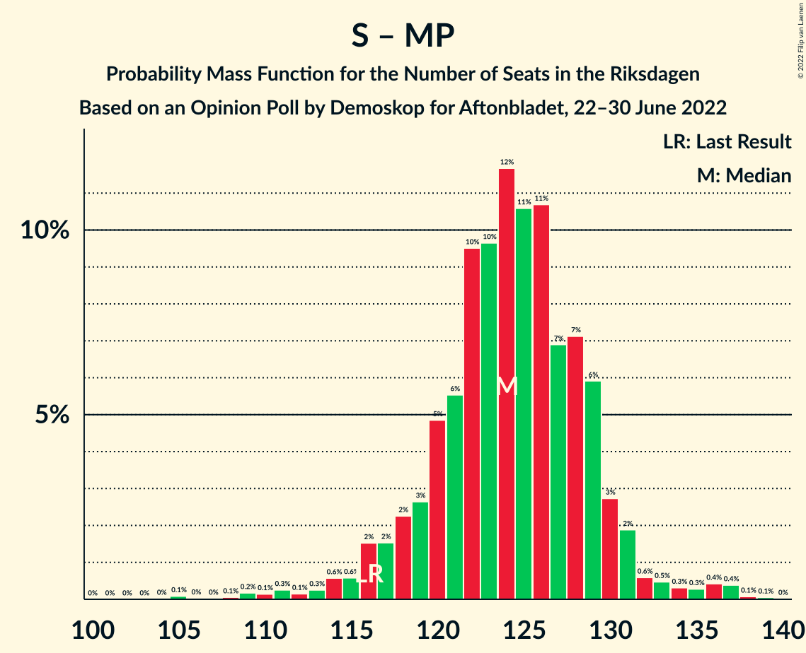

| Number of Seats | Probability | Accumulated | Special Marks |
|:---------------:|:-----------:|:-----------:|:-------------:|
| 105 | 0.1% | 100% |  |
| 106 | 0% | 99.9% |  |
| 107 | 0% | 99.9% |  |
| 108 | 0.1% | 99.8% |  |
| 109 | 0.2% | 99.8% |  |
| 110 | 0.1% | 99.6% |  |
| 111 | 0.3% | 99.5% |  |
| 112 | 0.1% | 99.2% |  |
| 113 | 0.3% | 99.1% |  |
| 114 | 0.6% | 98.8% |  |
| 115 | 0.6% | 98% |  |
| 116 | 2% | 98% | Last Result |
| 117 | 2% | 96% |  |
| 118 | 2% | 95% |  |
| 119 | 3% | 92% |  |
| 120 | 5% | 90% |  |
| 121 | 6% | 85% |  |
| 122 | 10% | 79% |  |
| 123 | 10% | 70% |  |
| 124 | 12% | 60% | Median |
| 125 | 11% | 48% |  |
| 126 | 11% | 38% |  |
| 127 | 7% | 27% |  |
| 128 | 7% | 20% |  |
| 129 | 6% | 13% |  |
| 130 | 3% | 7% |  |
| 131 | 2% | 5% |  |
| 132 | 0.6% | 3% |  |
| 133 | 0.5% | 2% |  |
| 134 | 0.3% | 2% |  |
| 135 | 0.3% | 1.2% |  |
| 136 | 0.4% | 1.0% |  |
| 137 | 0.4% | 0.5% |  |
| 138 | 0.1% | 0.2% |  |
| 139 | 0.1% | 0.1% |  |
| 140 | 0% | 0% |  |

### Moderata samlingspartiet – Centerpartiet – Kristdemokraterna

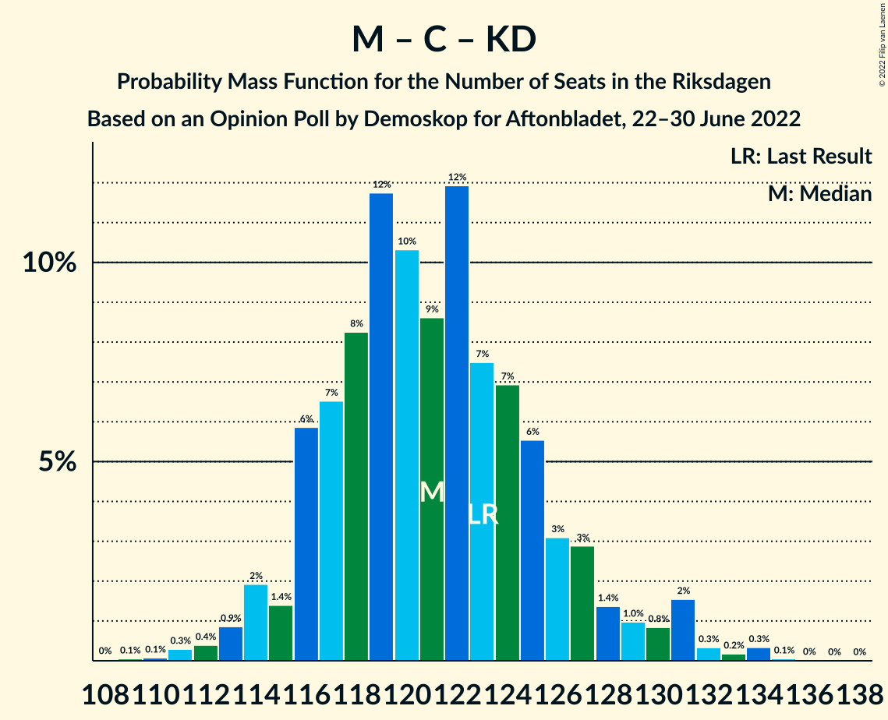

| Number of Seats | Probability | Accumulated | Special Marks |
|:---------------:|:-----------:|:-----------:|:-------------:|
| 109 | 0.1% | 100% |  |
| 110 | 0.1% | 99.9% |  |
| 111 | 0.3% | 99.8% |  |
| 112 | 0.4% | 99.5% |  |
| 113 | 0.9% | 99.1% |  |
| 114 | 2% | 98% |  |
| 115 | 1.4% | 96% |  |
| 116 | 6% | 95% |  |
| 117 | 7% | 89% |  |
| 118 | 8% | 83% |  |
| 119 | 12% | 74% |  |
| 120 | 10% | 63% |  |
| 121 | 9% | 52% | Median |
| 122 | 12% | 44% |  |
| 123 | 7% | 32% | Last Result |
| 124 | 7% | 24% |  |
| 125 | 6% | 17% |  |
| 126 | 3% | 12% |  |
| 127 | 3% | 9% |  |
| 128 | 1.4% | 6% |  |
| 129 | 1.0% | 4% |  |
| 130 | 0.8% | 3% |  |
| 131 | 2% | 3% |  |
| 132 | 0.3% | 1.0% |  |
| 133 | 0.2% | 0.6% |  |
| 134 | 0.3% | 0.5% |  |
| 135 | 0.1% | 0.1% |  |
| 136 | 0% | 0.1% |  |
| 137 | 0% | 0% |  |

### Moderata samlingspartiet – Centerpartiet – Liberalerna

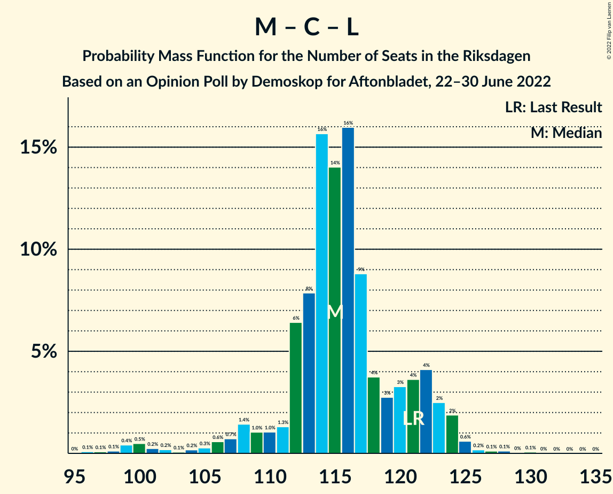

| Number of Seats | Probability | Accumulated | Special Marks |
|:---------------:|:-----------:|:-----------:|:-------------:|
| 96 | 0.1% | 100% |  |
| 97 | 0.1% | 99.9% |  |
| 98 | 0.1% | 99.8% |  |
| 99 | 0.4% | 99.7% |  |
| 100 | 0.5% | 99.3% |  |
| 101 | 0.2% | 98.8% |  |
| 102 | 0.2% | 98.6% |  |
| 103 | 0.1% | 98% |  |
| 104 | 0.2% | 98% |  |
| 105 | 0.3% | 98% |  |
| 106 | 0.6% | 98% |  |
| 107 | 0.7% | 97% |  |
| 108 | 1.4% | 97% |  |
| 109 | 1.0% | 95% |  |
| 110 | 1.0% | 94% |  |
| 111 | 1.3% | 93% |  |
| 112 | 6% | 92% |  |
| 113 | 8% | 85% |  |
| 114 | 16% | 77% |  |
| 115 | 14% | 62% |  |
| 116 | 16% | 48% | Median |
| 117 | 9% | 32% |  |
| 118 | 4% | 23% |  |
| 119 | 3% | 19% |  |
| 120 | 3% | 17% |  |
| 121 | 4% | 13% | Last Result |
| 122 | 4% | 10% |  |
| 123 | 2% | 6% |  |
| 124 | 2% | 3% |  |
| 125 | 0.6% | 1.1% |  |
| 126 | 0.2% | 0.5% |  |
| 127 | 0.1% | 0.4% |  |
| 128 | 0.1% | 0.2% |  |
| 129 | 0% | 0.1% |  |
| 130 | 0.1% | 0.1% |  |
| 131 | 0% | 0% |  |

### Moderata samlingspartiet – Centerpartiet

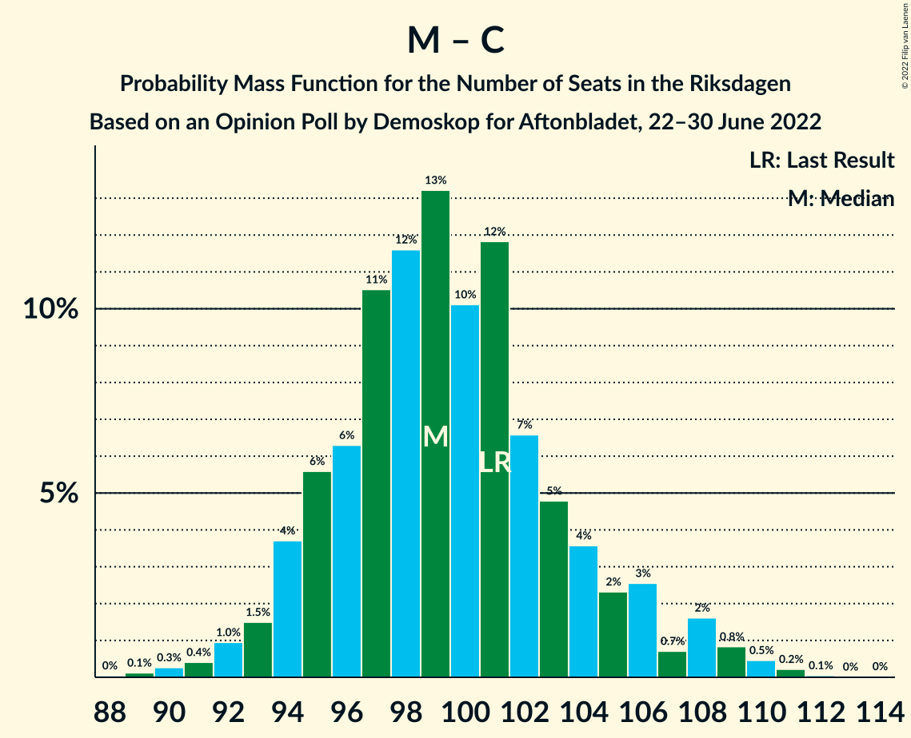

| Number of Seats | Probability | Accumulated | Special Marks |
|:---------------:|:-----------:|:-----------:|:-------------:|
| 88 | 0% | 100% |  |
| 89 | 0.1% | 99.9% |  |
| 90 | 0.3% | 99.8% |  |
| 91 | 0.4% | 99.5% |  |
| 92 | 1.0% | 99.1% |  |
| 93 | 1.5% | 98% |  |
| 94 | 4% | 97% |  |
| 95 | 6% | 93% |  |
| 96 | 6% | 87% |  |
| 97 | 11% | 81% |  |
| 98 | 12% | 71% |  |
| 99 | 13% | 59% | Median |
| 100 | 10% | 46% |  |
| 101 | 12% | 36% | Last Result |
| 102 | 7% | 24% |  |
| 103 | 5% | 17% |  |
| 104 | 4% | 12% |  |
| 105 | 2% | 9% |  |
| 106 | 3% | 7% |  |
| 107 | 0.7% | 4% |  |
| 108 | 2% | 3% |  |
| 109 | 0.8% | 2% |  |
| 110 | 0.5% | 0.8% |  |
| 111 | 0.2% | 0.3% |  |
| 112 | 0.1% | 0.1% |  |
| 113 | 0% | 0.1% |  |
| 114 | 0% | 0% |  |

## Technical Information

### Opinion Poll

+ **Polling firm:** Demoskop
+ **Commissioner(s):** Aftonbladet
+ **Fieldwork period:** 22–30 June 2022

### Calculations

+ **Sample size:** 2125
+ **Simulations done:** 1,048,576
+ **Error estimate:** 0.76%

