# Opinion Poll by SKOP, 8–11 July 2022

<a href="#voting-intentions">Voting Intentions</a> | <a href="#seats">Seats</a> | <a href="#coalitions">Coalitions</a> | <a href="#technical-information">Technical Information</a>

## Voting Intentions

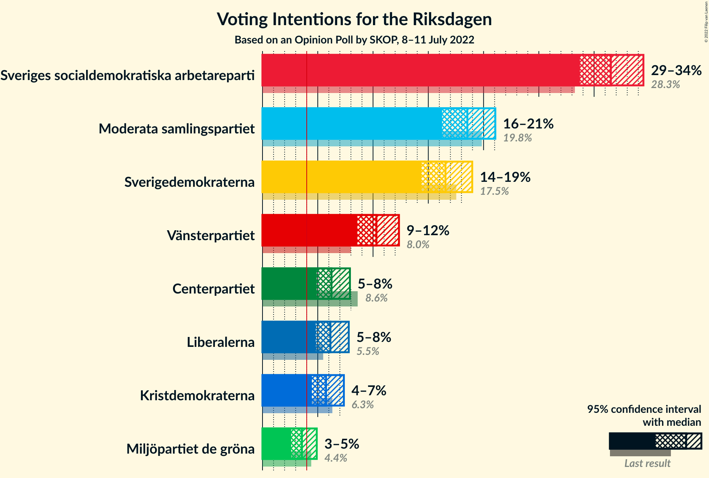

### Confidence Intervals

| Party | Last Result | Poll Result | 80% Confidence Interval | 90% Confidence Interval | 95% Confidence Interval | 99% Confidence Interval |
|:-----:|:-----------:|:-----------:|:-----------------------:|:-----------------------:|:-----------------------:|:-----------------------:|
| Sveriges socialdemokratiska arbetareparti | 28.3% | 31.5% | 29.7–33.4% |29.2–34.0% |28.7–34.5% |27.9–35.4% |
| Moderata samlingspartiet | 19.8% | 18.5% | 17.0–20.2% |16.6–20.7% |16.2–21.1% |15.6–21.9% |
| Sverigedemokraterna | 17.5% | 16.6% | 15.1–18.1% |14.7–18.6% |14.4–19.0% |13.7–19.8% |
| Vänsterpartiet | 8.0% | 10.3% | 9.2–11.6% |8.8–12.0% |8.6–12.3% |8.1–13.0% |
| Centerpartiet | 8.6% | 6.2% | 5.4–7.3% |5.1–7.7% |4.9–7.9% |4.5–8.5% |
| Liberalerna | 5.5% | 6.1% | 5.3–7.2% |5.0–7.5% |4.8–7.8% |4.4–8.4% |
| Kristdemokraterna | 6.3% | 5.7% | 4.9–6.8% |4.7–7.1% |4.5–7.4% |4.1–7.9% |
| Miljöpartiet de gröna | 4.4% | 3.6% | 2.9–4.4% |2.7–4.7% |2.6–4.9% |2.3–5.4% |

*Note:* The poll result column reflects the actual value used in the calculations. Published results may vary slightly, and in addition be rounded to fewer digits.

## Seats

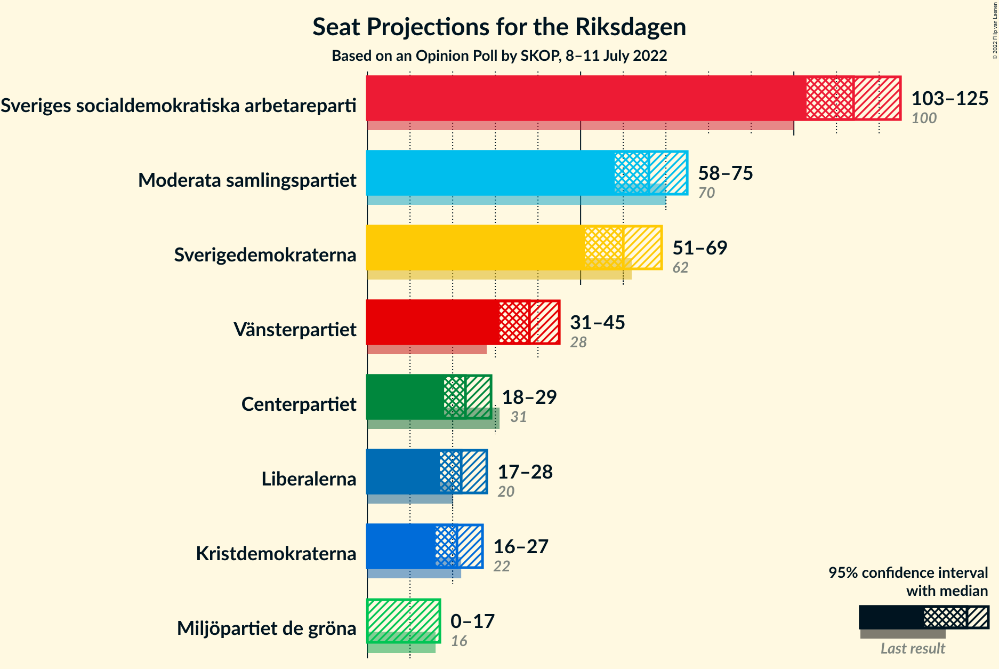

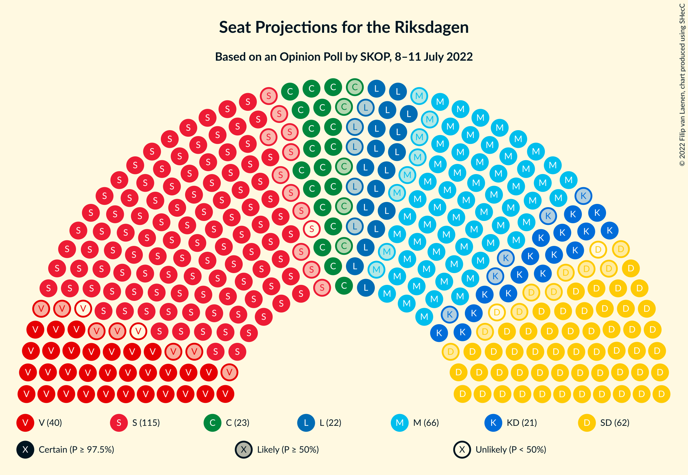

### Confidence Intervals

| Party | Last Result | Median | 80% Confidence Interval | 90% Confidence Interval | 95% Confidence Interval | 99% Confidence Interval |
|:-----:|:-----------:|:------:|:-----------------------:|:-----------------------:|:-----------------------:|:-----------------------:|
| <a href="#sveriges-socialdemokratiska-arbetareparti">Sveriges socialdemokratiska arbetareparti</a> | 100 | 114 | 107–121 |105–123 |103–125 |100–128 |
| <a href="#moderata-samlingspartiet">Moderata samlingspartiet</a> | 70 | 66 | 62–73 |60–74 |58–75 |55–81 |
| <a href="#sverigedemokraterna">Sverigedemokraterna</a> | 62 | 60 | 54–65 |53–67 |51–69 |49–72 |
| <a href="#vänsterpartiet">Vänsterpartiet</a> | 28 | 38 | 33–42 |32–43 |31–45 |29–47 |
| <a href="#centerpartiet">Centerpartiet</a> | 31 | 23 | 19–26 |18–28 |18–29 |16–31 |
| <a href="#liberalerna">Liberalerna</a> | 20 | 22 | 19–26 |18–27 |17–28 |16–30 |
| <a href="#kristdemokraterna">Kristdemokraterna</a> | 22 | 21 | 18–25 |17–26 |16–27 |15–29 |
| <a href="#miljöpartiet-de-gröna">Miljöpartiet de gröna</a> | 16 | 0 | 0–16 |0–17 |0–17 |0–19 |

### Sveriges socialdemokratiska arbetareparti

*For a full overview of the results for this party, see the [Sveriges socialdemokratiska arbetareparti](party-sverigessocialdemokratiskaarbetareparti.html) page.*

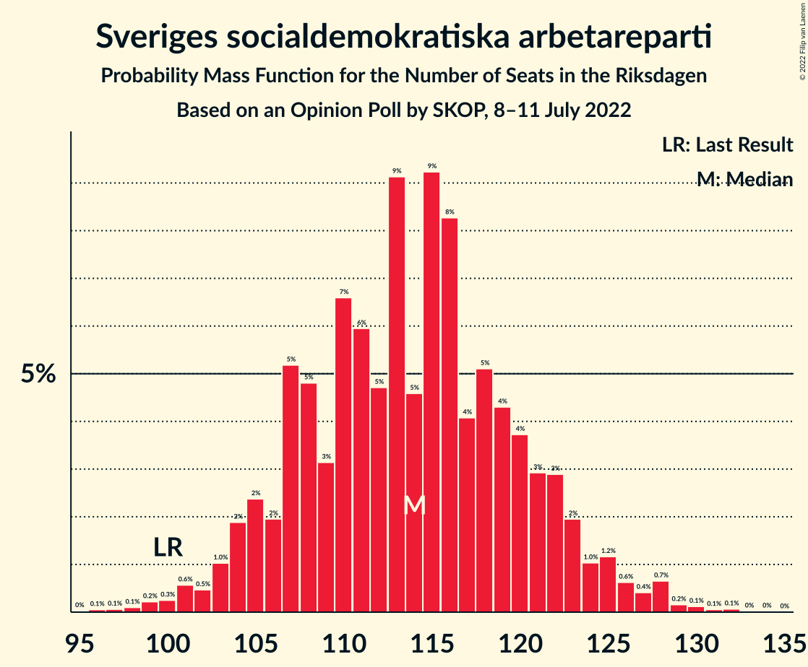

| Number of Seats | Probability | Accumulated | Special Marks |
|:---------------:|:-----------:|:-----------:|:-------------:|
| 95 | 0% | 100% |  |
| 96 | 0.1% | 99.9% |  |
| 97 | 0.1% | 99.9% |  |
| 98 | 0.1% | 99.8% |  |
| 99 | 0.2% | 99.7% |  |
| 100 | 0.3% | 99.5% | Last Result |
| 101 | 0.6% | 99.3% |  |
| 102 | 0.5% | 98.7% |  |
| 103 | 1.0% | 98% |  |
| 104 | 2% | 97% |  |
| 105 | 2% | 95% |  |
| 106 | 2% | 93% |  |
| 107 | 5% | 91% |  |
| 108 | 5% | 86% |  |
| 109 | 3% | 81% |  |
| 110 | 7% | 78% |  |
| 111 | 6% | 71% |  |
| 112 | 5% | 65% |  |
| 113 | 9% | 61% |  |
| 114 | 5% | 51% | Median |
| 115 | 9% | 47% |  |
| 116 | 8% | 38% |  |
| 117 | 4% | 29% |  |
| 118 | 5% | 25% |  |
| 119 | 4% | 20% |  |
| 120 | 4% | 16% |  |
| 121 | 3% | 12% |  |
| 122 | 3% | 9% |  |
| 123 | 2% | 6% |  |
| 124 | 1.0% | 4% |  |
| 125 | 1.2% | 3% |  |
| 126 | 0.6% | 2% |  |
| 127 | 0.4% | 2% |  |
| 128 | 0.7% | 1.1% |  |
| 129 | 0.2% | 0.5% |  |
| 130 | 0.1% | 0.3% |  |
| 131 | 0.1% | 0.2% |  |
| 132 | 0.1% | 0.1% |  |
| 133 | 0% | 0.1% |  |
| 134 | 0% | 0% |  |

### Moderata samlingspartiet

*For a full overview of the results for this party, see the [Moderata samlingspartiet](party-moderatasamlingspartiet.html) page.*

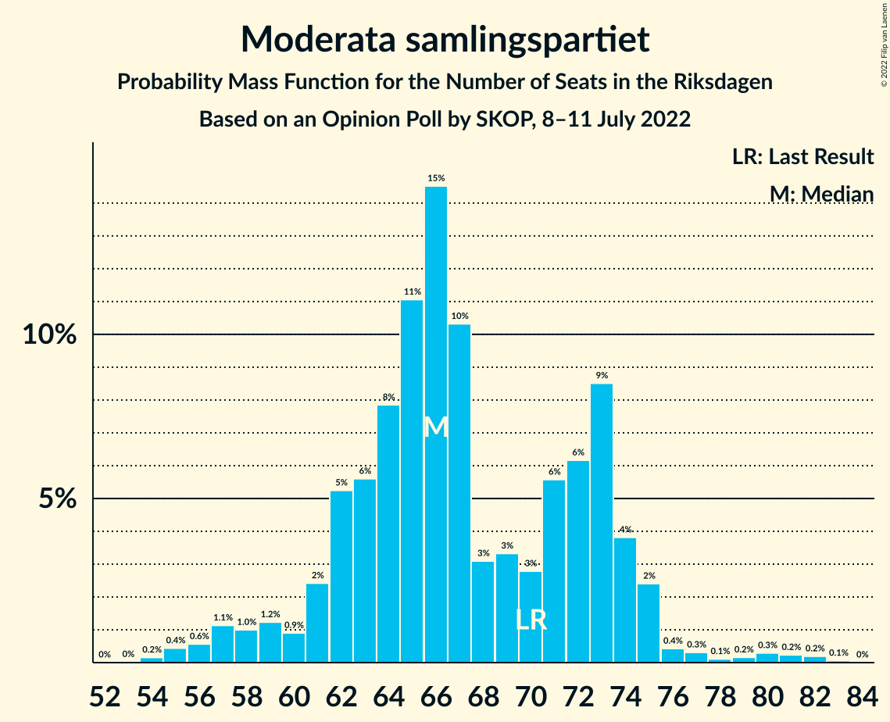

| Number of Seats | Probability | Accumulated | Special Marks |
|:---------------:|:-----------:|:-----------:|:-------------:|
| 54 | 0.2% | 100% |  |
| 55 | 0.4% | 99.8% |  |
| 56 | 0.6% | 99.4% |  |
| 57 | 1.1% | 98.8% |  |
| 58 | 1.0% | 98% |  |
| 59 | 1.2% | 97% |  |
| 60 | 0.9% | 95% |  |
| 61 | 2% | 95% |  |
| 62 | 5% | 92% |  |
| 63 | 6% | 87% |  |
| 64 | 8% | 81% |  |
| 65 | 11% | 73% |  |
| 66 | 15% | 62% | Median |
| 67 | 10% | 48% |  |
| 68 | 3% | 37% |  |
| 69 | 3% | 34% |  |
| 70 | 3% | 31% | Last Result |
| 71 | 6% | 28% |  |
| 72 | 6% | 23% |  |
| 73 | 9% | 17% |  |
| 74 | 4% | 8% |  |
| 75 | 2% | 4% |  |
| 76 | 0.4% | 2% |  |
| 77 | 0.3% | 1.4% |  |
| 78 | 0.1% | 1.1% |  |
| 79 | 0.2% | 1.0% |  |
| 80 | 0.3% | 0.8% |  |
| 81 | 0.2% | 0.5% |  |
| 82 | 0.2% | 0.3% |  |
| 83 | 0.1% | 0.1% |  |
| 84 | 0% | 0% |  |

### Sverigedemokraterna

*For a full overview of the results for this party, see the [Sverigedemokraterna](party-sverigedemokraterna.html) page.*

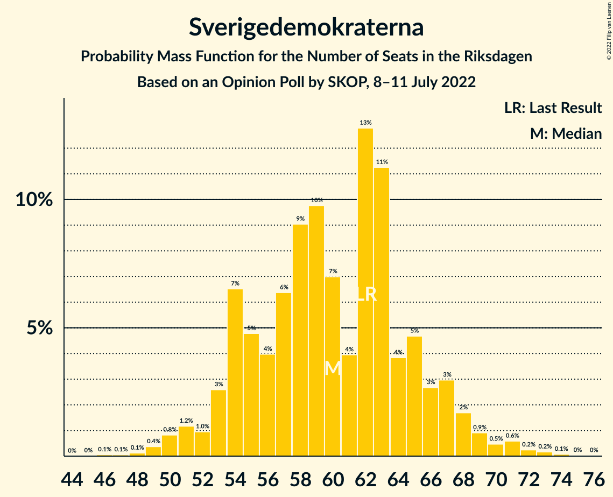

| Number of Seats | Probability | Accumulated | Special Marks |
|:---------------:|:-----------:|:-----------:|:-------------:|
| 46 | 0.1% | 100% |  |
| 47 | 0.1% | 99.9% |  |
| 48 | 0.1% | 99.9% |  |
| 49 | 0.4% | 99.7% |  |
| 50 | 0.8% | 99.4% |  |
| 51 | 1.2% | 98.5% |  |
| 52 | 1.0% | 97% |  |
| 53 | 3% | 96% |  |
| 54 | 7% | 94% |  |
| 55 | 5% | 87% |  |
| 56 | 4% | 83% |  |
| 57 | 6% | 79% |  |
| 58 | 9% | 72% |  |
| 59 | 10% | 63% |  |
| 60 | 7% | 53% | Median |
| 61 | 4% | 46% |  |
| 62 | 13% | 42% | Last Result |
| 63 | 11% | 30% |  |
| 64 | 4% | 18% |  |
| 65 | 5% | 15% |  |
| 66 | 3% | 10% |  |
| 67 | 3% | 7% |  |
| 68 | 2% | 4% |  |
| 69 | 0.9% | 3% |  |
| 70 | 0.5% | 2% |  |
| 71 | 0.6% | 1.2% |  |
| 72 | 0.2% | 0.6% |  |
| 73 | 0.2% | 0.3% |  |
| 74 | 0.1% | 0.2% |  |
| 75 | 0% | 0.1% |  |
| 76 | 0% | 0% |  |

### Vänsterpartiet

*For a full overview of the results for this party, see the [Vänsterpartiet](party-vänsterpartiet.html) page.*

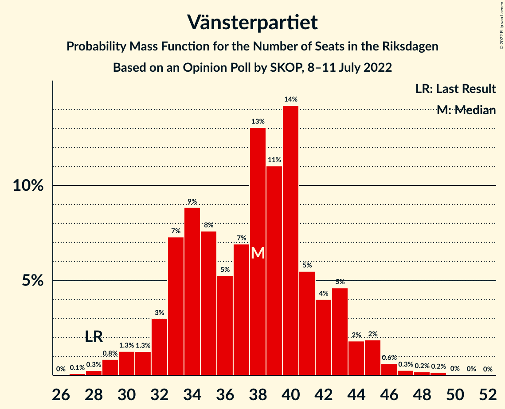

| Number of Seats | Probability | Accumulated | Special Marks |
|:---------------:|:-----------:|:-----------:|:-------------:|
| 27 | 0.1% | 100% |  |
| 28 | 0.3% | 99.9% | Last Result |
| 29 | 0.8% | 99.6% |  |
| 30 | 1.3% | 98.8% |  |
| 31 | 1.3% | 98% |  |
| 32 | 3% | 96% |  |
| 33 | 7% | 93% |  |
| 34 | 9% | 86% |  |
| 35 | 8% | 77% |  |
| 36 | 5% | 70% |  |
| 37 | 7% | 64% |  |
| 38 | 13% | 57% | Median |
| 39 | 11% | 44% |  |
| 40 | 14% | 33% |  |
| 41 | 5% | 19% |  |
| 42 | 4% | 14% |  |
| 43 | 5% | 10% |  |
| 44 | 2% | 5% |  |
| 45 | 2% | 3% |  |
| 46 | 0.6% | 1.3% |  |
| 47 | 0.3% | 0.7% |  |
| 48 | 0.2% | 0.4% |  |
| 49 | 0.2% | 0.2% |  |
| 50 | 0% | 0.1% |  |
| 51 | 0% | 0% |  |

### Centerpartiet

*For a full overview of the results for this party, see the [Centerpartiet](party-centerpartiet.html) page.*

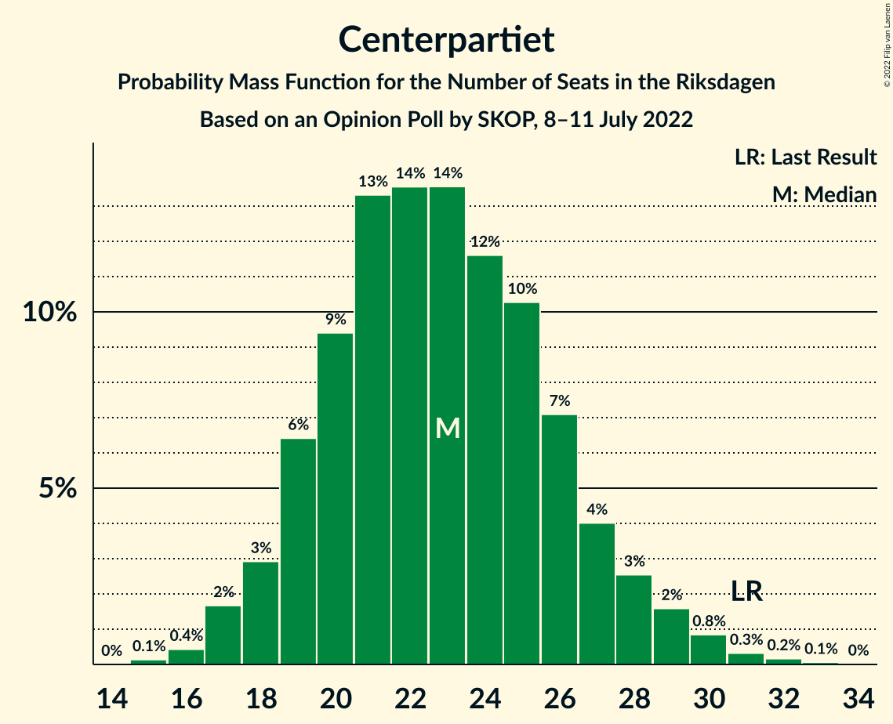

| Number of Seats | Probability | Accumulated | Special Marks |
|:---------------:|:-----------:|:-----------:|:-------------:|
| 15 | 0.1% | 100% |  |
| 16 | 0.4% | 99.8% |  |
| 17 | 2% | 99.4% |  |
| 18 | 3% | 98% |  |
| 19 | 6% | 95% |  |
| 20 | 9% | 88% |  |
| 21 | 13% | 79% |  |
| 22 | 14% | 66% |  |
| 23 | 14% | 52% | Median |
| 24 | 12% | 39% |  |
| 25 | 10% | 27% |  |
| 26 | 7% | 17% |  |
| 27 | 4% | 10% |  |
| 28 | 3% | 6% |  |
| 29 | 2% | 3% |  |
| 30 | 0.8% | 1.4% |  |
| 31 | 0.3% | 0.6% | Last Result |
| 32 | 0.2% | 0.3% |  |
| 33 | 0.1% | 0.1% |  |
| 34 | 0% | 0% |  |

### Liberalerna

*For a full overview of the results for this party, see the [Liberalerna](party-liberalerna.html) page.*

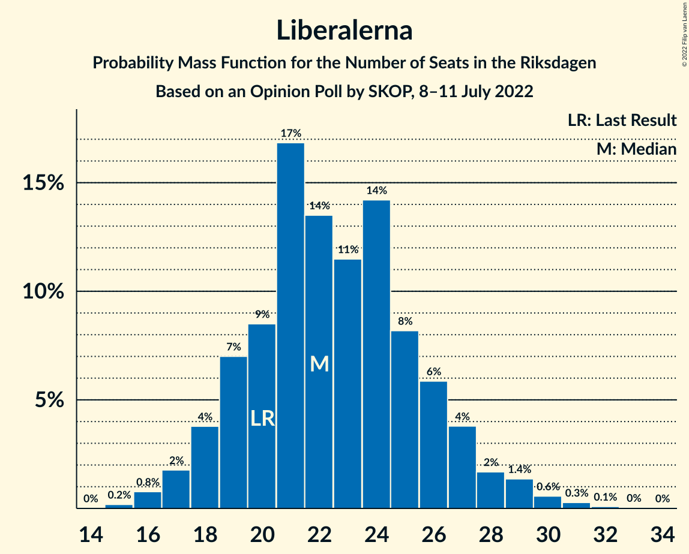

| Number of Seats | Probability | Accumulated | Special Marks |
|:---------------:|:-----------:|:-----------:|:-------------:|
| 14 | 0% | 100% |  |
| 15 | 0.2% | 99.9% |  |
| 16 | 0.8% | 99.8% |  |
| 17 | 2% | 99.0% |  |
| 18 | 4% | 97% |  |
| 19 | 7% | 93% |  |
| 20 | 9% | 86% | Last Result |
| 21 | 17% | 78% |  |
| 22 | 14% | 61% | Median |
| 23 | 11% | 48% |  |
| 24 | 14% | 36% |  |
| 25 | 8% | 22% |  |
| 26 | 6% | 14% |  |
| 27 | 4% | 8% |  |
| 28 | 2% | 4% |  |
| 29 | 1.4% | 2% |  |
| 30 | 0.6% | 1.0% |  |
| 31 | 0.3% | 0.4% |  |
| 32 | 0.1% | 0.1% |  |
| 33 | 0% | 0.1% |  |
| 34 | 0% | 0% |  |

### Kristdemokraterna

*For a full overview of the results for this party, see the [Kristdemokraterna](party-kristdemokraterna.html) page.*

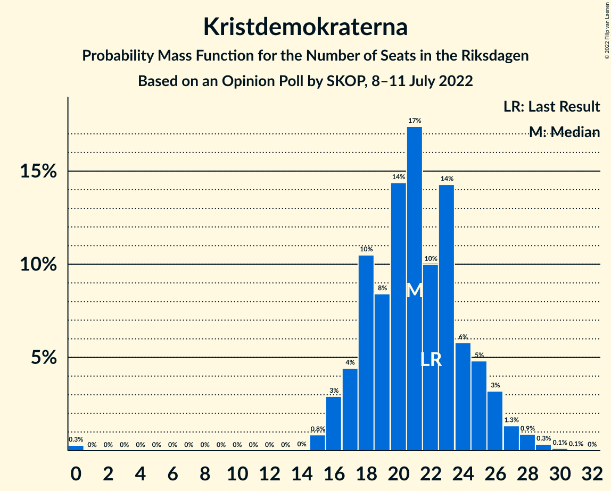

| Number of Seats | Probability | Accumulated | Special Marks |
|:---------------:|:-----------:|:-----------:|:-------------:|
| 0 | 0.3% | 100% |  |
| 1 | 0% | 99.7% |  |
| 2 | 0% | 99.7% |  |
| 3 | 0% | 99.7% |  |
| 4 | 0% | 99.7% |  |
| 5 | 0% | 99.7% |  |
| 6 | 0% | 99.7% |  |
| 7 | 0% | 99.7% |  |
| 8 | 0% | 99.7% |  |
| 9 | 0% | 99.7% |  |
| 10 | 0% | 99.7% |  |
| 11 | 0% | 99.7% |  |
| 12 | 0% | 99.7% |  |
| 13 | 0% | 99.7% |  |
| 14 | 0% | 99.7% |  |
| 15 | 0.8% | 99.7% |  |
| 16 | 3% | 98.8% |  |
| 17 | 4% | 96% |  |
| 18 | 10% | 91% |  |
| 19 | 8% | 81% |  |
| 20 | 14% | 73% |  |
| 21 | 17% | 58% | Median |
| 22 | 10% | 41% | Last Result |
| 23 | 14% | 31% |  |
| 24 | 6% | 17% |  |
| 25 | 5% | 11% |  |
| 26 | 3% | 6% |  |
| 27 | 1.3% | 3% |  |
| 28 | 0.9% | 1.4% |  |
| 29 | 0.3% | 0.5% |  |
| 30 | 0.1% | 0.2% |  |
| 31 | 0.1% | 0.1% |  |
| 32 | 0% | 0% |  |

### Miljöpartiet de gröna

*For a full overview of the results for this party, see the [Miljöpartiet de gröna](party-miljöpartietdegröna.html) page.*

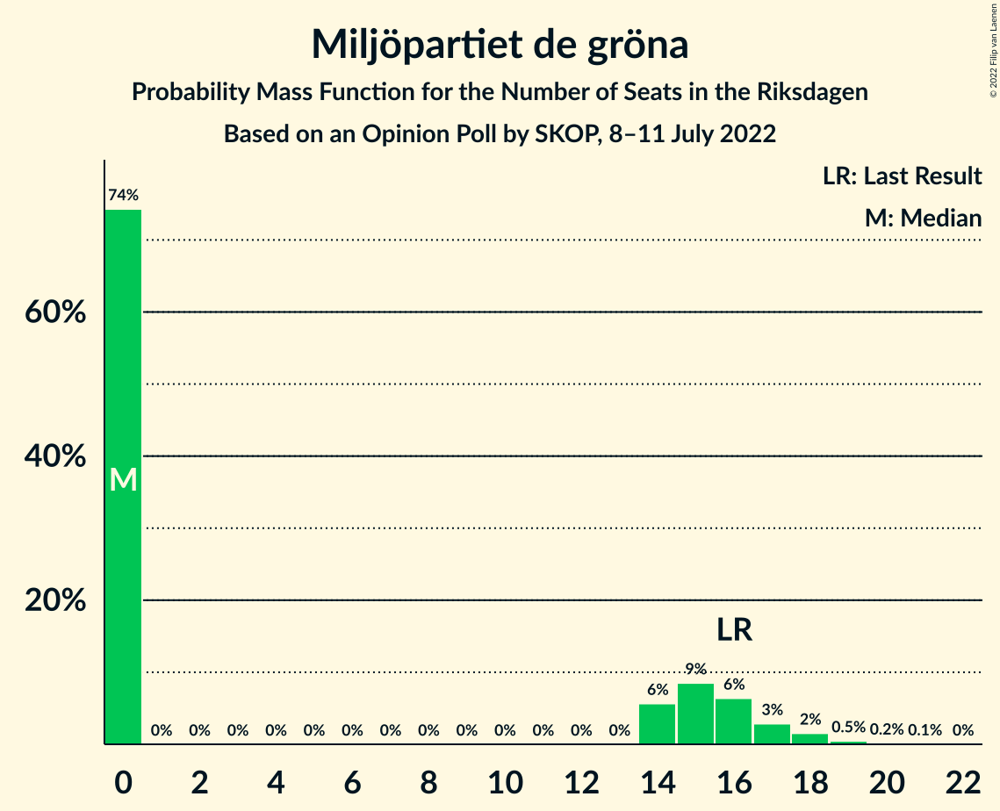

| Number of Seats | Probability | Accumulated | Special Marks |
|:---------------:|:-----------:|:-----------:|:-------------:|
| 0 | 74% | 100% | Median |
| 1 | 0% | 26% |  |
| 2 | 0% | 26% |  |
| 3 | 0% | 26% |  |
| 4 | 0% | 26% |  |
| 5 | 0% | 26% |  |
| 6 | 0% | 26% |  |
| 7 | 0% | 26% |  |
| 8 | 0% | 26% |  |
| 9 | 0% | 26% |  |
| 10 | 0% | 26% |  |
| 11 | 0% | 26% |  |
| 12 | 0% | 26% |  |
| 13 | 0% | 26% |  |
| 14 | 6% | 26% |  |
| 15 | 9% | 20% |  |
| 16 | 6% | 12% | Last Result |
| 17 | 3% | 5% |  |
| 18 | 2% | 2% |  |
| 19 | 0.5% | 0.7% |  |
| 20 | 0.2% | 0.2% |  |
| 21 | 0.1% | 0.1% |  |
| 22 | 0% | 0% |  |

## Coalitions

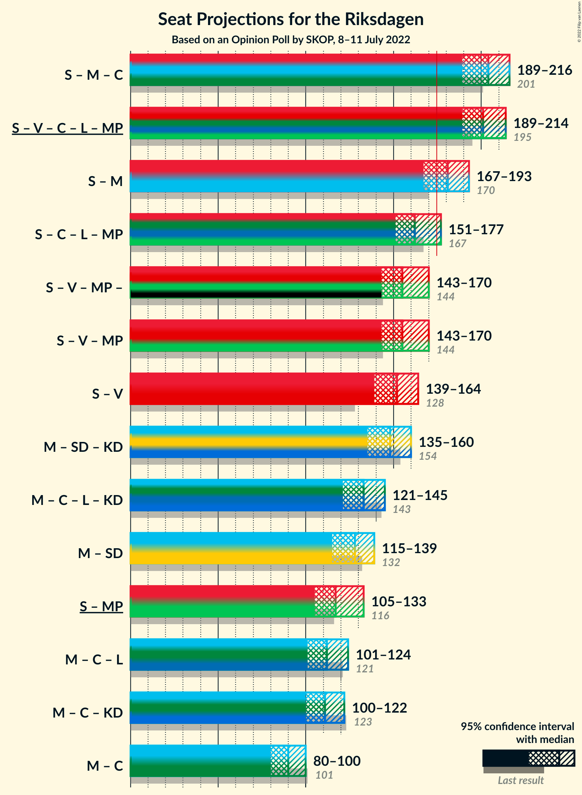

### Confidence Intervals

| Coalition | Last Result | Median | Majority? | 80% Confidence Interval | 90% Confidence Interval | 95% Confidence Interval | 99% Confidence Interval |
|:---------:|:-----------:|:------:|:---------:|:-----------------------:|:-----------------------:|:-----------------------:|:-----------------------:|
| Sveriges socialdemokratiska arbetareparti – Moderata samlingspartiet – Centerpartiet | 201 | 204 | 100% | 195–212 | 192–214 | 189–216 | 186–220 |
| Sveriges socialdemokratiska arbetareparti – Vänsterpartiet – Centerpartiet – Liberalerna – Miljöpartiet de gröna | 195 | 201 | 100% | 192–209 | 191–211 | 189–214 | 185–217 |
| Sveriges socialdemokratiska arbetareparti – Moderata samlingspartiet | 170 | 181 | 84% | 172–189 | 170–191 | 167–193 | 164–197 |
| Sveriges socialdemokratiska arbetareparti – Centerpartiet – Liberalerna – Miljöpartiet de gröna | 167 | 162 | 5% | 154–172 | 153–174 | 151–177 | 147–181 |
| Sveriges socialdemokratiska arbetareparti – Vänsterpartiet – Miljöpartiet de gröna | 144 | 155 | 0.4% | 147–165 | 145–167 | 143–170 | 139–174 |
| Sveriges socialdemokratiska arbetareparti – Vänsterpartiet | 128 | 152 | 0% | 143–160 | 141–162 | 139–164 | 135–168 |
| Moderata samlingspartiet – Sverigedemokraterna – Kristdemokraterna | 154 | 148 | 0% | 140–157 | 138–158 | 135–160 | 132–164 |
| Moderata samlingspartiet – Centerpartiet – Liberalerna – Kristdemokraterna | 143 | 133 | 0% | 126–141 | 123–144 | 121–145 | 117–149 |
| Moderata samlingspartiet – Sverigedemokraterna | 132 | 128 | 0% | 119–135 | 117–136 | 115–139 | 112–142 |
| Sveriges socialdemokratiska arbetareparti – Miljöpartiet de gröna | 116 | 117 | 0% | 109–127 | 107–130 | 105–133 | 103–137 |
| Moderata samlingspartiet – Centerpartiet – Liberalerna | 121 | 112 | 0% | 105–120 | 104–121 | 101–124 | 98–127 |
| Moderata samlingspartiet – Centerpartiet – Kristdemokraterna | 123 | 111 | 0% | 103–118 | 101–121 | 100–122 | 96–125 |
| Moderata samlingspartiet – Centerpartiet | 101 | 90 | 0% | 83–97 | 82–99 | 80–100 | 77–104 |

### Sveriges socialdemokratiska arbetareparti – Moderata samlingspartiet – Centerpartiet

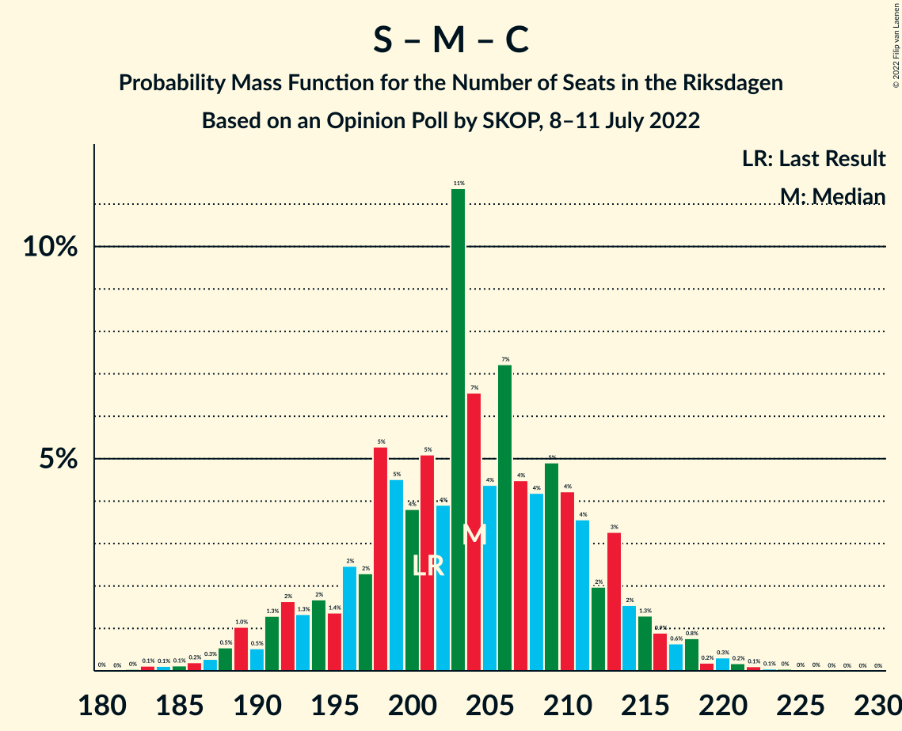

| Number of Seats | Probability | Accumulated | Special Marks |
|:---------------:|:-----------:|:-----------:|:-------------:|
| 182 | 0% | 100% |  |
| 183 | 0.1% | 99.9% |  |
| 184 | 0.1% | 99.8% |  |
| 185 | 0.1% | 99.7% |  |
| 186 | 0.2% | 99.6% |  |
| 187 | 0.3% | 99.4% |  |
| 188 | 0.5% | 99.1% |  |
| 189 | 1.0% | 98.5% |  |
| 190 | 0.5% | 97% |  |
| 191 | 1.3% | 97% |  |
| 192 | 2% | 96% |  |
| 193 | 1.3% | 94% |  |
| 194 | 2% | 93% |  |
| 195 | 1.4% | 91% |  |
| 196 | 2% | 90% |  |
| 197 | 2% | 87% |  |
| 198 | 5% | 85% |  |
| 199 | 5% | 80% |  |
| 200 | 4% | 75% |  |
| 201 | 5% | 71% | Last Result |
| 202 | 4% | 66% |  |
| 203 | 11% | 62% | Median |
| 204 | 7% | 51% |  |
| 205 | 4% | 44% |  |
| 206 | 7% | 40% |  |
| 207 | 4% | 33% |  |
| 208 | 4% | 28% |  |
| 209 | 5% | 24% |  |
| 210 | 4% | 19% |  |
| 211 | 4% | 15% |  |
| 212 | 2% | 11% |  |
| 213 | 3% | 9% |  |
| 214 | 2% | 6% |  |
| 215 | 1.3% | 5% |  |
| 216 | 0.9% | 3% |  |
| 217 | 0.6% | 2% |  |
| 218 | 0.8% | 2% |  |
| 219 | 0.2% | 1.0% |  |
| 220 | 0.3% | 0.8% |  |
| 221 | 0.2% | 0.4% |  |
| 222 | 0.1% | 0.3% |  |
| 223 | 0.1% | 0.2% |  |
| 224 | 0% | 0.1% |  |
| 225 | 0% | 0.1% |  |
| 226 | 0% | 0% |  |

### Sveriges socialdemokratiska arbetareparti – Vänsterpartiet – Centerpartiet – Liberalerna – Miljöpartiet de gröna

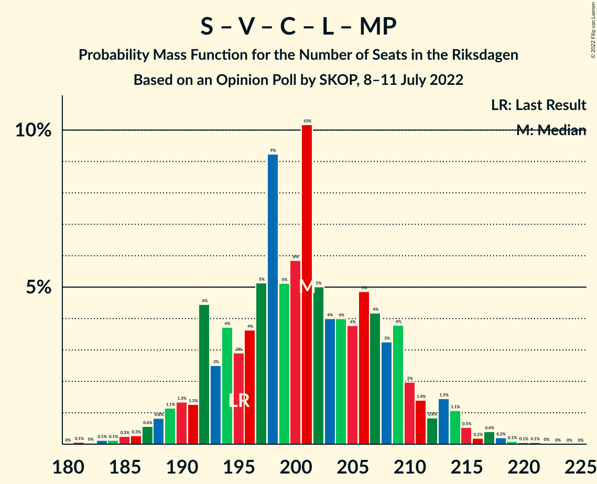

| Number of Seats | Probability | Accumulated | Special Marks |
|:---------------:|:-----------:|:-----------:|:-------------:|
| 181 | 0.1% | 100% |  |
| 182 | 0% | 99.9% |  |
| 183 | 0.1% | 99.9% |  |
| 184 | 0.1% | 99.7% |  |
| 185 | 0.3% | 99.6% |  |
| 186 | 0.3% | 99.4% |  |
| 187 | 0.6% | 99.1% |  |
| 188 | 0.8% | 98.5% |  |
| 189 | 1.1% | 98% |  |
| 190 | 1.3% | 97% |  |
| 191 | 1.3% | 95% |  |
| 192 | 4% | 94% |  |
| 193 | 3% | 89% |  |
| 194 | 4% | 87% |  |
| 195 | 3% | 83% | Last Result |
| 196 | 4% | 80% |  |
| 197 | 5% | 77% | Median |
| 198 | 9% | 72% |  |
| 199 | 5% | 62% |  |
| 200 | 6% | 57% |  |
| 201 | 10% | 51% |  |
| 202 | 5% | 41% |  |
| 203 | 4% | 36% |  |
| 204 | 4% | 32% |  |
| 205 | 4% | 28% |  |
| 206 | 5% | 24% |  |
| 207 | 4% | 20% |  |
| 208 | 3% | 15% |  |
| 209 | 4% | 12% |  |
| 210 | 2% | 8% |  |
| 211 | 1.4% | 6% |  |
| 212 | 0.8% | 5% |  |
| 213 | 1.5% | 4% |  |
| 214 | 1.1% | 3% |  |
| 215 | 0.5% | 2% |  |
| 216 | 0.2% | 1.1% |  |
| 217 | 0.4% | 0.9% |  |
| 218 | 0.2% | 0.5% |  |
| 219 | 0.1% | 0.3% |  |
| 220 | 0.1% | 0.2% |  |
| 221 | 0.1% | 0.1% |  |
| 222 | 0% | 0.1% |  |
| 223 | 0% | 0% |  |

### Sveriges socialdemokratiska arbetareparti – Moderata samlingspartiet

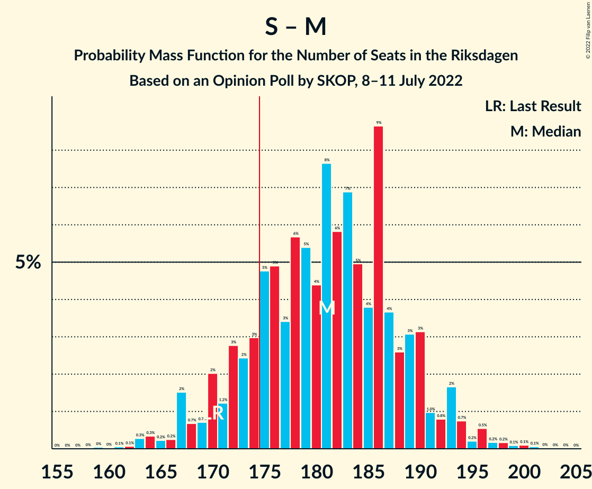

| Number of Seats | Probability | Accumulated | Special Marks |
|:---------------:|:-----------:|:-----------:|:-------------:|
| 159 | 0% | 100% |  |
| 160 | 0% | 99.9% |  |
| 161 | 0.1% | 99.9% |  |
| 162 | 0.1% | 99.8% |  |
| 163 | 0.3% | 99.8% |  |
| 164 | 0.3% | 99.5% |  |
| 165 | 0.2% | 99.2% |  |
| 166 | 0.2% | 98.9% |  |
| 167 | 2% | 98.7% |  |
| 168 | 0.7% | 97% |  |
| 169 | 0.7% | 96% |  |
| 170 | 2% | 96% | Last Result |
| 171 | 1.2% | 94% |  |
| 172 | 3% | 93% |  |
| 173 | 2% | 90% |  |
| 174 | 3% | 87% |  |
| 175 | 5% | 84% | Majority |
| 176 | 5% | 80% |  |
| 177 | 3% | 75% |  |
| 178 | 6% | 71% |  |
| 179 | 5% | 66% |  |
| 180 | 4% | 60% | Median |
| 181 | 8% | 56% |  |
| 182 | 6% | 48% |  |
| 183 | 7% | 42% |  |
| 184 | 5% | 35% |  |
| 185 | 4% | 30% |  |
| 186 | 9% | 27% |  |
| 187 | 4% | 18% |  |
| 188 | 3% | 14% |  |
| 189 | 3% | 12% |  |
| 190 | 3% | 9% |  |
| 191 | 1.0% | 6% |  |
| 192 | 0.8% | 5% |  |
| 193 | 2% | 4% |  |
| 194 | 0.7% | 2% |  |
| 195 | 0.2% | 1.4% |  |
| 196 | 0.5% | 1.2% |  |
| 197 | 0.2% | 0.6% |  |
| 198 | 0.2% | 0.5% |  |
| 199 | 0.1% | 0.3% |  |
| 200 | 0.1% | 0.2% |  |
| 201 | 0.1% | 0.1% |  |
| 202 | 0% | 0.1% |  |
| 203 | 0% | 0% |  |

### Sveriges socialdemokratiska arbetareparti – Centerpartiet – Liberalerna – Miljöpartiet de gröna

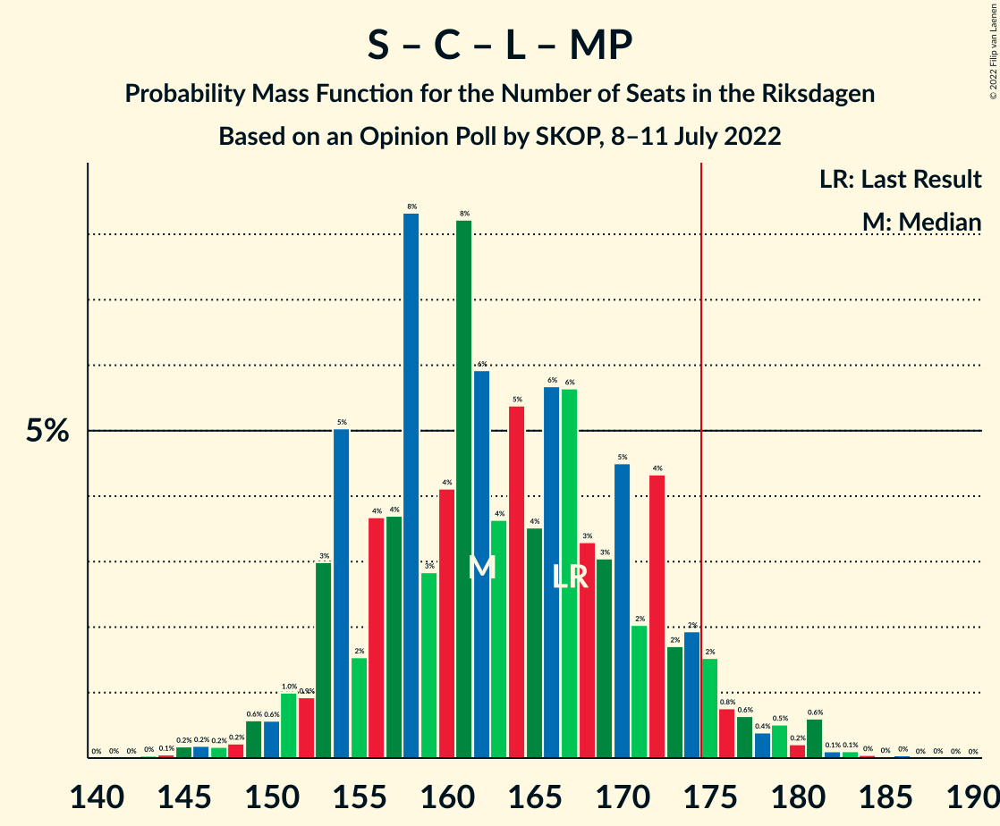

| Number of Seats | Probability | Accumulated | Special Marks |
|:---------------:|:-----------:|:-----------:|:-------------:|
| 143 | 0% | 100% |  |
| 144 | 0.1% | 99.9% |  |
| 145 | 0.2% | 99.9% |  |
| 146 | 0.2% | 99.7% |  |
| 147 | 0.2% | 99.5% |  |
| 148 | 0.2% | 99.3% |  |
| 149 | 0.6% | 99.1% |  |
| 150 | 0.6% | 98.6% |  |
| 151 | 1.0% | 98% |  |
| 152 | 0.9% | 97% |  |
| 153 | 3% | 96% |  |
| 154 | 5% | 93% |  |
| 155 | 2% | 88% |  |
| 156 | 4% | 86% |  |
| 157 | 4% | 83% |  |
| 158 | 8% | 79% |  |
| 159 | 3% | 71% | Median |
| 160 | 4% | 68% |  |
| 161 | 8% | 64% |  |
| 162 | 6% | 56% |  |
| 163 | 4% | 50% |  |
| 164 | 5% | 46% |  |
| 165 | 4% | 41% |  |
| 166 | 6% | 37% |  |
| 167 | 6% | 31% | Last Result |
| 168 | 3% | 26% |  |
| 169 | 3% | 23% |  |
| 170 | 5% | 19% |  |
| 171 | 2% | 15% |  |
| 172 | 4% | 13% |  |
| 173 | 2% | 9% |  |
| 174 | 2% | 7% |  |
| 175 | 2% | 5% | Majority |
| 176 | 0.8% | 3% |  |
| 177 | 0.6% | 3% |  |
| 178 | 0.4% | 2% |  |
| 179 | 0.5% | 2% |  |
| 180 | 0.2% | 1.2% |  |
| 181 | 0.6% | 0.9% |  |
| 182 | 0.1% | 0.3% |  |
| 183 | 0.1% | 0.2% |  |
| 184 | 0% | 0.1% |  |
| 185 | 0% | 0.1% |  |
| 186 | 0% | 0.1% |  |
| 187 | 0% | 0% |  |

### Sveriges socialdemokratiska arbetareparti – Vänsterpartiet – Miljöpartiet de gröna

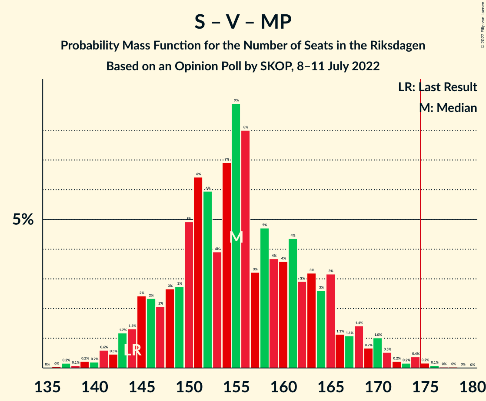

| Number of Seats | Probability | Accumulated | Special Marks |
|:---------------:|:-----------:|:-----------:|:-------------:|
| 136 | 0% | 100% |  |
| 137 | 0.2% | 99.9% |  |
| 138 | 0.1% | 99.7% |  |
| 139 | 0.2% | 99.7% |  |
| 140 | 0.2% | 99.4% |  |
| 141 | 0.6% | 99.2% |  |
| 142 | 0.5% | 98.6% |  |
| 143 | 1.2% | 98% |  |
| 144 | 1.3% | 97% | Last Result |
| 145 | 2% | 96% |  |
| 146 | 2% | 93% |  |
| 147 | 2% | 91% |  |
| 148 | 3% | 89% |  |
| 149 | 3% | 86% |  |
| 150 | 5% | 83% |  |
| 151 | 6% | 79% |  |
| 152 | 6% | 72% | Median |
| 153 | 4% | 66% |  |
| 154 | 7% | 62% |  |
| 155 | 9% | 55% |  |
| 156 | 8% | 46% |  |
| 157 | 3% | 38% |  |
| 158 | 5% | 35% |  |
| 159 | 4% | 30% |  |
| 160 | 4% | 27% |  |
| 161 | 4% | 23% |  |
| 162 | 3% | 19% |  |
| 163 | 3% | 16% |  |
| 164 | 3% | 13% |  |
| 165 | 3% | 10% |  |
| 166 | 1.1% | 7% |  |
| 167 | 1.1% | 6% |  |
| 168 | 1.4% | 5% |  |
| 169 | 0.7% | 3% |  |
| 170 | 1.0% | 3% |  |
| 171 | 0.5% | 2% |  |
| 172 | 0.2% | 1.1% |  |
| 173 | 0.2% | 0.9% |  |
| 174 | 0.4% | 0.7% |  |
| 175 | 0.2% | 0.4% | Majority |
| 176 | 0.1% | 0.2% |  |
| 177 | 0% | 0.1% |  |
| 178 | 0% | 0.1% |  |
| 179 | 0% | 0% |  |

### Sveriges socialdemokratiska arbetareparti – Vänsterpartiet

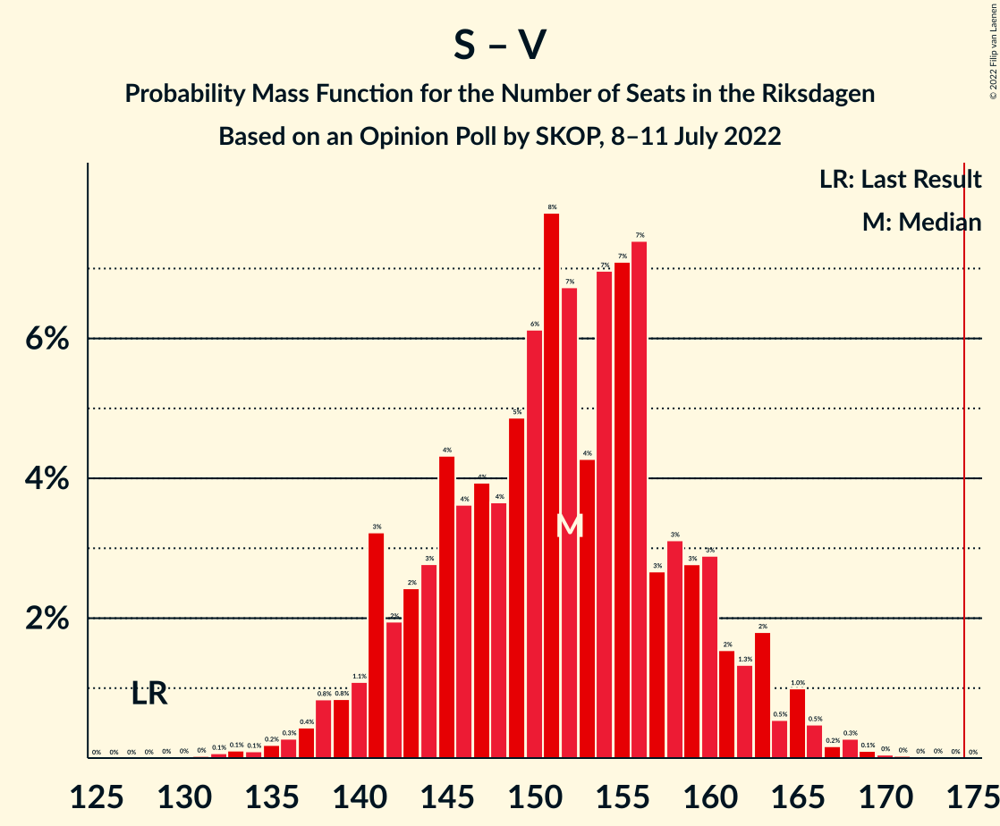

| Number of Seats | Probability | Accumulated | Special Marks |
|:---------------:|:-----------:|:-----------:|:-------------:|
| 128 | 0% | 100% | Last Result |
| 129 | 0% | 100% |  |
| 130 | 0% | 100% |  |
| 131 | 0% | 100% |  |
| 132 | 0.1% | 99.9% |  |
| 133 | 0.1% | 99.9% |  |
| 134 | 0.1% | 99.8% |  |
| 135 | 0.2% | 99.7% |  |
| 136 | 0.3% | 99.5% |  |
| 137 | 0.4% | 99.2% |  |
| 138 | 0.8% | 98.8% |  |
| 139 | 0.8% | 98% |  |
| 140 | 1.1% | 97% |  |
| 141 | 3% | 96% |  |
| 142 | 2% | 93% |  |
| 143 | 2% | 91% |  |
| 144 | 3% | 88% |  |
| 145 | 4% | 86% |  |
| 146 | 4% | 81% |  |
| 147 | 4% | 78% |  |
| 148 | 4% | 74% |  |
| 149 | 5% | 70% |  |
| 150 | 6% | 65% |  |
| 151 | 8% | 59% |  |
| 152 | 7% | 51% | Median |
| 153 | 4% | 45% |  |
| 154 | 7% | 40% |  |
| 155 | 7% | 33% |  |
| 156 | 7% | 26% |  |
| 157 | 3% | 19% |  |
| 158 | 3% | 16% |  |
| 159 | 3% | 13% |  |
| 160 | 3% | 10% |  |
| 161 | 2% | 7% |  |
| 162 | 1.3% | 6% |  |
| 163 | 2% | 4% |  |
| 164 | 0.5% | 3% |  |
| 165 | 1.0% | 2% |  |
| 166 | 0.5% | 1.2% |  |
| 167 | 0.2% | 0.7% |  |
| 168 | 0.3% | 0.5% |  |
| 169 | 0.1% | 0.2% |  |
| 170 | 0% | 0.1% |  |
| 171 | 0% | 0.1% |  |
| 172 | 0% | 0.1% |  |
| 173 | 0% | 0% |  |

### Moderata samlingspartiet – Sverigedemokraterna – Kristdemokraterna

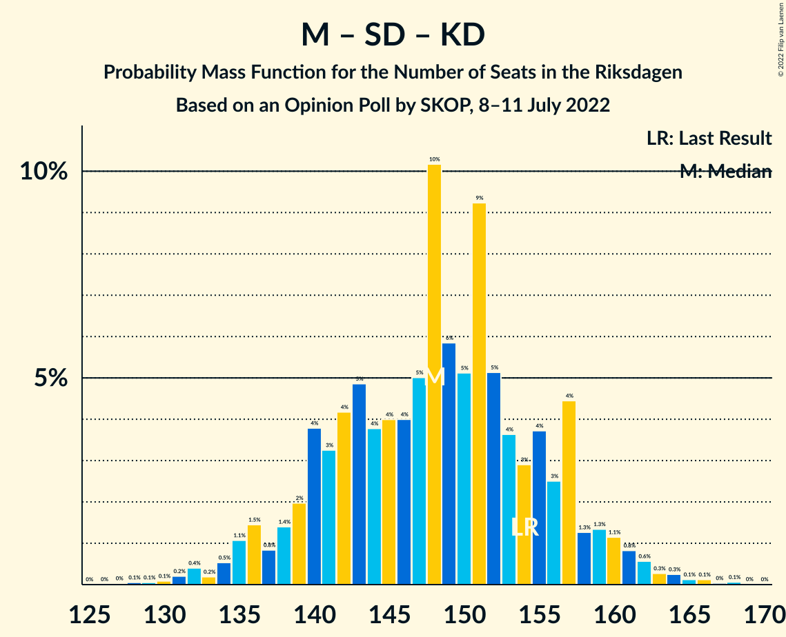

| Number of Seats | Probability | Accumulated | Special Marks |
|:---------------:|:-----------:|:-----------:|:-------------:|
| 127 | 0% | 100% |  |
| 128 | 0.1% | 99.9% |  |
| 129 | 0.1% | 99.9% |  |
| 130 | 0.1% | 99.8% |  |
| 131 | 0.2% | 99.7% |  |
| 132 | 0.4% | 99.5% |  |
| 133 | 0.2% | 99.1% |  |
| 134 | 0.5% | 98.9% |  |
| 135 | 1.1% | 98% |  |
| 136 | 1.5% | 97% |  |
| 137 | 0.8% | 96% |  |
| 138 | 1.4% | 95% |  |
| 139 | 2% | 94% |  |
| 140 | 4% | 92% |  |
| 141 | 3% | 88% |  |
| 142 | 4% | 85% |  |
| 143 | 5% | 80% |  |
| 144 | 4% | 76% |  |
| 145 | 4% | 72% |  |
| 146 | 4% | 68% |  |
| 147 | 5% | 64% | Median |
| 148 | 10% | 59% |  |
| 149 | 6% | 49% |  |
| 150 | 5% | 43% |  |
| 151 | 9% | 38% |  |
| 152 | 5% | 28% |  |
| 153 | 4% | 23% |  |
| 154 | 3% | 20% | Last Result |
| 155 | 4% | 17% |  |
| 156 | 3% | 13% |  |
| 157 | 4% | 11% |  |
| 158 | 1.3% | 6% |  |
| 159 | 1.3% | 5% |  |
| 160 | 1.1% | 3% |  |
| 161 | 0.8% | 2% |  |
| 162 | 0.6% | 1.5% |  |
| 163 | 0.3% | 0.9% |  |
| 164 | 0.3% | 0.6% |  |
| 165 | 0.1% | 0.4% |  |
| 166 | 0.1% | 0.3% |  |
| 167 | 0% | 0.1% |  |
| 168 | 0.1% | 0.1% |  |
| 169 | 0% | 0% |  |

### Moderata samlingspartiet – Centerpartiet – Liberalerna – Kristdemokraterna

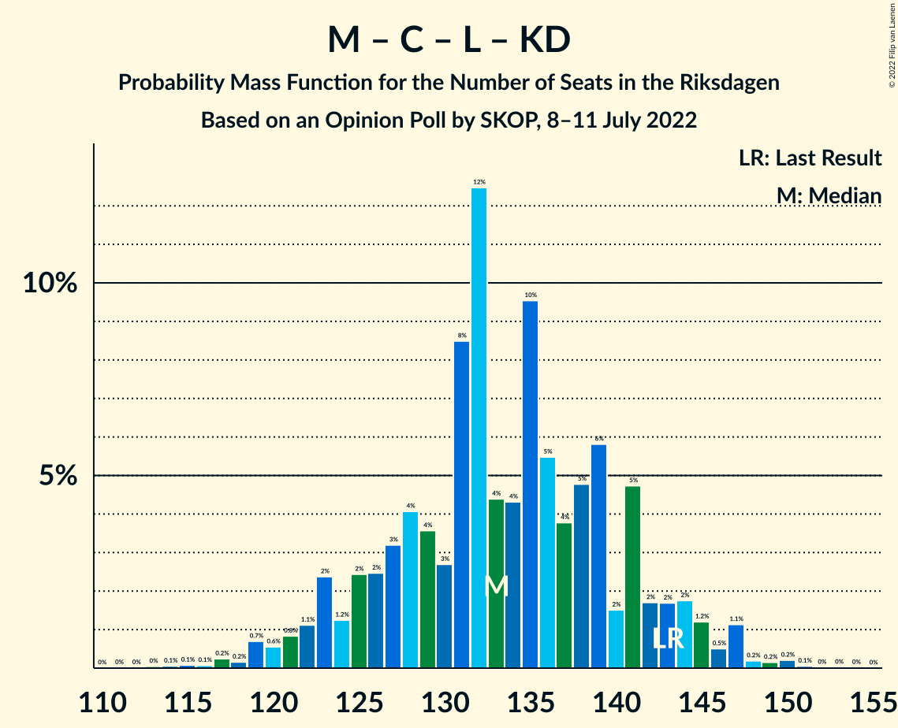

| Number of Seats | Probability | Accumulated | Special Marks |
|:---------------:|:-----------:|:-----------:|:-------------:|
| 112 | 0% | 100% |  |
| 113 | 0% | 99.9% |  |
| 114 | 0.1% | 99.9% |  |
| 115 | 0.1% | 99.8% |  |
| 116 | 0.1% | 99.8% |  |
| 117 | 0.2% | 99.7% |  |
| 118 | 0.2% | 99.4% |  |
| 119 | 0.7% | 99.3% |  |
| 120 | 0.6% | 98.6% |  |
| 121 | 0.8% | 98% |  |
| 122 | 1.1% | 97% |  |
| 123 | 2% | 96% |  |
| 124 | 1.2% | 94% |  |
| 125 | 2% | 92% |  |
| 126 | 2% | 90% |  |
| 127 | 3% | 88% |  |
| 128 | 4% | 84% |  |
| 129 | 4% | 80% |  |
| 130 | 3% | 77% |  |
| 131 | 8% | 74% |  |
| 132 | 12% | 66% | Median |
| 133 | 4% | 53% |  |
| 134 | 4% | 49% |  |
| 135 | 10% | 44% |  |
| 136 | 5% | 35% |  |
| 137 | 4% | 29% |  |
| 138 | 5% | 26% |  |
| 139 | 6% | 21% |  |
| 140 | 2% | 15% |  |
| 141 | 5% | 13% |  |
| 142 | 2% | 9% |  |
| 143 | 2% | 7% | Last Result |
| 144 | 2% | 5% |  |
| 145 | 1.2% | 4% |  |
| 146 | 0.5% | 2% |  |
| 147 | 1.1% | 2% |  |
| 148 | 0.2% | 0.7% |  |
| 149 | 0.2% | 0.5% |  |
| 150 | 0.2% | 0.3% |  |
| 151 | 0.1% | 0.1% |  |
| 152 | 0% | 0.1% |  |
| 153 | 0% | 0.1% |  |
| 154 | 0% | 0% |  |

### Moderata samlingspartiet – Sverigedemokraterna

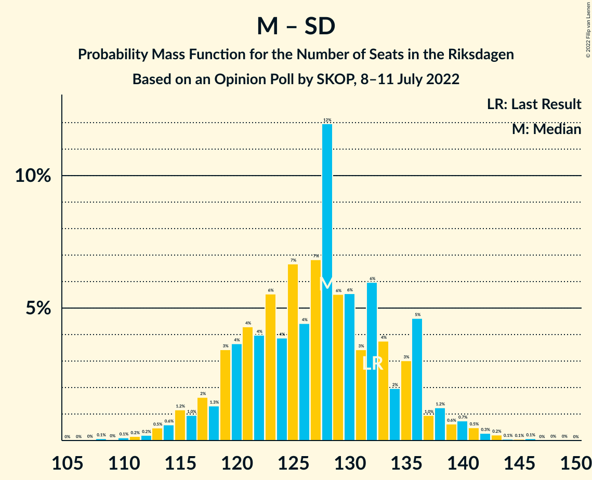

| Number of Seats | Probability | Accumulated | Special Marks |
|:---------------:|:-----------:|:-----------:|:-------------:|
| 108 | 0.1% | 100% |  |
| 109 | 0% | 99.9% |  |
| 110 | 0.1% | 99.8% |  |
| 111 | 0.2% | 99.7% |  |
| 112 | 0.2% | 99.6% |  |
| 113 | 0.5% | 99.4% |  |
| 114 | 0.6% | 98.9% |  |
| 115 | 1.2% | 98% |  |
| 116 | 1.0% | 97% |  |
| 117 | 2% | 96% |  |
| 118 | 1.3% | 95% |  |
| 119 | 3% | 93% |  |
| 120 | 4% | 90% |  |
| 121 | 4% | 86% |  |
| 122 | 4% | 82% |  |
| 123 | 6% | 78% |  |
| 124 | 4% | 72% |  |
| 125 | 7% | 68% |  |
| 126 | 4% | 62% | Median |
| 127 | 7% | 57% |  |
| 128 | 12% | 51% |  |
| 129 | 6% | 39% |  |
| 130 | 6% | 33% |  |
| 131 | 3% | 28% |  |
| 132 | 6% | 24% | Last Result |
| 133 | 4% | 18% |  |
| 134 | 2% | 14% |  |
| 135 | 3% | 12% |  |
| 136 | 5% | 9% |  |
| 137 | 1.0% | 5% |  |
| 138 | 1.2% | 4% |  |
| 139 | 0.6% | 3% |  |
| 140 | 0.7% | 2% |  |
| 141 | 0.5% | 1.2% |  |
| 142 | 0.3% | 0.7% |  |
| 143 | 0.2% | 0.4% |  |
| 144 | 0.1% | 0.2% |  |
| 145 | 0.1% | 0.2% |  |
| 146 | 0.1% | 0.1% |  |
| 147 | 0% | 0.1% |  |
| 148 | 0% | 0.1% |  |
| 149 | 0% | 0% |  |

### Sveriges socialdemokratiska arbetareparti – Miljöpartiet de gröna

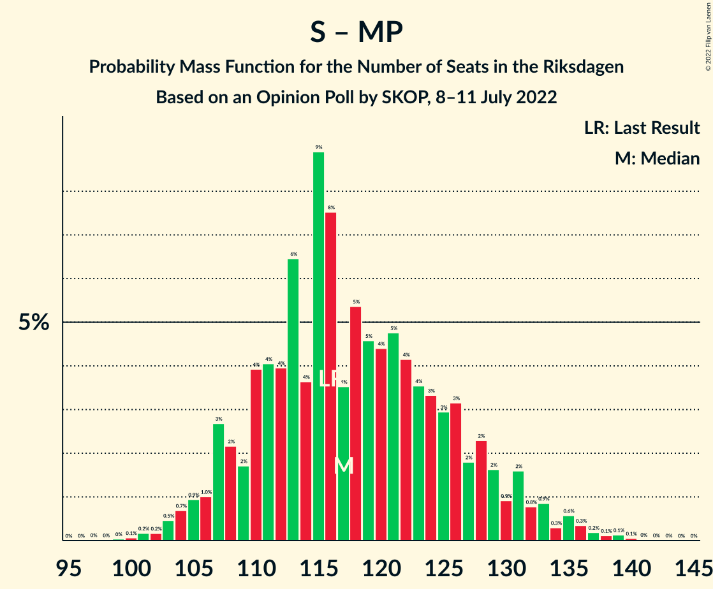

| Number of Seats | Probability | Accumulated | Special Marks |
|:---------------:|:-----------:|:-----------:|:-------------:|
| 99 | 0% | 100% |  |
| 100 | 0.1% | 99.9% |  |
| 101 | 0.2% | 99.9% |  |
| 102 | 0.2% | 99.7% |  |
| 103 | 0.5% | 99.5% |  |
| 104 | 0.7% | 99.1% |  |
| 105 | 0.9% | 98% |  |
| 106 | 1.0% | 97% |  |
| 107 | 3% | 96% |  |
| 108 | 2% | 94% |  |
| 109 | 2% | 92% |  |
| 110 | 4% | 90% |  |
| 111 | 4% | 86% |  |
| 112 | 4% | 82% |  |
| 113 | 6% | 78% |  |
| 114 | 4% | 71% | Median |
| 115 | 9% | 68% |  |
| 116 | 8% | 59% | Last Result |
| 117 | 4% | 51% |  |
| 118 | 5% | 48% |  |
| 119 | 5% | 42% |  |
| 120 | 4% | 38% |  |
| 121 | 5% | 34% |  |
| 122 | 4% | 29% |  |
| 123 | 4% | 25% |  |
| 124 | 3% | 21% |  |
| 125 | 3% | 18% |  |
| 126 | 3% | 15% |  |
| 127 | 2% | 12% |  |
| 128 | 2% | 10% |  |
| 129 | 2% | 8% |  |
| 130 | 0.9% | 6% |  |
| 131 | 2% | 5% |  |
| 132 | 0.8% | 3% |  |
| 133 | 0.9% | 3% |  |
| 134 | 0.3% | 2% |  |
| 135 | 0.6% | 1.5% |  |
| 136 | 0.3% | 0.9% |  |
| 137 | 0.2% | 0.5% |  |
| 138 | 0.1% | 0.4% |  |
| 139 | 0.1% | 0.2% |  |
| 140 | 0.1% | 0.1% |  |
| 141 | 0% | 0.1% |  |
| 142 | 0% | 0% |  |

### Moderata samlingspartiet – Centerpartiet – Liberalerna

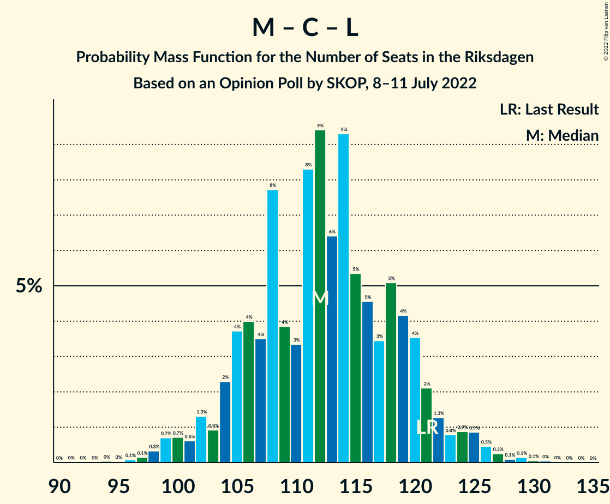

| Number of Seats | Probability | Accumulated | Special Marks |
|:---------------:|:-----------:|:-----------:|:-------------:|
| 93 | 0% | 100% |  |
| 94 | 0% | 99.9% |  |
| 95 | 0% | 99.9% |  |
| 96 | 0.1% | 99.9% |  |
| 97 | 0.1% | 99.8% |  |
| 98 | 0.3% | 99.6% |  |
| 99 | 0.7% | 99.3% |  |
| 100 | 0.7% | 98.6% |  |
| 101 | 0.6% | 98% |  |
| 102 | 1.3% | 97% |  |
| 103 | 0.9% | 96% |  |
| 104 | 2% | 95% |  |
| 105 | 4% | 93% |  |
| 106 | 4% | 89% |  |
| 107 | 4% | 85% |  |
| 108 | 8% | 82% |  |
| 109 | 4% | 74% |  |
| 110 | 3% | 70% |  |
| 111 | 8% | 67% | Median |
| 112 | 9% | 58% |  |
| 113 | 6% | 49% |  |
| 114 | 9% | 42% |  |
| 115 | 5% | 33% |  |
| 116 | 5% | 28% |  |
| 117 | 3% | 23% |  |
| 118 | 5% | 20% |  |
| 119 | 4% | 15% |  |
| 120 | 4% | 11% |  |
| 121 | 2% | 7% | Last Result |
| 122 | 1.3% | 5% |  |
| 123 | 0.8% | 4% |  |
| 124 | 0.9% | 3% |  |
| 125 | 0.9% | 2% |  |
| 126 | 0.5% | 1.1% |  |
| 127 | 0.3% | 0.6% |  |
| 128 | 0.1% | 0.4% |  |
| 129 | 0.1% | 0.3% |  |
| 130 | 0.1% | 0.1% |  |
| 131 | 0% | 0.1% |  |
| 132 | 0% | 0% |  |

### Moderata samlingspartiet – Centerpartiet – Kristdemokraterna

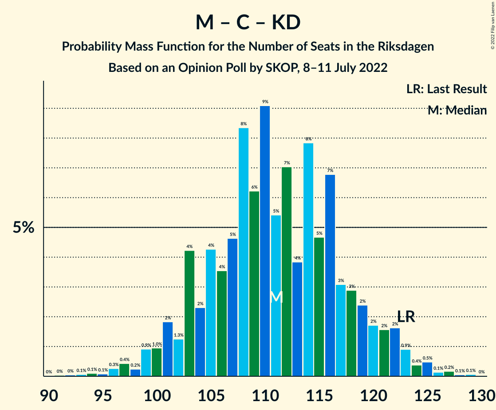

| Number of Seats | Probability | Accumulated | Special Marks |
|:---------------:|:-----------:|:-----------:|:-------------:|
| 90 | 0% | 100% |  |
| 91 | 0% | 99.9% |  |
| 92 | 0% | 99.9% |  |
| 93 | 0.1% | 99.9% |  |
| 94 | 0.1% | 99.8% |  |
| 95 | 0.1% | 99.7% |  |
| 96 | 0.3% | 99.6% |  |
| 97 | 0.4% | 99.4% |  |
| 98 | 0.2% | 98.9% |  |
| 99 | 0.9% | 98.7% |  |
| 100 | 1.0% | 98% |  |
| 101 | 2% | 97% |  |
| 102 | 1.3% | 95% |  |
| 103 | 4% | 94% |  |
| 104 | 2% | 90% |  |
| 105 | 4% | 87% |  |
| 106 | 4% | 83% |  |
| 107 | 5% | 79% |  |
| 108 | 8% | 75% |  |
| 109 | 6% | 66% |  |
| 110 | 9% | 60% | Median |
| 111 | 5% | 51% |  |
| 112 | 7% | 46% |  |
| 113 | 4% | 39% |  |
| 114 | 8% | 35% |  |
| 115 | 5% | 27% |  |
| 116 | 7% | 22% |  |
| 117 | 3% | 16% |  |
| 118 | 3% | 12% |  |
| 119 | 2% | 10% |  |
| 120 | 2% | 7% |  |
| 121 | 2% | 5% |  |
| 122 | 2% | 4% |  |
| 123 | 0.9% | 2% | Last Result |
| 124 | 0.4% | 1.3% |  |
| 125 | 0.5% | 0.9% |  |
| 126 | 0.1% | 0.5% |  |
| 127 | 0.2% | 0.3% |  |
| 128 | 0.1% | 0.2% |  |
| 129 | 0.1% | 0.1% |  |
| 130 | 0% | 0% |  |

### Moderata samlingspartiet – Centerpartiet

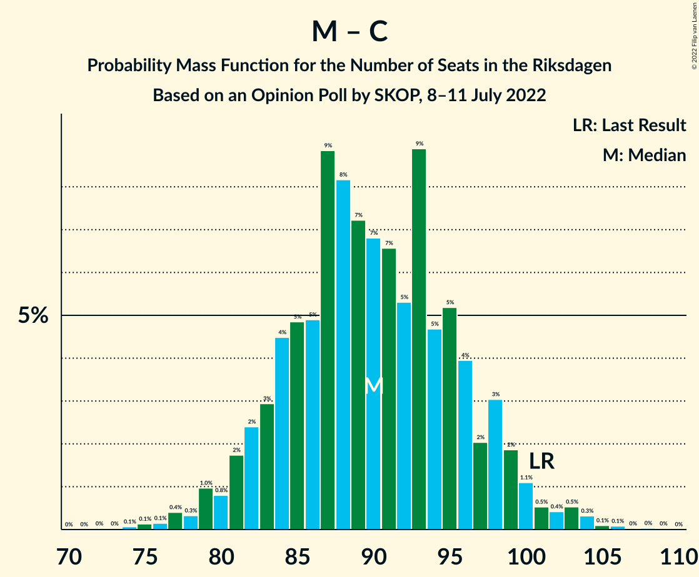

| Number of Seats | Probability | Accumulated | Special Marks |
|:---------------:|:-----------:|:-----------:|:-------------:|
| 73 | 0% | 100% |  |
| 74 | 0.1% | 99.9% |  |
| 75 | 0.1% | 99.9% |  |
| 76 | 0.1% | 99.7% |  |
| 77 | 0.4% | 99.6% |  |
| 78 | 0.3% | 99.2% |  |
| 79 | 1.0% | 98.8% |  |
| 80 | 0.8% | 98% |  |
| 81 | 2% | 97% |  |
| 82 | 2% | 95% |  |
| 83 | 3% | 93% |  |
| 84 | 4% | 90% |  |
| 85 | 5% | 86% |  |
| 86 | 5% | 81% |  |
| 87 | 9% | 76% |  |
| 88 | 8% | 67% |  |
| 89 | 7% | 59% | Median |
| 90 | 7% | 52% |  |
| 91 | 7% | 45% |  |
| 92 | 5% | 38% |  |
| 93 | 9% | 33% |  |
| 94 | 5% | 24% |  |
| 95 | 5% | 19% |  |
| 96 | 4% | 14% |  |
| 97 | 2% | 10% |  |
| 98 | 3% | 8% |  |
| 99 | 2% | 5% |  |
| 100 | 1.1% | 3% |  |
| 101 | 0.5% | 2% | Last Result |
| 102 | 0.4% | 2% |  |
| 103 | 0.5% | 1.1% |  |
| 104 | 0.3% | 0.6% |  |
| 105 | 0.1% | 0.3% |  |
| 106 | 0.1% | 0.2% |  |
| 107 | 0% | 0.1% |  |
| 108 | 0% | 0.1% |  |
| 109 | 0% | 0% |  |

## Technical Information

### Opinion Poll

+ **Polling firm:** SKOP
+ **Commissioner(s):** —
+ **Fieldwork period:** 8–11 July 2022

### Calculations

+ **Sample size:** 1009
+ **Simulations done:** 1,048,576
+ **Error estimate:** 1.05%

