# Opinion Poll by Demoskop for Aftonbladet, 24 July–2 August 2022

<a href="#voting-intentions">Voting Intentions</a> | <a href="#seats">Seats</a> | <a href="#coalitions">Coalitions</a> | <a href="#technical-information">Technical Information</a>

## Voting Intentions

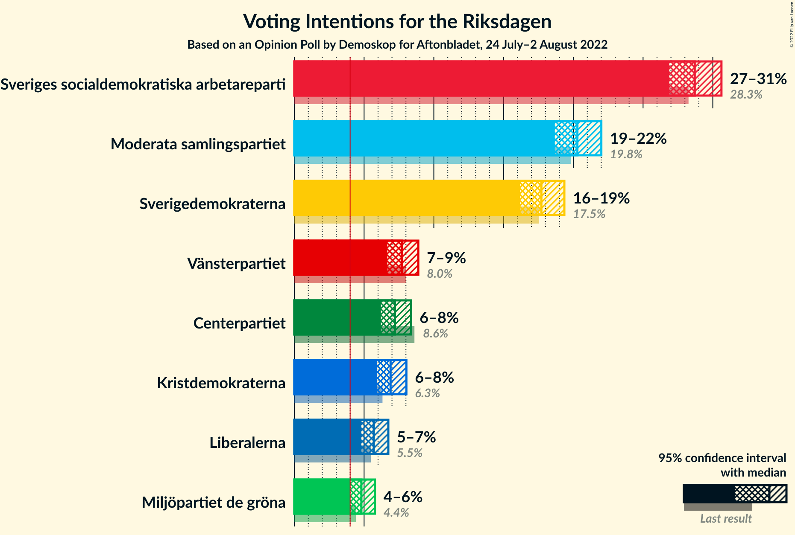

### Confidence Intervals

| Party | Last Result | Poll Result | 80% Confidence Interval | 90% Confidence Interval | 95% Confidence Interval | 99% Confidence Interval |
|:-----:|:-----------:|:-----------:|:-----------------------:|:-----------------------:|:-----------------------:|:-----------------------:|
| Sveriges socialdemokratiska arbetareparti | 28.3% | 28.7% | 27.5–30.0% |27.2–30.3% |26.9–30.6% |26.3–31.2% |
| Moderata samlingspartiet | 19.8% | 20.3% | 19.2–21.4% |18.9–21.7% |18.7–22.0% |18.2–22.6% |
| Sverigedemokraterna | 17.5% | 17.7% | 16.7–18.8% |16.4–19.1% |16.2–19.4% |15.7–19.9% |
| Vänsterpartiet | 8.0% | 7.7% | 7.0–8.5% |6.8–8.7% |6.7–8.9% |6.4–9.3% |
| Centerpartiet | 8.6% | 7.2% | 6.6–8.0% |6.4–8.2% |6.2–8.4% |5.9–8.7% |
| Kristdemokraterna | 6.3% | 6.9% | 6.2–7.6% |6.1–7.8% |5.9–8.0% |5.6–8.4% |
| Liberalerna | 5.5% | 5.7% | 5.1–6.4% |4.9–6.6% |4.8–6.7% |4.5–7.1% |
| Miljöpartiet de gröna | 4.4% | 4.8% | 4.3–5.4% |4.1–5.6% |4.0–5.8% |3.7–6.1% |

*Note:* The poll result column reflects the actual value used in the calculations. Published results may vary slightly, and in addition be rounded to fewer digits.

## Seats

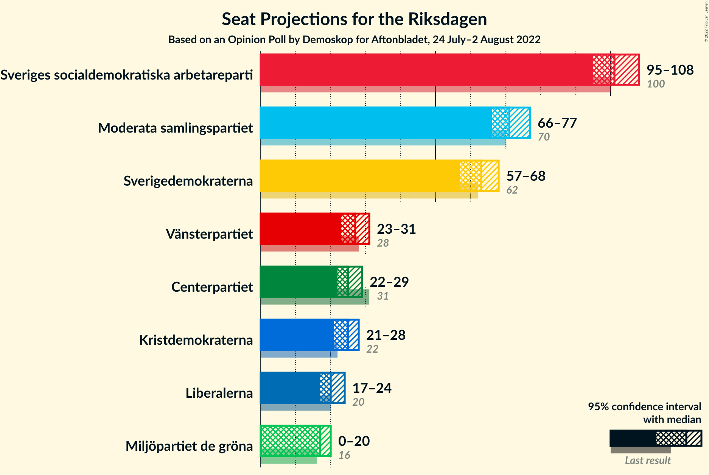

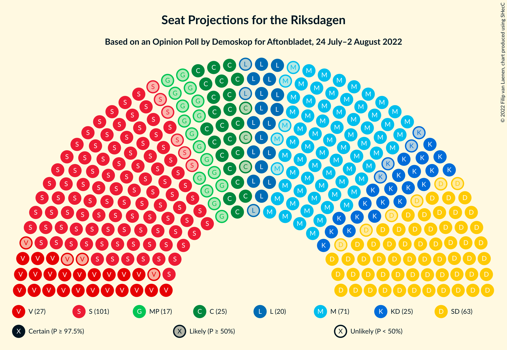

### Confidence Intervals

| Party | Last Result | Median | 80% Confidence Interval | 90% Confidence Interval | 95% Confidence Interval | 99% Confidence Interval |
|:-----:|:-----------:|:------:|:-----------------------:|:-----------------------:|:-----------------------:|:-----------------------:|
| <a href="#sveriges-socialdemokratiska-arbetareparti">Sveriges socialdemokratiska arbetareparti</a> | 100 | 101 | 96–106 |96–107 |95–108 |93–110 |
| <a href="#moderata-samlingspartiet">Moderata samlingspartiet</a> | 70 | 71 | 68–75 |67–76 |66–77 |64–79 |
| <a href="#sverigedemokraterna">Sverigedemokraterna</a> | 62 | 63 | 58–66 |57–67 |57–68 |56–70 |
| <a href="#vänsterpartiet">Vänsterpartiet</a> | 28 | 27 | 25–30 |24–31 |23–31 |22–33 |
| <a href="#centerpartiet">Centerpartiet</a> | 31 | 25 | 23–28 |22–29 |22–29 |21–31 |
| <a href="#kristdemokraterna">Kristdemokraterna</a> | 22 | 25 | 22–27 |22–27 |21–28 |20–29 |
| <a href="#liberalerna">Liberalerna</a> | 20 | 20 | 18–22 |17–23 |17–24 |16–25 |
| <a href="#miljöpartiet-de-gröna">Miljöpartiet de gröna</a> | 16 | 17 | 15–19 |15–20 |0–20 |0–21 |

### Sveriges socialdemokratiska arbetareparti

*For a full overview of the results for this party, see the [Sveriges socialdemokratiska arbetareparti](party-sverigessocialdemokratiskaarbetareparti.html) page.*

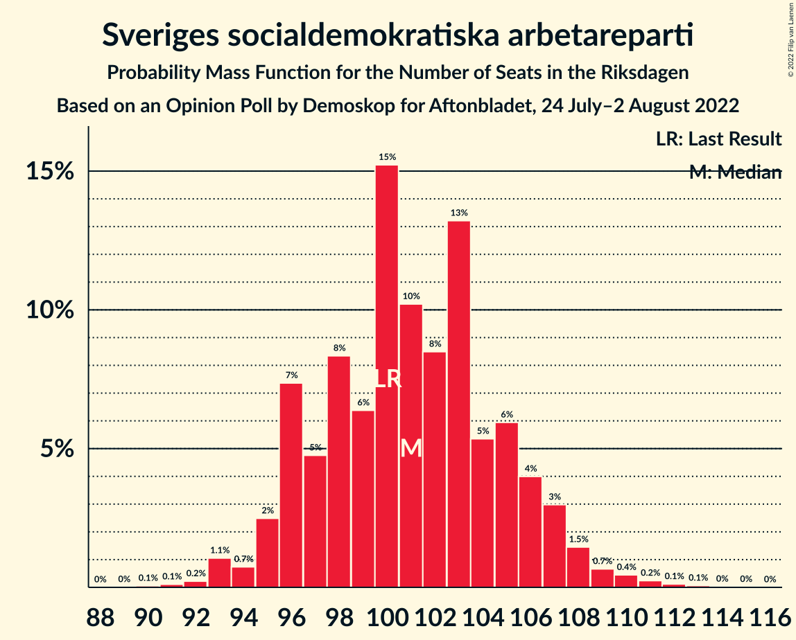

| Number of Seats | Probability | Accumulated | Special Marks |
|:---------------:|:-----------:|:-----------:|:-------------:|
| 90 | 0.1% | 100% |  |
| 91 | 0.1% | 99.9% |  |
| 92 | 0.2% | 99.8% |  |
| 93 | 1.1% | 99.6% |  |
| 94 | 0.7% | 98.5% |  |
| 95 | 2% | 98% |  |
| 96 | 7% | 95% |  |
| 97 | 5% | 88% |  |
| 98 | 8% | 83% |  |
| 99 | 6% | 75% |  |
| 100 | 15% | 68% | Last Result |
| 101 | 10% | 53% | Median |
| 102 | 8% | 43% |  |
| 103 | 13% | 35% |  |
| 104 | 5% | 21% |  |
| 105 | 6% | 16% |  |
| 106 | 4% | 10% |  |
| 107 | 3% | 6% |  |
| 108 | 1.5% | 3% |  |
| 109 | 0.7% | 2% |  |
| 110 | 0.4% | 0.9% |  |
| 111 | 0.2% | 0.5% |  |
| 112 | 0.1% | 0.2% |  |
| 113 | 0.1% | 0.1% |  |
| 114 | 0% | 0.1% |  |
| 115 | 0% | 0% |  |

### Moderata samlingspartiet

*For a full overview of the results for this party, see the [Moderata samlingspartiet](party-moderatasamlingspartiet.html) page.*

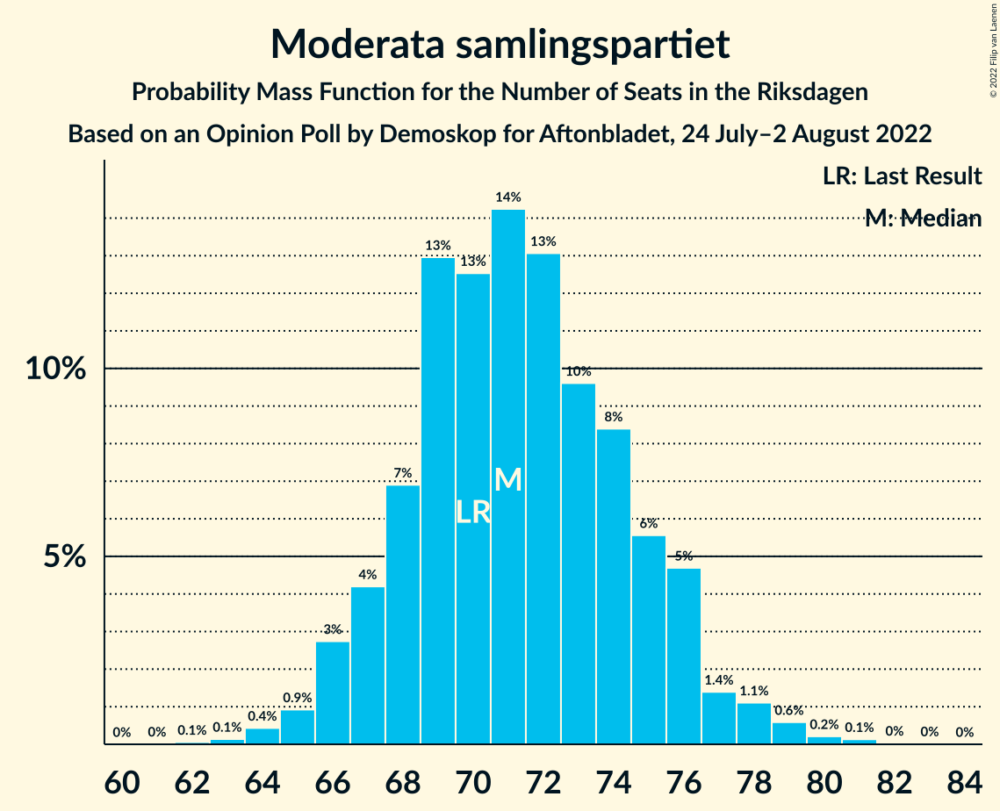

| Number of Seats | Probability | Accumulated | Special Marks |
|:---------------:|:-----------:|:-----------:|:-------------:|
| 62 | 0.1% | 100% |  |
| 63 | 0.1% | 99.9% |  |
| 64 | 0.4% | 99.8% |  |
| 65 | 0.9% | 99.3% |  |
| 66 | 3% | 98% |  |
| 67 | 4% | 96% |  |
| 68 | 7% | 91% |  |
| 69 | 13% | 85% |  |
| 70 | 13% | 72% | Last Result |
| 71 | 14% | 59% | Median |
| 72 | 13% | 45% |  |
| 73 | 10% | 32% |  |
| 74 | 8% | 22% |  |
| 75 | 6% | 14% |  |
| 76 | 5% | 8% |  |
| 77 | 1.4% | 4% |  |
| 78 | 1.1% | 2% |  |
| 79 | 0.6% | 1.0% |  |
| 80 | 0.2% | 0.4% |  |
| 81 | 0.1% | 0.2% |  |
| 82 | 0% | 0.1% |  |
| 83 | 0% | 0% |  |

### Sverigedemokraterna

*For a full overview of the results for this party, see the [Sverigedemokraterna](party-sverigedemokraterna.html) page.*

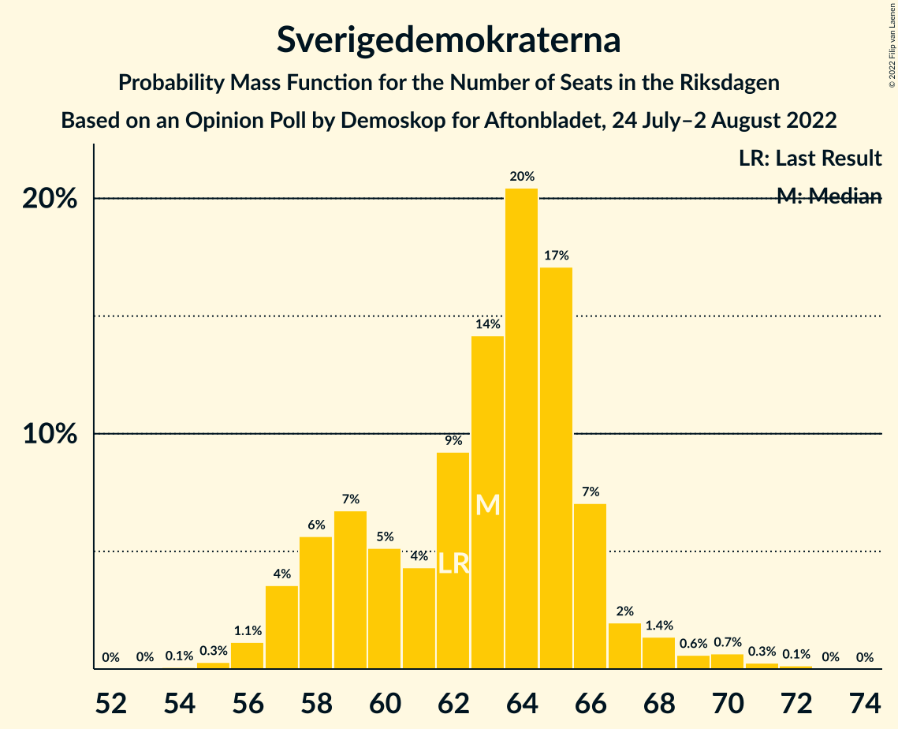

| Number of Seats | Probability | Accumulated | Special Marks |
|:---------------:|:-----------:|:-----------:|:-------------:|
| 54 | 0.1% | 100% |  |
| 55 | 0.3% | 99.9% |  |
| 56 | 1.1% | 99.6% |  |
| 57 | 4% | 98% |  |
| 58 | 6% | 95% |  |
| 59 | 7% | 89% |  |
| 60 | 5% | 83% |  |
| 61 | 4% | 77% |  |
| 62 | 9% | 73% | Last Result |
| 63 | 14% | 64% | Median |
| 64 | 20% | 50% |  |
| 65 | 17% | 29% |  |
| 66 | 7% | 12% |  |
| 67 | 2% | 5% |  |
| 68 | 1.4% | 3% |  |
| 69 | 0.6% | 2% |  |
| 70 | 0.7% | 1.1% |  |
| 71 | 0.3% | 0.5% |  |
| 72 | 0.1% | 0.2% |  |
| 73 | 0% | 0% |  |

### Vänsterpartiet

*For a full overview of the results for this party, see the [Vänsterpartiet](party-vänsterpartiet.html) page.*

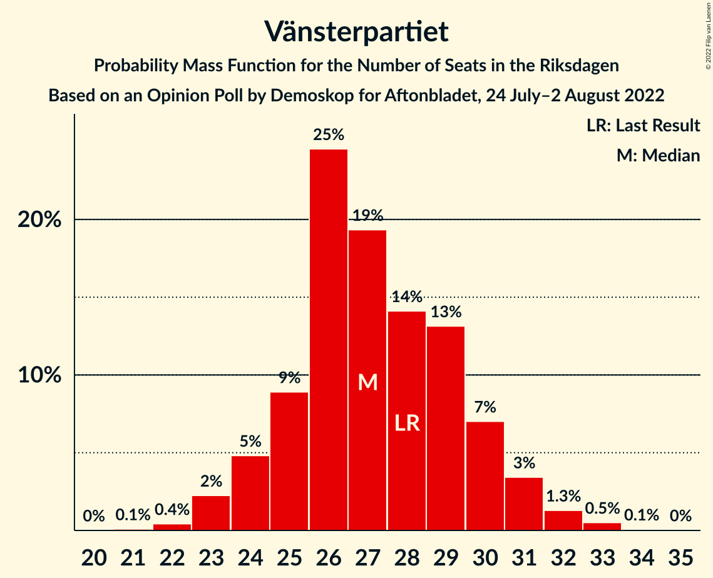

| Number of Seats | Probability | Accumulated | Special Marks |
|:---------------:|:-----------:|:-----------:|:-------------:|
| 21 | 0.1% | 100% |  |
| 22 | 0.4% | 99.9% |  |
| 23 | 2% | 99.5% |  |
| 24 | 5% | 97% |  |
| 25 | 9% | 92% |  |
| 26 | 25% | 83% |  |
| 27 | 19% | 59% | Median |
| 28 | 14% | 40% | Last Result |
| 29 | 13% | 25% |  |
| 30 | 7% | 12% |  |
| 31 | 3% | 5% |  |
| 32 | 1.3% | 2% |  |
| 33 | 0.5% | 0.6% |  |
| 34 | 0.1% | 0.1% |  |
| 35 | 0% | 0% |  |

### Centerpartiet

*For a full overview of the results for this party, see the [Centerpartiet](party-centerpartiet.html) page.*

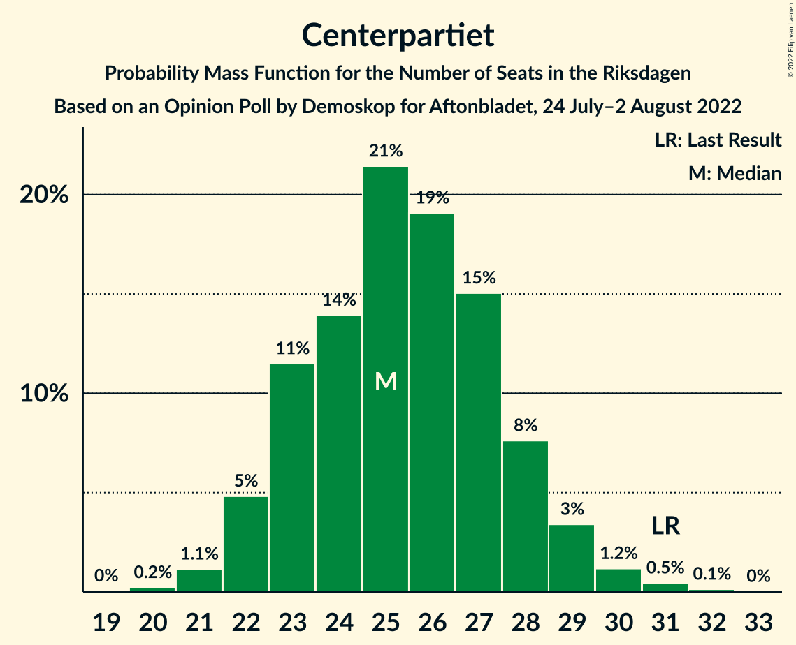

| Number of Seats | Probability | Accumulated | Special Marks |
|:---------------:|:-----------:|:-----------:|:-------------:|
| 20 | 0.2% | 100% |  |
| 21 | 1.1% | 99.7% |  |
| 22 | 5% | 98.6% |  |
| 23 | 11% | 94% |  |
| 24 | 14% | 82% |  |
| 25 | 21% | 68% | Median |
| 26 | 19% | 47% |  |
| 27 | 15% | 28% |  |
| 28 | 8% | 13% |  |
| 29 | 3% | 5% |  |
| 30 | 1.2% | 2% |  |
| 31 | 0.5% | 0.6% | Last Result |
| 32 | 0.1% | 0.2% |  |
| 33 | 0% | 0% |  |

### Kristdemokraterna

*For a full overview of the results for this party, see the [Kristdemokraterna](party-kristdemokraterna.html) page.*

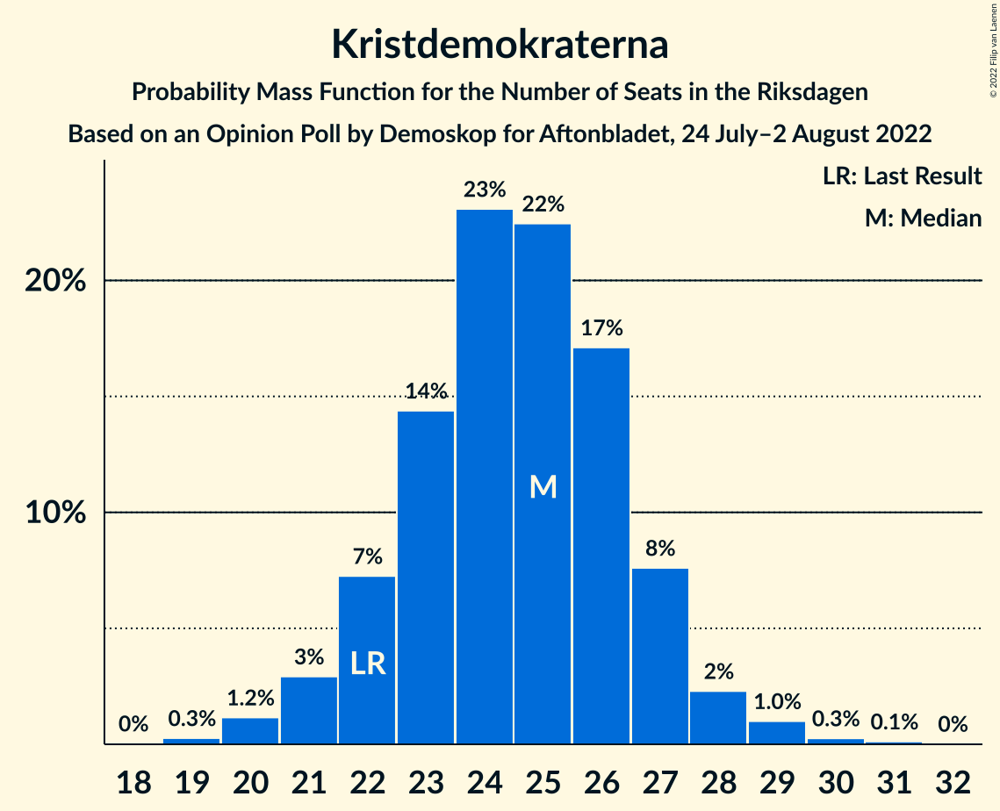

| Number of Seats | Probability | Accumulated | Special Marks |
|:---------------:|:-----------:|:-----------:|:-------------:|
| 19 | 0.3% | 100% |  |
| 20 | 1.2% | 99.7% |  |
| 21 | 3% | 98.5% |  |
| 22 | 7% | 96% | Last Result |
| 23 | 14% | 88% |  |
| 24 | 23% | 74% |  |
| 25 | 22% | 51% | Median |
| 26 | 17% | 28% |  |
| 27 | 8% | 11% |  |
| 28 | 2% | 4% |  |
| 29 | 1.0% | 1.4% |  |
| 30 | 0.3% | 0.4% |  |
| 31 | 0.1% | 0.1% |  |
| 32 | 0% | 0% |  |

### Liberalerna

*For a full overview of the results for this party, see the [Liberalerna](party-liberalerna.html) page.*

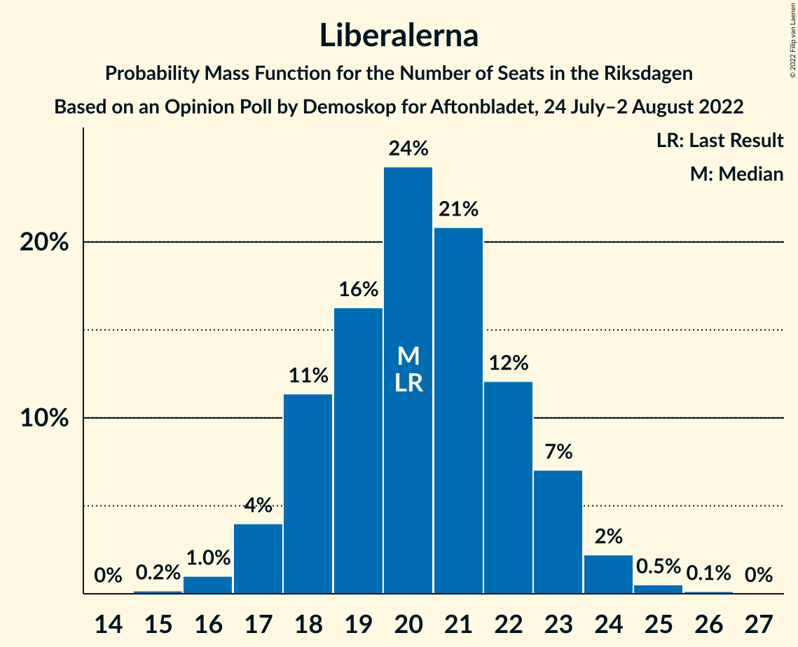

| Number of Seats | Probability | Accumulated | Special Marks |
|:---------------:|:-----------:|:-----------:|:-------------:|
| 15 | 0.2% | 100% |  |
| 16 | 1.0% | 99.8% |  |
| 17 | 4% | 98.8% |  |
| 18 | 11% | 95% |  |
| 19 | 16% | 83% |  |
| 20 | 24% | 67% | Last Result, Median |
| 21 | 21% | 43% |  |
| 22 | 12% | 22% |  |
| 23 | 7% | 10% |  |
| 24 | 2% | 3% |  |
| 25 | 0.5% | 0.7% |  |
| 26 | 0.1% | 0.2% |  |
| 27 | 0% | 0% |  |

### Miljöpartiet de gröna

*For a full overview of the results for this party, see the [Miljöpartiet de gröna](party-miljöpartietdegröna.html) page.*

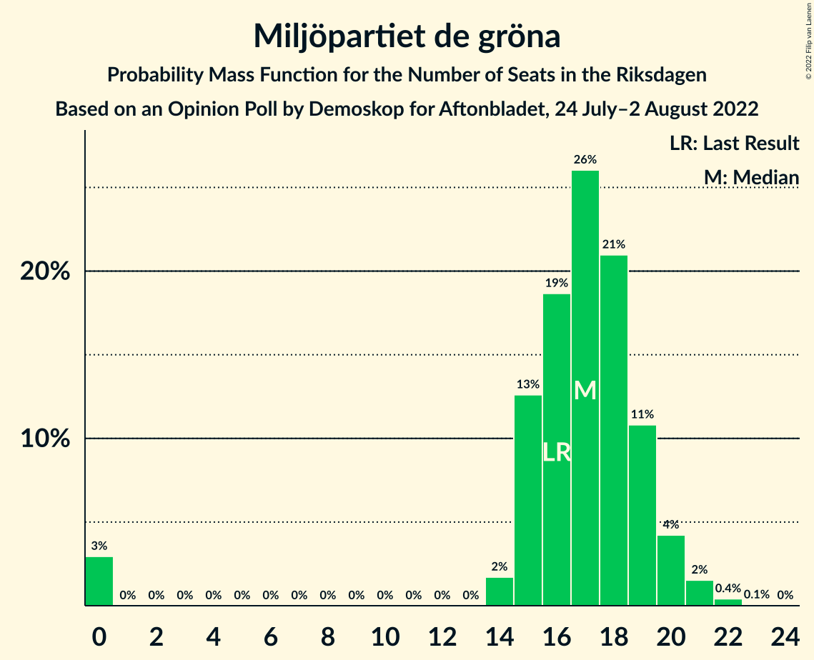

| Number of Seats | Probability | Accumulated | Special Marks |
|:---------------:|:-----------:|:-----------:|:-------------:|
| 0 | 3% | 100% |  |
| 1 | 0% | 97% |  |
| 2 | 0% | 97% |  |
| 3 | 0% | 97% |  |
| 4 | 0% | 97% |  |
| 5 | 0% | 97% |  |
| 6 | 0% | 97% |  |
| 7 | 0% | 97% |  |
| 8 | 0% | 97% |  |
| 9 | 0% | 97% |  |
| 10 | 0% | 97% |  |
| 11 | 0% | 97% |  |
| 12 | 0% | 97% |  |
| 13 | 0% | 97% |  |
| 14 | 2% | 97% |  |
| 15 | 13% | 95% |  |
| 16 | 19% | 83% | Last Result |
| 17 | 26% | 64% | Median |
| 18 | 21% | 38% |  |
| 19 | 11% | 17% |  |
| 20 | 4% | 6% |  |
| 21 | 2% | 2% |  |
| 22 | 0.4% | 0.5% |  |
| 23 | 0.1% | 0.1% |  |
| 24 | 0% | 0% |  |

## Coalitions

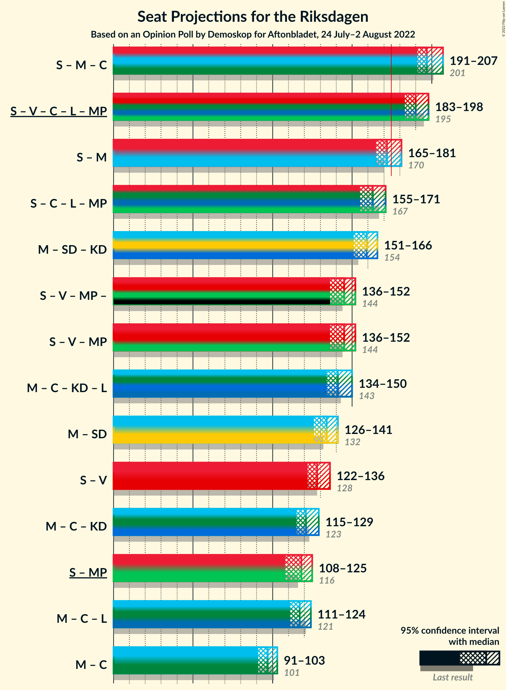

### Confidence Intervals

| Coalition | Last Result | Median | Majority? | 80% Confidence Interval | 90% Confidence Interval | 95% Confidence Interval | 99% Confidence Interval |
|:---------:|:-----------:|:------:|:---------:|:-----------------------:|:-----------------------:|:-----------------------:|:-----------------------:|
| Sveriges socialdemokratiska arbetareparti – Moderata samlingspartiet – Centerpartiet | 201 | 197 | 100% | 193–203 | 192–204 | 191–207 | 189–209 |
| Sveriges socialdemokratiska arbetareparti – Vänsterpartiet – Centerpartiet – Liberalerna – Miljöpartiet de gröna | 195 | 190 | 100% | 186–196 | 184–197 | 183–198 | 178–200 |
| Sveriges socialdemokratiska arbetareparti – Moderata samlingspartiet | 170 | 172 | 25% | 168–177 | 166–179 | 165–181 | 163–183 |
| Sveriges socialdemokratiska arbetareparti – Centerpartiet – Liberalerna – Miljöpartiet de gröna | 167 | 163 | 0.1% | 158–168 | 157–169 | 155–171 | 151–173 |
| Moderata samlingspartiet – Sverigedemokraterna – Kristdemokraterna | 154 | 159 | 0% | 153–163 | 152–165 | 151–166 | 149–171 |
| Sveriges socialdemokratiska arbetareparti – Vänsterpartiet – Miljöpartiet de gröna | 144 | 145 | 0% | 139–150 | 138–151 | 136–152 | 131–155 |
| Moderata samlingspartiet – Centerpartiet – Kristdemokraterna – Liberalerna | 143 | 141 | 0% | 137–146 | 135–148 | 134–150 | 132–152 |
| Moderata samlingspartiet – Sverigedemokraterna | 132 | 134 | 0% | 129–138 | 128–139 | 126–141 | 124–145 |
| Sveriges socialdemokratiska arbetareparti – Vänsterpartiet | 128 | 128 | 0% | 124–133 | 122–134 | 122–136 | 119–139 |
| Moderata samlingspartiet – Centerpartiet – Kristdemokraterna | 123 | 121 | 0% | 117–126 | 115–128 | 115–129 | 112–131 |
| Sveriges socialdemokratiska arbetareparti – Miljöpartiet de gröna | 116 | 118 | 0% | 112–122 | 111–124 | 108–125 | 104–127 |
| Moderata samlingspartiet – Centerpartiet – Liberalerna | 121 | 117 | 0% | 113–122 | 112–123 | 111–124 | 109–127 |
| Moderata samlingspartiet – Centerpartiet | 101 | 97 | 0% | 93–101 | 92–102 | 91–103 | 88–106 |

### Sveriges socialdemokratiska arbetareparti – Moderata samlingspartiet – Centerpartiet

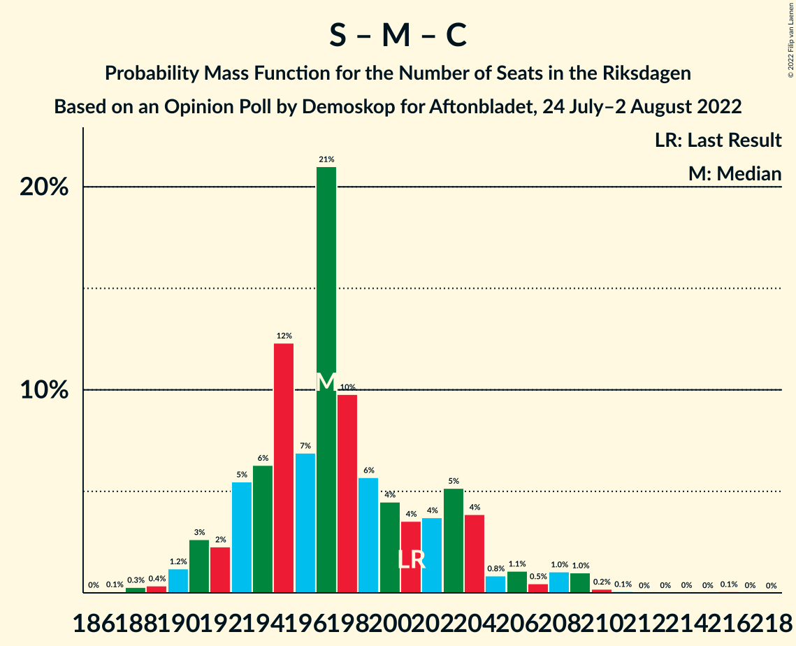

| Number of Seats | Probability | Accumulated | Special Marks |
|:---------------:|:-----------:|:-----------:|:-------------:|
| 186 | 0% | 100% |  |
| 187 | 0.1% | 99.9% |  |
| 188 | 0.3% | 99.9% |  |
| 189 | 0.4% | 99.6% |  |
| 190 | 1.2% | 99.2% |  |
| 191 | 3% | 98% |  |
| 192 | 2% | 95% |  |
| 193 | 5% | 93% |  |
| 194 | 6% | 88% |  |
| 195 | 12% | 81% |  |
| 196 | 7% | 69% |  |
| 197 | 21% | 62% | Median |
| 198 | 10% | 41% |  |
| 199 | 6% | 31% |  |
| 200 | 4% | 26% |  |
| 201 | 4% | 21% | Last Result |
| 202 | 4% | 18% |  |
| 203 | 5% | 14% |  |
| 204 | 4% | 9% |  |
| 205 | 0.8% | 5% |  |
| 206 | 1.1% | 4% |  |
| 207 | 0.5% | 3% |  |
| 208 | 1.0% | 2% |  |
| 209 | 1.0% | 1.5% |  |
| 210 | 0.2% | 0.5% |  |
| 211 | 0.1% | 0.3% |  |
| 212 | 0% | 0.2% |  |
| 213 | 0% | 0.2% |  |
| 214 | 0% | 0.2% |  |
| 215 | 0% | 0.1% |  |
| 216 | 0.1% | 0.1% |  |
| 217 | 0% | 0% |  |

### Sveriges socialdemokratiska arbetareparti – Vänsterpartiet – Centerpartiet – Liberalerna – Miljöpartiet de gröna

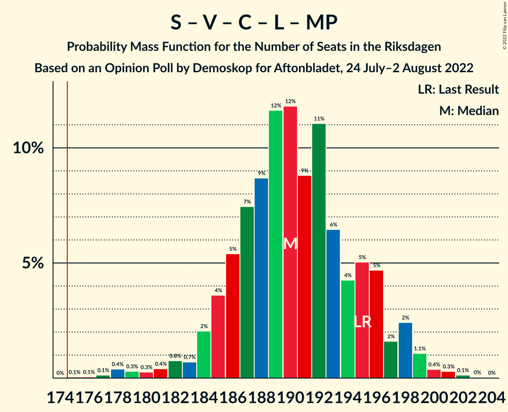

| Number of Seats | Probability | Accumulated | Special Marks |
|:---------------:|:-----------:|:-----------:|:-------------:|
| 175 | 0.1% | 100% | Majority |
| 176 | 0.1% | 99.9% |  |
| 177 | 0.1% | 99.9% |  |
| 178 | 0.4% | 99.7% |  |
| 179 | 0.3% | 99.3% |  |
| 180 | 0.3% | 99.1% |  |
| 181 | 0.4% | 98.8% |  |
| 182 | 0.8% | 98% |  |
| 183 | 0.7% | 98% |  |
| 184 | 2% | 97% |  |
| 185 | 4% | 95% |  |
| 186 | 5% | 91% |  |
| 187 | 7% | 86% |  |
| 188 | 9% | 78% |  |
| 189 | 12% | 70% |  |
| 190 | 12% | 58% | Median |
| 191 | 9% | 46% |  |
| 192 | 11% | 37% |  |
| 193 | 6% | 26% |  |
| 194 | 4% | 20% |  |
| 195 | 5% | 16% | Last Result |
| 196 | 5% | 11% |  |
| 197 | 2% | 6% |  |
| 198 | 2% | 4% |  |
| 199 | 1.1% | 2% |  |
| 200 | 0.4% | 0.9% |  |
| 201 | 0.3% | 0.5% |  |
| 202 | 0.1% | 0.2% |  |
| 203 | 0% | 0.1% |  |
| 204 | 0% | 0% |  |

### Sveriges socialdemokratiska arbetareparti – Moderata samlingspartiet

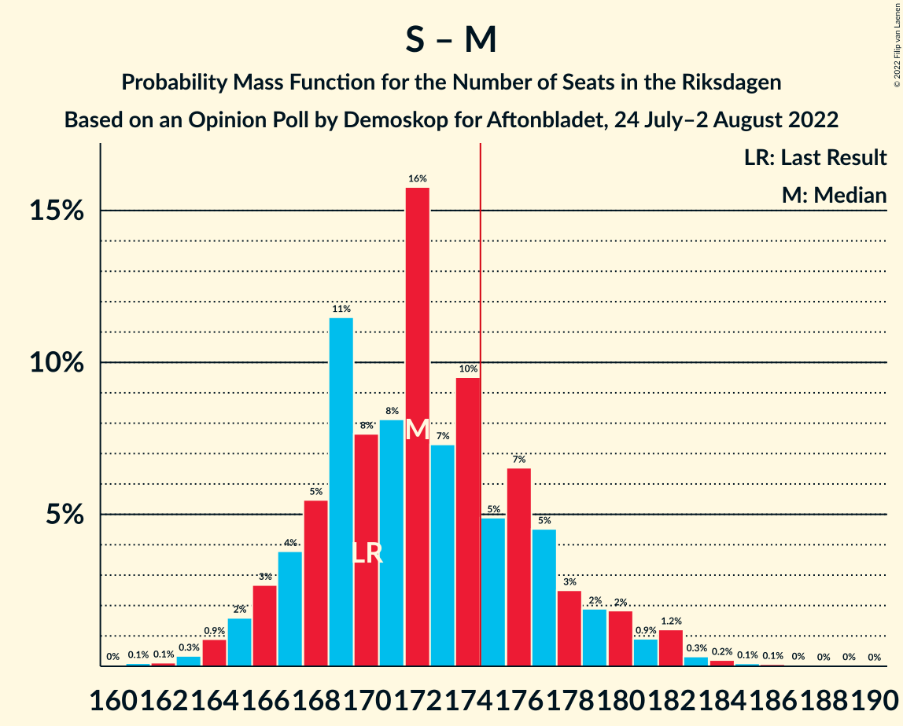

| Number of Seats | Probability | Accumulated | Special Marks |
|:---------------:|:-----------:|:-----------:|:-------------:|
| 160 | 0% | 100% |  |
| 161 | 0.1% | 99.9% |  |
| 162 | 0.1% | 99.8% |  |
| 163 | 0.3% | 99.7% |  |
| 164 | 0.9% | 99.4% |  |
| 165 | 2% | 98% |  |
| 166 | 3% | 97% |  |
| 167 | 4% | 94% |  |
| 168 | 5% | 90% |  |
| 169 | 11% | 85% |  |
| 170 | 8% | 73% | Last Result |
| 171 | 8% | 66% |  |
| 172 | 16% | 58% | Median |
| 173 | 7% | 42% |  |
| 174 | 10% | 35% |  |
| 175 | 5% | 25% | Majority |
| 176 | 7% | 20% |  |
| 177 | 5% | 14% |  |
| 178 | 3% | 9% |  |
| 179 | 2% | 7% |  |
| 180 | 2% | 5% |  |
| 181 | 0.9% | 3% |  |
| 182 | 1.2% | 2% |  |
| 183 | 0.3% | 0.8% |  |
| 184 | 0.2% | 0.5% |  |
| 185 | 0.1% | 0.3% |  |
| 186 | 0.1% | 0.2% |  |
| 187 | 0% | 0.1% |  |
| 188 | 0% | 0.1% |  |
| 189 | 0% | 0.1% |  |
| 190 | 0% | 0% |  |

### Sveriges socialdemokratiska arbetareparti – Centerpartiet – Liberalerna – Miljöpartiet de gröna

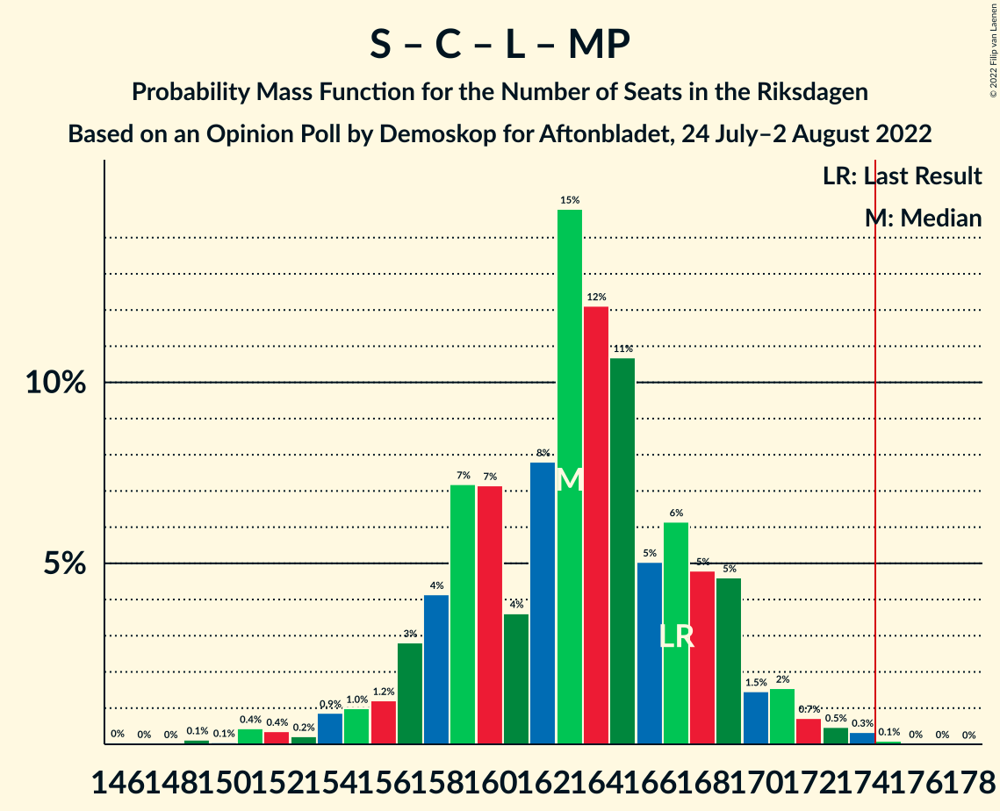

| Number of Seats | Probability | Accumulated | Special Marks |
|:---------------:|:-----------:|:-----------:|:-------------:|
| 146 | 0% | 100% |  |
| 147 | 0% | 99.9% |  |
| 148 | 0% | 99.9% |  |
| 149 | 0.1% | 99.9% |  |
| 150 | 0.1% | 99.8% |  |
| 151 | 0.4% | 99.7% |  |
| 152 | 0.4% | 99.3% |  |
| 153 | 0.2% | 98.9% |  |
| 154 | 0.9% | 98.7% |  |
| 155 | 1.0% | 98% |  |
| 156 | 1.2% | 97% |  |
| 157 | 3% | 96% |  |
| 158 | 4% | 93% |  |
| 159 | 7% | 89% |  |
| 160 | 7% | 81% |  |
| 161 | 4% | 74% |  |
| 162 | 8% | 71% |  |
| 163 | 15% | 63% | Median |
| 164 | 12% | 48% |  |
| 165 | 11% | 36% |  |
| 166 | 5% | 25% |  |
| 167 | 6% | 20% | Last Result |
| 168 | 5% | 14% |  |
| 169 | 5% | 9% |  |
| 170 | 1.5% | 5% |  |
| 171 | 2% | 3% |  |
| 172 | 0.7% | 2% |  |
| 173 | 0.5% | 1.0% |  |
| 174 | 0.3% | 0.5% |  |
| 175 | 0.1% | 0.1% | Majority |
| 176 | 0% | 0.1% |  |
| 177 | 0% | 0% |  |

### Moderata samlingspartiet – Sverigedemokraterna – Kristdemokraterna

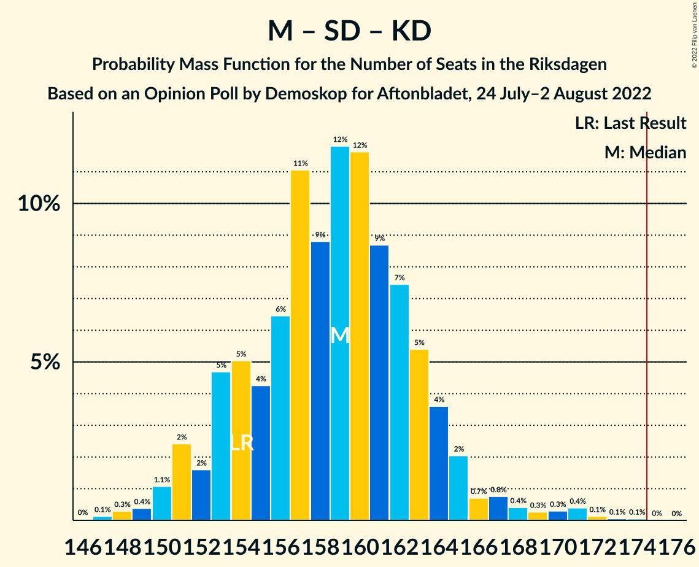

| Number of Seats | Probability | Accumulated | Special Marks |
|:---------------:|:-----------:|:-----------:|:-------------:|
| 146 | 0% | 100% |  |
| 147 | 0.1% | 99.9% |  |
| 148 | 0.3% | 99.8% |  |
| 149 | 0.4% | 99.5% |  |
| 150 | 1.1% | 99.1% |  |
| 151 | 2% | 98% |  |
| 152 | 2% | 96% |  |
| 153 | 5% | 94% |  |
| 154 | 5% | 89% | Last Result |
| 155 | 4% | 84% |  |
| 156 | 6% | 80% |  |
| 157 | 11% | 74% |  |
| 158 | 9% | 63% |  |
| 159 | 12% | 54% | Median |
| 160 | 12% | 42% |  |
| 161 | 9% | 30% |  |
| 162 | 7% | 22% |  |
| 163 | 5% | 14% |  |
| 164 | 4% | 9% |  |
| 165 | 2% | 5% |  |
| 166 | 0.7% | 3% |  |
| 167 | 0.8% | 2% |  |
| 168 | 0.4% | 2% |  |
| 169 | 0.3% | 1.2% |  |
| 170 | 0.3% | 0.9% |  |
| 171 | 0.4% | 0.7% |  |
| 172 | 0.1% | 0.3% |  |
| 173 | 0.1% | 0.1% |  |
| 174 | 0.1% | 0.1% |  |
| 175 | 0% | 0% | Majority |

### Sveriges socialdemokratiska arbetareparti – Vänsterpartiet – Miljöpartiet de gröna

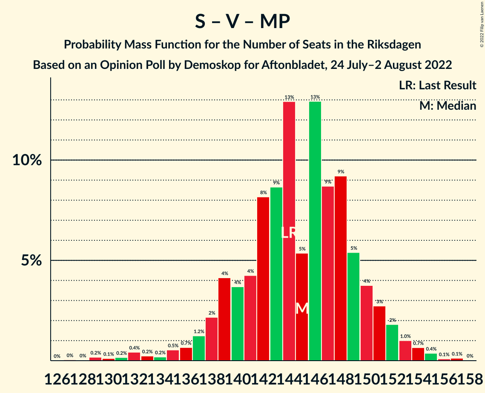

| Number of Seats | Probability | Accumulated | Special Marks |
|:---------------:|:-----------:|:-----------:|:-------------:|
| 127 | 0% | 100% |  |
| 128 | 0% | 99.9% |  |
| 129 | 0.2% | 99.9% |  |
| 130 | 0.1% | 99.7% |  |
| 131 | 0.2% | 99.6% |  |
| 132 | 0.4% | 99.4% |  |
| 133 | 0.2% | 99.0% |  |
| 134 | 0.2% | 98.8% |  |
| 135 | 0.5% | 98.6% |  |
| 136 | 0.7% | 98% |  |
| 137 | 1.2% | 97% |  |
| 138 | 2% | 96% |  |
| 139 | 4% | 94% |  |
| 140 | 4% | 90% |  |
| 141 | 4% | 86% |  |
| 142 | 8% | 82% |  |
| 143 | 9% | 74% |  |
| 144 | 13% | 65% | Last Result |
| 145 | 5% | 52% | Median |
| 146 | 13% | 47% |  |
| 147 | 9% | 34% |  |
| 148 | 9% | 25% |  |
| 149 | 5% | 16% |  |
| 150 | 4% | 11% |  |
| 151 | 3% | 7% |  |
| 152 | 2% | 4% |  |
| 153 | 1.0% | 2% |  |
| 154 | 0.7% | 1.3% |  |
| 155 | 0.4% | 0.6% |  |
| 156 | 0.1% | 0.3% |  |
| 157 | 0.1% | 0.2% |  |
| 158 | 0% | 0% |  |

### Moderata samlingspartiet – Centerpartiet – Kristdemokraterna – Liberalerna

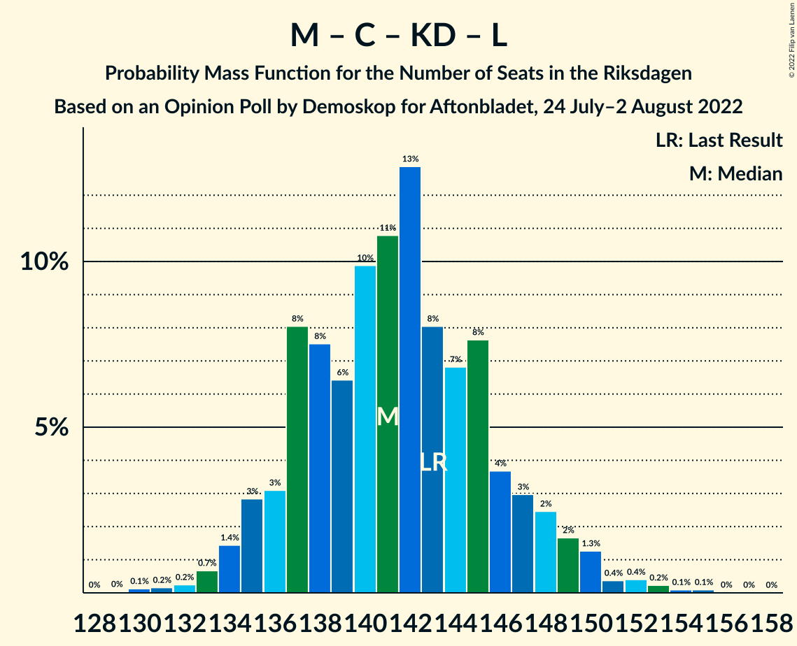

| Number of Seats | Probability | Accumulated | Special Marks |
|:---------------:|:-----------:|:-----------:|:-------------:|
| 129 | 0% | 100% |  |
| 130 | 0.1% | 99.9% |  |
| 131 | 0.2% | 99.8% |  |
| 132 | 0.2% | 99.7% |  |
| 133 | 0.7% | 99.4% |  |
| 134 | 1.4% | 98.7% |  |
| 135 | 3% | 97% |  |
| 136 | 3% | 94% |  |
| 137 | 8% | 91% |  |
| 138 | 8% | 83% |  |
| 139 | 6% | 76% |  |
| 140 | 10% | 69% |  |
| 141 | 11% | 59% | Median |
| 142 | 13% | 49% |  |
| 143 | 8% | 36% | Last Result |
| 144 | 7% | 28% |  |
| 145 | 8% | 21% |  |
| 146 | 4% | 13% |  |
| 147 | 3% | 10% |  |
| 148 | 2% | 7% |  |
| 149 | 2% | 4% |  |
| 150 | 1.3% | 3% |  |
| 151 | 0.4% | 1.3% |  |
| 152 | 0.4% | 0.9% |  |
| 153 | 0.2% | 0.5% |  |
| 154 | 0.1% | 0.2% |  |
| 155 | 0.1% | 0.1% |  |
| 156 | 0% | 0.1% |  |
| 157 | 0% | 0% |  |

### Moderata samlingspartiet – Sverigedemokraterna

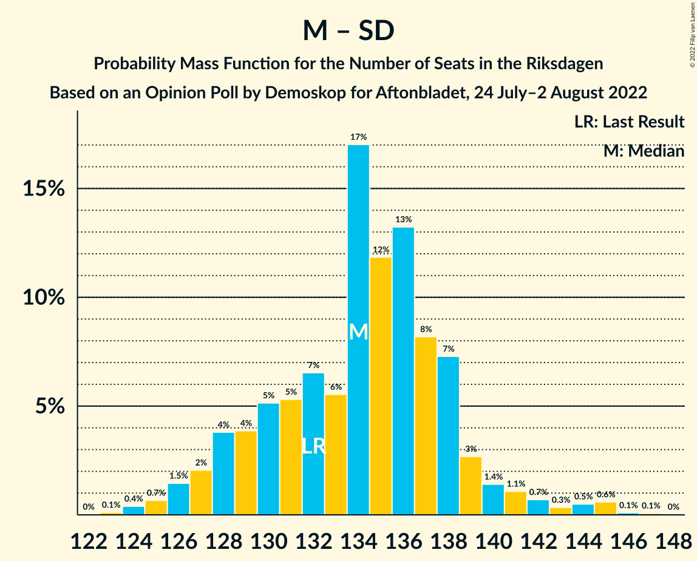

| Number of Seats | Probability | Accumulated | Special Marks |
|:---------------:|:-----------:|:-----------:|:-------------:|
| 123 | 0.1% | 100% |  |
| 124 | 0.4% | 99.8% |  |
| 125 | 0.7% | 99.4% |  |
| 126 | 1.5% | 98.8% |  |
| 127 | 2% | 97% |  |
| 128 | 4% | 95% |  |
| 129 | 4% | 91% |  |
| 130 | 5% | 88% |  |
| 131 | 5% | 82% |  |
| 132 | 7% | 77% | Last Result |
| 133 | 6% | 71% |  |
| 134 | 17% | 65% | Median |
| 135 | 12% | 48% |  |
| 136 | 13% | 36% |  |
| 137 | 8% | 23% |  |
| 138 | 7% | 15% |  |
| 139 | 3% | 8% |  |
| 140 | 1.4% | 5% |  |
| 141 | 1.1% | 3% |  |
| 142 | 0.7% | 2% |  |
| 143 | 0.3% | 2% |  |
| 144 | 0.5% | 1.3% |  |
| 145 | 0.6% | 0.8% |  |
| 146 | 0.1% | 0.2% |  |
| 147 | 0.1% | 0.1% |  |
| 148 | 0% | 0% |  |

### Sveriges socialdemokratiska arbetareparti – Vänsterpartiet

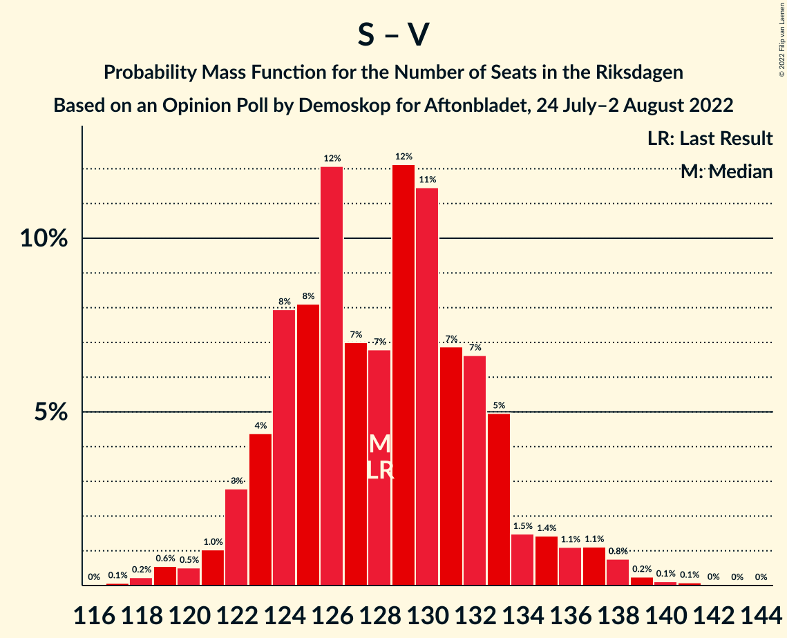

| Number of Seats | Probability | Accumulated | Special Marks |
|:---------------:|:-----------:|:-----------:|:-------------:|
| 117 | 0.1% | 100% |  |
| 118 | 0.2% | 99.9% |  |
| 119 | 0.6% | 99.7% |  |
| 120 | 0.5% | 99.1% |  |
| 121 | 1.0% | 98.6% |  |
| 122 | 3% | 98% |  |
| 123 | 4% | 95% |  |
| 124 | 8% | 90% |  |
| 125 | 8% | 82% |  |
| 126 | 12% | 74% |  |
| 127 | 7% | 62% |  |
| 128 | 7% | 55% | Last Result, Median |
| 129 | 12% | 48% |  |
| 130 | 11% | 36% |  |
| 131 | 7% | 25% |  |
| 132 | 7% | 18% |  |
| 133 | 5% | 11% |  |
| 134 | 1.5% | 6% |  |
| 135 | 1.4% | 5% |  |
| 136 | 1.1% | 4% |  |
| 137 | 1.1% | 2% |  |
| 138 | 0.8% | 1.3% |  |
| 139 | 0.2% | 0.5% |  |
| 140 | 0.1% | 0.3% |  |
| 141 | 0.1% | 0.1% |  |
| 142 | 0% | 0.1% |  |
| 143 | 0% | 0% |  |

### Moderata samlingspartiet – Centerpartiet – Kristdemokraterna

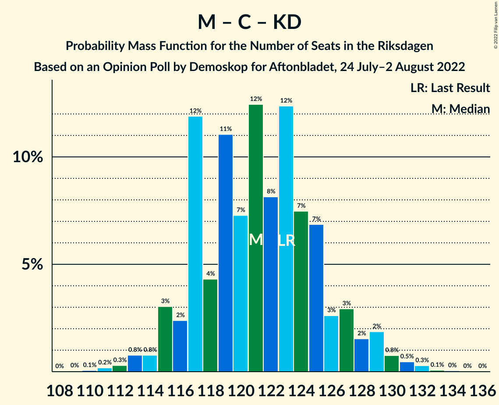

| Number of Seats | Probability | Accumulated | Special Marks |
|:---------------:|:-----------:|:-----------:|:-------------:|
| 109 | 0% | 100% |  |
| 110 | 0.1% | 99.9% |  |
| 111 | 0.2% | 99.9% |  |
| 112 | 0.3% | 99.7% |  |
| 113 | 0.8% | 99.4% |  |
| 114 | 0.8% | 98.6% |  |
| 115 | 3% | 98% |  |
| 116 | 2% | 95% |  |
| 117 | 12% | 92% |  |
| 118 | 4% | 81% |  |
| 119 | 11% | 76% |  |
| 120 | 7% | 65% |  |
| 121 | 12% | 58% | Median |
| 122 | 8% | 45% |  |
| 123 | 12% | 37% | Last Result |
| 124 | 7% | 25% |  |
| 125 | 7% | 17% |  |
| 126 | 3% | 11% |  |
| 127 | 3% | 8% |  |
| 128 | 2% | 5% |  |
| 129 | 2% | 4% |  |
| 130 | 0.8% | 2% |  |
| 131 | 0.5% | 0.9% |  |
| 132 | 0.3% | 0.5% |  |
| 133 | 0.1% | 0.2% |  |
| 134 | 0% | 0.1% |  |
| 135 | 0% | 0% |  |

### Sveriges socialdemokratiska arbetareparti – Miljöpartiet de gröna

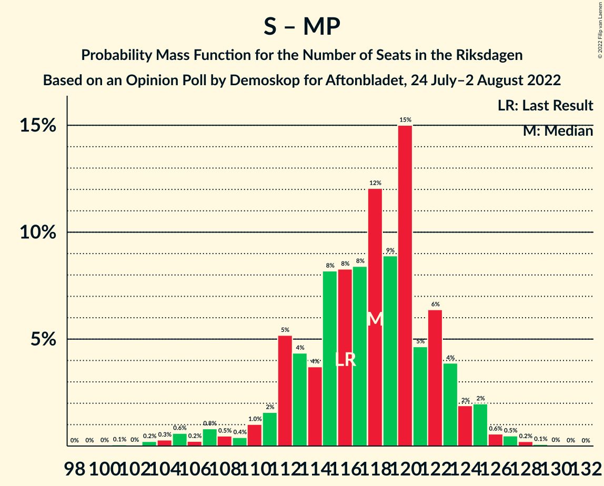

| Number of Seats | Probability | Accumulated | Special Marks |
|:---------------:|:-----------:|:-----------:|:-------------:|
| 98 | 0% | 100% |  |
| 99 | 0% | 99.9% |  |
| 100 | 0% | 99.9% |  |
| 101 | 0.1% | 99.9% |  |
| 102 | 0% | 99.8% |  |
| 103 | 0.2% | 99.8% |  |
| 104 | 0.3% | 99.6% |  |
| 105 | 0.6% | 99.3% |  |
| 106 | 0.2% | 98.7% |  |
| 107 | 0.8% | 98% |  |
| 108 | 0.5% | 98% |  |
| 109 | 0.4% | 97% |  |
| 110 | 1.0% | 97% |  |
| 111 | 2% | 96% |  |
| 112 | 5% | 94% |  |
| 113 | 4% | 89% |  |
| 114 | 4% | 85% |  |
| 115 | 8% | 81% |  |
| 116 | 8% | 73% | Last Result |
| 117 | 8% | 65% |  |
| 118 | 12% | 56% | Median |
| 119 | 9% | 44% |  |
| 120 | 15% | 35% |  |
| 121 | 5% | 20% |  |
| 122 | 6% | 16% |  |
| 123 | 4% | 9% |  |
| 124 | 2% | 5% |  |
| 125 | 2% | 3% |  |
| 126 | 0.6% | 1.4% |  |
| 127 | 0.5% | 0.8% |  |
| 128 | 0.2% | 0.3% |  |
| 129 | 0.1% | 0.1% |  |
| 130 | 0% | 0.1% |  |
| 131 | 0% | 0% |  |

### Moderata samlingspartiet – Centerpartiet – Liberalerna

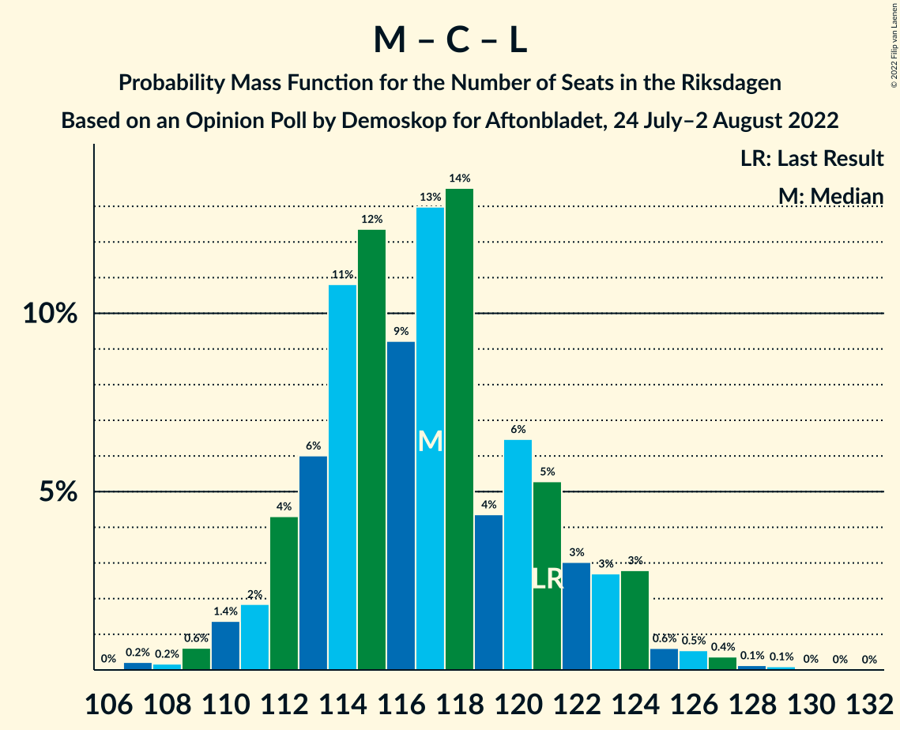

| Number of Seats | Probability | Accumulated | Special Marks |
|:---------------:|:-----------:|:-----------:|:-------------:|
| 106 | 0% | 100% |  |
| 107 | 0.2% | 99.9% |  |
| 108 | 0.2% | 99.7% |  |
| 109 | 0.6% | 99.5% |  |
| 110 | 1.4% | 98.9% |  |
| 111 | 2% | 98% |  |
| 112 | 4% | 96% |  |
| 113 | 6% | 91% |  |
| 114 | 11% | 85% |  |
| 115 | 12% | 75% |  |
| 116 | 9% | 62% | Median |
| 117 | 13% | 53% |  |
| 118 | 14% | 40% |  |
| 119 | 4% | 26% |  |
| 120 | 6% | 22% |  |
| 121 | 5% | 16% | Last Result |
| 122 | 3% | 10% |  |
| 123 | 3% | 7% |  |
| 124 | 3% | 5% |  |
| 125 | 0.6% | 2% |  |
| 126 | 0.5% | 1.2% |  |
| 127 | 0.4% | 0.7% |  |
| 128 | 0.1% | 0.3% |  |
| 129 | 0.1% | 0.2% |  |
| 130 | 0% | 0.1% |  |
| 131 | 0% | 0% |  |

### Moderata samlingspartiet – Centerpartiet

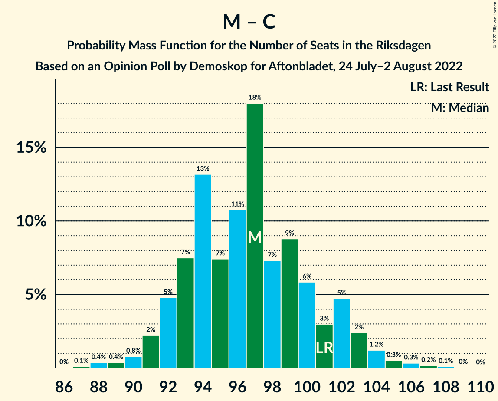

| Number of Seats | Probability | Accumulated | Special Marks |
|:---------------:|:-----------:|:-----------:|:-------------:|
| 87 | 0.1% | 100% |  |
| 88 | 0.4% | 99.8% |  |
| 89 | 0.4% | 99.5% |  |
| 90 | 0.8% | 99.1% |  |
| 91 | 2% | 98% |  |
| 92 | 5% | 96% |  |
| 93 | 7% | 91% |  |
| 94 | 13% | 84% |  |
| 95 | 7% | 71% |  |
| 96 | 11% | 63% | Median |
| 97 | 18% | 52% |  |
| 98 | 7% | 34% |  |
| 99 | 9% | 27% |  |
| 100 | 6% | 18% |  |
| 101 | 3% | 13% | Last Result |
| 102 | 5% | 10% |  |
| 103 | 2% | 5% |  |
| 104 | 1.2% | 2% |  |
| 105 | 0.5% | 1.2% |  |
| 106 | 0.3% | 0.7% |  |
| 107 | 0.2% | 0.3% |  |
| 108 | 0.1% | 0.2% |  |
| 109 | 0% | 0.1% |  |
| 110 | 0% | 0% |  |

## Technical Information

### Opinion Poll

+ **Polling firm:** Demoskop
+ **Commissioner(s):** Aftonbladet
+ **Fieldwork period:** 24 July–2 August 2022

### Calculations

+ **Sample size:** 2247
+ **Simulations done:** 1,048,576
+ **Error estimate:** 0.96%

