# Opinion Poll by Novus for SVT, 1–7 August 2022

<a href="#voting-intentions">Voting Intentions</a> | <a href="#seats">Seats</a> | <a href="#coalitions">Coalitions</a> | <a href="#technical-information">Technical Information</a>

## Voting Intentions

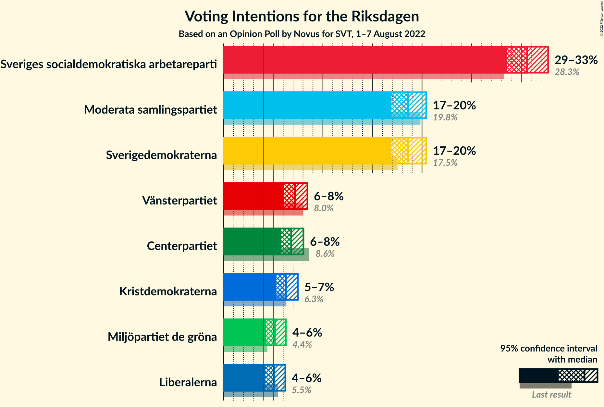

### Confidence Intervals

| Party | Last Result | Poll Result | 80% Confidence Interval | 90% Confidence Interval | 95% Confidence Interval | 99% Confidence Interval |
|:-----:|:-----------:|:-----------:|:-----------------------:|:-----------------------:|:-----------------------:|:-----------------------:|
| Sveriges socialdemokratiska arbetareparti | 28.3% | 30.6% | 29.2–32.0% |28.9–32.4% |28.5–32.7% |27.9–33.4% |
| Moderata samlingspartiet | 19.8% | 18.6% | 17.5–19.8% |17.2–20.1% |16.9–20.4% |16.4–21.0% |
| Sverigedemokraterna | 17.5% | 18.6% | 17.5–19.8% |17.2–20.1% |16.9–20.4% |16.4–21.0% |
| Vänsterpartiet | 8.0% | 7.2% | 6.5–8.0% |6.3–8.2% |6.1–8.4% |5.8–8.9% |
| Centerpartiet | 8.6% | 6.8% | 6.1–7.6% |5.9–7.8% |5.8–8.0% |5.4–8.4% |
| Kristdemokraterna | 6.3% | 6.3% | 5.6–7.1% |5.4–7.3% |5.3–7.5% |5.0–7.9% |
| Miljöpartiet de gröna | 4.4% | 5.2% | 4.6–5.9% |4.4–6.1% |4.3–6.3% |4.0–6.6% |
| Liberalerna | 5.5% | 5.1% | 4.5–5.8% |4.4–6.0% |4.2–6.2% |3.9–6.6% |

*Note:* The poll result column reflects the actual value used in the calculations. Published results may vary slightly, and in addition be rounded to fewer digits.

## Seats

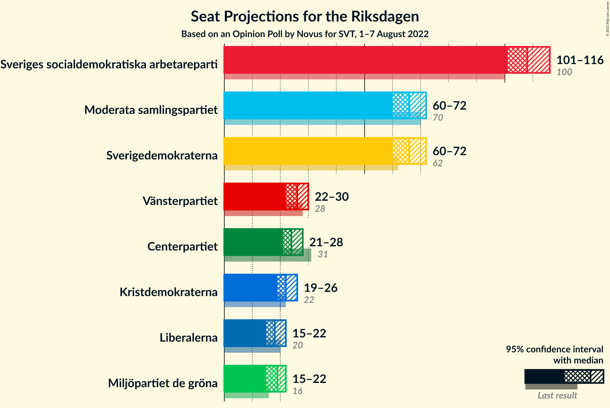

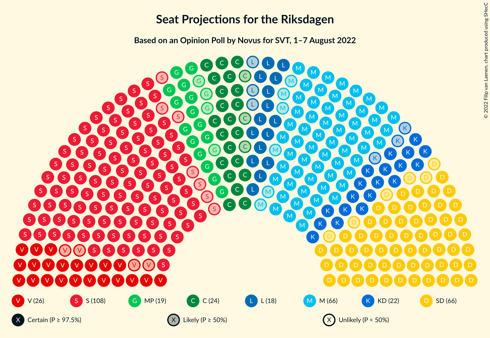

### Confidence Intervals

| Party | Last Result | Median | 80% Confidence Interval | 90% Confidence Interval | 95% Confidence Interval | 99% Confidence Interval |
|:-----:|:-----------:|:------:|:-----------------------:|:-----------------------:|:-----------------------:|:-----------------------:|
| <a href="#sveriges-socialdemokratiska-arbetareparti">Sveriges socialdemokratiska arbetareparti</a> | 100 | 108 | 104–113 |102–114 |101–116 |99–119 |
| <a href="#moderata-samlingspartiet">Moderata samlingspartiet</a> | 70 | 66 | 62–70 |61–71 |60–72 |58–74 |
| <a href="#sverigedemokraterna">Sverigedemokraterna</a> | 62 | 66 | 62–70 |61–71 |60–72 |58–75 |
| <a href="#vänsterpartiet">Vänsterpartiet</a> | 28 | 26 | 23–28 |22–29 |22–30 |21–31 |
| <a href="#centerpartiet">Centerpartiet</a> | 31 | 24 | 22–27 |21–28 |21–28 |19–30 |
| <a href="#kristdemokraterna">Kristdemokraterna</a> | 22 | 22 | 20–25 |19–26 |19–26 |18–28 |
| <a href="#miljöpartiet-de-gröna">Miljöpartiet de gröna</a> | 16 | 19 | 17–21 |16–22 |15–22 |0–23 |
| <a href="#liberalerna">Liberalerna</a> | 20 | 18 | 16–20 |16–21 |15–22 |0–23 |

### Sveriges socialdemokratiska arbetareparti

*For a full overview of the results for this party, see the [Sveriges socialdemokratiska arbetareparti](party-sverigessocialdemokratiskaarbetareparti.html) page.*

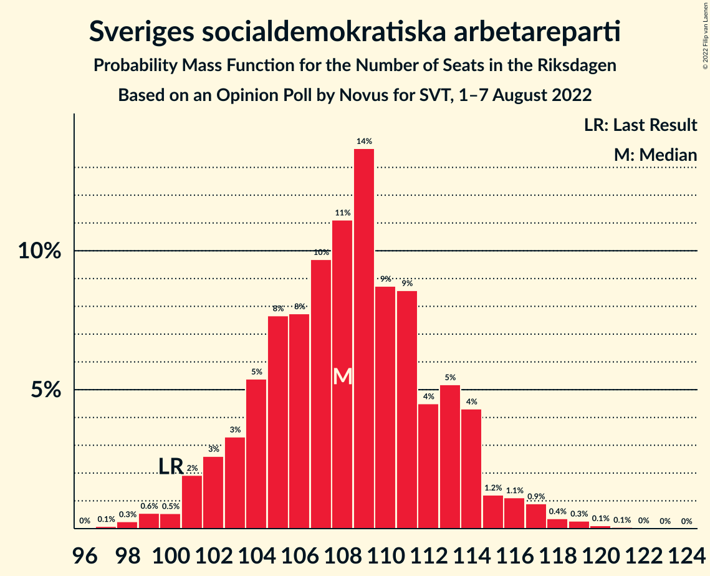

| Number of Seats | Probability | Accumulated | Special Marks |
|:---------------:|:-----------:|:-----------:|:-------------:|
| 96 | 0% | 100% |  |
| 97 | 0.1% | 99.9% |  |
| 98 | 0.3% | 99.9% |  |
| 99 | 0.6% | 99.6% |  |
| 100 | 0.5% | 99.0% | Last Result |
| 101 | 2% | 98.5% |  |
| 102 | 3% | 97% |  |
| 103 | 3% | 94% |  |
| 104 | 5% | 91% |  |
| 105 | 8% | 85% |  |
| 106 | 8% | 78% |  |
| 107 | 10% | 70% |  |
| 108 | 11% | 60% | Median |
| 109 | 14% | 49% |  |
| 110 | 9% | 35% |  |
| 111 | 9% | 27% |  |
| 112 | 4% | 18% |  |
| 113 | 5% | 14% |  |
| 114 | 4% | 8% |  |
| 115 | 1.2% | 4% |  |
| 116 | 1.1% | 3% |  |
| 117 | 0.9% | 2% |  |
| 118 | 0.4% | 0.9% |  |
| 119 | 0.3% | 0.5% |  |
| 120 | 0.1% | 0.2% |  |
| 121 | 0.1% | 0.1% |  |
| 122 | 0% | 0.1% |  |
| 123 | 0% | 0% |  |

### Moderata samlingspartiet

*For a full overview of the results for this party, see the [Moderata samlingspartiet](party-moderatasamlingspartiet.html) page.*

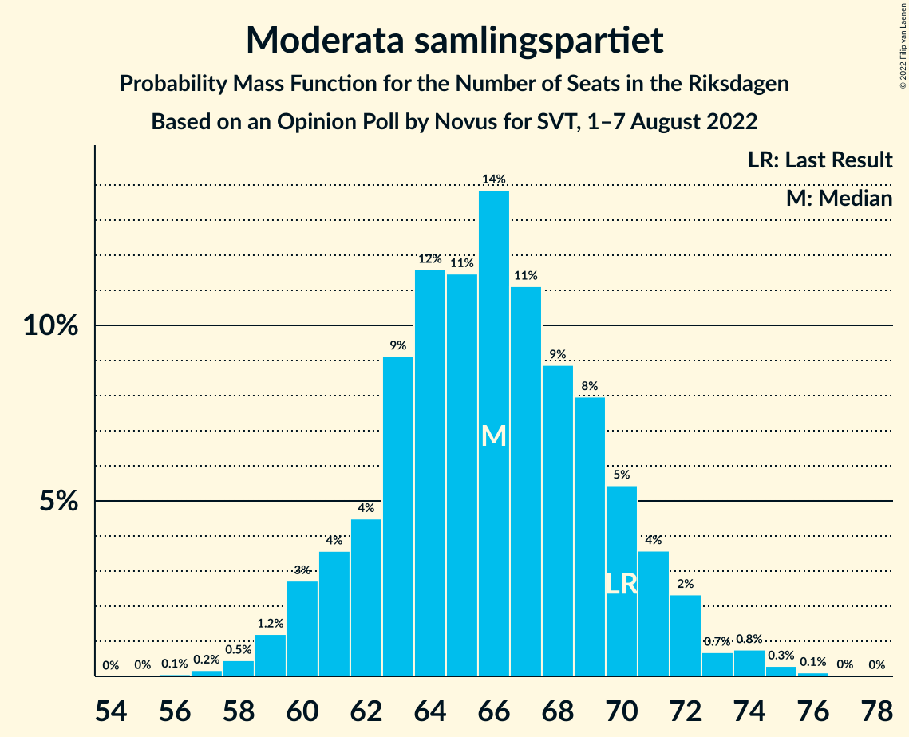

| Number of Seats | Probability | Accumulated | Special Marks |
|:---------------:|:-----------:|:-----------:|:-------------:|
| 56 | 0.1% | 100% |  |
| 57 | 0.2% | 99.9% |  |
| 58 | 0.5% | 99.7% |  |
| 59 | 1.2% | 99.3% |  |
| 60 | 3% | 98% |  |
| 61 | 4% | 95% |  |
| 62 | 4% | 92% |  |
| 63 | 9% | 87% |  |
| 64 | 12% | 78% |  |
| 65 | 11% | 67% |  |
| 66 | 14% | 55% | Median |
| 67 | 11% | 41% |  |
| 68 | 9% | 30% |  |
| 69 | 8% | 21% |  |
| 70 | 5% | 13% | Last Result |
| 71 | 4% | 8% |  |
| 72 | 2% | 4% |  |
| 73 | 0.7% | 2% |  |
| 74 | 0.8% | 1.2% |  |
| 75 | 0.3% | 0.5% |  |
| 76 | 0.1% | 0.2% |  |
| 77 | 0% | 0.1% |  |
| 78 | 0% | 0% |  |

### Sverigedemokraterna

*For a full overview of the results for this party, see the [Sverigedemokraterna](party-sverigedemokraterna.html) page.*

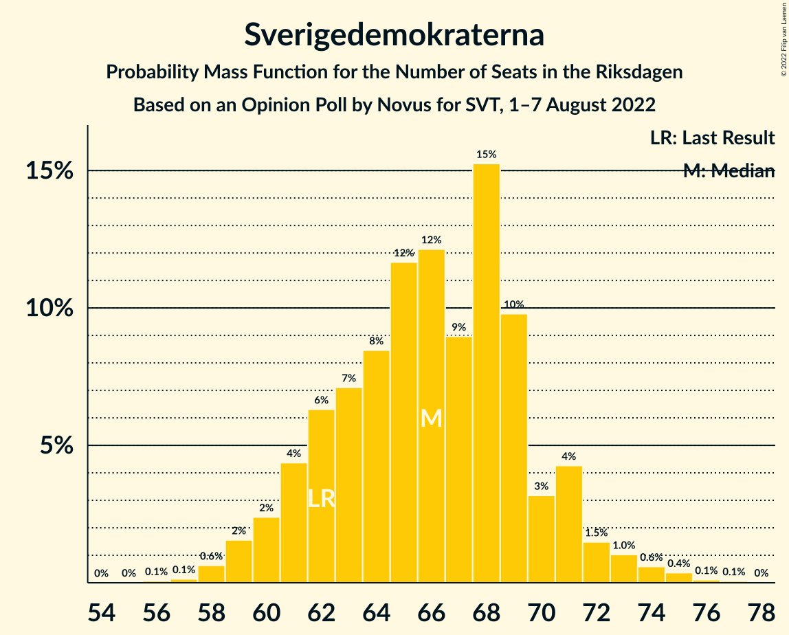

| Number of Seats | Probability | Accumulated | Special Marks |
|:---------------:|:-----------:|:-----------:|:-------------:|
| 56 | 0.1% | 100% |  |
| 57 | 0.1% | 99.9% |  |
| 58 | 0.6% | 99.8% |  |
| 59 | 2% | 99.1% |  |
| 60 | 2% | 98% |  |
| 61 | 4% | 95% |  |
| 62 | 6% | 91% | Last Result |
| 63 | 7% | 85% |  |
| 64 | 8% | 77% |  |
| 65 | 12% | 69% |  |
| 66 | 12% | 57% | Median |
| 67 | 9% | 45% |  |
| 68 | 15% | 36% |  |
| 69 | 10% | 21% |  |
| 70 | 3% | 11% |  |
| 71 | 4% | 8% |  |
| 72 | 1.5% | 4% |  |
| 73 | 1.0% | 2% |  |
| 74 | 0.6% | 1.2% |  |
| 75 | 0.4% | 0.6% |  |
| 76 | 0.1% | 0.2% |  |
| 77 | 0.1% | 0.1% |  |
| 78 | 0% | 0% |  |

### Vänsterpartiet

*For a full overview of the results for this party, see the [Vänsterpartiet](party-vänsterpartiet.html) page.*

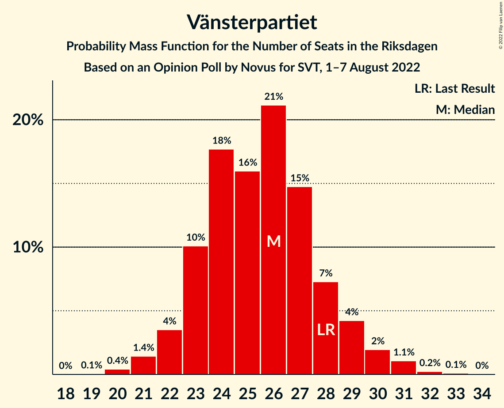

| Number of Seats | Probability | Accumulated | Special Marks |
|:---------------:|:-----------:|:-----------:|:-------------:|
| 19 | 0.1% | 100% |  |
| 20 | 0.4% | 99.9% |  |
| 21 | 1.4% | 99.5% |  |
| 22 | 4% | 98% |  |
| 23 | 10% | 95% |  |
| 24 | 18% | 84% |  |
| 25 | 16% | 67% |  |
| 26 | 21% | 51% | Median |
| 27 | 15% | 30% |  |
| 28 | 7% | 15% | Last Result |
| 29 | 4% | 8% |  |
| 30 | 2% | 3% |  |
| 31 | 1.1% | 1.4% |  |
| 32 | 0.2% | 0.4% |  |
| 33 | 0.1% | 0.1% |  |
| 34 | 0% | 0% |  |

### Centerpartiet

*For a full overview of the results for this party, see the [Centerpartiet](party-centerpartiet.html) page.*

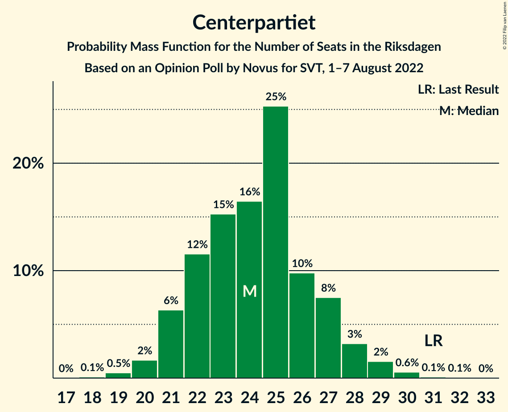

| Number of Seats | Probability | Accumulated | Special Marks |
|:---------------:|:-----------:|:-----------:|:-------------:|
| 18 | 0.1% | 100% |  |
| 19 | 0.5% | 99.9% |  |
| 20 | 2% | 99.4% |  |
| 21 | 6% | 98% |  |
| 22 | 12% | 91% |  |
| 23 | 15% | 80% |  |
| 24 | 16% | 65% | Median |
| 25 | 25% | 48% |  |
| 26 | 10% | 23% |  |
| 27 | 8% | 13% |  |
| 28 | 3% | 5% |  |
| 29 | 2% | 2% |  |
| 30 | 0.6% | 0.7% |  |
| 31 | 0.1% | 0.2% | Last Result |
| 32 | 0.1% | 0.1% |  |
| 33 | 0% | 0% |  |

### Kristdemokraterna

*For a full overview of the results for this party, see the [Kristdemokraterna](party-kristdemokraterna.html) page.*

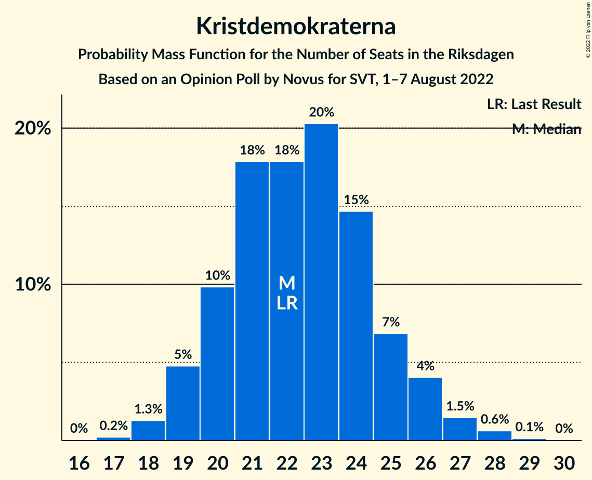

| Number of Seats | Probability | Accumulated | Special Marks |
|:---------------:|:-----------:|:-----------:|:-------------:|
| 16 | 0% | 100% |  |
| 17 | 0.2% | 99.9% |  |
| 18 | 1.3% | 99.7% |  |
| 19 | 5% | 98% |  |
| 20 | 10% | 94% |  |
| 21 | 18% | 84% |  |
| 22 | 18% | 66% | Last Result, Median |
| 23 | 20% | 48% |  |
| 24 | 15% | 28% |  |
| 25 | 7% | 13% |  |
| 26 | 4% | 6% |  |
| 27 | 1.5% | 2% |  |
| 28 | 0.6% | 0.8% |  |
| 29 | 0.1% | 0.2% |  |
| 30 | 0% | 0% |  |

### Miljöpartiet de gröna

*For a full overview of the results for this party, see the [Miljöpartiet de gröna](party-miljöpartietdegröna.html) page.*

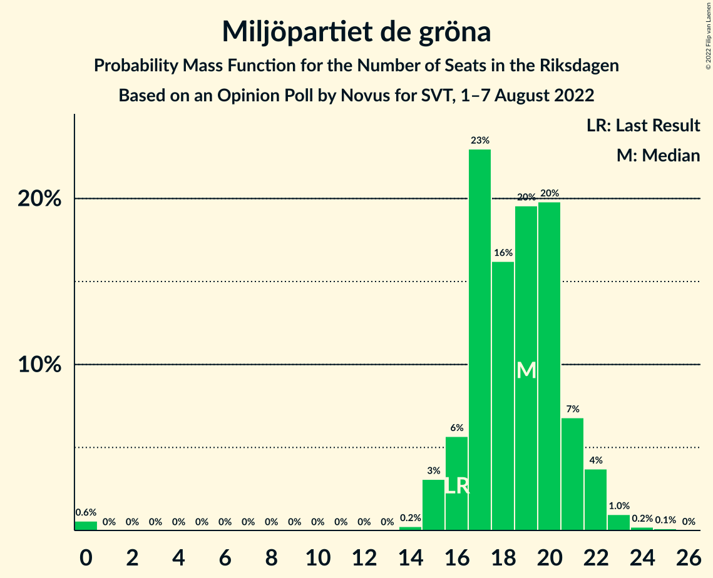

| Number of Seats | Probability | Accumulated | Special Marks |
|:---------------:|:-----------:|:-----------:|:-------------:|
| 0 | 0.6% | 100% |  |
| 1 | 0% | 99.4% |  |
| 2 | 0% | 99.4% |  |
| 3 | 0% | 99.4% |  |
| 4 | 0% | 99.4% |  |
| 5 | 0% | 99.4% |  |
| 6 | 0% | 99.4% |  |
| 7 | 0% | 99.4% |  |
| 8 | 0% | 99.4% |  |
| 9 | 0% | 99.4% |  |
| 10 | 0% | 99.4% |  |
| 11 | 0% | 99.4% |  |
| 12 | 0% | 99.4% |  |
| 13 | 0% | 99.4% |  |
| 14 | 0.2% | 99.4% |  |
| 15 | 3% | 99.2% |  |
| 16 | 6% | 96% | Last Result |
| 17 | 23% | 90% |  |
| 18 | 16% | 67% |  |
| 19 | 20% | 51% | Median |
| 20 | 20% | 32% |  |
| 21 | 7% | 12% |  |
| 22 | 4% | 5% |  |
| 23 | 1.0% | 1.3% |  |
| 24 | 0.2% | 0.3% |  |
| 25 | 0.1% | 0.1% |  |
| 26 | 0% | 0% |  |

### Liberalerna

*For a full overview of the results for this party, see the [Liberalerna](party-liberalerna.html) page.*

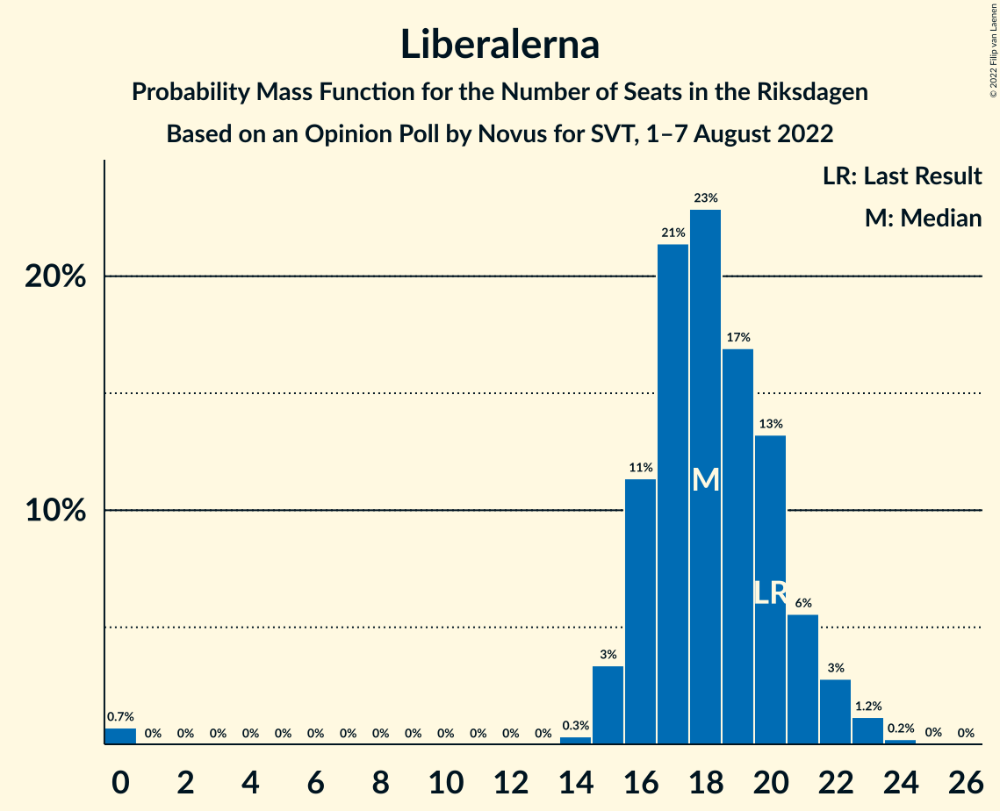

| Number of Seats | Probability | Accumulated | Special Marks |
|:---------------:|:-----------:|:-----------:|:-------------:|
| 0 | 0.7% | 100% |  |
| 1 | 0% | 99.3% |  |
| 2 | 0% | 99.3% |  |
| 3 | 0% | 99.3% |  |
| 4 | 0% | 99.3% |  |
| 5 | 0% | 99.3% |  |
| 6 | 0% | 99.3% |  |
| 7 | 0% | 99.3% |  |
| 8 | 0% | 99.3% |  |
| 9 | 0% | 99.3% |  |
| 10 | 0% | 99.3% |  |
| 11 | 0% | 99.3% |  |
| 12 | 0% | 99.3% |  |
| 13 | 0% | 99.3% |  |
| 14 | 0.3% | 99.3% |  |
| 15 | 3% | 99.0% |  |
| 16 | 11% | 96% |  |
| 17 | 21% | 84% |  |
| 18 | 23% | 63% | Median |
| 19 | 17% | 40% |  |
| 20 | 13% | 23% | Last Result |
| 21 | 6% | 10% |  |
| 22 | 3% | 4% |  |
| 23 | 1.2% | 1.4% |  |
| 24 | 0.2% | 0.3% |  |
| 25 | 0% | 0.1% |  |
| 26 | 0% | 0% |  |

## Coalitions

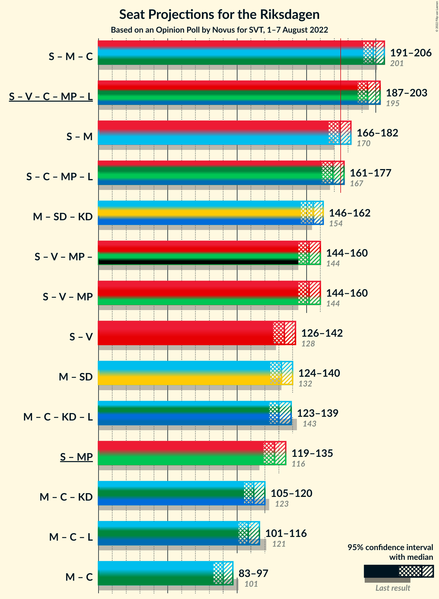

### Confidence Intervals

| Coalition | Last Result | Median | Majority? | 80% Confidence Interval | 90% Confidence Interval | 95% Confidence Interval | 99% Confidence Interval |
|:---------:|:-----------:|:------:|:---------:|:-----------------------:|:-----------------------:|:-----------------------:|:-----------------------:|
| Sveriges socialdemokratiska arbetareparti – Moderata samlingspartiet – Centerpartiet | 201 | 198 | 100% | 193–205 | 192–205 | 191–206 | 188–211 |
| Sveriges socialdemokratiska arbetareparti – Vänsterpartiet – Centerpartiet – Miljöpartiet de gröna – Liberalerna | 195 | 194 | 100% | 190–200 | 188–201 | 187–203 | 183–205 |
| Sveriges socialdemokratiska arbetareparti – Moderata samlingspartiet | 170 | 174 | 45% | 169–180 | 168–181 | 166–182 | 164–186 |
| Sveriges socialdemokratiska arbetareparti – Centerpartiet – Miljöpartiet de gröna – Liberalerna | 167 | 169 | 10% | 164–174 | 162–176 | 161–177 | 157–180 |
| Moderata samlingspartiet – Sverigedemokraterna – Kristdemokraterna | 154 | 155 | 0% | 149–159 | 148–161 | 146–162 | 144–166 |
| Sveriges socialdemokratiska arbetareparti – Vänsterpartiet – Miljöpartiet de gröna | 144 | 152 | 0% | 147–157 | 145–159 | 144–160 | 141–163 |
| Sveriges socialdemokratiska arbetareparti – Vänsterpartiet | 128 | 134 | 0% | 129–139 | 128–140 | 126–142 | 124–145 |
| Moderata samlingspartiet – Sverigedemokraterna | 132 | 132 | 0% | 127–137 | 125–138 | 124–140 | 122–143 |
| Moderata samlingspartiet – Centerpartiet – Kristdemokraterna – Liberalerna | 143 | 130 | 0% | 126–136 | 124–137 | 123–139 | 118–141 |
| Sveriges socialdemokratiska arbetareparti – Miljöpartiet de gröna | 116 | 127 | 0% | 122–132 | 120–133 | 119–135 | 116–137 |
| Moderata samlingspartiet – Centerpartiet – Kristdemokraterna | 123 | 112 | 0% | 108–118 | 106–119 | 105–120 | 103–123 |
| Moderata samlingspartiet – Centerpartiet – Liberalerna | 121 | 108 | 0% | 104–113 | 102–115 | 101–116 | 96–118 |
| Moderata samlingspartiet – Centerpartiet | 101 | 90 | 0% | 86–95 | 84–96 | 83–97 | 81–100 |

### Sveriges socialdemokratiska arbetareparti – Moderata samlingspartiet – Centerpartiet

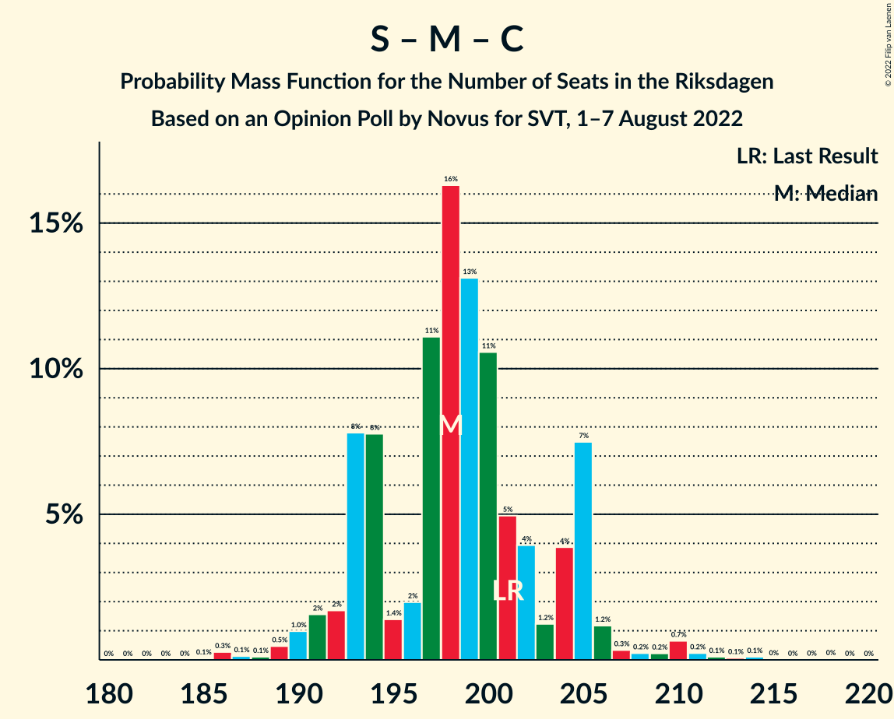

| Number of Seats | Probability | Accumulated | Special Marks |
|:---------------:|:-----------:|:-----------:|:-------------:|
| 185 | 0.1% | 100% |  |
| 186 | 0.3% | 99.9% |  |
| 187 | 0.1% | 99.7% |  |
| 188 | 0.1% | 99.5% |  |
| 189 | 0.5% | 99.4% |  |
| 190 | 1.0% | 99.0% |  |
| 191 | 2% | 98% |  |
| 192 | 2% | 96% |  |
| 193 | 8% | 95% |  |
| 194 | 8% | 87% |  |
| 195 | 1.4% | 79% |  |
| 196 | 2% | 78% |  |
| 197 | 11% | 76% |  |
| 198 | 16% | 65% | Median |
| 199 | 13% | 48% |  |
| 200 | 11% | 35% |  |
| 201 | 5% | 25% | Last Result |
| 202 | 4% | 20% |  |
| 203 | 1.2% | 16% |  |
| 204 | 4% | 15% |  |
| 205 | 7% | 11% |  |
| 206 | 1.2% | 3% |  |
| 207 | 0.3% | 2% |  |
| 208 | 0.2% | 2% |  |
| 209 | 0.2% | 1.5% |  |
| 210 | 0.7% | 1.2% |  |
| 211 | 0.2% | 0.6% |  |
| 212 | 0.1% | 0.4% |  |
| 213 | 0.1% | 0.3% |  |
| 214 | 0.1% | 0.2% |  |
| 215 | 0% | 0.1% |  |
| 216 | 0% | 0.1% |  |
| 217 | 0% | 0.1% |  |
| 218 | 0% | 0% |  |

### Sveriges socialdemokratiska arbetareparti – Vänsterpartiet – Centerpartiet – Miljöpartiet de gröna – Liberalerna

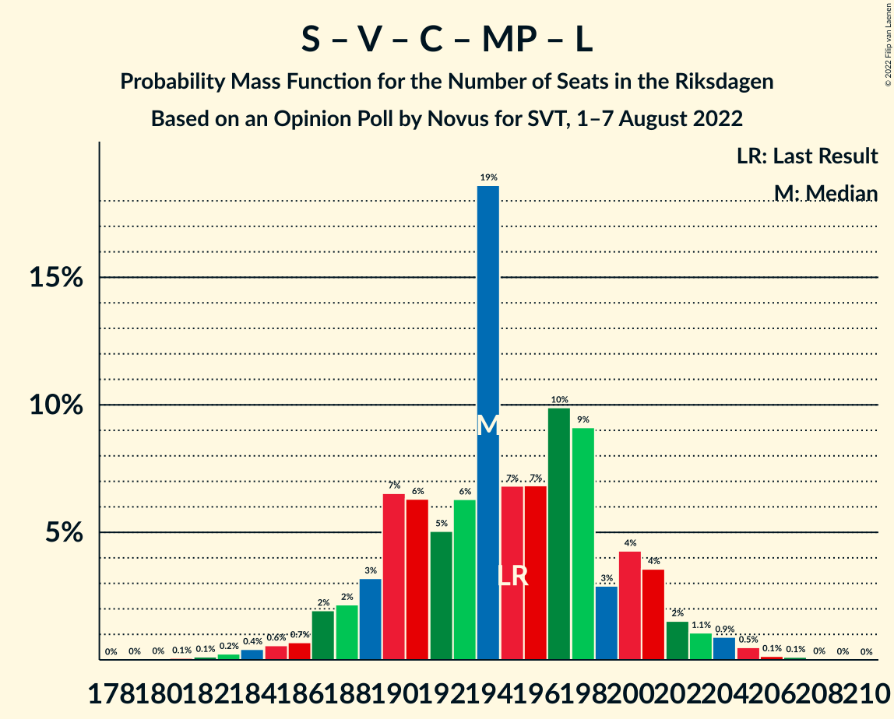

| Number of Seats | Probability | Accumulated | Special Marks |
|:---------------:|:-----------:|:-----------:|:-------------:|
| 179 | 0% | 100% |  |
| 180 | 0% | 99.9% |  |
| 181 | 0.1% | 99.9% |  |
| 182 | 0.1% | 99.8% |  |
| 183 | 0.2% | 99.7% |  |
| 184 | 0.4% | 99.5% |  |
| 185 | 0.6% | 99.1% |  |
| 186 | 0.7% | 98% |  |
| 187 | 2% | 98% |  |
| 188 | 2% | 96% |  |
| 189 | 3% | 94% |  |
| 190 | 7% | 91% |  |
| 191 | 6% | 84% |  |
| 192 | 5% | 78% |  |
| 193 | 6% | 73% |  |
| 194 | 19% | 66% |  |
| 195 | 7% | 48% | Last Result, Median |
| 196 | 7% | 41% |  |
| 197 | 10% | 34% |  |
| 198 | 9% | 24% |  |
| 199 | 3% | 15% |  |
| 200 | 4% | 12% |  |
| 201 | 4% | 8% |  |
| 202 | 2% | 4% |  |
| 203 | 1.1% | 3% |  |
| 204 | 0.9% | 2% |  |
| 205 | 0.5% | 0.8% |  |
| 206 | 0.1% | 0.3% |  |
| 207 | 0.1% | 0.2% |  |
| 208 | 0% | 0.1% |  |
| 209 | 0% | 0% |  |

### Sveriges socialdemokratiska arbetareparti – Moderata samlingspartiet

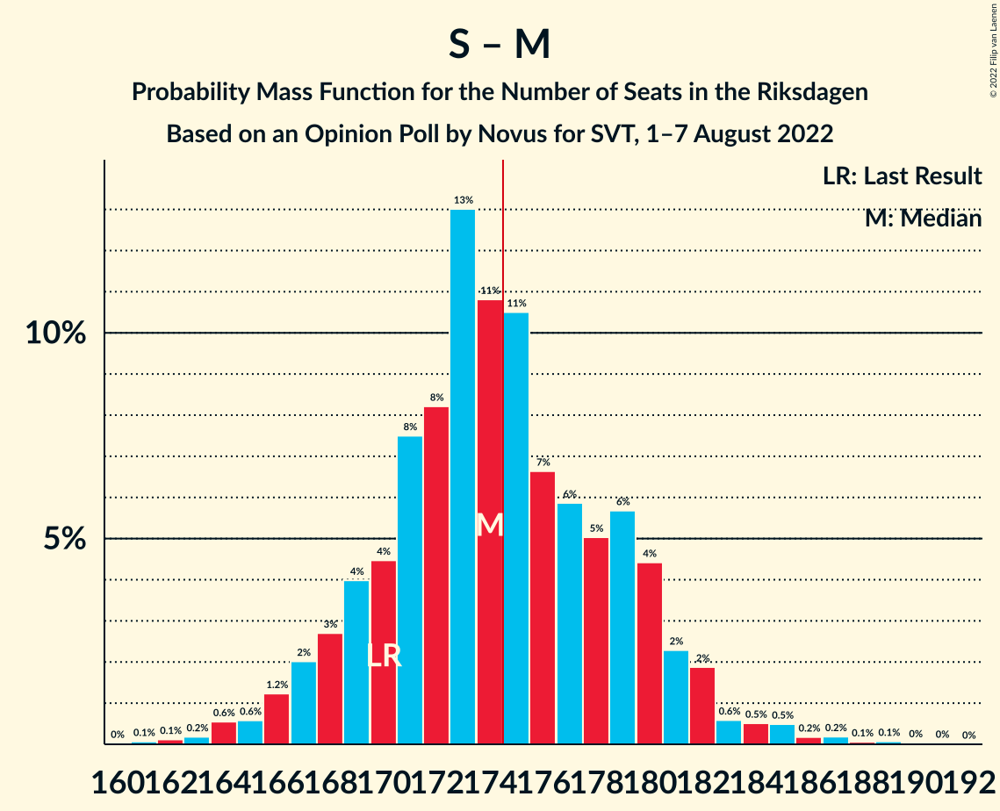

| Number of Seats | Probability | Accumulated | Special Marks |
|:---------------:|:-----------:|:-----------:|:-------------:|
| 161 | 0.1% | 100% |  |
| 162 | 0.1% | 99.9% |  |
| 163 | 0.2% | 99.8% |  |
| 164 | 0.6% | 99.6% |  |
| 165 | 0.6% | 99.0% |  |
| 166 | 1.2% | 98% |  |
| 167 | 2% | 97% |  |
| 168 | 3% | 95% |  |
| 169 | 4% | 93% |  |
| 170 | 4% | 89% | Last Result |
| 171 | 8% | 84% |  |
| 172 | 8% | 77% |  |
| 173 | 13% | 68% |  |
| 174 | 11% | 55% | Median |
| 175 | 11% | 45% | Majority |
| 176 | 7% | 34% |  |
| 177 | 6% | 27% |  |
| 178 | 5% | 21% |  |
| 179 | 6% | 16% |  |
| 180 | 4% | 11% |  |
| 181 | 2% | 6% |  |
| 182 | 2% | 4% |  |
| 183 | 0.6% | 2% |  |
| 184 | 0.5% | 2% |  |
| 185 | 0.5% | 1.1% |  |
| 186 | 0.2% | 0.6% |  |
| 187 | 0.2% | 0.4% |  |
| 188 | 0.1% | 0.2% |  |
| 189 | 0.1% | 0.2% |  |
| 190 | 0% | 0.1% |  |
| 191 | 0% | 0.1% |  |
| 192 | 0% | 0% |  |

### Sveriges socialdemokratiska arbetareparti – Centerpartiet – Miljöpartiet de gröna – Liberalerna

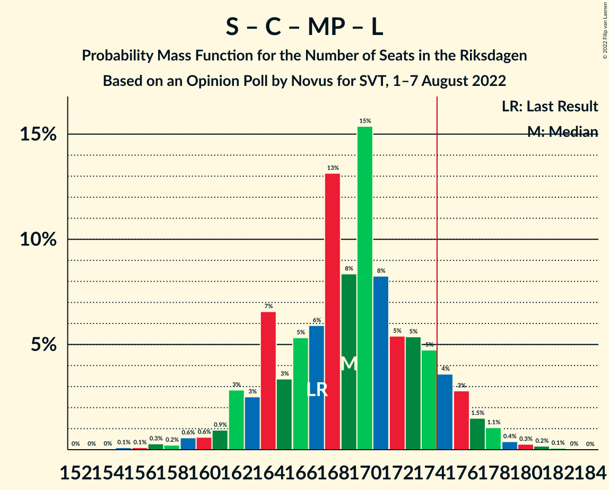

| Number of Seats | Probability | Accumulated | Special Marks |
|:---------------:|:-----------:|:-----------:|:-------------:|
| 152 | 0% | 100% |  |
| 153 | 0% | 99.9% |  |
| 154 | 0% | 99.9% |  |
| 155 | 0.1% | 99.9% |  |
| 156 | 0.1% | 99.8% |  |
| 157 | 0.3% | 99.7% |  |
| 158 | 0.2% | 99.4% |  |
| 159 | 0.6% | 99.2% |  |
| 160 | 0.6% | 98.6% |  |
| 161 | 0.9% | 98% |  |
| 162 | 3% | 97% |  |
| 163 | 3% | 94% |  |
| 164 | 7% | 92% |  |
| 165 | 3% | 85% |  |
| 166 | 5% | 82% |  |
| 167 | 6% | 76% | Last Result |
| 168 | 13% | 71% |  |
| 169 | 8% | 57% | Median |
| 170 | 15% | 49% |  |
| 171 | 8% | 34% |  |
| 172 | 5% | 25% |  |
| 173 | 5% | 20% |  |
| 174 | 5% | 15% |  |
| 175 | 4% | 10% | Majority |
| 176 | 3% | 6% |  |
| 177 | 1.5% | 4% |  |
| 178 | 1.1% | 2% |  |
| 179 | 0.4% | 1.0% |  |
| 180 | 0.3% | 0.6% |  |
| 181 | 0.2% | 0.3% |  |
| 182 | 0.1% | 0.1% |  |
| 183 | 0% | 0.1% |  |
| 184 | 0% | 0% |  |

### Moderata samlingspartiet – Sverigedemokraterna – Kristdemokraterna

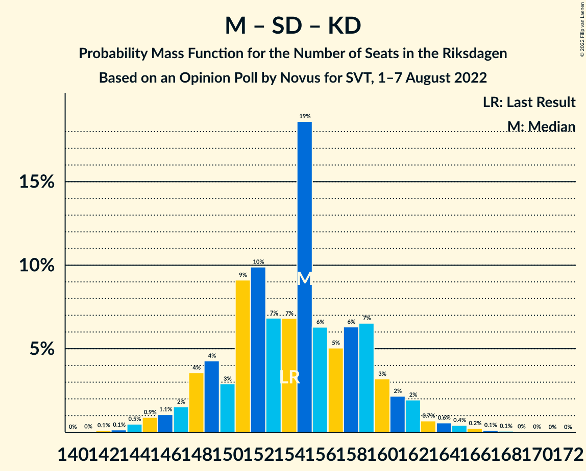

| Number of Seats | Probability | Accumulated | Special Marks |
|:---------------:|:-----------:|:-----------:|:-------------:|
| 141 | 0% | 100% |  |
| 142 | 0.1% | 99.9% |  |
| 143 | 0.1% | 99.8% |  |
| 144 | 0.5% | 99.7% |  |
| 145 | 0.9% | 99.2% |  |
| 146 | 1.1% | 98% |  |
| 147 | 2% | 97% |  |
| 148 | 4% | 96% |  |
| 149 | 4% | 92% |  |
| 150 | 3% | 88% |  |
| 151 | 9% | 85% |  |
| 152 | 10% | 76% |  |
| 153 | 7% | 66% |  |
| 154 | 7% | 59% | Last Result, Median |
| 155 | 19% | 52% |  |
| 156 | 6% | 34% |  |
| 157 | 5% | 27% |  |
| 158 | 6% | 22% |  |
| 159 | 7% | 16% |  |
| 160 | 3% | 9% |  |
| 161 | 2% | 6% |  |
| 162 | 2% | 4% |  |
| 163 | 0.7% | 2% |  |
| 164 | 0.6% | 2% |  |
| 165 | 0.4% | 0.9% |  |
| 166 | 0.2% | 0.5% |  |
| 167 | 0.1% | 0.3% |  |
| 168 | 0.1% | 0.2% |  |
| 169 | 0% | 0.1% |  |
| 170 | 0% | 0.1% |  |
| 171 | 0% | 0% |  |

### Sveriges socialdemokratiska arbetareparti – Vänsterpartiet – Miljöpartiet de gröna

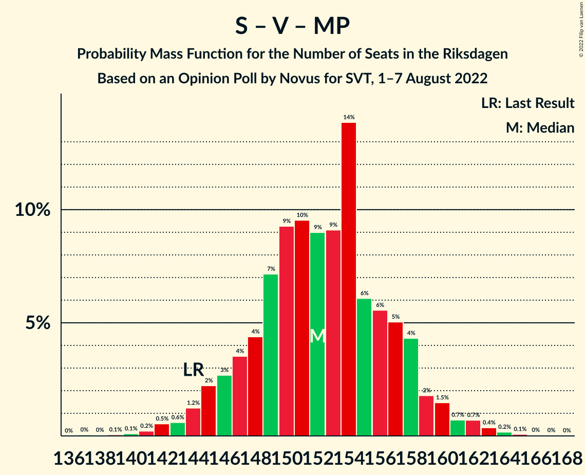

| Number of Seats | Probability | Accumulated | Special Marks |
|:---------------:|:-----------:|:-----------:|:-------------:|
| 136 | 0% | 100% |  |
| 137 | 0% | 99.9% |  |
| 138 | 0% | 99.9% |  |
| 139 | 0.1% | 99.9% |  |
| 140 | 0.1% | 99.8% |  |
| 141 | 0.2% | 99.7% |  |
| 142 | 0.5% | 99.5% |  |
| 143 | 0.6% | 98.9% |  |
| 144 | 1.2% | 98% | Last Result |
| 145 | 2% | 97% |  |
| 146 | 3% | 95% |  |
| 147 | 4% | 92% |  |
| 148 | 4% | 89% |  |
| 149 | 7% | 84% |  |
| 150 | 9% | 77% |  |
| 151 | 10% | 68% |  |
| 152 | 9% | 58% |  |
| 153 | 9% | 49% | Median |
| 154 | 14% | 40% |  |
| 155 | 6% | 26% |  |
| 156 | 6% | 20% |  |
| 157 | 5% | 15% |  |
| 158 | 4% | 10% |  |
| 159 | 2% | 5% |  |
| 160 | 1.5% | 4% |  |
| 161 | 0.7% | 2% |  |
| 162 | 0.7% | 1.4% |  |
| 163 | 0.4% | 0.7% |  |
| 164 | 0.2% | 0.4% |  |
| 165 | 0.1% | 0.2% |  |
| 166 | 0% | 0.1% |  |
| 167 | 0% | 0.1% |  |
| 168 | 0% | 0% |  |

### Sveriges socialdemokratiska arbetareparti – Vänsterpartiet

| Number of Seats | Probability | Accumulated | Special Marks |
|:---------------:|:-----------:|:-----------:|:-------------:|
| 121 | 0% | 100% |  |
| 122 | 0.1% | 99.9% |  |
| 123 | 0.2% | 99.8% |  |
| 124 | 0.4% | 99.7% |  |
| 125 | 0.8% | 99.2% |  |
| 126 | 0.9% | 98% |  |
| 127 | 2% | 97% |  |
| 128 | 4% | 95% | Last Result |
| 129 | 4% | 92% |  |
| 130 | 6% | 88% |  |
| 131 | 9% | 82% |  |
| 132 | 8% | 73% |  |
| 133 | 12% | 65% |  |
| 134 | 12% | 53% | Median |
| 135 | 8% | 40% |  |
| 136 | 9% | 33% |  |
| 137 | 7% | 24% |  |
| 138 | 6% | 17% |  |
| 139 | 5% | 11% |  |
| 140 | 2% | 6% |  |
| 141 | 1.3% | 4% |  |
| 142 | 1.2% | 3% |  |
| 143 | 0.8% | 2% |  |
| 144 | 0.3% | 1.0% |  |
| 145 | 0.3% | 0.7% |  |
| 146 | 0.2% | 0.4% |  |
| 147 | 0.1% | 0.2% |  |
| 148 | 0% | 0.1% |  |
| 149 | 0% | 0.1% |  |
| 150 | 0% | 0% |  |

### Moderata samlingspartiet – Sverigedemokraterna

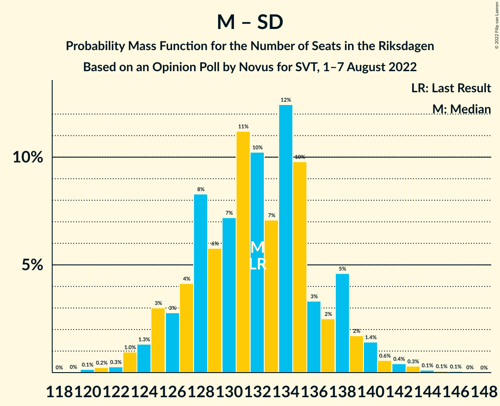

| Number of Seats | Probability | Accumulated | Special Marks |
|:---------------:|:-----------:|:-----------:|:-------------:|
| 119 | 0% | 100% |  |
| 120 | 0.1% | 99.9% |  |
| 121 | 0.2% | 99.8% |  |
| 122 | 0.3% | 99.6% |  |
| 123 | 1.0% | 99.3% |  |
| 124 | 1.3% | 98% |  |
| 125 | 3% | 97% |  |
| 126 | 3% | 94% |  |
| 127 | 4% | 91% |  |
| 128 | 8% | 87% |  |
| 129 | 6% | 79% |  |
| 130 | 7% | 73% |  |
| 131 | 11% | 66% |  |
| 132 | 10% | 55% | Last Result, Median |
| 133 | 7% | 44% |  |
| 134 | 12% | 37% |  |
| 135 | 10% | 25% |  |
| 136 | 3% | 15% |  |
| 137 | 2% | 12% |  |
| 138 | 5% | 9% |  |
| 139 | 2% | 5% |  |
| 140 | 1.4% | 3% |  |
| 141 | 0.6% | 2% |  |
| 142 | 0.4% | 1.0% |  |
| 143 | 0.3% | 0.6% |  |
| 144 | 0.1% | 0.3% |  |
| 145 | 0.1% | 0.2% |  |
| 146 | 0.1% | 0.1% |  |
| 147 | 0% | 0% |  |

### Moderata samlingspartiet – Centerpartiet – Kristdemokraterna – Liberalerna

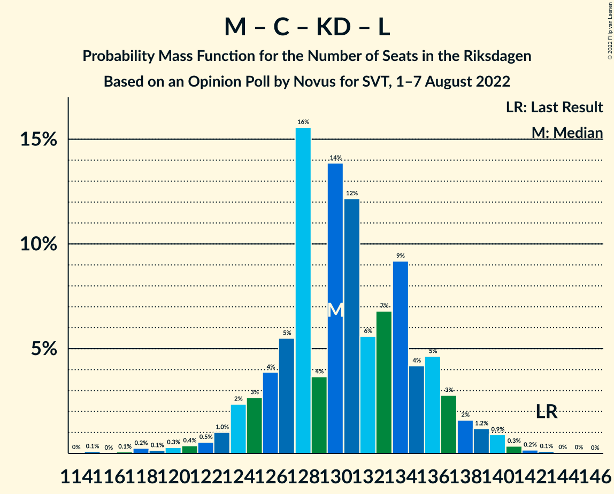

| Number of Seats | Probability | Accumulated | Special Marks |
|:---------------:|:-----------:|:-----------:|:-------------:|
| 114 | 0% | 100% |  |
| 115 | 0.1% | 99.9% |  |
| 116 | 0% | 99.8% |  |
| 117 | 0.1% | 99.8% |  |
| 118 | 0.2% | 99.7% |  |
| 119 | 0.1% | 99.5% |  |
| 120 | 0.3% | 99.4% |  |
| 121 | 0.4% | 99.1% |  |
| 122 | 0.5% | 98.7% |  |
| 123 | 1.0% | 98% |  |
| 124 | 2% | 97% |  |
| 125 | 3% | 95% |  |
| 126 | 4% | 92% |  |
| 127 | 5% | 88% |  |
| 128 | 16% | 83% |  |
| 129 | 4% | 67% |  |
| 130 | 14% | 64% | Median |
| 131 | 12% | 50% |  |
| 132 | 6% | 38% |  |
| 133 | 7% | 32% |  |
| 134 | 9% | 25% |  |
| 135 | 4% | 16% |  |
| 136 | 5% | 12% |  |
| 137 | 3% | 7% |  |
| 138 | 2% | 4% |  |
| 139 | 1.2% | 3% |  |
| 140 | 0.9% | 2% |  |
| 141 | 0.3% | 0.7% |  |
| 142 | 0.2% | 0.4% |  |
| 143 | 0.1% | 0.2% | Last Result |
| 144 | 0% | 0.1% |  |
| 145 | 0% | 0.1% |  |
| 146 | 0% | 0% |  |

### Sveriges socialdemokratiska arbetareparti – Miljöpartiet de gröna

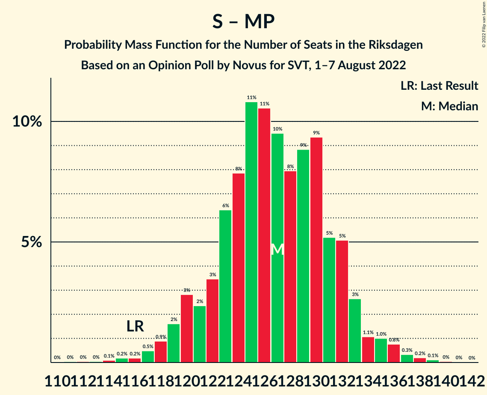

| Number of Seats | Probability | Accumulated | Special Marks |
|:---------------:|:-----------:|:-----------:|:-------------:|
| 110 | 0% | 100% |  |
| 111 | 0% | 99.9% |  |
| 112 | 0% | 99.9% |  |
| 113 | 0% | 99.8% |  |
| 114 | 0.1% | 99.8% |  |
| 115 | 0.2% | 99.7% |  |
| 116 | 0.2% | 99.5% | Last Result |
| 117 | 0.5% | 99.3% |  |
| 118 | 0.9% | 98.8% |  |
| 119 | 2% | 98% |  |
| 120 | 3% | 96% |  |
| 121 | 2% | 94% |  |
| 122 | 3% | 91% |  |
| 123 | 6% | 88% |  |
| 124 | 8% | 81% |  |
| 125 | 11% | 74% |  |
| 126 | 11% | 63% |  |
| 127 | 10% | 52% | Median |
| 128 | 8% | 43% |  |
| 129 | 9% | 35% |  |
| 130 | 9% | 26% |  |
| 131 | 5% | 16% |  |
| 132 | 5% | 11% |  |
| 133 | 3% | 6% |  |
| 134 | 1.1% | 4% |  |
| 135 | 1.0% | 3% |  |
| 136 | 0.8% | 2% |  |
| 137 | 0.3% | 0.7% |  |
| 138 | 0.2% | 0.4% |  |
| 139 | 0.1% | 0.2% |  |
| 140 | 0% | 0.1% |  |
| 141 | 0% | 0.1% |  |
| 142 | 0% | 0% |  |

### Moderata samlingspartiet – Centerpartiet – Kristdemokraterna

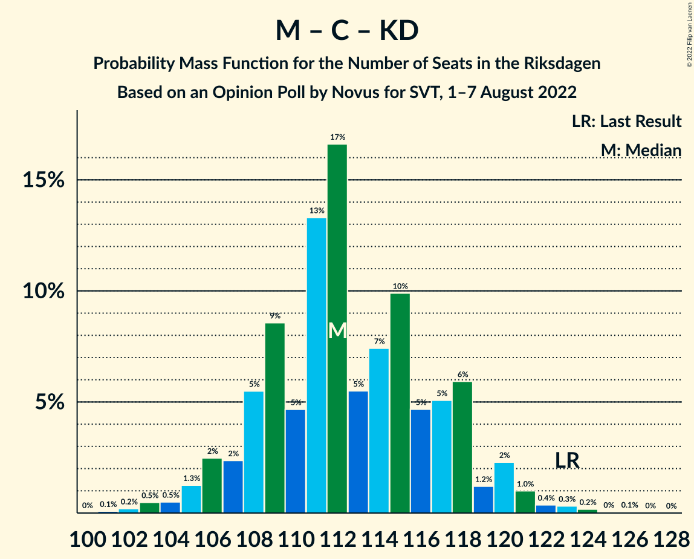

| Number of Seats | Probability | Accumulated | Special Marks |
|:---------------:|:-----------:|:-----------:|:-------------:|
| 100 | 0% | 100% |  |
| 101 | 0.1% | 99.9% |  |
| 102 | 0.2% | 99.9% |  |
| 103 | 0.5% | 99.7% |  |
| 104 | 0.5% | 99.2% |  |
| 105 | 1.3% | 98.7% |  |
| 106 | 2% | 97% |  |
| 107 | 2% | 95% |  |
| 108 | 5% | 93% |  |
| 109 | 9% | 87% |  |
| 110 | 5% | 79% |  |
| 111 | 13% | 74% |  |
| 112 | 17% | 61% | Median |
| 113 | 5% | 44% |  |
| 114 | 7% | 38% |  |
| 115 | 10% | 31% |  |
| 116 | 5% | 21% |  |
| 117 | 5% | 16% |  |
| 118 | 6% | 11% |  |
| 119 | 1.2% | 5% |  |
| 120 | 2% | 4% |  |
| 121 | 1.0% | 2% |  |
| 122 | 0.4% | 1.0% |  |
| 123 | 0.3% | 0.6% | Last Result |
| 124 | 0.2% | 0.3% |  |
| 125 | 0% | 0.1% |  |
| 126 | 0.1% | 0.1% |  |
| 127 | 0% | 0% |  |

### Moderata samlingspartiet – Centerpartiet – Liberalerna

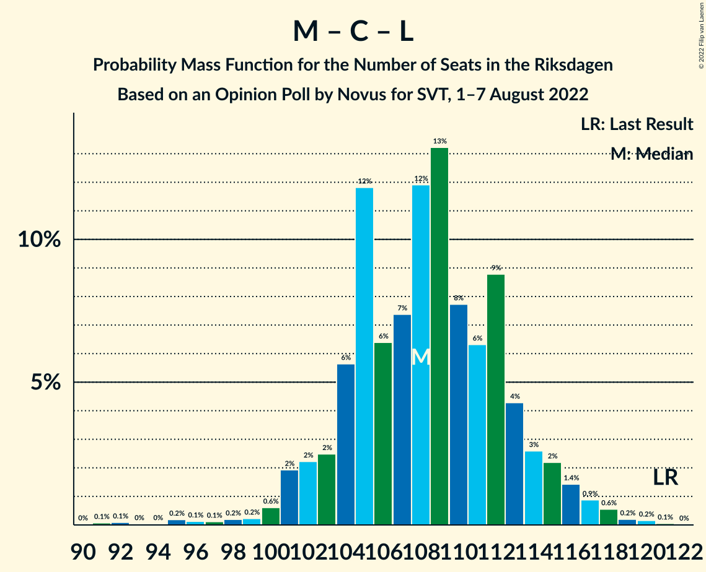

| Number of Seats | Probability | Accumulated | Special Marks |
|:---------------:|:-----------:|:-----------:|:-------------:|
| 90 | 0% | 100% |  |
| 91 | 0.1% | 99.9% |  |
| 92 | 0.1% | 99.9% |  |
| 93 | 0% | 99.8% |  |
| 94 | 0% | 99.7% |  |
| 95 | 0.2% | 99.7% |  |
| 96 | 0.1% | 99.5% |  |
| 97 | 0.1% | 99.4% |  |
| 98 | 0.2% | 99.3% |  |
| 99 | 0.2% | 99.1% |  |
| 100 | 0.6% | 98.8% |  |
| 101 | 2% | 98% |  |
| 102 | 2% | 96% |  |
| 103 | 2% | 94% |  |
| 104 | 6% | 92% |  |
| 105 | 12% | 86% |  |
| 106 | 6% | 74% |  |
| 107 | 7% | 68% |  |
| 108 | 12% | 60% | Median |
| 109 | 13% | 48% |  |
| 110 | 8% | 35% |  |
| 111 | 6% | 27% |  |
| 112 | 9% | 21% |  |
| 113 | 4% | 12% |  |
| 114 | 3% | 8% |  |
| 115 | 2% | 6% |  |
| 116 | 1.4% | 3% |  |
| 117 | 0.9% | 2% |  |
| 118 | 0.6% | 1.0% |  |
| 119 | 0.2% | 0.4% |  |
| 120 | 0.2% | 0.2% |  |
| 121 | 0.1% | 0.1% | Last Result |
| 122 | 0% | 0% |  |

### Moderata samlingspartiet – Centerpartiet

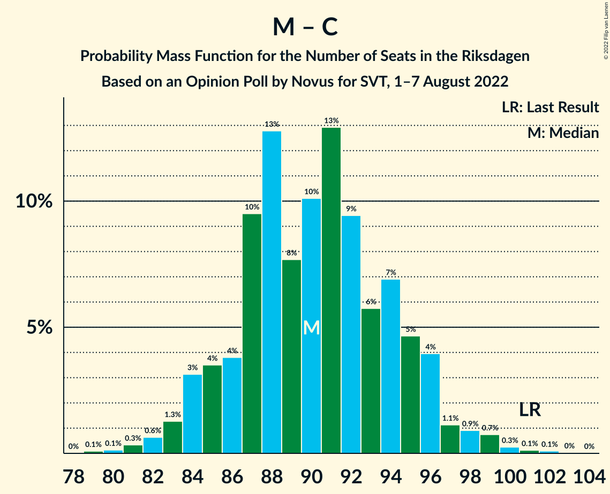

| Number of Seats | Probability | Accumulated | Special Marks |
|:---------------:|:-----------:|:-----------:|:-------------:|
| 79 | 0.1% | 100% |  |
| 80 | 0.1% | 99.9% |  |
| 81 | 0.3% | 99.7% |  |
| 82 | 0.6% | 99.4% |  |
| 83 | 1.3% | 98.8% |  |
| 84 | 3% | 97% |  |
| 85 | 4% | 94% |  |
| 86 | 4% | 91% |  |
| 87 | 10% | 87% |  |
| 88 | 13% | 78% |  |
| 89 | 8% | 65% |  |
| 90 | 10% | 57% | Median |
| 91 | 13% | 47% |  |
| 92 | 9% | 34% |  |
| 93 | 6% | 25% |  |
| 94 | 7% | 19% |  |
| 95 | 5% | 12% |  |
| 96 | 4% | 7% |  |
| 97 | 1.1% | 3% |  |
| 98 | 0.9% | 2% |  |
| 99 | 0.7% | 1.3% |  |
| 100 | 0.3% | 0.5% |  |
| 101 | 0.1% | 0.3% | Last Result |
| 102 | 0.1% | 0.2% |  |
| 103 | 0% | 0.1% |  |
| 104 | 0% | 0% |  |

## Technical Information

### Opinion Poll

+ **Polling firm:** Novus
+ **Commissioner(s):** SVT
+ **Fieldwork period:** 1–7 August 2022

### Calculations

+ **Sample size:** 1893
+ **Simulations done:** 1,048,576
+ **Error estimate:** 0.90%

