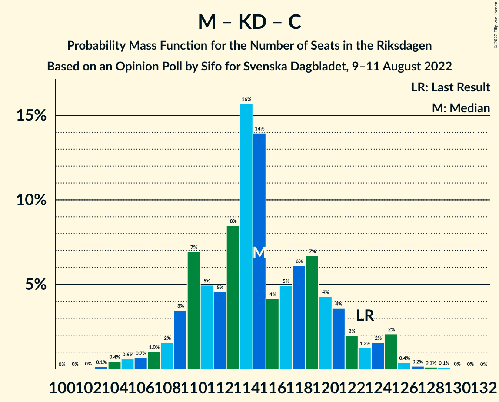

# Opinion Poll by Sifo for Svenska Dagbladet, 9–11 August 2022

<a href="#voting-intentions">Voting Intentions</a> | <a href="#seats">Seats</a> | <a href="#coalitions">Coalitions</a> | <a href="#technical-information">Technical Information</a>

## Voting Intentions

### Confidence Intervals

| Party | Last Result | Poll Result | 80% Confidence Interval | 90% Confidence Interval | 95% Confidence Interval | 99% Confidence Interval |
|:-----:|:-----------:|:-----------:|:-----------------------:|:-----------------------:|:-----------------------:|:-----------------------:|
| Sveriges socialdemokratiska arbetareparti | 28.3% | 31.2% | 29.8–32.6% |29.4–33.0% |29.1–33.4% |28.4–34.1% |
| Moderata samlingspartiet | 19.8% | 20.7% | 19.5–21.9% |19.1–22.3% |18.8–22.6% |18.3–23.2% |
| Sverigedemokraterna | 17.5% | 16.5% | 15.4–17.6% |15.1–18.0% |14.8–18.3% |14.3–18.9% |
| Vänsterpartiet | 8.0% | 7.6% | 6.8–8.4% |6.6–8.7% |6.4–8.9% |6.1–9.3% |
| Kristdemokraterna | 6.3% | 6.1% | 5.4–6.9% |5.2–7.1% |5.0–7.3% |4.7–7.7% |
| Liberalerna | 5.5% | 5.7% | 5.0–6.4% |4.8–6.7% |4.7–6.9% |4.4–7.2% |
| Centerpartiet | 8.6% | 5.3% | 4.7–6.0% |4.5–6.2% |4.3–6.4% |4.1–6.8% |
| Miljöpartiet de gröna | 4.4% | 4.6% | 4.0–5.3% |3.9–5.5% |3.7–5.7% |3.5–6.1% |

*Note:* The poll result column reflects the actual value used in the calculations. Published results may vary slightly, and in addition be rounded to fewer digits.

## Seats

### Confidence Intervals

| Party | Last Result | Median | 80% Confidence Interval | 90% Confidence Interval | 95% Confidence Interval | 99% Confidence Interval |
|:-----:|:-----------:|:------:|:-----------------------:|:-----------------------:|:-----------------------:|:-----------------------:|
| <a href="#sveriges-socialdemokratiska-arbetareparti">Sveriges socialdemokratiska arbetareparti</a> | 100 | 111 | 107–117 |105–119 |104–120 |101–123 |
| <a href="#moderata-samlingspartiet">Moderata samlingspartiet</a> | 70 | 74 | 70–79 |68–80 |67–81 |65–84 |
| <a href="#sverigedemokraterna">Sverigedemokraterna</a> | 62 | 59 | 55–64 |54–64 |53–66 |51–68 |
| <a href="#vänsterpartiet">Vänsterpartiet</a> | 28 | 27 | 25–30 |24–31 |23–32 |22–34 |
| <a href="#kristdemokraterna">Kristdemokraterna</a> | 22 | 22 | 19–25 |19–25 |18–26 |17–27 |
| <a href="#liberalerna">Liberalerna</a> | 20 | 20 | 18–23 |17–24 |17–25 |16–26 |
| <a href="#centerpartiet">Centerpartiet</a> | 31 | 19 | 17–22 |16–23 |15–23 |15–24 |
| <a href="#miljöpartiet-de-gröna">Miljöpartiet de gröna</a> | 16 | 17 | 0–19 |0–20 |0–20 |0–21 |

### Sveriges socialdemokratiska arbetareparti

*For a full overview of the results for this party, see the [Sveriges socialdemokratiska arbetareparti](party-sverigessocialdemokratiskaarbetareparti.html) page.*

| Number of Seats | Probability | Accumulated | Special Marks |
|:---------------:|:-----------:|:-----------:|:-------------:|
| 99 | 0.1% | 100% |  |
| 100 | 0.1% | 99.9% | Last Result |
| 101 | 0.3% | 99.8% |  |
| 102 | 0.5% | 99.5% |  |
| 103 | 1.2% | 99.0% |  |
| 104 | 2% | 98% |  |
| 105 | 2% | 96% |  |
| 106 | 4% | 94% |  |
| 107 | 6% | 90% |  |
| 108 | 4% | 84% |  |
| 109 | 13% | 80% |  |
| 110 | 9% | 67% |  |
| 111 | 9% | 58% | Median |
| 112 | 10% | 49% |  |
| 113 | 7% | 38% |  |
| 114 | 7% | 32% |  |
| 115 | 5% | 24% |  |
| 116 | 5% | 19% |  |
| 117 | 5% | 14% |  |
| 118 | 4% | 10% |  |
| 119 | 2% | 6% |  |
| 120 | 2% | 4% |  |
| 121 | 0.6% | 2% |  |
| 122 | 0.6% | 1.5% |  |
| 123 | 0.5% | 0.9% |  |
| 124 | 0.1% | 0.4% |  |
| 125 | 0.1% | 0.3% |  |
| 126 | 0.1% | 0.2% |  |
| 127 | 0% | 0.1% |  |
| 128 | 0.1% | 0.1% |  |
| 129 | 0% | 0% |  |

### Moderata samlingspartiet

*For a full overview of the results for this party, see the [Moderata samlingspartiet](party-moderatasamlingspartiet.html) page.*

| Number of Seats | Probability | Accumulated | Special Marks |
|:---------------:|:-----------:|:-----------:|:-------------:|
| 63 | 0.1% | 100% |  |
| 64 | 0.1% | 99.9% |  |
| 65 | 0.3% | 99.8% |  |
| 66 | 0.9% | 99.4% |  |
| 67 | 2% | 98% |  |
| 68 | 2% | 97% |  |
| 69 | 4% | 95% |  |
| 70 | 6% | 91% | Last Result |
| 71 | 7% | 85% |  |
| 72 | 12% | 77% |  |
| 73 | 12% | 66% |  |
| 74 | 14% | 53% | Median |
| 75 | 6% | 39% |  |
| 76 | 7% | 33% |  |
| 77 | 7% | 25% |  |
| 78 | 5% | 19% |  |
| 79 | 6% | 14% |  |
| 80 | 4% | 8% |  |
| 81 | 2% | 4% |  |
| 82 | 1.0% | 2% |  |
| 83 | 0.9% | 1.5% |  |
| 84 | 0.3% | 0.5% |  |
| 85 | 0.2% | 0.3% |  |
| 86 | 0.1% | 0.1% |  |
| 87 | 0% | 0.1% |  |
| 88 | 0% | 0% |  |

### Sverigedemokraterna

*For a full overview of the results for this party, see the [Sverigedemokraterna](party-sverigedemokraterna.html) page.*

| Number of Seats | Probability | Accumulated | Special Marks |
|:---------------:|:-----------:|:-----------:|:-------------:|
| 49 | 0.1% | 100% |  |
| 50 | 0.1% | 99.9% |  |
| 51 | 0.5% | 99.8% |  |
| 52 | 1.0% | 99.3% |  |
| 53 | 1.2% | 98% |  |
| 54 | 3% | 97% |  |
| 55 | 7% | 94% |  |
| 56 | 6% | 87% |  |
| 57 | 11% | 81% |  |
| 58 | 16% | 70% |  |
| 59 | 7% | 54% | Median |
| 60 | 11% | 46% |  |
| 61 | 17% | 35% |  |
| 62 | 4% | 19% | Last Result |
| 63 | 4% | 15% |  |
| 64 | 6% | 10% |  |
| 65 | 2% | 5% |  |
| 66 | 2% | 3% |  |
| 67 | 0.9% | 1.5% |  |
| 68 | 0.3% | 0.6% |  |
| 69 | 0.2% | 0.3% |  |
| 70 | 0.1% | 0.2% |  |
| 71 | 0% | 0% |  |

### Vänsterpartiet

*For a full overview of the results for this party, see the [Vänsterpartiet](party-vänsterpartiet.html) page.*

| Number of Seats | Probability | Accumulated | Special Marks |
|:---------------:|:-----------:|:-----------:|:-------------:|
| 20 | 0.1% | 100% |  |
| 21 | 0.2% | 99.9% |  |
| 22 | 1.0% | 99.7% |  |
| 23 | 2% | 98.7% |  |
| 24 | 4% | 96% |  |
| 25 | 13% | 93% |  |
| 26 | 21% | 80% |  |
| 27 | 18% | 60% | Median |
| 28 | 17% | 41% | Last Result |
| 29 | 10% | 24% |  |
| 30 | 5% | 15% |  |
| 31 | 5% | 9% |  |
| 32 | 2% | 4% |  |
| 33 | 0.9% | 1.5% |  |
| 34 | 0.4% | 0.6% |  |
| 35 | 0.1% | 0.1% |  |
| 36 | 0% | 0% |  |

### Kristdemokraterna

*For a full overview of the results for this party, see the [Kristdemokraterna](party-kristdemokraterna.html) page.*

| Number of Seats | Probability | Accumulated | Special Marks |
|:---------------:|:-----------:|:-----------:|:-------------:|
| 16 | 0.2% | 100% |  |
| 17 | 1.0% | 99.8% |  |
| 18 | 3% | 98.8% |  |
| 19 | 7% | 96% |  |
| 20 | 11% | 89% |  |
| 21 | 20% | 78% |  |
| 22 | 19% | 58% | Last Result, Median |
| 23 | 18% | 38% |  |
| 24 | 11% | 21% |  |
| 25 | 6% | 10% |  |
| 26 | 3% | 4% |  |
| 27 | 1.3% | 2% |  |
| 28 | 0.3% | 0.4% |  |
| 29 | 0.1% | 0.2% |  |
| 30 | 0% | 0% |  |

### Liberalerna

*For a full overview of the results for this party, see the [Liberalerna](party-liberalerna.html) page.*

| Number of Seats | Probability | Accumulated | Special Marks |
|:---------------:|:-----------:|:-----------:|:-------------:|
| 15 | 0.4% | 100% |  |
| 16 | 0.8% | 99.6% |  |
| 17 | 5% | 98.8% |  |
| 18 | 9% | 94% |  |
| 19 | 12% | 84% |  |
| 20 | 24% | 72% | Last Result, Median |
| 21 | 14% | 48% |  |
| 22 | 17% | 34% |  |
| 23 | 11% | 17% |  |
| 24 | 3% | 6% |  |
| 25 | 2% | 3% |  |
| 26 | 0.8% | 1.1% |  |
| 27 | 0.2% | 0.3% |  |
| 28 | 0% | 0.1% |  |
| 29 | 0% | 0% |  |

### Centerpartiet

*For a full overview of the results for this party, see the [Centerpartiet](party-centerpartiet.html) page.*

| Number of Seats | Probability | Accumulated | Special Marks |
|:---------------:|:-----------:|:-----------:|:-------------:|
| 0 | 0.2% | 100% |  |
| 1 | 0% | 99.8% |  |
| 2 | 0% | 99.8% |  |
| 3 | 0% | 99.8% |  |
| 4 | 0% | 99.8% |  |
| 5 | 0% | 99.8% |  |
| 6 | 0% | 99.8% |  |
| 7 | 0% | 99.8% |  |
| 8 | 0% | 99.8% |  |
| 9 | 0% | 99.8% |  |
| 10 | 0% | 99.8% |  |
| 11 | 0% | 99.8% |  |
| 12 | 0% | 99.8% |  |
| 13 | 0% | 99.8% |  |
| 14 | 0.2% | 99.8% |  |
| 15 | 3% | 99.6% |  |
| 16 | 5% | 96% |  |
| 17 | 5% | 91% |  |
| 18 | 20% | 86% |  |
| 19 | 36% | 66% | Median |
| 20 | 11% | 31% |  |
| 21 | 6% | 20% |  |
| 22 | 9% | 14% |  |
| 23 | 4% | 5% |  |
| 24 | 0.5% | 0.9% |  |
| 25 | 0.2% | 0.4% |  |
| 26 | 0.1% | 0.2% |  |
| 27 | 0% | 0% |  |
| 28 | 0% | 0% |  |
| 29 | 0% | 0% |  |
| 30 | 0% | 0% |  |
| 31 | 0% | 0% | Last Result |

### Miljöpartiet de gröna

*For a full overview of the results for this party, see the [Miljöpartiet de gröna](party-miljöpartietdegröna.html) page.*

| Number of Seats | Probability | Accumulated | Special Marks |
|:---------------:|:-----------:|:-----------:|:-------------:|
| 0 | 10% | 100% |  |
| 1 | 0% | 90% |  |
| 2 | 0% | 90% |  |
| 3 | 0% | 90% |  |
| 4 | 0% | 90% |  |
| 5 | 0% | 90% |  |
| 6 | 0% | 90% |  |
| 7 | 0% | 90% |  |
| 8 | 0% | 90% |  |
| 9 | 0% | 90% |  |
| 10 | 0% | 90% |  |
| 11 | 0% | 90% |  |
| 12 | 0% | 90% |  |
| 13 | 0% | 90% |  |
| 14 | 2% | 90% |  |
| 15 | 11% | 87% |  |
| 16 | 21% | 76% | Last Result |
| 17 | 23% | 55% | Median |
| 18 | 17% | 33% |  |
| 19 | 10% | 16% |  |
| 20 | 3% | 5% |  |
| 21 | 2% | 2% |  |
| 22 | 0.4% | 0.5% |  |
| 23 | 0.1% | 0.1% |  |
| 24 | 0% | 0% |  |

## Coalitions

### Confidence Intervals

| Coalition | Last Result | Median | Majority? | 80% Confidence Interval | 90% Confidence Interval | 95% Confidence Interval | 99% Confidence Interval |
|:---------:|:-----------:|:------:|:---------:|:-----------------------:|:-----------------------:|:-----------------------:|:-----------------------:|
| Sveriges socialdemokratiska arbetareparti – Moderata samlingspartiet – Centerpartiet | 201 | 204 | 100% | 199–212 | 197–216 | 196–217 | 193–221 |
| Sveriges socialdemokratiska arbetareparti – Vänsterpartiet – Liberalerna – Centerpartiet – Miljöpartiet de gröna | 195 | 194 | 100% | 188–200 | 185–201 | 182–202 | 179–205 |
| Sveriges socialdemokratiska arbetareparti – Moderata samlingspartiet | 170 | 185 | 99.3% | 180–193 | 178–196 | 177–198 | 174–202 |
| Sveriges socialdemokratiska arbetareparti – Liberalerna – Centerpartiet – Miljöpartiet de gröna | 167 | 167 | 4% | 160–173 | 158–174 | 155–176 | 150–178 |
| Moderata samlingspartiet – Sverigedemokraterna – Kristdemokraterna | 154 | 155 | 0% | 149–161 | 148–164 | 147–166 | 144–170 |
| Sveriges socialdemokratiska arbetareparti – Vänsterpartiet – Miljöpartiet de gröna | 144 | 154 | 0% | 148–160 | 145–162 | 142–163 | 139–166 |
| Sveriges socialdemokratiska arbetareparti – Vänsterpartiet | 128 | 139 | 0% | 134–145 | 132–148 | 131–148 | 128–152 |
| Moderata samlingspartiet – Kristdemokraterna – Liberalerna – Centerpartiet | 143 | 135 | 0% | 130–142 | 128–144 | 127–145 | 125–148 |
| Moderata samlingspartiet – Sverigedemokraterna | 132 | 133 | 0% | 128–139 | 126–141 | 125–144 | 123–146 |
| Sveriges socialdemokratiska arbetareparti – Miljöpartiet de gröna | 116 | 127 | 0% | 120–133 | 116–135 | 114–136 | 111–138 |
| Moderata samlingspartiet – Kristdemokraterna – Centerpartiet | 123 | 115 | 0% | 110–121 | 109–123 | 107–125 | 104–126 |
| Moderata samlingspartiet – Liberalerna – Centerpartiet | 121 | 113 | 0% | 108–120 | 107–121 | 106–122 | 103–125 |
| Moderata samlingspartiet – Centerpartiet | 101 | 93 | 0% | 89–98 | 87–100 | 86–101 | 83–104 |

### Sveriges socialdemokratiska arbetareparti – Moderata samlingspartiet – Centerpartiet

| Number of Seats | Probability | Accumulated | Special Marks |
|:---------------:|:-----------:|:-----------:|:-------------:|
| 190 | 0% | 100% |  |
| 191 | 0.1% | 99.9% |  |
| 192 | 0.1% | 99.9% |  |
| 193 | 0.3% | 99.7% |  |
| 194 | 0.4% | 99.5% |  |
| 195 | 1.0% | 99.0% |  |
| 196 | 2% | 98% |  |
| 197 | 2% | 96% |  |
| 198 | 2% | 95% |  |
| 199 | 4% | 92% |  |
| 200 | 7% | 88% |  |
| 201 | 6% | 81% | Last Result |
| 202 | 10% | 74% |  |
| 203 | 9% | 64% |  |
| 204 | 9% | 55% | Median |
| 205 | 6% | 46% |  |
| 206 | 10% | 40% |  |
| 207 | 5% | 30% |  |
| 208 | 4% | 24% |  |
| 209 | 3% | 20% |  |
| 210 | 3% | 17% |  |
| 211 | 2% | 14% |  |
| 212 | 3% | 12% |  |
| 213 | 0.6% | 8% |  |
| 214 | 1.2% | 8% |  |
| 215 | 1.1% | 7% |  |
| 216 | 2% | 6% |  |
| 217 | 1.1% | 3% |  |
| 218 | 0.6% | 2% |  |
| 219 | 0.1% | 1.4% |  |
| 220 | 0.6% | 1.3% |  |
| 221 | 0.3% | 0.7% |  |
| 222 | 0.2% | 0.4% |  |
| 223 | 0.1% | 0.1% |  |
| 224 | 0% | 0.1% |  |
| 225 | 0% | 0.1% |  |
| 226 | 0% | 0% |  |

### Sveriges socialdemokratiska arbetareparti – Vänsterpartiet – Liberalerna – Centerpartiet – Miljöpartiet de gröna

| Number of Seats | Probability | Accumulated | Special Marks |
|:---------------:|:-----------:|:-----------:|:-------------:|
| 175 | 0% | 100% | Majority |
| 176 | 0% | 99.9% |  |
| 177 | 0% | 99.9% |  |
| 178 | 0.1% | 99.8% |  |
| 179 | 0.5% | 99.7% |  |
| 180 | 0.2% | 99.2% |  |
| 181 | 0.3% | 99.0% |  |
| 182 | 1.2% | 98.7% |  |
| 183 | 0.9% | 97% |  |
| 184 | 1.1% | 97% |  |
| 185 | 1.0% | 96% |  |
| 186 | 1.1% | 95% |  |
| 187 | 3% | 93% |  |
| 188 | 3% | 90% |  |
| 189 | 4% | 87% |  |
| 190 | 5% | 83% |  |
| 191 | 4% | 78% |  |
| 192 | 13% | 74% |  |
| 193 | 6% | 61% |  |
| 194 | 8% | 55% | Median |
| 195 | 9% | 47% | Last Result |
| 196 | 8% | 38% |  |
| 197 | 8% | 30% |  |
| 198 | 7% | 23% |  |
| 199 | 5% | 16% |  |
| 200 | 4% | 11% |  |
| 201 | 2% | 6% |  |
| 202 | 2% | 4% |  |
| 203 | 0.8% | 2% |  |
| 204 | 0.9% | 2% |  |
| 205 | 0.4% | 0.7% |  |
| 206 | 0.2% | 0.3% |  |
| 207 | 0.1% | 0.2% |  |
| 208 | 0% | 0.1% |  |
| 209 | 0% | 0% |  |

### Sveriges socialdemokratiska arbetareparti – Moderata samlingspartiet

| Number of Seats | Probability | Accumulated | Special Marks |
|:---------------:|:-----------:|:-----------:|:-------------:|
| 170 | 0% | 100% | Last Result |
| 171 | 0% | 100% |  |
| 172 | 0.1% | 99.9% |  |
| 173 | 0.2% | 99.9% |  |
| 174 | 0.4% | 99.7% |  |
| 175 | 0.4% | 99.3% | Majority |
| 176 | 0.9% | 98.9% |  |
| 177 | 1.3% | 98% |  |
| 178 | 3% | 97% |  |
| 179 | 2% | 94% |  |
| 180 | 4% | 92% |  |
| 181 | 7% | 88% |  |
| 182 | 7% | 81% |  |
| 183 | 9% | 74% |  |
| 184 | 11% | 65% |  |
| 185 | 8% | 54% | Median |
| 186 | 7% | 46% |  |
| 187 | 7% | 39% |  |
| 188 | 6% | 32% |  |
| 189 | 6% | 26% |  |
| 190 | 4% | 20% |  |
| 191 | 3% | 16% |  |
| 192 | 2% | 13% |  |
| 193 | 3% | 12% |  |
| 194 | 2% | 9% |  |
| 195 | 1.0% | 7% |  |
| 196 | 1.3% | 5% |  |
| 197 | 1.5% | 4% |  |
| 198 | 1.5% | 3% |  |
| 199 | 0.2% | 1.2% |  |
| 200 | 0.2% | 1.0% |  |
| 201 | 0.3% | 0.8% |  |
| 202 | 0.2% | 0.5% |  |
| 203 | 0.2% | 0.3% |  |
| 204 | 0% | 0.1% |  |
| 205 | 0% | 0.1% |  |
| 206 | 0% | 0.1% |  |
| 207 | 0% | 0.1% |  |
| 208 | 0% | 0% |  |

### Sveriges socialdemokratiska arbetareparti – Liberalerna – Centerpartiet – Miljöpartiet de gröna

| Number of Seats | Probability | Accumulated | Special Marks |
|:---------------:|:-----------:|:-----------:|:-------------:|
| 147 | 0.1% | 100% |  |
| 148 | 0% | 99.9% |  |
| 149 | 0.1% | 99.9% |  |
| 150 | 0.5% | 99.8% |  |
| 151 | 0.1% | 99.3% |  |
| 152 | 0.4% | 99.2% |  |
| 153 | 0.3% | 98.9% |  |
| 154 | 0.5% | 98.5% |  |
| 155 | 1.3% | 98% |  |
| 156 | 0.6% | 97% |  |
| 157 | 1.0% | 96% |  |
| 158 | 3% | 95% |  |
| 159 | 2% | 93% |  |
| 160 | 3% | 91% |  |
| 161 | 4% | 88% |  |
| 162 | 3% | 84% |  |
| 163 | 4% | 81% |  |
| 164 | 7% | 77% |  |
| 165 | 7% | 70% |  |
| 166 | 11% | 63% |  |
| 167 | 5% | 52% | Last Result, Median |
| 168 | 11% | 47% |  |
| 169 | 4% | 36% |  |
| 170 | 10% | 32% |  |
| 171 | 6% | 22% |  |
| 172 | 5% | 15% |  |
| 173 | 4% | 10% |  |
| 174 | 2% | 6% |  |
| 175 | 1.4% | 4% | Majority |
| 176 | 1.3% | 3% |  |
| 177 | 0.7% | 2% |  |
| 178 | 0.5% | 0.8% |  |
| 179 | 0.2% | 0.3% |  |
| 180 | 0.1% | 0.1% |  |
| 181 | 0% | 0.1% |  |
| 182 | 0% | 0% |  |

### Moderata samlingspartiet – Sverigedemokraterna – Kristdemokraterna

| Number of Seats | Probability | Accumulated | Special Marks |
|:---------------:|:-----------:|:-----------:|:-------------:|
| 141 | 0% | 100% |  |
| 142 | 0.1% | 99.9% |  |
| 143 | 0.2% | 99.8% |  |
| 144 | 0.4% | 99.7% |  |
| 145 | 0.9% | 99.3% |  |
| 146 | 0.8% | 98% |  |
| 147 | 2% | 98% |  |
| 148 | 2% | 96% |  |
| 149 | 4% | 94% |  |
| 150 | 5% | 89% |  |
| 151 | 7% | 84% |  |
| 152 | 8% | 77% |  |
| 153 | 8% | 70% |  |
| 154 | 9% | 62% | Last Result |
| 155 | 8% | 53% | Median |
| 156 | 6% | 45% |  |
| 157 | 13% | 39% |  |
| 158 | 4% | 26% |  |
| 159 | 5% | 22% |  |
| 160 | 4% | 17% |  |
| 161 | 3% | 13% |  |
| 162 | 3% | 10% |  |
| 163 | 1.1% | 7% |  |
| 164 | 1.0% | 5% |  |
| 165 | 1.1% | 4% |  |
| 166 | 0.9% | 3% |  |
| 167 | 1.2% | 2% |  |
| 168 | 0.3% | 1.3% |  |
| 169 | 0.2% | 1.0% |  |
| 170 | 0.5% | 0.8% |  |
| 171 | 0.1% | 0.3% |  |
| 172 | 0% | 0.1% |  |
| 173 | 0% | 0.1% |  |
| 174 | 0% | 0.1% |  |
| 175 | 0% | 0% | Majority |

### Sveriges socialdemokratiska arbetareparti – Vänsterpartiet – Miljöpartiet de gröna

| Number of Seats | Probability | Accumulated | Special Marks |
|:---------------:|:-----------:|:-----------:|:-------------:|
| 135 | 0.1% | 100% |  |
| 136 | 0% | 99.9% |  |
| 137 | 0.1% | 99.8% |  |
| 138 | 0.1% | 99.7% |  |
| 139 | 0.2% | 99.6% |  |
| 140 | 0.4% | 99.4% |  |
| 141 | 1.0% | 99.0% |  |
| 142 | 2% | 98% |  |
| 143 | 0.5% | 96% |  |
| 144 | 0.6% | 96% | Last Result |
| 145 | 0.7% | 95% |  |
| 146 | 1.1% | 94% |  |
| 147 | 3% | 93% |  |
| 148 | 3% | 91% |  |
| 149 | 3% | 87% |  |
| 150 | 3% | 84% |  |
| 151 | 6% | 81% |  |
| 152 | 9% | 75% |  |
| 153 | 11% | 66% |  |
| 154 | 6% | 55% |  |
| 155 | 6% | 49% | Median |
| 156 | 7% | 43% |  |
| 157 | 10% | 37% |  |
| 158 | 6% | 27% |  |
| 159 | 8% | 21% |  |
| 160 | 5% | 12% |  |
| 161 | 3% | 8% |  |
| 162 | 1.4% | 5% |  |
| 163 | 1.4% | 4% |  |
| 164 | 0.8% | 2% |  |
| 165 | 0.7% | 1.4% |  |
| 166 | 0.4% | 0.7% |  |
| 167 | 0.2% | 0.3% |  |
| 168 | 0.1% | 0.1% |  |
| 169 | 0% | 0.1% |  |
| 170 | 0% | 0% |  |

### Sveriges socialdemokratiska arbetareparti – Vänsterpartiet

| Number of Seats | Probability | Accumulated | Special Marks |
|:---------------:|:-----------:|:-----------:|:-------------:|
| 126 | 0.1% | 100% |  |
| 127 | 0.2% | 99.9% |  |
| 128 | 0.5% | 99.7% | Last Result |
| 129 | 0.7% | 99.1% |  |
| 130 | 0.8% | 98% |  |
| 131 | 0.9% | 98% |  |
| 132 | 2% | 97% |  |
| 133 | 3% | 95% |  |
| 134 | 6% | 92% |  |
| 135 | 12% | 85% |  |
| 136 | 11% | 73% |  |
| 137 | 7% | 62% |  |
| 138 | 3% | 56% | Median |
| 139 | 3% | 53% |  |
| 140 | 14% | 50% |  |
| 141 | 9% | 35% |  |
| 142 | 7% | 26% |  |
| 143 | 6% | 19% |  |
| 144 | 3% | 13% |  |
| 145 | 1.1% | 10% |  |
| 146 | 2% | 9% |  |
| 147 | 2% | 7% |  |
| 148 | 3% | 5% |  |
| 149 | 1.3% | 2% |  |
| 150 | 0.3% | 1.2% |  |
| 151 | 0.3% | 0.9% |  |
| 152 | 0.2% | 0.6% |  |
| 153 | 0.1% | 0.4% |  |
| 154 | 0.1% | 0.3% |  |
| 155 | 0.1% | 0.1% |  |
| 156 | 0% | 0.1% |  |
| 157 | 0% | 0% |  |

### Moderata samlingspartiet – Kristdemokraterna – Liberalerna – Centerpartiet

| Number of Seats | Probability | Accumulated | Special Marks |
|:---------------:|:-----------:|:-----------:|:-------------:|
| 121 | 0% | 100% |  |
| 122 | 0% | 99.9% |  |
| 123 | 0.1% | 99.9% |  |
| 124 | 0.2% | 99.8% |  |
| 125 | 0.5% | 99.5% |  |
| 126 | 0.9% | 99.1% |  |
| 127 | 1.0% | 98% |  |
| 128 | 2% | 97% |  |
| 129 | 3% | 95% |  |
| 130 | 5% | 92% |  |
| 131 | 4% | 87% |  |
| 132 | 7% | 83% |  |
| 133 | 7% | 76% |  |
| 134 | 10% | 69% |  |
| 135 | 11% | 59% | Median |
| 136 | 9% | 48% |  |
| 137 | 6% | 39% |  |
| 138 | 7% | 33% |  |
| 139 | 5% | 26% |  |
| 140 | 7% | 21% |  |
| 141 | 3% | 14% |  |
| 142 | 3% | 11% |  |
| 143 | 2% | 8% | Last Result |
| 144 | 2% | 5% |  |
| 145 | 1.3% | 4% |  |
| 146 | 1.0% | 2% |  |
| 147 | 0.6% | 1.3% |  |
| 148 | 0.2% | 0.6% |  |
| 149 | 0.2% | 0.4% |  |
| 150 | 0.1% | 0.2% |  |
| 151 | 0.1% | 0.1% |  |
| 152 | 0% | 0.1% |  |
| 153 | 0% | 0% |  |

### Moderata samlingspartiet – Sverigedemokraterna

| Number of Seats | Probability | Accumulated | Special Marks |
|:---------------:|:-----------:|:-----------:|:-------------:|
| 120 | 0% | 100% |  |
| 121 | 0.1% | 99.9% |  |
| 122 | 0.2% | 99.8% |  |
| 123 | 0.5% | 99.5% |  |
| 124 | 0.7% | 99.0% |  |
| 125 | 1.3% | 98% |  |
| 126 | 3% | 97% |  |
| 127 | 4% | 94% |  |
| 128 | 6% | 91% |  |
| 129 | 4% | 84% |  |
| 130 | 11% | 80% |  |
| 131 | 6% | 70% |  |
| 132 | 10% | 64% | Last Result |
| 133 | 6% | 53% | Median |
| 134 | 10% | 47% |  |
| 135 | 8% | 37% |  |
| 136 | 8% | 29% |  |
| 137 | 5% | 22% |  |
| 138 | 5% | 16% |  |
| 139 | 2% | 11% |  |
| 140 | 3% | 9% |  |
| 141 | 2% | 6% |  |
| 142 | 1.0% | 4% |  |
| 143 | 0.5% | 3% |  |
| 144 | 0.9% | 3% |  |
| 145 | 0.8% | 2% |  |
| 146 | 0.6% | 1.1% |  |
| 147 | 0.1% | 0.5% |  |
| 148 | 0.2% | 0.4% |  |
| 149 | 0.1% | 0.2% |  |
| 150 | 0% | 0.1% |  |
| 151 | 0% | 0% |  |

### Sveriges socialdemokratiska arbetareparti – Miljöpartiet de gröna

| Number of Seats | Probability | Accumulated | Special Marks |
|:---------------:|:-----------:|:-----------:|:-------------:|
| 106 | 0% | 100% |  |
| 107 | 0.1% | 99.9% |  |
| 108 | 0.1% | 99.9% |  |
| 109 | 0.1% | 99.8% |  |
| 110 | 0.1% | 99.7% |  |
| 111 | 0.4% | 99.6% |  |
| 112 | 0.3% | 99.3% |  |
| 113 | 0.9% | 99.0% |  |
| 114 | 0.7% | 98% |  |
| 115 | 2% | 97% |  |
| 116 | 1.1% | 96% | Last Result |
| 117 | 0.8% | 95% |  |
| 118 | 2% | 94% |  |
| 119 | 2% | 92% |  |
| 120 | 2% | 91% |  |
| 121 | 3% | 88% |  |
| 122 | 2% | 86% |  |
| 123 | 4% | 83% |  |
| 124 | 4% | 79% |  |
| 125 | 8% | 76% |  |
| 126 | 6% | 68% |  |
| 127 | 13% | 61% |  |
| 128 | 10% | 49% | Median |
| 129 | 9% | 38% |  |
| 130 | 5% | 30% |  |
| 131 | 5% | 24% |  |
| 132 | 5% | 19% |  |
| 133 | 5% | 13% |  |
| 134 | 2% | 8% |  |
| 135 | 2% | 6% |  |
| 136 | 3% | 4% |  |
| 137 | 0.5% | 1.3% |  |
| 138 | 0.4% | 0.8% |  |
| 139 | 0.2% | 0.4% |  |
| 140 | 0.1% | 0.2% |  |
| 141 | 0.1% | 0.1% |  |
| 142 | 0% | 0% |  |

### Moderata samlingspartiet – Kristdemokraterna – Centerpartiet

| Number of Seats | Probability | Accumulated | Special Marks |
|:---------------:|:-----------:|:-----------:|:-------------:|
| 101 | 0% | 100% |  |
| 102 | 0% | 99.9% |  |
| 103 | 0.1% | 99.9% |  |
| 104 | 0.4% | 99.8% |  |
| 105 | 0.6% | 99.3% |  |
| 106 | 0.7% | 98.7% |  |
| 107 | 1.0% | 98% |  |
| 108 | 2% | 97% |  |
| 109 | 3% | 95% |  |
| 110 | 7% | 92% |  |
| 111 | 5% | 85% |  |
| 112 | 5% | 80% |  |
| 113 | 8% | 76% |  |
| 114 | 16% | 67% |  |
| 115 | 14% | 51% | Median |
| 116 | 4% | 37% |  |
| 117 | 5% | 33% |  |
| 118 | 6% | 28% |  |
| 119 | 7% | 22% |  |
| 120 | 4% | 16% |  |
| 121 | 4% | 11% |  |
| 122 | 2% | 8% |  |
| 123 | 1.2% | 6% | Last Result |
| 124 | 2% | 4% |  |
| 125 | 2% | 3% |  |
| 126 | 0.4% | 0.8% |  |
| 127 | 0.2% | 0.4% |  |
| 128 | 0.1% | 0.3% |  |
| 129 | 0.1% | 0.2% |  |
| 130 | 0% | 0.1% |  |
| 131 | 0% | 0% |  |

### Moderata samlingspartiet – Liberalerna – Centerpartiet

| Number of Seats | Probability | Accumulated | Special Marks |
|:---------------:|:-----------:|:-----------:|:-------------:|
| 99 | 0% | 100% |  |
| 100 | 0% | 99.9% |  |
| 101 | 0% | 99.9% |  |
| 102 | 0.3% | 99.9% |  |
| 103 | 0.2% | 99.6% |  |
| 104 | 0.7% | 99.4% |  |
| 105 | 0.8% | 98.7% |  |
| 106 | 2% | 98% |  |
| 107 | 3% | 96% |  |
| 108 | 4% | 93% |  |
| 109 | 6% | 89% |  |
| 110 | 4% | 83% |  |
| 111 | 12% | 79% |  |
| 112 | 7% | 68% |  |
| 113 | 14% | 61% | Median |
| 114 | 7% | 47% |  |
| 115 | 5% | 40% |  |
| 116 | 11% | 36% |  |
| 117 | 4% | 24% |  |
| 118 | 6% | 20% |  |
| 119 | 4% | 14% |  |
| 120 | 4% | 10% |  |
| 121 | 2% | 6% | Last Result |
| 122 | 2% | 4% |  |
| 123 | 1.1% | 2% |  |
| 124 | 0.6% | 1.2% |  |
| 125 | 0.2% | 0.6% |  |
| 126 | 0.1% | 0.4% |  |
| 127 | 0.1% | 0.3% |  |
| 128 | 0.1% | 0.2% |  |
| 129 | 0% | 0.1% |  |
| 130 | 0% | 0% |  |

### Moderata samlingspartiet – Centerpartiet

| Number of Seats | Probability | Accumulated | Special Marks |
|:---------------:|:-----------:|:-----------:|:-------------:|
| 79 | 0% | 100% |  |
| 80 | 0% | 99.9% |  |
| 81 | 0.1% | 99.9% |  |
| 82 | 0.3% | 99.8% |  |
| 83 | 0.2% | 99.5% |  |
| 84 | 0.7% | 99.3% |  |
| 85 | 0.9% | 98.6% |  |
| 86 | 2% | 98% |  |
| 87 | 3% | 96% |  |
| 88 | 3% | 93% |  |
| 89 | 6% | 90% |  |
| 90 | 7% | 84% |  |
| 91 | 14% | 76% |  |
| 92 | 7% | 63% |  |
| 93 | 15% | 55% | Median |
| 94 | 8% | 41% |  |
| 95 | 7% | 33% |  |
| 96 | 5% | 26% |  |
| 97 | 4% | 21% |  |
| 98 | 7% | 16% |  |
| 99 | 3% | 9% |  |
| 100 | 2% | 7% |  |
| 101 | 2% | 4% | Last Result |
| 102 | 0.9% | 2% |  |
| 103 | 0.7% | 1.4% |  |
| 104 | 0.4% | 0.7% |  |
| 105 | 0.1% | 0.2% |  |
| 106 | 0.1% | 0.1% |  |
| 107 | 0% | 0.1% |  |
| 108 | 0% | 0% |  |

## Technical Information

### Opinion Poll

+ **Polling firm:** Sifo
+ **Commissioner(s):** Svenska Dagbladet
+ **Fieldwork period:** 9–11 August 2022

### Calculations

+ **Sample size:** 1796
+ **Simulations done:** 1,048,576
+ **Error estimate:** 1.02%

