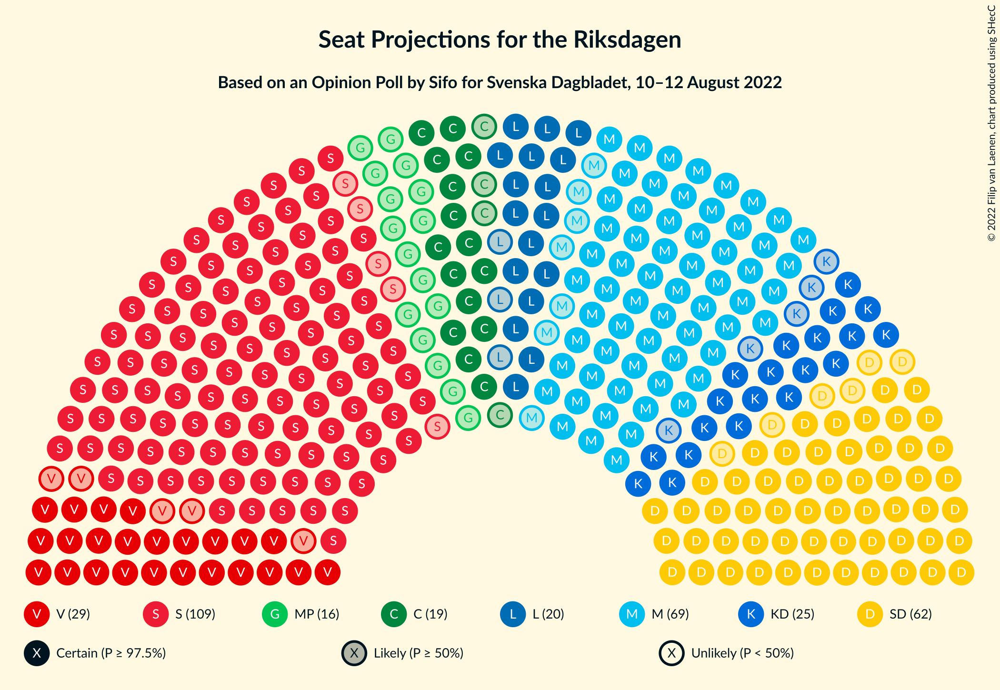

# Opinion Poll by Sifo for Svenska Dagbladet, 10–12 August 2022

<a href="#voting-intentions">Voting Intentions</a> | <a href="#seats">Seats</a> | <a href="#coalitions">Coalitions</a> | <a href="#technical-information">Technical Information</a>

## Voting Intentions

### Confidence Intervals

| Party | Last Result | Poll Result | 80% Confidence Interval | 90% Confidence Interval | 95% Confidence Interval | 99% Confidence Interval |
|:-----:|:-----------:|:-----------:|:-----------------------:|:-----------------------:|:-----------------------:|:-----------------------:|
| Sveriges socialdemokratiska arbetareparti | 28.3% | 31.1% | 29.8–32.5% |29.4–32.9% |29.1–33.2% |28.4–33.9% |
| Moderata samlingspartiet | 19.8% | 19.2% | 18.1–20.4% |17.7–20.7% |17.5–21.0% |16.9–21.6% |
| Sverigedemokraterna | 17.5% | 17.3% | 16.2–18.5% |15.9–18.8% |15.7–19.1% |15.2–19.6% |
| Vänsterpartiet | 8.0% | 8.0% | 7.3–8.9% |7.1–9.1% |6.9–9.3% |6.5–9.8% |
| Kristdemokraterna | 6.3% | 6.7% | 6.0–7.5% |5.8–7.7% |5.7–7.9% |5.4–8.3% |
| Liberalerna | 5.5% | 5.6% | 5.0–6.3% |4.8–6.5% |4.6–6.7% |4.3–7.1% |
| Centerpartiet | 8.6% | 5.3% | 4.7–6.0% |4.5–6.2% |4.4–6.4% |4.1–6.8% |
| Miljöpartiet de gröna | 4.4% | 4.5% | 3.9–5.2% |3.8–5.3% |3.6–5.5% |3.4–5.9% |

*Note:* The poll result column reflects the actual value used in the calculations. Published results may vary slightly, and in addition be rounded to fewer digits.

## Seats

### Confidence Intervals

| Party | Last Result | Median | 80% Confidence Interval | 90% Confidence Interval | 95% Confidence Interval | 99% Confidence Interval |
|:-----:|:-----------:|:------:|:-----------------------:|:-----------------------:|:-----------------------:|:-----------------------:|
| <a href="#sveriges-socialdemokratiska-arbetareparti">Sveriges socialdemokratiska arbetareparti</a> | 100 | 111 | 106–117 |104–119 |104–120 |101–123 |
| <a href="#moderata-samlingspartiet">Moderata samlingspartiet</a> | 70 | 69 | 64–74 |63–75 |62–76 |60–78 |
| <a href="#sverigedemokraterna">Sverigedemokraterna</a> | 62 | 62 | 58–66 |57–68 |56–69 |54–71 |
| <a href="#vänsterpartiet">Vänsterpartiet</a> | 28 | 29 | 26–32 |25–33 |24–34 |23–35 |
| <a href="#kristdemokraterna">Kristdemokraterna</a> | 22 | 25 | 21–27 |21–28 |20–29 |19–30 |
| <a href="#liberalerna">Liberalerna</a> | 20 | 20 | 18–23 |17–23 |17–24 |15–25 |
| <a href="#centerpartiet">Centerpartiet</a> | 31 | 19 | 17–22 |16–22 |15–23 |15–24 |
| <a href="#miljöpartiet-de-gröna">Miljöpartiet de gröna</a> | 16 | 16 | 0–18 |0–19 |0–20 |0–21 |

### Sveriges socialdemokratiska arbetareparti

*For a full overview of the results for this party, see the [Sveriges socialdemokratiska arbetareparti](party-sverigessocialdemokratiskaarbetareparti.html) page.*

| Number of Seats | Probability | Accumulated | Special Marks |
|:---------------:|:-----------:|:-----------:|:-------------:|
| 99 | 0.1% | 100% |  |
| 100 | 0.2% | 99.9% | Last Result |
| 101 | 0.3% | 99.7% |  |
| 102 | 0.6% | 99.4% |  |
| 103 | 1.1% | 98.9% |  |
| 104 | 3% | 98% |  |
| 105 | 2% | 95% |  |
| 106 | 6% | 93% |  |
| 107 | 7% | 88% |  |
| 108 | 6% | 81% |  |
| 109 | 10% | 75% |  |
| 110 | 8% | 65% |  |
| 111 | 10% | 58% | Median |
| 112 | 7% | 48% |  |
| 113 | 11% | 41% |  |
| 114 | 5% | 31% |  |
| 115 | 8% | 25% |  |
| 116 | 4% | 17% |  |
| 117 | 4% | 13% |  |
| 118 | 3% | 9% |  |
| 119 | 2% | 6% |  |
| 120 | 2% | 4% |  |
| 121 | 0.6% | 2% |  |
| 122 | 1.2% | 2% |  |
| 123 | 0.2% | 0.7% |  |
| 124 | 0.2% | 0.5% |  |
| 125 | 0.2% | 0.3% |  |
| 126 | 0.1% | 0.1% |  |
| 127 | 0% | 0.1% |  |
| 128 | 0% | 0% |  |

### Moderata samlingspartiet

*For a full overview of the results for this party, see the [Moderata samlingspartiet](party-moderatasamlingspartiet.html) page.*

| Number of Seats | Probability | Accumulated | Special Marks |
|:---------------:|:-----------:|:-----------:|:-------------:|
| 58 | 0.1% | 100% |  |
| 59 | 0.1% | 99.9% |  |
| 60 | 0.4% | 99.8% |  |
| 61 | 0.6% | 99.4% |  |
| 62 | 2% | 98.8% |  |
| 63 | 7% | 97% |  |
| 64 | 5% | 90% |  |
| 65 | 7% | 85% |  |
| 66 | 7% | 78% |  |
| 67 | 8% | 71% |  |
| 68 | 13% | 64% |  |
| 69 | 13% | 51% | Median |
| 70 | 10% | 38% | Last Result |
| 71 | 10% | 28% |  |
| 72 | 5% | 18% |  |
| 73 | 3% | 13% |  |
| 74 | 5% | 11% |  |
| 75 | 3% | 6% |  |
| 76 | 2% | 3% |  |
| 77 | 0.8% | 1.5% |  |
| 78 | 0.3% | 0.7% |  |
| 79 | 0.1% | 0.4% |  |
| 80 | 0.1% | 0.3% |  |
| 81 | 0.1% | 0.2% |  |
| 82 | 0% | 0% |  |

### Sverigedemokraterna

*For a full overview of the results for this party, see the [Sverigedemokraterna](party-sverigedemokraterna.html) page.*

| Number of Seats | Probability | Accumulated | Special Marks |
|:---------------:|:-----------:|:-----------:|:-------------:|
| 52 | 0.1% | 100% |  |
| 53 | 0.1% | 99.9% |  |
| 54 | 0.8% | 99.8% |  |
| 55 | 0.7% | 98.9% |  |
| 56 | 2% | 98% |  |
| 57 | 3% | 96% |  |
| 58 | 6% | 93% |  |
| 59 | 8% | 87% |  |
| 60 | 10% | 79% |  |
| 61 | 11% | 69% |  |
| 62 | 12% | 58% | Last Result, Median |
| 63 | 14% | 46% |  |
| 64 | 8% | 32% |  |
| 65 | 11% | 24% |  |
| 66 | 4% | 13% |  |
| 67 | 3% | 9% |  |
| 68 | 2% | 6% |  |
| 69 | 1.3% | 3% |  |
| 70 | 1.1% | 2% |  |
| 71 | 0.5% | 0.9% |  |
| 72 | 0.2% | 0.4% |  |
| 73 | 0.1% | 0.2% |  |
| 74 | 0.1% | 0.1% |  |
| 75 | 0% | 0% |  |

### Vänsterpartiet

*For a full overview of the results for this party, see the [Vänsterpartiet](party-vänsterpartiet.html) page.*

| Number of Seats | Probability | Accumulated | Special Marks |
|:---------------:|:-----------:|:-----------:|:-------------:|
| 22 | 0.2% | 100% |  |
| 23 | 0.6% | 99.8% |  |
| 24 | 2% | 99.2% |  |
| 25 | 4% | 97% |  |
| 26 | 13% | 93% |  |
| 27 | 11% | 80% |  |
| 28 | 11% | 69% | Last Result |
| 29 | 16% | 57% | Median |
| 30 | 15% | 41% |  |
| 31 | 13% | 27% |  |
| 32 | 7% | 13% |  |
| 33 | 4% | 7% |  |
| 34 | 2% | 3% |  |
| 35 | 0.5% | 0.9% |  |
| 36 | 0.3% | 0.4% |  |
| 37 | 0.1% | 0.1% |  |
| 38 | 0% | 0% |  |

### Kristdemokraterna

*For a full overview of the results for this party, see the [Kristdemokraterna](party-kristdemokraterna.html) page.*

| Number of Seats | Probability | Accumulated | Special Marks |
|:---------------:|:-----------:|:-----------:|:-------------:|
| 18 | 0.2% | 100% |  |
| 19 | 0.7% | 99.8% |  |
| 20 | 3% | 99.1% |  |
| 21 | 7% | 96% |  |
| 22 | 10% | 89% | Last Result |
| 23 | 15% | 79% |  |
| 24 | 13% | 64% |  |
| 25 | 24% | 51% | Median |
| 26 | 9% | 27% |  |
| 27 | 10% | 17% |  |
| 28 | 4% | 7% |  |
| 29 | 2% | 4% |  |
| 30 | 0.9% | 1.1% |  |
| 31 | 0.2% | 0.3% |  |
| 32 | 0% | 0.1% |  |
| 33 | 0% | 0% |  |

### Liberalerna

*For a full overview of the results for this party, see the [Liberalerna](party-liberalerna.html) page.*

| Number of Seats | Probability | Accumulated | Special Marks |
|:---------------:|:-----------:|:-----------:|:-------------:|
| 14 | 0% | 100% |  |
| 15 | 0.4% | 99.9% |  |
| 16 | 2% | 99.5% |  |
| 17 | 6% | 98% |  |
| 18 | 12% | 92% |  |
| 19 | 16% | 81% |  |
| 20 | 22% | 64% | Last Result, Median |
| 21 | 20% | 42% |  |
| 22 | 12% | 23% |  |
| 23 | 6% | 11% |  |
| 24 | 3% | 5% |  |
| 25 | 1.0% | 1.5% |  |
| 26 | 0.3% | 0.4% |  |
| 27 | 0.1% | 0.1% |  |
| 28 | 0% | 0% |  |

### Centerpartiet

*For a full overview of the results for this party, see the [Centerpartiet](party-centerpartiet.html) page.*

| Number of Seats | Probability | Accumulated | Special Marks |
|:---------------:|:-----------:|:-----------:|:-------------:|
| 0 | 0.3% | 100% |  |
| 1 | 0% | 99.7% |  |
| 2 | 0% | 99.7% |  |
| 3 | 0% | 99.7% |  |
| 4 | 0% | 99.7% |  |
| 5 | 0% | 99.7% |  |
| 6 | 0% | 99.7% |  |
| 7 | 0% | 99.7% |  |
| 8 | 0% | 99.7% |  |
| 9 | 0% | 99.7% |  |
| 10 | 0% | 99.7% |  |
| 11 | 0% | 99.7% |  |
| 12 | 0% | 99.7% |  |
| 13 | 0% | 99.7% |  |
| 14 | 0.1% | 99.7% |  |
| 15 | 2% | 99.6% |  |
| 16 | 5% | 97% |  |
| 17 | 11% | 92% |  |
| 18 | 18% | 81% |  |
| 19 | 21% | 63% | Median |
| 20 | 18% | 42% |  |
| 21 | 14% | 25% |  |
| 22 | 6% | 11% |  |
| 23 | 2% | 4% |  |
| 24 | 1.3% | 2% |  |
| 25 | 0.3% | 0.5% |  |
| 26 | 0.1% | 0.1% |  |
| 27 | 0% | 0% |  |
| 28 | 0% | 0% |  |
| 29 | 0% | 0% |  |
| 30 | 0% | 0% |  |
| 31 | 0% | 0% | Last Result |

### Miljöpartiet de gröna

*For a full overview of the results for this party, see the [Miljöpartiet de gröna](party-miljöpartietdegröna.html) page.*

| Number of Seats | Probability | Accumulated | Special Marks |
|:---------------:|:-----------:|:-----------:|:-------------:|
| 0 | 14% | 100% |  |
| 1 | 0% | 86% |  |
| 2 | 0% | 86% |  |
| 3 | 0% | 86% |  |
| 4 | 0% | 86% |  |
| 5 | 0% | 86% |  |
| 6 | 0% | 86% |  |
| 7 | 0% | 86% |  |
| 8 | 0% | 86% |  |
| 9 | 0% | 86% |  |
| 10 | 0% | 86% |  |
| 11 | 0% | 86% |  |
| 12 | 0% | 86% |  |
| 13 | 0% | 86% |  |
| 14 | 3% | 86% |  |
| 15 | 17% | 83% |  |
| 16 | 25% | 67% | Last Result, Median |
| 17 | 20% | 42% |  |
| 18 | 15% | 22% |  |
| 19 | 4% | 7% |  |
| 20 | 2% | 3% |  |
| 21 | 0.8% | 1.0% |  |
| 22 | 0.2% | 0.2% |  |
| 23 | 0% | 0% |  |

## Coalitions

### Confidence Intervals

| Coalition | Last Result | Median | Majority? | 80% Confidence Interval | 90% Confidence Interval | 95% Confidence Interval | 99% Confidence Interval |
|:---------:|:-----------:|:------:|:---------:|:-----------------------:|:-----------------------:|:-----------------------:|:-----------------------:|
| Sveriges socialdemokratiska arbetareparti – Moderata samlingspartiet – Centerpartiet | 201 | 198 | 100% | 193–207 | 192–210 | 190–212 | 187–215 |
| Sveriges socialdemokratiska arbetareparti – Vänsterpartiet – Liberalerna – Centerpartiet – Miljöpartiet de gröna | 195 | 195 | 100% | 188–200 | 186–202 | 183–203 | 180–205 |
| Sveriges socialdemokratiska arbetareparti – Moderata samlingspartiet | 170 | 179 | 88% | 174–188 | 172–190 | 171–192 | 169–196 |
| Sveriges socialdemokratiska arbetareparti – Liberalerna – Centerpartiet – Miljöpartiet de gröna | 167 | 165 | 2% | 158–171 | 156–172 | 154–174 | 149–177 |
| Moderata samlingspartiet – Sverigedemokraterna – Kristdemokraterna | 154 | 154 | 0% | 149–161 | 147–163 | 146–166 | 144–169 |
| Sveriges socialdemokratiska arbetareparti – Vänsterpartiet – Miljöpartiet de gröna | 144 | 155 | 0% | 147–161 | 144–162 | 143–164 | 139–166 |
| Sveriges socialdemokratiska arbetareparti – Vänsterpartiet | 128 | 140 | 0% | 134–147 | 133–149 | 132–150 | 130–154 |
| Moderata samlingspartiet – Kristdemokraterna – Liberalerna – Centerpartiet | 143 | 132 | 0% | 127–139 | 125–141 | 124–142 | 121–145 |
| Moderata samlingspartiet – Sverigedemokraterna | 132 | 131 | 0% | 125–137 | 124–139 | 123–140 | 120–144 |
| Sveriges socialdemokratiska arbetareparti – Miljöpartiet de gröna | 116 | 126 | 0% | 118–132 | 115–134 | 113–135 | 109–137 |
| Moderata samlingspartiet – Kristdemokraterna – Centerpartiet | 123 | 112 | 0% | 107–118 | 105–120 | 104–122 | 101–124 |
| Moderata samlingspartiet – Liberalerna – Centerpartiet | 121 | 108 | 0% | 102–114 | 101–116 | 100–117 | 97–120 |
| Moderata samlingspartiet – Centerpartiet | 101 | 88 | 0% | 82–93 | 82–95 | 80–96 | 78–99 |

### Sveriges socialdemokratiska arbetareparti – Moderata samlingspartiet – Centerpartiet

| Number of Seats | Probability | Accumulated | Special Marks |
|:---------------:|:-----------:|:-----------:|:-------------:|
| 184 | 0% | 100% |  |
| 185 | 0.1% | 99.9% |  |
| 186 | 0.1% | 99.9% |  |
| 187 | 0.4% | 99.8% |  |
| 188 | 0.4% | 99.4% |  |
| 189 | 1.1% | 99.0% |  |
| 190 | 0.8% | 98% |  |
| 191 | 2% | 97% |  |
| 192 | 2% | 95% |  |
| 193 | 4% | 93% |  |
| 194 | 8% | 89% |  |
| 195 | 5% | 81% |  |
| 196 | 10% | 76% |  |
| 197 | 9% | 66% |  |
| 198 | 9% | 57% |  |
| 199 | 9% | 48% | Median |
| 200 | 7% | 40% |  |
| 201 | 6% | 33% | Last Result |
| 202 | 6% | 27% |  |
| 203 | 2% | 22% |  |
| 204 | 4% | 19% |  |
| 205 | 2% | 16% |  |
| 206 | 2% | 13% |  |
| 207 | 1.1% | 11% |  |
| 208 | 2% | 10% |  |
| 209 | 1.3% | 8% |  |
| 210 | 2% | 7% |  |
| 211 | 0.9% | 5% |  |
| 212 | 1.2% | 4% |  |
| 213 | 1.2% | 2% |  |
| 214 | 0.5% | 1.3% |  |
| 215 | 0.5% | 0.8% |  |
| 216 | 0.1% | 0.3% |  |
| 217 | 0.1% | 0.2% |  |
| 218 | 0.1% | 0.1% |  |
| 219 | 0% | 0% |  |

### Sveriges socialdemokratiska arbetareparti – Vänsterpartiet – Liberalerna – Centerpartiet – Miljöpartiet de gröna

| Number of Seats | Probability | Accumulated | Special Marks |
|:---------------:|:-----------:|:-----------:|:-------------:|
| 176 | 0.1% | 100% |  |
| 177 | 0% | 99.9% |  |
| 178 | 0% | 99.9% |  |
| 179 | 0.2% | 99.8% |  |
| 180 | 0.3% | 99.7% |  |
| 181 | 0.5% | 99.3% |  |
| 182 | 0.8% | 98.8% |  |
| 183 | 1.4% | 98% |  |
| 184 | 0.4% | 97% |  |
| 185 | 1.1% | 96% |  |
| 186 | 1.0% | 95% |  |
| 187 | 2% | 94% |  |
| 188 | 5% | 92% |  |
| 189 | 7% | 87% |  |
| 190 | 7% | 80% |  |
| 191 | 5% | 73% |  |
| 192 | 4% | 68% |  |
| 193 | 5% | 65% |  |
| 194 | 7% | 60% |  |
| 195 | 12% | 53% | Last Result, Median |
| 196 | 11% | 41% |  |
| 197 | 8% | 30% |  |
| 198 | 4% | 22% |  |
| 199 | 8% | 18% |  |
| 200 | 3% | 11% |  |
| 201 | 2% | 8% |  |
| 202 | 3% | 6% |  |
| 203 | 2% | 3% |  |
| 204 | 0.5% | 1.2% |  |
| 205 | 0.4% | 0.6% |  |
| 206 | 0.1% | 0.2% |  |
| 207 | 0% | 0.1% |  |
| 208 | 0% | 0.1% |  |
| 209 | 0% | 0% |  |

### Sveriges socialdemokratiska arbetareparti – Moderata samlingspartiet

| Number of Seats | Probability | Accumulated | Special Marks |
|:---------------:|:-----------:|:-----------:|:-------------:|
| 166 | 0% | 100% |  |
| 167 | 0.2% | 99.9% |  |
| 168 | 0.1% | 99.7% |  |
| 169 | 0.4% | 99.6% |  |
| 170 | 0.6% | 99.2% | Last Result |
| 171 | 1.3% | 98.6% |  |
| 172 | 2% | 97% |  |
| 173 | 1.4% | 95% |  |
| 174 | 5% | 93% |  |
| 175 | 7% | 88% | Majority |
| 176 | 6% | 82% |  |
| 177 | 8% | 75% |  |
| 178 | 12% | 68% |  |
| 179 | 8% | 55% |  |
| 180 | 7% | 48% | Median |
| 181 | 8% | 41% |  |
| 182 | 5% | 33% |  |
| 183 | 6% | 28% |  |
| 184 | 4% | 22% |  |
| 185 | 3% | 18% |  |
| 186 | 3% | 15% |  |
| 187 | 2% | 12% |  |
| 188 | 2% | 10% |  |
| 189 | 3% | 8% |  |
| 190 | 1.1% | 6% |  |
| 191 | 0.7% | 5% |  |
| 192 | 2% | 4% |  |
| 193 | 0.5% | 2% |  |
| 194 | 0.4% | 1.4% |  |
| 195 | 0.3% | 0.9% |  |
| 196 | 0.4% | 0.7% |  |
| 197 | 0.1% | 0.3% |  |
| 198 | 0.1% | 0.2% |  |
| 199 | 0.1% | 0.1% |  |
| 200 | 0% | 0.1% |  |
| 201 | 0% | 0% |  |

### Sveriges socialdemokratiska arbetareparti – Liberalerna – Centerpartiet – Miljöpartiet de gröna

| Number of Seats | Probability | Accumulated | Special Marks |
|:---------------:|:-----------:|:-----------:|:-------------:|
| 146 | 0% | 100% |  |
| 147 | 0% | 99.9% |  |
| 148 | 0.1% | 99.9% |  |
| 149 | 0.3% | 99.8% |  |
| 150 | 0.3% | 99.4% |  |
| 151 | 0.3% | 99.2% |  |
| 152 | 0.6% | 98.9% |  |
| 153 | 0.5% | 98% |  |
| 154 | 0.6% | 98% |  |
| 155 | 1.4% | 97% |  |
| 156 | 4% | 96% |  |
| 157 | 1.2% | 92% |  |
| 158 | 1.0% | 91% |  |
| 159 | 3% | 90% |  |
| 160 | 4% | 87% |  |
| 161 | 4% | 83% |  |
| 162 | 4% | 79% |  |
| 163 | 10% | 75% |  |
| 164 | 13% | 66% |  |
| 165 | 7% | 52% |  |
| 166 | 8% | 46% | Median |
| 167 | 4% | 38% | Last Result |
| 168 | 4% | 34% |  |
| 169 | 4% | 30% |  |
| 170 | 12% | 26% |  |
| 171 | 7% | 13% |  |
| 172 | 1.4% | 6% |  |
| 173 | 1.3% | 5% |  |
| 174 | 1.5% | 3% |  |
| 175 | 0.8% | 2% | Majority |
| 176 | 0.6% | 1.1% |  |
| 177 | 0.4% | 0.6% |  |
| 178 | 0.1% | 0.1% |  |
| 179 | 0% | 0.1% |  |
| 180 | 0% | 0.1% |  |
| 181 | 0% | 0% |  |

### Moderata samlingspartiet – Sverigedemokraterna – Kristdemokraterna

| Number of Seats | Probability | Accumulated | Special Marks |
|:---------------:|:-----------:|:-----------:|:-------------:|
| 141 | 0% | 100% |  |
| 142 | 0% | 99.9% |  |
| 143 | 0.1% | 99.9% |  |
| 144 | 0.4% | 99.8% |  |
| 145 | 0.5% | 99.4% |  |
| 146 | 2% | 98.8% |  |
| 147 | 3% | 97% |  |
| 148 | 2% | 94% |  |
| 149 | 3% | 92% |  |
| 150 | 8% | 89% |  |
| 151 | 4% | 82% |  |
| 152 | 8% | 78% |  |
| 153 | 11% | 70% |  |
| 154 | 12% | 59% | Last Result |
| 155 | 7% | 47% |  |
| 156 | 5% | 40% | Median |
| 157 | 4% | 35% |  |
| 158 | 5% | 32% |  |
| 159 | 7% | 27% |  |
| 160 | 7% | 20% |  |
| 161 | 5% | 13% |  |
| 162 | 2% | 8% |  |
| 163 | 1.0% | 6% |  |
| 164 | 1.1% | 5% |  |
| 165 | 0.4% | 4% |  |
| 166 | 1.4% | 3% |  |
| 167 | 0.8% | 2% |  |
| 168 | 0.5% | 1.2% |  |
| 169 | 0.3% | 0.7% |  |
| 170 | 0.2% | 0.3% |  |
| 171 | 0% | 0.2% |  |
| 172 | 0% | 0.1% |  |
| 173 | 0.1% | 0.1% |  |
| 174 | 0% | 0% |  |

### Sveriges socialdemokratiska arbetareparti – Vänsterpartiet – Miljöpartiet de gröna

| Number of Seats | Probability | Accumulated | Special Marks |
|:---------------:|:-----------:|:-----------:|:-------------:|
| 136 | 0.1% | 100% |  |
| 137 | 0.1% | 99.9% |  |
| 138 | 0.1% | 99.8% |  |
| 139 | 0.4% | 99.7% |  |
| 140 | 0.3% | 99.3% |  |
| 141 | 0.4% | 99.1% |  |
| 142 | 0.8% | 98.6% |  |
| 143 | 1.5% | 98% |  |
| 144 | 1.4% | 96% | Last Result |
| 145 | 1.1% | 95% |  |
| 146 | 2% | 94% |  |
| 147 | 3% | 92% |  |
| 148 | 2% | 89% |  |
| 149 | 4% | 87% |  |
| 150 | 5% | 84% |  |
| 151 | 3% | 79% |  |
| 152 | 8% | 75% |  |
| 153 | 4% | 67% |  |
| 154 | 5% | 63% |  |
| 155 | 11% | 59% |  |
| 156 | 5% | 48% | Median |
| 157 | 12% | 43% |  |
| 158 | 6% | 31% |  |
| 159 | 7% | 24% |  |
| 160 | 6% | 17% |  |
| 161 | 3% | 11% |  |
| 162 | 4% | 8% |  |
| 163 | 1.0% | 4% |  |
| 164 | 2% | 3% |  |
| 165 | 0.6% | 1.3% |  |
| 166 | 0.4% | 0.7% |  |
| 167 | 0.2% | 0.4% |  |
| 168 | 0.1% | 0.2% |  |
| 169 | 0.1% | 0.1% |  |
| 170 | 0% | 0.1% |  |
| 171 | 0% | 0% |  |

### Sveriges socialdemokratiska arbetareparti – Vänsterpartiet

| Number of Seats | Probability | Accumulated | Special Marks |
|:---------------:|:-----------:|:-----------:|:-------------:|
| 127 | 0% | 100% |  |
| 128 | 0.2% | 99.9% | Last Result |
| 129 | 0.2% | 99.7% |  |
| 130 | 0.7% | 99.5% |  |
| 131 | 0.7% | 98.9% |  |
| 132 | 2% | 98% |  |
| 133 | 2% | 96% |  |
| 134 | 4% | 94% |  |
| 135 | 5% | 90% |  |
| 136 | 5% | 85% |  |
| 137 | 8% | 80% |  |
| 138 | 7% | 72% |  |
| 139 | 8% | 65% |  |
| 140 | 10% | 57% | Median |
| 141 | 9% | 47% |  |
| 142 | 7% | 38% |  |
| 143 | 6% | 31% |  |
| 144 | 7% | 25% |  |
| 145 | 3% | 18% |  |
| 146 | 4% | 15% |  |
| 147 | 4% | 11% |  |
| 148 | 2% | 7% |  |
| 149 | 2% | 5% |  |
| 150 | 0.8% | 3% |  |
| 151 | 0.8% | 2% |  |
| 152 | 0.5% | 1.2% |  |
| 153 | 0.2% | 0.7% |  |
| 154 | 0.2% | 0.5% |  |
| 155 | 0.1% | 0.3% |  |
| 156 | 0.1% | 0.2% |  |
| 157 | 0.1% | 0.1% |  |
| 158 | 0% | 0.1% |  |
| 159 | 0% | 0% |  |

### Moderata samlingspartiet – Kristdemokraterna – Liberalerna – Centerpartiet

| Number of Seats | Probability | Accumulated | Special Marks |
|:---------------:|:-----------:|:-----------:|:-------------:|
| 115 | 0% | 100% |  |
| 116 | 0% | 99.9% |  |
| 117 | 0% | 99.9% |  |
| 118 | 0% | 99.9% |  |
| 119 | 0.1% | 99.9% |  |
| 120 | 0.2% | 99.8% |  |
| 121 | 0.3% | 99.6% |  |
| 122 | 0.7% | 99.3% |  |
| 123 | 0.7% | 98.6% |  |
| 124 | 2% | 98% |  |
| 125 | 3% | 96% |  |
| 126 | 3% | 93% |  |
| 127 | 7% | 91% |  |
| 128 | 4% | 84% |  |
| 129 | 11% | 80% |  |
| 130 | 5% | 69% |  |
| 131 | 10% | 64% |  |
| 132 | 11% | 54% |  |
| 133 | 6% | 42% | Median |
| 134 | 8% | 36% |  |
| 135 | 7% | 29% |  |
| 136 | 4% | 22% |  |
| 137 | 5% | 18% |  |
| 138 | 3% | 13% |  |
| 139 | 3% | 10% |  |
| 140 | 3% | 8% |  |
| 141 | 1.4% | 5% |  |
| 142 | 2% | 4% |  |
| 143 | 1.1% | 2% | Last Result |
| 144 | 0.4% | 1.1% |  |
| 145 | 0.2% | 0.7% |  |
| 146 | 0.2% | 0.4% |  |
| 147 | 0.1% | 0.2% |  |
| 148 | 0.1% | 0.1% |  |
| 149 | 0% | 0% |  |

### Moderata samlingspartiet – Sverigedemokraterna

| Number of Seats | Probability | Accumulated | Special Marks |
|:---------------:|:-----------:|:-----------:|:-------------:|
| 117 | 0% | 100% |  |
| 118 | 0.1% | 99.9% |  |
| 119 | 0.2% | 99.8% |  |
| 120 | 0.4% | 99.6% |  |
| 121 | 0.4% | 99.2% |  |
| 122 | 0.6% | 98.8% |  |
| 123 | 2% | 98% |  |
| 124 | 3% | 96% |  |
| 125 | 8% | 94% |  |
| 126 | 7% | 85% |  |
| 127 | 7% | 78% |  |
| 128 | 6% | 71% |  |
| 129 | 4% | 65% |  |
| 130 | 8% | 61% |  |
| 131 | 9% | 52% | Median |
| 132 | 10% | 44% | Last Result |
| 133 | 7% | 34% |  |
| 134 | 7% | 27% |  |
| 135 | 5% | 20% |  |
| 136 | 4% | 15% |  |
| 137 | 3% | 11% |  |
| 138 | 2% | 8% |  |
| 139 | 2% | 5% |  |
| 140 | 0.8% | 3% |  |
| 141 | 0.9% | 2% |  |
| 142 | 0.4% | 2% |  |
| 143 | 0.5% | 1.1% |  |
| 144 | 0.2% | 0.6% |  |
| 145 | 0.2% | 0.4% |  |
| 146 | 0.1% | 0.2% |  |
| 147 | 0% | 0.1% |  |
| 148 | 0% | 0% |  |

### Sveriges socialdemokratiska arbetareparti – Miljöpartiet de gröna

| Number of Seats | Probability | Accumulated | Special Marks |
|:---------------:|:-----------:|:-----------:|:-------------:|
| 106 | 0.1% | 100% |  |
| 107 | 0.1% | 99.8% |  |
| 108 | 0.1% | 99.8% |  |
| 109 | 0.2% | 99.6% |  |
| 110 | 0.5% | 99.5% |  |
| 111 | 0.4% | 99.0% |  |
| 112 | 1.0% | 98.6% |  |
| 113 | 0.9% | 98% |  |
| 114 | 0.8% | 97% |  |
| 115 | 2% | 96% |  |
| 116 | 1.0% | 94% | Last Result |
| 117 | 2% | 93% |  |
| 118 | 2% | 91% |  |
| 119 | 2% | 89% |  |
| 120 | 2% | 87% |  |
| 121 | 3% | 84% |  |
| 122 | 5% | 81% |  |
| 123 | 4% | 76% |  |
| 124 | 8% | 72% |  |
| 125 | 6% | 64% |  |
| 126 | 11% | 58% |  |
| 127 | 7% | 47% | Median |
| 128 | 5% | 41% |  |
| 129 | 11% | 36% |  |
| 130 | 5% | 25% |  |
| 131 | 8% | 20% |  |
| 132 | 4% | 12% |  |
| 133 | 2% | 8% |  |
| 134 | 3% | 6% |  |
| 135 | 1.2% | 3% |  |
| 136 | 0.9% | 2% |  |
| 137 | 0.4% | 0.9% |  |
| 138 | 0.3% | 0.5% |  |
| 139 | 0.1% | 0.2% |  |
| 140 | 0.1% | 0.1% |  |
| 141 | 0% | 0% |  |

### Moderata samlingspartiet – Kristdemokraterna – Centerpartiet

| Number of Seats | Probability | Accumulated | Special Marks |
|:---------------:|:-----------:|:-----------:|:-------------:|
| 95 | 0% | 100% |  |
| 96 | 0% | 99.9% |  |
| 97 | 0% | 99.9% |  |
| 98 | 0.1% | 99.9% |  |
| 99 | 0.1% | 99.8% |  |
| 100 | 0.1% | 99.8% |  |
| 101 | 0.2% | 99.7% |  |
| 102 | 0.5% | 99.5% |  |
| 103 | 1.0% | 98.9% |  |
| 104 | 1.5% | 98% |  |
| 105 | 2% | 96% |  |
| 106 | 4% | 95% |  |
| 107 | 5% | 90% |  |
| 108 | 6% | 85% |  |
| 109 | 10% | 79% |  |
| 110 | 9% | 69% |  |
| 111 | 9% | 61% |  |
| 112 | 6% | 52% |  |
| 113 | 12% | 46% | Median |
| 114 | 8% | 34% |  |
| 115 | 6% | 26% |  |
| 116 | 4% | 20% |  |
| 117 | 4% | 16% |  |
| 118 | 3% | 12% |  |
| 119 | 3% | 9% |  |
| 120 | 3% | 6% |  |
| 121 | 0.9% | 3% |  |
| 122 | 1.3% | 3% |  |
| 123 | 0.6% | 1.2% | Last Result |
| 124 | 0.2% | 0.6% |  |
| 125 | 0.2% | 0.4% |  |
| 126 | 0.1% | 0.2% |  |
| 127 | 0% | 0.1% |  |
| 128 | 0% | 0% |  |

### Moderata samlingspartiet – Liberalerna – Centerpartiet

| Number of Seats | Probability | Accumulated | Special Marks |
|:---------------:|:-----------:|:-----------:|:-------------:|
| 90 | 0% | 100% |  |
| 91 | 0% | 99.9% |  |
| 92 | 0% | 99.9% |  |
| 93 | 0.1% | 99.9% |  |
| 94 | 0% | 99.8% |  |
| 95 | 0.1% | 99.8% |  |
| 96 | 0.2% | 99.7% |  |
| 97 | 0.2% | 99.6% |  |
| 98 | 0.4% | 99.3% |  |
| 99 | 1.0% | 98.9% |  |
| 100 | 2% | 98% |  |
| 101 | 3% | 96% |  |
| 102 | 6% | 93% |  |
| 103 | 4% | 87% |  |
| 104 | 8% | 83% |  |
| 105 | 6% | 76% |  |
| 106 | 7% | 70% |  |
| 107 | 12% | 63% |  |
| 108 | 10% | 51% | Median |
| 109 | 7% | 41% |  |
| 110 | 9% | 34% |  |
| 111 | 5% | 25% |  |
| 112 | 5% | 21% |  |
| 113 | 3% | 15% |  |
| 114 | 3% | 12% |  |
| 115 | 3% | 9% |  |
| 116 | 2% | 5% |  |
| 117 | 1.2% | 3% |  |
| 118 | 1.2% | 2% |  |
| 119 | 0.5% | 1.0% |  |
| 120 | 0.2% | 0.6% |  |
| 121 | 0.2% | 0.4% | Last Result |
| 122 | 0.1% | 0.2% |  |
| 123 | 0.1% | 0.1% |  |
| 124 | 0% | 0% |  |

### Moderata samlingspartiet – Centerpartiet

| Number of Seats | Probability | Accumulated | Special Marks |
|:---------------:|:-----------:|:-----------:|:-------------:|
| 70 | 0% | 100% |  |
| 71 | 0% | 99.9% |  |
| 72 | 0% | 99.9% |  |
| 73 | 0.1% | 99.9% |  |
| 74 | 0% | 99.8% |  |
| 75 | 0% | 99.8% |  |
| 76 | 0.1% | 99.7% |  |
| 77 | 0.1% | 99.6% |  |
| 78 | 0.3% | 99.5% |  |
| 79 | 0.6% | 99.2% |  |
| 80 | 1.2% | 98.6% |  |
| 81 | 2% | 97% |  |
| 82 | 7% | 95% |  |
| 83 | 8% | 88% |  |
| 84 | 6% | 80% |  |
| 85 | 5% | 75% |  |
| 86 | 4% | 70% |  |
| 87 | 14% | 66% |  |
| 88 | 14% | 53% | Median |
| 89 | 8% | 38% |  |
| 90 | 7% | 30% |  |
| 91 | 6% | 23% |  |
| 92 | 4% | 16% |  |
| 93 | 3% | 12% |  |
| 94 | 2% | 10% |  |
| 95 | 4% | 8% |  |
| 96 | 2% | 4% |  |
| 97 | 0.9% | 2% |  |
| 98 | 0.3% | 0.8% |  |
| 99 | 0.2% | 0.5% |  |
| 100 | 0.1% | 0.4% |  |
| 101 | 0.2% | 0.2% | Last Result |
| 102 | 0% | 0.1% |  |
| 103 | 0% | 0% |  |

## Technical Information

### Opinion Poll

+ **Polling firm:** Sifo
+ **Commissioner(s):** Svenska Dagbladet
+ **Fieldwork period:** 10–12 August 2022

### Calculations

+ **Sample size:** 1919
+ **Simulations done:** 1,048,576
+ **Error estimate:** 1.72%

