# Opinion Poll by Sifo for Svenska Dagbladet, 11–13 August 2022

<a href="#voting-intentions">Voting Intentions</a> | <a href="#seats">Seats</a> | <a href="#coalitions">Coalitions</a> | <a href="#technical-information">Technical Information</a>

## Voting Intentions

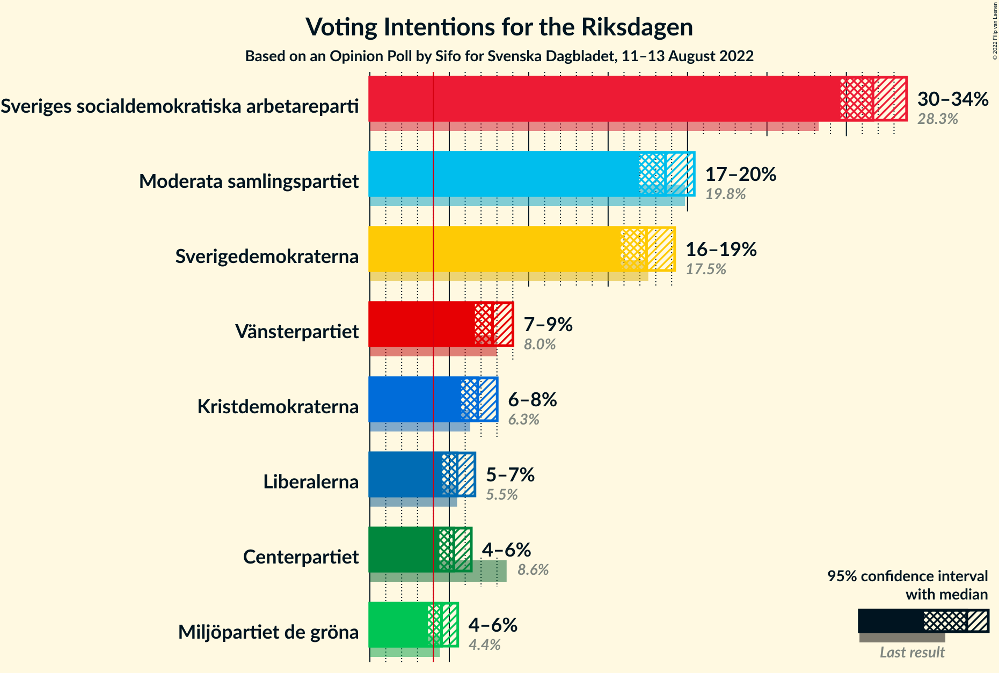

### Confidence Intervals

| Party | Last Result | Poll Result | 80% Confidence Interval | 90% Confidence Interval | 95% Confidence Interval | 99% Confidence Interval |
|:-----:|:-----------:|:-----------:|:-----------------------:|:-----------------------:|:-----------------------:|:-----------------------:|
| Sveriges socialdemokratiska arbetareparti | 28.3% | 31.7% | 30.3–33.1% |29.9–33.5% |29.6–33.8% |29.0–34.5% |
| Moderata samlingspartiet | 19.8% | 18.6% | 17.5–19.8% |17.2–20.1% |16.9–20.4% |16.4–21.0% |
| Sverigedemokraterna | 17.5% | 17.4% | 16.3–18.6% |16.0–18.9% |15.8–19.2% |15.3–19.8% |
| Vänsterpartiet | 8.0% | 7.7% | 7.0–8.6% |6.8–8.8% |6.6–9.0% |6.3–9.4% |
| Kristdemokraterna | 6.3% | 6.8% | 6.1–7.6% |5.9–7.8% |5.7–8.0% |5.4–8.4% |
| Liberalerna | 5.5% | 5.5% | 4.9–6.2% |4.7–6.4% |4.6–6.6% |4.3–7.0% |
| Centerpartiet | 8.6% | 5.3% | 4.7–6.0% |4.5–6.2% |4.4–6.4% |4.1–6.7% |
| Miljöpartiet de gröna | 4.4% | 4.5% | 3.9–5.2% |3.8–5.4% |3.7–5.5% |3.4–5.9% |

*Note:* The poll result column reflects the actual value used in the calculations. Published results may vary slightly, and in addition be rounded to fewer digits.

## Seats

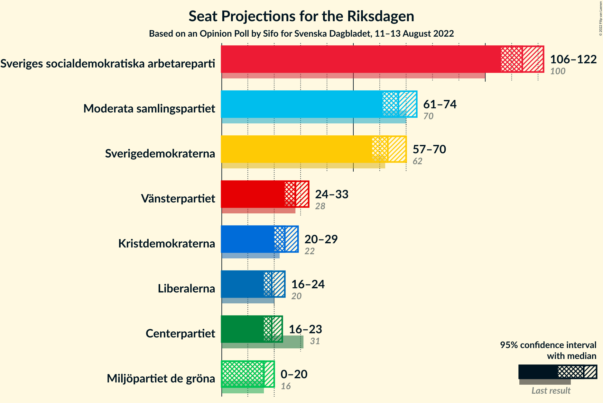

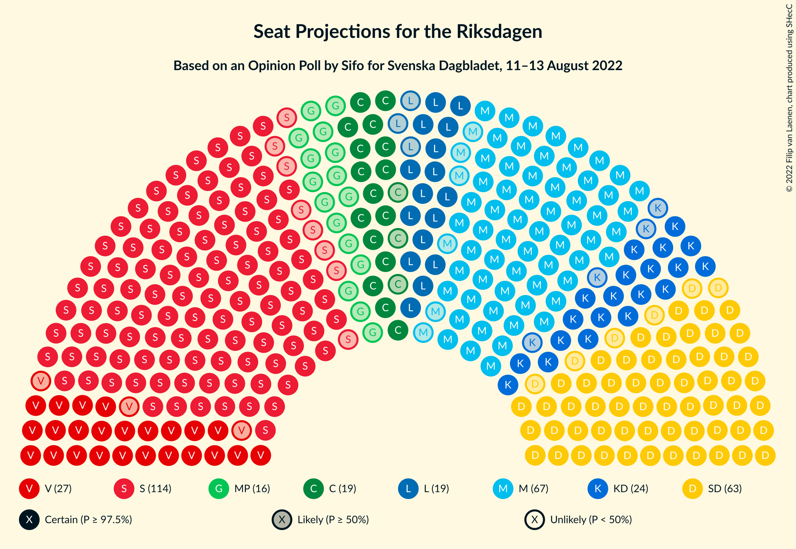

### Confidence Intervals

| Party | Last Result | Median | 80% Confidence Interval | 90% Confidence Interval | 95% Confidence Interval | 99% Confidence Interval |
|:-----:|:-----------:|:------:|:-----------------------:|:-----------------------:|:-----------------------:|:-----------------------:|
| <a href="#sveriges-socialdemokratiska-arbetareparti">Sveriges socialdemokratiska arbetareparti</a> | 100 | 114 | 109–120 |107–121 |106–122 |104–125 |
| <a href="#moderata-samlingspartiet">Moderata samlingspartiet</a> | 70 | 67 | 63–71 |62–73 |61–74 |59–77 |
| <a href="#sverigedemokraterna">Sverigedemokraterna</a> | 62 | 63 | 58–67 |58–68 |57–70 |55–72 |
| <a href="#vänsterpartiet">Vänsterpartiet</a> | 28 | 28 | 25–31 |24–32 |24–33 |22–34 |
| <a href="#kristdemokraterna">Kristdemokraterna</a> | 22 | 24 | 22–27 |21–28 |20–29 |19–30 |
| <a href="#liberalerna">Liberalerna</a> | 20 | 19 | 17–22 |17–23 |16–24 |15–25 |
| <a href="#centerpartiet">Centerpartiet</a> | 31 | 19 | 17–21 |16–22 |16–23 |15–24 |
| <a href="#miljöpartiet-de-gröna">Miljöpartiet de gröna</a> | 16 | 16 | 0–18 |0–19 |0–20 |0–21 |

### Sveriges socialdemokratiska arbetareparti

*For a full overview of the results for this party, see the [Sveriges socialdemokratiska arbetareparti](party-sverigessocialdemokratiskaarbetareparti.html) page.*

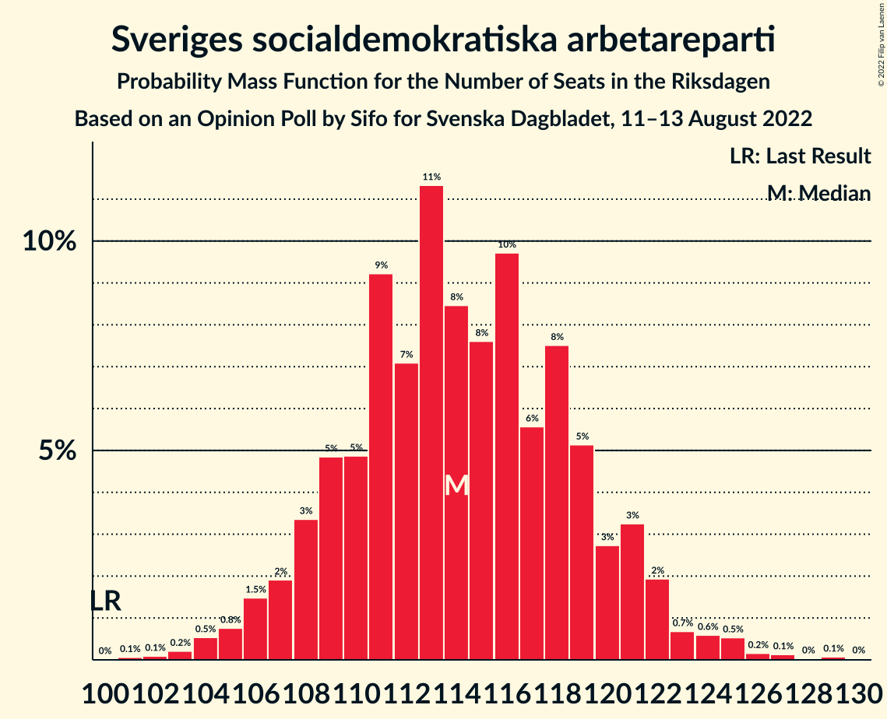

| Number of Seats | Probability | Accumulated | Special Marks |
|:---------------:|:-----------:|:-----------:|:-------------:|
| 100 | 0% | 100% | Last Result |
| 101 | 0.1% | 100% |  |
| 102 | 0.1% | 99.9% |  |
| 103 | 0.2% | 99.8% |  |
| 104 | 0.5% | 99.6% |  |
| 105 | 0.8% | 99.1% |  |
| 106 | 1.5% | 98% |  |
| 107 | 2% | 97% |  |
| 108 | 3% | 95% |  |
| 109 | 5% | 92% |  |
| 110 | 5% | 87% |  |
| 111 | 9% | 82% |  |
| 112 | 7% | 73% |  |
| 113 | 11% | 66% |  |
| 114 | 8% | 54% | Median |
| 115 | 8% | 46% |  |
| 116 | 10% | 38% |  |
| 117 | 6% | 28% |  |
| 118 | 8% | 23% |  |
| 119 | 5% | 15% |  |
| 120 | 3% | 10% |  |
| 121 | 3% | 7% |  |
| 122 | 2% | 4% |  |
| 123 | 0.7% | 2% |  |
| 124 | 0.6% | 2% |  |
| 125 | 0.5% | 1.0% |  |
| 126 | 0.2% | 0.4% |  |
| 127 | 0.1% | 0.3% |  |
| 128 | 0% | 0.1% |  |
| 129 | 0.1% | 0.1% |  |
| 130 | 0% | 0% |  |

### Moderata samlingspartiet

*For a full overview of the results for this party, see the [Moderata samlingspartiet](party-moderatasamlingspartiet.html) page.*

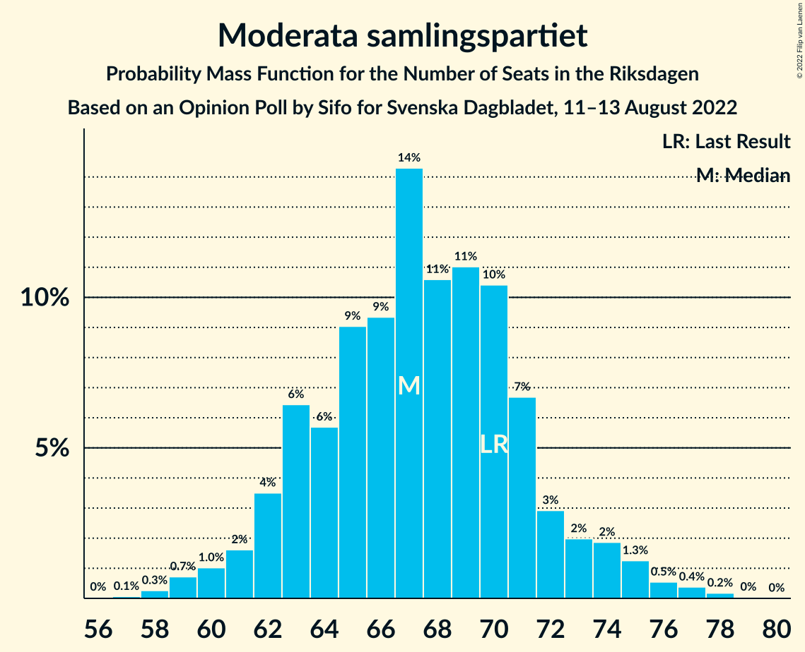

| Number of Seats | Probability | Accumulated | Special Marks |
|:---------------:|:-----------:|:-----------:|:-------------:|
| 56 | 0% | 100% |  |
| 57 | 0.1% | 99.9% |  |
| 58 | 0.3% | 99.9% |  |
| 59 | 0.7% | 99.6% |  |
| 60 | 1.0% | 98.9% |  |
| 61 | 2% | 98% |  |
| 62 | 4% | 96% |  |
| 63 | 6% | 93% |  |
| 64 | 6% | 86% |  |
| 65 | 9% | 81% |  |
| 66 | 9% | 72% |  |
| 67 | 14% | 62% | Median |
| 68 | 11% | 48% |  |
| 69 | 11% | 37% |  |
| 70 | 10% | 26% | Last Result |
| 71 | 7% | 16% |  |
| 72 | 3% | 9% |  |
| 73 | 2% | 6% |  |
| 74 | 2% | 4% |  |
| 75 | 1.3% | 2% |  |
| 76 | 0.5% | 1.2% |  |
| 77 | 0.4% | 0.6% |  |
| 78 | 0.2% | 0.2% |  |
| 79 | 0% | 0.1% |  |
| 80 | 0% | 0% |  |

### Sverigedemokraterna

*For a full overview of the results for this party, see the [Sverigedemokraterna](party-sverigedemokraterna.html) page.*

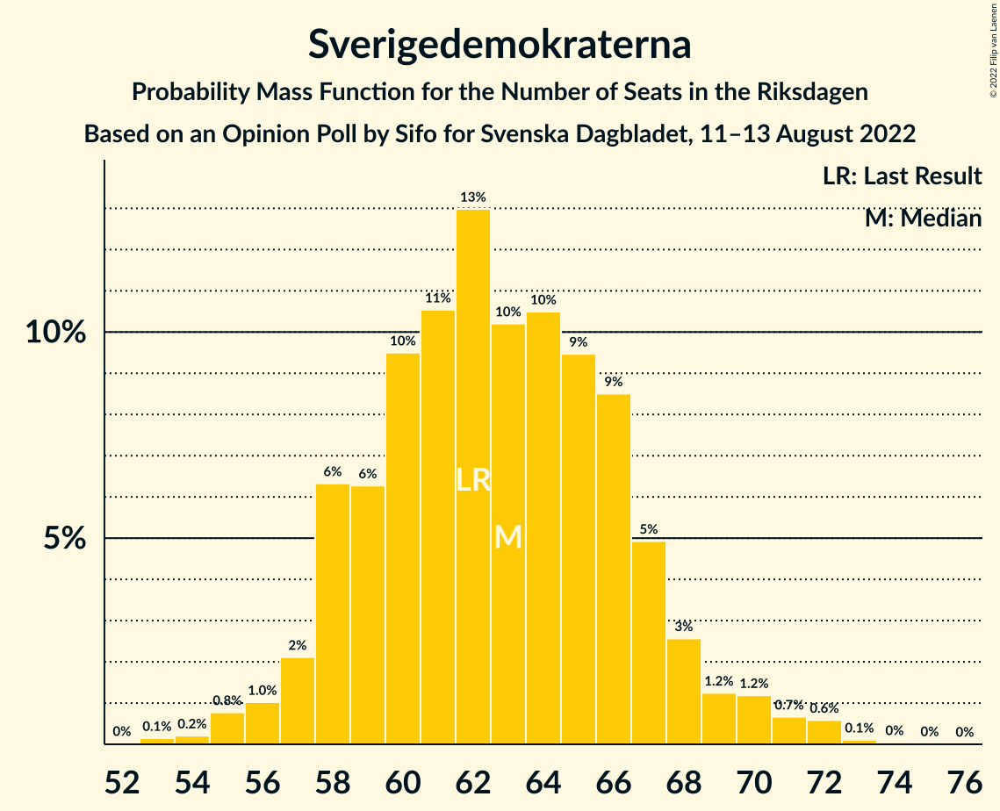

| Number of Seats | Probability | Accumulated | Special Marks |
|:---------------:|:-----------:|:-----------:|:-------------:|
| 53 | 0.1% | 100% |  |
| 54 | 0.2% | 99.8% |  |
| 55 | 0.8% | 99.6% |  |
| 56 | 1.0% | 98.8% |  |
| 57 | 2% | 98% |  |
| 58 | 6% | 96% |  |
| 59 | 6% | 89% |  |
| 60 | 10% | 83% |  |
| 61 | 11% | 74% |  |
| 62 | 13% | 63% | Last Result |
| 63 | 10% | 50% | Median |
| 64 | 10% | 40% |  |
| 65 | 9% | 29% |  |
| 66 | 9% | 20% |  |
| 67 | 5% | 11% |  |
| 68 | 3% | 6% |  |
| 69 | 1.2% | 4% |  |
| 70 | 1.2% | 3% |  |
| 71 | 0.7% | 1.4% |  |
| 72 | 0.6% | 0.8% |  |
| 73 | 0.1% | 0.2% |  |
| 74 | 0% | 0.1% |  |
| 75 | 0% | 0% |  |

### Vänsterpartiet

*For a full overview of the results for this party, see the [Vänsterpartiet](party-vänsterpartiet.html) page.*

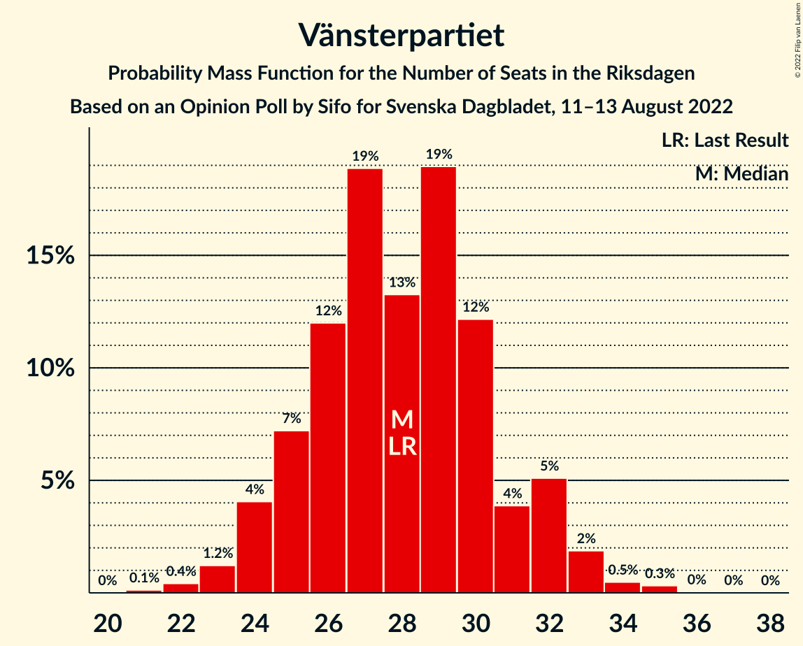

| Number of Seats | Probability | Accumulated | Special Marks |
|:---------------:|:-----------:|:-----------:|:-------------:|
| 21 | 0.1% | 100% |  |
| 22 | 0.4% | 99.9% |  |
| 23 | 1.2% | 99.4% |  |
| 24 | 4% | 98% |  |
| 25 | 7% | 94% |  |
| 26 | 12% | 87% |  |
| 27 | 19% | 75% |  |
| 28 | 13% | 56% | Last Result, Median |
| 29 | 19% | 43% |  |
| 30 | 12% | 24% |  |
| 31 | 4% | 12% |  |
| 32 | 5% | 8% |  |
| 33 | 2% | 3% |  |
| 34 | 0.5% | 0.9% |  |
| 35 | 0.3% | 0.4% |  |
| 36 | 0% | 0.1% |  |
| 37 | 0% | 0% |  |

### Kristdemokraterna

*For a full overview of the results for this party, see the [Kristdemokraterna](party-kristdemokraterna.html) page.*

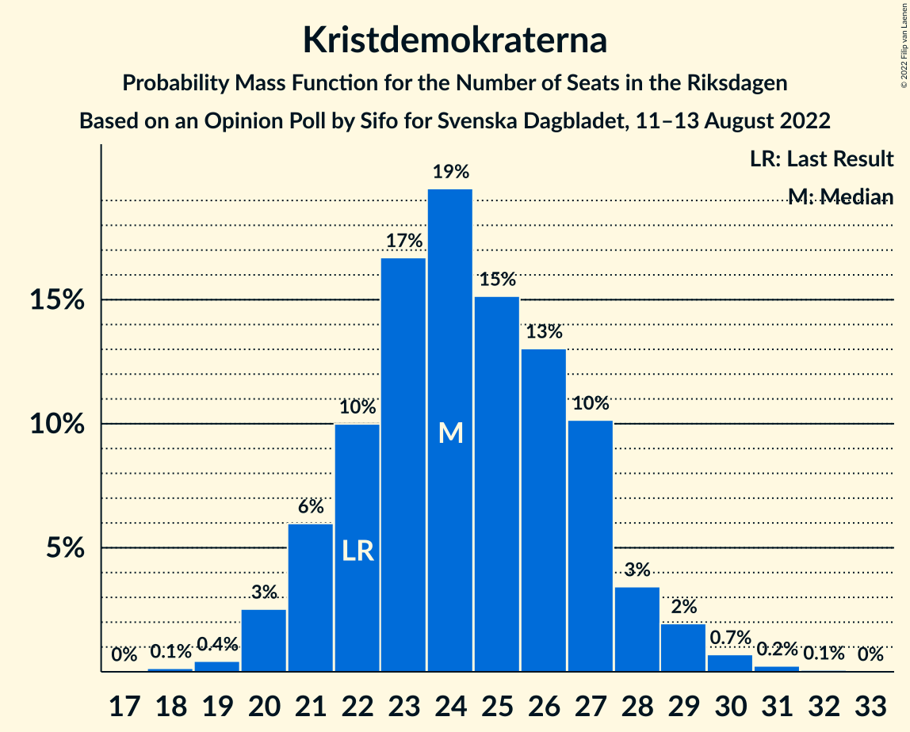

| Number of Seats | Probability | Accumulated | Special Marks |
|:---------------:|:-----------:|:-----------:|:-------------:|
| 18 | 0.1% | 100% |  |
| 19 | 0.4% | 99.8% |  |
| 20 | 3% | 99.4% |  |
| 21 | 6% | 97% |  |
| 22 | 10% | 91% | Last Result |
| 23 | 17% | 81% |  |
| 24 | 19% | 64% | Median |
| 25 | 15% | 45% |  |
| 26 | 13% | 30% |  |
| 27 | 10% | 17% |  |
| 28 | 3% | 6% |  |
| 29 | 2% | 3% |  |
| 30 | 0.7% | 1.0% |  |
| 31 | 0.2% | 0.3% |  |
| 32 | 0.1% | 0.1% |  |
| 33 | 0% | 0% |  |

### Liberalerna

*For a full overview of the results for this party, see the [Liberalerna](party-liberalerna.html) page.*

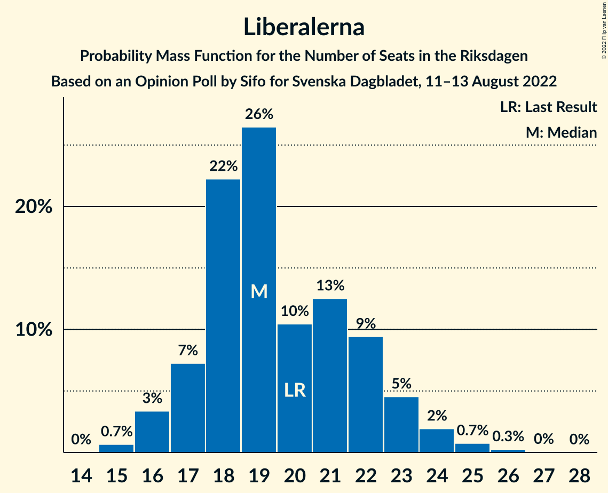

| Number of Seats | Probability | Accumulated | Special Marks |
|:---------------:|:-----------:|:-----------:|:-------------:|
| 14 | 0% | 100% |  |
| 15 | 0.7% | 99.9% |  |
| 16 | 3% | 99.3% |  |
| 17 | 7% | 96% |  |
| 18 | 22% | 89% |  |
| 19 | 26% | 66% | Median |
| 20 | 10% | 40% | Last Result |
| 21 | 13% | 30% |  |
| 22 | 9% | 17% |  |
| 23 | 5% | 8% |  |
| 24 | 2% | 3% |  |
| 25 | 0.7% | 1.1% |  |
| 26 | 0.3% | 0.3% |  |
| 27 | 0% | 0.1% |  |
| 28 | 0% | 0% |  |

### Centerpartiet

*For a full overview of the results for this party, see the [Centerpartiet](party-centerpartiet.html) page.*

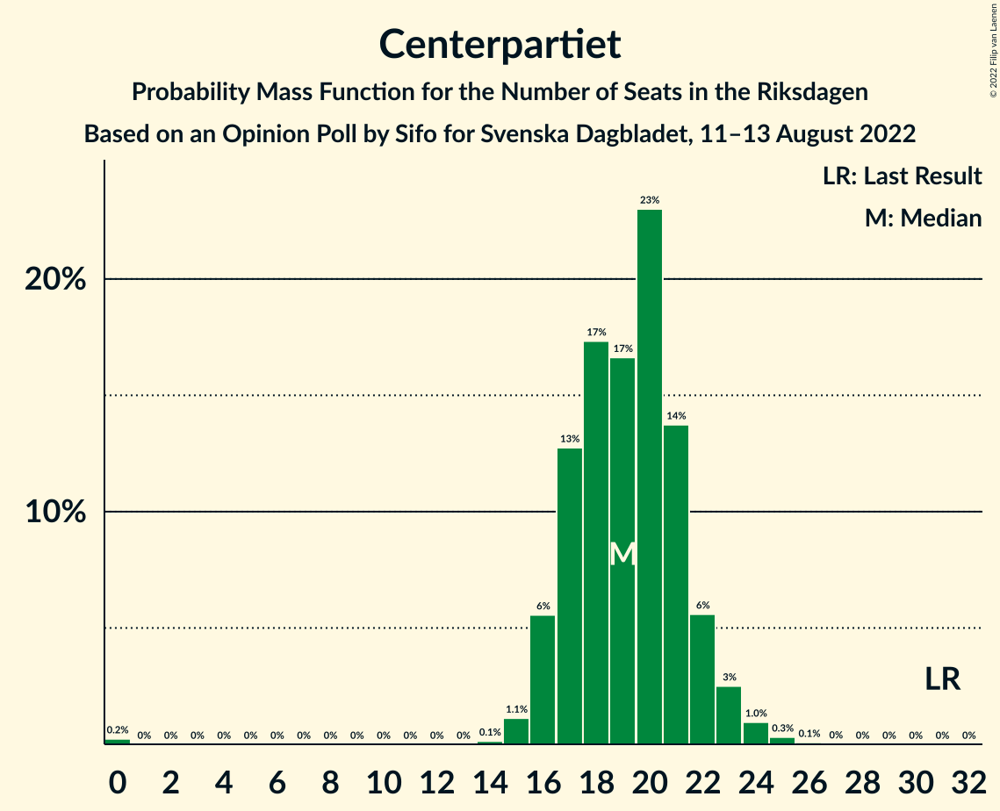

| Number of Seats | Probability | Accumulated | Special Marks |
|:---------------:|:-----------:|:-----------:|:-------------:|
| 0 | 0.2% | 100% |  |
| 1 | 0% | 99.8% |  |
| 2 | 0% | 99.8% |  |
| 3 | 0% | 99.8% |  |
| 4 | 0% | 99.8% |  |
| 5 | 0% | 99.8% |  |
| 6 | 0% | 99.8% |  |
| 7 | 0% | 99.8% |  |
| 8 | 0% | 99.8% |  |
| 9 | 0% | 99.8% |  |
| 10 | 0% | 99.8% |  |
| 11 | 0% | 99.8% |  |
| 12 | 0% | 99.8% |  |
| 13 | 0% | 99.8% |  |
| 14 | 0.1% | 99.8% |  |
| 15 | 1.1% | 99.6% |  |
| 16 | 6% | 98% |  |
| 17 | 13% | 93% |  |
| 18 | 17% | 80% |  |
| 19 | 17% | 63% | Median |
| 20 | 23% | 46% |  |
| 21 | 14% | 23% |  |
| 22 | 6% | 9% |  |
| 23 | 3% | 4% |  |
| 24 | 1.0% | 1.4% |  |
| 25 | 0.3% | 0.4% |  |
| 26 | 0.1% | 0.1% |  |
| 27 | 0% | 0% |  |
| 28 | 0% | 0% |  |
| 29 | 0% | 0% |  |
| 30 | 0% | 0% |  |
| 31 | 0% | 0% | Last Result |

### Miljöpartiet de gröna

*For a full overview of the results for this party, see the [Miljöpartiet de gröna](party-miljöpartietdegröna.html) page.*

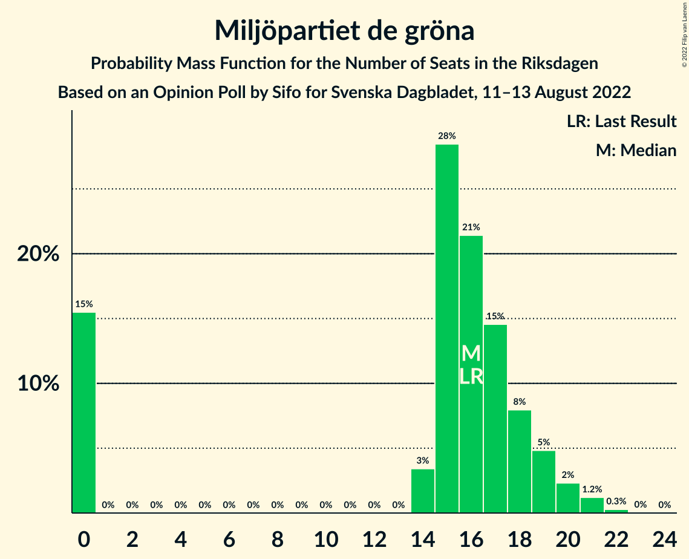

| Number of Seats | Probability | Accumulated | Special Marks |
|:---------------:|:-----------:|:-----------:|:-------------:|
| 0 | 15% | 100% |  |
| 1 | 0% | 85% |  |
| 2 | 0% | 85% |  |
| 3 | 0% | 85% |  |
| 4 | 0% | 85% |  |
| 5 | 0% | 85% |  |
| 6 | 0% | 85% |  |
| 7 | 0% | 85% |  |
| 8 | 0% | 85% |  |
| 9 | 0% | 85% |  |
| 10 | 0% | 85% |  |
| 11 | 0% | 85% |  |
| 12 | 0% | 85% |  |
| 13 | 0% | 85% |  |
| 14 | 3% | 85% |  |
| 15 | 28% | 81% |  |
| 16 | 21% | 53% | Last Result, Median |
| 17 | 15% | 31% |  |
| 18 | 8% | 17% |  |
| 19 | 5% | 9% |  |
| 20 | 2% | 4% |  |
| 21 | 1.2% | 2% |  |
| 22 | 0.3% | 0.3% |  |
| 23 | 0% | 0% |  |

## Coalitions

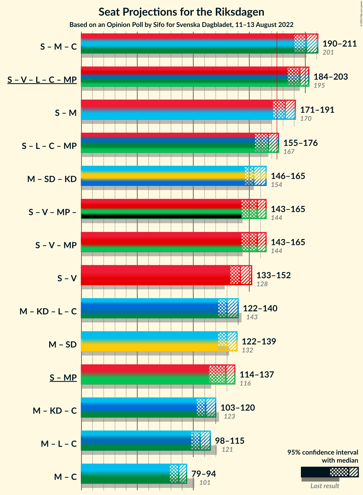

### Confidence Intervals

| Coalition | Last Result | Median | Majority? | 80% Confidence Interval | 90% Confidence Interval | 95% Confidence Interval | 99% Confidence Interval |
|:---------:|:-----------:|:------:|:---------:|:-----------------------:|:-----------------------:|:-----------------------:|:-----------------------:|
| Sveriges socialdemokratiska arbetareparti – Moderata samlingspartiet – Centerpartiet | 201 | 201 | 100% | 194–207 | 192–209 | 190–211 | 188–214 |
| Sveriges socialdemokratiska arbetareparti – Vänsterpartiet – Liberalerna – Centerpartiet – Miljöpartiet de gröna | 195 | 195 | 100% | 188–200 | 186–202 | 184–203 | 180–206 |
| Sveriges socialdemokratiska arbetareparti – Moderata samlingspartiet | 170 | 182 | 91% | 175–188 | 173–189 | 171–191 | 169–195 |
| Sveriges socialdemokratiska arbetareparti – Liberalerna – Centerpartiet – Miljöpartiet de gröna | 167 | 167 | 4% | 159–173 | 157–174 | 155–176 | 151–178 |
| Moderata samlingspartiet – Sverigedemokraterna – Kristdemokraterna | 154 | 154 | 0% | 149–161 | 147–163 | 146–165 | 143–169 |
| Sveriges socialdemokratiska arbetareparti – Vänsterpartiet – Miljöpartiet de gröna | 144 | 157 | 0% | 149–162 | 146–164 | 143–165 | 140–168 |
| Sveriges socialdemokratiska arbetareparti – Vänsterpartiet | 128 | 142 | 0% | 136–148 | 135–151 | 133–152 | 131–155 |
| Moderata samlingspartiet – Kristdemokraterna – Liberalerna – Centerpartiet | 143 | 130 | 0% | 125–137 | 124–139 | 122–140 | 119–143 |
| Moderata samlingspartiet – Sverigedemokraterna | 132 | 130 | 0% | 124–136 | 123–138 | 122–139 | 119–143 |
| Sveriges socialdemokratiska arbetareparti – Miljöpartiet de gröna | 116 | 129 | 0% | 119–134 | 117–136 | 114–137 | 111–140 |
| Moderata samlingspartiet – Kristdemokraterna – Centerpartiet | 123 | 111 | 0% | 106–116 | 104–119 | 103–120 | 100–123 |
| Moderata samlingspartiet – Liberalerna – Centerpartiet | 121 | 106 | 0% | 101–111 | 99–113 | 98–115 | 95–118 |
| Moderata samlingspartiet – Centerpartiet | 101 | 87 | 0% | 82–91 | 80–93 | 79–94 | 76–96 |

### Sveriges socialdemokratiska arbetareparti – Moderata samlingspartiet – Centerpartiet

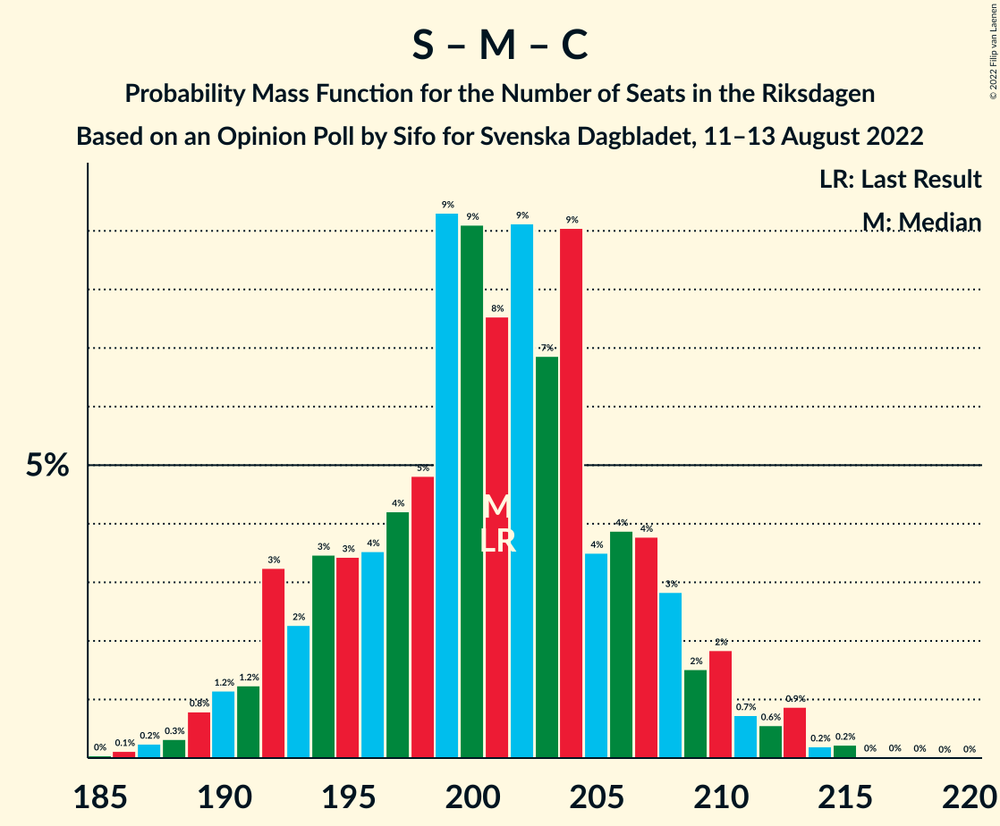

| Number of Seats | Probability | Accumulated | Special Marks |
|:---------------:|:-----------:|:-----------:|:-------------:|
| 185 | 0% | 100% |  |
| 186 | 0.1% | 99.9% |  |
| 187 | 0.2% | 99.8% |  |
| 188 | 0.3% | 99.5% |  |
| 189 | 0.8% | 99.2% |  |
| 190 | 1.2% | 98% |  |
| 191 | 1.2% | 97% |  |
| 192 | 3% | 96% |  |
| 193 | 2% | 93% |  |
| 194 | 3% | 91% |  |
| 195 | 3% | 87% |  |
| 196 | 4% | 84% |  |
| 197 | 4% | 80% |  |
| 198 | 5% | 76% |  |
| 199 | 9% | 71% |  |
| 200 | 9% | 62% | Median |
| 201 | 8% | 53% | Last Result |
| 202 | 9% | 45% |  |
| 203 | 7% | 36% |  |
| 204 | 9% | 29% |  |
| 205 | 4% | 20% |  |
| 206 | 4% | 17% |  |
| 207 | 4% | 13% |  |
| 208 | 3% | 9% |  |
| 209 | 2% | 6% |  |
| 210 | 2% | 5% |  |
| 211 | 0.7% | 3% |  |
| 212 | 0.6% | 2% |  |
| 213 | 0.9% | 1.4% |  |
| 214 | 0.2% | 0.5% |  |
| 215 | 0.2% | 0.3% |  |
| 216 | 0% | 0.1% |  |
| 217 | 0% | 0.1% |  |
| 218 | 0% | 0.1% |  |
| 219 | 0% | 0% |  |

### Sveriges socialdemokratiska arbetareparti – Vänsterpartiet – Liberalerna – Centerpartiet – Miljöpartiet de gröna

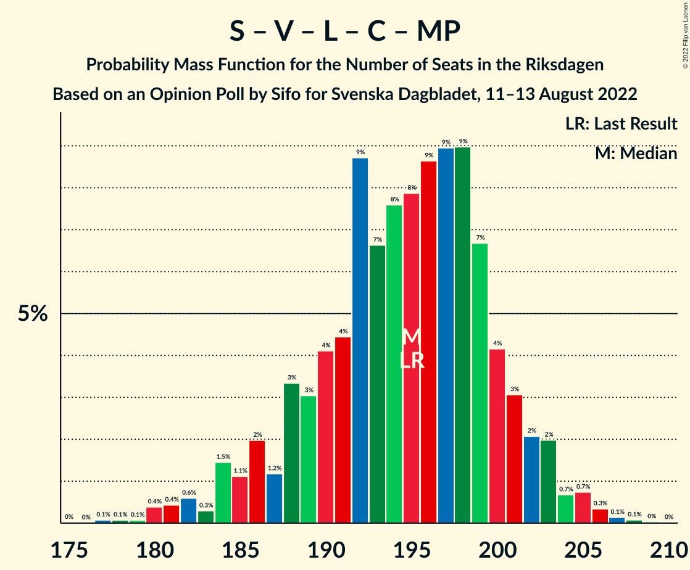

| Number of Seats | Probability | Accumulated | Special Marks |
|:---------------:|:-----------:|:-----------:|:-------------:|
| 177 | 0.1% | 100% |  |
| 178 | 0.1% | 99.9% |  |
| 179 | 0.1% | 99.8% |  |
| 180 | 0.4% | 99.7% |  |
| 181 | 0.4% | 99.4% |  |
| 182 | 0.6% | 98.9% |  |
| 183 | 0.3% | 98% |  |
| 184 | 1.5% | 98% |  |
| 185 | 1.1% | 97% |  |
| 186 | 2% | 95% |  |
| 187 | 1.2% | 93% |  |
| 188 | 3% | 92% |  |
| 189 | 3% | 89% |  |
| 190 | 4% | 86% |  |
| 191 | 4% | 82% |  |
| 192 | 9% | 77% |  |
| 193 | 7% | 69% |  |
| 194 | 8% | 62% |  |
| 195 | 8% | 54% | Last Result |
| 196 | 9% | 47% | Median |
| 197 | 9% | 38% |  |
| 198 | 9% | 29% |  |
| 199 | 7% | 20% |  |
| 200 | 4% | 13% |  |
| 201 | 3% | 9% |  |
| 202 | 2% | 6% |  |
| 203 | 2% | 4% |  |
| 204 | 0.7% | 2% |  |
| 205 | 0.7% | 1.4% |  |
| 206 | 0.3% | 0.6% |  |
| 207 | 0.1% | 0.3% |  |
| 208 | 0.1% | 0.1% |  |
| 209 | 0% | 0.1% |  |
| 210 | 0% | 0% |  |

### Sveriges socialdemokratiska arbetareparti – Moderata samlingspartiet

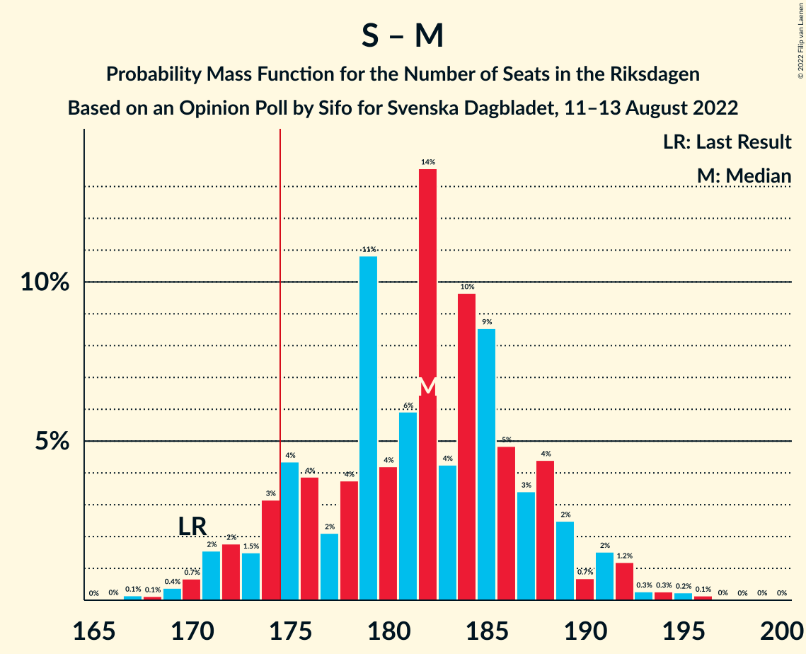

| Number of Seats | Probability | Accumulated | Special Marks |
|:---------------:|:-----------:|:-----------:|:-------------:|
| 166 | 0% | 100% |  |
| 167 | 0.1% | 99.9% |  |
| 168 | 0.1% | 99.8% |  |
| 169 | 0.4% | 99.7% |  |
| 170 | 0.7% | 99.3% | Last Result |
| 171 | 2% | 98.6% |  |
| 172 | 2% | 97% |  |
| 173 | 1.5% | 95% |  |
| 174 | 3% | 94% |  |
| 175 | 4% | 91% | Majority |
| 176 | 4% | 86% |  |
| 177 | 2% | 82% |  |
| 178 | 4% | 80% |  |
| 179 | 11% | 77% |  |
| 180 | 4% | 66% |  |
| 181 | 6% | 62% | Median |
| 182 | 14% | 56% |  |
| 183 | 4% | 42% |  |
| 184 | 10% | 38% |  |
| 185 | 9% | 28% |  |
| 186 | 5% | 20% |  |
| 187 | 3% | 15% |  |
| 188 | 4% | 11% |  |
| 189 | 2% | 7% |  |
| 190 | 0.7% | 4% |  |
| 191 | 2% | 4% |  |
| 192 | 1.2% | 2% |  |
| 193 | 0.3% | 1.0% |  |
| 194 | 0.3% | 0.8% |  |
| 195 | 0.2% | 0.5% |  |
| 196 | 0.1% | 0.3% |  |
| 197 | 0% | 0.1% |  |
| 198 | 0% | 0.1% |  |
| 199 | 0% | 0.1% |  |
| 200 | 0% | 0% |  |

### Sveriges socialdemokratiska arbetareparti – Liberalerna – Centerpartiet – Miljöpartiet de gröna

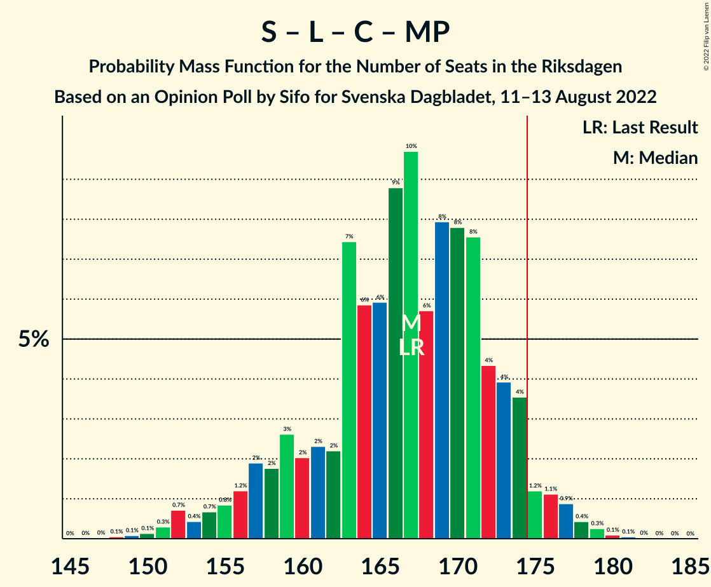

| Number of Seats | Probability | Accumulated | Special Marks |
|:---------------:|:-----------:|:-----------:|:-------------:|
| 147 | 0% | 100% |  |
| 148 | 0.1% | 99.9% |  |
| 149 | 0.1% | 99.9% |  |
| 150 | 0.1% | 99.8% |  |
| 151 | 0.3% | 99.7% |  |
| 152 | 0.7% | 99.4% |  |
| 153 | 0.4% | 98.7% |  |
| 154 | 0.7% | 98% |  |
| 155 | 0.8% | 98% |  |
| 156 | 1.2% | 97% |  |
| 157 | 2% | 95% |  |
| 158 | 2% | 94% |  |
| 159 | 3% | 92% |  |
| 160 | 2% | 89% |  |
| 161 | 2% | 87% |  |
| 162 | 2% | 85% |  |
| 163 | 7% | 83% |  |
| 164 | 6% | 75% |  |
| 165 | 6% | 69% |  |
| 166 | 9% | 63% |  |
| 167 | 10% | 55% | Last Result |
| 168 | 6% | 45% | Median |
| 169 | 8% | 39% |  |
| 170 | 8% | 31% |  |
| 171 | 8% | 23% |  |
| 172 | 4% | 16% |  |
| 173 | 4% | 12% |  |
| 174 | 4% | 8% |  |
| 175 | 1.2% | 4% | Majority |
| 176 | 1.1% | 3% |  |
| 177 | 0.9% | 2% |  |
| 178 | 0.4% | 0.9% |  |
| 179 | 0.3% | 0.4% |  |
| 180 | 0.1% | 0.2% |  |
| 181 | 0.1% | 0.1% |  |
| 182 | 0% | 0% |  |

### Moderata samlingspartiet – Sverigedemokraterna – Kristdemokraterna

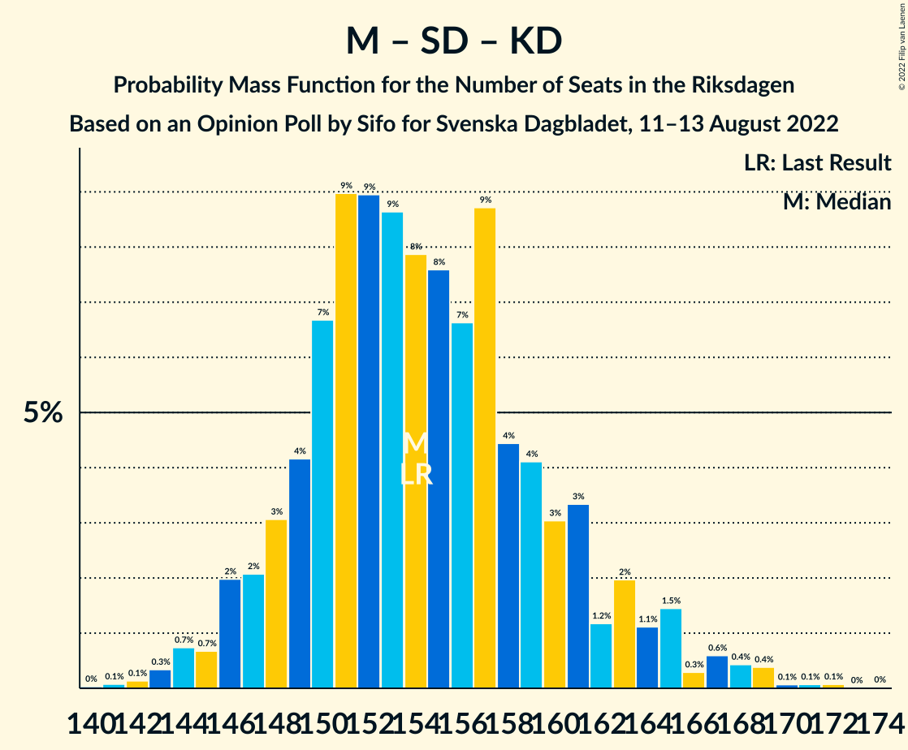

| Number of Seats | Probability | Accumulated | Special Marks |
|:---------------:|:-----------:|:-----------:|:-------------:|
| 140 | 0% | 100% |  |
| 141 | 0.1% | 99.9% |  |
| 142 | 0.1% | 99.9% |  |
| 143 | 0.3% | 99.7% |  |
| 144 | 0.7% | 99.4% |  |
| 145 | 0.7% | 98.6% |  |
| 146 | 2% | 98% |  |
| 147 | 2% | 96% |  |
| 148 | 3% | 94% |  |
| 149 | 4% | 91% |  |
| 150 | 7% | 87% |  |
| 151 | 9% | 80% |  |
| 152 | 9% | 71% |  |
| 153 | 9% | 62% |  |
| 154 | 8% | 53% | Last Result, Median |
| 155 | 8% | 46% |  |
| 156 | 7% | 38% |  |
| 157 | 9% | 31% |  |
| 158 | 4% | 23% |  |
| 159 | 4% | 18% |  |
| 160 | 3% | 14% |  |
| 161 | 3% | 11% |  |
| 162 | 1.2% | 8% |  |
| 163 | 2% | 7% |  |
| 164 | 1.1% | 5% |  |
| 165 | 1.5% | 3% |  |
| 166 | 0.3% | 2% |  |
| 167 | 0.6% | 2% |  |
| 168 | 0.4% | 1.1% |  |
| 169 | 0.4% | 0.6% |  |
| 170 | 0.1% | 0.3% |  |
| 171 | 0.1% | 0.2% |  |
| 172 | 0.1% | 0.1% |  |
| 173 | 0% | 0% |  |

### Sveriges socialdemokratiska arbetareparti – Vänsterpartiet – Miljöpartiet de gröna

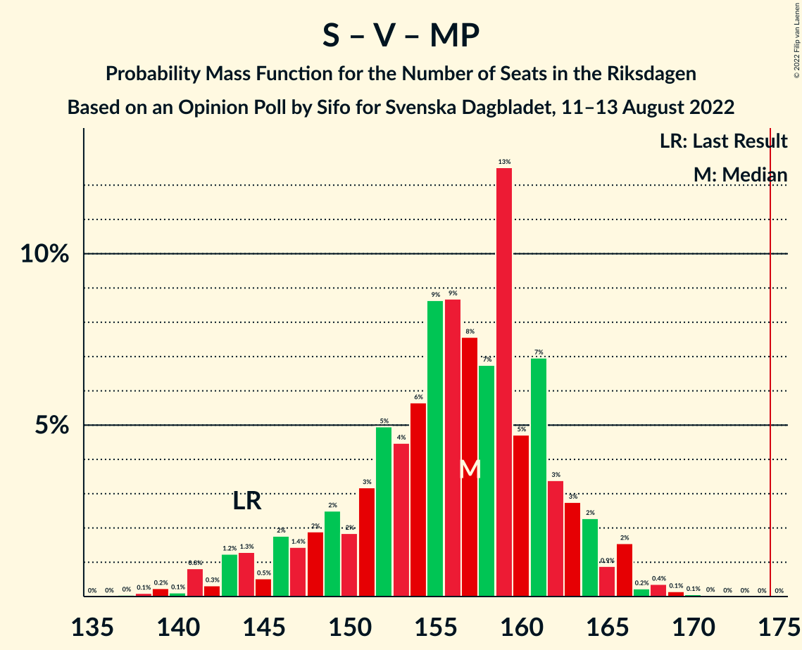

| Number of Seats | Probability | Accumulated | Special Marks |
|:---------------:|:-----------:|:-----------:|:-------------:|
| 137 | 0% | 100% |  |
| 138 | 0.1% | 99.9% |  |
| 139 | 0.2% | 99.8% |  |
| 140 | 0.1% | 99.6% |  |
| 141 | 0.8% | 99.5% |  |
| 142 | 0.3% | 98.7% |  |
| 143 | 1.2% | 98% |  |
| 144 | 1.3% | 97% | Last Result |
| 145 | 0.5% | 96% |  |
| 146 | 2% | 95% |  |
| 147 | 1.4% | 94% |  |
| 148 | 2% | 92% |  |
| 149 | 2% | 90% |  |
| 150 | 2% | 88% |  |
| 151 | 3% | 86% |  |
| 152 | 5% | 83% |  |
| 153 | 4% | 78% |  |
| 154 | 6% | 73% |  |
| 155 | 9% | 68% |  |
| 156 | 9% | 59% |  |
| 157 | 8% | 50% |  |
| 158 | 7% | 43% | Median |
| 159 | 13% | 36% |  |
| 160 | 5% | 23% |  |
| 161 | 7% | 19% |  |
| 162 | 3% | 12% |  |
| 163 | 3% | 8% |  |
| 164 | 2% | 6% |  |
| 165 | 0.9% | 3% |  |
| 166 | 2% | 2% |  |
| 167 | 0.2% | 0.9% |  |
| 168 | 0.4% | 0.6% |  |
| 169 | 0.1% | 0.3% |  |
| 170 | 0.1% | 0.1% |  |
| 171 | 0% | 0.1% |  |
| 172 | 0% | 0% |  |

### Sveriges socialdemokratiska arbetareparti – Vänsterpartiet

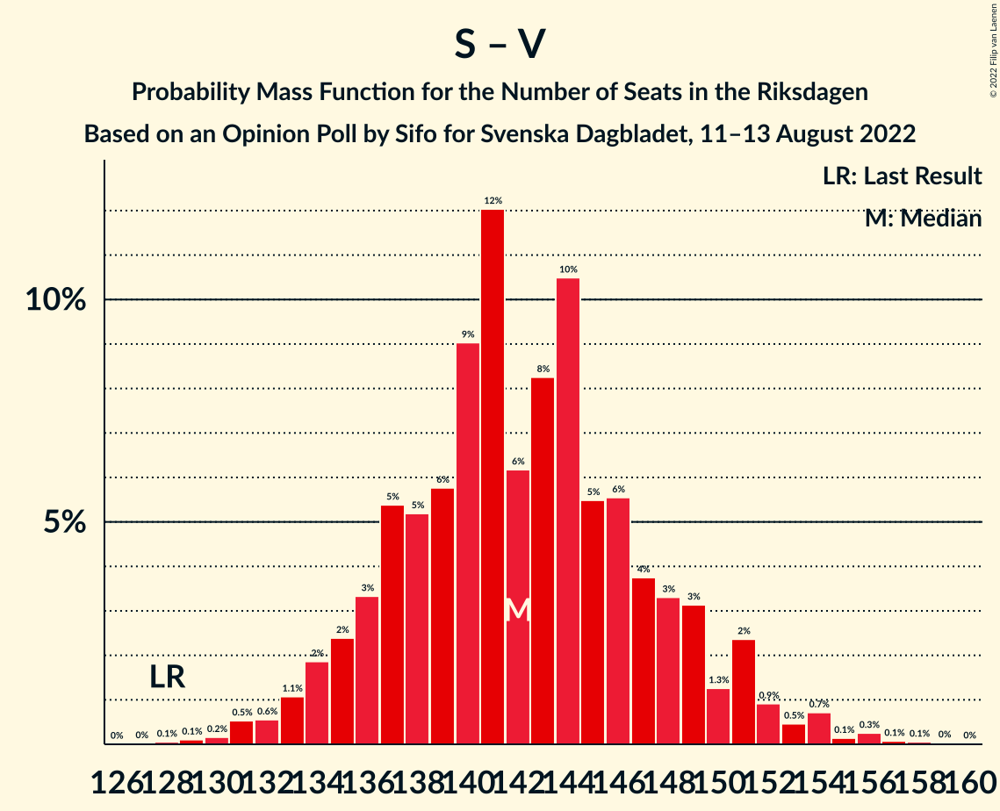

| Number of Seats | Probability | Accumulated | Special Marks |
|:---------------:|:-----------:|:-----------:|:-------------:|
| 128 | 0.1% | 100% | Last Result |
| 129 | 0.1% | 99.9% |  |
| 130 | 0.2% | 99.8% |  |
| 131 | 0.5% | 99.6% |  |
| 132 | 0.6% | 99.1% |  |
| 133 | 1.1% | 98.5% |  |
| 134 | 2% | 97% |  |
| 135 | 2% | 96% |  |
| 136 | 3% | 93% |  |
| 137 | 5% | 90% |  |
| 138 | 5% | 85% |  |
| 139 | 6% | 79% |  |
| 140 | 9% | 74% |  |
| 141 | 12% | 65% |  |
| 142 | 6% | 52% | Median |
| 143 | 8% | 46% |  |
| 144 | 10% | 38% |  |
| 145 | 5% | 28% |  |
| 146 | 6% | 22% |  |
| 147 | 4% | 17% |  |
| 148 | 3% | 13% |  |
| 149 | 3% | 9% |  |
| 150 | 1.3% | 6% |  |
| 151 | 2% | 5% |  |
| 152 | 0.9% | 3% |  |
| 153 | 0.5% | 2% |  |
| 154 | 0.7% | 1.3% |  |
| 155 | 0.1% | 0.6% |  |
| 156 | 0.3% | 0.5% |  |
| 157 | 0.1% | 0.2% |  |
| 158 | 0.1% | 0.1% |  |
| 159 | 0% | 0.1% |  |
| 160 | 0% | 0% |  |

### Moderata samlingspartiet – Kristdemokraterna – Liberalerna – Centerpartiet

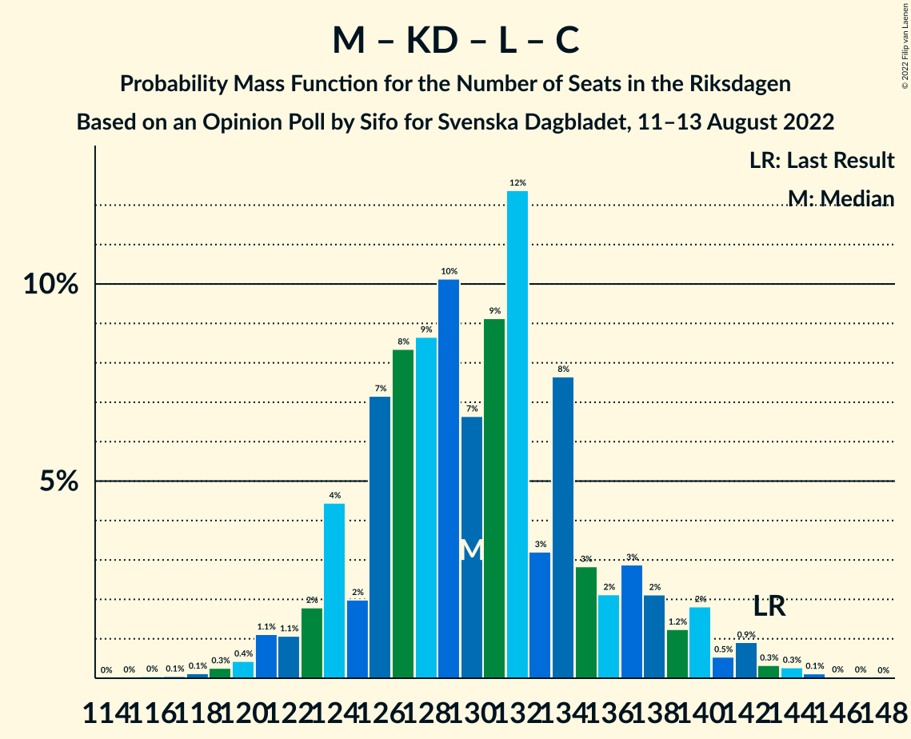

| Number of Seats | Probability | Accumulated | Special Marks |
|:---------------:|:-----------:|:-----------:|:-------------:|
| 114 | 0% | 100% |  |
| 115 | 0% | 99.9% |  |
| 116 | 0% | 99.9% |  |
| 117 | 0.1% | 99.9% |  |
| 118 | 0.1% | 99.8% |  |
| 119 | 0.3% | 99.7% |  |
| 120 | 0.4% | 99.4% |  |
| 121 | 1.1% | 99.0% |  |
| 122 | 1.1% | 98% |  |
| 123 | 2% | 97% |  |
| 124 | 4% | 95% |  |
| 125 | 2% | 91% |  |
| 126 | 7% | 89% |  |
| 127 | 8% | 81% |  |
| 128 | 9% | 73% |  |
| 129 | 10% | 64% | Median |
| 130 | 7% | 54% |  |
| 131 | 9% | 48% |  |
| 132 | 12% | 39% |  |
| 133 | 3% | 26% |  |
| 134 | 8% | 23% |  |
| 135 | 3% | 15% |  |
| 136 | 2% | 12% |  |
| 137 | 3% | 10% |  |
| 138 | 2% | 7% |  |
| 139 | 1.2% | 5% |  |
| 140 | 2% | 4% |  |
| 141 | 0.5% | 2% |  |
| 142 | 0.9% | 2% |  |
| 143 | 0.3% | 0.8% | Last Result |
| 144 | 0.3% | 0.5% |  |
| 145 | 0.1% | 0.2% |  |
| 146 | 0% | 0.1% |  |
| 147 | 0% | 0% |  |

### Moderata samlingspartiet – Sverigedemokraterna

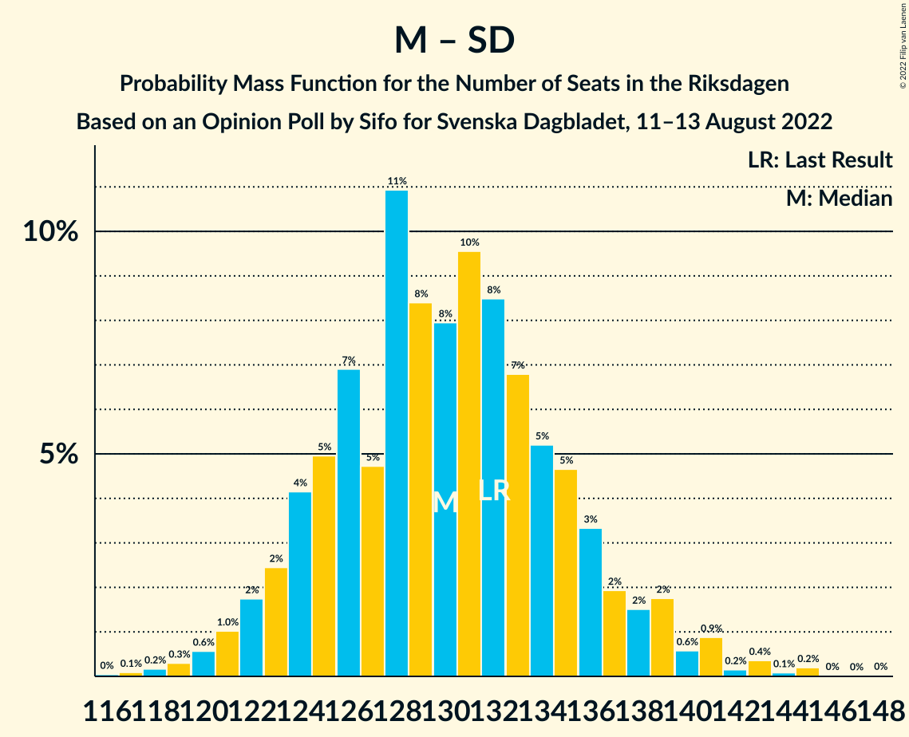

| Number of Seats | Probability | Accumulated | Special Marks |
|:---------------:|:-----------:|:-----------:|:-------------:|
| 116 | 0% | 100% |  |
| 117 | 0.1% | 99.9% |  |
| 118 | 0.2% | 99.8% |  |
| 119 | 0.3% | 99.7% |  |
| 120 | 0.6% | 99.4% |  |
| 121 | 1.0% | 98.8% |  |
| 122 | 2% | 98% |  |
| 123 | 2% | 96% |  |
| 124 | 4% | 94% |  |
| 125 | 5% | 89% |  |
| 126 | 7% | 84% |  |
| 127 | 5% | 78% |  |
| 128 | 11% | 73% |  |
| 129 | 8% | 62% |  |
| 130 | 8% | 54% | Median |
| 131 | 10% | 46% |  |
| 132 | 8% | 36% | Last Result |
| 133 | 7% | 28% |  |
| 134 | 5% | 21% |  |
| 135 | 5% | 16% |  |
| 136 | 3% | 11% |  |
| 137 | 2% | 8% |  |
| 138 | 2% | 6% |  |
| 139 | 2% | 4% |  |
| 140 | 0.6% | 2% |  |
| 141 | 0.9% | 2% |  |
| 142 | 0.2% | 0.9% |  |
| 143 | 0.4% | 0.7% |  |
| 144 | 0.1% | 0.4% |  |
| 145 | 0.2% | 0.3% |  |
| 146 | 0% | 0.1% |  |
| 147 | 0% | 0% |  |

### Sveriges socialdemokratiska arbetareparti – Miljöpartiet de gröna

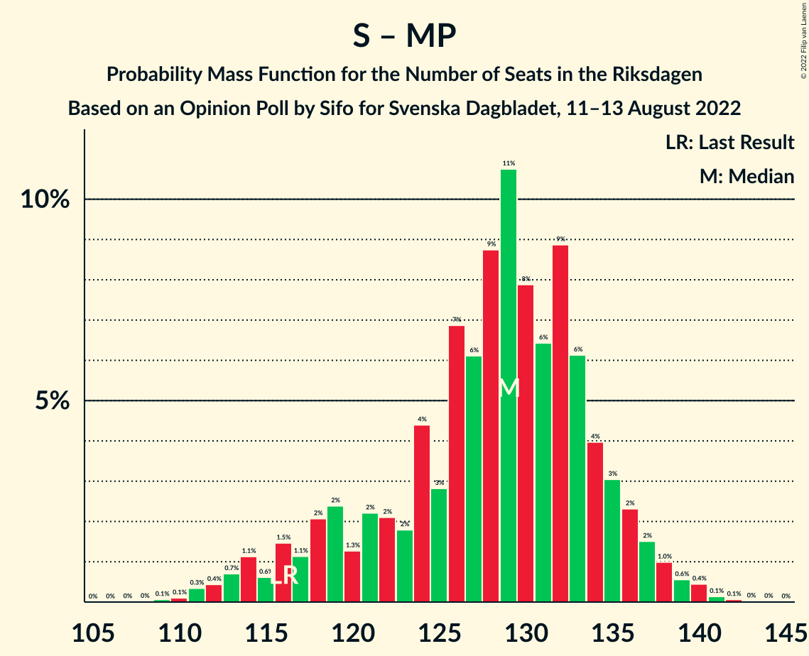

| Number of Seats | Probability | Accumulated | Special Marks |
|:---------------:|:-----------:|:-----------:|:-------------:|
| 109 | 0.1% | 100% |  |
| 110 | 0.1% | 99.9% |  |
| 111 | 0.3% | 99.8% |  |
| 112 | 0.4% | 99.5% |  |
| 113 | 0.7% | 99.0% |  |
| 114 | 1.1% | 98% |  |
| 115 | 0.6% | 97% |  |
| 116 | 1.5% | 97% | Last Result |
| 117 | 1.1% | 95% |  |
| 118 | 2% | 94% |  |
| 119 | 2% | 92% |  |
| 120 | 1.3% | 90% |  |
| 121 | 2% | 88% |  |
| 122 | 2% | 86% |  |
| 123 | 2% | 84% |  |
| 124 | 4% | 82% |  |
| 125 | 3% | 78% |  |
| 126 | 7% | 75% |  |
| 127 | 6% | 68% |  |
| 128 | 9% | 62% |  |
| 129 | 11% | 53% |  |
| 130 | 8% | 42% | Median |
| 131 | 6% | 35% |  |
| 132 | 9% | 28% |  |
| 133 | 6% | 19% |  |
| 134 | 4% | 13% |  |
| 135 | 3% | 9% |  |
| 136 | 2% | 6% |  |
| 137 | 2% | 4% |  |
| 138 | 1.0% | 2% |  |
| 139 | 0.6% | 1.3% |  |
| 140 | 0.4% | 0.7% |  |
| 141 | 0.1% | 0.3% |  |
| 142 | 0.1% | 0.1% |  |
| 143 | 0% | 0.1% |  |
| 144 | 0% | 0% |  |

### Moderata samlingspartiet – Kristdemokraterna – Centerpartiet

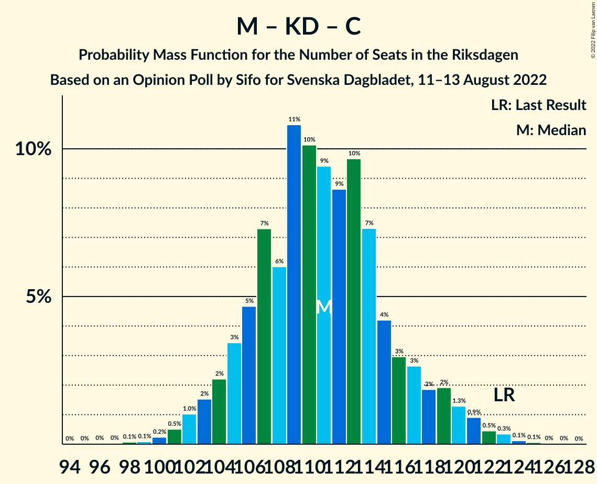

| Number of Seats | Probability | Accumulated | Special Marks |
|:---------------:|:-----------:|:-----------:|:-------------:|
| 95 | 0% | 100% |  |
| 96 | 0% | 99.9% |  |
| 97 | 0% | 99.9% |  |
| 98 | 0.1% | 99.9% |  |
| 99 | 0.1% | 99.8% |  |
| 100 | 0.2% | 99.7% |  |
| 101 | 0.5% | 99.5% |  |
| 102 | 1.0% | 99.0% |  |
| 103 | 2% | 98% |  |
| 104 | 2% | 96% |  |
| 105 | 3% | 94% |  |
| 106 | 5% | 91% |  |
| 107 | 7% | 86% |  |
| 108 | 6% | 79% |  |
| 109 | 11% | 73% |  |
| 110 | 10% | 62% | Median |
| 111 | 9% | 52% |  |
| 112 | 9% | 42% |  |
| 113 | 10% | 34% |  |
| 114 | 7% | 24% |  |
| 115 | 4% | 17% |  |
| 116 | 3% | 13% |  |
| 117 | 3% | 10% |  |
| 118 | 2% | 7% |  |
| 119 | 2% | 5% |  |
| 120 | 1.3% | 3% |  |
| 121 | 0.9% | 2% |  |
| 122 | 0.5% | 1.0% |  |
| 123 | 0.3% | 0.6% | Last Result |
| 124 | 0.1% | 0.2% |  |
| 125 | 0.1% | 0.1% |  |
| 126 | 0% | 0.1% |  |
| 127 | 0% | 0% |  |

### Moderata samlingspartiet – Liberalerna – Centerpartiet

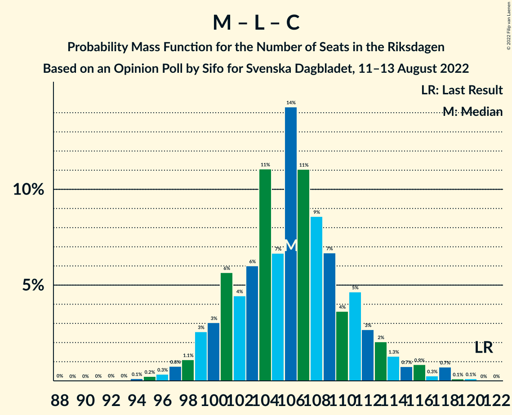

| Number of Seats | Probability | Accumulated | Special Marks |
|:---------------:|:-----------:|:-----------:|:-------------:|
| 88 | 0% | 100% |  |
| 89 | 0% | 99.9% |  |
| 90 | 0% | 99.9% |  |
| 91 | 0% | 99.9% |  |
| 92 | 0% | 99.9% |  |
| 93 | 0% | 99.8% |  |
| 94 | 0.1% | 99.8% |  |
| 95 | 0.2% | 99.7% |  |
| 96 | 0.3% | 99.4% |  |
| 97 | 0.8% | 99.1% |  |
| 98 | 1.1% | 98% |  |
| 99 | 3% | 97% |  |
| 100 | 3% | 95% |  |
| 101 | 6% | 92% |  |
| 102 | 4% | 86% |  |
| 103 | 6% | 81% |  |
| 104 | 11% | 75% |  |
| 105 | 7% | 64% | Median |
| 106 | 14% | 58% |  |
| 107 | 11% | 43% |  |
| 108 | 9% | 32% |  |
| 109 | 7% | 24% |  |
| 110 | 4% | 17% |  |
| 111 | 5% | 13% |  |
| 112 | 3% | 9% |  |
| 113 | 2% | 6% |  |
| 114 | 1.3% | 4% |  |
| 115 | 0.7% | 3% |  |
| 116 | 0.9% | 2% |  |
| 117 | 0.3% | 1.2% |  |
| 118 | 0.7% | 1.0% |  |
| 119 | 0.1% | 0.3% |  |
| 120 | 0.1% | 0.2% |  |
| 121 | 0% | 0% | Last Result |

### Moderata samlingspartiet – Centerpartiet

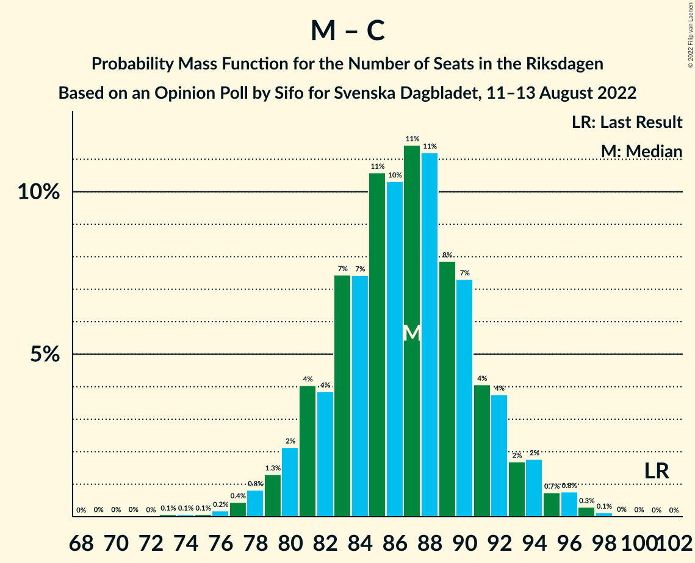

| Number of Seats | Probability | Accumulated | Special Marks |
|:---------------:|:-----------:|:-----------:|:-------------:|
| 69 | 0% | 100% |  |
| 70 | 0% | 99.9% |  |
| 71 | 0% | 99.9% |  |
| 72 | 0% | 99.9% |  |
| 73 | 0.1% | 99.9% |  |
| 74 | 0.1% | 99.8% |  |
| 75 | 0.1% | 99.7% |  |
| 76 | 0.2% | 99.7% |  |
| 77 | 0.4% | 99.5% |  |
| 78 | 0.8% | 99.0% |  |
| 79 | 1.3% | 98% |  |
| 80 | 2% | 97% |  |
| 81 | 4% | 95% |  |
| 82 | 4% | 91% |  |
| 83 | 7% | 87% |  |
| 84 | 7% | 79% |  |
| 85 | 11% | 72% |  |
| 86 | 10% | 61% | Median |
| 87 | 11% | 51% |  |
| 88 | 11% | 40% |  |
| 89 | 8% | 28% |  |
| 90 | 7% | 21% |  |
| 91 | 4% | 13% |  |
| 92 | 4% | 9% |  |
| 93 | 2% | 5% |  |
| 94 | 2% | 4% |  |
| 95 | 0.7% | 2% |  |
| 96 | 0.8% | 1.3% |  |
| 97 | 0.3% | 0.5% |  |
| 98 | 0.1% | 0.2% |  |
| 99 | 0% | 0.1% |  |
| 100 | 0% | 0% |  |
| 101 | 0% | 0% | Last Result |

## Technical Information

### Opinion Poll

+ **Polling firm:** Sifo
+ **Commissioner(s):** Svenska Dagbladet
+ **Fieldwork period:** 11–13 August 2022

### Calculations

+ **Sample size:** 1929
+ **Simulations done:** 1,048,576
+ **Error estimate:** 0.87%

