# Opinion Poll by Novus for SVT, 8–14 August 2022

<a href="#voting-intentions">Voting Intentions</a> | <a href="#seats">Seats</a> | <a href="#coalitions">Coalitions</a> | <a href="#technical-information">Technical Information</a>

## Voting Intentions

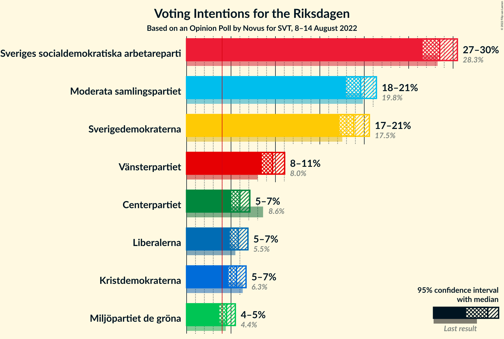

### Confidence Intervals

| Party | Last Result | Poll Result | 80% Confidence Interval | 90% Confidence Interval | 95% Confidence Interval | 99% Confidence Interval |
|:-----:|:-----------:|:-----------:|:-----------------------:|:-----------------------:|:-----------------------:|:-----------------------:|
| Sveriges socialdemokratiska arbetareparti | 28.3% | 28.5% | 27.2–29.8% |26.9–30.2% |26.6–30.5% |26.0–31.1% |
| Moderata samlingspartiet | 19.8% | 19.6% | 18.5–20.8% |18.2–21.1% |17.9–21.4% |17.4–21.9% |
| Sverigedemokraterna | 17.5% | 18.8% | 17.7–20.0% |17.5–20.3% |17.2–20.6% |16.7–21.1% |
| Vänsterpartiet | 8.0% | 9.7% | 8.9–10.6% |8.7–10.8% |8.5–11.0% |8.1–11.5% |
| Centerpartiet | 8.6% | 6.0% | 5.4–6.7% |5.2–6.9% |5.0–7.1% |4.8–7.5% |
| Liberalerna | 5.5% | 5.8% | 5.2–6.5% |5.0–6.7% |4.9–6.9% |4.6–7.3% |
| Kristdemokraterna | 6.3% | 5.6% | 5.0–6.3% |4.8–6.5% |4.7–6.7% |4.4–7.1% |
| Miljöpartiet de gröna | 4.4% | 4.5% | 4.0–5.2% |3.8–5.3% |3.7–5.5% |3.4–5.8% |

*Note:* The poll result column reflects the actual value used in the calculations. Published results may vary slightly, and in addition be rounded to fewer digits.

## Seats

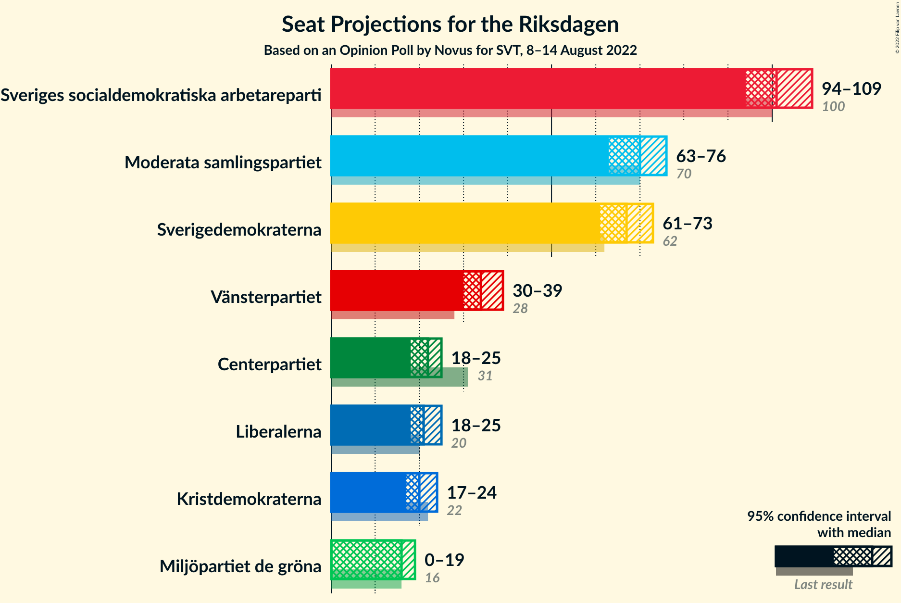

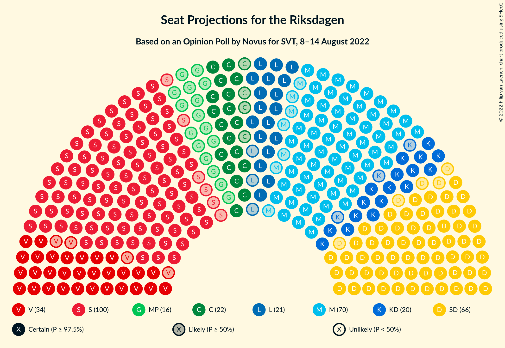

### Confidence Intervals

| Party | Last Result | Median | 80% Confidence Interval | 90% Confidence Interval | 95% Confidence Interval | 99% Confidence Interval |
|:-----:|:-----------:|:------:|:-----------------------:|:-----------------------:|:-----------------------:|:-----------------------:|
| <a href="#sveriges-socialdemokratiska-arbetareparti">Sveriges socialdemokratiska arbetareparti</a> | 100 | 101 | 96–107 |95–108 |94–109 |92–112 |
| <a href="#moderata-samlingspartiet">Moderata samlingspartiet</a> | 70 | 70 | 65–74 |64–75 |63–76 |62–79 |
| <a href="#sverigedemokraterna">Sverigedemokraterna</a> | 62 | 67 | 63–71 |62–72 |61–73 |59–76 |
| <a href="#vänsterpartiet">Vänsterpartiet</a> | 28 | 34 | 31–38 |31–38 |30–39 |29–41 |
| <a href="#centerpartiet">Centerpartiet</a> | 31 | 22 | 19–24 |19–25 |18–25 |17–27 |
| <a href="#liberalerna">Liberalerna</a> | 20 | 21 | 18–23 |18–24 |18–25 |17–26 |
| <a href="#kristdemokraterna">Kristdemokraterna</a> | 22 | 20 | 18–23 |17–23 |17–24 |16–25 |
| <a href="#miljöpartiet-de-gröna">Miljöpartiet de gröna</a> | 16 | 16 | 0–18 |0–19 |0–19 |0–21 |

### Sveriges socialdemokratiska arbetareparti

*For a full overview of the results for this party, see the [Sveriges socialdemokratiska arbetareparti](party-sverigessocialdemokratiskaarbetareparti.html) page.*

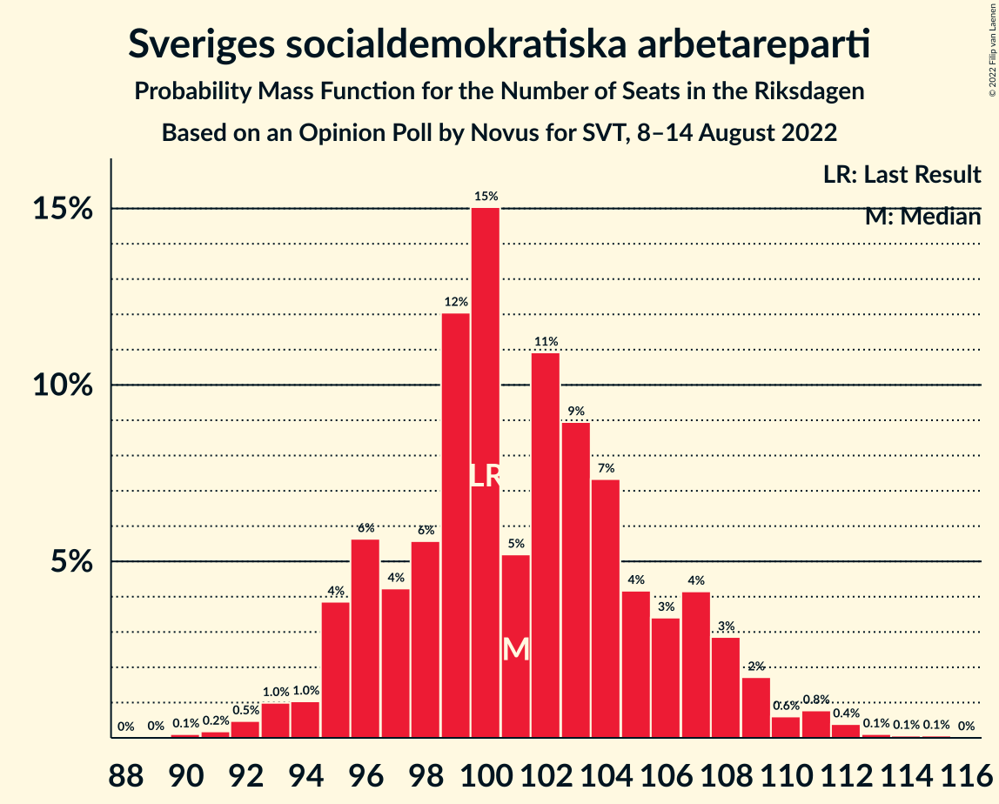

| Number of Seats | Probability | Accumulated | Special Marks |
|:---------------:|:-----------:|:-----------:|:-------------:|
| 90 | 0.1% | 100% |  |
| 91 | 0.2% | 99.8% |  |
| 92 | 0.5% | 99.7% |  |
| 93 | 1.0% | 99.2% |  |
| 94 | 1.0% | 98% |  |
| 95 | 4% | 97% |  |
| 96 | 6% | 93% |  |
| 97 | 4% | 88% |  |
| 98 | 6% | 83% |  |
| 99 | 12% | 78% |  |
| 100 | 15% | 66% | Last Result |
| 101 | 5% | 51% | Median |
| 102 | 11% | 46% |  |
| 103 | 9% | 35% |  |
| 104 | 7% | 26% |  |
| 105 | 4% | 18% |  |
| 106 | 3% | 14% |  |
| 107 | 4% | 11% |  |
| 108 | 3% | 7% |  |
| 109 | 2% | 4% |  |
| 110 | 0.6% | 2% |  |
| 111 | 0.8% | 1.4% |  |
| 112 | 0.4% | 0.7% |  |
| 113 | 0.1% | 0.3% |  |
| 114 | 0.1% | 0.2% |  |
| 115 | 0.1% | 0.1% |  |
| 116 | 0% | 0% |  |

### Moderata samlingspartiet

*For a full overview of the results for this party, see the [Moderata samlingspartiet](party-moderatasamlingspartiet.html) page.*

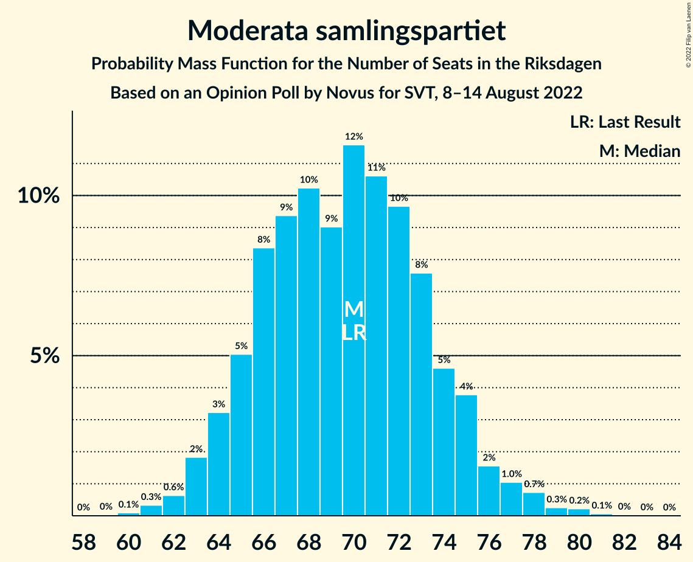

| Number of Seats | Probability | Accumulated | Special Marks |
|:---------------:|:-----------:|:-----------:|:-------------:|
| 60 | 0.1% | 100% |  |
| 61 | 0.3% | 99.9% |  |
| 62 | 0.6% | 99.5% |  |
| 63 | 2% | 98.9% |  |
| 64 | 3% | 97% |  |
| 65 | 5% | 94% |  |
| 66 | 8% | 89% |  |
| 67 | 9% | 80% |  |
| 68 | 10% | 71% |  |
| 69 | 9% | 61% |  |
| 70 | 12% | 52% | Last Result, Median |
| 71 | 11% | 40% |  |
| 72 | 10% | 30% |  |
| 73 | 8% | 20% |  |
| 74 | 5% | 12% |  |
| 75 | 4% | 8% |  |
| 76 | 2% | 4% |  |
| 77 | 1.0% | 2% |  |
| 78 | 0.7% | 1.3% |  |
| 79 | 0.3% | 0.6% |  |
| 80 | 0.2% | 0.3% |  |
| 81 | 0.1% | 0.1% |  |
| 82 | 0% | 0.1% |  |
| 83 | 0% | 0% |  |

### Sverigedemokraterna

*For a full overview of the results for this party, see the [Sverigedemokraterna](party-sverigedemokraterna.html) page.*

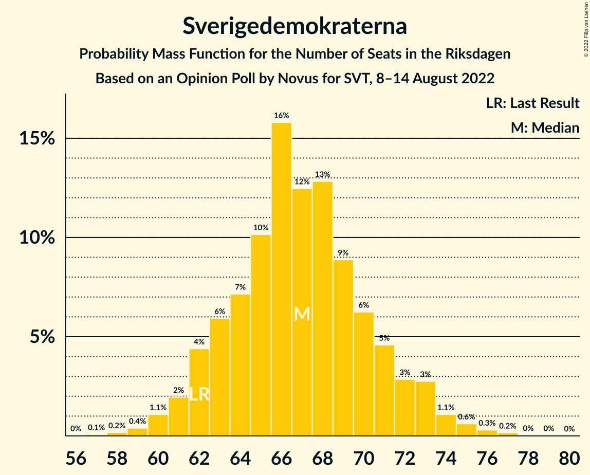

| Number of Seats | Probability | Accumulated | Special Marks |
|:---------------:|:-----------:|:-----------:|:-------------:|
| 57 | 0.1% | 100% |  |
| 58 | 0.2% | 99.9% |  |
| 59 | 0.4% | 99.7% |  |
| 60 | 1.1% | 99.3% |  |
| 61 | 2% | 98% |  |
| 62 | 4% | 96% | Last Result |
| 63 | 6% | 92% |  |
| 64 | 7% | 86% |  |
| 65 | 10% | 79% |  |
| 66 | 16% | 69% |  |
| 67 | 12% | 53% | Median |
| 68 | 13% | 40% |  |
| 69 | 9% | 28% |  |
| 70 | 6% | 19% |  |
| 71 | 5% | 12% |  |
| 72 | 3% | 8% |  |
| 73 | 3% | 5% |  |
| 74 | 1.1% | 2% |  |
| 75 | 0.6% | 1.2% |  |
| 76 | 0.3% | 0.5% |  |
| 77 | 0.2% | 0.2% |  |
| 78 | 0% | 0.1% |  |
| 79 | 0% | 0% |  |

### Vänsterpartiet

*For a full overview of the results for this party, see the [Vänsterpartiet](party-vänsterpartiet.html) page.*

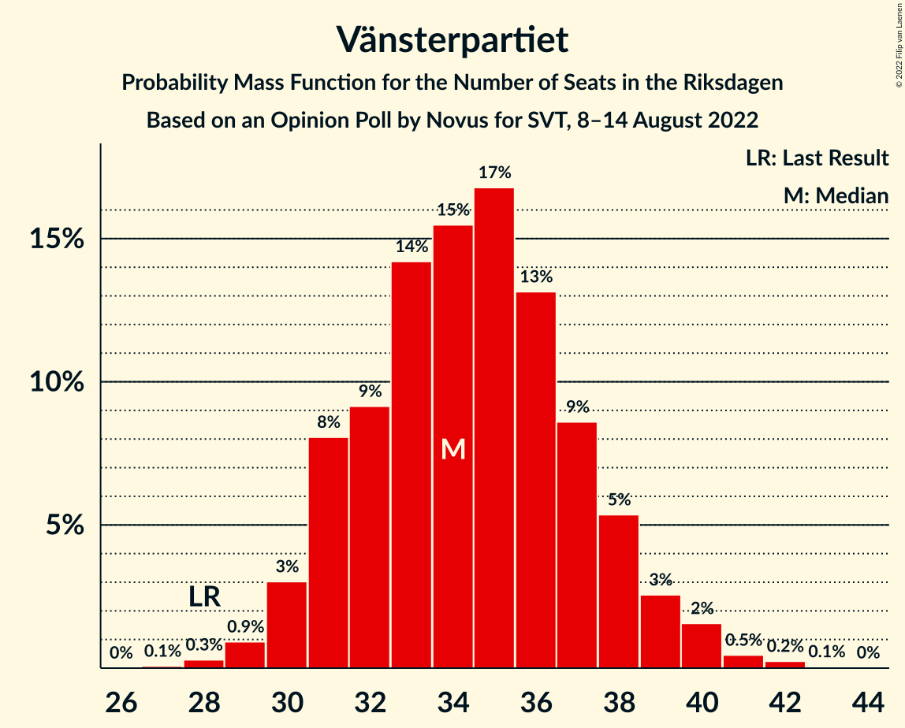

| Number of Seats | Probability | Accumulated | Special Marks |
|:---------------:|:-----------:|:-----------:|:-------------:|
| 27 | 0.1% | 100% |  |
| 28 | 0.3% | 99.9% | Last Result |
| 29 | 0.9% | 99.6% |  |
| 30 | 3% | 98.7% |  |
| 31 | 8% | 96% |  |
| 32 | 9% | 88% |  |
| 33 | 14% | 78% |  |
| 34 | 15% | 64% | Median |
| 35 | 17% | 49% |  |
| 36 | 13% | 32% |  |
| 37 | 9% | 19% |  |
| 38 | 5% | 10% |  |
| 39 | 3% | 5% |  |
| 40 | 2% | 2% |  |
| 41 | 0.5% | 0.8% |  |
| 42 | 0.2% | 0.3% |  |
| 43 | 0.1% | 0.1% |  |
| 44 | 0% | 0% |  |

### Centerpartiet

*For a full overview of the results for this party, see the [Centerpartiet](party-centerpartiet.html) page.*

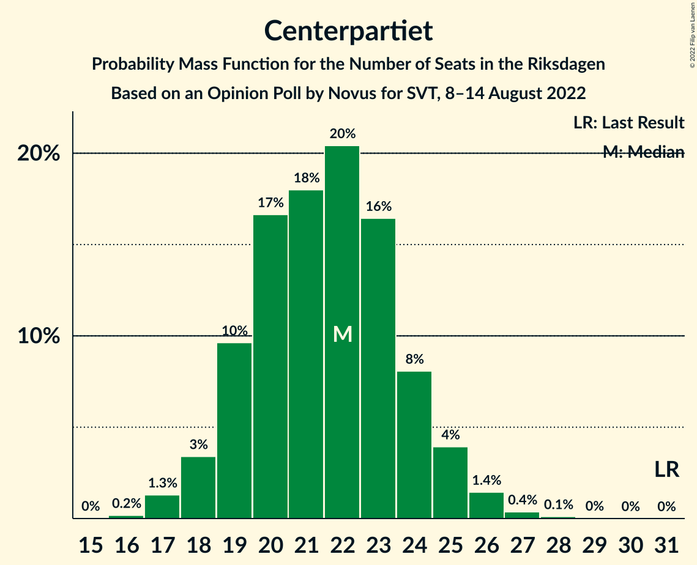

| Number of Seats | Probability | Accumulated | Special Marks |
|:---------------:|:-----------:|:-----------:|:-------------:|
| 16 | 0.2% | 100% |  |
| 17 | 1.3% | 99.8% |  |
| 18 | 3% | 98.5% |  |
| 19 | 10% | 95% |  |
| 20 | 17% | 85% |  |
| 21 | 18% | 69% |  |
| 22 | 20% | 51% | Median |
| 23 | 16% | 30% |  |
| 24 | 8% | 14% |  |
| 25 | 4% | 6% |  |
| 26 | 1.4% | 2% |  |
| 27 | 0.4% | 0.5% |  |
| 28 | 0.1% | 0.1% |  |
| 29 | 0% | 0% |  |
| 30 | 0% | 0% |  |
| 31 | 0% | 0% | Last Result |

### Liberalerna

*For a full overview of the results for this party, see the [Liberalerna](party-liberalerna.html) page.*

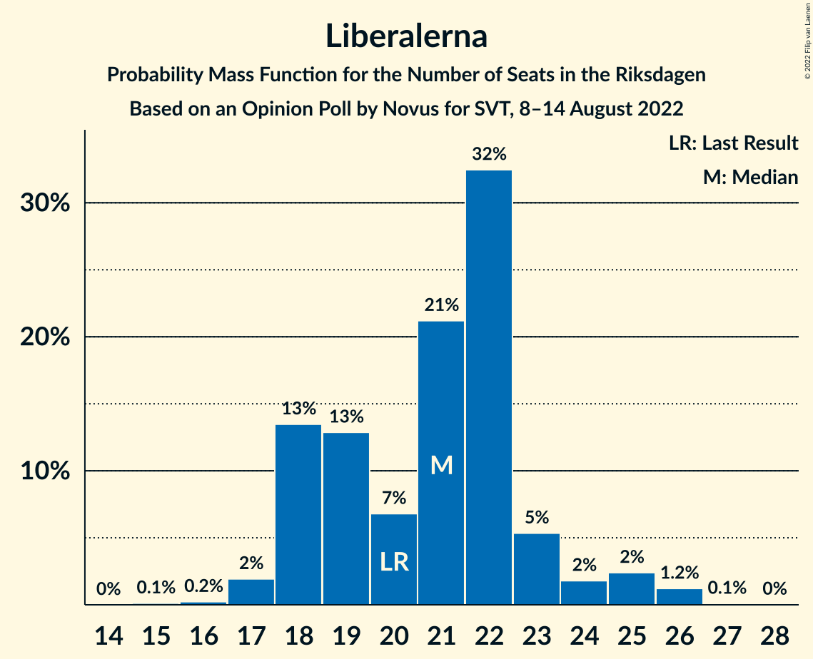

| Number of Seats | Probability | Accumulated | Special Marks |
|:---------------:|:-----------:|:-----------:|:-------------:|
| 15 | 0.1% | 100% |  |
| 16 | 0.2% | 99.9% |  |
| 17 | 2% | 99.6% |  |
| 18 | 13% | 98% |  |
| 19 | 13% | 84% |  |
| 20 | 7% | 71% | Last Result |
| 21 | 21% | 65% | Median |
| 22 | 32% | 43% |  |
| 23 | 5% | 11% |  |
| 24 | 2% | 6% |  |
| 25 | 2% | 4% |  |
| 26 | 1.2% | 1.4% |  |
| 27 | 0.1% | 0.1% |  |
| 28 | 0% | 0% |  |

### Kristdemokraterna

*For a full overview of the results for this party, see the [Kristdemokraterna](party-kristdemokraterna.html) page.*

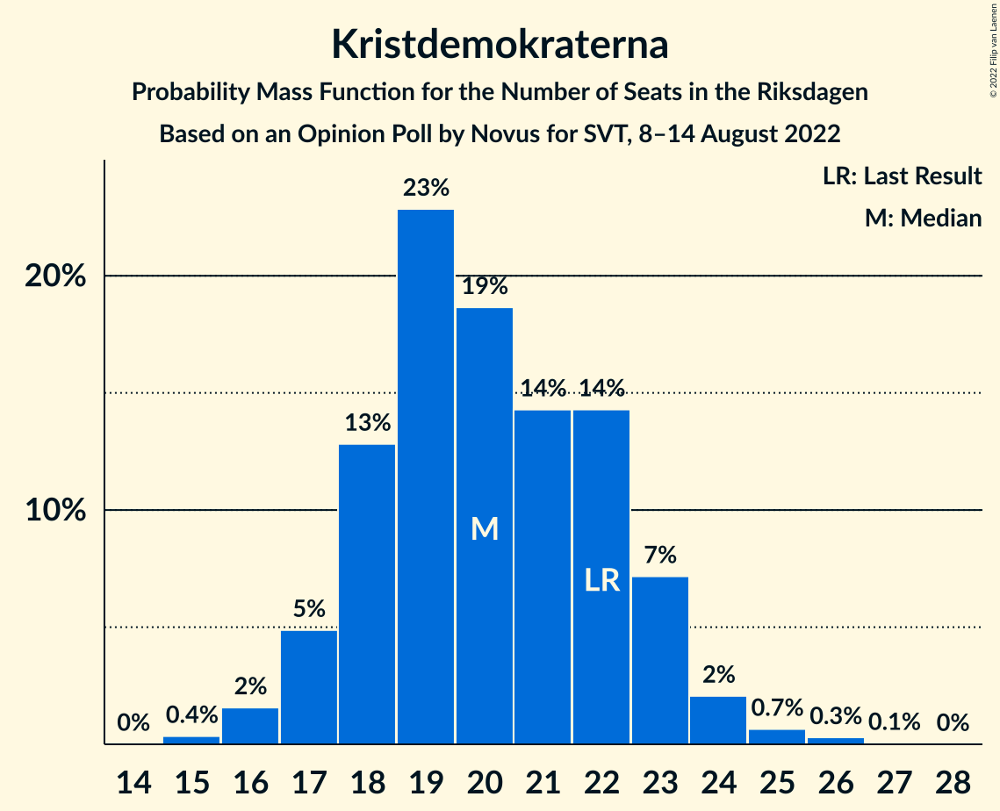

| Number of Seats | Probability | Accumulated | Special Marks |
|:---------------:|:-----------:|:-----------:|:-------------:|
| 15 | 0.4% | 100% |  |
| 16 | 2% | 99.6% |  |
| 17 | 5% | 98% |  |
| 18 | 13% | 93% |  |
| 19 | 23% | 80% |  |
| 20 | 19% | 57% | Median |
| 21 | 14% | 39% |  |
| 22 | 14% | 25% | Last Result |
| 23 | 7% | 10% |  |
| 24 | 2% | 3% |  |
| 25 | 0.7% | 1.0% |  |
| 26 | 0.3% | 0.4% |  |
| 27 | 0.1% | 0.1% |  |
| 28 | 0% | 0% |  |

### Miljöpartiet de gröna

*For a full overview of the results for this party, see the [Miljöpartiet de gröna](party-miljöpartietdegröna.html) page.*

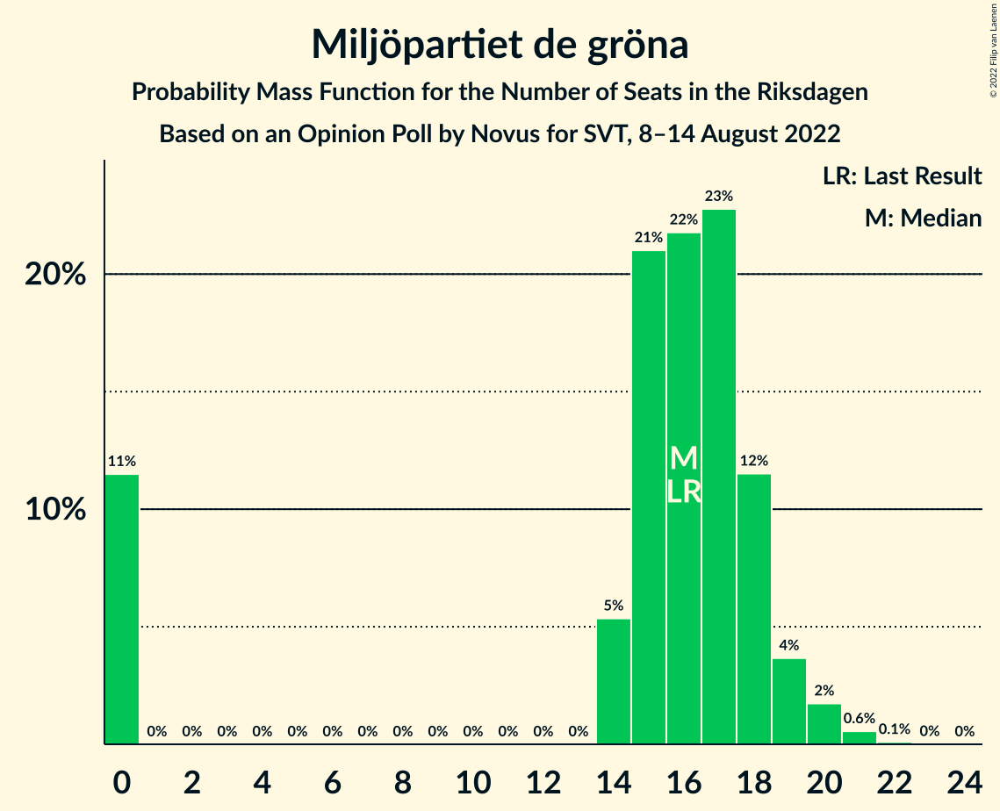

| Number of Seats | Probability | Accumulated | Special Marks |
|:---------------:|:-----------:|:-----------:|:-------------:|
| 0 | 11% | 100% |  |
| 1 | 0% | 89% |  |
| 2 | 0% | 89% |  |
| 3 | 0% | 89% |  |
| 4 | 0% | 89% |  |
| 5 | 0% | 89% |  |
| 6 | 0% | 89% |  |
| 7 | 0% | 89% |  |
| 8 | 0% | 89% |  |
| 9 | 0% | 89% |  |
| 10 | 0% | 89% |  |
| 11 | 0% | 89% |  |
| 12 | 0% | 89% |  |
| 13 | 0% | 89% |  |
| 14 | 5% | 89% |  |
| 15 | 21% | 83% |  |
| 16 | 22% | 62% | Last Result, Median |
| 17 | 23% | 40% |  |
| 18 | 12% | 18% |  |
| 19 | 4% | 6% |  |
| 20 | 2% | 2% |  |
| 21 | 0.6% | 0.7% |  |
| 22 | 0.1% | 0.1% |  |
| 23 | 0% | 0% |  |

## Coalitions

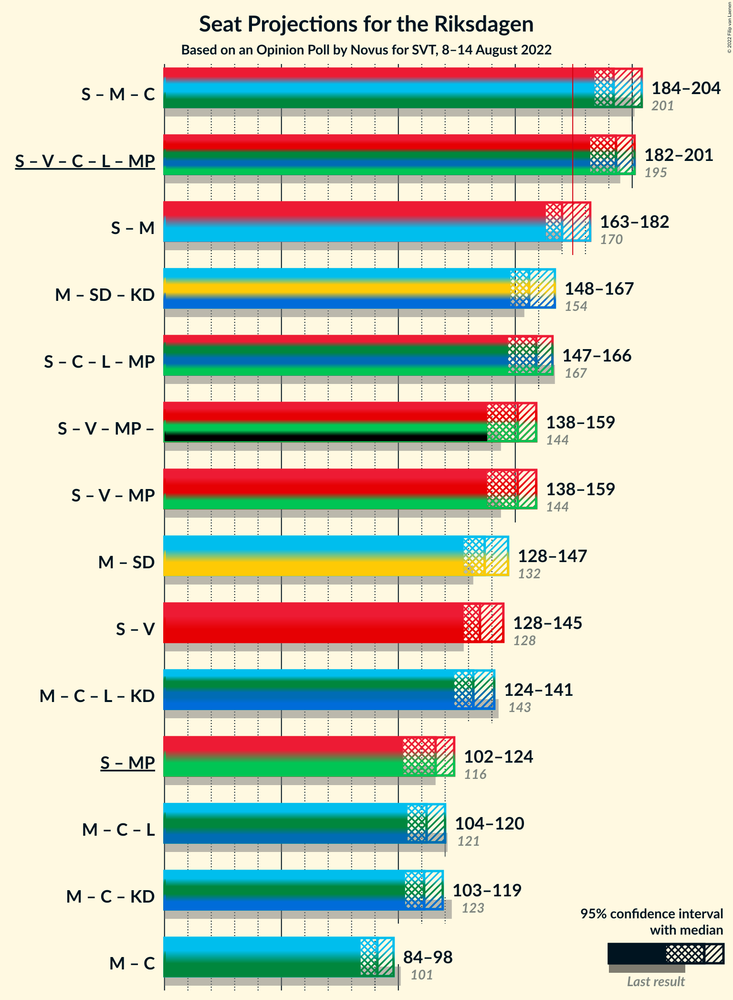

### Confidence Intervals

| Coalition | Last Result | Median | Majority? | 80% Confidence Interval | 90% Confidence Interval | 95% Confidence Interval | 99% Confidence Interval |
|:---------:|:-----------:|:------:|:---------:|:-----------------------:|:-----------------------:|:-----------------------:|:-----------------------:|
| Sveriges socialdemokratiska arbetareparti – Moderata samlingspartiet – Centerpartiet | 201 | 192 | 100% | 186–199 | 185–202 | 184–204 | 181–207 |
| Sveriges socialdemokratiska arbetareparti – Vänsterpartiet – Centerpartiet – Liberalerna – Miljöpartiet de gröna | 195 | 193 | 99.9% | 187–198 | 185–199 | 182–201 | 179–203 |
| Sveriges socialdemokratiska arbetareparti – Moderata samlingspartiet | 170 | 170 | 20% | 165–177 | 164–180 | 163–182 | 160–185 |
| Moderata samlingspartiet – Sverigedemokraterna – Kristdemokraterna | 154 | 156 | 0.1% | 151–162 | 150–164 | 148–167 | 146–170 |
| Sveriges socialdemokratiska arbetareparti – Centerpartiet – Liberalerna – Miljöpartiet de gröna | 167 | 159 | 0% | 152–164 | 149–165 | 147–166 | 143–169 |
| Sveriges socialdemokratiska arbetareparti – Vänsterpartiet – Miljöpartiet de gröna | 144 | 151 | 0% | 144–156 | 141–157 | 138–159 | 135–161 |
| Moderata samlingspartiet – Sverigedemokraterna | 132 | 137 | 0% | 132–142 | 131–143 | 128–147 | 127–148 |
| Sveriges socialdemokratiska arbetareparti – Vänsterpartiet | 128 | 135 | 0% | 130–141 | 129–144 | 128–145 | 125–148 |
| Moderata samlingspartiet – Centerpartiet – Liberalerna – Kristdemokraterna | 143 | 132 | 0% | 126–138 | 125–139 | 124–141 | 122–144 |
| Sveriges socialdemokratiska arbetareparti – Miljöpartiet de gröna | 116 | 116 | 0% | 108–122 | 105–123 | 102–124 | 99–127 |
| Moderata samlingspartiet – Centerpartiet – Liberalerna | 121 | 112 | 0% | 106–117 | 105–119 | 104–120 | 102–123 |
| Moderata samlingspartiet – Centerpartiet – Kristdemokraterna | 123 | 111 | 0% | 106–117 | 104–118 | 103–119 | 101–123 |
| Moderata samlingspartiet – Centerpartiet | 101 | 91 | 0% | 87–96 | 85–97 | 84–98 | 82–102 |

### Sveriges socialdemokratiska arbetareparti – Moderata samlingspartiet – Centerpartiet

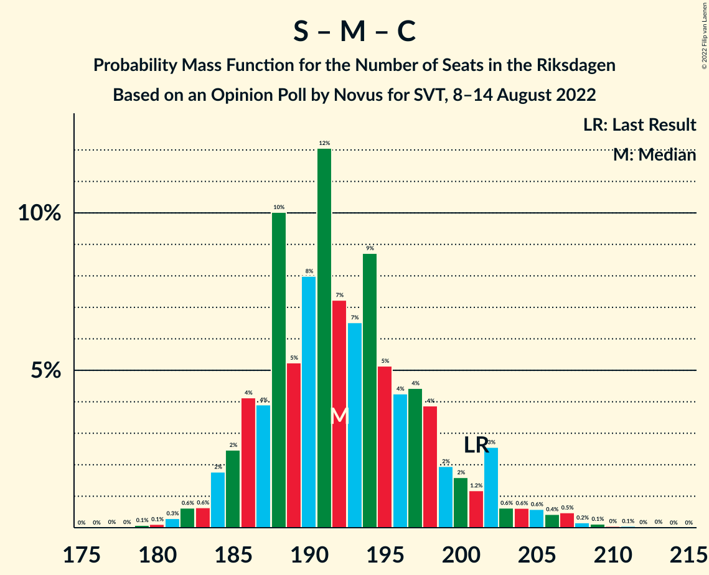

| Number of Seats | Probability | Accumulated | Special Marks |
|:---------------:|:-----------:|:-----------:|:-------------:|
| 179 | 0.1% | 100% |  |
| 180 | 0.1% | 99.9% |  |
| 181 | 0.3% | 99.8% |  |
| 182 | 0.6% | 99.5% |  |
| 183 | 0.6% | 98.8% |  |
| 184 | 2% | 98% |  |
| 185 | 2% | 96% |  |
| 186 | 4% | 94% |  |
| 187 | 4% | 90% |  |
| 188 | 10% | 86% |  |
| 189 | 5% | 76% |  |
| 190 | 8% | 71% |  |
| 191 | 12% | 63% |  |
| 192 | 7% | 51% |  |
| 193 | 7% | 43% | Median |
| 194 | 9% | 37% |  |
| 195 | 5% | 28% |  |
| 196 | 4% | 23% |  |
| 197 | 4% | 19% |  |
| 198 | 4% | 14% |  |
| 199 | 2% | 10% |  |
| 200 | 2% | 9% |  |
| 201 | 1.2% | 7% | Last Result |
| 202 | 3% | 6% |  |
| 203 | 0.6% | 3% |  |
| 204 | 0.6% | 3% |  |
| 205 | 0.6% | 2% |  |
| 206 | 0.4% | 1.3% |  |
| 207 | 0.5% | 0.9% |  |
| 208 | 0.2% | 0.4% |  |
| 209 | 0.1% | 0.3% |  |
| 210 | 0% | 0.1% |  |
| 211 | 0.1% | 0.1% |  |
| 212 | 0% | 0% |  |

### Sveriges socialdemokratiska arbetareparti – Vänsterpartiet – Centerpartiet – Liberalerna – Miljöpartiet de gröna

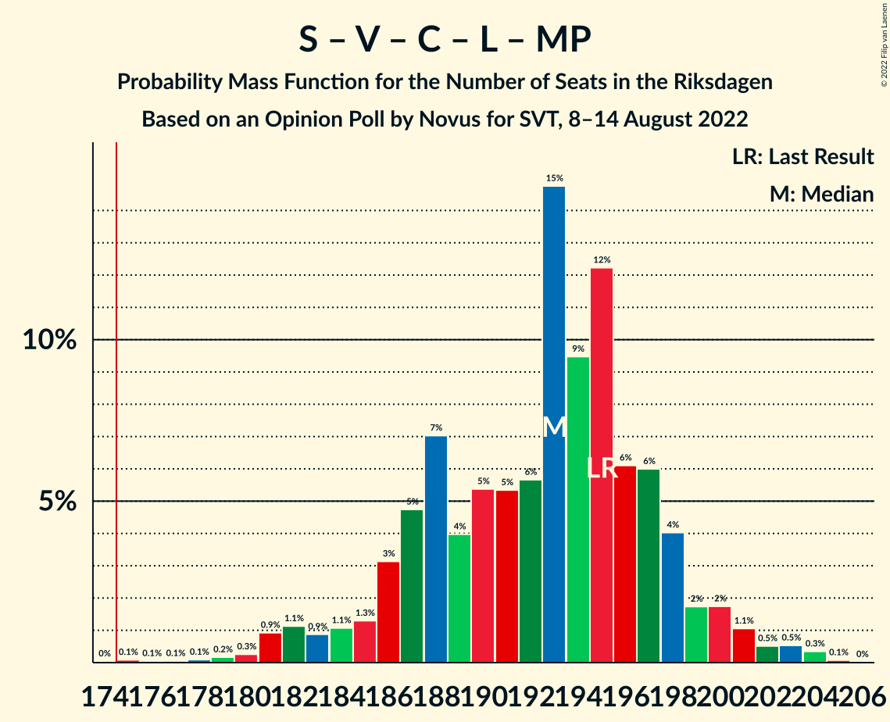

| Number of Seats | Probability | Accumulated | Special Marks |
|:---------------:|:-----------:|:-----------:|:-------------:|
| 174 | 0% | 100% |  |
| 175 | 0.1% | 99.9% | Majority |
| 176 | 0.1% | 99.9% |  |
| 177 | 0.1% | 99.8% |  |
| 178 | 0.1% | 99.8% |  |
| 179 | 0.2% | 99.7% |  |
| 180 | 0.3% | 99.5% |  |
| 181 | 0.9% | 99.2% |  |
| 182 | 1.1% | 98% |  |
| 183 | 0.9% | 97% |  |
| 184 | 1.1% | 96% |  |
| 185 | 1.3% | 95% |  |
| 186 | 3% | 94% |  |
| 187 | 5% | 91% |  |
| 188 | 7% | 86% |  |
| 189 | 4% | 79% |  |
| 190 | 5% | 75% |  |
| 191 | 5% | 70% |  |
| 192 | 6% | 64% |  |
| 193 | 15% | 59% |  |
| 194 | 9% | 44% | Median |
| 195 | 12% | 34% | Last Result |
| 196 | 6% | 22% |  |
| 197 | 6% | 16% |  |
| 198 | 4% | 10% |  |
| 199 | 2% | 6% |  |
| 200 | 2% | 4% |  |
| 201 | 1.1% | 3% |  |
| 202 | 0.5% | 2% |  |
| 203 | 0.5% | 1.0% |  |
| 204 | 0.3% | 0.5% |  |
| 205 | 0.1% | 0.1% |  |
| 206 | 0% | 0% |  |

### Sveriges socialdemokratiska arbetareparti – Moderata samlingspartiet

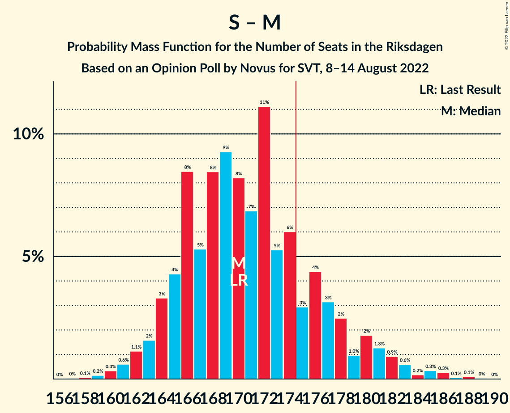

| Number of Seats | Probability | Accumulated | Special Marks |
|:---------------:|:-----------:|:-----------:|:-------------:|
| 157 | 0% | 100% |  |
| 158 | 0.1% | 99.9% |  |
| 159 | 0.2% | 99.9% |  |
| 160 | 0.3% | 99.7% |  |
| 161 | 0.6% | 99.4% |  |
| 162 | 1.1% | 98.8% |  |
| 163 | 2% | 98% |  |
| 164 | 3% | 96% |  |
| 165 | 4% | 93% |  |
| 166 | 8% | 88% |  |
| 167 | 5% | 80% |  |
| 168 | 8% | 75% |  |
| 169 | 9% | 66% |  |
| 170 | 8% | 57% | Last Result |
| 171 | 7% | 49% | Median |
| 172 | 11% | 42% |  |
| 173 | 5% | 31% |  |
| 174 | 6% | 26% |  |
| 175 | 3% | 20% | Majority |
| 176 | 4% | 17% |  |
| 177 | 3% | 12% |  |
| 178 | 2% | 9% |  |
| 179 | 1.0% | 7% |  |
| 180 | 2% | 6% |  |
| 181 | 1.3% | 4% |  |
| 182 | 0.9% | 3% |  |
| 183 | 0.6% | 2% |  |
| 184 | 0.2% | 1.0% |  |
| 185 | 0.3% | 0.8% |  |
| 186 | 0.3% | 0.5% |  |
| 187 | 0.1% | 0.2% |  |
| 188 | 0.1% | 0.2% |  |
| 189 | 0% | 0.1% |  |
| 190 | 0% | 0% |  |

### Moderata samlingspartiet – Sverigedemokraterna – Kristdemokraterna

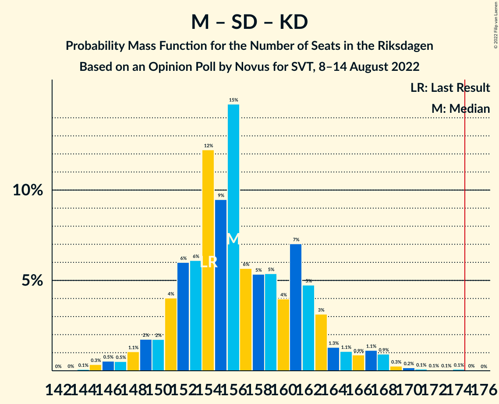

| Number of Seats | Probability | Accumulated | Special Marks |
|:---------------:|:-----------:|:-----------:|:-------------:|
| 144 | 0.1% | 100% |  |
| 145 | 0.3% | 99.9% |  |
| 146 | 0.5% | 99.5% |  |
| 147 | 0.5% | 99.0% |  |
| 148 | 1.1% | 98% |  |
| 149 | 2% | 97% |  |
| 150 | 2% | 96% |  |
| 151 | 4% | 94% |  |
| 152 | 6% | 90% |  |
| 153 | 6% | 84% |  |
| 154 | 12% | 78% | Last Result |
| 155 | 9% | 66% |  |
| 156 | 15% | 56% |  |
| 157 | 6% | 41% | Median |
| 158 | 5% | 36% |  |
| 159 | 5% | 30% |  |
| 160 | 4% | 25% |  |
| 161 | 7% | 21% |  |
| 162 | 5% | 14% |  |
| 163 | 3% | 9% |  |
| 164 | 1.3% | 6% |  |
| 165 | 1.1% | 5% |  |
| 166 | 0.9% | 4% |  |
| 167 | 1.1% | 3% |  |
| 168 | 0.9% | 2% |  |
| 169 | 0.3% | 0.8% |  |
| 170 | 0.2% | 0.5% |  |
| 171 | 0.1% | 0.3% |  |
| 172 | 0.1% | 0.2% |  |
| 173 | 0.1% | 0.2% |  |
| 174 | 0.1% | 0.1% |  |
| 175 | 0% | 0.1% | Majority |
| 176 | 0% | 0% |  |

### Sveriges socialdemokratiska arbetareparti – Centerpartiet – Liberalerna – Miljöpartiet de gröna

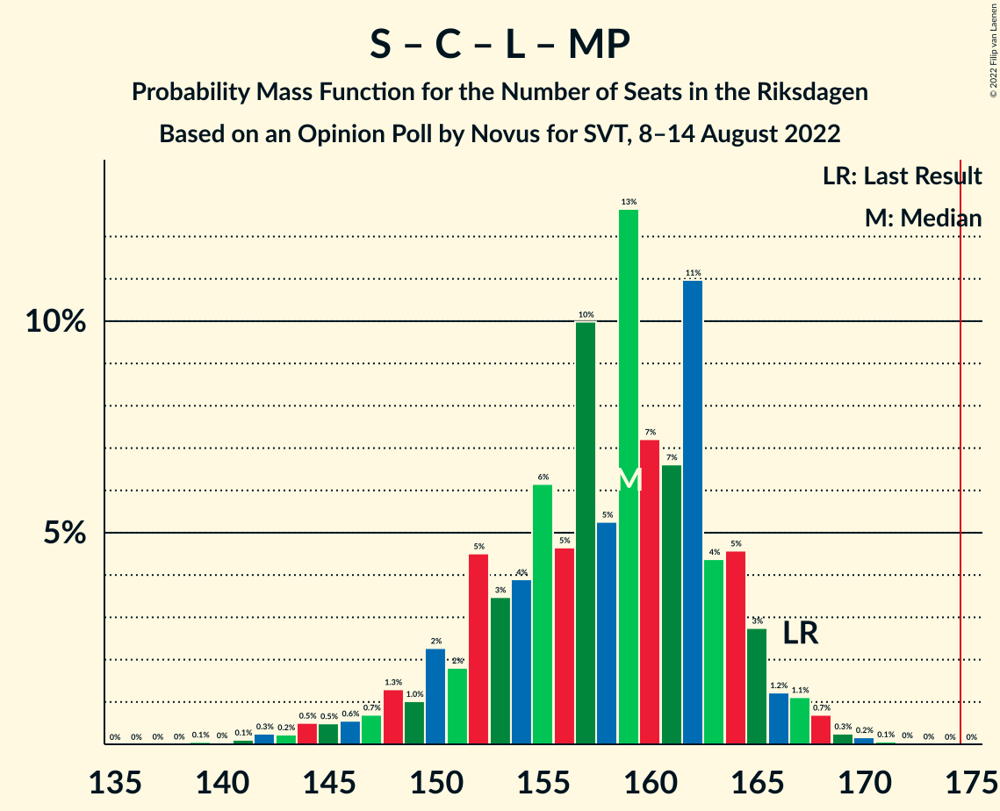

| Number of Seats | Probability | Accumulated | Special Marks |
|:---------------:|:-----------:|:-----------:|:-------------:|
| 139 | 0.1% | 100% |  |
| 140 | 0% | 99.9% |  |
| 141 | 0.1% | 99.9% |  |
| 142 | 0.3% | 99.8% |  |
| 143 | 0.2% | 99.5% |  |
| 144 | 0.5% | 99.3% |  |
| 145 | 0.5% | 98.8% |  |
| 146 | 0.6% | 98% |  |
| 147 | 0.7% | 98% |  |
| 148 | 1.3% | 97% |  |
| 149 | 1.0% | 96% |  |
| 150 | 2% | 95% |  |
| 151 | 2% | 92% |  |
| 152 | 5% | 91% |  |
| 153 | 3% | 86% |  |
| 154 | 4% | 83% |  |
| 155 | 6% | 79% |  |
| 156 | 5% | 73% |  |
| 157 | 10% | 68% |  |
| 158 | 5% | 58% |  |
| 159 | 13% | 53% |  |
| 160 | 7% | 40% | Median |
| 161 | 7% | 33% |  |
| 162 | 11% | 26% |  |
| 163 | 4% | 15% |  |
| 164 | 5% | 11% |  |
| 165 | 3% | 6% |  |
| 166 | 1.2% | 4% |  |
| 167 | 1.1% | 2% | Last Result |
| 168 | 0.7% | 1.2% |  |
| 169 | 0.3% | 0.5% |  |
| 170 | 0.2% | 0.3% |  |
| 171 | 0.1% | 0.1% |  |
| 172 | 0% | 0.1% |  |
| 173 | 0% | 0% |  |

### Sveriges socialdemokratiska arbetareparti – Vänsterpartiet – Miljöpartiet de gröna

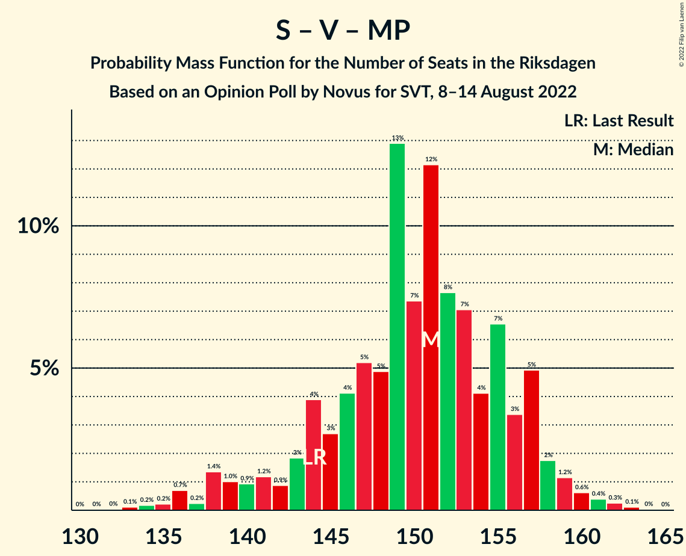

| Number of Seats | Probability | Accumulated | Special Marks |
|:---------------:|:-----------:|:-----------:|:-------------:|
| 131 | 0% | 100% |  |
| 132 | 0% | 99.9% |  |
| 133 | 0.1% | 99.9% |  |
| 134 | 0.2% | 99.8% |  |
| 135 | 0.2% | 99.6% |  |
| 136 | 0.7% | 99.4% |  |
| 137 | 0.2% | 98.7% |  |
| 138 | 1.4% | 98% |  |
| 139 | 1.0% | 97% |  |
| 140 | 0.9% | 96% |  |
| 141 | 1.2% | 95% |  |
| 142 | 0.9% | 94% |  |
| 143 | 2% | 93% |  |
| 144 | 4% | 91% | Last Result |
| 145 | 3% | 87% |  |
| 146 | 4% | 85% |  |
| 147 | 5% | 81% |  |
| 148 | 5% | 75% |  |
| 149 | 13% | 70% |  |
| 150 | 7% | 58% |  |
| 151 | 12% | 50% | Median |
| 152 | 8% | 38% |  |
| 153 | 7% | 30% |  |
| 154 | 4% | 23% |  |
| 155 | 7% | 19% |  |
| 156 | 3% | 13% |  |
| 157 | 5% | 9% |  |
| 158 | 2% | 4% |  |
| 159 | 1.2% | 3% |  |
| 160 | 0.6% | 1.4% |  |
| 161 | 0.4% | 0.8% |  |
| 162 | 0.3% | 0.4% |  |
| 163 | 0.1% | 0.2% |  |
| 164 | 0% | 0.1% |  |
| 165 | 0% | 0% |  |

### Moderata samlingspartiet – Sverigedemokraterna

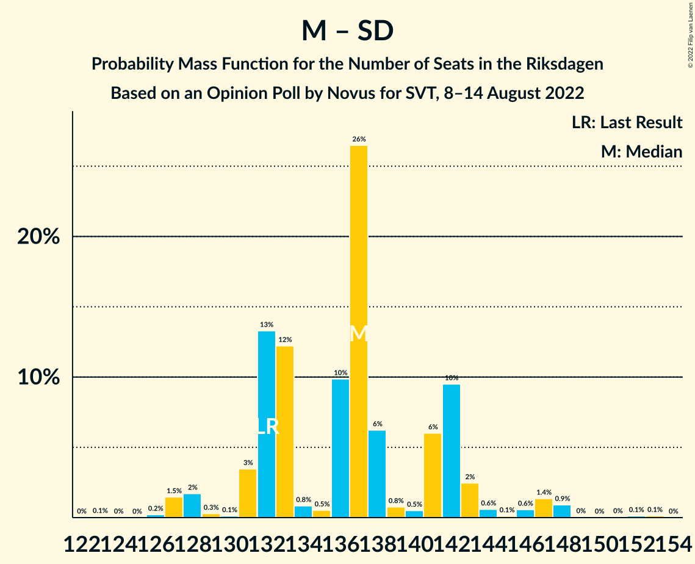

| Number of Seats | Probability | Accumulated | Special Marks |
|:---------------:|:-----------:|:-----------:|:-------------:|
| 123 | 0.1% | 100% |  |
| 124 | 0% | 99.9% |  |
| 125 | 0% | 99.9% |  |
| 126 | 0.2% | 99.9% |  |
| 127 | 1.5% | 99.7% |  |
| 128 | 2% | 98% |  |
| 129 | 0.3% | 97% |  |
| 130 | 0.1% | 96% |  |
| 131 | 3% | 96% |  |
| 132 | 13% | 93% | Last Result |
| 133 | 12% | 79% |  |
| 134 | 0.8% | 67% |  |
| 135 | 0.5% | 66% |  |
| 136 | 10% | 66% |  |
| 137 | 26% | 56% | Median |
| 138 | 6% | 29% |  |
| 139 | 0.8% | 23% |  |
| 140 | 0.5% | 22% |  |
| 141 | 6% | 22% |  |
| 142 | 10% | 16% |  |
| 143 | 2% | 6% |  |
| 144 | 0.6% | 4% |  |
| 145 | 0.1% | 3% |  |
| 146 | 0.6% | 3% |  |
| 147 | 1.4% | 3% |  |
| 148 | 0.9% | 1.3% |  |
| 149 | 0% | 0.4% |  |
| 150 | 0% | 0.3% |  |
| 151 | 0% | 0.3% |  |
| 152 | 0.1% | 0.3% |  |
| 153 | 0.1% | 0.1% |  |
| 154 | 0% | 0% |  |

### Sveriges socialdemokratiska arbetareparti – Vänsterpartiet

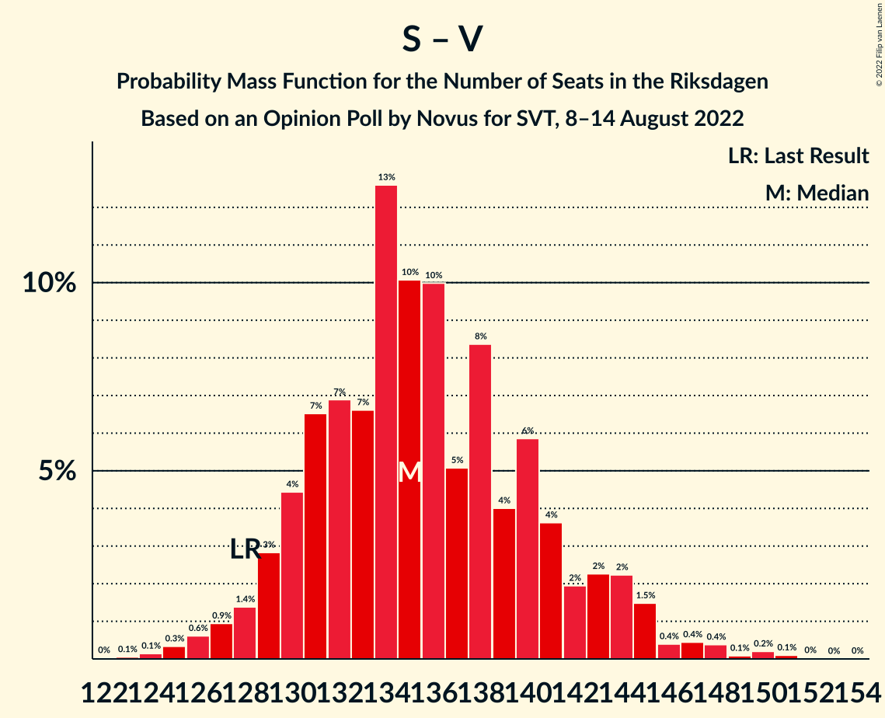

| Number of Seats | Probability | Accumulated | Special Marks |
|:---------------:|:-----------:|:-----------:|:-------------:|
| 123 | 0.1% | 100% |  |
| 124 | 0.1% | 99.9% |  |
| 125 | 0.3% | 99.8% |  |
| 126 | 0.6% | 99.4% |  |
| 127 | 0.9% | 98.8% |  |
| 128 | 1.4% | 98% | Last Result |
| 129 | 3% | 96% |  |
| 130 | 4% | 94% |  |
| 131 | 7% | 89% |  |
| 132 | 7% | 83% |  |
| 133 | 7% | 76% |  |
| 134 | 13% | 69% |  |
| 135 | 10% | 57% | Median |
| 136 | 10% | 47% |  |
| 137 | 5% | 37% |  |
| 138 | 8% | 31% |  |
| 139 | 4% | 23% |  |
| 140 | 6% | 19% |  |
| 141 | 4% | 13% |  |
| 142 | 2% | 10% |  |
| 143 | 2% | 8% |  |
| 144 | 2% | 5% |  |
| 145 | 1.5% | 3% |  |
| 146 | 0.4% | 2% |  |
| 147 | 0.4% | 1.3% |  |
| 148 | 0.4% | 0.8% |  |
| 149 | 0.1% | 0.4% |  |
| 150 | 0.2% | 0.4% |  |
| 151 | 0.1% | 0.1% |  |
| 152 | 0% | 0.1% |  |
| 153 | 0% | 0% |  |

### Moderata samlingspartiet – Centerpartiet – Liberalerna – Kristdemokraterna

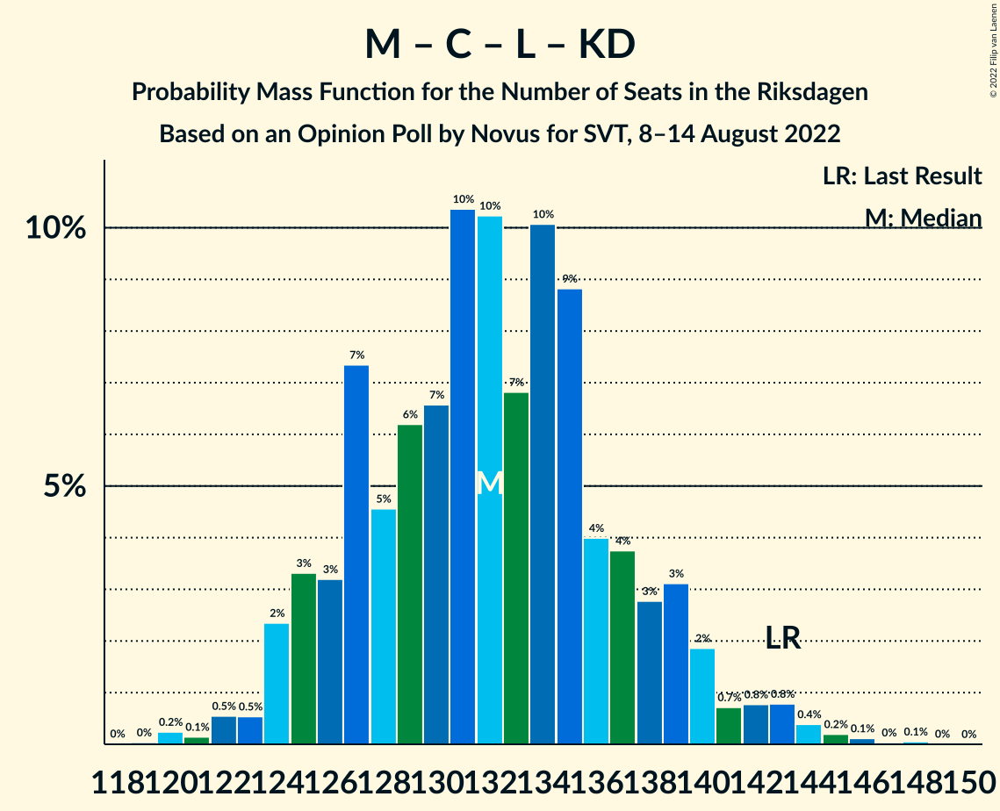

| Number of Seats | Probability | Accumulated | Special Marks |
|:---------------:|:-----------:|:-----------:|:-------------:|
| 119 | 0% | 100% |  |
| 120 | 0.2% | 99.9% |  |
| 121 | 0.1% | 99.7% |  |
| 122 | 0.5% | 99.5% |  |
| 123 | 0.5% | 99.0% |  |
| 124 | 2% | 98% |  |
| 125 | 3% | 96% |  |
| 126 | 3% | 93% |  |
| 127 | 7% | 90% |  |
| 128 | 5% | 82% |  |
| 129 | 6% | 78% |  |
| 130 | 7% | 71% |  |
| 131 | 10% | 65% |  |
| 132 | 10% | 55% |  |
| 133 | 7% | 44% | Median |
| 134 | 10% | 37% |  |
| 135 | 9% | 27% |  |
| 136 | 4% | 19% |  |
| 137 | 4% | 15% |  |
| 138 | 3% | 11% |  |
| 139 | 3% | 8% |  |
| 140 | 2% | 5% |  |
| 141 | 0.7% | 3% |  |
| 142 | 0.8% | 2% |  |
| 143 | 0.8% | 2% | Last Result |
| 144 | 0.4% | 0.8% |  |
| 145 | 0.2% | 0.4% |  |
| 146 | 0.1% | 0.2% |  |
| 147 | 0% | 0.1% |  |
| 148 | 0.1% | 0.1% |  |
| 149 | 0% | 0% |  |

### Sveriges socialdemokratiska arbetareparti – Miljöpartiet de gröna

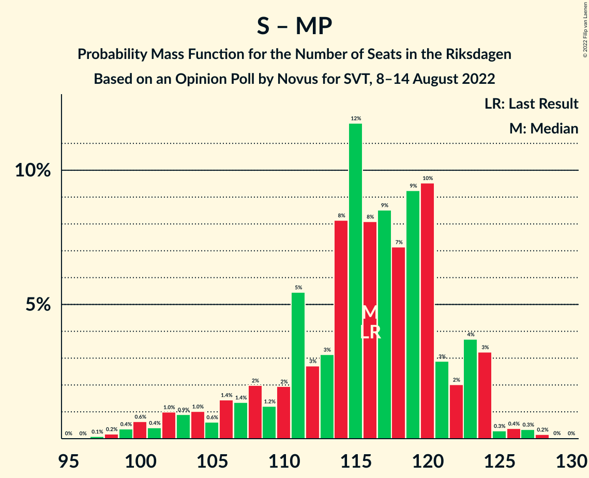

| Number of Seats | Probability | Accumulated | Special Marks |
|:---------------:|:-----------:|:-----------:|:-------------:|
| 96 | 0% | 100% |  |
| 97 | 0.1% | 99.9% |  |
| 98 | 0.2% | 99.9% |  |
| 99 | 0.4% | 99.7% |  |
| 100 | 0.6% | 99.3% |  |
| 101 | 0.4% | 98.7% |  |
| 102 | 1.0% | 98% |  |
| 103 | 0.9% | 97% |  |
| 104 | 1.0% | 96% |  |
| 105 | 0.6% | 95% |  |
| 106 | 1.4% | 95% |  |
| 107 | 1.4% | 93% |  |
| 108 | 2% | 92% |  |
| 109 | 1.2% | 90% |  |
| 110 | 2% | 89% |  |
| 111 | 5% | 87% |  |
| 112 | 3% | 81% |  |
| 113 | 3% | 79% |  |
| 114 | 8% | 75% |  |
| 115 | 12% | 67% |  |
| 116 | 8% | 56% | Last Result |
| 117 | 9% | 48% | Median |
| 118 | 7% | 39% |  |
| 119 | 9% | 32% |  |
| 120 | 10% | 23% |  |
| 121 | 3% | 13% |  |
| 122 | 2% | 10% |  |
| 123 | 4% | 8% |  |
| 124 | 3% | 4% |  |
| 125 | 0.3% | 1.2% |  |
| 126 | 0.4% | 0.9% |  |
| 127 | 0.3% | 0.6% |  |
| 128 | 0.2% | 0.2% |  |
| 129 | 0% | 0.1% |  |
| 130 | 0% | 0% |  |

### Moderata samlingspartiet – Centerpartiet – Liberalerna

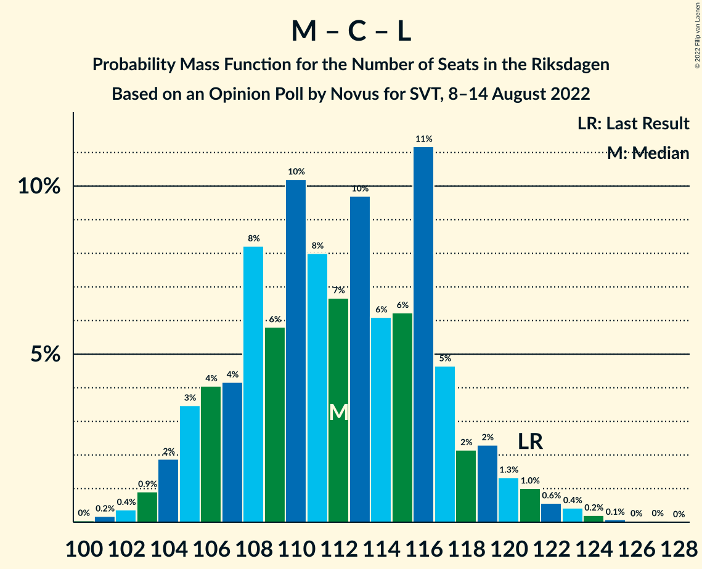

| Number of Seats | Probability | Accumulated | Special Marks |
|:---------------:|:-----------:|:-----------:|:-------------:|
| 100 | 0% | 100% |  |
| 101 | 0.2% | 99.9% |  |
| 102 | 0.4% | 99.7% |  |
| 103 | 0.9% | 99.4% |  |
| 104 | 2% | 98% |  |
| 105 | 3% | 97% |  |
| 106 | 4% | 93% |  |
| 107 | 4% | 89% |  |
| 108 | 8% | 85% |  |
| 109 | 6% | 77% |  |
| 110 | 10% | 71% |  |
| 111 | 8% | 61% |  |
| 112 | 7% | 53% |  |
| 113 | 10% | 46% | Median |
| 114 | 6% | 36% |  |
| 115 | 6% | 30% |  |
| 116 | 11% | 24% |  |
| 117 | 5% | 13% |  |
| 118 | 2% | 8% |  |
| 119 | 2% | 6% |  |
| 120 | 1.3% | 4% |  |
| 121 | 1.0% | 2% | Last Result |
| 122 | 0.6% | 1.4% |  |
| 123 | 0.4% | 0.8% |  |
| 124 | 0.2% | 0.4% |  |
| 125 | 0.1% | 0.2% |  |
| 126 | 0% | 0.1% |  |
| 127 | 0% | 0.1% |  |
| 128 | 0% | 0% |  |

### Moderata samlingspartiet – Centerpartiet – Kristdemokraterna

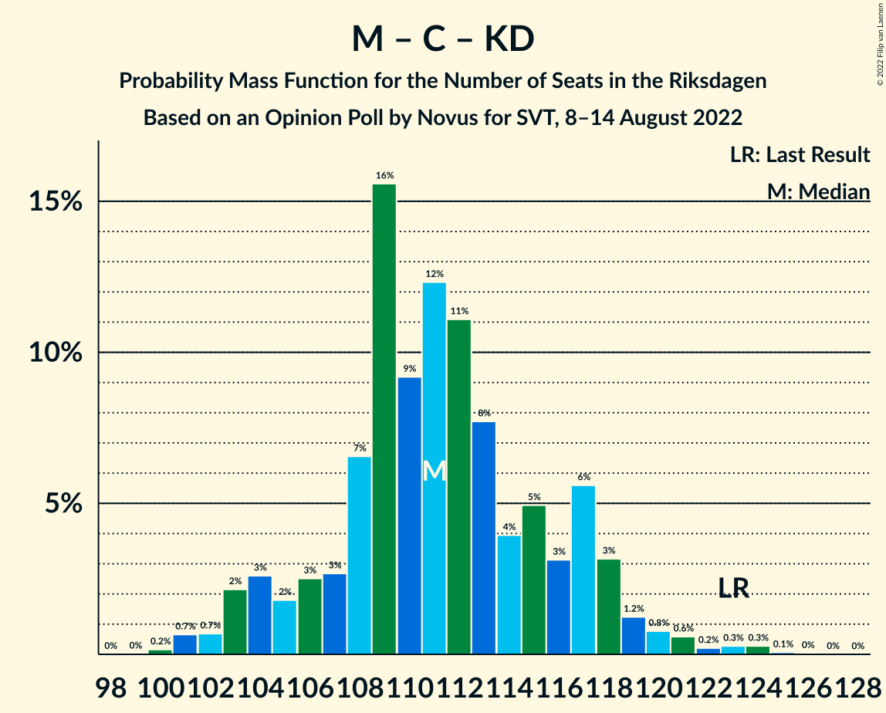

| Number of Seats | Probability | Accumulated | Special Marks |
|:---------------:|:-----------:|:-----------:|:-------------:|
| 100 | 0.2% | 100% |  |
| 101 | 0.7% | 99.8% |  |
| 102 | 0.7% | 99.1% |  |
| 103 | 2% | 98% |  |
| 104 | 3% | 96% |  |
| 105 | 2% | 94% |  |
| 106 | 3% | 92% |  |
| 107 | 3% | 89% |  |
| 108 | 7% | 87% |  |
| 109 | 16% | 80% |  |
| 110 | 9% | 65% |  |
| 111 | 12% | 55% |  |
| 112 | 11% | 43% | Median |
| 113 | 8% | 32% |  |
| 114 | 4% | 24% |  |
| 115 | 5% | 20% |  |
| 116 | 3% | 15% |  |
| 117 | 6% | 12% |  |
| 118 | 3% | 7% |  |
| 119 | 1.2% | 3% |  |
| 120 | 0.8% | 2% |  |
| 121 | 0.6% | 1.5% |  |
| 122 | 0.2% | 0.9% |  |
| 123 | 0.3% | 0.7% | Last Result |
| 124 | 0.3% | 0.4% |  |
| 125 | 0.1% | 0.1% |  |
| 126 | 0% | 0.1% |  |
| 127 | 0% | 0% |  |

### Moderata samlingspartiet – Centerpartiet

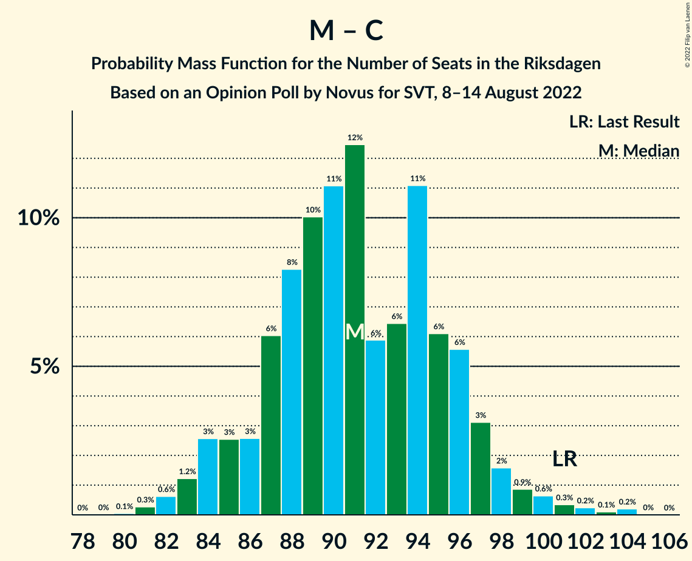

| Number of Seats | Probability | Accumulated | Special Marks |
|:---------------:|:-----------:|:-----------:|:-------------:|
| 80 | 0.1% | 100% |  |
| 81 | 0.3% | 99.9% |  |
| 82 | 0.6% | 99.7% |  |
| 83 | 1.2% | 99.0% |  |
| 84 | 3% | 98% |  |
| 85 | 3% | 95% |  |
| 86 | 3% | 93% |  |
| 87 | 6% | 90% |  |
| 88 | 8% | 84% |  |
| 89 | 10% | 76% |  |
| 90 | 11% | 66% |  |
| 91 | 12% | 55% |  |
| 92 | 6% | 42% | Median |
| 93 | 6% | 36% |  |
| 94 | 11% | 30% |  |
| 95 | 6% | 19% |  |
| 96 | 6% | 13% |  |
| 97 | 3% | 7% |  |
| 98 | 2% | 4% |  |
| 99 | 0.9% | 2% |  |
| 100 | 0.6% | 2% |  |
| 101 | 0.3% | 0.9% | Last Result |
| 102 | 0.2% | 0.6% |  |
| 103 | 0.1% | 0.3% |  |
| 104 | 0.2% | 0.2% |  |
| 105 | 0% | 0% |  |

## Technical Information

### Opinion Poll

+ **Polling firm:** Novus
+ **Commissioner(s):** SVT
+ **Fieldwork period:** 8–14 August 2022

### Calculations

+ **Sample size:** 2067
+ **Simulations done:** 1,048,576
+ **Error estimate:** 1.22%

