# Opinion Poll by Sifo for Svenska Dagbladet, 12–14 August 2022

<a href="#voting-intentions">Voting Intentions</a> | <a href="#seats">Seats</a> | <a href="#coalitions">Coalitions</a> | <a href="#technical-information">Technical Information</a>

## Voting Intentions

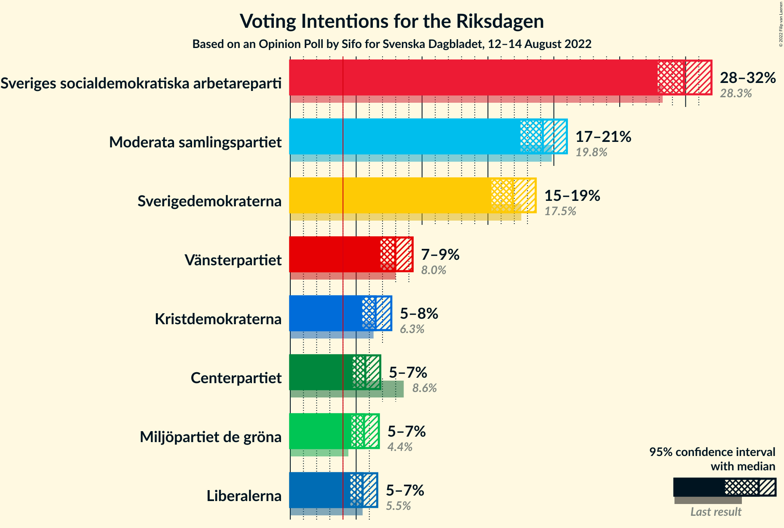

### Confidence Intervals

| Party | Last Result | Poll Result | 80% Confidence Interval | 90% Confidence Interval | 95% Confidence Interval | 99% Confidence Interval |
|:-----:|:-----------:|:-----------:|:-----------------------:|:-----------------------:|:-----------------------:|:-----------------------:|
| Sveriges socialdemokratiska arbetareparti | 28.3% | 29.9% | 28.6–31.2% |28.2–31.6% |27.9–32.0% |27.3–32.6% |
| Moderata samlingspartiet | 19.8% | 19.2% | 18.0–20.3% |17.7–20.7% |17.5–21.0% |16.9–21.6% |
| Sverigedemokraterna | 17.5% | 16.9% | 15.8–18.0% |15.5–18.4% |15.3–18.6% |14.8–19.2% |
| Vänsterpartiet | 8.0% | 8.0% | 7.2–8.8% |7.0–9.1% |6.8–9.3% |6.5–9.7% |
| Kristdemokraterna | 6.3% | 6.5% | 5.8–7.3% |5.6–7.5% |5.5–7.7% |5.2–8.1% |
| Centerpartiet | 8.6% | 5.7% | 5.1–6.4% |4.9–6.6% |4.7–6.8% |4.5–7.2% |
| Miljöpartiet de gröna | 4.4% | 5.6% | 5.0–6.3% |4.8–6.5% |4.6–6.7% |4.4–7.1% |
| Liberalerna | 5.5% | 5.5% | 4.9–6.2% |4.7–6.4% |4.6–6.6% |4.3–7.0% |

*Note:* The poll result column reflects the actual value used in the calculations. Published results may vary slightly, and in addition be rounded to fewer digits.

## Seats

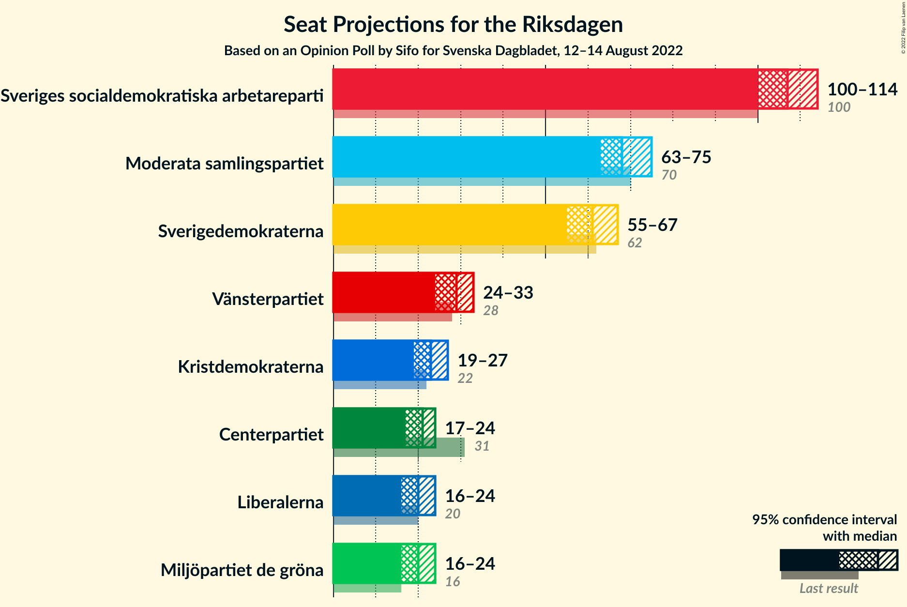

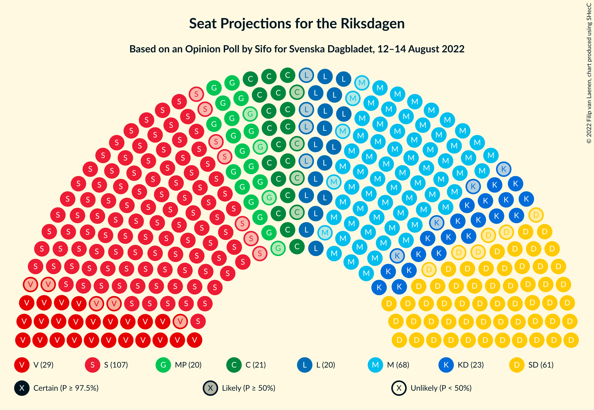

### Confidence Intervals

| Party | Last Result | Median | 80% Confidence Interval | 90% Confidence Interval | 95% Confidence Interval | 99% Confidence Interval |
|:-----:|:-----------:|:------:|:-----------------------:|:-----------------------:|:-----------------------:|:-----------------------:|
| <a href="#sveriges-socialdemokratiska-arbetareparti">Sveriges socialdemokratiska arbetareparti</a> | 100 | 107 | 102–112 |101–113 |100–114 |98–117 |
| <a href="#moderata-samlingspartiet">Moderata samlingspartiet</a> | 70 | 68 | 65–72 |63–74 |63–75 |61–77 |
| <a href="#sverigedemokraterna">Sverigedemokraterna</a> | 62 | 61 | 57–65 |56–66 |55–67 |53–69 |
| <a href="#vänsterpartiet">Vänsterpartiet</a> | 28 | 29 | 26–32 |25–33 |24–33 |23–35 |
| <a href="#kristdemokraterna">Kristdemokraterna</a> | 22 | 23 | 21–26 |20–27 |19–27 |18–29 |
| <a href="#centerpartiet">Centerpartiet</a> | 31 | 21 | 18–23 |18–24 |17–24 |16–26 |
| <a href="#miljöpartiet-de-gröna">Miljöpartiet de gröna</a> | 16 | 20 | 18–23 |17–23 |16–24 |16–25 |
| <a href="#liberalerna">Liberalerna</a> | 20 | 20 | 18–22 |17–23 |16–24 |15–25 |

### Sveriges socialdemokratiska arbetareparti

*For a full overview of the results for this party, see the [Sveriges socialdemokratiska arbetareparti](party-sverigessocialdemokratiskaarbetareparti.html) page.*

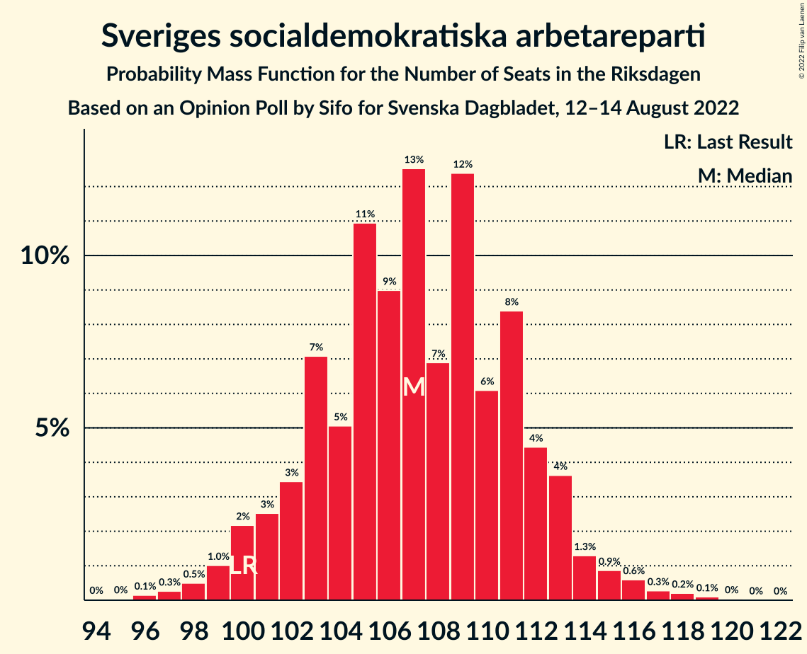

| Number of Seats | Probability | Accumulated | Special Marks |
|:---------------:|:-----------:|:-----------:|:-------------:|
| 95 | 0% | 100% |  |
| 96 | 0.1% | 99.9% |  |
| 97 | 0.3% | 99.8% |  |
| 98 | 0.5% | 99.5% |  |
| 99 | 1.0% | 99.0% |  |
| 100 | 2% | 98% | Last Result |
| 101 | 3% | 96% |  |
| 102 | 3% | 93% |  |
| 103 | 7% | 90% |  |
| 104 | 5% | 83% |  |
| 105 | 11% | 78% |  |
| 106 | 9% | 67% |  |
| 107 | 13% | 58% | Median |
| 108 | 7% | 45% |  |
| 109 | 12% | 38% |  |
| 110 | 6% | 26% |  |
| 111 | 8% | 20% |  |
| 112 | 4% | 11% |  |
| 113 | 4% | 7% |  |
| 114 | 1.3% | 3% |  |
| 115 | 0.9% | 2% |  |
| 116 | 0.6% | 1.2% |  |
| 117 | 0.3% | 0.6% |  |
| 118 | 0.2% | 0.4% |  |
| 119 | 0.1% | 0.2% |  |
| 120 | 0% | 0.1% |  |
| 121 | 0% | 0% |  |

### Moderata samlingspartiet

*For a full overview of the results for this party, see the [Moderata samlingspartiet](party-moderatasamlingspartiet.html) page.*

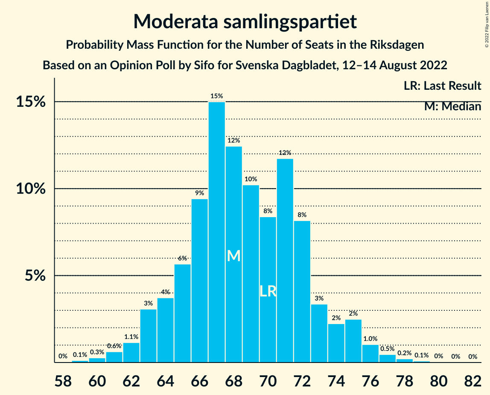

| Number of Seats | Probability | Accumulated | Special Marks |
|:---------------:|:-----------:|:-----------:|:-------------:|
| 58 | 0% | 100% |  |
| 59 | 0.1% | 99.9% |  |
| 60 | 0.3% | 99.8% |  |
| 61 | 0.6% | 99.6% |  |
| 62 | 1.1% | 98.9% |  |
| 63 | 3% | 98% |  |
| 64 | 4% | 95% |  |
| 65 | 6% | 91% |  |
| 66 | 9% | 85% |  |
| 67 | 15% | 76% |  |
| 68 | 12% | 61% | Median |
| 69 | 10% | 48% |  |
| 70 | 8% | 38% | Last Result |
| 71 | 12% | 30% |  |
| 72 | 8% | 18% |  |
| 73 | 3% | 10% |  |
| 74 | 2% | 7% |  |
| 75 | 2% | 4% |  |
| 76 | 1.0% | 2% |  |
| 77 | 0.5% | 0.8% |  |
| 78 | 0.2% | 0.4% |  |
| 79 | 0.1% | 0.2% |  |
| 80 | 0% | 0.1% |  |
| 81 | 0% | 0% |  |

### Sverigedemokraterna

*For a full overview of the results for this party, see the [Sverigedemokraterna](party-sverigedemokraterna.html) page.*

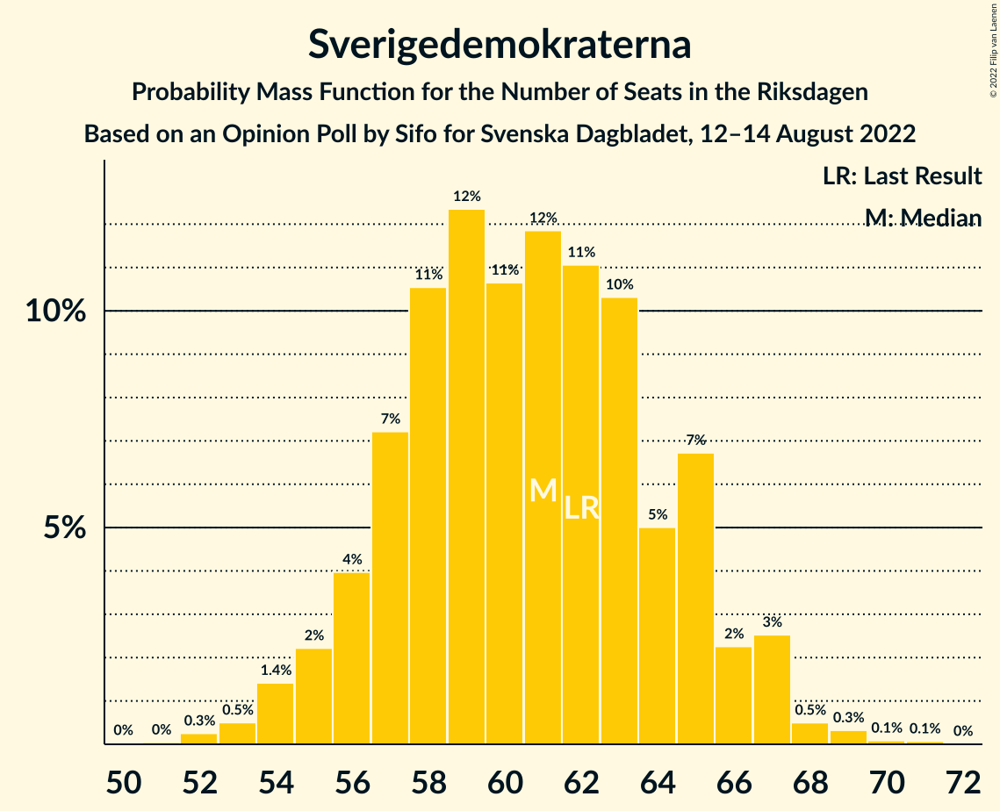

| Number of Seats | Probability | Accumulated | Special Marks |
|:---------------:|:-----------:|:-----------:|:-------------:|
| 51 | 0% | 100% |  |
| 52 | 0.3% | 99.9% |  |
| 53 | 0.5% | 99.7% |  |
| 54 | 1.4% | 99.2% |  |
| 55 | 2% | 98% |  |
| 56 | 4% | 96% |  |
| 57 | 7% | 92% |  |
| 58 | 11% | 84% |  |
| 59 | 12% | 74% |  |
| 60 | 11% | 61% |  |
| 61 | 12% | 51% | Median |
| 62 | 11% | 39% | Last Result |
| 63 | 10% | 28% |  |
| 64 | 5% | 18% |  |
| 65 | 7% | 13% |  |
| 66 | 2% | 6% |  |
| 67 | 3% | 4% |  |
| 68 | 0.5% | 1.0% |  |
| 69 | 0.3% | 0.5% |  |
| 70 | 0.1% | 0.2% |  |
| 71 | 0.1% | 0.1% |  |
| 72 | 0% | 0% |  |

### Vänsterpartiet

*For a full overview of the results for this party, see the [Vänsterpartiet](party-vänsterpartiet.html) page.*

| Number of Seats | Probability | Accumulated | Special Marks |
|:---------------:|:-----------:|:-----------:|:-------------:|
| 22 | 0.1% | 100% |  |
| 23 | 0.5% | 99.9% |  |
| 24 | 2% | 99.3% |  |
| 25 | 4% | 97% |  |
| 26 | 10% | 93% |  |
| 27 | 15% | 83% |  |
| 28 | 19% | 69% | Last Result |
| 29 | 17% | 50% | Median |
| 30 | 13% | 33% |  |
| 31 | 10% | 20% |  |
| 32 | 5% | 10% |  |
| 33 | 3% | 5% |  |
| 34 | 1.3% | 2% |  |
| 35 | 0.6% | 0.7% |  |
| 36 | 0.1% | 0.2% |  |
| 37 | 0% | 0% |  |

### Kristdemokraterna

*For a full overview of the results for this party, see the [Kristdemokraterna](party-kristdemokraterna.html) page.*

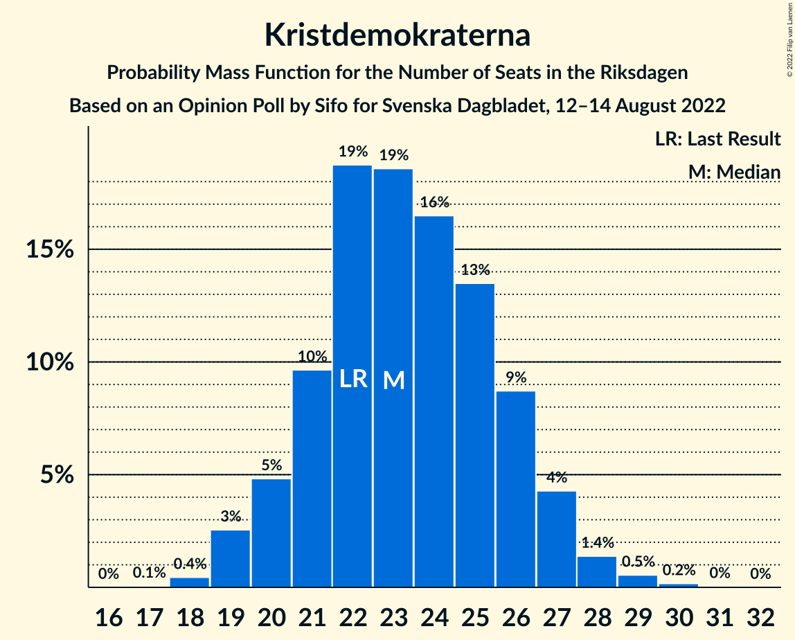

| Number of Seats | Probability | Accumulated | Special Marks |
|:---------------:|:-----------:|:-----------:|:-------------:|
| 17 | 0.1% | 100% |  |
| 18 | 0.4% | 99.9% |  |
| 19 | 3% | 99.5% |  |
| 20 | 5% | 97% |  |
| 21 | 10% | 92% |  |
| 22 | 19% | 82% | Last Result |
| 23 | 19% | 64% | Median |
| 24 | 16% | 45% |  |
| 25 | 13% | 29% |  |
| 26 | 9% | 15% |  |
| 27 | 4% | 6% |  |
| 28 | 1.4% | 2% |  |
| 29 | 0.5% | 0.8% |  |
| 30 | 0.2% | 0.2% |  |
| 31 | 0% | 0.1% |  |
| 32 | 0% | 0% |  |

### Centerpartiet

*For a full overview of the results for this party, see the [Centerpartiet](party-centerpartiet.html) page.*

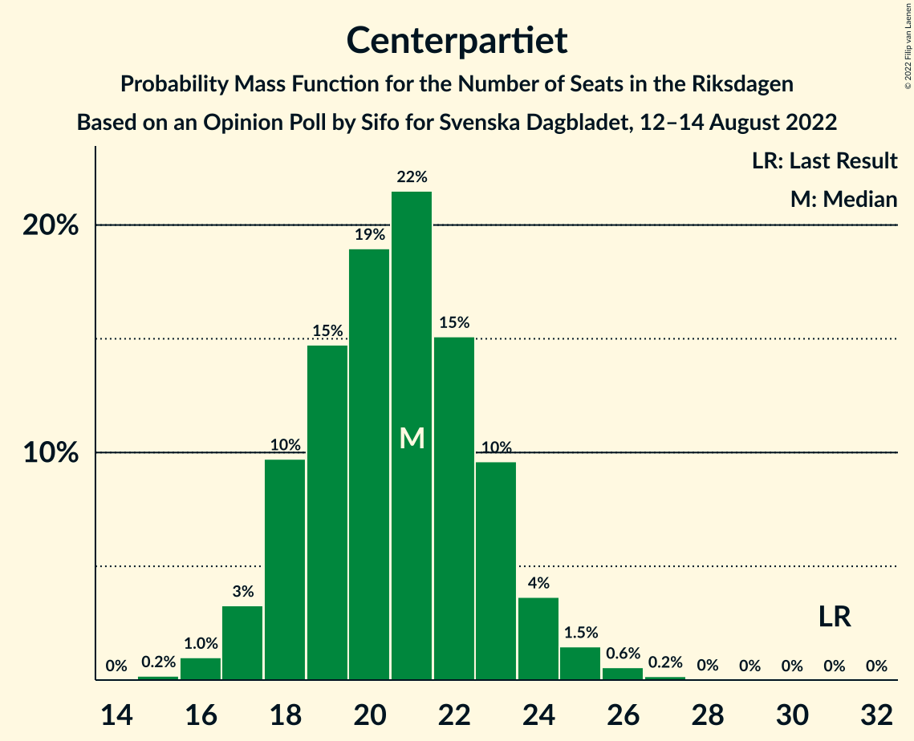

| Number of Seats | Probability | Accumulated | Special Marks |
|:---------------:|:-----------:|:-----------:|:-------------:|
| 15 | 0.2% | 100% |  |
| 16 | 1.0% | 99.8% |  |
| 17 | 3% | 98.8% |  |
| 18 | 10% | 96% |  |
| 19 | 15% | 86% |  |
| 20 | 19% | 71% |  |
| 21 | 22% | 52% | Median |
| 22 | 15% | 31% |  |
| 23 | 10% | 15% |  |
| 24 | 4% | 6% |  |
| 25 | 1.5% | 2% |  |
| 26 | 0.6% | 0.8% |  |
| 27 | 0.2% | 0.2% |  |
| 28 | 0% | 0% |  |
| 29 | 0% | 0% |  |
| 30 | 0% | 0% |  |
| 31 | 0% | 0% | Last Result |

### Miljöpartiet de gröna

*For a full overview of the results for this party, see the [Miljöpartiet de gröna](party-miljöpartietdegröna.html) page.*

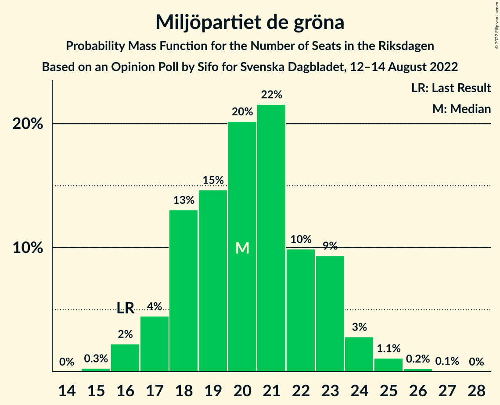

| Number of Seats | Probability | Accumulated | Special Marks |
|:---------------:|:-----------:|:-----------:|:-------------:|
| 15 | 0.3% | 100% |  |
| 16 | 2% | 99.7% | Last Result |
| 17 | 4% | 97% |  |
| 18 | 13% | 93% |  |
| 19 | 15% | 80% |  |
| 20 | 20% | 65% | Median |
| 21 | 22% | 45% |  |
| 22 | 10% | 23% |  |
| 23 | 9% | 14% |  |
| 24 | 3% | 4% |  |
| 25 | 1.1% | 1.4% |  |
| 26 | 0.2% | 0.3% |  |
| 27 | 0.1% | 0.1% |  |
| 28 | 0% | 0% |  |

### Liberalerna

*For a full overview of the results for this party, see the [Liberalerna](party-liberalerna.html) page.*

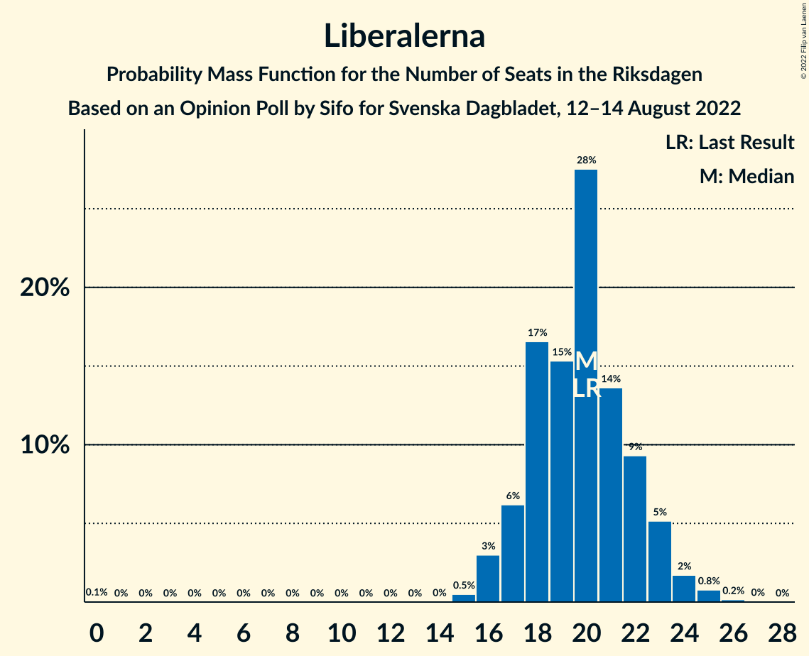

| Number of Seats | Probability | Accumulated | Special Marks |
|:---------------:|:-----------:|:-----------:|:-------------:|
| 0 | 0.1% | 100% |  |
| 1 | 0% | 99.9% |  |
| 2 | 0% | 99.9% |  |
| 3 | 0% | 99.9% |  |
| 4 | 0% | 99.9% |  |
| 5 | 0% | 99.9% |  |
| 6 | 0% | 99.9% |  |
| 7 | 0% | 99.9% |  |
| 8 | 0% | 99.9% |  |
| 9 | 0% | 99.9% |  |
| 10 | 0% | 99.9% |  |
| 11 | 0% | 99.9% |  |
| 12 | 0% | 99.9% |  |
| 13 | 0% | 99.9% |  |
| 14 | 0% | 99.9% |  |
| 15 | 0.5% | 99.9% |  |
| 16 | 3% | 99.4% |  |
| 17 | 6% | 96% |  |
| 18 | 17% | 90% |  |
| 19 | 15% | 74% |  |
| 20 | 28% | 58% | Last Result, Median |
| 21 | 14% | 31% |  |
| 22 | 9% | 17% |  |
| 23 | 5% | 8% |  |
| 24 | 2% | 3% |  |
| 25 | 0.8% | 1.0% |  |
| 26 | 0.2% | 0.2% |  |
| 27 | 0% | 0.1% |  |
| 28 | 0% | 0% |  |

## Coalitions

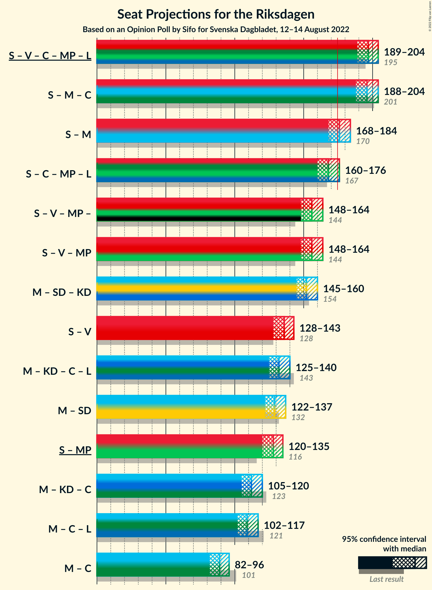

### Confidence Intervals

| Coalition | Last Result | Median | Majority? | 80% Confidence Interval | 90% Confidence Interval | 95% Confidence Interval | 99% Confidence Interval |
|:---------:|:-----------:|:------:|:---------:|:-----------------------:|:-----------------------:|:-----------------------:|:-----------------------:|
| Sveriges socialdemokratiska arbetareparti – Vänsterpartiet – Centerpartiet – Miljöpartiet de gröna – Liberalerna | 195 | 197 | 100% | 191–202 | 190–203 | 189–204 | 185–207 |
| Sveriges socialdemokratiska arbetareparti – Moderata samlingspartiet – Centerpartiet | 201 | 196 | 100% | 191–201 | 190–203 | 188–204 | 186–207 |
| Sveriges socialdemokratiska arbetareparti – Moderata samlingspartiet | 170 | 176 | 63% | 170–181 | 169–182 | 168–184 | 165–186 |
| Sveriges socialdemokratiska arbetareparti – Centerpartiet – Miljöpartiet de gröna – Liberalerna | 167 | 168 | 3% | 162–173 | 161–174 | 160–176 | 157–178 |
| Sveriges socialdemokratiska arbetareparti – Vänsterpartiet – Miljöpartiet de gröna | 144 | 156 | 0% | 151–161 | 149–163 | 148–164 | 145–166 |
| Moderata samlingspartiet – Sverigedemokraterna – Kristdemokraterna | 154 | 152 | 0% | 147–158 | 146–159 | 145–160 | 142–163 |
| Sveriges socialdemokratiska arbetareparti – Vänsterpartiet | 128 | 136 | 0% | 131–141 | 129–142 | 128–143 | 125–146 |
| Moderata samlingspartiet – Kristdemokraterna – Centerpartiet – Liberalerna | 143 | 132 | 0% | 128–138 | 126–139 | 125–140 | 122–143 |
| Moderata samlingspartiet – Sverigedemokraterna | 132 | 129 | 0% | 124–134 | 123–136 | 122–137 | 119–139 |
| Sveriges socialdemokratiska arbetareparti – Miljöpartiet de gröna | 116 | 128 | 0% | 122–132 | 121–133 | 120–135 | 117–138 |
| Moderata samlingspartiet – Kristdemokraterna – Centerpartiet | 123 | 112 | 0% | 108–118 | 107–119 | 105–120 | 103–123 |
| Moderata samlingspartiet – Centerpartiet – Liberalerna | 121 | 109 | 0% | 104–114 | 103–115 | 102–117 | 99–119 |
| Moderata samlingspartiet – Centerpartiet | 101 | 89 | 0% | 85–94 | 84–95 | 82–96 | 80–99 |

### Sveriges socialdemokratiska arbetareparti – Vänsterpartiet – Centerpartiet – Miljöpartiet de gröna – Liberalerna

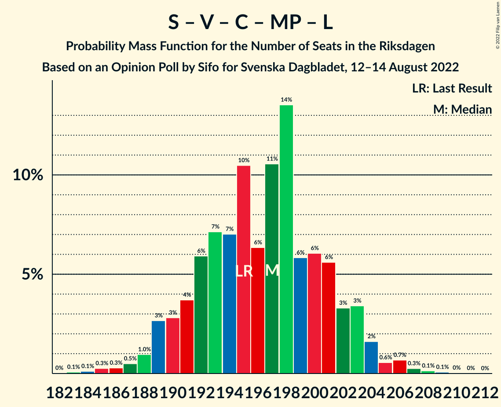

| Number of Seats | Probability | Accumulated | Special Marks |
|:---------------:|:-----------:|:-----------:|:-------------:|
| 182 | 0% | 100% |  |
| 183 | 0.1% | 99.9% |  |
| 184 | 0.1% | 99.9% |  |
| 185 | 0.3% | 99.7% |  |
| 186 | 0.3% | 99.5% |  |
| 187 | 0.5% | 99.2% |  |
| 188 | 1.0% | 98.7% |  |
| 189 | 3% | 98% |  |
| 190 | 3% | 95% |  |
| 191 | 4% | 92% |  |
| 192 | 6% | 89% |  |
| 193 | 7% | 83% |  |
| 194 | 7% | 76% |  |
| 195 | 10% | 68% | Last Result |
| 196 | 6% | 58% |  |
| 197 | 11% | 52% | Median |
| 198 | 14% | 41% |  |
| 199 | 6% | 28% |  |
| 200 | 6% | 22% |  |
| 201 | 6% | 16% |  |
| 202 | 3% | 10% |  |
| 203 | 3% | 7% |  |
| 204 | 2% | 3% |  |
| 205 | 0.6% | 2% |  |
| 206 | 0.7% | 1.2% |  |
| 207 | 0.3% | 0.5% |  |
| 208 | 0.1% | 0.3% |  |
| 209 | 0.1% | 0.1% |  |
| 210 | 0% | 0.1% |  |
| 211 | 0% | 0% |  |

### Sveriges socialdemokratiska arbetareparti – Moderata samlingspartiet – Centerpartiet

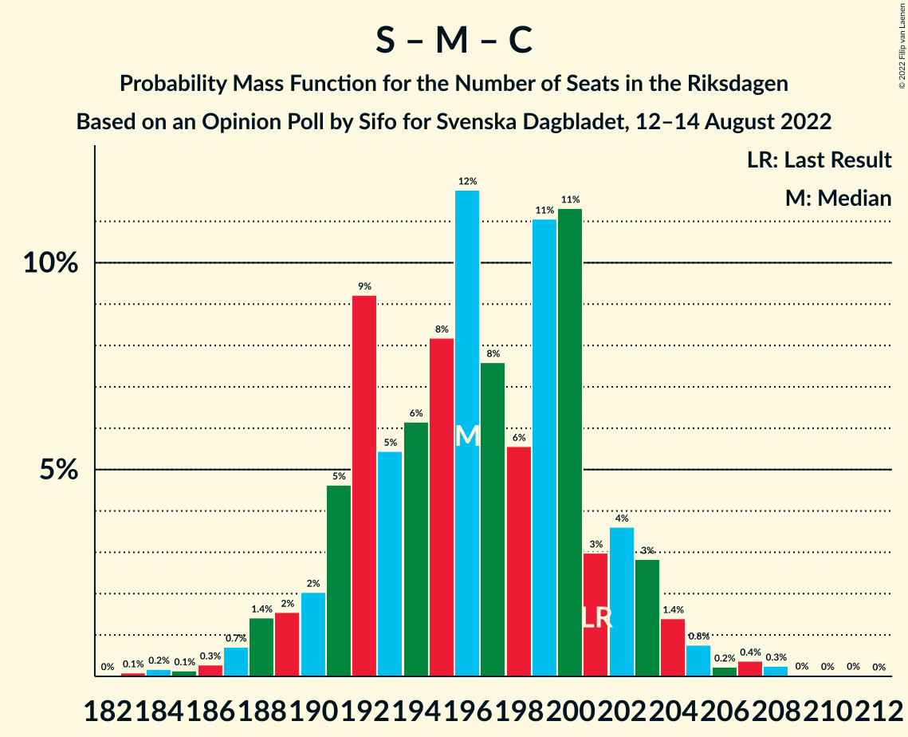

| Number of Seats | Probability | Accumulated | Special Marks |
|:---------------:|:-----------:|:-----------:|:-------------:|
| 183 | 0.1% | 100% |  |
| 184 | 0.2% | 99.9% |  |
| 185 | 0.1% | 99.7% |  |
| 186 | 0.3% | 99.5% |  |
| 187 | 0.7% | 99.3% |  |
| 188 | 1.4% | 98.6% |  |
| 189 | 2% | 97% |  |
| 190 | 2% | 96% |  |
| 191 | 5% | 94% |  |
| 192 | 9% | 89% |  |
| 193 | 5% | 80% |  |
| 194 | 6% | 74% |  |
| 195 | 8% | 68% |  |
| 196 | 12% | 60% | Median |
| 197 | 8% | 48% |  |
| 198 | 6% | 41% |  |
| 199 | 11% | 35% |  |
| 200 | 11% | 24% |  |
| 201 | 3% | 13% | Last Result |
| 202 | 4% | 10% |  |
| 203 | 3% | 6% |  |
| 204 | 1.4% | 3% |  |
| 205 | 0.8% | 2% |  |
| 206 | 0.2% | 1.0% |  |
| 207 | 0.4% | 0.8% |  |
| 208 | 0.3% | 0.4% |  |
| 209 | 0% | 0.1% |  |
| 210 | 0% | 0.1% |  |
| 211 | 0% | 0.1% |  |
| 212 | 0% | 0% |  |

### Sveriges socialdemokratiska arbetareparti – Moderata samlingspartiet

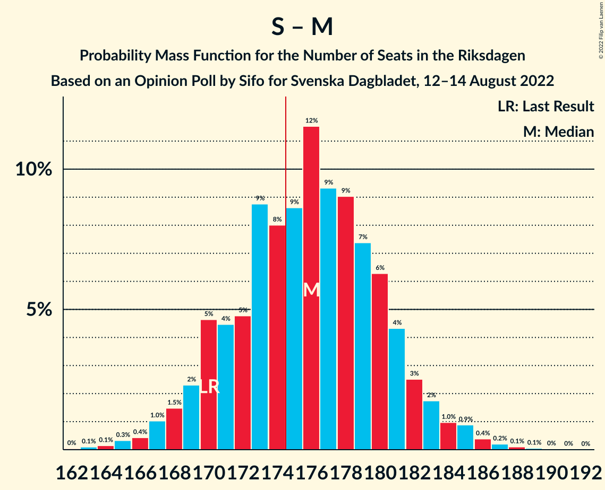

| Number of Seats | Probability | Accumulated | Special Marks |
|:---------------:|:-----------:|:-----------:|:-------------:|
| 162 | 0% | 100% |  |
| 163 | 0.1% | 99.9% |  |
| 164 | 0.1% | 99.8% |  |
| 165 | 0.3% | 99.7% |  |
| 166 | 0.4% | 99.4% |  |
| 167 | 1.0% | 98.9% |  |
| 168 | 1.5% | 98% |  |
| 169 | 2% | 96% |  |
| 170 | 5% | 94% | Last Result |
| 171 | 4% | 89% |  |
| 172 | 5% | 85% |  |
| 173 | 9% | 80% |  |
| 174 | 8% | 71% |  |
| 175 | 9% | 63% | Median, Majority |
| 176 | 12% | 55% |  |
| 177 | 9% | 43% |  |
| 178 | 9% | 34% |  |
| 179 | 7% | 25% |  |
| 180 | 6% | 18% |  |
| 181 | 4% | 11% |  |
| 182 | 3% | 7% |  |
| 183 | 2% | 4% |  |
| 184 | 1.0% | 3% |  |
| 185 | 0.9% | 2% |  |
| 186 | 0.4% | 0.8% |  |
| 187 | 0.2% | 0.4% |  |
| 188 | 0.1% | 0.2% |  |
| 189 | 0.1% | 0.1% |  |
| 190 | 0% | 0.1% |  |
| 191 | 0% | 0% |  |

### Sveriges socialdemokratiska arbetareparti – Centerpartiet – Miljöpartiet de gröna – Liberalerna

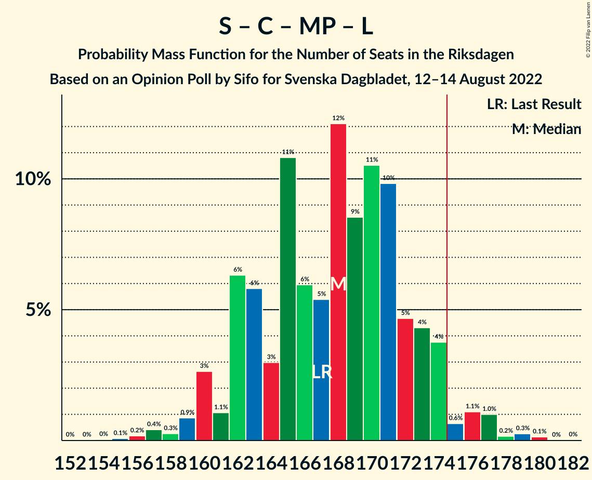

| Number of Seats | Probability | Accumulated | Special Marks |
|:---------------:|:-----------:|:-----------:|:-------------:|
| 153 | 0% | 100% |  |
| 154 | 0% | 99.9% |  |
| 155 | 0.1% | 99.9% |  |
| 156 | 0.2% | 99.8% |  |
| 157 | 0.4% | 99.6% |  |
| 158 | 0.3% | 99.2% |  |
| 159 | 0.9% | 99.0% |  |
| 160 | 3% | 98% |  |
| 161 | 1.1% | 95% |  |
| 162 | 6% | 94% |  |
| 163 | 6% | 88% |  |
| 164 | 3% | 82% |  |
| 165 | 11% | 79% |  |
| 166 | 6% | 68% |  |
| 167 | 5% | 62% | Last Result |
| 168 | 12% | 57% | Median |
| 169 | 9% | 45% |  |
| 170 | 11% | 36% |  |
| 171 | 10% | 26% |  |
| 172 | 5% | 16% |  |
| 173 | 4% | 11% |  |
| 174 | 4% | 7% |  |
| 175 | 0.6% | 3% | Majority |
| 176 | 1.1% | 3% |  |
| 177 | 1.0% | 2% |  |
| 178 | 0.2% | 0.6% |  |
| 179 | 0.3% | 0.5% |  |
| 180 | 0.1% | 0.2% |  |
| 181 | 0% | 0.1% |  |
| 182 | 0% | 0% |  |

### Sveriges socialdemokratiska arbetareparti – Vänsterpartiet – Miljöpartiet de gröna

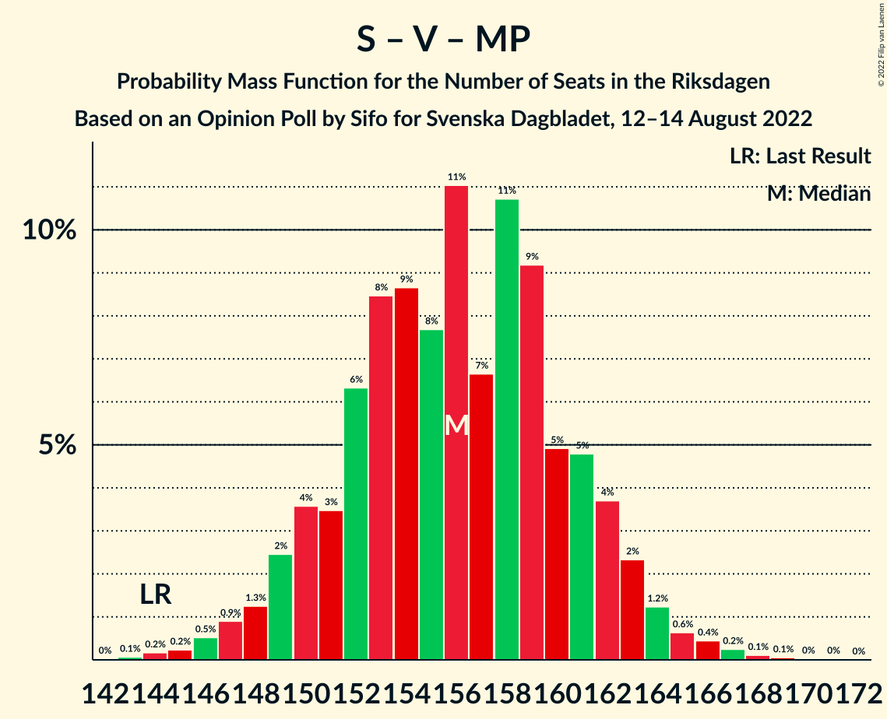

| Number of Seats | Probability | Accumulated | Special Marks |
|:---------------:|:-----------:|:-----------:|:-------------:|
| 142 | 0% | 100% |  |
| 143 | 0.1% | 99.9% |  |
| 144 | 0.2% | 99.9% | Last Result |
| 145 | 0.2% | 99.7% |  |
| 146 | 0.5% | 99.5% |  |
| 147 | 0.9% | 99.0% |  |
| 148 | 1.3% | 98% |  |
| 149 | 2% | 97% |  |
| 150 | 4% | 94% |  |
| 151 | 3% | 91% |  |
| 152 | 6% | 87% |  |
| 153 | 8% | 81% |  |
| 154 | 9% | 72% |  |
| 155 | 8% | 64% |  |
| 156 | 11% | 56% | Median |
| 157 | 7% | 45% |  |
| 158 | 11% | 38% |  |
| 159 | 9% | 28% |  |
| 160 | 5% | 19% |  |
| 161 | 5% | 14% |  |
| 162 | 4% | 9% |  |
| 163 | 2% | 5% |  |
| 164 | 1.2% | 3% |  |
| 165 | 0.6% | 2% |  |
| 166 | 0.4% | 0.9% |  |
| 167 | 0.2% | 0.5% |  |
| 168 | 0.1% | 0.2% |  |
| 169 | 0.1% | 0.1% |  |
| 170 | 0% | 0.1% |  |
| 171 | 0% | 0% |  |

### Moderata samlingspartiet – Sverigedemokraterna – Kristdemokraterna

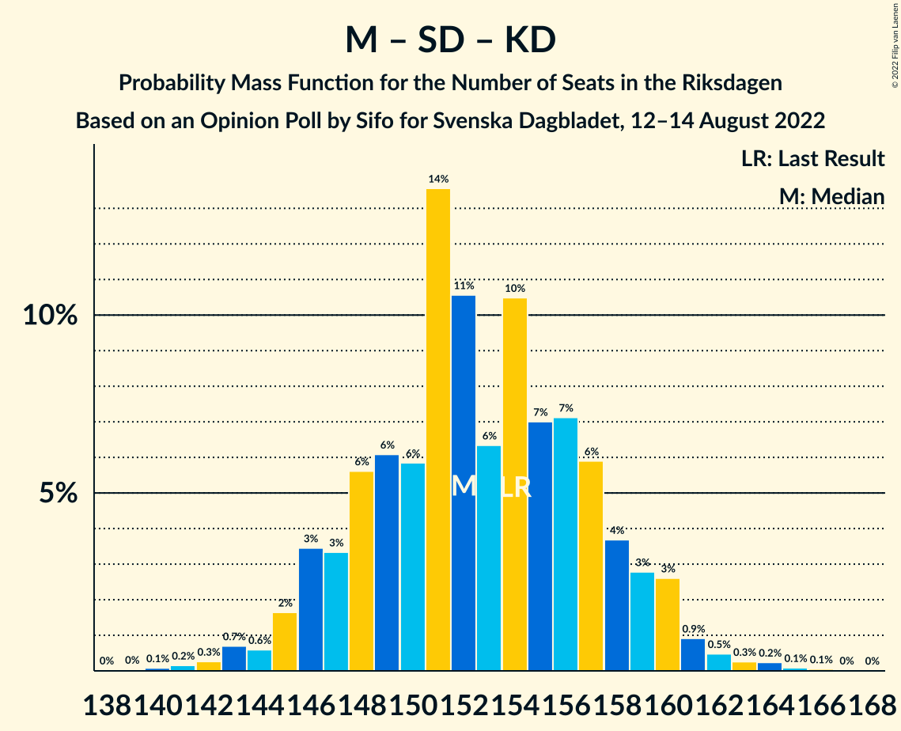

| Number of Seats | Probability | Accumulated | Special Marks |
|:---------------:|:-----------:|:-----------:|:-------------:|
| 139 | 0% | 100% |  |
| 140 | 0.1% | 99.9% |  |
| 141 | 0.2% | 99.8% |  |
| 142 | 0.3% | 99.7% |  |
| 143 | 0.7% | 99.4% |  |
| 144 | 0.6% | 98.7% |  |
| 145 | 2% | 98% |  |
| 146 | 3% | 96% |  |
| 147 | 3% | 93% |  |
| 148 | 6% | 90% |  |
| 149 | 6% | 84% |  |
| 150 | 6% | 78% |  |
| 151 | 14% | 72% |  |
| 152 | 11% | 59% | Median |
| 153 | 6% | 48% |  |
| 154 | 10% | 42% | Last Result |
| 155 | 7% | 31% |  |
| 156 | 7% | 24% |  |
| 157 | 6% | 17% |  |
| 158 | 4% | 11% |  |
| 159 | 3% | 7% |  |
| 160 | 3% | 5% |  |
| 161 | 0.9% | 2% |  |
| 162 | 0.5% | 1.2% |  |
| 163 | 0.3% | 0.7% |  |
| 164 | 0.2% | 0.4% |  |
| 165 | 0.1% | 0.2% |  |
| 166 | 0.1% | 0.1% |  |
| 167 | 0% | 0% |  |

### Sveriges socialdemokratiska arbetareparti – Vänsterpartiet

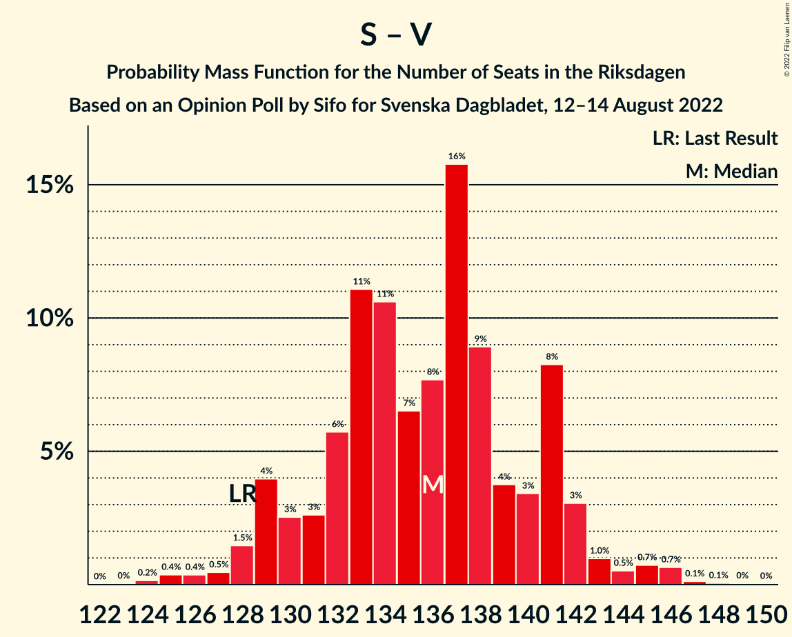

| Number of Seats | Probability | Accumulated | Special Marks |
|:---------------:|:-----------:|:-----------:|:-------------:|
| 123 | 0% | 100% |  |
| 124 | 0.2% | 99.9% |  |
| 125 | 0.4% | 99.8% |  |
| 126 | 0.4% | 99.4% |  |
| 127 | 0.5% | 99.0% |  |
| 128 | 1.5% | 98.6% | Last Result |
| 129 | 4% | 97% |  |
| 130 | 3% | 93% |  |
| 131 | 3% | 91% |  |
| 132 | 6% | 88% |  |
| 133 | 11% | 82% |  |
| 134 | 11% | 71% |  |
| 135 | 7% | 61% |  |
| 136 | 8% | 54% | Median |
| 137 | 16% | 46% |  |
| 138 | 9% | 31% |  |
| 139 | 4% | 22% |  |
| 140 | 3% | 18% |  |
| 141 | 8% | 14% |  |
| 142 | 3% | 6% |  |
| 143 | 1.0% | 3% |  |
| 144 | 0.5% | 2% |  |
| 145 | 0.7% | 2% |  |
| 146 | 0.7% | 0.9% |  |
| 147 | 0.1% | 0.3% |  |
| 148 | 0.1% | 0.2% |  |
| 149 | 0% | 0.1% |  |
| 150 | 0% | 0% |  |

### Moderata samlingspartiet – Kristdemokraterna – Centerpartiet – Liberalerna

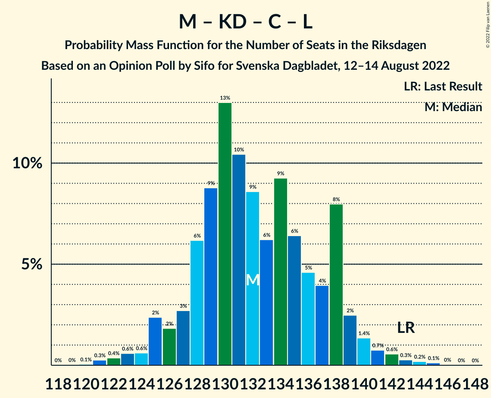

| Number of Seats | Probability | Accumulated | Special Marks |
|:---------------:|:-----------:|:-----------:|:-------------:|
| 118 | 0% | 100% |  |
| 119 | 0% | 99.9% |  |
| 120 | 0.1% | 99.9% |  |
| 121 | 0.3% | 99.9% |  |
| 122 | 0.4% | 99.6% |  |
| 123 | 0.6% | 99.2% |  |
| 124 | 0.6% | 98.7% |  |
| 125 | 2% | 98% |  |
| 126 | 2% | 96% |  |
| 127 | 3% | 94% |  |
| 128 | 6% | 91% |  |
| 129 | 9% | 85% |  |
| 130 | 13% | 76% |  |
| 131 | 10% | 63% |  |
| 132 | 9% | 53% | Median |
| 133 | 6% | 44% |  |
| 134 | 9% | 38% |  |
| 135 | 6% | 29% |  |
| 136 | 5% | 22% |  |
| 137 | 4% | 18% |  |
| 138 | 8% | 14% |  |
| 139 | 2% | 6% |  |
| 140 | 1.4% | 3% |  |
| 141 | 0.7% | 2% |  |
| 142 | 0.6% | 1.2% |  |
| 143 | 0.3% | 0.6% | Last Result |
| 144 | 0.2% | 0.4% |  |
| 145 | 0.1% | 0.2% |  |
| 146 | 0% | 0.1% |  |
| 147 | 0% | 0% |  |

### Moderata samlingspartiet – Sverigedemokraterna

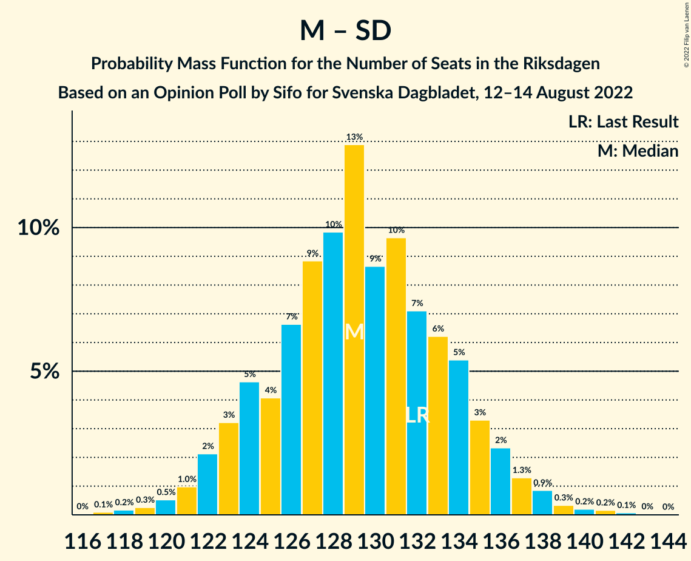

| Number of Seats | Probability | Accumulated | Special Marks |
|:---------------:|:-----------:|:-----------:|:-------------:|
| 117 | 0.1% | 100% |  |
| 118 | 0.2% | 99.9% |  |
| 119 | 0.3% | 99.7% |  |
| 120 | 0.5% | 99.4% |  |
| 121 | 1.0% | 98.9% |  |
| 122 | 2% | 98% |  |
| 123 | 3% | 96% |  |
| 124 | 5% | 93% |  |
| 125 | 4% | 88% |  |
| 126 | 7% | 84% |  |
| 127 | 9% | 77% |  |
| 128 | 10% | 68% |  |
| 129 | 13% | 59% | Median |
| 130 | 9% | 46% |  |
| 131 | 10% | 37% |  |
| 132 | 7% | 27% | Last Result |
| 133 | 6% | 20% |  |
| 134 | 5% | 14% |  |
| 135 | 3% | 9% |  |
| 136 | 2% | 5% |  |
| 137 | 1.3% | 3% |  |
| 138 | 0.9% | 2% |  |
| 139 | 0.3% | 0.8% |  |
| 140 | 0.2% | 0.5% |  |
| 141 | 0.2% | 0.3% |  |
| 142 | 0.1% | 0.1% |  |
| 143 | 0% | 0.1% |  |
| 144 | 0% | 0% |  |

### Sveriges socialdemokratiska arbetareparti – Miljöpartiet de gröna

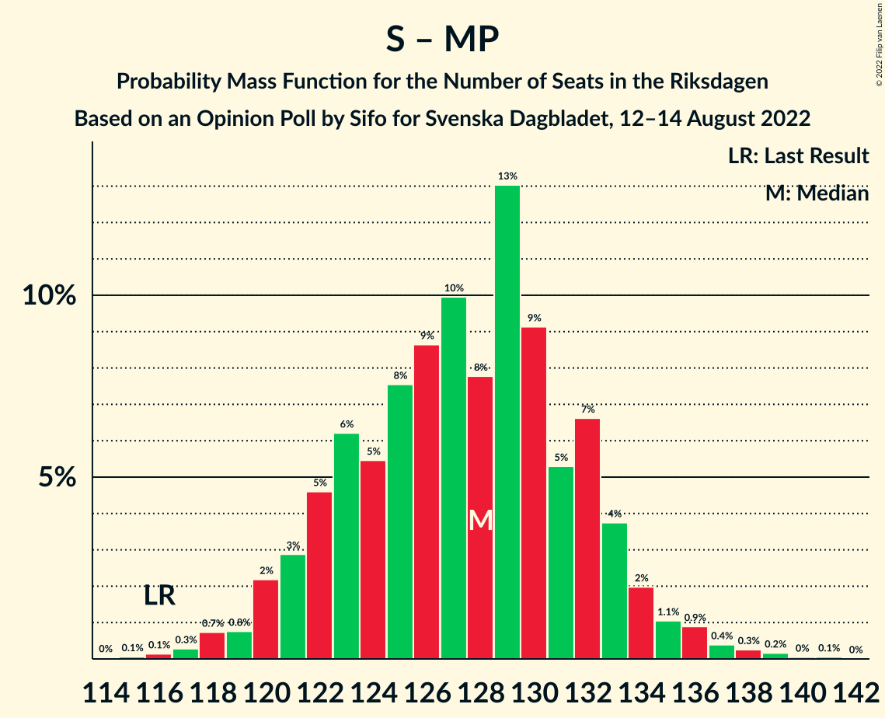

| Number of Seats | Probability | Accumulated | Special Marks |
|:---------------:|:-----------:|:-----------:|:-------------:|
| 114 | 0% | 100% |  |
| 115 | 0.1% | 99.9% |  |
| 116 | 0.1% | 99.9% | Last Result |
| 117 | 0.3% | 99.7% |  |
| 118 | 0.7% | 99.4% |  |
| 119 | 0.8% | 98.7% |  |
| 120 | 2% | 98% |  |
| 121 | 3% | 96% |  |
| 122 | 5% | 93% |  |
| 123 | 6% | 88% |  |
| 124 | 5% | 82% |  |
| 125 | 8% | 77% |  |
| 126 | 9% | 69% |  |
| 127 | 10% | 60% | Median |
| 128 | 8% | 50% |  |
| 129 | 13% | 43% |  |
| 130 | 9% | 30% |  |
| 131 | 5% | 21% |  |
| 132 | 7% | 15% |  |
| 133 | 4% | 9% |  |
| 134 | 2% | 5% |  |
| 135 | 1.1% | 3% |  |
| 136 | 0.9% | 2% |  |
| 137 | 0.4% | 0.9% |  |
| 138 | 0.3% | 0.5% |  |
| 139 | 0.2% | 0.3% |  |
| 140 | 0% | 0.1% |  |
| 141 | 0.1% | 0.1% |  |
| 142 | 0% | 0% |  |

### Moderata samlingspartiet – Kristdemokraterna – Centerpartiet

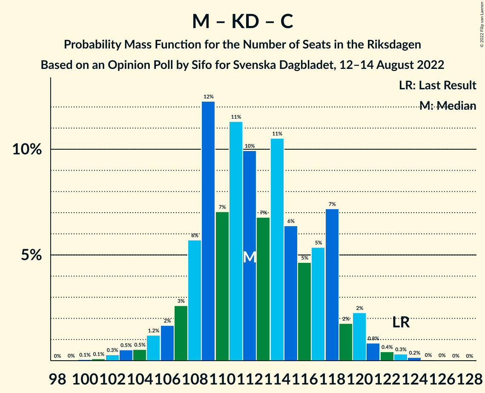

| Number of Seats | Probability | Accumulated | Special Marks |
|:---------------:|:-----------:|:-----------:|:-------------:|
| 100 | 0.1% | 100% |  |
| 101 | 0.1% | 99.9% |  |
| 102 | 0.3% | 99.8% |  |
| 103 | 0.5% | 99.5% |  |
| 104 | 0.5% | 99.0% |  |
| 105 | 1.2% | 98% |  |
| 106 | 2% | 97% |  |
| 107 | 3% | 96% |  |
| 108 | 6% | 93% |  |
| 109 | 12% | 87% |  |
| 110 | 7% | 75% |  |
| 111 | 11% | 68% |  |
| 112 | 10% | 57% | Median |
| 113 | 7% | 47% |  |
| 114 | 11% | 40% |  |
| 115 | 6% | 29% |  |
| 116 | 5% | 23% |  |
| 117 | 5% | 18% |  |
| 118 | 7% | 13% |  |
| 119 | 2% | 6% |  |
| 120 | 2% | 4% |  |
| 121 | 0.8% | 2% |  |
| 122 | 0.4% | 1.0% |  |
| 123 | 0.3% | 0.6% | Last Result |
| 124 | 0.2% | 0.3% |  |
| 125 | 0% | 0.1% |  |
| 126 | 0% | 0.1% |  |
| 127 | 0% | 0% |  |

### Moderata samlingspartiet – Centerpartiet – Liberalerna

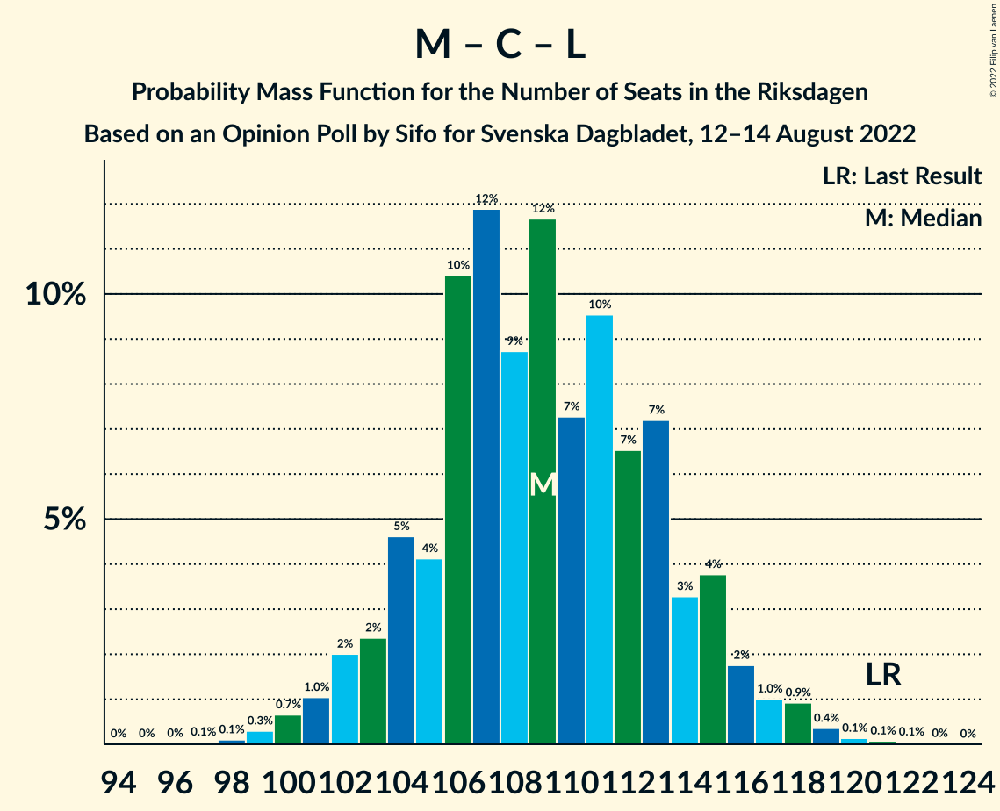

| Number of Seats | Probability | Accumulated | Special Marks |
|:---------------:|:-----------:|:-----------:|:-------------:|
| 94 | 0% | 100% |  |
| 95 | 0% | 99.9% |  |
| 96 | 0% | 99.9% |  |
| 97 | 0.1% | 99.9% |  |
| 98 | 0.1% | 99.9% |  |
| 99 | 0.3% | 99.8% |  |
| 100 | 0.7% | 99.5% |  |
| 101 | 1.0% | 98.8% |  |
| 102 | 2% | 98% |  |
| 103 | 2% | 96% |  |
| 104 | 5% | 93% |  |
| 105 | 4% | 89% |  |
| 106 | 10% | 85% |  |
| 107 | 12% | 74% |  |
| 108 | 9% | 62% |  |
| 109 | 12% | 54% | Median |
| 110 | 7% | 42% |  |
| 111 | 10% | 35% |  |
| 112 | 7% | 25% |  |
| 113 | 7% | 19% |  |
| 114 | 3% | 11% |  |
| 115 | 4% | 8% |  |
| 116 | 2% | 4% |  |
| 117 | 1.0% | 3% |  |
| 118 | 0.9% | 2% |  |
| 119 | 0.4% | 0.7% |  |
| 120 | 0.1% | 0.3% |  |
| 121 | 0.1% | 0.2% | Last Result |
| 122 | 0.1% | 0.1% |  |
| 123 | 0% | 0% |  |

### Moderata samlingspartiet – Centerpartiet

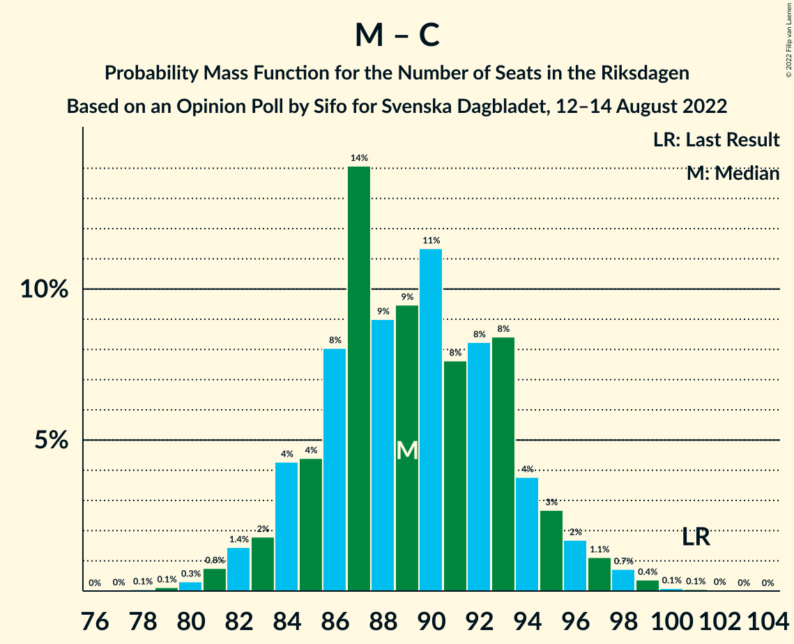

| Number of Seats | Probability | Accumulated | Special Marks |
|:---------------:|:-----------:|:-----------:|:-------------:|
| 78 | 0.1% | 100% |  |
| 79 | 0.1% | 99.9% |  |
| 80 | 0.3% | 99.8% |  |
| 81 | 0.8% | 99.5% |  |
| 82 | 1.4% | 98.7% |  |
| 83 | 2% | 97% |  |
| 84 | 4% | 95% |  |
| 85 | 4% | 91% |  |
| 86 | 8% | 87% |  |
| 87 | 14% | 79% |  |
| 88 | 9% | 65% |  |
| 89 | 9% | 56% | Median |
| 90 | 11% | 46% |  |
| 91 | 8% | 35% |  |
| 92 | 8% | 27% |  |
| 93 | 8% | 19% |  |
| 94 | 4% | 11% |  |
| 95 | 3% | 7% |  |
| 96 | 2% | 4% |  |
| 97 | 1.1% | 2% |  |
| 98 | 0.7% | 1.3% |  |
| 99 | 0.4% | 0.6% |  |
| 100 | 0.1% | 0.2% |  |
| 101 | 0.1% | 0.1% | Last Result |
| 102 | 0% | 0.1% |  |
| 103 | 0% | 0% |  |

## Technical Information

### Opinion Poll

+ **Polling firm:** Sifo
+ **Commissioner(s):** Svenska Dagbladet
+ **Fieldwork period:** 12–14 August 2022

### Calculations

+ **Sample size:** 1931
+ **Simulations done:** 1,048,576
+ **Error estimate:** 0.53%

