# Opinion Poll by Demoskop for Aftonbladet, 6–16 August 2022

<a href="#voting-intentions">Voting Intentions</a> | <a href="#seats">Seats</a> | <a href="#coalitions">Coalitions</a> | <a href="#technical-information">Technical Information</a>

## Voting Intentions

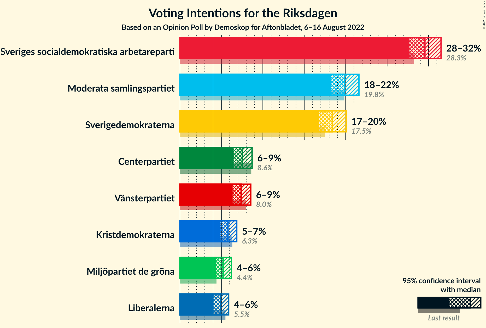

### Confidence Intervals

| Party | Last Result | Poll Result | 80% Confidence Interval | 90% Confidence Interval | 95% Confidence Interval | 99% Confidence Interval |
|:-----:|:-----------:|:-----------:|:-----------------------:|:-----------------------:|:-----------------------:|:-----------------------:|
| Sveriges socialdemokratiska arbetareparti | 28.3% | 29.6% | 28.3–30.8% |28.0–31.2% |27.7–31.5% |27.1–32.1% |
| Moderata samlingspartiet | 19.8% | 19.9% | 18.8–21.0% |18.5–21.3% |18.3–21.6% |17.8–22.1% |
| Sverigedemokraterna | 17.5% | 18.4% | 17.3–19.5% |17.1–19.8% |16.8–20.1% |16.3–20.6% |
| Centerpartiet | 8.6% | 7.5% | 6.8–8.3% |6.6–8.5% |6.5–8.7% |6.2–9.1% |
| Vänsterpartiet | 8.0% | 7.4% | 6.7–8.2% |6.5–8.4% |6.4–8.6% |6.1–8.9% |
| Kristdemokraterna | 6.3% | 5.8% | 5.2–6.5% |5.0–6.7% |4.9–6.9% |4.6–7.2% |
| Miljöpartiet de gröna | 4.4% | 5.2% | 4.6–5.9% |4.5–6.1% |4.3–6.2% |4.1–6.6% |
| Liberalerna | 5.5% | 4.9% | 4.3–5.5% |4.2–5.7% |4.1–5.9% |3.8–6.2% |

*Note:* The poll result column reflects the actual value used in the calculations. Published results may vary slightly, and in addition be rounded to fewer digits.

## Seats

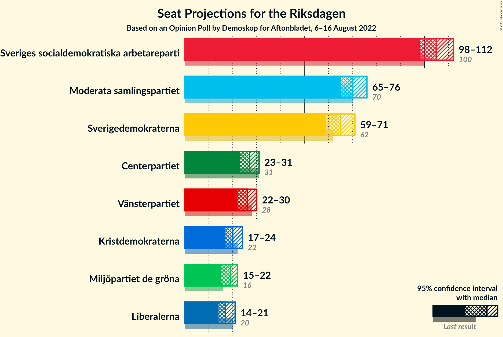

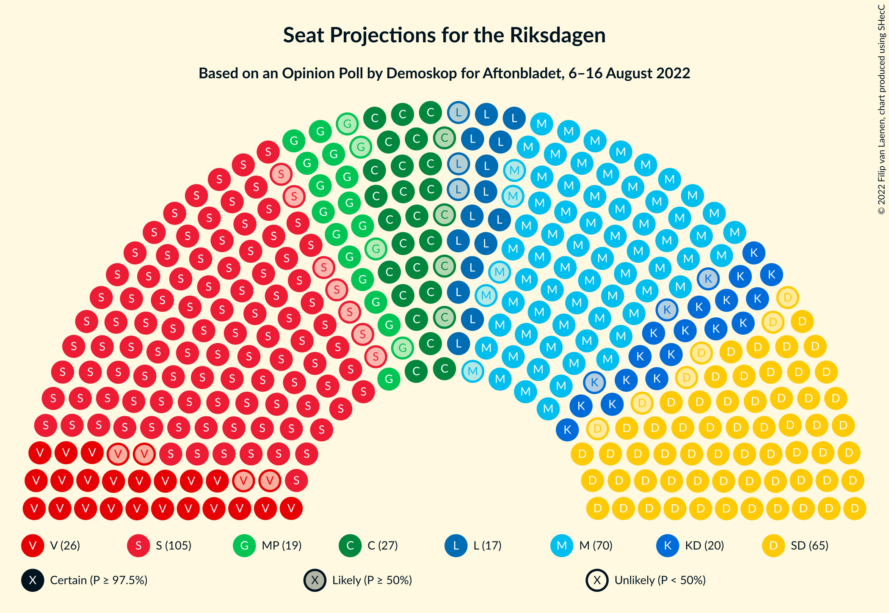

### Confidence Intervals

| Party | Last Result | Median | 80% Confidence Interval | 90% Confidence Interval | 95% Confidence Interval | 99% Confidence Interval |
|:-----:|:-----------:|:------:|:-----------------------:|:-----------------------:|:-----------------------:|:-----------------------:|
| <a href="#sveriges-socialdemokratiska-arbetareparti">Sveriges socialdemokratiska arbetareparti</a> | 100 | 105 | 100–109 |99–110 |98–112 |96–114 |
| <a href="#moderata-samlingspartiet">Moderata samlingspartiet</a> | 70 | 70 | 67–74 |66–75 |65–76 |63–79 |
| <a href="#sverigedemokraterna">Sverigedemokraterna</a> | 62 | 65 | 62–69 |60–70 |59–71 |58–73 |
| <a href="#centerpartiet">Centerpartiet</a> | 31 | 27 | 24–29 |23–30 |23–31 |22–32 |
| <a href="#vänsterpartiet">Vänsterpartiet</a> | 28 | 26 | 24–29 |23–30 |22–30 |21–32 |
| <a href="#kristdemokraterna">Kristdemokraterna</a> | 22 | 20 | 18–23 |18–24 |17–24 |16–26 |
| <a href="#miljöpartiet-de-gröna">Miljöpartiet de gröna</a> | 16 | 19 | 16–20 |16–21 |15–22 |14–23 |
| <a href="#liberalerna">Liberalerna</a> | 20 | 17 | 15–19 |15–20 |14–21 |0–22 |

### Sveriges socialdemokratiska arbetareparti

*For a full overview of the results for this party, see the [Sveriges socialdemokratiska arbetareparti](party-sverigessocialdemokratiskaarbetareparti.html) page.*

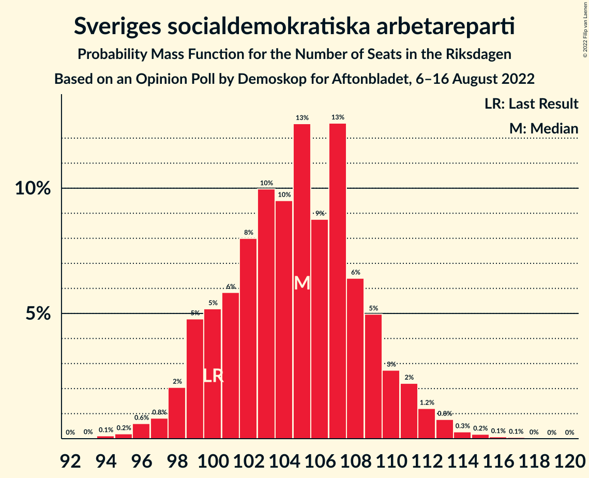

| Number of Seats | Probability | Accumulated | Special Marks |
|:---------------:|:-----------:|:-----------:|:-------------:|
| 93 | 0% | 100% |  |
| 94 | 0.1% | 99.9% |  |
| 95 | 0.2% | 99.8% |  |
| 96 | 0.6% | 99.6% |  |
| 97 | 0.8% | 99.0% |  |
| 98 | 2% | 98% |  |
| 99 | 5% | 96% |  |
| 100 | 5% | 91% | Last Result |
| 101 | 6% | 86% |  |
| 102 | 8% | 80% |  |
| 103 | 10% | 72% |  |
| 104 | 10% | 62% |  |
| 105 | 13% | 53% | Median |
| 106 | 9% | 40% |  |
| 107 | 13% | 32% |  |
| 108 | 6% | 19% |  |
| 109 | 5% | 13% |  |
| 110 | 3% | 8% |  |
| 111 | 2% | 5% |  |
| 112 | 1.2% | 3% |  |
| 113 | 0.8% | 1.4% |  |
| 114 | 0.3% | 0.6% |  |
| 115 | 0.2% | 0.4% |  |
| 116 | 0.1% | 0.2% |  |
| 117 | 0.1% | 0.1% |  |
| 118 | 0% | 0.1% |  |
| 119 | 0% | 0% |  |

### Moderata samlingspartiet

*For a full overview of the results for this party, see the [Moderata samlingspartiet](party-moderatasamlingspartiet.html) page.*

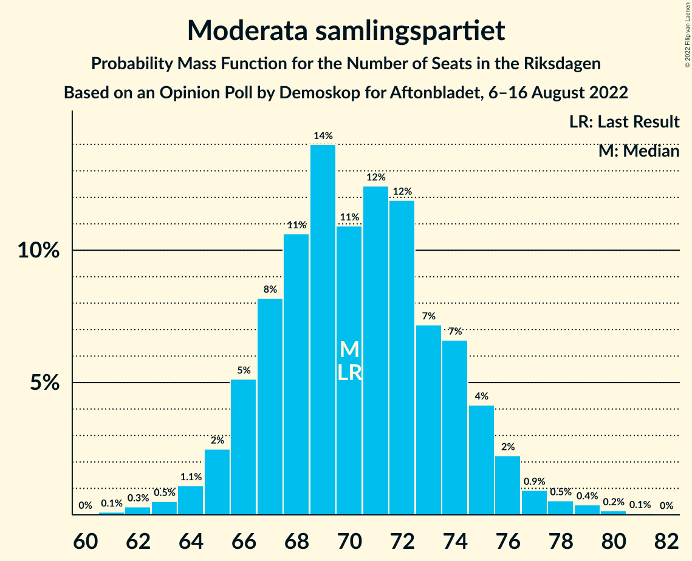

| Number of Seats | Probability | Accumulated | Special Marks |
|:---------------:|:-----------:|:-----------:|:-------------:|
| 61 | 0.1% | 100% |  |
| 62 | 0.3% | 99.9% |  |
| 63 | 0.5% | 99.5% |  |
| 64 | 1.1% | 99.0% |  |
| 65 | 2% | 98% |  |
| 66 | 5% | 95% |  |
| 67 | 8% | 90% |  |
| 68 | 11% | 82% |  |
| 69 | 14% | 72% |  |
| 70 | 11% | 58% | Last Result, Median |
| 71 | 12% | 47% |  |
| 72 | 12% | 34% |  |
| 73 | 7% | 22% |  |
| 74 | 7% | 15% |  |
| 75 | 4% | 8% |  |
| 76 | 2% | 4% |  |
| 77 | 0.9% | 2% |  |
| 78 | 0.5% | 1.2% |  |
| 79 | 0.4% | 0.6% |  |
| 80 | 0.2% | 0.2% |  |
| 81 | 0.1% | 0.1% |  |
| 82 | 0% | 0% |  |

### Sverigedemokraterna

*For a full overview of the results for this party, see the [Sverigedemokraterna](party-sverigedemokraterna.html) page.*

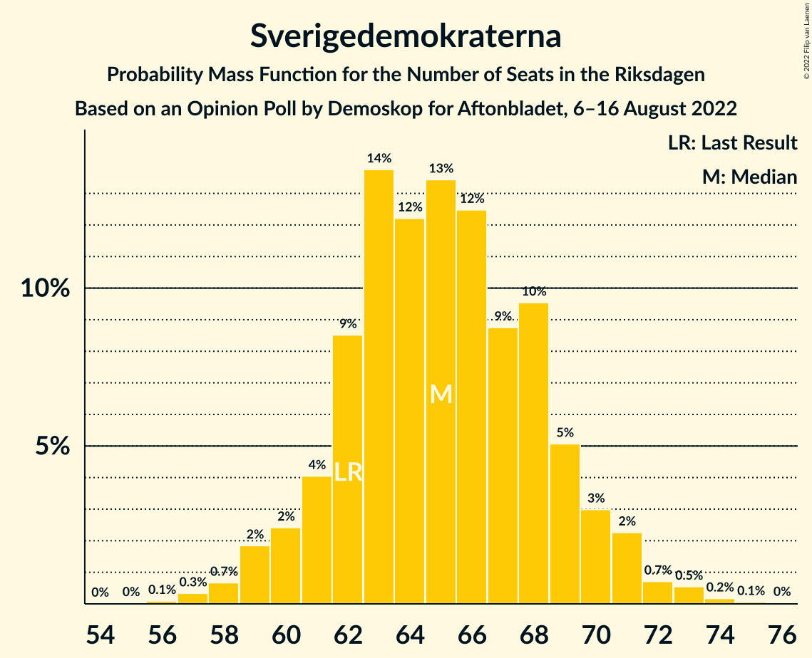

| Number of Seats | Probability | Accumulated | Special Marks |
|:---------------:|:-----------:|:-----------:|:-------------:|
| 56 | 0.1% | 100% |  |
| 57 | 0.3% | 99.9% |  |
| 58 | 0.7% | 99.5% |  |
| 59 | 2% | 98.9% |  |
| 60 | 2% | 97% |  |
| 61 | 4% | 95% |  |
| 62 | 9% | 91% | Last Result |
| 63 | 14% | 82% |  |
| 64 | 12% | 68% |  |
| 65 | 13% | 56% | Median |
| 66 | 12% | 43% |  |
| 67 | 9% | 30% |  |
| 68 | 10% | 21% |  |
| 69 | 5% | 12% |  |
| 70 | 3% | 7% |  |
| 71 | 2% | 4% |  |
| 72 | 0.7% | 2% |  |
| 73 | 0.5% | 0.8% |  |
| 74 | 0.2% | 0.3% |  |
| 75 | 0.1% | 0.1% |  |
| 76 | 0% | 0% |  |

### Centerpartiet

*For a full overview of the results for this party, see the [Centerpartiet](party-centerpartiet.html) page.*

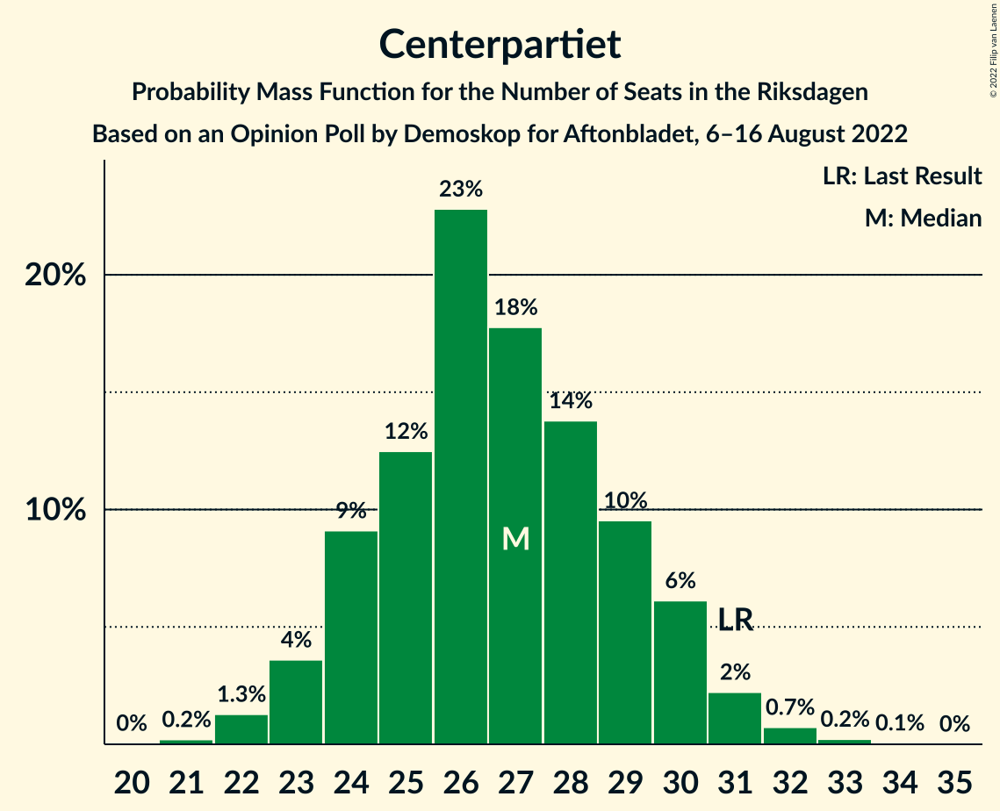

| Number of Seats | Probability | Accumulated | Special Marks |
|:---------------:|:-----------:|:-----------:|:-------------:|
| 20 | 0% | 100% |  |
| 21 | 0.2% | 99.9% |  |
| 22 | 1.3% | 99.7% |  |
| 23 | 4% | 98% |  |
| 24 | 9% | 95% |  |
| 25 | 12% | 86% |  |
| 26 | 23% | 73% |  |
| 27 | 18% | 50% | Median |
| 28 | 14% | 33% |  |
| 29 | 10% | 19% |  |
| 30 | 6% | 9% |  |
| 31 | 2% | 3% | Last Result |
| 32 | 0.7% | 1.0% |  |
| 33 | 0.2% | 0.3% |  |
| 34 | 0.1% | 0.1% |  |
| 35 | 0% | 0% |  |

### Vänsterpartiet

*For a full overview of the results for this party, see the [Vänsterpartiet](party-vänsterpartiet.html) page.*

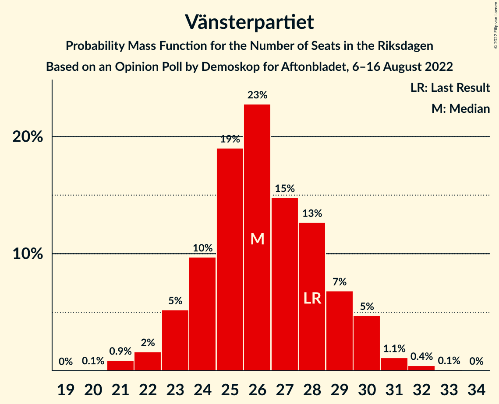

| Number of Seats | Probability | Accumulated | Special Marks |
|:---------------:|:-----------:|:-----------:|:-------------:|
| 20 | 0.1% | 100% |  |
| 21 | 0.9% | 99.9% |  |
| 22 | 2% | 99.0% |  |
| 23 | 5% | 97% |  |
| 24 | 10% | 92% |  |
| 25 | 19% | 82% |  |
| 26 | 23% | 63% | Median |
| 27 | 15% | 41% |  |
| 28 | 13% | 26% | Last Result |
| 29 | 7% | 13% |  |
| 30 | 5% | 6% |  |
| 31 | 1.1% | 2% |  |
| 32 | 0.4% | 0.6% |  |
| 33 | 0.1% | 0.1% |  |
| 34 | 0% | 0% |  |

### Kristdemokraterna

*For a full overview of the results for this party, see the [Kristdemokraterna](party-kristdemokraterna.html) page.*

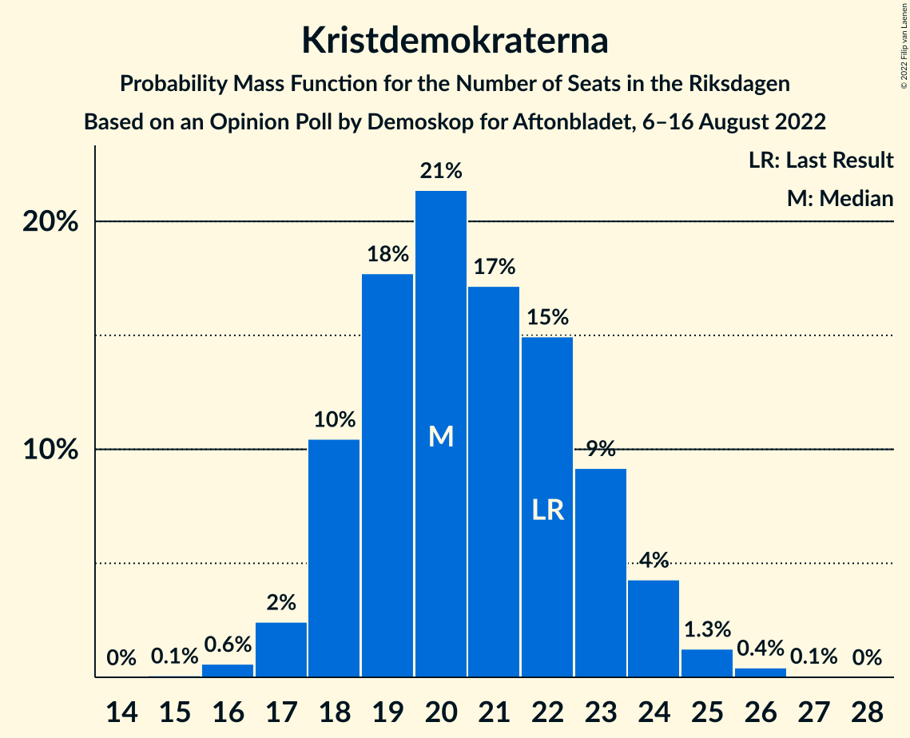

| Number of Seats | Probability | Accumulated | Special Marks |
|:---------------:|:-----------:|:-----------:|:-------------:|
| 15 | 0.1% | 100% |  |
| 16 | 0.6% | 99.9% |  |
| 17 | 2% | 99.3% |  |
| 18 | 10% | 97% |  |
| 19 | 18% | 86% |  |
| 20 | 21% | 69% | Median |
| 21 | 17% | 47% |  |
| 22 | 15% | 30% | Last Result |
| 23 | 9% | 15% |  |
| 24 | 4% | 6% |  |
| 25 | 1.3% | 2% |  |
| 26 | 0.4% | 0.5% |  |
| 27 | 0.1% | 0.1% |  |
| 28 | 0% | 0% |  |

### Miljöpartiet de gröna

*For a full overview of the results for this party, see the [Miljöpartiet de gröna](party-miljöpartietdegröna.html) page.*

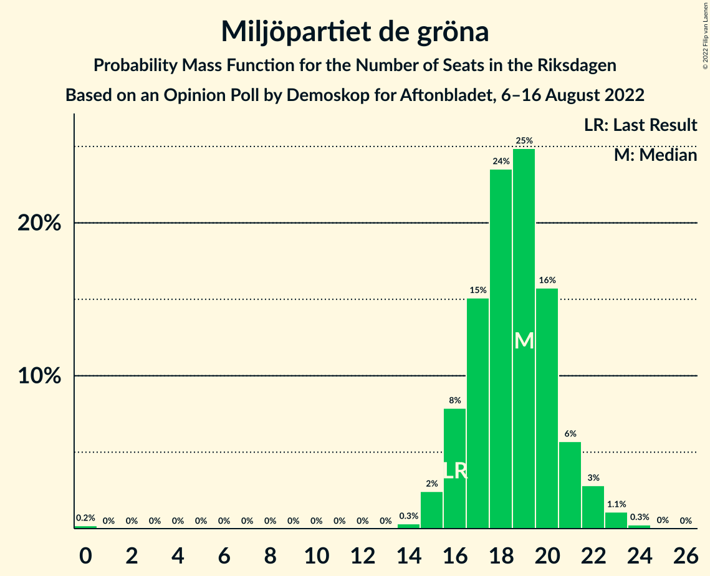

| Number of Seats | Probability | Accumulated | Special Marks |
|:---------------:|:-----------:|:-----------:|:-------------:|
| 0 | 0.2% | 100% |  |
| 1 | 0% | 99.8% |  |
| 2 | 0% | 99.8% |  |
| 3 | 0% | 99.8% |  |
| 4 | 0% | 99.8% |  |
| 5 | 0% | 99.8% |  |
| 6 | 0% | 99.8% |  |
| 7 | 0% | 99.8% |  |
| 8 | 0% | 99.8% |  |
| 9 | 0% | 99.8% |  |
| 10 | 0% | 99.8% |  |
| 11 | 0% | 99.8% |  |
| 12 | 0% | 99.8% |  |
| 13 | 0% | 99.8% |  |
| 14 | 0.3% | 99.8% |  |
| 15 | 2% | 99.5% |  |
| 16 | 8% | 97% | Last Result |
| 17 | 15% | 89% |  |
| 18 | 24% | 74% |  |
| 19 | 25% | 51% | Median |
| 20 | 16% | 26% |  |
| 21 | 6% | 10% |  |
| 22 | 3% | 4% |  |
| 23 | 1.1% | 1.4% |  |
| 24 | 0.3% | 0.3% |  |
| 25 | 0% | 0.1% |  |
| 26 | 0% | 0% |  |

### Liberalerna

*For a full overview of the results for this party, see the [Liberalerna](party-liberalerna.html) page.*

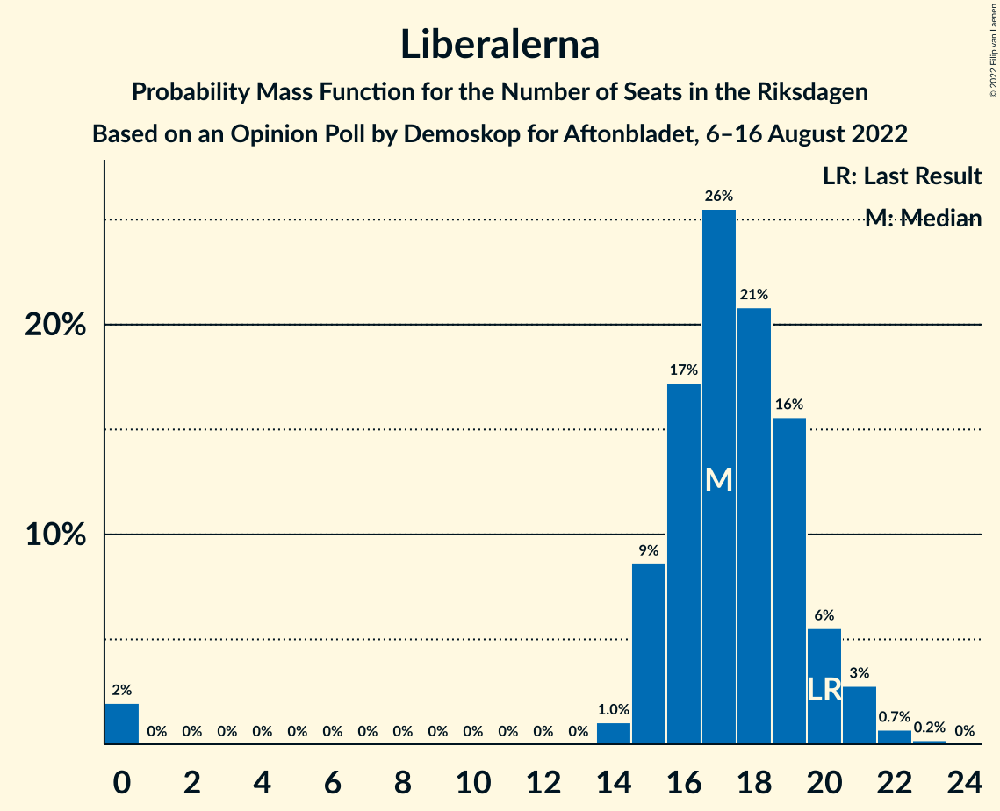

| Number of Seats | Probability | Accumulated | Special Marks |
|:---------------:|:-----------:|:-----------:|:-------------:|
| 0 | 2% | 100% |  |
| 1 | 0% | 98% |  |
| 2 | 0% | 98% |  |
| 3 | 0% | 98% |  |
| 4 | 0% | 98% |  |
| 5 | 0% | 98% |  |
| 6 | 0% | 98% |  |
| 7 | 0% | 98% |  |
| 8 | 0% | 98% |  |
| 9 | 0% | 98% |  |
| 10 | 0% | 98% |  |
| 11 | 0% | 98% |  |
| 12 | 0% | 98% |  |
| 13 | 0% | 98% |  |
| 14 | 1.0% | 98% |  |
| 15 | 9% | 97% |  |
| 16 | 17% | 88% |  |
| 17 | 26% | 71% | Median |
| 18 | 21% | 46% |  |
| 19 | 16% | 25% |  |
| 20 | 6% | 9% | Last Result |
| 21 | 3% | 4% |  |
| 22 | 0.7% | 0.9% |  |
| 23 | 0.2% | 0.2% |  |
| 24 | 0% | 0% |  |

## Coalitions

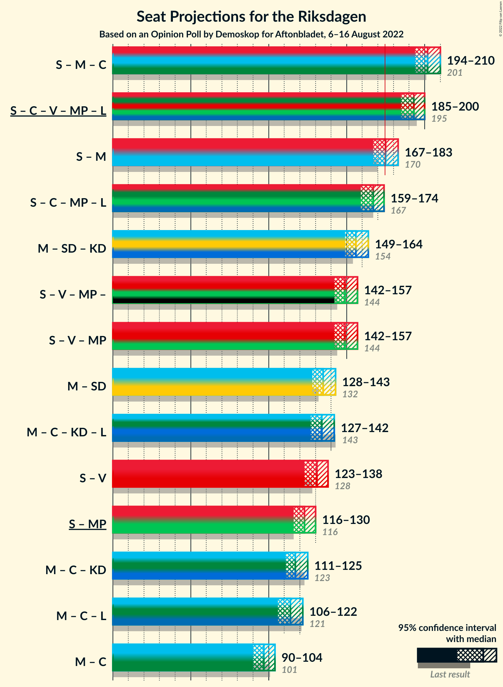

### Confidence Intervals

| Coalition | Last Result | Median | Majority? | 80% Confidence Interval | 90% Confidence Interval | 95% Confidence Interval | 99% Confidence Interval |
|:---------:|:-----------:|:------:|:---------:|:-----------------------:|:-----------------------:|:-----------------------:|:-----------------------:|
| Sveriges socialdemokratiska arbetareparti – Moderata samlingspartiet – Centerpartiet | 201 | 202 | 100% | 197–206 | 196–208 | 194–210 | 191–214 |
| Sveriges socialdemokratiska arbetareparti – Centerpartiet – Vänsterpartiet – Miljöpartiet de gröna – Liberalerna | 195 | 193 | 100% | 188–198 | 186–199 | 185–200 | 182–203 |
| Sveriges socialdemokratiska arbetareparti – Moderata samlingspartiet | 170 | 175 | 55% | 170–180 | 168–181 | 167–183 | 165–186 |
| Sveriges socialdemokratiska arbetareparti – Centerpartiet – Miljöpartiet de gröna – Liberalerna | 167 | 167 | 2% | 162–172 | 160–173 | 159–174 | 155–177 |
| Moderata samlingspartiet – Sverigedemokraterna – Kristdemokraterna | 154 | 156 | 0% | 151–161 | 150–163 | 149–164 | 146–167 |
| Sveriges socialdemokratiska arbetareparti – Vänsterpartiet – Miljöpartiet de gröna | 144 | 149 | 0% | 144–154 | 143–156 | 142–157 | 139–160 |
| Moderata samlingspartiet – Sverigedemokraterna | 132 | 135 | 0% | 130–140 | 129–142 | 128–143 | 126–146 |
| Moderata samlingspartiet – Centerpartiet – Kristdemokraterna – Liberalerna | 143 | 134 | 0% | 130–139 | 128–141 | 127–142 | 120–144 |
| Sveriges socialdemokratiska arbetareparti – Vänsterpartiet | 128 | 131 | 0% | 126–136 | 125–137 | 123–138 | 121–141 |
| Sveriges socialdemokratiska arbetareparti – Miljöpartiet de gröna | 116 | 123 | 0% | 118–128 | 117–129 | 116–130 | 113–133 |
| Moderata samlingspartiet – Centerpartiet – Kristdemokraterna | 123 | 117 | 0% | 113–122 | 112–124 | 111–125 | 109–128 |
| Moderata samlingspartiet – Centerpartiet – Liberalerna | 121 | 114 | 0% | 110–118 | 108–121 | 106–122 | 100–123 |
| Moderata samlingspartiet – Centerpartiet | 101 | 97 | 0% | 93–101 | 92–103 | 90–104 | 89–106 |

### Sveriges socialdemokratiska arbetareparti – Moderata samlingspartiet – Centerpartiet

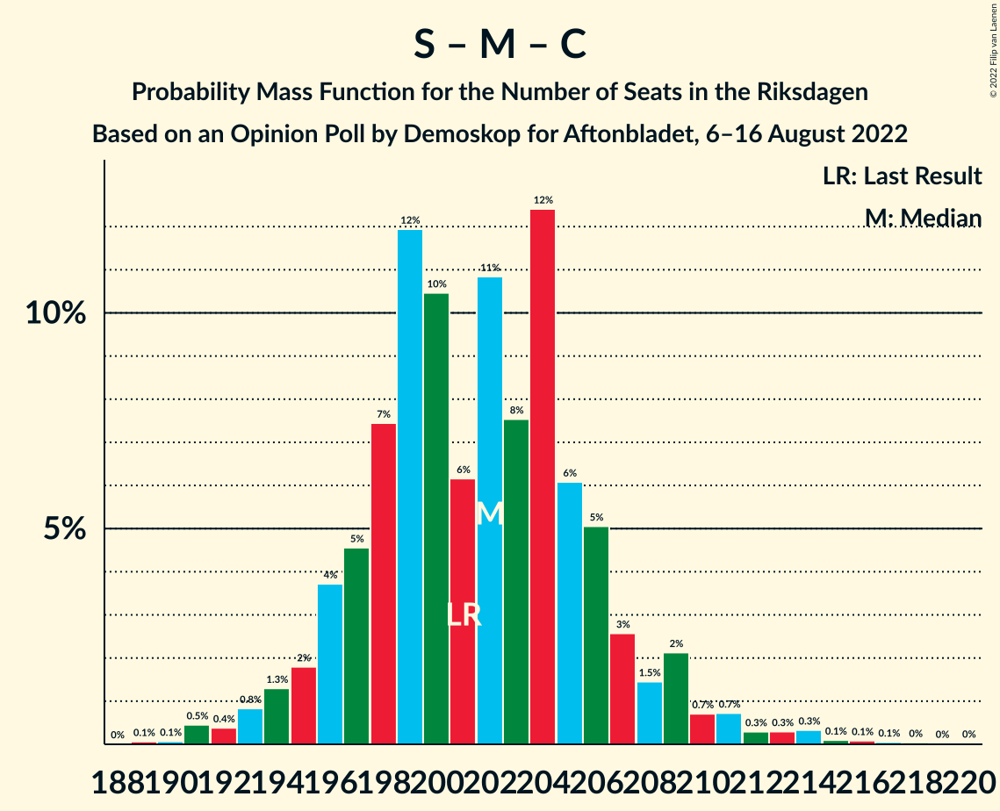

| Number of Seats | Probability | Accumulated | Special Marks |
|:---------------:|:-----------:|:-----------:|:-------------:|
| 189 | 0.1% | 100% |  |
| 190 | 0.1% | 99.9% |  |
| 191 | 0.5% | 99.8% |  |
| 192 | 0.4% | 99.4% |  |
| 193 | 0.8% | 99.0% |  |
| 194 | 1.3% | 98% |  |
| 195 | 2% | 97% |  |
| 196 | 4% | 95% |  |
| 197 | 5% | 91% |  |
| 198 | 7% | 87% |  |
| 199 | 12% | 79% |  |
| 200 | 10% | 67% |  |
| 201 | 6% | 57% | Last Result |
| 202 | 11% | 51% | Median |
| 203 | 8% | 40% |  |
| 204 | 12% | 32% |  |
| 205 | 6% | 20% |  |
| 206 | 5% | 14% |  |
| 207 | 3% | 9% |  |
| 208 | 1.5% | 6% |  |
| 209 | 2% | 5% |  |
| 210 | 0.7% | 3% |  |
| 211 | 0.7% | 2% |  |
| 212 | 0.3% | 1.3% |  |
| 213 | 0.3% | 1.0% |  |
| 214 | 0.3% | 0.7% |  |
| 215 | 0.1% | 0.3% |  |
| 216 | 0.1% | 0.3% |  |
| 217 | 0.1% | 0.2% |  |
| 218 | 0% | 0.1% |  |
| 219 | 0% | 0.1% |  |
| 220 | 0% | 0% |  |

### Sveriges socialdemokratiska arbetareparti – Centerpartiet – Vänsterpartiet – Miljöpartiet de gröna – Liberalerna

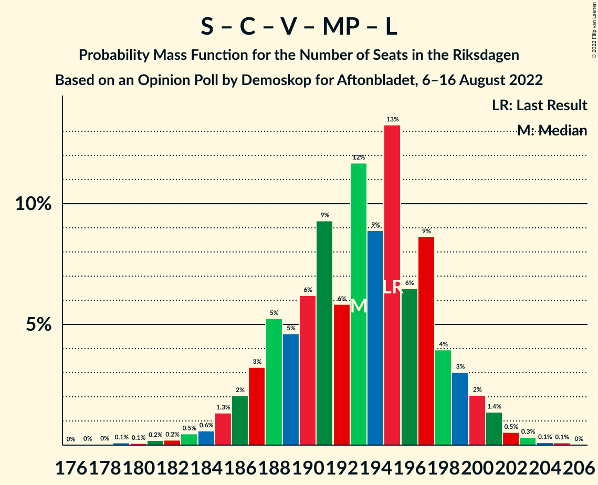

| Number of Seats | Probability | Accumulated | Special Marks |
|:---------------:|:-----------:|:-----------:|:-------------:|
| 177 | 0% | 100% |  |
| 178 | 0% | 99.9% |  |
| 179 | 0.1% | 99.9% |  |
| 180 | 0.1% | 99.8% |  |
| 181 | 0.2% | 99.7% |  |
| 182 | 0.2% | 99.5% |  |
| 183 | 0.5% | 99.3% |  |
| 184 | 0.6% | 98.9% |  |
| 185 | 1.3% | 98% |  |
| 186 | 2% | 97% |  |
| 187 | 3% | 95% |  |
| 188 | 5% | 92% |  |
| 189 | 5% | 86% |  |
| 190 | 6% | 82% |  |
| 191 | 9% | 76% |  |
| 192 | 6% | 66% |  |
| 193 | 12% | 60% |  |
| 194 | 9% | 49% | Median |
| 195 | 13% | 40% | Last Result |
| 196 | 6% | 27% |  |
| 197 | 9% | 20% |  |
| 198 | 4% | 12% |  |
| 199 | 3% | 8% |  |
| 200 | 2% | 5% |  |
| 201 | 1.4% | 2% |  |
| 202 | 0.5% | 1.1% |  |
| 203 | 0.3% | 0.6% |  |
| 204 | 0.1% | 0.3% |  |
| 205 | 0.1% | 0.1% |  |
| 206 | 0% | 0% |  |

### Sveriges socialdemokratiska arbetareparti – Moderata samlingspartiet

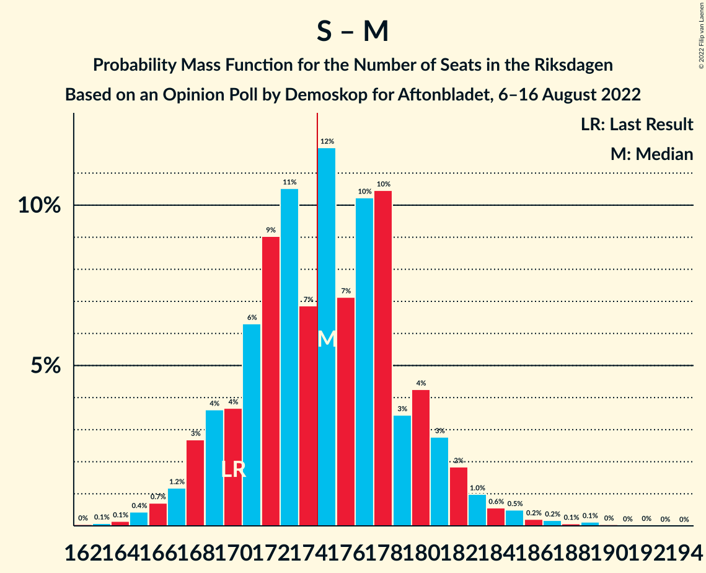

| Number of Seats | Probability | Accumulated | Special Marks |
|:---------------:|:-----------:|:-----------:|:-------------:|
| 162 | 0% | 100% |  |
| 163 | 0.1% | 99.9% |  |
| 164 | 0.1% | 99.9% |  |
| 165 | 0.4% | 99.7% |  |
| 166 | 0.7% | 99.3% |  |
| 167 | 1.2% | 98.6% |  |
| 168 | 3% | 97% |  |
| 169 | 4% | 95% |  |
| 170 | 4% | 91% | Last Result |
| 171 | 6% | 87% |  |
| 172 | 9% | 81% |  |
| 173 | 11% | 72% |  |
| 174 | 7% | 62% |  |
| 175 | 12% | 55% | Median, Majority |
| 176 | 7% | 43% |  |
| 177 | 10% | 36% |  |
| 178 | 10% | 26% |  |
| 179 | 3% | 15% |  |
| 180 | 4% | 12% |  |
| 181 | 3% | 7% |  |
| 182 | 2% | 5% |  |
| 183 | 1.0% | 3% |  |
| 184 | 0.6% | 2% |  |
| 185 | 0.5% | 1.2% |  |
| 186 | 0.2% | 0.7% |  |
| 187 | 0.2% | 0.5% |  |
| 188 | 0.1% | 0.3% |  |
| 189 | 0.1% | 0.2% |  |
| 190 | 0% | 0.1% |  |
| 191 | 0% | 0.1% |  |
| 192 | 0% | 0.1% |  |
| 193 | 0% | 0% |  |

### Sveriges socialdemokratiska arbetareparti – Centerpartiet – Miljöpartiet de gröna – Liberalerna

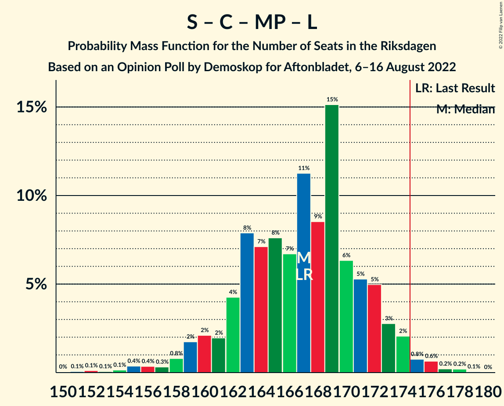

| Number of Seats | Probability | Accumulated | Special Marks |
|:---------------:|:-----------:|:-----------:|:-------------:|
| 150 | 0% | 100% |  |
| 151 | 0.1% | 99.9% |  |
| 152 | 0.1% | 99.9% |  |
| 153 | 0.1% | 99.7% |  |
| 154 | 0.1% | 99.7% |  |
| 155 | 0.4% | 99.5% |  |
| 156 | 0.4% | 99.2% |  |
| 157 | 0.3% | 98.8% |  |
| 158 | 0.8% | 98% |  |
| 159 | 2% | 98% |  |
| 160 | 2% | 96% |  |
| 161 | 2% | 94% |  |
| 162 | 4% | 92% |  |
| 163 | 8% | 88% |  |
| 164 | 7% | 80% |  |
| 165 | 8% | 73% |  |
| 166 | 7% | 65% |  |
| 167 | 11% | 58% | Last Result |
| 168 | 9% | 47% | Median |
| 169 | 15% | 38% |  |
| 170 | 6% | 23% |  |
| 171 | 5% | 17% |  |
| 172 | 5% | 12% |  |
| 173 | 3% | 7% |  |
| 174 | 2% | 4% |  |
| 175 | 0.8% | 2% | Majority |
| 176 | 0.6% | 1.2% |  |
| 177 | 0.2% | 0.5% |  |
| 178 | 0.2% | 0.3% |  |
| 179 | 0.1% | 0.1% |  |
| 180 | 0% | 0% |  |

### Moderata samlingspartiet – Sverigedemokraterna – Kristdemokraterna

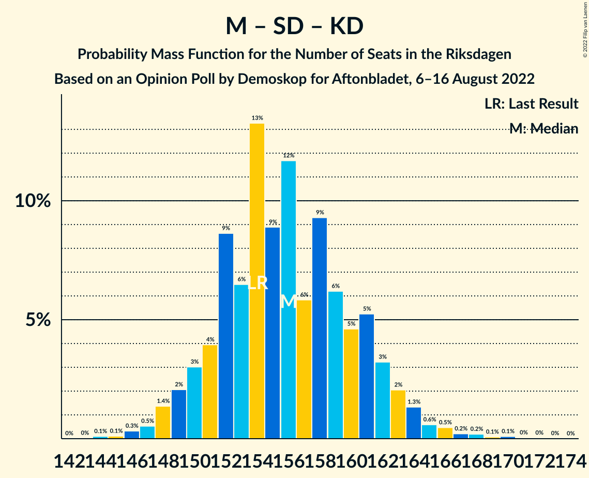

| Number of Seats | Probability | Accumulated | Special Marks |
|:---------------:|:-----------:|:-----------:|:-------------:|
| 144 | 0.1% | 100% |  |
| 145 | 0.1% | 99.9% |  |
| 146 | 0.3% | 99.7% |  |
| 147 | 0.5% | 99.4% |  |
| 148 | 1.4% | 98.9% |  |
| 149 | 2% | 98% |  |
| 150 | 3% | 95% |  |
| 151 | 4% | 92% |  |
| 152 | 9% | 88% |  |
| 153 | 6% | 80% |  |
| 154 | 13% | 73% | Last Result |
| 155 | 9% | 60% | Median |
| 156 | 12% | 51% |  |
| 157 | 6% | 40% |  |
| 158 | 9% | 34% |  |
| 159 | 6% | 24% |  |
| 160 | 5% | 18% |  |
| 161 | 5% | 14% |  |
| 162 | 3% | 8% |  |
| 163 | 2% | 5% |  |
| 164 | 1.3% | 3% |  |
| 165 | 0.6% | 2% |  |
| 166 | 0.5% | 1.1% |  |
| 167 | 0.2% | 0.7% |  |
| 168 | 0.2% | 0.5% |  |
| 169 | 0.1% | 0.3% |  |
| 170 | 0.1% | 0.2% |  |
| 171 | 0% | 0.1% |  |
| 172 | 0% | 0.1% |  |
| 173 | 0% | 0% |  |

### Sveriges socialdemokratiska arbetareparti – Vänsterpartiet – Miljöpartiet de gröna

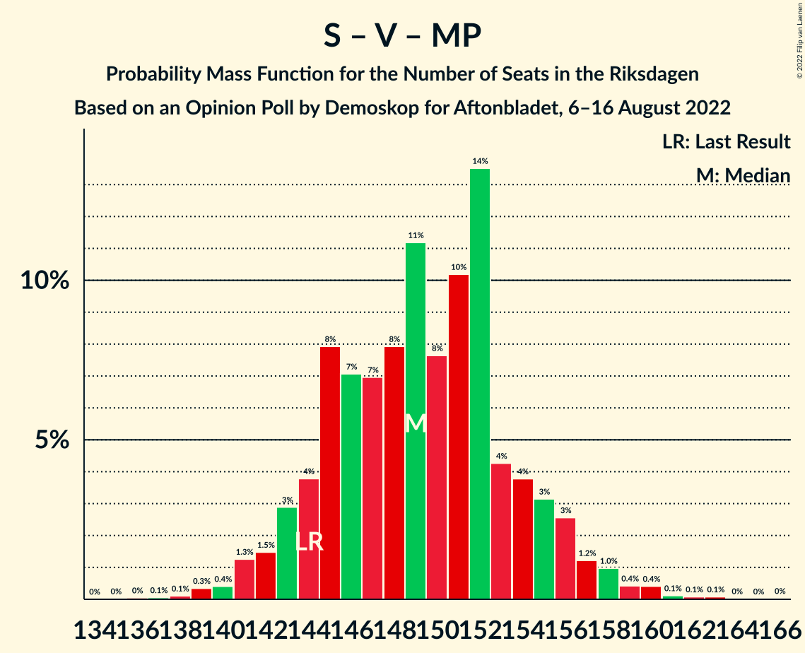

| Number of Seats | Probability | Accumulated | Special Marks |
|:---------------:|:-----------:|:-----------:|:-------------:|
| 135 | 0% | 100% |  |
| 136 | 0% | 99.9% |  |
| 137 | 0.1% | 99.9% |  |
| 138 | 0.1% | 99.8% |  |
| 139 | 0.3% | 99.7% |  |
| 140 | 0.4% | 99.4% |  |
| 141 | 1.3% | 99.0% |  |
| 142 | 1.5% | 98% |  |
| 143 | 3% | 96% |  |
| 144 | 4% | 93% | Last Result |
| 145 | 8% | 90% |  |
| 146 | 7% | 82% |  |
| 147 | 7% | 75% |  |
| 148 | 8% | 68% |  |
| 149 | 11% | 60% |  |
| 150 | 8% | 48% | Median |
| 151 | 10% | 41% |  |
| 152 | 14% | 31% |  |
| 153 | 4% | 17% |  |
| 154 | 4% | 13% |  |
| 155 | 3% | 9% |  |
| 156 | 3% | 6% |  |
| 157 | 1.2% | 3% |  |
| 158 | 1.0% | 2% |  |
| 159 | 0.4% | 1.2% |  |
| 160 | 0.4% | 0.8% |  |
| 161 | 0.1% | 0.4% |  |
| 162 | 0.1% | 0.2% |  |
| 163 | 0.1% | 0.2% |  |
| 164 | 0% | 0.1% |  |
| 165 | 0% | 0.1% |  |
| 166 | 0% | 0% |  |

### Moderata samlingspartiet – Sverigedemokraterna

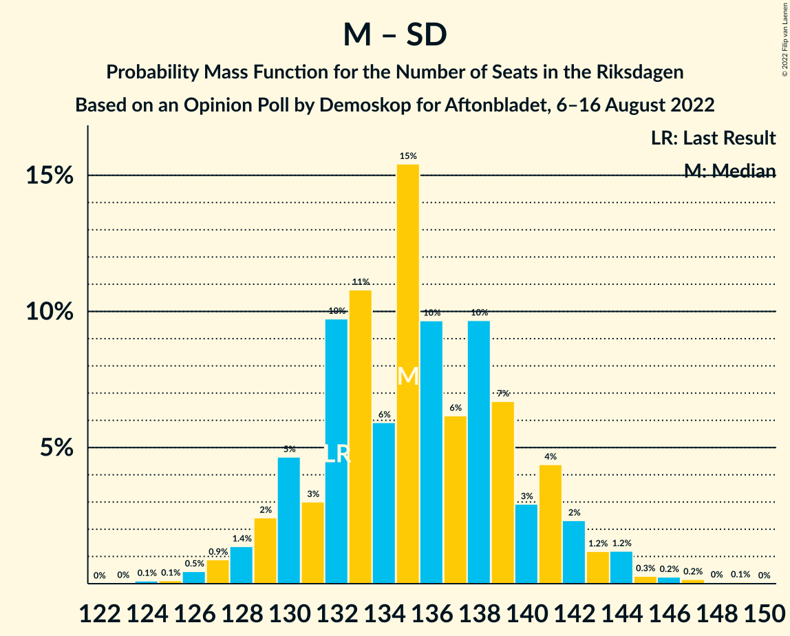

| Number of Seats | Probability | Accumulated | Special Marks |
|:---------------:|:-----------:|:-----------:|:-------------:|
| 124 | 0.1% | 100% |  |
| 125 | 0.1% | 99.8% |  |
| 126 | 0.5% | 99.7% |  |
| 127 | 0.9% | 99.3% |  |
| 128 | 1.4% | 98% |  |
| 129 | 2% | 97% |  |
| 130 | 5% | 95% |  |
| 131 | 3% | 90% |  |
| 132 | 10% | 87% | Last Result |
| 133 | 11% | 77% |  |
| 134 | 6% | 66% |  |
| 135 | 15% | 60% | Median |
| 136 | 10% | 45% |  |
| 137 | 6% | 35% |  |
| 138 | 10% | 29% |  |
| 139 | 7% | 20% |  |
| 140 | 3% | 13% |  |
| 141 | 4% | 10% |  |
| 142 | 2% | 6% |  |
| 143 | 1.2% | 3% |  |
| 144 | 1.2% | 2% |  |
| 145 | 0.3% | 0.8% |  |
| 146 | 0.2% | 0.6% |  |
| 147 | 0.2% | 0.3% |  |
| 148 | 0% | 0.1% |  |
| 149 | 0.1% | 0.1% |  |
| 150 | 0% | 0% |  |

### Moderata samlingspartiet – Centerpartiet – Kristdemokraterna – Liberalerna

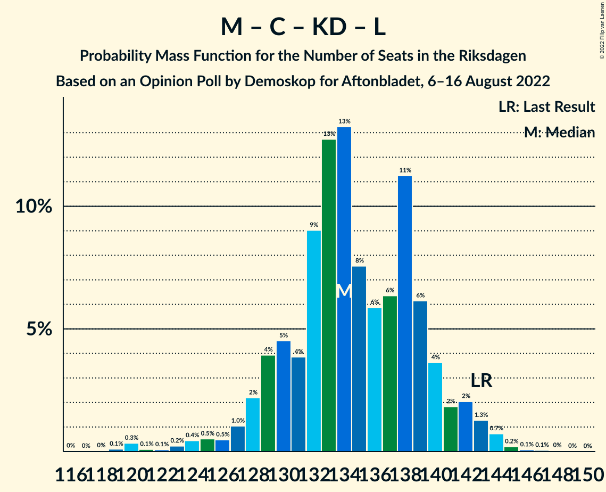

| Number of Seats | Probability | Accumulated | Special Marks |
|:---------------:|:-----------:|:-----------:|:-------------:|
| 116 | 0% | 100% |  |
| 117 | 0% | 99.9% |  |
| 118 | 0% | 99.9% |  |
| 119 | 0.1% | 99.9% |  |
| 120 | 0.3% | 99.8% |  |
| 121 | 0.1% | 99.5% |  |
| 122 | 0.1% | 99.4% |  |
| 123 | 0.2% | 99.3% |  |
| 124 | 0.4% | 99.1% |  |
| 125 | 0.5% | 98.6% |  |
| 126 | 0.5% | 98% |  |
| 127 | 1.0% | 98% |  |
| 128 | 2% | 97% |  |
| 129 | 4% | 94% |  |
| 130 | 5% | 90% |  |
| 131 | 4% | 86% |  |
| 132 | 9% | 82% |  |
| 133 | 13% | 73% |  |
| 134 | 13% | 60% | Median |
| 135 | 8% | 47% |  |
| 136 | 6% | 40% |  |
| 137 | 6% | 34% |  |
| 138 | 11% | 27% |  |
| 139 | 6% | 16% |  |
| 140 | 4% | 10% |  |
| 141 | 2% | 6% |  |
| 142 | 2% | 4% |  |
| 143 | 1.3% | 2% | Last Result |
| 144 | 0.7% | 1.1% |  |
| 145 | 0.2% | 0.4% |  |
| 146 | 0.1% | 0.2% |  |
| 147 | 0.1% | 0.1% |  |
| 148 | 0% | 0.1% |  |
| 149 | 0% | 0% |  |

### Sveriges socialdemokratiska arbetareparti – Vänsterpartiet

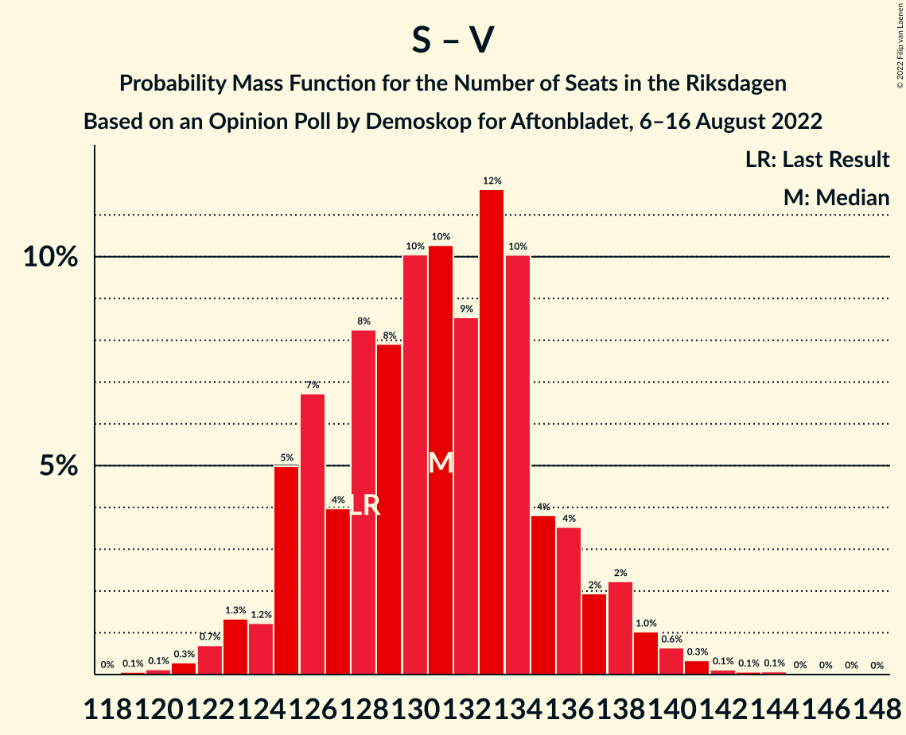

| Number of Seats | Probability | Accumulated | Special Marks |
|:---------------:|:-----------:|:-----------:|:-------------:|
| 119 | 0.1% | 100% |  |
| 120 | 0.1% | 99.9% |  |
| 121 | 0.3% | 99.8% |  |
| 122 | 0.7% | 99.5% |  |
| 123 | 1.3% | 98.8% |  |
| 124 | 1.2% | 97% |  |
| 125 | 5% | 96% |  |
| 126 | 7% | 91% |  |
| 127 | 4% | 85% |  |
| 128 | 8% | 81% | Last Result |
| 129 | 8% | 72% |  |
| 130 | 10% | 64% |  |
| 131 | 10% | 54% | Median |
| 132 | 9% | 44% |  |
| 133 | 12% | 36% |  |
| 134 | 10% | 24% |  |
| 135 | 4% | 14% |  |
| 136 | 4% | 10% |  |
| 137 | 2% | 7% |  |
| 138 | 2% | 5% |  |
| 139 | 1.0% | 2% |  |
| 140 | 0.6% | 1.3% |  |
| 141 | 0.3% | 0.7% |  |
| 142 | 0.1% | 0.3% |  |
| 143 | 0.1% | 0.2% |  |
| 144 | 0.1% | 0.1% |  |
| 145 | 0% | 0.1% |  |
| 146 | 0% | 0.1% |  |
| 147 | 0% | 0% |  |

### Sveriges socialdemokratiska arbetareparti – Miljöpartiet de gröna

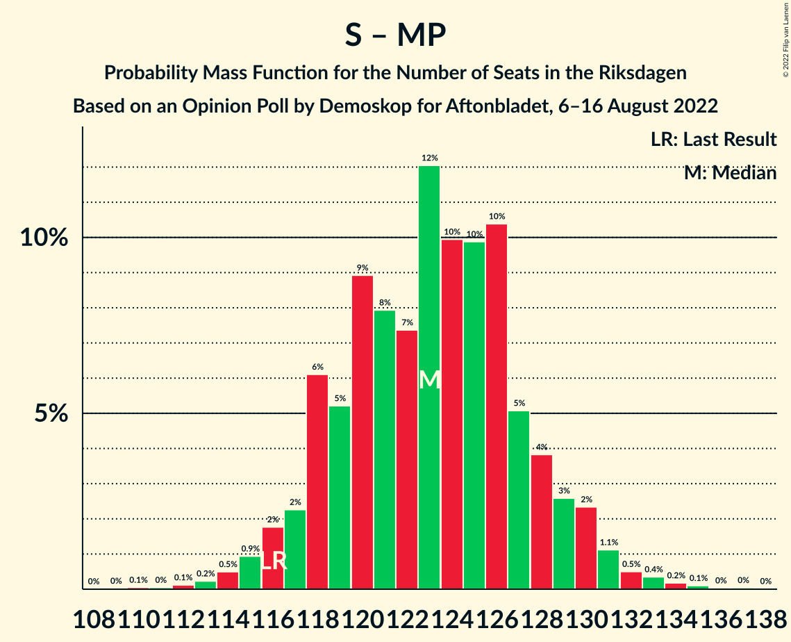

| Number of Seats | Probability | Accumulated | Special Marks |
|:---------------:|:-----------:|:-----------:|:-------------:|
| 108 | 0% | 100% |  |
| 109 | 0% | 99.9% |  |
| 110 | 0.1% | 99.9% |  |
| 111 | 0% | 99.9% |  |
| 112 | 0.1% | 99.8% |  |
| 113 | 0.2% | 99.7% |  |
| 114 | 0.5% | 99.5% |  |
| 115 | 0.9% | 99.0% |  |
| 116 | 2% | 98% | Last Result |
| 117 | 2% | 96% |  |
| 118 | 6% | 94% |  |
| 119 | 5% | 88% |  |
| 120 | 9% | 83% |  |
| 121 | 8% | 74% |  |
| 122 | 7% | 66% |  |
| 123 | 12% | 58% |  |
| 124 | 10% | 46% | Median |
| 125 | 10% | 36% |  |
| 126 | 10% | 27% |  |
| 127 | 5% | 16% |  |
| 128 | 4% | 11% |  |
| 129 | 3% | 7% |  |
| 130 | 2% | 5% |  |
| 131 | 1.1% | 2% |  |
| 132 | 0.5% | 1.2% |  |
| 133 | 0.4% | 0.7% |  |
| 134 | 0.2% | 0.4% |  |
| 135 | 0.1% | 0.2% |  |
| 136 | 0% | 0.1% |  |
| 137 | 0% | 0.1% |  |
| 138 | 0% | 0% |  |

### Moderata samlingspartiet – Centerpartiet – Kristdemokraterna

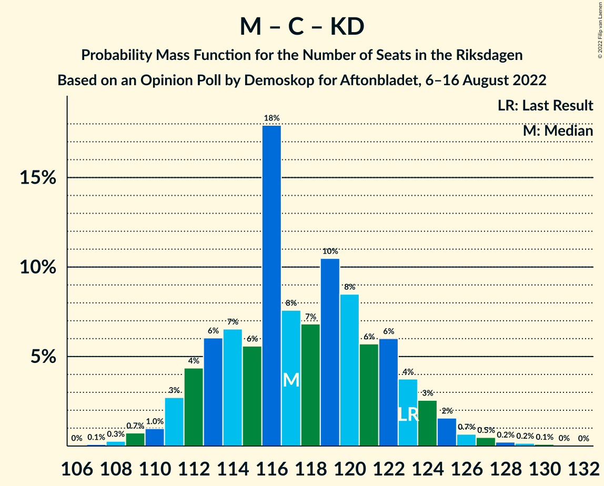

| Number of Seats | Probability | Accumulated | Special Marks |
|:---------------:|:-----------:|:-----------:|:-------------:|
| 106 | 0% | 100% |  |
| 107 | 0.1% | 99.9% |  |
| 108 | 0.3% | 99.8% |  |
| 109 | 0.7% | 99.6% |  |
| 110 | 1.0% | 98.8% |  |
| 111 | 3% | 98% |  |
| 112 | 4% | 95% |  |
| 113 | 6% | 91% |  |
| 114 | 7% | 85% |  |
| 115 | 6% | 78% |  |
| 116 | 18% | 73% |  |
| 117 | 8% | 55% | Median |
| 118 | 7% | 47% |  |
| 119 | 10% | 40% |  |
| 120 | 8% | 30% |  |
| 121 | 6% | 21% |  |
| 122 | 6% | 16% |  |
| 123 | 4% | 10% | Last Result |
| 124 | 3% | 6% |  |
| 125 | 2% | 3% |  |
| 126 | 0.7% | 2% |  |
| 127 | 0.5% | 1.0% |  |
| 128 | 0.2% | 0.6% |  |
| 129 | 0.2% | 0.3% |  |
| 130 | 0.1% | 0.2% |  |
| 131 | 0% | 0.1% |  |
| 132 | 0% | 0% |  |

### Moderata samlingspartiet – Centerpartiet – Liberalerna

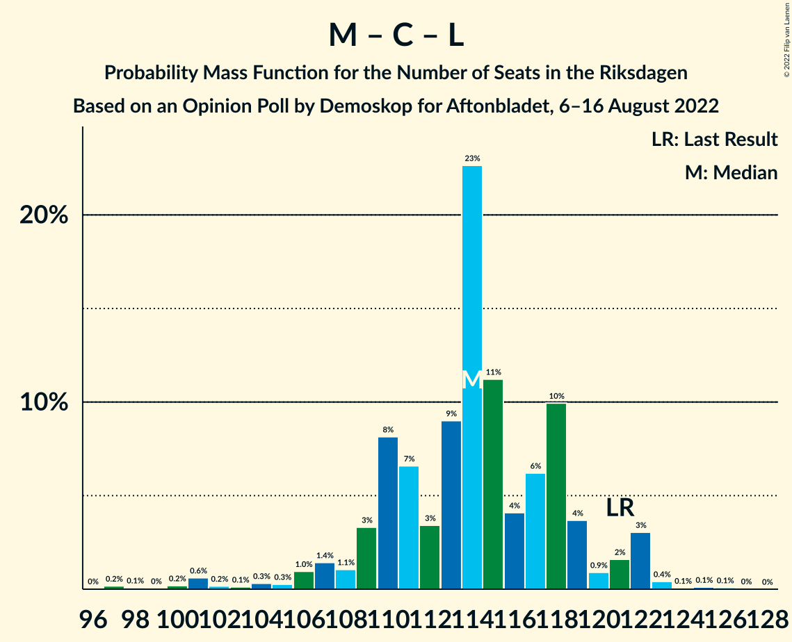

| Number of Seats | Probability | Accumulated | Special Marks |
|:---------------:|:-----------:|:-----------:|:-------------:|
| 96 | 0% | 100% |  |
| 97 | 0.2% | 99.9% |  |
| 98 | 0.1% | 99.8% |  |
| 99 | 0% | 99.7% |  |
| 100 | 0.2% | 99.6% |  |
| 101 | 0.6% | 99.4% |  |
| 102 | 0.2% | 98.8% |  |
| 103 | 0.1% | 98.7% |  |
| 104 | 0.3% | 98.5% |  |
| 105 | 0.3% | 98% |  |
| 106 | 1.0% | 98% |  |
| 107 | 1.4% | 97% |  |
| 108 | 1.1% | 96% |  |
| 109 | 3% | 95% |  |
| 110 | 8% | 91% |  |
| 111 | 7% | 83% |  |
| 112 | 3% | 76% |  |
| 113 | 9% | 73% |  |
| 114 | 23% | 64% | Median |
| 115 | 11% | 41% |  |
| 116 | 4% | 30% |  |
| 117 | 6% | 26% |  |
| 118 | 10% | 20% |  |
| 119 | 4% | 10% |  |
| 120 | 0.9% | 6% |  |
| 121 | 2% | 5% | Last Result |
| 122 | 3% | 4% |  |
| 123 | 0.4% | 0.7% |  |
| 124 | 0.1% | 0.3% |  |
| 125 | 0.1% | 0.2% |  |
| 126 | 0.1% | 0.1% |  |
| 127 | 0% | 0% |  |

### Moderata samlingspartiet – Centerpartiet

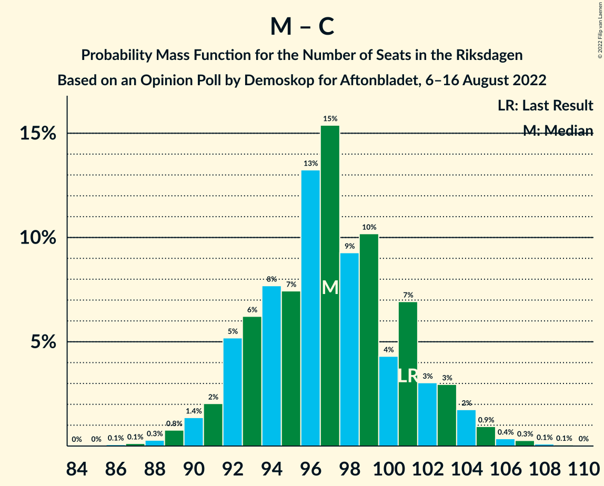

| Number of Seats | Probability | Accumulated | Special Marks |
|:---------------:|:-----------:|:-----------:|:-------------:|
| 86 | 0.1% | 100% |  |
| 87 | 0.1% | 99.9% |  |
| 88 | 0.3% | 99.8% |  |
| 89 | 0.8% | 99.5% |  |
| 90 | 1.4% | 98.7% |  |
| 91 | 2% | 97% |  |
| 92 | 5% | 95% |  |
| 93 | 6% | 90% |  |
| 94 | 8% | 84% |  |
| 95 | 7% | 76% |  |
| 96 | 13% | 69% |  |
| 97 | 15% | 56% | Median |
| 98 | 9% | 40% |  |
| 99 | 10% | 31% |  |
| 100 | 4% | 21% |  |
| 101 | 7% | 16% | Last Result |
| 102 | 3% | 9% |  |
| 103 | 3% | 6% |  |
| 104 | 2% | 4% |  |
| 105 | 0.9% | 2% |  |
| 106 | 0.4% | 0.8% |  |
| 107 | 0.3% | 0.5% |  |
| 108 | 0.1% | 0.2% |  |
| 109 | 0.1% | 0.1% |  |
| 110 | 0% | 0% |  |

## Technical Information

### Opinion Poll

+ **Polling firm:** Demoskop
+ **Commissioner(s):** Aftonbladet
+ **Fieldwork period:** 6–16 August 2022

### Calculations

+ **Sample size:** 2209
+ **Simulations done:** 1,048,576
+ **Error estimate:** 0.61%

