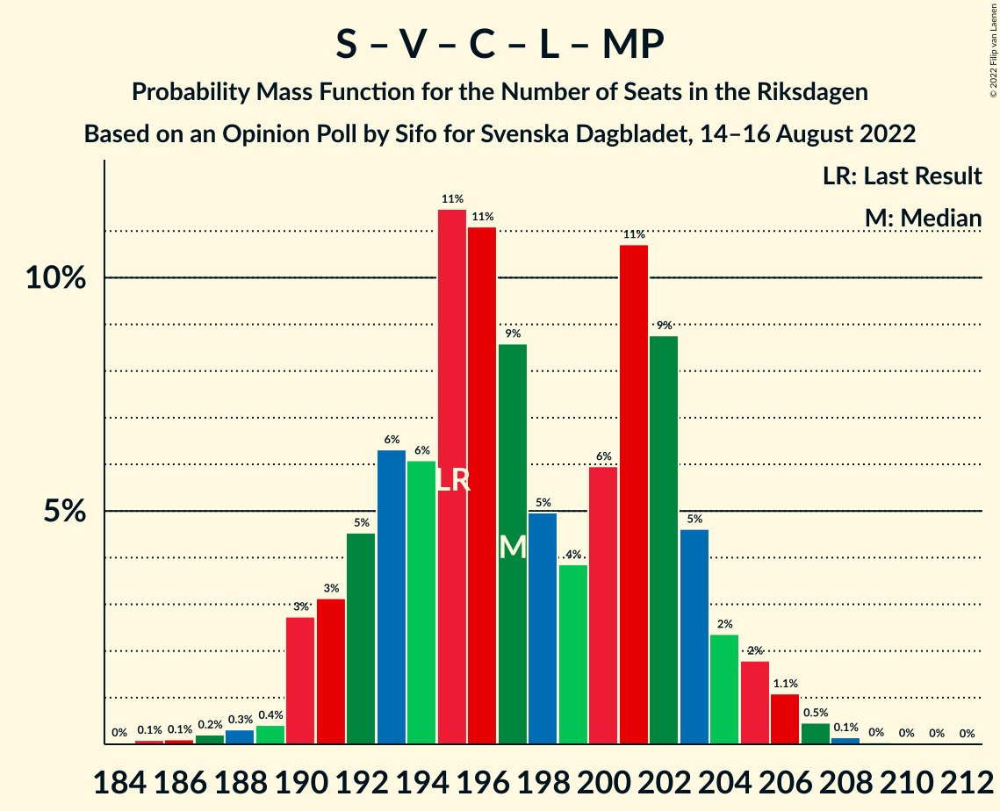
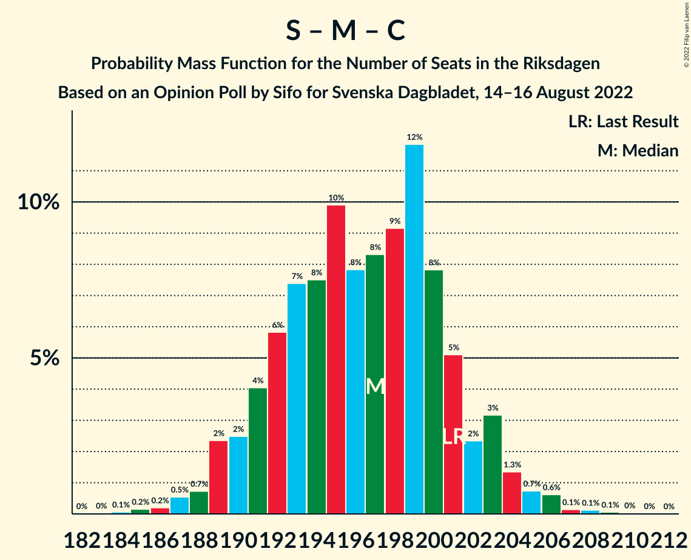
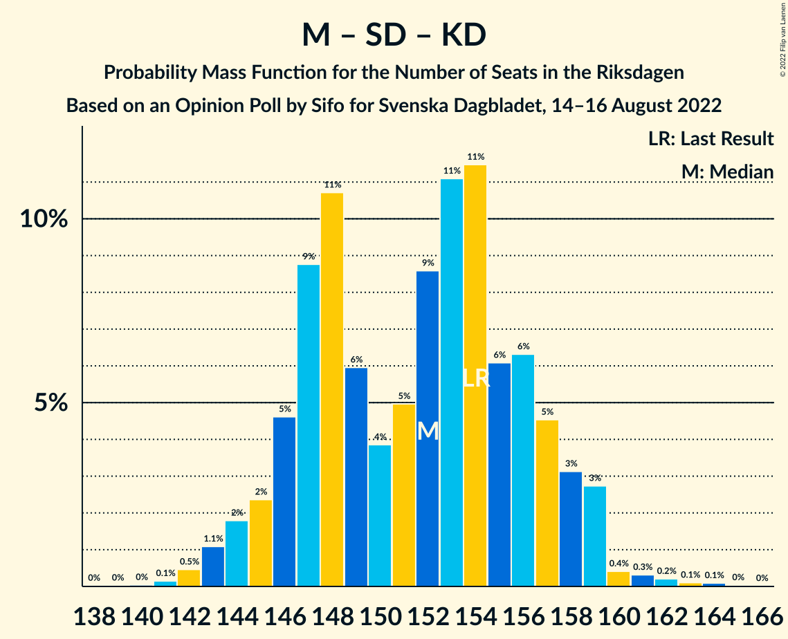

# Opinion Poll by Sifo for Svenska Dagbladet, 14–16 August 2022

<a href="#voting-intentions">Voting Intentions</a> | <a href="#seats">Seats</a> | <a href="#coalitions">Coalitions</a> | <a href="#technical-information">Technical Information</a>

## Voting Intentions

### Confidence Intervals

| Party | Last Result | Poll Result | 80% Confidence Interval | 90% Confidence Interval | 95% Confidence Interval | 99% Confidence Interval |
|:-----:|:-----------:|:-----------:|:-----------------------:|:-----------------------:|:-----------------------:|:-----------------------:|
| Sveriges socialdemokratiska arbetareparti | 28.3% | 29.6% | 28.3–31.0% |28.0–31.3% |27.7–31.7% |27.1–32.3% |
| Moderata samlingspartiet | 19.8% | 19.2% | 18.1–20.3% |17.8–20.7% |17.5–20.9% |17.0–21.5% |
| Sverigedemokraterna | 17.5% | 17.4% | 16.4–18.6% |16.1–18.9% |15.8–19.2% |15.3–19.7% |
| Vänsterpartiet | 8.0% | 8.4% | 7.7–9.2% |7.4–9.5% |7.3–9.7% |6.9–10.1% |
| Centerpartiet | 8.6% | 6.3% | 5.6–7.0% |5.4–7.2% |5.3–7.4% |5.0–7.8% |
| Kristdemokraterna | 6.3% | 5.9% | 5.3–6.6% |5.1–6.8% |4.9–7.0% |4.6–7.4% |
| Liberalerna | 5.5% | 5.6% | 5.0–6.3% |4.8–6.5% |4.6–6.7% |4.4–7.0% |
| Miljöpartiet de gröna | 4.4% | 5.4% | 4.8–6.1% |4.6–6.3% |4.5–6.5% |4.2–6.8% |

*Note:* The poll result column reflects the actual value used in the calculations. Published results may vary slightly, and in addition be rounded to fewer digits.

## Seats

### Confidence Intervals

| Party | Last Result | Median | 80% Confidence Interval | 90% Confidence Interval | 95% Confidence Interval | 99% Confidence Interval |
|:-----:|:-----------:|:------:|:-----------------------:|:-----------------------:|:-----------------------:|:-----------------------:|
| <a href="#sveriges-socialdemokratiska-arbetareparti">Sveriges socialdemokratiska arbetareparti</a> | 100 | 106 | 101–110 |100–112 |98–113 |97–115 |
| <a href="#moderata-samlingspartiet">Moderata samlingspartiet</a> | 70 | 68 | 64–73 |63–74 |62–75 |61–76 |
| <a href="#sverigedemokraterna">Sverigedemokraterna</a> | 62 | 62 | 59–66 |57–67 |56–68 |55–70 |
| <a href="#vänsterpartiet">Vänsterpartiet</a> | 28 | 30 | 27–33 |27–34 |26–35 |25–36 |
| <a href="#centerpartiet">Centerpartiet</a> | 31 | 22 | 20–25 |19–26 |19–27 |18–28 |
| <a href="#kristdemokraterna">Kristdemokraterna</a> | 22 | 21 | 19–24 |18–24 |18–25 |17–26 |
| <a href="#liberalerna">Liberalerna</a> | 20 | 20 | 18–22 |17–23 |17–24 |16–25 |
| <a href="#miljöpartiet-de-gröna">Miljöpartiet de gröna</a> | 16 | 19 | 17–22 |17–22 |16–23 |15–24 |

### Sveriges socialdemokratiska arbetareparti

*For a full overview of the results for this party, see the [Sveriges socialdemokratiska arbetareparti](party-sverigessocialdemokratiskaarbetareparti.html) page.*

| Number of Seats | Probability | Accumulated | Special Marks |
|:---------------:|:-----------:|:-----------:|:-------------:|
| 94 | 0.1% | 100% |  |
| 95 | 0.1% | 99.9% |  |
| 96 | 0.2% | 99.8% |  |
| 97 | 0.8% | 99.6% |  |
| 98 | 2% | 98.8% |  |
| 99 | 2% | 97% |  |
| 100 | 2% | 95% | Last Result |
| 101 | 6% | 93% |  |
| 102 | 8% | 87% |  |
| 103 | 7% | 78% |  |
| 104 | 7% | 72% |  |
| 105 | 12% | 64% |  |
| 106 | 10% | 52% | Median |
| 107 | 12% | 42% |  |
| 108 | 7% | 31% |  |
| 109 | 12% | 24% |  |
| 110 | 5% | 12% |  |
| 111 | 2% | 8% |  |
| 112 | 1.5% | 5% |  |
| 113 | 2% | 4% |  |
| 114 | 1.1% | 2% |  |
| 115 | 0.3% | 0.6% |  |
| 116 | 0.1% | 0.3% |  |
| 117 | 0.1% | 0.2% |  |
| 118 | 0% | 0.1% |  |
| 119 | 0% | 0% |  |

### Moderata samlingspartiet

*For a full overview of the results for this party, see the [Moderata samlingspartiet](party-moderatasamlingspartiet.html) page.*

| Number of Seats | Probability | Accumulated | Special Marks |
|:---------------:|:-----------:|:-----------:|:-------------:|
| 58 | 0% | 100% |  |
| 59 | 0.1% | 99.9% |  |
| 60 | 0.3% | 99.8% |  |
| 61 | 0.9% | 99.5% |  |
| 62 | 2% | 98.6% |  |
| 63 | 3% | 97% |  |
| 64 | 5% | 94% |  |
| 65 | 8% | 89% |  |
| 66 | 7% | 81% |  |
| 67 | 15% | 74% |  |
| 68 | 14% | 59% | Median |
| 69 | 10% | 45% |  |
| 70 | 10% | 35% | Last Result |
| 71 | 8% | 25% |  |
| 72 | 6% | 17% |  |
| 73 | 4% | 11% |  |
| 74 | 3% | 6% |  |
| 75 | 2% | 3% |  |
| 76 | 0.7% | 1.1% |  |
| 77 | 0.3% | 0.4% |  |
| 78 | 0.1% | 0.2% |  |
| 79 | 0% | 0.1% |  |
| 80 | 0% | 0% |  |

### Sverigedemokraterna

*For a full overview of the results for this party, see the [Sverigedemokraterna](party-sverigedemokraterna.html) page.*

| Number of Seats | Probability | Accumulated | Special Marks |
|:---------------:|:-----------:|:-----------:|:-------------:|
| 53 | 0.1% | 100% |  |
| 54 | 0.3% | 99.8% |  |
| 55 | 0.5% | 99.5% |  |
| 56 | 2% | 99.0% |  |
| 57 | 3% | 97% |  |
| 58 | 4% | 95% |  |
| 59 | 10% | 91% |  |
| 60 | 14% | 81% |  |
| 61 | 12% | 67% |  |
| 62 | 12% | 54% | Last Result, Median |
| 63 | 8% | 42% |  |
| 64 | 11% | 34% |  |
| 65 | 9% | 23% |  |
| 66 | 5% | 14% |  |
| 67 | 5% | 9% |  |
| 68 | 3% | 5% |  |
| 69 | 1.1% | 2% |  |
| 70 | 0.4% | 0.7% |  |
| 71 | 0.2% | 0.3% |  |
| 72 | 0% | 0.1% |  |
| 73 | 0% | 0.1% |  |
| 74 | 0% | 0% |  |

### Vänsterpartiet

*For a full overview of the results for this party, see the [Vänsterpartiet](party-vänsterpartiet.html) page.*

| Number of Seats | Probability | Accumulated | Special Marks |
|:---------------:|:-----------:|:-----------:|:-------------:|
| 23 | 0% | 100% |  |
| 24 | 0.4% | 99.9% |  |
| 25 | 1.2% | 99.6% |  |
| 26 | 3% | 98% |  |
| 27 | 8% | 95% |  |
| 28 | 12% | 87% | Last Result |
| 29 | 15% | 75% |  |
| 30 | 20% | 59% | Median |
| 31 | 15% | 39% |  |
| 32 | 10% | 24% |  |
| 33 | 8% | 14% |  |
| 34 | 3% | 6% |  |
| 35 | 2% | 3% |  |
| 36 | 0.7% | 1.0% |  |
| 37 | 0.2% | 0.3% |  |
| 38 | 0.1% | 0.1% |  |
| 39 | 0% | 0% |  |

### Centerpartiet

*For a full overview of the results for this party, see the [Centerpartiet](party-centerpartiet.html) page.*

| Number of Seats | Probability | Accumulated | Special Marks |
|:---------------:|:-----------:|:-----------:|:-------------:|
| 17 | 0.2% | 100% |  |
| 18 | 1.0% | 99.7% |  |
| 19 | 5% | 98.8% |  |
| 20 | 11% | 94% |  |
| 21 | 14% | 84% |  |
| 22 | 21% | 69% | Median |
| 23 | 20% | 48% |  |
| 24 | 15% | 28% |  |
| 25 | 7% | 13% |  |
| 26 | 3% | 6% |  |
| 27 | 2% | 3% |  |
| 28 | 0.4% | 0.6% |  |
| 29 | 0.1% | 0.2% |  |
| 30 | 0% | 0% |  |
| 31 | 0% | 0% | Last Result |

### Kristdemokraterna

*For a full overview of the results for this party, see the [Kristdemokraterna](party-kristdemokraterna.html) page.*

| Number of Seats | Probability | Accumulated | Special Marks |
|:---------------:|:-----------:|:-----------:|:-------------:|
| 15 | 0% | 100% |  |
| 16 | 0.4% | 99.9% |  |
| 17 | 2% | 99.5% |  |
| 18 | 5% | 98% |  |
| 19 | 12% | 93% |  |
| 20 | 19% | 81% |  |
| 21 | 22% | 61% | Median |
| 22 | 19% | 39% | Last Result |
| 23 | 10% | 21% |  |
| 24 | 7% | 10% |  |
| 25 | 3% | 4% |  |
| 26 | 0.9% | 1.2% |  |
| 27 | 0.2% | 0.3% |  |
| 28 | 0% | 0.1% |  |
| 29 | 0% | 0% |  |

### Liberalerna

*For a full overview of the results for this party, see the [Liberalerna](party-liberalerna.html) page.*

| Number of Seats | Probability | Accumulated | Special Marks |
|:---------------:|:-----------:|:-----------:|:-------------:|
| 15 | 0.3% | 100% |  |
| 16 | 2% | 99.6% |  |
| 17 | 5% | 98% |  |
| 18 | 13% | 93% |  |
| 19 | 17% | 80% |  |
| 20 | 25% | 63% | Last Result, Median |
| 21 | 18% | 38% |  |
| 22 | 11% | 20% |  |
| 23 | 4% | 8% |  |
| 24 | 3% | 4% |  |
| 25 | 0.5% | 0.8% |  |
| 26 | 0.3% | 0.3% |  |
| 27 | 0% | 0% |  |

### Miljöpartiet de gröna

*For a full overview of the results for this party, see the [Miljöpartiet de gröna](party-miljöpartietdegröna.html) page.*

| Number of Seats | Probability | Accumulated | Special Marks |
|:---------------:|:-----------:|:-----------:|:-------------:|
| 0 | 0.1% | 100% |  |
| 1 | 0% | 99.9% |  |
| 2 | 0% | 99.9% |  |
| 3 | 0% | 99.9% |  |
| 4 | 0% | 99.9% |  |
| 5 | 0% | 99.9% |  |
| 6 | 0% | 99.9% |  |
| 7 | 0% | 99.9% |  |
| 8 | 0% | 99.9% |  |
| 9 | 0% | 99.9% |  |
| 10 | 0% | 99.9% |  |
| 11 | 0% | 99.9% |  |
| 12 | 0% | 99.9% |  |
| 13 | 0% | 99.9% |  |
| 14 | 0.1% | 99.9% |  |
| 15 | 1.1% | 99.8% |  |
| 16 | 3% | 98.7% | Last Result |
| 17 | 9% | 95% |  |
| 18 | 18% | 86% |  |
| 19 | 27% | 68% | Median |
| 20 | 16% | 41% |  |
| 21 | 14% | 25% |  |
| 22 | 7% | 11% |  |
| 23 | 3% | 4% |  |
| 24 | 0.8% | 1.1% |  |
| 25 | 0.3% | 0.3% |  |
| 26 | 0.1% | 0.1% |  |
| 27 | 0% | 0% |  |

## Coalitions

### Confidence Intervals

| Coalition | Last Result | Median | Majority? | 80% Confidence Interval | 90% Confidence Interval | 95% Confidence Interval | 99% Confidence Interval |
|:---------:|:-----------:|:------:|:---------:|:-----------------------:|:-----------------------:|:-----------------------:|:-----------------------:|
| Sveriges socialdemokratiska arbetareparti – Vänsterpartiet – Centerpartiet – Liberalerna – Miljöpartiet de gröna | 195 | 197 | 100% | 192–203 | 191–204 | 190–205 | 188–207 |
| Sveriges socialdemokratiska arbetareparti – Moderata samlingspartiet – Centerpartiet | 201 | 197 | 100% | 191–201 | 190–203 | 189–204 | 187–206 |
| Sveriges socialdemokratiska arbetareparti – Moderata samlingspartiet | 170 | 174 | 47% | 169–179 | 168–181 | 166–181 | 164–184 |
| Sveriges socialdemokratiska arbetareparti – Centerpartiet – Liberalerna – Miljöpartiet de gröna | 167 | 167 | 4% | 162–172 | 161–174 | 159–175 | 157–178 |
| Sveriges socialdemokratiska arbetareparti – Vänsterpartiet – Miljöpartiet de gröna | 144 | 155 | 0% | 150–160 | 149–161 | 147–163 | 145–165 |
| Moderata samlingspartiet – Sverigedemokraterna – Kristdemokraterna | 154 | 152 | 0% | 146–157 | 145–158 | 144–159 | 142–161 |
| Sveriges socialdemokratiska arbetareparti – Vänsterpartiet | 128 | 136 | 0% | 131–141 | 129–142 | 128–143 | 126–146 |
| Moderata samlingspartiet – Centerpartiet – Kristdemokraterna – Liberalerna | 143 | 132 | 0% | 127–137 | 126–138 | 124–139 | 122–142 |
| Moderata samlingspartiet – Sverigedemokraterna | 132 | 131 | 0% | 125–136 | 124–136 | 124–137 | 122–140 |
| Sveriges socialdemokratiska arbetareparti – Miljöpartiet de gröna | 116 | 125 | 0% | 120–130 | 119–131 | 117–132 | 115–135 |
| Moderata samlingspartiet – Centerpartiet – Kristdemokraterna | 123 | 111 | 0% | 108–117 | 106–118 | 104–119 | 103–122 |
| Moderata samlingspartiet – Centerpartiet – Liberalerna | 121 | 111 | 0% | 106–115 | 105–117 | 103–118 | 101–120 |
| Moderata samlingspartiet – Centerpartiet | 101 | 91 | 0% | 86–96 | 85–97 | 84–97 | 82–100 |

### Sveriges socialdemokratiska arbetareparti – Vänsterpartiet – Centerpartiet – Liberalerna – Miljöpartiet de gröna

| Number of Seats | Probability | Accumulated | Special Marks |
|:---------------:|:-----------:|:-----------:|:-------------:|
| 184 | 0% | 100% |  |
| 185 | 0.1% | 99.9% |  |
| 186 | 0.1% | 99.8% |  |
| 187 | 0.2% | 99.7% |  |
| 188 | 0.3% | 99.5% |  |
| 189 | 0.4% | 99.2% |  |
| 190 | 3% | 98.8% |  |
| 191 | 3% | 96% |  |
| 192 | 5% | 93% |  |
| 193 | 6% | 88% |  |
| 194 | 6% | 82% |  |
| 195 | 11% | 76% | Last Result |
| 196 | 11% | 65% |  |
| 197 | 9% | 53% | Median |
| 198 | 5% | 45% |  |
| 199 | 4% | 40% |  |
| 200 | 6% | 36% |  |
| 201 | 11% | 30% |  |
| 202 | 9% | 19% |  |
| 203 | 5% | 11% |  |
| 204 | 2% | 6% |  |
| 205 | 2% | 4% |  |
| 206 | 1.1% | 2% |  |
| 207 | 0.5% | 0.7% |  |
| 208 | 0.1% | 0.3% |  |
| 209 | 0% | 0.1% |  |
| 210 | 0% | 0.1% |  |
| 211 | 0% | 0% |  |

### Sveriges socialdemokratiska arbetareparti – Moderata samlingspartiet – Centerpartiet

| Number of Seats | Probability | Accumulated | Special Marks |
|:---------------:|:-----------:|:-----------:|:-------------:|
| 184 | 0.1% | 100% |  |
| 185 | 0.2% | 99.9% |  |
| 186 | 0.2% | 99.7% |  |
| 187 | 0.5% | 99.5% |  |
| 188 | 0.7% | 99.0% |  |
| 189 | 2% | 98% |  |
| 190 | 2% | 96% |  |
| 191 | 4% | 93% |  |
| 192 | 6% | 89% |  |
| 193 | 7% | 84% |  |
| 194 | 8% | 76% |  |
| 195 | 10% | 69% |  |
| 196 | 8% | 59% | Median |
| 197 | 8% | 51% |  |
| 198 | 9% | 43% |  |
| 199 | 12% | 33% |  |
| 200 | 8% | 22% |  |
| 201 | 5% | 14% | Last Result |
| 202 | 2% | 9% |  |
| 203 | 3% | 6% |  |
| 204 | 1.3% | 3% |  |
| 205 | 0.7% | 2% |  |
| 206 | 0.6% | 1.0% |  |
| 207 | 0.1% | 0.4% |  |
| 208 | 0.1% | 0.3% |  |
| 209 | 0.1% | 0.1% |  |
| 210 | 0% | 0.1% |  |
| 211 | 0% | 0% |  |

### Sveriges socialdemokratiska arbetareparti – Moderata samlingspartiet

| Number of Seats | Probability | Accumulated | Special Marks |
|:---------------:|:-----------:|:-----------:|:-------------:|
| 161 | 0.1% | 100% |  |
| 162 | 0.1% | 99.9% |  |
| 163 | 0.2% | 99.8% |  |
| 164 | 0.3% | 99.6% |  |
| 165 | 0.9% | 99.3% |  |
| 166 | 1.2% | 98% |  |
| 167 | 2% | 97% |  |
| 168 | 4% | 95% |  |
| 169 | 4% | 91% |  |
| 170 | 8% | 88% | Last Result |
| 171 | 7% | 80% |  |
| 172 | 8% | 72% |  |
| 173 | 10% | 65% |  |
| 174 | 7% | 54% | Median |
| 175 | 8% | 47% | Majority |
| 176 | 12% | 39% |  |
| 177 | 8% | 27% |  |
| 178 | 8% | 20% |  |
| 179 | 4% | 11% |  |
| 180 | 2% | 7% |  |
| 181 | 3% | 5% |  |
| 182 | 0.7% | 2% |  |
| 183 | 0.7% | 1.5% |  |
| 184 | 0.4% | 0.8% |  |
| 185 | 0.2% | 0.3% |  |
| 186 | 0.1% | 0.2% |  |
| 187 | 0% | 0.1% |  |
| 188 | 0% | 0.1% |  |
| 189 | 0% | 0% |  |

### Sveriges socialdemokratiska arbetareparti – Centerpartiet – Liberalerna – Miljöpartiet de gröna

| Number of Seats | Probability | Accumulated | Special Marks |
|:---------------:|:-----------:|:-----------:|:-------------:|
| 154 | 0% | 100% |  |
| 155 | 0.1% | 99.9% |  |
| 156 | 0.2% | 99.9% |  |
| 157 | 0.3% | 99.7% |  |
| 158 | 0.6% | 99.4% |  |
| 159 | 1.3% | 98.8% |  |
| 160 | 2% | 97% |  |
| 161 | 3% | 96% |  |
| 162 | 3% | 92% |  |
| 163 | 6% | 89% |  |
| 164 | 8% | 83% |  |
| 165 | 8% | 75% |  |
| 166 | 9% | 68% |  |
| 167 | 9% | 58% | Last Result, Median |
| 168 | 9% | 49% |  |
| 169 | 8% | 40% |  |
| 170 | 7% | 32% |  |
| 171 | 9% | 25% |  |
| 172 | 6% | 16% |  |
| 173 | 4% | 9% |  |
| 174 | 2% | 6% |  |
| 175 | 2% | 4% | Majority |
| 176 | 0.9% | 2% |  |
| 177 | 0.8% | 1.3% |  |
| 178 | 0.4% | 0.6% |  |
| 179 | 0.1% | 0.2% |  |
| 180 | 0% | 0.1% |  |
| 181 | 0% | 0% |  |

### Sveriges socialdemokratiska arbetareparti – Vänsterpartiet – Miljöpartiet de gröna

| Number of Seats | Probability | Accumulated | Special Marks |
|:---------------:|:-----------:|:-----------:|:-------------:|
| 141 | 0% | 100% |  |
| 142 | 0% | 99.9% |  |
| 143 | 0.1% | 99.9% |  |
| 144 | 0.2% | 99.8% | Last Result |
| 145 | 0.3% | 99.7% |  |
| 146 | 0.9% | 99.3% |  |
| 147 | 1.4% | 98% |  |
| 148 | 2% | 97% |  |
| 149 | 3% | 95% |  |
| 150 | 5% | 92% |  |
| 151 | 8% | 87% |  |
| 152 | 12% | 79% |  |
| 153 | 7% | 68% |  |
| 154 | 6% | 61% |  |
| 155 | 10% | 55% | Median |
| 156 | 6% | 45% |  |
| 157 | 9% | 39% |  |
| 158 | 12% | 30% |  |
| 159 | 5% | 18% |  |
| 160 | 4% | 13% |  |
| 161 | 4% | 9% |  |
| 162 | 2% | 5% |  |
| 163 | 1.3% | 3% |  |
| 164 | 0.7% | 1.3% |  |
| 165 | 0.3% | 0.5% |  |
| 166 | 0.1% | 0.2% |  |
| 167 | 0% | 0.1% |  |
| 168 | 0% | 0.1% |  |
| 169 | 0% | 0% |  |

### Moderata samlingspartiet – Sverigedemokraterna – Kristdemokraterna

| Number of Seats | Probability | Accumulated | Special Marks |
|:---------------:|:-----------:|:-----------:|:-------------:|
| 139 | 0% | 100% |  |
| 140 | 0% | 99.9% |  |
| 141 | 0.1% | 99.9% |  |
| 142 | 0.5% | 99.7% |  |
| 143 | 1.1% | 99.3% |  |
| 144 | 2% | 98% |  |
| 145 | 2% | 96% |  |
| 146 | 5% | 94% |  |
| 147 | 9% | 89% |  |
| 148 | 11% | 81% |  |
| 149 | 6% | 70% |  |
| 150 | 4% | 64% |  |
| 151 | 5% | 60% | Median |
| 152 | 9% | 55% |  |
| 153 | 11% | 47% |  |
| 154 | 11% | 35% | Last Result |
| 155 | 6% | 24% |  |
| 156 | 6% | 18% |  |
| 157 | 5% | 12% |  |
| 158 | 3% | 7% |  |
| 159 | 3% | 4% |  |
| 160 | 0.4% | 1.2% |  |
| 161 | 0.3% | 0.8% |  |
| 162 | 0.2% | 0.5% |  |
| 163 | 0.1% | 0.3% |  |
| 164 | 0.1% | 0.2% |  |
| 165 | 0% | 0.1% |  |
| 166 | 0% | 0% |  |

### Sveriges socialdemokratiska arbetareparti – Vänsterpartiet

| Number of Seats | Probability | Accumulated | Special Marks |
|:---------------:|:-----------:|:-----------:|:-------------:|
| 123 | 0% | 100% |  |
| 124 | 0.1% | 99.9% |  |
| 125 | 0.3% | 99.9% |  |
| 126 | 0.5% | 99.6% |  |
| 127 | 0.6% | 99.1% |  |
| 128 | 2% | 98% | Last Result |
| 129 | 3% | 97% |  |
| 130 | 4% | 94% |  |
| 131 | 6% | 90% |  |
| 132 | 6% | 84% |  |
| 133 | 8% | 78% |  |
| 134 | 9% | 69% |  |
| 135 | 6% | 60% |  |
| 136 | 8% | 53% | Median |
| 137 | 12% | 45% |  |
| 138 | 8% | 33% |  |
| 139 | 10% | 25% |  |
| 140 | 4% | 15% |  |
| 141 | 4% | 11% |  |
| 142 | 3% | 7% |  |
| 143 | 1.3% | 4% |  |
| 144 | 1.4% | 2% |  |
| 145 | 0.4% | 1.0% |  |
| 146 | 0.5% | 0.7% |  |
| 147 | 0.1% | 0.2% |  |
| 148 | 0% | 0.1% |  |
| 149 | 0% | 0.1% |  |
| 150 | 0% | 0% |  |

### Moderata samlingspartiet – Centerpartiet – Kristdemokraterna – Liberalerna

| Number of Seats | Probability | Accumulated | Special Marks |
|:---------------:|:-----------:|:-----------:|:-------------:|
| 119 | 0% | 100% |  |
| 120 | 0.1% | 99.9% |  |
| 121 | 0.3% | 99.9% |  |
| 122 | 0.4% | 99.6% |  |
| 123 | 0.8% | 99.2% |  |
| 124 | 1.1% | 98% |  |
| 125 | 2% | 97% |  |
| 126 | 3% | 96% |  |
| 127 | 6% | 93% |  |
| 128 | 4% | 87% |  |
| 129 | 7% | 83% |  |
| 130 | 10% | 76% |  |
| 131 | 15% | 66% | Median |
| 132 | 9% | 51% |  |
| 133 | 8% | 42% |  |
| 134 | 8% | 34% |  |
| 135 | 7% | 26% |  |
| 136 | 7% | 19% |  |
| 137 | 5% | 11% |  |
| 138 | 2% | 6% |  |
| 139 | 2% | 4% |  |
| 140 | 1.1% | 2% |  |
| 141 | 0.6% | 1.1% |  |
| 142 | 0.2% | 0.5% |  |
| 143 | 0.2% | 0.4% | Last Result |
| 144 | 0.1% | 0.2% |  |
| 145 | 0% | 0.1% |  |
| 146 | 0% | 0% |  |

### Moderata samlingspartiet – Sverigedemokraterna

| Number of Seats | Probability | Accumulated | Special Marks |
|:---------------:|:-----------:|:-----------:|:-------------:|
| 118 | 0% | 100% |  |
| 119 | 0.1% | 99.9% |  |
| 120 | 0.1% | 99.8% |  |
| 121 | 0.1% | 99.7% |  |
| 122 | 0.4% | 99.6% |  |
| 123 | 1.3% | 99.1% |  |
| 124 | 3% | 98% |  |
| 125 | 6% | 95% |  |
| 126 | 8% | 89% |  |
| 127 | 14% | 81% |  |
| 128 | 6% | 67% |  |
| 129 | 5% | 60% |  |
| 130 | 3% | 55% | Median |
| 131 | 4% | 52% |  |
| 132 | 8% | 48% | Last Result |
| 133 | 9% | 40% |  |
| 134 | 13% | 31% |  |
| 135 | 8% | 18% |  |
| 136 | 6% | 10% |  |
| 137 | 3% | 4% |  |
| 138 | 0.5% | 1.2% |  |
| 139 | 0.1% | 0.7% |  |
| 140 | 0.2% | 0.6% |  |
| 141 | 0.1% | 0.4% |  |
| 142 | 0.1% | 0.3% |  |
| 143 | 0.1% | 0.2% |  |
| 144 | 0% | 0.1% |  |
| 145 | 0% | 0% |  |

### Sveriges socialdemokratiska arbetareparti – Miljöpartiet de gröna

| Number of Seats | Probability | Accumulated | Special Marks |
|:---------------:|:-----------:|:-----------:|:-------------:|
| 111 | 0% | 100% |  |
| 112 | 0% | 99.9% |  |
| 113 | 0.1% | 99.9% |  |
| 114 | 0.2% | 99.9% |  |
| 115 | 0.3% | 99.7% |  |
| 116 | 0.5% | 99.3% | Last Result |
| 117 | 1.4% | 98.9% |  |
| 118 | 2% | 97% |  |
| 119 | 3% | 96% |  |
| 120 | 5% | 93% |  |
| 121 | 6% | 88% |  |
| 122 | 8% | 82% |  |
| 123 | 7% | 74% |  |
| 124 | 13% | 67% |  |
| 125 | 11% | 54% | Median |
| 126 | 8% | 43% |  |
| 127 | 8% | 35% |  |
| 128 | 12% | 27% |  |
| 129 | 4% | 15% |  |
| 130 | 4% | 11% |  |
| 131 | 3% | 7% |  |
| 132 | 2% | 4% |  |
| 133 | 1.0% | 2% |  |
| 134 | 0.5% | 1.2% |  |
| 135 | 0.4% | 0.6% |  |
| 136 | 0.1% | 0.2% |  |
| 137 | 0% | 0.1% |  |
| 138 | 0% | 0% |  |

### Moderata samlingspartiet – Centerpartiet – Kristdemokraterna

| Number of Seats | Probability | Accumulated | Special Marks |
|:---------------:|:-----------:|:-----------:|:-------------:|
| 100 | 0% | 100% |  |
| 101 | 0.1% | 99.9% |  |
| 102 | 0.2% | 99.9% |  |
| 103 | 0.8% | 99.6% |  |
| 104 | 2% | 98.8% |  |
| 105 | 2% | 97% |  |
| 106 | 2% | 95% |  |
| 107 | 3% | 93% |  |
| 108 | 4% | 90% |  |
| 109 | 9% | 87% |  |
| 110 | 14% | 77% |  |
| 111 | 16% | 64% | Median |
| 112 | 9% | 48% |  |
| 113 | 6% | 39% |  |
| 114 | 6% | 33% |  |
| 115 | 10% | 27% |  |
| 116 | 6% | 17% |  |
| 117 | 6% | 11% |  |
| 118 | 3% | 5% |  |
| 119 | 0.8% | 3% |  |
| 120 | 0.7% | 2% |  |
| 121 | 0.4% | 1.1% |  |
| 122 | 0.3% | 0.7% |  |
| 123 | 0.3% | 0.4% | Last Result |
| 124 | 0.1% | 0.1% |  |
| 125 | 0% | 0% |  |

### Moderata samlingspartiet – Centerpartiet – Liberalerna

| Number of Seats | Probability | Accumulated | Special Marks |
|:---------------:|:-----------:|:-----------:|:-------------:|
| 98 | 0% | 100% |  |
| 99 | 0% | 99.9% |  |
| 100 | 0.2% | 99.9% |  |
| 101 | 0.5% | 99.8% |  |
| 102 | 0.4% | 99.3% |  |
| 103 | 1.4% | 98.9% |  |
| 104 | 1.4% | 97% |  |
| 105 | 4% | 96% |  |
| 106 | 5% | 92% |  |
| 107 | 5% | 87% |  |
| 108 | 6% | 82% |  |
| 109 | 10% | 76% |  |
| 110 | 14% | 66% | Median |
| 111 | 11% | 52% |  |
| 112 | 8% | 41% |  |
| 113 | 6% | 33% |  |
| 114 | 12% | 27% |  |
| 115 | 6% | 15% |  |
| 116 | 2% | 9% |  |
| 117 | 4% | 7% |  |
| 118 | 2% | 3% |  |
| 119 | 0.8% | 2% |  |
| 120 | 0.4% | 0.9% |  |
| 121 | 0.3% | 0.5% | Last Result |
| 122 | 0.1% | 0.2% |  |
| 123 | 0.1% | 0.1% |  |
| 124 | 0% | 0% |  |

### Moderata samlingspartiet – Centerpartiet

| Number of Seats | Probability | Accumulated | Special Marks |
|:---------------:|:-----------:|:-----------:|:-------------:|
| 80 | 0.1% | 100% |  |
| 81 | 0.2% | 99.9% |  |
| 82 | 0.5% | 99.7% |  |
| 83 | 0.9% | 99.2% |  |
| 84 | 2% | 98% |  |
| 85 | 3% | 97% |  |
| 86 | 5% | 94% |  |
| 87 | 6% | 89% |  |
| 88 | 8% | 83% |  |
| 89 | 10% | 75% |  |
| 90 | 13% | 65% | Median |
| 91 | 11% | 52% |  |
| 92 | 8% | 41% |  |
| 93 | 12% | 33% |  |
| 94 | 6% | 21% |  |
| 95 | 5% | 15% |  |
| 96 | 4% | 10% |  |
| 97 | 3% | 6% |  |
| 98 | 1.0% | 2% |  |
| 99 | 0.7% | 1.3% |  |
| 100 | 0.4% | 0.7% |  |
| 101 | 0.2% | 0.3% | Last Result |
| 102 | 0.1% | 0.1% |  |
| 103 | 0% | 0.1% |  |
| 104 | 0% | 0% |  |

## Technical Information

### Opinion Poll

+ **Polling firm:** Sifo
+ **Commissioner(s):** Svenska Dagbladet
+ **Fieldwork period:** 14–16 August 2022

### Calculations

+ **Sample size:** 2025
+ **Simulations done:** 1,048,576
+ **Error estimate:** 1.08%

