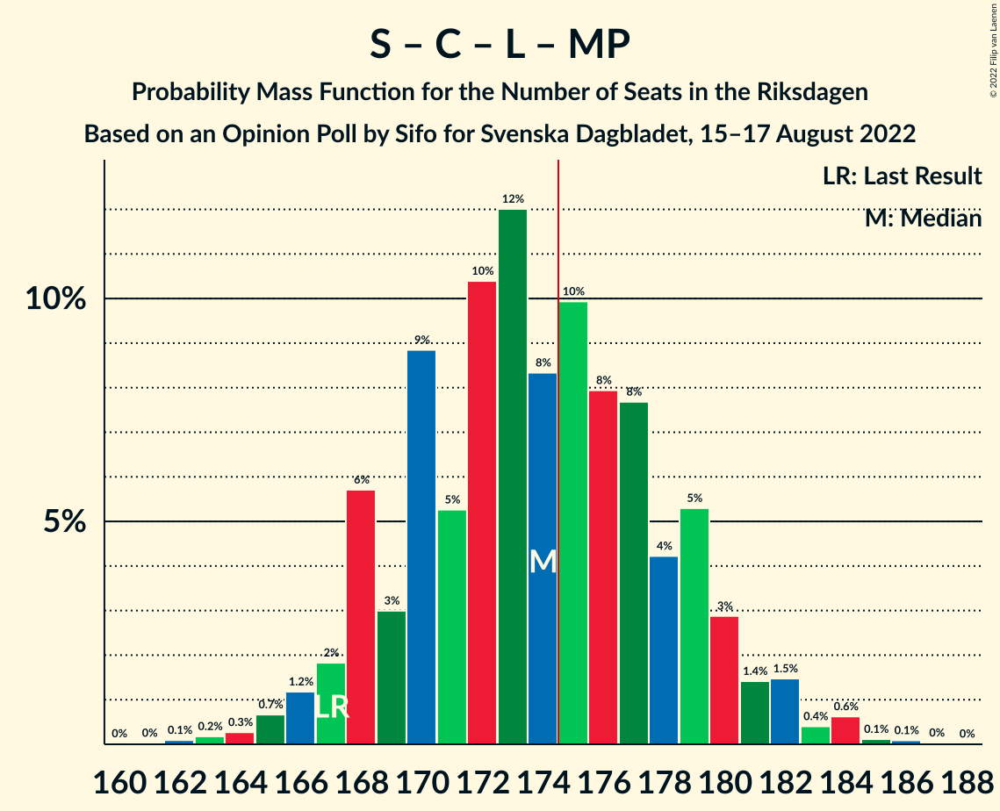

# Opinion Poll by Sifo for Svenska Dagbladet, 15–17 August 2022

<a href="#voting-intentions">Voting Intentions</a> | <a href="#seats">Seats</a> | <a href="#coalitions">Coalitions</a> | <a href="#technical-information">Technical Information</a>

## Voting Intentions

### Confidence Intervals

| Party | Last Result | Poll Result | 80% Confidence Interval | 90% Confidence Interval | 95% Confidence Interval | 99% Confidence Interval |
|:-----:|:-----------:|:-----------:|:-----------------------:|:-----------------------:|:-----------------------:|:-----------------------:|
| Sveriges socialdemokratiska arbetareparti | 28.3% | 31.2% | 29.9–32.5% |29.6–32.9% |29.2–33.2% |28.7–33.9% |
| Moderata samlingspartiet | 19.8% | 18.2% | 17.2–19.3% |16.9–19.6% |16.6–19.9% |16.1–20.5% |
| Sverigedemokraterna | 17.5% | 17.1% | 16.1–18.2% |15.8–18.5% |15.6–18.8% |15.1–19.3% |
| Vänsterpartiet | 8.0% | 8.0% | 7.3–8.8% |7.1–9.1% |6.9–9.3% |6.6–9.7% |
| Centerpartiet | 8.6% | 6.0% | 5.4–6.8% |5.2–7.0% |5.1–7.1% |4.8–7.5% |
| Liberalerna | 5.5% | 5.9% | 5.3–6.6% |5.1–6.8% |5.0–7.0% |4.7–7.3% |
| Kristdemokraterna | 6.3% | 5.6% | 5.0–6.3% |4.8–6.5% |4.7–6.7% |4.4–7.0% |
| Miljöpartiet de gröna | 4.4% | 5.5% | 4.9–6.2% |4.7–6.4% |4.6–6.6% |4.3–6.9% |

*Note:* The poll result column reflects the actual value used in the calculations. Published results may vary slightly, and in addition be rounded to fewer digits.

## Seats

### Confidence Intervals

| Party | Last Result | Median | 80% Confidence Interval | 90% Confidence Interval | 95% Confidence Interval | 99% Confidence Interval |
|:-----:|:-----------:|:------:|:-----------------------:|:-----------------------:|:-----------------------:|:-----------------------:|
| <a href="#sveriges-socialdemokratiska-arbetareparti">Sveriges socialdemokratiska arbetareparti</a> | 100 | 112 | 107–116 |106–117 |105–119 |102–121 |
| <a href="#moderata-samlingspartiet">Moderata samlingspartiet</a> | 70 | 65 | 61–69 |60–70 |59–71 |57–73 |
| <a href="#sverigedemokraterna">Sverigedemokraterna</a> | 62 | 61 | 57–65 |57–66 |55–67 |54–69 |
| <a href="#vänsterpartiet">Vänsterpartiet</a> | 28 | 29 | 26–31 |25–32 |25–33 |24–35 |
| <a href="#centerpartiet">Centerpartiet</a> | 31 | 21 | 19–24 |19–25 |18–26 |17–27 |
| <a href="#liberalerna">Liberalerna</a> | 20 | 21 | 19–24 |18–24 |18–25 |17–26 |
| <a href="#kristdemokraterna">Kristdemokraterna</a> | 22 | 20 | 18–22 |17–23 |17–24 |16–25 |
| <a href="#miljöpartiet-de-gröna">Miljöpartiet de gröna</a> | 16 | 20 | 18–22 |17–23 |17–23 |16–25 |

### Sveriges socialdemokratiska arbetareparti

*For a full overview of the results for this party, see the [Sveriges socialdemokratiska arbetareparti](party-sverigessocialdemokratiskaarbetareparti.html) page.*

| Number of Seats | Probability | Accumulated | Special Marks |
|:---------------:|:-----------:|:-----------:|:-------------:|
| 100 | 0.1% | 100% | Last Result |
| 101 | 0.2% | 99.9% |  |
| 102 | 0.3% | 99.7% |  |
| 103 | 0.5% | 99.4% |  |
| 104 | 0.9% | 98.9% |  |
| 105 | 3% | 98% |  |
| 106 | 4% | 95% |  |
| 107 | 8% | 92% |  |
| 108 | 7% | 84% |  |
| 109 | 8% | 77% |  |
| 110 | 8% | 69% |  |
| 111 | 9% | 61% |  |
| 112 | 13% | 52% | Median |
| 113 | 13% | 40% |  |
| 114 | 11% | 27% |  |
| 115 | 5% | 16% |  |
| 116 | 3% | 10% |  |
| 117 | 3% | 7% |  |
| 118 | 1.2% | 4% |  |
| 119 | 2% | 3% |  |
| 120 | 0.8% | 1.4% |  |
| 121 | 0.4% | 0.6% |  |
| 122 | 0.1% | 0.2% |  |
| 123 | 0% | 0.1% |  |
| 124 | 0% | 0% |  |

### Moderata samlingspartiet

*For a full overview of the results for this party, see the [Moderata samlingspartiet](party-moderatasamlingspartiet.html) page.*

| Number of Seats | Probability | Accumulated | Special Marks |
|:---------------:|:-----------:|:-----------:|:-------------:|
| 56 | 0.1% | 100% |  |
| 57 | 0.4% | 99.9% |  |
| 58 | 0.8% | 99.5% |  |
| 59 | 2% | 98.7% |  |
| 60 | 2% | 97% |  |
| 61 | 6% | 94% |  |
| 62 | 6% | 88% |  |
| 63 | 9% | 82% |  |
| 64 | 11% | 73% |  |
| 65 | 14% | 62% | Median |
| 66 | 13% | 48% |  |
| 67 | 15% | 35% |  |
| 68 | 8% | 20% |  |
| 69 | 5% | 12% |  |
| 70 | 3% | 6% | Last Result |
| 71 | 2% | 3% |  |
| 72 | 0.8% | 2% |  |
| 73 | 0.5% | 0.8% |  |
| 74 | 0.2% | 0.3% |  |
| 75 | 0.1% | 0.1% |  |
| 76 | 0% | 0% |  |

### Sverigedemokraterna

*For a full overview of the results for this party, see the [Sverigedemokraterna](party-sverigedemokraterna.html) page.*

| Number of Seats | Probability | Accumulated | Special Marks |
|:---------------:|:-----------:|:-----------:|:-------------:|
| 52 | 0.1% | 100% |  |
| 53 | 0.2% | 99.9% |  |
| 54 | 0.8% | 99.7% |  |
| 55 | 2% | 98.9% |  |
| 56 | 2% | 97% |  |
| 57 | 7% | 95% |  |
| 58 | 7% | 89% |  |
| 59 | 11% | 82% |  |
| 60 | 17% | 71% |  |
| 61 | 11% | 54% | Median |
| 62 | 12% | 43% | Last Result |
| 63 | 11% | 31% |  |
| 64 | 7% | 19% |  |
| 65 | 5% | 12% |  |
| 66 | 4% | 7% |  |
| 67 | 2% | 3% |  |
| 68 | 1.0% | 2% |  |
| 69 | 0.5% | 0.7% |  |
| 70 | 0.2% | 0.3% |  |
| 71 | 0.1% | 0.1% |  |
| 72 | 0% | 0% |  |

### Vänsterpartiet

*For a full overview of the results for this party, see the [Vänsterpartiet](party-vänsterpartiet.html) page.*

| Number of Seats | Probability | Accumulated | Special Marks |
|:---------------:|:-----------:|:-----------:|:-------------:|
| 22 | 0.1% | 100% |  |
| 23 | 0.3% | 99.9% |  |
| 24 | 1.1% | 99.7% |  |
| 25 | 6% | 98.5% |  |
| 26 | 8% | 93% |  |
| 27 | 15% | 85% |  |
| 28 | 11% | 70% | Last Result |
| 29 | 20% | 59% | Median |
| 30 | 13% | 40% |  |
| 31 | 19% | 26% |  |
| 32 | 3% | 7% |  |
| 33 | 2% | 4% |  |
| 34 | 0.9% | 2% |  |
| 35 | 0.5% | 0.6% |  |
| 36 | 0.1% | 0.1% |  |
| 37 | 0% | 0% |  |

### Centerpartiet

*For a full overview of the results for this party, see the [Centerpartiet](party-centerpartiet.html) page.*

| Number of Seats | Probability | Accumulated | Special Marks |
|:---------------:|:-----------:|:-----------:|:-------------:|
| 16 | 0.1% | 100% |  |
| 17 | 0.8% | 99.9% |  |
| 18 | 3% | 99.1% |  |
| 19 | 10% | 96% |  |
| 20 | 11% | 86% |  |
| 21 | 29% | 75% | Median |
| 22 | 17% | 47% |  |
| 23 | 15% | 30% |  |
| 24 | 8% | 15% |  |
| 25 | 3% | 6% |  |
| 26 | 2% | 3% |  |
| 27 | 0.4% | 0.6% |  |
| 28 | 0.1% | 0.2% |  |
| 29 | 0% | 0% |  |
| 30 | 0% | 0% |  |
| 31 | 0% | 0% | Last Result |

### Liberalerna

*For a full overview of the results for this party, see the [Liberalerna](party-liberalerna.html) page.*

| Number of Seats | Probability | Accumulated | Special Marks |
|:---------------:|:-----------:|:-----------:|:-------------:|
| 16 | 0.3% | 100% |  |
| 17 | 2% | 99.7% |  |
| 18 | 5% | 98% |  |
| 19 | 11% | 93% |  |
| 20 | 20% | 82% | Last Result |
| 21 | 24% | 62% | Median |
| 22 | 17% | 39% |  |
| 23 | 12% | 22% |  |
| 24 | 7% | 10% |  |
| 25 | 2% | 3% |  |
| 26 | 0.9% | 1.1% |  |
| 27 | 0.2% | 0.3% |  |
| 28 | 0% | 0.1% |  |
| 29 | 0% | 0% |  |

### Kristdemokraterna

*For a full overview of the results for this party, see the [Kristdemokraterna](party-kristdemokraterna.html) page.*

| Number of Seats | Probability | Accumulated | Special Marks |
|:---------------:|:-----------:|:-----------:|:-------------:|
| 15 | 0.4% | 100% |  |
| 16 | 2% | 99.6% |  |
| 17 | 4% | 98% |  |
| 18 | 9% | 94% |  |
| 19 | 21% | 85% |  |
| 20 | 25% | 65% | Median |
| 21 | 19% | 39% |  |
| 22 | 11% | 21% | Last Result |
| 23 | 6% | 9% |  |
| 24 | 2% | 4% |  |
| 25 | 0.9% | 1.1% |  |
| 26 | 0.2% | 0.2% |  |
| 27 | 0% | 0% |  |

### Miljöpartiet de gröna

*For a full overview of the results for this party, see the [Miljöpartiet de gröna](party-miljöpartietdegröna.html) page.*

| Number of Seats | Probability | Accumulated | Special Marks |
|:---------------:|:-----------:|:-----------:|:-------------:|
| 14 | 0% | 100% |  |
| 15 | 0.4% | 99.9% |  |
| 16 | 2% | 99.5% | Last Result |
| 17 | 7% | 98% |  |
| 18 | 17% | 90% |  |
| 19 | 22% | 74% |  |
| 20 | 19% | 52% | Median |
| 21 | 15% | 33% |  |
| 22 | 12% | 18% |  |
| 23 | 5% | 7% |  |
| 24 | 1.3% | 2% |  |
| 25 | 0.5% | 0.6% |  |
| 26 | 0.1% | 0.1% |  |
| 27 | 0% | 0% |  |

## Coalitions

### Confidence Intervals

| Coalition | Last Result | Median | Majority? | 80% Confidence Interval | 90% Confidence Interval | 95% Confidence Interval | 99% Confidence Interval |
|:---------:|:-----------:|:------:|:---------:|:-----------------------:|:-----------------------:|:-----------------------:|:-----------------------:|
| Sveriges socialdemokratiska arbetareparti – Vänsterpartiet – Centerpartiet – Liberalerna – Miljöpartiet de gröna | 195 | 203 | 100% | 197–208 | 196–209 | 195–210 | 193–213 |
| Sveriges socialdemokratiska arbetareparti – Moderata samlingspartiet – Centerpartiet | 201 | 198 | 100% | 193–203 | 192–204 | 191–205 | 188–208 |
| Sveriges socialdemokratiska arbetareparti – Moderata samlingspartiet | 170 | 177 | 69% | 172–181 | 170–183 | 169–184 | 167–186 |
| Sveriges socialdemokratiska arbetareparti – Centerpartiet – Liberalerna – Miljöpartiet de gröna | 167 | 174 | 42% | 169–179 | 168–180 | 167–182 | 164–184 |
| Sveriges socialdemokratiska arbetareparti – Vänsterpartiet – Miljöpartiet de gröna | 144 | 160 | 0% | 155–164 | 154–166 | 152–167 | 150–170 |
| Moderata samlingspartiet – Sverigedemokraterna – Kristdemokraterna | 154 | 146 | 0% | 141–152 | 140–153 | 139–154 | 136–156 |
| Sveriges socialdemokratiska arbetareparti – Vänsterpartiet | 128 | 141 | 0% | 135–144 | 134–146 | 133–148 | 130–150 |
| Sveriges socialdemokratiska arbetareparti – Miljöpartiet de gröna | 116 | 131 | 0% | 126–136 | 125–137 | 124–138 | 121–141 |
| Moderata samlingspartiet – Centerpartiet – Liberalerna – Kristdemokraterna | 143 | 128 | 0% | 123–133 | 122–134 | 121–135 | 119–138 |
| Moderata samlingspartiet – Sverigedemokraterna | 132 | 126 | 0% | 121–131 | 120–132 | 119–133 | 117–136 |
| Moderata samlingspartiet – Centerpartiet – Liberalerna | 121 | 108 | 0% | 104–112 | 102–114 | 101–115 | 99–117 |
| Moderata samlingspartiet – Centerpartiet – Kristdemokraterna | 123 | 107 | 0% | 103–111 | 101–113 | 100–114 | 98–116 |
| Moderata samlingspartiet – Centerpartiet | 101 | 87 | 0% | 82–91 | 81–92 | 80–93 | 78–95 |

### Sveriges socialdemokratiska arbetareparti – Vänsterpartiet – Centerpartiet – Liberalerna – Miljöpartiet de gröna

| Number of Seats | Probability | Accumulated | Special Marks |
|:---------------:|:-----------:|:-----------:|:-------------:|
| 190 | 0% | 100% |  |
| 191 | 0.1% | 99.9% |  |
| 192 | 0.3% | 99.8% |  |
| 193 | 0.3% | 99.6% |  |
| 194 | 0.7% | 99.2% |  |
| 195 | 1.3% | 98.5% | Last Result |
| 196 | 3% | 97% |  |
| 197 | 4% | 94% |  |
| 198 | 3% | 90% |  |
| 199 | 8% | 87% |  |
| 200 | 8% | 79% |  |
| 201 | 10% | 71% |  |
| 202 | 8% | 62% |  |
| 203 | 13% | 54% | Median |
| 204 | 13% | 41% |  |
| 205 | 7% | 28% |  |
| 206 | 7% | 21% |  |
| 207 | 4% | 14% |  |
| 208 | 4% | 10% |  |
| 209 | 3% | 6% |  |
| 210 | 1.3% | 3% |  |
| 211 | 0.9% | 2% |  |
| 212 | 0.6% | 1.2% |  |
| 213 | 0.4% | 0.6% |  |
| 214 | 0.1% | 0.2% |  |
| 215 | 0.1% | 0.1% |  |
| 216 | 0% | 0% |  |

### Sveriges socialdemokratiska arbetareparti – Moderata samlingspartiet – Centerpartiet

| Number of Seats | Probability | Accumulated | Special Marks |
|:---------------:|:-----------:|:-----------:|:-------------:|
| 185 | 0% | 100% |  |
| 186 | 0.1% | 99.9% |  |
| 187 | 0.2% | 99.9% |  |
| 188 | 0.3% | 99.7% |  |
| 189 | 0.8% | 99.5% |  |
| 190 | 0.8% | 98.7% |  |
| 191 | 2% | 98% |  |
| 192 | 3% | 96% |  |
| 193 | 5% | 93% |  |
| 194 | 4% | 88% |  |
| 195 | 9% | 84% |  |
| 196 | 7% | 75% |  |
| 197 | 9% | 68% |  |
| 198 | 11% | 58% | Median |
| 199 | 10% | 47% |  |
| 200 | 11% | 37% |  |
| 201 | 8% | 26% | Last Result |
| 202 | 5% | 17% |  |
| 203 | 6% | 13% |  |
| 204 | 3% | 7% |  |
| 205 | 2% | 5% |  |
| 206 | 1.0% | 2% |  |
| 207 | 0.7% | 1.3% |  |
| 208 | 0.3% | 0.6% |  |
| 209 | 0.1% | 0.3% |  |
| 210 | 0.1% | 0.2% |  |
| 211 | 0% | 0.1% |  |
| 212 | 0% | 0% |  |

### Sveriges socialdemokratiska arbetareparti – Moderata samlingspartiet

| Number of Seats | Probability | Accumulated | Special Marks |
|:---------------:|:-----------:|:-----------:|:-------------:|
| 164 | 0.1% | 100% |  |
| 165 | 0.1% | 99.9% |  |
| 166 | 0.3% | 99.8% |  |
| 167 | 0.5% | 99.5% |  |
| 168 | 0.8% | 99.0% |  |
| 169 | 1.4% | 98% |  |
| 170 | 3% | 97% | Last Result |
| 171 | 4% | 94% |  |
| 172 | 5% | 91% |  |
| 173 | 7% | 86% |  |
| 174 | 10% | 79% |  |
| 175 | 8% | 69% | Majority |
| 176 | 8% | 61% |  |
| 177 | 11% | 53% | Median |
| 178 | 11% | 42% |  |
| 179 | 10% | 32% |  |
| 180 | 9% | 22% |  |
| 181 | 5% | 13% |  |
| 182 | 3% | 8% |  |
| 183 | 2% | 6% |  |
| 184 | 2% | 4% |  |
| 185 | 1.0% | 2% |  |
| 186 | 0.4% | 0.8% |  |
| 187 | 0.2% | 0.5% |  |
| 188 | 0.1% | 0.2% |  |
| 189 | 0.1% | 0.1% |  |
| 190 | 0% | 0% |  |

### Sveriges socialdemokratiska arbetareparti – Centerpartiet – Liberalerna – Miljöpartiet de gröna

| Number of Seats | Probability | Accumulated | Special Marks |
|:---------------:|:-----------:|:-----------:|:-------------:|
| 161 | 0% | 100% |  |
| 162 | 0.1% | 99.9% |  |
| 163 | 0.2% | 99.8% |  |
| 164 | 0.3% | 99.7% |  |
| 165 | 0.7% | 99.4% |  |
| 166 | 1.2% | 98.7% |  |
| 167 | 2% | 98% | Last Result |
| 168 | 6% | 96% |  |
| 169 | 3% | 90% |  |
| 170 | 9% | 87% |  |
| 171 | 5% | 78% |  |
| 172 | 10% | 73% |  |
| 173 | 12% | 62% |  |
| 174 | 8% | 50% | Median |
| 175 | 10% | 42% | Majority |
| 176 | 8% | 32% |  |
| 177 | 8% | 24% |  |
| 178 | 4% | 17% |  |
| 179 | 5% | 12% |  |
| 180 | 3% | 7% |  |
| 181 | 1.4% | 4% |  |
| 182 | 1.5% | 3% |  |
| 183 | 0.4% | 1.3% |  |
| 184 | 0.6% | 0.9% |  |
| 185 | 0.1% | 0.3% |  |
| 186 | 0.1% | 0.1% |  |
| 187 | 0% | 0.1% |  |
| 188 | 0% | 0% |  |

### Sveriges socialdemokratiska arbetareparti – Vänsterpartiet – Miljöpartiet de gröna

| Number of Seats | Probability | Accumulated | Special Marks |
|:---------------:|:-----------:|:-----------:|:-------------:|
| 144 | 0% | 100% | Last Result |
| 145 | 0% | 100% |  |
| 146 | 0% | 100% |  |
| 147 | 0.1% | 100% |  |
| 148 | 0.1% | 99.9% |  |
| 149 | 0.2% | 99.8% |  |
| 150 | 0.4% | 99.6% |  |
| 151 | 0.4% | 99.2% |  |
| 152 | 2% | 98.9% |  |
| 153 | 2% | 97% |  |
| 154 | 5% | 95% |  |
| 155 | 3% | 91% |  |
| 156 | 7% | 88% |  |
| 157 | 9% | 81% |  |
| 158 | 5% | 72% |  |
| 159 | 13% | 67% |  |
| 160 | 10% | 54% |  |
| 161 | 5% | 44% | Median |
| 162 | 14% | 39% |  |
| 163 | 11% | 26% |  |
| 164 | 5% | 15% |  |
| 165 | 3% | 10% |  |
| 166 | 3% | 7% |  |
| 167 | 2% | 4% |  |
| 168 | 1.0% | 2% |  |
| 169 | 0.8% | 1.3% |  |
| 170 | 0.2% | 0.5% |  |
| 171 | 0.2% | 0.4% |  |
| 172 | 0.1% | 0.1% |  |
| 173 | 0% | 0.1% |  |
| 174 | 0% | 0% |  |

### Moderata samlingspartiet – Sverigedemokraterna – Kristdemokraterna

| Number of Seats | Probability | Accumulated | Special Marks |
|:---------------:|:-----------:|:-----------:|:-------------:|
| 134 | 0.1% | 100% |  |
| 135 | 0.1% | 99.9% |  |
| 136 | 0.4% | 99.8% |  |
| 137 | 0.6% | 99.4% |  |
| 138 | 0.9% | 98.8% |  |
| 139 | 1.3% | 98% |  |
| 140 | 3% | 97% |  |
| 141 | 4% | 94% |  |
| 142 | 4% | 90% |  |
| 143 | 7% | 86% |  |
| 144 | 7% | 79% |  |
| 145 | 13% | 72% |  |
| 146 | 13% | 59% | Median |
| 147 | 8% | 46% |  |
| 148 | 10% | 38% |  |
| 149 | 8% | 29% |  |
| 150 | 8% | 21% |  |
| 151 | 3% | 13% |  |
| 152 | 4% | 10% |  |
| 153 | 3% | 6% |  |
| 154 | 1.3% | 3% | Last Result |
| 155 | 0.7% | 1.5% |  |
| 156 | 0.3% | 0.8% |  |
| 157 | 0.3% | 0.4% |  |
| 158 | 0.1% | 0.2% |  |
| 159 | 0% | 0.1% |  |
| 160 | 0% | 0% |  |

### Sveriges socialdemokratiska arbetareparti – Vänsterpartiet

| Number of Seats | Probability | Accumulated | Special Marks |
|:---------------:|:-----------:|:-----------:|:-------------:|
| 128 | 0.1% | 100% | Last Result |
| 129 | 0.1% | 99.8% |  |
| 130 | 0.3% | 99.7% |  |
| 131 | 0.3% | 99.4% |  |
| 132 | 0.7% | 99.1% |  |
| 133 | 1.4% | 98% |  |
| 134 | 3% | 97% |  |
| 135 | 7% | 93% |  |
| 136 | 6% | 87% |  |
| 137 | 5% | 81% |  |
| 138 | 9% | 76% |  |
| 139 | 6% | 67% |  |
| 140 | 9% | 60% |  |
| 141 | 11% | 51% | Median |
| 142 | 12% | 40% |  |
| 143 | 12% | 28% |  |
| 144 | 7% | 16% |  |
| 145 | 3% | 9% |  |
| 146 | 2% | 7% |  |
| 147 | 1.2% | 4% |  |
| 148 | 2% | 3% |  |
| 149 | 0.9% | 2% |  |
| 150 | 0.4% | 0.7% |  |
| 151 | 0.2% | 0.3% |  |
| 152 | 0.1% | 0.1% |  |
| 153 | 0% | 0.1% |  |
| 154 | 0% | 0% |  |

### Sveriges socialdemokratiska arbetareparti – Miljöpartiet de gröna

| Number of Seats | Probability | Accumulated | Special Marks |
|:---------------:|:-----------:|:-----------:|:-------------:|
| 116 | 0% | 100% | Last Result |
| 117 | 0% | 100% |  |
| 118 | 0% | 100% |  |
| 119 | 0.1% | 100% |  |
| 120 | 0.1% | 99.9% |  |
| 121 | 0.3% | 99.8% |  |
| 122 | 0.4% | 99.5% |  |
| 123 | 1.1% | 99.1% |  |
| 124 | 2% | 98% |  |
| 125 | 2% | 96% |  |
| 126 | 5% | 94% |  |
| 127 | 6% | 89% |  |
| 128 | 7% | 83% |  |
| 129 | 9% | 76% |  |
| 130 | 10% | 66% |  |
| 131 | 10% | 56% |  |
| 132 | 12% | 46% | Median |
| 133 | 7% | 34% |  |
| 134 | 9% | 27% |  |
| 135 | 8% | 18% |  |
| 136 | 3% | 11% |  |
| 137 | 4% | 8% |  |
| 138 | 2% | 4% |  |
| 139 | 0.8% | 2% |  |
| 140 | 0.9% | 1.5% |  |
| 141 | 0.3% | 0.6% |  |
| 142 | 0.1% | 0.2% |  |
| 143 | 0.1% | 0.1% |  |
| 144 | 0% | 0% |  |

### Moderata samlingspartiet – Centerpartiet – Liberalerna – Kristdemokraterna

| Number of Seats | Probability | Accumulated | Special Marks |
|:---------------:|:-----------:|:-----------:|:-------------:|
| 116 | 0.1% | 100% |  |
| 117 | 0.1% | 99.9% |  |
| 118 | 0.2% | 99.8% |  |
| 119 | 0.5% | 99.5% |  |
| 120 | 1.0% | 99.1% |  |
| 121 | 2% | 98% |  |
| 122 | 2% | 96% |  |
| 123 | 4% | 94% |  |
| 124 | 5% | 90% |  |
| 125 | 8% | 85% |  |
| 126 | 7% | 77% |  |
| 127 | 14% | 70% | Median |
| 128 | 11% | 55% |  |
| 129 | 13% | 44% |  |
| 130 | 8% | 31% |  |
| 131 | 7% | 24% |  |
| 132 | 7% | 17% |  |
| 133 | 3% | 10% |  |
| 134 | 3% | 7% |  |
| 135 | 1.4% | 4% |  |
| 136 | 1.3% | 2% |  |
| 137 | 0.5% | 1.1% |  |
| 138 | 0.2% | 0.5% |  |
| 139 | 0.2% | 0.3% |  |
| 140 | 0.1% | 0.1% |  |
| 141 | 0% | 0% |  |
| 142 | 0% | 0% |  |
| 143 | 0% | 0% | Last Result |

### Moderata samlingspartiet – Sverigedemokraterna

| Number of Seats | Probability | Accumulated | Special Marks |
|:---------------:|:-----------:|:-----------:|:-------------:|
| 114 | 0% | 100% |  |
| 115 | 0.1% | 99.9% |  |
| 116 | 0.3% | 99.8% |  |
| 117 | 0.3% | 99.6% |  |
| 118 | 1.1% | 99.3% |  |
| 119 | 1.4% | 98% |  |
| 120 | 2% | 97% |  |
| 121 | 5% | 95% |  |
| 122 | 5% | 89% |  |
| 123 | 6% | 85% |  |
| 124 | 8% | 78% |  |
| 125 | 15% | 70% |  |
| 126 | 10% | 56% | Median |
| 127 | 9% | 46% |  |
| 128 | 10% | 37% |  |
| 129 | 9% | 28% |  |
| 130 | 8% | 19% |  |
| 131 | 3% | 11% |  |
| 132 | 4% | 8% | Last Result |
| 133 | 2% | 4% |  |
| 134 | 0.9% | 2% |  |
| 135 | 0.6% | 1.4% |  |
| 136 | 0.4% | 0.8% |  |
| 137 | 0.1% | 0.4% |  |
| 138 | 0.1% | 0.2% |  |
| 139 | 0% | 0.1% |  |
| 140 | 0% | 0% |  |

### Moderata samlingspartiet – Centerpartiet – Liberalerna

| Number of Seats | Probability | Accumulated | Special Marks |
|:---------------:|:-----------:|:-----------:|:-------------:|
| 96 | 0% | 100% |  |
| 97 | 0.1% | 99.9% |  |
| 98 | 0.3% | 99.8% |  |
| 99 | 0.4% | 99.6% |  |
| 100 | 1.0% | 99.1% |  |
| 101 | 1.4% | 98% |  |
| 102 | 3% | 97% |  |
| 103 | 3% | 93% |  |
| 104 | 7% | 90% |  |
| 105 | 8% | 83% |  |
| 106 | 9% | 76% |  |
| 107 | 11% | 67% | Median |
| 108 | 14% | 56% |  |
| 109 | 11% | 42% |  |
| 110 | 10% | 31% |  |
| 111 | 8% | 21% |  |
| 112 | 5% | 13% |  |
| 113 | 3% | 8% |  |
| 114 | 3% | 6% |  |
| 115 | 1.4% | 3% |  |
| 116 | 0.9% | 2% |  |
| 117 | 0.5% | 0.9% |  |
| 118 | 0.2% | 0.4% |  |
| 119 | 0.1% | 0.2% |  |
| 120 | 0% | 0.1% |  |
| 121 | 0% | 0% | Last Result |

### Moderata samlingspartiet – Centerpartiet – Kristdemokraterna

| Number of Seats | Probability | Accumulated | Special Marks |
|:---------------:|:-----------:|:-----------:|:-------------:|
| 95 | 0.1% | 100% |  |
| 96 | 0.1% | 99.9% |  |
| 97 | 0.2% | 99.8% |  |
| 98 | 0.6% | 99.6% |  |
| 99 | 0.7% | 99.0% |  |
| 100 | 2% | 98% |  |
| 101 | 3% | 96% |  |
| 102 | 3% | 93% |  |
| 103 | 5% | 90% |  |
| 104 | 8% | 85% |  |
| 105 | 8% | 77% |  |
| 106 | 13% | 69% | Median |
| 107 | 14% | 56% |  |
| 108 | 11% | 42% |  |
| 109 | 7% | 31% |  |
| 110 | 10% | 24% |  |
| 111 | 4% | 14% |  |
| 112 | 5% | 10% |  |
| 113 | 3% | 5% |  |
| 114 | 1.2% | 3% |  |
| 115 | 0.7% | 1.4% |  |
| 116 | 0.3% | 0.7% |  |
| 117 | 0.2% | 0.3% |  |
| 118 | 0.1% | 0.1% |  |
| 119 | 0% | 0.1% |  |
| 120 | 0% | 0% |  |
| 121 | 0% | 0% |  |
| 122 | 0% | 0% |  |
| 123 | 0% | 0% | Last Result |

### Moderata samlingspartiet – Centerpartiet

| Number of Seats | Probability | Accumulated | Special Marks |
|:---------------:|:-----------:|:-----------:|:-------------:|
| 76 | 0.1% | 100% |  |
| 77 | 0.1% | 99.9% |  |
| 78 | 0.3% | 99.8% |  |
| 79 | 0.5% | 99.4% |  |
| 80 | 2% | 98.9% |  |
| 81 | 4% | 97% |  |
| 82 | 4% | 94% |  |
| 83 | 6% | 90% |  |
| 84 | 7% | 84% |  |
| 85 | 9% | 77% |  |
| 86 | 12% | 68% | Median |
| 87 | 15% | 56% |  |
| 88 | 15% | 41% |  |
| 89 | 7% | 26% |  |
| 90 | 6% | 19% |  |
| 91 | 5% | 13% |  |
| 92 | 4% | 8% |  |
| 93 | 2% | 4% |  |
| 94 | 1.0% | 2% |  |
| 95 | 0.5% | 0.9% |  |
| 96 | 0.2% | 0.5% |  |
| 97 | 0.2% | 0.2% |  |
| 98 | 0% | 0.1% |  |
| 99 | 0% | 0% |  |
| 100 | 0% | 0% |  |
| 101 | 0% | 0% | Last Result |

## Technical Information

### Opinion Poll

+ **Polling firm:** Sifo
+ **Commissioner(s):** Svenska Dagbladet
+ **Fieldwork period:** 15–17 August 2022

### Calculations

+ **Sample size:** 2109
+ **Simulations done:** 1,048,576
+ **Error estimate:** 0.79%

