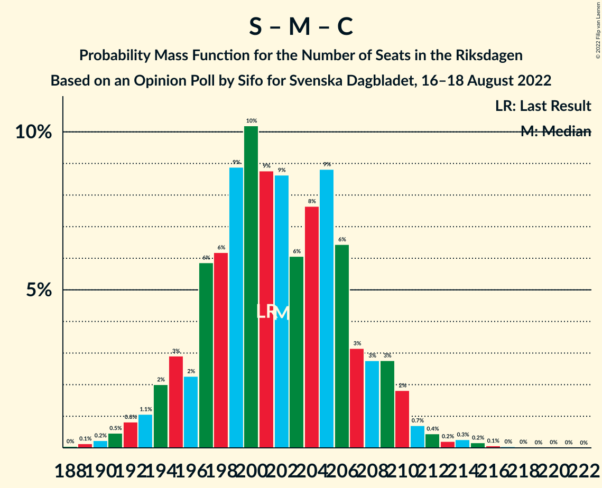

# Opinion Poll by Sifo for Svenska Dagbladet, 16–18 August 2022

<a href="#voting-intentions">Voting Intentions</a> | <a href="#seats">Seats</a> | <a href="#coalitions">Coalitions</a> | <a href="#technical-information">Technical Information</a>

## Voting Intentions

### Confidence Intervals

| Party | Last Result | Poll Result | 80% Confidence Interval | 90% Confidence Interval | 95% Confidence Interval | 99% Confidence Interval |
|:-----:|:-----------:|:-----------:|:-----------------------:|:-----------------------:|:-----------------------:|:-----------------------:|
| Sveriges socialdemokratiska arbetareparti | 28.3% | 32.7% | 31.3–34.2% |30.9–34.6% |30.5–35.0% |29.8–35.7% |
| Moderata samlingspartiet | 19.8% | 17.6% | 16.5–18.9% |16.1–19.2% |15.9–19.5% |15.3–20.1% |
| Sverigedemokraterna | 17.5% | 16.1% | 15.0–17.3% |14.7–17.7% |14.4–18.0% |13.9–18.5% |
| Vänsterpartiet | 8.0% | 8.0% | 7.2–8.9% |7.0–9.1% |6.8–9.4% |6.4–9.8% |
| Centerpartiet | 8.6% | 6.1% | 5.4–7.0% |5.2–7.2% |5.1–7.4% |4.8–7.8% |
| Kristdemokraterna | 6.3% | 6.0% | 5.3–6.8% |5.1–7.1% |5.0–7.3% |4.6–7.7% |
| Liberalerna | 5.5% | 5.6% | 4.9–6.4% |4.7–6.6% |4.6–6.8% |4.3–7.2% |
| Miljöpartiet de gröna | 4.4% | 5.3% | 4.6–6.1% |4.5–6.3% |4.3–6.5% |4.0–6.9% |

*Note:* The poll result column reflects the actual value used in the calculations. Published results may vary slightly, and in addition be rounded to fewer digits.

## Seats

### Confidence Intervals

| Party | Last Result | Median | 80% Confidence Interval | 90% Confidence Interval | 95% Confidence Interval | 99% Confidence Interval |
|:-----:|:-----------:|:------:|:-----------------------:|:-----------------------:|:-----------------------:|:-----------------------:|
| <a href="#sveriges-socialdemokratiska-arbetareparti">Sveriges socialdemokratiska arbetareparti</a> | 100 | 117 | 111–122 |110–124 |109–125 |107–127 |
| <a href="#moderata-samlingspartiet">Moderata samlingspartiet</a> | 70 | 63 | 59–68 |58–68 |56–69 |55–72 |
| <a href="#sverigedemokraterna">Sverigedemokraterna</a> | 62 | 58 | 54–62 |52–63 |52–64 |49–66 |
| <a href="#vänsterpartiet">Vänsterpartiet</a> | 28 | 28 | 26–32 |25–33 |24–34 |23–35 |
| <a href="#centerpartiet">Centerpartiet</a> | 31 | 22 | 19–25 |19–26 |18–26 |17–28 |
| <a href="#kristdemokraterna">Kristdemokraterna</a> | 22 | 22 | 19–24 |18–25 |18–26 |17–27 |
| <a href="#liberalerna">Liberalerna</a> | 20 | 20 | 18–23 |17–24 |16–24 |15–26 |
| <a href="#miljöpartiet-de-gröna">Miljöpartiet de gröna</a> | 16 | 19 | 17–22 |16–22 |15–23 |14–24 |

### Sveriges socialdemokratiska arbetareparti

*For a full overview of the results for this party, see the [Sveriges socialdemokratiska arbetareparti](party-sverigessocialdemokratiskaarbetareparti.html) page.*

| Number of Seats | Probability | Accumulated | Special Marks |
|:---------------:|:-----------:|:-----------:|:-------------:|
| 100 | 0% | 100% | Last Result |
| 101 | 0% | 100% |  |
| 102 | 0% | 100% |  |
| 103 | 0% | 100% |  |
| 104 | 0.1% | 100% |  |
| 105 | 0.1% | 99.9% |  |
| 106 | 0.2% | 99.8% |  |
| 107 | 0.6% | 99.5% |  |
| 108 | 0.9% | 98.9% |  |
| 109 | 1.0% | 98% |  |
| 110 | 3% | 97% |  |
| 111 | 4% | 94% |  |
| 112 | 4% | 90% |  |
| 113 | 8% | 86% |  |
| 114 | 7% | 78% |  |
| 115 | 7% | 71% |  |
| 116 | 13% | 63% |  |
| 117 | 11% | 50% | Median |
| 118 | 7% | 40% |  |
| 119 | 8% | 33% |  |
| 120 | 8% | 25% |  |
| 121 | 5% | 17% |  |
| 122 | 3% | 13% |  |
| 123 | 4% | 10% |  |
| 124 | 2% | 6% |  |
| 125 | 1.0% | 3% |  |
| 126 | 1.0% | 2% |  |
| 127 | 0.8% | 1.3% |  |
| 128 | 0.1% | 0.4% |  |
| 129 | 0.1% | 0.3% |  |
| 130 | 0.1% | 0.2% |  |
| 131 | 0% | 0.1% |  |
| 132 | 0% | 0% |  |

### Moderata samlingspartiet

*For a full overview of the results for this party, see the [Moderata samlingspartiet](party-moderatasamlingspartiet.html) page.*

| Number of Seats | Probability | Accumulated | Special Marks |
|:---------------:|:-----------:|:-----------:|:-------------:|
| 53 | 0.1% | 100% |  |
| 54 | 0.2% | 99.8% |  |
| 55 | 0.7% | 99.6% |  |
| 56 | 2% | 98.9% |  |
| 57 | 2% | 97% |  |
| 58 | 4% | 95% |  |
| 59 | 7% | 91% |  |
| 60 | 7% | 84% |  |
| 61 | 13% | 77% |  |
| 62 | 11% | 64% |  |
| 63 | 11% | 53% | Median |
| 64 | 9% | 42% |  |
| 65 | 12% | 33% |  |
| 66 | 6% | 21% |  |
| 67 | 4% | 14% |  |
| 68 | 5% | 10% |  |
| 69 | 2% | 5% |  |
| 70 | 0.8% | 2% | Last Result |
| 71 | 0.9% | 2% |  |
| 72 | 0.4% | 0.6% |  |
| 73 | 0.1% | 0.3% |  |
| 74 | 0.1% | 0.1% |  |
| 75 | 0% | 0.1% |  |
| 76 | 0% | 0% |  |

### Sverigedemokraterna

*For a full overview of the results for this party, see the [Sverigedemokraterna](party-sverigedemokraterna.html) page.*

| Number of Seats | Probability | Accumulated | Special Marks |
|:---------------:|:-----------:|:-----------:|:-------------:|
| 48 | 0.1% | 100% |  |
| 49 | 0.4% | 99.8% |  |
| 50 | 0.4% | 99.4% |  |
| 51 | 1.3% | 99.0% |  |
| 52 | 3% | 98% |  |
| 53 | 4% | 95% |  |
| 54 | 9% | 91% |  |
| 55 | 9% | 81% |  |
| 56 | 8% | 72% |  |
| 57 | 10% | 64% |  |
| 58 | 9% | 54% | Median |
| 59 | 18% | 45% |  |
| 60 | 9% | 26% |  |
| 61 | 6% | 17% |  |
| 62 | 4% | 11% | Last Result |
| 63 | 4% | 7% |  |
| 64 | 2% | 4% |  |
| 65 | 1.3% | 2% |  |
| 66 | 0.5% | 0.8% |  |
| 67 | 0.1% | 0.3% |  |
| 68 | 0.1% | 0.2% |  |
| 69 | 0.1% | 0.1% |  |
| 70 | 0% | 0% |  |

### Vänsterpartiet

*For a full overview of the results for this party, see the [Vänsterpartiet](party-vänsterpartiet.html) page.*

| Number of Seats | Probability | Accumulated | Special Marks |
|:---------------:|:-----------:|:-----------:|:-------------:|
| 22 | 0.2% | 100% |  |
| 23 | 0.8% | 99.7% |  |
| 24 | 3% | 98.9% |  |
| 25 | 6% | 96% |  |
| 26 | 9% | 90% |  |
| 27 | 13% | 82% |  |
| 28 | 21% | 69% | Last Result, Median |
| 29 | 13% | 48% |  |
| 30 | 14% | 35% |  |
| 31 | 8% | 21% |  |
| 32 | 6% | 13% |  |
| 33 | 4% | 6% |  |
| 34 | 2% | 3% |  |
| 35 | 0.7% | 1.0% |  |
| 36 | 0.2% | 0.3% |  |
| 37 | 0.1% | 0.1% |  |
| 38 | 0% | 0% |  |

### Centerpartiet

*For a full overview of the results for this party, see the [Centerpartiet](party-centerpartiet.html) page.*

| Number of Seats | Probability | Accumulated | Special Marks |
|:---------------:|:-----------:|:-----------:|:-------------:|
| 16 | 0.2% | 100% |  |
| 17 | 0.7% | 99.7% |  |
| 18 | 4% | 99.0% |  |
| 19 | 5% | 95% |  |
| 20 | 14% | 90% |  |
| 21 | 17% | 76% |  |
| 22 | 14% | 59% | Median |
| 23 | 21% | 45% |  |
| 24 | 10% | 23% |  |
| 25 | 8% | 13% |  |
| 26 | 3% | 5% |  |
| 27 | 1.4% | 2% |  |
| 28 | 0.5% | 0.7% |  |
| 29 | 0.2% | 0.2% |  |
| 30 | 0% | 0.1% |  |
| 31 | 0% | 0% | Last Result |

### Kristdemokraterna

*For a full overview of the results for this party, see the [Kristdemokraterna](party-kristdemokraterna.html) page.*

| Number of Seats | Probability | Accumulated | Special Marks |
|:---------------:|:-----------:|:-----------:|:-------------:|
| 16 | 0.4% | 100% |  |
| 17 | 2% | 99.6% |  |
| 18 | 6% | 98% |  |
| 19 | 8% | 92% |  |
| 20 | 12% | 83% |  |
| 21 | 12% | 72% |  |
| 22 | 16% | 60% | Last Result, Median |
| 23 | 20% | 44% |  |
| 24 | 15% | 23% |  |
| 25 | 5% | 8% |  |
| 26 | 2% | 3% |  |
| 27 | 0.8% | 1.2% |  |
| 28 | 0.3% | 0.4% |  |
| 29 | 0.1% | 0.2% |  |
| 30 | 0% | 0% |  |

### Liberalerna

*For a full overview of the results for this party, see the [Liberalerna](party-liberalerna.html) page.*

| Number of Seats | Probability | Accumulated | Special Marks |
|:---------------:|:-----------:|:-----------:|:-------------:|
| 0 | 0.1% | 100% |  |
| 1 | 0% | 99.9% |  |
| 2 | 0% | 99.9% |  |
| 3 | 0% | 99.9% |  |
| 4 | 0% | 99.9% |  |
| 5 | 0% | 99.9% |  |
| 6 | 0% | 99.9% |  |
| 7 | 0% | 99.9% |  |
| 8 | 0% | 99.9% |  |
| 9 | 0% | 99.9% |  |
| 10 | 0% | 99.9% |  |
| 11 | 0% | 99.9% |  |
| 12 | 0% | 99.9% |  |
| 13 | 0% | 99.9% |  |
| 14 | 0% | 99.9% |  |
| 15 | 0.5% | 99.9% |  |
| 16 | 2% | 99.4% |  |
| 17 | 6% | 97% |  |
| 18 | 12% | 91% |  |
| 19 | 16% | 79% |  |
| 20 | 21% | 62% | Last Result, Median |
| 21 | 17% | 41% |  |
| 22 | 12% | 25% |  |
| 23 | 7% | 13% |  |
| 24 | 4% | 6% |  |
| 25 | 1.3% | 2% |  |
| 26 | 0.4% | 0.6% |  |
| 27 | 0.1% | 0.2% |  |
| 28 | 0% | 0% |  |

### Miljöpartiet de gröna

*For a full overview of the results for this party, see the [Miljöpartiet de gröna](party-miljöpartietdegröna.html) page.*

| Number of Seats | Probability | Accumulated | Special Marks |
|:---------------:|:-----------:|:-----------:|:-------------:|
| 0 | 0.3% | 100% |  |
| 1 | 0% | 99.7% |  |
| 2 | 0% | 99.7% |  |
| 3 | 0% | 99.7% |  |
| 4 | 0% | 99.7% |  |
| 5 | 0% | 99.7% |  |
| 6 | 0% | 99.7% |  |
| 7 | 0% | 99.7% |  |
| 8 | 0% | 99.7% |  |
| 9 | 0% | 99.7% |  |
| 10 | 0% | 99.7% |  |
| 11 | 0% | 99.7% |  |
| 12 | 0% | 99.7% |  |
| 13 | 0% | 99.7% |  |
| 14 | 0.3% | 99.7% |  |
| 15 | 2% | 99.4% |  |
| 16 | 6% | 97% | Last Result |
| 17 | 11% | 91% |  |
| 18 | 19% | 80% |  |
| 19 | 24% | 61% | Median |
| 20 | 14% | 37% |  |
| 21 | 12% | 23% |  |
| 22 | 6% | 10% |  |
| 23 | 3% | 4% |  |
| 24 | 1.0% | 1.4% |  |
| 25 | 0.4% | 0.5% |  |
| 26 | 0.1% | 0.1% |  |
| 27 | 0% | 0% |  |

## Coalitions

### Confidence Intervals

| Coalition | Last Result | Median | Majority? | 80% Confidence Interval | 90% Confidence Interval | 95% Confidence Interval | 99% Confidence Interval |
|:---------:|:-----------:|:------:|:---------:|:-----------------------:|:-----------------------:|:-----------------------:|:-----------------------:|
| Sveriges socialdemokratiska arbetareparti – Vänsterpartiet – Centerpartiet – Liberalerna – Miljöpartiet de gröna | 195 | 206 | 100% | 201–212 | 199–214 | 198–215 | 195–217 |
| Sveriges socialdemokratiska arbetareparti – Moderata samlingspartiet – Centerpartiet | 201 | 202 | 100% | 196–207 | 195–209 | 193–210 | 191–214 |
| Sveriges socialdemokratiska arbetareparti – Moderata samlingspartiet | 170 | 179 | 89% | 174–185 | 172–187 | 171–189 | 169–191 |
| Sveriges socialdemokratiska arbetareparti – Centerpartiet – Liberalerna – Miljöpartiet de gröna | 167 | 178 | 79% | 173–184 | 171–186 | 169–187 | 167–189 |
| Sveriges socialdemokratiska arbetareparti – Vänsterpartiet – Miljöpartiet de gröna | 144 | 164 | 1.1% | 159–170 | 157–172 | 156–173 | 153–176 |
| Sveriges socialdemokratiska arbetareparti – Vänsterpartiet | 128 | 145 | 0% | 140–151 | 139–152 | 137–154 | 134–157 |
| Moderata samlingspartiet – Sverigedemokraterna – Kristdemokraterna | 154 | 143 | 0% | 137–148 | 135–150 | 134–151 | 132–154 |
| Sveriges socialdemokratiska arbetareparti – Miljöpartiet de gröna | 116 | 135 | 0% | 131–141 | 129–143 | 127–144 | 124–147 |
| Moderata samlingspartiet – Centerpartiet – Kristdemokraterna – Liberalerna | 143 | 127 | 0% | 121–132 | 120–134 | 118–135 | 116–138 |
| Moderata samlingspartiet – Sverigedemokraterna | 132 | 120 | 0% | 115–126 | 114–128 | 113–128 | 110–132 |
| Moderata samlingspartiet – Centerpartiet – Kristdemokraterna | 123 | 107 | 0% | 102–112 | 100–113 | 99–114 | 96–117 |
| Moderata samlingspartiet – Centerpartiet – Liberalerna | 121 | 105 | 0% | 100–110 | 99–112 | 97–113 | 95–116 |
| Moderata samlingspartiet – Centerpartiet | 101 | 85 | 0% | 80–90 | 79–91 | 78–92 | 75–95 |

### Sveriges socialdemokratiska arbetareparti – Vänsterpartiet – Centerpartiet – Liberalerna – Miljöpartiet de gröna

| Number of Seats | Probability | Accumulated | Special Marks |
|:---------------:|:-----------:|:-----------:|:-------------:|
| 192 | 0% | 100% |  |
| 193 | 0.1% | 99.9% |  |
| 194 | 0.2% | 99.8% |  |
| 195 | 0.3% | 99.7% | Last Result |
| 196 | 0.3% | 99.4% |  |
| 197 | 0.7% | 99.1% |  |
| 198 | 2% | 98% |  |
| 199 | 2% | 96% |  |
| 200 | 2% | 95% |  |
| 201 | 6% | 93% |  |
| 202 | 3% | 86% |  |
| 203 | 6% | 83% |  |
| 204 | 6% | 78% |  |
| 205 | 8% | 71% |  |
| 206 | 15% | 63% | Median |
| 207 | 9% | 49% |  |
| 208 | 6% | 39% |  |
| 209 | 8% | 33% |  |
| 210 | 6% | 25% |  |
| 211 | 7% | 19% |  |
| 212 | 4% | 12% |  |
| 213 | 3% | 8% |  |
| 214 | 2% | 5% |  |
| 215 | 1.3% | 3% |  |
| 216 | 0.9% | 2% |  |
| 217 | 0.6% | 1.0% |  |
| 218 | 0.2% | 0.4% |  |
| 219 | 0.1% | 0.2% |  |
| 220 | 0.1% | 0.1% |  |
| 221 | 0% | 0% |  |

### Sveriges socialdemokratiska arbetareparti – Moderata samlingspartiet – Centerpartiet

| Number of Seats | Probability | Accumulated | Special Marks |
|:---------------:|:-----------:|:-----------:|:-------------:|
| 188 | 0% | 100% |  |
| 189 | 0.1% | 99.9% |  |
| 190 | 0.2% | 99.8% |  |
| 191 | 0.5% | 99.5% |  |
| 192 | 0.8% | 99.1% |  |
| 193 | 1.1% | 98% |  |
| 194 | 2% | 97% |  |
| 195 | 3% | 95% |  |
| 196 | 2% | 92% |  |
| 197 | 6% | 90% |  |
| 198 | 6% | 84% |  |
| 199 | 9% | 78% |  |
| 200 | 10% | 69% |  |
| 201 | 9% | 59% | Last Result |
| 202 | 9% | 50% | Median |
| 203 | 6% | 41% |  |
| 204 | 8% | 35% |  |
| 205 | 9% | 28% |  |
| 206 | 6% | 19% |  |
| 207 | 3% | 12% |  |
| 208 | 3% | 9% |  |
| 209 | 3% | 7% |  |
| 210 | 2% | 4% |  |
| 211 | 0.7% | 2% |  |
| 212 | 0.4% | 1.3% |  |
| 213 | 0.2% | 0.8% |  |
| 214 | 0.3% | 0.6% |  |
| 215 | 0.2% | 0.4% |  |
| 216 | 0.1% | 0.2% |  |
| 217 | 0% | 0.1% |  |
| 218 | 0% | 0.1% |  |
| 219 | 0% | 0.1% |  |
| 220 | 0% | 0.1% |  |
| 221 | 0% | 0% |  |

### Sveriges socialdemokratiska arbetareparti – Moderata samlingspartiet

| Number of Seats | Probability | Accumulated | Special Marks |
|:---------------:|:-----------:|:-----------:|:-------------:|
| 166 | 0.1% | 100% |  |
| 167 | 0.1% | 99.9% |  |
| 168 | 0.2% | 99.8% |  |
| 169 | 0.4% | 99.6% |  |
| 170 | 0.6% | 99.2% | Last Result |
| 171 | 2% | 98.5% |  |
| 172 | 2% | 97% |  |
| 173 | 2% | 95% |  |
| 174 | 3% | 92% |  |
| 175 | 5% | 89% | Majority |
| 176 | 8% | 84% |  |
| 177 | 12% | 77% |  |
| 178 | 6% | 65% |  |
| 179 | 10% | 59% |  |
| 180 | 7% | 49% | Median |
| 181 | 10% | 42% |  |
| 182 | 7% | 32% |  |
| 183 | 5% | 25% |  |
| 184 | 6% | 20% |  |
| 185 | 4% | 14% |  |
| 186 | 3% | 10% |  |
| 187 | 1.4% | 6% |  |
| 188 | 2% | 5% |  |
| 189 | 2% | 3% |  |
| 190 | 0.7% | 2% |  |
| 191 | 0.3% | 0.8% |  |
| 192 | 0.2% | 0.5% |  |
| 193 | 0.2% | 0.3% |  |
| 194 | 0.1% | 0.2% |  |
| 195 | 0% | 0.1% |  |
| 196 | 0% | 0.1% |  |
| 197 | 0% | 0% |  |

### Sveriges socialdemokratiska arbetareparti – Centerpartiet – Liberalerna – Miljöpartiet de gröna

| Number of Seats | Probability | Accumulated | Special Marks |
|:---------------:|:-----------:|:-----------:|:-------------:|
| 162 | 0% | 100% |  |
| 163 | 0% | 99.9% |  |
| 164 | 0% | 99.9% |  |
| 165 | 0.1% | 99.8% |  |
| 166 | 0.2% | 99.7% |  |
| 167 | 0.3% | 99.5% | Last Result |
| 168 | 0.9% | 99.2% |  |
| 169 | 1.2% | 98% |  |
| 170 | 2% | 97% |  |
| 171 | 2% | 95% |  |
| 172 | 3% | 93% |  |
| 173 | 6% | 90% |  |
| 174 | 5% | 84% |  |
| 175 | 6% | 79% | Majority |
| 176 | 7% | 73% |  |
| 177 | 12% | 66% |  |
| 178 | 11% | 54% | Median |
| 179 | 7% | 43% |  |
| 180 | 9% | 36% |  |
| 181 | 5% | 26% |  |
| 182 | 7% | 22% |  |
| 183 | 4% | 15% |  |
| 184 | 3% | 10% |  |
| 185 | 2% | 7% |  |
| 186 | 2% | 5% |  |
| 187 | 2% | 3% |  |
| 188 | 0.6% | 2% |  |
| 189 | 0.6% | 0.9% |  |
| 190 | 0.2% | 0.4% |  |
| 191 | 0.1% | 0.2% |  |
| 192 | 0% | 0.1% |  |
| 193 | 0% | 0% |  |

### Sveriges socialdemokratiska arbetareparti – Vänsterpartiet – Miljöpartiet de gröna

| Number of Seats | Probability | Accumulated | Special Marks |
|:---------------:|:-----------:|:-----------:|:-------------:|
| 144 | 0% | 100% | Last Result |
| 145 | 0% | 100% |  |
| 146 | 0% | 100% |  |
| 147 | 0% | 100% |  |
| 148 | 0% | 100% |  |
| 149 | 0% | 99.9% |  |
| 150 | 0.1% | 99.9% |  |
| 151 | 0.2% | 99.8% |  |
| 152 | 0.1% | 99.7% |  |
| 153 | 0.4% | 99.6% |  |
| 154 | 0.6% | 99.2% |  |
| 155 | 0.7% | 98.6% |  |
| 156 | 1.0% | 98% |  |
| 157 | 2% | 97% |  |
| 158 | 3% | 94% |  |
| 159 | 3% | 91% |  |
| 160 | 8% | 88% |  |
| 161 | 6% | 80% |  |
| 162 | 7% | 75% |  |
| 163 | 11% | 68% |  |
| 164 | 9% | 57% | Median |
| 165 | 10% | 48% |  |
| 166 | 6% | 37% |  |
| 167 | 8% | 31% |  |
| 168 | 6% | 24% |  |
| 169 | 5% | 17% |  |
| 170 | 3% | 12% |  |
| 171 | 4% | 9% |  |
| 172 | 2% | 5% |  |
| 173 | 2% | 3% |  |
| 174 | 0.8% | 2% |  |
| 175 | 0.6% | 1.1% | Majority |
| 176 | 0.2% | 0.5% |  |
| 177 | 0.1% | 0.3% |  |
| 178 | 0.1% | 0.2% |  |
| 179 | 0% | 0.1% |  |
| 180 | 0% | 0% |  |

### Sveriges socialdemokratiska arbetareparti – Vänsterpartiet

| Number of Seats | Probability | Accumulated | Special Marks |
|:---------------:|:-----------:|:-----------:|:-------------:|
| 128 | 0% | 100% | Last Result |
| 129 | 0% | 100% |  |
| 130 | 0% | 100% |  |
| 131 | 0% | 100% |  |
| 132 | 0.1% | 99.9% |  |
| 133 | 0.2% | 99.9% |  |
| 134 | 0.2% | 99.7% |  |
| 135 | 0.4% | 99.5% |  |
| 136 | 0.8% | 99.1% |  |
| 137 | 1.1% | 98% |  |
| 138 | 2% | 97% |  |
| 139 | 2% | 95% |  |
| 140 | 6% | 93% |  |
| 141 | 5% | 87% |  |
| 142 | 8% | 82% |  |
| 143 | 7% | 75% |  |
| 144 | 11% | 67% |  |
| 145 | 9% | 56% | Median |
| 146 | 7% | 47% |  |
| 147 | 10% | 40% |  |
| 148 | 6% | 30% |  |
| 149 | 8% | 24% |  |
| 150 | 5% | 17% |  |
| 151 | 4% | 12% |  |
| 152 | 3% | 8% |  |
| 153 | 2% | 5% |  |
| 154 | 1.0% | 3% |  |
| 155 | 0.8% | 2% |  |
| 156 | 0.5% | 1.0% |  |
| 157 | 0.2% | 0.6% |  |
| 158 | 0.1% | 0.3% |  |
| 159 | 0.1% | 0.2% |  |
| 160 | 0% | 0.1% |  |
| 161 | 0% | 0.1% |  |
| 162 | 0% | 0% |  |

### Moderata samlingspartiet – Sverigedemokraterna – Kristdemokraterna

| Number of Seats | Probability | Accumulated | Special Marks |
|:---------------:|:-----------:|:-----------:|:-------------:|
| 128 | 0% | 100% |  |
| 129 | 0.1% | 99.9% |  |
| 130 | 0.1% | 99.9% |  |
| 131 | 0.2% | 99.8% |  |
| 132 | 0.6% | 99.6% |  |
| 133 | 0.9% | 98.9% |  |
| 134 | 1.3% | 98% |  |
| 135 | 2% | 97% |  |
| 136 | 3% | 95% |  |
| 137 | 4% | 92% |  |
| 138 | 7% | 88% |  |
| 139 | 6% | 81% |  |
| 140 | 8% | 75% |  |
| 141 | 6% | 67% |  |
| 142 | 9% | 61% |  |
| 143 | 15% | 51% | Median |
| 144 | 8% | 37% |  |
| 145 | 6% | 29% |  |
| 146 | 6% | 22% |  |
| 147 | 3% | 17% |  |
| 148 | 6% | 14% |  |
| 149 | 2% | 7% |  |
| 150 | 2% | 5% |  |
| 151 | 2% | 3% |  |
| 152 | 0.7% | 2% |  |
| 153 | 0.3% | 0.9% |  |
| 154 | 0.3% | 0.6% | Last Result |
| 155 | 0.2% | 0.3% |  |
| 156 | 0.1% | 0.1% |  |
| 157 | 0% | 0.1% |  |
| 158 | 0% | 0% |  |

### Sveriges socialdemokratiska arbetareparti – Miljöpartiet de gröna

| Number of Seats | Probability | Accumulated | Special Marks |
|:---------------:|:-----------:|:-----------:|:-------------:|
| 116 | 0% | 100% | Last Result |
| 117 | 0% | 100% |  |
| 118 | 0% | 100% |  |
| 119 | 0% | 99.9% |  |
| 120 | 0% | 99.9% |  |
| 121 | 0% | 99.9% |  |
| 122 | 0.1% | 99.9% |  |
| 123 | 0.1% | 99.8% |  |
| 124 | 0.2% | 99.7% |  |
| 125 | 0.4% | 99.5% |  |
| 126 | 0.6% | 99.1% |  |
| 127 | 1.1% | 98.5% |  |
| 128 | 2% | 97% |  |
| 129 | 3% | 96% |  |
| 130 | 2% | 93% |  |
| 131 | 7% | 91% |  |
| 132 | 6% | 84% |  |
| 133 | 6% | 78% |  |
| 134 | 10% | 71% |  |
| 135 | 13% | 61% |  |
| 136 | 6% | 48% | Median |
| 137 | 9% | 42% |  |
| 138 | 8% | 34% |  |
| 139 | 5% | 25% |  |
| 140 | 6% | 20% |  |
| 141 | 4% | 14% |  |
| 142 | 3% | 10% |  |
| 143 | 2% | 6% |  |
| 144 | 2% | 4% |  |
| 145 | 0.9% | 2% |  |
| 146 | 0.6% | 1.4% |  |
| 147 | 0.4% | 0.8% |  |
| 148 | 0.2% | 0.4% |  |
| 149 | 0.1% | 0.2% |  |
| 150 | 0% | 0.1% |  |
| 151 | 0% | 0% |  |

### Moderata samlingspartiet – Centerpartiet – Kristdemokraterna – Liberalerna

| Number of Seats | Probability | Accumulated | Special Marks |
|:---------------:|:-----------:|:-----------:|:-------------:|
| 112 | 0% | 100% |  |
| 113 | 0.1% | 99.9% |  |
| 114 | 0.1% | 99.9% |  |
| 115 | 0.2% | 99.8% |  |
| 116 | 0.3% | 99.6% |  |
| 117 | 0.5% | 99.3% |  |
| 118 | 1.3% | 98.8% |  |
| 119 | 2% | 97% |  |
| 120 | 2% | 96% |  |
| 121 | 4% | 94% |  |
| 122 | 4% | 90% |  |
| 123 | 5% | 85% |  |
| 124 | 8% | 80% |  |
| 125 | 7% | 72% |  |
| 126 | 9% | 65% |  |
| 127 | 12% | 55% | Median |
| 128 | 7% | 43% |  |
| 129 | 7% | 36% |  |
| 130 | 10% | 29% |  |
| 131 | 6% | 19% |  |
| 132 | 5% | 14% |  |
| 133 | 3% | 9% |  |
| 134 | 3% | 6% |  |
| 135 | 1.2% | 3% |  |
| 136 | 1.1% | 2% |  |
| 137 | 0.6% | 1.2% |  |
| 138 | 0.3% | 0.6% |  |
| 139 | 0.1% | 0.3% |  |
| 140 | 0.1% | 0.1% |  |
| 141 | 0% | 0.1% |  |
| 142 | 0% | 0% |  |
| 143 | 0% | 0% | Last Result |

### Moderata samlingspartiet – Sverigedemokraterna

| Number of Seats | Probability | Accumulated | Special Marks |
|:---------------:|:-----------:|:-----------:|:-------------:|
| 107 | 0% | 100% |  |
| 108 | 0% | 99.9% |  |
| 109 | 0.2% | 99.9% |  |
| 110 | 0.6% | 99.7% |  |
| 111 | 0.6% | 99.1% |  |
| 112 | 1.0% | 98.5% |  |
| 113 | 1.2% | 98% |  |
| 114 | 2% | 96% |  |
| 115 | 7% | 94% |  |
| 116 | 4% | 87% |  |
| 117 | 5% | 84% |  |
| 118 | 7% | 78% |  |
| 119 | 11% | 71% |  |
| 120 | 14% | 61% |  |
| 121 | 8% | 47% | Median |
| 122 | 7% | 39% |  |
| 123 | 8% | 32% |  |
| 124 | 8% | 23% |  |
| 125 | 2% | 15% |  |
| 126 | 4% | 13% |  |
| 127 | 3% | 9% |  |
| 128 | 3% | 6% |  |
| 129 | 0.9% | 2% |  |
| 130 | 0.6% | 2% |  |
| 131 | 0.4% | 1.0% |  |
| 132 | 0.3% | 0.5% | Last Result |
| 133 | 0.1% | 0.2% |  |
| 134 | 0% | 0.1% |  |
| 135 | 0% | 0.1% |  |
| 136 | 0% | 0% |  |

### Moderata samlingspartiet – Centerpartiet – Kristdemokraterna

| Number of Seats | Probability | Accumulated | Special Marks |
|:---------------:|:-----------:|:-----------:|:-------------:|
| 94 | 0.1% | 100% |  |
| 95 | 0.1% | 99.9% |  |
| 96 | 0.3% | 99.8% |  |
| 97 | 0.6% | 99.5% |  |
| 98 | 0.7% | 98.8% |  |
| 99 | 2% | 98% |  |
| 100 | 2% | 96% |  |
| 101 | 4% | 94% |  |
| 102 | 6% | 90% |  |
| 103 | 5% | 84% |  |
| 104 | 9% | 80% |  |
| 105 | 7% | 71% |  |
| 106 | 7% | 64% |  |
| 107 | 15% | 56% | Median |
| 108 | 6% | 41% |  |
| 109 | 10% | 35% |  |
| 110 | 8% | 25% |  |
| 111 | 5% | 17% |  |
| 112 | 5% | 13% |  |
| 113 | 2% | 7% |  |
| 114 | 3% | 5% |  |
| 115 | 1.1% | 2% |  |
| 116 | 0.5% | 1.3% |  |
| 117 | 0.4% | 0.8% |  |
| 118 | 0.2% | 0.5% |  |
| 119 | 0.1% | 0.2% |  |
| 120 | 0.1% | 0.1% |  |
| 121 | 0% | 0% |  |
| 122 | 0% | 0% |  |
| 123 | 0% | 0% | Last Result |

### Moderata samlingspartiet – Centerpartiet – Liberalerna

| Number of Seats | Probability | Accumulated | Special Marks |
|:---------------:|:-----------:|:-----------:|:-------------:|
| 91 | 0% | 100% |  |
| 92 | 0% | 99.9% |  |
| 93 | 0.1% | 99.9% |  |
| 94 | 0.1% | 99.8% |  |
| 95 | 0.4% | 99.7% |  |
| 96 | 0.9% | 99.2% |  |
| 97 | 1.0% | 98% |  |
| 98 | 2% | 97% |  |
| 99 | 3% | 96% |  |
| 100 | 5% | 92% |  |
| 101 | 6% | 87% |  |
| 102 | 6% | 81% |  |
| 103 | 6% | 75% |  |
| 104 | 15% | 69% |  |
| 105 | 9% | 54% | Median |
| 106 | 11% | 45% |  |
| 107 | 6% | 34% |  |
| 108 | 9% | 28% |  |
| 109 | 6% | 20% |  |
| 110 | 4% | 14% |  |
| 111 | 4% | 10% |  |
| 112 | 2% | 5% |  |
| 113 | 2% | 4% |  |
| 114 | 0.9% | 2% |  |
| 115 | 0.5% | 1.0% |  |
| 116 | 0.3% | 0.5% |  |
| 117 | 0.1% | 0.3% |  |
| 118 | 0.1% | 0.1% |  |
| 119 | 0% | 0.1% |  |
| 120 | 0% | 0% |  |
| 121 | 0% | 0% | Last Result |

### Moderata samlingspartiet – Centerpartiet

| Number of Seats | Probability | Accumulated | Special Marks |
|:---------------:|:-----------:|:-----------:|:-------------:|
| 73 | 0% | 100% |  |
| 74 | 0.1% | 99.9% |  |
| 75 | 0.3% | 99.8% |  |
| 76 | 0.4% | 99.5% |  |
| 77 | 1.1% | 99.1% |  |
| 78 | 2% | 98% |  |
| 79 | 4% | 96% |  |
| 80 | 4% | 93% |  |
| 81 | 5% | 88% |  |
| 82 | 9% | 83% |  |
| 83 | 8% | 74% |  |
| 84 | 13% | 66% |  |
| 85 | 10% | 54% | Median |
| 86 | 10% | 43% |  |
| 87 | 8% | 33% |  |
| 88 | 7% | 25% |  |
| 89 | 7% | 18% |  |
| 90 | 3% | 11% |  |
| 91 | 3% | 7% |  |
| 92 | 2% | 4% |  |
| 93 | 1.1% | 2% |  |
| 94 | 0.7% | 1.4% |  |
| 95 | 0.4% | 0.7% |  |
| 96 | 0.2% | 0.4% |  |
| 97 | 0.1% | 0.1% |  |
| 98 | 0% | 0.1% |  |
| 99 | 0% | 0% |  |
| 100 | 0% | 0% |  |
| 101 | 0% | 0% | Last Result |

## Technical Information

### Opinion Poll

+ **Polling firm:** Sifo
+ **Commissioner(s):** Svenska Dagbladet
+ **Fieldwork period:** 16–18 August 2022

### Calculations

+ **Sample size:** 1681
+ **Simulations done:** 1,048,576
+ **Error estimate:** 1.25%

