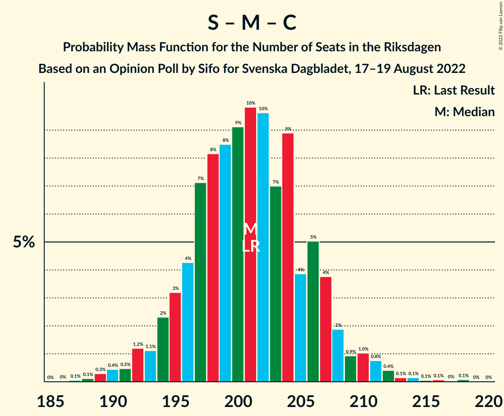

# Opinion Poll by Sifo for Svenska Dagbladet, 17–19 August 2022

<a href="#voting-intentions">Voting Intentions</a> | <a href="#seats">Seats</a> | <a href="#coalitions">Coalitions</a> | <a href="#technical-information">Technical Information</a>

## Voting Intentions

### Confidence Intervals

| Party | Last Result | Poll Result | 80% Confidence Interval | 90% Confidence Interval | 95% Confidence Interval | 99% Confidence Interval |
|:-----:|:-----------:|:-----------:|:-----------------------:|:-----------------------:|:-----------------------:|:-----------------------:|
| Sveriges socialdemokratiska arbetareparti | 28.3% | 32.2% | 30.8–33.7% |30.4–34.1% |30.0–34.5% |29.4–35.2% |
| Moderata samlingspartiet | 19.8% | 17.9% | 16.7–19.1% |16.4–19.5% |16.1–19.8% |15.6–20.4% |
| Sverigedemokraterna | 17.5% | 16.9% | 15.8–18.1% |15.5–18.4% |15.2–18.7% |14.7–19.3% |
| Vänsterpartiet | 8.0% | 7.8% | 7.0–8.7% |6.8–8.9% |6.6–9.1% |6.2–9.6% |
| Centerpartiet | 8.6% | 6.0% | 5.3–6.8% |5.1–7.0% |5.0–7.2% |4.6–7.6% |
| Kristdemokraterna | 6.3% | 6.0% | 5.3–6.8% |5.1–7.0% |5.0–7.2% |4.6–7.6% |
| Liberalerna | 5.5% | 5.5% | 4.9–6.3% |4.7–6.5% |4.5–6.7% |4.2–7.1% |
| Miljöpartiet de gröna | 4.4% | 5.1% | 4.5–5.9% |4.3–6.1% |4.2–6.3% |3.9–6.6% |

*Note:* The poll result column reflects the actual value used in the calculations. Published results may vary slightly, and in addition be rounded to fewer digits.

## Seats

### Confidence Intervals

| Party | Last Result | Median | 80% Confidence Interval | 90% Confidence Interval | 95% Confidence Interval | 99% Confidence Interval |
|:-----:|:-----------:|:------:|:-----------------------:|:-----------------------:|:-----------------------:|:-----------------------:|
| <a href="#sveriges-socialdemokratiska-arbetareparti">Sveriges socialdemokratiska arbetareparti</a> | 100 | 115 | 110–120 |109–122 |108–123 |105–126 |
| <a href="#moderata-samlingspartiet">Moderata samlingspartiet</a> | 70 | 64 | 60–68 |59–69 |58–71 |56–73 |
| <a href="#sverigedemokraterna">Sverigedemokraterna</a> | 62 | 60 | 57–65 |55–66 |54–67 |53–69 |
| <a href="#vänsterpartiet">Vänsterpartiet</a> | 28 | 28 | 25–31 |24–32 |24–33 |22–34 |
| <a href="#centerpartiet">Centerpartiet</a> | 31 | 21 | 19–24 |18–25 |18–26 |17–27 |
| <a href="#kristdemokraterna">Kristdemokraterna</a> | 22 | 21 | 19–24 |18–25 |18–26 |17–27 |
| <a href="#liberalerna">Liberalerna</a> | 20 | 20 | 17–22 |17–23 |16–24 |15–25 |
| <a href="#miljöpartiet-de-gröna">Miljöpartiet de gröna</a> | 16 | 19 | 16–21 |16–21 |15–22 |0–24 |

### Sveriges socialdemokratiska arbetareparti

*For a full overview of the results for this party, see the [Sveriges socialdemokratiska arbetareparti](party-sverigessocialdemokratiskaarbetareparti.html) page.*

| Number of Seats | Probability | Accumulated | Special Marks |
|:---------------:|:-----------:|:-----------:|:-------------:|
| 100 | 0% | 100% | Last Result |
| 101 | 0% | 100% |  |
| 102 | 0% | 100% |  |
| 103 | 0.1% | 99.9% |  |
| 104 | 0.2% | 99.8% |  |
| 105 | 0.3% | 99.7% |  |
| 106 | 0.6% | 99.4% |  |
| 107 | 0.9% | 98.8% |  |
| 108 | 2% | 98% |  |
| 109 | 3% | 96% |  |
| 110 | 4% | 93% |  |
| 111 | 5% | 89% |  |
| 112 | 6% | 84% |  |
| 113 | 12% | 78% |  |
| 114 | 8% | 66% |  |
| 115 | 9% | 58% | Median |
| 116 | 13% | 49% |  |
| 117 | 8% | 36% |  |
| 118 | 8% | 27% |  |
| 119 | 6% | 19% |  |
| 120 | 4% | 13% |  |
| 121 | 4% | 9% |  |
| 122 | 2% | 5% |  |
| 123 | 1.4% | 3% |  |
| 124 | 0.8% | 2% |  |
| 125 | 0.5% | 1.3% |  |
| 126 | 0.4% | 0.8% |  |
| 127 | 0.1% | 0.3% |  |
| 128 | 0.1% | 0.2% |  |
| 129 | 0.1% | 0.1% |  |
| 130 | 0% | 0% |  |

### Moderata samlingspartiet

*For a full overview of the results for this party, see the [Moderata samlingspartiet](party-moderatasamlingspartiet.html) page.*

| Number of Seats | Probability | Accumulated | Special Marks |
|:---------------:|:-----------:|:-----------:|:-------------:|
| 54 | 0.1% | 100% |  |
| 55 | 0.2% | 99.8% |  |
| 56 | 0.4% | 99.6% |  |
| 57 | 1.4% | 99.2% |  |
| 58 | 2% | 98% |  |
| 59 | 3% | 96% |  |
| 60 | 7% | 93% |  |
| 61 | 7% | 87% |  |
| 62 | 12% | 79% |  |
| 63 | 11% | 68% |  |
| 64 | 10% | 56% | Median |
| 65 | 15% | 46% |  |
| 66 | 8% | 31% |  |
| 67 | 11% | 23% |  |
| 68 | 4% | 12% |  |
| 69 | 4% | 8% |  |
| 70 | 2% | 4% | Last Result |
| 71 | 1.2% | 3% |  |
| 72 | 0.7% | 1.4% |  |
| 73 | 0.4% | 0.7% |  |
| 74 | 0.1% | 0.3% |  |
| 75 | 0.1% | 0.1% |  |
| 76 | 0% | 0.1% |  |
| 77 | 0% | 0% |  |

### Sverigedemokraterna

*For a full overview of the results for this party, see the [Sverigedemokraterna](party-sverigedemokraterna.html) page.*

| Number of Seats | Probability | Accumulated | Special Marks |
|:---------------:|:-----------:|:-----------:|:-------------:|
| 50 | 0% | 100% |  |
| 51 | 0.1% | 99.9% |  |
| 52 | 0.2% | 99.8% |  |
| 53 | 0.7% | 99.6% |  |
| 54 | 1.4% | 98.8% |  |
| 55 | 3% | 97% |  |
| 56 | 4% | 95% |  |
| 57 | 7% | 91% |  |
| 58 | 7% | 84% |  |
| 59 | 16% | 77% |  |
| 60 | 12% | 61% | Median |
| 61 | 14% | 50% |  |
| 62 | 10% | 36% | Last Result |
| 63 | 9% | 25% |  |
| 64 | 6% | 16% |  |
| 65 | 5% | 11% |  |
| 66 | 3% | 6% |  |
| 67 | 2% | 3% |  |
| 68 | 0.8% | 2% |  |
| 69 | 0.4% | 0.8% |  |
| 70 | 0.2% | 0.3% |  |
| 71 | 0.1% | 0.1% |  |
| 72 | 0% | 0.1% |  |
| 73 | 0% | 0% |  |

### Vänsterpartiet

*For a full overview of the results for this party, see the [Vänsterpartiet](party-vänsterpartiet.html) page.*

| Number of Seats | Probability | Accumulated | Special Marks |
|:---------------:|:-----------:|:-----------:|:-------------:|
| 21 | 0.1% | 100% |  |
| 22 | 0.5% | 99.9% |  |
| 23 | 1.3% | 99.4% |  |
| 24 | 4% | 98% |  |
| 25 | 9% | 94% |  |
| 26 | 11% | 85% |  |
| 27 | 16% | 74% |  |
| 28 | 18% | 58% | Last Result, Median |
| 29 | 15% | 40% |  |
| 30 | 10% | 25% |  |
| 31 | 8% | 14% |  |
| 32 | 4% | 6% |  |
| 33 | 2% | 3% |  |
| 34 | 0.8% | 1.1% |  |
| 35 | 0.2% | 0.3% |  |
| 36 | 0.1% | 0.1% |  |
| 37 | 0% | 0% |  |

### Centerpartiet

*For a full overview of the results for this party, see the [Centerpartiet](party-centerpartiet.html) page.*

| Number of Seats | Probability | Accumulated | Special Marks |
|:---------------:|:-----------:|:-----------:|:-------------:|
| 15 | 0.1% | 100% |  |
| 16 | 0.4% | 99.9% |  |
| 17 | 2% | 99.6% |  |
| 18 | 6% | 98% |  |
| 19 | 9% | 92% |  |
| 20 | 13% | 82% |  |
| 21 | 20% | 69% | Median |
| 22 | 14% | 49% |  |
| 23 | 15% | 35% |  |
| 24 | 10% | 20% |  |
| 25 | 6% | 10% |  |
| 26 | 2% | 3% |  |
| 27 | 0.8% | 1.1% |  |
| 28 | 0.3% | 0.3% |  |
| 29 | 0% | 0.1% |  |
| 30 | 0% | 0% |  |
| 31 | 0% | 0% | Last Result |

### Kristdemokraterna

*For a full overview of the results for this party, see the [Kristdemokraterna](party-kristdemokraterna.html) page.*

| Number of Seats | Probability | Accumulated | Special Marks |
|:---------------:|:-----------:|:-----------:|:-------------:|
| 15 | 0.1% | 100% |  |
| 16 | 0.3% | 99.9% |  |
| 17 | 2% | 99.6% |  |
| 18 | 4% | 98% |  |
| 19 | 9% | 94% |  |
| 20 | 20% | 85% |  |
| 21 | 19% | 65% | Median |
| 22 | 14% | 45% | Last Result |
| 23 | 15% | 31% |  |
| 24 | 7% | 16% |  |
| 25 | 5% | 9% |  |
| 26 | 2% | 3% |  |
| 27 | 0.9% | 1.2% |  |
| 28 | 0.2% | 0.3% |  |
| 29 | 0.1% | 0.1% |  |
| 30 | 0% | 0% |  |

### Liberalerna

*For a full overview of the results for this party, see the [Liberalerna](party-liberalerna.html) page.*

| Number of Seats | Probability | Accumulated | Special Marks |
|:---------------:|:-----------:|:-----------:|:-------------:|
| 0 | 0.1% | 100% |  |
| 1 | 0% | 99.9% |  |
| 2 | 0% | 99.9% |  |
| 3 | 0% | 99.9% |  |
| 4 | 0% | 99.9% |  |
| 5 | 0% | 99.9% |  |
| 6 | 0% | 99.9% |  |
| 7 | 0% | 99.9% |  |
| 8 | 0% | 99.9% |  |
| 9 | 0% | 99.9% |  |
| 10 | 0% | 99.9% |  |
| 11 | 0% | 99.9% |  |
| 12 | 0% | 99.9% |  |
| 13 | 0% | 99.9% |  |
| 14 | 0% | 99.9% |  |
| 15 | 0.9% | 99.9% |  |
| 16 | 2% | 99.0% |  |
| 17 | 9% | 97% |  |
| 18 | 13% | 88% |  |
| 19 | 22% | 75% |  |
| 20 | 21% | 54% | Last Result, Median |
| 21 | 14% | 32% |  |
| 22 | 10% | 18% |  |
| 23 | 4% | 8% |  |
| 24 | 3% | 4% |  |
| 25 | 0.8% | 1.1% |  |
| 26 | 0.3% | 0.4% |  |
| 27 | 0.1% | 0.1% |  |
| 28 | 0% | 0% |  |

### Miljöpartiet de gröna

*For a full overview of the results for this party, see the [Miljöpartiet de gröna](party-miljöpartietdegröna.html) page.*

| Number of Seats | Probability | Accumulated | Special Marks |
|:---------------:|:-----------:|:-----------:|:-------------:|
| 0 | 0.9% | 100% |  |
| 1 | 0% | 99.1% |  |
| 2 | 0% | 99.1% |  |
| 3 | 0% | 99.1% |  |
| 4 | 0% | 99.1% |  |
| 5 | 0% | 99.1% |  |
| 6 | 0% | 99.1% |  |
| 7 | 0% | 99.1% |  |
| 8 | 0% | 99.1% |  |
| 9 | 0% | 99.1% |  |
| 10 | 0% | 99.1% |  |
| 11 | 0% | 99.1% |  |
| 12 | 0% | 99.1% |  |
| 13 | 0% | 99.1% |  |
| 14 | 0.4% | 99.1% |  |
| 15 | 3% | 98.7% |  |
| 16 | 10% | 95% | Last Result |
| 17 | 16% | 85% |  |
| 18 | 18% | 69% |  |
| 19 | 27% | 51% | Median |
| 20 | 11% | 24% |  |
| 21 | 9% | 14% |  |
| 22 | 2% | 4% |  |
| 23 | 1.5% | 2% |  |
| 24 | 0.4% | 0.5% |  |
| 25 | 0.1% | 0.1% |  |
| 26 | 0% | 0% |  |

## Coalitions

### Confidence Intervals

| Coalition | Last Result | Median | Majority? | 80% Confidence Interval | 90% Confidence Interval | 95% Confidence Interval | 99% Confidence Interval |
|:---------:|:-----------:|:------:|:---------:|:-----------------------:|:-----------------------:|:-----------------------:|:-----------------------:|
| Sveriges socialdemokratiska arbetareparti – Vänsterpartiet – Centerpartiet – Liberalerna – Miljöpartiet de gröna | 195 | 203 | 100% | 198–208 | 196–210 | 194–211 | 191–214 |
| Sveriges socialdemokratiska arbetareparti – Moderata samlingspartiet – Centerpartiet | 201 | 201 | 100% | 196–206 | 194–208 | 192–210 | 189–213 |
| Sveriges socialdemokratiska arbetareparti – Moderata samlingspartiet | 170 | 180 | 88% | 174–185 | 172–186 | 171–188 | 168–191 |
| Sveriges socialdemokratiska arbetareparti – Centerpartiet – Liberalerna – Miljöpartiet de gröna | 167 | 175 | 54% | 170–181 | 168–182 | 166–183 | 163–186 |
| Sveriges socialdemokratiska arbetareparti – Vänsterpartiet – Miljöpartiet de gröna | 144 | 162 | 0.1% | 156–167 | 154–168 | 153–170 | 149–173 |
| Moderata samlingspartiet – Sverigedemokraterna – Kristdemokraterna | 154 | 146 | 0% | 141–151 | 139–153 | 138–155 | 135–158 |
| Sveriges socialdemokratiska arbetareparti – Vänsterpartiet | 128 | 144 | 0% | 138–148 | 137–150 | 135–152 | 132–155 |
| Sveriges socialdemokratiska arbetareparti – Miljöpartiet de gröna | 116 | 134 | 0% | 128–139 | 127–140 | 125–142 | 121–144 |
| Moderata samlingspartiet – Centerpartiet – Kristdemokraterna – Liberalerna | 143 | 127 | 0% | 122–132 | 120–134 | 119–135 | 117–138 |
| Moderata samlingspartiet – Sverigedemokraterna | 132 | 124 | 0% | 119–130 | 118–132 | 117–133 | 114–136 |
| Moderata samlingspartiet – Centerpartiet – Kristdemokraterna | 123 | 107 | 0% | 102–112 | 101–114 | 100–115 | 97–118 |
| Moderata samlingspartiet – Centerpartiet – Liberalerna | 121 | 106 | 0% | 100–111 | 99–112 | 98–113 | 95–116 |
| Moderata samlingspartiet – Centerpartiet | 101 | 86 | 0% | 81–91 | 80–92 | 79–93 | 76–95 |

### Sveriges socialdemokratiska arbetareparti – Vänsterpartiet – Centerpartiet – Liberalerna – Miljöpartiet de gröna

| Number of Seats | Probability | Accumulated | Special Marks |
|:---------------:|:-----------:|:-----------:|:-------------:|
| 186 | 0% | 100% |  |
| 187 | 0% | 99.9% |  |
| 188 | 0% | 99.9% |  |
| 189 | 0.1% | 99.9% |  |
| 190 | 0.1% | 99.7% |  |
| 191 | 0.2% | 99.6% |  |
| 192 | 0.4% | 99.4% |  |
| 193 | 0.9% | 99.0% |  |
| 194 | 0.9% | 98% |  |
| 195 | 1.3% | 97% | Last Result |
| 196 | 3% | 96% |  |
| 197 | 2% | 93% |  |
| 198 | 4% | 91% |  |
| 199 | 10% | 86% |  |
| 200 | 4% | 77% |  |
| 201 | 9% | 73% |  |
| 202 | 9% | 65% |  |
| 203 | 10% | 56% | Median |
| 204 | 10% | 46% |  |
| 205 | 10% | 36% |  |
| 206 | 7% | 26% |  |
| 207 | 7% | 20% |  |
| 208 | 3% | 13% |  |
| 209 | 4% | 10% |  |
| 210 | 2% | 6% |  |
| 211 | 1.5% | 4% |  |
| 212 | 1.0% | 2% |  |
| 213 | 0.4% | 1.1% |  |
| 214 | 0.4% | 0.7% |  |
| 215 | 0.1% | 0.2% |  |
| 216 | 0.1% | 0.1% |  |
| 217 | 0% | 0.1% |  |
| 218 | 0% | 0% |  |

### Sveriges socialdemokratiska arbetareparti – Moderata samlingspartiet – Centerpartiet

| Number of Seats | Probability | Accumulated | Special Marks |
|:---------------:|:-----------:|:-----------:|:-------------:|
| 187 | 0.1% | 100% |  |
| 188 | 0.1% | 99.9% |  |
| 189 | 0.3% | 99.8% |  |
| 190 | 0.4% | 99.5% |  |
| 191 | 0.5% | 99.0% |  |
| 192 | 1.2% | 98.6% |  |
| 193 | 1.1% | 97% |  |
| 194 | 2% | 96% |  |
| 195 | 3% | 94% |  |
| 196 | 4% | 91% |  |
| 197 | 7% | 86% |  |
| 198 | 8% | 79% |  |
| 199 | 8% | 71% |  |
| 200 | 9% | 63% | Median |
| 201 | 10% | 54% | Last Result |
| 202 | 10% | 44% |  |
| 203 | 7% | 34% |  |
| 204 | 9% | 27% |  |
| 205 | 4% | 18% |  |
| 206 | 5% | 14% |  |
| 207 | 4% | 9% |  |
| 208 | 2% | 6% |  |
| 209 | 0.9% | 4% |  |
| 210 | 1.0% | 3% |  |
| 211 | 0.8% | 2% |  |
| 212 | 0.4% | 1.0% |  |
| 213 | 0.1% | 0.6% |  |
| 214 | 0.1% | 0.4% |  |
| 215 | 0.1% | 0.3% |  |
| 216 | 0.1% | 0.2% |  |
| 217 | 0% | 0.2% |  |
| 218 | 0.1% | 0.1% |  |
| 219 | 0% | 0.1% |  |
| 220 | 0% | 0% |  |

### Sveriges socialdemokratiska arbetareparti – Moderata samlingspartiet

| Number of Seats | Probability | Accumulated | Special Marks |
|:---------------:|:-----------:|:-----------:|:-------------:|
| 165 | 0% | 100% |  |
| 166 | 0.1% | 99.9% |  |
| 167 | 0.1% | 99.8% |  |
| 168 | 0.2% | 99.7% |  |
| 169 | 0.5% | 99.5% |  |
| 170 | 0.9% | 98.9% | Last Result |
| 171 | 1.4% | 98% |  |
| 172 | 2% | 97% |  |
| 173 | 3% | 95% |  |
| 174 | 3% | 92% |  |
| 175 | 5% | 88% | Majority |
| 176 | 8% | 83% |  |
| 177 | 11% | 76% |  |
| 178 | 8% | 65% |  |
| 179 | 6% | 57% | Median |
| 180 | 8% | 50% |  |
| 181 | 13% | 42% |  |
| 182 | 8% | 29% |  |
| 183 | 5% | 21% |  |
| 184 | 6% | 16% |  |
| 185 | 4% | 10% |  |
| 186 | 1.4% | 6% |  |
| 187 | 1.3% | 5% |  |
| 188 | 2% | 3% |  |
| 189 | 0.8% | 2% |  |
| 190 | 0.3% | 1.0% |  |
| 191 | 0.2% | 0.6% |  |
| 192 | 0.1% | 0.4% |  |
| 193 | 0.1% | 0.3% |  |
| 194 | 0% | 0.2% |  |
| 195 | 0.1% | 0.1% |  |
| 196 | 0% | 0.1% |  |
| 197 | 0% | 0% |  |

### Sveriges socialdemokratiska arbetareparti – Centerpartiet – Liberalerna – Miljöpartiet de gröna

| Number of Seats | Probability | Accumulated | Special Marks |
|:---------------:|:-----------:|:-----------:|:-------------:|
| 157 | 0% | 100% |  |
| 158 | 0% | 99.9% |  |
| 159 | 0.1% | 99.9% |  |
| 160 | 0.1% | 99.9% |  |
| 161 | 0.1% | 99.8% |  |
| 162 | 0.2% | 99.7% |  |
| 163 | 0.2% | 99.5% |  |
| 164 | 0.3% | 99.3% |  |
| 165 | 0.6% | 99.0% |  |
| 166 | 1.0% | 98% |  |
| 167 | 2% | 97% | Last Result |
| 168 | 2% | 96% |  |
| 169 | 4% | 94% |  |
| 170 | 5% | 90% |  |
| 171 | 7% | 86% |  |
| 172 | 6% | 79% |  |
| 173 | 9% | 73% |  |
| 174 | 10% | 64% |  |
| 175 | 7% | 54% | Median, Majority |
| 176 | 13% | 46% |  |
| 177 | 7% | 33% |  |
| 178 | 6% | 27% |  |
| 179 | 6% | 20% |  |
| 180 | 4% | 14% |  |
| 181 | 5% | 10% |  |
| 182 | 2% | 6% |  |
| 183 | 2% | 4% |  |
| 184 | 0.9% | 2% |  |
| 185 | 0.6% | 1.2% |  |
| 186 | 0.3% | 0.6% |  |
| 187 | 0.2% | 0.3% |  |
| 188 | 0.1% | 0.1% |  |
| 189 | 0% | 0.1% |  |
| 190 | 0% | 0% |  |

### Sveriges socialdemokratiska arbetareparti – Vänsterpartiet – Miljöpartiet de gröna

| Number of Seats | Probability | Accumulated | Special Marks |
|:---------------:|:-----------:|:-----------:|:-------------:|
| 144 | 0% | 100% | Last Result |
| 145 | 0% | 100% |  |
| 146 | 0.1% | 99.9% |  |
| 147 | 0.1% | 99.9% |  |
| 148 | 0.2% | 99.8% |  |
| 149 | 0.3% | 99.6% |  |
| 150 | 0.3% | 99.3% |  |
| 151 | 0.5% | 99.0% |  |
| 152 | 0.7% | 98.5% |  |
| 153 | 1.2% | 98% |  |
| 154 | 3% | 97% |  |
| 155 | 3% | 94% |  |
| 156 | 3% | 91% |  |
| 157 | 5% | 88% |  |
| 158 | 8% | 83% |  |
| 159 | 8% | 75% |  |
| 160 | 7% | 67% |  |
| 161 | 10% | 60% |  |
| 162 | 8% | 51% | Median |
| 163 | 7% | 43% |  |
| 164 | 11% | 36% |  |
| 165 | 8% | 25% |  |
| 166 | 3% | 17% |  |
| 167 | 4% | 14% |  |
| 168 | 5% | 10% |  |
| 169 | 2% | 5% |  |
| 170 | 1.4% | 3% |  |
| 171 | 0.7% | 2% |  |
| 172 | 0.7% | 1.3% |  |
| 173 | 0.4% | 0.6% |  |
| 174 | 0.1% | 0.2% |  |
| 175 | 0.1% | 0.1% | Majority |
| 176 | 0.1% | 0.1% |  |
| 177 | 0% | 0% |  |

### Moderata samlingspartiet – Sverigedemokraterna – Kristdemokraterna

| Number of Seats | Probability | Accumulated | Special Marks |
|:---------------:|:-----------:|:-----------:|:-------------:|
| 132 | 0% | 100% |  |
| 133 | 0.1% | 99.9% |  |
| 134 | 0.1% | 99.9% |  |
| 135 | 0.4% | 99.7% |  |
| 136 | 0.4% | 99.3% |  |
| 137 | 1.0% | 98.9% |  |
| 138 | 2% | 98% |  |
| 139 | 2% | 96% |  |
| 140 | 4% | 94% |  |
| 141 | 3% | 90% |  |
| 142 | 7% | 87% |  |
| 143 | 7% | 80% |  |
| 144 | 10% | 74% |  |
| 145 | 10% | 64% | Median |
| 146 | 10% | 54% |  |
| 147 | 9% | 44% |  |
| 148 | 9% | 35% |  |
| 149 | 4% | 27% |  |
| 150 | 10% | 23% |  |
| 151 | 4% | 13% |  |
| 152 | 2% | 9% |  |
| 153 | 3% | 7% |  |
| 154 | 1.3% | 4% | Last Result |
| 155 | 0.8% | 3% |  |
| 156 | 0.9% | 2% |  |
| 157 | 0.4% | 0.9% |  |
| 158 | 0.2% | 0.6% |  |
| 159 | 0.1% | 0.4% |  |
| 160 | 0.1% | 0.2% |  |
| 161 | 0% | 0.1% |  |
| 162 | 0% | 0.1% |  |
| 163 | 0% | 0% |  |

### Sveriges socialdemokratiska arbetareparti – Vänsterpartiet

| Number of Seats | Probability | Accumulated | Special Marks |
|:---------------:|:-----------:|:-----------:|:-------------:|
| 128 | 0% | 100% | Last Result |
| 129 | 0% | 100% |  |
| 130 | 0.1% | 100% |  |
| 131 | 0.2% | 99.9% |  |
| 132 | 0.5% | 99.7% |  |
| 133 | 0.5% | 99.2% |  |
| 134 | 0.6% | 98.7% |  |
| 135 | 0.7% | 98% |  |
| 136 | 1.3% | 97% |  |
| 137 | 3% | 96% |  |
| 138 | 6% | 93% |  |
| 139 | 8% | 87% |  |
| 140 | 11% | 79% |  |
| 141 | 5% | 68% |  |
| 142 | 5% | 63% |  |
| 143 | 6% | 59% | Median |
| 144 | 8% | 53% |  |
| 145 | 13% | 45% |  |
| 146 | 13% | 32% |  |
| 147 | 6% | 19% |  |
| 148 | 5% | 13% |  |
| 149 | 2% | 8% |  |
| 150 | 2% | 6% |  |
| 151 | 0.8% | 5% |  |
| 152 | 2% | 4% |  |
| 153 | 0.8% | 2% |  |
| 154 | 0.7% | 1.3% |  |
| 155 | 0.3% | 0.6% |  |
| 156 | 0.2% | 0.3% |  |
| 157 | 0.1% | 0.1% |  |
| 158 | 0% | 0.1% |  |
| 159 | 0% | 0% |  |

### Sveriges socialdemokratiska arbetareparti – Miljöpartiet de gröna

| Number of Seats | Probability | Accumulated | Special Marks |
|:---------------:|:-----------:|:-----------:|:-------------:|
| 115 | 0% | 100% |  |
| 116 | 0% | 99.9% | Last Result |
| 117 | 0.1% | 99.9% |  |
| 118 | 0.1% | 99.9% |  |
| 119 | 0.1% | 99.8% |  |
| 120 | 0.1% | 99.6% |  |
| 121 | 0.2% | 99.5% |  |
| 122 | 0.2% | 99.4% |  |
| 123 | 0.4% | 99.1% |  |
| 124 | 0.8% | 98.8% |  |
| 125 | 0.9% | 98% |  |
| 126 | 2% | 97% |  |
| 127 | 3% | 95% |  |
| 128 | 3% | 92% |  |
| 129 | 5% | 89% |  |
| 130 | 6% | 84% |  |
| 131 | 6% | 78% |  |
| 132 | 10% | 72% |  |
| 133 | 10% | 61% |  |
| 134 | 12% | 52% | Median |
| 135 | 9% | 40% |  |
| 136 | 7% | 31% |  |
| 137 | 6% | 24% |  |
| 138 | 6% | 18% |  |
| 139 | 4% | 12% |  |
| 140 | 3% | 8% |  |
| 141 | 2% | 5% |  |
| 142 | 2% | 3% |  |
| 143 | 0.6% | 1.5% |  |
| 144 | 0.4% | 0.9% |  |
| 145 | 0.2% | 0.5% |  |
| 146 | 0.1% | 0.3% |  |
| 147 | 0.1% | 0.2% |  |
| 148 | 0% | 0.1% |  |
| 149 | 0% | 0% |  |

### Moderata samlingspartiet – Centerpartiet – Kristdemokraterna – Liberalerna

| Number of Seats | Probability | Accumulated | Special Marks |
|:---------------:|:-----------:|:-----------:|:-------------:|
| 113 | 0% | 100% |  |
| 114 | 0.1% | 99.9% |  |
| 115 | 0.1% | 99.9% |  |
| 116 | 0.2% | 99.7% |  |
| 117 | 0.5% | 99.5% |  |
| 118 | 0.7% | 99.1% |  |
| 119 | 2% | 98% |  |
| 120 | 3% | 96% |  |
| 121 | 2% | 93% |  |
| 122 | 7% | 91% |  |
| 123 | 8% | 84% |  |
| 124 | 6% | 77% |  |
| 125 | 6% | 70% |  |
| 126 | 14% | 64% | Median |
| 127 | 9% | 50% |  |
| 128 | 6% | 41% |  |
| 129 | 8% | 35% |  |
| 130 | 5% | 27% |  |
| 131 | 8% | 22% |  |
| 132 | 4% | 14% |  |
| 133 | 2% | 10% |  |
| 134 | 3% | 7% |  |
| 135 | 2% | 4% |  |
| 136 | 0.9% | 2% |  |
| 137 | 0.7% | 1.4% |  |
| 138 | 0.4% | 0.7% |  |
| 139 | 0.2% | 0.4% |  |
| 140 | 0.1% | 0.2% |  |
| 141 | 0% | 0.1% |  |
| 142 | 0% | 0% |  |
| 143 | 0% | 0% | Last Result |

### Moderata samlingspartiet – Sverigedemokraterna

| Number of Seats | Probability | Accumulated | Special Marks |
|:---------------:|:-----------:|:-----------:|:-------------:|
| 111 | 0% | 100% |  |
| 112 | 0.1% | 99.9% |  |
| 113 | 0.2% | 99.9% |  |
| 114 | 0.3% | 99.7% |  |
| 115 | 0.9% | 99.4% |  |
| 116 | 0.9% | 98% |  |
| 117 | 1.4% | 98% |  |
| 118 | 3% | 96% |  |
| 119 | 4% | 94% |  |
| 120 | 5% | 89% |  |
| 121 | 7% | 85% |  |
| 122 | 6% | 78% |  |
| 123 | 9% | 72% |  |
| 124 | 14% | 63% | Median |
| 125 | 10% | 49% |  |
| 126 | 8% | 39% |  |
| 127 | 9% | 31% |  |
| 128 | 8% | 22% |  |
| 129 | 4% | 14% |  |
| 130 | 3% | 10% |  |
| 131 | 2% | 7% |  |
| 132 | 2% | 5% | Last Result |
| 133 | 1.3% | 3% |  |
| 134 | 0.6% | 2% |  |
| 135 | 0.6% | 1.1% |  |
| 136 | 0.2% | 0.5% |  |
| 137 | 0.1% | 0.3% |  |
| 138 | 0.1% | 0.2% |  |
| 139 | 0% | 0.1% |  |
| 140 | 0% | 0% |  |

### Moderata samlingspartiet – Centerpartiet – Kristdemokraterna

| Number of Seats | Probability | Accumulated | Special Marks |
|:---------------:|:-----------:|:-----------:|:-------------:|
| 95 | 0% | 100% |  |
| 96 | 0.1% | 99.9% |  |
| 97 | 0.3% | 99.8% |  |
| 98 | 0.7% | 99.5% |  |
| 99 | 1.2% | 98.8% |  |
| 100 | 2% | 98% |  |
| 101 | 4% | 96% |  |
| 102 | 4% | 91% |  |
| 103 | 9% | 88% |  |
| 104 | 6% | 78% |  |
| 105 | 7% | 72% |  |
| 106 | 12% | 65% | Median |
| 107 | 8% | 53% |  |
| 108 | 9% | 45% |  |
| 109 | 7% | 36% |  |
| 110 | 6% | 29% |  |
| 111 | 5% | 23% |  |
| 112 | 8% | 17% |  |
| 113 | 3% | 9% |  |
| 114 | 3% | 6% |  |
| 115 | 2% | 4% |  |
| 116 | 0.7% | 2% |  |
| 117 | 0.4% | 1.0% |  |
| 118 | 0.3% | 0.5% |  |
| 119 | 0.1% | 0.2% |  |
| 120 | 0.1% | 0.1% |  |
| 121 | 0% | 0.1% |  |
| 122 | 0% | 0% |  |
| 123 | 0% | 0% | Last Result |

### Moderata samlingspartiet – Centerpartiet – Liberalerna

| Number of Seats | Probability | Accumulated | Special Marks |
|:---------------:|:-----------:|:-----------:|:-------------:|
| 92 | 0% | 100% |  |
| 93 | 0.1% | 99.9% |  |
| 94 | 0.1% | 99.9% |  |
| 95 | 0.2% | 99.7% |  |
| 96 | 0.6% | 99.5% |  |
| 97 | 0.7% | 98.9% |  |
| 98 | 2% | 98% |  |
| 99 | 3% | 96% |  |
| 100 | 4% | 93% |  |
| 101 | 8% | 89% |  |
| 102 | 5% | 81% |  |
| 103 | 9% | 76% |  |
| 104 | 9% | 68% |  |
| 105 | 7% | 59% | Median |
| 106 | 15% | 52% |  |
| 107 | 6% | 37% |  |
| 108 | 8% | 31% |  |
| 109 | 8% | 22% |  |
| 110 | 4% | 15% |  |
| 111 | 4% | 11% |  |
| 112 | 2% | 6% |  |
| 113 | 2% | 4% |  |
| 114 | 1.0% | 2% |  |
| 115 | 0.8% | 1.4% |  |
| 116 | 0.3% | 0.6% |  |
| 117 | 0.1% | 0.3% |  |
| 118 | 0.1% | 0.1% |  |
| 119 | 0% | 0.1% |  |
| 120 | 0% | 0% |  |
| 121 | 0% | 0% | Last Result |

### Moderata samlingspartiet – Centerpartiet

| Number of Seats | Probability | Accumulated | Special Marks |
|:---------------:|:-----------:|:-----------:|:-------------:|
| 74 | 0.1% | 100% |  |
| 75 | 0.1% | 99.9% |  |
| 76 | 0.3% | 99.8% |  |
| 77 | 0.6% | 99.5% |  |
| 78 | 1.2% | 98.9% |  |
| 79 | 3% | 98% |  |
| 80 | 4% | 95% |  |
| 81 | 4% | 91% |  |
| 82 | 9% | 87% |  |
| 83 | 7% | 78% |  |
| 84 | 9% | 71% |  |
| 85 | 8% | 62% | Median |
| 86 | 15% | 54% |  |
| 87 | 6% | 39% |  |
| 88 | 10% | 32% |  |
| 89 | 6% | 22% |  |
| 90 | 6% | 16% |  |
| 91 | 5% | 10% |  |
| 92 | 2% | 6% |  |
| 93 | 1.5% | 3% |  |
| 94 | 1.0% | 2% |  |
| 95 | 0.4% | 0.8% |  |
| 96 | 0.2% | 0.4% |  |
| 97 | 0.1% | 0.2% |  |
| 98 | 0% | 0.1% |  |
| 99 | 0% | 0% |  |
| 100 | 0% | 0% |  |
| 101 | 0% | 0% | Last Result |

## Technical Information

### Opinion Poll

+ **Polling firm:** Sifo
+ **Commissioner(s):** Svenska Dagbladet
+ **Fieldwork period:** 17–19 August 2022

### Calculations

+ **Sample size:** 1723
+ **Simulations done:** 1,048,576
+ **Error estimate:** 0.84%

