# Opinion Poll by Sifo for Svenska Dagbladet, 18–20 August 2022

<a href="#voting-intentions">Voting Intentions</a> | <a href="#seats">Seats</a> | <a href="#coalitions">Coalitions</a> | <a href="#technical-information">Technical Information</a>

## Voting Intentions

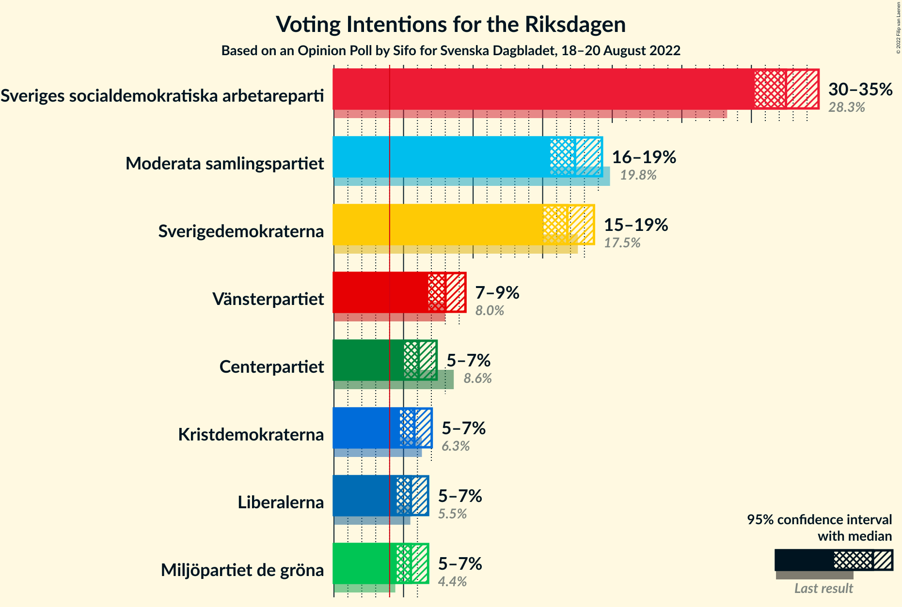

### Confidence Intervals

| Party | Last Result | Poll Result | 80% Confidence Interval | 90% Confidence Interval | 95% Confidence Interval | 99% Confidence Interval |
|:-----:|:-----------:|:-----------:|:-----------------------:|:-----------------------:|:-----------------------:|:-----------------------:|
| Sveriges socialdemokratiska arbetareparti | 28.3% | 32.5% | 31.0–34.0% |30.6–34.4% |30.2–34.8% |29.5–35.6% |
| Moderata samlingspartiet | 19.8% | 17.3% | 16.2–18.6% |15.8–18.9% |15.5–19.3% |15.0–19.9% |
| Sverigedemokraterna | 17.5% | 16.8% | 15.6–18.0% |15.3–18.4% |15.0–18.7% |14.5–19.3% |
| Vänsterpartiet | 8.0% | 8.0% | 7.2–8.9% |7.0–9.2% |6.8–9.4% |6.4–9.9% |
| Centerpartiet | 8.6% | 6.1% | 5.4–6.9% |5.2–7.2% |5.0–7.4% |4.7–7.8% |
| Kristdemokraterna | 6.3% | 5.8% | 5.1–6.6% |4.9–6.8% |4.7–7.0% |4.4–7.4% |
| Liberalerna | 5.5% | 5.5% | 4.9–6.3% |4.7–6.6% |4.5–6.8% |4.2–7.2% |
| Miljöpartiet de gröna | 4.4% | 5.5% | 4.9–6.3% |4.7–6.6% |4.5–6.8% |4.2–7.2% |

*Note:* The poll result column reflects the actual value used in the calculations. Published results may vary slightly, and in addition be rounded to fewer digits.

## Seats

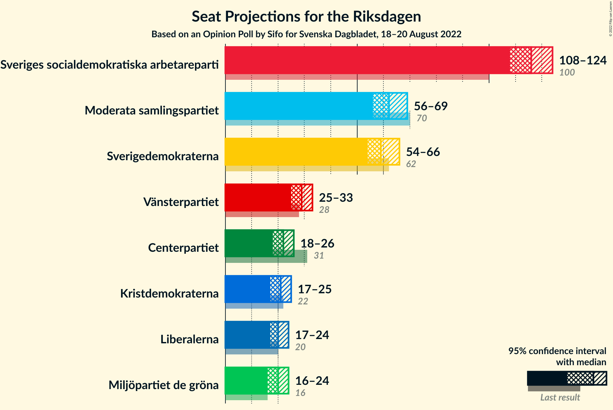

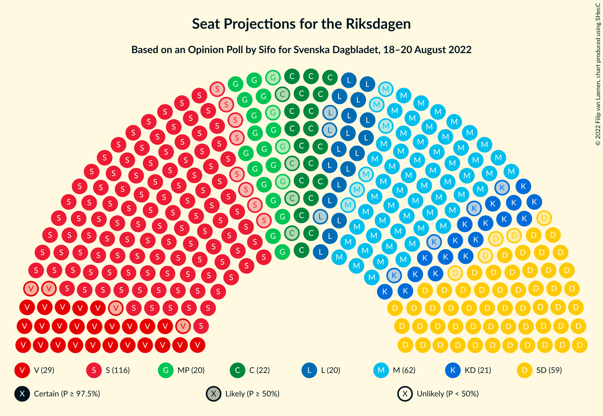

### Confidence Intervals

| Party | Last Result | Median | 80% Confidence Interval | 90% Confidence Interval | 95% Confidence Interval | 99% Confidence Interval |
|:-----:|:-----------:|:------:|:-----------------------:|:-----------------------:|:-----------------------:|:-----------------------:|
| <a href="#sveriges-socialdemokratiska-arbetareparti">Sveriges socialdemokratiska arbetareparti</a> | 100 | 116 | 111–121 |110–122 |108–124 |105–126 |
| <a href="#moderata-samlingspartiet">Moderata samlingspartiet</a> | 70 | 62 | 57–67 |56–68 |56–69 |54–71 |
| <a href="#sverigedemokraterna">Sverigedemokraterna</a> | 62 | 59 | 56–64 |55–65 |54–66 |52–69 |
| <a href="#vänsterpartiet">Vänsterpartiet</a> | 28 | 29 | 26–32 |25–33 |25–33 |23–36 |
| <a href="#centerpartiet">Centerpartiet</a> | 31 | 22 | 19–25 |19–26 |18–26 |17–28 |
| <a href="#kristdemokraterna">Kristdemokraterna</a> | 22 | 21 | 18–23 |17–24 |17–25 |16–26 |
| <a href="#liberalerna">Liberalerna</a> | 20 | 20 | 17–23 |17–23 |17–24 |15–26 |
| <a href="#miljöpartiet-de-gröna">Miljöpartiet de gröna</a> | 16 | 20 | 17–22 |16–23 |16–24 |15–26 |

### Sveriges socialdemokratiska arbetareparti

*For a full overview of the results for this party, see the [Sveriges socialdemokratiska arbetareparti](party-sverigessocialdemokratiskaarbetareparti.html) page.*

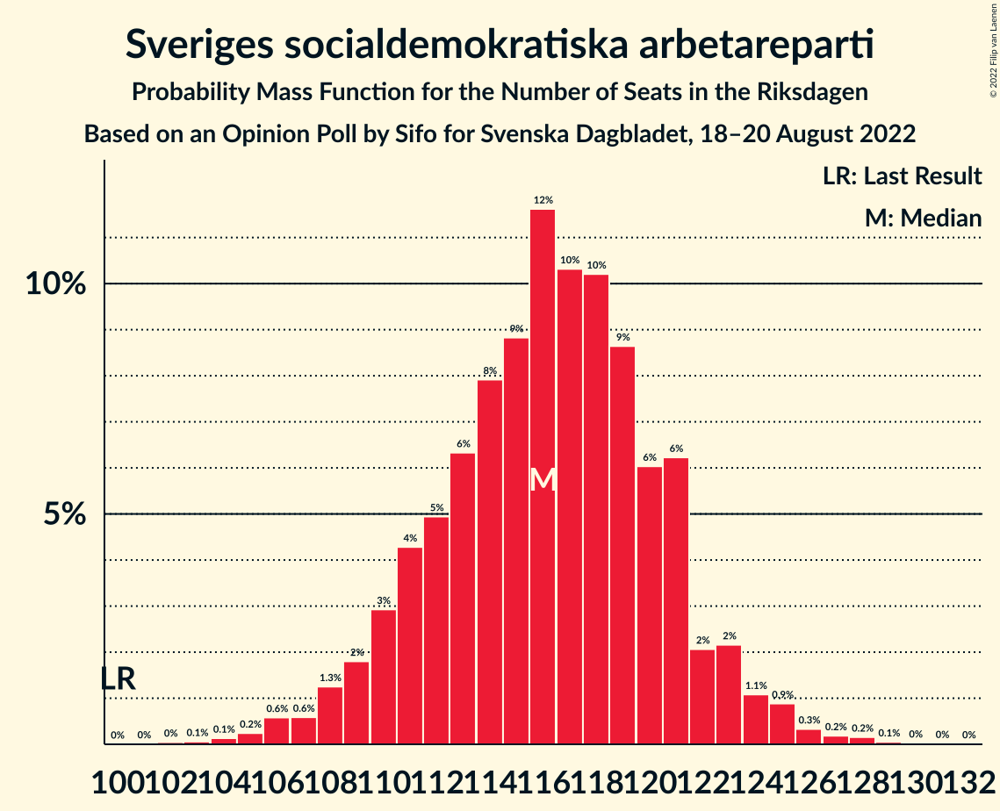

| Number of Seats | Probability | Accumulated | Special Marks |
|:---------------:|:-----------:|:-----------:|:-------------:|
| 100 | 0% | 100% | Last Result |
| 101 | 0% | 100% |  |
| 102 | 0% | 100% |  |
| 103 | 0.1% | 99.9% |  |
| 104 | 0.1% | 99.9% |  |
| 105 | 0.2% | 99.7% |  |
| 106 | 0.6% | 99.5% |  |
| 107 | 0.6% | 98.9% |  |
| 108 | 1.3% | 98% |  |
| 109 | 2% | 97% |  |
| 110 | 3% | 95% |  |
| 111 | 4% | 92% |  |
| 112 | 5% | 88% |  |
| 113 | 6% | 83% |  |
| 114 | 8% | 77% |  |
| 115 | 9% | 69% |  |
| 116 | 12% | 60% | Median |
| 117 | 10% | 48% |  |
| 118 | 10% | 38% |  |
| 119 | 9% | 28% |  |
| 120 | 6% | 19% |  |
| 121 | 6% | 13% |  |
| 122 | 2% | 7% |  |
| 123 | 2% | 5% |  |
| 124 | 1.1% | 3% |  |
| 125 | 0.9% | 2% |  |
| 126 | 0.3% | 0.8% |  |
| 127 | 0.2% | 0.5% |  |
| 128 | 0.2% | 0.3% |  |
| 129 | 0.1% | 0.1% |  |
| 130 | 0% | 0.1% |  |
| 131 | 0% | 0% |  |

### Moderata samlingspartiet

*For a full overview of the results for this party, see the [Moderata samlingspartiet](party-moderatasamlingspartiet.html) page.*

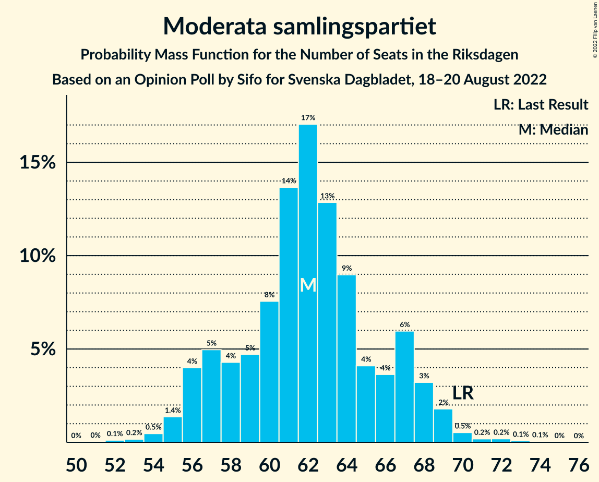

| Number of Seats | Probability | Accumulated | Special Marks |
|:---------------:|:-----------:|:-----------:|:-------------:|
| 51 | 0% | 100% |  |
| 52 | 0.1% | 99.9% |  |
| 53 | 0.2% | 99.8% |  |
| 54 | 0.5% | 99.7% |  |
| 55 | 1.4% | 99.2% |  |
| 56 | 4% | 98% |  |
| 57 | 5% | 94% |  |
| 58 | 4% | 89% |  |
| 59 | 5% | 85% |  |
| 60 | 8% | 80% |  |
| 61 | 14% | 72% |  |
| 62 | 17% | 59% | Median |
| 63 | 13% | 42% |  |
| 64 | 9% | 29% |  |
| 65 | 4% | 20% |  |
| 66 | 4% | 16% |  |
| 67 | 6% | 12% |  |
| 68 | 3% | 6% |  |
| 69 | 2% | 3% |  |
| 70 | 0.5% | 1.1% | Last Result |
| 71 | 0.2% | 0.5% |  |
| 72 | 0.2% | 0.3% |  |
| 73 | 0.1% | 0.2% |  |
| 74 | 0.1% | 0.1% |  |
| 75 | 0% | 0% |  |

### Sverigedemokraterna

*For a full overview of the results for this party, see the [Sverigedemokraterna](party-sverigedemokraterna.html) page.*

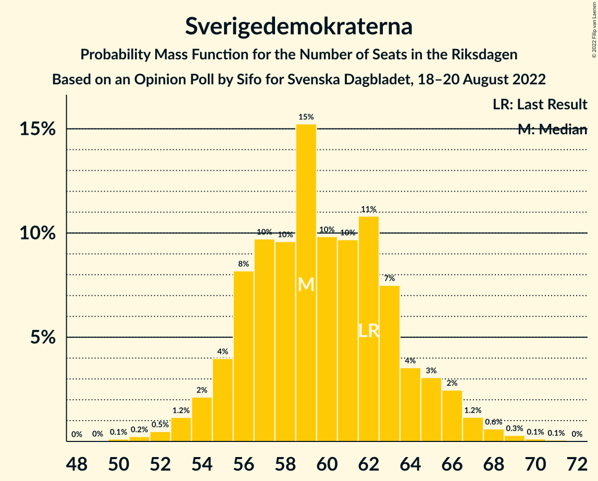

| Number of Seats | Probability | Accumulated | Special Marks |
|:---------------:|:-----------:|:-----------:|:-------------:|
| 50 | 0.1% | 100% |  |
| 51 | 0.2% | 99.8% |  |
| 52 | 0.5% | 99.6% |  |
| 53 | 1.2% | 99.1% |  |
| 54 | 2% | 98% |  |
| 55 | 4% | 96% |  |
| 56 | 8% | 92% |  |
| 57 | 10% | 84% |  |
| 58 | 10% | 74% |  |
| 59 | 15% | 64% | Median |
| 60 | 10% | 49% |  |
| 61 | 10% | 39% |  |
| 62 | 11% | 30% | Last Result |
| 63 | 7% | 19% |  |
| 64 | 4% | 11% |  |
| 65 | 3% | 8% |  |
| 66 | 2% | 5% |  |
| 67 | 1.2% | 2% |  |
| 68 | 0.6% | 1.1% |  |
| 69 | 0.3% | 0.5% |  |
| 70 | 0.1% | 0.2% |  |
| 71 | 0.1% | 0.1% |  |
| 72 | 0% | 0% |  |

### Vänsterpartiet

*For a full overview of the results for this party, see the [Vänsterpartiet](party-vänsterpartiet.html) page.*

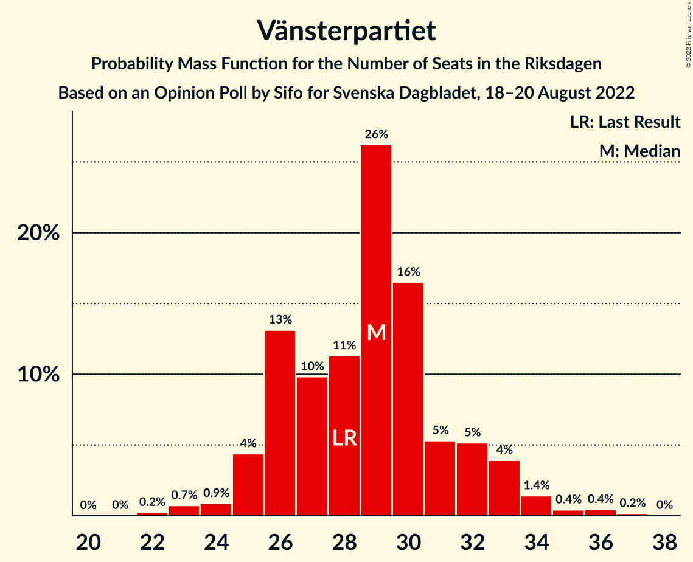

| Number of Seats | Probability | Accumulated | Special Marks |
|:---------------:|:-----------:|:-----------:|:-------------:|
| 22 | 0.2% | 100% |  |
| 23 | 0.7% | 99.7% |  |
| 24 | 0.9% | 99.0% |  |
| 25 | 4% | 98% |  |
| 26 | 13% | 94% |  |
| 27 | 10% | 81% |  |
| 28 | 11% | 71% | Last Result |
| 29 | 26% | 60% | Median |
| 30 | 16% | 33% |  |
| 31 | 5% | 17% |  |
| 32 | 5% | 12% |  |
| 33 | 4% | 6% |  |
| 34 | 1.4% | 2% |  |
| 35 | 0.4% | 1.0% |  |
| 36 | 0.4% | 0.6% |  |
| 37 | 0.2% | 0.2% |  |
| 38 | 0% | 0% |  |

### Centerpartiet

*For a full overview of the results for this party, see the [Centerpartiet](party-centerpartiet.html) page.*

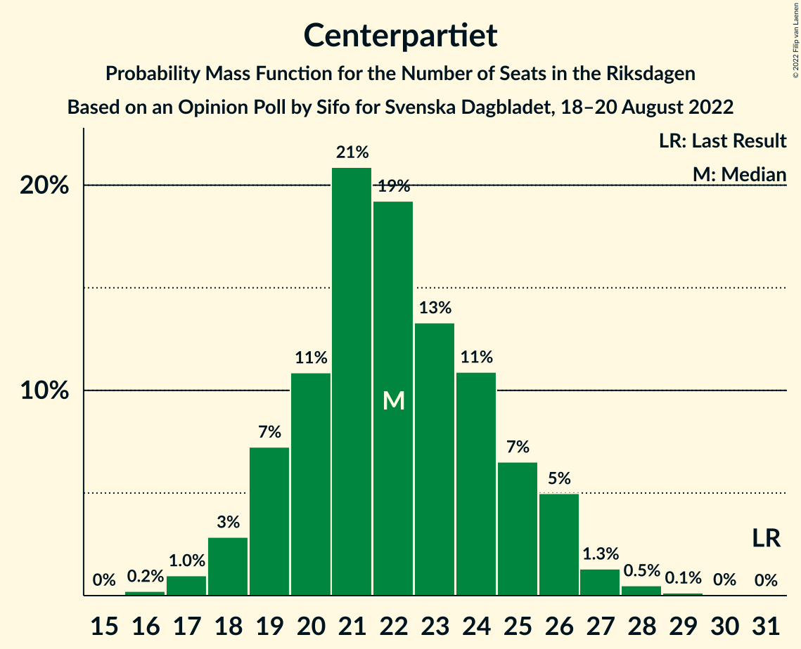

| Number of Seats | Probability | Accumulated | Special Marks |
|:---------------:|:-----------:|:-----------:|:-------------:|
| 16 | 0.2% | 100% |  |
| 17 | 1.0% | 99.7% |  |
| 18 | 3% | 98.8% |  |
| 19 | 7% | 96% |  |
| 20 | 11% | 89% |  |
| 21 | 21% | 78% |  |
| 22 | 19% | 57% | Median |
| 23 | 13% | 38% |  |
| 24 | 11% | 24% |  |
| 25 | 7% | 13% |  |
| 26 | 5% | 7% |  |
| 27 | 1.3% | 2% |  |
| 28 | 0.5% | 0.7% |  |
| 29 | 0.1% | 0.2% |  |
| 30 | 0% | 0.1% |  |
| 31 | 0% | 0% | Last Result |

### Kristdemokraterna

*For a full overview of the results for this party, see the [Kristdemokraterna](party-kristdemokraterna.html) page.*

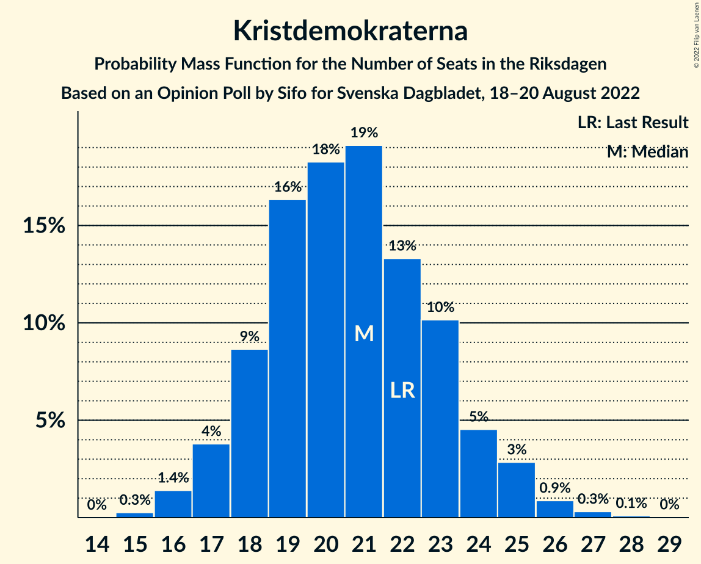

| Number of Seats | Probability | Accumulated | Special Marks |
|:---------------:|:-----------:|:-----------:|:-------------:|
| 15 | 0.3% | 100% |  |
| 16 | 1.4% | 99.7% |  |
| 17 | 4% | 98% |  |
| 18 | 9% | 95% |  |
| 19 | 16% | 86% |  |
| 20 | 18% | 70% |  |
| 21 | 19% | 51% | Median |
| 22 | 13% | 32% | Last Result |
| 23 | 10% | 19% |  |
| 24 | 5% | 9% |  |
| 25 | 3% | 4% |  |
| 26 | 0.9% | 1.3% |  |
| 27 | 0.3% | 0.4% |  |
| 28 | 0.1% | 0.1% |  |
| 29 | 0% | 0% |  |

### Liberalerna

*For a full overview of the results for this party, see the [Liberalerna](party-liberalerna.html) page.*

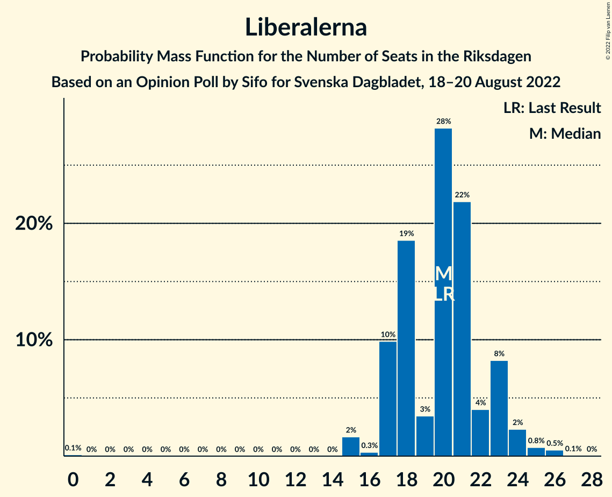

| Number of Seats | Probability | Accumulated | Special Marks |
|:---------------:|:-----------:|:-----------:|:-------------:|
| 0 | 0.1% | 100% |  |
| 1 | 0% | 99.9% |  |
| 2 | 0% | 99.9% |  |
| 3 | 0% | 99.9% |  |
| 4 | 0% | 99.9% |  |
| 5 | 0% | 99.9% |  |
| 6 | 0% | 99.9% |  |
| 7 | 0% | 99.9% |  |
| 8 | 0% | 99.9% |  |
| 9 | 0% | 99.9% |  |
| 10 | 0% | 99.9% |  |
| 11 | 0% | 99.9% |  |
| 12 | 0% | 99.9% |  |
| 13 | 0% | 99.9% |  |
| 14 | 0% | 99.9% |  |
| 15 | 2% | 99.9% |  |
| 16 | 0.3% | 98% |  |
| 17 | 10% | 98% |  |
| 18 | 19% | 88% |  |
| 19 | 3% | 69% |  |
| 20 | 28% | 66% | Last Result, Median |
| 21 | 22% | 38% |  |
| 22 | 4% | 16% |  |
| 23 | 8% | 12% |  |
| 24 | 2% | 4% |  |
| 25 | 0.8% | 1.4% |  |
| 26 | 0.5% | 0.6% |  |
| 27 | 0.1% | 0.1% |  |
| 28 | 0% | 0% |  |

### Miljöpartiet de gröna

*For a full overview of the results for this party, see the [Miljöpartiet de gröna](party-miljöpartietdegröna.html) page.*

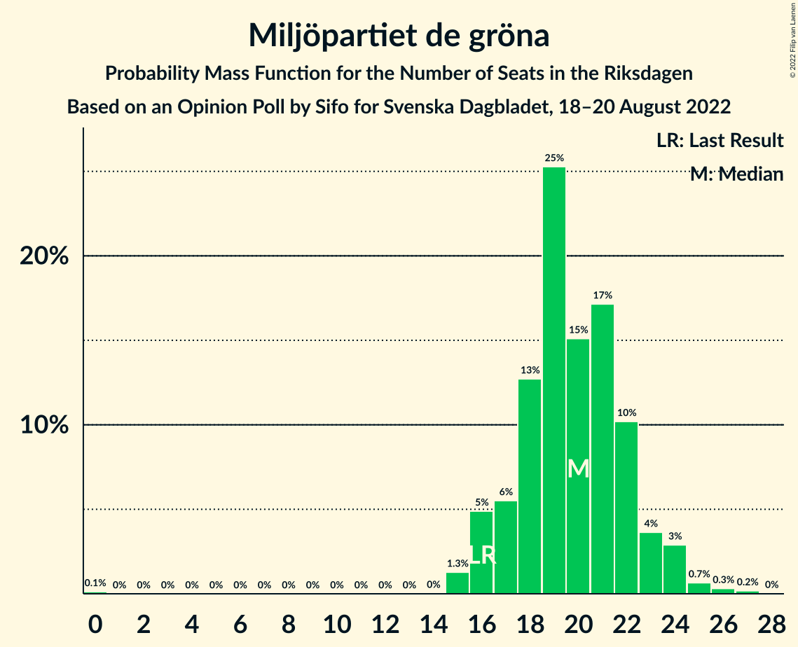

| Number of Seats | Probability | Accumulated | Special Marks |
|:---------------:|:-----------:|:-----------:|:-------------:|
| 0 | 0.1% | 100% |  |
| 1 | 0% | 99.9% |  |
| 2 | 0% | 99.9% |  |
| 3 | 0% | 99.9% |  |
| 4 | 0% | 99.9% |  |
| 5 | 0% | 99.9% |  |
| 6 | 0% | 99.9% |  |
| 7 | 0% | 99.9% |  |
| 8 | 0% | 99.9% |  |
| 9 | 0% | 99.9% |  |
| 10 | 0% | 99.9% |  |
| 11 | 0% | 99.9% |  |
| 12 | 0% | 99.9% |  |
| 13 | 0% | 99.9% |  |
| 14 | 0% | 99.9% |  |
| 15 | 1.3% | 99.8% |  |
| 16 | 5% | 98.6% | Last Result |
| 17 | 6% | 94% |  |
| 18 | 13% | 88% |  |
| 19 | 25% | 75% |  |
| 20 | 15% | 50% | Median |
| 21 | 17% | 35% |  |
| 22 | 10% | 18% |  |
| 23 | 4% | 8% |  |
| 24 | 3% | 4% |  |
| 25 | 0.7% | 1.2% |  |
| 26 | 0.3% | 0.5% |  |
| 27 | 0.2% | 0.2% |  |
| 28 | 0% | 0% |  |

## Coalitions

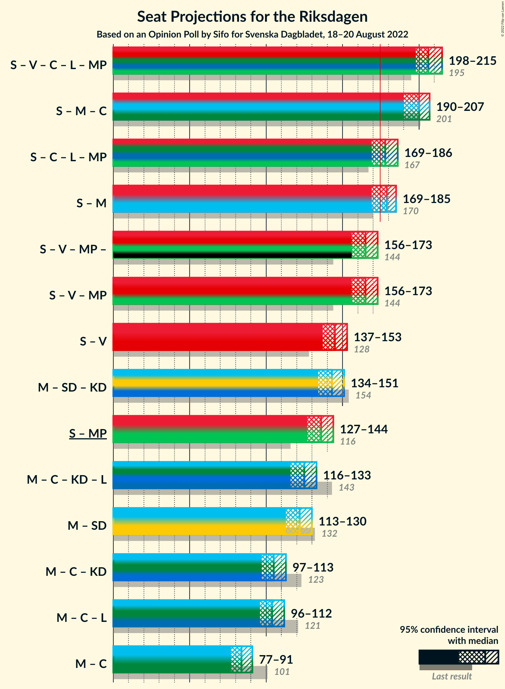

### Confidence Intervals

| Coalition | Last Result | Median | Majority? | 80% Confidence Interval | 90% Confidence Interval | 95% Confidence Interval | 99% Confidence Interval |
|:---------:|:-----------:|:------:|:---------:|:-----------------------:|:-----------------------:|:-----------------------:|:-----------------------:|
| Sveriges socialdemokratiska arbetareparti – Vänsterpartiet – Centerpartiet – Liberalerna – Miljöpartiet de gröna | 195 | 206 | 100% | 201–212 | 199–214 | 198–215 | 195–217 |
| Sveriges socialdemokratiska arbetareparti – Moderata samlingspartiet – Centerpartiet | 201 | 200 | 100% | 196–204 | 192–205 | 190–207 | 188–212 |
| Sveriges socialdemokratiska arbetareparti – Centerpartiet – Liberalerna – Miljöpartiet de gröna | 167 | 178 | 79% | 172–183 | 171–185 | 169–186 | 166–188 |
| Sveriges socialdemokratiska arbetareparti – Moderata samlingspartiet | 170 | 179 | 84% | 173–183 | 171–184 | 169–185 | 166–189 |
| Sveriges socialdemokratiska arbetareparti – Vänsterpartiet – Miljöpartiet de gröna | 144 | 165 | 1.0% | 159–170 | 157–172 | 156–173 | 153–176 |
| Sveriges socialdemokratiska arbetareparti – Vänsterpartiet | 128 | 145 | 0% | 139–151 | 138–152 | 137–153 | 134–156 |
| Moderata samlingspartiet – Sverigedemokraterna – Kristdemokraterna | 154 | 143 | 0% | 137–148 | 135–150 | 134–151 | 131–154 |
| Sveriges socialdemokratiska arbetareparti – Miljöpartiet de gröna | 116 | 136 | 0% | 130–141 | 129–142 | 127–144 | 125–147 |
| Moderata samlingspartiet – Centerpartiet – Kristdemokraterna – Liberalerna | 143 | 125 | 0% | 119–130 | 118–131 | 116–133 | 113–136 |
| Moderata samlingspartiet – Sverigedemokraterna | 132 | 122 | 0% | 116–127 | 115–129 | 113–130 | 111–133 |
| Moderata samlingspartiet – Centerpartiet – Kristdemokraterna | 123 | 105 | 0% | 99–110 | 98–111 | 97–113 | 94–115 |
| Moderata samlingspartiet – Centerpartiet – Liberalerna | 121 | 104 | 0% | 99–109 | 97–111 | 96–112 | 93–115 |
| Moderata samlingspartiet – Centerpartiet | 101 | 84 | 0% | 79–89 | 78–90 | 77–91 | 75–94 |

### Sveriges socialdemokratiska arbetareparti – Vänsterpartiet – Centerpartiet – Liberalerna – Miljöpartiet de gröna

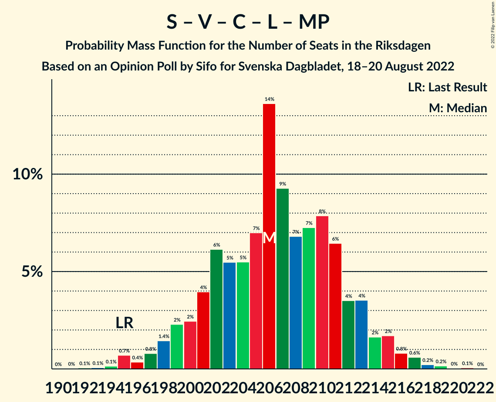

| Number of Seats | Probability | Accumulated | Special Marks |
|:---------------:|:-----------:|:-----------:|:-------------:|
| 191 | 0% | 100% |  |
| 192 | 0.1% | 99.9% |  |
| 193 | 0.1% | 99.9% |  |
| 194 | 0.1% | 99.8% |  |
| 195 | 0.7% | 99.7% | Last Result |
| 196 | 0.4% | 99.0% |  |
| 197 | 0.8% | 98.6% |  |
| 198 | 1.4% | 98% |  |
| 199 | 2% | 96% |  |
| 200 | 2% | 94% |  |
| 201 | 4% | 92% |  |
| 202 | 6% | 88% |  |
| 203 | 5% | 82% |  |
| 204 | 5% | 76% |  |
| 205 | 7% | 71% |  |
| 206 | 14% | 64% |  |
| 207 | 9% | 50% | Median |
| 208 | 7% | 41% |  |
| 209 | 7% | 34% |  |
| 210 | 8% | 27% |  |
| 211 | 6% | 19% |  |
| 212 | 4% | 12% |  |
| 213 | 4% | 9% |  |
| 214 | 2% | 5% |  |
| 215 | 2% | 4% |  |
| 216 | 0.8% | 2% |  |
| 217 | 0.6% | 1.1% |  |
| 218 | 0.2% | 0.5% |  |
| 219 | 0.2% | 0.3% |  |
| 220 | 0% | 0.1% |  |
| 221 | 0.1% | 0.1% |  |
| 222 | 0% | 0% |  |

### Sveriges socialdemokratiska arbetareparti – Moderata samlingspartiet – Centerpartiet

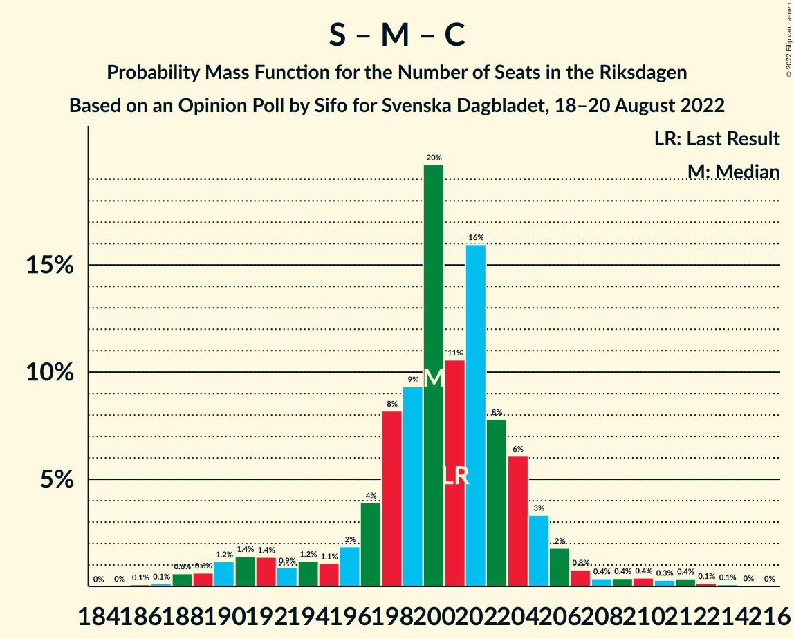

| Number of Seats | Probability | Accumulated | Special Marks |
|:---------------:|:-----------:|:-----------:|:-------------:|
| 186 | 0.1% | 100% |  |
| 187 | 0.1% | 99.9% |  |
| 188 | 0.6% | 99.8% |  |
| 189 | 0.6% | 99.2% |  |
| 190 | 1.2% | 98.5% |  |
| 191 | 1.4% | 97% |  |
| 192 | 1.4% | 96% |  |
| 193 | 0.9% | 95% |  |
| 194 | 1.2% | 94% |  |
| 195 | 1.1% | 93% |  |
| 196 | 2% | 91% |  |
| 197 | 4% | 90% |  |
| 198 | 8% | 86% |  |
| 199 | 9% | 77% |  |
| 200 | 20% | 68% | Median |
| 201 | 11% | 48% | Last Result |
| 202 | 16% | 38% |  |
| 203 | 8% | 22% |  |
| 204 | 6% | 14% |  |
| 205 | 3% | 8% |  |
| 206 | 2% | 5% |  |
| 207 | 0.8% | 3% |  |
| 208 | 0.4% | 2% |  |
| 209 | 0.4% | 2% |  |
| 210 | 0.4% | 1.4% |  |
| 211 | 0.3% | 1.0% |  |
| 212 | 0.4% | 0.7% |  |
| 213 | 0.1% | 0.3% |  |
| 214 | 0.1% | 0.2% |  |
| 215 | 0% | 0.1% |  |
| 216 | 0% | 0% |  |

### Sveriges socialdemokratiska arbetareparti – Centerpartiet – Liberalerna – Miljöpartiet de gröna

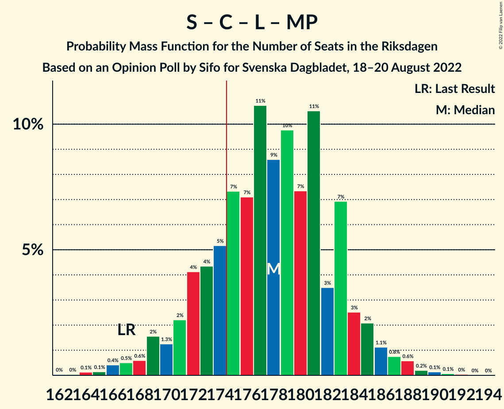

| Number of Seats | Probability | Accumulated | Special Marks |
|:---------------:|:-----------:|:-----------:|:-------------:|
| 162 | 0% | 100% |  |
| 163 | 0% | 99.9% |  |
| 164 | 0.1% | 99.9% |  |
| 165 | 0.1% | 99.7% |  |
| 166 | 0.4% | 99.6% |  |
| 167 | 0.5% | 99.2% | Last Result |
| 168 | 0.6% | 98.7% |  |
| 169 | 2% | 98% |  |
| 170 | 1.3% | 97% |  |
| 171 | 2% | 95% |  |
| 172 | 4% | 93% |  |
| 173 | 4% | 89% |  |
| 174 | 5% | 85% |  |
| 175 | 7% | 79% | Majority |
| 176 | 7% | 72% |  |
| 177 | 11% | 65% |  |
| 178 | 9% | 54% | Median |
| 179 | 10% | 46% |  |
| 180 | 7% | 36% |  |
| 181 | 11% | 29% |  |
| 182 | 3% | 18% |  |
| 183 | 7% | 14% |  |
| 184 | 3% | 8% |  |
| 185 | 2% | 5% |  |
| 186 | 1.1% | 3% |  |
| 187 | 0.8% | 2% |  |
| 188 | 0.6% | 1.1% |  |
| 189 | 0.2% | 0.5% |  |
| 190 | 0.1% | 0.3% |  |
| 191 | 0.1% | 0.1% |  |
| 192 | 0% | 0.1% |  |
| 193 | 0% | 0% |  |

### Sveriges socialdemokratiska arbetareparti – Moderata samlingspartiet

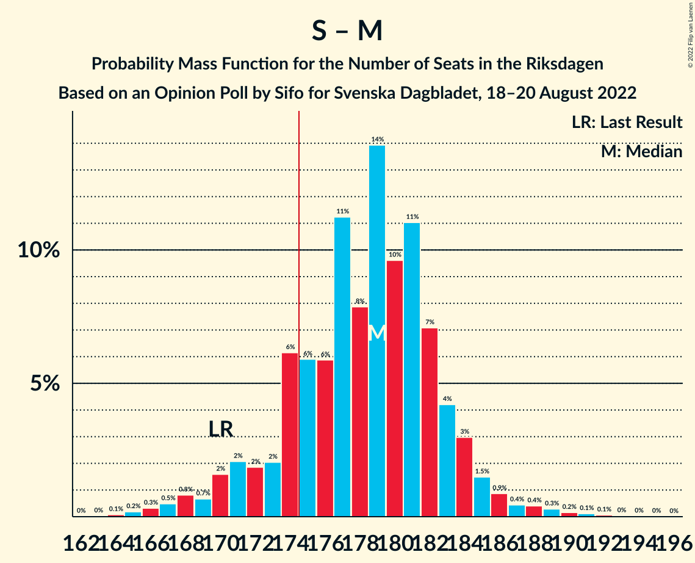

| Number of Seats | Probability | Accumulated | Special Marks |
|:---------------:|:-----------:|:-----------:|:-------------:|
| 163 | 0% | 100% |  |
| 164 | 0.1% | 99.9% |  |
| 165 | 0.2% | 99.9% |  |
| 166 | 0.3% | 99.7% |  |
| 167 | 0.5% | 99.4% |  |
| 168 | 0.8% | 98.9% |  |
| 169 | 0.7% | 98% |  |
| 170 | 2% | 97% | Last Result |
| 171 | 2% | 96% |  |
| 172 | 2% | 94% |  |
| 173 | 2% | 92% |  |
| 174 | 6% | 90% |  |
| 175 | 6% | 84% | Majority |
| 176 | 6% | 78% |  |
| 177 | 11% | 72% |  |
| 178 | 8% | 61% | Median |
| 179 | 14% | 53% |  |
| 180 | 10% | 39% |  |
| 181 | 11% | 29% |  |
| 182 | 7% | 18% |  |
| 183 | 4% | 11% |  |
| 184 | 3% | 7% |  |
| 185 | 1.5% | 4% |  |
| 186 | 0.9% | 2% |  |
| 187 | 0.4% | 2% |  |
| 188 | 0.4% | 1.1% |  |
| 189 | 0.3% | 0.7% |  |
| 190 | 0.2% | 0.4% |  |
| 191 | 0.1% | 0.3% |  |
| 192 | 0.1% | 0.2% |  |
| 193 | 0% | 0.1% |  |
| 194 | 0% | 0.1% |  |
| 195 | 0% | 0% |  |

### Sveriges socialdemokratiska arbetareparti – Vänsterpartiet – Miljöpartiet de gröna

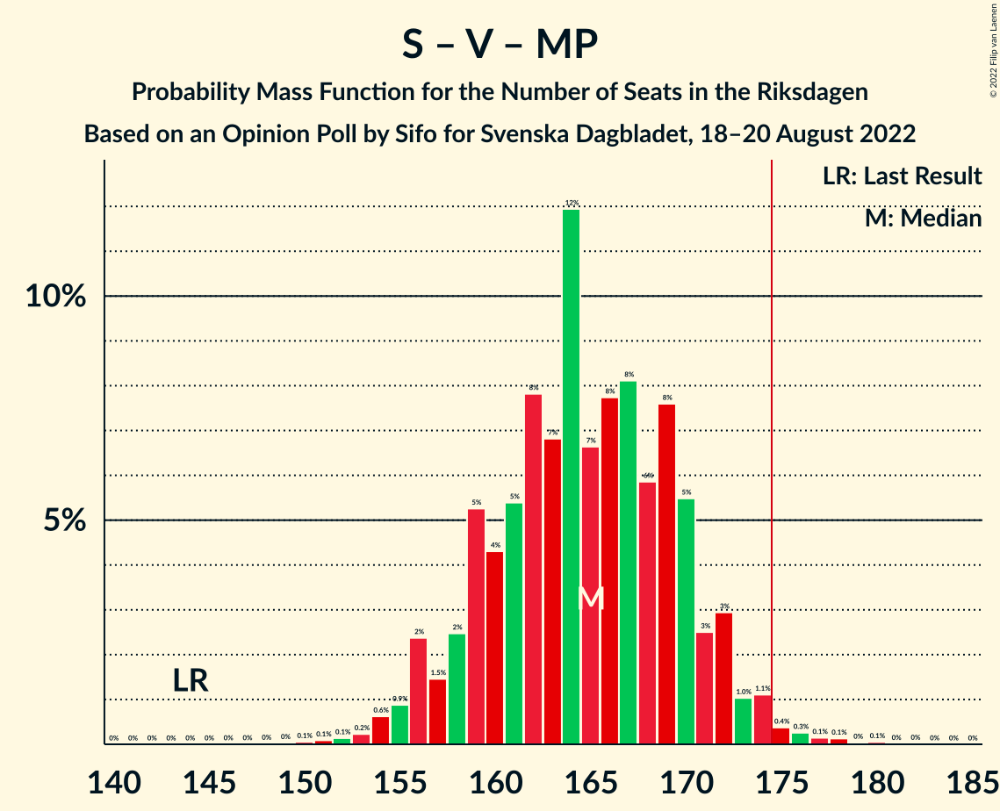

| Number of Seats | Probability | Accumulated | Special Marks |
|:---------------:|:-----------:|:-----------:|:-------------:|
| 144 | 0% | 100% | Last Result |
| 145 | 0% | 100% |  |
| 146 | 0% | 100% |  |
| 147 | 0% | 100% |  |
| 148 | 0% | 100% |  |
| 149 | 0% | 100% |  |
| 150 | 0.1% | 99.9% |  |
| 151 | 0.1% | 99.9% |  |
| 152 | 0.1% | 99.8% |  |
| 153 | 0.2% | 99.6% |  |
| 154 | 0.6% | 99.4% |  |
| 155 | 0.9% | 98.8% |  |
| 156 | 2% | 98% |  |
| 157 | 1.5% | 96% |  |
| 158 | 2% | 94% |  |
| 159 | 5% | 92% |  |
| 160 | 4% | 86% |  |
| 161 | 5% | 82% |  |
| 162 | 8% | 77% |  |
| 163 | 7% | 69% |  |
| 164 | 12% | 62% |  |
| 165 | 7% | 50% | Median |
| 166 | 8% | 43% |  |
| 167 | 8% | 36% |  |
| 168 | 6% | 28% |  |
| 169 | 8% | 22% |  |
| 170 | 5% | 14% |  |
| 171 | 3% | 9% |  |
| 172 | 3% | 6% |  |
| 173 | 1.0% | 3% |  |
| 174 | 1.1% | 2% |  |
| 175 | 0.4% | 1.0% | Majority |
| 176 | 0.3% | 0.7% |  |
| 177 | 0.1% | 0.4% |  |
| 178 | 0.1% | 0.3% |  |
| 179 | 0% | 0.1% |  |
| 180 | 0.1% | 0.1% |  |
| 181 | 0% | 0% |  |

### Sveriges socialdemokratiska arbetareparti – Vänsterpartiet

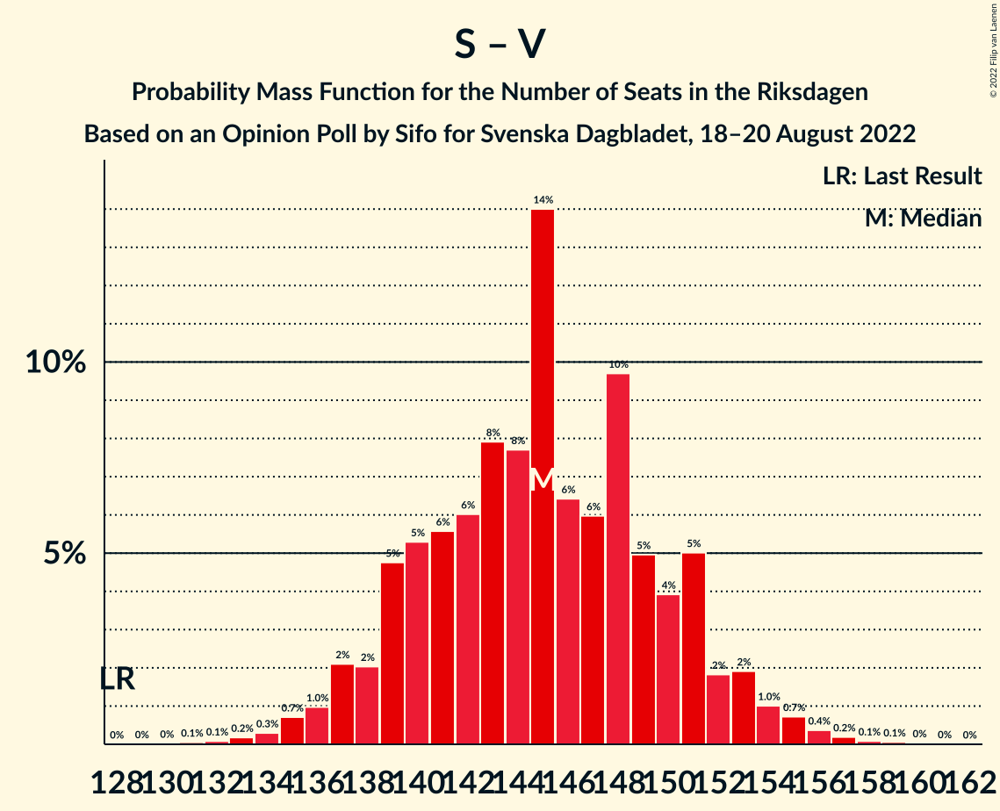

| Number of Seats | Probability | Accumulated | Special Marks |
|:---------------:|:-----------:|:-----------:|:-------------:|
| 128 | 0% | 100% | Last Result |
| 129 | 0% | 100% |  |
| 130 | 0% | 100% |  |
| 131 | 0.1% | 100% |  |
| 132 | 0.1% | 99.9% |  |
| 133 | 0.2% | 99.8% |  |
| 134 | 0.3% | 99.6% |  |
| 135 | 0.7% | 99.3% |  |
| 136 | 1.0% | 98.6% |  |
| 137 | 2% | 98% |  |
| 138 | 2% | 96% |  |
| 139 | 5% | 94% |  |
| 140 | 5% | 89% |  |
| 141 | 6% | 83% |  |
| 142 | 6% | 78% |  |
| 143 | 8% | 72% |  |
| 144 | 8% | 64% |  |
| 145 | 14% | 56% | Median |
| 146 | 6% | 42% |  |
| 147 | 6% | 36% |  |
| 148 | 10% | 30% |  |
| 149 | 5% | 20% |  |
| 150 | 4% | 15% |  |
| 151 | 5% | 11% |  |
| 152 | 2% | 6% |  |
| 153 | 2% | 4% |  |
| 154 | 1.0% | 2% |  |
| 155 | 0.7% | 1.5% |  |
| 156 | 0.4% | 0.8% |  |
| 157 | 0.2% | 0.4% |  |
| 158 | 0.1% | 0.2% |  |
| 159 | 0.1% | 0.1% |  |
| 160 | 0% | 0.1% |  |
| 161 | 0% | 0% |  |

### Moderata samlingspartiet – Sverigedemokraterna – Kristdemokraterna

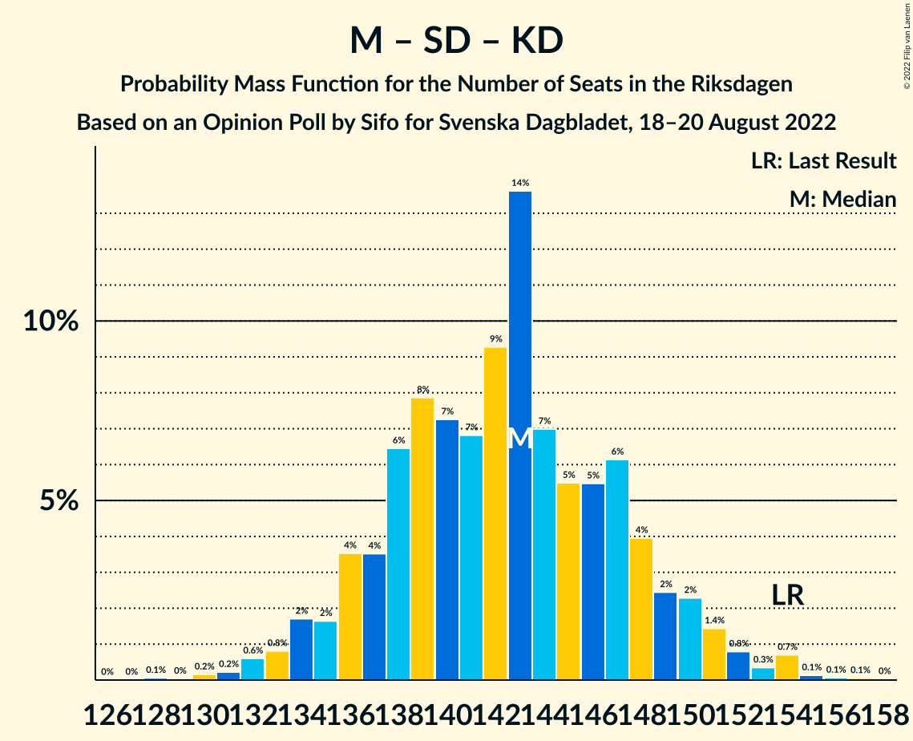

| Number of Seats | Probability | Accumulated | Special Marks |
|:---------------:|:-----------:|:-----------:|:-------------:|
| 128 | 0.1% | 100% |  |
| 129 | 0% | 99.9% |  |
| 130 | 0.2% | 99.9% |  |
| 131 | 0.2% | 99.7% |  |
| 132 | 0.6% | 99.5% |  |
| 133 | 0.8% | 98.9% |  |
| 134 | 2% | 98% |  |
| 135 | 2% | 96% |  |
| 136 | 4% | 95% |  |
| 137 | 4% | 91% |  |
| 138 | 6% | 88% |  |
| 139 | 8% | 81% |  |
| 140 | 7% | 73% |  |
| 141 | 7% | 66% |  |
| 142 | 9% | 59% | Median |
| 143 | 14% | 50% |  |
| 144 | 7% | 36% |  |
| 145 | 5% | 29% |  |
| 146 | 5% | 24% |  |
| 147 | 6% | 18% |  |
| 148 | 4% | 12% |  |
| 149 | 2% | 8% |  |
| 150 | 2% | 6% |  |
| 151 | 1.4% | 4% |  |
| 152 | 0.8% | 2% |  |
| 153 | 0.3% | 1.4% |  |
| 154 | 0.7% | 1.0% | Last Result |
| 155 | 0.1% | 0.3% |  |
| 156 | 0.1% | 0.2% |  |
| 157 | 0.1% | 0.1% |  |
| 158 | 0% | 0% |  |

### Sveriges socialdemokratiska arbetareparti – Miljöpartiet de gröna

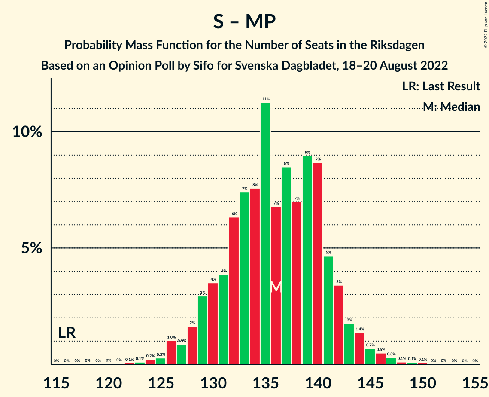

| Number of Seats | Probability | Accumulated | Special Marks |
|:---------------:|:-----------:|:-----------:|:-------------:|
| 116 | 0% | 100% | Last Result |
| 117 | 0% | 100% |  |
| 118 | 0% | 100% |  |
| 119 | 0% | 100% |  |
| 120 | 0% | 99.9% |  |
| 121 | 0% | 99.9% |  |
| 122 | 0.1% | 99.9% |  |
| 123 | 0.1% | 99.8% |  |
| 124 | 0.2% | 99.7% |  |
| 125 | 0.3% | 99.5% |  |
| 126 | 1.0% | 99.2% |  |
| 127 | 0.9% | 98% |  |
| 128 | 2% | 97% |  |
| 129 | 3% | 96% |  |
| 130 | 4% | 93% |  |
| 131 | 4% | 89% |  |
| 132 | 6% | 85% |  |
| 133 | 7% | 79% |  |
| 134 | 8% | 72% |  |
| 135 | 11% | 64% |  |
| 136 | 7% | 53% | Median |
| 137 | 8% | 46% |  |
| 138 | 7% | 38% |  |
| 139 | 9% | 31% |  |
| 140 | 9% | 22% |  |
| 141 | 5% | 13% |  |
| 142 | 3% | 8% |  |
| 143 | 2% | 5% |  |
| 144 | 1.4% | 3% |  |
| 145 | 0.7% | 2% |  |
| 146 | 0.5% | 1.1% |  |
| 147 | 0.3% | 0.6% |  |
| 148 | 0.1% | 0.3% |  |
| 149 | 0.1% | 0.2% |  |
| 150 | 0.1% | 0.1% |  |
| 151 | 0% | 0% |  |

### Moderata samlingspartiet – Centerpartiet – Kristdemokraterna – Liberalerna

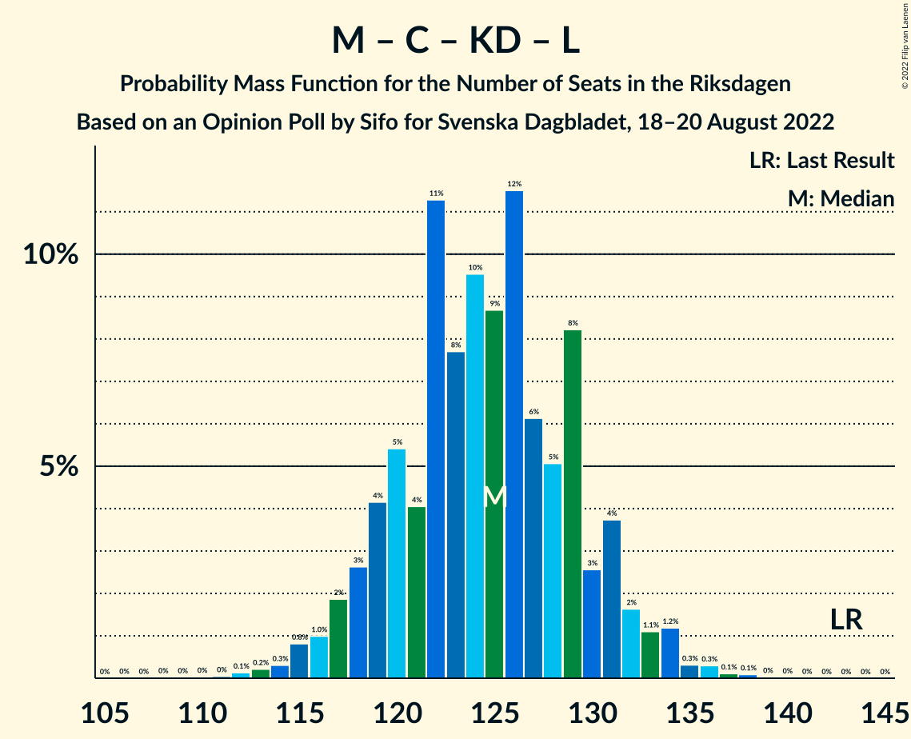

| Number of Seats | Probability | Accumulated | Special Marks |
|:---------------:|:-----------:|:-----------:|:-------------:|
| 108 | 0% | 100% |  |
| 109 | 0% | 99.9% |  |
| 110 | 0% | 99.9% |  |
| 111 | 0% | 99.9% |  |
| 112 | 0.1% | 99.8% |  |
| 113 | 0.2% | 99.7% |  |
| 114 | 0.3% | 99.5% |  |
| 115 | 0.8% | 99.2% |  |
| 116 | 1.0% | 98% |  |
| 117 | 2% | 97% |  |
| 118 | 3% | 96% |  |
| 119 | 4% | 93% |  |
| 120 | 5% | 89% |  |
| 121 | 4% | 83% |  |
| 122 | 11% | 79% |  |
| 123 | 8% | 68% |  |
| 124 | 10% | 60% |  |
| 125 | 9% | 51% | Median |
| 126 | 12% | 42% |  |
| 127 | 6% | 31% |  |
| 128 | 5% | 24% |  |
| 129 | 8% | 19% |  |
| 130 | 3% | 11% |  |
| 131 | 4% | 9% |  |
| 132 | 2% | 5% |  |
| 133 | 1.1% | 3% |  |
| 134 | 1.2% | 2% |  |
| 135 | 0.3% | 0.9% |  |
| 136 | 0.3% | 0.6% |  |
| 137 | 0.1% | 0.3% |  |
| 138 | 0.1% | 0.2% |  |
| 139 | 0% | 0.1% |  |
| 140 | 0% | 0% |  |
| 141 | 0% | 0% |  |
| 142 | 0% | 0% |  |
| 143 | 0% | 0% | Last Result |

### Moderata samlingspartiet – Sverigedemokraterna

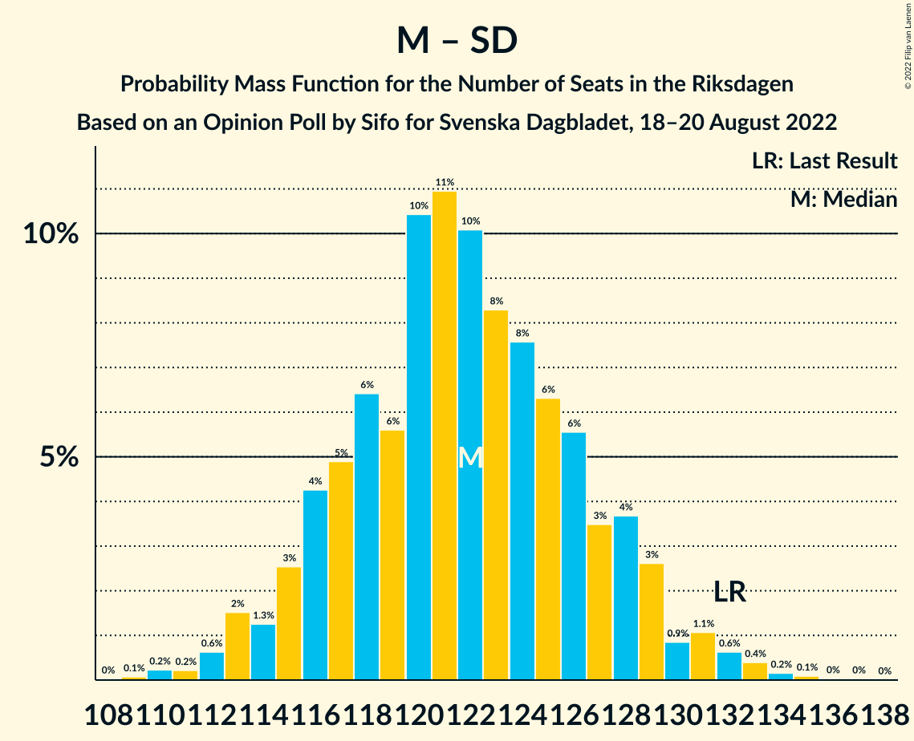

| Number of Seats | Probability | Accumulated | Special Marks |
|:---------------:|:-----------:|:-----------:|:-------------:|
| 108 | 0% | 100% |  |
| 109 | 0.1% | 99.9% |  |
| 110 | 0.2% | 99.9% |  |
| 111 | 0.2% | 99.6% |  |
| 112 | 0.6% | 99.4% |  |
| 113 | 2% | 98.8% |  |
| 114 | 1.3% | 97% |  |
| 115 | 3% | 96% |  |
| 116 | 4% | 93% |  |
| 117 | 5% | 89% |  |
| 118 | 6% | 84% |  |
| 119 | 6% | 78% |  |
| 120 | 10% | 72% |  |
| 121 | 11% | 62% | Median |
| 122 | 10% | 51% |  |
| 123 | 8% | 41% |  |
| 124 | 8% | 33% |  |
| 125 | 6% | 25% |  |
| 126 | 6% | 19% |  |
| 127 | 3% | 13% |  |
| 128 | 4% | 10% |  |
| 129 | 3% | 6% |  |
| 130 | 0.9% | 3% |  |
| 131 | 1.1% | 2% |  |
| 132 | 0.6% | 1.4% | Last Result |
| 133 | 0.4% | 0.7% |  |
| 134 | 0.2% | 0.3% |  |
| 135 | 0.1% | 0.2% |  |
| 136 | 0% | 0.1% |  |
| 137 | 0% | 0% |  |

### Moderata samlingspartiet – Centerpartiet – Kristdemokraterna

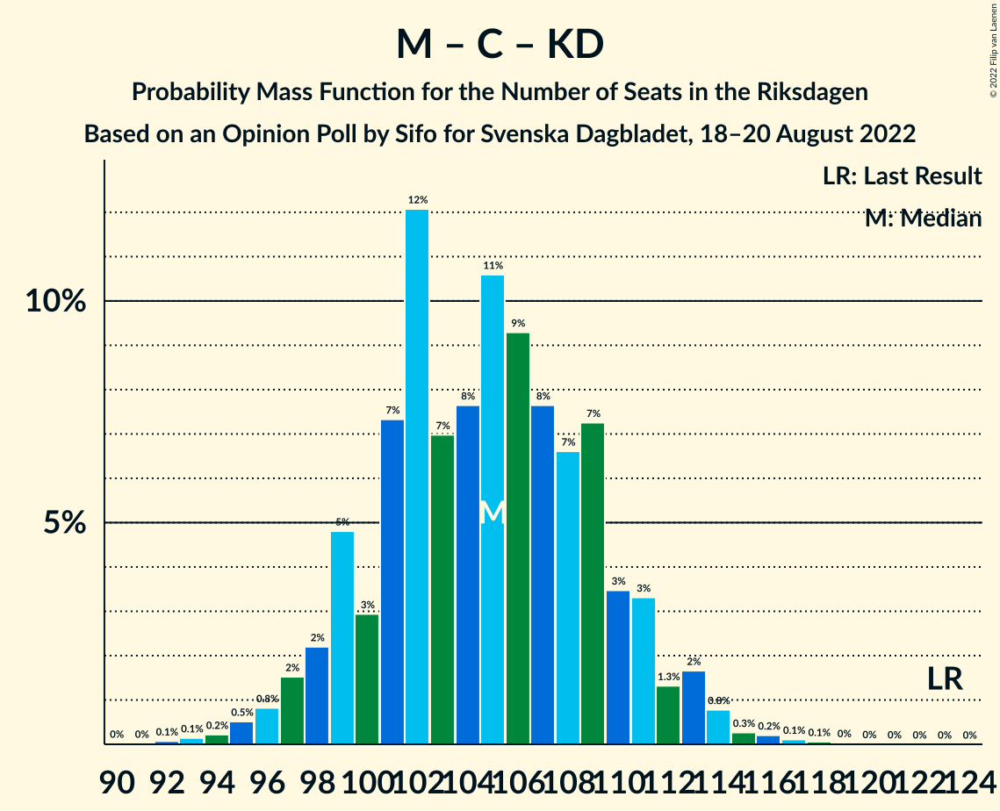

| Number of Seats | Probability | Accumulated | Special Marks |
|:---------------:|:-----------:|:-----------:|:-------------:|
| 91 | 0% | 100% |  |
| 92 | 0.1% | 99.9% |  |
| 93 | 0.1% | 99.9% |  |
| 94 | 0.2% | 99.7% |  |
| 95 | 0.5% | 99.5% |  |
| 96 | 0.8% | 99.0% |  |
| 97 | 2% | 98% |  |
| 98 | 2% | 97% |  |
| 99 | 5% | 94% |  |
| 100 | 3% | 90% |  |
| 101 | 7% | 87% |  |
| 102 | 12% | 79% |  |
| 103 | 7% | 67% |  |
| 104 | 8% | 60% |  |
| 105 | 11% | 53% | Median |
| 106 | 9% | 42% |  |
| 107 | 8% | 33% |  |
| 108 | 7% | 25% |  |
| 109 | 7% | 18% |  |
| 110 | 3% | 11% |  |
| 111 | 3% | 8% |  |
| 112 | 1.3% | 4% |  |
| 113 | 2% | 3% |  |
| 114 | 0.8% | 1.5% |  |
| 115 | 0.3% | 0.7% |  |
| 116 | 0.2% | 0.4% |  |
| 117 | 0.1% | 0.2% |  |
| 118 | 0.1% | 0.1% |  |
| 119 | 0% | 0.1% |  |
| 120 | 0% | 0% |  |
| 121 | 0% | 0% |  |
| 122 | 0% | 0% |  |
| 123 | 0% | 0% | Last Result |

### Moderata samlingspartiet – Centerpartiet – Liberalerna

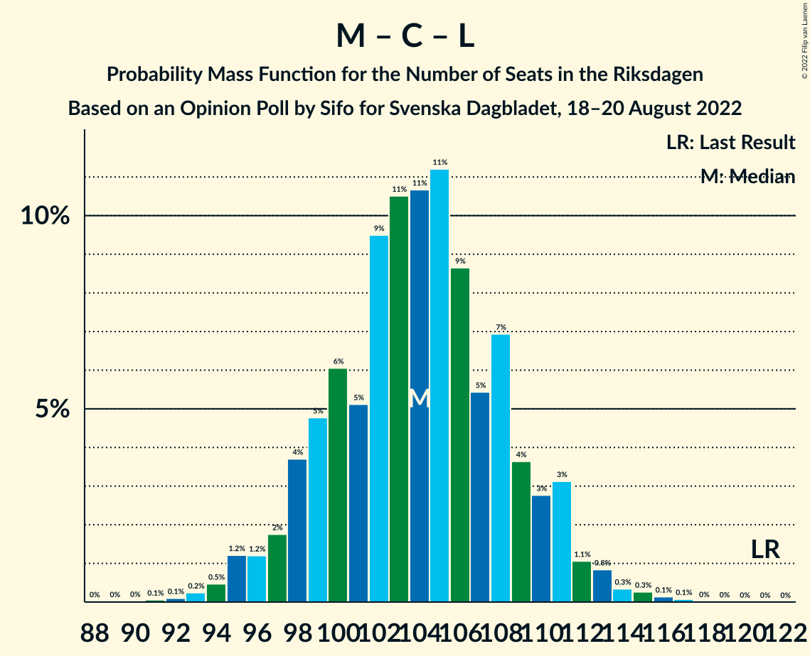

| Number of Seats | Probability | Accumulated | Special Marks |
|:---------------:|:-----------:|:-----------:|:-------------:|
| 88 | 0% | 100% |  |
| 89 | 0% | 99.9% |  |
| 90 | 0% | 99.9% |  |
| 91 | 0.1% | 99.9% |  |
| 92 | 0.1% | 99.8% |  |
| 93 | 0.2% | 99.7% |  |
| 94 | 0.5% | 99.5% |  |
| 95 | 1.2% | 99.0% |  |
| 96 | 1.2% | 98% |  |
| 97 | 2% | 97% |  |
| 98 | 4% | 95% |  |
| 99 | 5% | 91% |  |
| 100 | 6% | 86% |  |
| 101 | 5% | 80% |  |
| 102 | 9% | 75% |  |
| 103 | 11% | 66% |  |
| 104 | 11% | 55% | Median |
| 105 | 11% | 45% |  |
| 106 | 9% | 33% |  |
| 107 | 5% | 25% |  |
| 108 | 7% | 19% |  |
| 109 | 4% | 12% |  |
| 110 | 3% | 9% |  |
| 111 | 3% | 6% |  |
| 112 | 1.1% | 3% |  |
| 113 | 0.8% | 2% |  |
| 114 | 0.3% | 0.9% |  |
| 115 | 0.3% | 0.5% |  |
| 116 | 0.1% | 0.3% |  |
| 117 | 0.1% | 0.1% |  |
| 118 | 0% | 0% |  |
| 119 | 0% | 0% |  |
| 120 | 0% | 0% |  |
| 121 | 0% | 0% | Last Result |

### Moderata samlingspartiet – Centerpartiet

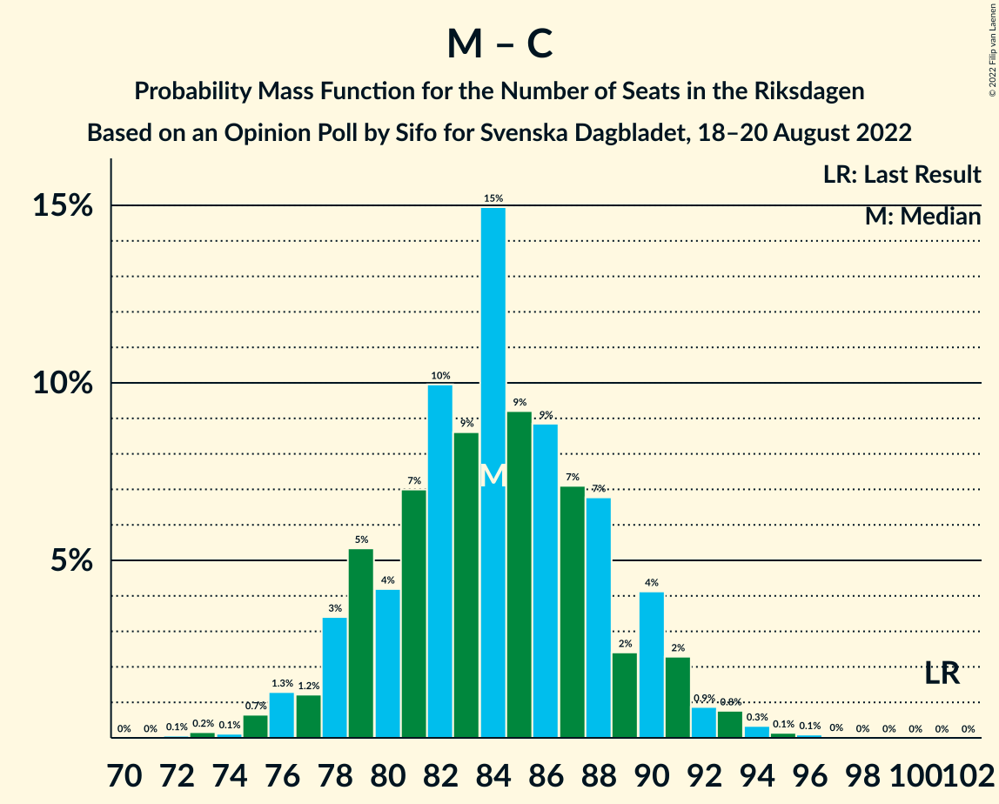

| Number of Seats | Probability | Accumulated | Special Marks |
|:---------------:|:-----------:|:-----------:|:-------------:|
| 72 | 0.1% | 100% |  |
| 73 | 0.2% | 99.9% |  |
| 74 | 0.1% | 99.8% |  |
| 75 | 0.7% | 99.6% |  |
| 76 | 1.3% | 99.0% |  |
| 77 | 1.2% | 98% |  |
| 78 | 3% | 96% |  |
| 79 | 5% | 93% |  |
| 80 | 4% | 88% |  |
| 81 | 7% | 84% |  |
| 82 | 10% | 77% |  |
| 83 | 9% | 67% |  |
| 84 | 15% | 58% | Median |
| 85 | 9% | 43% |  |
| 86 | 9% | 34% |  |
| 87 | 7% | 25% |  |
| 88 | 7% | 18% |  |
| 89 | 2% | 11% |  |
| 90 | 4% | 9% |  |
| 91 | 2% | 5% |  |
| 92 | 0.9% | 2% |  |
| 93 | 0.8% | 1.4% |  |
| 94 | 0.3% | 0.6% |  |
| 95 | 0.1% | 0.3% |  |
| 96 | 0.1% | 0.2% |  |
| 97 | 0% | 0.1% |  |
| 98 | 0% | 0% |  |
| 99 | 0% | 0% |  |
| 100 | 0% | 0% |  |
| 101 | 0% | 0% | Last Result |

## Technical Information

### Opinion Poll

+ **Polling firm:** Sifo
+ **Commissioner(s):** Svenska Dagbladet
+ **Fieldwork period:** 18–20 August 2022

### Calculations

+ **Sample size:** 1610
+ **Simulations done:** 1,048,576
+ **Error estimate:** 0.61%

