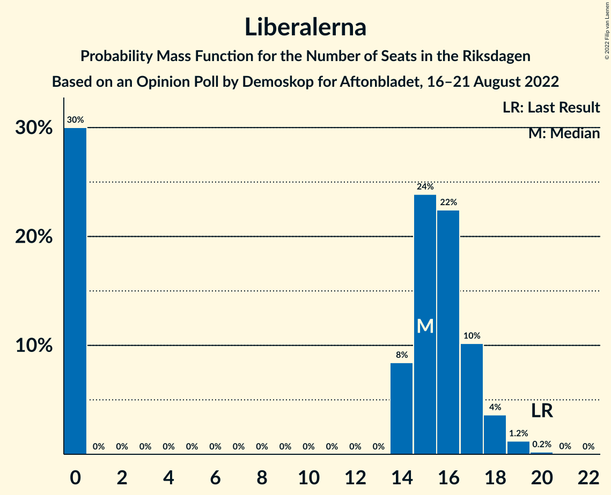
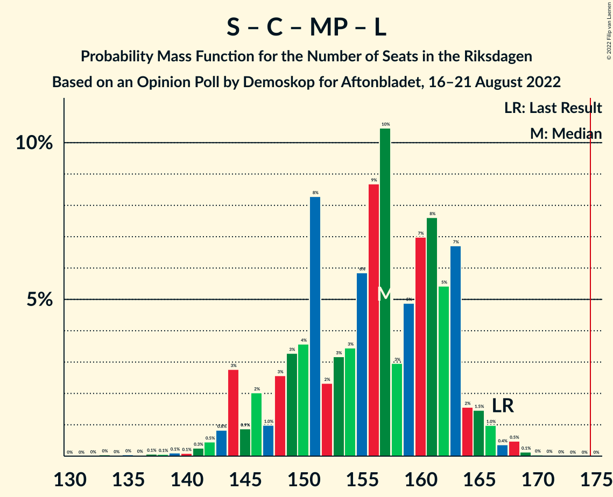

# Opinion Poll by Demoskop for Aftonbladet, 16–21 August 2022

<a href="#voting-intentions">Voting Intentions</a> | <a href="#seats">Seats</a> | <a href="#coalitions">Coalitions</a> | <a href="#technical-information">Technical Information</a>

## Voting Intentions

### Confidence Intervals

| Party | Last Result | Poll Result | 80% Confidence Interval | 90% Confidence Interval | 95% Confidence Interval | 99% Confidence Interval |
|:-----:|:-----------:|:-----------:|:-----------------------:|:-----------------------:|:-----------------------:|:-----------------------:|
| Sveriges socialdemokratiska arbetareparti | 28.3% | 28.9% | 27.7–30.1% |27.3–30.5% |27.0–30.8% |26.5–31.4% |
| Moderata samlingspartiet | 19.8% | 19.9% | 18.8–21.0% |18.5–21.3% |18.3–21.6% |17.8–22.2% |
| Sverigedemokraterna | 17.5% | 18.7% | 17.7–19.8% |17.4–20.1% |17.1–20.4% |16.7–20.9% |
| Vänsterpartiet | 8.0% | 8.9% | 8.2–9.7% |8.0–10.0% |7.8–10.2% |7.5–10.6% |
| Centerpartiet | 8.6% | 6.8% | 6.2–7.5% |6.0–7.7% |5.8–7.9% |5.5–8.3% |
| Kristdemokraterna | 6.3% | 6.4% | 5.8–7.1% |5.6–7.3% |5.4–7.5% |5.2–7.8% |
| Miljöpartiet de gröna | 4.4% | 4.8% | 4.3–5.5% |4.1–5.6% |4.0–5.8% |3.7–6.1% |
| Liberalerna | 5.5% | 4.2% | 3.7–4.8% |3.5–5.0% |3.4–5.1% |3.2–5.4% |

*Note:* The poll result column reflects the actual value used in the calculations. Published results may vary slightly, and in addition be rounded to fewer digits.

## Seats

### Confidence Intervals

| Party | Last Result | Median | 80% Confidence Interval | 90% Confidence Interval | 95% Confidence Interval | 99% Confidence Interval |
|:-----:|:-----------:|:------:|:-----------------------:|:-----------------------:|:-----------------------:|:-----------------------:|
| <a href="#sveriges-socialdemokratiska-arbetareparti">Sveriges socialdemokratiska arbetareparti</a> | 100 | 103 | 98–109 |97–111 |96–112 |94–114 |
| <a href="#moderata-samlingspartiet">Moderata samlingspartiet</a> | 70 | 71 | 67–76 |66–77 |65–78 |63–80 |
| <a href="#sverigedemokraterna">Sverigedemokraterna</a> | 62 | 67 | 63–71 |61–73 |61–74 |59–76 |
| <a href="#vänsterpartiet">Vänsterpartiet</a> | 28 | 32 | 29–35 |28–36 |28–36 |26–38 |
| <a href="#centerpartiet">Centerpartiet</a> | 31 | 24 | 22–27 |21–28 |21–28 |20–30 |
| <a href="#kristdemokraterna">Kristdemokraterna</a> | 22 | 23 | 21–25 |20–26 |19–27 |18–28 |
| <a href="#miljöpartiet-de-gröna">Miljöpartiet de gröna</a> | 16 | 17 | 15–20 |15–20 |14–21 |0–22 |
| <a href="#liberalerna">Liberalerna</a> | 20 | 15 | 0–17 |0–18 |0–18 |0–19 |

### Sveriges socialdemokratiska arbetareparti

*For a full overview of the results for this party, see the [Sveriges socialdemokratiska arbetareparti](party-sverigessocialdemokratiskaarbetareparti.html) page.*

| Number of Seats | Probability | Accumulated | Special Marks |
|:---------------:|:-----------:|:-----------:|:-------------:|
| 91 | 0% | 100% |  |
| 92 | 0.1% | 99.9% |  |
| 93 | 0.2% | 99.8% |  |
| 94 | 1.0% | 99.6% |  |
| 95 | 0.7% | 98.6% |  |
| 96 | 2% | 98% |  |
| 97 | 4% | 96% |  |
| 98 | 4% | 92% |  |
| 99 | 4% | 88% |  |
| 100 | 4% | 84% | Last Result |
| 101 | 15% | 80% |  |
| 102 | 7% | 64% |  |
| 103 | 8% | 57% | Median |
| 104 | 13% | 49% |  |
| 105 | 5% | 36% |  |
| 106 | 10% | 31% |  |
| 107 | 4% | 21% |  |
| 108 | 5% | 17% |  |
| 109 | 5% | 12% |  |
| 110 | 2% | 7% |  |
| 111 | 3% | 5% |  |
| 112 | 1.3% | 3% |  |
| 113 | 0.5% | 1.4% |  |
| 114 | 0.4% | 0.9% |  |
| 115 | 0.1% | 0.5% |  |
| 116 | 0.2% | 0.3% |  |
| 117 | 0% | 0.1% |  |
| 118 | 0.1% | 0.1% |  |
| 119 | 0% | 0% |  |

### Moderata samlingspartiet

*For a full overview of the results for this party, see the [Moderata samlingspartiet](party-moderatasamlingspartiet.html) page.*

| Number of Seats | Probability | Accumulated | Special Marks |
|:---------------:|:-----------:|:-----------:|:-------------:|
| 61 | 0.1% | 100% |  |
| 62 | 0.2% | 99.9% |  |
| 63 | 0.4% | 99.7% |  |
| 64 | 1.0% | 99.2% |  |
| 65 | 2% | 98% |  |
| 66 | 2% | 96% |  |
| 67 | 6% | 94% |  |
| 68 | 13% | 88% |  |
| 69 | 10% | 75% |  |
| 70 | 14% | 65% | Last Result |
| 71 | 11% | 51% | Median |
| 72 | 6% | 40% |  |
| 73 | 8% | 34% |  |
| 74 | 7% | 26% |  |
| 75 | 4% | 19% |  |
| 76 | 6% | 15% |  |
| 77 | 4% | 9% |  |
| 78 | 3% | 5% |  |
| 79 | 1.0% | 2% |  |
| 80 | 0.4% | 0.9% |  |
| 81 | 0.3% | 0.5% |  |
| 82 | 0.1% | 0.2% |  |
| 83 | 0.1% | 0.1% |  |
| 84 | 0% | 0% |  |

### Sverigedemokraterna

*For a full overview of the results for this party, see the [Sverigedemokraterna](party-sverigedemokraterna.html) page.*

| Number of Seats | Probability | Accumulated | Special Marks |
|:---------------:|:-----------:|:-----------:|:-------------:|
| 57 | 0.1% | 100% |  |
| 58 | 0.1% | 99.9% |  |
| 59 | 0.6% | 99.7% |  |
| 60 | 1.1% | 99.1% |  |
| 61 | 3% | 98% |  |
| 62 | 2% | 95% | Last Result |
| 63 | 6% | 92% |  |
| 64 | 9% | 87% |  |
| 65 | 7% | 77% |  |
| 66 | 14% | 71% |  |
| 67 | 14% | 56% | Median |
| 68 | 9% | 42% |  |
| 69 | 11% | 33% |  |
| 70 | 7% | 22% |  |
| 71 | 5% | 14% |  |
| 72 | 3% | 9% |  |
| 73 | 3% | 6% |  |
| 74 | 2% | 3% |  |
| 75 | 0.7% | 1.5% |  |
| 76 | 0.3% | 0.7% |  |
| 77 | 0.2% | 0.4% |  |
| 78 | 0.2% | 0.2% |  |
| 79 | 0% | 0.1% |  |
| 80 | 0% | 0% |  |

### Vänsterpartiet

*For a full overview of the results for this party, see the [Vänsterpartiet](party-vänsterpartiet.html) page.*

| Number of Seats | Probability | Accumulated | Special Marks |
|:---------------:|:-----------:|:-----------:|:-------------:|
| 25 | 0.2% | 100% |  |
| 26 | 0.3% | 99.8% |  |
| 27 | 2% | 99.5% |  |
| 28 | 5% | 98% | Last Result |
| 29 | 8% | 93% |  |
| 30 | 11% | 86% |  |
| 31 | 18% | 74% |  |
| 32 | 20% | 56% | Median |
| 33 | 14% | 36% |  |
| 34 | 9% | 23% |  |
| 35 | 6% | 14% |  |
| 36 | 5% | 8% |  |
| 37 | 1.2% | 2% |  |
| 38 | 0.8% | 1.1% |  |
| 39 | 0.2% | 0.3% |  |
| 40 | 0.1% | 0.2% |  |
| 41 | 0% | 0% |  |

### Centerpartiet

*For a full overview of the results for this party, see the [Centerpartiet](party-centerpartiet.html) page.*

| Number of Seats | Probability | Accumulated | Special Marks |
|:---------------:|:-----------:|:-----------:|:-------------:|
| 18 | 0% | 100% |  |
| 19 | 0.3% | 99.9% |  |
| 20 | 1.0% | 99.6% |  |
| 21 | 5% | 98.6% |  |
| 22 | 12% | 94% |  |
| 23 | 15% | 82% |  |
| 24 | 20% | 67% | Median |
| 25 | 18% | 46% |  |
| 26 | 13% | 28% |  |
| 27 | 8% | 15% |  |
| 28 | 4% | 7% |  |
| 29 | 2% | 2% |  |
| 30 | 0.4% | 0.8% |  |
| 31 | 0.4% | 0.4% | Last Result |
| 32 | 0% | 0.1% |  |
| 33 | 0% | 0% |  |

### Kristdemokraterna

*For a full overview of the results for this party, see the [Kristdemokraterna](party-kristdemokraterna.html) page.*

| Number of Seats | Probability | Accumulated | Special Marks |
|:---------------:|:-----------:|:-----------:|:-------------:|
| 17 | 0.1% | 100% |  |
| 18 | 0.8% | 99.9% |  |
| 19 | 2% | 99.2% |  |
| 20 | 5% | 97% |  |
| 21 | 11% | 92% |  |
| 22 | 17% | 81% | Last Result |
| 23 | 30% | 64% | Median |
| 24 | 14% | 34% |  |
| 25 | 10% | 20% |  |
| 26 | 5% | 9% |  |
| 27 | 3% | 4% |  |
| 28 | 1.2% | 2% |  |
| 29 | 0.3% | 0.4% |  |
| 30 | 0.1% | 0.1% |  |
| 31 | 0% | 0% |  |

### Miljöpartiet de gröna

*For a full overview of the results for this party, see the [Miljöpartiet de gröna](party-miljöpartietdegröna.html) page.*

| Number of Seats | Probability | Accumulated | Special Marks |
|:---------------:|:-----------:|:-----------:|:-------------:|
| 0 | 2% | 100% |  |
| 1 | 0% | 98% |  |
| 2 | 0% | 98% |  |
| 3 | 0% | 98% |  |
| 4 | 0% | 98% |  |
| 5 | 0% | 98% |  |
| 6 | 0% | 98% |  |
| 7 | 0% | 98% |  |
| 8 | 0% | 98% |  |
| 9 | 0% | 98% |  |
| 10 | 0% | 98% |  |
| 11 | 0% | 98% |  |
| 12 | 0% | 98% |  |
| 13 | 0% | 98% |  |
| 14 | 2% | 98% |  |
| 15 | 8% | 95% |  |
| 16 | 16% | 87% | Last Result |
| 17 | 28% | 71% | Median |
| 18 | 20% | 43% |  |
| 19 | 13% | 23% |  |
| 20 | 7% | 11% |  |
| 21 | 3% | 4% |  |
| 22 | 0.6% | 0.8% |  |
| 23 | 0.2% | 0.2% |  |
| 24 | 0% | 0% |  |

### Liberalerna

*For a full overview of the results for this party, see the [Liberalerna](party-liberalerna.html) page.*

| Number of Seats | Probability | Accumulated | Special Marks |
|:---------------:|:-----------:|:-----------:|:-------------:|
| 0 | 30% | 100% |  |
| 1 | 0% | 70% |  |
| 2 | 0% | 70% |  |
| 3 | 0% | 70% |  |
| 4 | 0% | 70% |  |
| 5 | 0% | 70% |  |
| 6 | 0% | 70% |  |
| 7 | 0% | 70% |  |
| 8 | 0% | 70% |  |
| 9 | 0% | 70% |  |
| 10 | 0% | 70% |  |
| 11 | 0% | 70% |  |
| 12 | 0% | 70% |  |
| 13 | 0% | 70% |  |
| 14 | 8% | 70% |  |
| 15 | 24% | 62% | Median |
| 16 | 22% | 38% |  |
| 17 | 10% | 15% |  |
| 18 | 4% | 5% |  |
| 19 | 1.2% | 1.5% |  |
| 20 | 0.2% | 0.3% | Last Result |
| 21 | 0% | 0% |  |

## Coalitions

### Confidence Intervals

| Coalition | Last Result | Median | Majority? | 80% Confidence Interval | 90% Confidence Interval | 95% Confidence Interval | 99% Confidence Interval |
|:---------:|:-----------:|:------:|:---------:|:-----------------------:|:-----------------------:|:-----------------------:|:-----------------------:|
| Sveriges socialdemokratiska arbetareparti – Moderata samlingspartiet – Centerpartiet | 201 | 198 | 100% | 192–208 | 191–209 | 190–211 | 187–215 |
| Sveriges socialdemokratiska arbetareparti – Vänsterpartiet – Centerpartiet – Miljöpartiet de gröna – Liberalerna | 195 | 188 | 99.0% | 181–194 | 179–196 | 177–197 | 173–199 |
| Sveriges socialdemokratiska arbetareparti – Moderata samlingspartiet | 170 | 174 | 44% | 168–183 | 166–185 | 165–186 | 163–189 |
| Moderata samlingspartiet – Sverigedemokraterna – Kristdemokraterna | 154 | 161 | 1.0% | 155–168 | 153–170 | 152–172 | 150–176 |
| Sveriges socialdemokratiska arbetareparti – Centerpartiet – Miljöpartiet de gröna – Liberalerna | 167 | 157 | 0% | 148–163 | 145–164 | 144–165 | 141–168 |
| Sveriges socialdemokratiska arbetareparti – Vänsterpartiet – Miljöpartiet de gröna | 144 | 152 | 0% | 147–159 | 145–161 | 143–163 | 137–166 |
| Moderata samlingspartiet – Sverigedemokraterna | 132 | 137 | 0% | 132–145 | 131–147 | 130–149 | 127–152 |
| Sveriges socialdemokratiska arbetareparti – Vänsterpartiet | 128 | 135 | 0% | 129–142 | 128–144 | 127–145 | 124–148 |
| Moderata samlingspartiet – Centerpartiet – Kristdemokraterna – Liberalerna | 143 | 131 | 0% | 121–137 | 119–138 | 117–139 | 115–143 |
| Sveriges socialdemokratiska arbetareparti – Miljöpartiet de gröna | 116 | 121 | 0% | 115–127 | 113–128 | 111–129 | 106–132 |
| Moderata samlingspartiet – Centerpartiet – Kristdemokraterna | 123 | 118 | 0% | 113–124 | 112–126 | 110–128 | 108–131 |
| Moderata samlingspartiet – Centerpartiet – Liberalerna | 121 | 108 | 0% | 97–114 | 95–115 | 94–116 | 91–120 |
| Moderata samlingspartiet – Centerpartiet | 101 | 95 | 0% | 91–101 | 90–103 | 88–104 | 86–107 |

### Sveriges socialdemokratiska arbetareparti – Moderata samlingspartiet – Centerpartiet

| Number of Seats | Probability | Accumulated | Special Marks |
|:---------------:|:-----------:|:-----------:|:-------------:|
| 184 | 0% | 100% |  |
| 185 | 0.1% | 99.9% |  |
| 186 | 0.2% | 99.8% |  |
| 187 | 0.2% | 99.6% |  |
| 188 | 0.5% | 99.4% |  |
| 189 | 1.4% | 98.9% |  |
| 190 | 2% | 98% |  |
| 191 | 2% | 96% |  |
| 192 | 5% | 93% |  |
| 193 | 6% | 88% |  |
| 194 | 10% | 83% |  |
| 195 | 4% | 72% |  |
| 196 | 6% | 69% |  |
| 197 | 8% | 63% |  |
| 198 | 8% | 55% | Median |
| 199 | 7% | 47% |  |
| 200 | 6% | 40% |  |
| 201 | 4% | 34% | Last Result |
| 202 | 4% | 30% |  |
| 203 | 2% | 26% |  |
| 204 | 4% | 24% |  |
| 205 | 3% | 20% |  |
| 206 | 2% | 17% |  |
| 207 | 5% | 15% |  |
| 208 | 2% | 10% |  |
| 209 | 5% | 9% |  |
| 210 | 0.8% | 4% |  |
| 211 | 2% | 4% |  |
| 212 | 0.4% | 2% |  |
| 213 | 0.5% | 1.4% |  |
| 214 | 0.3% | 0.9% |  |
| 215 | 0.2% | 0.5% |  |
| 216 | 0.2% | 0.4% |  |
| 217 | 0% | 0.2% |  |
| 218 | 0.1% | 0.2% |  |
| 219 | 0% | 0.1% |  |
| 220 | 0% | 0.1% |  |
| 221 | 0% | 0.1% |  |
| 222 | 0% | 0.1% |  |
| 223 | 0% | 0% |  |

### Sveriges socialdemokratiska arbetareparti – Vänsterpartiet – Centerpartiet – Miljöpartiet de gröna – Liberalerna

| Number of Seats | Probability | Accumulated | Special Marks |
|:---------------:|:-----------:|:-----------:|:-------------:|
| 168 | 0% | 100% |  |
| 169 | 0% | 99.9% |  |
| 170 | 0.1% | 99.9% |  |
| 171 | 0.1% | 99.8% |  |
| 172 | 0.1% | 99.7% |  |
| 173 | 0.2% | 99.7% |  |
| 174 | 0.5% | 99.4% |  |
| 175 | 0.3% | 99.0% | Majority |
| 176 | 1.1% | 98.6% |  |
| 177 | 1.5% | 98% |  |
| 178 | 1.0% | 96% |  |
| 179 | 3% | 95% |  |
| 180 | 2% | 92% |  |
| 181 | 4% | 91% |  |
| 182 | 4% | 87% |  |
| 183 | 4% | 83% |  |
| 184 | 5% | 79% |  |
| 185 | 7% | 74% |  |
| 186 | 3% | 67% |  |
| 187 | 9% | 64% |  |
| 188 | 5% | 55% |  |
| 189 | 12% | 50% |  |
| 190 | 4% | 37% |  |
| 191 | 8% | 33% | Median |
| 192 | 7% | 25% |  |
| 193 | 5% | 18% |  |
| 194 | 4% | 13% |  |
| 195 | 4% | 9% | Last Result |
| 196 | 2% | 5% |  |
| 197 | 1.3% | 3% |  |
| 198 | 0.7% | 2% |  |
| 199 | 0.6% | 1.0% |  |
| 200 | 0.3% | 0.4% |  |
| 201 | 0.1% | 0.2% |  |
| 202 | 0% | 0.1% |  |
| 203 | 0% | 0% |  |

### Sveriges socialdemokratiska arbetareparti – Moderata samlingspartiet

| Number of Seats | Probability | Accumulated | Special Marks |
|:---------------:|:-----------:|:-----------:|:-------------:|
| 160 | 0% | 100% |  |
| 161 | 0.1% | 99.9% |  |
| 162 | 0.2% | 99.8% |  |
| 163 | 0.5% | 99.6% |  |
| 164 | 0.4% | 99.1% |  |
| 165 | 2% | 98.7% |  |
| 166 | 3% | 97% |  |
| 167 | 3% | 94% |  |
| 168 | 4% | 92% |  |
| 169 | 3% | 88% |  |
| 170 | 6% | 84% | Last Result |
| 171 | 10% | 79% |  |
| 172 | 12% | 68% |  |
| 173 | 4% | 56% |  |
| 174 | 9% | 53% | Median |
| 175 | 6% | 44% | Majority |
| 176 | 5% | 38% |  |
| 177 | 5% | 33% |  |
| 178 | 3% | 27% |  |
| 179 | 2% | 24% |  |
| 180 | 3% | 21% |  |
| 181 | 4% | 19% |  |
| 182 | 3% | 14% |  |
| 183 | 5% | 11% |  |
| 184 | 1.4% | 7% |  |
| 185 | 2% | 5% |  |
| 186 | 1.3% | 3% |  |
| 187 | 0.4% | 2% |  |
| 188 | 0.8% | 1.5% |  |
| 189 | 0.3% | 0.7% |  |
| 190 | 0.2% | 0.4% |  |
| 191 | 0.1% | 0.2% |  |
| 192 | 0% | 0.2% |  |
| 193 | 0.1% | 0.1% |  |
| 194 | 0% | 0.1% |  |
| 195 | 0% | 0.1% |  |
| 196 | 0% | 0% |  |

### Moderata samlingspartiet – Sverigedemokraterna – Kristdemokraterna

| Number of Seats | Probability | Accumulated | Special Marks |
|:---------------:|:-----------:|:-----------:|:-------------:|
| 147 | 0% | 100% |  |
| 148 | 0.1% | 99.9% |  |
| 149 | 0.3% | 99.8% |  |
| 150 | 0.6% | 99.6% |  |
| 151 | 0.7% | 99.0% |  |
| 152 | 1.3% | 98% |  |
| 153 | 2% | 97% |  |
| 154 | 4% | 95% | Last Result |
| 155 | 4% | 91% |  |
| 156 | 5% | 87% |  |
| 157 | 7% | 82% |  |
| 158 | 8% | 75% |  |
| 159 | 4% | 67% |  |
| 160 | 12% | 63% |  |
| 161 | 5% | 50% | Median |
| 162 | 9% | 45% |  |
| 163 | 3% | 36% |  |
| 164 | 7% | 33% |  |
| 165 | 5% | 26% |  |
| 166 | 4% | 21% |  |
| 167 | 4% | 17% |  |
| 168 | 4% | 13% |  |
| 169 | 2% | 9% |  |
| 170 | 3% | 8% |  |
| 171 | 1.0% | 5% |  |
| 172 | 1.5% | 4% |  |
| 173 | 1.1% | 2% |  |
| 174 | 0.3% | 1.4% |  |
| 175 | 0.5% | 1.0% | Majority |
| 176 | 0.2% | 0.6% |  |
| 177 | 0.1% | 0.3% |  |
| 178 | 0.1% | 0.3% |  |
| 179 | 0.1% | 0.2% |  |
| 180 | 0% | 0.1% |  |
| 181 | 0% | 0.1% |  |
| 182 | 0% | 0% |  |

### Sveriges socialdemokratiska arbetareparti – Centerpartiet – Miljöpartiet de gröna – Liberalerna

| Number of Seats | Probability | Accumulated | Special Marks |
|:---------------:|:-----------:|:-----------:|:-------------:|
| 133 | 0% | 100% |  |
| 134 | 0% | 99.9% |  |
| 135 | 0% | 99.9% |  |
| 136 | 0% | 99.9% |  |
| 137 | 0.1% | 99.8% |  |
| 138 | 0.1% | 99.8% |  |
| 139 | 0.1% | 99.7% |  |
| 140 | 0.1% | 99.6% |  |
| 141 | 0.3% | 99.5% |  |
| 142 | 0.5% | 99.3% |  |
| 143 | 0.8% | 98.8% |  |
| 144 | 3% | 98% |  |
| 145 | 0.9% | 95% |  |
| 146 | 2% | 94% |  |
| 147 | 1.0% | 92% |  |
| 148 | 3% | 91% |  |
| 149 | 3% | 89% |  |
| 150 | 4% | 85% |  |
| 151 | 8% | 82% |  |
| 152 | 2% | 74% |  |
| 153 | 3% | 71% |  |
| 154 | 3% | 68% |  |
| 155 | 6% | 65% |  |
| 156 | 9% | 59% |  |
| 157 | 10% | 50% |  |
| 158 | 3% | 40% |  |
| 159 | 5% | 37% | Median |
| 160 | 7% | 32% |  |
| 161 | 8% | 25% |  |
| 162 | 5% | 17% |  |
| 163 | 7% | 12% |  |
| 164 | 2% | 5% |  |
| 165 | 1.5% | 4% |  |
| 166 | 1.0% | 2% |  |
| 167 | 0.4% | 1.1% | Last Result |
| 168 | 0.5% | 0.7% |  |
| 169 | 0.1% | 0.2% |  |
| 170 | 0% | 0.1% |  |
| 171 | 0% | 0% |  |

### Sveriges socialdemokratiska arbetareparti – Vänsterpartiet – Miljöpartiet de gröna

| Number of Seats | Probability | Accumulated | Special Marks |
|:---------------:|:-----------:|:-----------:|:-------------:|
| 134 | 0% | 100% |  |
| 135 | 0.1% | 99.9% |  |
| 136 | 0.3% | 99.8% |  |
| 137 | 0% | 99.5% |  |
| 138 | 0.1% | 99.5% |  |
| 139 | 0.2% | 99.4% |  |
| 140 | 0.3% | 99.2% |  |
| 141 | 0.4% | 98.9% |  |
| 142 | 1.0% | 98.5% |  |
| 143 | 1.5% | 98% |  |
| 144 | 1.0% | 96% | Last Result |
| 145 | 3% | 95% |  |
| 146 | 2% | 92% |  |
| 147 | 5% | 90% |  |
| 148 | 8% | 85% |  |
| 149 | 8% | 77% |  |
| 150 | 9% | 69% |  |
| 151 | 6% | 60% |  |
| 152 | 7% | 53% | Median |
| 153 | 6% | 47% |  |
| 154 | 8% | 40% |  |
| 155 | 6% | 33% |  |
| 156 | 5% | 27% |  |
| 157 | 3% | 22% |  |
| 158 | 7% | 18% |  |
| 159 | 3% | 12% |  |
| 160 | 3% | 9% |  |
| 161 | 1.2% | 6% |  |
| 162 | 2% | 5% |  |
| 163 | 0.9% | 3% |  |
| 164 | 1.1% | 2% |  |
| 165 | 0.2% | 0.8% |  |
| 166 | 0.3% | 0.6% |  |
| 167 | 0.1% | 0.3% |  |
| 168 | 0.1% | 0.2% |  |
| 169 | 0% | 0.1% |  |
| 170 | 0% | 0% |  |

### Moderata samlingspartiet – Sverigedemokraterna

| Number of Seats | Probability | Accumulated | Special Marks |
|:---------------:|:-----------:|:-----------:|:-------------:|
| 125 | 0.1% | 100% |  |
| 126 | 0.3% | 99.9% |  |
| 127 | 0.2% | 99.6% |  |
| 128 | 0.9% | 99.4% |  |
| 129 | 0.9% | 98% |  |
| 130 | 1.1% | 98% |  |
| 131 | 4% | 96% |  |
| 132 | 4% | 93% | Last Result |
| 133 | 4% | 89% |  |
| 134 | 9% | 84% |  |
| 135 | 5% | 75% |  |
| 136 | 6% | 70% |  |
| 137 | 14% | 64% |  |
| 138 | 4% | 49% | Median |
| 139 | 11% | 45% |  |
| 140 | 5% | 35% |  |
| 141 | 5% | 30% |  |
| 142 | 6% | 25% |  |
| 143 | 5% | 20% |  |
| 144 | 2% | 15% |  |
| 145 | 5% | 13% |  |
| 146 | 2% | 8% |  |
| 147 | 1.4% | 6% |  |
| 148 | 1.2% | 4% |  |
| 149 | 1.4% | 3% |  |
| 150 | 0.5% | 2% |  |
| 151 | 0.6% | 1.2% |  |
| 152 | 0.3% | 0.6% |  |
| 153 | 0.1% | 0.3% |  |
| 154 | 0.1% | 0.2% |  |
| 155 | 0% | 0.1% |  |
| 156 | 0.1% | 0.1% |  |
| 157 | 0% | 0% |  |

### Sveriges socialdemokratiska arbetareparti – Vänsterpartiet

| Number of Seats | Probability | Accumulated | Special Marks |
|:---------------:|:-----------:|:-----------:|:-------------:|
| 122 | 0% | 100% |  |
| 123 | 0.2% | 99.9% |  |
| 124 | 0.3% | 99.8% |  |
| 125 | 0.4% | 99.4% |  |
| 126 | 0.9% | 99.0% |  |
| 127 | 2% | 98% |  |
| 128 | 3% | 96% | Last Result |
| 129 | 4% | 93% |  |
| 130 | 4% | 90% |  |
| 131 | 6% | 86% |  |
| 132 | 8% | 80% |  |
| 133 | 11% | 72% |  |
| 134 | 9% | 61% |  |
| 135 | 9% | 52% | Median |
| 136 | 6% | 43% |  |
| 137 | 5% | 37% |  |
| 138 | 6% | 32% |  |
| 139 | 6% | 26% |  |
| 140 | 6% | 20% |  |
| 141 | 3% | 14% |  |
| 142 | 3% | 11% |  |
| 143 | 3% | 8% |  |
| 144 | 2% | 5% |  |
| 145 | 1.2% | 3% |  |
| 146 | 0.9% | 2% |  |
| 147 | 0.6% | 1.2% |  |
| 148 | 0.3% | 0.7% |  |
| 149 | 0.1% | 0.4% |  |
| 150 | 0.1% | 0.2% |  |
| 151 | 0.1% | 0.2% |  |
| 152 | 0% | 0.1% |  |
| 153 | 0% | 0.1% |  |
| 154 | 0% | 0% |  |

### Moderata samlingspartiet – Centerpartiet – Kristdemokraterna – Liberalerna

| Number of Seats | Probability | Accumulated | Special Marks |
|:---------------:|:-----------:|:-----------:|:-------------:|
| 112 | 0% | 100% |  |
| 113 | 0.1% | 99.9% |  |
| 114 | 0.2% | 99.8% |  |
| 115 | 0.5% | 99.6% |  |
| 116 | 0.6% | 99.2% |  |
| 117 | 1.4% | 98.6% |  |
| 118 | 1.1% | 97% |  |
| 119 | 2% | 96% |  |
| 120 | 3% | 94% |  |
| 121 | 2% | 91% |  |
| 122 | 4% | 89% |  |
| 123 | 4% | 85% |  |
| 124 | 4% | 81% |  |
| 125 | 4% | 77% |  |
| 126 | 2% | 73% |  |
| 127 | 4% | 70% |  |
| 128 | 3% | 67% |  |
| 129 | 3% | 64% |  |
| 130 | 8% | 61% |  |
| 131 | 9% | 53% |  |
| 132 | 14% | 44% |  |
| 133 | 5% | 30% | Median |
| 134 | 5% | 25% |  |
| 135 | 5% | 20% |  |
| 136 | 5% | 16% |  |
| 137 | 3% | 11% |  |
| 138 | 4% | 8% |  |
| 139 | 2% | 4% |  |
| 140 | 0.8% | 2% |  |
| 141 | 0.5% | 1.5% |  |
| 142 | 0.5% | 1.0% |  |
| 143 | 0.3% | 0.5% | Last Result |
| 144 | 0.1% | 0.3% |  |
| 145 | 0.1% | 0.2% |  |
| 146 | 0.1% | 0.1% |  |
| 147 | 0% | 0% |  |

### Sveriges socialdemokratiska arbetareparti – Miljöpartiet de gröna

| Number of Seats | Probability | Accumulated | Special Marks |
|:---------------:|:-----------:|:-----------:|:-------------:|
| 101 | 0.2% | 100% |  |
| 102 | 0.1% | 99.8% |  |
| 103 | 0.1% | 99.7% |  |
| 104 | 0.1% | 99.7% |  |
| 105 | 0.1% | 99.6% |  |
| 106 | 0.3% | 99.5% |  |
| 107 | 0.2% | 99.2% |  |
| 108 | 0.3% | 99.1% |  |
| 109 | 0.4% | 98.8% |  |
| 110 | 0.5% | 98% |  |
| 111 | 1.1% | 98% |  |
| 112 | 1.4% | 97% |  |
| 113 | 1.2% | 95% |  |
| 114 | 3% | 94% |  |
| 115 | 5% | 91% |  |
| 116 | 5% | 87% | Last Result |
| 117 | 5% | 82% |  |
| 118 | 13% | 77% |  |
| 119 | 8% | 64% |  |
| 120 | 5% | 56% | Median |
| 121 | 11% | 51% |  |
| 122 | 7% | 40% |  |
| 123 | 7% | 33% |  |
| 124 | 5% | 25% |  |
| 125 | 5% | 20% |  |
| 126 | 4% | 15% |  |
| 127 | 4% | 10% |  |
| 128 | 2% | 6% |  |
| 129 | 1.2% | 4% |  |
| 130 | 0.9% | 2% |  |
| 131 | 0.5% | 2% |  |
| 132 | 0.5% | 1.0% |  |
| 133 | 0.3% | 0.5% |  |
| 134 | 0.1% | 0.2% |  |
| 135 | 0.1% | 0.1% |  |
| 136 | 0% | 0.1% |  |
| 137 | 0% | 0% |  |

### Moderata samlingspartiet – Centerpartiet – Kristdemokraterna

| Number of Seats | Probability | Accumulated | Special Marks |
|:---------------:|:-----------:|:-----------:|:-------------:|
| 106 | 0% | 100% |  |
| 107 | 0.2% | 99.9% |  |
| 108 | 0.4% | 99.8% |  |
| 109 | 0.9% | 99.4% |  |
| 110 | 2% | 98% |  |
| 111 | 1.4% | 97% |  |
| 112 | 2% | 96% |  |
| 113 | 5% | 94% |  |
| 114 | 5% | 88% |  |
| 115 | 8% | 84% |  |
| 116 | 13% | 76% |  |
| 117 | 8% | 63% |  |
| 118 | 8% | 55% | Median |
| 119 | 7% | 47% |  |
| 120 | 8% | 40% |  |
| 121 | 5% | 32% |  |
| 122 | 7% | 27% |  |
| 123 | 5% | 20% | Last Result |
| 124 | 5% | 15% |  |
| 125 | 4% | 10% |  |
| 126 | 2% | 6% |  |
| 127 | 1.0% | 4% |  |
| 128 | 1.2% | 3% |  |
| 129 | 0.7% | 2% |  |
| 130 | 0.8% | 1.4% |  |
| 131 | 0.3% | 0.6% |  |
| 132 | 0.1% | 0.3% |  |
| 133 | 0% | 0.2% |  |
| 134 | 0% | 0.1% |  |
| 135 | 0% | 0.1% |  |
| 136 | 0% | 0% |  |

### Moderata samlingspartiet – Centerpartiet – Liberalerna

| Number of Seats | Probability | Accumulated | Special Marks |
|:---------------:|:-----------:|:-----------:|:-------------:|
| 89 | 0.1% | 100% |  |
| 90 | 0.1% | 99.9% |  |
| 91 | 0.4% | 99.8% |  |
| 92 | 0.6% | 99.5% |  |
| 93 | 0.5% | 98.9% |  |
| 94 | 2% | 98% |  |
| 95 | 1.4% | 96% |  |
| 96 | 1.0% | 94% |  |
| 97 | 4% | 94% |  |
| 98 | 5% | 90% |  |
| 99 | 2% | 85% |  |
| 100 | 2% | 83% |  |
| 101 | 4% | 81% |  |
| 102 | 4% | 77% |  |
| 103 | 2% | 73% |  |
| 104 | 4% | 71% |  |
| 105 | 3% | 67% |  |
| 106 | 4% | 64% |  |
| 107 | 5% | 61% |  |
| 108 | 8% | 56% |  |
| 109 | 15% | 48% |  |
| 110 | 5% | 32% | Median |
| 111 | 6% | 27% |  |
| 112 | 6% | 21% |  |
| 113 | 4% | 15% |  |
| 114 | 3% | 11% |  |
| 115 | 3% | 7% |  |
| 116 | 1.4% | 4% |  |
| 117 | 1.2% | 2% |  |
| 118 | 0.5% | 1.3% |  |
| 119 | 0.2% | 0.8% |  |
| 120 | 0.4% | 0.6% |  |
| 121 | 0.1% | 0.2% | Last Result |
| 122 | 0.1% | 0.1% |  |
| 123 | 0% | 0% |  |

### Moderata samlingspartiet – Centerpartiet

| Number of Seats | Probability | Accumulated | Special Marks |
|:---------------:|:-----------:|:-----------:|:-------------:|
| 84 | 0.1% | 100% |  |
| 85 | 0.1% | 99.9% |  |
| 86 | 0.3% | 99.8% |  |
| 87 | 1.0% | 99.4% |  |
| 88 | 1.3% | 98% |  |
| 89 | 2% | 97% |  |
| 90 | 4% | 95% |  |
| 91 | 5% | 91% |  |
| 92 | 6% | 86% |  |
| 93 | 16% | 80% |  |
| 94 | 9% | 64% |  |
| 95 | 9% | 55% | Median |
| 96 | 8% | 46% |  |
| 97 | 7% | 38% |  |
| 98 | 9% | 31% |  |
| 99 | 4% | 22% |  |
| 100 | 5% | 18% |  |
| 101 | 4% | 13% | Last Result |
| 102 | 4% | 9% |  |
| 103 | 2% | 5% |  |
| 104 | 2% | 3% |  |
| 105 | 0.7% | 2% |  |
| 106 | 0.3% | 1.3% |  |
| 107 | 0.7% | 1.0% |  |
| 108 | 0.1% | 0.3% |  |
| 109 | 0.1% | 0.1% |  |
| 110 | 0% | 0.1% |  |
| 111 | 0% | 0% |  |

## Technical Information

### Opinion Poll

+ **Polling firm:** Demoskop
+ **Commissioner(s):** Aftonbladet
+ **Fieldwork period:** 16–21 August 2022

### Calculations

+ **Sample size:** 2222
+ **Simulations done:** 1,048,576
+ **Error estimate:** 1.01%

