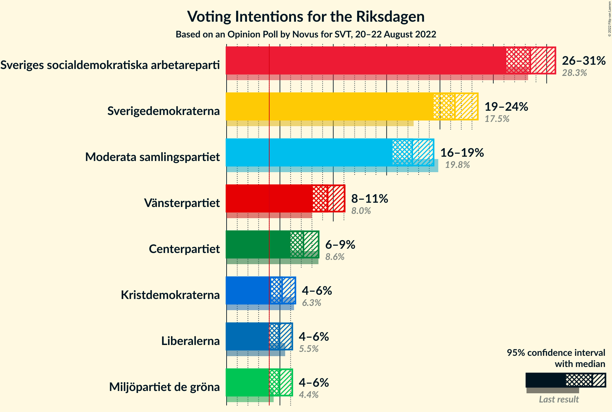
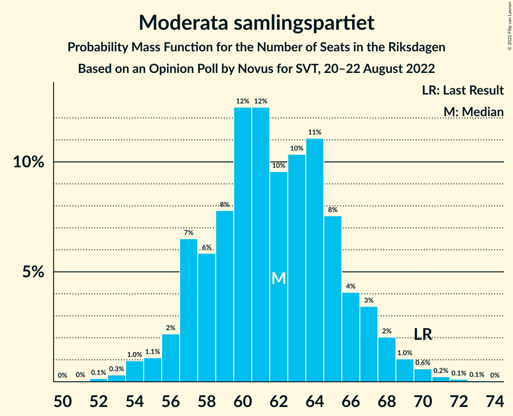
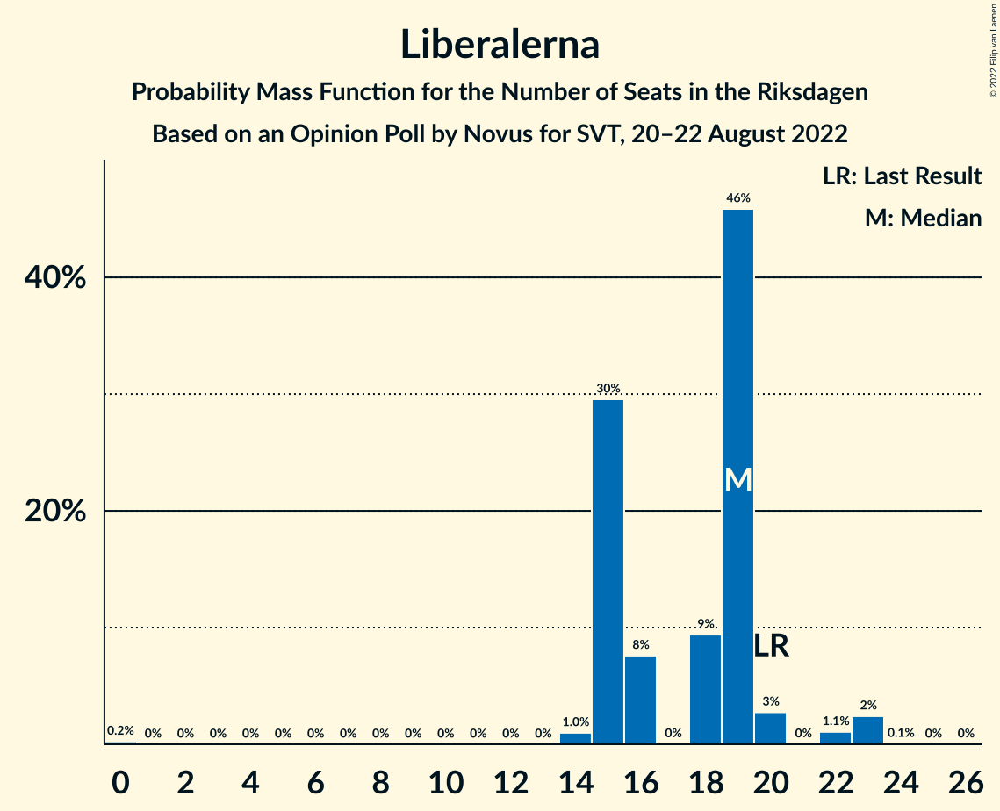

# Opinion Poll by Novus for SVT, 20–22 August 2022

<a href="#voting-intentions">Voting Intentions</a> | <a href="#seats">Seats</a> | <a href="#coalitions">Coalitions</a> | <a href="#technical-information">Technical Information</a>

## Voting Intentions

### Confidence Intervals

| Party | Last Result | Poll Result | 80% Confidence Interval | 90% Confidence Interval | 95% Confidence Interval | 99% Confidence Interval |
|:-----:|:-----------:|:-----------:|:-----------------------:|:-----------------------:|:-----------------------:|:-----------------------:|
| Sveriges socialdemokratiska arbetareparti | 28.3% | 28.5% | 27.0–30.0% |26.6–30.4% |26.2–30.8% |25.5–31.6% |
| Sverigedemokraterna | 17.5% | 21.4% | 20.1–22.8% |19.7–23.2% |19.4–23.5% |18.8–24.2% |
| Moderata samlingspartiet | 19.8% | 17.4% | 16.2–18.7% |15.9–19.1% |15.6–19.4% |15.0–20.1% |
| Vänsterpartiet | 8.0% | 9.5% | 8.6–10.5% |8.3–10.8% |8.1–11.1% |7.7–11.6% |
| Centerpartiet | 8.6% | 7.2% | 6.4–8.1% |6.2–8.4% |6.0–8.6% |5.6–9.1% |
| Kristdemokraterna | 6.3% | 5.2% | 4.5–6.0% |4.3–6.2% |4.2–6.4% |3.9–6.9% |
| Liberalerna | 5.5% | 4.9% | 4.3–5.7% |4.1–6.0% |3.9–6.2% |3.7–6.6% |
| Miljöpartiet de gröna | 4.4% | 4.9% | 4.3–5.7% |4.1–6.0% |3.9–6.2% |3.7–6.6% |

*Note:* The poll result column reflects the actual value used in the calculations. Published results may vary slightly, and in addition be rounded to fewer digits.

## Seats

### Confidence Intervals

| Party | Last Result | Median | 80% Confidence Interval | 90% Confidence Interval | 95% Confidence Interval | 99% Confidence Interval |
|:-----:|:-----------:|:------:|:-----------------------:|:-----------------------:|:-----------------------:|:-----------------------:|
| <a href="#sveriges-socialdemokratiska-arbetareparti">Sveriges socialdemokratiska arbetareparti</a> | 100 | 100 | 96–106 |95–107 |93–108 |91–111 |
| <a href="#sverigedemokraterna">Sverigedemokraterna</a> | 62 | 76 | 70–78 |69–79 |69–82 |68–85 |
| <a href="#moderata-samlingspartiet">Moderata samlingspartiet</a> | 70 | 62 | 57–66 |57–67 |55–68 |53–70 |
| <a href="#vänsterpartiet">Vänsterpartiet</a> | 28 | 34 | 31–37 |30–38 |29–39 |28–41 |
| <a href="#centerpartiet">Centerpartiet</a> | 31 | 25 | 23–28 |22–29 |21–30 |20–31 |
| <a href="#kristdemokraterna">Kristdemokraterna</a> | 22 | 18 | 16–21 |15–21 |15–22 |0–23 |
| <a href="#liberalerna">Liberalerna</a> | 20 | 19 | 15–19 |15–20 |15–22 |14–23 |
| <a href="#miljöpartiet-de-gröna">Miljöpartiet de gröna</a> | 16 | 17 | 15–20 |14–21 |0–22 |0–23 |

### Sveriges socialdemokratiska arbetareparti

*For a full overview of the results for this party, see the [Sveriges socialdemokratiska arbetareparti](party-sverigessocialdemokratiskaarbetareparti.html) page.*

| Number of Seats | Probability | Accumulated | Special Marks |
|:---------------:|:-----------:|:-----------:|:-------------:|
| 88 | 0.1% | 100% |  |
| 89 | 0.1% | 99.9% |  |
| 90 | 0.2% | 99.8% |  |
| 91 | 0.4% | 99.6% |  |
| 92 | 0.6% | 99.2% |  |
| 93 | 2% | 98.5% |  |
| 94 | 2% | 97% |  |
| 95 | 4% | 95% |  |
| 96 | 7% | 91% |  |
| 97 | 8% | 84% |  |
| 98 | 9% | 76% |  |
| 99 | 9% | 67% |  |
| 100 | 10% | 58% | Last Result, Median |
| 101 | 9% | 48% |  |
| 102 | 9% | 39% |  |
| 103 | 5% | 30% |  |
| 104 | 9% | 25% |  |
| 105 | 5% | 15% |  |
| 106 | 4% | 11% |  |
| 107 | 2% | 6% |  |
| 108 | 2% | 4% |  |
| 109 | 1.1% | 2% |  |
| 110 | 0.6% | 1.1% |  |
| 111 | 0.2% | 0.6% |  |
| 112 | 0.2% | 0.3% |  |
| 113 | 0.1% | 0.2% |  |
| 114 | 0% | 0.1% |  |
| 115 | 0% | 0.1% |  |
| 116 | 0% | 0% |  |

### Sverigedemokraterna

*For a full overview of the results for this party, see the [Sverigedemokraterna](party-sverigedemokraterna.html) page.*

| Number of Seats | Probability | Accumulated | Special Marks |
|:---------------:|:-----------:|:-----------:|:-------------:|
| 62 | 0% | 100% | Last Result |
| 63 | 0% | 100% |  |
| 64 | 0% | 100% |  |
| 65 | 0% | 99.9% |  |
| 66 | 0.1% | 99.9% |  |
| 67 | 0.2% | 99.8% |  |
| 68 | 2% | 99.6% |  |
| 69 | 4% | 98% |  |
| 70 | 6% | 94% |  |
| 71 | 7% | 88% |  |
| 72 | 4% | 81% |  |
| 73 | 3% | 78% |  |
| 74 | 3% | 75% |  |
| 75 | 16% | 72% |  |
| 76 | 23% | 55% | Median |
| 77 | 15% | 33% |  |
| 78 | 11% | 17% |  |
| 79 | 2% | 7% |  |
| 80 | 0.9% | 5% |  |
| 81 | 0.9% | 4% |  |
| 82 | 1.4% | 3% |  |
| 83 | 0.6% | 2% |  |
| 84 | 0.5% | 1.0% |  |
| 85 | 0.2% | 0.5% |  |
| 86 | 0.2% | 0.3% |  |
| 87 | 0% | 0.1% |  |
| 88 | 0.1% | 0.1% |  |
| 89 | 0% | 0% |  |

### Moderata samlingspartiet

*For a full overview of the results for this party, see the [Moderata samlingspartiet](party-moderatasamlingspartiet.html) page.*

| Number of Seats | Probability | Accumulated | Special Marks |
|:---------------:|:-----------:|:-----------:|:-------------:|
| 51 | 0% | 100% |  |
| 52 | 0.1% | 99.9% |  |
| 53 | 0.3% | 99.8% |  |
| 54 | 1.0% | 99.5% |  |
| 55 | 1.1% | 98.5% |  |
| 56 | 2% | 97% |  |
| 57 | 7% | 95% |  |
| 58 | 6% | 89% |  |
| 59 | 8% | 83% |  |
| 60 | 12% | 75% |  |
| 61 | 12% | 63% |  |
| 62 | 10% | 50% | Median |
| 63 | 10% | 41% |  |
| 64 | 11% | 30% |  |
| 65 | 8% | 19% |  |
| 66 | 4% | 12% |  |
| 67 | 3% | 8% |  |
| 68 | 2% | 4% |  |
| 69 | 1.0% | 2% |  |
| 70 | 0.6% | 1.0% | Last Result |
| 71 | 0.2% | 0.4% |  |
| 72 | 0.1% | 0.2% |  |
| 73 | 0.1% | 0.1% |  |
| 74 | 0% | 0% |  |

### Vänsterpartiet

*For a full overview of the results for this party, see the [Vänsterpartiet](party-vänsterpartiet.html) page.*

| Number of Seats | Probability | Accumulated | Special Marks |
|:---------------:|:-----------:|:-----------:|:-------------:|
| 26 | 0.1% | 100% |  |
| 27 | 0.3% | 99.9% |  |
| 28 | 1.3% | 99.5% | Last Result |
| 29 | 3% | 98% |  |
| 30 | 5% | 95% |  |
| 31 | 10% | 90% |  |
| 32 | 11% | 81% |  |
| 33 | 16% | 70% |  |
| 34 | 16% | 54% | Median |
| 35 | 17% | 38% |  |
| 36 | 8% | 21% |  |
| 37 | 5% | 12% |  |
| 38 | 4% | 7% |  |
| 39 | 2% | 4% |  |
| 40 | 0.8% | 1.4% |  |
| 41 | 0.4% | 0.5% |  |
| 42 | 0.1% | 0.1% |  |
| 43 | 0% | 0% |  |

### Centerpartiet

*For a full overview of the results for this party, see the [Centerpartiet](party-centerpartiet.html) page.*

| Number of Seats | Probability | Accumulated | Special Marks |
|:---------------:|:-----------:|:-----------:|:-------------:|
| 18 | 0% | 100% |  |
| 19 | 0.2% | 99.9% |  |
| 20 | 0.5% | 99.8% |  |
| 21 | 2% | 99.3% |  |
| 22 | 5% | 97% |  |
| 23 | 12% | 92% |  |
| 24 | 18% | 80% |  |
| 25 | 20% | 62% | Median |
| 26 | 16% | 42% |  |
| 27 | 12% | 26% |  |
| 28 | 6% | 14% |  |
| 29 | 5% | 8% |  |
| 30 | 3% | 4% |  |
| 31 | 0.6% | 1.0% | Last Result |
| 32 | 0.3% | 0.4% |  |
| 33 | 0.1% | 0.1% |  |
| 34 | 0% | 0% |  |

### Kristdemokraterna

*For a full overview of the results for this party, see the [Kristdemokraterna](party-kristdemokraterna.html) page.*

| Number of Seats | Probability | Accumulated | Special Marks |
|:---------------:|:-----------:|:-----------:|:-------------:|
| 0 | 0.8% | 100% |  |
| 1 | 0% | 99.2% |  |
| 2 | 0% | 99.2% |  |
| 3 | 0% | 99.2% |  |
| 4 | 0% | 99.2% |  |
| 5 | 0% | 99.2% |  |
| 6 | 0% | 99.2% |  |
| 7 | 0% | 99.2% |  |
| 8 | 0% | 99.2% |  |
| 9 | 0% | 99.2% |  |
| 10 | 0% | 99.2% |  |
| 11 | 0% | 99.2% |  |
| 12 | 0% | 99.2% |  |
| 13 | 0% | 99.2% |  |
| 14 | 0.5% | 99.2% |  |
| 15 | 5% | 98.7% |  |
| 16 | 13% | 93% |  |
| 17 | 15% | 80% |  |
| 18 | 20% | 65% | Median |
| 19 | 21% | 45% |  |
| 20 | 11% | 24% |  |
| 21 | 9% | 13% |  |
| 22 | 3% | 4% | Last Result |
| 23 | 1.0% | 1.4% |  |
| 24 | 0.2% | 0.4% |  |
| 25 | 0.1% | 0.1% |  |
| 26 | 0% | 0% |  |

### Liberalerna

*For a full overview of the results for this party, see the [Liberalerna](party-liberalerna.html) page.*

| Number of Seats | Probability | Accumulated | Special Marks |
|:---------------:|:-----------:|:-----------:|:-------------:|
| 0 | 0.2% | 100% |  |
| 1 | 0% | 99.8% |  |
| 2 | 0% | 99.8% |  |
| 3 | 0% | 99.8% |  |
| 4 | 0% | 99.8% |  |
| 5 | 0% | 99.8% |  |
| 6 | 0% | 99.8% |  |
| 7 | 0% | 99.8% |  |
| 8 | 0% | 99.8% |  |
| 9 | 0% | 99.8% |  |
| 10 | 0% | 99.8% |  |
| 11 | 0% | 99.8% |  |
| 12 | 0% | 99.8% |  |
| 13 | 0% | 99.8% |  |
| 14 | 1.0% | 99.8% |  |
| 15 | 30% | 98.8% |  |
| 16 | 8% | 69% |  |
| 17 | 0% | 62% |  |
| 18 | 9% | 62% |  |
| 19 | 46% | 52% | Median |
| 20 | 3% | 6% | Last Result |
| 21 | 0% | 4% |  |
| 22 | 1.1% | 4% |  |
| 23 | 2% | 2% |  |
| 24 | 0.1% | 0.1% |  |
| 25 | 0% | 0% |  |

### Miljöpartiet de gröna

*For a full overview of the results for this party, see the [Miljöpartiet de gröna](party-miljöpartietdegröna.html) page.*

| Number of Seats | Probability | Accumulated | Special Marks |
|:---------------:|:-----------:|:-----------:|:-------------:|
| 0 | 3% | 100% |  |
| 1 | 0% | 97% |  |
| 2 | 0% | 97% |  |
| 3 | 0% | 97% |  |
| 4 | 0% | 97% |  |
| 5 | 0% | 97% |  |
| 6 | 0% | 97% |  |
| 7 | 0% | 97% |  |
| 8 | 0% | 97% |  |
| 9 | 0% | 97% |  |
| 10 | 0% | 97% |  |
| 11 | 0% | 97% |  |
| 12 | 0% | 97% |  |
| 13 | 0% | 97% |  |
| 14 | 3% | 97% |  |
| 15 | 10% | 94% |  |
| 16 | 17% | 83% | Last Result |
| 17 | 20% | 66% | Median |
| 18 | 16% | 46% |  |
| 19 | 13% | 29% |  |
| 20 | 9% | 16% |  |
| 21 | 4% | 7% |  |
| 22 | 2% | 3% |  |
| 23 | 0.7% | 1.0% |  |
| 24 | 0.2% | 0.3% |  |
| 25 | 0.1% | 0.1% |  |
| 26 | 0% | 0% |  |

## Coalitions

### Confidence Intervals

| Coalition | Last Result | Median | Majority? | 80% Confidence Interval | 90% Confidence Interval | 95% Confidence Interval | 99% Confidence Interval |
|:---------:|:-----------:|:------:|:---------:|:-----------------------:|:-----------------------:|:-----------------------:|:-----------------------:|
| Sveriges socialdemokratiska arbetareparti – Vänsterpartiet – Centerpartiet – Liberalerna – Miljöpartiet de gröna | 195 | 194 | 100% | 189–200 | 187–202 | 185–203 | 181–206 |
| Sveriges socialdemokratiska arbetareparti – Moderata samlingspartiet – Centerpartiet | 201 | 187 | 99.9% | 182–193 | 181–196 | 179–197 | 176–202 |
| Sveriges socialdemokratiska arbetareparti – Moderata samlingspartiet | 170 | 162 | 0.5% | 158–167 | 157–169 | 155–170 | 152–175 |
| Sveriges socialdemokratiska arbetareparti – Centerpartiet – Liberalerna – Miljöpartiet de gröna | 167 | 160 | 0.2% | 155–166 | 153–168 | 151–170 | 145–173 |
| Sverigedemokraterna – Moderata samlingspartiet – Kristdemokraterna | 154 | 155 | 0% | 149–160 | 147–162 | 146–164 | 143–168 |
| Sveriges socialdemokratiska arbetareparti – Vänsterpartiet – Miljöpartiet de gröna | 144 | 152 | 0% | 146–156 | 144–158 | 142–159 | 137–162 |
| Sverigedemokraterna – Moderata samlingspartiet | 132 | 137 | 0% | 131–142 | 129–144 | 128–146 | 125–150 |
| Sveriges socialdemokratiska arbetareparti – Vänsterpartiet | 128 | 135 | 0% | 130–139 | 128–141 | 127–142 | 124–145 |
| Moderata samlingspartiet – Centerpartiet – Kristdemokraterna – Liberalerna | 143 | 122 | 0% | 118–129 | 115–130 | 114–132 | 109–135 |
| Sveriges socialdemokratiska arbetareparti – Miljöpartiet de gröna | 116 | 118 | 0% | 112–123 | 110–124 | 108–126 | 101–128 |
| Moderata samlingspartiet – Centerpartiet – Kristdemokraterna | 123 | 105 | 0% | 99–111 | 99–112 | 97–114 | 93–117 |
| Moderata samlingspartiet – Centerpartiet – Liberalerna | 121 | 104 | 0% | 99–110 | 98–112 | 96–113 | 93–116 |
| Moderata samlingspartiet – Centerpartiet | 101 | 87 | 0% | 82–92 | 80–94 | 80–95 | 77–98 |

### Sveriges socialdemokratiska arbetareparti – Vänsterpartiet – Centerpartiet – Liberalerna – Miljöpartiet de gröna

| Number of Seats | Probability | Accumulated | Special Marks |
|:---------------:|:-----------:|:-----------:|:-------------:|
| 176 | 0% | 100% |  |
| 177 | 0% | 99.9% |  |
| 178 | 0% | 99.9% |  |
| 179 | 0.1% | 99.9% |  |
| 180 | 0.2% | 99.8% |  |
| 181 | 0.2% | 99.5% |  |
| 182 | 0.4% | 99.3% |  |
| 183 | 0.3% | 99.0% |  |
| 184 | 0.6% | 98.7% |  |
| 185 | 1.3% | 98% |  |
| 186 | 2% | 97% |  |
| 187 | 2% | 95% |  |
| 188 | 3% | 93% |  |
| 189 | 4% | 90% |  |
| 190 | 7% | 86% |  |
| 191 | 8% | 80% |  |
| 192 | 7% | 72% |  |
| 193 | 10% | 65% |  |
| 194 | 11% | 55% |  |
| 195 | 8% | 44% | Last Result, Median |
| 196 | 7% | 36% |  |
| 197 | 7% | 29% |  |
| 198 | 7% | 22% |  |
| 199 | 4% | 15% |  |
| 200 | 4% | 11% |  |
| 201 | 2% | 7% |  |
| 202 | 2% | 5% |  |
| 203 | 1.3% | 3% |  |
| 204 | 0.5% | 2% |  |
| 205 | 0.5% | 1.1% |  |
| 206 | 0.2% | 0.6% |  |
| 207 | 0.2% | 0.4% |  |
| 208 | 0.1% | 0.2% |  |
| 209 | 0% | 0.1% |  |
| 210 | 0% | 0.1% |  |
| 211 | 0% | 0.1% |  |
| 212 | 0% | 0% |  |

### Sveriges socialdemokratiska arbetareparti – Moderata samlingspartiet – Centerpartiet

| Number of Seats | Probability | Accumulated | Special Marks |
|:---------------:|:-----------:|:-----------:|:-------------:|
| 174 | 0.1% | 100% |  |
| 175 | 0.1% | 99.9% | Majority |
| 176 | 0.4% | 99.8% |  |
| 177 | 0.5% | 99.4% |  |
| 178 | 0.6% | 98.9% |  |
| 179 | 0.9% | 98% |  |
| 180 | 2% | 97% |  |
| 181 | 3% | 95% |  |
| 182 | 4% | 93% |  |
| 183 | 6% | 88% |  |
| 184 | 9% | 83% |  |
| 185 | 8% | 74% |  |
| 186 | 10% | 66% |  |
| 187 | 9% | 56% | Median |
| 188 | 8% | 47% |  |
| 189 | 11% | 39% |  |
| 190 | 7% | 28% |  |
| 191 | 4% | 21% |  |
| 192 | 4% | 17% |  |
| 193 | 4% | 13% |  |
| 194 | 2% | 9% |  |
| 195 | 1.5% | 7% |  |
| 196 | 2% | 5% |  |
| 197 | 0.9% | 3% |  |
| 198 | 0.6% | 2% |  |
| 199 | 0.3% | 2% |  |
| 200 | 0.5% | 1.3% |  |
| 201 | 0.2% | 0.9% | Last Result |
| 202 | 0.4% | 0.7% |  |
| 203 | 0.1% | 0.3% |  |
| 204 | 0.1% | 0.2% |  |
| 205 | 0% | 0.2% |  |
| 206 | 0.1% | 0.1% |  |
| 207 | 0% | 0.1% |  |
| 208 | 0% | 0% |  |

### Sveriges socialdemokratiska arbetareparti – Moderata samlingspartiet

| Number of Seats | Probability | Accumulated | Special Marks |
|:---------------:|:-----------:|:-----------:|:-------------:|
| 147 | 0% | 100% |  |
| 148 | 0% | 99.9% |  |
| 149 | 0% | 99.9% |  |
| 150 | 0.1% | 99.9% |  |
| 151 | 0.1% | 99.8% |  |
| 152 | 0.2% | 99.7% |  |
| 153 | 0.5% | 99.5% |  |
| 154 | 0.5% | 99.0% |  |
| 155 | 2% | 98% |  |
| 156 | 2% | 97% |  |
| 157 | 4% | 95% |  |
| 158 | 5% | 91% |  |
| 159 | 8% | 86% |  |
| 160 | 10% | 78% |  |
| 161 | 15% | 68% |  |
| 162 | 9% | 53% | Median |
| 163 | 12% | 44% |  |
| 164 | 7% | 32% |  |
| 165 | 8% | 25% |  |
| 166 | 5% | 17% |  |
| 167 | 5% | 12% |  |
| 168 | 2% | 7% |  |
| 169 | 2% | 5% |  |
| 170 | 1.3% | 4% | Last Result |
| 171 | 0.9% | 2% |  |
| 172 | 0.3% | 1.4% |  |
| 173 | 0.2% | 1.1% |  |
| 174 | 0.3% | 0.8% |  |
| 175 | 0.2% | 0.5% | Majority |
| 176 | 0.3% | 0.4% |  |
| 177 | 0% | 0.1% |  |
| 178 | 0% | 0.1% |  |
| 179 | 0% | 0.1% |  |
| 180 | 0% | 0% |  |

### Sveriges socialdemokratiska arbetareparti – Centerpartiet – Liberalerna – Miljöpartiet de gröna

| Number of Seats | Probability | Accumulated | Special Marks |
|:---------------:|:-----------:|:-----------:|:-------------:|
| 139 | 0% | 100% |  |
| 140 | 0% | 99.9% |  |
| 141 | 0% | 99.9% |  |
| 142 | 0.1% | 99.9% |  |
| 143 | 0% | 99.9% |  |
| 144 | 0.1% | 99.8% |  |
| 145 | 0.3% | 99.7% |  |
| 146 | 0.1% | 99.5% |  |
| 147 | 0.3% | 99.4% |  |
| 148 | 0.3% | 99.1% |  |
| 149 | 0.4% | 98.7% |  |
| 150 | 0.6% | 98% |  |
| 151 | 1.1% | 98% |  |
| 152 | 1.0% | 97% |  |
| 153 | 3% | 96% |  |
| 154 | 3% | 93% |  |
| 155 | 4% | 90% |  |
| 156 | 7% | 86% |  |
| 157 | 5% | 79% |  |
| 158 | 8% | 73% |  |
| 159 | 10% | 65% |  |
| 160 | 7% | 55% |  |
| 161 | 8% | 48% | Median |
| 162 | 8% | 40% |  |
| 163 | 7% | 33% |  |
| 164 | 6% | 26% |  |
| 165 | 5% | 19% |  |
| 166 | 5% | 15% |  |
| 167 | 3% | 9% | Last Result |
| 168 | 2% | 7% |  |
| 169 | 1.3% | 4% |  |
| 170 | 1.3% | 3% |  |
| 171 | 0.8% | 2% |  |
| 172 | 0.4% | 1.0% |  |
| 173 | 0.3% | 0.6% |  |
| 174 | 0.2% | 0.3% |  |
| 175 | 0.1% | 0.2% | Majority |
| 176 | 0% | 0.1% |  |
| 177 | 0% | 0.1% |  |
| 178 | 0% | 0% |  |

### Sverigedemokraterna – Moderata samlingspartiet – Kristdemokraterna

| Number of Seats | Probability | Accumulated | Special Marks |
|:---------------:|:-----------:|:-----------:|:-------------:|
| 138 | 0% | 100% |  |
| 139 | 0% | 99.9% |  |
| 140 | 0% | 99.9% |  |
| 141 | 0.1% | 99.9% |  |
| 142 | 0.2% | 99.8% |  |
| 143 | 0.2% | 99.6% |  |
| 144 | 0.5% | 99.4% |  |
| 145 | 0.5% | 98.9% |  |
| 146 | 1.3% | 98% |  |
| 147 | 2% | 97% |  |
| 148 | 2% | 95% |  |
| 149 | 4% | 93% |  |
| 150 | 4% | 89% |  |
| 151 | 7% | 85% |  |
| 152 | 7% | 78% |  |
| 153 | 7% | 71% |  |
| 154 | 8% | 64% | Last Result |
| 155 | 11% | 56% |  |
| 156 | 10% | 45% | Median |
| 157 | 7% | 35% |  |
| 158 | 8% | 28% |  |
| 159 | 7% | 20% |  |
| 160 | 4% | 14% |  |
| 161 | 3% | 10% |  |
| 162 | 2% | 7% |  |
| 163 | 2% | 5% |  |
| 164 | 1.3% | 3% |  |
| 165 | 0.6% | 2% |  |
| 166 | 0.3% | 1.3% |  |
| 167 | 0.4% | 1.0% |  |
| 168 | 0.2% | 0.7% |  |
| 169 | 0.2% | 0.5% |  |
| 170 | 0.1% | 0.2% |  |
| 171 | 0% | 0.1% |  |
| 172 | 0% | 0.1% |  |
| 173 | 0% | 0.1% |  |
| 174 | 0% | 0% |  |

### Sveriges socialdemokratiska arbetareparti – Vänsterpartiet – Miljöpartiet de gröna

| Number of Seats | Probability | Accumulated | Special Marks |
|:---------------:|:-----------:|:-----------:|:-------------:|
| 133 | 0.1% | 100% |  |
| 134 | 0% | 99.9% |  |
| 135 | 0.1% | 99.9% |  |
| 136 | 0.2% | 99.8% |  |
| 137 | 0.1% | 99.5% |  |
| 138 | 0.3% | 99.5% |  |
| 139 | 0.1% | 99.1% |  |
| 140 | 0.7% | 99.0% |  |
| 141 | 0.5% | 98% |  |
| 142 | 0.5% | 98% |  |
| 143 | 1.5% | 97% |  |
| 144 | 1.4% | 96% | Last Result |
| 145 | 4% | 95% |  |
| 146 | 2% | 91% |  |
| 147 | 5% | 89% |  |
| 148 | 9% | 84% |  |
| 149 | 6% | 75% |  |
| 150 | 10% | 69% |  |
| 151 | 9% | 60% | Median |
| 152 | 12% | 50% |  |
| 153 | 10% | 39% |  |
| 154 | 8% | 28% |  |
| 155 | 7% | 20% |  |
| 156 | 4% | 13% |  |
| 157 | 4% | 9% |  |
| 158 | 2% | 5% |  |
| 159 | 2% | 3% |  |
| 160 | 0.6% | 2% |  |
| 161 | 0.4% | 1.0% |  |
| 162 | 0.3% | 0.5% |  |
| 163 | 0.1% | 0.3% |  |
| 164 | 0.1% | 0.2% |  |
| 165 | 0.1% | 0.1% |  |
| 166 | 0% | 0% |  |

### Sverigedemokraterna – Moderata samlingspartiet

| Number of Seats | Probability | Accumulated | Special Marks |
|:---------------:|:-----------:|:-----------:|:-------------:|
| 122 | 0% | 100% |  |
| 123 | 0.1% | 99.9% |  |
| 124 | 0.2% | 99.8% |  |
| 125 | 0.3% | 99.7% |  |
| 126 | 0.8% | 99.4% |  |
| 127 | 1.0% | 98.6% |  |
| 128 | 1.3% | 98% |  |
| 129 | 2% | 96% |  |
| 130 | 3% | 95% |  |
| 131 | 3% | 92% |  |
| 132 | 5% | 89% | Last Result |
| 133 | 7% | 84% |  |
| 134 | 9% | 77% |  |
| 135 | 7% | 68% |  |
| 136 | 6% | 61% |  |
| 137 | 13% | 55% |  |
| 138 | 7% | 42% | Median |
| 139 | 9% | 35% |  |
| 140 | 5% | 26% |  |
| 141 | 7% | 21% |  |
| 142 | 4% | 14% |  |
| 143 | 3% | 10% |  |
| 144 | 2% | 7% |  |
| 145 | 2% | 5% |  |
| 146 | 1.3% | 3% |  |
| 147 | 0.5% | 2% |  |
| 148 | 0.5% | 2% |  |
| 149 | 0.3% | 1.0% |  |
| 150 | 0.2% | 0.7% |  |
| 151 | 0.2% | 0.4% |  |
| 152 | 0.1% | 0.2% |  |
| 153 | 0.1% | 0.2% |  |
| 154 | 0% | 0.1% |  |
| 155 | 0% | 0.1% |  |
| 156 | 0% | 0% |  |

### Sveriges socialdemokratiska arbetareparti – Vänsterpartiet

| Number of Seats | Probability | Accumulated | Special Marks |
|:---------------:|:-----------:|:-----------:|:-------------:|
| 121 | 0% | 100% |  |
| 122 | 0% | 99.9% |  |
| 123 | 0.1% | 99.9% |  |
| 124 | 0.5% | 99.8% |  |
| 125 | 0.4% | 99.2% |  |
| 126 | 0.8% | 98.8% |  |
| 127 | 1.4% | 98% |  |
| 128 | 2% | 97% | Last Result |
| 129 | 4% | 94% |  |
| 130 | 7% | 90% |  |
| 131 | 8% | 83% |  |
| 132 | 8% | 75% |  |
| 133 | 8% | 67% |  |
| 134 | 8% | 58% | Median |
| 135 | 16% | 51% |  |
| 136 | 8% | 35% |  |
| 137 | 10% | 27% |  |
| 138 | 5% | 16% |  |
| 139 | 3% | 12% |  |
| 140 | 3% | 8% |  |
| 141 | 2% | 5% |  |
| 142 | 0.7% | 3% |  |
| 143 | 1.1% | 2% |  |
| 144 | 0.2% | 1.0% |  |
| 145 | 0.4% | 0.8% |  |
| 146 | 0.1% | 0.3% |  |
| 147 | 0.1% | 0.2% |  |
| 148 | 0% | 0.1% |  |
| 149 | 0% | 0.1% |  |
| 150 | 0% | 0.1% |  |
| 151 | 0% | 0% |  |

### Moderata samlingspartiet – Centerpartiet – Kristdemokraterna – Liberalerna

| Number of Seats | Probability | Accumulated | Special Marks |
|:---------------:|:-----------:|:-----------:|:-------------:|
| 103 | 0% | 100% |  |
| 104 | 0% | 99.9% |  |
| 105 | 0% | 99.9% |  |
| 106 | 0% | 99.9% |  |
| 107 | 0.1% | 99.8% |  |
| 108 | 0.1% | 99.8% |  |
| 109 | 0.2% | 99.7% |  |
| 110 | 0.2% | 99.5% |  |
| 111 | 0.3% | 99.3% |  |
| 112 | 0.5% | 99.0% |  |
| 113 | 0.5% | 98.5% |  |
| 114 | 1.0% | 98% |  |
| 115 | 3% | 97% |  |
| 116 | 2% | 94% |  |
| 117 | 2% | 92% |  |
| 118 | 9% | 90% |  |
| 119 | 7% | 81% |  |
| 120 | 4% | 73% |  |
| 121 | 7% | 70% |  |
| 122 | 17% | 62% |  |
| 123 | 3% | 45% |  |
| 124 | 6% | 42% | Median |
| 125 | 10% | 36% |  |
| 126 | 7% | 26% |  |
| 127 | 5% | 19% |  |
| 128 | 3% | 14% |  |
| 129 | 4% | 11% |  |
| 130 | 2% | 7% |  |
| 131 | 2% | 5% |  |
| 132 | 0.6% | 3% |  |
| 133 | 1.2% | 2% |  |
| 134 | 0.5% | 1.2% |  |
| 135 | 0.3% | 0.8% |  |
| 136 | 0.2% | 0.4% |  |
| 137 | 0.1% | 0.2% |  |
| 138 | 0.1% | 0.1% |  |
| 139 | 0% | 0.1% |  |
| 140 | 0% | 0% |  |
| 141 | 0% | 0% |  |
| 142 | 0% | 0% |  |
| 143 | 0% | 0% | Last Result |

### Sveriges socialdemokratiska arbetareparti – Miljöpartiet de gröna

| Number of Seats | Probability | Accumulated | Special Marks |
|:---------------:|:-----------:|:-----------:|:-------------:|
| 97 | 0% | 100% |  |
| 98 | 0.1% | 99.9% |  |
| 99 | 0.2% | 99.9% |  |
| 100 | 0.1% | 99.7% |  |
| 101 | 0.2% | 99.6% |  |
| 102 | 0.2% | 99.5% |  |
| 103 | 0.2% | 99.2% |  |
| 104 | 0.2% | 99.0% |  |
| 105 | 0.3% | 98.8% |  |
| 106 | 0.4% | 98.5% |  |
| 107 | 0.3% | 98% |  |
| 108 | 0.8% | 98% |  |
| 109 | 1.3% | 97% |  |
| 110 | 2% | 96% |  |
| 111 | 2% | 94% |  |
| 112 | 3% | 92% |  |
| 113 | 6% | 89% |  |
| 114 | 7% | 84% |  |
| 115 | 6% | 76% |  |
| 116 | 10% | 70% | Last Result |
| 117 | 7% | 60% | Median |
| 118 | 10% | 53% |  |
| 119 | 9% | 43% |  |
| 120 | 9% | 34% |  |
| 121 | 6% | 24% |  |
| 122 | 6% | 18% |  |
| 123 | 4% | 12% |  |
| 124 | 3% | 8% |  |
| 125 | 2% | 5% |  |
| 126 | 1.3% | 3% |  |
| 127 | 0.9% | 2% |  |
| 128 | 0.4% | 0.9% |  |
| 129 | 0.2% | 0.5% |  |
| 130 | 0.1% | 0.2% |  |
| 131 | 0.1% | 0.1% |  |
| 132 | 0% | 0.1% |  |
| 133 | 0% | 0% |  |

### Moderata samlingspartiet – Centerpartiet – Kristdemokraterna

| Number of Seats | Probability | Accumulated | Special Marks |
|:---------------:|:-----------:|:-----------:|:-------------:|
| 85 | 0% | 100% |  |
| 86 | 0% | 99.9% |  |
| 87 | 0% | 99.9% |  |
| 88 | 0.1% | 99.9% |  |
| 89 | 0% | 99.8% |  |
| 90 | 0% | 99.8% |  |
| 91 | 0.1% | 99.7% |  |
| 92 | 0.1% | 99.7% |  |
| 93 | 0.2% | 99.6% |  |
| 94 | 0.2% | 99.4% |  |
| 95 | 0.6% | 99.1% |  |
| 96 | 0.9% | 98.5% |  |
| 97 | 0.8% | 98% |  |
| 98 | 1.0% | 97% |  |
| 99 | 6% | 96% |  |
| 100 | 5% | 90% |  |
| 101 | 3% | 85% |  |
| 102 | 5% | 82% |  |
| 103 | 16% | 77% |  |
| 104 | 8% | 60% |  |
| 105 | 5% | 52% | Median |
| 106 | 9% | 47% |  |
| 107 | 13% | 38% |  |
| 108 | 5% | 25% |  |
| 109 | 3% | 20% |  |
| 110 | 5% | 16% |  |
| 111 | 4% | 12% |  |
| 112 | 3% | 7% |  |
| 113 | 1.3% | 5% |  |
| 114 | 1.4% | 3% |  |
| 115 | 0.7% | 2% |  |
| 116 | 0.6% | 1.2% |  |
| 117 | 0.3% | 0.6% |  |
| 118 | 0.2% | 0.4% |  |
| 119 | 0.1% | 0.2% |  |
| 120 | 0% | 0.1% |  |
| 121 | 0% | 0.1% |  |
| 122 | 0% | 0% |  |
| 123 | 0% | 0% | Last Result |

### Moderata samlingspartiet – Centerpartiet – Liberalerna

| Number of Seats | Probability | Accumulated | Special Marks |
|:---------------:|:-----------:|:-----------:|:-------------:|
| 88 | 0% | 100% |  |
| 89 | 0% | 99.9% |  |
| 90 | 0% | 99.9% |  |
| 91 | 0.1% | 99.9% |  |
| 92 | 0.1% | 99.8% |  |
| 93 | 0.3% | 99.7% |  |
| 94 | 0.4% | 99.4% |  |
| 95 | 0.9% | 99.1% |  |
| 96 | 1.2% | 98% |  |
| 97 | 2% | 97% |  |
| 98 | 3% | 95% |  |
| 99 | 6% | 92% |  |
| 100 | 6% | 86% |  |
| 101 | 5% | 80% |  |
| 102 | 10% | 75% |  |
| 103 | 7% | 65% |  |
| 104 | 10% | 58% |  |
| 105 | 7% | 48% |  |
| 106 | 6% | 40% | Median |
| 107 | 7% | 34% |  |
| 108 | 7% | 27% |  |
| 109 | 8% | 20% |  |
| 110 | 3% | 12% |  |
| 111 | 3% | 9% |  |
| 112 | 1.4% | 5% |  |
| 113 | 2% | 4% |  |
| 114 | 0.7% | 2% |  |
| 115 | 0.6% | 2% |  |
| 116 | 0.6% | 1.0% |  |
| 117 | 0.3% | 0.4% |  |
| 118 | 0.1% | 0.2% |  |
| 119 | 0% | 0.1% |  |
| 120 | 0% | 0.1% |  |
| 121 | 0% | 0% | Last Result |

### Moderata samlingspartiet – Centerpartiet

| Number of Seats | Probability | Accumulated | Special Marks |
|:---------------:|:-----------:|:-----------:|:-------------:|
| 74 | 0% | 100% |  |
| 75 | 0.1% | 99.9% |  |
| 76 | 0.2% | 99.9% |  |
| 77 | 0.5% | 99.7% |  |
| 78 | 0.8% | 99.2% |  |
| 79 | 0.9% | 98% |  |
| 80 | 3% | 98% |  |
| 81 | 3% | 94% |  |
| 82 | 6% | 92% |  |
| 83 | 7% | 86% |  |
| 84 | 5% | 79% |  |
| 85 | 13% | 74% |  |
| 86 | 6% | 61% |  |
| 87 | 11% | 55% | Median |
| 88 | 9% | 44% |  |
| 89 | 9% | 35% |  |
| 90 | 8% | 26% |  |
| 91 | 4% | 18% |  |
| 92 | 5% | 13% |  |
| 93 | 3% | 9% |  |
| 94 | 3% | 6% |  |
| 95 | 1.4% | 3% |  |
| 96 | 0.7% | 2% |  |
| 97 | 0.7% | 1.3% |  |
| 98 | 0.3% | 0.6% |  |
| 99 | 0.1% | 0.3% |  |
| 100 | 0.1% | 0.2% |  |
| 101 | 0.1% | 0.1% | Last Result |
| 102 | 0% | 0% |  |

## Technical Information

### Opinion Poll

+ **Polling firm:** Novus
+ **Commissioner(s):** SVT
+ **Fieldwork period:** 20–22 August 2022

### Calculations

+ **Sample size:** 1500
+ **Simulations done:** 1,048,576
+ **Error estimate:** 1.31%

