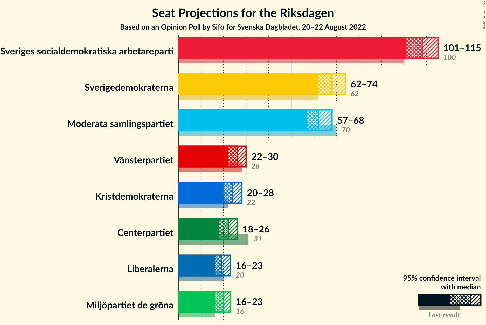

# Opinion Poll by Sifo for Svenska Dagbladet, 20–22 August 2022

<a href="#voting-intentions">Voting Intentions</a> | <a href="#seats">Seats</a> | <a href="#coalitions">Coalitions</a> | <a href="#technical-information">Technical Information</a>

## Voting Intentions

### Confidence Intervals

| Party | Last Result | Poll Result | 80% Confidence Interval | 90% Confidence Interval | 95% Confidence Interval | 99% Confidence Interval |
|:-----:|:-----------:|:-----------:|:-----------------------:|:-----------------------:|:-----------------------:|:-----------------------:|
| Sveriges socialdemokratiska arbetareparti | 28.3% | 30.2% | 29.0–31.5% |28.6–31.9% |28.3–32.2% |27.7–32.8% |
| Sverigedemokraterna | 17.5% | 19.0% | 18.0–20.1% |17.7–20.4% |17.4–20.7% |16.9–21.2% |
| Moderata samlingspartiet | 19.8% | 17.4% | 16.4–18.5% |16.1–18.8% |15.9–19.1% |15.4–19.6% |
| Vänsterpartiet | 8.0% | 7.2% | 6.5–8.0% |6.3–8.2% |6.2–8.4% |5.9–8.7% |
| Kristdemokraterna | 6.3% | 6.7% | 6.1–7.4% |5.9–7.7% |5.7–7.8% |5.4–8.2% |
| Centerpartiet | 8.6% | 6.1% | 5.5–6.8% |5.3–7.0% |5.2–7.2% |4.9–7.5% |
| Miljöpartiet de gröna | 4.4% | 5.5% | 4.9–6.2% |4.8–6.4% |4.6–6.6% |4.4–6.9% |
| Liberalerna | 5.5% | 5.4% | 4.8–6.1% |4.6–6.2% |4.5–6.4% |4.2–6.8% |

*Note:* The poll result column reflects the actual value used in the calculations. Published results may vary slightly, and in addition be rounded to fewer digits.

## Seats

### Confidence Intervals

| Party | Last Result | Median | 80% Confidence Interval | 90% Confidence Interval | 95% Confidence Interval | 99% Confidence Interval |
|:-----:|:-----------:|:------:|:-----------------------:|:-----------------------:|:-----------------------:|:-----------------------:|
| <a href="#sveriges-socialdemokratiska-arbetareparti">Sveriges socialdemokratiska arbetareparti</a> | 100 | 108 | 104–112 |102–114 |101–115 |99–117 |
| <a href="#sverigedemokraterna">Sverigedemokraterna</a> | 62 | 68 | 64–72 |63–73 |62–74 |61–75 |
| <a href="#moderata-samlingspartiet">Moderata samlingspartiet</a> | 70 | 62 | 58–66 |58–67 |57–68 |55–70 |
| <a href="#vänsterpartiet">Vänsterpartiet</a> | 28 | 26 | 23–28 |23–29 |22–30 |21–31 |
| <a href="#kristdemokraterna">Kristdemokraterna</a> | 22 | 24 | 21–26 |21–27 |20–28 |19–29 |
| <a href="#centerpartiet">Centerpartiet</a> | 31 | 22 | 19–24 |19–25 |18–26 |17–27 |
| <a href="#miljöpartiet-de-gröna">Miljöpartiet de gröna</a> | 16 | 20 | 18–22 |17–23 |16–23 |16–25 |
| <a href="#liberalerna">Liberalerna</a> | 20 | 19 | 17–22 |17–22 |16–23 |15–24 |

### Sveriges socialdemokratiska arbetareparti

*For a full overview of the results for this party, see the [Sveriges socialdemokratiska arbetareparti](party-sverigessocialdemokratiskaarbetareparti.html) page.*

| Number of Seats | Probability | Accumulated | Special Marks |
|:---------------:|:-----------:|:-----------:|:-------------:|
| 97 | 0.1% | 100% |  |
| 98 | 0.2% | 99.9% |  |
| 99 | 0.5% | 99.7% |  |
| 100 | 0.9% | 99.2% | Last Result |
| 101 | 2% | 98% |  |
| 102 | 2% | 96% |  |
| 103 | 4% | 94% |  |
| 104 | 9% | 90% |  |
| 105 | 6% | 82% |  |
| 106 | 11% | 76% |  |
| 107 | 12% | 65% |  |
| 108 | 15% | 53% | Median |
| 109 | 9% | 38% |  |
| 110 | 9% | 29% |  |
| 111 | 7% | 21% |  |
| 112 | 5% | 14% |  |
| 113 | 4% | 9% |  |
| 114 | 2% | 5% |  |
| 115 | 1.4% | 3% |  |
| 116 | 0.7% | 1.3% |  |
| 117 | 0.2% | 0.6% |  |
| 118 | 0.2% | 0.3% |  |
| 119 | 0.1% | 0.1% |  |
| 120 | 0% | 0.1% |  |
| 121 | 0% | 0% |  |

### Sverigedemokraterna

*For a full overview of the results for this party, see the [Sverigedemokraterna](party-sverigedemokraterna.html) page.*

| Number of Seats | Probability | Accumulated | Special Marks |
|:---------------:|:-----------:|:-----------:|:-------------:|
| 58 | 0% | 100% |  |
| 59 | 0.1% | 99.9% |  |
| 60 | 0.3% | 99.9% |  |
| 61 | 0.9% | 99.5% |  |
| 62 | 2% | 98.6% | Last Result |
| 63 | 4% | 97% |  |
| 64 | 6% | 93% |  |
| 65 | 7% | 87% |  |
| 66 | 9% | 80% |  |
| 67 | 17% | 71% |  |
| 68 | 13% | 54% | Median |
| 69 | 16% | 41% |  |
| 70 | 8% | 25% |  |
| 71 | 7% | 17% |  |
| 72 | 4% | 11% |  |
| 73 | 2% | 6% |  |
| 74 | 2% | 4% |  |
| 75 | 0.8% | 1.3% |  |
| 76 | 0.3% | 0.5% |  |
| 77 | 0.1% | 0.2% |  |
| 78 | 0.1% | 0.1% |  |
| 79 | 0% | 0% |  |

### Moderata samlingspartiet

*For a full overview of the results for this party, see the [Moderata samlingspartiet](party-moderatasamlingspartiet.html) page.*

| Number of Seats | Probability | Accumulated | Special Marks |
|:---------------:|:-----------:|:-----------:|:-------------:|
| 53 | 0% | 100% |  |
| 54 | 0.2% | 99.9% |  |
| 55 | 0.4% | 99.7% |  |
| 56 | 1.0% | 99.2% |  |
| 57 | 2% | 98% |  |
| 58 | 7% | 97% |  |
| 59 | 3% | 90% |  |
| 60 | 12% | 87% |  |
| 61 | 10% | 74% |  |
| 62 | 17% | 65% | Median |
| 63 | 7% | 47% |  |
| 64 | 22% | 40% |  |
| 65 | 5% | 19% |  |
| 66 | 8% | 14% |  |
| 67 | 3% | 6% |  |
| 68 | 1.3% | 3% |  |
| 69 | 0.9% | 2% |  |
| 70 | 0.4% | 0.6% | Last Result |
| 71 | 0.2% | 0.2% |  |
| 72 | 0% | 0.1% |  |
| 73 | 0% | 0% |  |

### Vänsterpartiet

*For a full overview of the results for this party, see the [Vänsterpartiet](party-vänsterpartiet.html) page.*

| Number of Seats | Probability | Accumulated | Special Marks |
|:---------------:|:-----------:|:-----------:|:-------------:|
| 20 | 0.2% | 100% |  |
| 21 | 0.9% | 99.8% |  |
| 22 | 3% | 99.0% |  |
| 23 | 8% | 96% |  |
| 24 | 10% | 88% |  |
| 25 | 19% | 78% |  |
| 26 | 21% | 59% | Median |
| 27 | 16% | 37% |  |
| 28 | 12% | 21% | Last Result |
| 29 | 5% | 9% |  |
| 30 | 2% | 4% |  |
| 31 | 0.9% | 1.2% |  |
| 32 | 0.2% | 0.3% |  |
| 33 | 0.1% | 0.1% |  |
| 34 | 0% | 0% |  |

### Kristdemokraterna

*For a full overview of the results for this party, see the [Kristdemokraterna](party-kristdemokraterna.html) page.*

| Number of Seats | Probability | Accumulated | Special Marks |
|:---------------:|:-----------:|:-----------:|:-------------:|
| 18 | 0.1% | 100% |  |
| 19 | 0.6% | 99.9% |  |
| 20 | 2% | 99.3% |  |
| 21 | 8% | 97% |  |
| 22 | 11% | 89% | Last Result |
| 23 | 19% | 79% |  |
| 24 | 24% | 60% | Median |
| 25 | 13% | 36% |  |
| 26 | 13% | 22% |  |
| 27 | 5% | 9% |  |
| 28 | 2% | 4% |  |
| 29 | 0.9% | 1.2% |  |
| 30 | 0.2% | 0.3% |  |
| 31 | 0.1% | 0.1% |  |
| 32 | 0% | 0% |  |

### Centerpartiet

*For a full overview of the results for this party, see the [Centerpartiet](party-centerpartiet.html) page.*

| Number of Seats | Probability | Accumulated | Special Marks |
|:---------------:|:-----------:|:-----------:|:-------------:|
| 16 | 0.1% | 100% |  |
| 17 | 0.6% | 99.9% |  |
| 18 | 2% | 99.4% |  |
| 19 | 8% | 97% |  |
| 20 | 12% | 90% |  |
| 21 | 21% | 78% |  |
| 22 | 17% | 57% | Median |
| 23 | 20% | 40% |  |
| 24 | 11% | 20% |  |
| 25 | 6% | 9% |  |
| 26 | 2% | 3% |  |
| 27 | 0.7% | 1.0% |  |
| 28 | 0.2% | 0.2% |  |
| 29 | 0% | 0% |  |
| 30 | 0% | 0% |  |
| 31 | 0% | 0% | Last Result |

### Miljöpartiet de gröna

*For a full overview of the results for this party, see the [Miljöpartiet de gröna](party-miljöpartietdegröna.html) page.*

| Number of Seats | Probability | Accumulated | Special Marks |
|:---------------:|:-----------:|:-----------:|:-------------:|
| 15 | 0.3% | 100% |  |
| 16 | 2% | 99.6% | Last Result |
| 17 | 6% | 97% |  |
| 18 | 14% | 91% |  |
| 19 | 17% | 77% |  |
| 20 | 27% | 60% | Median |
| 21 | 16% | 33% |  |
| 22 | 10% | 18% |  |
| 23 | 5% | 8% |  |
| 24 | 2% | 2% |  |
| 25 | 0.4% | 0.6% |  |
| 26 | 0.1% | 0.1% |  |
| 27 | 0% | 0% |  |

### Liberalerna

*For a full overview of the results for this party, see the [Liberalerna](party-liberalerna.html) page.*

| Number of Seats | Probability | Accumulated | Special Marks |
|:---------------:|:-----------:|:-----------:|:-------------:|
| 0 | 0.1% | 100% |  |
| 1 | 0% | 99.9% |  |
| 2 | 0% | 99.9% |  |
| 3 | 0% | 99.9% |  |
| 4 | 0% | 99.9% |  |
| 5 | 0% | 99.9% |  |
| 6 | 0% | 99.9% |  |
| 7 | 0% | 99.9% |  |
| 8 | 0% | 99.9% |  |
| 9 | 0% | 99.9% |  |
| 10 | 0% | 99.9% |  |
| 11 | 0% | 99.9% |  |
| 12 | 0% | 99.9% |  |
| 13 | 0% | 99.9% |  |
| 14 | 0.1% | 99.9% |  |
| 15 | 0.8% | 99.8% |  |
| 16 | 3% | 99.1% |  |
| 17 | 10% | 96% |  |
| 18 | 18% | 86% |  |
| 19 | 25% | 68% | Median |
| 20 | 17% | 42% | Last Result |
| 21 | 14% | 25% |  |
| 22 | 7% | 11% |  |
| 23 | 3% | 4% |  |
| 24 | 0.9% | 1.2% |  |
| 25 | 0.2% | 0.3% |  |
| 26 | 0% | 0% |  |

## Coalitions

### Confidence Intervals

| Coalition | Last Result | Median | Majority? | 80% Confidence Interval | 90% Confidence Interval | 95% Confidence Interval | 99% Confidence Interval |
|:---------:|:-----------:|:------:|:---------:|:-----------------------:|:-----------------------:|:-----------------------:|:-----------------------:|
| Sveriges socialdemokratiska arbetareparti – Vänsterpartiet – Centerpartiet – Miljöpartiet de gröna – Liberalerna | 195 | 195 | 100% | 190–199 | 188–201 | 188–202 | 185–204 |
| Sveriges socialdemokratiska arbetareparti – Moderata samlingspartiet – Centerpartiet | 201 | 192 | 100% | 187–197 | 186–198 | 185–199 | 182–202 |
| Sveriges socialdemokratiska arbetareparti – Moderata samlingspartiet | 170 | 170 | 11% | 166–175 | 164–177 | 163–177 | 160–180 |
| Sveriges socialdemokratiska arbetareparti – Centerpartiet – Miljöpartiet de gröna – Liberalerna | 167 | 169 | 6% | 164–174 | 163–175 | 161–176 | 159–178 |
| Sverigedemokraterna – Moderata samlingspartiet – Kristdemokraterna | 154 | 154 | 0% | 150–159 | 148–161 | 147–161 | 145–164 |
| Sveriges socialdemokratiska arbetareparti – Vänsterpartiet – Miljöpartiet de gröna | 144 | 153 | 0% | 148–158 | 147–159 | 146–161 | 144–163 |
| Sveriges socialdemokratiska arbetareparti – Vänsterpartiet | 128 | 134 | 0% | 128–138 | 128–140 | 127–141 | 124–143 |
| Sverigedemokraterna – Moderata samlingspartiet | 132 | 131 | 0% | 126–135 | 125–136 | 123–138 | 121–140 |
| Moderata samlingspartiet – Kristdemokraterna – Centerpartiet – Liberalerna | 143 | 128 | 0% | 123–132 | 122–133 | 121–135 | 118–137 |
| Sveriges socialdemokratiska arbetareparti – Miljöpartiet de gröna | 116 | 128 | 0% | 123–132 | 122–133 | 120–134 | 118–137 |
| Moderata samlingspartiet – Kristdemokraterna – Centerpartiet | 123 | 109 | 0% | 104–112 | 103–114 | 102–116 | 99–117 |
| Moderata samlingspartiet – Centerpartiet – Liberalerna | 121 | 104 | 0% | 99–108 | 98–109 | 97–110 | 95–112 |
| Moderata samlingspartiet – Centerpartiet | 101 | 85 | 0% | 80–88 | 79–89 | 78–90 | 76–93 |

### Sveriges socialdemokratiska arbetareparti – Vänsterpartiet – Centerpartiet – Miljöpartiet de gröna – Liberalerna

| Number of Seats | Probability | Accumulated | Special Marks |
|:---------------:|:-----------:|:-----------:|:-------------:|
| 182 | 0.1% | 100% |  |
| 183 | 0.1% | 99.9% |  |
| 184 | 0.1% | 99.8% |  |
| 185 | 0.4% | 99.7% |  |
| 186 | 0.5% | 99.4% |  |
| 187 | 1.2% | 98.9% |  |
| 188 | 3% | 98% |  |
| 189 | 4% | 95% |  |
| 190 | 4% | 91% |  |
| 191 | 7% | 87% |  |
| 192 | 7% | 80% |  |
| 193 | 7% | 73% |  |
| 194 | 11% | 66% |  |
| 195 | 11% | 54% | Last Result, Median |
| 196 | 10% | 43% |  |
| 197 | 8% | 33% |  |
| 198 | 9% | 25% |  |
| 199 | 8% | 16% |  |
| 200 | 3% | 9% |  |
| 201 | 2% | 6% |  |
| 202 | 2% | 4% |  |
| 203 | 0.6% | 2% |  |
| 204 | 0.5% | 1.0% |  |
| 205 | 0.2% | 0.4% |  |
| 206 | 0.1% | 0.2% |  |
| 207 | 0.1% | 0.1% |  |
| 208 | 0% | 0% |  |

### Sveriges socialdemokratiska arbetareparti – Moderata samlingspartiet – Centerpartiet

| Number of Seats | Probability | Accumulated | Special Marks |
|:---------------:|:-----------:|:-----------:|:-------------:|
| 179 | 0% | 100% |  |
| 180 | 0% | 99.9% |  |
| 181 | 0.1% | 99.9% |  |
| 182 | 0.3% | 99.8% |  |
| 183 | 0.5% | 99.5% |  |
| 184 | 1.0% | 99.0% |  |
| 185 | 2% | 98% |  |
| 186 | 3% | 96% |  |
| 187 | 4% | 93% |  |
| 188 | 6% | 89% |  |
| 189 | 8% | 83% |  |
| 190 | 7% | 75% |  |
| 191 | 13% | 68% |  |
| 192 | 8% | 55% | Median |
| 193 | 11% | 47% |  |
| 194 | 8% | 36% |  |
| 195 | 11% | 27% |  |
| 196 | 4% | 16% |  |
| 197 | 4% | 12% |  |
| 198 | 3% | 7% |  |
| 199 | 2% | 4% |  |
| 200 | 0.8% | 2% |  |
| 201 | 0.6% | 1.3% | Last Result |
| 202 | 0.3% | 0.7% |  |
| 203 | 0.2% | 0.4% |  |
| 204 | 0.1% | 0.2% |  |
| 205 | 0% | 0.1% |  |
| 206 | 0% | 0% |  |

### Sveriges socialdemokratiska arbetareparti – Moderata samlingspartiet

| Number of Seats | Probability | Accumulated | Special Marks |
|:---------------:|:-----------:|:-----------:|:-------------:|
| 158 | 0.1% | 100% |  |
| 159 | 0.1% | 99.9% |  |
| 160 | 0.3% | 99.7% |  |
| 161 | 0.3% | 99.4% |  |
| 162 | 1.2% | 99.2% |  |
| 163 | 2% | 98% |  |
| 164 | 2% | 96% |  |
| 165 | 3% | 93% |  |
| 166 | 5% | 91% |  |
| 167 | 9% | 85% |  |
| 168 | 14% | 76% |  |
| 169 | 6% | 63% |  |
| 170 | 9% | 57% | Last Result, Median |
| 171 | 9% | 48% |  |
| 172 | 15% | 39% |  |
| 173 | 10% | 24% |  |
| 174 | 3% | 15% |  |
| 175 | 3% | 11% | Majority |
| 176 | 3% | 9% |  |
| 177 | 3% | 6% |  |
| 178 | 1.3% | 2% |  |
| 179 | 0.4% | 1.0% |  |
| 180 | 0.3% | 0.6% |  |
| 181 | 0.2% | 0.4% |  |
| 182 | 0.1% | 0.1% |  |
| 183 | 0% | 0.1% |  |
| 184 | 0% | 0% |  |

### Sveriges socialdemokratiska arbetareparti – Centerpartiet – Miljöpartiet de gröna – Liberalerna

| Number of Seats | Probability | Accumulated | Special Marks |
|:---------------:|:-----------:|:-----------:|:-------------:|
| 156 | 0% | 100% |  |
| 157 | 0.1% | 99.9% |  |
| 158 | 0.2% | 99.9% |  |
| 159 | 0.4% | 99.7% |  |
| 160 | 0.5% | 99.4% |  |
| 161 | 2% | 98.9% |  |
| 162 | 2% | 97% |  |
| 163 | 2% | 95% |  |
| 164 | 6% | 93% |  |
| 165 | 4% | 87% |  |
| 166 | 10% | 83% |  |
| 167 | 9% | 73% | Last Result |
| 168 | 7% | 63% |  |
| 169 | 16% | 56% | Median |
| 170 | 6% | 41% |  |
| 171 | 11% | 34% |  |
| 172 | 6% | 23% |  |
| 173 | 4% | 17% |  |
| 174 | 7% | 13% |  |
| 175 | 2% | 6% | Majority |
| 176 | 2% | 4% |  |
| 177 | 1.0% | 2% |  |
| 178 | 0.6% | 1.1% |  |
| 179 | 0.2% | 0.4% |  |
| 180 | 0.1% | 0.2% |  |
| 181 | 0.1% | 0.1% |  |
| 182 | 0% | 0% |  |

### Sverigedemokraterna – Moderata samlingspartiet – Kristdemokraterna

| Number of Seats | Probability | Accumulated | Special Marks |
|:---------------:|:-----------:|:-----------:|:-------------:|
| 142 | 0.1% | 100% |  |
| 143 | 0.1% | 99.9% |  |
| 144 | 0.2% | 99.8% |  |
| 145 | 0.5% | 99.6% |  |
| 146 | 0.6% | 99.0% |  |
| 147 | 2% | 98% |  |
| 148 | 2% | 96% |  |
| 149 | 3% | 94% |  |
| 150 | 8% | 91% |  |
| 151 | 9% | 84% |  |
| 152 | 8% | 75% |  |
| 153 | 10% | 67% |  |
| 154 | 11% | 57% | Last Result, Median |
| 155 | 11% | 46% |  |
| 156 | 7% | 34% |  |
| 157 | 7% | 27% |  |
| 158 | 7% | 20% |  |
| 159 | 4% | 13% |  |
| 160 | 4% | 9% |  |
| 161 | 3% | 5% |  |
| 162 | 1.2% | 2% |  |
| 163 | 0.5% | 1.1% |  |
| 164 | 0.4% | 0.6% |  |
| 165 | 0.1% | 0.3% |  |
| 166 | 0.1% | 0.2% |  |
| 167 | 0.1% | 0.1% |  |
| 168 | 0% | 0% |  |

### Sveriges socialdemokratiska arbetareparti – Vänsterpartiet – Miljöpartiet de gröna

| Number of Seats | Probability | Accumulated | Special Marks |
|:---------------:|:-----------:|:-----------:|:-------------:|
| 141 | 0.1% | 100% |  |
| 142 | 0.1% | 99.9% |  |
| 143 | 0.3% | 99.8% |  |
| 144 | 0.5% | 99.6% | Last Result |
| 145 | 0.6% | 99.1% |  |
| 146 | 2% | 98% |  |
| 147 | 3% | 97% |  |
| 148 | 4% | 94% |  |
| 149 | 4% | 90% |  |
| 150 | 4% | 86% |  |
| 151 | 9% | 81% |  |
| 152 | 10% | 72% |  |
| 153 | 13% | 63% |  |
| 154 | 13% | 49% | Median |
| 155 | 6% | 36% |  |
| 156 | 5% | 30% |  |
| 157 | 9% | 25% |  |
| 158 | 8% | 16% |  |
| 159 | 4% | 8% |  |
| 160 | 0.9% | 4% |  |
| 161 | 2% | 3% |  |
| 162 | 0.6% | 1.4% |  |
| 163 | 0.4% | 0.8% |  |
| 164 | 0.2% | 0.4% |  |
| 165 | 0.1% | 0.1% |  |
| 166 | 0% | 0.1% |  |
| 167 | 0% | 0% |  |

### Sveriges socialdemokratiska arbetareparti – Vänsterpartiet

| Number of Seats | Probability | Accumulated | Special Marks |
|:---------------:|:-----------:|:-----------:|:-------------:|
| 122 | 0.1% | 100% |  |
| 123 | 0.1% | 99.9% |  |
| 124 | 0.4% | 99.8% |  |
| 125 | 0.8% | 99.4% |  |
| 126 | 1.0% | 98.6% |  |
| 127 | 2% | 98% |  |
| 128 | 6% | 96% | Last Result |
| 129 | 3% | 90% |  |
| 130 | 4% | 87% |  |
| 131 | 12% | 84% |  |
| 132 | 8% | 72% |  |
| 133 | 7% | 64% |  |
| 134 | 19% | 57% | Median |
| 135 | 9% | 38% |  |
| 136 | 6% | 29% |  |
| 137 | 10% | 23% |  |
| 138 | 4% | 13% |  |
| 139 | 3% | 9% |  |
| 140 | 2% | 5% |  |
| 141 | 2% | 4% |  |
| 142 | 0.8% | 2% |  |
| 143 | 0.3% | 0.7% |  |
| 144 | 0.2% | 0.4% |  |
| 145 | 0.2% | 0.2% |  |
| 146 | 0% | 0.1% |  |
| 147 | 0% | 0% |  |

### Sverigedemokraterna – Moderata samlingspartiet

| Number of Seats | Probability | Accumulated | Special Marks |
|:---------------:|:-----------:|:-----------:|:-------------:|
| 118 | 0.1% | 100% |  |
| 119 | 0.1% | 99.9% |  |
| 120 | 0.2% | 99.8% |  |
| 121 | 0.2% | 99.6% |  |
| 122 | 0.9% | 99.5% |  |
| 123 | 2% | 98.5% |  |
| 124 | 2% | 97% |  |
| 125 | 4% | 95% |  |
| 126 | 9% | 91% |  |
| 127 | 7% | 82% |  |
| 128 | 6% | 75% |  |
| 129 | 7% | 69% |  |
| 130 | 11% | 62% | Median |
| 131 | 16% | 50% |  |
| 132 | 8% | 34% | Last Result |
| 133 | 8% | 26% |  |
| 134 | 8% | 18% |  |
| 135 | 3% | 10% |  |
| 136 | 2% | 7% |  |
| 137 | 2% | 5% |  |
| 138 | 2% | 3% |  |
| 139 | 0.6% | 1.3% |  |
| 140 | 0.5% | 0.8% |  |
| 141 | 0.1% | 0.2% |  |
| 142 | 0% | 0.1% |  |
| 143 | 0% | 0% |  |

### Moderata samlingspartiet – Kristdemokraterna – Centerpartiet – Liberalerna

| Number of Seats | Probability | Accumulated | Special Marks |
|:---------------:|:-----------:|:-----------:|:-------------:|
| 115 | 0% | 100% |  |
| 116 | 0.1% | 99.9% |  |
| 117 | 0.1% | 99.9% |  |
| 118 | 0.3% | 99.7% |  |
| 119 | 0.7% | 99.4% |  |
| 120 | 1.0% | 98.7% |  |
| 121 | 1.3% | 98% |  |
| 122 | 3% | 96% |  |
| 123 | 7% | 93% |  |
| 124 | 4% | 86% |  |
| 125 | 9% | 82% |  |
| 126 | 11% | 73% |  |
| 127 | 6% | 62% | Median |
| 128 | 18% | 55% |  |
| 129 | 9% | 37% |  |
| 130 | 8% | 28% |  |
| 131 | 6% | 20% |  |
| 132 | 5% | 14% |  |
| 133 | 4% | 9% |  |
| 134 | 2% | 5% |  |
| 135 | 2% | 3% |  |
| 136 | 0.9% | 1.5% |  |
| 137 | 0.3% | 0.6% |  |
| 138 | 0.2% | 0.3% |  |
| 139 | 0.1% | 0.1% |  |
| 140 | 0% | 0% |  |
| 141 | 0% | 0% |  |
| 142 | 0% | 0% |  |
| 143 | 0% | 0% | Last Result |

### Sveriges socialdemokratiska arbetareparti – Miljöpartiet de gröna

| Number of Seats | Probability | Accumulated | Special Marks |
|:---------------:|:-----------:|:-----------:|:-------------:|
| 116 | 0.1% | 100% | Last Result |
| 117 | 0.2% | 99.9% |  |
| 118 | 0.3% | 99.7% |  |
| 119 | 0.7% | 99.4% |  |
| 120 | 1.4% | 98.7% |  |
| 121 | 2% | 97% |  |
| 122 | 4% | 96% |  |
| 123 | 4% | 92% |  |
| 124 | 10% | 88% |  |
| 125 | 8% | 78% |  |
| 126 | 7% | 70% |  |
| 127 | 9% | 63% |  |
| 128 | 17% | 54% | Median |
| 129 | 6% | 37% |  |
| 130 | 9% | 31% |  |
| 131 | 7% | 22% |  |
| 132 | 5% | 15% |  |
| 133 | 5% | 10% |  |
| 134 | 2% | 5% |  |
| 135 | 1.0% | 2% |  |
| 136 | 0.7% | 1.5% |  |
| 137 | 0.4% | 0.8% |  |
| 138 | 0.2% | 0.3% |  |
| 139 | 0.1% | 0.2% |  |
| 140 | 0% | 0.1% |  |
| 141 | 0% | 0% |  |

### Moderata samlingspartiet – Kristdemokraterna – Centerpartiet

| Number of Seats | Probability | Accumulated | Special Marks |
|:---------------:|:-----------:|:-----------:|:-------------:|
| 97 | 0.1% | 100% |  |
| 98 | 0.3% | 99.9% |  |
| 99 | 0.3% | 99.7% |  |
| 100 | 0.4% | 99.4% |  |
| 101 | 1.0% | 99.0% |  |
| 102 | 3% | 98% |  |
| 103 | 3% | 95% |  |
| 104 | 8% | 93% |  |
| 105 | 9% | 85% |  |
| 106 | 8% | 76% |  |
| 107 | 7% | 68% |  |
| 108 | 9% | 61% | Median |
| 109 | 12% | 51% |  |
| 110 | 15% | 40% |  |
| 111 | 9% | 24% |  |
| 112 | 5% | 15% |  |
| 113 | 4% | 10% |  |
| 114 | 2% | 6% |  |
| 115 | 1.2% | 4% |  |
| 116 | 2% | 3% |  |
| 117 | 0.6% | 1.0% |  |
| 118 | 0.3% | 0.4% |  |
| 119 | 0.1% | 0.2% |  |
| 120 | 0% | 0.1% |  |
| 121 | 0% | 0% |  |
| 122 | 0% | 0% |  |
| 123 | 0% | 0% | Last Result |

### Moderata samlingspartiet – Centerpartiet – Liberalerna

| Number of Seats | Probability | Accumulated | Special Marks |
|:---------------:|:-----------:|:-----------:|:-------------:|
| 90 | 0% | 100% |  |
| 91 | 0% | 99.9% |  |
| 92 | 0% | 99.9% |  |
| 93 | 0.1% | 99.9% |  |
| 94 | 0.2% | 99.8% |  |
| 95 | 0.3% | 99.6% |  |
| 96 | 0.6% | 99.3% |  |
| 97 | 2% | 98.7% |  |
| 98 | 3% | 96% |  |
| 99 | 5% | 94% |  |
| 100 | 5% | 88% |  |
| 101 | 6% | 83% |  |
| 102 | 12% | 77% |  |
| 103 | 11% | 65% | Median |
| 104 | 15% | 54% |  |
| 105 | 15% | 39% |  |
| 106 | 6% | 24% |  |
| 107 | 5% | 18% |  |
| 108 | 5% | 13% |  |
| 109 | 4% | 8% |  |
| 110 | 3% | 4% |  |
| 111 | 0.8% | 2% |  |
| 112 | 0.6% | 0.9% |  |
| 113 | 0.2% | 0.4% |  |
| 114 | 0.1% | 0.2% |  |
| 115 | 0.1% | 0.1% |  |
| 116 | 0% | 0% |  |
| 117 | 0% | 0% |  |
| 118 | 0% | 0% |  |
| 119 | 0% | 0% |  |
| 120 | 0% | 0% |  |
| 121 | 0% | 0% | Last Result |

### Moderata samlingspartiet – Centerpartiet

| Number of Seats | Probability | Accumulated | Special Marks |
|:---------------:|:-----------:|:-----------:|:-------------:|
| 74 | 0.1% | 100% |  |
| 75 | 0.2% | 99.9% |  |
| 76 | 0.4% | 99.7% |  |
| 77 | 0.6% | 99.3% |  |
| 78 | 1.4% | 98.6% |  |
| 79 | 4% | 97% |  |
| 80 | 5% | 93% |  |
| 81 | 8% | 88% |  |
| 82 | 10% | 80% |  |
| 83 | 9% | 71% |  |
| 84 | 12% | 62% | Median |
| 85 | 14% | 50% |  |
| 86 | 10% | 36% |  |
| 87 | 10% | 26% |  |
| 88 | 6% | 15% |  |
| 89 | 4% | 9% |  |
| 90 | 2% | 5% |  |
| 91 | 1.5% | 2% |  |
| 92 | 0.5% | 1.0% |  |
| 93 | 0.3% | 0.5% |  |
| 94 | 0.1% | 0.2% |  |
| 95 | 0.1% | 0.1% |  |
| 96 | 0% | 0% |  |
| 97 | 0% | 0% |  |
| 98 | 0% | 0% |  |
| 99 | 0% | 0% |  |
| 100 | 0% | 0% |  |
| 101 | 0% | 0% | Last Result |

## Technical Information

### Opinion Poll

+ **Polling firm:** Sifo
+ **Commissioner(s):** Svenska Dagbladet
+ **Fieldwork period:** 20–22 August 2022

### Calculations

+ **Sample size:** 2194
+ **Simulations done:** 1,048,576
+ **Error estimate:** 0.61%

