# Opinion Poll by Novus for SVT, 21–23 August 2022

<a href="#voting-intentions">Voting Intentions</a> | <a href="#seats">Seats</a> | <a href="#coalitions">Coalitions</a> | <a href="#technical-information">Technical Information</a>

## Voting Intentions

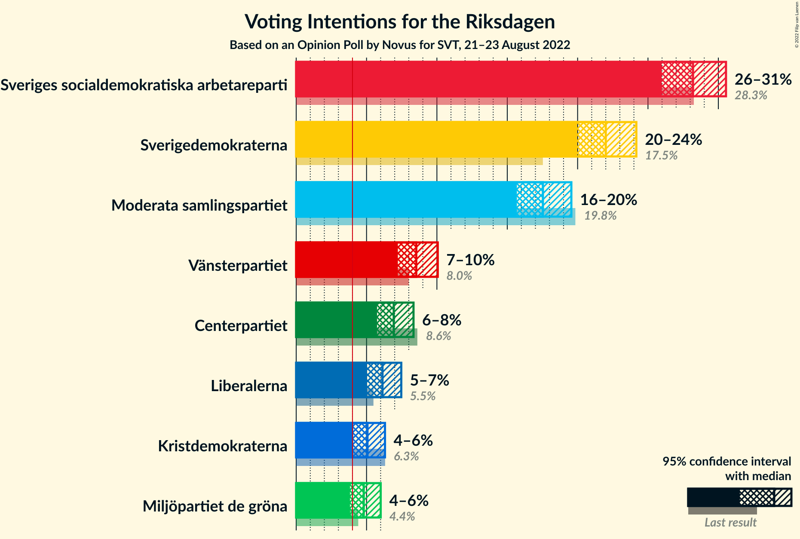

### Confidence Intervals

| Party | Last Result | Poll Result | 80% Confidence Interval | 90% Confidence Interval | 95% Confidence Interval | 99% Confidence Interval |
|:-----:|:-----------:|:-----------:|:-----------------------:|:-----------------------:|:-----------------------:|:-----------------------:|
| Sveriges socialdemokratiska arbetareparti | 28.3% | 28.2% | 26.7–29.7% |26.3–30.2% |26.0–30.5% |25.3–31.3% |
| Sverigedemokraterna | 17.5% | 22.0% | 20.7–23.4% |20.3–23.8% |20.0–24.2% |19.3–24.9% |
| Moderata samlingspartiet | 19.8% | 17.5% | 16.3–18.9% |16.0–19.2% |15.7–19.6% |15.1–20.2% |
| Vänsterpartiet | 8.0% | 8.5% | 7.7–9.5% |7.4–9.8% |7.2–10.1% |6.8–10.6% |
| Centerpartiet | 8.6% | 6.9% | 6.2–7.8% |5.9–8.1% |5.7–8.3% |5.4–8.8% |
| Liberalerna | 5.5% | 6.1% | 5.4–7.0% |5.2–7.3% |5.0–7.5% |4.7–7.9% |
| Kristdemokraterna | 6.3% | 5.1% | 4.4–5.9% |4.2–6.1% |4.1–6.3% |3.8–6.7% |
| Miljöpartiet de gröna | 4.4% | 4.8% | 4.2–5.6% |4.0–5.8% |3.8–6.0% |3.5–6.4% |

*Note:* The poll result column reflects the actual value used in the calculations. Published results may vary slightly, and in addition be rounded to fewer digits.

## Seats

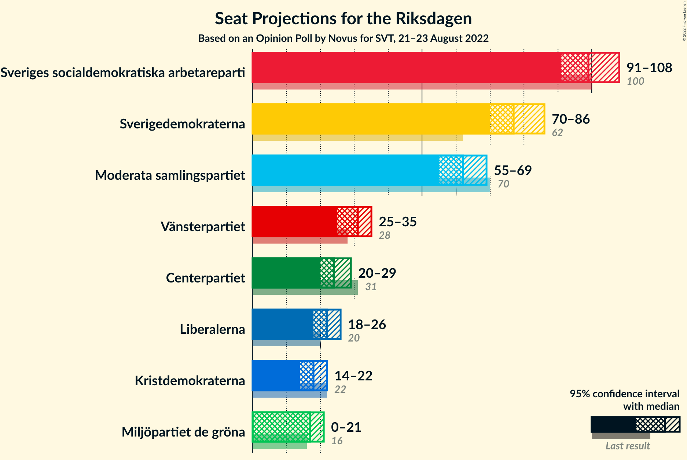

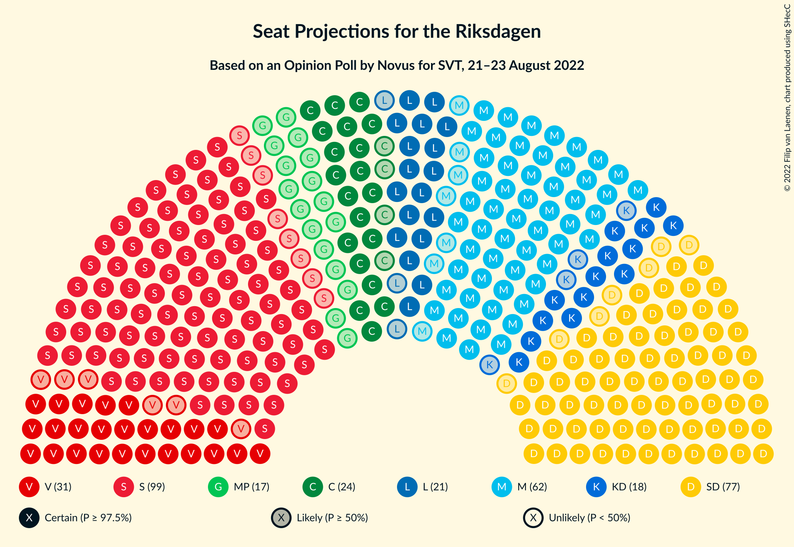

### Confidence Intervals

| Party | Last Result | Median | 80% Confidence Interval | 90% Confidence Interval | 95% Confidence Interval | 99% Confidence Interval |
|:-----:|:-----------:|:------:|:-----------------------:|:-----------------------:|:-----------------------:|:-----------------------:|
| <a href="#sveriges-socialdemokratiska-arbetareparti">Sveriges socialdemokratiska arbetareparti</a> | 100 | 99 | 93–105 |92–106 |91–108 |89–112 |
| <a href="#sverigedemokraterna">Sverigedemokraterna</a> | 62 | 77 | 73–82 |71–84 |70–86 |68–88 |
| <a href="#moderata-samlingspartiet">Moderata samlingspartiet</a> | 70 | 62 | 57–66 |56–68 |55–69 |53–71 |
| <a href="#vänsterpartiet">Vänsterpartiet</a> | 28 | 31 | 27–33 |26–35 |25–35 |24–37 |
| <a href="#centerpartiet">Centerpartiet</a> | 31 | 24 | 21–28 |21–28 |20–29 |19–31 |
| <a href="#liberalerna">Liberalerna</a> | 20 | 22 | 19–25 |18–26 |18–26 |17–28 |
| <a href="#kristdemokraterna">Kristdemokraterna</a> | 22 | 18 | 15–21 |15–21 |14–22 |0–23 |
| <a href="#miljöpartiet-de-gröna">Miljöpartiet de gröna</a> | 16 | 17 | 15–20 |0–20 |0–21 |0–22 |

### Sveriges socialdemokratiska arbetareparti

*For a full overview of the results for this party, see the [Sveriges socialdemokratiska arbetareparti](party-sverigessocialdemokratiskaarbetareparti.html) page.*

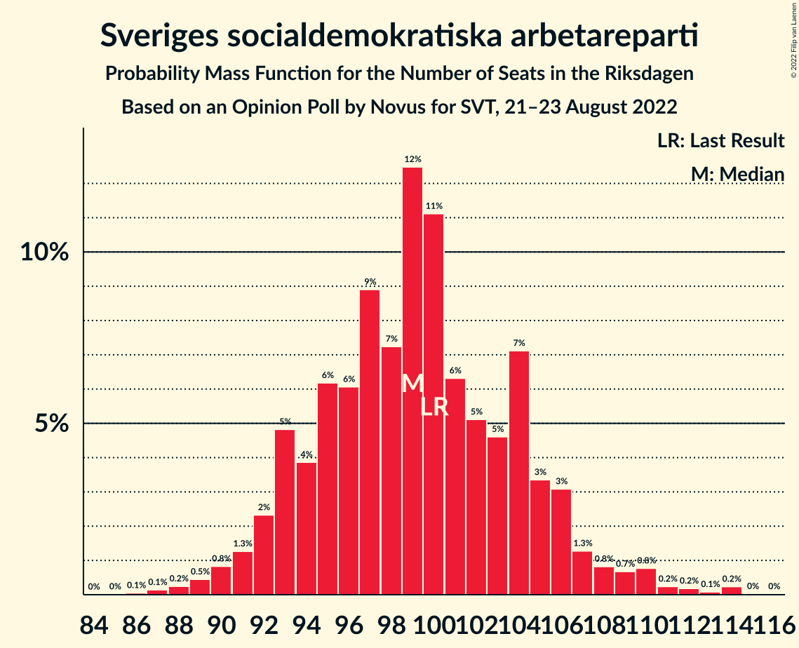

| Number of Seats | Probability | Accumulated | Special Marks |
|:---------------:|:-----------:|:-----------:|:-------------:|
| 86 | 0.1% | 100% |  |
| 87 | 0.1% | 99.9% |  |
| 88 | 0.2% | 99.8% |  |
| 89 | 0.5% | 99.5% |  |
| 90 | 0.8% | 99.1% |  |
| 91 | 1.3% | 98% |  |
| 92 | 2% | 97% |  |
| 93 | 5% | 95% |  |
| 94 | 4% | 90% |  |
| 95 | 6% | 86% |  |
| 96 | 6% | 80% |  |
| 97 | 9% | 74% |  |
| 98 | 7% | 65% |  |
| 99 | 12% | 58% | Median |
| 100 | 11% | 45% | Last Result |
| 101 | 6% | 34% |  |
| 102 | 5% | 28% |  |
| 103 | 5% | 23% |  |
| 104 | 7% | 18% |  |
| 105 | 3% | 11% |  |
| 106 | 3% | 7% |  |
| 107 | 1.3% | 4% |  |
| 108 | 0.8% | 3% |  |
| 109 | 0.7% | 2% |  |
| 110 | 0.8% | 2% |  |
| 111 | 0.2% | 0.8% |  |
| 112 | 0.2% | 0.6% |  |
| 113 | 0.1% | 0.4% |  |
| 114 | 0.2% | 0.3% |  |
| 115 | 0% | 0.1% |  |
| 116 | 0% | 0% |  |

### Sverigedemokraterna

*For a full overview of the results for this party, see the [Sverigedemokraterna](party-sverigedemokraterna.html) page.*

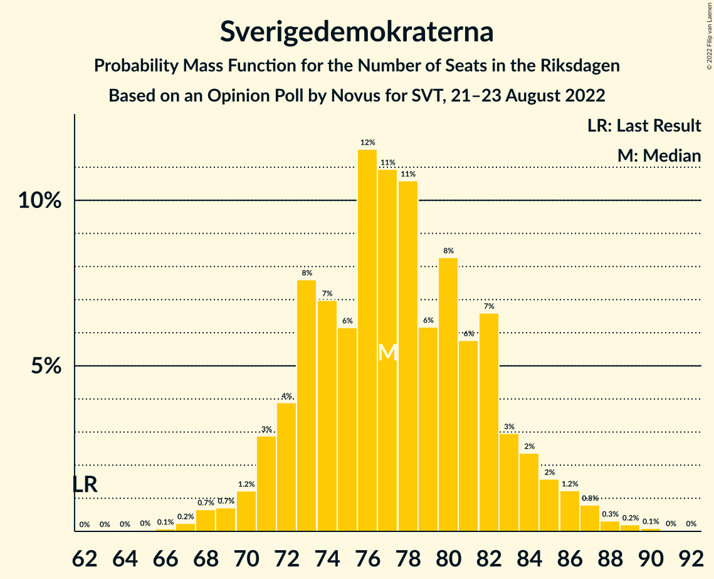

| Number of Seats | Probability | Accumulated | Special Marks |
|:---------------:|:-----------:|:-----------:|:-------------:|
| 62 | 0% | 100% | Last Result |
| 63 | 0% | 100% |  |
| 64 | 0% | 100% |  |
| 65 | 0% | 100% |  |
| 66 | 0.1% | 99.9% |  |
| 67 | 0.2% | 99.9% |  |
| 68 | 0.7% | 99.6% |  |
| 69 | 0.7% | 99.0% |  |
| 70 | 1.2% | 98% |  |
| 71 | 3% | 97% |  |
| 72 | 4% | 94% |  |
| 73 | 8% | 90% |  |
| 74 | 7% | 83% |  |
| 75 | 6% | 76% |  |
| 76 | 12% | 70% |  |
| 77 | 11% | 58% | Median |
| 78 | 11% | 47% |  |
| 79 | 6% | 36% |  |
| 80 | 8% | 30% |  |
| 81 | 6% | 22% |  |
| 82 | 7% | 16% |  |
| 83 | 3% | 10% |  |
| 84 | 2% | 7% |  |
| 85 | 2% | 4% |  |
| 86 | 1.2% | 3% |  |
| 87 | 0.8% | 1.5% |  |
| 88 | 0.3% | 0.7% |  |
| 89 | 0.2% | 0.4% |  |
| 90 | 0.1% | 0.2% |  |
| 91 | 0% | 0.1% |  |
| 92 | 0% | 0% |  |

### Moderata samlingspartiet

*For a full overview of the results for this party, see the [Moderata samlingspartiet](party-moderatasamlingspartiet.html) page.*

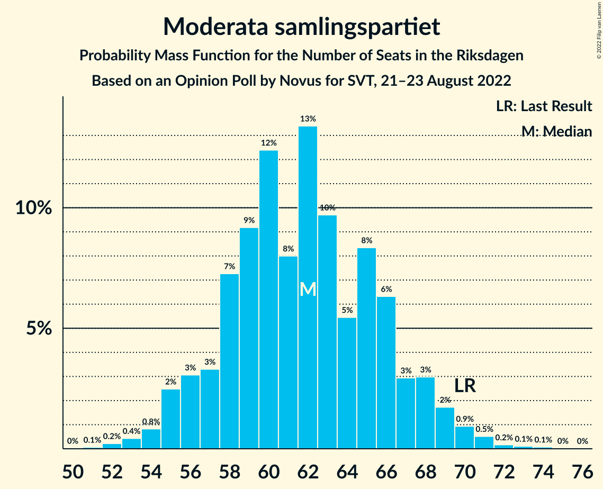

| Number of Seats | Probability | Accumulated | Special Marks |
|:---------------:|:-----------:|:-----------:|:-------------:|
| 51 | 0.1% | 100% |  |
| 52 | 0.2% | 99.9% |  |
| 53 | 0.4% | 99.7% |  |
| 54 | 0.8% | 99.2% |  |
| 55 | 2% | 98% |  |
| 56 | 3% | 96% |  |
| 57 | 3% | 93% |  |
| 58 | 7% | 90% |  |
| 59 | 9% | 82% |  |
| 60 | 12% | 73% |  |
| 61 | 8% | 61% |  |
| 62 | 13% | 53% | Median |
| 63 | 10% | 39% |  |
| 64 | 5% | 30% |  |
| 65 | 8% | 24% |  |
| 66 | 6% | 16% |  |
| 67 | 3% | 10% |  |
| 68 | 3% | 7% |  |
| 69 | 2% | 4% |  |
| 70 | 0.9% | 2% | Last Result |
| 71 | 0.5% | 0.9% |  |
| 72 | 0.2% | 0.4% |  |
| 73 | 0.1% | 0.2% |  |
| 74 | 0.1% | 0.1% |  |
| 75 | 0% | 0% |  |

### Vänsterpartiet

*For a full overview of the results for this party, see the [Vänsterpartiet](party-vänsterpartiet.html) page.*

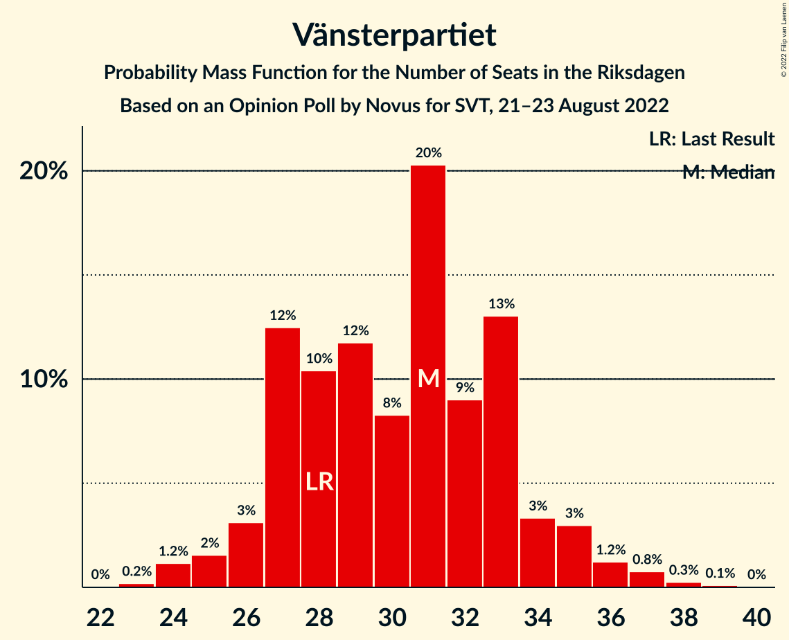

| Number of Seats | Probability | Accumulated | Special Marks |
|:---------------:|:-----------:|:-----------:|:-------------:|
| 23 | 0.2% | 100% |  |
| 24 | 1.2% | 99.8% |  |
| 25 | 2% | 98.6% |  |
| 26 | 3% | 97% |  |
| 27 | 12% | 94% |  |
| 28 | 10% | 81% | Last Result |
| 29 | 12% | 71% |  |
| 30 | 8% | 59% |  |
| 31 | 20% | 51% | Median |
| 32 | 9% | 31% |  |
| 33 | 13% | 22% |  |
| 34 | 3% | 9% |  |
| 35 | 3% | 5% |  |
| 36 | 1.2% | 2% |  |
| 37 | 0.8% | 1.2% |  |
| 38 | 0.3% | 0.4% |  |
| 39 | 0.1% | 0.1% |  |
| 40 | 0% | 0% |  |

### Centerpartiet

*For a full overview of the results for this party, see the [Centerpartiet](party-centerpartiet.html) page.*

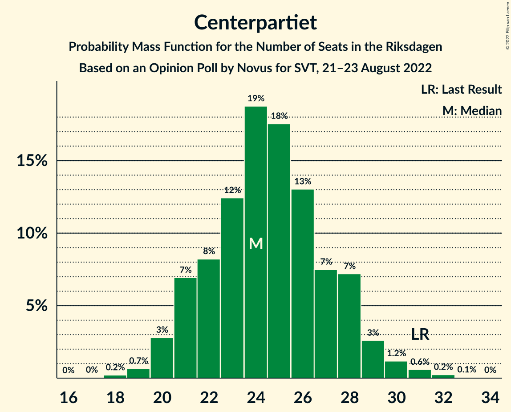

| Number of Seats | Probability | Accumulated | Special Marks |
|:---------------:|:-----------:|:-----------:|:-------------:|
| 18 | 0.2% | 100% |  |
| 19 | 0.7% | 99.7% |  |
| 20 | 3% | 99.1% |  |
| 21 | 7% | 96% |  |
| 22 | 8% | 89% |  |
| 23 | 12% | 81% |  |
| 24 | 19% | 69% | Median |
| 25 | 18% | 50% |  |
| 26 | 13% | 32% |  |
| 27 | 7% | 19% |  |
| 28 | 7% | 12% |  |
| 29 | 3% | 5% |  |
| 30 | 1.2% | 2% |  |
| 31 | 0.6% | 0.9% | Last Result |
| 32 | 0.2% | 0.3% |  |
| 33 | 0.1% | 0.1% |  |
| 34 | 0% | 0% |  |

### Liberalerna

*For a full overview of the results for this party, see the [Liberalerna](party-liberalerna.html) page.*

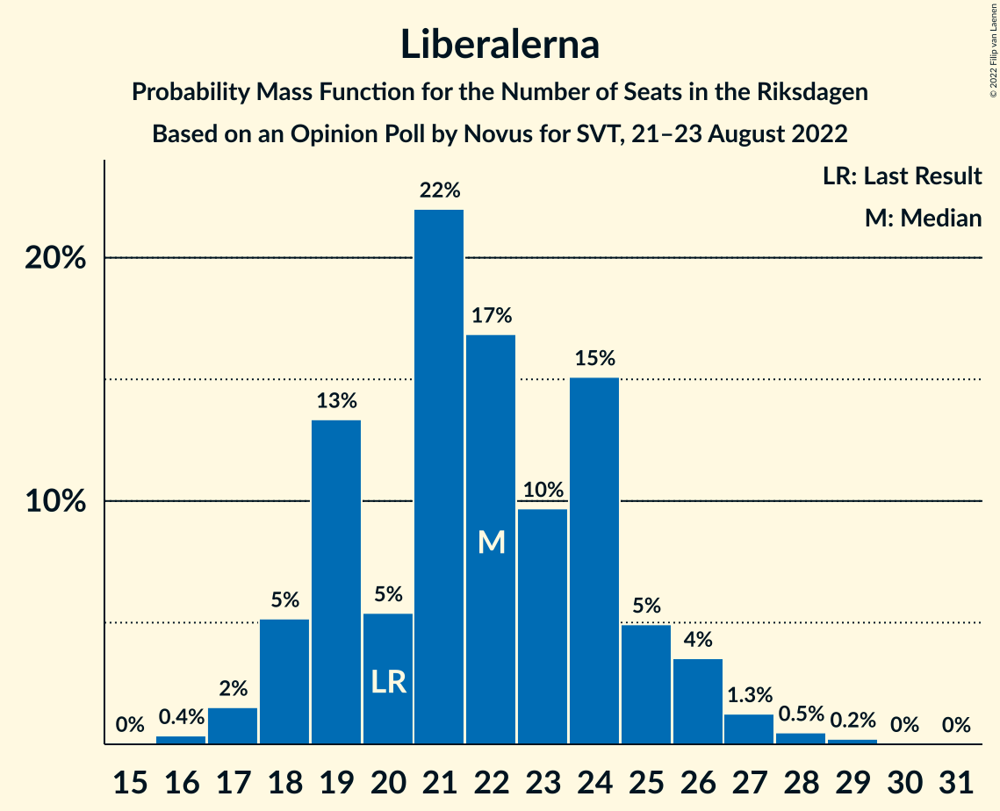

| Number of Seats | Probability | Accumulated | Special Marks |
|:---------------:|:-----------:|:-----------:|:-------------:|
| 15 | 0% | 100% |  |
| 16 | 0.4% | 99.9% |  |
| 17 | 2% | 99.6% |  |
| 18 | 5% | 98% |  |
| 19 | 13% | 93% |  |
| 20 | 5% | 80% | Last Result |
| 21 | 22% | 74% |  |
| 22 | 17% | 52% | Median |
| 23 | 10% | 35% |  |
| 24 | 15% | 26% |  |
| 25 | 5% | 10% |  |
| 26 | 4% | 6% |  |
| 27 | 1.3% | 2% |  |
| 28 | 0.5% | 0.8% |  |
| 29 | 0.2% | 0.3% |  |
| 30 | 0% | 0.1% |  |
| 31 | 0% | 0% |  |

### Kristdemokraterna

*For a full overview of the results for this party, see the [Kristdemokraterna](party-kristdemokraterna.html) page.*

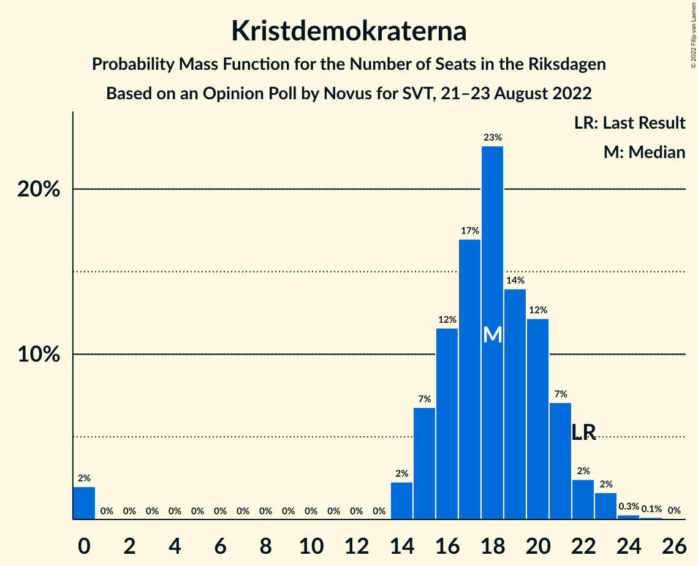

| Number of Seats | Probability | Accumulated | Special Marks |
|:---------------:|:-----------:|:-----------:|:-------------:|
| 0 | 2% | 100% |  |
| 1 | 0% | 98% |  |
| 2 | 0% | 98% |  |
| 3 | 0% | 98% |  |
| 4 | 0% | 98% |  |
| 5 | 0% | 98% |  |
| 6 | 0% | 98% |  |
| 7 | 0% | 98% |  |
| 8 | 0% | 98% |  |
| 9 | 0% | 98% |  |
| 10 | 0% | 98% |  |
| 11 | 0% | 98% |  |
| 12 | 0% | 98% |  |
| 13 | 0% | 98% |  |
| 14 | 2% | 98% |  |
| 15 | 7% | 96% |  |
| 16 | 12% | 89% |  |
| 17 | 17% | 77% |  |
| 18 | 23% | 60% | Median |
| 19 | 14% | 38% |  |
| 20 | 12% | 24% |  |
| 21 | 7% | 12% |  |
| 22 | 2% | 5% | Last Result |
| 23 | 2% | 2% |  |
| 24 | 0.3% | 0.5% |  |
| 25 | 0.1% | 0.2% |  |
| 26 | 0% | 0% |  |

### Miljöpartiet de gröna

*For a full overview of the results for this party, see the [Miljöpartiet de gröna](party-miljöpartietdegröna.html) page.*

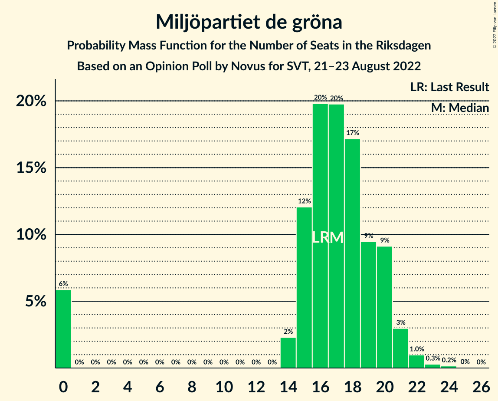

| Number of Seats | Probability | Accumulated | Special Marks |
|:---------------:|:-----------:|:-----------:|:-------------:|
| 0 | 6% | 100% |  |
| 1 | 0% | 94% |  |
| 2 | 0% | 94% |  |
| 3 | 0% | 94% |  |
| 4 | 0% | 94% |  |
| 5 | 0% | 94% |  |
| 6 | 0% | 94% |  |
| 7 | 0% | 94% |  |
| 8 | 0% | 94% |  |
| 9 | 0% | 94% |  |
| 10 | 0% | 94% |  |
| 11 | 0% | 94% |  |
| 12 | 0% | 94% |  |
| 13 | 0% | 94% |  |
| 14 | 2% | 94% |  |
| 15 | 12% | 92% |  |
| 16 | 20% | 80% | Last Result |
| 17 | 20% | 60% | Median |
| 18 | 17% | 40% |  |
| 19 | 9% | 23% |  |
| 20 | 9% | 14% |  |
| 21 | 3% | 4% |  |
| 22 | 1.0% | 1.5% |  |
| 23 | 0.3% | 0.5% |  |
| 24 | 0.2% | 0.2% |  |
| 25 | 0% | 0% |  |

## Coalitions

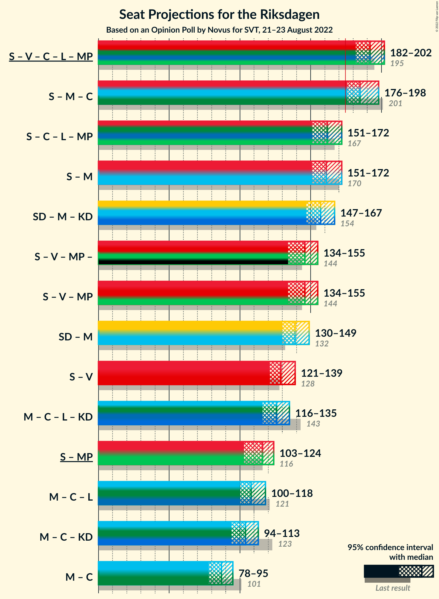

### Confidence Intervals

| Coalition | Last Result | Median | Majority? | 80% Confidence Interval | 90% Confidence Interval | 95% Confidence Interval | 99% Confidence Interval |
|:---------:|:-----------:|:------:|:---------:|:-----------------------:|:-----------------------:|:-----------------------:|:-----------------------:|
| Sveriges socialdemokratiska arbetareparti – Vänsterpartiet – Centerpartiet – Liberalerna – Miljöpartiet de gröna | 195 | 192 | 99.9% | 185–199 | 184–200 | 182–202 | 178–206 |
| Sveriges socialdemokratiska arbetareparti – Moderata samlingspartiet – Centerpartiet | 201 | 185 | 99.1% | 179–192 | 177–195 | 176–198 | 174–202 |
| Sveriges socialdemokratiska arbetareparti – Centerpartiet – Liberalerna – Miljöpartiet de gröna | 167 | 162 | 0.7% | 156–168 | 153–170 | 151–172 | 147–175 |
| Sveriges socialdemokratiska arbetareparti – Moderata samlingspartiet | 170 | 161 | 1.2% | 155–167 | 153–169 | 151–172 | 149–176 |
| Sverigedemokraterna – Moderata samlingspartiet – Kristdemokraterna | 154 | 157 | 0.1% | 150–164 | 149–165 | 147–167 | 143–171 |
| Sveriges socialdemokratiska arbetareparti – Vänsterpartiet – Miljöpartiet de gröna | 144 | 146 | 0% | 139–152 | 137–154 | 134–155 | 129–159 |
| Sverigedemokraterna – Moderata samlingspartiet | 132 | 139 | 0% | 133–145 | 131–148 | 130–149 | 127–153 |
| Sveriges socialdemokratiska arbetareparti – Vänsterpartiet | 128 | 129 | 0% | 123–136 | 122–138 | 121–139 | 118–144 |
| Moderata samlingspartiet – Centerpartiet – Liberalerna – Kristdemokraterna | 143 | 126 | 0% | 120–132 | 118–134 | 116–135 | 111–140 |
| Sveriges socialdemokratiska arbetareparti – Miljöpartiet de gröna | 116 | 116 | 0% | 109–122 | 107–123 | 103–124 | 98–128 |
| Moderata samlingspartiet – Centerpartiet – Liberalerna | 121 | 108 | 0% | 102–113 | 101–116 | 100–118 | 97–120 |
| Moderata samlingspartiet – Centerpartiet – Kristdemokraterna | 123 | 104 | 0% | 98–110 | 96–112 | 94–113 | 88–116 |
| Moderata samlingspartiet – Centerpartiet | 101 | 87 | 0% | 82–92 | 79–94 | 78–95 | 76–98 |

### Sveriges socialdemokratiska arbetareparti – Vänsterpartiet – Centerpartiet – Liberalerna – Miljöpartiet de gröna

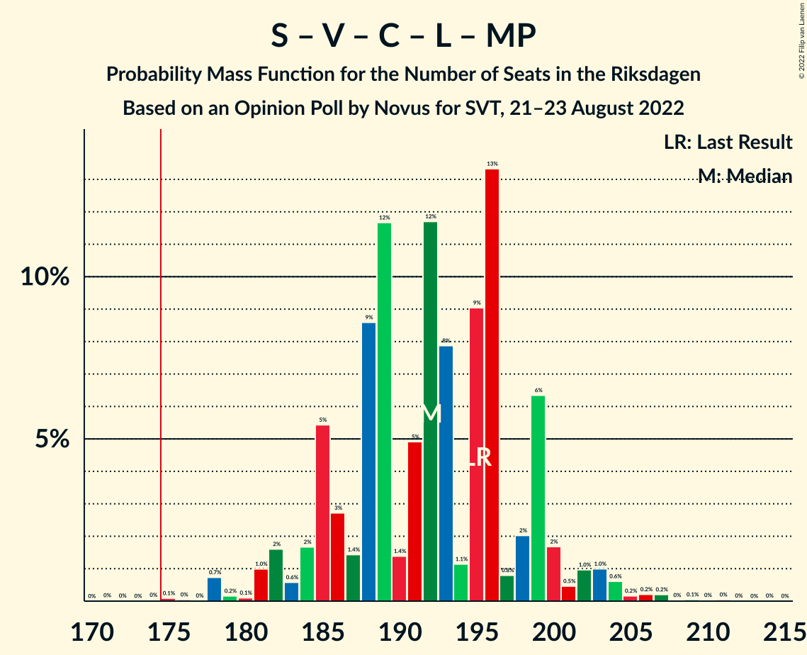

| Number of Seats | Probability | Accumulated | Special Marks |
|:---------------:|:-----------:|:-----------:|:-------------:|
| 174 | 0% | 100% |  |
| 175 | 0.1% | 99.9% | Majority |
| 176 | 0% | 99.8% |  |
| 177 | 0% | 99.8% |  |
| 178 | 0.7% | 99.8% |  |
| 179 | 0.2% | 99.0% |  |
| 180 | 0.1% | 98.9% |  |
| 181 | 1.0% | 98.8% |  |
| 182 | 2% | 98% |  |
| 183 | 0.6% | 96% |  |
| 184 | 2% | 96% |  |
| 185 | 5% | 94% |  |
| 186 | 3% | 88% |  |
| 187 | 1.4% | 86% |  |
| 188 | 9% | 84% |  |
| 189 | 12% | 76% |  |
| 190 | 1.4% | 64% |  |
| 191 | 5% | 63% |  |
| 192 | 12% | 58% |  |
| 193 | 8% | 46% | Median |
| 194 | 1.1% | 38% |  |
| 195 | 9% | 37% | Last Result |
| 196 | 13% | 28% |  |
| 197 | 0.8% | 15% |  |
| 198 | 2% | 14% |  |
| 199 | 6% | 12% |  |
| 200 | 2% | 5% |  |
| 201 | 0.5% | 4% |  |
| 202 | 1.0% | 3% |  |
| 203 | 1.0% | 2% |  |
| 204 | 0.6% | 1.4% |  |
| 205 | 0.2% | 0.8% |  |
| 206 | 0.2% | 0.6% |  |
| 207 | 0.2% | 0.4% |  |
| 208 | 0% | 0.2% |  |
| 209 | 0.1% | 0.2% |  |
| 210 | 0% | 0.1% |  |
| 211 | 0% | 0.1% |  |
| 212 | 0% | 0% |  |

### Sveriges socialdemokratiska arbetareparti – Moderata samlingspartiet – Centerpartiet

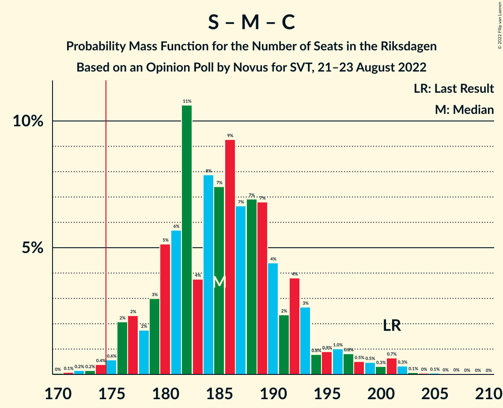

| Number of Seats | Probability | Accumulated | Special Marks |
|:---------------:|:-----------:|:-----------:|:-------------:|
| 170 | 0% | 100% |  |
| 171 | 0.1% | 99.9% |  |
| 172 | 0.2% | 99.8% |  |
| 173 | 0.2% | 99.7% |  |
| 174 | 0.4% | 99.5% |  |
| 175 | 0.6% | 99.1% | Majority |
| 176 | 2% | 98.6% |  |
| 177 | 2% | 96% |  |
| 178 | 2% | 94% |  |
| 179 | 3% | 92% |  |
| 180 | 5% | 89% |  |
| 181 | 6% | 84% |  |
| 182 | 11% | 79% |  |
| 183 | 4% | 68% |  |
| 184 | 8% | 64% |  |
| 185 | 7% | 56% | Median |
| 186 | 9% | 49% |  |
| 187 | 7% | 40% |  |
| 188 | 7% | 33% |  |
| 189 | 7% | 26% |  |
| 190 | 4% | 19% |  |
| 191 | 2% | 15% |  |
| 192 | 4% | 13% |  |
| 193 | 3% | 9% |  |
| 194 | 0.8% | 6% |  |
| 195 | 0.9% | 5% |  |
| 196 | 1.0% | 4% |  |
| 197 | 0.8% | 3% |  |
| 198 | 0.5% | 3% |  |
| 199 | 0.5% | 2% |  |
| 200 | 0.3% | 2% |  |
| 201 | 0.7% | 1.2% | Last Result |
| 202 | 0.3% | 0.6% |  |
| 203 | 0.1% | 0.3% |  |
| 204 | 0% | 0.2% |  |
| 205 | 0.1% | 0.1% |  |
| 206 | 0% | 0.1% |  |
| 207 | 0% | 0.1% |  |
| 208 | 0% | 0% |  |

### Sveriges socialdemokratiska arbetareparti – Centerpartiet – Liberalerna – Miljöpartiet de gröna

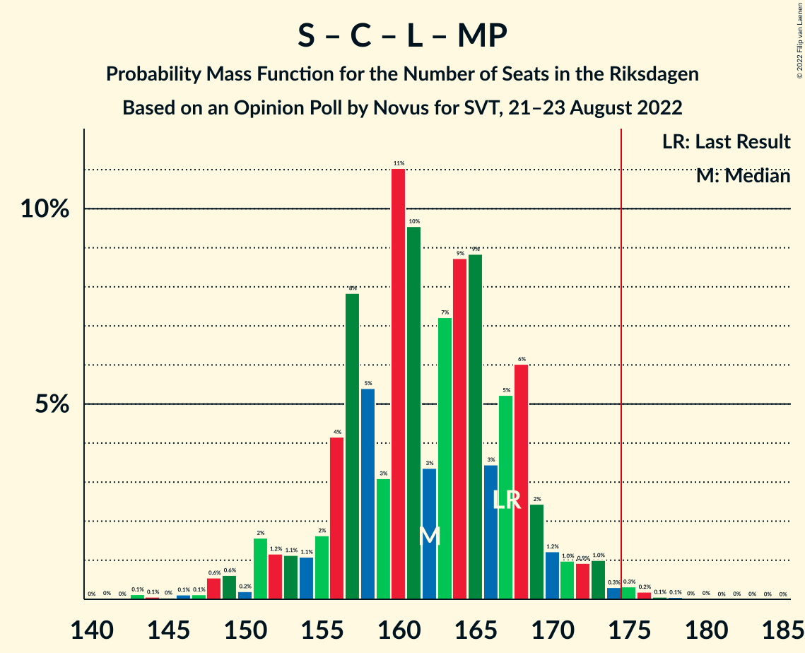

| Number of Seats | Probability | Accumulated | Special Marks |
|:---------------:|:-----------:|:-----------:|:-------------:|
| 141 | 0% | 100% |  |
| 142 | 0% | 99.9% |  |
| 143 | 0.1% | 99.9% |  |
| 144 | 0.1% | 99.8% |  |
| 145 | 0% | 99.7% |  |
| 146 | 0.1% | 99.7% |  |
| 147 | 0.1% | 99.6% |  |
| 148 | 0.6% | 99.5% |  |
| 149 | 0.6% | 98.9% |  |
| 150 | 0.2% | 98% |  |
| 151 | 2% | 98% |  |
| 152 | 1.2% | 97% |  |
| 153 | 1.1% | 95% |  |
| 154 | 1.1% | 94% |  |
| 155 | 2% | 93% |  |
| 156 | 4% | 92% |  |
| 157 | 8% | 87% |  |
| 158 | 5% | 80% |  |
| 159 | 3% | 74% |  |
| 160 | 11% | 71% |  |
| 161 | 10% | 60% |  |
| 162 | 3% | 50% | Median |
| 163 | 7% | 47% |  |
| 164 | 9% | 40% |  |
| 165 | 9% | 31% |  |
| 166 | 3% | 22% |  |
| 167 | 5% | 19% | Last Result |
| 168 | 6% | 14% |  |
| 169 | 2% | 8% |  |
| 170 | 1.2% | 5% |  |
| 171 | 1.0% | 4% |  |
| 172 | 0.9% | 3% |  |
| 173 | 1.0% | 2% |  |
| 174 | 0.3% | 1.0% |  |
| 175 | 0.3% | 0.7% | Majority |
| 176 | 0.2% | 0.4% |  |
| 177 | 0.1% | 0.2% |  |
| 178 | 0.1% | 0.1% |  |
| 179 | 0% | 0.1% |  |
| 180 | 0% | 0.1% |  |
| 181 | 0% | 0% |  |

### Sveriges socialdemokratiska arbetareparti – Moderata samlingspartiet

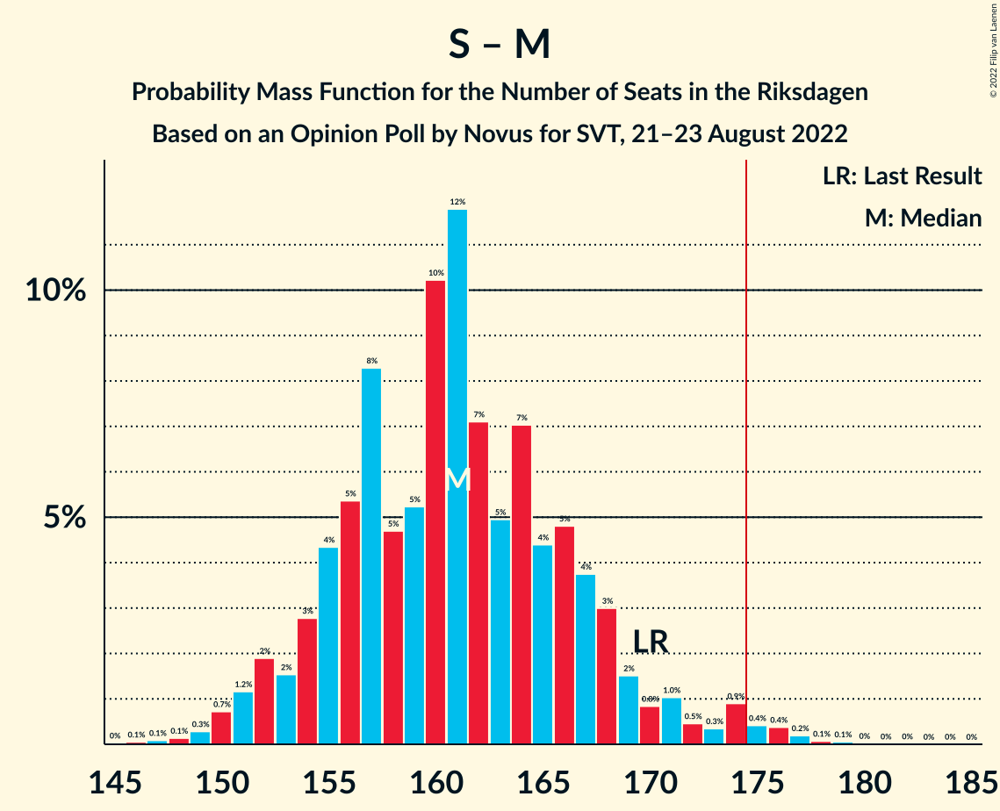

| Number of Seats | Probability | Accumulated | Special Marks |
|:---------------:|:-----------:|:-----------:|:-------------:|
| 146 | 0.1% | 100% |  |
| 147 | 0.1% | 99.9% |  |
| 148 | 0.1% | 99.8% |  |
| 149 | 0.3% | 99.7% |  |
| 150 | 0.7% | 99.4% |  |
| 151 | 1.2% | 98.7% |  |
| 152 | 2% | 97% |  |
| 153 | 2% | 96% |  |
| 154 | 3% | 94% |  |
| 155 | 4% | 91% |  |
| 156 | 5% | 87% |  |
| 157 | 8% | 82% |  |
| 158 | 5% | 73% |  |
| 159 | 5% | 69% |  |
| 160 | 10% | 63% |  |
| 161 | 12% | 53% | Median |
| 162 | 7% | 41% |  |
| 163 | 5% | 34% |  |
| 164 | 7% | 29% |  |
| 165 | 4% | 22% |  |
| 166 | 5% | 18% |  |
| 167 | 4% | 13% |  |
| 168 | 3% | 9% |  |
| 169 | 2% | 6% |  |
| 170 | 0.8% | 5% | Last Result |
| 171 | 1.0% | 4% |  |
| 172 | 0.5% | 3% |  |
| 173 | 0.3% | 2% |  |
| 174 | 0.9% | 2% |  |
| 175 | 0.4% | 1.2% | Majority |
| 176 | 0.4% | 0.8% |  |
| 177 | 0.2% | 0.4% |  |
| 178 | 0.1% | 0.2% |  |
| 179 | 0.1% | 0.1% |  |
| 180 | 0% | 0.1% |  |
| 181 | 0% | 0% |  |

### Sverigedemokraterna – Moderata samlingspartiet – Kristdemokraterna

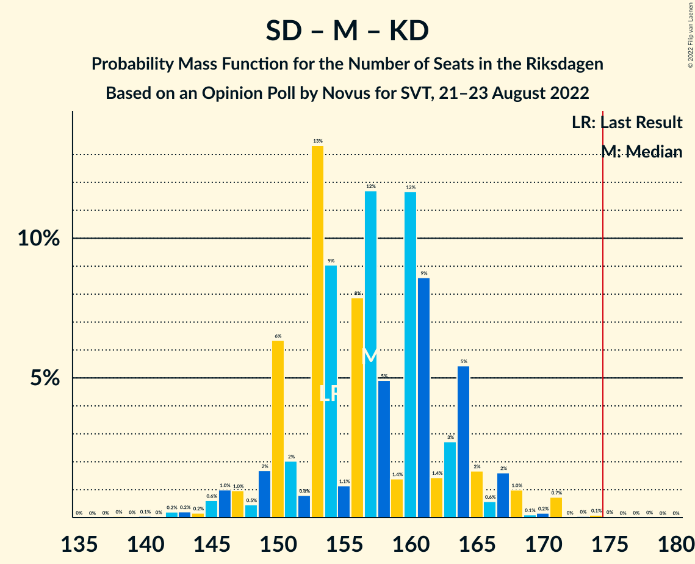

| Number of Seats | Probability | Accumulated | Special Marks |
|:---------------:|:-----------:|:-----------:|:-------------:|
| 138 | 0% | 100% |  |
| 139 | 0% | 99.9% |  |
| 140 | 0.1% | 99.9% |  |
| 141 | 0% | 99.8% |  |
| 142 | 0.2% | 99.8% |  |
| 143 | 0.2% | 99.6% |  |
| 144 | 0.2% | 99.4% |  |
| 145 | 0.6% | 99.2% |  |
| 146 | 1.0% | 98.6% |  |
| 147 | 1.0% | 98% |  |
| 148 | 0.5% | 97% |  |
| 149 | 2% | 96% |  |
| 150 | 6% | 95% |  |
| 151 | 2% | 88% |  |
| 152 | 0.8% | 86% |  |
| 153 | 13% | 85% |  |
| 154 | 9% | 72% | Last Result |
| 155 | 1.1% | 63% |  |
| 156 | 8% | 62% |  |
| 157 | 12% | 54% | Median |
| 158 | 5% | 42% |  |
| 159 | 1.4% | 37% |  |
| 160 | 12% | 36% |  |
| 161 | 9% | 24% |  |
| 162 | 1.4% | 16% |  |
| 163 | 3% | 14% |  |
| 164 | 5% | 12% |  |
| 165 | 2% | 6% |  |
| 166 | 0.6% | 4% |  |
| 167 | 2% | 4% |  |
| 168 | 1.0% | 2% |  |
| 169 | 0.1% | 1.2% |  |
| 170 | 0.2% | 1.1% |  |
| 171 | 0.7% | 1.0% |  |
| 172 | 0% | 0.2% |  |
| 173 | 0% | 0.2% |  |
| 174 | 0.1% | 0.2% |  |
| 175 | 0% | 0.1% | Majority |
| 176 | 0% | 0% |  |

### Sveriges socialdemokratiska arbetareparti – Vänsterpartiet – Miljöpartiet de gröna

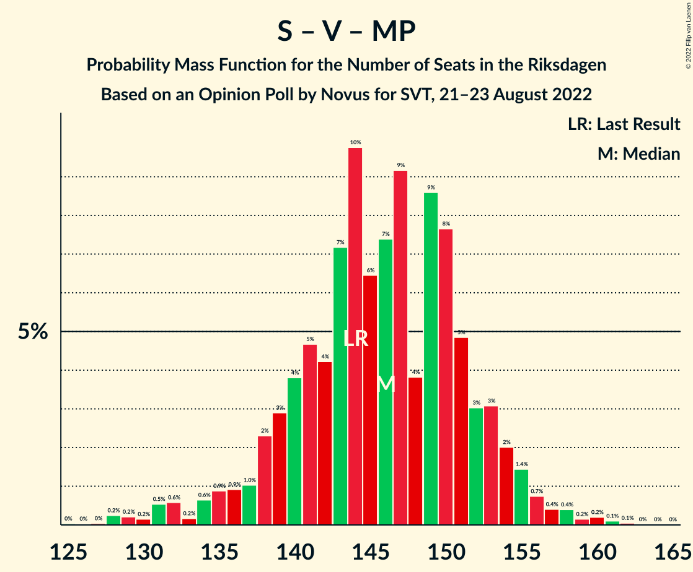

| Number of Seats | Probability | Accumulated | Special Marks |
|:---------------:|:-----------:|:-----------:|:-------------:|
| 125 | 0% | 100% |  |
| 126 | 0% | 99.9% |  |
| 127 | 0% | 99.9% |  |
| 128 | 0.2% | 99.9% |  |
| 129 | 0.2% | 99.6% |  |
| 130 | 0.2% | 99.4% |  |
| 131 | 0.5% | 99.3% |  |
| 132 | 0.6% | 98.7% |  |
| 133 | 0.2% | 98% |  |
| 134 | 0.6% | 98% |  |
| 135 | 0.9% | 97% |  |
| 136 | 0.9% | 96% |  |
| 137 | 1.0% | 96% |  |
| 138 | 2% | 94% |  |
| 139 | 3% | 92% |  |
| 140 | 4% | 89% |  |
| 141 | 5% | 85% |  |
| 142 | 4% | 81% |  |
| 143 | 7% | 77% |  |
| 144 | 10% | 69% | Last Result |
| 145 | 6% | 60% |  |
| 146 | 7% | 53% |  |
| 147 | 9% | 46% | Median |
| 148 | 4% | 37% |  |
| 149 | 9% | 33% |  |
| 150 | 8% | 24% |  |
| 151 | 5% | 17% |  |
| 152 | 3% | 12% |  |
| 153 | 3% | 9% |  |
| 154 | 2% | 6% |  |
| 155 | 1.4% | 4% |  |
| 156 | 0.7% | 2% |  |
| 157 | 0.4% | 1.4% |  |
| 158 | 0.4% | 1.0% |  |
| 159 | 0.2% | 0.6% |  |
| 160 | 0.2% | 0.4% |  |
| 161 | 0.1% | 0.2% |  |
| 162 | 0.1% | 0.1% |  |
| 163 | 0% | 0.1% |  |
| 164 | 0% | 0% |  |

### Sverigedemokraterna – Moderata samlingspartiet

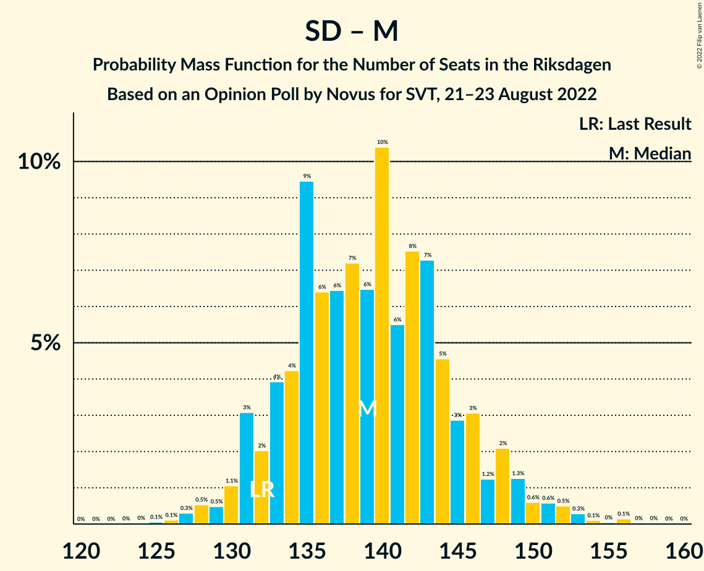

| Number of Seats | Probability | Accumulated | Special Marks |
|:---------------:|:-----------:|:-----------:|:-------------:|
| 124 | 0% | 100% |  |
| 125 | 0.1% | 99.9% |  |
| 126 | 0.1% | 99.9% |  |
| 127 | 0.3% | 99.8% |  |
| 128 | 0.5% | 99.5% |  |
| 129 | 0.5% | 98.9% |  |
| 130 | 1.1% | 98% |  |
| 131 | 3% | 97% |  |
| 132 | 2% | 94% | Last Result |
| 133 | 4% | 92% |  |
| 134 | 4% | 88% |  |
| 135 | 9% | 84% |  |
| 136 | 6% | 75% |  |
| 137 | 6% | 68% |  |
| 138 | 7% | 62% |  |
| 139 | 6% | 55% | Median |
| 140 | 10% | 48% |  |
| 141 | 6% | 38% |  |
| 142 | 8% | 32% |  |
| 143 | 7% | 25% |  |
| 144 | 5% | 17% |  |
| 145 | 3% | 13% |  |
| 146 | 3% | 10% |  |
| 147 | 1.2% | 7% |  |
| 148 | 2% | 6% |  |
| 149 | 1.3% | 4% |  |
| 150 | 0.6% | 2% |  |
| 151 | 0.6% | 2% |  |
| 152 | 0.5% | 1.2% |  |
| 153 | 0.3% | 0.7% |  |
| 154 | 0.1% | 0.4% |  |
| 155 | 0% | 0.3% |  |
| 156 | 0.1% | 0.2% |  |
| 157 | 0% | 0.1% |  |
| 158 | 0% | 0.1% |  |
| 159 | 0% | 0% |  |

### Sveriges socialdemokratiska arbetareparti – Vänsterpartiet

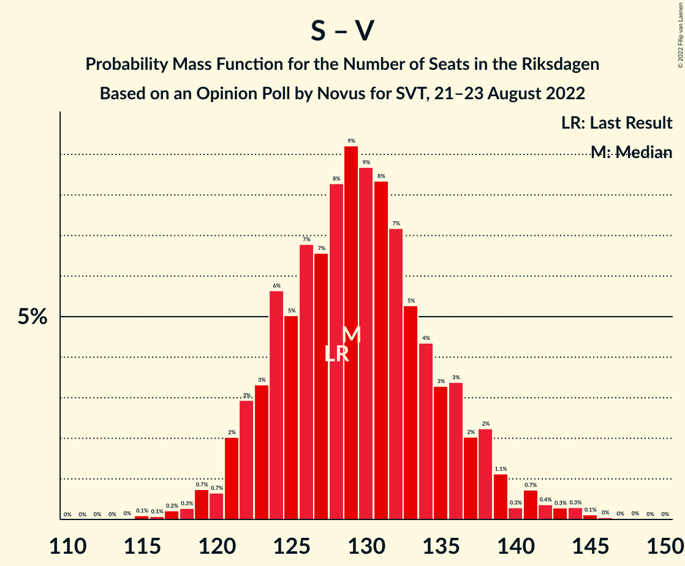

| Number of Seats | Probability | Accumulated | Special Marks |
|:---------------:|:-----------:|:-----------:|:-------------:|
| 115 | 0.1% | 100% |  |
| 116 | 0.1% | 99.9% |  |
| 117 | 0.2% | 99.8% |  |
| 118 | 0.3% | 99.6% |  |
| 119 | 0.7% | 99.3% |  |
| 120 | 0.7% | 98.6% |  |
| 121 | 2% | 98% |  |
| 122 | 3% | 96% |  |
| 123 | 3% | 93% |  |
| 124 | 6% | 90% |  |
| 125 | 5% | 84% |  |
| 126 | 7% | 79% |  |
| 127 | 7% | 72% |  |
| 128 | 8% | 66% | Last Result |
| 129 | 9% | 57% |  |
| 130 | 9% | 48% | Median |
| 131 | 8% | 39% |  |
| 132 | 7% | 31% |  |
| 133 | 5% | 24% |  |
| 134 | 4% | 19% |  |
| 135 | 3% | 14% |  |
| 136 | 3% | 11% |  |
| 137 | 2% | 8% |  |
| 138 | 2% | 6% |  |
| 139 | 1.1% | 3% |  |
| 140 | 0.3% | 2% |  |
| 141 | 0.7% | 2% |  |
| 142 | 0.4% | 1.2% |  |
| 143 | 0.3% | 0.8% |  |
| 144 | 0.3% | 0.5% |  |
| 145 | 0.1% | 0.2% |  |
| 146 | 0% | 0.1% |  |
| 147 | 0% | 0.1% |  |
| 148 | 0% | 0.1% |  |
| 149 | 0% | 0% |  |

### Moderata samlingspartiet – Centerpartiet – Liberalerna – Kristdemokraterna

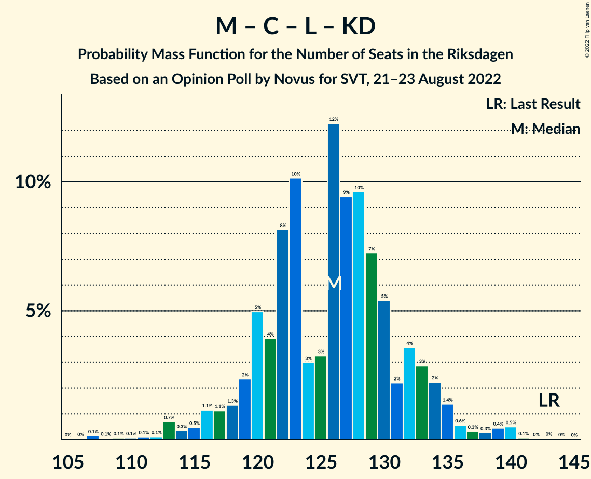

| Number of Seats | Probability | Accumulated | Special Marks |
|:---------------:|:-----------:|:-----------:|:-------------:|
| 106 | 0% | 100% |  |
| 107 | 0.1% | 99.9% |  |
| 108 | 0.1% | 99.8% |  |
| 109 | 0.1% | 99.7% |  |
| 110 | 0.1% | 99.7% |  |
| 111 | 0.1% | 99.6% |  |
| 112 | 0.1% | 99.5% |  |
| 113 | 0.7% | 99.4% |  |
| 114 | 0.3% | 98.7% |  |
| 115 | 0.5% | 98% |  |
| 116 | 1.1% | 98% |  |
| 117 | 1.1% | 97% |  |
| 118 | 1.3% | 96% |  |
| 119 | 2% | 94% |  |
| 120 | 5% | 92% |  |
| 121 | 4% | 87% |  |
| 122 | 8% | 83% |  |
| 123 | 10% | 75% |  |
| 124 | 3% | 65% |  |
| 125 | 3% | 62% |  |
| 126 | 12% | 58% | Median |
| 127 | 9% | 46% |  |
| 128 | 10% | 37% |  |
| 129 | 7% | 27% |  |
| 130 | 5% | 20% |  |
| 131 | 2% | 15% |  |
| 132 | 4% | 12% |  |
| 133 | 3% | 9% |  |
| 134 | 2% | 6% |  |
| 135 | 1.4% | 4% |  |
| 136 | 0.6% | 2% |  |
| 137 | 0.3% | 2% |  |
| 138 | 0.3% | 1.4% |  |
| 139 | 0.4% | 1.1% |  |
| 140 | 0.5% | 0.7% |  |
| 141 | 0.1% | 0.2% |  |
| 142 | 0% | 0.1% |  |
| 143 | 0% | 0.1% | Last Result |
| 144 | 0% | 0% |  |

### Sveriges socialdemokratiska arbetareparti – Miljöpartiet de gröna

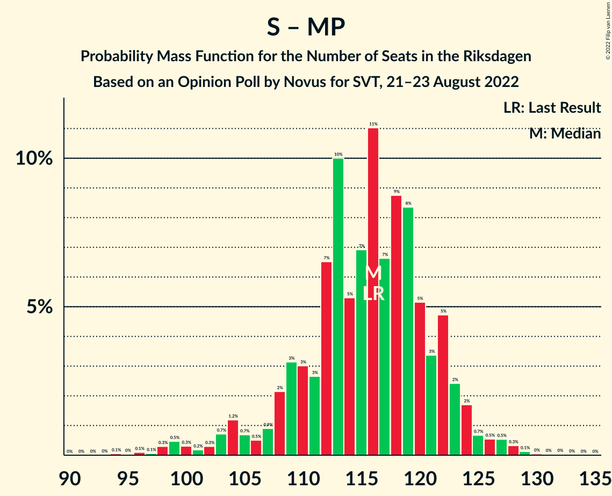

| Number of Seats | Probability | Accumulated | Special Marks |
|:---------------:|:-----------:|:-----------:|:-------------:|
| 94 | 0.1% | 100% |  |
| 95 | 0% | 99.9% |  |
| 96 | 0.1% | 99.9% |  |
| 97 | 0.1% | 99.8% |  |
| 98 | 0.3% | 99.7% |  |
| 99 | 0.5% | 99.4% |  |
| 100 | 0.3% | 99.0% |  |
| 101 | 0.2% | 98.7% |  |
| 102 | 0.3% | 98% |  |
| 103 | 0.7% | 98% |  |
| 104 | 1.2% | 97% |  |
| 105 | 0.7% | 96% |  |
| 106 | 0.5% | 96% |  |
| 107 | 0.9% | 95% |  |
| 108 | 2% | 94% |  |
| 109 | 3% | 92% |  |
| 110 | 3% | 89% |  |
| 111 | 3% | 86% |  |
| 112 | 7% | 83% |  |
| 113 | 10% | 77% |  |
| 114 | 5% | 67% |  |
| 115 | 7% | 61% |  |
| 116 | 11% | 54% | Last Result, Median |
| 117 | 7% | 43% |  |
| 118 | 9% | 37% |  |
| 119 | 8% | 28% |  |
| 120 | 5% | 20% |  |
| 121 | 3% | 15% |  |
| 122 | 5% | 11% |  |
| 123 | 2% | 6% |  |
| 124 | 2% | 4% |  |
| 125 | 0.7% | 2% |  |
| 126 | 0.5% | 2% |  |
| 127 | 0.5% | 1.1% |  |
| 128 | 0.3% | 0.6% |  |
| 129 | 0.1% | 0.3% |  |
| 130 | 0% | 0.1% |  |
| 131 | 0% | 0.1% |  |
| 132 | 0% | 0.1% |  |
| 133 | 0% | 0% |  |

### Moderata samlingspartiet – Centerpartiet – Liberalerna

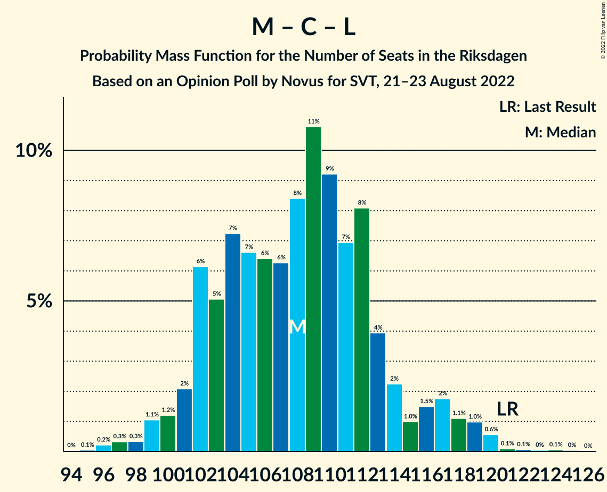

| Number of Seats | Probability | Accumulated | Special Marks |
|:---------------:|:-----------:|:-----------:|:-------------:|
| 94 | 0% | 100% |  |
| 95 | 0.1% | 99.9% |  |
| 96 | 0.2% | 99.9% |  |
| 97 | 0.3% | 99.7% |  |
| 98 | 0.3% | 99.3% |  |
| 99 | 1.1% | 99.0% |  |
| 100 | 1.2% | 98% |  |
| 101 | 2% | 97% |  |
| 102 | 6% | 95% |  |
| 103 | 5% | 89% |  |
| 104 | 7% | 83% |  |
| 105 | 7% | 76% |  |
| 106 | 6% | 70% |  |
| 107 | 6% | 63% |  |
| 108 | 8% | 57% | Median |
| 109 | 11% | 48% |  |
| 110 | 9% | 38% |  |
| 111 | 7% | 28% |  |
| 112 | 8% | 22% |  |
| 113 | 4% | 13% |  |
| 114 | 2% | 9% |  |
| 115 | 1.0% | 7% |  |
| 116 | 1.5% | 6% |  |
| 117 | 2% | 5% |  |
| 118 | 1.1% | 3% |  |
| 119 | 1.0% | 2% |  |
| 120 | 0.6% | 0.9% |  |
| 121 | 0.1% | 0.3% | Last Result |
| 122 | 0.1% | 0.2% |  |
| 123 | 0% | 0.2% |  |
| 124 | 0.1% | 0.1% |  |
| 125 | 0% | 0.1% |  |
| 126 | 0% | 0% |  |

### Moderata samlingspartiet – Centerpartiet – Kristdemokraterna

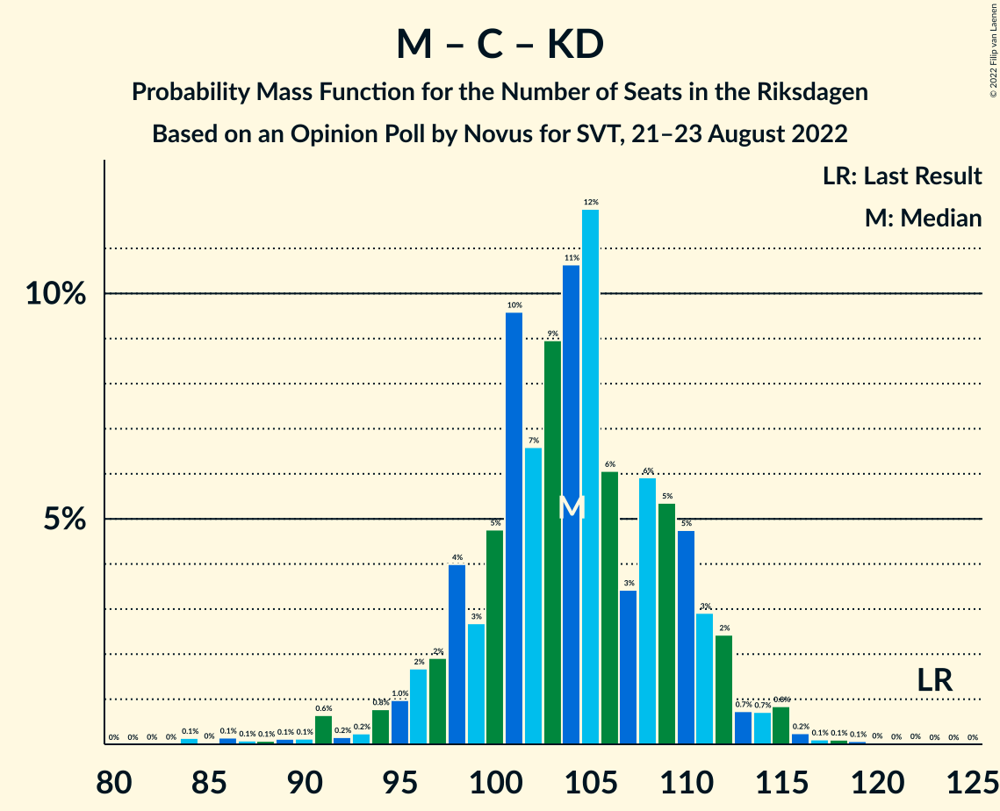

| Number of Seats | Probability | Accumulated | Special Marks |
|:---------------:|:-----------:|:-----------:|:-------------:|
| 84 | 0.1% | 100% |  |
| 85 | 0% | 99.8% |  |
| 86 | 0.1% | 99.8% |  |
| 87 | 0.1% | 99.7% |  |
| 88 | 0.1% | 99.6% |  |
| 89 | 0.1% | 99.5% |  |
| 90 | 0.1% | 99.4% |  |
| 91 | 0.6% | 99.2% |  |
| 92 | 0.2% | 98.6% |  |
| 93 | 0.2% | 98% |  |
| 94 | 0.8% | 98% |  |
| 95 | 1.0% | 97% |  |
| 96 | 2% | 96% |  |
| 97 | 2% | 95% |  |
| 98 | 4% | 93% |  |
| 99 | 3% | 89% |  |
| 100 | 5% | 86% |  |
| 101 | 10% | 81% |  |
| 102 | 7% | 72% |  |
| 103 | 9% | 65% |  |
| 104 | 11% | 56% | Median |
| 105 | 12% | 46% |  |
| 106 | 6% | 34% |  |
| 107 | 3% | 28% |  |
| 108 | 6% | 24% |  |
| 109 | 5% | 18% |  |
| 110 | 5% | 13% |  |
| 111 | 3% | 8% |  |
| 112 | 2% | 5% |  |
| 113 | 0.7% | 3% |  |
| 114 | 0.7% | 2% |  |
| 115 | 0.8% | 1.4% |  |
| 116 | 0.2% | 0.6% |  |
| 117 | 0.1% | 0.4% |  |
| 118 | 0.1% | 0.2% |  |
| 119 | 0.1% | 0.1% |  |
| 120 | 0% | 0.1% |  |
| 121 | 0% | 0% |  |
| 122 | 0% | 0% |  |
| 123 | 0% | 0% | Last Result |

### Moderata samlingspartiet – Centerpartiet

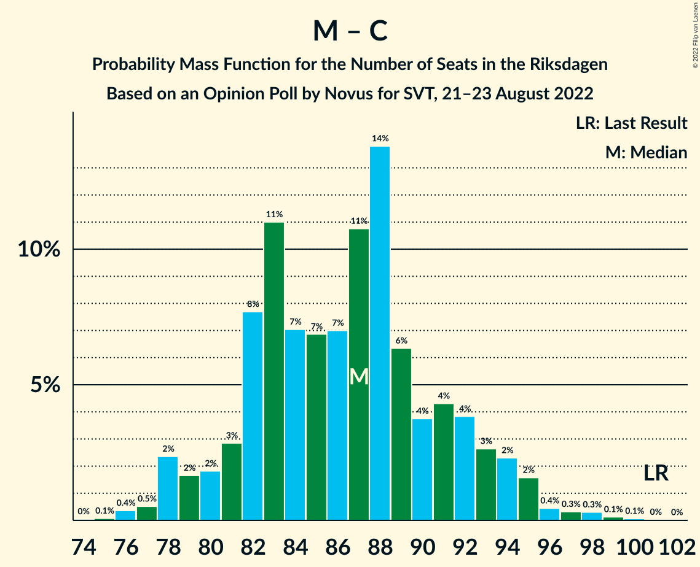

| Number of Seats | Probability | Accumulated | Special Marks |
|:---------------:|:-----------:|:-----------:|:-------------:|
| 74 | 0% | 100% |  |
| 75 | 0.1% | 99.9% |  |
| 76 | 0.4% | 99.8% |  |
| 77 | 0.5% | 99.5% |  |
| 78 | 2% | 99.0% |  |
| 79 | 2% | 97% |  |
| 80 | 2% | 95% |  |
| 81 | 3% | 93% |  |
| 82 | 8% | 90% |  |
| 83 | 11% | 83% |  |
| 84 | 7% | 72% |  |
| 85 | 7% | 65% |  |
| 86 | 7% | 58% | Median |
| 87 | 11% | 51% |  |
| 88 | 14% | 40% |  |
| 89 | 6% | 26% |  |
| 90 | 4% | 20% |  |
| 91 | 4% | 16% |  |
| 92 | 4% | 12% |  |
| 93 | 3% | 8% |  |
| 94 | 2% | 5% |  |
| 95 | 2% | 3% |  |
| 96 | 0.4% | 1.3% |  |
| 97 | 0.3% | 0.9% |  |
| 98 | 0.3% | 0.6% |  |
| 99 | 0.1% | 0.3% |  |
| 100 | 0.1% | 0.1% |  |
| 101 | 0% | 0.1% | Last Result |
| 102 | 0% | 0% |  |

## Technical Information

### Opinion Poll

+ **Polling firm:** Novus
+ **Commissioner(s):** SVT
+ **Fieldwork period:** 21–23 August 2022

### Calculations

+ **Sample size:** 1500
+ **Simulations done:** 1,048,576
+ **Error estimate:** 0.88%

