# Opinion Poll by SKOP, 19–23 August 2022

<a href="#voting-intentions">Voting Intentions</a> | <a href="#seats">Seats</a> | <a href="#coalitions">Coalitions</a> | <a href="#technical-information">Technical Information</a>

## Voting Intentions

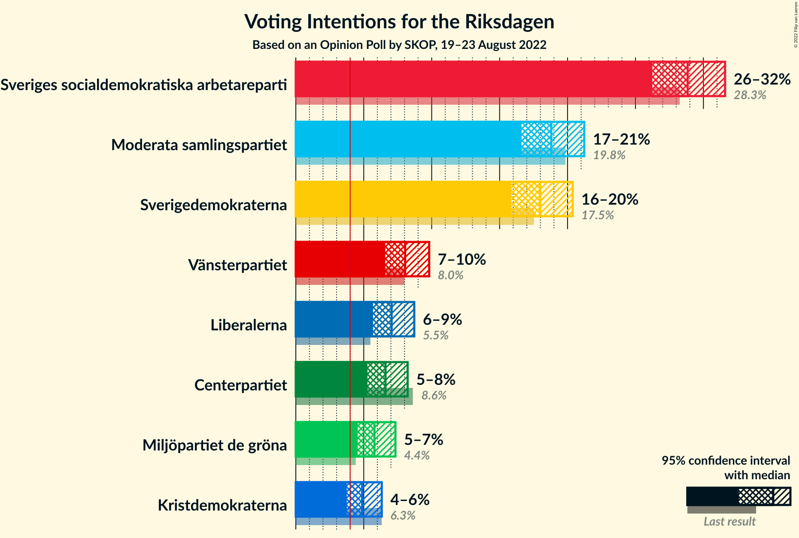

### Confidence Intervals

| Party | Last Result | Poll Result | 80% Confidence Interval | 90% Confidence Interval | 95% Confidence Interval | 99% Confidence Interval |
|:-----:|:-----------:|:-----------:|:-----------------------:|:-----------------------:|:-----------------------:|:-----------------------:|
| Sveriges socialdemokratiska arbetareparti | 28.3% | 28.8% | 27.1–30.6% |26.7–31.2% |26.2–31.6% |25.4–32.5% |
| Moderata samlingspartiet | 19.8% | 18.8% | 17.4–20.4% |16.9–20.8% |16.6–21.2% |15.9–22.0% |
| Sverigedemokraterna | 17.5% | 18.0% | 16.6–19.6% |16.2–20.0% |15.8–20.4% |15.2–21.1% |
| Vänsterpartiet | 8.0% | 8.0% | 7.1–9.2% |6.8–9.5% |6.6–9.8% |6.1–10.4% |
| Liberalerna | 5.5% | 7.1% | 6.1–8.1% |5.9–8.4% |5.7–8.7% |5.3–9.3% |
| Centerpartiet | 8.6% | 6.6% | 5.7–7.7% |5.5–8.0% |5.3–8.2% |4.9–8.8% |
| Miljöpartiet de gröna | 4.4% | 5.8% | 5.0–6.8% |4.7–7.1% |4.6–7.3% |4.2–7.8% |
| Kristdemokraterna | 6.3% | 4.9% | 4.1–5.8% |3.9–6.1% |3.7–6.3% |3.4–6.8% |

*Note:* The poll result column reflects the actual value used in the calculations. Published results may vary slightly, and in addition be rounded to fewer digits.

## Seats

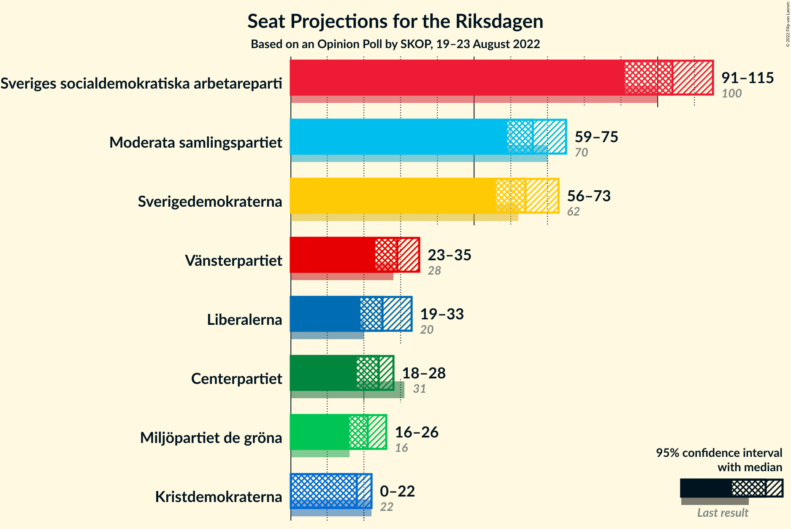

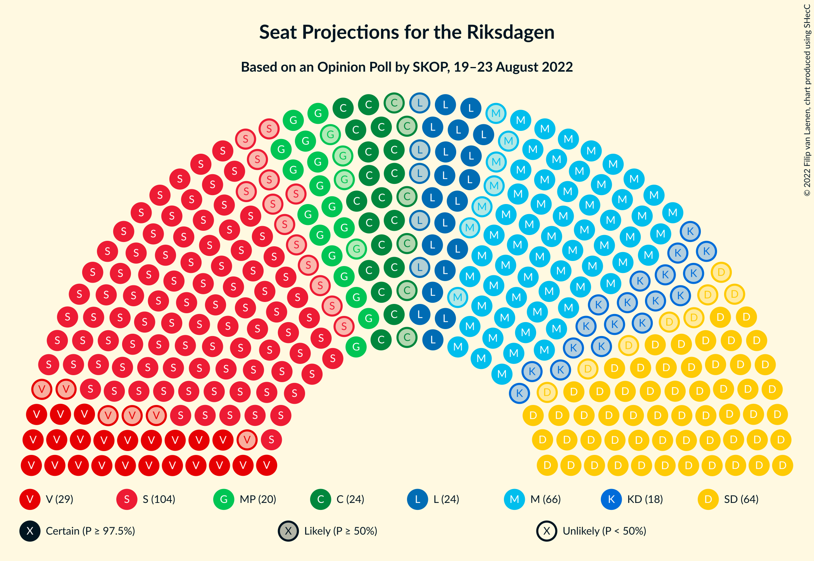

### Confidence Intervals

| Party | Last Result | Median | 80% Confidence Interval | 90% Confidence Interval | 95% Confidence Interval | 99% Confidence Interval |
|:-----:|:-----------:|:------:|:-----------------------:|:-----------------------:|:-----------------------:|:-----------------------:|
| <a href="#sveriges-socialdemokratiska-arbetareparti">Sveriges socialdemokratiska arbetareparti</a> | 100 | 104 | 94–112 |92–113 |91–115 |88–119 |
| <a href="#moderata-samlingspartiet">Moderata samlingspartiet</a> | 70 | 66 | 61–73 |60–74 |59–75 |56–78 |
| <a href="#sverigedemokraterna">Sverigedemokraterna</a> | 62 | 64 | 59–70 |57–71 |56–73 |54–76 |
| <a href="#vänsterpartiet">Vänsterpartiet</a> | 28 | 29 | 25–33 |24–34 |23–35 |21–37 |
| <a href="#liberalerna">Liberalerna</a> | 20 | 25 | 21–30 |20–31 |19–33 |18–34 |
| <a href="#centerpartiet">Centerpartiet</a> | 31 | 24 | 20–27 |19–28 |18–28 |17–31 |
| <a href="#miljöpartiet-de-gröna">Miljöpartiet de gröna</a> | 16 | 21 | 18–24 |17–25 |16–26 |15–28 |
| <a href="#kristdemokraterna">Kristdemokraterna</a> | 22 | 18 | 15–20 |0–21 |0–22 |0–24 |

### Sveriges socialdemokratiska arbetareparti

*For a full overview of the results for this party, see the [Sveriges socialdemokratiska arbetareparti](party-sverigessocialdemokratiskaarbetareparti.html) page.*

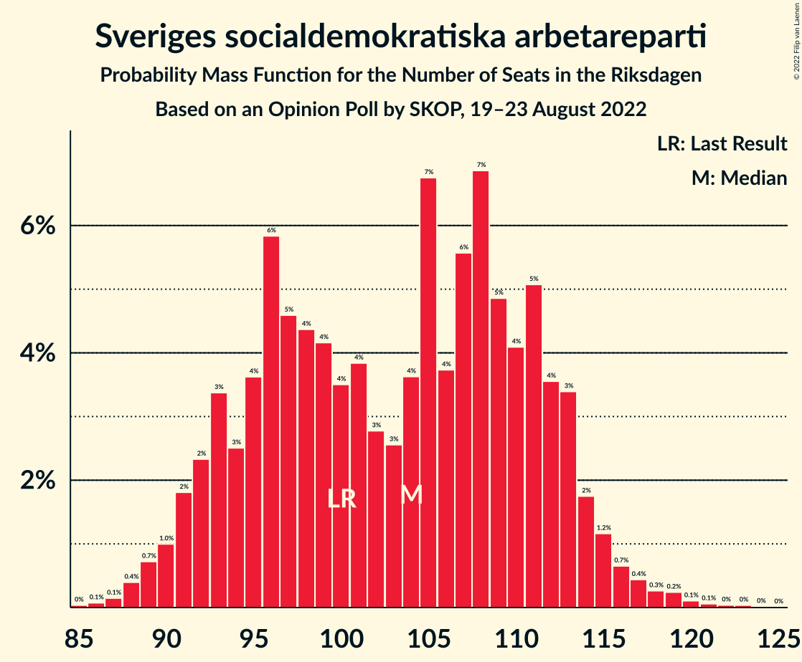

| Number of Seats | Probability | Accumulated | Special Marks |
|:---------------:|:-----------:|:-----------:|:-------------:|
| 85 | 0% | 100% |  |
| 86 | 0.1% | 99.9% |  |
| 87 | 0.1% | 99.9% |  |
| 88 | 0.4% | 99.7% |  |
| 89 | 0.7% | 99.3% |  |
| 90 | 1.0% | 98.6% |  |
| 91 | 2% | 98% |  |
| 92 | 2% | 96% |  |
| 93 | 3% | 93% |  |
| 94 | 3% | 90% |  |
| 95 | 4% | 88% |  |
| 96 | 6% | 84% |  |
| 97 | 5% | 78% |  |
| 98 | 4% | 74% |  |
| 99 | 4% | 69% |  |
| 100 | 4% | 65% | Last Result |
| 101 | 4% | 61% |  |
| 102 | 3% | 58% |  |
| 103 | 3% | 55% |  |
| 104 | 4% | 52% | Median |
| 105 | 7% | 49% |  |
| 106 | 4% | 42% |  |
| 107 | 6% | 38% |  |
| 108 | 7% | 33% |  |
| 109 | 5% | 26% |  |
| 110 | 4% | 21% |  |
| 111 | 5% | 17% |  |
| 112 | 4% | 12% |  |
| 113 | 3% | 8% |  |
| 114 | 2% | 5% |  |
| 115 | 1.2% | 3% |  |
| 116 | 0.7% | 2% |  |
| 117 | 0.4% | 1.2% |  |
| 118 | 0.3% | 0.8% |  |
| 119 | 0.2% | 0.5% |  |
| 120 | 0.1% | 0.3% |  |
| 121 | 0.1% | 0.2% |  |
| 122 | 0% | 0.1% |  |
| 123 | 0% | 0.1% |  |
| 124 | 0% | 0% |  |

### Moderata samlingspartiet

*For a full overview of the results for this party, see the [Moderata samlingspartiet](party-moderatasamlingspartiet.html) page.*

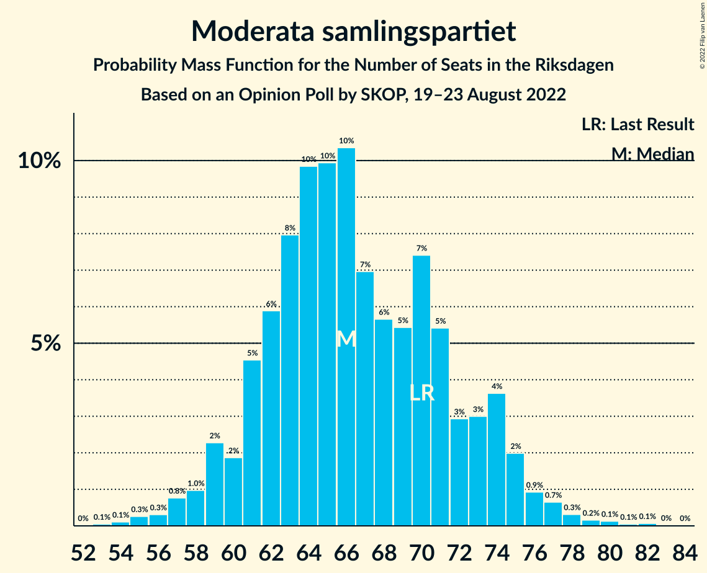

| Number of Seats | Probability | Accumulated | Special Marks |
|:---------------:|:-----------:|:-----------:|:-------------:|
| 53 | 0.1% | 100% |  |
| 54 | 0.1% | 99.9% |  |
| 55 | 0.3% | 99.8% |  |
| 56 | 0.3% | 99.6% |  |
| 57 | 0.8% | 99.2% |  |
| 58 | 1.0% | 98% |  |
| 59 | 2% | 98% |  |
| 60 | 2% | 95% |  |
| 61 | 5% | 93% |  |
| 62 | 6% | 89% |  |
| 63 | 8% | 83% |  |
| 64 | 10% | 75% |  |
| 65 | 10% | 65% |  |
| 66 | 10% | 55% | Median |
| 67 | 7% | 45% |  |
| 68 | 6% | 38% |  |
| 69 | 5% | 32% |  |
| 70 | 7% | 27% | Last Result |
| 71 | 5% | 19% |  |
| 72 | 3% | 14% |  |
| 73 | 3% | 11% |  |
| 74 | 4% | 8% |  |
| 75 | 2% | 4% |  |
| 76 | 0.9% | 2% |  |
| 77 | 0.7% | 1.4% |  |
| 78 | 0.3% | 0.8% |  |
| 79 | 0.2% | 0.5% |  |
| 80 | 0.1% | 0.3% |  |
| 81 | 0.1% | 0.2% |  |
| 82 | 0.1% | 0.1% |  |
| 83 | 0% | 0.1% |  |
| 84 | 0% | 0% |  |

### Sverigedemokraterna

*For a full overview of the results for this party, see the [Sverigedemokraterna](party-sverigedemokraterna.html) page.*

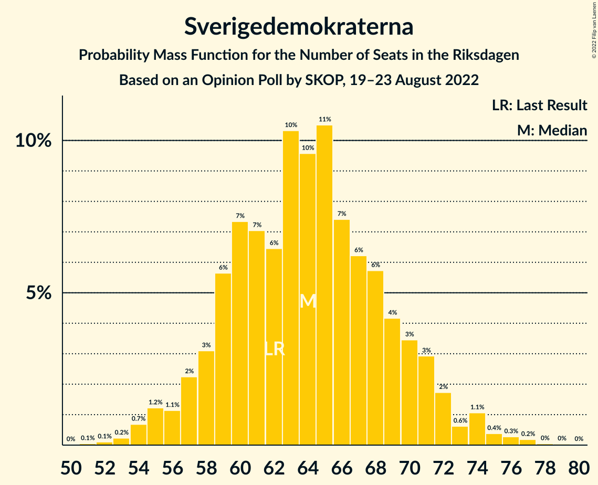

| Number of Seats | Probability | Accumulated | Special Marks |
|:---------------:|:-----------:|:-----------:|:-------------:|
| 51 | 0.1% | 100% |  |
| 52 | 0.1% | 99.9% |  |
| 53 | 0.2% | 99.8% |  |
| 54 | 0.7% | 99.6% |  |
| 55 | 1.2% | 98.9% |  |
| 56 | 1.1% | 98% |  |
| 57 | 2% | 97% |  |
| 58 | 3% | 94% |  |
| 59 | 6% | 91% |  |
| 60 | 7% | 86% |  |
| 61 | 7% | 78% |  |
| 62 | 6% | 71% | Last Result |
| 63 | 10% | 65% |  |
| 64 | 10% | 54% | Median |
| 65 | 11% | 45% |  |
| 66 | 7% | 34% |  |
| 67 | 6% | 27% |  |
| 68 | 6% | 21% |  |
| 69 | 4% | 15% |  |
| 70 | 3% | 11% |  |
| 71 | 3% | 7% |  |
| 72 | 2% | 4% |  |
| 73 | 0.6% | 3% |  |
| 74 | 1.1% | 2% |  |
| 75 | 0.4% | 1.0% |  |
| 76 | 0.3% | 0.6% |  |
| 77 | 0.2% | 0.3% |  |
| 78 | 0% | 0.1% |  |
| 79 | 0% | 0.1% |  |
| 80 | 0% | 0% |  |

### Vänsterpartiet

*For a full overview of the results for this party, see the [Vänsterpartiet](party-vänsterpartiet.html) page.*

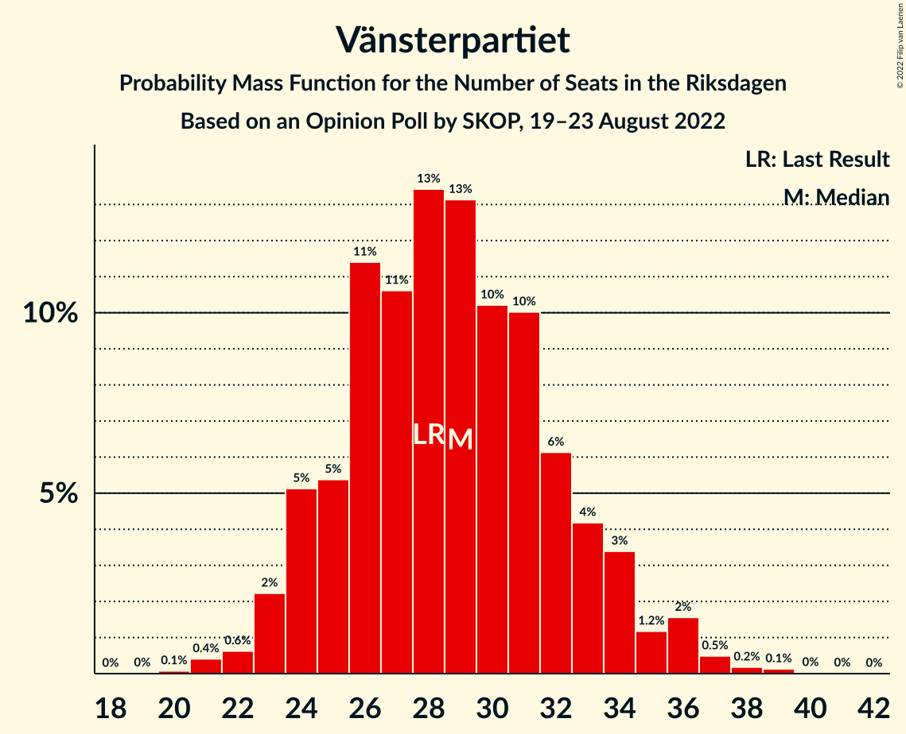

| Number of Seats | Probability | Accumulated | Special Marks |
|:---------------:|:-----------:|:-----------:|:-------------:|
| 20 | 0.1% | 100% |  |
| 21 | 0.4% | 99.9% |  |
| 22 | 0.6% | 99.5% |  |
| 23 | 2% | 98.9% |  |
| 24 | 5% | 97% |  |
| 25 | 5% | 92% |  |
| 26 | 11% | 86% |  |
| 27 | 11% | 75% |  |
| 28 | 13% | 64% | Last Result |
| 29 | 13% | 51% | Median |
| 30 | 10% | 38% |  |
| 31 | 10% | 27% |  |
| 32 | 6% | 17% |  |
| 33 | 4% | 11% |  |
| 34 | 3% | 7% |  |
| 35 | 1.2% | 4% |  |
| 36 | 2% | 2% |  |
| 37 | 0.5% | 0.9% |  |
| 38 | 0.2% | 0.4% |  |
| 39 | 0.1% | 0.2% |  |
| 40 | 0% | 0.1% |  |
| 41 | 0% | 0% |  |

### Liberalerna

*For a full overview of the results for this party, see the [Liberalerna](party-liberalerna.html) page.*

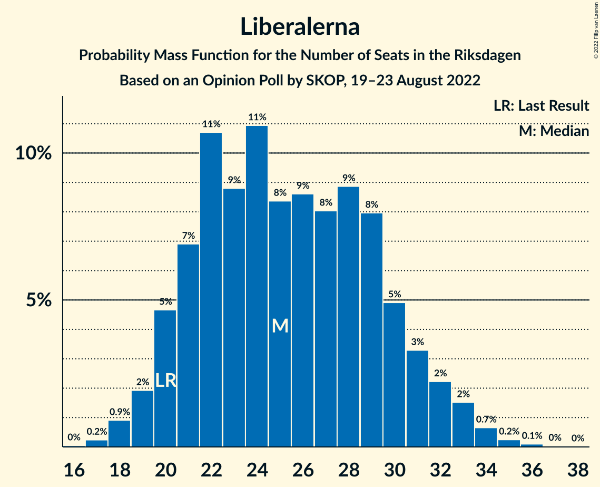

| Number of Seats | Probability | Accumulated | Special Marks |
|:---------------:|:-----------:|:-----------:|:-------------:|
| 16 | 0% | 100% |  |
| 17 | 0.2% | 99.9% |  |
| 18 | 0.9% | 99.7% |  |
| 19 | 2% | 98.8% |  |
| 20 | 5% | 97% | Last Result |
| 21 | 7% | 92% |  |
| 22 | 11% | 85% |  |
| 23 | 9% | 75% |  |
| 24 | 11% | 66% |  |
| 25 | 8% | 55% | Median |
| 26 | 9% | 46% |  |
| 27 | 8% | 38% |  |
| 28 | 9% | 30% |  |
| 29 | 8% | 21% |  |
| 30 | 5% | 13% |  |
| 31 | 3% | 8% |  |
| 32 | 2% | 5% |  |
| 33 | 2% | 3% |  |
| 34 | 0.7% | 1.1% |  |
| 35 | 0.2% | 0.4% |  |
| 36 | 0.1% | 0.2% |  |
| 37 | 0% | 0.1% |  |
| 38 | 0% | 0% |  |

### Centerpartiet

*For a full overview of the results for this party, see the [Centerpartiet](party-centerpartiet.html) page.*

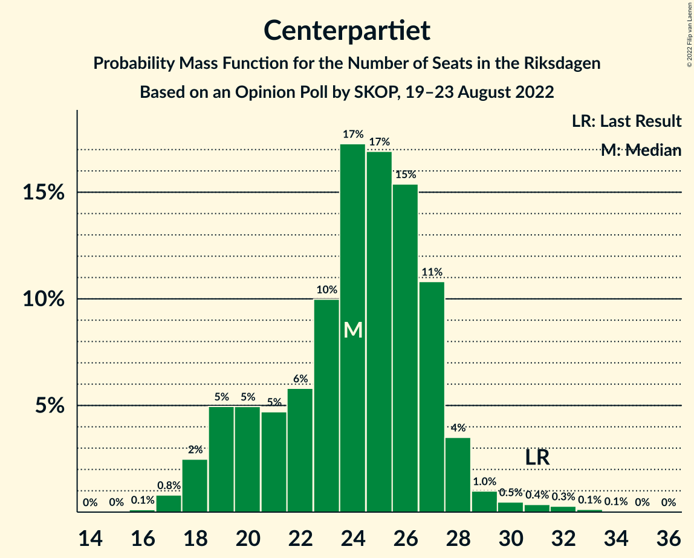

| Number of Seats | Probability | Accumulated | Special Marks |
|:---------------:|:-----------:|:-----------:|:-------------:|
| 16 | 0.1% | 100% |  |
| 17 | 0.8% | 99.9% |  |
| 18 | 2% | 99.1% |  |
| 19 | 5% | 97% |  |
| 20 | 5% | 92% |  |
| 21 | 5% | 87% |  |
| 22 | 6% | 82% |  |
| 23 | 10% | 76% |  |
| 24 | 17% | 66% | Median |
| 25 | 17% | 49% |  |
| 26 | 15% | 32% |  |
| 27 | 11% | 17% |  |
| 28 | 4% | 6% |  |
| 29 | 1.0% | 2% |  |
| 30 | 0.5% | 1.3% |  |
| 31 | 0.4% | 0.8% | Last Result |
| 32 | 0.3% | 0.5% |  |
| 33 | 0.1% | 0.2% |  |
| 34 | 0.1% | 0.1% |  |
| 35 | 0% | 0% |  |

### Miljöpartiet de gröna

*For a full overview of the results for this party, see the [Miljöpartiet de gröna](party-miljöpartietdegröna.html) page.*

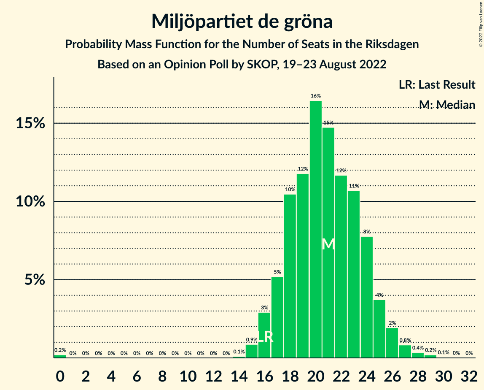

| Number of Seats | Probability | Accumulated | Special Marks |
|:---------------:|:-----------:|:-----------:|:-------------:|
| 0 | 0.2% | 100% |  |
| 1 | 0% | 99.8% |  |
| 2 | 0% | 99.8% |  |
| 3 | 0% | 99.8% |  |
| 4 | 0% | 99.8% |  |
| 5 | 0% | 99.8% |  |
| 6 | 0% | 99.8% |  |
| 7 | 0% | 99.8% |  |
| 8 | 0% | 99.8% |  |
| 9 | 0% | 99.8% |  |
| 10 | 0% | 99.8% |  |
| 11 | 0% | 99.8% |  |
| 12 | 0% | 99.8% |  |
| 13 | 0% | 99.8% |  |
| 14 | 0.1% | 99.8% |  |
| 15 | 0.9% | 99.7% |  |
| 16 | 3% | 98.8% | Last Result |
| 17 | 5% | 96% |  |
| 18 | 10% | 91% |  |
| 19 | 12% | 80% |  |
| 20 | 16% | 68% |  |
| 21 | 15% | 52% | Median |
| 22 | 12% | 37% |  |
| 23 | 11% | 26% |  |
| 24 | 8% | 15% |  |
| 25 | 4% | 7% |  |
| 26 | 2% | 3% |  |
| 27 | 0.8% | 1.5% |  |
| 28 | 0.4% | 0.6% |  |
| 29 | 0.2% | 0.3% |  |
| 30 | 0.1% | 0.1% |  |
| 31 | 0% | 0% |  |

### Kristdemokraterna

*For a full overview of the results for this party, see the [Kristdemokraterna](party-kristdemokraterna.html) page.*

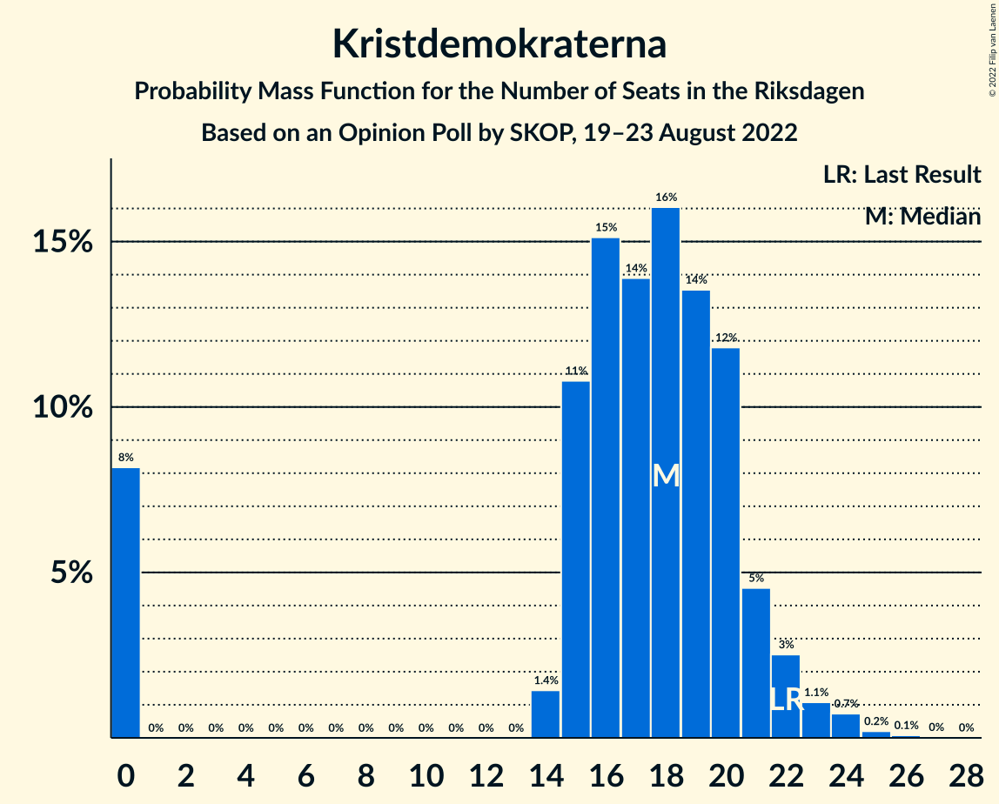

| Number of Seats | Probability | Accumulated | Special Marks |
|:---------------:|:-----------:|:-----------:|:-------------:|
| 0 | 8% | 100% |  |
| 1 | 0% | 92% |  |
| 2 | 0% | 92% |  |
| 3 | 0% | 92% |  |
| 4 | 0% | 92% |  |
| 5 | 0% | 92% |  |
| 6 | 0% | 92% |  |
| 7 | 0% | 92% |  |
| 8 | 0% | 92% |  |
| 9 | 0% | 92% |  |
| 10 | 0% | 92% |  |
| 11 | 0% | 92% |  |
| 12 | 0% | 92% |  |
| 13 | 0% | 92% |  |
| 14 | 1.4% | 92% |  |
| 15 | 11% | 90% |  |
| 16 | 15% | 80% |  |
| 17 | 14% | 64% |  |
| 18 | 16% | 51% | Median |
| 19 | 14% | 35% |  |
| 20 | 12% | 21% |  |
| 21 | 5% | 9% |  |
| 22 | 3% | 5% | Last Result |
| 23 | 1.1% | 2% |  |
| 24 | 0.7% | 1.0% |  |
| 25 | 0.2% | 0.3% |  |
| 26 | 0.1% | 0.1% |  |
| 27 | 0% | 0% |  |

## Coalitions

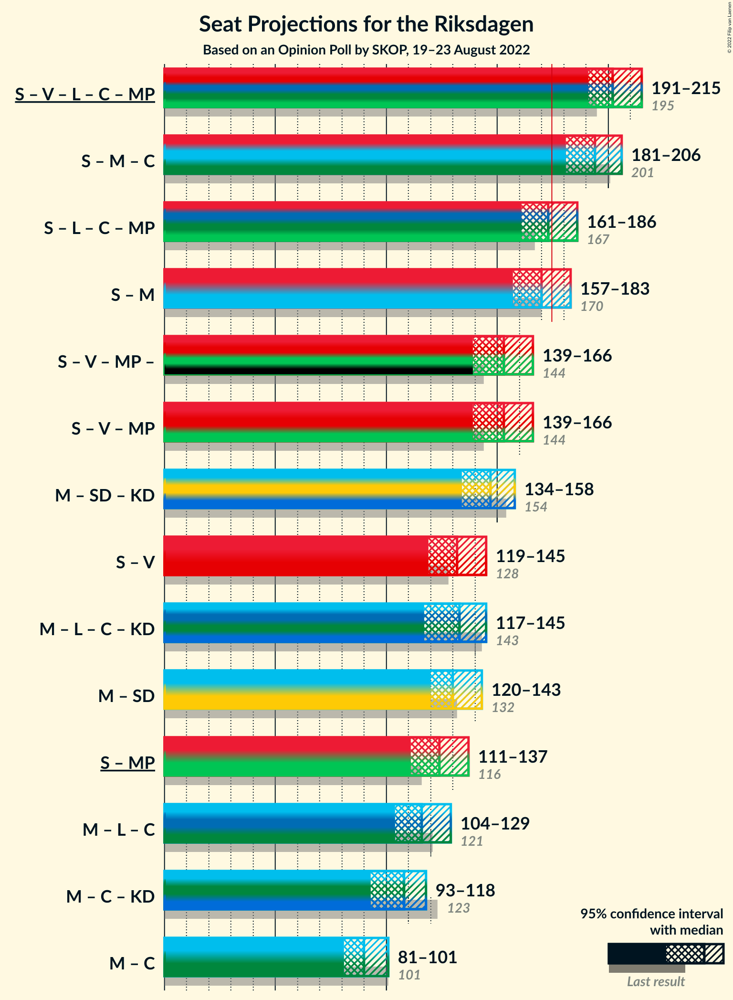

### Confidence Intervals

| Coalition | Last Result | Median | Majority? | 80% Confidence Interval | 90% Confidence Interval | 95% Confidence Interval | 99% Confidence Interval |
|:---------:|:-----------:|:------:|:---------:|:-----------------------:|:-----------------------:|:-----------------------:|:-----------------------:|
| Sveriges socialdemokratiska arbetareparti – Vänsterpartiet – Liberalerna – Centerpartiet – Miljöpartiet de gröna | 195 | 202 | 100% | 194–210 | 192–213 | 191–215 | 187–221 |
| Sveriges socialdemokratiska arbetareparti – Moderata samlingspartiet – Centerpartiet | 201 | 194 | 99.9% | 184–202 | 183–204 | 181–206 | 177–213 |
| Sveriges socialdemokratiska arbetareparti – Liberalerna – Centerpartiet – Miljöpartiet de gröna | 167 | 173 | 40% | 165–182 | 163–184 | 161–186 | 158–191 |
| Sveriges socialdemokratiska arbetareparti – Moderata samlingspartiet | 170 | 170 | 26% | 160–178 | 159–181 | 157–183 | 154–188 |
| Sveriges socialdemokratiska arbetareparti – Vänsterpartiet – Miljöpartiet de gröna | 144 | 153 | 0.1% | 143–162 | 141–164 | 139–166 | 136–170 |
| Moderata samlingspartiet – Sverigedemokraterna – Kristdemokraterna | 154 | 147 | 0% | 139–155 | 136–157 | 134–158 | 128–162 |
| Sveriges socialdemokratiska arbetareparti – Vänsterpartiet | 128 | 132 | 0% | 123–141 | 121–143 | 119–145 | 116–148 |
| Moderata samlingspartiet – Liberalerna – Centerpartiet – Kristdemokraterna | 143 | 133 | 0% | 124–141 | 121–143 | 117–145 | 113–148 |
| Moderata samlingspartiet – Sverigedemokraterna | 132 | 130 | 0% | 123–138 | 121–140 | 120–143 | 117–147 |
| Sveriges socialdemokratiska arbetareparti – Miljöpartiet de gröna | 116 | 124 | 0% | 114–133 | 112–135 | 111–137 | 108–140 |
| Moderata samlingspartiet – Liberalerna – Centerpartiet | 121 | 116 | 0% | 108–125 | 106–127 | 104–129 | 102–133 |
| Moderata samlingspartiet – Centerpartiet – Kristdemokraterna | 123 | 108 | 0% | 99–114 | 95–116 | 93–118 | 89–121 |
| Moderata samlingspartiet – Centerpartiet | 101 | 90 | 0% | 84–97 | 83–100 | 81–101 | 79–104 |

### Sveriges socialdemokratiska arbetareparti – Vänsterpartiet – Liberalerna – Centerpartiet – Miljöpartiet de gröna

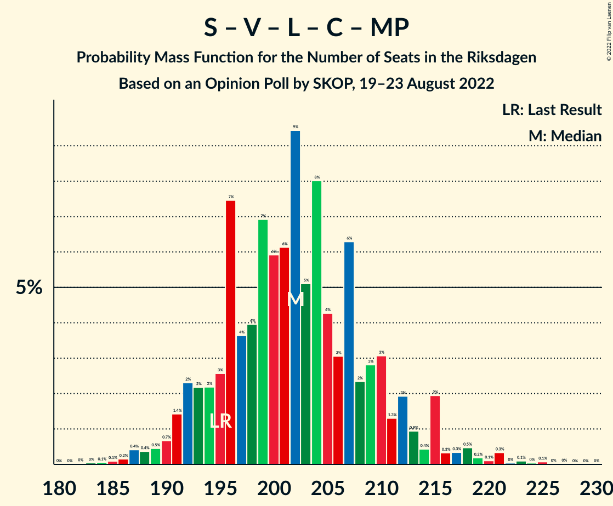

| Number of Seats | Probability | Accumulated | Special Marks |
|:---------------:|:-----------:|:-----------:|:-------------:|
| 183 | 0% | 100% |  |
| 184 | 0.1% | 99.9% |  |
| 185 | 0.1% | 99.9% |  |
| 186 | 0.2% | 99.8% |  |
| 187 | 0.4% | 99.6% |  |
| 188 | 0.4% | 99.2% |  |
| 189 | 0.5% | 98.8% |  |
| 190 | 0.7% | 98% |  |
| 191 | 1.4% | 98% |  |
| 192 | 2% | 96% |  |
| 193 | 2% | 94% |  |
| 194 | 2% | 92% |  |
| 195 | 3% | 90% | Last Result |
| 196 | 7% | 87% |  |
| 197 | 4% | 80% |  |
| 198 | 4% | 76% |  |
| 199 | 7% | 72% |  |
| 200 | 6% | 65% |  |
| 201 | 6% | 59% |  |
| 202 | 9% | 53% |  |
| 203 | 5% | 44% | Median |
| 204 | 8% | 38% |  |
| 205 | 4% | 30% |  |
| 206 | 3% | 26% |  |
| 207 | 6% | 23% |  |
| 208 | 2% | 17% |  |
| 209 | 3% | 14% |  |
| 210 | 3% | 12% |  |
| 211 | 1.3% | 9% |  |
| 212 | 2% | 7% |  |
| 213 | 0.9% | 5% |  |
| 214 | 0.4% | 4% |  |
| 215 | 2% | 4% |  |
| 216 | 0.3% | 2% |  |
| 217 | 0.3% | 2% |  |
| 218 | 0.5% | 1.4% |  |
| 219 | 0.2% | 0.9% |  |
| 220 | 0.1% | 0.7% |  |
| 221 | 0.3% | 0.6% |  |
| 222 | 0% | 0.3% |  |
| 223 | 0.1% | 0.3% |  |
| 224 | 0% | 0.2% |  |
| 225 | 0.1% | 0.1% |  |
| 226 | 0% | 0% |  |

### Sveriges socialdemokratiska arbetareparti – Moderata samlingspartiet – Centerpartiet

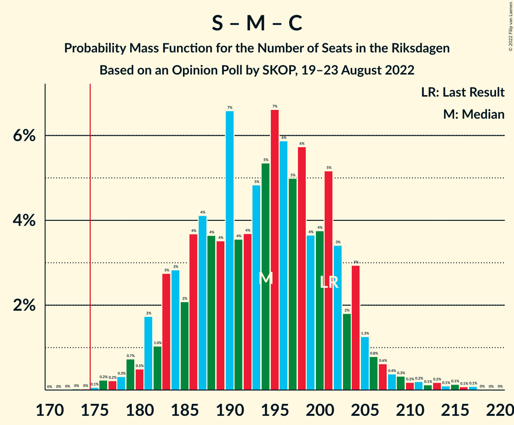

| Number of Seats | Probability | Accumulated | Special Marks |
|:---------------:|:-----------:|:-----------:|:-------------:|
| 173 | 0% | 100% |  |
| 174 | 0% | 99.9% |  |
| 175 | 0.1% | 99.9% | Majority |
| 176 | 0.2% | 99.9% |  |
| 177 | 0.2% | 99.6% |  |
| 178 | 0.3% | 99.4% |  |
| 179 | 0.7% | 99.1% |  |
| 180 | 0.5% | 98% |  |
| 181 | 2% | 98% |  |
| 182 | 1.0% | 96% |  |
| 183 | 3% | 95% |  |
| 184 | 3% | 92% |  |
| 185 | 2% | 90% |  |
| 186 | 4% | 87% |  |
| 187 | 4% | 84% |  |
| 188 | 4% | 80% |  |
| 189 | 4% | 76% |  |
| 190 | 7% | 72% |  |
| 191 | 4% | 66% |  |
| 192 | 4% | 62% |  |
| 193 | 5% | 59% |  |
| 194 | 5% | 54% | Median |
| 195 | 7% | 48% |  |
| 196 | 6% | 42% |  |
| 197 | 5% | 36% |  |
| 198 | 6% | 31% |  |
| 199 | 4% | 25% |  |
| 200 | 4% | 22% |  |
| 201 | 5% | 18% | Last Result |
| 202 | 3% | 13% |  |
| 203 | 2% | 9% |  |
| 204 | 3% | 7% |  |
| 205 | 1.3% | 5% |  |
| 206 | 0.8% | 3% |  |
| 207 | 0.6% | 2% |  |
| 208 | 0.4% | 2% |  |
| 209 | 0.3% | 1.5% |  |
| 210 | 0.2% | 1.1% |  |
| 211 | 0.2% | 0.9% |  |
| 212 | 0.1% | 0.7% |  |
| 213 | 0.2% | 0.6% |  |
| 214 | 0.1% | 0.4% |  |
| 215 | 0.1% | 0.3% |  |
| 216 | 0.1% | 0.2% |  |
| 217 | 0.1% | 0.1% |  |
| 218 | 0% | 0% |  |

### Sveriges socialdemokratiska arbetareparti – Liberalerna – Centerpartiet – Miljöpartiet de gröna

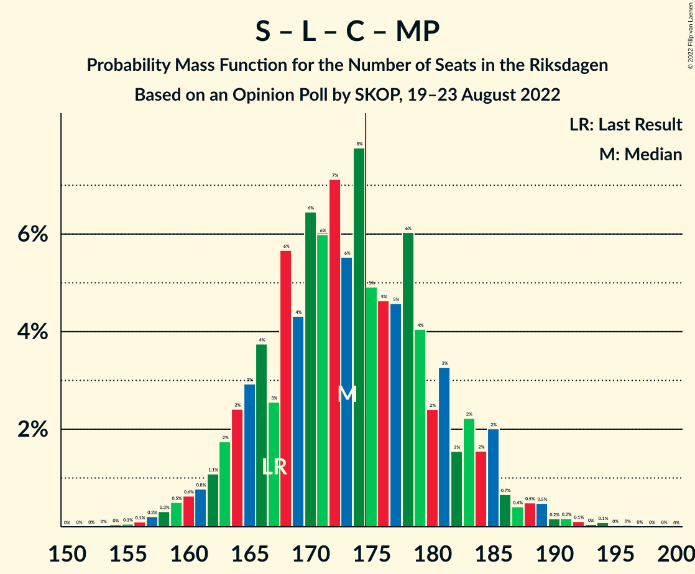

| Number of Seats | Probability | Accumulated | Special Marks |
|:---------------:|:-----------:|:-----------:|:-------------:|
| 153 | 0% | 100% |  |
| 154 | 0% | 99.9% |  |
| 155 | 0.1% | 99.9% |  |
| 156 | 0.1% | 99.8% |  |
| 157 | 0.2% | 99.7% |  |
| 158 | 0.3% | 99.5% |  |
| 159 | 0.5% | 99.2% |  |
| 160 | 0.6% | 98.7% |  |
| 161 | 0.8% | 98% |  |
| 162 | 1.1% | 97% |  |
| 163 | 2% | 96% |  |
| 164 | 2% | 94% |  |
| 165 | 3% | 92% |  |
| 166 | 4% | 89% |  |
| 167 | 3% | 85% | Last Result |
| 168 | 6% | 83% |  |
| 169 | 4% | 77% |  |
| 170 | 6% | 73% |  |
| 171 | 6% | 66% |  |
| 172 | 7% | 60% |  |
| 173 | 6% | 53% |  |
| 174 | 8% | 48% | Median |
| 175 | 5% | 40% | Majority |
| 176 | 5% | 35% |  |
| 177 | 5% | 30% |  |
| 178 | 6% | 26% |  |
| 179 | 4% | 20% |  |
| 180 | 2% | 16% |  |
| 181 | 3% | 13% |  |
| 182 | 2% | 10% |  |
| 183 | 2% | 9% |  |
| 184 | 2% | 6% |  |
| 185 | 2% | 5% |  |
| 186 | 0.7% | 3% |  |
| 187 | 0.4% | 2% |  |
| 188 | 0.5% | 2% |  |
| 189 | 0.5% | 1.2% |  |
| 190 | 0.2% | 0.7% |  |
| 191 | 0.2% | 0.5% |  |
| 192 | 0.1% | 0.3% |  |
| 193 | 0% | 0.2% |  |
| 194 | 0.1% | 0.2% |  |
| 195 | 0% | 0.1% |  |
| 196 | 0% | 0.1% |  |
| 197 | 0% | 0% |  |

### Sveriges socialdemokratiska arbetareparti – Moderata samlingspartiet

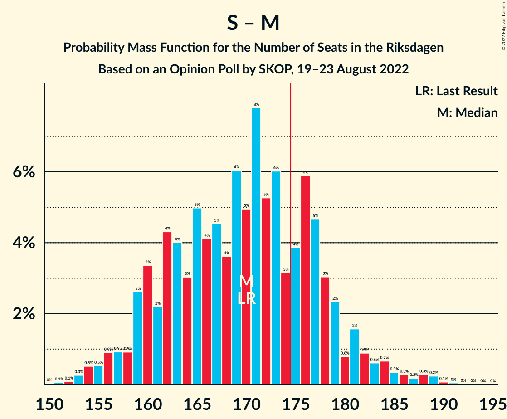

| Number of Seats | Probability | Accumulated | Special Marks |
|:---------------:|:-----------:|:-----------:|:-------------:|
| 150 | 0% | 100% |  |
| 151 | 0.1% | 99.9% |  |
| 152 | 0.1% | 99.9% |  |
| 153 | 0.3% | 99.8% |  |
| 154 | 0.5% | 99.5% |  |
| 155 | 0.5% | 99.0% |  |
| 156 | 0.9% | 98.5% |  |
| 157 | 0.9% | 98% |  |
| 158 | 0.9% | 97% |  |
| 159 | 3% | 96% |  |
| 160 | 3% | 93% |  |
| 161 | 2% | 90% |  |
| 162 | 4% | 88% |  |
| 163 | 4% | 83% |  |
| 164 | 3% | 79% |  |
| 165 | 5% | 76% |  |
| 166 | 4% | 71% |  |
| 167 | 5% | 67% |  |
| 168 | 4% | 63% |  |
| 169 | 6% | 59% |  |
| 170 | 5% | 53% | Last Result, Median |
| 171 | 8% | 48% |  |
| 172 | 5% | 40% |  |
| 173 | 6% | 35% |  |
| 174 | 3% | 29% |  |
| 175 | 4% | 26% | Majority |
| 176 | 6% | 22% |  |
| 177 | 5% | 16% |  |
| 178 | 3% | 11% |  |
| 179 | 2% | 8% |  |
| 180 | 0.8% | 6% |  |
| 181 | 2% | 5% |  |
| 182 | 0.9% | 4% |  |
| 183 | 0.6% | 3% |  |
| 184 | 0.7% | 2% |  |
| 185 | 0.3% | 1.5% |  |
| 186 | 0.3% | 1.1% |  |
| 187 | 0.2% | 0.9% |  |
| 188 | 0.3% | 0.7% |  |
| 189 | 0.2% | 0.4% |  |
| 190 | 0.1% | 0.2% |  |
| 191 | 0% | 0.1% |  |
| 192 | 0% | 0.1% |  |
| 193 | 0% | 0% |  |

### Sveriges socialdemokratiska arbetareparti – Vänsterpartiet – Miljöpartiet de gröna

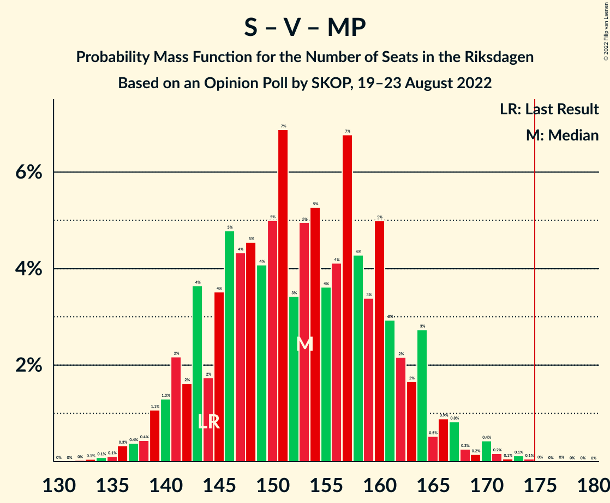

| Number of Seats | Probability | Accumulated | Special Marks |
|:---------------:|:-----------:|:-----------:|:-------------:|
| 132 | 0% | 100% |  |
| 133 | 0.1% | 99.9% |  |
| 134 | 0.1% | 99.9% |  |
| 135 | 0.1% | 99.8% |  |
| 136 | 0.3% | 99.7% |  |
| 137 | 0.4% | 99.4% |  |
| 138 | 0.4% | 99.0% |  |
| 139 | 1.1% | 98.5% |  |
| 140 | 1.3% | 97% |  |
| 141 | 2% | 96% |  |
| 142 | 2% | 94% |  |
| 143 | 4% | 92% |  |
| 144 | 2% | 89% | Last Result |
| 145 | 4% | 87% |  |
| 146 | 5% | 83% |  |
| 147 | 4% | 79% |  |
| 148 | 5% | 74% |  |
| 149 | 4% | 70% |  |
| 150 | 5% | 66% |  |
| 151 | 7% | 61% |  |
| 152 | 3% | 54% |  |
| 153 | 5% | 50% |  |
| 154 | 5% | 45% | Median |
| 155 | 4% | 40% |  |
| 156 | 4% | 37% |  |
| 157 | 7% | 32% |  |
| 158 | 4% | 26% |  |
| 159 | 3% | 21% |  |
| 160 | 5% | 18% |  |
| 161 | 3% | 13% |  |
| 162 | 2% | 10% |  |
| 163 | 2% | 8% |  |
| 164 | 3% | 6% |  |
| 165 | 0.5% | 4% |  |
| 166 | 0.9% | 3% |  |
| 167 | 0.8% | 2% |  |
| 168 | 0.3% | 1.3% |  |
| 169 | 0.2% | 1.0% |  |
| 170 | 0.4% | 0.9% |  |
| 171 | 0.2% | 0.5% |  |
| 172 | 0.1% | 0.3% |  |
| 173 | 0.1% | 0.2% |  |
| 174 | 0.1% | 0.1% |  |
| 175 | 0% | 0.1% | Majority |
| 176 | 0% | 0% |  |

### Moderata samlingspartiet – Sverigedemokraterna – Kristdemokraterna

| Number of Seats | Probability | Accumulated | Special Marks |
|:---------------:|:-----------:|:-----------:|:-------------:|
| 124 | 0.1% | 100% |  |
| 125 | 0% | 99.9% |  |
| 126 | 0.1% | 99.8% |  |
| 127 | 0% | 99.7% |  |
| 128 | 0.3% | 99.7% |  |
| 129 | 0.1% | 99.4% |  |
| 130 | 0.2% | 99.3% |  |
| 131 | 0.5% | 99.1% |  |
| 132 | 0.3% | 98.6% |  |
| 133 | 0.3% | 98% |  |
| 134 | 2% | 98% |  |
| 135 | 0.4% | 96% |  |
| 136 | 0.9% | 96% |  |
| 137 | 2% | 95% |  |
| 138 | 1.3% | 93% |  |
| 139 | 3% | 91% |  |
| 140 | 3% | 88% |  |
| 141 | 2% | 85% |  |
| 142 | 6% | 83% |  |
| 143 | 3% | 77% |  |
| 144 | 4% | 74% |  |
| 145 | 8% | 70% |  |
| 146 | 5% | 62% |  |
| 147 | 9% | 56% |  |
| 148 | 6% | 47% | Median |
| 149 | 6% | 41% |  |
| 150 | 7% | 35% |  |
| 151 | 4% | 28% |  |
| 152 | 4% | 24% |  |
| 153 | 7% | 20% |  |
| 154 | 3% | 13% | Last Result |
| 155 | 2% | 10% |  |
| 156 | 2% | 8% |  |
| 157 | 2% | 6% |  |
| 158 | 1.4% | 4% |  |
| 159 | 0.7% | 2% |  |
| 160 | 0.5% | 2% |  |
| 161 | 0.4% | 1.2% |  |
| 162 | 0.4% | 0.8% |  |
| 163 | 0.2% | 0.4% |  |
| 164 | 0.1% | 0.2% |  |
| 165 | 0.1% | 0.1% |  |
| 166 | 0% | 0.1% |  |
| 167 | 0% | 0% |  |

### Sveriges socialdemokratiska arbetareparti – Vänsterpartiet

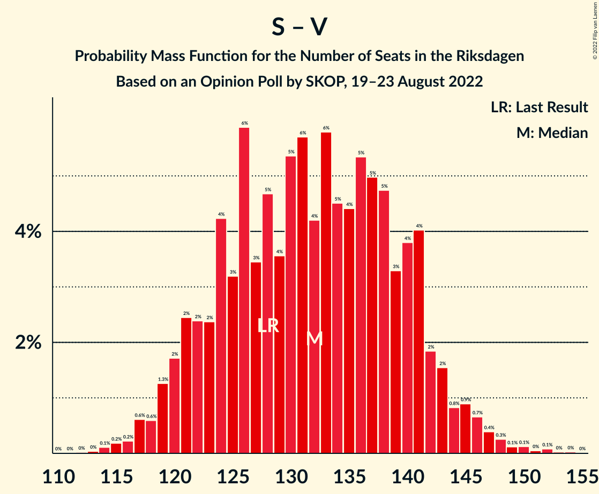

| Number of Seats | Probability | Accumulated | Special Marks |
|:---------------:|:-----------:|:-----------:|:-------------:|
| 113 | 0% | 100% |  |
| 114 | 0.1% | 99.9% |  |
| 115 | 0.2% | 99.8% |  |
| 116 | 0.2% | 99.6% |  |
| 117 | 0.6% | 99.4% |  |
| 118 | 0.6% | 98.8% |  |
| 119 | 1.3% | 98% |  |
| 120 | 2% | 97% |  |
| 121 | 2% | 95% |  |
| 122 | 2% | 93% |  |
| 123 | 2% | 90% |  |
| 124 | 4% | 88% |  |
| 125 | 3% | 84% |  |
| 126 | 6% | 81% |  |
| 127 | 3% | 75% |  |
| 128 | 5% | 71% | Last Result |
| 129 | 4% | 67% |  |
| 130 | 5% | 63% |  |
| 131 | 6% | 58% |  |
| 132 | 4% | 52% |  |
| 133 | 6% | 48% | Median |
| 134 | 5% | 42% |  |
| 135 | 4% | 37% |  |
| 136 | 5% | 33% |  |
| 137 | 5% | 28% |  |
| 138 | 5% | 23% |  |
| 139 | 3% | 18% |  |
| 140 | 4% | 15% |  |
| 141 | 4% | 11% |  |
| 142 | 2% | 7% |  |
| 143 | 2% | 5% |  |
| 144 | 0.8% | 3% |  |
| 145 | 0.9% | 3% |  |
| 146 | 0.7% | 2% |  |
| 147 | 0.4% | 1.1% |  |
| 148 | 0.3% | 0.7% |  |
| 149 | 0.1% | 0.4% |  |
| 150 | 0.1% | 0.3% |  |
| 151 | 0% | 0.2% |  |
| 152 | 0.1% | 0.2% |  |
| 153 | 0% | 0.1% |  |
| 154 | 0% | 0.1% |  |
| 155 | 0% | 0% |  |

### Moderata samlingspartiet – Liberalerna – Centerpartiet – Kristdemokraterna

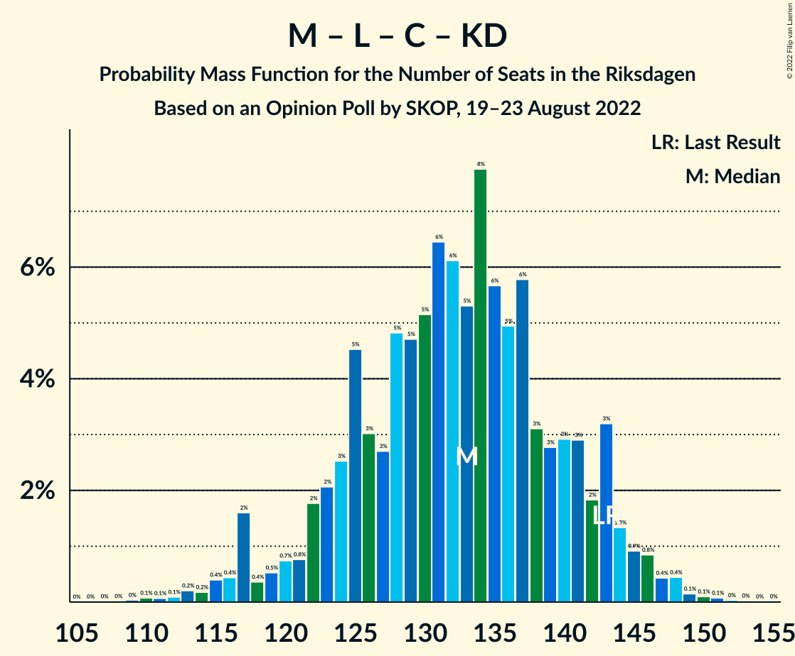

| Number of Seats | Probability | Accumulated | Special Marks |
|:---------------:|:-----------:|:-----------:|:-------------:|
| 109 | 0% | 100% |  |
| 110 | 0.1% | 99.9% |  |
| 111 | 0.1% | 99.8% |  |
| 112 | 0.1% | 99.8% |  |
| 113 | 0.2% | 99.7% |  |
| 114 | 0.2% | 99.5% |  |
| 115 | 0.4% | 99.3% |  |
| 116 | 0.4% | 98.9% |  |
| 117 | 2% | 98% |  |
| 118 | 0.4% | 97% |  |
| 119 | 0.5% | 96% |  |
| 120 | 0.7% | 96% |  |
| 121 | 0.8% | 95% |  |
| 122 | 2% | 94% |  |
| 123 | 2% | 93% |  |
| 124 | 3% | 91% |  |
| 125 | 5% | 88% |  |
| 126 | 3% | 84% |  |
| 127 | 3% | 81% |  |
| 128 | 5% | 78% |  |
| 129 | 5% | 73% |  |
| 130 | 5% | 68% |  |
| 131 | 6% | 63% |  |
| 132 | 6% | 57% |  |
| 133 | 5% | 51% | Median |
| 134 | 8% | 45% |  |
| 135 | 6% | 38% |  |
| 136 | 5% | 32% |  |
| 137 | 6% | 27% |  |
| 138 | 3% | 21% |  |
| 139 | 3% | 18% |  |
| 140 | 3% | 15% |  |
| 141 | 3% | 12% |  |
| 142 | 2% | 9% |  |
| 143 | 3% | 8% | Last Result |
| 144 | 1.3% | 4% |  |
| 145 | 0.9% | 3% |  |
| 146 | 0.8% | 2% |  |
| 147 | 0.4% | 1.3% |  |
| 148 | 0.4% | 0.9% |  |
| 149 | 0.1% | 0.4% |  |
| 150 | 0.1% | 0.3% |  |
| 151 | 0.1% | 0.2% |  |
| 152 | 0% | 0.1% |  |
| 153 | 0% | 0.1% |  |
| 154 | 0% | 0% |  |

### Moderata samlingspartiet – Sverigedemokraterna

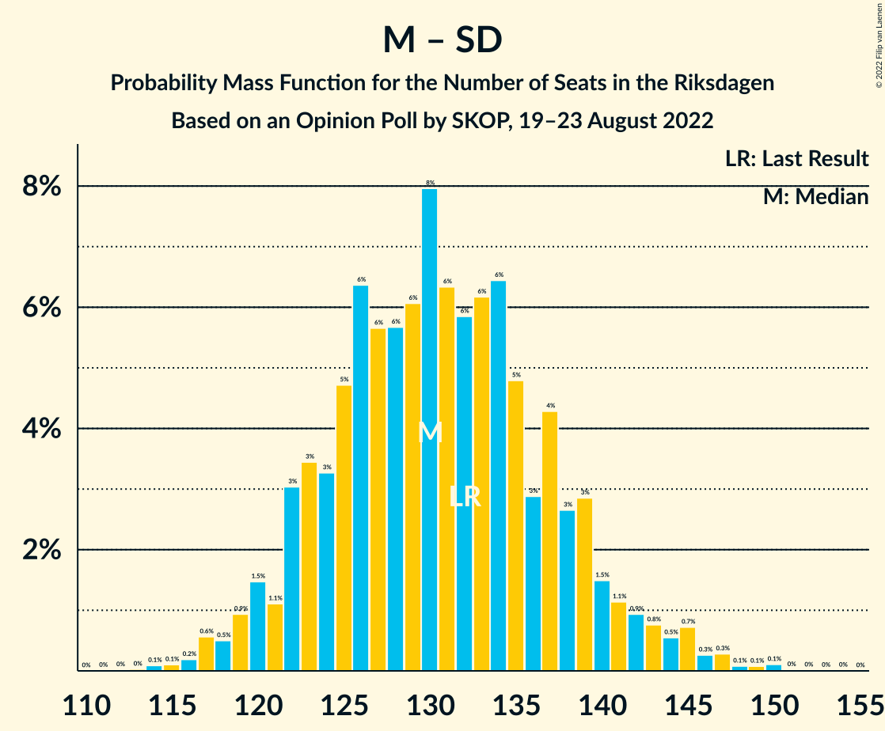

| Number of Seats | Probability | Accumulated | Special Marks |
|:---------------:|:-----------:|:-----------:|:-------------:|
| 113 | 0% | 100% |  |
| 114 | 0.1% | 99.9% |  |
| 115 | 0.1% | 99.8% |  |
| 116 | 0.2% | 99.7% |  |
| 117 | 0.6% | 99.5% |  |
| 118 | 0.5% | 99.0% |  |
| 119 | 0.9% | 98% |  |
| 120 | 1.5% | 98% |  |
| 121 | 1.1% | 96% |  |
| 122 | 3% | 95% |  |
| 123 | 3% | 92% |  |
| 124 | 3% | 88% |  |
| 125 | 5% | 85% |  |
| 126 | 6% | 80% |  |
| 127 | 6% | 74% |  |
| 128 | 6% | 68% |  |
| 129 | 6% | 63% |  |
| 130 | 8% | 57% | Median |
| 131 | 6% | 49% |  |
| 132 | 6% | 42% | Last Result |
| 133 | 6% | 37% |  |
| 134 | 6% | 30% |  |
| 135 | 5% | 24% |  |
| 136 | 3% | 19% |  |
| 137 | 4% | 16% |  |
| 138 | 3% | 12% |  |
| 139 | 3% | 9% |  |
| 140 | 1.5% | 6% |  |
| 141 | 1.1% | 5% |  |
| 142 | 0.9% | 4% |  |
| 143 | 0.8% | 3% |  |
| 144 | 0.5% | 2% |  |
| 145 | 0.7% | 2% |  |
| 146 | 0.3% | 0.9% |  |
| 147 | 0.3% | 0.6% |  |
| 148 | 0.1% | 0.3% |  |
| 149 | 0.1% | 0.3% |  |
| 150 | 0.1% | 0.2% |  |
| 151 | 0% | 0.1% |  |
| 152 | 0% | 0% |  |

### Sveriges socialdemokratiska arbetareparti – Miljöpartiet de gröna

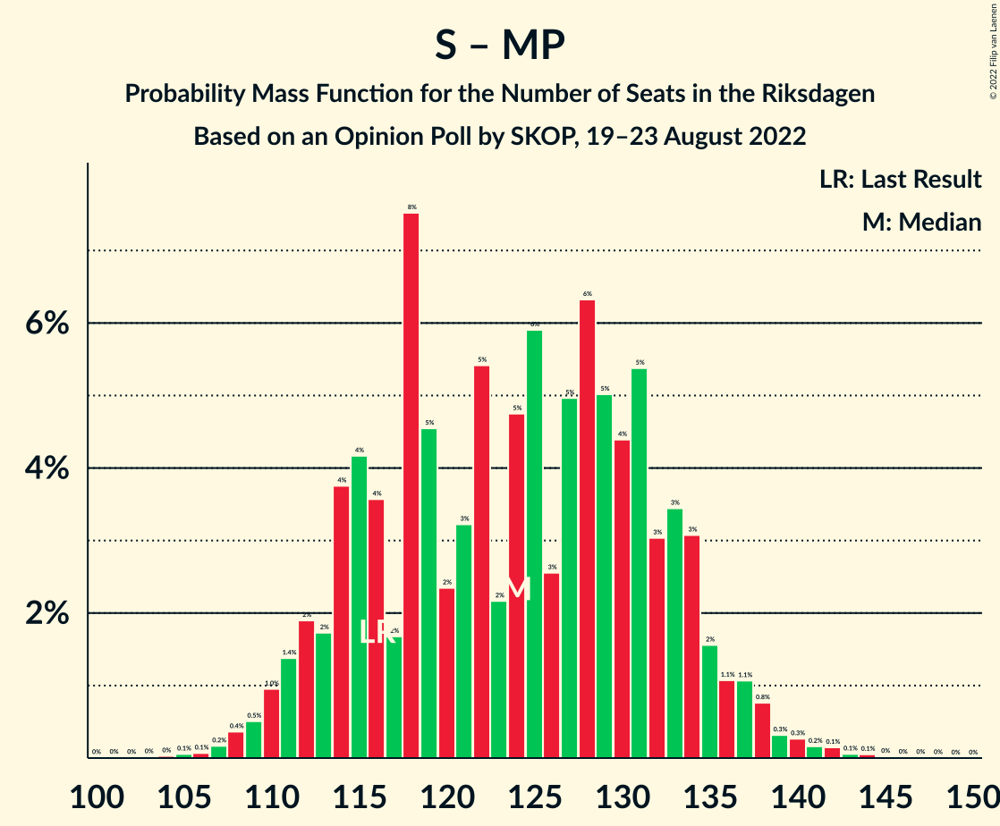

| Number of Seats | Probability | Accumulated | Special Marks |
|:---------------:|:-----------:|:-----------:|:-------------:|
| 103 | 0% | 100% |  |
| 104 | 0% | 99.9% |  |
| 105 | 0.1% | 99.9% |  |
| 106 | 0.1% | 99.8% |  |
| 107 | 0.2% | 99.8% |  |
| 108 | 0.4% | 99.6% |  |
| 109 | 0.5% | 99.2% |  |
| 110 | 1.0% | 98.7% |  |
| 111 | 1.4% | 98% |  |
| 112 | 2% | 96% |  |
| 113 | 2% | 95% |  |
| 114 | 4% | 93% |  |
| 115 | 4% | 89% |  |
| 116 | 4% | 85% | Last Result |
| 117 | 2% | 81% |  |
| 118 | 8% | 80% |  |
| 119 | 5% | 72% |  |
| 120 | 2% | 68% |  |
| 121 | 3% | 65% |  |
| 122 | 5% | 62% |  |
| 123 | 2% | 57% |  |
| 124 | 5% | 54% |  |
| 125 | 6% | 50% | Median |
| 126 | 3% | 44% |  |
| 127 | 5% | 41% |  |
| 128 | 6% | 36% |  |
| 129 | 5% | 30% |  |
| 130 | 4% | 25% |  |
| 131 | 5% | 20% |  |
| 132 | 3% | 15% |  |
| 133 | 3% | 12% |  |
| 134 | 3% | 9% |  |
| 135 | 2% | 6% |  |
| 136 | 1.1% | 4% |  |
| 137 | 1.1% | 3% |  |
| 138 | 0.8% | 2% |  |
| 139 | 0.3% | 1.1% |  |
| 140 | 0.3% | 0.7% |  |
| 141 | 0.2% | 0.5% |  |
| 142 | 0.1% | 0.3% |  |
| 143 | 0.1% | 0.2% |  |
| 144 | 0.1% | 0.1% |  |
| 145 | 0% | 0.1% |  |
| 146 | 0% | 0% |  |

### Moderata samlingspartiet – Liberalerna – Centerpartiet

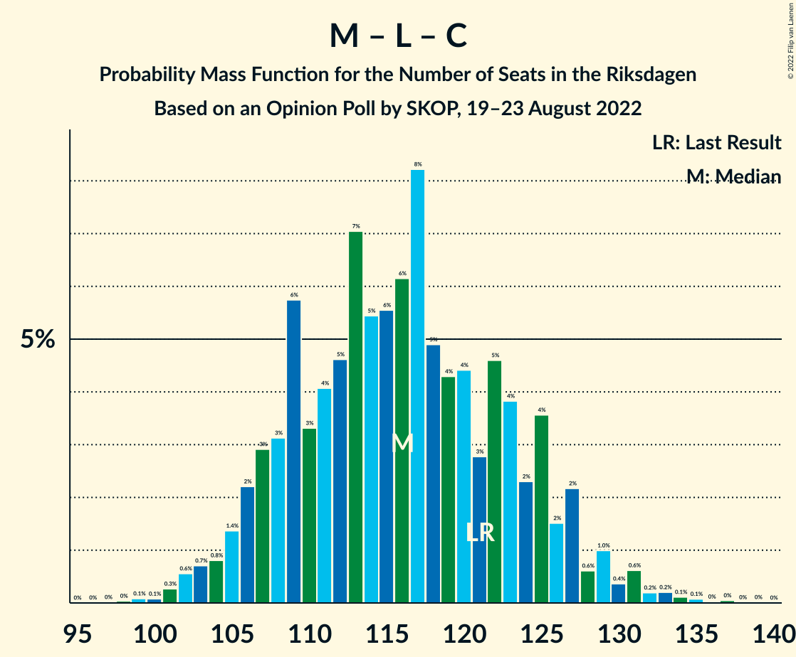

| Number of Seats | Probability | Accumulated | Special Marks |
|:---------------:|:-----------:|:-----------:|:-------------:|
| 98 | 0% | 100% |  |
| 99 | 0.1% | 99.9% |  |
| 100 | 0.1% | 99.8% |  |
| 101 | 0.3% | 99.8% |  |
| 102 | 0.6% | 99.5% |  |
| 103 | 0.7% | 98.9% |  |
| 104 | 0.8% | 98% |  |
| 105 | 1.4% | 97% |  |
| 106 | 2% | 96% |  |
| 107 | 3% | 94% |  |
| 108 | 3% | 91% |  |
| 109 | 6% | 88% |  |
| 110 | 3% | 82% |  |
| 111 | 4% | 79% |  |
| 112 | 5% | 75% |  |
| 113 | 7% | 70% |  |
| 114 | 5% | 63% |  |
| 115 | 6% | 58% | Median |
| 116 | 6% | 52% |  |
| 117 | 8% | 46% |  |
| 118 | 5% | 38% |  |
| 119 | 4% | 33% |  |
| 120 | 4% | 28% |  |
| 121 | 3% | 24% | Last Result |
| 122 | 5% | 21% |  |
| 123 | 4% | 17% |  |
| 124 | 2% | 13% |  |
| 125 | 4% | 11% |  |
| 126 | 2% | 7% |  |
| 127 | 2% | 5% |  |
| 128 | 0.6% | 3% |  |
| 129 | 1.0% | 3% |  |
| 130 | 0.4% | 2% |  |
| 131 | 0.6% | 1.3% |  |
| 132 | 0.2% | 0.7% |  |
| 133 | 0.2% | 0.5% |  |
| 134 | 0.1% | 0.3% |  |
| 135 | 0.1% | 0.2% |  |
| 136 | 0% | 0.1% |  |
| 137 | 0% | 0.1% |  |
| 138 | 0% | 0% |  |

### Moderata samlingspartiet – Centerpartiet – Kristdemokraterna

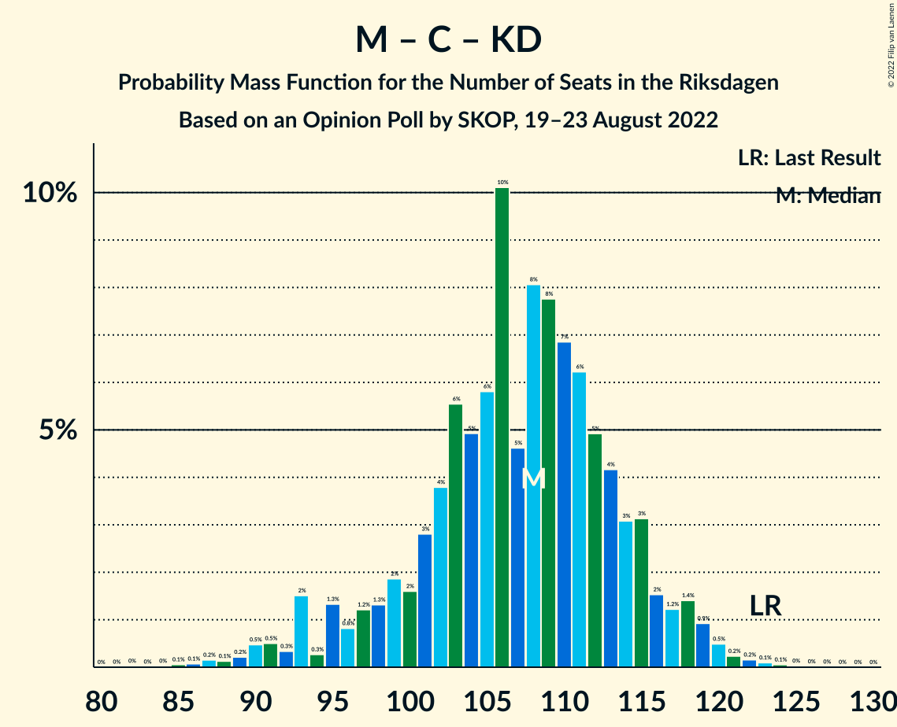

| Number of Seats | Probability | Accumulated | Special Marks |
|:---------------:|:-----------:|:-----------:|:-------------:|
| 83 | 0% | 100% |  |
| 84 | 0% | 99.9% |  |
| 85 | 0.1% | 99.9% |  |
| 86 | 0.1% | 99.9% |  |
| 87 | 0.2% | 99.8% |  |
| 88 | 0.1% | 99.6% |  |
| 89 | 0.2% | 99.5% |  |
| 90 | 0.5% | 99.3% |  |
| 91 | 0.5% | 98.8% |  |
| 92 | 0.3% | 98% |  |
| 93 | 2% | 98% |  |
| 94 | 0.3% | 96% |  |
| 95 | 1.3% | 96% |  |
| 96 | 0.8% | 95% |  |
| 97 | 1.2% | 94% |  |
| 98 | 1.3% | 93% |  |
| 99 | 2% | 92% |  |
| 100 | 2% | 90% |  |
| 101 | 3% | 88% |  |
| 102 | 4% | 85% |  |
| 103 | 6% | 81% |  |
| 104 | 5% | 76% |  |
| 105 | 6% | 71% |  |
| 106 | 10% | 65% |  |
| 107 | 5% | 55% |  |
| 108 | 8% | 50% | Median |
| 109 | 8% | 42% |  |
| 110 | 7% | 35% |  |
| 111 | 6% | 28% |  |
| 112 | 5% | 22% |  |
| 113 | 4% | 17% |  |
| 114 | 3% | 12% |  |
| 115 | 3% | 9% |  |
| 116 | 2% | 6% |  |
| 117 | 1.2% | 5% |  |
| 118 | 1.4% | 3% |  |
| 119 | 0.9% | 2% |  |
| 120 | 0.5% | 1.1% |  |
| 121 | 0.2% | 0.6% |  |
| 122 | 0.2% | 0.4% |  |
| 123 | 0.1% | 0.2% | Last Result |
| 124 | 0.1% | 0.1% |  |
| 125 | 0% | 0.1% |  |
| 126 | 0% | 0% |  |

### Moderata samlingspartiet – Centerpartiet

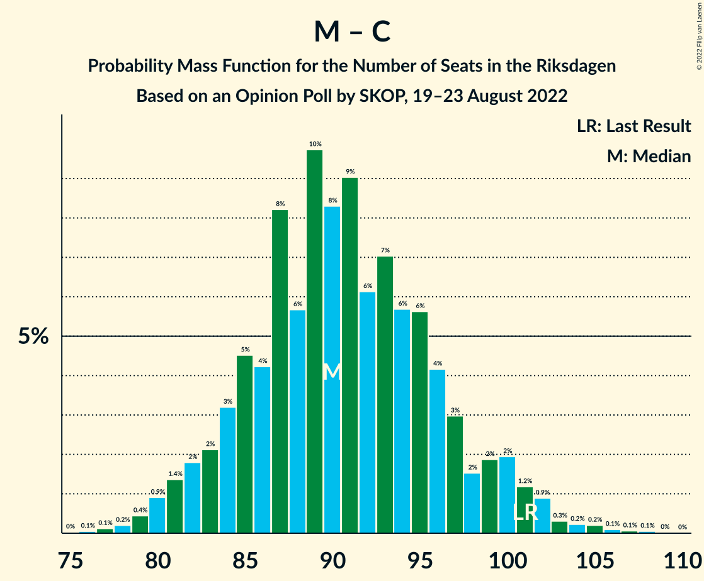

| Number of Seats | Probability | Accumulated | Special Marks |
|:---------------:|:-----------:|:-----------:|:-------------:|
| 75 | 0% | 100% |  |
| 76 | 0.1% | 99.9% |  |
| 77 | 0.1% | 99.9% |  |
| 78 | 0.2% | 99.8% |  |
| 79 | 0.4% | 99.6% |  |
| 80 | 0.9% | 99.1% |  |
| 81 | 1.4% | 98% |  |
| 82 | 2% | 97% |  |
| 83 | 2% | 95% |  |
| 84 | 3% | 93% |  |
| 85 | 5% | 90% |  |
| 86 | 4% | 85% |  |
| 87 | 8% | 81% |  |
| 88 | 6% | 73% |  |
| 89 | 10% | 67% |  |
| 90 | 8% | 57% | Median |
| 91 | 9% | 49% |  |
| 92 | 6% | 40% |  |
| 93 | 7% | 34% |  |
| 94 | 6% | 27% |  |
| 95 | 6% | 21% |  |
| 96 | 4% | 16% |  |
| 97 | 3% | 11% |  |
| 98 | 2% | 8% |  |
| 99 | 2% | 7% |  |
| 100 | 2% | 5% |  |
| 101 | 1.2% | 3% | Last Result |
| 102 | 0.9% | 2% |  |
| 103 | 0.3% | 1.0% |  |
| 104 | 0.2% | 0.7% |  |
| 105 | 0.2% | 0.5% |  |
| 106 | 0.1% | 0.3% |  |
| 107 | 0.1% | 0.2% |  |
| 108 | 0.1% | 0.1% |  |
| 109 | 0% | 0% |  |

## Technical Information

### Opinion Poll

+ **Polling firm:** SKOP
+ **Commissioner(s):** —
+ **Fieldwork period:** 19–23 August 2022

### Calculations

+ **Sample size:** 1106
+ **Simulations done:** 1,048,576
+ **Error estimate:** 2.33%

