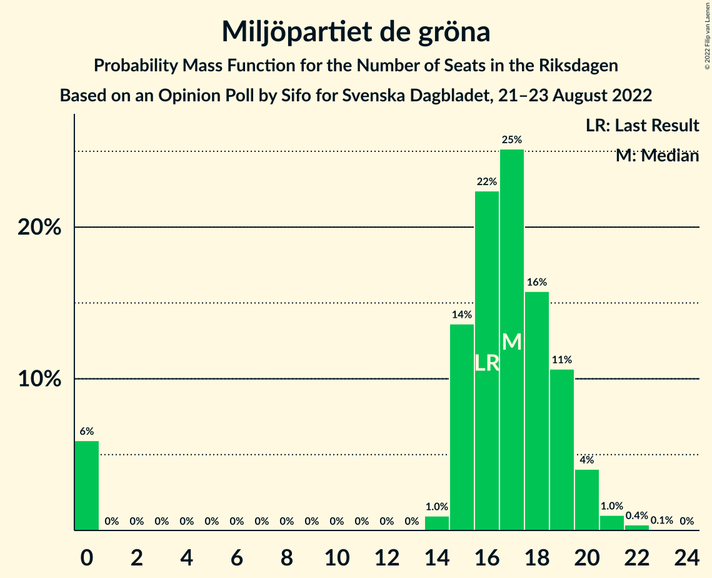
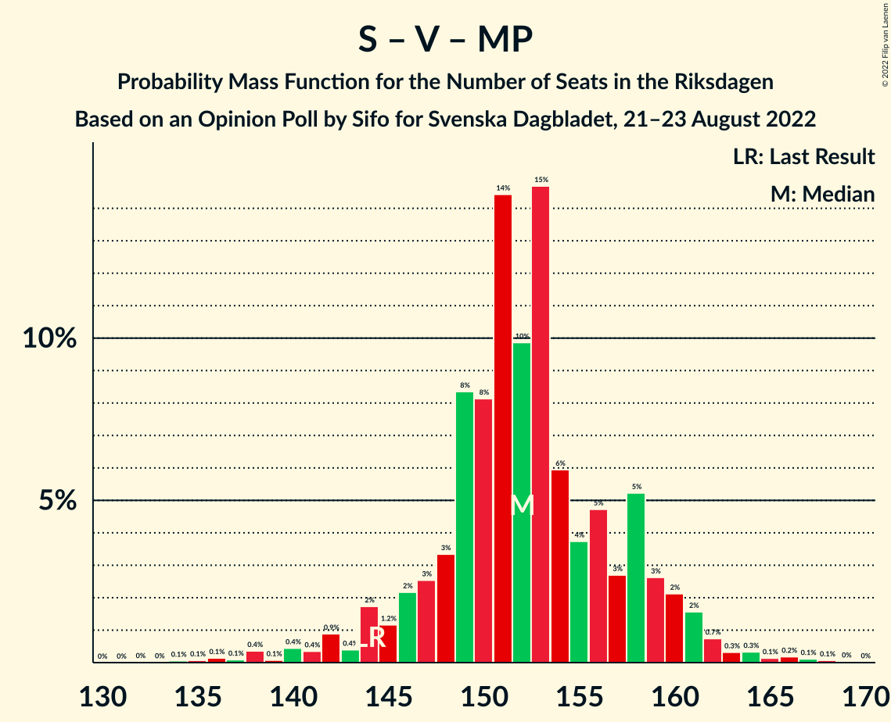

# Opinion Poll by Sifo for Svenska Dagbladet, 21–23 August 2022

<a href="#voting-intentions">Voting Intentions</a> | <a href="#seats">Seats</a> | <a href="#coalitions">Coalitions</a> | <a href="#technical-information">Technical Information</a>

## Voting Intentions

### Confidence Intervals

| Party | Last Result | Poll Result | 80% Confidence Interval | 90% Confidence Interval | 95% Confidence Interval | 99% Confidence Interval |
|:-----:|:-----------:|:-----------:|:-----------------------:|:-----------------------:|:-----------------------:|:-----------------------:|
| Sveriges socialdemokratiska arbetareparti | 28.3% | 30.2% | 28.9–31.5% |28.6–31.8% |28.3–32.1% |27.7–32.8% |
| Sverigedemokraterna | 17.5% | 19.2% | 18.1–20.3% |17.8–20.6% |17.6–20.9% |17.1–21.4% |
| Moderata samlingspartiet | 19.8% | 18.6% | 17.6–19.7% |17.3–20.0% |17.0–20.3% |16.5–20.8% |
| Vänsterpartiet | 8.0% | 7.9% | 7.2–8.7% |7.0–8.9% |6.8–9.1% |6.5–9.5% |
| Kristdemokraterna | 6.3% | 6.3% | 5.7–7.0% |5.5–7.2% |5.3–7.4% |5.1–7.7% |
| Centerpartiet | 8.6% | 6.0% | 5.4–6.7% |5.2–6.9% |5.1–7.1% |4.8–7.5% |
| Liberalerna | 5.5% | 4.8% | 4.2–5.4% |4.1–5.6% |4.0–5.8% |3.7–6.1% |
| Miljöpartiet de gröna | 4.4% | 4.7% | 4.2–5.3% |4.0–5.5% |3.9–5.7% |3.6–6.0% |

*Note:* The poll result column reflects the actual value used in the calculations. Published results may vary slightly, and in addition be rounded to fewer digits.

## Seats

### Confidence Intervals

| Party | Last Result | Median | 80% Confidence Interval | 90% Confidence Interval | 95% Confidence Interval | 99% Confidence Interval |
|:-----:|:-----------:|:------:|:-----------------------:|:-----------------------:|:-----------------------:|:-----------------------:|
| <a href="#sveriges-socialdemokratiska-arbetareparti">Sveriges socialdemokratiska arbetareparti</a> | 100 | 108 | 104–113 |102–115 |101–116 |99–119 |
| <a href="#sverigedemokraterna">Sverigedemokraterna</a> | 62 | 69 | 65–72 |64–74 |63–75 |61–77 |
| <a href="#moderata-samlingspartiet">Moderata samlingspartiet</a> | 70 | 66 | 63–71 |62–72 |61–73 |59–75 |
| <a href="#vänsterpartiet">Vänsterpartiet</a> | 28 | 28 | 26–31 |25–32 |24–33 |23–34 |
| <a href="#kristdemokraterna">Kristdemokraterna</a> | 22 | 22 | 20–25 |20–26 |19–26 |18–28 |
| <a href="#centerpartiet">Centerpartiet</a> | 31 | 22 | 19–24 |19–25 |18–25 |17–27 |
| <a href="#liberalerna">Liberalerna</a> | 20 | 17 | 15–19 |15–20 |0–21 |0–22 |
| <a href="#miljöpartiet-de-gröna">Miljöpartiet de gröna</a> | 16 | 17 | 15–19 |0–20 |0–20 |0–21 |

### Sveriges socialdemokratiska arbetareparti

*For a full overview of the results for this party, see the [Sveriges socialdemokratiska arbetareparti](party-sverigessocialdemokratiskaarbetareparti.html) page.*

| Number of Seats | Probability | Accumulated | Special Marks |
|:---------------:|:-----------:|:-----------:|:-------------:|
| 97 | 0.1% | 100% |  |
| 98 | 0.3% | 99.9% |  |
| 99 | 0.4% | 99.6% |  |
| 100 | 0.9% | 99.2% | Last Result |
| 101 | 2% | 98% |  |
| 102 | 3% | 97% |  |
| 103 | 4% | 94% |  |
| 104 | 6% | 90% |  |
| 105 | 12% | 84% |  |
| 106 | 7% | 72% |  |
| 107 | 15% | 66% |  |
| 108 | 10% | 51% | Median |
| 109 | 11% | 41% |  |
| 110 | 6% | 30% |  |
| 111 | 8% | 24% |  |
| 112 | 4% | 16% |  |
| 113 | 3% | 11% |  |
| 114 | 2% | 8% |  |
| 115 | 3% | 6% |  |
| 116 | 1.3% | 3% |  |
| 117 | 0.5% | 2% |  |
| 118 | 0.5% | 1.1% |  |
| 119 | 0.3% | 0.7% |  |
| 120 | 0.2% | 0.4% |  |
| 121 | 0.1% | 0.2% |  |
| 122 | 0.1% | 0.1% |  |
| 123 | 0% | 0% |  |

### Sverigedemokraterna

*For a full overview of the results for this party, see the [Sverigedemokraterna](party-sverigedemokraterna.html) page.*

| Number of Seats | Probability | Accumulated | Special Marks |
|:---------------:|:-----------:|:-----------:|:-------------:|
| 59 | 0.1% | 100% |  |
| 60 | 0.2% | 99.9% |  |
| 61 | 0.5% | 99.7% |  |
| 62 | 1.3% | 99.3% | Last Result |
| 63 | 2% | 98% |  |
| 64 | 4% | 96% |  |
| 65 | 4% | 92% |  |
| 66 | 9% | 87% |  |
| 67 | 13% | 78% |  |
| 68 | 12% | 66% |  |
| 69 | 14% | 54% | Median |
| 70 | 16% | 40% |  |
| 71 | 7% | 23% |  |
| 72 | 6% | 16% |  |
| 73 | 3% | 10% |  |
| 74 | 3% | 7% |  |
| 75 | 1.3% | 3% |  |
| 76 | 1.3% | 2% |  |
| 77 | 0.5% | 0.9% |  |
| 78 | 0.2% | 0.4% |  |
| 79 | 0.1% | 0.2% |  |
| 80 | 0.1% | 0.1% |  |
| 81 | 0% | 0% |  |

### Moderata samlingspartiet

*For a full overview of the results for this party, see the [Moderata samlingspartiet](party-moderatasamlingspartiet.html) page.*

| Number of Seats | Probability | Accumulated | Special Marks |
|:---------------:|:-----------:|:-----------:|:-------------:|
| 57 | 0.1% | 100% |  |
| 58 | 0.2% | 99.9% |  |
| 59 | 0.6% | 99.7% |  |
| 60 | 0.9% | 99.2% |  |
| 61 | 2% | 98% |  |
| 62 | 4% | 97% |  |
| 63 | 6% | 93% |  |
| 64 | 7% | 87% |  |
| 65 | 9% | 80% |  |
| 66 | 21% | 71% | Median |
| 67 | 10% | 49% |  |
| 68 | 10% | 39% |  |
| 69 | 12% | 29% |  |
| 70 | 6% | 17% | Last Result |
| 71 | 5% | 12% |  |
| 72 | 3% | 6% |  |
| 73 | 2% | 3% |  |
| 74 | 0.7% | 1.4% |  |
| 75 | 0.4% | 0.7% |  |
| 76 | 0.2% | 0.4% |  |
| 77 | 0.1% | 0.1% |  |
| 78 | 0% | 0.1% |  |
| 79 | 0% | 0% |  |

### Vänsterpartiet

*For a full overview of the results for this party, see the [Vänsterpartiet](party-vänsterpartiet.html) page.*

| Number of Seats | Probability | Accumulated | Special Marks |
|:---------------:|:-----------:|:-----------:|:-------------:|
| 22 | 0.1% | 100% |  |
| 23 | 0.5% | 99.8% |  |
| 24 | 2% | 99.3% |  |
| 25 | 6% | 97% |  |
| 26 | 11% | 91% |  |
| 27 | 15% | 80% |  |
| 28 | 17% | 64% | Last Result, Median |
| 29 | 22% | 48% |  |
| 30 | 12% | 25% |  |
| 31 | 7% | 14% |  |
| 32 | 4% | 6% |  |
| 33 | 1.5% | 3% |  |
| 34 | 0.8% | 1.1% |  |
| 35 | 0.2% | 0.2% |  |
| 36 | 0% | 0.1% |  |
| 37 | 0% | 0% |  |

### Kristdemokraterna

*For a full overview of the results for this party, see the [Kristdemokraterna](party-kristdemokraterna.html) page.*

| Number of Seats | Probability | Accumulated | Special Marks |
|:---------------:|:-----------:|:-----------:|:-------------:|
| 17 | 0.2% | 100% |  |
| 18 | 0.7% | 99.8% |  |
| 19 | 4% | 99.1% |  |
| 20 | 9% | 95% |  |
| 21 | 13% | 86% |  |
| 22 | 26% | 73% | Last Result, Median |
| 23 | 17% | 47% |  |
| 24 | 14% | 30% |  |
| 25 | 10% | 16% |  |
| 26 | 3% | 6% |  |
| 27 | 2% | 2% |  |
| 28 | 0.5% | 0.7% |  |
| 29 | 0.1% | 0.2% |  |
| 30 | 0% | 0% |  |

### Centerpartiet

*For a full overview of the results for this party, see the [Centerpartiet](party-centerpartiet.html) page.*

| Number of Seats | Probability | Accumulated | Special Marks |
|:---------------:|:-----------:|:-----------:|:-------------:|
| 16 | 0.1% | 100% |  |
| 17 | 0.5% | 99.9% |  |
| 18 | 3% | 99.3% |  |
| 19 | 7% | 96% |  |
| 20 | 14% | 90% |  |
| 21 | 22% | 76% |  |
| 22 | 22% | 54% | Median |
| 23 | 17% | 31% |  |
| 24 | 8% | 15% |  |
| 25 | 5% | 7% |  |
| 26 | 2% | 2% |  |
| 27 | 0.5% | 0.7% |  |
| 28 | 0.1% | 0.2% |  |
| 29 | 0% | 0% |  |
| 30 | 0% | 0% |  |
| 31 | 0% | 0% | Last Result |

### Liberalerna

*For a full overview of the results for this party, see the [Liberalerna](party-liberalerna.html) page.*

| Number of Seats | Probability | Accumulated | Special Marks |
|:---------------:|:-----------:|:-----------:|:-------------:|
| 0 | 3% | 100% |  |
| 1 | 0% | 97% |  |
| 2 | 0% | 97% |  |
| 3 | 0% | 97% |  |
| 4 | 0% | 97% |  |
| 5 | 0% | 97% |  |
| 6 | 0% | 97% |  |
| 7 | 0% | 97% |  |
| 8 | 0% | 97% |  |
| 9 | 0% | 97% |  |
| 10 | 0% | 97% |  |
| 11 | 0% | 97% |  |
| 12 | 0% | 97% |  |
| 13 | 0% | 97% |  |
| 14 | 1.3% | 97% |  |
| 15 | 9% | 96% |  |
| 16 | 16% | 87% |  |
| 17 | 26% | 71% | Median |
| 18 | 21% | 44% |  |
| 19 | 14% | 23% |  |
| 20 | 6% | 9% | Last Result |
| 21 | 2% | 3% |  |
| 22 | 0.6% | 0.7% |  |
| 23 | 0.1% | 0.2% |  |
| 24 | 0% | 0% |  |

### Miljöpartiet de gröna

*For a full overview of the results for this party, see the [Miljöpartiet de gröna](party-miljöpartietdegröna.html) page.*

| Number of Seats | Probability | Accumulated | Special Marks |
|:---------------:|:-----------:|:-----------:|:-------------:|
| 0 | 6% | 100% |  |
| 1 | 0% | 94% |  |
| 2 | 0% | 94% |  |
| 3 | 0% | 94% |  |
| 4 | 0% | 94% |  |
| 5 | 0% | 94% |  |
| 6 | 0% | 94% |  |
| 7 | 0% | 94% |  |
| 8 | 0% | 94% |  |
| 9 | 0% | 94% |  |
| 10 | 0% | 94% |  |
| 11 | 0% | 94% |  |
| 12 | 0% | 94% |  |
| 13 | 0% | 94% |  |
| 14 | 1.0% | 94% |  |
| 15 | 14% | 93% |  |
| 16 | 22% | 79% | Last Result |
| 17 | 25% | 57% | Median |
| 18 | 16% | 32% |  |
| 19 | 11% | 16% |  |
| 20 | 4% | 6% |  |
| 21 | 1.0% | 1.5% |  |
| 22 | 0.4% | 0.5% |  |
| 23 | 0.1% | 0.1% |  |
| 24 | 0% | 0% |  |

## Coalitions

### Confidence Intervals

| Coalition | Last Result | Median | Majority? | 80% Confidence Interval | 90% Confidence Interval | 95% Confidence Interval | 99% Confidence Interval |
|:---------:|:-----------:|:------:|:---------:|:-----------------------:|:-----------------------:|:-----------------------:|:-----------------------:|
| Sveriges socialdemokratiska arbetareparti – Moderata samlingspartiet – Centerpartiet | 201 | 196 | 100% | 191–202 | 190–205 | 188–207 | 186–211 |
| Sveriges socialdemokratiska arbetareparti – Vänsterpartiet – Centerpartiet – Liberalerna – Miljöpartiet de gröna | 195 | 191 | 99.9% | 186–196 | 183–197 | 182–199 | 177–201 |
| Sveriges socialdemokratiska arbetareparti – Moderata samlingspartiet | 170 | 174 | 49% | 170–180 | 168–183 | 167–185 | 165–189 |
| Sveriges socialdemokratiska arbetareparti – Centerpartiet – Liberalerna – Miljöpartiet de gröna | 167 | 163 | 0.1% | 157–168 | 154–169 | 152–171 | 147–173 |
| Sverigedemokraterna – Moderata samlingspartiet – Kristdemokraterna | 154 | 158 | 0.1% | 153–163 | 152–166 | 150–167 | 148–172 |
| Sveriges socialdemokratiska arbetareparti – Vänsterpartiet – Miljöpartiet de gröna | 144 | 152 | 0% | 147–158 | 145–160 | 142–161 | 138–165 |
| Sveriges socialdemokratiska arbetareparti – Vänsterpartiet | 128 | 136 | 0% | 131–142 | 130–144 | 129–146 | 127–149 |
| Sverigedemokraterna – Moderata samlingspartiet | 132 | 136 | 0% | 130–140 | 129–142 | 128–144 | 125–148 |
| Moderata samlingspartiet – Kristdemokraterna – Centerpartiet – Liberalerna | 143 | 128 | 0% | 123–133 | 121–135 | 119–136 | 114–139 |
| Sveriges socialdemokratiska arbetareparti – Miljöpartiet de gröna | 116 | 124 | 0% | 119–130 | 116–131 | 113–132 | 108–135 |
| Moderata samlingspartiet – Kristdemokraterna – Centerpartiet | 123 | 111 | 0% | 106–116 | 105–118 | 104–119 | 102–122 |
| Moderata samlingspartiet – Centerpartiet – Liberalerna | 121 | 106 | 0% | 101–110 | 99–111 | 96–112 | 90–115 |
| Moderata samlingspartiet – Centerpartiet | 101 | 89 | 0% | 84–93 | 83–94 | 82–95 | 80–98 |

### Sveriges socialdemokratiska arbetareparti – Moderata samlingspartiet – Centerpartiet

| Number of Seats | Probability | Accumulated | Special Marks |
|:---------------:|:-----------:|:-----------:|:-------------:|
| 183 | 0% | 100% |  |
| 184 | 0.1% | 99.9% |  |
| 185 | 0.3% | 99.9% |  |
| 186 | 0.3% | 99.6% |  |
| 187 | 0.7% | 99.3% |  |
| 188 | 1.2% | 98.6% |  |
| 189 | 2% | 97% |  |
| 190 | 3% | 95% |  |
| 191 | 4% | 92% |  |
| 192 | 6% | 89% |  |
| 193 | 4% | 83% |  |
| 194 | 15% | 78% |  |
| 195 | 8% | 64% |  |
| 196 | 10% | 56% | Median |
| 197 | 9% | 45% |  |
| 198 | 9% | 36% |  |
| 199 | 6% | 27% |  |
| 200 | 6% | 21% |  |
| 201 | 3% | 15% | Last Result |
| 202 | 3% | 12% |  |
| 203 | 1.3% | 9% |  |
| 204 | 1.1% | 7% |  |
| 205 | 1.3% | 6% |  |
| 206 | 0.9% | 5% |  |
| 207 | 2% | 4% |  |
| 208 | 0.3% | 2% |  |
| 209 | 0.9% | 2% |  |
| 210 | 0.4% | 1.0% |  |
| 211 | 0.2% | 0.7% |  |
| 212 | 0.2% | 0.5% |  |
| 213 | 0.1% | 0.3% |  |
| 214 | 0% | 0.2% |  |
| 215 | 0% | 0.1% |  |
| 216 | 0% | 0.1% |  |
| 217 | 0% | 0.1% |  |
| 218 | 0% | 0.1% |  |
| 219 | 0% | 0% |  |

### Sveriges socialdemokratiska arbetareparti – Vänsterpartiet – Centerpartiet – Liberalerna – Miljöpartiet de gröna

| Number of Seats | Probability | Accumulated | Special Marks |
|:---------------:|:-----------:|:-----------:|:-------------:|
| 173 | 0.1% | 100% |  |
| 174 | 0% | 99.9% |  |
| 175 | 0.1% | 99.9% | Majority |
| 176 | 0.1% | 99.8% |  |
| 177 | 0.2% | 99.7% |  |
| 178 | 0.1% | 99.4% |  |
| 179 | 0.7% | 99.3% |  |
| 180 | 0.4% | 98.6% |  |
| 181 | 0.6% | 98% |  |
| 182 | 1.2% | 98% |  |
| 183 | 2% | 96% |  |
| 184 | 1.1% | 95% |  |
| 185 | 3% | 94% |  |
| 186 | 4% | 91% |  |
| 187 | 6% | 87% |  |
| 188 | 8% | 80% |  |
| 189 | 5% | 72% |  |
| 190 | 8% | 67% |  |
| 191 | 14% | 59% |  |
| 192 | 11% | 44% | Median |
| 193 | 8% | 34% |  |
| 194 | 4% | 26% |  |
| 195 | 9% | 21% | Last Result |
| 196 | 4% | 12% |  |
| 197 | 4% | 8% |  |
| 198 | 2% | 5% |  |
| 199 | 1.3% | 3% |  |
| 200 | 0.6% | 2% |  |
| 201 | 0.5% | 0.9% |  |
| 202 | 0.3% | 0.4% |  |
| 203 | 0.1% | 0.1% |  |
| 204 | 0% | 0.1% |  |
| 205 | 0% | 0% |  |

### Sveriges socialdemokratiska arbetareparti – Moderata samlingspartiet

| Number of Seats | Probability | Accumulated | Special Marks |
|:---------------:|:-----------:|:-----------:|:-------------:|
| 162 | 0.1% | 100% |  |
| 163 | 0.1% | 99.9% |  |
| 164 | 0.2% | 99.7% |  |
| 165 | 0.5% | 99.5% |  |
| 166 | 1.1% | 99.0% |  |
| 167 | 2% | 98% |  |
| 168 | 3% | 96% |  |
| 169 | 3% | 93% |  |
| 170 | 3% | 90% | Last Result |
| 171 | 8% | 87% |  |
| 172 | 7% | 79% |  |
| 173 | 13% | 71% |  |
| 174 | 9% | 58% | Median |
| 175 | 10% | 49% | Majority |
| 176 | 9% | 40% |  |
| 177 | 9% | 31% |  |
| 178 | 6% | 22% |  |
| 179 | 5% | 16% |  |
| 180 | 2% | 11% |  |
| 181 | 2% | 9% |  |
| 182 | 1.4% | 7% |  |
| 183 | 1.4% | 6% |  |
| 184 | 0.5% | 4% |  |
| 185 | 2% | 4% |  |
| 186 | 0.7% | 2% |  |
| 187 | 0.3% | 1.5% |  |
| 188 | 0.5% | 1.2% |  |
| 189 | 0.2% | 0.6% |  |
| 190 | 0.3% | 0.5% |  |
| 191 | 0.1% | 0.2% |  |
| 192 | 0.1% | 0.2% |  |
| 193 | 0% | 0.1% |  |
| 194 | 0% | 0% |  |

### Sveriges socialdemokratiska arbetareparti – Centerpartiet – Liberalerna – Miljöpartiet de gröna

| Number of Seats | Probability | Accumulated | Special Marks |
|:---------------:|:-----------:|:-----------:|:-------------:|
| 143 | 0% | 100% |  |
| 144 | 0% | 99.9% |  |
| 145 | 0.1% | 99.9% |  |
| 146 | 0.1% | 99.8% |  |
| 147 | 0.2% | 99.7% |  |
| 148 | 0.2% | 99.5% |  |
| 149 | 0.2% | 99.3% |  |
| 150 | 0.3% | 99.0% |  |
| 151 | 0.4% | 98.8% |  |
| 152 | 1.1% | 98% |  |
| 153 | 1.3% | 97% |  |
| 154 | 1.0% | 96% |  |
| 155 | 3% | 95% |  |
| 156 | 1.2% | 92% |  |
| 157 | 2% | 90% |  |
| 158 | 5% | 88% |  |
| 159 | 5% | 84% |  |
| 160 | 6% | 79% |  |
| 161 | 8% | 73% |  |
| 162 | 10% | 65% |  |
| 163 | 12% | 54% |  |
| 164 | 5% | 43% | Median |
| 165 | 11% | 38% |  |
| 166 | 8% | 27% |  |
| 167 | 8% | 19% | Last Result |
| 168 | 3% | 11% |  |
| 169 | 4% | 8% |  |
| 170 | 1.0% | 4% |  |
| 171 | 1.4% | 3% |  |
| 172 | 0.6% | 1.2% |  |
| 173 | 0.3% | 0.6% |  |
| 174 | 0.2% | 0.3% |  |
| 175 | 0.1% | 0.1% | Majority |
| 176 | 0% | 0% |  |

### Sverigedemokraterna – Moderata samlingspartiet – Kristdemokraterna

| Number of Seats | Probability | Accumulated | Special Marks |
|:---------------:|:-----------:|:-----------:|:-------------:|
| 145 | 0% | 100% |  |
| 146 | 0.1% | 99.9% |  |
| 147 | 0.3% | 99.9% |  |
| 148 | 0.5% | 99.6% |  |
| 149 | 0.6% | 99.1% |  |
| 150 | 1.3% | 98% |  |
| 151 | 2% | 97% |  |
| 152 | 4% | 95% |  |
| 153 | 4% | 92% |  |
| 154 | 9% | 88% | Last Result |
| 155 | 4% | 79% |  |
| 156 | 8% | 74% |  |
| 157 | 11% | 66% | Median |
| 158 | 14% | 56% |  |
| 159 | 8% | 41% |  |
| 160 | 5% | 33% |  |
| 161 | 8% | 28% |  |
| 162 | 6% | 20% |  |
| 163 | 4% | 13% |  |
| 164 | 3% | 9% |  |
| 165 | 1.1% | 6% |  |
| 166 | 2% | 5% |  |
| 167 | 1.2% | 4% |  |
| 168 | 0.6% | 2% |  |
| 169 | 0.4% | 2% |  |
| 170 | 0.7% | 1.4% |  |
| 171 | 0.1% | 0.7% |  |
| 172 | 0.2% | 0.6% |  |
| 173 | 0.1% | 0.3% |  |
| 174 | 0.1% | 0.2% |  |
| 175 | 0% | 0.1% | Majority |
| 176 | 0.1% | 0.1% |  |
| 177 | 0% | 0% |  |

### Sveriges socialdemokratiska arbetareparti – Vänsterpartiet – Miljöpartiet de gröna

| Number of Seats | Probability | Accumulated | Special Marks |
|:---------------:|:-----------:|:-----------:|:-------------:|
| 134 | 0.1% | 100% |  |
| 135 | 0.1% | 99.9% |  |
| 136 | 0.1% | 99.8% |  |
| 137 | 0.1% | 99.7% |  |
| 138 | 0.4% | 99.6% |  |
| 139 | 0.1% | 99.2% |  |
| 140 | 0.4% | 99.2% |  |
| 141 | 0.4% | 98.7% |  |
| 142 | 0.9% | 98% |  |
| 143 | 0.4% | 97% |  |
| 144 | 2% | 97% | Last Result |
| 145 | 1.2% | 95% |  |
| 146 | 2% | 94% |  |
| 147 | 3% | 92% |  |
| 148 | 3% | 89% |  |
| 149 | 8% | 86% |  |
| 150 | 8% | 78% |  |
| 151 | 14% | 70% |  |
| 152 | 10% | 55% |  |
| 153 | 15% | 45% | Median |
| 154 | 6% | 31% |  |
| 155 | 4% | 25% |  |
| 156 | 5% | 21% |  |
| 157 | 3% | 16% |  |
| 158 | 5% | 14% |  |
| 159 | 3% | 8% |  |
| 160 | 2% | 6% |  |
| 161 | 2% | 4% |  |
| 162 | 0.7% | 2% |  |
| 163 | 0.3% | 1.2% |  |
| 164 | 0.3% | 0.9% |  |
| 165 | 0.1% | 0.6% |  |
| 166 | 0.2% | 0.4% |  |
| 167 | 0.1% | 0.3% |  |
| 168 | 0.1% | 0.1% |  |
| 169 | 0% | 0.1% |  |
| 170 | 0% | 0% |  |

### Sveriges socialdemokratiska arbetareparti – Vänsterpartiet

| Number of Seats | Probability | Accumulated | Special Marks |
|:---------------:|:-----------:|:-----------:|:-------------:|
| 124 | 0.1% | 100% |  |
| 125 | 0.2% | 99.9% |  |
| 126 | 0.2% | 99.7% |  |
| 127 | 0.5% | 99.6% |  |
| 128 | 1.1% | 99.1% | Last Result |
| 129 | 2% | 98% |  |
| 130 | 2% | 96% |  |
| 131 | 5% | 95% |  |
| 132 | 9% | 89% |  |
| 133 | 5% | 80% |  |
| 134 | 7% | 76% |  |
| 135 | 14% | 68% |  |
| 136 | 14% | 54% | Median |
| 137 | 9% | 40% |  |
| 138 | 5% | 31% |  |
| 139 | 7% | 26% |  |
| 140 | 5% | 19% |  |
| 141 | 2% | 14% |  |
| 142 | 2% | 11% |  |
| 143 | 3% | 9% |  |
| 144 | 2% | 6% |  |
| 145 | 1.2% | 4% |  |
| 146 | 2% | 3% |  |
| 147 | 0.5% | 1.3% |  |
| 148 | 0.2% | 0.8% |  |
| 149 | 0.3% | 0.6% |  |
| 150 | 0.1% | 0.2% |  |
| 151 | 0.1% | 0.2% |  |
| 152 | 0% | 0.1% |  |
| 153 | 0% | 0.1% |  |
| 154 | 0% | 0% |  |

### Sverigedemokraterna – Moderata samlingspartiet

| Number of Seats | Probability | Accumulated | Special Marks |
|:---------------:|:-----------:|:-----------:|:-------------:|
| 123 | 0.1% | 100% |  |
| 124 | 0.1% | 99.9% |  |
| 125 | 0.3% | 99.8% |  |
| 126 | 0.4% | 99.4% |  |
| 127 | 1.2% | 99.0% |  |
| 128 | 1.1% | 98% |  |
| 129 | 3% | 97% |  |
| 130 | 4% | 94% |  |
| 131 | 5% | 89% |  |
| 132 | 7% | 84% | Last Result |
| 133 | 7% | 77% |  |
| 134 | 6% | 70% |  |
| 135 | 9% | 64% | Median |
| 136 | 17% | 55% |  |
| 137 | 9% | 38% |  |
| 138 | 7% | 28% |  |
| 139 | 6% | 21% |  |
| 140 | 7% | 15% |  |
| 141 | 2% | 8% |  |
| 142 | 1.4% | 6% |  |
| 143 | 1.1% | 4% |  |
| 144 | 0.7% | 3% |  |
| 145 | 0.7% | 2% |  |
| 146 | 0.7% | 2% |  |
| 147 | 0.5% | 1.1% |  |
| 148 | 0.3% | 0.6% |  |
| 149 | 0.1% | 0.3% |  |
| 150 | 0.1% | 0.2% |  |
| 151 | 0% | 0.1% |  |
| 152 | 0% | 0.1% |  |
| 153 | 0% | 0% |  |

### Moderata samlingspartiet – Kristdemokraterna – Centerpartiet – Liberalerna

| Number of Seats | Probability | Accumulated | Special Marks |
|:---------------:|:-----------:|:-----------:|:-------------:|
| 109 | 0% | 100% |  |
| 110 | 0.1% | 99.9% |  |
| 111 | 0% | 99.9% |  |
| 112 | 0.1% | 99.8% |  |
| 113 | 0.1% | 99.7% |  |
| 114 | 0.5% | 99.6% |  |
| 115 | 0.2% | 99.1% |  |
| 116 | 0.4% | 98.9% |  |
| 117 | 0.4% | 98.5% |  |
| 118 | 0.5% | 98% |  |
| 119 | 0.7% | 98% |  |
| 120 | 1.2% | 97% |  |
| 121 | 2% | 96% |  |
| 122 | 2% | 94% |  |
| 123 | 4% | 92% |  |
| 124 | 5% | 87% |  |
| 125 | 4% | 82% |  |
| 126 | 13% | 78% |  |
| 127 | 10% | 65% | Median |
| 128 | 7% | 55% |  |
| 129 | 8% | 47% |  |
| 130 | 12% | 39% |  |
| 131 | 9% | 28% |  |
| 132 | 5% | 19% |  |
| 133 | 5% | 14% |  |
| 134 | 3% | 8% |  |
| 135 | 2% | 5% |  |
| 136 | 1.0% | 3% |  |
| 137 | 0.9% | 2% |  |
| 138 | 0.9% | 1.5% |  |
| 139 | 0.3% | 0.6% |  |
| 140 | 0.2% | 0.4% |  |
| 141 | 0.1% | 0.2% |  |
| 142 | 0% | 0.1% |  |
| 143 | 0% | 0.1% | Last Result |
| 144 | 0% | 0% |  |

### Sveriges socialdemokratiska arbetareparti – Miljöpartiet de gröna

| Number of Seats | Probability | Accumulated | Special Marks |
|:---------------:|:-----------:|:-----------:|:-------------:|
| 105 | 0.1% | 100% |  |
| 106 | 0.1% | 99.9% |  |
| 107 | 0% | 99.8% |  |
| 108 | 0.4% | 99.8% |  |
| 109 | 0.1% | 99.3% |  |
| 110 | 0.2% | 99.2% |  |
| 111 | 0.6% | 99.0% |  |
| 112 | 0.7% | 98% |  |
| 113 | 0.6% | 98% |  |
| 114 | 0.6% | 97% |  |
| 115 | 2% | 97% |  |
| 116 | 1.1% | 95% | Last Result |
| 117 | 1.2% | 94% |  |
| 118 | 2% | 93% |  |
| 119 | 2% | 91% |  |
| 120 | 3% | 89% |  |
| 121 | 11% | 86% |  |
| 122 | 7% | 75% |  |
| 123 | 7% | 68% |  |
| 124 | 19% | 61% |  |
| 125 | 10% | 42% | Median |
| 126 | 6% | 32% |  |
| 127 | 9% | 26% |  |
| 128 | 4% | 18% |  |
| 129 | 3% | 14% |  |
| 130 | 3% | 10% |  |
| 131 | 4% | 7% |  |
| 132 | 1.1% | 3% |  |
| 133 | 0.5% | 2% |  |
| 134 | 0.7% | 2% |  |
| 135 | 0.5% | 0.9% |  |
| 136 | 0.3% | 0.5% |  |
| 137 | 0.1% | 0.2% |  |
| 138 | 0% | 0.1% |  |
| 139 | 0% | 0.1% |  |
| 140 | 0% | 0.1% |  |
| 141 | 0% | 0% |  |

### Moderata samlingspartiet – Kristdemokraterna – Centerpartiet

| Number of Seats | Probability | Accumulated | Special Marks |
|:---------------:|:-----------:|:-----------:|:-------------:|
| 99 | 0.1% | 100% |  |
| 100 | 0.1% | 99.9% |  |
| 101 | 0.2% | 99.8% |  |
| 102 | 0.5% | 99.6% |  |
| 103 | 1.1% | 99.1% |  |
| 104 | 2% | 98% |  |
| 105 | 3% | 96% |  |
| 106 | 4% | 93% |  |
| 107 | 5% | 89% |  |
| 108 | 6% | 84% |  |
| 109 | 15% | 78% |  |
| 110 | 8% | 63% | Median |
| 111 | 14% | 55% |  |
| 112 | 6% | 42% |  |
| 113 | 10% | 36% |  |
| 114 | 8% | 26% |  |
| 115 | 7% | 18% |  |
| 116 | 4% | 11% |  |
| 117 | 1.5% | 7% |  |
| 118 | 3% | 6% |  |
| 119 | 1.3% | 3% |  |
| 120 | 0.9% | 2% |  |
| 121 | 0.3% | 0.9% |  |
| 122 | 0.3% | 0.7% |  |
| 123 | 0.1% | 0.3% | Last Result |
| 124 | 0.1% | 0.2% |  |
| 125 | 0.1% | 0.1% |  |
| 126 | 0% | 0.1% |  |
| 127 | 0% | 0% |  |

### Moderata samlingspartiet – Centerpartiet – Liberalerna

| Number of Seats | Probability | Accumulated | Special Marks |
|:---------------:|:-----------:|:-----------:|:-------------:|
| 86 | 0.1% | 100% |  |
| 87 | 0.1% | 99.9% |  |
| 88 | 0.1% | 99.8% |  |
| 89 | 0.1% | 99.7% |  |
| 90 | 0.2% | 99.6% |  |
| 91 | 0.4% | 99.4% |  |
| 92 | 0.5% | 99.0% |  |
| 93 | 0.2% | 98.6% |  |
| 94 | 0.2% | 98% |  |
| 95 | 0.3% | 98% |  |
| 96 | 0.5% | 98% |  |
| 97 | 0.8% | 97% |  |
| 98 | 1.0% | 96% |  |
| 99 | 2% | 95% |  |
| 100 | 3% | 94% |  |
| 101 | 4% | 90% |  |
| 102 | 6% | 86% |  |
| 103 | 6% | 81% |  |
| 104 | 15% | 74% |  |
| 105 | 6% | 60% | Median |
| 106 | 11% | 54% |  |
| 107 | 9% | 43% |  |
| 108 | 12% | 34% |  |
| 109 | 8% | 22% |  |
| 110 | 6% | 14% |  |
| 111 | 4% | 9% |  |
| 112 | 2% | 5% |  |
| 113 | 0.8% | 2% |  |
| 114 | 1.0% | 2% |  |
| 115 | 0.2% | 0.7% |  |
| 116 | 0.2% | 0.4% |  |
| 117 | 0.1% | 0.2% |  |
| 118 | 0.1% | 0.1% |  |
| 119 | 0% | 0.1% |  |
| 120 | 0% | 0% |  |
| 121 | 0% | 0% | Last Result |

### Moderata samlingspartiet – Centerpartiet

| Number of Seats | Probability | Accumulated | Special Marks |
|:---------------:|:-----------:|:-----------:|:-------------:|
| 77 | 0% | 100% |  |
| 78 | 0.1% | 99.9% |  |
| 79 | 0.3% | 99.8% |  |
| 80 | 0.4% | 99.6% |  |
| 81 | 1.2% | 99.1% |  |
| 82 | 3% | 98% |  |
| 83 | 2% | 95% |  |
| 84 | 5% | 94% |  |
| 85 | 7% | 89% |  |
| 86 | 9% | 81% |  |
| 87 | 13% | 73% |  |
| 88 | 9% | 60% | Median |
| 89 | 13% | 51% |  |
| 90 | 9% | 38% |  |
| 91 | 8% | 28% |  |
| 92 | 8% | 20% |  |
| 93 | 6% | 12% |  |
| 94 | 2% | 7% |  |
| 95 | 2% | 4% |  |
| 96 | 1.1% | 2% |  |
| 97 | 0.4% | 1.0% |  |
| 98 | 0.3% | 0.6% |  |
| 99 | 0.1% | 0.4% |  |
| 100 | 0.1% | 0.2% |  |
| 101 | 0% | 0.1% | Last Result |
| 102 | 0% | 0% |  |

## Technical Information

### Opinion Poll

+ **Polling firm:** Sifo
+ **Commissioner(s):** Svenska Dagbladet
+ **Fieldwork period:** 21–23 August 2022

### Calculations

+ **Sample size:** 2194
+ **Simulations done:** 1,048,576
+ **Error estimate:** 0.73%

