# Opinion Poll by Ipsos for Dagens Nyheter, 16–24 August 2022

<a href="#voting-intentions">Voting Intentions</a> | <a href="#seats">Seats</a> | <a href="#coalitions">Coalitions</a> | <a href="#technical-information">Technical Information</a>

## Voting Intentions

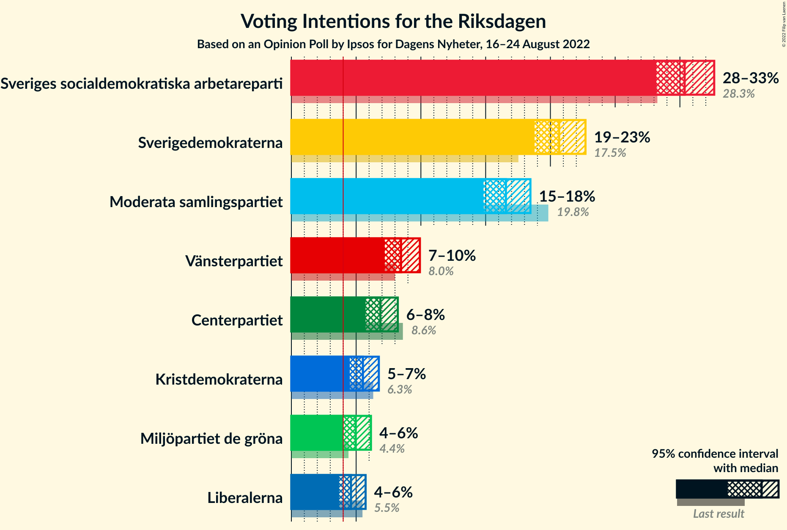

### Confidence Intervals

| Party | Last Result | Poll Result | 80% Confidence Interval | 90% Confidence Interval | 95% Confidence Interval | 99% Confidence Interval |
|:-----:|:-----------:|:-----------:|:-----------------------:|:-----------------------:|:-----------------------:|:-----------------------:|
| Sveriges socialdemokratiska arbetareparti | 28.3% | 30.4% | 28.9–31.9% |28.5–32.3% |28.2–32.6% |27.5–33.4% |
| Sverigedemokraterna | 17.5% | 20.7% | 19.4–22.0% |19.1–22.4% |18.8–22.7% |18.2–23.4% |
| Moderata samlingspartiet | 19.8% | 16.6% | 15.4–17.8% |15.1–18.2% |14.8–18.5% |14.3–19.1% |
| Vänsterpartiet | 8.0% | 8.5% | 7.6–9.4% |7.4–9.7% |7.2–9.9% |6.8–10.4% |
| Centerpartiet | 8.6% | 6.9% | 6.1–7.7% |5.9–8.0% |5.7–8.2% |5.4–8.6% |
| Kristdemokraterna | 6.3% | 5.5% | 4.8–6.3% |4.7–6.6% |4.5–6.8% |4.2–7.1% |
| Miljöpartiet de gröna | 4.4% | 5.0% | 4.3–5.7% |4.2–5.9% |4.0–6.1% |3.7–6.5% |
| Liberalerna | 5.5% | 4.6% | 4.0–5.3% |3.8–5.5% |3.7–5.7% |3.4–6.1% |

*Note:* The poll result column reflects the actual value used in the calculations. Published results may vary slightly, and in addition be rounded to fewer digits.

## Seats

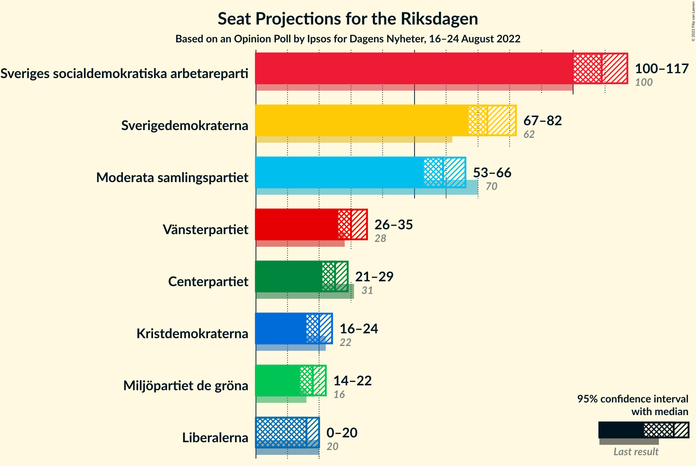

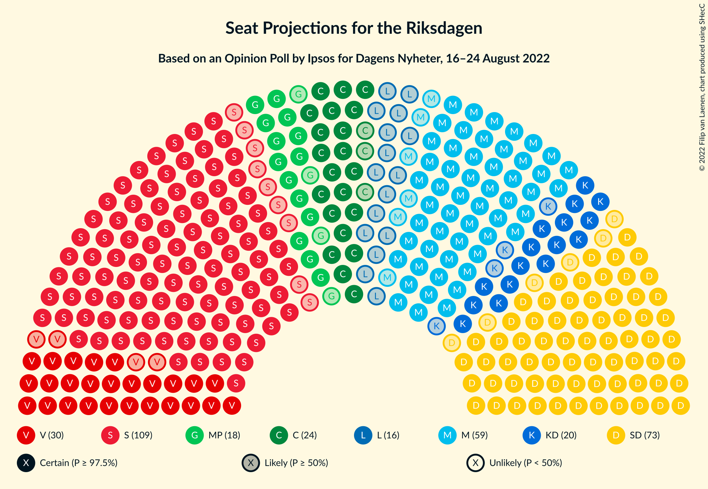

### Confidence Intervals

| Party | Last Result | Median | 80% Confidence Interval | 90% Confidence Interval | 95% Confidence Interval | 99% Confidence Interval |
|:-----:|:-----------:|:------:|:-----------------------:|:-----------------------:|:-----------------------:|:-----------------------:|
| <a href="#sveriges-socialdemokratiska-arbetareparti">Sveriges socialdemokratiska arbetareparti</a> | 100 | 109 | 103–114 |102–116 |100–117 |98–121 |
| <a href="#sverigedemokraterna">Sverigedemokraterna</a> | 62 | 73 | 69–78 |68–80 |67–82 |65–85 |
| <a href="#moderata-samlingspartiet">Moderata samlingspartiet</a> | 70 | 59 | 55–64 |53–65 |53–66 |51–69 |
| <a href="#vänsterpartiet">Vänsterpartiet</a> | 28 | 30 | 27–34 |26–35 |26–35 |24–37 |
| <a href="#centerpartiet">Centerpartiet</a> | 31 | 25 | 22–28 |21–28 |21–29 |19–31 |
| <a href="#kristdemokraterna">Kristdemokraterna</a> | 22 | 20 | 17–23 |17–23 |16–24 |15–26 |
| <a href="#miljöpartiet-de-gröna">Miljöpartiet de gröna</a> | 16 | 18 | 16–20 |15–21 |14–22 |0–23 |
| <a href="#liberalerna">Liberalerna</a> | 20 | 16 | 0–19 |0–20 |0–20 |0–22 |

### Sveriges socialdemokratiska arbetareparti

*For a full overview of the results for this party, see the [Sveriges socialdemokratiska arbetareparti](party-sverigessocialdemokratiskaarbetareparti.html) page.*

| Number of Seats | Probability | Accumulated | Special Marks |
|:---------------:|:-----------:|:-----------:|:-------------:|
| 95 | 0% | 100% |  |
| 96 | 0.1% | 99.9% |  |
| 97 | 0.3% | 99.8% |  |
| 98 | 0.3% | 99.5% |  |
| 99 | 0.9% | 99.2% |  |
| 100 | 1.2% | 98% | Last Result |
| 101 | 2% | 97% |  |
| 102 | 3% | 95% |  |
| 103 | 3% | 93% |  |
| 104 | 5% | 90% |  |
| 105 | 5% | 85% |  |
| 106 | 10% | 80% |  |
| 107 | 8% | 69% |  |
| 108 | 9% | 61% |  |
| 109 | 11% | 53% | Median |
| 110 | 10% | 41% |  |
| 111 | 6% | 32% |  |
| 112 | 8% | 26% |  |
| 113 | 7% | 18% |  |
| 114 | 3% | 12% |  |
| 115 | 3% | 9% |  |
| 116 | 1.3% | 5% |  |
| 117 | 2% | 4% |  |
| 118 | 0.9% | 2% |  |
| 119 | 0.3% | 1.2% |  |
| 120 | 0.2% | 0.9% |  |
| 121 | 0.4% | 0.7% |  |
| 122 | 0.1% | 0.3% |  |
| 123 | 0.1% | 0.2% |  |
| 124 | 0.1% | 0.1% |  |
| 125 | 0% | 0.1% |  |
| 126 | 0% | 0% |  |

### Sverigedemokraterna

*For a full overview of the results for this party, see the [Sverigedemokraterna](party-sverigedemokraterna.html) page.*

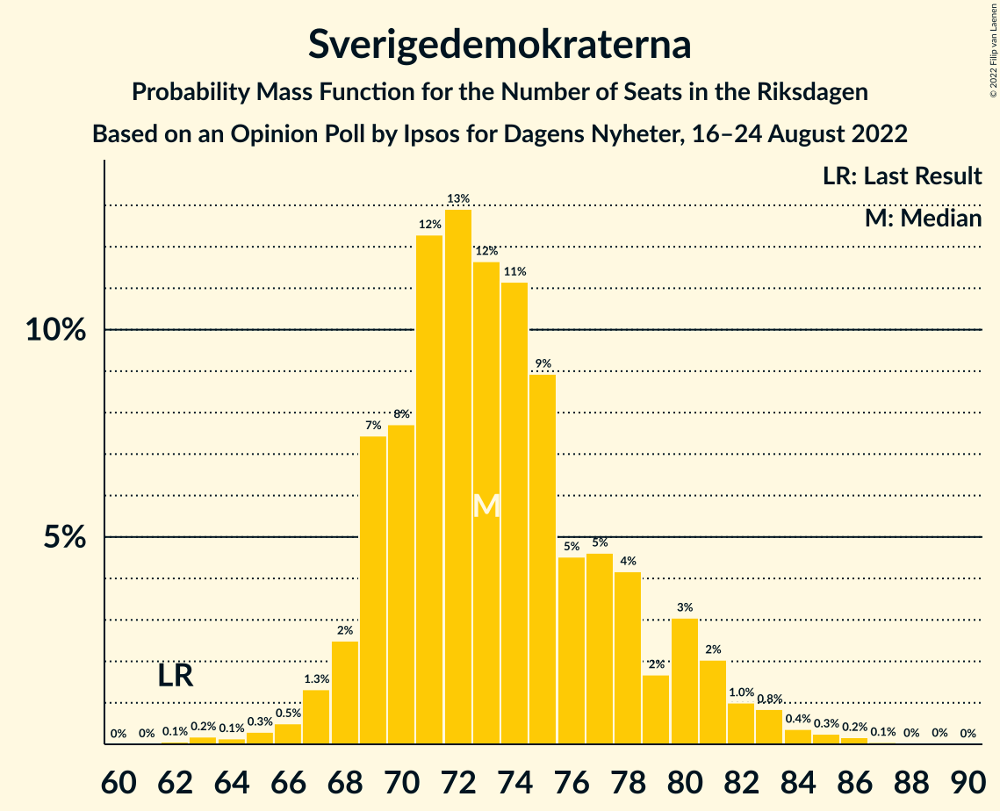

| Number of Seats | Probability | Accumulated | Special Marks |
|:---------------:|:-----------:|:-----------:|:-------------:|
| 62 | 0.1% | 100% | Last Result |
| 63 | 0.2% | 99.9% |  |
| 64 | 0.1% | 99.7% |  |
| 65 | 0.3% | 99.6% |  |
| 66 | 0.5% | 99.3% |  |
| 67 | 1.3% | 98.8% |  |
| 68 | 2% | 97% |  |
| 69 | 7% | 95% |  |
| 70 | 8% | 88% |  |
| 71 | 12% | 80% |  |
| 72 | 13% | 68% |  |
| 73 | 12% | 55% | Median |
| 74 | 11% | 43% |  |
| 75 | 9% | 32% |  |
| 76 | 5% | 23% |  |
| 77 | 5% | 18% |  |
| 78 | 4% | 14% |  |
| 79 | 2% | 10% |  |
| 80 | 3% | 8% |  |
| 81 | 2% | 5% |  |
| 82 | 1.0% | 3% |  |
| 83 | 0.8% | 2% |  |
| 84 | 0.4% | 0.9% |  |
| 85 | 0.3% | 0.5% |  |
| 86 | 0.2% | 0.3% |  |
| 87 | 0.1% | 0.1% |  |
| 88 | 0% | 0.1% |  |
| 89 | 0% | 0% |  |

### Moderata samlingspartiet

*For a full overview of the results for this party, see the [Moderata samlingspartiet](party-moderatasamlingspartiet.html) page.*

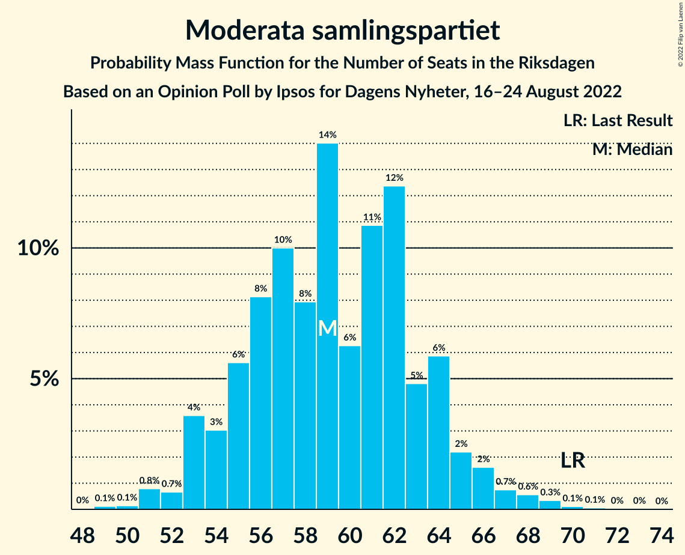

| Number of Seats | Probability | Accumulated | Special Marks |
|:---------------:|:-----------:|:-----------:|:-------------:|
| 49 | 0.1% | 100% |  |
| 50 | 0.1% | 99.8% |  |
| 51 | 0.8% | 99.7% |  |
| 52 | 0.7% | 98.9% |  |
| 53 | 4% | 98% |  |
| 54 | 3% | 95% |  |
| 55 | 6% | 92% |  |
| 56 | 8% | 86% |  |
| 57 | 10% | 78% |  |
| 58 | 8% | 68% |  |
| 59 | 14% | 60% | Median |
| 60 | 6% | 46% |  |
| 61 | 11% | 40% |  |
| 62 | 12% | 29% |  |
| 63 | 5% | 16% |  |
| 64 | 6% | 12% |  |
| 65 | 2% | 6% |  |
| 66 | 2% | 3% |  |
| 67 | 0.7% | 2% |  |
| 68 | 0.6% | 1.1% |  |
| 69 | 0.3% | 0.6% |  |
| 70 | 0.1% | 0.2% | Last Result |
| 71 | 0.1% | 0.1% |  |
| 72 | 0% | 0.1% |  |
| 73 | 0% | 0% |  |

### Vänsterpartiet

*For a full overview of the results for this party, see the [Vänsterpartiet](party-vänsterpartiet.html) page.*

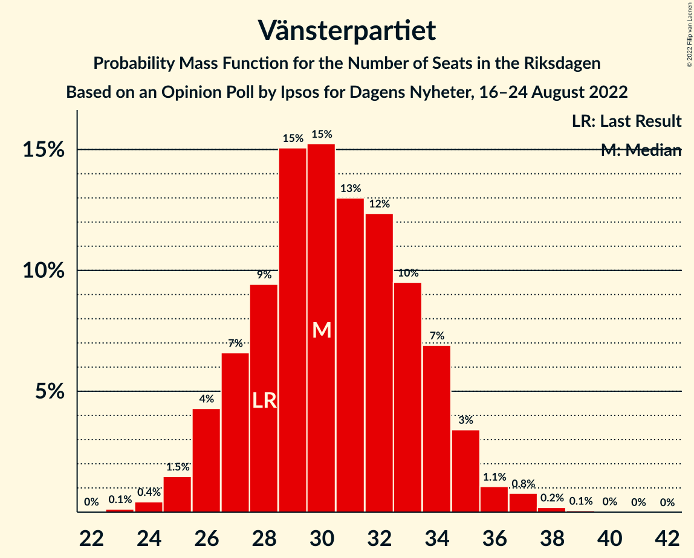

| Number of Seats | Probability | Accumulated | Special Marks |
|:---------------:|:-----------:|:-----------:|:-------------:|
| 23 | 0.1% | 100% |  |
| 24 | 0.4% | 99.8% |  |
| 25 | 1.5% | 99.4% |  |
| 26 | 4% | 98% |  |
| 27 | 7% | 94% |  |
| 28 | 9% | 87% | Last Result |
| 29 | 15% | 78% |  |
| 30 | 15% | 63% | Median |
| 31 | 13% | 47% |  |
| 32 | 12% | 34% |  |
| 33 | 10% | 22% |  |
| 34 | 7% | 12% |  |
| 35 | 3% | 6% |  |
| 36 | 1.1% | 2% |  |
| 37 | 0.8% | 1.1% |  |
| 38 | 0.2% | 0.3% |  |
| 39 | 0.1% | 0.1% |  |
| 40 | 0% | 0.1% |  |
| 41 | 0% | 0% |  |

### Centerpartiet

*For a full overview of the results for this party, see the [Centerpartiet](party-centerpartiet.html) page.*

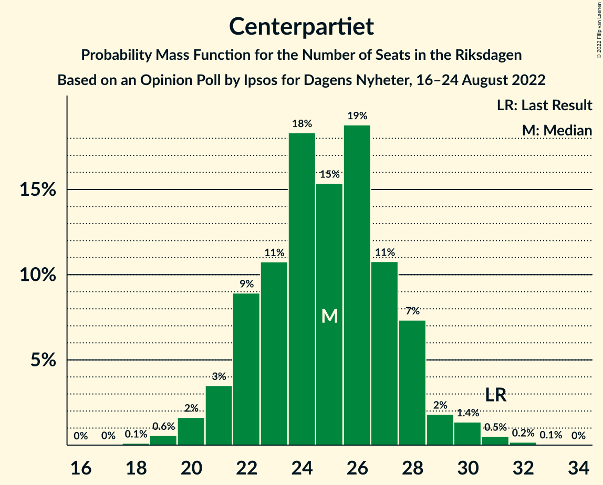

| Number of Seats | Probability | Accumulated | Special Marks |
|:---------------:|:-----------:|:-----------:|:-------------:|
| 18 | 0.1% | 100% |  |
| 19 | 0.6% | 99.9% |  |
| 20 | 2% | 99.3% |  |
| 21 | 3% | 98% |  |
| 22 | 9% | 94% |  |
| 23 | 11% | 85% |  |
| 24 | 18% | 75% |  |
| 25 | 15% | 56% | Median |
| 26 | 19% | 41% |  |
| 27 | 11% | 22% |  |
| 28 | 7% | 11% |  |
| 29 | 2% | 4% |  |
| 30 | 1.4% | 2% |  |
| 31 | 0.5% | 0.8% | Last Result |
| 32 | 0.2% | 0.3% |  |
| 33 | 0.1% | 0.1% |  |
| 34 | 0% | 0% |  |

### Kristdemokraterna

*For a full overview of the results for this party, see the [Kristdemokraterna](party-kristdemokraterna.html) page.*

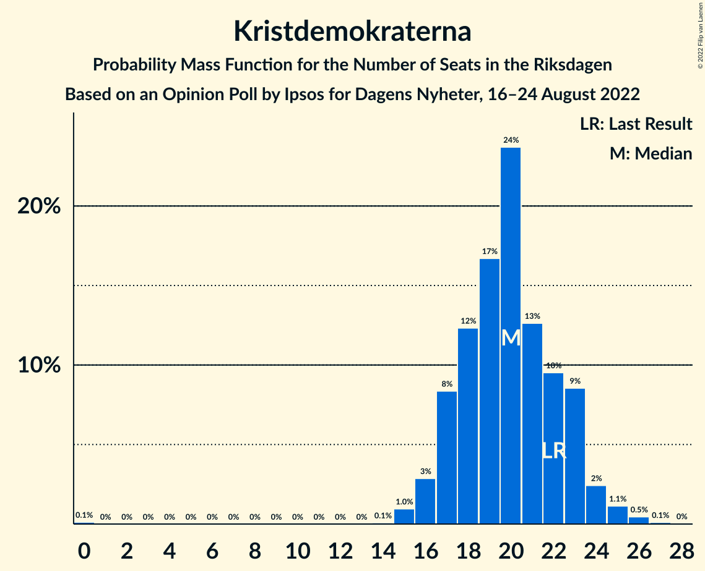

| Number of Seats | Probability | Accumulated | Special Marks |
|:---------------:|:-----------:|:-----------:|:-------------:|
| 0 | 0.1% | 100% |  |
| 1 | 0% | 99.9% |  |
| 2 | 0% | 99.9% |  |
| 3 | 0% | 99.9% |  |
| 4 | 0% | 99.9% |  |
| 5 | 0% | 99.9% |  |
| 6 | 0% | 99.9% |  |
| 7 | 0% | 99.9% |  |
| 8 | 0% | 99.9% |  |
| 9 | 0% | 99.9% |  |
| 10 | 0% | 99.9% |  |
| 11 | 0% | 99.9% |  |
| 12 | 0% | 99.9% |  |
| 13 | 0% | 99.9% |  |
| 14 | 0.1% | 99.9% |  |
| 15 | 1.0% | 99.8% |  |
| 16 | 3% | 98.8% |  |
| 17 | 8% | 96% |  |
| 18 | 12% | 88% |  |
| 19 | 17% | 75% |  |
| 20 | 24% | 59% | Median |
| 21 | 13% | 35% |  |
| 22 | 10% | 22% | Last Result |
| 23 | 9% | 13% |  |
| 24 | 2% | 4% |  |
| 25 | 1.1% | 2% |  |
| 26 | 0.5% | 0.6% |  |
| 27 | 0.1% | 0.1% |  |
| 28 | 0% | 0% |  |

### Miljöpartiet de gröna

*For a full overview of the results for this party, see the [Miljöpartiet de gröna](party-miljöpartietdegröna.html) page.*

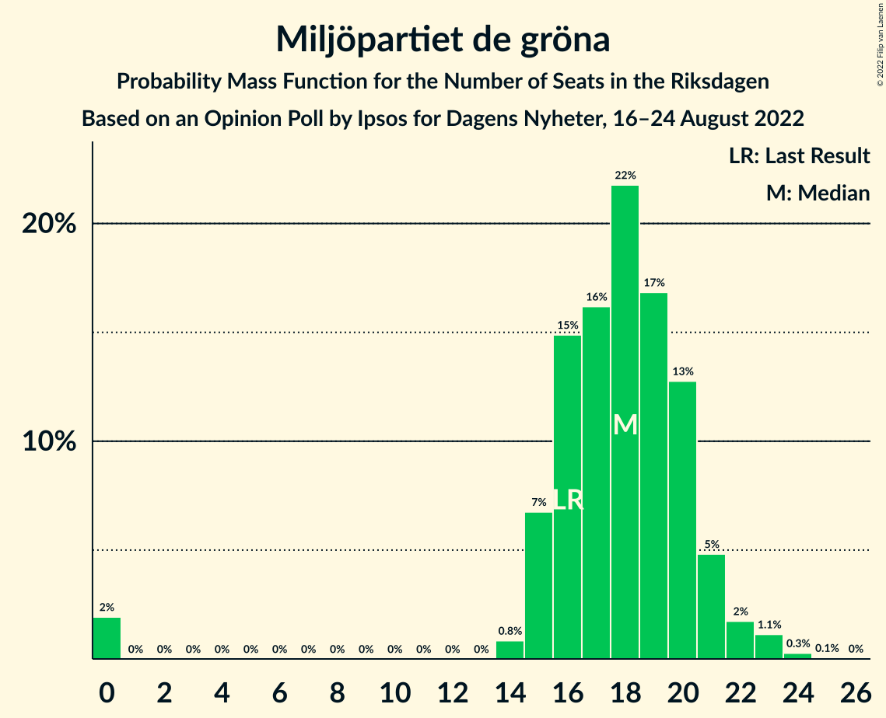

| Number of Seats | Probability | Accumulated | Special Marks |
|:---------------:|:-----------:|:-----------:|:-------------:|
| 0 | 2% | 100% |  |
| 1 | 0% | 98% |  |
| 2 | 0% | 98% |  |
| 3 | 0% | 98% |  |
| 4 | 0% | 98% |  |
| 5 | 0% | 98% |  |
| 6 | 0% | 98% |  |
| 7 | 0% | 98% |  |
| 8 | 0% | 98% |  |
| 9 | 0% | 98% |  |
| 10 | 0% | 98% |  |
| 11 | 0% | 98% |  |
| 12 | 0% | 98% |  |
| 13 | 0% | 98% |  |
| 14 | 0.8% | 98% |  |
| 15 | 7% | 97% |  |
| 16 | 15% | 90% | Last Result |
| 17 | 16% | 76% |  |
| 18 | 22% | 59% | Median |
| 19 | 17% | 38% |  |
| 20 | 13% | 21% |  |
| 21 | 5% | 8% |  |
| 22 | 2% | 3% |  |
| 23 | 1.1% | 1.5% |  |
| 24 | 0.3% | 0.3% |  |
| 25 | 0.1% | 0.1% |  |
| 26 | 0% | 0% |  |

### Liberalerna

*For a full overview of the results for this party, see the [Liberalerna](party-liberalerna.html) page.*

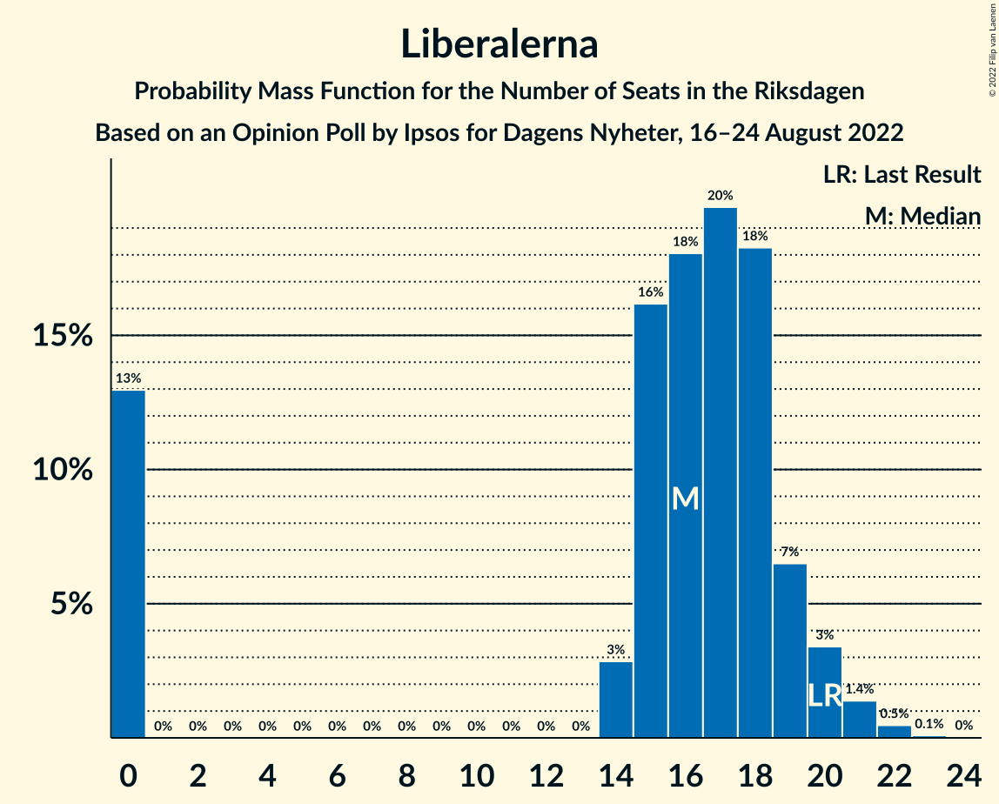

| Number of Seats | Probability | Accumulated | Special Marks |
|:---------------:|:-----------:|:-----------:|:-------------:|
| 0 | 13% | 100% |  |
| 1 | 0% | 87% |  |
| 2 | 0% | 87% |  |
| 3 | 0% | 87% |  |
| 4 | 0% | 87% |  |
| 5 | 0% | 87% |  |
| 6 | 0% | 87% |  |
| 7 | 0% | 87% |  |
| 8 | 0% | 87% |  |
| 9 | 0% | 87% |  |
| 10 | 0% | 87% |  |
| 11 | 0% | 87% |  |
| 12 | 0% | 87% |  |
| 13 | 0% | 87% |  |
| 14 | 3% | 87% |  |
| 15 | 16% | 84% |  |
| 16 | 18% | 68% | Median |
| 17 | 20% | 50% |  |
| 18 | 18% | 30% |  |
| 19 | 7% | 12% |  |
| 20 | 3% | 5% | Last Result |
| 21 | 1.4% | 2% |  |
| 22 | 0.5% | 0.6% |  |
| 23 | 0.1% | 0.1% |  |
| 24 | 0% | 0% |  |

## Coalitions

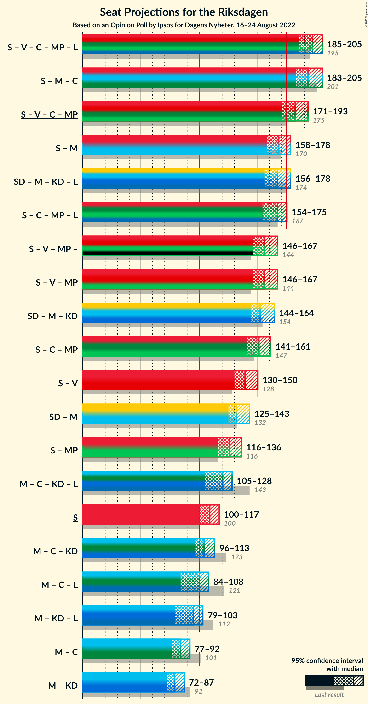

### Confidence Intervals

| Coalition | Last Result | Median | Majority? | 80% Confidence Interval | 90% Confidence Interval | 95% Confidence Interval | 99% Confidence Interval |
|:---------:|:-----------:|:------:|:---------:|:-----------------------:|:-----------------------:|:-----------------------:|:-----------------------:|
| Sveriges socialdemokratiska arbetareparti – Vänsterpartiet – Centerpartiet – Miljöpartiet de gröna – Liberalerna | 195 | 197 | 100% | 190–202 | 188–204 | 185–205 | 182–208 |
| Sveriges socialdemokratiska arbetareparti – Moderata samlingspartiet – Centerpartiet | 201 | 193 | 100% | 186–200 | 184–201 | 183–205 | 180–209 |
| Sveriges socialdemokratiska arbetareparti – Vänsterpartiet – Centerpartiet – Miljöpartiet de gröna | 175 | 182 | 93% | 175–188 | 173–191 | 171–193 | 167–195 |
| Sveriges socialdemokratiska arbetareparti – Moderata samlingspartiet | 170 | 168 | 10% | 162–175 | 160–177 | 158–178 | 155–183 |
| Sverigedemokraterna – Moderata samlingspartiet – Kristdemokraterna – Liberalerna | 174 | 167 | 7% | 161–174 | 158–176 | 156–178 | 154–182 |
| Sveriges socialdemokratiska arbetareparti – Centerpartiet – Miljöpartiet de gröna – Liberalerna | 167 | 167 | 3% | 158–172 | 156–174 | 154–175 | 149–178 |
| Sveriges socialdemokratiska arbetareparti – Vänsterpartiet – Miljöpartiet de gröna | 144 | 156 | 0.1% | 151–163 | 149–165 | 146–167 | 143–170 |
| Sverigedemokraterna – Moderata samlingspartiet – Kristdemokraterna | 154 | 152 | 0% | 147–159 | 145–161 | 144–164 | 141–167 |
| Sveriges socialdemokratiska arbetareparti – Centerpartiet – Miljöpartiet de gröna | 147 | 151 | 0% | 145–157 | 143–159 | 141–161 | 137–165 |
| Sveriges socialdemokratiska arbetareparti – Vänsterpartiet | 128 | 139 | 0% | 134–145 | 132–147 | 130–150 | 127–153 |
| Sverigedemokraterna – Moderata samlingspartiet | 132 | 132 | 0% | 127–139 | 126–141 | 125–143 | 122–147 |
| Sveriges socialdemokratiska arbetareparti – Miljöpartiet de gröna | 116 | 126 | 0% | 121–132 | 118–134 | 116–136 | 111–139 |
| Moderata samlingspartiet – Centerpartiet – Kristdemokraterna – Liberalerna | 143 | 120 | 0% | 110–125 | 107–127 | 105–128 | 102–131 |
| Sveriges socialdemokratiska arbetareparti | 100 | 109 | 0% | 103–114 | 102–116 | 100–117 | 98–121 |
| Moderata samlingspartiet – Centerpartiet – Kristdemokraterna | 123 | 104 | 0% | 99–109 | 98–111 | 96–113 | 93–116 |
| Moderata samlingspartiet – Centerpartiet – Liberalerna | 121 | 100 | 0% | 89–105 | 87–107 | 84–108 | 81–111 |
| Moderata samlingspartiet – Kristdemokraterna – Liberalerna | 112 | 95 | 0% | 84–100 | 82–102 | 79–103 | 77–106 |
| Moderata samlingspartiet – Centerpartiet | 101 | 84 | 0% | 79–89 | 78–91 | 77–92 | 74–95 |
| Moderata samlingspartiet – Kristdemokraterna | 92 | 79 | 0% | 74–84 | 73–86 | 72–87 | 69–89 |

### Sveriges socialdemokratiska arbetareparti – Vänsterpartiet – Centerpartiet – Miljöpartiet de gröna – Liberalerna

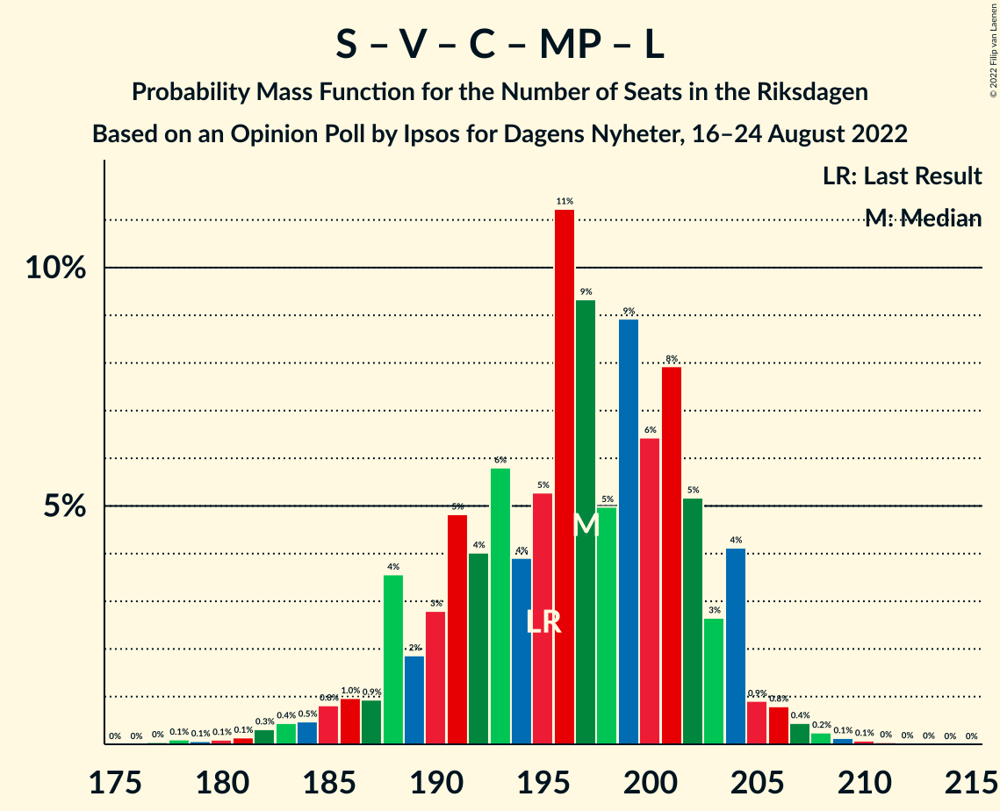

| Number of Seats | Probability | Accumulated | Special Marks |
|:---------------:|:-----------:|:-----------:|:-------------:|
| 176 | 0% | 100% |  |
| 177 | 0% | 99.9% |  |
| 178 | 0.1% | 99.9% |  |
| 179 | 0.1% | 99.8% |  |
| 180 | 0.1% | 99.7% |  |
| 181 | 0.1% | 99.6% |  |
| 182 | 0.3% | 99.5% |  |
| 183 | 0.4% | 99.2% |  |
| 184 | 0.5% | 98.7% |  |
| 185 | 0.8% | 98% |  |
| 186 | 1.0% | 97% |  |
| 187 | 0.9% | 96% |  |
| 188 | 4% | 96% |  |
| 189 | 2% | 92% |  |
| 190 | 3% | 90% |  |
| 191 | 5% | 87% |  |
| 192 | 4% | 82% |  |
| 193 | 6% | 78% |  |
| 194 | 4% | 73% |  |
| 195 | 5% | 69% | Last Result |
| 196 | 11% | 63% |  |
| 197 | 9% | 52% |  |
| 198 | 5% | 43% | Median |
| 199 | 9% | 38% |  |
| 200 | 6% | 29% |  |
| 201 | 8% | 23% |  |
| 202 | 5% | 15% |  |
| 203 | 3% | 9% |  |
| 204 | 4% | 7% |  |
| 205 | 0.9% | 3% |  |
| 206 | 0.8% | 2% |  |
| 207 | 0.4% | 1.0% |  |
| 208 | 0.2% | 0.6% |  |
| 209 | 0.1% | 0.3% |  |
| 210 | 0.1% | 0.2% |  |
| 211 | 0% | 0.1% |  |
| 212 | 0% | 0.1% |  |
| 213 | 0% | 0% |  |

### Sveriges socialdemokratiska arbetareparti – Moderata samlingspartiet – Centerpartiet

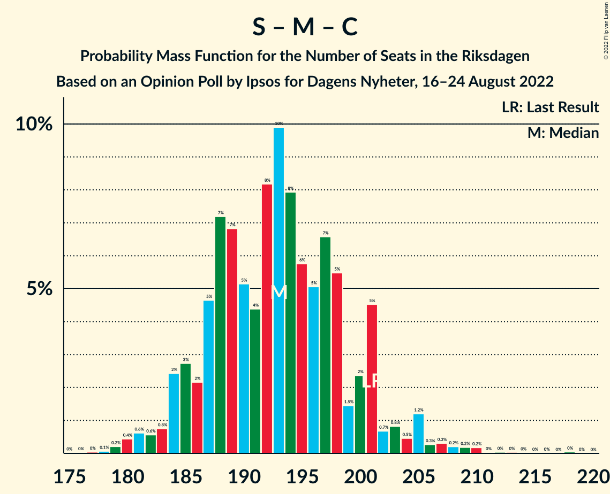

| Number of Seats | Probability | Accumulated | Special Marks |
|:---------------:|:-----------:|:-----------:|:-------------:|
| 177 | 0% | 100% |  |
| 178 | 0.1% | 99.9% |  |
| 179 | 0.2% | 99.8% |  |
| 180 | 0.4% | 99.6% |  |
| 181 | 0.6% | 99.2% |  |
| 182 | 0.6% | 98.6% |  |
| 183 | 0.8% | 98% |  |
| 184 | 2% | 97% |  |
| 185 | 3% | 95% |  |
| 186 | 2% | 92% |  |
| 187 | 5% | 90% |  |
| 188 | 7% | 85% |  |
| 189 | 7% | 78% |  |
| 190 | 5% | 71% |  |
| 191 | 4% | 66% |  |
| 192 | 8% | 62% |  |
| 193 | 10% | 54% | Median |
| 194 | 8% | 44% |  |
| 195 | 6% | 36% |  |
| 196 | 5% | 30% |  |
| 197 | 7% | 25% |  |
| 198 | 5% | 18% |  |
| 199 | 1.5% | 13% |  |
| 200 | 2% | 11% |  |
| 201 | 5% | 9% | Last Result |
| 202 | 0.7% | 5% |  |
| 203 | 0.8% | 4% |  |
| 204 | 0.5% | 3% |  |
| 205 | 1.2% | 3% |  |
| 206 | 0.3% | 1.3% |  |
| 207 | 0.3% | 1.1% |  |
| 208 | 0.2% | 0.8% |  |
| 209 | 0.2% | 0.6% |  |
| 210 | 0.2% | 0.4% |  |
| 211 | 0% | 0.2% |  |
| 212 | 0% | 0.2% |  |
| 213 | 0% | 0.1% |  |
| 214 | 0% | 0.1% |  |
| 215 | 0% | 0.1% |  |
| 216 | 0% | 0.1% |  |
| 217 | 0% | 0.1% |  |
| 218 | 0% | 0.1% |  |
| 219 | 0% | 0% |  |

### Sveriges socialdemokratiska arbetareparti – Vänsterpartiet – Centerpartiet – Miljöpartiet de gröna

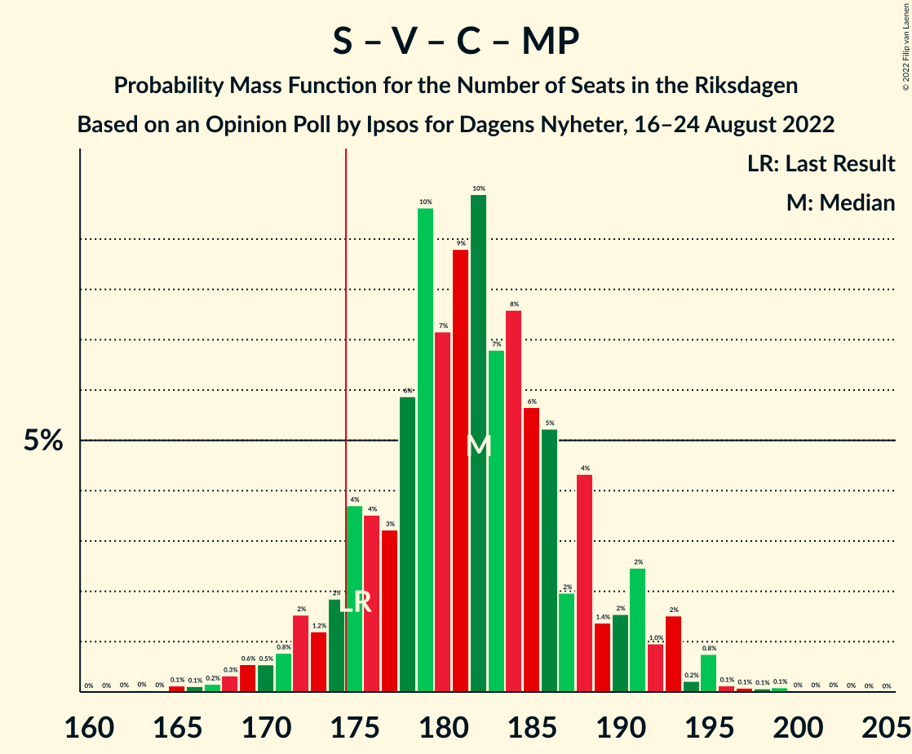

| Number of Seats | Probability | Accumulated | Special Marks |
|:---------------:|:-----------:|:-----------:|:-------------:|
| 162 | 0% | 100% |  |
| 163 | 0% | 99.9% |  |
| 164 | 0% | 99.9% |  |
| 165 | 0.1% | 99.9% |  |
| 166 | 0.1% | 99.8% |  |
| 167 | 0.2% | 99.6% |  |
| 168 | 0.3% | 99.5% |  |
| 169 | 0.6% | 99.2% |  |
| 170 | 0.5% | 98.6% |  |
| 171 | 0.8% | 98% |  |
| 172 | 2% | 97% |  |
| 173 | 1.2% | 96% |  |
| 174 | 2% | 95% |  |
| 175 | 4% | 93% | Last Result, Majority |
| 176 | 4% | 89% |  |
| 177 | 3% | 85% |  |
| 178 | 6% | 82% |  |
| 179 | 10% | 76% |  |
| 180 | 7% | 67% |  |
| 181 | 9% | 60% |  |
| 182 | 10% | 51% | Median |
| 183 | 7% | 41% |  |
| 184 | 8% | 34% |  |
| 185 | 6% | 26% |  |
| 186 | 5% | 21% |  |
| 187 | 2% | 16% |  |
| 188 | 4% | 14% |  |
| 189 | 1.4% | 9% |  |
| 190 | 2% | 8% |  |
| 191 | 2% | 6% |  |
| 192 | 1.0% | 4% |  |
| 193 | 2% | 3% |  |
| 194 | 0.2% | 1.4% |  |
| 195 | 0.8% | 1.2% |  |
| 196 | 0.1% | 0.5% |  |
| 197 | 0.1% | 0.3% |  |
| 198 | 0.1% | 0.3% |  |
| 199 | 0.1% | 0.2% |  |
| 200 | 0% | 0.1% |  |
| 201 | 0% | 0.1% |  |
| 202 | 0% | 0% |  |

### Sveriges socialdemokratiska arbetareparti – Moderata samlingspartiet

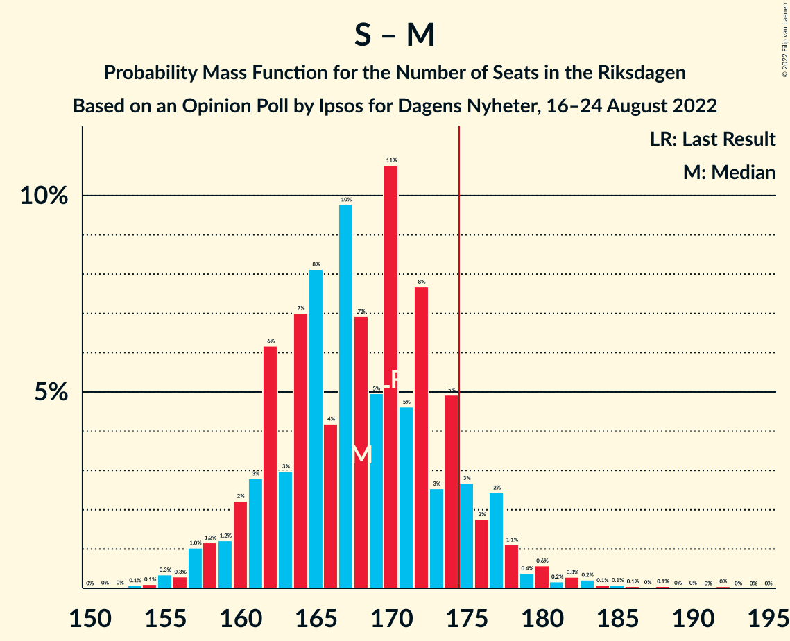

| Number of Seats | Probability | Accumulated | Special Marks |
|:---------------:|:-----------:|:-----------:|:-------------:|
| 153 | 0.1% | 100% |  |
| 154 | 0.1% | 99.9% |  |
| 155 | 0.3% | 99.8% |  |
| 156 | 0.3% | 99.4% |  |
| 157 | 1.0% | 99.1% |  |
| 158 | 1.2% | 98% |  |
| 159 | 1.2% | 97% |  |
| 160 | 2% | 96% |  |
| 161 | 3% | 93% |  |
| 162 | 6% | 91% |  |
| 163 | 3% | 85% |  |
| 164 | 7% | 82% |  |
| 165 | 8% | 75% |  |
| 166 | 4% | 66% |  |
| 167 | 10% | 62% |  |
| 168 | 7% | 52% | Median |
| 169 | 5% | 46% |  |
| 170 | 11% | 41% | Last Result |
| 171 | 5% | 30% |  |
| 172 | 8% | 25% |  |
| 173 | 3% | 17% |  |
| 174 | 5% | 15% |  |
| 175 | 3% | 10% | Majority |
| 176 | 2% | 7% |  |
| 177 | 2% | 6% |  |
| 178 | 1.1% | 3% |  |
| 179 | 0.4% | 2% |  |
| 180 | 0.6% | 2% |  |
| 181 | 0.2% | 1.1% |  |
| 182 | 0.3% | 0.9% |  |
| 183 | 0.2% | 0.6% |  |
| 184 | 0.1% | 0.4% |  |
| 185 | 0.1% | 0.3% |  |
| 186 | 0.1% | 0.2% |  |
| 187 | 0% | 0.2% |  |
| 188 | 0.1% | 0.1% |  |
| 189 | 0% | 0.1% |  |
| 190 | 0% | 0.1% |  |
| 191 | 0% | 0.1% |  |
| 192 | 0% | 0.1% |  |
| 193 | 0% | 0% |  |

### Sverigedemokraterna – Moderata samlingspartiet – Kristdemokraterna – Liberalerna

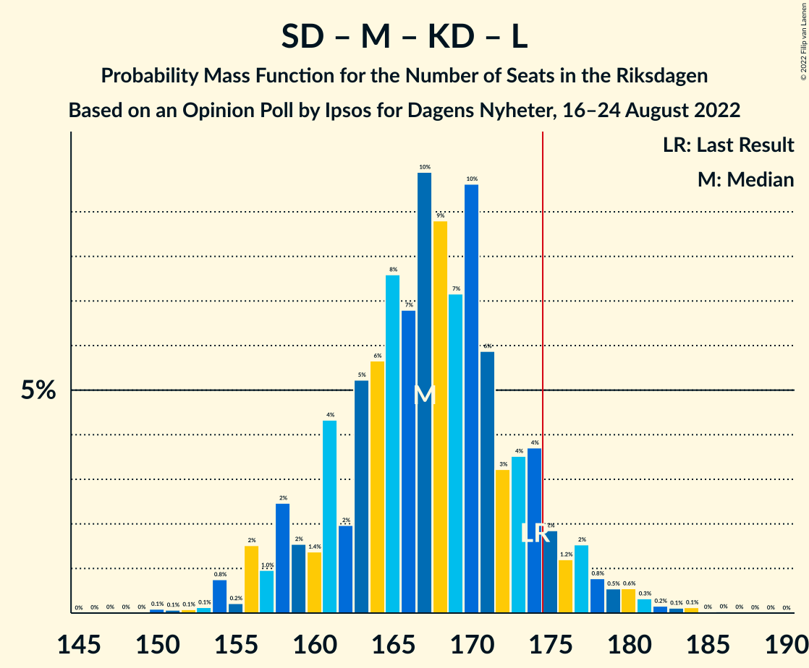

| Number of Seats | Probability | Accumulated | Special Marks |
|:---------------:|:-----------:|:-----------:|:-------------:|
| 148 | 0% | 100% |  |
| 149 | 0% | 99.9% |  |
| 150 | 0.1% | 99.9% |  |
| 151 | 0.1% | 99.8% |  |
| 152 | 0.1% | 99.7% |  |
| 153 | 0.1% | 99.7% |  |
| 154 | 0.8% | 99.5% |  |
| 155 | 0.2% | 98.8% |  |
| 156 | 2% | 98.6% |  |
| 157 | 1.0% | 97% |  |
| 158 | 2% | 96% |  |
| 159 | 2% | 94% |  |
| 160 | 1.4% | 92% |  |
| 161 | 4% | 91% |  |
| 162 | 2% | 86% |  |
| 163 | 5% | 84% |  |
| 164 | 6% | 79% |  |
| 165 | 8% | 74% |  |
| 166 | 7% | 66% |  |
| 167 | 10% | 59% |  |
| 168 | 9% | 49% | Median |
| 169 | 7% | 40% |  |
| 170 | 10% | 33% |  |
| 171 | 6% | 24% |  |
| 172 | 3% | 18% |  |
| 173 | 4% | 15% |  |
| 174 | 4% | 11% | Last Result |
| 175 | 2% | 7% | Majority |
| 176 | 1.2% | 5% |  |
| 177 | 2% | 4% |  |
| 178 | 0.8% | 3% |  |
| 179 | 0.5% | 2% |  |
| 180 | 0.6% | 1.4% |  |
| 181 | 0.3% | 0.8% |  |
| 182 | 0.2% | 0.5% |  |
| 183 | 0.1% | 0.4% |  |
| 184 | 0.1% | 0.2% |  |
| 185 | 0% | 0.1% |  |
| 186 | 0% | 0.1% |  |
| 187 | 0% | 0.1% |  |
| 188 | 0% | 0% |  |

### Sveriges socialdemokratiska arbetareparti – Centerpartiet – Miljöpartiet de gröna – Liberalerna

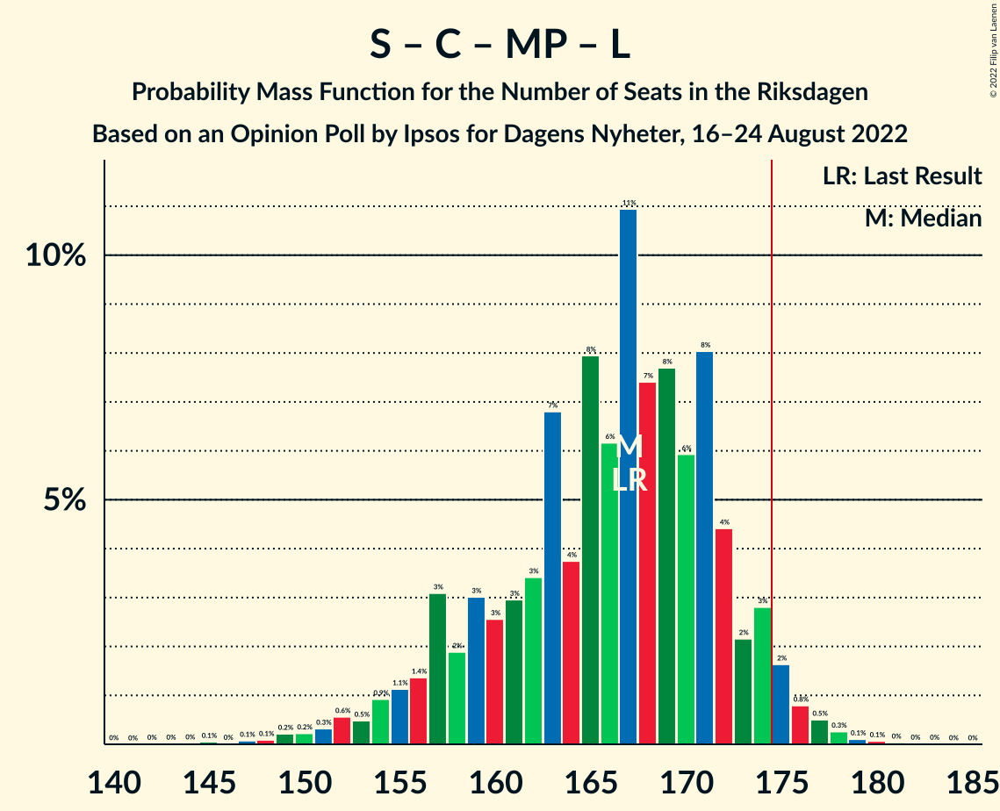

| Number of Seats | Probability | Accumulated | Special Marks |
|:---------------:|:-----------:|:-----------:|:-------------:|
| 143 | 0% | 100% |  |
| 144 | 0% | 99.9% |  |
| 145 | 0.1% | 99.9% |  |
| 146 | 0% | 99.9% |  |
| 147 | 0.1% | 99.9% |  |
| 148 | 0.1% | 99.8% |  |
| 149 | 0.2% | 99.7% |  |
| 150 | 0.2% | 99.5% |  |
| 151 | 0.3% | 99.3% |  |
| 152 | 0.6% | 98.9% |  |
| 153 | 0.5% | 98% |  |
| 154 | 0.9% | 98% |  |
| 155 | 1.1% | 97% |  |
| 156 | 1.4% | 96% |  |
| 157 | 3% | 94% |  |
| 158 | 2% | 91% |  |
| 159 | 3% | 89% |  |
| 160 | 3% | 86% |  |
| 161 | 3% | 84% |  |
| 162 | 3% | 81% |  |
| 163 | 7% | 78% |  |
| 164 | 4% | 71% |  |
| 165 | 8% | 67% |  |
| 166 | 6% | 59% |  |
| 167 | 11% | 53% | Last Result |
| 168 | 7% | 42% | Median |
| 169 | 8% | 35% |  |
| 170 | 6% | 27% |  |
| 171 | 8% | 21% |  |
| 172 | 4% | 13% |  |
| 173 | 2% | 8% |  |
| 174 | 3% | 6% |  |
| 175 | 2% | 3% | Majority |
| 176 | 0.8% | 2% |  |
| 177 | 0.5% | 1.0% |  |
| 178 | 0.3% | 0.5% |  |
| 179 | 0.1% | 0.3% |  |
| 180 | 0.1% | 0.2% |  |
| 181 | 0% | 0.1% |  |
| 182 | 0% | 0% |  |

### Sveriges socialdemokratiska arbetareparti – Vänsterpartiet – Miljöpartiet de gröna

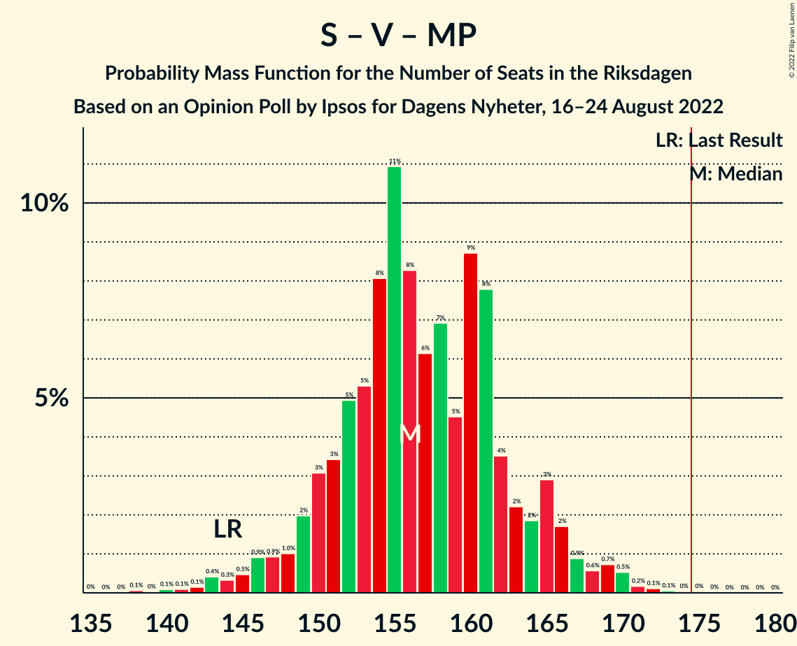

| Number of Seats | Probability | Accumulated | Special Marks |
|:---------------:|:-----------:|:-----------:|:-------------:|
| 137 | 0% | 100% |  |
| 138 | 0.1% | 99.9% |  |
| 139 | 0% | 99.9% |  |
| 140 | 0.1% | 99.9% |  |
| 141 | 0.1% | 99.8% |  |
| 142 | 0.1% | 99.7% |  |
| 143 | 0.4% | 99.5% |  |
| 144 | 0.3% | 99.1% | Last Result |
| 145 | 0.5% | 98.8% |  |
| 146 | 0.9% | 98% |  |
| 147 | 0.9% | 97% |  |
| 148 | 1.0% | 96% |  |
| 149 | 2% | 95% |  |
| 150 | 3% | 93% |  |
| 151 | 3% | 90% |  |
| 152 | 5% | 87% |  |
| 153 | 5% | 82% |  |
| 154 | 8% | 77% |  |
| 155 | 11% | 69% |  |
| 156 | 8% | 58% |  |
| 157 | 6% | 49% | Median |
| 158 | 7% | 43% |  |
| 159 | 5% | 36% |  |
| 160 | 9% | 32% |  |
| 161 | 8% | 23% |  |
| 162 | 4% | 15% |  |
| 163 | 2% | 12% |  |
| 164 | 2% | 10% |  |
| 165 | 3% | 8% |  |
| 166 | 2% | 5% |  |
| 167 | 0.9% | 3% |  |
| 168 | 0.6% | 2% |  |
| 169 | 0.7% | 2% |  |
| 170 | 0.5% | 1.0% |  |
| 171 | 0.2% | 0.4% |  |
| 172 | 0.1% | 0.3% |  |
| 173 | 0.1% | 0.2% |  |
| 174 | 0% | 0.1% |  |
| 175 | 0% | 0.1% | Majority |
| 176 | 0% | 0% |  |

### Sverigedemokraterna – Moderata samlingspartiet – Kristdemokraterna

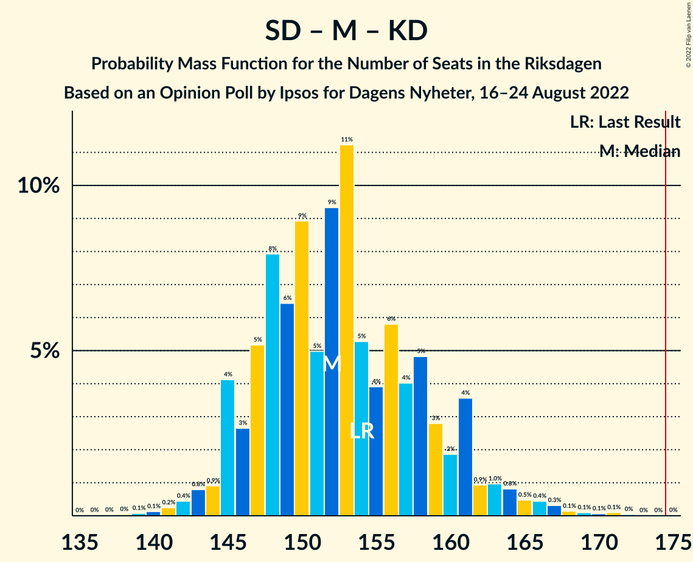

| Number of Seats | Probability | Accumulated | Special Marks |
|:---------------:|:-----------:|:-----------:|:-------------:|
| 137 | 0% | 100% |  |
| 138 | 0% | 99.9% |  |
| 139 | 0.1% | 99.9% |  |
| 140 | 0.1% | 99.8% |  |
| 141 | 0.2% | 99.7% |  |
| 142 | 0.4% | 99.4% |  |
| 143 | 0.8% | 99.0% |  |
| 144 | 0.9% | 98% |  |
| 145 | 4% | 97% |  |
| 146 | 3% | 93% |  |
| 147 | 5% | 91% |  |
| 148 | 8% | 85% |  |
| 149 | 6% | 77% |  |
| 150 | 9% | 71% |  |
| 151 | 5% | 62% |  |
| 152 | 9% | 57% | Median |
| 153 | 11% | 48% |  |
| 154 | 5% | 37% | Last Result |
| 155 | 4% | 31% |  |
| 156 | 6% | 27% |  |
| 157 | 4% | 22% |  |
| 158 | 5% | 18% |  |
| 159 | 3% | 13% |  |
| 160 | 2% | 10% |  |
| 161 | 4% | 8% |  |
| 162 | 0.9% | 4% |  |
| 163 | 1.0% | 4% |  |
| 164 | 0.8% | 3% |  |
| 165 | 0.5% | 2% |  |
| 166 | 0.4% | 1.3% |  |
| 167 | 0.3% | 0.8% |  |
| 168 | 0.1% | 0.5% |  |
| 169 | 0.1% | 0.4% |  |
| 170 | 0.1% | 0.3% |  |
| 171 | 0.1% | 0.2% |  |
| 172 | 0% | 0.1% |  |
| 173 | 0% | 0.1% |  |
| 174 | 0% | 0% |  |

### Sveriges socialdemokratiska arbetareparti – Centerpartiet – Miljöpartiet de gröna

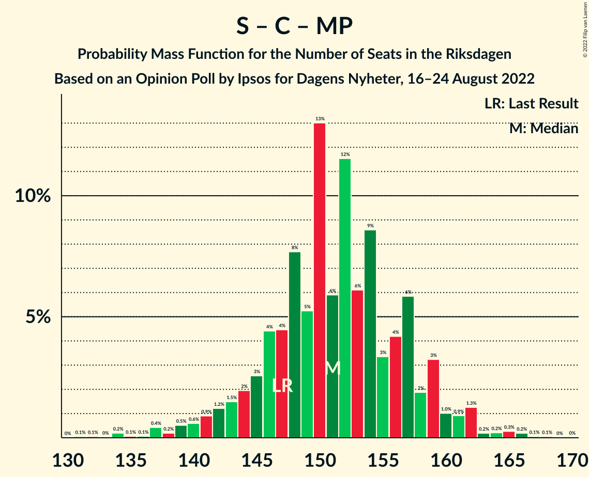

| Number of Seats | Probability | Accumulated | Special Marks |
|:---------------:|:-----------:|:-----------:|:-------------:|
| 131 | 0.1% | 100% |  |
| 132 | 0.1% | 99.9% |  |
| 133 | 0% | 99.9% |  |
| 134 | 0.2% | 99.8% |  |
| 135 | 0.1% | 99.7% |  |
| 136 | 0.1% | 99.6% |  |
| 137 | 0.4% | 99.5% |  |
| 138 | 0.2% | 99.1% |  |
| 139 | 0.5% | 98.9% |  |
| 140 | 0.6% | 98% |  |
| 141 | 0.9% | 98% |  |
| 142 | 1.2% | 97% |  |
| 143 | 1.5% | 96% |  |
| 144 | 2% | 94% |  |
| 145 | 3% | 92% |  |
| 146 | 4% | 90% |  |
| 147 | 4% | 85% | Last Result |
| 148 | 8% | 81% |  |
| 149 | 5% | 73% |  |
| 150 | 13% | 68% |  |
| 151 | 6% | 55% |  |
| 152 | 12% | 49% | Median |
| 153 | 6% | 37% |  |
| 154 | 9% | 31% |  |
| 155 | 3% | 23% |  |
| 156 | 4% | 19% |  |
| 157 | 6% | 15% |  |
| 158 | 2% | 9% |  |
| 159 | 3% | 7% |  |
| 160 | 1.0% | 4% |  |
| 161 | 0.9% | 3% |  |
| 162 | 1.3% | 2% |  |
| 163 | 0.2% | 1.0% |  |
| 164 | 0.2% | 0.8% |  |
| 165 | 0.3% | 0.6% |  |
| 166 | 0.2% | 0.4% |  |
| 167 | 0.1% | 0.2% |  |
| 168 | 0.1% | 0.1% |  |
| 169 | 0% | 0.1% |  |
| 170 | 0% | 0% |  |

### Sveriges socialdemokratiska arbetareparti – Vänsterpartiet

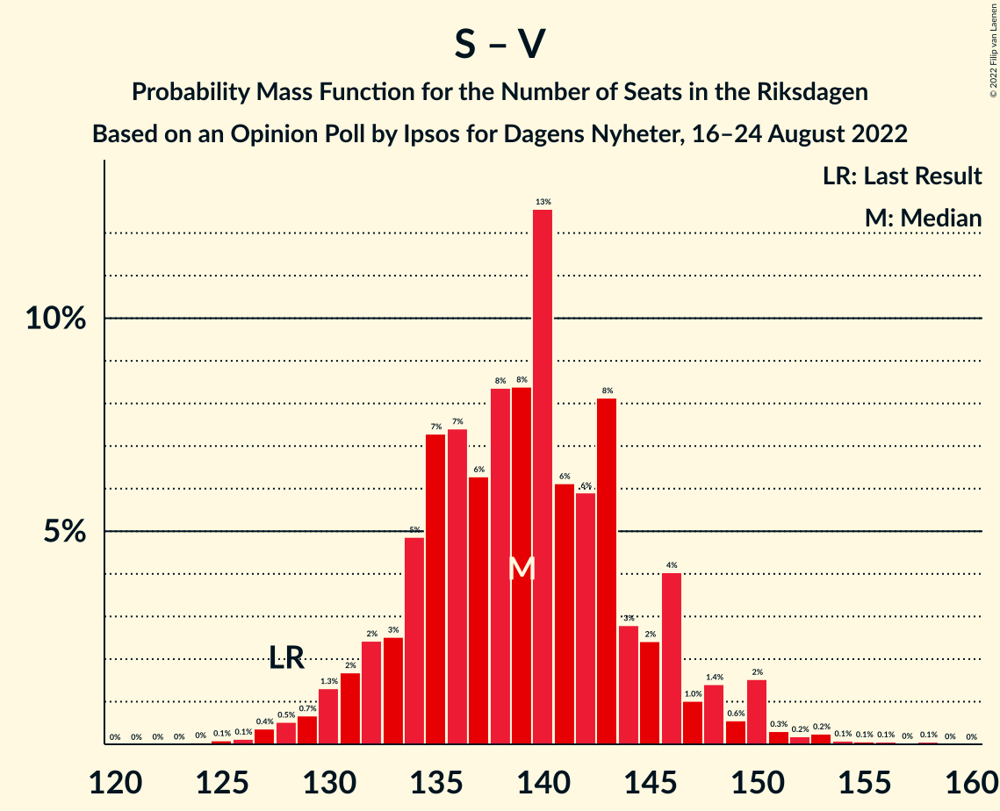

| Number of Seats | Probability | Accumulated | Special Marks |
|:---------------:|:-----------:|:-----------:|:-------------:|
| 124 | 0% | 100% |  |
| 125 | 0.1% | 99.9% |  |
| 126 | 0.1% | 99.8% |  |
| 127 | 0.4% | 99.7% |  |
| 128 | 0.5% | 99.3% | Last Result |
| 129 | 0.7% | 98.8% |  |
| 130 | 1.3% | 98% |  |
| 131 | 2% | 97% |  |
| 132 | 2% | 95% |  |
| 133 | 3% | 93% |  |
| 134 | 5% | 90% |  |
| 135 | 7% | 85% |  |
| 136 | 7% | 78% |  |
| 137 | 6% | 71% |  |
| 138 | 8% | 64% |  |
| 139 | 8% | 56% | Median |
| 140 | 13% | 48% |  |
| 141 | 6% | 35% |  |
| 142 | 6% | 29% |  |
| 143 | 8% | 23% |  |
| 144 | 3% | 15% |  |
| 145 | 2% | 12% |  |
| 146 | 4% | 10% |  |
| 147 | 1.0% | 6% |  |
| 148 | 1.4% | 5% |  |
| 149 | 0.6% | 3% |  |
| 150 | 2% | 3% |  |
| 151 | 0.3% | 1.1% |  |
| 152 | 0.2% | 0.8% |  |
| 153 | 0.2% | 0.6% |  |
| 154 | 0.1% | 0.3% |  |
| 155 | 0.1% | 0.3% |  |
| 156 | 0.1% | 0.2% |  |
| 157 | 0% | 0.1% |  |
| 158 | 0.1% | 0.1% |  |
| 159 | 0% | 0% |  |

### Sverigedemokraterna – Moderata samlingspartiet

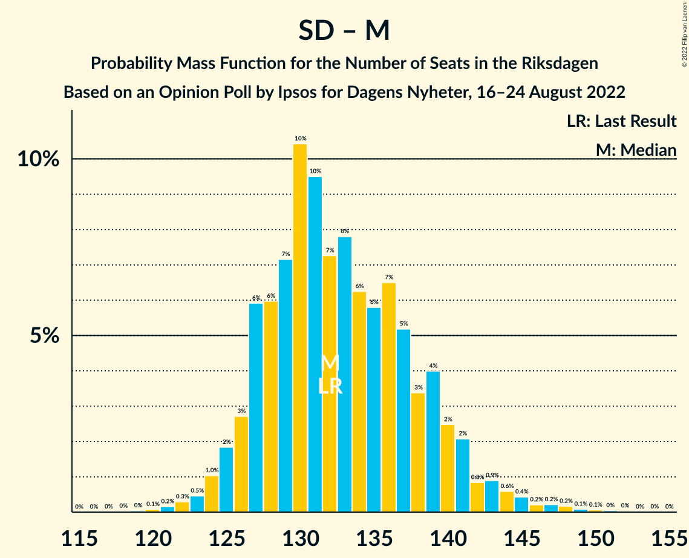

| Number of Seats | Probability | Accumulated | Special Marks |
|:---------------:|:-----------:|:-----------:|:-------------:|
| 119 | 0% | 100% |  |
| 120 | 0.1% | 99.9% |  |
| 121 | 0.2% | 99.8% |  |
| 122 | 0.3% | 99.7% |  |
| 123 | 0.5% | 99.4% |  |
| 124 | 1.0% | 98.9% |  |
| 125 | 2% | 98% |  |
| 126 | 3% | 96% |  |
| 127 | 6% | 93% |  |
| 128 | 6% | 87% |  |
| 129 | 7% | 81% |  |
| 130 | 10% | 74% |  |
| 131 | 10% | 64% |  |
| 132 | 7% | 54% | Last Result, Median |
| 133 | 8% | 47% |  |
| 134 | 6% | 39% |  |
| 135 | 6% | 33% |  |
| 136 | 7% | 27% |  |
| 137 | 5% | 21% |  |
| 138 | 3% | 16% |  |
| 139 | 4% | 12% |  |
| 140 | 2% | 8% |  |
| 141 | 2% | 6% |  |
| 142 | 0.8% | 4% |  |
| 143 | 0.9% | 3% |  |
| 144 | 0.6% | 2% |  |
| 145 | 0.4% | 1.3% |  |
| 146 | 0.2% | 0.8% |  |
| 147 | 0.2% | 0.6% |  |
| 148 | 0.2% | 0.4% |  |
| 149 | 0.1% | 0.3% |  |
| 150 | 0.1% | 0.2% |  |
| 151 | 0% | 0.1% |  |
| 152 | 0% | 0.1% |  |
| 153 | 0% | 0% |  |

### Sveriges socialdemokratiska arbetareparti – Miljöpartiet de gröna

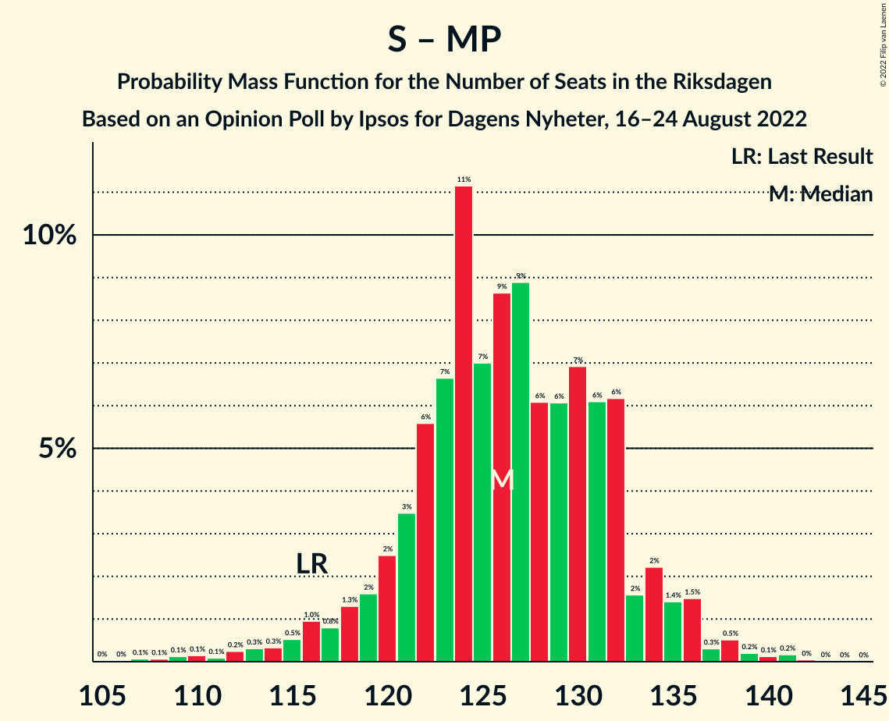

| Number of Seats | Probability | Accumulated | Special Marks |
|:---------------:|:-----------:|:-----------:|:-------------:|
| 106 | 0% | 100% |  |
| 107 | 0.1% | 99.9% |  |
| 108 | 0.1% | 99.9% |  |
| 109 | 0.1% | 99.8% |  |
| 110 | 0.1% | 99.7% |  |
| 111 | 0.1% | 99.5% |  |
| 112 | 0.2% | 99.4% |  |
| 113 | 0.3% | 99.2% |  |
| 114 | 0.3% | 98.9% |  |
| 115 | 0.5% | 98.5% |  |
| 116 | 1.0% | 98% | Last Result |
| 117 | 0.8% | 97% |  |
| 118 | 1.3% | 96% |  |
| 119 | 2% | 95% |  |
| 120 | 2% | 93% |  |
| 121 | 3% | 91% |  |
| 122 | 6% | 87% |  |
| 123 | 7% | 82% |  |
| 124 | 11% | 75% |  |
| 125 | 7% | 64% |  |
| 126 | 9% | 57% |  |
| 127 | 9% | 48% | Median |
| 128 | 6% | 39% |  |
| 129 | 6% | 33% |  |
| 130 | 7% | 27% |  |
| 131 | 6% | 20% |  |
| 132 | 6% | 14% |  |
| 133 | 2% | 8% |  |
| 134 | 2% | 7% |  |
| 135 | 1.4% | 4% |  |
| 136 | 1.5% | 3% |  |
| 137 | 0.3% | 1.4% |  |
| 138 | 0.5% | 1.1% |  |
| 139 | 0.2% | 0.6% |  |
| 140 | 0.1% | 0.4% |  |
| 141 | 0.2% | 0.3% |  |
| 142 | 0% | 0.1% |  |
| 143 | 0% | 0% |  |

### Moderata samlingspartiet – Centerpartiet – Kristdemokraterna – Liberalerna

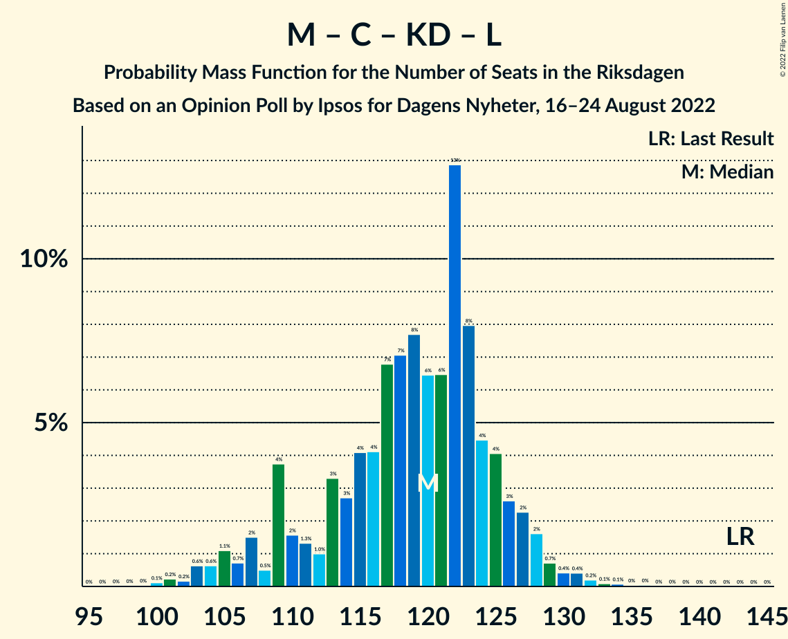

| Number of Seats | Probability | Accumulated | Special Marks |
|:---------------:|:-----------:|:-----------:|:-------------:|
| 98 | 0% | 100% |  |
| 99 | 0% | 99.9% |  |
| 100 | 0.1% | 99.9% |  |
| 101 | 0.2% | 99.8% |  |
| 102 | 0.2% | 99.5% |  |
| 103 | 0.6% | 99.4% |  |
| 104 | 0.6% | 98.7% |  |
| 105 | 1.1% | 98% |  |
| 106 | 0.7% | 97% |  |
| 107 | 2% | 96% |  |
| 108 | 0.5% | 95% |  |
| 109 | 4% | 94% |  |
| 110 | 2% | 91% |  |
| 111 | 1.3% | 89% |  |
| 112 | 1.0% | 88% |  |
| 113 | 3% | 87% |  |
| 114 | 3% | 83% |  |
| 115 | 4% | 81% |  |
| 116 | 4% | 77% |  |
| 117 | 7% | 72% |  |
| 118 | 7% | 66% |  |
| 119 | 8% | 59% |  |
| 120 | 6% | 51% | Median |
| 121 | 6% | 44% |  |
| 122 | 13% | 38% |  |
| 123 | 8% | 25% |  |
| 124 | 4% | 17% |  |
| 125 | 4% | 13% |  |
| 126 | 3% | 9% |  |
| 127 | 2% | 6% |  |
| 128 | 2% | 4% |  |
| 129 | 0.7% | 2% |  |
| 130 | 0.4% | 1.3% |  |
| 131 | 0.4% | 0.9% |  |
| 132 | 0.2% | 0.5% |  |
| 133 | 0.1% | 0.3% |  |
| 134 | 0.1% | 0.2% |  |
| 135 | 0% | 0.1% |  |
| 136 | 0% | 0.1% |  |
| 137 | 0% | 0% |  |
| 138 | 0% | 0% |  |
| 139 | 0% | 0% |  |
| 140 | 0% | 0% |  |
| 141 | 0% | 0% |  |
| 142 | 0% | 0% |  |
| 143 | 0% | 0% | Last Result |

### Sveriges socialdemokratiska arbetareparti

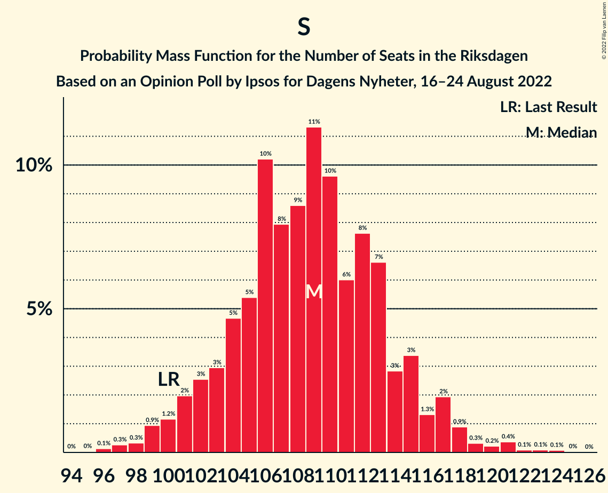

| Number of Seats | Probability | Accumulated | Special Marks |
|:---------------:|:-----------:|:-----------:|:-------------:|
| 95 | 0% | 100% |  |
| 96 | 0.1% | 99.9% |  |
| 97 | 0.3% | 99.8% |  |
| 98 | 0.3% | 99.5% |  |
| 99 | 0.9% | 99.2% |  |
| 100 | 1.2% | 98% | Last Result |
| 101 | 2% | 97% |  |
| 102 | 3% | 95% |  |
| 103 | 3% | 93% |  |
| 104 | 5% | 90% |  |
| 105 | 5% | 85% |  |
| 106 | 10% | 80% |  |
| 107 | 8% | 69% |  |
| 108 | 9% | 61% |  |
| 109 | 11% | 53% | Median |
| 110 | 10% | 41% |  |
| 111 | 6% | 32% |  |
| 112 | 8% | 26% |  |
| 113 | 7% | 18% |  |
| 114 | 3% | 12% |  |
| 115 | 3% | 9% |  |
| 116 | 1.3% | 5% |  |
| 117 | 2% | 4% |  |
| 118 | 0.9% | 2% |  |
| 119 | 0.3% | 1.2% |  |
| 120 | 0.2% | 0.9% |  |
| 121 | 0.4% | 0.7% |  |
| 122 | 0.1% | 0.3% |  |
| 123 | 0.1% | 0.2% |  |
| 124 | 0.1% | 0.1% |  |
| 125 | 0% | 0.1% |  |
| 126 | 0% | 0% |  |

### Moderata samlingspartiet – Centerpartiet – Kristdemokraterna

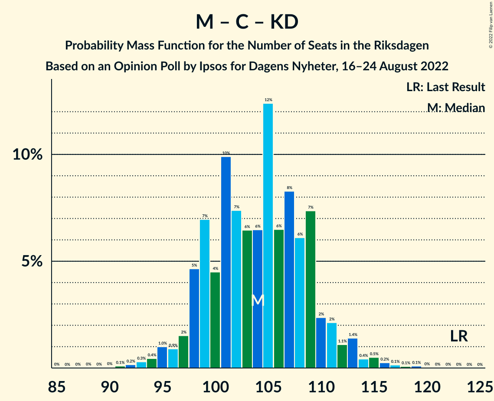

| Number of Seats | Probability | Accumulated | Special Marks |
|:---------------:|:-----------:|:-----------:|:-------------:|
| 88 | 0% | 100% |  |
| 89 | 0% | 99.9% |  |
| 90 | 0% | 99.9% |  |
| 91 | 0.1% | 99.9% |  |
| 92 | 0.2% | 99.8% |  |
| 93 | 0.3% | 99.6% |  |
| 94 | 0.4% | 99.3% |  |
| 95 | 1.0% | 98.9% |  |
| 96 | 0.9% | 98% |  |
| 97 | 2% | 97% |  |
| 98 | 5% | 95% |  |
| 99 | 7% | 91% |  |
| 100 | 4% | 84% |  |
| 101 | 10% | 79% |  |
| 102 | 7% | 69% |  |
| 103 | 6% | 62% |  |
| 104 | 6% | 56% | Median |
| 105 | 12% | 49% |  |
| 106 | 6% | 37% |  |
| 107 | 8% | 30% |  |
| 108 | 6% | 22% |  |
| 109 | 7% | 16% |  |
| 110 | 2% | 9% |  |
| 111 | 2% | 6% |  |
| 112 | 1.1% | 4% |  |
| 113 | 1.4% | 3% |  |
| 114 | 0.4% | 2% |  |
| 115 | 0.5% | 1.1% |  |
| 116 | 0.2% | 0.6% |  |
| 117 | 0.1% | 0.4% |  |
| 118 | 0.1% | 0.2% |  |
| 119 | 0.1% | 0.2% |  |
| 120 | 0% | 0.1% |  |
| 121 | 0% | 0% |  |
| 122 | 0% | 0% |  |
| 123 | 0% | 0% | Last Result |

### Moderata samlingspartiet – Centerpartiet – Liberalerna

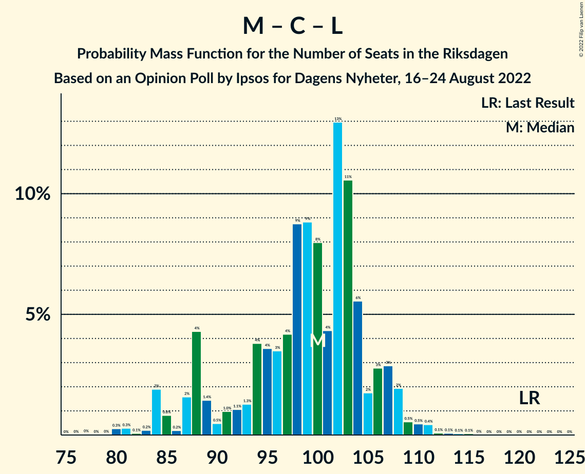

| Number of Seats | Probability | Accumulated | Special Marks |
|:---------------:|:-----------:|:-----------:|:-------------:|
| 78 | 0% | 100% |  |
| 79 | 0% | 99.9% |  |
| 80 | 0.3% | 99.9% |  |
| 81 | 0.3% | 99.7% |  |
| 82 | 0.1% | 99.4% |  |
| 83 | 0.2% | 99.3% |  |
| 84 | 2% | 99.1% |  |
| 85 | 0.8% | 97% |  |
| 86 | 0.2% | 96% |  |
| 87 | 2% | 96% |  |
| 88 | 4% | 95% |  |
| 89 | 1.4% | 90% |  |
| 90 | 0.5% | 89% |  |
| 91 | 1.0% | 88% |  |
| 92 | 1.1% | 87% |  |
| 93 | 1.3% | 86% |  |
| 94 | 4% | 85% |  |
| 95 | 4% | 81% |  |
| 96 | 3% | 78% |  |
| 97 | 4% | 74% |  |
| 98 | 9% | 70% |  |
| 99 | 9% | 61% |  |
| 100 | 8% | 52% | Median |
| 101 | 4% | 44% |  |
| 102 | 13% | 40% |  |
| 103 | 11% | 27% |  |
| 104 | 6% | 17% |  |
| 105 | 2% | 11% |  |
| 106 | 3% | 9% |  |
| 107 | 3% | 7% |  |
| 108 | 2% | 4% |  |
| 109 | 0.5% | 2% |  |
| 110 | 0.5% | 1.2% |  |
| 111 | 0.4% | 0.7% |  |
| 112 | 0.1% | 0.3% |  |
| 113 | 0.1% | 0.2% |  |
| 114 | 0.1% | 0.1% |  |
| 115 | 0.1% | 0.1% |  |
| 116 | 0% | 0% |  |
| 117 | 0% | 0% |  |
| 118 | 0% | 0% |  |
| 119 | 0% | 0% |  |
| 120 | 0% | 0% |  |
| 121 | 0% | 0% | Last Result |

### Moderata samlingspartiet – Kristdemokraterna – Liberalerna

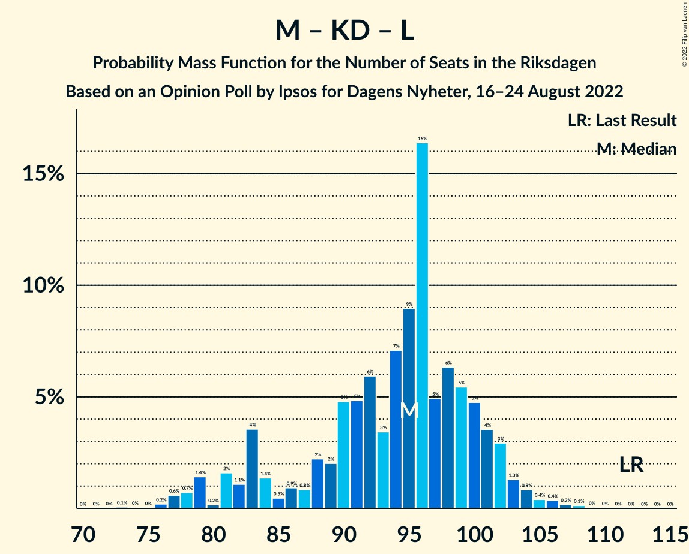

| Number of Seats | Probability | Accumulated | Special Marks |
|:---------------:|:-----------:|:-----------:|:-------------:|
| 73 | 0.1% | 100% |  |
| 74 | 0% | 99.9% |  |
| 75 | 0% | 99.9% |  |
| 76 | 0.2% | 99.8% |  |
| 77 | 0.6% | 99.6% |  |
| 78 | 0.7% | 99.0% |  |
| 79 | 1.4% | 98% |  |
| 80 | 0.2% | 97% |  |
| 81 | 2% | 97% |  |
| 82 | 1.1% | 95% |  |
| 83 | 4% | 94% |  |
| 84 | 1.4% | 91% |  |
| 85 | 0.5% | 89% |  |
| 86 | 0.9% | 89% |  |
| 87 | 0.8% | 88% |  |
| 88 | 2% | 87% |  |
| 89 | 2% | 85% |  |
| 90 | 5% | 83% |  |
| 91 | 5% | 78% |  |
| 92 | 6% | 73% |  |
| 93 | 3% | 67% |  |
| 94 | 7% | 64% |  |
| 95 | 9% | 57% | Median |
| 96 | 16% | 48% |  |
| 97 | 5% | 31% |  |
| 98 | 6% | 26% |  |
| 99 | 5% | 20% |  |
| 100 | 5% | 15% |  |
| 101 | 4% | 10% |  |
| 102 | 3% | 6% |  |
| 103 | 1.3% | 3% |  |
| 104 | 0.8% | 2% |  |
| 105 | 0.4% | 1.1% |  |
| 106 | 0.4% | 0.7% |  |
| 107 | 0.2% | 0.4% |  |
| 108 | 0.1% | 0.2% |  |
| 109 | 0% | 0.1% |  |
| 110 | 0% | 0% |  |
| 111 | 0% | 0% |  |
| 112 | 0% | 0% | Last Result |

### Moderata samlingspartiet – Centerpartiet

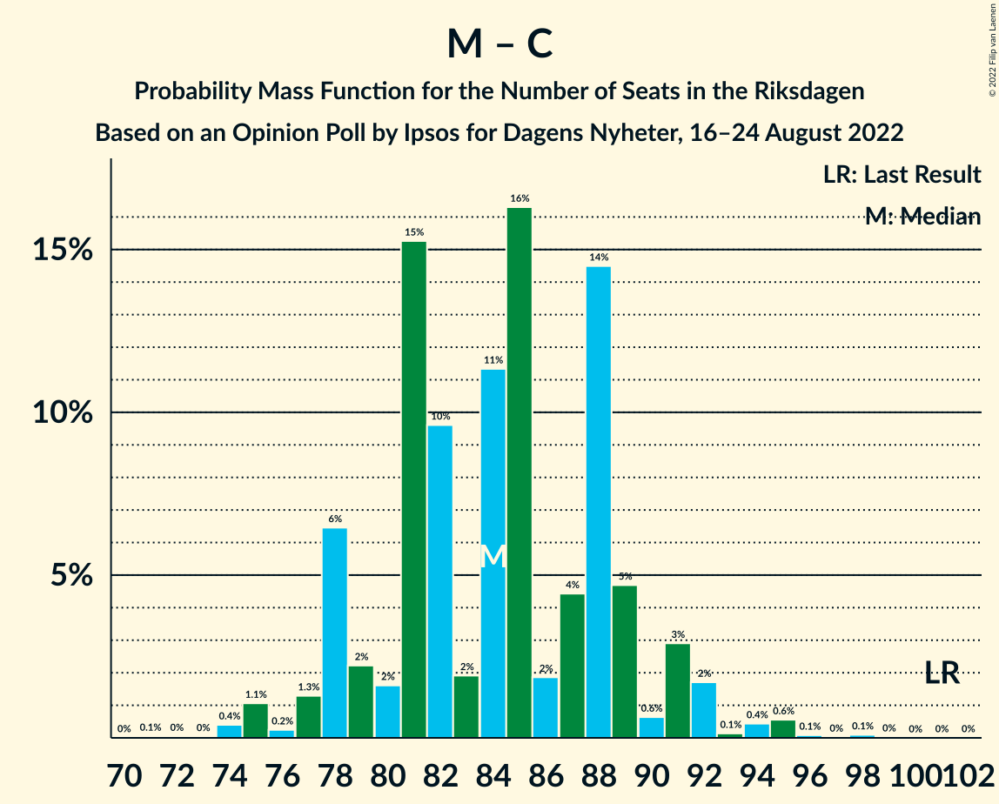

| Number of Seats | Probability | Accumulated | Special Marks |
|:---------------:|:-----------:|:-----------:|:-------------:|
| 71 | 0.1% | 100% |  |
| 72 | 0% | 99.9% |  |
| 73 | 0% | 99.9% |  |
| 74 | 0.4% | 99.8% |  |
| 75 | 1.1% | 99.4% |  |
| 76 | 0.2% | 98% |  |
| 77 | 1.3% | 98% |  |
| 78 | 6% | 97% |  |
| 79 | 2% | 90% |  |
| 80 | 2% | 88% |  |
| 81 | 15% | 87% |  |
| 82 | 10% | 71% |  |
| 83 | 2% | 62% |  |
| 84 | 11% | 60% | Median |
| 85 | 16% | 48% |  |
| 86 | 2% | 32% |  |
| 87 | 4% | 30% |  |
| 88 | 14% | 26% |  |
| 89 | 5% | 11% |  |
| 90 | 0.6% | 7% |  |
| 91 | 3% | 6% |  |
| 92 | 2% | 3% |  |
| 93 | 0.1% | 1.4% |  |
| 94 | 0.4% | 1.3% |  |
| 95 | 0.6% | 0.8% |  |
| 96 | 0.1% | 0.3% |  |
| 97 | 0% | 0.2% |  |
| 98 | 0.1% | 0.1% |  |
| 99 | 0% | 0.1% |  |
| 100 | 0% | 0% |  |
| 101 | 0% | 0% | Last Result |

### Moderata samlingspartiet – Kristdemokraterna

| Number of Seats | Probability | Accumulated | Special Marks |
|:---------------:|:-----------:|:-----------:|:-------------:|
| 62 | 0% | 100% |  |
| 63 | 0% | 99.9% |  |
| 64 | 0% | 99.9% |  |
| 65 | 0% | 99.9% |  |
| 66 | 0% | 99.9% |  |
| 67 | 0% | 99.9% |  |
| 68 | 0.2% | 99.9% |  |
| 69 | 0.5% | 99.7% |  |
| 70 | 0.5% | 99.2% |  |
| 71 | 0.4% | 98.7% |  |
| 72 | 1.0% | 98% |  |
| 73 | 5% | 97% |  |
| 74 | 7% | 93% |  |
| 75 | 6% | 86% |  |
| 76 | 4% | 80% |  |
| 77 | 5% | 76% |  |
| 78 | 11% | 70% |  |
| 79 | 18% | 59% | Median |
| 80 | 6% | 42% |  |
| 81 | 7% | 36% |  |
| 82 | 4% | 28% |  |
| 83 | 10% | 24% |  |
| 84 | 7% | 14% |  |
| 85 | 2% | 7% |  |
| 86 | 2% | 5% |  |
| 87 | 1.1% | 3% |  |
| 88 | 1.1% | 2% |  |
| 89 | 0.7% | 1.2% |  |
| 90 | 0.2% | 0.5% |  |
| 91 | 0.1% | 0.3% |  |
| 92 | 0.1% | 0.2% | Last Result |
| 93 | 0.1% | 0.1% |  |
| 94 | 0% | 0% |  |

## Technical Information

### Opinion Poll

+ **Polling firm:** Ipsos
+ **Commissioner(s):** Dagens Nyheter
+ **Fieldwork period:** 16–24 August 2022

### Calculations

+ **Sample size:** 1630
+ **Simulations done:** 1,048,576
+ **Error estimate:** 1.63%

