# Opinion Poll by SKOP, 20–24 August 2022

<a href="#voting-intentions">Voting Intentions</a> | <a href="#seats">Seats</a> | <a href="#coalitions">Coalitions</a> | <a href="#technical-information">Technical Information</a>

## Voting Intentions

### Confidence Intervals

| Party | Last Result | Poll Result | 80% Confidence Interval | 90% Confidence Interval | 95% Confidence Interval | 99% Confidence Interval |
|:-----:|:-----------:|:-----------:|:-----------------------:|:-----------------------:|:-----------------------:|:-----------------------:|
| Sveriges socialdemokratiska arbetareparti | 28.3% | 28.0% | 26.3–29.8% |25.8–30.3% |25.4–30.7% |24.6–31.6% |
| Sverigedemokraterna | 17.5% | 18.8% | 17.3–20.4% |16.9–20.8% |16.6–21.2% |15.9–22.0% |
| Moderata samlingspartiet | 19.8% | 18.0% | 16.6–19.5% |16.2–20.0% |15.8–20.3% |15.2–21.1% |
| Vänsterpartiet | 8.0% | 9.6% | 8.5–10.8% |8.2–11.1% |8.0–11.4% |7.5–12.1% |
| Kristdemokraterna | 6.3% | 6.4% | 5.5–7.4% |5.3–7.7% |5.1–7.9% |4.7–8.5% |
| Liberalerna | 5.5% | 6.4% | 5.5–7.4% |5.3–7.7% |5.1–7.9% |4.7–8.5% |
| Centerpartiet | 8.6% | 6.1% | 5.3–7.1% |5.0–7.4% |4.8–7.7% |4.5–8.2% |
| Miljöpartiet de gröna | 4.4% | 5.5% | 4.8–6.5% |4.5–6.8% |4.3–7.1% |4.0–7.5% |

*Note:* The poll result column reflects the actual value used in the calculations. Published results may vary slightly, and in addition be rounded to fewer digits.

## Seats

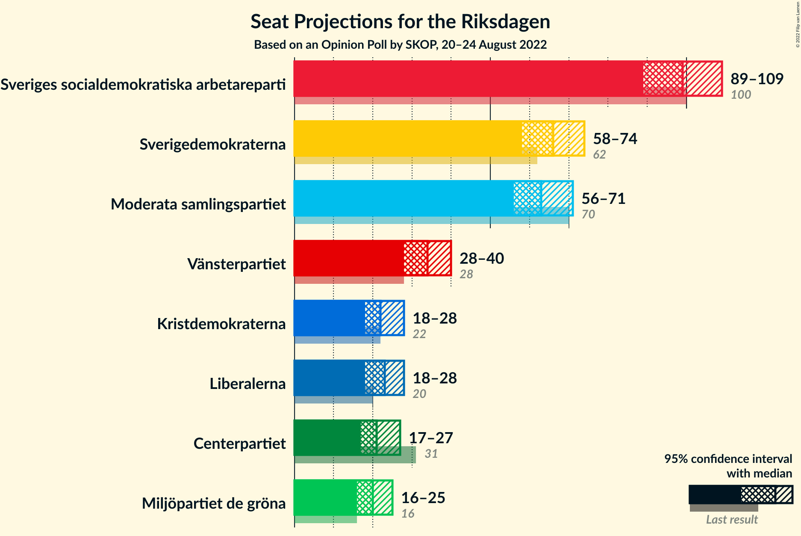

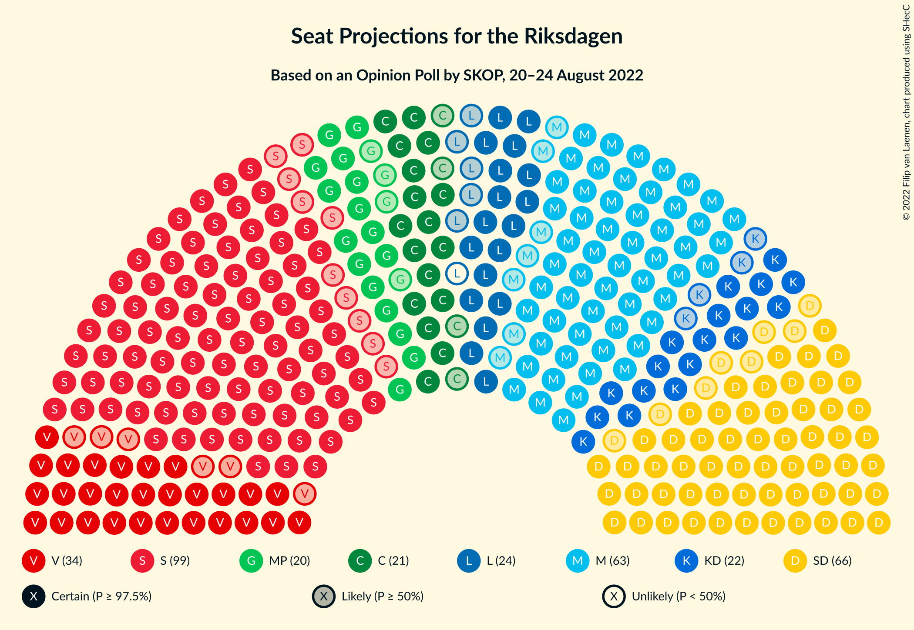

### Confidence Intervals

| Party | Last Result | Median | 80% Confidence Interval | 90% Confidence Interval | 95% Confidence Interval | 99% Confidence Interval |
|:-----:|:-----------:|:------:|:-----------------------:|:-----------------------:|:-----------------------:|:-----------------------:|
| <a href="#sveriges-socialdemokratiska-arbetareparti">Sveriges socialdemokratiska arbetareparti</a> | 100 | 99 | 92–105 |91–107 |89–109 |87–111 |
| <a href="#sverigedemokraterna">Sverigedemokraterna</a> | 62 | 66 | 61–71 |60–73 |58–74 |56–77 |
| <a href="#moderata-samlingspartiet">Moderata samlingspartiet</a> | 70 | 63 | 58–69 |57–70 |56–71 |54–74 |
| <a href="#vänsterpartiet">Vänsterpartiet</a> | 28 | 34 | 30–38 |29–39 |28–40 |26–42 |
| <a href="#kristdemokraterna">Kristdemokraterna</a> | 22 | 22 | 19–26 |18–27 |18–28 |16–30 |
| <a href="#liberalerna">Liberalerna</a> | 20 | 23 | 19–26 |19–27 |18–28 |16–30 |
| <a href="#centerpartiet">Centerpartiet</a> | 31 | 21 | 18–25 |18–26 |17–27 |16–29 |
| <a href="#miljöpartiet-de-gröna">Miljöpartiet de gröna</a> | 16 | 20 | 17–23 |16–24 |16–25 |0–27 |

### Sveriges socialdemokratiska arbetareparti

*For a full overview of the results for this party, see the [Sveriges socialdemokratiska arbetareparti](party-sverigessocialdemokratiskaarbetareparti.html) page.*

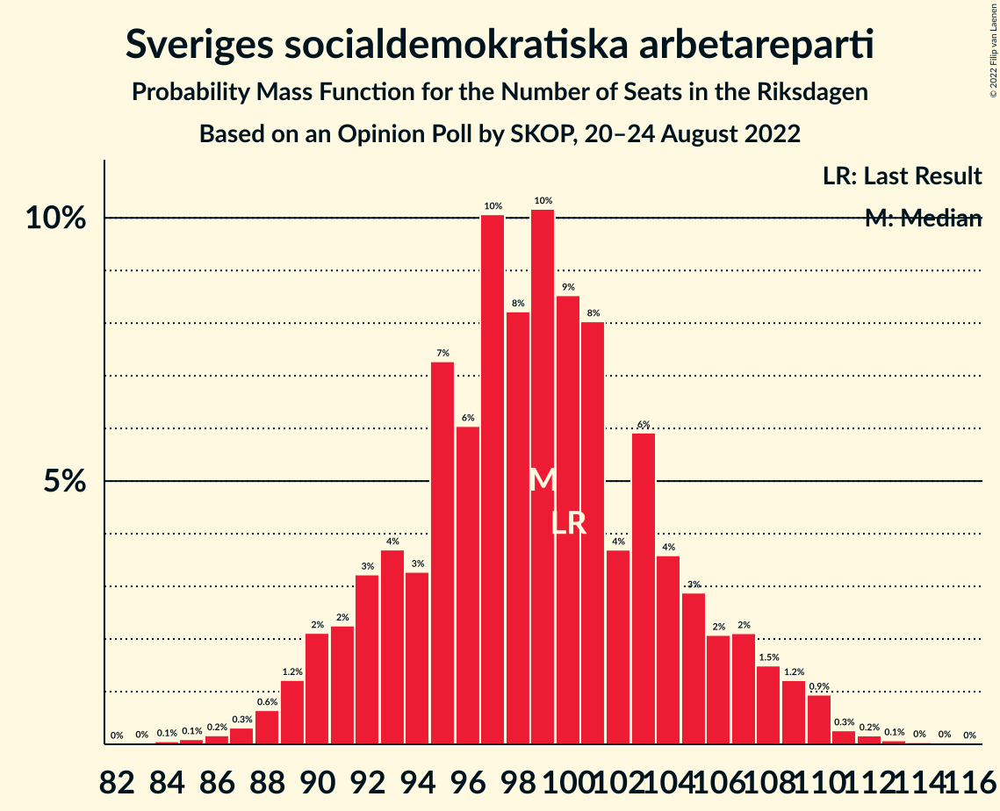

| Number of Seats | Probability | Accumulated | Special Marks |
|:---------------:|:-----------:|:-----------:|:-------------:|
| 84 | 0.1% | 100% |  |
| 85 | 0.1% | 99.9% |  |
| 86 | 0.2% | 99.8% |  |
| 87 | 0.3% | 99.6% |  |
| 88 | 0.6% | 99.3% |  |
| 89 | 1.2% | 98.7% |  |
| 90 | 2% | 97% |  |
| 91 | 2% | 95% |  |
| 92 | 3% | 93% |  |
| 93 | 4% | 90% |  |
| 94 | 3% | 86% |  |
| 95 | 7% | 83% |  |
| 96 | 6% | 76% |  |
| 97 | 10% | 70% |  |
| 98 | 8% | 59% |  |
| 99 | 10% | 51% | Median |
| 100 | 9% | 41% | Last Result |
| 101 | 8% | 33% |  |
| 102 | 4% | 25% |  |
| 103 | 6% | 21% |  |
| 104 | 4% | 15% |  |
| 105 | 3% | 11% |  |
| 106 | 2% | 8% |  |
| 107 | 2% | 6% |  |
| 108 | 1.5% | 4% |  |
| 109 | 1.2% | 3% |  |
| 110 | 0.9% | 2% |  |
| 111 | 0.3% | 0.6% |  |
| 112 | 0.2% | 0.3% |  |
| 113 | 0.1% | 0.2% |  |
| 114 | 0% | 0.1% |  |
| 115 | 0% | 0.1% |  |
| 116 | 0% | 0% |  |

### Sverigedemokraterna

*For a full overview of the results for this party, see the [Sverigedemokraterna](party-sverigedemokraterna.html) page.*

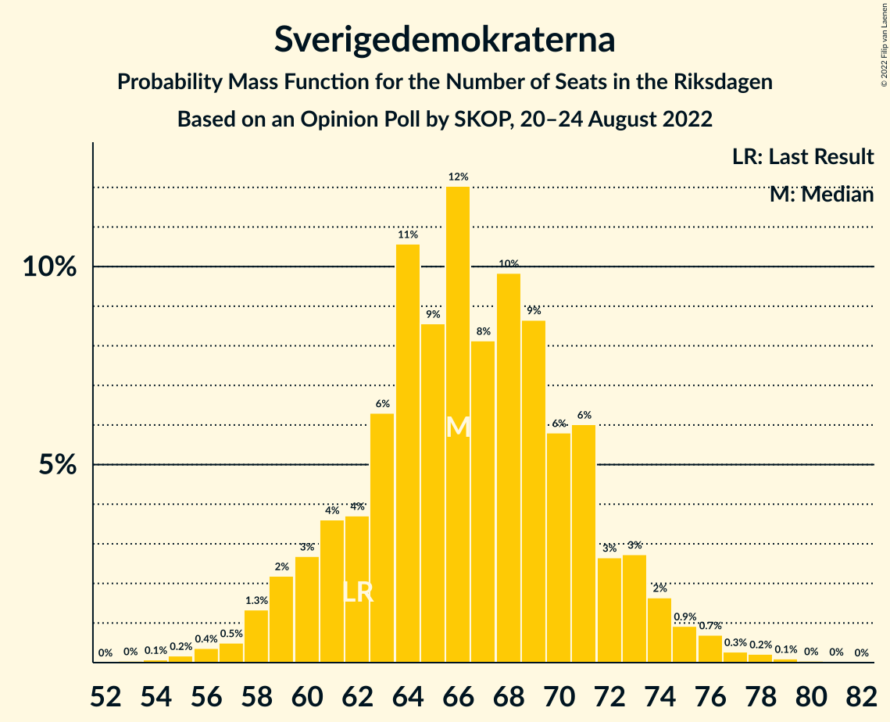

| Number of Seats | Probability | Accumulated | Special Marks |
|:---------------:|:-----------:|:-----------:|:-------------:|
| 53 | 0% | 100% |  |
| 54 | 0.1% | 99.9% |  |
| 55 | 0.2% | 99.9% |  |
| 56 | 0.4% | 99.7% |  |
| 57 | 0.5% | 99.3% |  |
| 58 | 1.3% | 98.8% |  |
| 59 | 2% | 97% |  |
| 60 | 3% | 95% |  |
| 61 | 4% | 93% |  |
| 62 | 4% | 89% | Last Result |
| 63 | 6% | 85% |  |
| 64 | 11% | 79% |  |
| 65 | 9% | 68% |  |
| 66 | 12% | 60% | Median |
| 67 | 8% | 48% |  |
| 68 | 10% | 40% |  |
| 69 | 9% | 30% |  |
| 70 | 6% | 21% |  |
| 71 | 6% | 15% |  |
| 72 | 3% | 9% |  |
| 73 | 3% | 7% |  |
| 74 | 2% | 4% |  |
| 75 | 0.9% | 2% |  |
| 76 | 0.7% | 1.4% |  |
| 77 | 0.3% | 0.7% |  |
| 78 | 0.2% | 0.4% |  |
| 79 | 0.1% | 0.2% |  |
| 80 | 0% | 0.1% |  |
| 81 | 0% | 0.1% |  |
| 82 | 0% | 0% |  |

### Moderata samlingspartiet

*For a full overview of the results for this party, see the [Moderata samlingspartiet](party-moderatasamlingspartiet.html) page.*

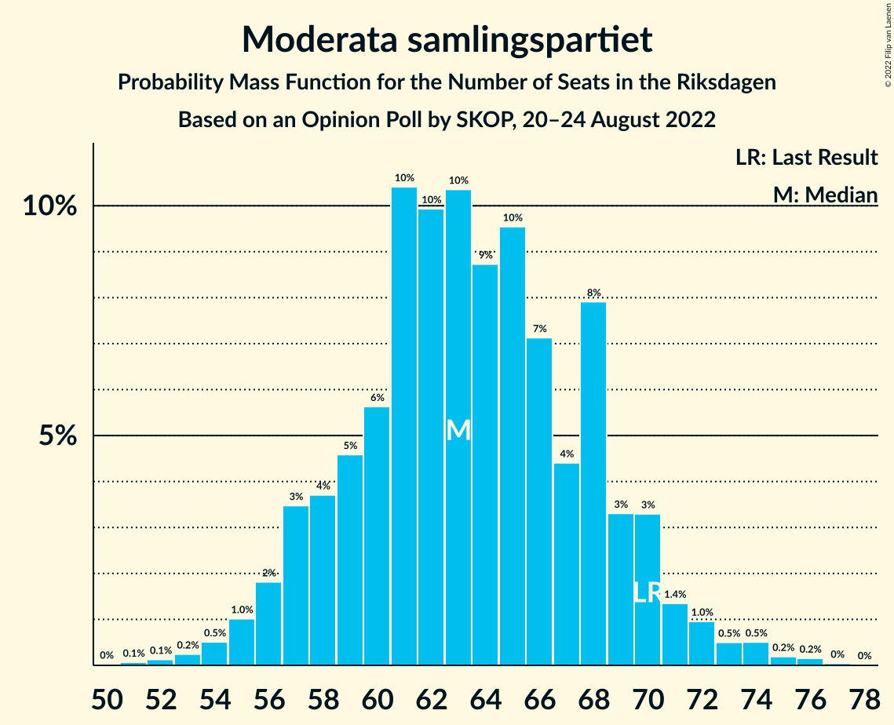

| Number of Seats | Probability | Accumulated | Special Marks |
|:---------------:|:-----------:|:-----------:|:-------------:|
| 51 | 0.1% | 100% |  |
| 52 | 0.1% | 99.9% |  |
| 53 | 0.2% | 99.8% |  |
| 54 | 0.5% | 99.5% |  |
| 55 | 1.0% | 99.0% |  |
| 56 | 2% | 98% |  |
| 57 | 3% | 96% |  |
| 58 | 4% | 93% |  |
| 59 | 5% | 89% |  |
| 60 | 6% | 84% |  |
| 61 | 10% | 79% |  |
| 62 | 10% | 68% |  |
| 63 | 10% | 58% | Median |
| 64 | 9% | 48% |  |
| 65 | 10% | 39% |  |
| 66 | 7% | 30% |  |
| 67 | 4% | 23% |  |
| 68 | 8% | 18% |  |
| 69 | 3% | 10% |  |
| 70 | 3% | 7% | Last Result |
| 71 | 1.4% | 4% |  |
| 72 | 1.0% | 2% |  |
| 73 | 0.5% | 1.4% |  |
| 74 | 0.5% | 0.9% |  |
| 75 | 0.2% | 0.4% |  |
| 76 | 0.2% | 0.2% |  |
| 77 | 0% | 0.1% |  |
| 78 | 0% | 0% |  |

### Vänsterpartiet

*For a full overview of the results for this party, see the [Vänsterpartiet](party-vänsterpartiet.html) page.*

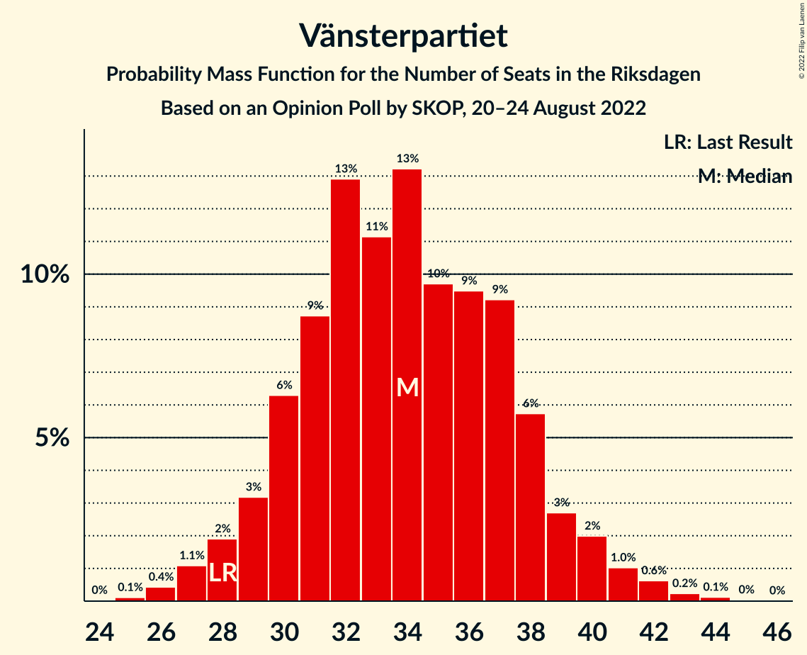

| Number of Seats | Probability | Accumulated | Special Marks |
|:---------------:|:-----------:|:-----------:|:-------------:|
| 25 | 0.1% | 100% |  |
| 26 | 0.4% | 99.8% |  |
| 27 | 1.1% | 99.4% |  |
| 28 | 2% | 98% | Last Result |
| 29 | 3% | 96% |  |
| 30 | 6% | 93% |  |
| 31 | 9% | 87% |  |
| 32 | 13% | 78% |  |
| 33 | 11% | 65% |  |
| 34 | 13% | 54% | Median |
| 35 | 10% | 41% |  |
| 36 | 9% | 31% |  |
| 37 | 9% | 22% |  |
| 38 | 6% | 13% |  |
| 39 | 3% | 7% |  |
| 40 | 2% | 4% |  |
| 41 | 1.0% | 2% |  |
| 42 | 0.6% | 1.1% |  |
| 43 | 0.2% | 0.4% |  |
| 44 | 0.1% | 0.2% |  |
| 45 | 0% | 0.1% |  |
| 46 | 0% | 0% |  |

### Kristdemokraterna

*For a full overview of the results for this party, see the [Kristdemokraterna](party-kristdemokraterna.html) page.*

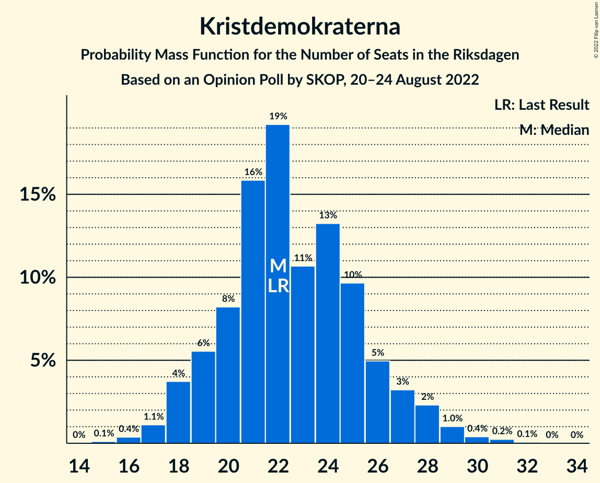

| Number of Seats | Probability | Accumulated | Special Marks |
|:---------------:|:-----------:|:-----------:|:-------------:|
| 15 | 0.1% | 100% |  |
| 16 | 0.4% | 99.9% |  |
| 17 | 1.1% | 99.5% |  |
| 18 | 4% | 98% |  |
| 19 | 6% | 95% |  |
| 20 | 8% | 89% |  |
| 21 | 16% | 81% |  |
| 22 | 19% | 65% | Last Result, Median |
| 23 | 11% | 46% |  |
| 24 | 13% | 35% |  |
| 25 | 10% | 22% |  |
| 26 | 5% | 12% |  |
| 27 | 3% | 7% |  |
| 28 | 2% | 4% |  |
| 29 | 1.0% | 2% |  |
| 30 | 0.4% | 0.7% |  |
| 31 | 0.2% | 0.3% |  |
| 32 | 0.1% | 0.1% |  |
| 33 | 0% | 0% |  |

### Liberalerna

*For a full overview of the results for this party, see the [Liberalerna](party-liberalerna.html) page.*

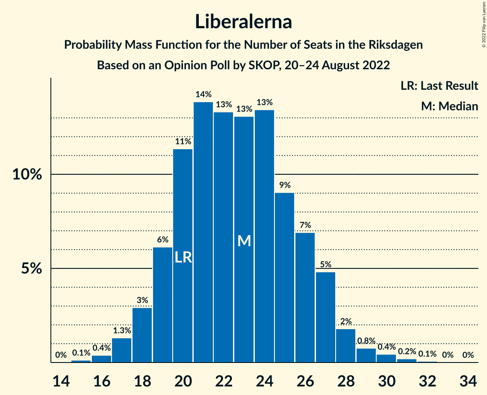

| Number of Seats | Probability | Accumulated | Special Marks |
|:---------------:|:-----------:|:-----------:|:-------------:|
| 15 | 0.1% | 100% |  |
| 16 | 0.4% | 99.9% |  |
| 17 | 1.3% | 99.5% |  |
| 18 | 3% | 98% |  |
| 19 | 6% | 95% |  |
| 20 | 11% | 89% | Last Result |
| 21 | 14% | 78% |  |
| 22 | 13% | 64% |  |
| 23 | 13% | 51% | Median |
| 24 | 13% | 37% |  |
| 25 | 9% | 24% |  |
| 26 | 7% | 15% |  |
| 27 | 5% | 8% |  |
| 28 | 2% | 3% |  |
| 29 | 0.8% | 1.5% |  |
| 30 | 0.4% | 0.7% |  |
| 31 | 0.2% | 0.3% |  |
| 32 | 0.1% | 0.1% |  |
| 33 | 0% | 0% |  |

### Centerpartiet

*For a full overview of the results for this party, see the [Centerpartiet](party-centerpartiet.html) page.*

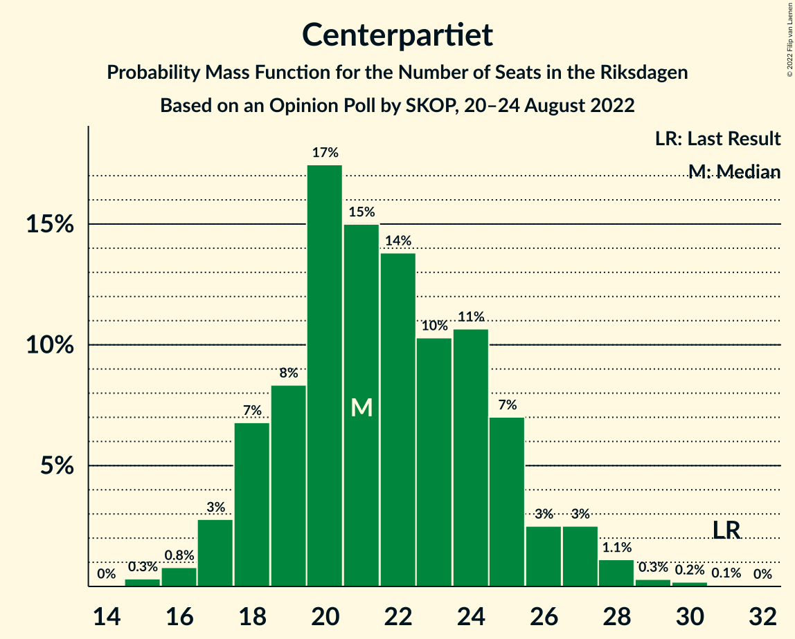

| Number of Seats | Probability | Accumulated | Special Marks |
|:---------------:|:-----------:|:-----------:|:-------------:|
| 14 | 0% | 100% |  |
| 15 | 0.3% | 99.9% |  |
| 16 | 0.8% | 99.6% |  |
| 17 | 3% | 98.8% |  |
| 18 | 7% | 96% |  |
| 19 | 8% | 89% |  |
| 20 | 17% | 81% |  |
| 21 | 15% | 63% | Median |
| 22 | 14% | 48% |  |
| 23 | 10% | 35% |  |
| 24 | 11% | 24% |  |
| 25 | 7% | 14% |  |
| 26 | 3% | 7% |  |
| 27 | 3% | 4% |  |
| 28 | 1.1% | 2% |  |
| 29 | 0.3% | 0.6% |  |
| 30 | 0.2% | 0.3% |  |
| 31 | 0.1% | 0.1% | Last Result |
| 32 | 0% | 0% |  |

### Miljöpartiet de gröna

*For a full overview of the results for this party, see the [Miljöpartiet de gröna](party-miljöpartietdegröna.html) page.*

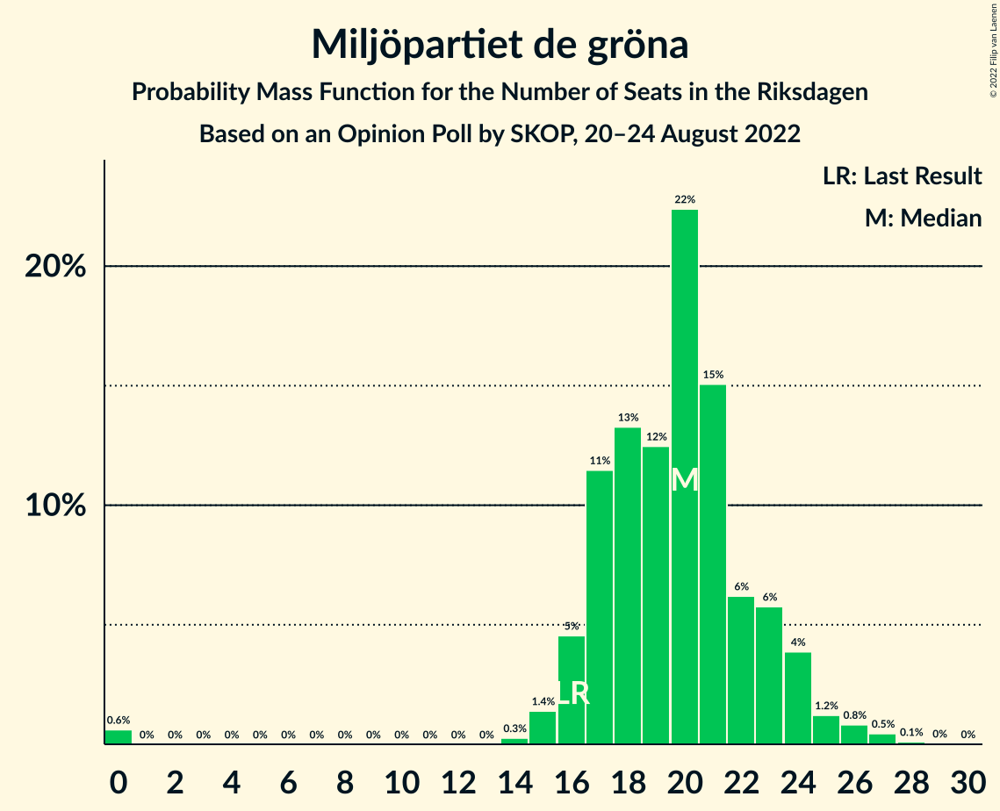

| Number of Seats | Probability | Accumulated | Special Marks |
|:---------------:|:-----------:|:-----------:|:-------------:|
| 0 | 0.6% | 100% |  |
| 1 | 0% | 99.4% |  |
| 2 | 0% | 99.4% |  |
| 3 | 0% | 99.4% |  |
| 4 | 0% | 99.4% |  |
| 5 | 0% | 99.4% |  |
| 6 | 0% | 99.4% |  |
| 7 | 0% | 99.4% |  |
| 8 | 0% | 99.4% |  |
| 9 | 0% | 99.4% |  |
| 10 | 0% | 99.4% |  |
| 11 | 0% | 99.4% |  |
| 12 | 0% | 99.4% |  |
| 13 | 0% | 99.4% |  |
| 14 | 0.3% | 99.4% |  |
| 15 | 1.4% | 99.1% |  |
| 16 | 5% | 98% | Last Result |
| 17 | 11% | 93% |  |
| 18 | 13% | 82% |  |
| 19 | 12% | 68% |  |
| 20 | 22% | 56% | Median |
| 21 | 15% | 34% |  |
| 22 | 6% | 18% |  |
| 23 | 6% | 12% |  |
| 24 | 4% | 7% |  |
| 25 | 1.2% | 3% |  |
| 26 | 0.8% | 1.4% |  |
| 27 | 0.5% | 0.6% |  |
| 28 | 0.1% | 0.2% |  |
| 29 | 0% | 0.1% |  |
| 30 | 0% | 0% |  |

## Coalitions

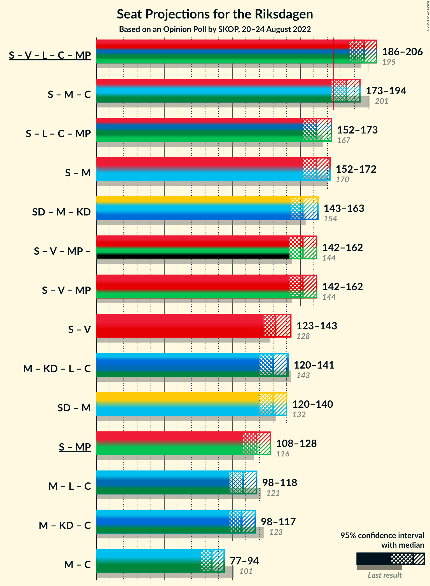

### Confidence Intervals

| Coalition | Last Result | Median | Majority? | 80% Confidence Interval | 90% Confidence Interval | 95% Confidence Interval | 99% Confidence Interval |
|:---------:|:-----------:|:------:|:---------:|:-----------------------:|:-----------------------:|:-----------------------:|:-----------------------:|
| Sveriges socialdemokratiska arbetareparti – Vänsterpartiet – Liberalerna – Centerpartiet – Miljöpartiet de gröna | 195 | 197 | 100% | 190–203 | 188–205 | 186–206 | 183–210 |
| Sveriges socialdemokratiska arbetareparti – Moderata samlingspartiet – Centerpartiet | 201 | 184 | 96% | 177–191 | 175–193 | 173–194 | 171–198 |
| Sveriges socialdemokratiska arbetareparti – Liberalerna – Centerpartiet – Miljöpartiet de gröna | 167 | 162 | 1.2% | 156–170 | 154–172 | 152–173 | 148–176 |
| Sveriges socialdemokratiska arbetareparti – Moderata samlingspartiet | 170 | 162 | 1.0% | 156–169 | 153–171 | 152–172 | 148–177 |
| Sverigedemokraterna – Moderata samlingspartiet – Kristdemokraterna | 154 | 152 | 0% | 146–159 | 144–161 | 143–163 | 139–166 |
| Sveriges socialdemokratiska arbetareparti – Vänsterpartiet – Miljöpartiet de gröna | 144 | 152 | 0% | 146–159 | 144–161 | 142–162 | 138–166 |
| Sveriges socialdemokratiska arbetareparti – Vänsterpartiet | 128 | 132 | 0% | 126–139 | 124–141 | 123–143 | 119–146 |
| Moderata samlingspartiet – Kristdemokraterna – Liberalerna – Centerpartiet | 143 | 130 | 0% | 124–137 | 122–138 | 120–141 | 118–144 |
| Sverigedemokraterna – Moderata samlingspartiet | 132 | 130 | 0% | 124–137 | 122–138 | 120–140 | 117–143 |
| Sveriges socialdemokratiska arbetareparti – Miljöpartiet de gröna | 116 | 118 | 0% | 112–125 | 110–127 | 108–128 | 105–131 |
| Moderata samlingspartiet – Liberalerna – Centerpartiet | 121 | 108 | 0% | 102–114 | 100–116 | 98–118 | 95–120 |
| Moderata samlingspartiet – Kristdemokraterna – Centerpartiet | 123 | 107 | 0% | 102–114 | 100–116 | 98–117 | 96–121 |
| Moderata samlingspartiet – Centerpartiet | 101 | 85 | 0% | 79–91 | 78–93 | 77–94 | 74–97 |

### Sveriges socialdemokratiska arbetareparti – Vänsterpartiet – Liberalerna – Centerpartiet – Miljöpartiet de gröna

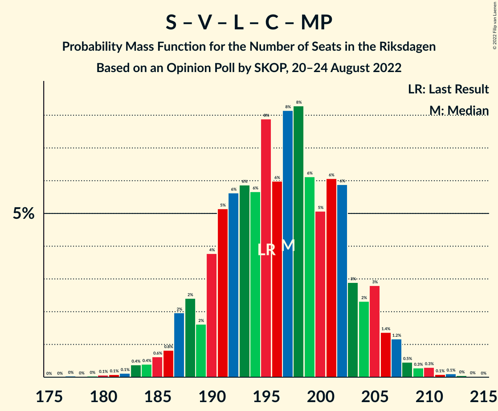

| Number of Seats | Probability | Accumulated | Special Marks |
|:---------------:|:-----------:|:-----------:|:-------------:|
| 177 | 0% | 100% |  |
| 178 | 0% | 99.9% |  |
| 179 | 0% | 99.9% |  |
| 180 | 0.1% | 99.9% |  |
| 181 | 0.1% | 99.8% |  |
| 182 | 0.1% | 99.7% |  |
| 183 | 0.4% | 99.6% |  |
| 184 | 0.4% | 99.2% |  |
| 185 | 0.6% | 98.9% |  |
| 186 | 0.8% | 98% |  |
| 187 | 2% | 97% |  |
| 188 | 2% | 95% |  |
| 189 | 2% | 93% |  |
| 190 | 4% | 91% |  |
| 191 | 5% | 88% |  |
| 192 | 6% | 82% |  |
| 193 | 6% | 77% |  |
| 194 | 6% | 71% |  |
| 195 | 8% | 65% | Last Result |
| 196 | 6% | 57% |  |
| 197 | 8% | 51% | Median |
| 198 | 8% | 43% |  |
| 199 | 6% | 35% |  |
| 200 | 5% | 29% |  |
| 201 | 6% | 24% |  |
| 202 | 6% | 18% |  |
| 203 | 3% | 12% |  |
| 204 | 2% | 9% |  |
| 205 | 3% | 7% |  |
| 206 | 1.4% | 4% |  |
| 207 | 1.2% | 2% |  |
| 208 | 0.5% | 1.3% |  |
| 209 | 0.3% | 0.9% |  |
| 210 | 0.3% | 0.6% |  |
| 211 | 0.1% | 0.3% |  |
| 212 | 0.1% | 0.2% |  |
| 213 | 0% | 0.1% |  |
| 214 | 0% | 0% |  |

### Sveriges socialdemokratiska arbetareparti – Moderata samlingspartiet – Centerpartiet

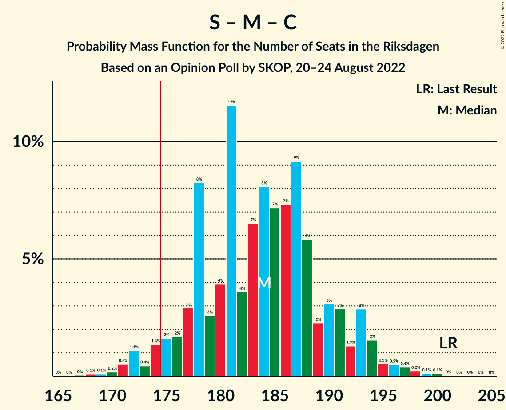

| Number of Seats | Probability | Accumulated | Special Marks |
|:---------------:|:-----------:|:-----------:|:-------------:|
| 166 | 0% | 100% |  |
| 167 | 0% | 99.9% |  |
| 168 | 0.1% | 99.9% |  |
| 169 | 0.1% | 99.8% |  |
| 170 | 0.2% | 99.7% |  |
| 171 | 0.5% | 99.5% |  |
| 172 | 1.1% | 99.0% |  |
| 173 | 0.4% | 98% |  |
| 174 | 1.4% | 97% |  |
| 175 | 2% | 96% | Majority |
| 176 | 2% | 94% |  |
| 177 | 3% | 93% |  |
| 178 | 8% | 90% |  |
| 179 | 3% | 82% |  |
| 180 | 4% | 79% |  |
| 181 | 12% | 75% |  |
| 182 | 4% | 64% |  |
| 183 | 7% | 60% | Median |
| 184 | 8% | 53% |  |
| 185 | 7% | 45% |  |
| 186 | 7% | 38% |  |
| 187 | 9% | 31% |  |
| 188 | 6% | 22% |  |
| 189 | 2% | 16% |  |
| 190 | 3% | 14% |  |
| 191 | 3% | 11% |  |
| 192 | 1.3% | 8% |  |
| 193 | 3% | 6% |  |
| 194 | 2% | 4% |  |
| 195 | 0.5% | 2% |  |
| 196 | 0.5% | 1.5% |  |
| 197 | 0.4% | 1.0% |  |
| 198 | 0.2% | 0.6% |  |
| 199 | 0.1% | 0.4% |  |
| 200 | 0.1% | 0.2% |  |
| 201 | 0% | 0.1% | Last Result |
| 202 | 0% | 0.1% |  |
| 203 | 0% | 0.1% |  |
| 204 | 0% | 0% |  |

### Sveriges socialdemokratiska arbetareparti – Liberalerna – Centerpartiet – Miljöpartiet de gröna

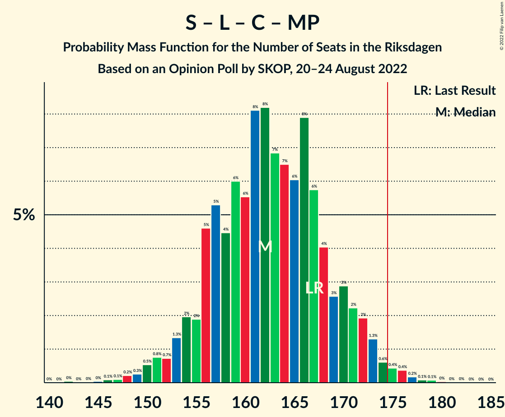

| Number of Seats | Probability | Accumulated | Special Marks |
|:---------------:|:-----------:|:-----------:|:-------------:|
| 142 | 0% | 100% |  |
| 143 | 0% | 99.9% |  |
| 144 | 0% | 99.9% |  |
| 145 | 0% | 99.9% |  |
| 146 | 0.1% | 99.9% |  |
| 147 | 0.1% | 99.8% |  |
| 148 | 0.2% | 99.7% |  |
| 149 | 0.3% | 99.5% |  |
| 150 | 0.5% | 99.2% |  |
| 151 | 0.8% | 98.7% |  |
| 152 | 0.7% | 98% |  |
| 153 | 1.3% | 97% |  |
| 154 | 2% | 96% |  |
| 155 | 2% | 94% |  |
| 156 | 5% | 92% |  |
| 157 | 5% | 87% |  |
| 158 | 4% | 82% |  |
| 159 | 6% | 78% |  |
| 160 | 6% | 72% |  |
| 161 | 8% | 66% |  |
| 162 | 8% | 58% |  |
| 163 | 7% | 50% | Median |
| 164 | 7% | 43% |  |
| 165 | 6% | 36% |  |
| 166 | 8% | 30% |  |
| 167 | 6% | 23% | Last Result |
| 168 | 4% | 17% |  |
| 169 | 3% | 13% |  |
| 170 | 3% | 10% |  |
| 171 | 2% | 7% |  |
| 172 | 2% | 5% |  |
| 173 | 1.3% | 3% |  |
| 174 | 0.6% | 2% |  |
| 175 | 0.4% | 1.2% | Majority |
| 176 | 0.4% | 0.8% |  |
| 177 | 0.2% | 0.4% |  |
| 178 | 0.1% | 0.2% |  |
| 179 | 0.1% | 0.1% |  |
| 180 | 0% | 0.1% |  |
| 181 | 0% | 0% |  |

### Sveriges socialdemokratiska arbetareparti – Moderata samlingspartiet

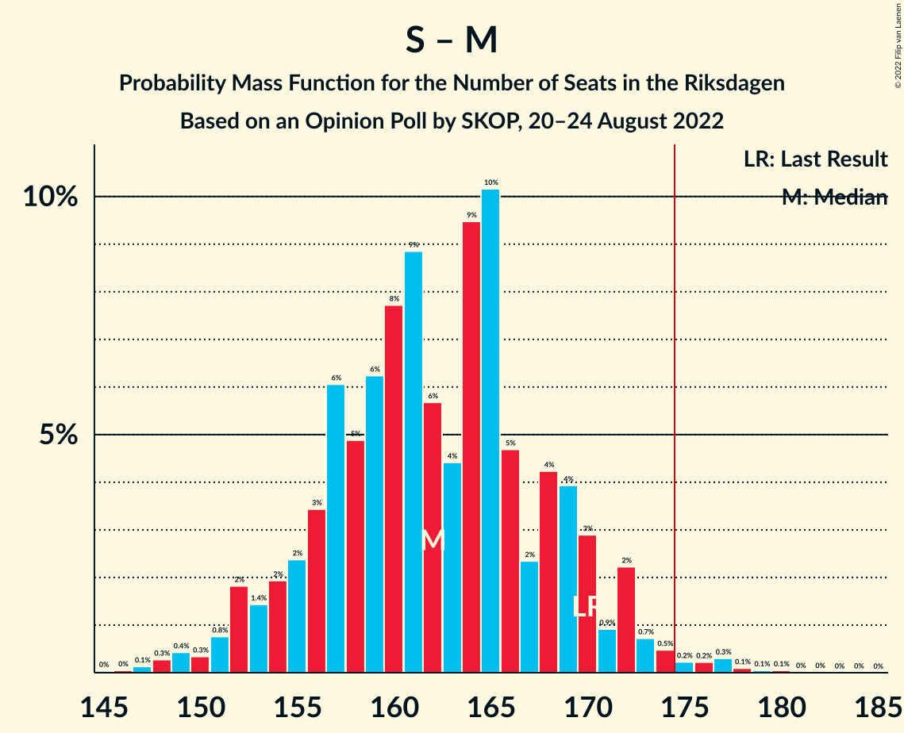

| Number of Seats | Probability | Accumulated | Special Marks |
|:---------------:|:-----------:|:-----------:|:-------------:|
| 145 | 0% | 100% |  |
| 146 | 0% | 99.9% |  |
| 147 | 0.1% | 99.9% |  |
| 148 | 0.3% | 99.7% |  |
| 149 | 0.4% | 99.5% |  |
| 150 | 0.3% | 99.0% |  |
| 151 | 0.8% | 98.7% |  |
| 152 | 2% | 98% |  |
| 153 | 1.4% | 96% |  |
| 154 | 2% | 95% |  |
| 155 | 2% | 93% |  |
| 156 | 3% | 90% |  |
| 157 | 6% | 87% |  |
| 158 | 5% | 81% |  |
| 159 | 6% | 76% |  |
| 160 | 8% | 70% |  |
| 161 | 9% | 62% |  |
| 162 | 6% | 53% | Median |
| 163 | 4% | 47% |  |
| 164 | 9% | 43% |  |
| 165 | 10% | 34% |  |
| 166 | 5% | 23% |  |
| 167 | 2% | 19% |  |
| 168 | 4% | 16% |  |
| 169 | 4% | 12% |  |
| 170 | 3% | 8% | Last Result |
| 171 | 0.9% | 5% |  |
| 172 | 2% | 4% |  |
| 173 | 0.7% | 2% |  |
| 174 | 0.5% | 1.5% |  |
| 175 | 0.2% | 1.0% | Majority |
| 176 | 0.2% | 0.8% |  |
| 177 | 0.3% | 0.5% |  |
| 178 | 0.1% | 0.2% |  |
| 179 | 0.1% | 0.1% |  |
| 180 | 0.1% | 0.1% |  |
| 181 | 0% | 0% |  |

### Sverigedemokraterna – Moderata samlingspartiet – Kristdemokraterna

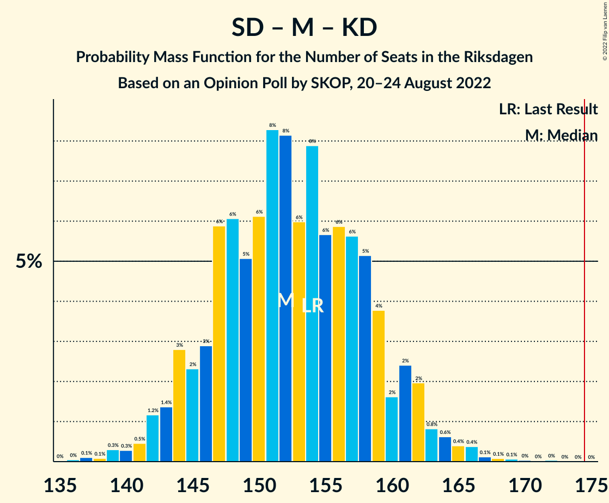

| Number of Seats | Probability | Accumulated | Special Marks |
|:---------------:|:-----------:|:-----------:|:-------------:|
| 136 | 0% | 100% |  |
| 137 | 0.1% | 99.9% |  |
| 138 | 0.1% | 99.8% |  |
| 139 | 0.3% | 99.7% |  |
| 140 | 0.3% | 99.4% |  |
| 141 | 0.5% | 99.1% |  |
| 142 | 1.2% | 98.7% |  |
| 143 | 1.4% | 98% |  |
| 144 | 3% | 96% |  |
| 145 | 2% | 93% |  |
| 146 | 3% | 91% |  |
| 147 | 6% | 88% |  |
| 148 | 6% | 82% |  |
| 149 | 5% | 76% |  |
| 150 | 6% | 71% |  |
| 151 | 8% | 65% | Median |
| 152 | 8% | 57% |  |
| 153 | 6% | 49% |  |
| 154 | 8% | 43% | Last Result |
| 155 | 6% | 35% |  |
| 156 | 6% | 29% |  |
| 157 | 6% | 23% |  |
| 158 | 5% | 18% |  |
| 159 | 4% | 12% |  |
| 160 | 2% | 9% |  |
| 161 | 2% | 7% |  |
| 162 | 2% | 5% |  |
| 163 | 0.8% | 3% |  |
| 164 | 0.6% | 2% |  |
| 165 | 0.4% | 1.1% |  |
| 166 | 0.4% | 0.8% |  |
| 167 | 0.1% | 0.4% |  |
| 168 | 0.1% | 0.3% |  |
| 169 | 0.1% | 0.2% |  |
| 170 | 0% | 0.1% |  |
| 171 | 0% | 0.1% |  |
| 172 | 0% | 0.1% |  |
| 173 | 0% | 0% |  |

### Sveriges socialdemokratiska arbetareparti – Vänsterpartiet – Miljöpartiet de gröna

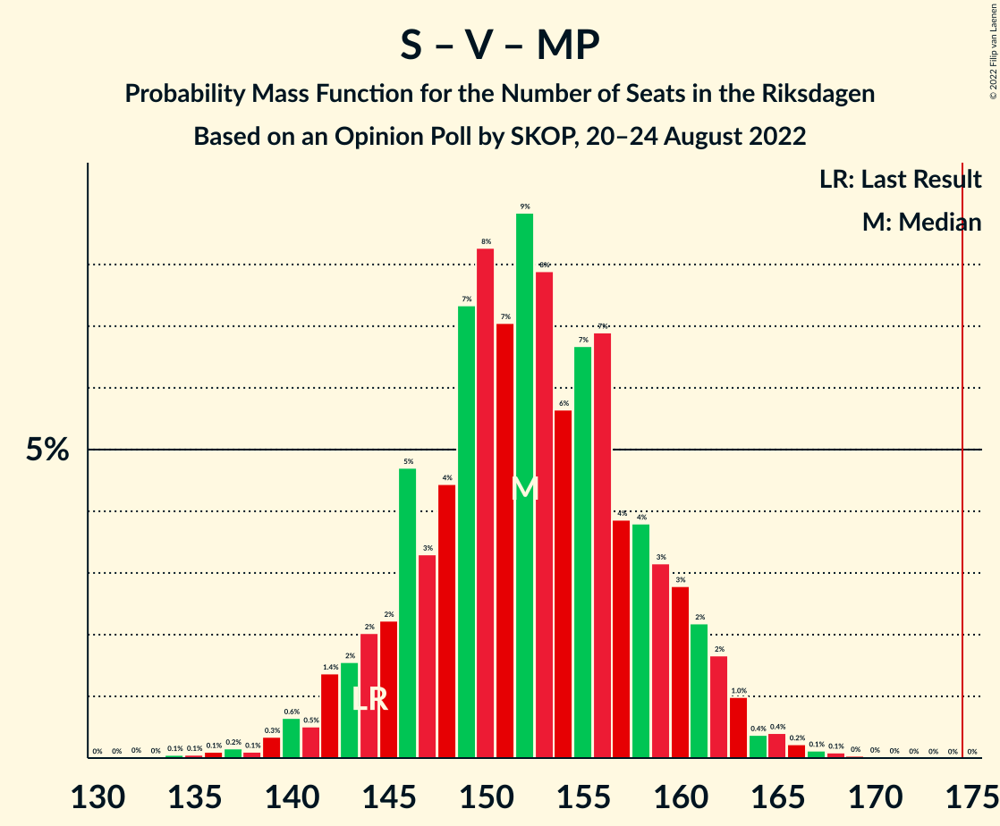

| Number of Seats | Probability | Accumulated | Special Marks |
|:---------------:|:-----------:|:-----------:|:-------------:|
| 133 | 0% | 100% |  |
| 134 | 0.1% | 99.9% |  |
| 135 | 0.1% | 99.9% |  |
| 136 | 0.1% | 99.8% |  |
| 137 | 0.2% | 99.7% |  |
| 138 | 0.1% | 99.6% |  |
| 139 | 0.3% | 99.5% |  |
| 140 | 0.6% | 99.1% |  |
| 141 | 0.5% | 98% |  |
| 142 | 1.4% | 98% |  |
| 143 | 2% | 97% |  |
| 144 | 2% | 95% | Last Result |
| 145 | 2% | 93% |  |
| 146 | 5% | 91% |  |
| 147 | 3% | 86% |  |
| 148 | 4% | 83% |  |
| 149 | 7% | 78% |  |
| 150 | 8% | 71% |  |
| 151 | 7% | 63% |  |
| 152 | 9% | 56% |  |
| 153 | 8% | 47% | Median |
| 154 | 6% | 39% |  |
| 155 | 7% | 33% |  |
| 156 | 7% | 27% |  |
| 157 | 4% | 20% |  |
| 158 | 4% | 16% |  |
| 159 | 3% | 12% |  |
| 160 | 3% | 9% |  |
| 161 | 2% | 6% |  |
| 162 | 2% | 4% |  |
| 163 | 1.0% | 2% |  |
| 164 | 0.4% | 1.3% |  |
| 165 | 0.4% | 0.9% |  |
| 166 | 0.2% | 0.5% |  |
| 167 | 0.1% | 0.3% |  |
| 168 | 0.1% | 0.2% |  |
| 169 | 0% | 0.1% |  |
| 170 | 0% | 0.1% |  |
| 171 | 0% | 0% |  |

### Sveriges socialdemokratiska arbetareparti – Vänsterpartiet

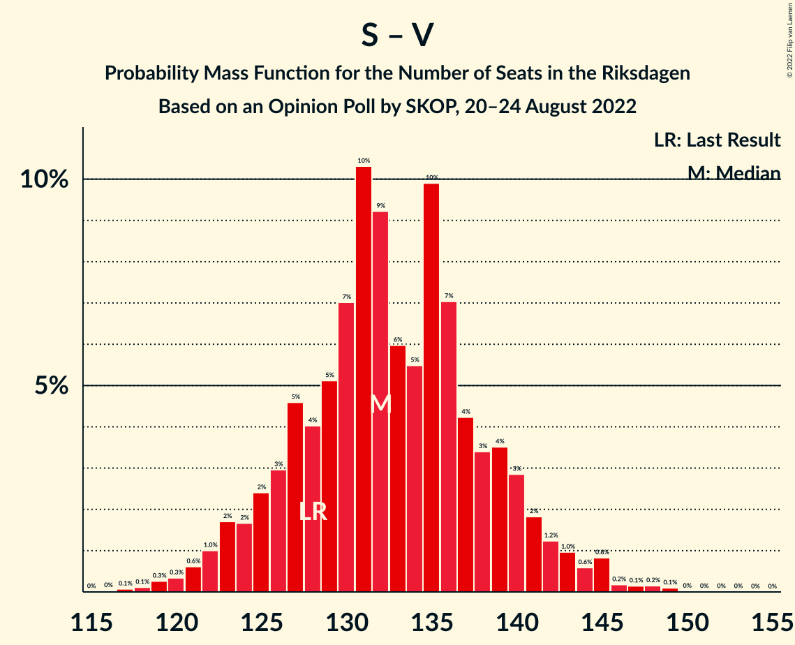

| Number of Seats | Probability | Accumulated | Special Marks |
|:---------------:|:-----------:|:-----------:|:-------------:|
| 116 | 0% | 100% |  |
| 117 | 0.1% | 99.9% |  |
| 118 | 0.1% | 99.9% |  |
| 119 | 0.3% | 99.8% |  |
| 120 | 0.3% | 99.5% |  |
| 121 | 0.6% | 99.1% |  |
| 122 | 1.0% | 98.5% |  |
| 123 | 2% | 98% |  |
| 124 | 2% | 96% |  |
| 125 | 2% | 94% |  |
| 126 | 3% | 92% |  |
| 127 | 5% | 89% |  |
| 128 | 4% | 84% | Last Result |
| 129 | 5% | 80% |  |
| 130 | 7% | 75% |  |
| 131 | 10% | 68% |  |
| 132 | 9% | 58% |  |
| 133 | 6% | 48% | Median |
| 134 | 5% | 43% |  |
| 135 | 10% | 37% |  |
| 136 | 7% | 27% |  |
| 137 | 4% | 20% |  |
| 138 | 3% | 16% |  |
| 139 | 4% | 12% |  |
| 140 | 3% | 9% |  |
| 141 | 2% | 6% |  |
| 142 | 1.2% | 4% |  |
| 143 | 1.0% | 3% |  |
| 144 | 0.6% | 2% |  |
| 145 | 0.8% | 1.5% |  |
| 146 | 0.2% | 0.6% |  |
| 147 | 0.1% | 0.5% |  |
| 148 | 0.2% | 0.3% |  |
| 149 | 0.1% | 0.2% |  |
| 150 | 0% | 0.1% |  |
| 151 | 0% | 0% |  |

### Moderata samlingspartiet – Kristdemokraterna – Liberalerna – Centerpartiet

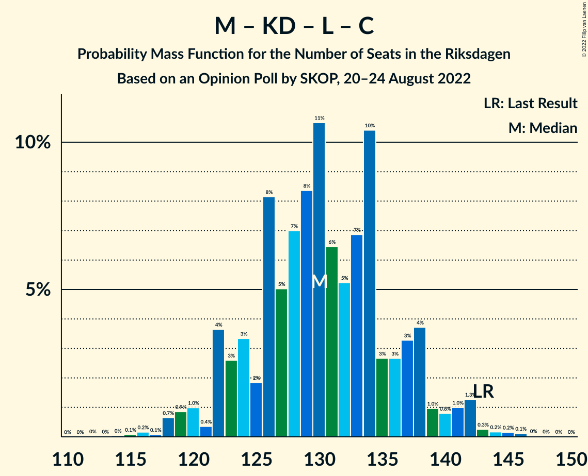

| Number of Seats | Probability | Accumulated | Special Marks |
|:---------------:|:-----------:|:-----------:|:-------------:|
| 113 | 0% | 100% |  |
| 114 | 0% | 99.9% |  |
| 115 | 0.1% | 99.9% |  |
| 116 | 0.2% | 99.8% |  |
| 117 | 0.1% | 99.7% |  |
| 118 | 0.7% | 99.6% |  |
| 119 | 0.9% | 98.9% |  |
| 120 | 1.0% | 98% |  |
| 121 | 0.4% | 97% |  |
| 122 | 4% | 97% |  |
| 123 | 3% | 93% |  |
| 124 | 3% | 90% |  |
| 125 | 2% | 87% |  |
| 126 | 8% | 85% |  |
| 127 | 5% | 77% |  |
| 128 | 7% | 72% |  |
| 129 | 8% | 65% | Median |
| 130 | 11% | 57% |  |
| 131 | 6% | 46% |  |
| 132 | 5% | 40% |  |
| 133 | 7% | 34% |  |
| 134 | 10% | 28% |  |
| 135 | 3% | 17% |  |
| 136 | 3% | 14% |  |
| 137 | 3% | 12% |  |
| 138 | 4% | 9% |  |
| 139 | 1.0% | 5% |  |
| 140 | 0.8% | 4% |  |
| 141 | 1.0% | 3% |  |
| 142 | 1.3% | 2% |  |
| 143 | 0.3% | 0.8% | Last Result |
| 144 | 0.2% | 0.5% |  |
| 145 | 0.2% | 0.4% |  |
| 146 | 0.1% | 0.2% |  |
| 147 | 0% | 0.1% |  |
| 148 | 0% | 0% |  |

### Sverigedemokraterna – Moderata samlingspartiet

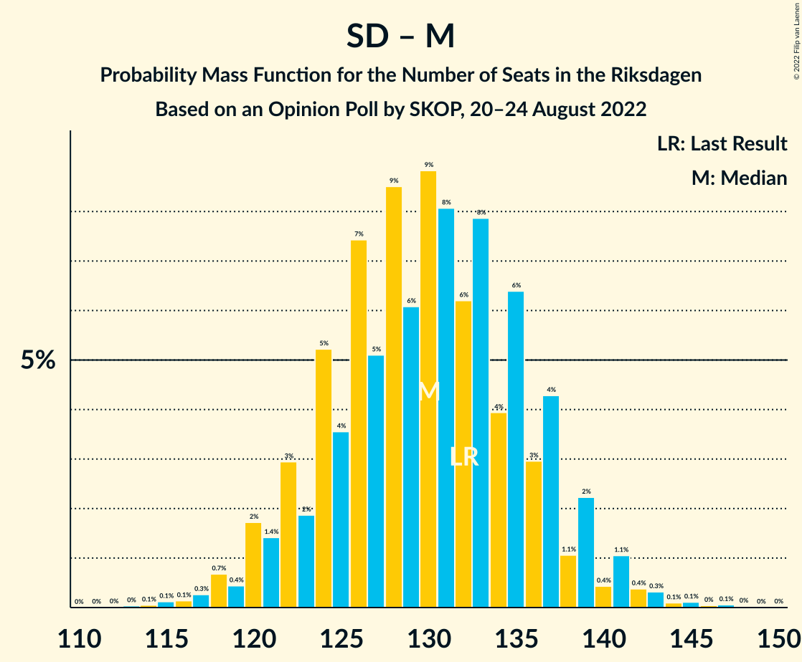

| Number of Seats | Probability | Accumulated | Special Marks |
|:---------------:|:-----------:|:-----------:|:-------------:|
| 113 | 0% | 100% |  |
| 114 | 0.1% | 99.9% |  |
| 115 | 0.1% | 99.9% |  |
| 116 | 0.1% | 99.8% |  |
| 117 | 0.3% | 99.6% |  |
| 118 | 0.7% | 99.4% |  |
| 119 | 0.4% | 98.7% |  |
| 120 | 2% | 98% |  |
| 121 | 1.4% | 97% |  |
| 122 | 3% | 95% |  |
| 123 | 2% | 92% |  |
| 124 | 5% | 90% |  |
| 125 | 4% | 85% |  |
| 126 | 7% | 82% |  |
| 127 | 5% | 74% |  |
| 128 | 9% | 69% |  |
| 129 | 6% | 60% | Median |
| 130 | 9% | 54% |  |
| 131 | 8% | 46% |  |
| 132 | 6% | 37% | Last Result |
| 133 | 8% | 31% |  |
| 134 | 4% | 23% |  |
| 135 | 6% | 19% |  |
| 136 | 3% | 13% |  |
| 137 | 4% | 10% |  |
| 138 | 1.1% | 6% |  |
| 139 | 2% | 5% |  |
| 140 | 0.4% | 3% |  |
| 141 | 1.1% | 2% |  |
| 142 | 0.4% | 1.1% |  |
| 143 | 0.3% | 0.7% |  |
| 144 | 0.1% | 0.4% |  |
| 145 | 0.1% | 0.3% |  |
| 146 | 0% | 0.2% |  |
| 147 | 0.1% | 0.1% |  |
| 148 | 0% | 0.1% |  |
| 149 | 0% | 0% |  |

### Sveriges socialdemokratiska arbetareparti – Miljöpartiet de gröna

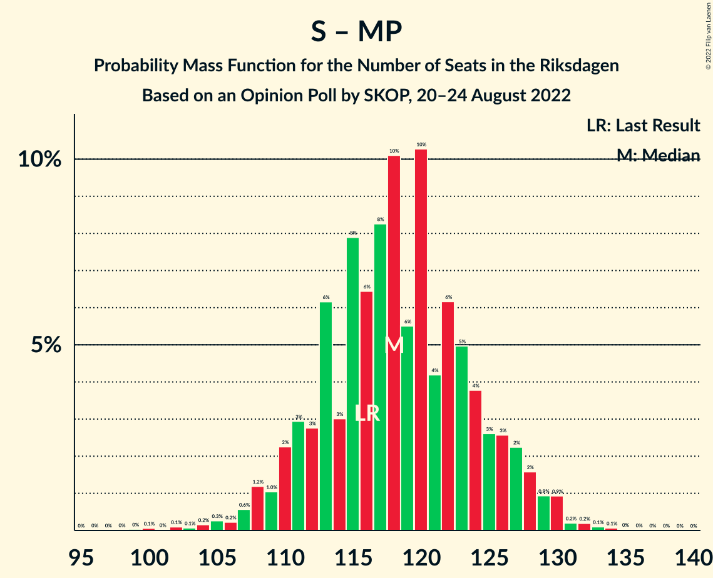

| Number of Seats | Probability | Accumulated | Special Marks |
|:---------------:|:-----------:|:-----------:|:-------------:|
| 98 | 0% | 100% |  |
| 99 | 0% | 99.9% |  |
| 100 | 0.1% | 99.9% |  |
| 101 | 0% | 99.8% |  |
| 102 | 0.1% | 99.8% |  |
| 103 | 0.1% | 99.7% |  |
| 104 | 0.2% | 99.7% |  |
| 105 | 0.3% | 99.5% |  |
| 106 | 0.2% | 99.2% |  |
| 107 | 0.6% | 99.0% |  |
| 108 | 1.2% | 98% |  |
| 109 | 1.0% | 97% |  |
| 110 | 2% | 96% |  |
| 111 | 3% | 94% |  |
| 112 | 3% | 91% |  |
| 113 | 6% | 88% |  |
| 114 | 3% | 82% |  |
| 115 | 8% | 79% |  |
| 116 | 6% | 71% | Last Result |
| 117 | 8% | 65% |  |
| 118 | 10% | 56% |  |
| 119 | 6% | 46% | Median |
| 120 | 10% | 41% |  |
| 121 | 4% | 31% |  |
| 122 | 6% | 26% |  |
| 123 | 5% | 20% |  |
| 124 | 4% | 15% |  |
| 125 | 3% | 11% |  |
| 126 | 3% | 9% |  |
| 127 | 2% | 6% |  |
| 128 | 2% | 4% |  |
| 129 | 0.9% | 2% |  |
| 130 | 0.9% | 2% |  |
| 131 | 0.2% | 0.6% |  |
| 132 | 0.2% | 0.4% |  |
| 133 | 0.1% | 0.2% |  |
| 134 | 0.1% | 0.1% |  |
| 135 | 0% | 0.1% |  |
| 136 | 0% | 0% |  |

### Moderata samlingspartiet – Liberalerna – Centerpartiet

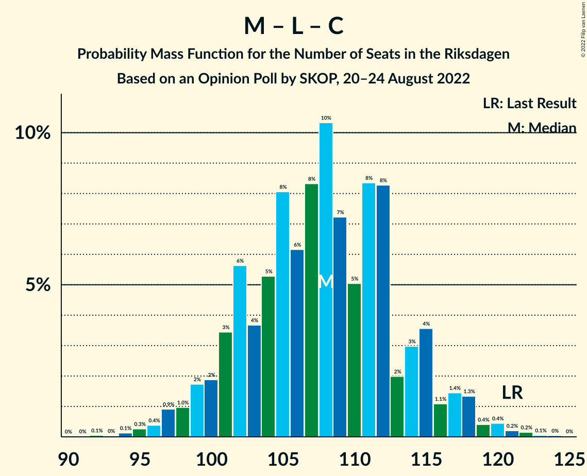

| Number of Seats | Probability | Accumulated | Special Marks |
|:---------------:|:-----------:|:-----------:|:-------------:|
| 92 | 0.1% | 100% |  |
| 93 | 0% | 99.9% |  |
| 94 | 0.1% | 99.9% |  |
| 95 | 0.3% | 99.7% |  |
| 96 | 0.4% | 99.5% |  |
| 97 | 0.9% | 99.1% |  |
| 98 | 1.0% | 98% |  |
| 99 | 2% | 97% |  |
| 100 | 2% | 95% |  |
| 101 | 3% | 94% |  |
| 102 | 6% | 90% |  |
| 103 | 4% | 85% |  |
| 104 | 5% | 81% |  |
| 105 | 8% | 76% |  |
| 106 | 6% | 67% |  |
| 107 | 8% | 61% | Median |
| 108 | 10% | 53% |  |
| 109 | 7% | 43% |  |
| 110 | 5% | 35% |  |
| 111 | 8% | 30% |  |
| 112 | 8% | 22% |  |
| 113 | 2% | 14% |  |
| 114 | 3% | 12% |  |
| 115 | 4% | 9% |  |
| 116 | 1.1% | 5% |  |
| 117 | 1.4% | 4% |  |
| 118 | 1.3% | 3% |  |
| 119 | 0.4% | 1.4% |  |
| 120 | 0.4% | 0.9% |  |
| 121 | 0.2% | 0.5% | Last Result |
| 122 | 0.2% | 0.3% |  |
| 123 | 0.1% | 0.1% |  |
| 124 | 0% | 0.1% |  |
| 125 | 0% | 0% |  |

### Moderata samlingspartiet – Kristdemokraterna – Centerpartiet

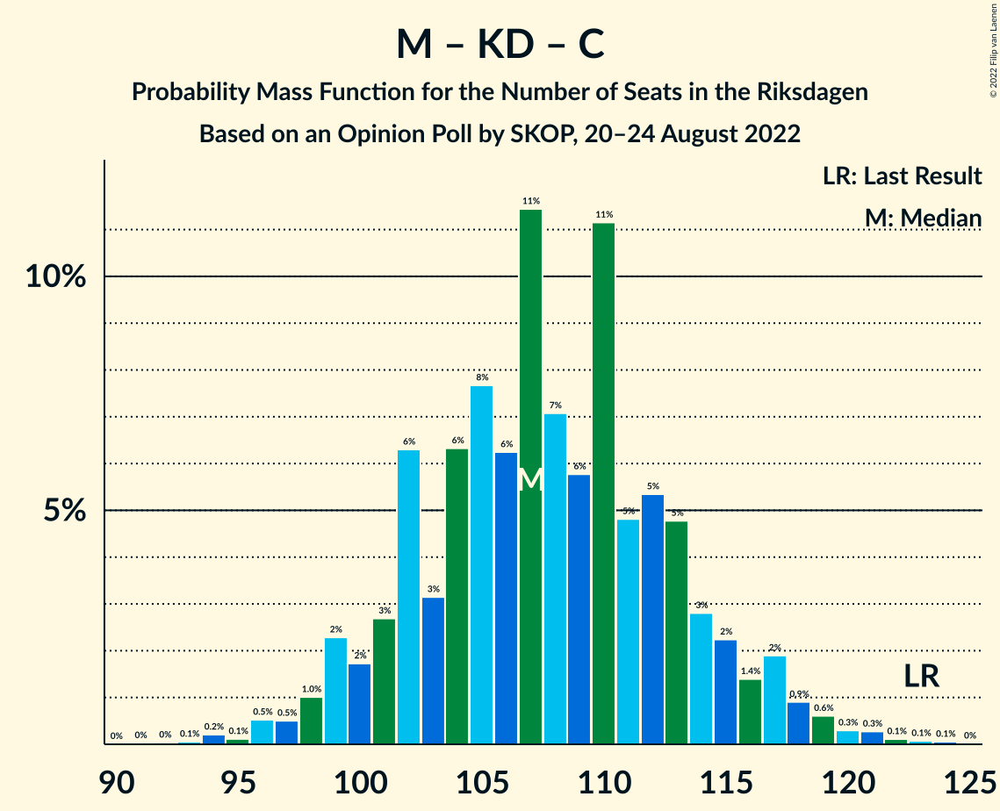

| Number of Seats | Probability | Accumulated | Special Marks |
|:---------------:|:-----------:|:-----------:|:-------------:|
| 91 | 0% | 100% |  |
| 92 | 0% | 99.9% |  |
| 93 | 0.1% | 99.9% |  |
| 94 | 0.2% | 99.9% |  |
| 95 | 0.1% | 99.6% |  |
| 96 | 0.5% | 99.5% |  |
| 97 | 0.5% | 99.0% |  |
| 98 | 1.0% | 98% |  |
| 99 | 2% | 97% |  |
| 100 | 2% | 95% |  |
| 101 | 3% | 93% |  |
| 102 | 6% | 91% |  |
| 103 | 3% | 84% |  |
| 104 | 6% | 81% |  |
| 105 | 8% | 75% |  |
| 106 | 6% | 67% | Median |
| 107 | 11% | 61% |  |
| 108 | 7% | 50% |  |
| 109 | 6% | 43% |  |
| 110 | 11% | 37% |  |
| 111 | 5% | 26% |  |
| 112 | 5% | 21% |  |
| 113 | 5% | 15% |  |
| 114 | 3% | 11% |  |
| 115 | 2% | 8% |  |
| 116 | 1.4% | 6% |  |
| 117 | 2% | 4% |  |
| 118 | 0.9% | 2% |  |
| 119 | 0.6% | 1.5% |  |
| 120 | 0.3% | 0.8% |  |
| 121 | 0.3% | 0.6% |  |
| 122 | 0.1% | 0.3% |  |
| 123 | 0.1% | 0.2% | Last Result |
| 124 | 0.1% | 0.1% |  |
| 125 | 0% | 0% |  |

### Moderata samlingspartiet – Centerpartiet

| Number of Seats | Probability | Accumulated | Special Marks |
|:---------------:|:-----------:|:-----------:|:-------------:|
| 70 | 0% | 100% |  |
| 71 | 0.1% | 99.9% |  |
| 72 | 0.1% | 99.9% |  |
| 73 | 0.3% | 99.8% |  |
| 74 | 0.4% | 99.6% |  |
| 75 | 0.7% | 99.2% |  |
| 76 | 0.9% | 98.5% |  |
| 77 | 2% | 98% |  |
| 78 | 3% | 96% |  |
| 79 | 3% | 93% |  |
| 80 | 4% | 90% |  |
| 81 | 8% | 85% |  |
| 82 | 5% | 78% |  |
| 83 | 10% | 72% |  |
| 84 | 6% | 62% | Median |
| 85 | 11% | 56% |  |
| 86 | 7% | 45% |  |
| 87 | 7% | 38% |  |
| 88 | 10% | 32% |  |
| 89 | 4% | 21% |  |
| 90 | 6% | 17% |  |
| 91 | 4% | 11% |  |
| 92 | 2% | 7% |  |
| 93 | 2% | 5% |  |
| 94 | 1.0% | 3% |  |
| 95 | 0.8% | 2% |  |
| 96 | 0.6% | 1.2% |  |
| 97 | 0.2% | 0.6% |  |
| 98 | 0.2% | 0.4% |  |
| 99 | 0.1% | 0.2% |  |
| 100 | 0.1% | 0.1% |  |
| 101 | 0% | 0% | Last Result |

## Technical Information

### Opinion Poll

+ **Polling firm:** SKOP
+ **Commissioner(s):** —
+ **Fieldwork period:** 20–24 August 2022

### Calculations

+ **Sample size:** 1118
+ **Simulations done:** 1,048,576
+ **Error estimate:** 0.91%

